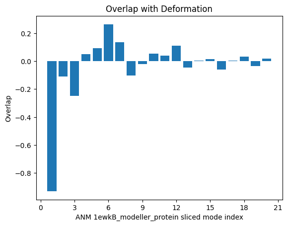
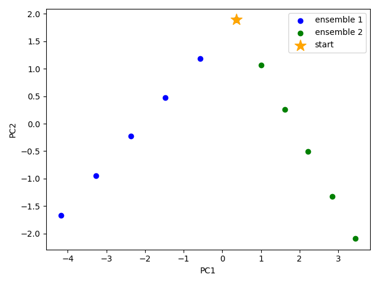
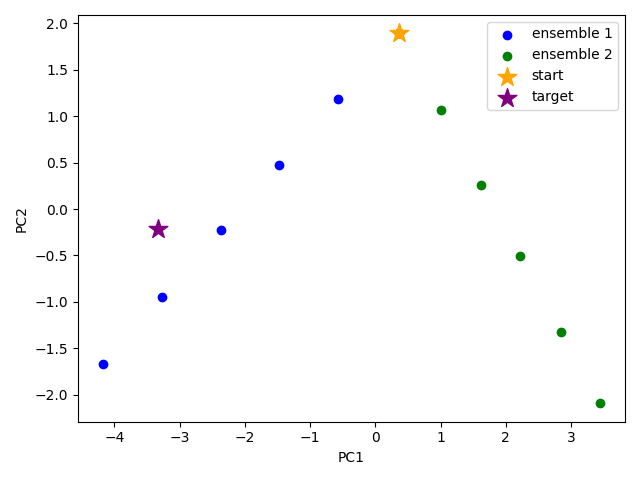
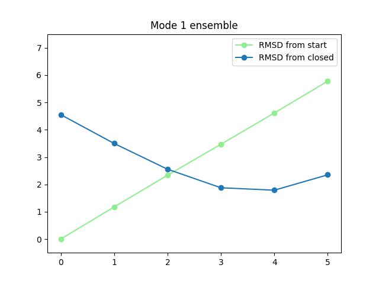
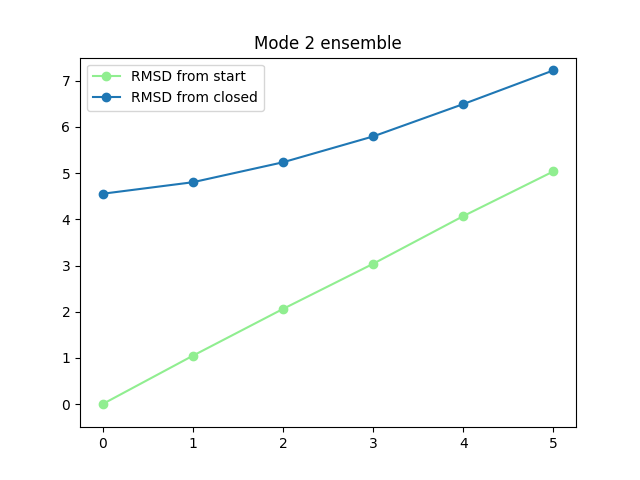

.. _anmd:

ANMD Simulation and Analysis
===============================================================================

First, we will make the following necessary imports ProDy_, NumPy_, and Matplotlib_ 
if you haven't already done it:

.. ipython:: python
   :verbatim:

   import numpy as np
   import matplotlib.pyplot as plt
   from prody import *
   plt.ion()

mGluR1 initial alignment and assessment of parameters
-------------------------------------------------------------------------------

We start our calculations by parsing the structure, from which we would like to sample 
conformations. For this tutorial, we use an initial structure of the metabotropic glutamate 
receptor 1 (mGluR1) N-terminal venus fly trap domain (VFTD) in the open conformation (chain B from PDB structure 1ewk)
with missing loops modelled by MODELLER [FA00]_. This file is available in the following archives can be used to follow this tutorial:

  * `ANMD Tutorial Files (TGZ) <anmd_tutorial_files.tgz>`_
  * `ANMD Tutorial Files (ZIP) <anmd_tutorial_files.zip>`_

In the extracted directory, you will find the two PDB files that we will parse here. 
The first one is the open chain model 1ewkB_modeller_protein.pdb, which we will use for ANMD. 
The second is the closed chain 1ewkA_protein_trim.pdb, which we compare against. This already
has the ligand L-glutamate and an extra C-terminal residue that isn't in chain B trimmed away.

.. ipython:: python
   :verbatim:

   ag1 = parsePDB('1ewkB_modeller_protein.pdb')

.. parsed-literal::

   @> 3775 atoms and 1 coordinate set(s) were parsed in 0.03s.
   
Before running ANMD, we first parse the closed chain in the closed state to evaluate 
what RMSD and which ANM modes are required for the clamshell closure transition.

.. ipython:: python
   :verbatim:

   ag2 = parsePDB('1ewkA_protein_trim.pdb')

.. parsed-literal::

   @> 3552 atoms and 1 coordinate set(s) were parsed in 0.03s.

To do this, we find the matching atoms between the chains and superpose them and calculate 
a deformation vector and compare it to the ANM modes from the starting model.

As we only have extra atoms in the open chain model, corresponding to the modelled top loop, 
we can just align that chain to the closed chain.

.. ipython:: python
   :verbatim:

   amap = alignChains(ag1.ca, ag2.ca)[0]
   amap_alg, T = superpose(amap, ag2.ca, weights=amap.getFlags('mapped'))
   rmsd = calcRMSD(amap, ag2.ca)

.. parsed-literal::

   @> Trying to map atoms based on residue numbers and identities:
   @>   Comparing Chain A from 1ewkB_modeller_protein (len=476) with Chain A from 1ewkA_protein_trim:
   @>      Mapped: 447 residues match with 100% sequence identity and 100% overlap.
   @> Finding the atommaps based on their coverages...
   @> Identified that there exists 1 atommap(s) potentially.

We find an RMSD of 4.5 :raw-math:`$\mathring{A}$`, so we will select a maximum RMSD that is higher than
this: 6 :raw-math:`$\mathring{A}$`.

We next calculate the ANM modes for the full system and slice them with a selection based on 
this atom map to compare against the deformation vector.

.. ipython:: python
   :verbatim:

   anm, ag1_ca = calcANM(ag1)

.. parsed-literal::

   @> Hessian was built in 0.15s.
   @> 20 modes were calculated in 0.15s.

.. ipython:: python
   :verbatim:

   ag1_selection = ag1.select('index ' + ' '.join([str(i) for i in amap.getIndices()]))
   anm_slc, ag1_ca_slc = sliceModel(anm, ag1_ca, ag1_selection)

.. ipython:: python
   :verbatim:

   defvec = calcDeformVector(ag1_selection, ag2.ca)
   showOverlap(defvec, anm_slc, abs=False)

We see that the 1st mode (index 0 in Python) has a strong negative overlap, so 
we will focus on this mode for ANMD. We will also use the 2nd mode (index 1 in Python) 
to illustrate that the method can traverse multiple modes in the same execution.

Running an ANMD simulation
-------------------------------------------------------------------------------

ANMD is implemented as a ProDy function called :function:`.runAMND`. The main parameters 
regarding the main steps of the method are as follows:

   ``atoms`` : a complete atomic model for the calculations. It is ok to be missing 
   some side chain atoms and hydrogens, but not fragments, such as loops.

   ``num_modes`` : Number of global modes for sampling (default is 2).

   ``num_steps`` : Number of steps along each mode in each direction (default is 5).

   ``max_rmsd`` : Maximum RMSD for the first global mode in :raw-math:`$\mathring{A}$`
   (default is 2). Successive modes are downscaled to lower RMSDs based on their frequency. 

   ``skip_modes`` : Number of modes to skip if the first modes are not interesting.

   ``tolerance`` : Energy tolerance to be used for performing a local energy minimization 
   on the system in kJ/mole (default is 10.0).

   ``anm`` : Optional input of your own NMA or ModeSet object to use instead

Other keyword options are also possible for controlling traverse mode:

   ``pos`` : whether to include steps in the positive mode direction, default is **True**

   ``neg`` : whether to include steps in the negative mode direction, default is **True**

   ``reverse`` : whether to reverse the direction default is **False**

In the following, we will perform ANMD simulations with 5 steps up to a maximum RMSD of 6
:raw-math:`$\mathring{A}$` using the first 2 global modes. This means that the first mode has
5 steps of 1.2 :raw-math:`$\mathring{A}$`, while the second mode has slightly smaller steps.

Relaxation of conformers is carried out in implicit solvent via energy minimization only. 
Simulation details will be printed out during execution.

We also use keyword options of :func:`.traverseMode` to control the direction along the modes
and the output ensemble. The default pos=True, neg=True and reverse=False leads to ensembles 
with 5 conformations in the negative direction ordered such that the most extreme one is first 
and the last one is closest to the starting conformation, then the starting conformation,
then 5 conformations in the positive direction, giving a total of 11 conformations.

In this case, we only want to follow the negative direction along these modes, so we set
pos=False. We also set reverse=True, meaning that rather than starting at the negative extreme
of the mode and ordering to approach towards the starting structure, the trajectories start 
at the starting structure and approach towards the negative extreme.

.. ipython:: python
   :verbatim:

   ensembles = runANMD(ag1, max_rmsd=6, num_modes=2, num_steps=5, 
                       neg=True, pos=False, reverse=True)

.. parsed-literal::

   Warning: importing 'simtk.openmm' is deprecated.  Import 'openmm' instead.
   @> 
   Fixed structure found
   @> 
   Minimised fixed structure found
   @> 7479 atoms and 1 coordinate set(s) were parsed in 0.07s.
   @> Hessian was built in 0.14s.
   @> 2 modes were calculated in 0.28s.
   @> Parameter: rmsd = 6.00 A
   @> Parameter: n_steps = 5
   @> Step size is 1.20 A RMSD
   @> Mode is scaled by 31.21526594789081.
   @> 
   Minimising 6 conformers for mode 0 ...
   @> 
   Minimising structure 1 along mode 0 ...
   @> The structure was minimised in 31.22s.
   @> 
   Minimising structure 2 along mode 0 ...
   @> The structure was minimised in 132.40s.
   @> 
   Minimising structure 3 along mode 0 ...
   @> The structure was minimised in 171.45s.
   @> 
   Minimising structure 4 along mode 0 ...
   @> The structure was minimised in 286.93s.
   @> 
   Minimising structure 5 along mode 0 ...
   @> The structure was minimised in 366.90s.
   @> 
   Minimising structure 6 along mode 0 ...
   @> The structure was minimised in 459.04s.
   @> Parameter: rmsd = 5.45 A
   @> Parameter: n_steps = 5
   @> Step size is 1.09 A RMSD
   @> Mode is scaled by 31.215268055351423.
   @> 
   Minimising 6 conformers for mode 1 ...
   @> 
   Minimising structure 1 along mode 1 ...
   @> The structure was minimised in 30.34s.
   @> 
   Minimising structure 2 along mode 1 ...
   @> The structure was minimised in 126.45s.
   @> 
   Minimising structure 3 along mode 1 ...
   @> The structure was minimised in 191.12s.
   @> 
   Minimising structure 4 along mode 1 ...
   @> The structure was minimised in 1064.22s.
   @> 
   Minimising structure 5 along mode 1 ...
   @> The structure was minimised in 327.64s.
   @> 
   Minimising structure 6 along mode 1 ...
   @> The structure was minimised in 413.48s.

We can also save these using the :func:`.saveEnsemble` method and also write them to PDB files:

.. ipython:: python
   :verbatim:

   for i, ensemble in enumerate(ensembles):
      writePDB('1ewkB_mode_{0}_ensemble.pdb'.format(i), ensemble)
      saveEnsemble(ensemble, '1ewkB_mode_{0}_ensemble.ens.npz'.format(i))

.. parsed-literal::

   '1ewkB_mode_0_ensemble.ens.npz'
   '1ewkB_mode_1_ensemble.ens.npz'

One can also load the previously saved ensemble using :meth:`.loadEnsemble`
or :meth:`.parsePDB`.

.. ipython:: python
   :verbatim:

   ensembles = [Ensemble(parsePDB('1ewkB_mode_{0}_ensemble.pdb'.format(i))) for i in range(2)]
   ensembles

.. parsed-literal::

   @> 7479 atoms and 6 coordinate set(s) were parsed in 0.19s.
   @> 7479 atoms and 6 coordinate set(s) were parsed in 0.16s.

   [<Ensemble: AtomGroup 1ewkB_mode_0_ensemble (6 conformations; 7479 atoms)>,
    <Ensemble: AtomGroup 1ewkB_mode_1_ensemble (6 conformations; 7479 atoms)>]

Analysing the results
-------------------------------------------------------------------------------

We would like to show how the computed conformers populate the conformational space as regards 
the essential dynamics of the structure. For this aim, we perform a principal component analysis 
(PCA) on the generated ensemble. Next, we will project the conformers onto the space spanned by 
the first two PCs, which explain the highest variance of the ensemble. This can be done using 
`ProDy ensemble analysis <http://prody.csb.pitt.edu/tutorials/ensemble_analysis/>`_.

We are calculating PCs based on the C\ :math:`^\alpha`-atoms and excluding the extra loop. 
This selection can be done directly on the Ensemble objects but we also add the two ensembles together.

.. ipython:: python
   :verbatim:

   full_ensemble = ensembles[0] + ensembles[1]
   full_ensemble.setAtoms(ag1_ca_sel)

   for ensemble in ensembles:
      ensemble.setAtoms(ag1_ca_sel)

.. ipython:: python
   :verbatim:

   full_ensemble

.. parsed-literal::

   <Ensemble: AtomGroup 1ewkB_mode_0_ensemble + AtomGroup 1ewkB_mode_1_ensemble (12 conformations; selected 447 of 7479 atoms)>

Next, prior to PCA, we perform an iterative superposition to align the full ensemble onto 
converged average coordinates.

.. ipython:: python
   :verbatim:

   full_ensemble.iterpose()

   for ensemble in ensembles:
      ensemble.setCoords(full_ensemble.getCoords(selected=False))
      ensemble.superpose()

.. ipython:: python
   :verbatim:

   pca = PCA()
   pca.buildCovariance(full_ensemble)
   pca.calcModes()

.. parsed-literal::

   @> Covariance is calculated using 12 coordinate sets.
   @> Covariance matrix calculated in 0.186342s.
   @> 10 modes were calculated in 0.16s.

We can observe the progression of the conformers by coloring them by successive modes.

.. ipython:: python
   :verbatim:

   colors = ['blue', 'green']
   plt.figure()

   for i in range(len(ensembles)):
      showProjection(ensembles[i], pca[:2],
                     c=colors[i], label='ensemble %d' %(i+1))
   showProjection(ensembles[0][0], pca[:2], c='orange',
                  label='start', marker='*', markersize=200)
   plt.xlabel('PC1')
   plt.ylabel('PC2')
   plt.legend()
   plt.tight_layout()
   plt.show()

The median and maximum RMSDs with respect to the initial conformer can be calculated 
for the combined full ensemble as follows

.. ipython:: python
   :verbatim:

   rmsds = full_ensemble.getRMSDs()

.. ipython:: python
   :verbatim:

   np.median(rmsds), np.max(rmsds)

.. parsed-literal::

   (2.7045534338432105, 5.733287945495706)

We want to also observe if our conformers approach the closed state of the mGluR1 VFTD. 
As one way to check this, the closed chain (1ewkA that we loaded before) is projected onto 
the same subspace of 2 PCs.

We therefore need to convert the atomic object to an ensemble one with the CA atoms, and
superpose it onto the average coordinates.

.. ipython:: python
   :verbatim:

   ens2 = Ensemble(ag2.ca.copy())
   ens2.setCoords(full_ensemble.getCoords(selected=True))
   ens2.superpose()

Now, we can plot as before with an extra showProjection command for the target structure
as an ensemble onto the two PCs.

.. ipython:: python
   :verbatim:

   colors = ['blue', 'green']
   plt.figure()

   for i in range(len(ensembles)):
      showProjection(ensembles[i], pca[:2],
                     c=colors[i], label='ensemble %d' %(i+1))
   showProjection(full_ensemble[0], pca[:2], c='orange',
                  label='start', marker='*', markersize=200)
   showProjection(ens2, pca[:2], c='purple',
                  label='target', marker='*', markersize=200)
   plt.xlabel('PC1')
   plt.ylabel('PC2')
   plt.legend()
   plt.tight_layout()
   plt.show()

The figure above indicates that conformer generation along mode 1 starting from the open 
state of mGluR1 (orange star) can successfully reach conformations near the closed state 
(purple star). 

One could also calculate RMSDs from the closed state by setting the closed coordinates as 
the reference coordinates for the ensembles. To do this, we need to first make a coordinates
set with the right shape by adding dummy coordinates using alignChains.

.. ipython:: python
   :verbatim:

   ag3 = ensembles[0].getAtoms(selected=False)
   amap2 = alignChains(ag2, ag3)[0]
   amap2

.. parsed-literal::

   <AtomMap: (Chain A from 1ewkA_protein_trim -> Chain A from 1ewkB_mode_0_ensemble) from 1ewkA_protein_trim (7479 atoms, 3552 mapped, 3927 dummy)>

Now, we can use this get the RMSDs from the starting and target states.

.. ipython:: python
   :verbatim:

   rmsds_from_start = np.zeros((2,6))
   rmsds_from_closed = np.zeros((2,6))
   for i, ensemble in enumerate(ensembles):
      ensemble.setCoords(ensemble.getCoordsets(selected=False)[0])
      rmsds_from_start[i] = ensemble.getRMSDs()

      ensemble.setCoords(amap2.getCoords())
      rmsds_from_closed[i] = ensemble.getRMSDs()

      plt.figure()
      plt.title('Mode {0} ensemble'.format(i+1))
      plt.plot(rmsds_from_start[i], 'o-', label='RMSD from start', color='lightgreen')
      plt.plot(rmsds_from_closed[i], 'o-', label='RMSD from closed')
      plt.ylim([-0.5, 7.5])
      plt.legend()

.. [FA00] Fiser A, Do RKG, Sali A. Modeling of loops in protein 
   structures. *Protein science* **2000** 9:1753-73
