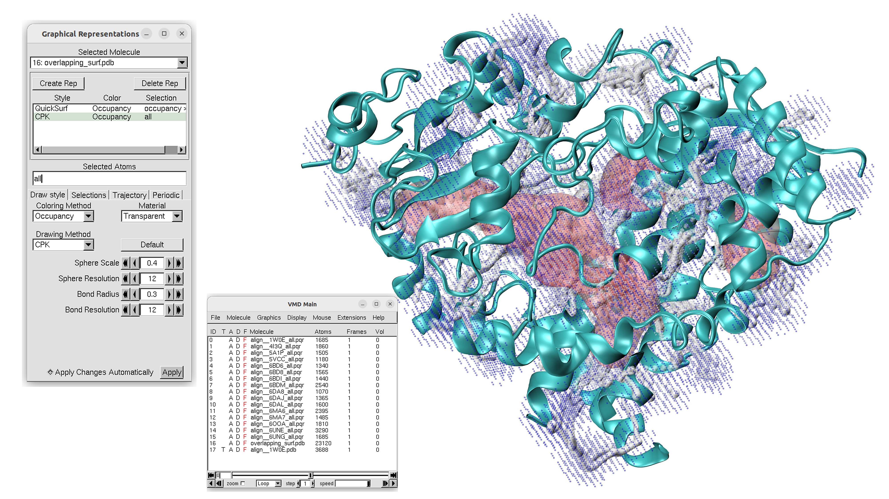
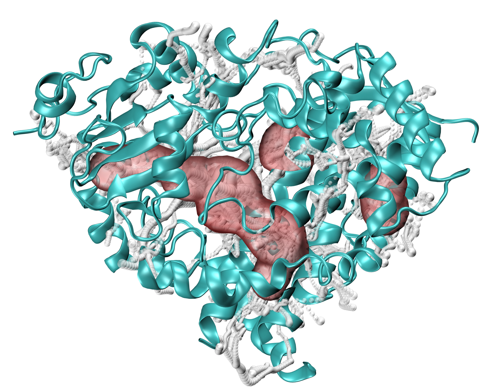

.. _cavitracer_single:

Detection of intraprotein channels across heterogeneous structures
===============================================================================

Now, we will illustrate how to detect channels across various PDB structures.
As an example, we will also Cytochrome P450. 

First, we will provide a list of PDB codes with different Cytochrome P450
structures. Such a list can be also provided by BLAST, Dali, or Foldseek
(see :func:`.runBLAST`, :func:`.runDali`, :func:`.runFoldseek` in the
`InSty tutorial`_).

.. ipython:: python
   :verbatim:

   pdb_files = ["1TQN", "1W0E", "4I3Q", "5A1P", "5VCC", "6BD6", "6BD8", "6BDI", 
            "6BDM", "6DA8", "6DAJ", "6DAL", "6MA6", "6MA7", "6OOA", "6UNE", "6UNG"]

Protein preparation
-------------------------------------------------------------------------------

Before performing the analysis, we will align all the structures onto the first
structure and save it under a new name with ``align__`` prefix. Such an approach
was also shown in other ProDy tutorials and explained in detail (see
Structure Composition of the `Structure Analysis tutorial`_).

.. ipython:: python
   :verbatim:

   structures = parsePDB(pdb_files)
   target = structures[0]
   rmsds = []

   for mobile in structures[1:]:
       try:
           i = mobile.getTitle()
           print (i)
           matches = matchChains(mobile.protein, target.protein, subset='bb')
           m = matches[0]
           m0_alg, T = superpose(m[0], m[1], weights=m[0].getFlags("mapped"))
           rmsds.append(calcRMSD(m[0], m[1], weights=m[0].getFlags("mapped")))
           writePDB('align__'+i+'.pdb', mobile)
       except: pass

.. parsed-literal::

   @> 17 PDBs were parsed in 39.35s.
   @> Checking AtomGroup 1W0E: 1 chains are identified
   @> Checking AtomGroup 1TQN: 1 chains are identified
   @> Trying to match chains based on residue numbers and names:
   @>   Comparing Chain A from 1W0E (len=450) and Chain A from 1TQN (len=468):
   @> 	Match: 447 residues match with 99% sequence identity and 96% overlap.
   
   1W0E
   4I3Q
   
   @> Checking AtomGroup 4I3Q: 1 chains are identified
   @> Checking AtomGroup 1TQN: 1 chains are identified
   @> Trying to match chains based on residue numbers and names:
   @>   Comparing Chain A from 4I3Q (len=465) and Chain A from 1TQN (len=468):
   @> 	Match: 465 residues match with 100% sequence identity and 99% overlap.
   @> Checking AtomGroup 5A1P: 1 chains are identified
   @> Checking AtomGroup 1TQN: 1 chains are identified
   @> Trying to match chains based on residue numbers and names:
   @>   Comparing Chain A from 5A1P (len=465) and Chain A from 1TQN (len=468):
   @> 	Match: 463 residues match with 100% sequence identity and 99% overlap.
   
   5A1P
   5VCC
   
   @> Checking AtomGroup 5VCC: 1 chains are identified
   @> Checking AtomGroup 1TQN: 1 chains are identified
   @> Trying to match chains based on residue numbers and names:
   @>   Comparing Chain A from 5VCC (len=457) and Chain A from 1TQN (len=468):
   @> 	Match: 457 residues match with 100% sequence identity and 98% overlap.
   @> Checking AtomGroup 6BD6: 1 chains are identified
   @> Checking AtomGroup 1TQN: 1 chains are identified
   @> Trying to match chains based on residue numbers and names:
   @>   Comparing Chain A from 6BD6 (len=457) and Chain A from 1TQN (len=468):
   @> 	Match: 457 residues match with 100% sequence identity and 98% overlap.

   6BD6
   6BD8

   @> Checking AtomGroup 6BD8: 1 chains are identified
   @> Checking AtomGroup 1TQN: 1 chains are identified
   @> Trying to match chains based on residue numbers and names:
   @>   Comparing Chain A from 6BD8 (len=457) and Chain A from 1TQN (len=468):
   @> 	Match: 457 residues match with 100% sequence identity and 98% overlap.
   @> Checking AtomGroup 6BDI: 1 chains are identified
   @> Checking AtomGroup 1TQN: 1 chains are identified
   @> Trying to match chains based on residue numbers and names:
   @>   Comparing Chain A from 6BDI (len=462) and Chain A from 1TQN (len=468):
   @> 	Match: 461 residues match with 100% sequence identity and 99% overlap.

   6BDI
   6BDM

   @> Checking AtomGroup 6BDM: 1 chains are identified
   @> Checking AtomGroup 1TQN: 1 chains are identified
   @> Trying to match chains based on residue numbers and names:
   @>   Comparing Chain A from 6BDM (len=456) and Chain A from 1TQN (len=468):
   @> 	Match: 456 residues match with 100% sequence identity and 97% overlap.
   @> Checking AtomGroup 6DA8: 1 chains are identified
   @> Checking AtomGroup 1TQN: 1 chains are identified
   @> Trying to match chains based on residue numbers and names:
   @>   Comparing Chain A from 6DA8 (len=451) and Chain A from 1TQN (len=468):
   @> 	Match: 450 residues match with 100% sequence identity and 96% overlap.
   @> Checking AtomGroup 6DAJ: 1 chains are identified

   6DA8
   6DAJ

   @> Checking AtomGroup 1TQN: 1 chains are identified
   @> Trying to match chains based on residue numbers and names:
   @>   Comparing Chain A from 6DAJ (len=451) and Chain A from 1TQN (len=468):
   @> 	Match: 450 residues match with 100% sequence identity and 96% overlap.
   @> Checking AtomGroup 6DAL: 1 chains are identified
   @> Checking AtomGroup 1TQN: 1 chains are identified
   @> Trying to match chains based on residue numbers and names:
   @>   Comparing Chain A from 6DAL (len=454) and Chain A from 1TQN (len=468):
   @> 	Match: 453 residues match with 100% sequence identity and 97% overlap.
   @> Checking AtomGroup 6MA6: 1 chains are identified

   6DAL
   6MA6

   @> Checking AtomGroup 1TQN: 1 chains are identified
   @> Trying to match chains based on residue numbers and names:
   @>   Comparing Chain A from 6MA6 (len=466) and Chain A from 1TQN (len=468):
   @> 	Match: 464 residues match with 100% sequence identity and 99% overlap.
   @> Checking AtomGroup 6MA7: 1 chains are identified
   @> Checking AtomGroup 1TQN: 1 chains are identified
   @> Trying to match chains based on residue numbers and names:
   @>   Comparing Chain A from 6MA7 (len=463) and Chain A from 1TQN (len=468):
   @> 	Match: 461 residues match with 99% sequence identity and 99% overlap.
   @> Checking AtomGroup 6OOA: 1 chains are identified

   6MA7
   6OOA

   @> Checking AtomGroup 1TQN: 1 chains are identified
   @> Trying to match chains based on residue numbers and names:
   @>   Comparing Chain A from 6OOA (len=452) and Chain A from 1TQN (len=468):
   @> 	Match: 452 residues match with 100% sequence identity and 97% overlap.
   @> Checking AtomGroup 6UNE: 1 chains are identified
   @> Checking AtomGroup 1TQN: 1 chains are identified
   @> Trying to match chains based on residue numbers and names:
   @>   Comparing Chain A from 6UNE (len=452) and Chain A from 1TQN (len=468):
   @> 	Match: 452 residues match with 100% sequence identity and 97% overlap.
   @> Checking AtomGroup 6UNG: 1 chains are identified

   6UNE
   6UNG
   ..
   ..

The names of the structurally aligned PDBs are further uploaded into ``pdb_files_new``.
This operation is required if we want to compare the localization of channels in
various PDB models.

.. ipython:: python
   :verbatim:

   from pathlib import Path
   pdb_files_new = [p.name for p in Path(".").glob("align__*.pdb")]
   pdb_files_new

.. parsed-literal::

   ['align__6OOA.pdb',
    'align__6BD8.pdb',
    'align__6BD6.pdb',
    'align__6BDI.pdb',
    'align__6DAJ.pdb',
    'align__5A1P.pdb',
    'align__6BDM.pdb',
    'align__6DA8.pdb',
    'align__4I3Q.pdb',
    'align__6UNG.pdb',
    'align__6UNE.pdb',
    'align__6DAL.pdb',
    'align__6MA6.pdb',
    'align__1W0E.pdb',
    'align__6MA7.pdb',
    'align__5VCC.pdb']

Channels prediction
-------------------------------------------------------------------------------

Now, all PDB structures can be analyzed to detect channels, tunnels, or
pores in the protein structure using :func:`.calcChannels`. In this example,
the results will be saved in one file (all detected channels in ``.pqr``
file with the name of the input file) and in multiple files (``separate``
must be set to ``True``) to save each detected channel independently.
Additionally, we will use :func:`.getChannelParameters` and
:func:`.getChannelResidueNames` to obtain information about channel
parameters and residues involved in its formation. To save this information
in the local directory, we provide ``param_file_name`` and
``residues_file_name``.

.. ipython:: python
   :verbatim:

   for i in pdb_files_new:
       base_name = pdb_files_new[0]
       atoms = parsePDB(i).select('protein')
       channels2, surface2 = calcChannels(atoms, output_path=i[:-4], separate=True)
       getChannelParameters(channels2, param_file_name=i[:-4])
       getChannelResidueNames(atoms, channels2, residues_file_name=i[:-4])

.. parsed-literal::

   @> 3727 atoms and 1 coordinate set(s) were parsed in 0.06s.
   @> Detected 11 channels.
   @> Saving multiple results to directory ..
   @> Channel ID: 	Volume [ų] 	Length [Å] 	Bottleneck [Å]
   @> channel 0: 	476.65 		37.88 		1.19
   @> channel 1: 	812.54 		55.68 		1.19
   @> channel 2: 	468.4 		37.98 		1.19
   @> channel 3: 	900.79 		79.98 		1.16
   @> channel 4: 	157.11 		16.23 		1.19
   @> channel 5: 	301.27 		34.04 		1.21
   @> channel 6: 	320.77 		35.19 		1.21
   @> channel 7: 	418.67 		32.05 		1.37
   @> channel 8: 	305.17 		25.08 		1.17
   @> channel 9: 	344.82 		28.58 		1.18
   @> channel 10: 	178.86 		28.58 		1.16
   @> 3800 atoms and 1 coordinate set(s) were parsed in 0.06s.
   @> 3890 atoms and 1 coordinate set(s) were parsed in 0.05s.
   @> 3790 atoms and 1 coordinate set(s) were parsed in 0.05s.
   @> 3930 atoms and 1 coordinate set(s) were parsed in 0.05s.
   @> 3730 atoms and 1 coordinate set(s) were parsed in 0.05s.
   @> 3755 atoms and 1 coordinate set(s) were parsed in 0.05s.
   @> 3820 atoms and 1 coordinate set(s) were parsed in 0.05s.
   @> 3740 atoms and 1 coordinate set(s) were parsed in 0.05s.
   @> 3755 atoms and 1 coordinate set(s) were parsed in 0.05s.
   @> 3765 atoms and 1 coordinate set(s) were parsed in 0.05s.
   @> 3765 atoms and 1 coordinate set(s) were parsed in 0.05s.
   @> 3756 atoms and 1 coordinate set(s) were parsed in 0.05s.
   @> Detected 9 channels.
   @> Saving multiple results to directory ..
   @> Channel ID: 	Volume [ų] 	Length [Å] 	Bottleneck [Å]
   @> channel 0: 	253.61 		24.65 		1.27
   @> channel 1: 	417.39 		39.5 		1.27
   @> channel 2: 	1352.48 		60.93 		1.34
   @> channel 3: 	1311.03 		63.49 		1.24
   @> channel 4: 	1027.73 		46.22 		1.34
   @> channel 5: 	534.62 		53.32 		1.22
   @> channel 6: 	194.56 		16.8 		1.18
   @> channel 7: 	257.68 		20.12 		1.18
   @> channel 8: 	131.27 		13.21 		1.24
   @> 3795 atoms and 1 coordinate set(s) were parsed in 0.05s.
   @> 3845 atoms and 1 coordinate set(s) were parsed in 0.05s.
   @> 3950 atoms and 1 coordinate set(s) were parsed in 0.05s.
   @> 3960 atoms and 1 coordinate set(s) were parsed in 0.05s.
   @> 3900 atoms and 1 coordinate set(s) were parsed in 0.05s.
   @> 3900 atoms and 1 coordinate set(s) were parsed in 0.05s.
   @> 3770 atoms and 1 coordinate set(s) were parsed in 0.05s.
   @> 3775 atoms and 1 coordinate set(s) were parsed in 0.05s.
   @> 3745 atoms and 1 coordinate set(s) were parsed in 0.05s.
   @> 3746 atoms and 1 coordinate set(s) were parsed in 0.05s.
   @> Detected 7 channels.
   @> Saving multiple results to directory ..
   @> Channel ID: 	Volume [ų] 	Length [Å] 	Bottleneck [Å]
   @> channel 0: 	178.38 		13.76 		1.2
   @> channel 1: 	281.04 		29.03 		1.2
   @> channel 2: 	1142.65 		49.24 		1.22
   @> channel 3: 	1222.33 		56.04 		1.22
   @> channel 4: 	1206.08 		76.84 		1.22
   @> channel 5: 	1600.66 		79.1 		1.22
   @> channel 6: 	296.85 		34.41 		1.26
   @> 3728 atoms and 1 coordinate set(s) were parsed in 0.05s.
   @> 3783 atoms and 1 coordinate set(s) were parsed in 0.05s.
   @> 3883 atoms and 1 coordinate set(s) were parsed in 0.05s.
   @> 3908 atoms and 1 coordinate set(s) were parsed in 0.05s.
   @> 3963 atoms and 1 coordinate set(s) were parsed in 0.05s.
   @> 3963 atoms and 1 coordinate set(s) were parsed in 0.05s.
   @> 3823 atoms and 1 coordinate set(s) were parsed in 0.05s.
   @> 3802 atoms and 1 coordinate set(s) were parsed in 0.05s.
   @> Detected 9 channels.
   @> Saving multiple results to directory ..
   @> Channel ID: 	Volume [ų] 	Length [Å] 	Bottleneck [Å]
   @> channel 0: 	996.54 		58.67 		1.12
   @> channel 1: 	1271.15 		59.62 		1.12
   @> channel 2: 	1118.13 		78.65 		1.12
   @> channel 3: 	210.05 		26.91 		1.34
   @> channel 4: 	182.51 		13.8 		1.2
   @> channel 5: 	299.59 		29.24 		1.18
   @> channel 6: 	308.72 		20.54 		1.26
   @> channel 7: 	127.59 		14.81 		1.21
   @> channel 8: 	243.32 		20.81 		1.23
   @> 3946 atoms and 1 coordinate set(s) were parsed in 0.05s.
   @> 3976 atoms and 1 coordinate set(s) were parsed in 0.05s.
   @> 4051 atoms and 1 coordinate set(s) were parsed in 0.05s.
   @> 3846 atoms and 1 coordinate set(s) were parsed in 0.05s.
   @> 3801 atoms and 1 coordinate set(s) were parsed in 0.05s.
   @> 3861 atoms and 1 coordinate set(s) were parsed in 0.05s.
   @> 3826 atoms and 1 coordinate set(s) were parsed in 0.05s.
   @> 3786 atoms and 1 coordinate set(s) were parsed in 0.05s.
   @> 3836 atoms and 1 coordinate set(s) were parsed in 0.05s.
   @> 3709 atoms and 1 coordinate set(s) were parsed in 0.05s.
   @> Detected 10 channels.
   @> Saving multiple results to directory ..
   @> Channel ID: 	Volume [ų] 	Length [Å] 	Bottleneck [Å]
   @> channel 0: 	460.8 		34.28 		1.19
   @> channel 1: 	626.63 		66.13 		1.19
   @> channel 2: 	485.58 		35.1 		1.15
   @> channel 3: 	437.47 		39.85 		1.24
   @> channel 4: 	439.73 		49.0 		1.24
   @> channel 5: 	165.16 		16.2 		1.22
   @> channel 6: 	164.28 		17.82 		1.21
   @> channel 7: 	112.92 		10.81 		1.25
   @> channel 8: 	204.64 		20.48 		1.21
   @> channel 9: 	82.85 		9.8 		1.17
   ..
   ..

Selection of channels in certain protein area
-------------------------------------------------------------------------------

CaviTracer will generate multiple channels, but we might be interested only
in the channels that are localized in a certain region. For that reason, we
created :func:`.selectChannelBySelection` which can extract channels that
are localized near the region of our interest. Below, we first select which
``pqr_files`` files we want to analyze (to exclude all channels in one file
that is also saved by default). Next, we use the ``residue_sele`` option to
apply any selection that is understandable by ProDy select. In our case, we
select all ``FIL`` atoms (channel prediction artificial atoms) that are
within 5 Angstroms from the residue with the number 442. This values can be
changes using ``distA`` parameter of the function.

.. ipython:: python
   :verbatim:

   from pathlib import Path
   pdb_files_new_channels = [i.name for i in Path(".").glob("align__*channel*.pqr") if i.is_file()]
   pdb_files_new_channels

.. parsed-literal::

   ['align__6BD8_channel3.pqr',
    'align__6DAL_channel0.pqr',
    'align__6MA6_channel4.pqr',
    'align__6BDM_channel11.pqr',
    'align__6OOA_channel3.pqr',
    'align__6DAJ_channel5.pqr',
    'align__6DAJ_channel6.pqr',
    'align__6DAJ_channel4.pqr',
    'align__6MA7_channel3.pqr',
    'align__6UNG_channel0.pqr',
    'align__6DA8_channel3.pqr',
    'align__4I3Q_channel5.pqr',
    'align__6OOA_channel5.pqr',
    'align__6DAL_channel9.pqr',
    'align__6BDI_channel4.pqr',
    'align__6UNE_channel0.pqr',
    'align__6MA7_channel7.pqr',
    'align__6MA7_channel5.pqr',
    'align__5VCC_channel0.pqr',
    'align__6UNE_channel4.pqr',
    'align__5VCC_channel6.pqr',
    'align__6DA8_channel2.pqr',
    'align__1W0E_channel8.pqr',
    'align__6DAL_channel11.pqr',
    'align__6BDI_channel6.pqr',
    'align__6OOA_channel10.pqr',
    'align__6BD6_channel5.pqr',
    'align__1W0E_channel0.pqr',
    'align__6BD8_channel1.pqr',
    ..]

.. ipython:: python
   :verbatim:

   atoms = parsePDB(pdb_files_new_channels[0].split('_ch')[0]+'.pdb')
   selectChannelBySelection(atoms, pqr_files=pdb_files_new_channels, residue_sele='resid 442')

.. parsed-literal::

   @> 3756 atoms and 1 coordinate set(s) were parsed in 0.06s.
   @> 285 atoms and 1 coordinate sets were parsed in 0.00s.
   @> Filtered files are now in: selected_files
   @> 100 atoms and 1 coordinate sets were parsed in 0.00s.
   @> 240 atoms and 1 coordinate sets were parsed in 0.00s.
   @> Filtered files are now in: selected_files
   @> 125 atoms and 1 coordinate sets were parsed in 0.00s.
   @> 300 atoms and 1 coordinate sets were parsed in 0.00s.
   @> 75 atoms and 1 coordinate sets were parsed in 0.00s.
   @> 105 atoms and 1 coordinate sets were parsed in 0.00s.
   @> 180 atoms and 1 coordinate sets were parsed in 0.00s.
   @> 175 atoms and 1 coordinate sets were parsed in 0.00s.
   @> 300 atoms and 1 coordinate sets were parsed in 0.00s.
   @> Filtered files are now in: selected_files
   @> 145 atoms and 1 coordinate sets were parsed in 0.00s.
   @> Filtered files are now in: selected_files
   @> 280 atoms and 1 coordinate sets were parsed in 0.00s.
   @> Filtered files are now in: selected_files
   @> 125 atoms and 1 coordinate sets were parsed in 0.00s.
   @> 100 atoms and 1 coordinate sets were parsed in 0.00s.
   @> 80 atoms and 1 coordinate sets were parsed in 0.00s.
   @> 300 atoms and 1 coordinate sets were parsed in 0.00s.
   @> Filtered files are now in: selected_files
   @> 80 atoms and 1 coordinate sets were parsed in 0.00s.
   @> 60 atoms and 1 coordinate sets were parsed in 0.00s.
   @> 205 atoms and 1 coordinate sets were parsed in 0.00s.
   @> 325 atoms and 1 coordinate sets were parsed in 0.00s.
   @> Filtered files are now in: selected_files
   @> 60 atoms and 1 coordinate sets were parsed in 0.00s.
   @> 75 atoms and 1 coordinate sets were parsed in 0.00s.
   @> 95 atoms and 1 coordinate sets were parsed in 0.00s.
   @> 65 atoms and 1 coordinate sets were parsed in 0.00s.
   @> 105 atoms and 1 coordinate sets were parsed in 0.00s.
   @> 135 atoms and 1 coordinate sets were parsed in 0.00s.
   @> 290 atoms and 1 coordinate sets were parsed in 0.00s.
   @> Filtered files are now in: selected_files
   @> 150 atoms and 1 coordinate sets were parsed in 0.00s.
   @> 170 atoms and 1 coordinate sets were parsed in 0.00s.
   @> 355 atoms and 1 coordinate sets were parsed in 0.00s.
   ..
   ..
   @> Filtered files are now in: selected_files
   @> Selected files: 
   @> align__6BD8_channel3.pqr align__6MA6_channel4.pqr
   align__6UNG_channel0.pqr align__6DA8_channel3.pqr align__4I3Q_channel5.pqr
   align__6UNE_channel0.pqr align__6UNE_channel4.pqr align__6BD6_channel5.pqr
   align__6UNE_channel3.pqr align__5A1P_channel1.pqr align__6MA6_channel2.pqr
   align__1W0E_channel4.pqr align__6MA7_channel2.pqr align__6MA6_channel3.pqr
   align__6MA6_channel1.pqr align__1W0E_channel3.pqr align__5VCC_channel2.pqr
   align__6DAJ_channel2.pqr align__6BDM_channel2.pqr align__6UNE_channel1.pqr
   align__5A1P_channel0.pqr align__5A1P_channel2.pqr align__6UNG_channel3.pqr
   align__6BDM_channel1.pqr align__6UNE_channel5.pqr align__1W0E_channel2.pqr
   align__6UNG_channel1.pqr align__6BDM_channel3.pqr align__6MA6_channel0.pqr
   align__6BDM_channel4.pqr align__6BDM_channel0.pqr align__5VCC_channel4.pqr
   align__6UNE_channel7.pqr align__6UNE_channel6.pqr align__6BDM_channel5.pqr
   align__6MA6_channel6.pqr align__6BD8_channel5.pqr align__6DA8_channel4.pqr
   align__6UNG_channel2.pqr align__6DAL_channel7.pqr align__6BD6_channel4.pqr
   align__6BD6_channel2.pqr align__6BDM_channel6.pqr align__5VCC_channel3.pqr
   align__6BDM_channel9.pqr align__6DAL_channel10.pqr align__6BDI_channel2.pqr
   align__6MA7_channel4.pqr align__6BDI_channel1.pqr align__6UNG_channel8.pqr
   align__5A1P_channel3.pqr align__6OOA_channel1.pqr align__6BD8_channel4.pqr
   align__6BD6_channel3.pqr align__6MA6_channel5.pqr align__6BDI_channel0.pqr
   align__6UNG_channel4.pqr align__6UNE_channel2.pqr align__6BD8_channel2.pqr
   align__6MA7_channel0.pqr
   @> If newly created files are empty please check whether the parameter names
   are: PDB_id+_Parameters_All_channels.txt

If we do not provide ``folder_name``, the results will be copied into the folder
``selected_file`` which is created automatically. That name can be changed using
``folder_name``, as shown below. Additionally, if we generated in the previous
step files with parameters and residues for the channels, we can also use
options ``residues_file`` and ``param_file`` set to ``True``. Then two new
files will be created **Selected_channel_residues.txt** and
**Selected_channel_parameters.txt**. In those files, we will find data for
selected channels only. 

.. ipython:: python
   :verbatim:

   atoms = parsePDB(pdb_files_new_channels[0].split('_ch')[0]+'.pdb')
   selectChannelBySelection(atoms, pqr_files=pdb_files_new_channels, residue_sele='resid 442',
   folder_name='res442', residues_file=True, param_file=True)

.. parsed-literal::

   @> 3756 atoms and 1 coordinate set(s) were parsed in 0.12s.
   @> 285 atoms and 1 coordinate sets were parsed in 0.00s.
   @> Filtered files are now in: res442
   @> 100 atoms and 1 coordinate sets were parsed in 0.00s.
   @> 240 atoms and 1 coordinate sets were parsed in 0.00s.
   @> Filtered files are now in: res442
   @> 125 atoms and 1 coordinate sets were parsed in 0.00s.
   @> 300 atoms and 1 coordinate sets were parsed in 0.00s.
   @> 75 atoms and 1 coordinate sets were parsed in 0.00s.
   @> 105 atoms and 1 coordinate sets were parsed in 0.00s.
   @> 180 atoms and 1 coordinate sets were parsed in 0.00s.
   @> 175 atoms and 1 coordinate sets were parsed in 0.00s.
   @> 300 atoms and 1 coordinate sets were parsed in 0.00s.
   @> Filtered files are now in: res442
   @> 145 atoms and 1 coordinate sets were parsed in 0.00s.
   @> Filtered files are now in: res442
   @> 280 atoms and 1 coordinate sets were parsed in 0.00s.
   @> Filtered files are now in: res442
   @> 125 atoms and 1 coordinate sets were parsed in 0.00s.
   @> 100 atoms and 1 coordinate sets were parsed in 0.00s.
   @> 80 atoms and 1 coordinate sets were parsed in 0.00s.
   @> 300 atoms and 1 coordinate sets were parsed in 0.00s.
   @> Filtered files are now in: res442
   @> 80 atoms and 1 coordinate sets were parsed in 0.00s.
   @> 60 atoms and 1 coordinate sets were parsed in 0.00s.
   @> 205 atoms and 1 coordinate sets were parsed in 0.00s.
   @> 325 atoms and 1 coordinate sets were parsed in 0.00s.
   ..
   ..
   @> Filtered files are now in: res442
   @> 95 atoms and 1 coordinate sets were parsed in 0.00s.
   @> 105 atoms and 1 coordinate sets were parsed in 0.00s.
   @> Filtered files are now in: res442
   @> Selected files: 
   @> align__6BD8_channel3.pqr align__6MA6_channel4.pqr
   align__6UNG_channel0.pqr align__6DA8_channel3.pqr
   align__4I3Q_channel5.pqr align__6UNE_channel0.pqr
   align__6UNE_channel4.pqr align__6BD6_channel5.pqr
   align__6UNE_channel3.pqr align__5A1P_channel1.pqr
   align__6MA6_channel2.pqr align__1W0E_channel4.pqr
   align__6MA7_channel2.pqr align__6MA6_channel3.pqr
   align__6MA6_channel1.pqr align__1W0E_channel3.pqr
   align__5VCC_channel2.pqr align__6DAJ_channel2.pqr
   align__6BDM_channel2.pqr align__6UNE_channel1.pqr
   align__5A1P_channel0.pqr align__5A1P_channel2.pqr
   align__6UNG_channel3.pqr align__6BDM_channel1.pqr
   align__6UNE_channel5.pqr align__1W0E_channel2.pqr
   align__6UNG_channel1.pqr align__6BDM_channel3.pqr
   align__6MA6_channel0.pqr align__6BDM_channel4.pqr
   align__6BDM_channel0.pqr align__5VCC_channel4.pqr
   align__6UNE_channel7.pqr align__6UNE_channel6.pqr
   align__6BDM_channel5.pqr align__6MA6_channel6.pqr
   align__6BD8_channel5.pqr align__6DA8_channel4.pqr
   align__6UNG_channel2.pqr align__6DAL_channel7.pqr
   align__6BD6_channel4.pqr align__6BD6_channel2.pqr
   align__6BDM_channel6.pqr align__5VCC_channel3.pqr
   align__6BDM_channel9.pqr align__6DAL_channel10.pqr
   align__6BDI_channel2.pqr align__6MA7_channel4.pqr
   align__6BDI_channel1.pqr align__6UNG_channel8.pqr
   align__5A1P_channel3.pqr align__6OOA_channel1.pqr
   align__6BD8_channel4.pqr align__6BD6_channel3.pqr
   align__6MA6_channel5.pqr align__6BDI_channel0.pqr
   align__6UNG_channel4.pqr align__6UNE_channel2.pqr
   align__6BD8_channel2.pqr align__6MA7_channel0.pqr
   @> If newly created files are empty please check whether the parameter
   names are: PDB_id+_Parameters_All_channels.txt

Calculating overlaping channel regions accross PDB structures
-------------------------------------------------------------------------------

Now, we will select files for analysis. In our case, we will select files with
all predicted channels in one file that starts with ``'align__'``. 

.. ipython:: python
   :verbatim:

   from pathlib import Path
   pdb_files_new_channels_ALL = [i.name for i in Path(".").glob("align__????.pqr") if i.is_file()]
   pdb_files_new_channels_ALL

.. parsed-literal::

   ['align__4I3Q.pqr',
    'align__6BDM.pqr',
    'align__6UNG.pqr',
    'align__6OOA.pqr',
    'align__6MA7.pqr',
    'align__6DAJ.pqr',
    'align__5A1P.pqr',
    'align__1W0E.pqr',
    'align__6BD6.pqr',
    'align__6UNE.pqr',
    'align__5VCC.pqr',
    'align__6BD8.pqr',
    'align__6BDI.pqr',
    'align__6DAL.pqr',
    'align__6MA6.pqr',
    'align__6DA8.pqr']   

To compute the so-called overlapping surface of the detected channels, we
should use :func:`.calcChannelSurfaceOverlaps`. To save the results, we
need to specify ``output_file_name``.

.. ipython:: python
   :verbatim:

   calcChannelSurfaceOverlaps(pqr_files=pdb_files_new_channels_ALL, output_file_name='overlapping_surf.pdb')

.. parsed-literal::

   @> Processing file: align__4I3Q.pqr
   @> 1860 atoms and 1 coordinate sets were parsed in 0.03s.
   @> Processing file: align__6BDM.pqr
   @> 2540 atoms and 1 coordinate sets were parsed in 0.01s.
   @> Processing file: align__6UNG.pqr
   @> 1685 atoms and 1 coordinate sets were parsed in 0.01s.
   @> Processing file: align__6OOA.pqr
   @> 1810 atoms and 1 coordinate sets were parsed in 0.01s.
   @> Processing file: align__6MA7.pqr
   @> 1485 atoms and 1 coordinate sets were parsed in 0.01s.
   @> Processing file: align__6DAJ.pqr
   @> 1365 atoms and 1 coordinate sets were parsed in 0.01s.
   @> Processing file: align__5A1P.pqr
   @> 1505 atoms and 1 coordinate sets were parsed in 0.01s.
   @> Processing file: align__1W0E.pqr
   @> 1685 atoms and 1 coordinate sets were parsed in 0.01s.
   @> Processing file: align__6BD6.pqr
   @> 1340 atoms and 1 coordinate sets were parsed in 0.01s.
   @> Processing file: align__6UNE.pqr
   @> 3290 atoms and 1 coordinate sets were parsed in 0.02s.
   @> Processing file: align__5VCC.pqr
   @> 1180 atoms and 1 coordinate sets were parsed in 0.01s.
   @> Processing file: align__6BD8.pqr
   @> 1565 atoms and 1 coordinate sets were parsed in 0.01s.
   @> Processing file: align__6BDI.pqr
   @> 1440 atoms and 1 coordinate sets were parsed in 0.01s.
   @> Processing file: align__6DAL.pqr
   @> 1600 atoms and 1 coordinate sets were parsed in 0.01s.
   @> Processing file: align__6MA6.pqr
   @> 2395 atoms and 1 coordinate sets were parsed in 0.02s.
   @> Processing file: align__6DA8.pqr
   @> 1070 atoms and 1 coordinate sets were parsed in 0.01s.

The results can be displayed in any graphical visualization program. We
will use VMD_. Generated file ``overlapping_surf.pdb`` will contain a grid
with points and their corresponding values that will describe the occupation
of the channel in a specific space point across various structures that
were provided by ``pqr_files``.

Below, we can see a visualization of the grid that was created by
:func:`.calcChannelSurfaceOverlaps`. Values in the ``Occupancy`` column
correspond to the occupation of each point in ``pqr_files`` files. Values
range from 0 to 1, where ``1`` means that all ``pqr_files`` files have a
channel at this particular point. 

Below, we display the outcome of the prediction.

To display the most significant information about channel occupancy, it is
good to display values that are higher than 0.8 in the ``Occupancy``
column. In such a case, we will see only minimal channels that occur in at
least 80% of analyzed files from ``pqr_files``.

.. _InSty tutorial: http://www.bahargroup.org/prody/tutorials/insty_tutorial/
.. _Structure Analysis tutorial: http://www.bahargroup.org/prody/tutorials/structure_analysis/