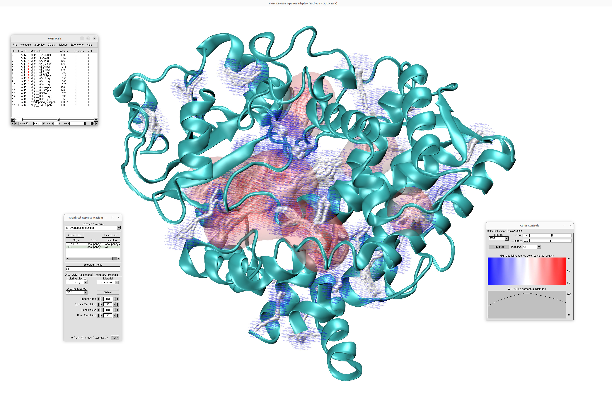
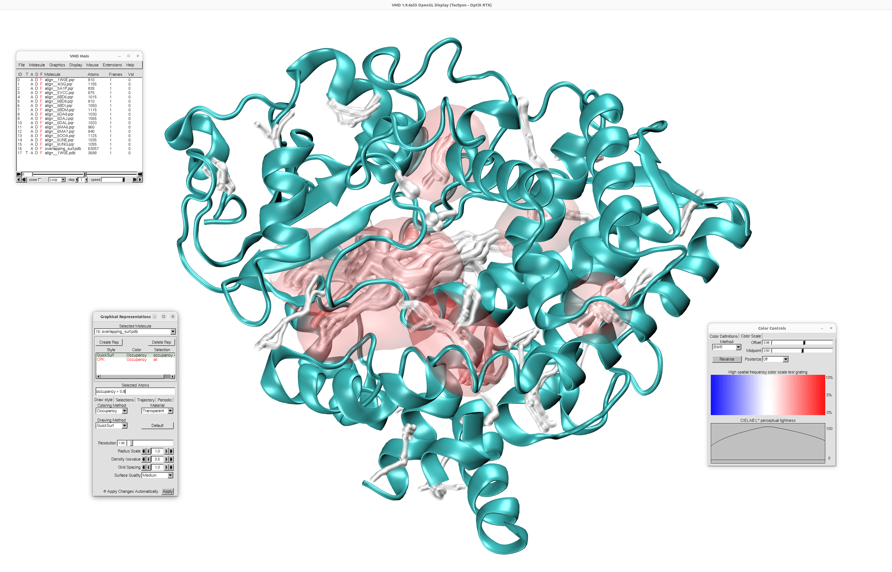

.. _cavitracer_single:

I. Detection of channels across heterogeneous structures
===============================================================================

Now, we will illustrate how to detect intraprotein channels across various PDB
structures. As an example, we will use Cytochrome P450. 

First, we will provide a list of PDB codes with different Cytochrome P450
structures. Such a list can be also provided by BLAST, Dali, or Foldseek
(see :func:`.runBLAST`, :func:`.runDali`, :func:`.runFoldseek` in the
`InSty tutorial`_).

.. ipython:: python
   :verbatim:

   pdb_files = ["1TQN", "1W0E", "4I3Q", "5A1P", "5VCC", "6BD6", "6BD8", "6BDI", 
            "6BDM", "6DA8", "6DAJ", "6DAL", "6MA6", "6MA7", "6OOA", "6UNE", "6UNG"]

Protein preparation
-------------------------------------------------------------------------------

Before performing the analysis, we will align all the structures onto the first
structure from our list (``target``) and save it under a new name with ``align__``
prefix. Such an approach was also shown in other ProDy tutorials and explained
in detail (see Structure Composition of the `Structure Analysis tutorial`_).

.. ipython:: python
   :verbatim:

   structures = parsePDB(pdb_files)
   target = structures[0]
   rmsds = []

   for mobile in structures[1:]:
       try:
           i = mobile.getTitle()
           print (i)
           matches = matchChains(mobile.protein, target.protein, subset='bb')
           m = matches[0]
           m0_alg, T = superpose(m[0], m[1], weights=m[0].getFlags("mapped"))
           rmsds.append(calcRMSD(m[0], m[1], weights=m[0].getFlags("mapped")))
           writePDB('align__'+i+'.pdb', mobile)
       except: pass

.. parsed-literal::

   @> 17 PDBs were parsed in 14.24s.
   1W0E
   @> Checking AtomGroup 1W0E: 1 chains are identified
   @> Checking AtomGroup 1TQN: 1 chains are identified
   @> Trying to match chains based on residue numbers and names:
   @>   Comparing Chain A from 1W0E (len=450) and Chain A from 1TQN (len=468):
   @> 	Match: 447 residues match with 99% sequence identity and 96% overlap.
   4I3Q
   @> Checking AtomGroup 4I3Q: 1 chains are identified
   @> Checking AtomGroup 1TQN: 1 chains are identified
   @> Trying to match chains based on residue numbers and names:
   @>   Comparing Chain A from 4I3Q (len=465) and Chain A from 1TQN (len=468):
   @> 	Match: 465 residues match with 100% sequence identity and 99% overlap.
   5A1P
   @> Checking AtomGroup 5A1P: 1 chains are identified
   @> Checking AtomGroup 1TQN: 1 chains are identified
   @> Trying to match chains based on residue numbers and names:
   @>   Comparing Chain A from 5A1P (len=465) and Chain A from 1TQN (len=468):
   @> 	Match: 463 residues match with 100% sequence identity and 99% overlap.
   5VCC
   @> Checking AtomGroup 5VCC: 1 chains are identified
   @> Checking AtomGroup 1TQN: 1 chains are identified
   @> Trying to match chains based on residue numbers and names:
   @>   Comparing Chain A from 5VCC (len=457) and Chain A from 1TQN (len=468):
   @> 	Match: 457 residues match with 100% sequence identity and 98% overlap.
   6BD6
   @> Checking AtomGroup 6BD6: 1 chains are identified
   @> Checking AtomGroup 1TQN: 1 chains are identified
   @> Trying to match chains based on residue numbers and names:
   @>   Comparing Chain A from 6BD6 (len=457) and Chain A from 1TQN (len=468):
   @> 	Match: 457 residues match with 100% sequence identity and 98% overlap.
   6BD8
   @> Checking AtomGroup 6BD8: 1 chains are identified
   @> Checking AtomGroup 1TQN: 1 chains are identified
   @> Trying to match chains based on residue numbers and names:
   @>   Comparing Chain A from 6BD8 (len=457) and Chain A from 1TQN (len=468):
   @> 	Match: 457 residues match with 100% sequence identity and 98% overlap.
   6BDI
   @> Checking AtomGroup 6BDI: 1 chains are identified
   @> Checking AtomGroup 1TQN: 1 chains are identified
   @> Trying to match chains based on residue numbers and names:
   @>   Comparing Chain A from 6BDI (len=462) and Chain A from 1TQN (len=468):
   @> 	Match: 461 residues match with 100% sequence identity and 99% overlap.
   6BDM
   @> Checking AtomGroup 6BDM: 1 chains are identified
   @> Checking AtomGroup 1TQN: 1 chains are identified
   @> Trying to match chains based on residue numbers and names:
   @>   Comparing Chain A from 6BDM (len=456) and Chain A from 1TQN (len=468):
   @> 	Match: 456 residues match with 100% sequence identity and 97% overlap.
   6DA8
   @> Checking AtomGroup 6DA8: 1 chains are identified
   @> Checking AtomGroup 1TQN: 1 chains are identified
   @> Trying to match chains based on residue numbers and names:
   @>   Comparing Chain A from 6DA8 (len=451) and Chain A from 1TQN (len=468):
   @> 	Match: 450 residues match with 100% sequence identity and 96% overlap.
   6DAJ
   @> Checking AtomGroup 6DAJ: 1 chains are identified
   @> Checking AtomGroup 1TQN: 1 chains are identified
   @> Trying to match chains based on residue numbers and names:
   @>   Comparing Chain A from 6DAJ (len=451) and Chain A from 1TQN (len=468):
   @> 	Match: 450 residues match with 100% sequence identity and 96% overlap.
   6DAL
   @> Checking AtomGroup 6DAL: 1 chains are identified
   @> Checking AtomGroup 1TQN: 1 chains are identified
   @> Trying to match chains based on residue numbers and names:
   @>   Comparing Chain A from 6DAL (len=454) and Chain A from 1TQN (len=468):
   @> 	Match: 453 residues match with 100% sequence identity and 97% overlap.
   6MA6
   @> Checking AtomGroup 6MA6: 1 chains are identified
   @> Checking AtomGroup 1TQN: 1 chains are identified
   @> Trying to match chains based on residue numbers and names:
   @>   Comparing Chain A from 6MA6 (len=466) and Chain A from 1TQN (len=468):
   @> 	Match: 464 residues match with 100% sequence identity and 99% overlap.
   6MA7
   @> Checking AtomGroup 6MA7: 1 chains are identified
   @> Checking AtomGroup 1TQN: 1 chains are identified
   @> Trying to match chains based on residue numbers and names:
   @>   Comparing Chain A from 6MA7 (len=463) and Chain A from 1TQN (len=468):
   @> 	Match: 461 residues match with 99% sequence identity and 99% overlap.
   6OOA
   @> Checking AtomGroup 6OOA: 1 chains are identified
   @> Checking AtomGroup 1TQN: 1 chains are identified
   @> Trying to match chains based on residue numbers and names:
   @>   Comparing Chain A from 6OOA (len=452) and Chain A from 1TQN (len=468):
   @> 	Match: 452 residues match with 100% sequence identity and 97% overlap.
   6UNE
   @> Checking AtomGroup 6UNE: 1 chains are identified
   @> Checking AtomGroup 1TQN: 1 chains are identified
   @> Trying to match chains based on residue numbers and names:
   @>   Comparing Chain A from 6UNE (len=452) and Chain A from 1TQN (len=468):
   @> 	Match: 452 residues match with 100% sequence identity and 97% overlap.
   6UNG
   @> Checking AtomGroup 6UNG: 1 chains are identified
   @> Checking AtomGroup 1TQN: 1 chains are identified
   @> Trying to match chains based on residue numbers and names:
   @>   Comparing Chain A from 6UNG (len=453) and Chain A from 1TQN (len=468):
   @> 	Match: 453 residues match with 100% sequence identity and 97% overlap.

The names of the structurally aligned PDBs are further uploaded into ``pdb_files_new``.
This operation is required if we want to compare the localization of channels in
various PDB models.

.. ipython:: python
   :verbatim:

   from pathlib import Path
   pdb_files_new = [p.name for p in Path(".").glob("align__*.pdb")]
   pdb_files_new

.. parsed-literal::

   ['align__6OOA.pdb',
    'align__6BD8.pdb',
    'align__6BD6.pdb',
    'align__6BDI.pdb',
    'align__6DAJ.pdb',
    'align__5A1P.pdb',
    'align__6BDM.pdb',
    'align__6DA8.pdb',
    'align__4I3Q.pdb',
    'align__6UNG.pdb',
    'align__6UNE.pdb',
    'align__6DAL.pdb',
    'align__6MA6.pdb',
    'align__1W0E.pdb',
    'align__6MA7.pdb',
    'align__5VCC.pdb']

Channel prediction for individual PDB files
-------------------------------------------------------------------------------

Now, all PDB structures can be analyzed to detect channels, tunnels, or
pores in the protein structure using :func:`.calcChannels`. In this example,
the results will be saved in a single file (all detected channels in ``.pqr``
file with the name of the input file) and in multiple files (``separate``
must be set to ``True``) to save each detected channel independently.
Additionally, we will use :func:`.getChannelParameters` and
:func:`.getChannelResidueNames` to obtain information about channel
parameters and residues involved in its formation. To save this information
in the local directory, we provide ``param_file_name`` and
``residues_file_name``. The function will create files with the same name as
provided PDB with ``'_Parameters_All_channels.txt'`` and
``'_Residues_All_channels.txt'`` as suffixes.

.. ipython:: python
   :verbatim:

   for i in pdb_files_new:
       base_name = pdb_files_new[0]
       atoms = parsePDB(i).select('protein')
       channels2, surface2 = calcChannels(atoms, output_path=i[:-4], separate=True)

       getChannelParameters(channels2, param_file_name=i[:-4])
       getChannelResidueNames(atoms, channels2, residues_file_name=i[:-4])

.. parsed-literal::

   @> 3727 atoms and 1 coordinate set(s) were parsed in 0.12s.
   @> The atoms supplied to calcChannels contain protein atoms only.
   @> WARNING structure has no hydrogens and inner_radius=0.90 is below 1.2 Å: the space left by the missing H is then wide enough for the probe to pass, and channels will be found through interstices that do not exist in the real protein (their number can rise several-fold). Either add hydrogens, or raise inner_radius to 1.2 Å or more, where protonated and unprotonated structures give the same channels.
   @> Substituted 3630 atoms with 22830 homogeneous balls of radius 1.52 Å in 0.19s.
   @> Delaunay tessellation of 22830 points constructed in 0.89s.
   @> Surface and inner simplices filtered in 1.82s.
   @> Surface cavities: 232 found, 10 deeper than min_depth=5.0 Å and searched for channels, in 0.32s.
   @> Chambers (probe 1.40 Å): 3 of the 10 searched cavities have them; the other 8 are searched whole.
   @>     cavity 0: 67 chambers, 25 of them qualify as sites, the 20 largest seeded (max_seeds=20).
   @>     cavity 1: 1 chamber, seeded.
   @>     cavity 2: 1 chamber, none of them deep and large enough to seed; searched whole.
   @> 29 search sites (sp) in 0.05s: one per seeded chamber, one per cavity searched whole.
   @> Channel search (Dijkstra) over 29 search sites in 10 cavities completed in 5.05s.
   @> Found 60 channels and 13 links (a link joins a deep chamber to a shallower one and never reaches the surface).
   @> Search sites (sp), the void each search ran from, largest first; sp<n> tags every channel, link and output file:
   @>     site  void                     volume [ų]  depth [Å]  channels  links
   @>     sp0   cavity 2, whole                  750        5.5         2      -
   @>     sp1   cavity 0, chamber 1/20           574        5.9         6      1  -> sp16
   @>     sp2   cavity 3, whole                  212        5.2         1      -
   @>     sp3   cavity 0, chamber 2/20           206        8.3         3      -
   @>     sp4   cavity 1, chamber 1/1            189        7.3         5      -
   @>     sp5   cavity 4, whole                  172        9.2         -      -  sealed
   @>     sp6   cavity 5, whole                  152        5.1         1      -
   @>     sp7   cavity 6, whole                  147        5.1         1      -
   @>     sp8   cavity 7, whole                  126        5.7         1      -
   @>     sp9   cavity 0, chamber 3/20           122        5.6         2      -
   @>     sp10  cavity 8, whole                  105        5.7         -      -  sealed
   @>     sp11  cavity 9, whole                   99        5.2         -      -  sealed
   @>     sp12  cavity 0, chamber 4/20            85       11.0         4      -
   @>     sp13  cavity 0, chamber 5/20            85        9.6         -      1  -> sp28
   @>     sp14  cavity 0, chamber 6/20            82       15.4         -      1  -> sp3
   @>     sp15  cavity 0, chamber 7/20            69       18.8         -      2  -> sp17, sp13
   @>     sp16  cavity 0, chamber 8/20            67        5.0         3      -
   @>     sp17  cavity 0, chamber 9/20            64       15.8         -      2  -> sp13, sp1
   @>     sp18  cavity 0, chamber 10/20           59        5.3         4      1  -> sp9
   @>     sp19  cavity 0, chamber 11/20           54        9.0         5      -
   @>     sp20  cavity 0, chamber 12/20           52       17.9         -      2  -> sp22, sp12
   @>     sp21  cavity 0, chamber 13/20           50       10.1         2      1  -> sp25
   @>     sp22  cavity 0, chamber 14/20           49       14.9         2      1  -> sp12
   @>     sp23  cavity 0, chamber 15/20           44        5.9         1      -
   @>     sp24  cavity 0, chamber 16/20           42        9.3         2      -
   @>     sp25  cavity 0, chamber 17/20           40        5.6         5      -
   @>     sp26  cavity 0, chamber 18/20           37        7.6         9      1  -> sp3
   @>     sp27  cavity 0, chamber 19/20           36       13.1         -      -  sealed
   @>     sp28  cavity 0, chamber 20/20           35        5.4         1      -
   @>     (site volumes measure the void itself and are not on the swept-sphere scale of the channel volumes)
   @> The 1 site marked sealed above report neither a channel nor a link: every route out of them is narrower than bottleneck=0.90 Å. Lower it to see how they connect.
   @> Saving 60 channels and 13 links to directory ., one file per object named sp<site>_chl<n> and sp<site>_lnk<n>.
   @> Channel calculation completed in 8.75s.
   @> Channel ID: 	Volume [ų] 	Length [Å] 	Bottleneck [Å]
   @> channel 0: 	146.45 		5.36 		1.76
   @> channel 1: 	167.81 		6.27 		1.85
   @> channel 2: 	216.28 		7.16 		2.18
   @> channel 3: 	151.3 		6.08 		1.7
   @> channel 4: 	101.34 		5.95 		1.87
   @> channel 5: 	258.92 		9.88 		2.17
   @> channel 6: 	77.76 		5.67 		1.42
   @> channel 7: 	63.61 		5.91 		1.32
   @> channel 8: 	64.99 		5.96 		1.21
   @> channel 9: 	65.08 		6.15 		1.21
   @> channel 10: 	74.06 		6.74 		0.95
   @> channel 11: 	44.74 		5.6 		1.16
   @> channel 12: 	53.52 		5.43 		1.0
   @> channel 13: 	110.62 		7.1 		0.96
   @> channel 14: 	35.08 		5.34 		0.98
   @> channel 15: 	138.56 		10.33 		1.28
   @> channel 16: 	70.65 		7.65 		1.04
   @> channel 17: 	105.63 		9.42 		1.17
   @> channel 18: 	129.63 		9.34 		1.05
   @> channel 19: 	185.09 		13.76 		1.14
   @> channel 20: 	44.31 		5.99 		0.91
   @> channel 21: 	37.86 		6.4 		1.04
   @> channel 22: 	40.58 		6.41 		0.91
   @> channel 23: 	62.74 		8.08 		0.99
   @> channel 24: 	96.77 		8.51 		0.96
   @> channel 25: 	30.25 		5.79 		0.93
   @> channel 26: 	67.62 		8.65 		0.97
   @> channel 27: 	83.12 		10.36 		1.02
   @> channel 28: 	89.43 		9.64 		1.05
   @> channel 29: 	108.92 		10.26 		1.02
   @> channel 30: 	27.46 		6.01 		0.93
   @> channel 31: 	61.78 		8.49 		0.93
   @> channel 32: 	109.32 		10.08 		0.94
   @> channel 33: 	95.48 		11.61 		1.02
   @> channel 34: 	96.56 		12.08 		1.07
   @> channel 35: 	60.51 		8.52 		0.91
   @> channel 36: 	67.96 		9.77 		0.91
   @> channel 37: 	64.76 		11.19 		1.11
   @> channel 38: 	95.82 		12.05 		0.95
   @> channel 39: 	53.32 		8.83 		0.92
   @> channel 40: 	114.4 		13.68 		0.99
   @> channel 41: 	43.88 		8.89 		0.92
   @> channel 42: 	80.28 		12.72 		1.11
   @> channel 43: 	58.97 		10.83 		0.95
   @> channel 44: 	78.49 		13.29 		0.95
   @> channel 45: 	67.98 		13.1 		0.95
   @> channel 46: 	163.9 		20.37 		1.01
   @> channel 47: 	222.41 		21.03 		0.94
   @> channel 48: 	219.95 		21.95 		1.01
   @> channel 49: 	61.39 		13.0 		0.92
   @> channel 50: 	109.47 		18.45 		0.98
   @> channel 51: 	151.94 		20.99 		0.94
   @> channel 52: 	80.35 		16.19 		0.94
   @> channel 53: 	81.18 		16.51 		0.91
   @> channel 54: 	190.4 		25.18 		0.96
   @> channel 55: 	106.45 		20.33 		0.92
   @> channel 56: 	165.23 		27.59 		0.94
   @> channel 57: 	210.58 		29.77 		0.92
   @> channel 58: 	148.27 		29.42 		0.91
   @> channel 59: 	231.69 		35.12 		0.92
   @> Channel residues were saved to: align__6OOA_Residues_All_channels.txt
   @> 3756 atoms and 1 coordinate set(s) were parsed in 0.05s.
   @> The atoms supplied to calcChannels contain protein atoms only.
   @> WARNING structure has no hydrogens and inner_radius=0.90 is below 1.2 Å: the space left by the missing H is then wide enough for the probe to pass, and channels will be found through interstices that do not exist in the real protein (their number can rise several-fold). Either add hydrogens, or raise inner_radius to 1.2 Å or more, where protonated and unprotonated structures give the same channels.
   @> Substituted 3675 atoms with 23131 homogeneous balls of radius 1.52 Å in 0.18s.
   @> Delaunay tessellation of 23131 points constructed in 0.85s.
   @> Surface and inner simplices filtered in 1.43s.
   @> Surface cavities: 218 found, 8 deeper than min_depth=5.0 Å and searched for channels, in 0.33s.
   @> Chambers (probe 1.40 Å): 2 of the 8 searched cavities have them; the other 6 are searched whole.
   @>     cavity 0: 46 chambers, 26 of them qualify as sites, the 20 largest seeded (max_seeds=20).
   @>     cavity 1: 3 chambers, 2 of them seeded.
   @> 28 search sites (sp) in 0.09s: one per seeded chamber, one per cavity searched whole.
   @> Channel search (Dijkstra) over 28 search sites in 8 cavities completed in 2.92s.
   @> Found 65 channels and 23 links (a link joins a deep chamber to a shallower one and never reaches the surface).
   @> Search sites (sp), the void each search ran from, largest first; sp<n> tags every channel, link and output file:
   @>     site  void                     volume [ų]  depth [Å]  channels  links
   @>     sp0   cavity 0, chamber 1/20          4146       10.6        17      -
   @>     sp1   cavity 2, whole                  504        8.3         1      -
   @>     sp2   cavity 3, whole                  328       14.2         1      -
   @>     sp3   cavity 4, whole                  311        5.1         1      -
   @>     sp4   cavity 5, whole                  298        5.3         -      -  sealed
   @>     sp5   cavity 0, chamber 2/20           219        7.5         3      -
   @>     sp6   cavity 0, chamber 3/20           216        6.7         -      1  -> sp0
   @>     sp7   cavity 0, chamber 4/20           202       11.0         2      2  -> sp6, sp0
   @>     sp8   cavity 6, whole                  202        5.1         1      -
   @>     sp9   cavity 0, chamber 5/20           171        6.7         4      2  -> sp0, sp0
   @>     sp10  cavity 0, chamber 6/20           157       10.5         5      1  -> sp0
   @>     sp11  cavity 0, chamber 7/20           123        8.9         1      1  -> sp23
   @>     sp12  cavity 0, chamber 8/20           116       14.9         -      3  -> sp20, sp24, sp11
   @>     sp13  cavity 7, whole                  112        5.5         1      -
   @>     sp14  cavity 0, chamber 9/20           110       19.9         -      1  -> sp0
   @>     sp15  cavity 0, chamber 10/20           87       14.5         1      2  -> sp24, sp0
   @>     sp16  cavity 0, chamber 11/20           86       15.0         -      4  -> sp11, sp18, sp12, sp0
   @>     sp17  cavity 0, chamber 12/20           79        5.5         5      -
   @>     sp18  cavity 0, chamber 13/20           73        6.3         6      1  -> sp0
   @>     sp19  cavity 0, chamber 14/20           71       12.4         6      2  -> sp0, sp21
   @>     sp20  cavity 0, chamber 15/20           54       11.1         1      -
   @>     sp21  cavity 0, chamber 16/20           50        9.6         3      -
   @>     sp22  cavity 0, chamber 17/20           49        8.8         1      1  -> sp5
   @>     sp23  cavity 0, chamber 18/20           49        7.3         1      -
   @>     sp24  cavity 0, chamber 19/20           45        9.8         1      1  -> sp0
   @>     sp25  cavity 0, chamber 20/20           45       11.2         2      1  -> sp17
   @>     sp26  cavity 1, chamber 1/2             43        5.0         1      -
   @>     sp27  cavity 1, chamber 2/2             42        8.9         -      -  sealed
   @>     (site volumes measure the void itself and are not on the swept-sphere scale of the channel volumes)
   @> The 1 site marked sealed above report neither a channel nor a link: every route out of them is narrower than bottleneck=0.90 Å. Lower it to see how they connect.
   @> Saving 65 channels and 23 links to directory ., one file per object named sp<site>_chl<n> and sp<site>_lnk<n>.
   ..
   ..
   @> 4124 atoms and 1 coordinate set(s) were parsed in 0.05s.
   @> The atoms supplied to calcChannels contain protein atoms only.
   @> WARNING structure has no hydrogens and inner_radius=0.90 is below 1.2 Å: the space left by the missing H is then wide enough for the probe to pass, and channels will be found through interstices that do not exist in the real protein (their number can rise several-fold). Either add hydrogens, or raise inner_radius to 1.2 Å or more, where protonated and unprotonated structures give the same channels.
   @> Substituted 3675 atoms with 23131 homogeneous balls of radius 1.52 Å in 0.18s.
   @> Delaunay tessellation of 23131 points constructed in 0.76s.
   @> Surface and inner simplices filtered in 1.33s.
   @> Surface cavities: 224 found, 6 deeper than min_depth=5.0 Å and searched for channels, in 0.28s.
   @> Chambers (probe 1.40 Å): 4 of the 6 searched cavities have them; the other 3 are searched whole.
   @>     cavity 0: 44 chambers, 21 of them qualify as sites, the 20 largest seeded (max_seeds=20).
   @>     cavity 1: 3 chambers, 1 of them seeded.
   @>     cavity 2: 2 chambers, all seeded.
   @>     cavity 3: 2 chambers, none of them deep and large enough to seed; searched whole.
   @> 26 search sites (sp) in 0.07s: one per seeded chamber, one per cavity searched whole.
   @> Channel search (Dijkstra) over 26 search sites in 6 cavities completed in 3.01s.
   @> Found 51 channels and 23 links (a link joins a deep chamber to a shallower one and never reaches the surface).
   @> Search sites (sp), the void each search ran from, largest first; sp<n> tags every channel, link and output file:
   @>     site  void                     volume [ų]  depth [Å]  channels  links
   @>     sp0   cavity 0, chamber 1/20          4192       14.8        14      -
   @>     sp1   cavity 3, whole                  426        8.9         3      -
   @>     sp2   cavity 4, whole                  240        5.2         1      -
   @>     sp3   cavity 0, chamber 2/20           213        7.0         2      -
   @>     sp4   cavity 5, whole                  210        5.6         1      -
   @>     sp5   cavity 0, chamber 3/20           140        6.8         4      1  -> sp0
   @>     sp6   cavity 0, chamber 4/20           105        9.4         -      1  -> sp0
   @>     sp7   cavity 0, chamber 5/20            91       20.8         -      1  -> sp0
   @>     sp8   cavity 0, chamber 6/20            88       32.6         -      1  -> sp10
   @>     sp9   cavity 0, chamber 7/20            83       13.3         5      3  -> sp0, sp0, sp12
   @>     sp10  cavity 0, chamber 8/20            73       26.9         -      3  -> sp21, sp25, sp0
   @>     sp11  cavity 0, chamber 9/20            66       12.1         -      2  -> sp6, sp0
   @>     sp12  cavity 0, chamber 10/20           66        6.3         2      1  -> sp18
   @>     sp13  cavity 0, chamber 11/20           54       16.9         -      2  -> sp6, sp11
   @>     sp14  cavity 2, chamber 1/2             49        8.0         2      1  -> sp17
   @>     sp15  cavity 0, chamber 12/20           47        8.6         1      1  -> sp0
   @>     sp16  cavity 0, chamber 13/20           42        8.4         3      -
   @>     sp17  cavity 2, chamber 2/2             41        5.1         2      -
   @>     sp18  cavity 0, chamber 14/20           40        5.4         1      -
   @>     sp19  cavity 0, chamber 15/20           40       11.3         -      -  sealed
   @>     sp20  cavity 0, chamber 16/20           39       19.9         -      -  sealed
   @>     sp21  cavity 0, chamber 17/20           35       20.8         -      3  -> sp25, sp9, sp0
   @>     sp22  cavity 0, chamber 18/20           34       23.2         -      1  -> sp7
   @>     sp23  cavity 0, chamber 19/20           34        9.8         5      1  -> sp0
   @>     sp24  cavity 1, chamber 1/1             31        7.5         4      -
   @>     sp25  cavity 0, chamber 20/20           31       16.1         1      1  -> sp0
   @>     (site volumes measure the void itself and are not on the swept-sphere scale of the channel volumes)
   @> The 2 sites marked sealed above report neither a channel nor a link: every route out of them is narrower than bottleneck=0.90 Å. Lower it to see how they connect.
   @> Saving 51 channels and 23 links to directory ., one file per object named sp<site>_chl<n> and sp<site>_lnk<n>.
   @> Channel calculation completed in 6.00s.
   @> Channel ID: 	Volume [ų] 	Length [Å] 	Bottleneck [Å]
   @> channel 0: 	134.46 		5.61 		1.84
   @> channel 1: 	66.15 		3.54 		1.56
   @> channel 2: 	70.74 		5.18 		1.63
   @> channel 3: 	765.82 		22.74 		2.48
   @> channel 4: 	446.2 		15.74 		1.63
   @> channel 5: 	65.26 		5.29 		0.94
   @> channel 6: 	148.48 		10.56 		1.5
   @> channel 7: 	60.94 		6.78 		1.17
   @> channel 8: 	382.36 		15.77 		1.13
   @> channel 9: 	101.68 		8.46 		1.19
   @> channel 10: 	70.23 		7.58 		1.16
   @> channel 11: 	81.75 		7.64 		0.93
   @> channel 12: 	109.24 		8.72 		1.06
   @> channel 13: 	103.55 		9.46 		1.22
   @> channel 14: 	691.17 		25.26 		1.3
   @> channel 15: 	99.06 		8.49 		1.03
   @> channel 16: 	461.96 		19.41 		1.3
   @> channel 17: 	74.47 		9.77 		1.16
   @> channel 18: 	79.59 		8.97 		0.94
   @> channel 19: 	470.07 		19.92 		1.05
   @> channel 20: 	30.57 		5.87 		0.92
   @> channel 21: 	632.54 		24.93 		1.13
   @> channel 22: 	68.73 		8.62 		0.94
   @> channel 23: 	72.73 		9.99 		1.02
   @> channel 24: 	630.94 		25.11 		0.93
   @> channel 25: 	123.97 		11.95 		1.16
   @> channel 26: 	87.03 		11.08 		1.02
   @> channel 27: 	45.9 		8.26 		0.93
   @> channel 28: 	477.89 		21.33 		0.91
   @> channel 29: 	503.17 		23.26 		0.98
   @> channel 30: 	85.56 		12.1 		1.02
   @> channel 31: 	56.48 		9.08 		0.96
   @> channel 32: 	89.59 		12.37 		0.94
   @> channel 33: 	483.76 		24.55 		0.98
   @> channel 34: 	72.27 		11.91 		0.92
   @> channel 35: 	44.65 		9.24 		0.93
   @> channel 36: 	88.56 		12.73 		0.94
   @> channel 37: 	124.65 		14.56 		0.91
   @> channel 38: 	80.61 		12.43 		0.91
   @> channel 39: 	86.29 		12.3 		0.91
   @> channel 40: 	76.65 		13.93 		0.92
   @> channel 41: 	690.44 		31.02 		1.04
   @> channel 42: 	70.33 		12.98 		0.97
   @> channel 43: 	56.35 		11.1 		0.93
   @> channel 44: 	47.95 		10.81 		0.93
   @> channel 45: 	404.02 		22.85 		0.91
   @> channel 46: 	118.81 		19.64 		1.02
   @> channel 47: 	90.94 		17.68 		0.93
   @> channel 48: 	448.79 		28.97 		0.94
   @> channel 49: 	132.46 		18.9 		0.9
   @> channel 50: 	138.98 		24.09 		0.9
   @> Channel residues were saved to: align__5VCC_Residues_All_channels.txt

Selection of channels in a certain protein area
-------------------------------------------------------------------------------

CaviTracer will generate multiple channels, but we might be interested only
in the channels that are localized in a certain region. For that reason, we
created :func:`.selectChannelBySelection` which can extract channels that
are localized near the region of our interest. Below, we first select which
``pqr_files`` files we want to analyze (to exclude all channels in one file
that is also saved by default). Next, we use the ``residue_sele`` option to
apply any selection that is understandable by ProDy select. In our case, we
select all ``FIL`` atoms (channel prediction artificial atoms) that are
within 5 Angstroms from the residue with the number 442. These values can be
changed using ``distA`` parameter of the function.

.. ipython:: python
   :verbatim:

   from pathlib import Path
   pdb_files_new_channels = [i.name for i in Path(".").glob("align__*chl*.pqr") if i.is_file()]
   pdb_files_new_channels

.. parsed-literal::

   ['align__4I3Q_sp17_chl86.pqr',
    'align__6DAJ_sp11_chl55.pqr',
    'align__6BDM_sp24_chl8.pqr',
    'align__6BD6_sp2_chl31.pqr',
    'align__6OOA_sp3_chl19.pqr',
    'align__4I3Q_sp27_chl17.pqr',
    'align__1W0E_sp19_chl40.pqr',
    'align__6UNG_sp26_chl54.pqr',
    'align__6UNG_sp0_chl5.pqr',
    'align__6DAJ_sp16_chl40.pqr',
    'align__6MA7_sp0_chl15.pqr',
    'align__6BD6_sp0_chl27.pqr',
    'align__4I3Q_sp3_chl22.pqr',
    'align__6BD8_sp10_chl36.pqr',
    'align__6OOA_sp12_chl29.pqr',
    'align__6BDM_sp3_chl68.pqr',
    'align__6UNG_sp0_chl11.pqr',
    'align__6UNG_sp7_chl50.pqr',
    'align__6DA8_sp0_chl3.pqr',
    'align__5VCC_sp9_chl49.pqr',
    'align__6UNE_sp8_chl93.pqr',
    'align__6DAL_sp17_chl59.pqr',
    'align__6UNE_sp1_chl73.pqr',
    'align__6DAJ_sp22_chl24.pqr',
    'align__6BDM_sp11_chl30.pqr',
    'align__6UNE_sp15_chl63.pqr',
    'align__6MA7_sp2_chl32.pqr',
    'align__6UNG_sp14_chl13.pqr',
    'align__6BDI_sp18_chl76.pqr',
    'align__6BDI_sp19_chl18.pqr',
    'align__5A1P_sp25_chl43.pqr',
    'align__4I3Q_sp19_chl11.pqr',
    'align__1W0E_sp15_chl63.pqr',
    'align__6MA7_sp3_chl10.pqr',
    'align__6BDI_sp20_chl47.pqr',
    'align__6UNG_sp9_chl7.pqr',
    'align__6UNE_sp5_chl47.pqr',
    'align__1W0E_sp16_chl93.pqr',
    'align__4I3Q_sp19_chl40.pqr',
   ..
   ..

.. ipython:: python
   :verbatim:

   atoms = parsePDB(pdb_files_new_channels[0].split('_sp')[0]+'.pdb')
   selectChannelBySelection(atoms, pqr_files=pdb_files_new_channels, 
					residue_sele='resid 442')

.. parsed-literal::

   @> 3798 atoms and 1 coordinate set(s) were parsed in 0.13s.
   @> 195 atoms and 1 coordinate sets were parsed in 0.00s.
   @> 100 atoms and 1 coordinate sets were parsed in 0.00s.
   @> 45 atoms and 1 coordinate sets were parsed in 0.00s.
   @> 70 atoms and 1 coordinate sets were parsed in 0.00s.
   @> 80 atoms and 1 coordinate sets were parsed in 0.00s.
   @> 40 atoms and 1 coordinate sets were parsed in 0.00s.
   @> 75 atoms and 1 coordinate sets were parsed in 0.00s.
   @> 95 atoms and 1 coordinate sets were parsed in 0.00s.
   @> 90 atoms and 1 coordinate sets were parsed in 0.00s.
   @> 105 atoms and 1 coordinate sets were parsed in 0.00s.
   @> 135 atoms and 1 coordinate sets were parsed in 0.00s.
   @> 155 atoms and 1 coordinate sets were parsed in 0.00s.
   @> 65 atoms and 1 coordinate sets were parsed in 0.00s.
   @> 85 atoms and 1 coordinate sets were parsed in 0.00s.
   @> 80 atoms and 1 coordinate sets were parsed in 0.00s.
   @> 145 atoms and 1 coordinate sets were parsed in 0.00s.
   @> 135 atoms and 1 coordinate sets were parsed in 0.00s.
   @> 150 atoms and 1 coordinate sets were parsed in 0.00s.
   @> 35 atoms and 1 coordinate sets were parsed in 0.00s.
   @> 175 atoms and 1 coordinate sets were parsed in 0.00s.
   @> 180 atoms and 1 coordinate sets were parsed in 0.00s.
   @> 200 atoms and 1 coordinate sets were parsed in 0.00s.
   @> 160 atoms and 1 coordinate sets were parsed in 0.00s.
   ..
   ..
   @> 90 atoms and 1 coordinate sets were parsed in 0.00s.
   @> 175 atoms and 1 coordinate sets were parsed in 0.00s.
   @> 165 atoms and 1 coordinate sets were parsed in 0.00s.
   @> 130 atoms and 1 coordinate sets were parsed in 0.00s.
   @> Filtered files are now in: selected_files
   @> Selected files: 
   @> align__6UNE_sp5_chl47.pqr align__6UNE_sp0_chl75.pqr align__6MA7_sp0_chl49.pqr 
      align__6BD6_sp0_chl53.pqr align__6BD8_sp19_chl54.pqr align__6BDI_sp0_chl42.pqr 
      align__5A1P_sp9_chl7.pqr align__6DAJ_sp12_chl52.pqr align__6DAJ_sp22_chl16.pqr 
      align__6UNE_sp0_chl79.pqr align__6OOA_sp1_chl0.pqr align__1W0E_sp0_chl55.pqr 
      align__6BDI_sp0_chl53.pqr align__6UNE_sp5_chl23.pqr align__6UNE_sp0_chl81.pqr 
      align__6OOA_sp1_chl1.pqr align__6DAJ_sp12_chl53.pqr align__6MA6_sp0_chl32.pqr 
      align__6MA7_sp0_chl53.pqr align__4I3Q_sp0_chl55.pqr align__6MA6_sp0_chl49.pqr 
      align__6MA7_sp0_chl60.pqr align__6MA6_sp0_chl57.pqr align__5VCC_sp0_chl48.pqr 
      align__5VCC_sp5_chl6.pqr align__6DAJ_sp20_chl1.pqr align__6MA7_sp0_chl54.pqr 
      align__6BD6_sp0_chl47.pqr align__6OOA_sp1_chl5.pqr align__6DA8_sp10_chl25.pqr 
      align__5A1P_sp9_chl18.pqr align__6MA6_sp0_chl47.pqr align__4I3Q_sp0_chl88.pqr 
      align__5A1P_sp0_chl12.pqr align__6DAL_sp13_chl43.pqr align__6BD6_sp0_chl62.pqr 
      align__6MA6_sp0_chl54.pqr align__6BD8_sp9_chl16.pqr align__4I3Q_sp0_chl77.pqr 
      align__6OOA_sp1_chl3.pqr align__6BDI_sp0_chl69.pqr align__6BD6_sp0_chl63.pqr 
      align__6DA8_sp3_chl1.pqr align__6BD8_sp19_chl53.pqr align__6BD8_sp9_chl12.pqr 
      align__6DAL_sp13_chl39.pqr align__6DA8_sp11_chl27.pqr align__6OOA_sp24_chl18.pqr 
      align__6BDI_sp0_chl68.pqr align__1W0E_sp0_chl94.pqr align__4I3Q_sp0_chl46.pqr 
      align__6DAL_sp1_chl0.pqr align__6DAL_sp1_chl1.pqr align__6DA8_sp13_chl35.pqr 
      align__6BD6_sp0_chl61.pqr align__6BDI_sp0_chl56.pqr align__6DA8_sp3_chl0.pqr 
      align__6BDM_sp0_chl57.pqr align__1W0E_sp0_chl65.pqr align__4I3Q_sp0_chl62.pqr 
      align__6BD6_sp0_chl44.pqr align__6UNE_sp5_chl31.pqr align__5VCC_sp0_chl33.pqr 
      align__6DAJ_sp11_chl38.pqr align__6OOA_sp1_chl2.pqr align__6DAJ_sp0_chl2.pqr 
      align__4I3Q_sp0_chl80.pqr align__6UNE_sp0_chl78.pqr align__1W0E_sp0_chl28.pqr 
      align__6BD8_sp0_chl39.pqr align__6MA6_sp0_chl51.pqr align__6BDM_sp0_chl58.pqr 
      align__6BD8_sp0_chl44.pqr align__6BDI_sp0_chl58.pqr align__5A1P_sp0_chl15.pqr 
      align__6DAJ_sp12_chl43.pqr align__1W0E_sp0_chl66.pqr align__6BD8_sp0_chl48.pqr 
      align__4I3Q_sp0_chl75.pqr align__4I3Q_sp0_chl63.pqr align__6MA6_sp0_chl59.pqr 
      align__6MA7_sp0_chl25.pqr align__6MA6_sp0_chl56.pqr align__6BDI_sp0_chl59.pqr 
      align__6UNE_sp0_chl82.pqr align__1W0E_sp0_chl71.pqr align__6DAL_sp23_chl63.pqr 
      align__4I3Q_sp0_chl54.pqr align__4I3Q_sp7_chl18.pqr align__6BD8_sp0_chl47.pqr 
      align__4I3Q_sp0_chl94.pqr align__4I3Q_sp0_chl83.pqr align__6MA6_sp0_chl58.pqr 
      align__6MA7_sp0_chl55.pqr align__5A1P_sp0_chl47.pqr align__6DAJ_sp0_chl0.pqr 
      align__5A1P_sp0_chl52.pqr align__4I3Q_sp0_chl89.pqr align__5A1P_sp0_chl64.pqr 
      align__4I3Q_sp0_chl85.pqr align__5VCC_sp0_chl45.pqr align__6BDM_sp0_chl60.pqr 
      align__6MA7_sp0_chl58.pqr align__6BD6_sp0_chl49.pqr align__1W0E_sp0_chl64.pqr 
      align__6MA6_sp0_chl60.pqr align__4I3Q_sp0_chl79.pqr align__6BD8_sp19_chl57.pqr 
      align__5A1P_sp0_chl11.pqr

If we do not provide ``folder_name``, the results will be copied into the folder
``selected_file``, which is created automatically. That name can be changed using
``folder_name``, as shown below. Additionally, if we generated in the previous
step files with parameters and residues for the channels, we can also use
options ``residues_file`` and ``param_file`` set to ``True``. Then two new
files will be created **Selected_channel_residues.txt** and
**Selected_channel_parameters.txt**. In those files, we will find data for
selected channels only. 

.. ipython:: python
   :verbatim:

   atoms = parsePDB(pdb_files_new_channels[0].split('_sp')[0]+'.pdb')
   selectChannelBySelection(atoms, pqr_files=pdb_files_new_channels, residue_sele='resid 442',
   folder_name='res442', residues_file=True, param_file=True)

.. parsed-literal::

   @> 3798 atoms and 1 coordinate set(s) were parsed in 0.13s.
   @> 195 atoms and 1 coordinate sets were parsed in 0.00s.
   @> 100 atoms and 1 coordinate sets were parsed in 0.00s.
   @> 45 atoms and 1 coordinate sets were parsed in 0.00s.
   @> 70 atoms and 1 coordinate sets were parsed in 0.00s.
   @> 80 atoms and 1 coordinate sets were parsed in 0.00s.
   @> 40 atoms and 1 coordinate sets were parsed in 0.00s.
   @> 75 atoms and 1 coordinate sets were parsed in 0.00s.
   @> 95 atoms and 1 coordinate sets were parsed in 0.00s.
   @> 90 atoms and 1 coordinate sets were parsed in 0.00s.
   @> 105 atoms and 1 coordinate sets were parsed in 0.00s.
   @> 135 atoms and 1 coordinate sets were parsed in 0.00s.
   @> 155 atoms and 1 coordinate sets were parsed in 0.00s.
   @> 65 atoms and 1 coordinate sets were parsed in 0.00s.
   @> 85 atoms and 1 coordinate sets were parsed in 0.00s.
   @> 80 atoms and 1 coordinate sets were parsed in 0.00s.
   @> 145 atoms and 1 coordinate sets were parsed in 0.00s.
   @> 135 atoms and 1 coordinate sets were parsed in 0.00s.
   ..
   ..
   @> 145 atoms and 1 coordinate sets were parsed in 0.00s.
   @> 90 atoms and 1 coordinate sets were parsed in 0.00s.
   @> 175 atoms and 1 coordinate sets were parsed in 0.00s.
   @> 165 atoms and 1 coordinate sets were parsed in 0.00s.
   @> 130 atoms and 1 coordinate sets were parsed in 0.00s.
   @> Filtered files are now in: res442
   @> 109 residue row(s) saved to: Selected_channel_residues.txt
   @> 109 parameter row(s) saved to: Selected_channel_parameters.txt
   @> Selected files: 
   @> align__6UNE_sp5_chl47.pqr align__6UNE_sp0_chl75.pqr align__6MA7_sp0_chl49.pqr 
      align__6BD6_sp0_chl53.pqr align__6BD8_sp19_chl54.pqr align__6BDI_sp0_chl42.pqr 
      align__5A1P_sp9_chl7.pqr align__6DAJ_sp12_chl52.pqr align__6DAJ_sp22_chl16.pqr 
      ..
      ..
      align__6MA7_sp0_chl58.pqr align__6BD6_sp0_chl49.pqr align__1W0E_sp0_chl64.pqr 
      align__6MA6_sp0_chl60.pqr align__4I3Q_sp0_chl79.pqr align__6BD8_sp19_chl57.pqr 
      align__5A1P_sp0_chl11.pqr

Calculating overlapping channel regions across PDB structures
-------------------------------------------------------------------------------

Now, we will select files for analysis. In our case, we will select files with
all predicted channels in one file that starts with ``'align__'``. 

.. ipython:: python
   :verbatim:

   from pathlib import Path
   pdb_files_new_channels_ALL = [i.name for i in Path(".").glob("align__????.pqr") if i.is_file()]
   pdb_files_new_channels_ALL

.. parsed-literal::

   ['align__4I3Q.pqr',
    'align__6BDM.pqr',
    'align__6UNG.pqr',
    'align__6OOA.pqr',
    'align__6MA7.pqr',
    'align__6DAJ.pqr',
    'align__5A1P.pqr',
    'align__1W0E.pqr',
    'align__6BD6.pqr',
    'align__6UNE.pqr',
    'align__5VCC.pqr',
    'align__6BD8.pqr',
    'align__6BDI.pqr',
    'align__6DAL.pqr',
    'align__6MA6.pqr',
    'align__6DA8.pqr']   

To compute the so-called overlapping surface of the detected channels, we
should use :func:`.calcChannelSurfaceOverlaps`. To save the results, we
need to specify ``output_file_name``.

.. ipython:: python
   :verbatim:

   calcChannelSurfaceOverlaps(pqr_files=pdb_files_new_channels_ALL, 
				output_file_name='overlapping_surf.pdb')

.. parsed-literal::

   @> Number of PQR files: 16
   @> Resolution: 0.5
   @> max_proc: 2
   @> Calculating overlaps using 2 processes.
   @> 7490 atoms and 1 coordinate sets were parsed in 0.12s.
   @> 13000 atoms and 1 coordinate sets were parsed in 0.15s.
   @> 5615 atoms and 1 coordinate sets were parsed in 0.03s.
   @> 10250 atoms and 1 coordinate sets were parsed in 0.06s.
   @> 7790 atoms and 1 coordinate sets were parsed in 0.04s.
   @> 10055 atoms and 1 coordinate sets were parsed in 0.05s.
   @> 7645 atoms and 1 coordinate sets were parsed in 0.04s.
   @> 7730 atoms and 1 coordinate sets were parsed in 0.04s.
   @> 12630 atoms and 1 coordinate sets were parsed in 0.06s.
   @> 11215 atoms and 1 coordinate sets were parsed in 0.05s.
   @> 5440 atoms and 1 coordinate sets were parsed in 0.03s.
   @> 7615 atoms and 1 coordinate sets were parsed in 0.04s.
   @> 8595 atoms and 1 coordinate sets were parsed in 0.05s.
   @> 7305 atoms and 1 coordinate sets were parsed in 0.04s.
   @> 7385 atoms and 1 coordinate sets were parsed in 0.03s.
   @> 8855 atoms and 1 coordinate sets were parsed in 0.04s.
   @> Overlap written to: overlapping_surf.pdb
   @> Number of occupied overlap voxels: 130457

   'overlapping_surf.pdb'

The results can be displayed in any graphical visualization program. We
will use VMD_. Generated file ``overlapping_surf.pdb`` will contain a grid
with points and their corresponding values that will describe the occupation
of the channel in a specific space point across various structures that
were provided by ``pqr_files``.

Below, we can see a visualization of the grid that was created by
:func:`.calcChannelSurfaceOverlaps`. Values in the ``Occupancy`` column
correspond to the occupation of each point in ``pqr_files`` files. Values
range from 0 to 1, where ``1`` means that all ``pqr_files`` files have a
channel at this particular point. 

Below, we display the outcome of the prediction.

To display the most significant information about channel occupancy, it is
good to display values that are higher than 0.8 in the ``Occupancy``
column. In such a case, we will see only minimal channels that occur in at
least 80% of analyzed files from ``pqr_files``.

.. _InSty tutorial: http://www.bahargroup.org/prody/tutorials/insty_tutorial/
.. _Structure Analysis tutorial: http://www.bahargroup.org/prody/tutorials/structure_analysis/