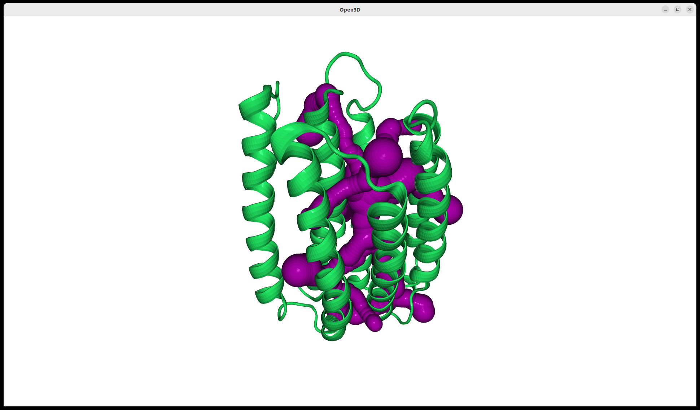
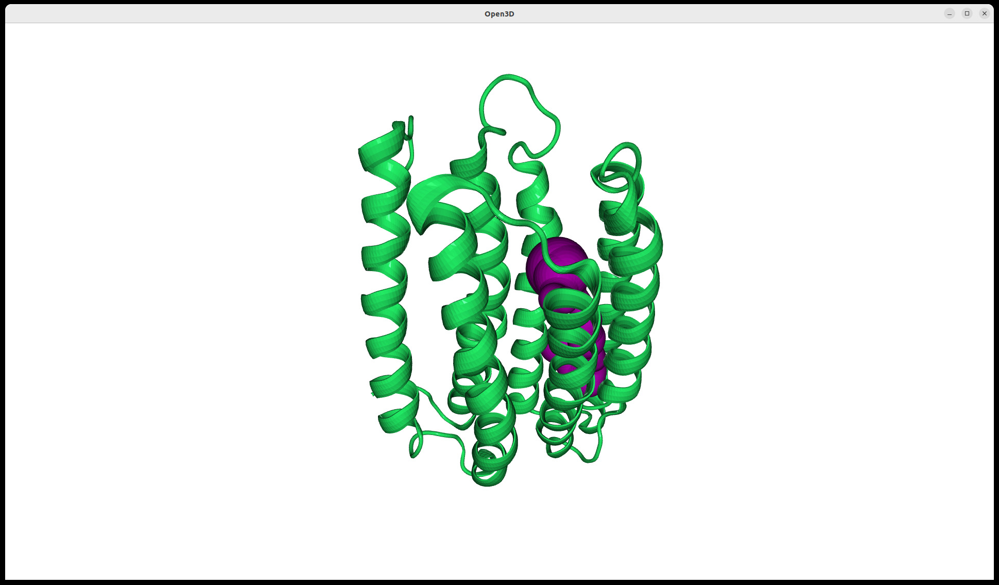
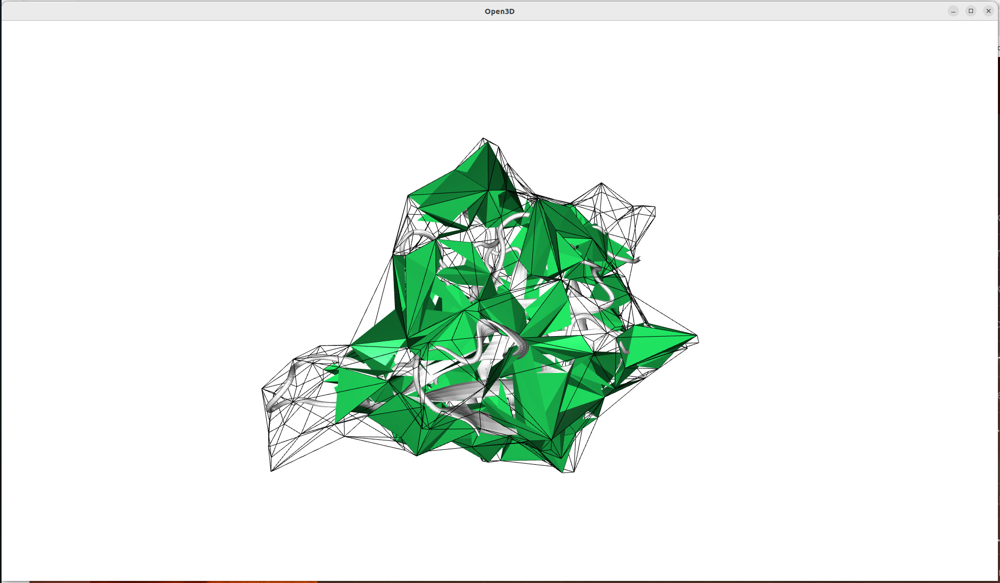
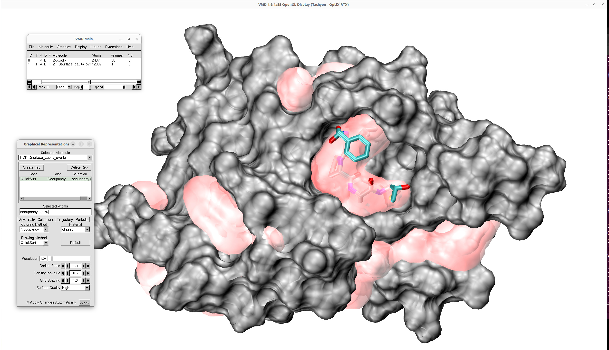

.. _cavitracer_single:

Detection of channels in multi-model PDBs
===============================================================================

In this example, we will use the NMR structure of proteorhodopsin with the
PDB code ``2L6X``, which contains 20 models in the PDB file to show how to
predict channels in multi-model PDBs. Multi-model PDB files can also contain
frames from molecular dynamics simulations (MD). Therefore, this analysis
can also be used to analyze MD trajectory in case we use some other the MD
format than ``DCD`` that is analyzed by ProDy tools. 

.. ipython:: python
   :verbatim:

   p3 = parsePDB('2L6X')

.. parsed-literal::

   @> PDB file is found in working directory (2l6x.pdb.gz).
   @> 3669 atoms and 20 coordinate set(s) were parsed in 0.29s.

To detect channels in multi-model PDB files or in MD trajectories, we need
to use :func:`.scalcChannelsMultipleFrames`.

.. ipython:: python
   :verbatim:

   channels3, surfaces3 = calcChannelsMultipleFrames(p3)

.. parsed-literal::

   @> Model: 0
   @> Detected 10 channels.
   @> No output path given.
   @> Model: 1
   @> Detected 10 channels.
   @> No output path given.
   @> Model: 2
   @> Detected 11 channels.
   @> No output path given.
   @> Model: 3
   @> Detected 11 channels.
   @> No output path given.
   @> Model: 4
   @> Detected 11 channels.
   @> No output path given.
   @> Model: 5
   @> Detected 8 channels.
   @> No output path given.
   @> Model: 6
   @> Detected 14 channels.
   @> No output path given.
   @> Model: 7
   @> Detected 9 channels.
   @> No output path given.
   @> Model: 8
   @> Detected 11 channels.
   @> No output path given.
   @> Model: 9
   @> Detected 12 channels.
   @> No output path given.
   @> Model: 10
   @> Detected 9 channels.
   @> No output path given.
   @> Model: 11
   @> Detected 10 channels.
   @> No output path given.
   @> Model: 12
   @> Detected 13 channels.
   @> No output path given.
   @> Model: 13
   @> Detected 13 channels.
   @> No output path given.
   @> Model: 14
   @> Detected 10 channels.
   @> No output path given.
   @> Model: 15
   @> Detected 12 channels.
   @> No output path given.
   @> Model: 16
   @> Detected 12 channels.
   @> No output path given.
   @> Model: 17
   @> Detected 11 channels.
   @> No output path given.
   @> Model: 18
   @> Detected 11 channels.
   @> No output path given.

Channels are stored in a list:

.. ipython:: python
   :verbatim:

   channels3

.. parsed-literal::

    [[<prody.proteins.channels.Channel at 0x798986bc3100>,
    <prody.proteins.channels.Channel at 0x798986bc1ed0>,
    <prody.proteins.channels.Channel at 0x798986bc0250>,
    <prody.proteins.channels.Channel at 0x798986bc04f0>,
    <prody.proteins.channels.Channel at 0x798986bc01c0>,
    <prody.proteins.channels.Channel at 0x798987b3de10>,
    <prody.proteins.channels.Channel at 0x798987b3d750>,
    <prody.proteins.channels.Channel at 0x798987b3cb50>,
    <prody.proteins.channels.Channel at 0x798987b3f850>,
    <prody.proteins.channels.Channel at 0x798987b3c9d0>],
   [<prody.proteins.channels.Channel at 0x79898726c160>,
    <prody.proteins.channels.Channel at 0x79898726c940>,
    <prody.proteins.channels.Channel at 0x79898726f850>,
    <prody.proteins.channels.Channel at 0x79898726c040>,
    <prody.proteins.channels.Channel at 0x79898726fc70>,
    <prody.proteins.channels.Channel at 0x79898726e7a0>,
    <prody.proteins.channels.Channel at 0x79898726e980>,
    <prody.proteins.channels.Channel at 0x798987ae71c0>,
    <prody.proteins.channels.Channel at 0x798987ae4880>,
    <prody.proteins.channels.Channel at 0x798987ae6c50>],
   [<prody.proteins.channels.Channel at 0x798987ae5b10>,
    <prody.proteins.channels.Channel at 0x798987ae55d0>,
    <prody.proteins.channels.Channel at 0x798987ae7b20>,
    <prody.proteins.channels.Channel at 0x798987ae6740>,
    <prody.proteins.channels.Channel at 0x798987ae6e00>,
    <prody.proteins.channels.Channel at 0x7989879b5d80>,
    <prody.proteins.channels.Channel at 0x7989879b5480>,
    <prody.proteins.channels.Channel at 0x7989879b4790>,
    <prody.proteins.channels.Channel at 0x7989879b7f40>,
    <prody.proteins.channels.Channel at 0x7989879b57b0>,
    <prody.proteins.channels.Channel at 0x7989879b7cd0>],
   [<prody.proteins.channels.Channel at 0x798a05e22c20>,
   ..]]

To have acess to a particular frame/model, we should treat it as a list of
elements, where elements are predicted channels. To display channels for
model #0, use :func:`.showChannels`:

.. ipython:: python
   :verbatim:

   showChannels(channels3[0])

.. figure:: images/cavitracer_figure11.jpg
   :scale: 50 %

We can also visualize one particular channel from model #2:

.. ipython:: python
   :verbatim:

   showChannels(channels3[2][1])

.. figure:: images/cavitracer_figure12.jpg
   :scale: 50 %

Visualization with protein required building a 3D model of the protein as a
TriangleMesh using :func:`.getVmdModel`. Below we will generate two models.
One for model #0 and second for model #2.

.. ipython:: python
   :verbatim:

   p3.setACSIndex(0)
   p3

.. parsed-literal::

   <AtomGroup: 2L6X (3669 atoms; active #0 of 20 coordsets)>

.. ipython:: python
   :verbatim:

   vmd_path = '/usr/local/bin/vmd'
   model3_0 = getVmdModel(vmd_path, p3)

.. parsed-literal::

   @> Model created successfully.

.. ipython:: python
   :verbatim:

   p3.setACSIndex(2)
   p3

.. parsed-literal::

   <AtomGroup: 2L6X (3669 atoms; active #2 of 20 coordsets)>

.. ipython:: python
   :verbatim:

   model3_2 = getVmdModel(vmd_path, p3)

.. parsed-literal::

   @> Model created successfully.

We generated two models, for model #0 and model #2, which contains 28210
points and 56400 triangles.

.. ipython:: python
   :verbatim:

   model3_0

.. parsed-literal::

   TriangleMesh with 28210 points and 56400 triangles.

.. ipython:: python
   :verbatim:

   showChannels(channels3[0], model=model3_0)

.. ipython:: python
   :verbatim:

   model3_2

.. parsed-literal::

   TriangleMesh with 28210 points and 56400 triangles.

.. ipython:: python
   :verbatim:

   showChannels(channels3[2][1], model=model3_2)

Access to the parameters of the channels is provided by
:func:`.getChannelParameters`:

.. ipython:: python
   :verbatim:

   getChannelParameters(channels3)

.. parsed-literal::

   @> Channel ID: 	Volume [ų] 	Length [Å] 	Bottleneck [Å]
   @> Frame 0
   @> channel 0: 	637.28 		50.19 		1.31
   @> channel 1: 	974.41 		71.83 		1.33
   @> channel 2: 	583.29 		45.78 		1.29
   @> channel 3: 	602.27 		50.83 		1.2
   @> channel 4: 	567.42 		38.32 		1.33
   @> channel 5: 	238.61 		20.94 		1.33
   @> channel 6: 	777.38 		60.02 		1.33
   @> channel 7: 	742.96 		58.94 		1.33
   @> channel 8: 	537.66 		43.02 		1.33
   @> channel 9: 	608.01 		59.1 		1.26
   @> Frame 1
   @> channel 0: 	429.63 		34.44 		1.17
   @> channel 1: 	282.76 		23.45 		1.17
   @> channel 2: 	651.0 		42.67 		1.17
   @> channel 3: 	577.45 		43.34 		1.17
   @> channel 4: 	506.74 		45.26 		1.17
   @> channel 5: 	566.3 		43.73 		1.17
   @> channel 6: 	735.48 		52.24 		1.17
   @> channel 7: 	616.38 		40.01 		1.17
   @> channel 8: 	319.96 		38.34 		1.17
   @> channel 9: 	143.11 		12.96 		1.23
   @> Frame 2
   @> channel 0: 	765.54 		49.58 		1.23
   @> channel 1: 	594.32 		36.42 		1.29
   @> channel 2: 	577.01 		38.35 		1.21
   @> channel 3: 	1024.87 	68.2 		1.23
   @> channel 4: 	673.95 		42.82 		1.29
   @> channel 5: 	1064.34 	76.67 		1.27
   @> channel 6: 	570.84 		28.65 		1.29
   @> channel 7: 	517.45 		25.8 		1.29
   @> channel 8: 	933.33 		73.52 		1.25
   @> channel 9: 	516.23 		31.16 		1.29
   @> channel 10: 	851.02 		56.25 		1.21
   @> Frame 3
   @> channel 0: 	668.43 		58.95 		1.13
   @> channel 1: 	976.64 		78.36 		1.21
   @> channel 2: 	670.51 		32.22 		1.21
   @> channel 3: 	410.94 		28.9 		1.21
   @> channel 4: 	853.59 		67.75 		1.21
   @> channel 5: 	470.06 		38.07 		1.21
   @> channel 6: 	628.66 		32.9 		1.21
   @> channel 7: 	572.14 		40.42 		1.21
   @> channel 8: 	663.85 		50.14 		1.21
   @> channel 9: 	605.53 		56.89 		1.21
   @> channel 10: 	583.42 		38.48 		1.21
   @> Frame 4
   @> channel 0: 	703.36 		51.06 		1.22
   @> channel 1: 	1216.13 	108.55 		1.22
   @> channel 2: 	324.48 		27.55 		1.22
   @> channel 3: 	482.35 		42.41 		1.22
   @> channel 4: 	1049.38 	77.94 		1.22
   @> channel 5: 	649.91 		35.99 		1.22
   @> channel 6: 	657.11 		56.46 		1.22
   @> channel 7: 	1063.54 	97.6 		1.22
   @> channel 8: 	1113.29 	106.2 		1.22
   @> channel 9: 	925.5 		83.76 		1.22
   @> channel 10: 	442.14 		39.93 		1.16
   @> Frame 5
   @> channel 0: 	612.55 		28.02 		1.27
   @> channel 1: 	611.7 		36.94 		1.27
   @> channel 2: 	675.99 		64.5 		1.18
   @> channel 3: 	622.59 		46.82 		1.27
   @> channel 4: 	327.43 		25.92 		1.18
   @> channel 5: 	773.48 		73.11 		1.18
   @> channel 6: 	648.38 		49.77 		1.27
   @> channel 7: 	490.25 		33.2 		1.27
   @> Frame 6
   @> channel 0: 	776.04 		59.65 		1.27
   @> channel 1: 	634.92 		36.52 		1.27
   @> channel 2: 	538.01 		35.41 		1.27
   @> channel 3: 	686.76 		56.97 		1.26
   @> channel 4: 	541.85 		42.03 		1.26
   @> channel 5: 	474.92 		45.6 		1.21
   @> channel 6: 	457.88 		39.7 		1.26
   @> channel 7: 	761.85 		59.02 		1.16
   @> channel 8: 	708.47 		48.59 		1.26
   @> channel 9: 	452.77 		38.84 		1.27
   @> channel 10: 	625.82 		47.54 		1.27
   @> channel 11: 	222.95 		19.49 		1.22
   @> channel 12: 	291.96 		34.09 		1.21
   @> channel 13: 	218.85 		22.37 		1.19
   @> Frame 7
   @> channel 0: 	570.15 		26.0 		1.24
   @> channel 1: 	465.82 		45.88 		1.21
   @> channel 2: 	485.92 		40.42 		1.21
   @> channel 3: 	543.91 		44.43 		1.24
   @> channel 4: 	1045.3 		70.71 		1.15
   @> channel 5: 	603.59 		49.18 		1.17
   @> channel 6: 	418.63 		31.08 		1.24
   @> channel 7: 	603.77 		42.53 		1.16
   @> channel 8: 	310.89 		25.17 		1.24
   @> Frame 8
   @> channel 0: 	1055.84 	85.67 		1.17
   @> channel 1: 	664.34 		45.42 		1.25
   @> channel 2: 	1213.39 	96.42 		1.17
   @> channel 3: 	879.21 		60.1 		1.25
   @> channel 4: 	441.49 		35.82 		1.25
   @> channel 5: 	461.51 		35.51 		1.25
   @> channel 6: 	448.17 		39.98 		1.23
   @> channel 7: 	722.32 		61.18 		1.25
   @> channel 8: 	387.43 		31.99 		1.25
   @> channel 9: 	691.32 		50.16 		1.25
   @> channel 10: 	307.16 		35.65 		1.24
   ..
   ..
   @> Frame 17
   @> channel 0: 	532.57 		28.1 		1.27
   @> channel 1: 	765.12 		51.2 		1.27
   @> channel 2: 	956.62 		65.85 		1.27
   @> channel 3: 	654.11 		58.81 		1.25
   @> channel 4: 	739.8 		61.93 		1.25
   @> channel 5: 	1178.41 	81.2 		1.27
   @> channel 6: 	765.0 		54.01 		1.27
   @> channel 7: 	758.55 		54.49 		1.27
   @> channel 8: 	808.05 		53.16 		1.17
   @> channel 9: 	556.39 		34.85 		1.27
   @> channel 10: 	1383.79 	105.29 		1.27
   @> Frame 18
   @> channel 0: 	393.13 		39.09 		1.25
   @> channel 1: 	953.06 		69.43 		1.23
   @> channel 2: 	1164.29 	80.85 		1.22
   @> channel 3: 	535.81 		51.2 		1.23
   @> channel 4: 	923.7 		61.91 		1.23
   @> channel 5: 	371.19 		38.42 		1.24
   @> channel 6: 	1064.27 	90.59 		1.18
   @> channel 7: 	685.76 		69.22 		1.25
   @> channel 8: 	273.71 		28.1 		1.24
   @> channel 9: 	222.94 		29.14 		1.23
   @> channel 10: 	136.04 		13.04 		1.31

   [([50.19335440126805,
      71.83441144451243,
      45.77790300676726,
      50.8271134451361,
      38.31744227721762,
      20.94187773687732,
      60.01586915914128,
      58.943756891194326,
      43.024875178474204,
      59.098424271910076],
     [1.3129739506836307,
      1.3302016150531915,
      1.294568005819322,
      1.2008504248326795,
      1.3302016150531915,
      1.3302016150531915,
      1.3302016150531915,
      1.3302016150531915,
      1.3302016150531915,
      1.260366999934697],
     [637.2777960903147,
      974.4076390263172,
      583.287660628441,
      602.2651685492888,
      567.4241275063218,
      238.61469234520717,
      777.3849663127493,
      742.959852448335,
      537.6598046904968,
      608.0129166908057]),
      ..])]

Access to the residues that are forming the channels is provided by
:func:`.getChannelResidueNames` function. Below, the example on how to
obtain information for frame #0.

.. ipython:: python
   :verbatim:

   p3.setACSIndex(0)
   getChannelResidueNames(p3, channels3[0])

.. parsed-literal::

   @> 3874 atoms and 1 coordinate set(s) were parsed in 0.05s.
   @> 3959 atoms and 1 coordinate set(s) were parsed in 0.04s.
   @> 3874 atoms and 1 coordinate set(s) were parsed in 0.04s.
   @> 3884 atoms and 1 coordinate set(s) were parsed in 0.04s.
   @> 3889 atoms and 1 coordinate set(s) were parsed in 0.04s.
   @> 3784 atoms and 1 coordinate set(s) were parsed in 0.04s.
   @> 3934 atoms and 1 coordinate set(s) were parsed in 0.04s.
   @> 3939 atoms and 1 coordinate set(s) were parsed in 0.04s.
   @> 3869 atoms and 1 coordinate set(s) were parsed in 0.04s.
   [B@> 3939 atoms and 1 coordinate set(s) were parsed in 0.04s.

   ['channel0: VAL36, PHE73, TYR76, MET77, ARG80, TYR191, ILE192, PHE195, GLY196, TRP197, ALA198, ILE199, TYR200, TYR223, ASN224, ALA226, ASP227, PHE228, VAL229, ASN230, LEU233',
    'channel1: VAL36, SER55, LYS57, TRP58, PHE73, TYR76, MET77, ARG80, TRP98, LEU105, ILE106, PHE109, TYR110, ILE112, LEU113, ALA114, ALA116, THR117, ALA120, LYS126, GLY171, ALA178, VAL182, TYR186, MET189, ILE193, TRP197, TYR223, ASN224, ALA226, ASP227, PHE228, ASN230, LYS231, SER246',
    'channel2: VAL36, THR44, PHE47, SER65, GLY66, THR69, GLY70, PHE73, TYR76, MET77, ARG80, TRP98, VAL102, LEU105, TYR223, ASN224, ALA226, ASP227, PHE228, ASN230, LYS231, ILE232, PHE234, GLY235',
    'channel3: GLY20, GLY21, VAL36, PHE73, TYR76, MET77, ARG80, TYR200, TYR204, THR206, GLY207, MET210, GLY211, ASP212, GLY214, SER215, ASN218, LEU219, ILE222, TYR223, ASN224, ALA226, ASP227, PHE228',
    'channel4: VAL36, PHE73, TYR76, MET77, ARG80, TRP98, VAL129, LEU132, VAL133, VAL136, PHE137, ALA151, ILE154, GLY155, ALA158, TYR200, TYR223, ASN224, ALA226, ASP227, PHE228',
    'channel5: VAL36, PHE73, TYR76, MET77, ARG80, ARG94, PHE137, TYR223, ASN224, ASP227, PHE228',
    'channel6: VAL36, PHE73, TYR76, MET77, ARG80, TRP98, LEU105, ILE106, PHE109, TYR110, LEU113, ALA114, THR117, ASN118, VAL119, ALA120, LYS126, GLU170, GLY171, ALA174, VAL182, TYR186, MET189, ILE193, TRP197, TYR223, ASN224, ALA226, ASP227, PHE228, ASN230, LYS231',
    'channel7: VAL36, PHE73, TYR76, MET77, ARG80, TRP98, LEU105, ILE106, PHE109, TYR110, LEU113, LYS126, GLY171, LYS172, VAL182, GLN183, TYR186, ASN187, MET189, ILE193, TRP197, TYR223, ASN224, ALA226, ASP227, PHE228, ASN230, LYS231',
    'channel8: VAL36, PHE73, TYR76, MET77, ARG80, TRP98, VAL133, ALA148, TRP149, ALA151, PHE152, ILE153, GLY155, TYR200, PRO201, TYR204, PHE205, TYR223, ASN224, ALA226, ASP227, PHE228',
    'channel9: VAL36, PHE47, TRP58, SER61, LEU62, VAL64, SER65, GLY66, THR69, PHE73, TYR76, MET77, ARG80, TRP98, LEU105, GLU108, PHE109, LEU111, ILE112, LEU113, ILE193, TRP197, TYR223, ASN224, ALA226, ASP227, PHE228, ASN230, LYS231, PHE234, GLY235, ILE238']

Second frame is accessible by setting :meth:`.setACSIndex` to ``1``.
To analyze the results for the second model, we need to select second set of
data in ``channels3`` prediction. Additionally, we will display residues
using one letter code and save the results to file by using
``residues_file_name``.

.. ipython:: python
   :verbatim:

   p3.setACSIndex(1)
   getChannelResidueNames(p3, channels3[1], one_letter_aa=True, residues_file_name='results_frame1')

.. parsed-literal::

   @> 3849 atoms and 1 coordinate set(s) were parsed in 0.04s.
   @> 3809 atoms and 1 coordinate set(s) were parsed in 0.04s.
   @> 3864 atoms and 1 coordinate set(s) were parsed in 0.04s.
   @> 3864 atoms and 1 coordinate set(s) were parsed in 0.04s.
   @> 3914 atoms and 1 coordinate set(s) were parsed in 0.04s.
   @> 3849 atoms and 1 coordinate set(s) were parsed in 0.04s.
   @> 3899 atoms and 1 coordinate set(s) were parsed in 0.04s.
   @> 3869 atoms and 1 coordinate set(s) were parsed in 0.04s.
   @> 3879 atoms and 1 coordinate set(s) were parsed in 0.05s.
   @> 3739 atoms and 1 coordinate set(s) were parsed in 0.04s.

   ['channel0: S43, T44, F47, S65, G66, V68, T69, G70, F73, W74, W98, L105, I106, F109, Y110, K126, M189, I193, N230, K231, I232, F234, G235',
    'channel1: W98, L105, I106, F109, Y110, K126, M189, I192, I193, V229, N230, L233, F234, I237',
    'channel2: Y76, T91, V92, R94, Y95, W98, L105, I106, F109, Y110, K126, M134, F137, G138, E142, M189, I193, W197, D227, N230, K231',
    'channel3: W98, L105, I106, F109, Y110, K126, V133, G155, C156, A158, W159, V160, M189, I193, I194, W197, A198, N230',
    'channel4: F47, K57, W58, S61, L62, S65, G66, V68, T69, W98, L105, I106, F109, Y110, I112, L113, A116, K126, S179, A181, V182, M189, I193, N230, K231, F234, G235, I238',
    'channel5: W98, V102, L105, I106, F109, Y110, K125, K126, L128, V129, G130, L132, V133, M134, L157, A158, Y161, M162, M189, W197',
    'channel6: W98, L105, I106, F109, Y110, K126, V133, F137, G141, G144, I145, M146, A147, A148, P150, A151, I154, M189, I193, W197, Y200, Y204, Y208, L209, N230',
    'channel7: W98, L105, I106, F109, Y110, K126, V133, V136, F137, M140, M146, A147, P150, A151, I154, M189, I193, W197, Y200, N230',
    'channel8: F47, W58, S61, L62, V64, S65, G66, V68, T69, W98, L105, I106, E108, F109, Y110, L111, I112, L113, K126, M189, I193, N230, K231, F234, G235, I238',
    'channel9: A147, A148, A151, F152, P201, V202, Y204, F205, Y208, L209']

Detection of surface cavities in multi-model PDBs
===============================================================================

In this tutorial, we demonstrate how to identify and characterize surface
cavities  in the substrate-bound structure of *S. aureus* Sortase A using
the NMR structure with PDB ID ``2KID``. Sortase A is a membrane-associated
transpeptidase essential for bacterial virulence, and its substrate-binding
region provides a useful example of a shallow surface cavity located near
the catalytic site.

We first load the protein structure and select only ``chain A``, which
corresponds to the Sortase A protein. This step removes the bound substrate
peptide from the analysis, allowing the cavity detection procedure to
identify the surface groove that accommodates the substrate. 

.. ipython:: python
   :verbatim:

   PDB_ID = '2KID'
   atoms = parsePDB(PDB_ID).select('protein and chain A')

.. parsed-literal::

   @> Connecting wwPDB FTP server RCSB PDB (USA).
   @> Downloading PDB files via FTP failed, trying HTTP.
   @> 2kid downloaded (2kid.pdb.gz)
   @> PDB download via HTTP completed (1 downloaded, 0 failed).
   @> 2437 atoms and 20 coordinate set(s) were parsed in 0.23s.

Surface cavities are calculated for all available NMR models using
:func:`.calcSurfaceCavitiesMultipleFrames`. We used ``r2=1.5`` controlling
the detection of accessible surface cavities. 
The results are also saved as separate PQR files for individual cavities
when ``separate`` parameter is set.

.. ipython:: python
   :verbatim:

   cavities, surface = calcSurfaceCavitiesMultipleFrames(atoms, r2=1.5, 
			output_path=PDB_ID+'_CAV_', separate=True)   

.. parsed-literal::

   @> Model: 0
   @> Returning surface cavities
   @> Saving multiple surface cavities to directory ..
   @> Model: 1
   @> Returning surface cavities
   @> Saving multiple surface cavities to directory ..
   @> Model: 2
   @> Returning surface cavities
   @> Saving multiple surface cavities to directory ..
   @> Model: 3
   @> Returning surface cavities
   @> Saving multiple surface cavities to directory ..
   @> Model: 4
   @> Returning surface cavities
   @> Saving multiple surface cavities to directory ..
   @> Model: 5
   @> Returning surface cavities
   @> Saving multiple surface cavities to directory ..
   @> Model: 6
   @> Returning surface cavities
   @> Saving multiple surface cavities to directory ..
   @> Model: 7
   @> Returning surface cavities
   @> Saving multiple surface cavities to directory ..
   @> Model: 8
   @> Returning surface cavities
   @> Saving multiple surface cavities to directory ..
   @> Model: 9
   @> Returning surface cavities
   @> Saving multiple surface cavities to directory ..
   @> Model: 10
   @> Returning surface cavities
   @> Saving multiple surface cavities to directory ..
   @> Model: 11
   @> Returning surface cavities
   @> Saving multiple surface cavities to directory ..
   @> Model: 12
   @> Returning surface cavities
   @> Saving multiple surface cavities to directory ..
   @> Model: 13
   @> Returning surface cavities
   @> Saving multiple surface cavities to directory ..
   @> Model: 14
   @> Returning surface cavities
   @> Saving multiple surface cavities to directory ..
   @> Model: 15
   @> Returning surface cavities
   @> Saving multiple surface cavities to directory ..
   @> Model: 16
   @> Returning surface cavities
   @> Saving multiple surface cavities to directory ..
   @> Model: 17
   @> Returning surface cavities
   @> Saving multiple surface cavities to directory ..
   @> Model: 18
   @> Returning surface cavities
   @> Saving multiple surface cavities to directory ..
   @> Model: 19
   @> Returning surface cavities
   @> Saving multiple surface cavities to directory ..

Next, we generate a VMD molecular model of the protein, which can be used
together with :func:`.showSurfaceCavities` to visualize the detected
cavities and the protein surface. 

.. ipython:: python
   :verbatim:

   vmd_path = '/usr/local/bin/vmd'
   model = getVmdModel(vmd_path, atoms)

We then extract quantitative parameters for each cavity, such as its 
size and geometric descriptors, using
:func:`.getSurfaceCavityParametersMultipleFrames`. 

.. parsed-literal::

   @> Model created successfully.

In addition, we identify the amino acid residues surrounding each cavity
with :func:`.getSurfaceCavityResidueNamesMultipleFrames`, which allows the
detected cavities to be related to the substrate-binding and catalytic
regions of Sortase A.

.. ipython:: python
   :verbatim:

   parameters = getSurfaceCavityParametersMultipleFrames(cavities, 
			param_file_name=PDB_ID+'_param')

.. parsed-literal::

   @> Model/frame: 0
   @> Cavity ID: 	Volume [ų] 	Depth [Å] 	Tetrahedra count
   @> cavity 0: 	739.11 		6 		138
   @> cavity 1: 	134.92 		3 		37
   @> cavity 2: 	682.86 		4 		90
   @> cavity 3: 	806.05 		10 		117
   @> cavity 4: 	603.5 		18 		112
   @> cavity 5: 	386.76 		3 		87
   @> cavity 6: 	563.31 		10 		82
   @> cavity 7: 	56.82 		2 		18
   @> cavity 8: 	62.54 		2 		7
   @> cavity 9: 	63.68 		2 		13
   @> cavity 10: 	75.02 		2 		17
   @> Model/frame: 1
   @> Cavity ID: 	Volume [ų] 	Depth [Å] 	Tetrahedra count
   @> cavity 0: 	62.33 		2 		14
   @> cavity 1: 	593.38 		4 		71
   @> cavity 2: 	504.13 		5 		97
   @> cavity 3: 	312.72 		4 		65
   @> cavity 4: 	941.82 		15 		163
   @> cavity 5: 	142.57 		6 		36
   @> cavity 6: 	152.28 		3 		25
   @> cavity 7: 	256.12 		8 		42
   @> cavity 8: 	638.62 		9 		101
   @> cavity 9: 	60.43 		4 		14
   @> cavity 10: 	60.54 		2 		24
   @> cavity 11: 	117.7 		5 		20
   @> Model/frame: 2
   @> Cavity ID: 	Volume [ų] 	Depth [Å] 	Tetrahedra count
   @> cavity 0: 	311.49 		6 		46
   @> cavity 1: 	517.64 		7 		81
   @> cavity 2: 	1761.28 		12 		294
   @> cavity 3: 	557.34 		7 		83
   @> cavity 4: 	180.69 		3 		44
   @> cavity 5: 	438.89 		3 		71
   @> cavity 6: 	273.11 		5 		57
   @> cavity 7: 	71.83 		2 		9
   @> cavity 8: 	105.32 		2 		12
   @> Model/frame: 3
   @> Cavity ID: 	Volume [ų] 	Depth [Å] 	Tetrahedra count
   @> cavity 0: 	280.01 		7 		67
   @> cavity 1: 	793.98 		7 		120
   @> cavity 2: 	527.87 		7 		83
   @> cavity 3: 	1071.83 		15 		198
   @> cavity 4: 	476.35 		4 		98
   @> cavity 5: 	473.23 		4 		87
   @> cavity 6: 	114.1 		3 		31
   @> cavity 7: 	505.36 		7 		83
   @> cavity 8: 	53.98 		2 		15
   @> cavity 9: 	97.81 		2 		23
   @> cavity 10: 	78.36 		6 		18
   @> Model/frame: 4
   @> Cavity ID: 	Volume [ų] 	Depth [Å] 	Tetrahedra count
   @> cavity 0: 	2080.17 		13 		392
   @> cavity 1: 	293.84 		5 		51
   @> cavity 2: 	52.31 		4 		18
   @> cavity 3: 	67.06 		2 		16
   @> cavity 4: 	728.88 		5 		133
   @> cavity 5: 	363.06 		5 		42
   @> cavity 6: 	229.16 		3 		41
   @> cavity 7: 	130.05 		3 		20
   @> cavity 8: 	56.77 		3 		18
   @> cavity 9: 	50.94 		7 		10
   @> Model/frame: 5
   @> Cavity ID: 	Volume [ų] 	Depth [Å] 	Tetrahedra count
   @> cavity 0: 	410.58 		3 		74
   @> cavity 1: 	696.45 		6 		123
   @> cavity 2: 	398.07 		5 		61
   @> cavity 3: 	1008.08 		13 		184
   @> cavity 4: 	106.05 		3 		13
   @> cavity 5: 	51.35 		4 		9
   @> cavity 6: 	79.04 		2 		27
   @> cavity 7: 	55.33 		2 		16
   @> cavity 8: 	184.93 		4 		42
   @> cavity 9: 	147.4 		3 		32
   @> Model/frame: 6
   @> Cavity ID: 	Volume [ų] 	Depth [Å] 	Tetrahedra count
   @> cavity 0: 	1351.73 		8 		199
   @> cavity 1: 	123.85 		4 		36
   @> cavity 2: 	706.28 		3 		108
   @> cavity 3: 	101.46 		4 		30
   @> cavity 4: 	327.98 		14 		62
   @> cavity 5: 	81.06 		2 		16
   @> cavity 6: 	298.8 		3 		45
   @> cavity 7: 	141.86 		4 		25
   @> cavity 8: 	54.57 		2 		13
   @> cavity 9: 	277.15 		3 		48
   @> cavity 10: 	166.08 		2 		21
   @> cavity 11: 	181.76 		3 		39
   @> cavity 12: 	52.61 		2 		8
   ..
   ..
   @> Model/frame: 13
   @> Cavity ID: 	Volume [ų] 	Depth [Å] 	Tetrahedra count
   @> cavity 0: 	1186.6 		13 		198
   @> cavity 1: 	170.93 		4 		43
   @> cavity 2: 	717.86 		3 		124
   @> cavity 3: 	380.96 		4 		57
   @> cavity 4: 	539.86 		6 		84
   @> cavity 5: 	275.78 		3 		56
   @> cavity 6: 	210.73 		3 		40
   @> cavity 7: 	64.85 		2 		13
   @> cavity 8: 	83.71 		3 		14
   @> cavity 9: 	53.92 		6 		10
   @> cavity 10: 	51.12 		5 		8
   @> cavity 11: 	170.27 		2 		30
   @> Model/frame: 14
   @> Cavity ID: 	Volume [ų] 	Depth [Å] 	Tetrahedra count
   @> cavity 0: 	434.61 		13 		86
   @> cavity 1: 	1189.18 		7 		181
   @> cavity 2: 	469.08 		7 		74
   @> cavity 3: 	457.69 		6 		86
   @> cavity 4: 	510.37 		5 		76
   @> cavity 5: 	887.23 		4 		131
   @> cavity 6: 	273.34 		5 		41
   @> cavity 7: 	72.6 		3 		25
   @> Model/frame: 15
   @> Cavity ID: 	Volume [ų] 	Depth [Å] 	Tetrahedra count
   @> cavity 0: 	663.19 		5 		101
   @> cavity 1: 	811.11 		5 		139
   @> cavity 2: 	1071.78 		14 		184
   @> cavity 3: 	358.12 		5 		69
   @> cavity 4: 	391.57 		3 		79
   @> cavity 5: 	427.31 		3 		71
   @> cavity 6: 	161.62 		3 		36
   @> cavity 7: 	367.26 		6 		57
   @> cavity 8: 	74.43 		4 		16
   @> cavity 9: 	50.42 		6 		6
   @> Model/frame: 16
   @> Cavity ID: 	Volume [ų] 	Depth [Å] 	Tetrahedra count
   @> cavity 0: 	1037.05 		6 		157
   @> cavity 1: 	1360.16 		10 		230
   @> cavity 2: 	304.61 		4 		52
   @> cavity 3: 	503.7 		5 		81
   @> cavity 4: 	689.45 		5 		103
   @> cavity 5: 	73.65 		3 		24
   @> cavity 6: 	71.17 		3 		21
   @> cavity 7: 	97.28 		3 		29
   @> cavity 8: 	243.16 		2 		44
   @> cavity 9: 	58.66 		2 		15
   @> Model/frame: 17
   @> Cavity ID: 	Volume [ų] 	Depth [Å] 	Tetrahedra count
   @> cavity 0: 	1162.98 		5 		180
   @> cavity 1: 	549.98 		13 		92
   @> cavity 2: 	642.53 		6 		99
   @> cavity 3: 	474.69 		4 		68
   @> cavity 4: 	107.63 		2 		24
   @> cavity 5: 	484.59 		6 		110
   @> cavity 6: 	318.31 		6 		48
   @> Model/frame: 18
   @> Cavity ID: 	Volume [ų] 	Depth [Å] 	Tetrahedra count
   @> cavity 0: 	381.47 		4 		68
   @> cavity 1: 	1844.05 		10 		329
   @> cavity 2: 	1058.5 		6 		174
   @> cavity 3: 	448.84 		3 		86
   @> cavity 4: 	88.46 		2 		13
   @> cavity 5: 	117.31 		3 		25
   @> cavity 6: 	186.11 		3 		47
   @> cavity 7: 	270.97 		5 		43
   @> cavity 8: 	81.33 		6 		17
   @> cavity 9: 	573.02 		7 		82
   @> cavity 10: 	63.11 		2 		23
   @> Model/frame: 19
   @> Cavity ID: 	Volume [ų] 	Depth [Å] 	Tetrahedra count
   @> cavity 0: 	1284.54 		4 		249
   @> cavity 1: 	62.97 		4 		15
   @> cavity 2: 	1209.83 		5 		206
   @> cavity 3: 	1294.08 		13 		237
   @> cavity 4: 	469.89 		3 		84
   @> cavity 5: 	123.16 		3 		34
   @> cavity 6: 	78.79 		3 		23
   @> cavity 7: 	339.04 		7 		45

.. ipython:: python
   :verbatim:

   residues = getSurfaceCavityResidueNamesMultipleFrames(atoms, cavities, 
				surface, residues_file_name=PDB_ID+'_resAA')

.. parsed-literal::

   @> Surface cavity residues were saved to: 2KID_resAA_model0_Residues_All_surface_cavities.txt
   @> Surface cavity residues were saved to: 2KID_resAA_model1_Residues_All_surface_cavities.txt
   @> Surface cavity residues were saved to: 2KID_resAA_model2_Residues_All_surface_cavities.txt
   @> Surface cavity residues were saved to: 2KID_resAA_model3_Residues_All_surface_cavities.txt
   @> Surface cavity residues were saved to: 2KID_resAA_model4_Residues_All_surface_cavities.txt
   @> Surface cavity residues were saved to: 2KID_resAA_model5_Residues_All_surface_cavities.txt
   @> Surface cavity residues were saved to: 2KID_resAA_model6_Residues_All_surface_cavities.txt
   @> Surface cavity residues were saved to: 2KID_resAA_model7_Residues_All_surface_cavities.txt
   @> Surface cavity residues were saved to: 2KID_resAA_model8_Residues_All_surface_cavities.txt
   @> Surface cavity residues were saved to: 2KID_resAA_model9_Residues_All_surface_cavities.txt
   @> Surface cavity residues were saved to: 2KID_resAA_model10_Residues_All_surface_cavities.txt
   @> Surface cavity residues were saved to: 2KID_resAA_model11_Residues_All_surface_cavities.txt
   @> Surface cavity residues were saved to: 2KID_resAA_model12_Residues_All_surface_cavities.txt
   @> Surface cavity residues were saved to: 2KID_resAA_model13_Residues_All_surface_cavities.txt
   @> Surface cavity residues were saved to: 2KID_resAA_model14_Residues_All_surface_cavities.txt
   @> Surface cavity residues were saved to: 2KID_resAA_model15_Residues_All_surface_cavities.txt
   @> Surface cavity residues were saved to: 2KID_resAA_model16_Residues_All_surface_cavities.txt
   @> Surface cavity residues were saved to: 2KID_resAA_model17_Residues_All_surface_cavities.txt
   @> Surface cavity residues were saved to: 2KID_resAA_model18_Residues_All_surface_cavities.txt
   @> Surface cavity residues were saved to: 2KID_resAA_model19_Residues_All_surface_cavities.txt

.. ipython:: python
   :verbatim:

   showSurfaceCavities(surface[0], model=model, show_surface=True)

Finally, the generated cavity PQR files are collected and passed to 
:func:`.calcSurfaceCavityOverlaps`. This step compares cavities detected
across different NMR models and produces an overlap representation, which
can be used to identify surface cavities that are consistently present
across the conformational ensemble.

.. ipython:: python
   :verbatim:

   import glob
   pqr_files_cavities = glob.glob(PDB_ID+"_CAV_?.pqr")
   calcSurfaceCavityOverlaps(pqr_files=pqr_files_cavities, 
		output_file_name=PDB_ID+'surface_cavity_overlap.pdb')

.. parsed-literal::

   @> Processing file: 2KID_CAV_6.pqr
   @> 650 atoms and 1 coordinate sets were parsed in 0.01s.
   @> Processing file: 2KID_CAV_2.pqr
   @> 697 atoms and 1 coordinate sets were parsed in 0.00s.
   @> Processing file: 2KID_CAV_5.pqr
   @> 581 atoms and 1 coordinate sets were parsed in 0.00s.
   @> Processing file: 2KID_CAV_4.pqr
   @> 741 atoms and 1 coordinate sets were parsed in 0.00s.
   @> Processing file: 2KID_CAV_9.pqr
   @> 773 atoms and 1 coordinate sets were parsed in 0.00s.
   @> Processing file: 2KID_CAV_8.pqr
   @> 644 atoms and 1 coordinate sets were parsed in 0.00s.
   @> Processing file: 2KID_CAV_7.pqr
   @> 653 atoms and 1 coordinate sets were parsed in 0.00s.
   @> Processing file: 2KID_CAV_3.pqr
   @> 823 atoms and 1 coordinate sets were parsed in 0.00s.
   @> Processing file: 2KID_CAV_1.pqr
   @> 672 atoms and 1 coordinate sets were parsed in 0.00s.
   @> Processing file: 2KID_CAV_0.pqr
   @> 718 atoms and 1 coordinate sets were parsed in 0.00s.
   @> Processing file: 2KID_CAV_17.pqr
   @> 621 atoms and 1 coordinate sets were parsed in 0.00s.
   @> Processing file: 2KID_CAV_19.pqr
   @> 893 atoms and 1 coordinate sets were parsed in 0.01s.
   @> Processing file: 2KID_CAV_10.pqr
   @> 710 atoms and 1 coordinate sets were parsed in 0.00s.
   @> Processing file: 2KID_CAV_12.pqr
   @> 652 atoms and 1 coordinate sets were parsed in 0.00s.
   @> Processing file: 2KID_CAV_16.pqr
   @> 756 atoms and 1 coordinate sets were parsed in 0.00s.
   @> Processing file: 2KID_CAV_11.pqr
   @> 654 atoms and 1 coordinate sets were parsed in 0.00s.
   @> Processing file: 2KID_CAV_18.pqr
   @> 907 atoms and 1 coordinate sets were parsed in 0.01s.
   @> Processing file: 2KID_CAV_15.pqr
   @> 758 atoms and 1 coordinate sets were parsed in 0.00s.
   @> Processing file: 2KID_CAV_13.pqr
   @> 677 atoms and 1 coordinate sets were parsed in 0.00s.
   @> Processing file: 2KID_CAV_14.pqr
   @> 700 atoms and 1 coordinate sets were parsed in 0.00s.

The final outcome can be displayed in VMD_. In the example shown below, 
the surface cavities present in at least 75% of the analyzed NMR models 
are displayed.

