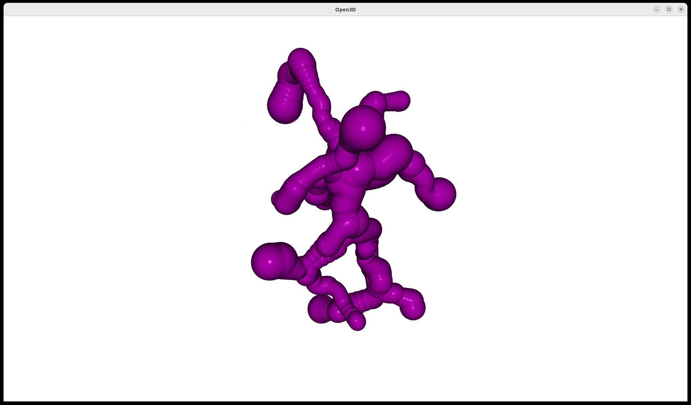
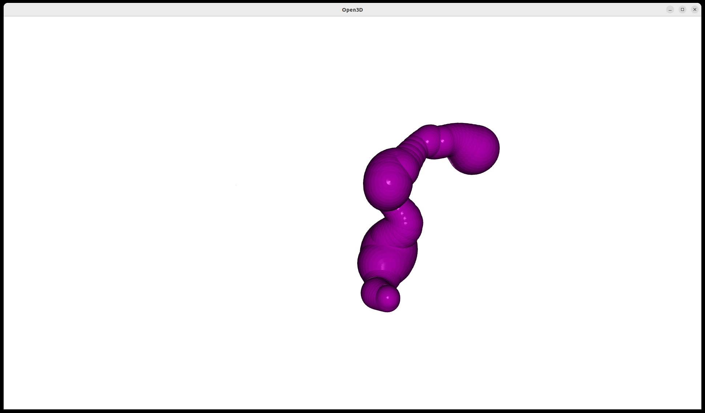

.. _cavitracer_single:

Detection of channels in multi-model PDBs
===============================================================================

In this example, we will use the NMR structure of proteorhodopsin with the
PDB code ``2L6X``, which contains 20 models in the PDB file to show how to
predict channels in multi-model PDBs. Multi-model PDB files can also contain
frames from molecular dynamics simulations (MD). Therefore, this analysis
can also be used to analyze MD trajectory in case we use some other the MD
format than ``DCD`` that is analyzed by ProDy tools. 

.. ipython:: python
   :verbatim:

   p3 = parsePDB('2L6X')

.. parsed-literal::

   @> PDB file is found in working directory (2l6x.pdb.gz).
   @> 3669 atoms and 20 coordinate set(s) were parsed in 0.29s.

To detect channels in multi-model PDB files or in MD trajectories, we need
to use :func:`.scalcChannelsMultipleFrames`.

.. ipython:: python
   :verbatim:

   channels3, surfaces3 = calcChannelsMultipleFrames(p3)

.. parsed-literal::

   @> Model: 0
   @> Detected 10 channels.
   @> No output path given.
   @> Model: 1
   @> Detected 10 channels.
   @> No output path given.
   @> Model: 2
   @> Detected 11 channels.
   @> No output path given.
   @> Model: 3
   @> Detected 11 channels.
   @> No output path given.
   @> Model: 4
   @> Detected 11 channels.
   @> No output path given.
   @> Model: 5
   @> Detected 8 channels.
   @> No output path given.
   @> Model: 6
   @> Detected 14 channels.
   @> No output path given.
   @> Model: 7
   @> Detected 9 channels.
   @> No output path given.
   @> Model: 8
   @> Detected 11 channels.
   @> No output path given.
   @> Model: 9
   @> Detected 12 channels.
   @> No output path given.
   @> Model: 10
   @> Detected 9 channels.
   @> No output path given.
   @> Model: 11
   @> Detected 10 channels.
   @> No output path given.
   @> Model: 12
   @> Detected 13 channels.
   @> No output path given.
   @> Model: 13
   @> Detected 13 channels.
   @> No output path given.
   @> Model: 14
   @> Detected 10 channels.
   @> No output path given.
   @> Model: 15
   @> Detected 12 channels.
   @> No output path given.
   @> Model: 16
   @> Detected 12 channels.
   @> No output path given.
   @> Model: 17
   @> Detected 11 channels.
   @> No output path given.
   @> Model: 18
   @> Detected 11 channels.
   @> No output path given.

Channels are storaged in a list:

.. ipython:: python
   :verbatim:

   channels3

.. parsed-literal::

    [[<prody.proteins.channels.Channel at 0x798986bc3100>,
    <prody.proteins.channels.Channel at 0x798986bc1ed0>,
    <prody.proteins.channels.Channel at 0x798986bc0250>,
    <prody.proteins.channels.Channel at 0x798986bc04f0>,
    <prody.proteins.channels.Channel at 0x798986bc01c0>,
    <prody.proteins.channels.Channel at 0x798987b3de10>,
    <prody.proteins.channels.Channel at 0x798987b3d750>,
    <prody.proteins.channels.Channel at 0x798987b3cb50>,
    <prody.proteins.channels.Channel at 0x798987b3f850>,
    <prody.proteins.channels.Channel at 0x798987b3c9d0>],
   [<prody.proteins.channels.Channel at 0x79898726c160>,
    <prody.proteins.channels.Channel at 0x79898726c940>,
    <prody.proteins.channels.Channel at 0x79898726f850>,
    <prody.proteins.channels.Channel at 0x79898726c040>,
    <prody.proteins.channels.Channel at 0x79898726fc70>,
    <prody.proteins.channels.Channel at 0x79898726e7a0>,
    <prody.proteins.channels.Channel at 0x79898726e980>,
    <prody.proteins.channels.Channel at 0x798987ae71c0>,
    <prody.proteins.channels.Channel at 0x798987ae4880>,
    <prody.proteins.channels.Channel at 0x798987ae6c50>],
   [<prody.proteins.channels.Channel at 0x798987ae5b10>,
    <prody.proteins.channels.Channel at 0x798987ae55d0>,
    <prody.proteins.channels.Channel at 0x798987ae7b20>,
    <prody.proteins.channels.Channel at 0x798987ae6740>,
    <prody.proteins.channels.Channel at 0x798987ae6e00>,
    <prody.proteins.channels.Channel at 0x7989879b5d80>,
    <prody.proteins.channels.Channel at 0x7989879b5480>,
    <prody.proteins.channels.Channel at 0x7989879b4790>,
    <prody.proteins.channels.Channel at 0x7989879b7f40>,
    <prody.proteins.channels.Channel at 0x7989879b57b0>,
    <prody.proteins.channels.Channel at 0x7989879b7cd0>],
   [<prody.proteins.channels.Channel at 0x798a05e22c20>,
   ..]]

To have acess to a particular frame/model, we should treat it as a list of
elements, where elements are predicted channels. To display channels for
frame #0, use :func:`.showChannels`:

.. ipython:: python
   :verbatim:

   showChannels(channels3[0])

We can also visualize one particular channel from model #2:

.. ipython:: python
   :verbatim:

   showChannels(channels3[2][1])

Visualization with protein required building a 3D model of the protein as a
TriangleMesh using getVmdModel. Below we will generate two models. One for
model #0 and second for model #2.

.. ipython:: python
   :verbatim:

   p3.setACSIndex(0)
   p3

.. parsed-literal::

   <AtomGroup: 2L6X (3669 atoms; active #0 of 20 coordsets)>

.. ipython:: python
   :verbatim:

   vmd_path = '/usr/local/bin/vmd'
   model3_0 = getVmdModel(vmd_path, p3)

.. parsed-literal::

   @> Model created successfully.

.. ipython:: python
   :verbatim:

   p3.setACSIndex(2)
   p3

.. parsed-literal::

   <AtomGroup: 2L6X (3669 atoms; active #2 of 20 coordsets)>

.. ipython:: python
   :verbatim:

   model3_2 = getVmdModel(vmd_path, p3)

.. parsed-literal::

   @> Model created successfully.

We generated two models, for model #0 and model #2, which contains 28210
points and 56400 triangles.

.. ipython:: python
   :verbatim:

   model3_0

.. parsed-literal::

   TriangleMesh with 28210 points and 56400 triangles.

.. ipython:: python
   :verbatim:

   model3_2

.. parsed-literal::

   TriangleMesh with 28210 points and 56400 triangles.

Access to the parameters of the channels is provided by
:func:`.getChannelParameters`:

.. ipython:: python
   :verbatim:

   getChannelParameters(channels3)

.. parsed-literal::

   @> Channel ID: 	Volume [ų] 	Length [Å] 	Bottleneck [Å]
   @> Frame 0
   @> channel 0: 	637.28 		50.19 		1.31
   @> channel 1: 	974.41 		71.83 		1.33
   @> channel 2: 	583.29 		45.78 		1.29
   @> channel 3: 	602.27 		50.83 		1.2
   @> channel 4: 	567.42 		38.32 		1.33
   @> channel 5: 	238.61 		20.94 		1.33
   @> channel 6: 	777.38 		60.02 		1.33
   @> channel 7: 	742.96 		58.94 		1.33
   @> channel 8: 	537.66 		43.02 		1.33
   @> channel 9: 	608.01 		59.1 		1.26
   @> Frame 1
   @> channel 0: 	429.63 		34.44 		1.17
   @> channel 1: 	282.76 		23.45 		1.17
   @> channel 2: 	651.0 		42.67 		1.17
   @> channel 3: 	577.45 		43.34 		1.17
   @> channel 4: 	506.74 		45.26 		1.17
   @> channel 5: 	566.3 		43.73 		1.17
   @> channel 6: 	735.48 		52.24 		1.17
   @> channel 7: 	616.38 		40.01 		1.17
   @> channel 8: 	319.96 		38.34 		1.17
   @> channel 9: 	143.11 		12.96 		1.23
   @> Frame 2
   @> channel 0: 	765.54 		49.58 		1.23
   @> channel 1: 	594.32 		36.42 		1.29
   @> channel 2: 	577.01 		38.35 		1.21
   @> channel 3: 	1024.87 		68.2 		1.23
   @> channel 4: 	673.95 		42.82 		1.29
   @> channel 5: 	1064.34 		76.67 		1.27
   @> channel 6: 	570.84 		28.65 		1.29
   @> channel 7: 	517.45 		25.8 		1.29
   @> channel 8: 	933.33 		73.52 		1.25
   @> channel 9: 	516.23 		31.16 		1.29
   @> channel 10: 	851.02 		56.25 		1.21
   @> Frame 3
   @> channel 0: 	668.43 		58.95 		1.13
   @> channel 1: 	976.64 		78.36 		1.21
   @> channel 2: 	670.51 		32.22 		1.21
   @> channel 3: 	410.94 		28.9 		1.21
   @> channel 4: 	853.59 		67.75 		1.21
   @> channel 5: 	470.06 		38.07 		1.21
   @> channel 6: 	628.66 		32.9 		1.21
   @> channel 7: 	572.14 		40.42 		1.21
   @> channel 8: 	663.85 		50.14 		1.21
   @> channel 9: 	605.53 		56.89 		1.21
   @> channel 10: 	583.42 		38.48 		1.21
   @> Frame 4
   @> channel 0: 	703.36 		51.06 		1.22
   @> channel 1: 	1216.13 		108.55 		1.22
   @> channel 2: 	324.48 		27.55 		1.22
   @> channel 3: 	482.35 		42.41 		1.22
   @> channel 4: 	1049.38 		77.94 		1.22
   @> channel 5: 	649.91 		35.99 		1.22
   @> channel 6: 	657.11 		56.46 		1.22
   @> channel 7: 	1063.54 		97.6 		1.22
   @> channel 8: 	1113.29 		106.2 		1.22
   @> channel 9: 	925.5 		83.76 		1.22
   @> channel 10: 	442.14 		39.93 		1.16
   @> Frame 5
   @> channel 0: 	612.55 		28.02 		1.27
   @> channel 1: 	611.7 		36.94 		1.27
   @> channel 2: 	675.99 		64.5 		1.18
   @> channel 3: 	622.59 		46.82 		1.27
   @> channel 4: 	327.43 		25.92 		1.18
   @> channel 5: 	773.48 		73.11 		1.18
   @> channel 6: 	648.38 		49.77 		1.27
   @> channel 7: 	490.25 		33.2 		1.27
   @> Frame 6
   @> channel 0: 	776.04 		59.65 		1.27
   @> channel 1: 	634.92 		36.52 		1.27
   @> channel 2: 	538.01 		35.41 		1.27
   @> channel 3: 	686.76 		56.97 		1.26
   @> channel 4: 	541.85 		42.03 		1.26
   @> channel 5: 	474.92 		45.6 		1.21
   @> channel 6: 	457.88 		39.7 		1.26
   @> channel 7: 	761.85 		59.02 		1.16
   @> channel 8: 	708.47 		48.59 		1.26
   @> channel 9: 	452.77 		38.84 		1.27
   @> channel 10: 	625.82 		47.54 		1.27
   @> channel 11: 	222.95 		19.49 		1.22
   @> channel 12: 	291.96 		34.09 		1.21
   @> channel 13: 	218.85 		22.37 		1.19
   @> Frame 7
   @> channel 0: 	570.15 		26.0 		1.24
   @> channel 1: 	465.82 		45.88 		1.21
   @> channel 2: 	485.92 		40.42 		1.21
   @> channel 3: 	543.91 		44.43 		1.24
   @> channel 4: 	1045.3 		70.71 		1.15
   @> channel 5: 	603.59 		49.18 		1.17
   @> channel 6: 	418.63 		31.08 		1.24
   @> channel 7: 	603.77 		42.53 		1.16
   @> channel 8: 	310.89 		25.17 		1.24
   @> Frame 8
   @> channel 0: 	1055.84 		85.67 		1.17
   @> channel 1: 	664.34 		45.42 		1.25
   @> channel 2: 	1213.39 		96.42 		1.17
   @> channel 3: 	879.21 		60.1 		1.25
   @> channel 4: 	441.49 		35.82 		1.25
   @> channel 5: 	461.51 		35.51 		1.25
   @> channel 6: 	448.17 		39.98 		1.23
   @> channel 7: 	722.32 		61.18 		1.25
   @> channel 8: 	387.43 		31.99 		1.25
   @> channel 9: 	691.32 		50.16 		1.25
   @> channel 10: 	307.16 		35.65 		1.24
   ..
   ..
   @> Frame 17
   @> channel 0: 	532.57 		28.1 		1.27
   @> channel 1: 	765.12 		51.2 		1.27
   @> channel 2: 	956.62 		65.85 		1.27
   @> channel 3: 	654.11 		58.81 		1.25
   @> channel 4: 	739.8 		61.93 		1.25
   @> channel 5: 	1178.41 		81.2 		1.27
   @> channel 6: 	765.0 		54.01 		1.27
   @> channel 7: 	758.55 		54.49 		1.27
   @> channel 8: 	808.05 		53.16 		1.17
   @> channel 9: 	556.39 		34.85 		1.27
   @> channel 10: 	1383.79 		105.29 		1.27
   @> Frame 18
   @> channel 0: 	393.13 		39.09 		1.25
   @> channel 1: 	953.06 		69.43 		1.23
   @> channel 2: 	1164.29 		80.85 		1.22
   @> channel 3: 	535.81 		51.2 		1.23
   @> channel 4: 	923.7 		61.91 		1.23
   @> channel 5: 	371.19 		38.42 		1.24
   @> channel 6: 	1064.27 		90.59 		1.18
   @> channel 7: 	685.76 		69.22 		1.25
   @> channel 8: 	273.71 		28.1 		1.24
   @> channel 9: 	222.94 		29.14 		1.23
   @> channel 10: 	136.04 		13.04 		1.31

   [([50.19335440126805,
      71.83441144451243,
      45.77790300676726,
      50.8271134451361,
      38.31744227721762,
      20.94187773687732,
      60.01586915914128,
      58.943756891194326,
      43.024875178474204,
      59.098424271910076],
     [1.3129739506836307,
      1.3302016150531915,
      1.294568005819322,
      1.2008504248326795,
      1.3302016150531915,
      1.3302016150531915,
      1.3302016150531915,
      1.3302016150531915,
      1.3302016150531915,
      1.260366999934697],
     [637.2777960903147,
      974.4076390263172,
      583.287660628441,
      602.2651685492888,
      567.4241275063218,
      238.61469234520717,
      777.3849663127493,
      742.959852448335,
      537.6598046904968,
      608.0129166908057]),
      ..])]
