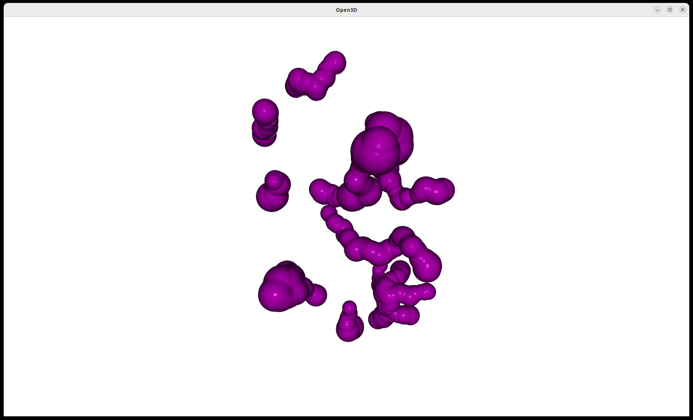
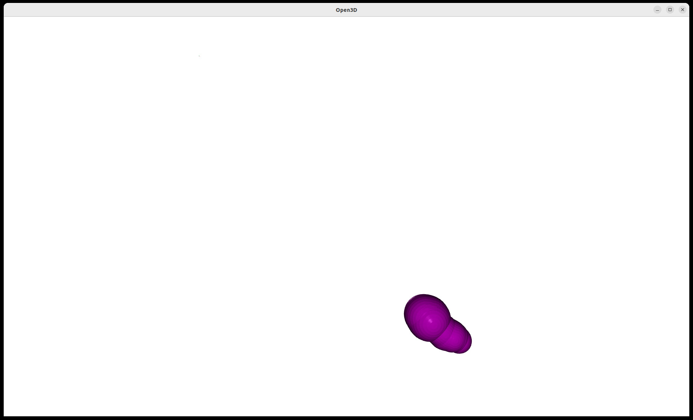
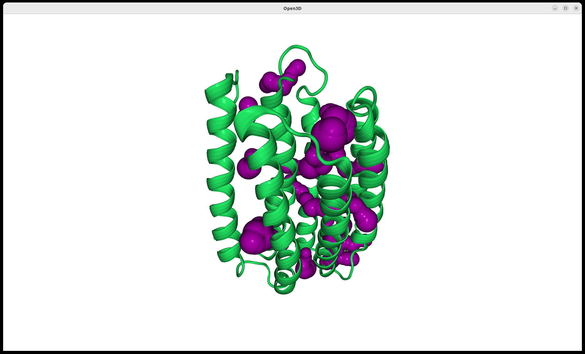
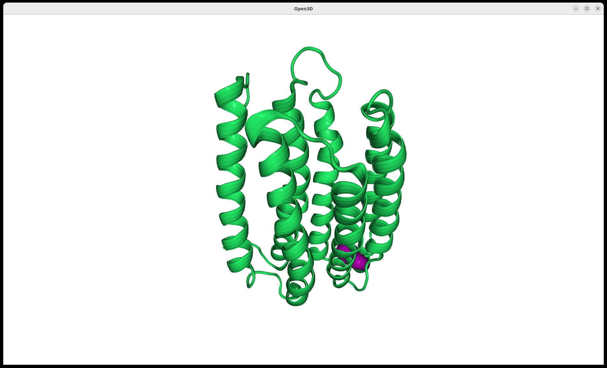
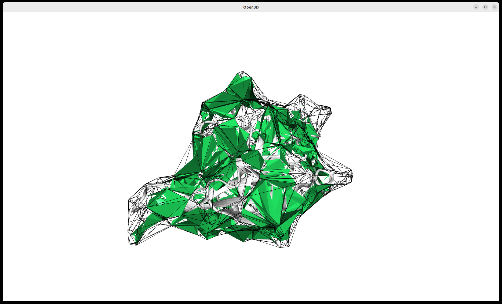
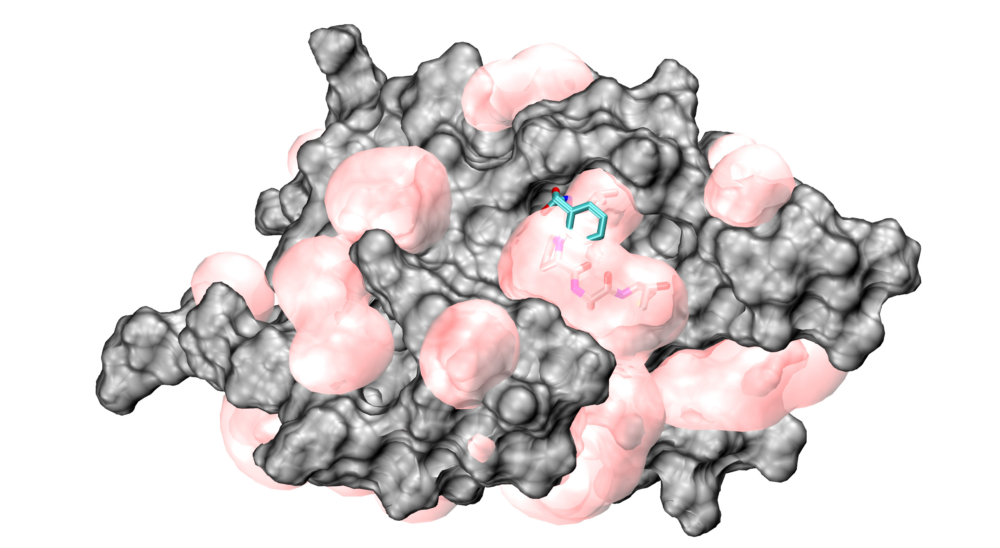

.. _cavitracer_single:

I. Detection of channels in multi-model PDBs
===============================================================================

In this example, we will use the NMR structure of proteorhodopsin with the
PDB code ``2L6X``, which contains 20 models in the PDB file to show how to
predict channels in multi-model PDBs. Multi-model PDB files can also contain
frames from molecular dynamics simulations (MD). Therefore, this analysis
can also be used to analyze MD trajectory in case we use some other the MD
format than ``DCD`` that is analyzed by ProDy tools. 

.. ipython:: python
   :verbatim:

   p3 = parsePDB('2L6X')

.. parsed-literal::

   @> Connecting wwPDB FTP server RCSB PDB (USA).
   @> Downloading PDB files via FTP failed, trying HTTP.
   @> 2l6x downloaded (2l6x.pdb.gz)
   @> PDB download via HTTP completed (1 downloaded, 0 failed).
   @> 3669 atoms and 20 coordinate set(s) were parsed in 0.23s.

To detect channels in multi-model PDB files or in MD trajectories, we need
to use :func:`.scalcChannelsMultipleFrames`. To speed up the calculations,
``max_proc`` can be used. Below, we are using four processors.

.. ipython:: python
   :verbatim:

   channels3, surfaces3 = calcChannelsMultipleFrames(p3, max_proc=4)

.. parsed-literal::

   @> Frame/model: 0
   @> Frame/model: 2
   @> Frame/model: 4
   @> Frame/model: 6
   @> WARNING The atoms supplied to calcChannels() contain non-protein components: non-water hetero components: 48 atoms (resnames: RET). All supplied atoms except waters will be used for channel analysis. To analyze only the protein structure, provide an appropriate selection, for example atoms.select('protein').
   @> WARNING The atoms supplied to calcChannels() contain non-protein components: non-water hetero components: 48 atoms (resnames: RET). All supplied atoms except waters will be used for channel analysis. To analyze only the protein structure, provide an appropriate selection, for example atoms.select('protein').
   @> WARNING The atoms supplied to calcChannels() contain non-protein components: non-water hetero components: 48 atoms (resnames: RET). All supplied atoms except waters will be used for channel analysis. To analyze only the protein structure, provide an appropriate selection, for example atoms.select('protein').
   @> WARNING The atoms supplied to calcChannels() contain non-protein components: non-water hetero components: 48 atoms (resnames: RET). All supplied atoms except waters will be used for channel analysis. To analyze only the protein structure, provide an appropriate selection, for example atoms.select('protein').
   @> Substituted 3669 atoms with 48645 homogeneous balls of radius 1.20 A in 0.19s.
   @> Substituted 3669 atoms with 48645 homogeneous balls of radius 1.20 A in 0.18s.
   @> Substituted 3669 atoms with 48645 homogeneous balls of radius 1.20 A in 0.18s.
   @> Substituted 3669 atoms with 48645 homogeneous balls of radius 1.20 A in 0.18s.
   @> Delaunay tessellation of 48645 points constructed in 2.36s.
   @> Delaunay tessellation of 48645 points constructed in 2.35s.
   @> Delaunay tessellation of 48645 points constructed in 2.39s.
   @> Delaunay tessellation of 48645 points constructed in 2.39s.
   @> Surface and inner simplices filtered in 3.00s.
   @> Surface and inner simplices filtered in 3.00s.
   @> Surface and inner simplices filtered in 3.02s.
   @> Surface and inner simplices filtered in 3.08s.
   @> 2 surface cavities detected and filtered in 0.38s.
   @> 3 surface cavities detected and filtered in 0.38s.
   @> 4 surface cavities detected and filtered in 0.37s.
   @> 2 surface cavities detected and filtered in 0.42s.
   @> Channel pathfinding (graph Dijkstra) over 4 cavities completed in 1.65s.
   @> Detected 21 channels.
   @> No output path given.
   @> Channel calculation completed in 7.65s.
   @> Frame/model: 7
   @> WARNING The atoms supplied to calcChannels() contain non-protein components: non-water hetero components: 48 atoms (resnames: RET). All supplied atoms except waters will be used for channel analysis. To analyze only the protein structure, provide an appropriate selection, for example atoms.select('protein').
   @> Substituted 3669 atoms with 48645 homogeneous balls of radius 1.20 A in 0.16s.
   @> Channel pathfinding (graph Dijkstra) over 3 cavities completed in 2.28s.
   @> Detected 40 channels.
   @> No output path given.
   @> Channel calculation completed in 8.24s.
   @> Frame/model: 5
   @> WARNING The atoms supplied to calcChannels() contain non-protein components: non-water hetero components: 48 atoms (resnames: RET). All supplied atoms except waters will be used for channel analysis. To analyze only the protein structure, provide an appropriate selection, for example atoms.select('protein').
   @> Channel pathfinding (graph Dijkstra) over 2 cavities completed in 2.45s.
   @> Detected 32 channels.
   @> No output path given.
   @> Channel calculation completed in 8.38s.
   @> Frame/model: 3
   @> WARNING The atoms supplied to calcChannels() contain non-protein components: non-water hetero components: 48 atoms (resnames: RET). All supplied atoms except waters will be used for channel analysis. To analyze only the protein structure, provide an appropriate selection, for example atoms.select('protein').
   @> Substituted 3669 atoms with 48645 homogeneous balls of radius 1.20 A in 0.17s.
   @> Substituted 3669 atoms with 48645 homogeneous balls of radius 1.20 A in 0.17s.
   @> Delaunay tessellation of 48645 points constructed in 1.92s.
   @> Delaunay tessellation of 48645 points constructed in 2.04s.
   @> Delaunay tessellation of 48645 points constructed in 2.09s.
   @> Channel pathfinding (graph Dijkstra) over 2 cavities completed in 4.81s.
   @> Detected 39 channels.
   @> No output path given.
   @> Channel calculation completed in 10.84s.
   @> Frame/model: 1
   @> WARNING The atoms supplied to calcChannels() contain non-protein components: non-water hetero components: 48 atoms (resnames: RET). All supplied atoms except waters will be used for channel analysis. To analyze only the protein structure, provide an appropriate selection, for example atoms.select('protein').
   @> Substituted 3669 atoms with 48645 homogeneous balls of radius 1.20 A in 0.19s.
   @> Surface and inner simplices filtered in 2.79s.
   @> 4 surface cavities detected and filtered in 0.45s.
   @> Surface and inner simplices filtered in 2.68s.
   @> Delaunay tessellation of 48645 points constructed in 2.25s.
   @> Surface and inner simplices filtered in 2.75s.
   @> 4 surface cavities detected and filtered in 0.40s.
   @> 5 surface cavities detected and filtered in 0.39s.
   @> Channel pathfinding (graph Dijkstra) over 4 cavities completed in 1.86s.
   @> Detected 40 channels.
   @> No output path given.
   @> Channel calculation completed in 7.19s.
   @> Frame/model: 8
   @> WARNING The atoms supplied to calcChannels() contain non-protein components: non-water hetero components: 48 atoms (resnames: RET). All supplied atoms except waters will be used for channel analysis. To analyze only the protein structure, provide an appropriate selection, for example atoms.select('protein').
   @> Substituted 3669 atoms with 48645 homogeneous balls of radius 1.20 A in 0.19s.
   @> Surface and inner simplices filtered in 2.23s.
   @> Channel pathfinding (graph Dijkstra) over 4 cavities completed in 2.04s.
   @> Detected 41 channels.
   @> No output path given.
   @> Channel calculation completed in 7.35s.
   @> Frame/model: 10
   @> WARNING The atoms supplied to calcChannels() contain non-protein components: non-water hetero components: 48 atoms (resnames: RET). All supplied atoms except waters will be used for channel analysis. To analyze only the protein structure, provide an appropriate selection, for example atoms.select('protein').
   @> Channel pathfinding (graph Dijkstra) over 5 cavities completed in 1.98s.
   @> Detected 33 channels.
   @> No output path given.
   @> Channel calculation completed in 7.40s.
   @> Frame/model: 12
   @> Substituted 3669 atoms with 48645 homogeneous balls of radius 1.20 A in 0.18s.
   @> WARNING The atoms supplied to calcChannels() contain non-protein components: non-water hetero components: 48 atoms (resnames: RET). All supplied atoms except waters will be used for channel analysis. To analyze only the protein structure, provide an appropriate selection, for example atoms.select('protein').
   @> 4 surface cavities detected and filtered in 0.38s.
   @> Substituted 3669 atoms with 48645 homogeneous balls of radius 1.20 A in 0.18s.
   @> Delaunay tessellation of 48645 points constructed in 1.96s.
   @> Channel pathfinding (graph Dijkstra) over 4 cavities completed in 1.80s.
   @> Detected 27 channels.
   @> No output path given.
   @> Channel calculation completed in 6.87s.
   @> Frame/model: 14
   @> WARNING The atoms supplied to calcChannels() contain non-protein components: non-water hetero components: 48 atoms (resnames: RET). All supplied atoms except waters will be used for channel analysis. To analyze only the protein structure, provide an appropriate selection, for example atoms.select('protein').
   @> Delaunay tessellation of 48645 points constructed in 2.15s.
   @> Substituted 3669 atoms with 48645 homogeneous balls of radius 1.20 A in 0.24s.
   @> Delaunay tessellation of 48645 points constructed in 2.13s.
   @> Surface and inner simplices filtered in 2.73s.
   @> 2 surface cavities detected and filtered in 0.45s.
   @> Delaunay tessellation of 48645 points constructed in 2.29s.
   @> Surface and inner simplices filtered in 2.70s.
   @> Surface and inner simplices filtered in 2.57s.
   @> 1 surface cavities detected and filtered in 0.41s.
   @> 5 surface cavities detected and filtered in 0.39s.
   @> Surface and inner simplices filtered in 2.20s.
   @> 2 surface cavities detected and filtered in 0.35s.
   @> Channel pathfinding (graph Dijkstra) over 5 cavities completed in 1.89s.
   @> Detected 31 channels.
   @> No output path given.
   @> Channel calculation completed in 7.17s.
   @> Frame/model: 13
   @> WARNING The atoms supplied to calcChannels() contain non-protein components: non-water hetero components: 48 atoms (resnames: RET). All supplied atoms except waters will be used for channel analysis. To analyze only the protein structure, provide an appropriate selection, for example atoms.select('protein').
   @> Substituted 3669 atoms with 48645 homogeneous balls of radius 1.20 A in 0.16s.
   @> Channel pathfinding (graph Dijkstra) over 2 cavities completed in 2.96s.
   @> Detected 28 channels.
   @> No output path given.
   @> Channel calculation completed in 8.31s.
   @> Frame/model: 9
   @> WARNING The atoms supplied to calcChannels() contain non-protein components: non-water hetero components: 48 atoms (resnames: RET). All supplied atoms except waters will be used for channel analysis. To analyze only the protein structure, provide an appropriate selection, for example atoms.select('protein').
   @> Substituted 3669 atoms with 48645 homogeneous balls of radius 1.20 A in 0.17s.
   @> Channel pathfinding (graph Dijkstra) over 1 cavities completed in 2.65s.
   @> Detected 34 channels.
   @> No output path given.
   @> Channel calculation completed in 8.10s.
   @> Frame/model: 11
   @> WARNING The atoms supplied to calcChannels() contain non-protein components: non-water hetero components: 48 atoms (resnames: RET). All supplied atoms except waters will be used for channel analysis. To analyze only the protein structure, provide an appropriate selection, for example atoms.select('protein').
   @> Substituted 3669 atoms with 48645 homogeneous balls of radius 1.20 A in 0.17s.
   @> Delaunay tessellation of 48645 points constructed in 1.98s.
   @> Delaunay tessellation of 48645 points constructed in 2.04s.
   @> Channel pathfinding (graph Dijkstra) over 2 cavities completed in 2.90s.
   @> Detected 30 channels.
   @> No output path given.
   @> Channel calculation completed in 8.00s.
   @> Frame/model: 15
   @> WARNING The atoms supplied to calcChannels() contain non-protein components: non-water hetero components: 48 atoms (resnames: RET). All supplied atoms except waters will be used for channel analysis. To analyze only the protein structure, provide an appropriate selection, for example atoms.select('protein').
   @> Delaunay tessellation of 48645 points constructed in 2.06s.
   @> Substituted 3669 atoms with 48645 homogeneous balls of radius 1.20 A in 0.20s.
   @> Surface and inner simplices filtered in 2.84s.
   @> Surface and inner simplices filtered in 2.70s.
   @> Delaunay tessellation of 48645 points constructed in 2.33s.
   @> 4 surface cavities detected and filtered in 0.44s.
   @> 3 surface cavities detected and filtered in 0.39s.
   @> Surface and inner simplices filtered in 2.90s.
   @> Channel pathfinding (graph Dijkstra) over 3 cavities completed in 0.65s.
   @> Detected 15 channels.
   @> No output path given.
   @> Channel calculation completed in 5.96s.
   @> Frame/model: 16
   @> WARNING The atoms supplied to calcChannels() contain non-protein components: non-water hetero components: 48 atoms (resnames: RET). All supplied atoms except waters will be used for channel analysis. To analyze only the protein structure, provide an appropriate selection, for example atoms.select('protein').
   @> 6 surface cavities detected and filtered in 0.46s.
   @> Substituted 3669 atoms with 48645 homogeneous balls of radius 1.20 A in 0.20s.
   @> Channel pathfinding (graph Dijkstra) over 4 cavities completed in 2.26s.
   @> Detected 30 channels.
   @> No output path given.
   @> Channel calculation completed in 7.69s.
   @> Surface and inner simplices filtered in 2.38s.
   @> Frame/model: 18
   @> WARNING The atoms supplied to calcChannels() contain non-protein components: non-water hetero components: 48 atoms (resnames: RET). All supplied atoms except waters will be used for channel analysis. To analyze only the protein structure, provide an appropriate selection, for example atoms.select('protein').
   @> Channel pathfinding (graph Dijkstra) over 6 cavities completed in 1.56s.
   @> Detected 28 channels.
   @> No output path given.
   @> Channel calculation completed in 7.16s.
   @> Substituted 3669 atoms with 48645 homogeneous balls of radius 1.20 A in 0.18s.
   @> 2 surface cavities detected and filtered in 0.40s.
   @> Delaunay tessellation of 48645 points constructed in 1.98s.
   @> Delaunay tessellation of 48645 points constructed in 2.19s.
   @> Channel pathfinding (graph Dijkstra) over 2 cavities completed in 2.46s.
   @> Detected 23 channels.
   @> No output path given.
   @> Channel calculation completed in 7.78s.
   @> Surface and inner simplices filtered in 2.21s.
   @> 5 surface cavities detected and filtered in 0.44s.
   @> Surface and inner simplices filtered in 2.19s.
   @> Channel pathfinding (graph Dijkstra) over 5 cavities completed in 1.24s.
   @> Detected 27 channels.
   @> No output path given.
   @> Channel calculation completed in 6.09s.
   @> Frame/model: 17
   @> WARNING The atoms supplied to calcChannels() contain non-protein components: non-water hetero components: 48 atoms (resnames: RET). All supplied atoms except waters will be used for channel analysis. To analyze only the protein structure, provide an appropriate selection, for example atoms.select('protein').
   @> Substituted 3669 atoms with 48645 homogeneous balls of radius 1.20 A in 0.16s.
   @> 3 surface cavities detected and filtered in 0.38s.
   @> Delaunay tessellation of 48645 points constructed in 1.78s.
   @> Channel pathfinding (graph Dijkstra) over 3 cavities completed in 3.04s.
   @> Detected 36 channels.
   @> No output path given.
   @> Channel calculation completed in 7.99s.
   @> Surface and inner simplices filtered in 2.04s.
   @> 2 surface cavities detected and filtered in 0.32s.
   @> Channel pathfinding (graph Dijkstra) over 2 cavities completed in 2.64s.
   @> Detected 31 channels.
   @> No output path given.
   @> Channel calculation completed in 6.95s.

Channels are stored in a list:

.. ipython:: python
   :verbatim:

   channels3

.. parsed-literal::

    [[<prody.proteins.channels.Channel at 0x798986bc3100>,
    <prody.proteins.channels.Channel at 0x798986bc1ed0>,
    <prody.proteins.channels.Channel at 0x798986bc0250>,
    <prody.proteins.channels.Channel at 0x798986bc04f0>,
    <prody.proteins.channels.Channel at 0x798986bc01c0>,
    <prody.proteins.channels.Channel at 0x798987b3de10>,
    <prody.proteins.channels.Channel at 0x798987b3d750>,
    <prody.proteins.channels.Channel at 0x798987b3cb50>,
   [<prody.proteins.channels.Channel at 0x798a05e22c20>,
   ..]]

To have acess to a particular frame/model, we should treat it as a list of
elements, where elements are predicted channels. To display channels for
model #0, use :func:`.showChannels`:

.. ipython:: python
   :verbatim:

   showChannels(channels3[0])

We can also visualize one particular channel from model #2:

.. ipython:: python
   :verbatim:

   showChannels(channels3[2][1])

Visualization with protein required building a 3D model of the protein as a
TriangleMesh using :func:`.getVmdModel`. Below we will generate two models.
One for model #0 and second for model #2.

.. ipython:: python
   :verbatim:

   p3.setACSIndex(0)
   p3

.. parsed-literal::

   <AtomGroup: 2L6X (3669 atoms; active #0 of 20 coordsets)>

.. ipython:: python
   :verbatim:

   vmd_path = '/usr/local/bin/vmd'
   model3_0 = getVmdModel(vmd_path, p3)

.. parsed-literal::

   @> Model created successfully.

.. ipython:: python
   :verbatim:

   p3.setACSIndex(2)
   p3

.. parsed-literal::

   <AtomGroup: 2L6X (3669 atoms; active #2 of 20 coordsets)>

.. ipython:: python
   :verbatim:

   model3_2 = getVmdModel(vmd_path, p3)

.. parsed-literal::

   @> Model created successfully.

We generated two models, for model #0 and model #2, which contains 28210
points and 56400 triangles.

.. ipython:: python
   :verbatim:

   model3_0

.. parsed-literal::

   TriangleMesh with 28210 points and 56400 triangles.

.. ipython:: python
   :verbatim:

   showChannels(channels3[0], model=model3_0)

.. ipython:: python
   :verbatim:

   model3_2

.. parsed-literal::

   TriangleMesh with 28210 points and 56400 triangles.

.. ipython:: python
   :verbatim:

   showChannels(channels3[2][1], model=model3_2)

Access to the parameters of the channels is provided by
:func:`.getChannelParameters`:

.. ipython:: python
   :verbatim:

   getChannelParameters(channels3)

.. parsed-literal::

   @> Channel ID:        Volume [ų]     Length [Å]      Bottleneck [Å]
   @> Frame 0
   @> channel 0:   50.35           7.87            0.94
   @> channel 1:   204.12          23.27           0.91
   @> channel 2:   219.95          30.39           0.75
   @> channel 3:   207.9           31.91           0.75
   @> channel 4:   229.21          33.58           0.75
   @> channel 5:   274.42          34.34           0.82
   @> channel 6:   231.8           35.53           0.82
   @> channel 7:   266.15          39.95           0.87
   @> channel 8:   229.22          40.47           0.84
   @> channel 9:   248.58          42.53           0.84
   @> channel 10:  235.72          41.62           0.84
   @> channel 11:  290.94          44.33           0.84
   @> channel 12:  240.1           42.24           0.84
   @> channel 13:  240.31          41.62           0.84
   @> channel 14:  233.43          42.56           0.84
   @> channel 15:  323.34          50.23           0.87
   @> channel 16:  237.42          43.93           0.84
   @> channel 17:  435.23          61.28           0.87
   @> channel 18:  478.35          64.0            0.87
   @> channel 19:  487.84          64.71           0.87
   @> channel 20:  328.13          54.29           0.87
   @> channel 21:  453.03          63.56           0.87
   @> channel 22:  448.05          64.02           0.87
   @> channel 23:  459.39          65.35           0.87
   @> channel 24:  434.39          64.32           0.87
   @> channel 25:  300.19          52.58           0.86
   @> channel 26:  333.64          55.79           0.87
   @> channel 27:  437.23          65.98           0.87
   @> channel 28:  421.99          64.59           0.87
   @> channel 29:  388.67          65.8            0.87
   @> channel 30:  508.69          79.85           0.87
   @> channel 31:  601.28          82.55           0.87
   @> channel 32:  563.9           87.34           0.87
   @> channel 33:  498.51          82.35           0.87
   @> channel 34:  588.61          89.38           0.87
   @> channel 35:  604.06          95.48           0.87
   @> channel 36:  645.49          98.07           0.87
   @> channel 37:  640.81          101.0           0.87
   @> channel 38:  651.76          101.68          0.87
   @> Frame 1
   @> channel 0:   31.02           6.98            0.88
   @> channel 1:   172.96          18.89           0.89
   @> channel 2:   113.37          14.76           0.95
   @> channel 3:   165.52          20.29           0.89
   @> channel 4:   170.4           22.51           0.89
   @> channel 5:   185.08          24.48           0.89
   @> channel 6:   197.74          25.2            0.89
   @> channel 7:   186.87          25.39           0.89
   @> channel 8:   169.1           24.42           0.76
   @> channel 9:   133.98          23.12           0.76
   @> channel 10:  174.4           25.22           0.76
   @> channel 11:  174.0           26.02           0.91
   @> channel 12:  268.87          31.87           0.91
   @> channel 13:  216.81          32.83           0.89
   @> channel 14:  189.25          28.8            0.91
   @> channel 15:  246.48          32.71           0.91
   @> channel 16:  209.96          33.44           0.89
   @> channel 17:  257.43          33.15           0.88
   @> channel 18:  191.3           31.78           0.76
   @> channel 19:  264.89          41.98           0.91
   @> channel 20:  289.9           41.66           0.76
   @> channel 21:  314.05          45.16           0.76
   @> channel 22:  338.35          46.35           0.76
   @> channel 23:  305.38          43.66           0.76
   @> channel 24:  296.0           46.45           0.76
   @> channel 25:  299.9           50.01           0.76
   @> channel 26:  293.71          46.72           0.26
   @> Frame 2
   @> channel 0:   27.89           5.51            0.91
   @> channel 1:   156.17          23.55           0.93
   @> channel 2:   219.99          29.07           0.93
   @> channel 3:   260.85          33.49           0.93
   @> channel 4:   225.6           31.97           0.93
   @> channel 5:   239.09          33.77           0.93
   @> channel 6:   244.01          34.13           0.92
   @> channel 7:   171.47          29.72           0.85
   @> channel 8:   244.8           36.09           0.89
   @> channel 9:   342.59          38.41           0.92
   @> channel 10:  271.43          37.81           0.92
   @> channel 11:  376.41          44.38           0.93
   @> channel 12:  372.05          45.48           0.93
   @> channel 13:  406.95          45.25           0.92
   @> channel 14:  138.58          26.43           0.68
   @> channel 15:  379.57          44.74           0.92
   @> channel 16:  143.53          27.32           0.68
   @> channel 17:  254.82          39.11           0.93
   @> channel 18:  260.97          35.88           0.83
   @> channel 19:  322.4           38.45           0.83
   @> channel 20:  377.61          46.64           0.85
   @> channel 21:  267.95          42.48           0.88
   @> channel 22:  275.63          42.79           0.93
   @> channel 23:  257.42          42.88           0.83
   @> channel 24:  271.99          45.25           0.88
   @> channel 25:  272.41          45.09           0.88
   @> channel 26:  215.81          36.99           0.5
   @> channel 27:  265.37          40.4            0.79
   @> channel 28:  225.24          41.15           0.79
   @> channel 29:  289.1           50.86           0.83
   @> channel 30:  331.49          55.31           0.83
   @> channel 31:  316.45          56.15           0.83
   @> Frame 3
   @> channel 0:   35.5            6.24            0.96
   @> channel 1:   38.15           7.22            0.95
   @> channel 2:   25.65           7.31            0.8
   @> channel 3:   106.64          15.12           0.73
   @> channel 4:   245.65          26.28           0.94
   @> channel 5:   226.2           21.73           0.84
   @> channel 6:   108.27          17.37           0.73
   @> channel 7:   181.35          20.12           0.73
   @> channel 8:   170.96          24.42           0.94
   @> channel 9:   184.72          26.3            0.94
   @> channel 10:  186.56          24.67           0.84
   @> channel 11:  160.6           24.18           0.94
   @> channel 12:  183.7           26.71           0.94
   @> channel 13:  174.53          26.44           0.84
   @> channel 14:  232.98          28.63           0.84
   @> channel 15:  282.1           31.15           0.94
   @> channel 16:  201.64          27.79           0.84
   @> channel 17:  235.83          31.74           0.94
   @> channel 18:  245.98          32.23           0.94
   @> channel 19:  235.05          31.27           0.93
   @> channel 20:  139.77          23.6            0.77
   @> channel 21:  231.52          32.12           0.93
   @> channel 22:  221.47          29.9            0.84
   @> channel 23:  242.5           34.87           0.84
   @> channel 24:  265.86          36.53           0.84
   @> channel 25:  150.62          27.24           0.77
   @> channel 26:  204.6           30.34           0.84
   @> channel 27:  244.46          36.09           0.84
   @> channel 28:  194.5           35.68           0.94
   @> channel 29:  238.23          35.95           0.78
   @> channel 30:  261.45          38.99           0.84
   @> channel 31:  225.28          36.67           0.77
   @> channel 32:  228.62          37.77           0.77
   @> Frame 4
   @> channel 0:   57.12           8.39            0.8
   @> channel 1:   151.42          14.99           0.94
   @> channel 2:   173.4           15.5            0.94
   @> channel 3:   116.65          16.04           0.94
   @> channel 4:   138.63          17.67           0.94
   @> channel 5:   104.44          16.17           0.94
   @> channel 6:   71.39           14.61           0.77
   @> channel 7:   203.58          22.03           0.77
   @> channel 8:   153.88          22.93           0.77
   @> channel 9:   150.84          24.62           0.77
   @> channel 10:  125.75          22.85           0.77
   @> channel 11:  148.25          26.91           0.77
   @> channel 12:  192.71          29.94           0.74
   @> channel 13:  238.41          33.1            0.74
   @> channel 14:  196.76          31.22           0.74
   @> channel 15:  237.12          35.08           0.74
   @> channel 16:  152.99          29.22           0.77
   @> channel 17:  148.89          28.11           0.72
   @> channel 18:  163.18          30.41           0.77
   @> channel 19:  151.82          29.99           0.77
   @> channel 20:  256.97          37.45           0.74
   @> channel 21:  236.11          36.4            0.74
   @> channel 22:  341.36          42.59           0.74
   @> channel 23:  266.02          40.09           0.74
   @> channel 24:  281.06          40.57           0.74
   @> channel 25:  305.79          43.46           0.74
   @> channel 26:  266.11          42.06           0.74
   @> channel 27:  286.53          44.55           0.74
   @> channel 28:  281.49          44.55           0.74
   @> channel 29:  303.82          47.72           0.74
   @> channel 30:  396.43          51.51           0.74
   @> channel 31:  352.95          51.11           0.74
   @> channel 32:  376.95          53.05           0.74
   @> channel 33:  375.11          54.74           0.74
   @> channel 34:  377.24          55.32           0.74
   @> channel 35:  403.1           57.97           0.74
   @> channel 36:  400.48          59.87           0.74
   @> channel 37:  388.38          57.6            0.74
   @> channel 38:  415.38          61.58           0.74
   @> channel 39:  438.08          60.59           0.74
   @> Frame 5
   @> channel 0:   33.06           6.93            0.82
   @> channel 1:   56.06           8.06            0.82
   @> channel 2:   59.28           9.92            0.84
   @> channel 3:   50.72           9.03            0.88
   @> channel 4:   75.81           11.42           0.84
   @> channel 5:   72.02           13.21           0.84
   @> channel 6:   47.94           9.85            0.68
   @> channel 7:   214.77          22.14           0.92
   @> channel 8:   97.84           16.78           0.84
   @> channel 9:   167.42          22.61           0.92
   @> channel 10:  141.26          23.02           0.92
   @> channel 11:  261.98          30.01           0.85
   @> channel 12:  199.41          26.86           0.85
   @> channel 13:  206.86          29.0            0.9
   @> channel 14:  252.05          32.97           0.85
   @> channel 15:  182.52          27.39           0.85
   @> channel 16:  285.0           35.72           0.85
   @> channel 17:  282.88          36.53           0.85
   @> channel 18:  362.2           40.89           0.85
   @> channel 19:  278.26          37.23           0.85
   @> channel 20:  190.95          30.51           0.85
   @> channel 21:  320.11          40.89           0.85
   @> channel 22:  266.25          36.87           0.85
   @> channel 23:  168.79          30.49           0.85
   @> channel 24:  167.28          30.41           0.85
   @> channel 25:  265.64          36.94           0.85
   @> channel 26:  203.79          33.58           0.85
   @> channel 27:  353.34          42.62           0.85
   @> channel 28:  162.78          30.73           0.85
   @> channel 29:  83.83           22.42           0.76
   @> channel 30:  613.27          56.96           0.85
   @> channel 31:  579.08          56.52           0.85
   @> channel 32:  364.24          46.29           0.85
   @> channel 33:  578.13          57.63           0.85
   @> channel 34:  173.53          33.66           0.85
   @> channel 35:  264.15          37.98           0.67
   @> channel 36:  178.04          34.24           0.85
   @> channel 37:  349.07          46.24           0.85
   @> channel 38:  352.96          46.88           0.85
   @> channel 39:  350.85          46.81           0.85
   @> channel 40:  381.65          48.84           0.85
   @> Frame 6
   @> channel 0:   60.29           8.2             1.06
   @> channel 1:   75.02           9.15            1.06
   @> channel 2:   73.07           8.72            0.9
   @> channel 3:   93.02           15.79           0.95
   @> channel 4:   89.96           16.57           0.88
   @> channel 5:   108.9           18.6            0.9
   @> channel 6:   113.12          19.49           0.91
   @> channel 7:   154.53          23.37           0.88
   @> channel 8:   99.23           21.01           0.91
   @> channel 9:   102.99          22.55           0.91
   @> channel 10:  127.57          24.32           0.79
   @> channel 11:  230.93          32.93           0.9
   @> channel 12:  117.22          25.59           0.8
   @> channel 13:  298.65          39.73           0.9
   @> channel 14:  360.0           41.8            0.9
   @> channel 15:  351.27          45.31           0.9
   @> channel 16:  310.19          44.64           0.9
   @> channel 17:  345.8           52.04           0.9
   @> channel 18:  339.05          53.52           0.9
   @> channel 19:  339.07          54.6            0.9
   @> channel 20:  346.32          55.14           0.9
   @> Frame 7
   @> channel 0:   51.7            7.81            0.93
   @> channel 1:   43.53           8.56            0.93
   @> channel 2:   55.43           10.19           0.93
   @> channel 3:   54.88           9.71            0.9
   @> channel 4:   179.89          16.38           0.92
   @> channel 5:   46.34           9.79            0.9
   @> channel 6:   317.97          28.22           0.91
   @> channel 7:   148.37          17.74           0.91
   @> channel 8:   316.77          29.28           0.91
   @> channel 9:   149.28          20.28           0.92
   @> channel 10:  168.69          21.67           0.92
   @> channel 11:  258.05          28.94           0.91
   @> channel 12:  113.13          18.56           0.92
   @> channel 13:  180.19          24.46           0.91
   @> channel 14:  324.49          32.0            0.91
   @> channel 15:  204.96          24.78           0.84
   @> channel 16:  188.8           24.85           0.84
   @> channel 17:  328.4           33.02           0.91
   @> channel 18:  389.09          38.61           0.91
   @> channel 19:  261.24          31.56           0.91
   @> channel 20:  229.59          29.46           0.91
   @> channel 21:  166.12          22.9            0.66
   @> channel 22:  452.23          42.72           0.91
   @> channel 23:  272.16          33.26           0.91
   @> channel 24:  497.59          44.38           0.91
   @> channel 25:  383.66          39.7            0.91
   @> channel 26:  141.4           24.72           0.66
   @> channel 27:  139.39          24.7            0.66
   @> channel 28:  137.51          25.17           0.66
   @> channel 29:  147.52          26.3            0.66
   @> channel 30:  142.04          23.21           0.54
   @> channel 31:  201.62          29.34           0.66
   @> channel 32:  147.11          27.22           0.66
   @> channel 33:  395.77          45.85           0.91
   @> channel 34:  376.65          45.37           0.91
   @> channel 35:  358.16          45.06           0.91
   @> channel 36:  338.59          43.81           0.85
   @> channel 37:  355.91          45.61           0.91
   @> channel 38:  145.92          27.85           0.54
   @> channel 39:  178.12          31.04           0.54
   @> Frame 8
   @> channel 0:   48.41           6.88            0.92
   @> channel 1:   51.17           8.75            0.92
   @> channel 2:   62.54           9.41            0.92
   @> channel 3:   169.68          26.06           0.92
   @> channel 4:   187.25          28.68           0.92
   @> channel 5:   300.98          30.74           0.84
   @> channel 6:   168.12          28.04           0.92
   @> channel 7:   181.47          29.94           0.92
   @> channel 8:   284.34          34.87           0.84
   @> channel 9:   293.7           35.51           0.84
   @> channel 10:  241.84          33.48           0.84
   @> channel 11:  271.64          35.24           0.84
   @> channel 12:  294.59          38.43           0.84
   @> channel 13:  227.73          37.08           0.92
   @> channel 14:  169.32          36.07           0.82
   @> channel 15:  304.84          49.38           0.92
   @> channel 16:  282.68          41.42           0.8
   @> channel 17:  283.72          47.51           0.92
   @> channel 18:  337.24          48.55           0.92
   @> channel 19:  177.95          38.12           0.82
   @> channel 20:  169.03          37.21           0.82
   @> channel 21:  327.41          51.7            0.92
   @> channel 22:  305.44          50.34           0.9
   @> channel 23:  320.9           52.71           0.92
   @> channel 24:  378.18          56.62           0.88
   @> channel 25:  378.59          56.69           0.88
   @> channel 26:  326.3           57.68           0.36
   @> channel 27:  374.74          68.81           0.36
   @> Frame 9
   @> channel 0:   35.5            6.87            0.92
   @> channel 1:   50.67           10.43           0.91
   @> channel 2:   75.65           14.35           0.88
   @> channel 3:   177.85          22.96           0.94
   @> channel 4:   253.86          32.51           0.94
   @> channel 5:   270.65          36.7            0.94
   @> channel 6:   214.63          33.03           0.76
   @> channel 7:   296.99          41.78           0.93
   @> channel 8:   297.0           41.66           0.93
   @> channel 9:   262.81          40.53           0.9
   @> channel 10:  269.34          41.09           0.93
   @> channel 11:  295.95          44.4            0.93
   @> channel 12:  415.1           57.63           0.77
   @> channel 13:  376.9           59.64           0.77
   @> channel 14:  406.08          62.93           0.77
   ..
   ..
   @> Frame 18
   @> channel 0:   24.52           5.65            0.91
   @> channel 1:   22.68           5.4             0.86
   @> channel 2:   38.07           9.51            0.91
   @> channel 3:   137.08          32.07           0.9
   @> channel 4:   139.86          33.05           0.86
   @> channel 5:   232.34          41.27           0.9
   @> channel 6:   343.38          47.78           0.9
   @> channel 7:   272.81          43.69           0.9
   @> channel 8:   246.6           42.78           0.9
   @> channel 9:   369.35          50.59           0.9
   @> channel 10:  246.61          38.6            0.83
   @> channel 11:  298.28          43.4            0.83
   @> channel 12:  334.6           45.16           0.83
   @> channel 13:  278.74          46.01           0.9
   @> channel 14:  366.33          47.07           0.83
   @> channel 15:  321.08          48.51           0.9
   @> channel 16:  359.88          47.66           0.83
   @> channel 17:  212.05          43.86           0.84
   @> channel 18:  239.35          45.28           0.84
   @> channel 19:  231.45          44.74           0.83
   @> channel 20:  412.58          56.24           0.83
   @> channel 21:  272.12          52.18           0.9
   @> channel 22:  410.73          56.77           0.83
   @> channel 23:  251.33          52.34           0.9
   @> channel 24:  261.48          51.3            0.87
   @> channel 25:  234.63          49.75           0.89
   @> channel 26:  246.15          52.26           0.9
   @> channel 27:  283.84          55.29           0.9
   @> channel 28:  406.37          57.48           0.83
   @> channel 29:  258.34          52.26           0.87
   @> channel 30:  243.38          52.79           0.9
   @> channel 31:  271.71          53.06           0.85
   @> channel 32:  223.31          50.92           0.89
   @> channel 33:  338.14          61.82           0.9
   @> channel 34:  354.53          62.5            0.9
   @> channel 35:  339.9           62.75           0.78

   [([7.865188922554236,
      23.268497762876585,
      30.39292266480067,
      31.906393020223632,
      33.57982277826004,
      34.3379231113981,
      35.53440706573264,
      39.94923607322629,
      40.472931196510665,
      42.53361013796159,
      41.62124888584993,
      44.32781411583137,
      42.23838649553053,
      41.61799131584387,
      42.55773739475321,
      50.22662719969935,
      43.93440615542735,
      61.2784657630814,
      64.00267058795325,
      64.70579348856032,
      54.289518800090875,
      63.557047844768014,
      64.01844082976504,
      65.34821900024978,
      64.31849421681108,
      52.583266494536346,
      55.785182496848414,
      65.9834289205483,
      64.58524819287172,
      65.80361633791189,
      79.85284824091534,
      82.55216710150766,
      87.34461993557275,
      82.34781023408898,
      89.3801156860001,
      95.48174882254847,
      98.07393309466514,
      100.99971784754959,
      101.6757430476978],
     [0.9375858145821543,
      0.9095124228459006,
      ..
      ..
      251.32842014632106,
      261.48169093480885,
      234.63406796892775,
      246.15089833842134,
      283.8371393582868,
      406.3725187354091,
      258.33865059227685,
      243.37849296530914,
      271.7094473114096,
      223.31221990418078,
      338.137435087287,
      354.53100792973135,
      339.902566902574])]

Access to the residues that are forming the channels is provided by
:func:`.getChannelResidueNames` function. Below, the example on how to
obtain information for frame #0.

.. ipython:: python
   :verbatim:

   p3.setACSIndex(0)
   getChannelResidueNames(p3, channels3[0])

.. parsed-literal::

   @> 3769 atoms and 1 coordinate set(s) were parsed in 0.04s.
   @> 3879 atoms and 1 coordinate set(s) were parsed in 0.04s.
   @> 3919 atoms and 1 coordinate set(s) were parsed in 0.04s.
   @> 3924 atoms and 1 coordinate set(s) were parsed in 0.04s.
   @> 3889 atoms and 1 coordinate set(s) were parsed in 0.04s.
   @> 3964 atoms and 1 coordinate set(s) were parsed in 0.04s.
   @> 4014 atoms and 1 coordinate set(s) were parsed in 0.04s.
   @> 3994 atoms and 1 coordinate set(s) were parsed in 0.04s.
   @> 3979 atoms and 1 coordinate set(s) were parsed in 0.04s.
   @> 4029 atoms and 1 coordinate set(s) were parsed in 0.04s.
   @> 4029 atoms and 1 coordinate set(s) were parsed in 0.04s.
   @> 4014 atoms and 1 coordinate set(s) were parsed in 0.04s.
   @> 4019 atoms and 1 coordinate set(s) were parsed in 0.04s.
   @> 4024 atoms and 1 coordinate set(s) were parsed in 0.04s.
   @> 4024 atoms and 1 coordinate set(s) were parsed in 0.04s.
   @> 4154 atoms and 1 coordinate set(s) were parsed in 0.04s.
   @> 4049 atoms and 1 coordinate set(s) were parsed in 0.04s.
   @> 4289 atoms and 1 coordinate set(s) were parsed in 0.04s.
   @> 4264 atoms and 1 coordinate set(s) were parsed in 0.04s.
   @> 4279 atoms and 1 coordinate set(s) were parsed in 0.04s.
   @> 4159 atoms and 1 coordinate set(s) were parsed in 0.04s.
   @> 4254 atoms and 1 coordinate set(s) were parsed in 0.05s.
   @> 4284 atoms and 1 coordinate set(s) were parsed in 0.05s.
   @> 4289 atoms and 1 coordinate set(s) were parsed in 0.04s.
   @> 4254 atoms and 1 coordinate set(s) were parsed in 0.04s.
   @> 4174 atoms and 1 coordinate set(s) were parsed in 0.04s.
   @> 4164 atoms and 1 coordinate set(s) were parsed in 0.04s.
   @> 4279 atoms and 1 coordinate set(s) were parsed in 0.04s.
   @> 4294 atoms and 1 coordinate set(s) were parsed in 0.04s.
   @> 4299 atoms and 1 coordinate set(s) were parsed in 0.04s.
   @> 4424 atoms and 1 coordinate set(s) were parsed in 0.05s.
   @> 4434 atoms and 1 coordinate set(s) were parsed in 0.05s.
   @> 4444 atoms and 1 coordinate set(s) were parsed in 0.05s.
   @> 4444 atoms and 1 coordinate set(s) were parsed in 0.04s.
   @> 4459 atoms and 1 coordinate set(s) were parsed in 0.04s.
   @> 4544 atoms and 1 coordinate set(s) were parsed in 0.05s.
   @> 4564 atoms and 1 coordinate set(s) were parsed in 0.05s.
   @> 4604 atoms and 1 coordinate set(s) were parsed in 0.05s.
   @> 4594 atoms and 1 coordinate set(s) were parsed in 0.05s.
   Out[18]: 
   ['channel0: ILE106, CYS107, TYR110, LEU111, ALA120, SER122, LEU123, LYS126',
    'channel1: VAL36, LEU40, PHE73, TYR76, MET77, ARG80, TRP83, ARG94, PHE137, GLY141, TYR223, ASN224, ASP227, PHE228',
    'channel2: VAL36, LEU40, PHE73, TYR76, MET77, ARG80, GLY196, TRP197, ILE199, TYR200, TYR223, ASN224, LEU225, ALA226, ASP227, PHE228, VAL229, ASN230',
    'channel3: VAL36, LEU40, PHE73, TYR76, MET77, ARG80, ILE192, PHE195, GLY196, TRP197, ILE199, TYR200, TYR223, ASN224, ALA226, ASP227, PHE228, VAL229, ASN230',
    'channel4: VAL36, LEU40, PHE73, TYR76, MET77, ARG80, GLY196, TRP197, ILE199, TYR200, GLY203, ILE222, TYR223, ASN224, LEU225, ALA226, ASP227, PHE228, ASN230',
    'channel5: VAL36, LEU40, PHE73, TYR76, MET77, ARG80, PHE152, GLY155, CYS156, TRP159, TRP197, ALA198, TYR200, PRO201, TYR223, ASN224, ALA226, ASP227, PHE228, ASN230',
    'channel6: VAL36, LEU40, PHE73, TYR76, MET77, ARG80, GLY155, CYS156, TRP159, ILE194, TRP197, ALA198, TYR200, PRO201, TYR223, ASN224, ALA226, ASP227, PHE228, ASN230',
    'channel7: VAL36, LEU40, PHE73, TYR76, MET77, ARG80, ARG94, TYR95, TRP98, LEU99, VAL102, PRO103, LEU127, GLY130, SER131, MET134, PHE137, TYR223, ASN224, ALA226, ASP227, PHE228',
    'channel8: VAL36, LEU40, PHE73, TYR76, MET77, ARG80, ARG94, TYR95, TRP98, LEU99, VAL102, PRO103, GLY130, SER131, MET134, PHE137, TYR223, ASN224, ALA226, ASP227, PHE228',
    'channel9: GLY21, VAL36, LEU40, PHE73, TYR76, MET77, ARG80, TYR200, TYR204, GLY207, TYR208, MET210, GLY211, ASP212, GLY214, SER215, ASN218, LEU219, ILE222, TYR223, ASN224, ALA226, ASP227, PHE228',
    'channel10: VAL36, LEU40, PHE73, TYR76, MET77, ARG80, TYR200, TYR204, GLY207, TYR208, LEU209, MET210, GLY211, ASP212, GLY213, GLY214, SER215, ASN218, LEU219, ILE222, TYR223, ASN224, ALA226, ASP227, PHE228',
    'channel11: ASP22, LEU23, VAL36, LEU40, PHE73, TYR76, MET77, ARG80, TYR200, TYR204, GLY207, TYR208, MET210, GLY211, ASP212, GLY214, SER215, ASN218, LEU219, ILE222, TYR223, ASN224, ALA226, ASP227, PHE228',
    'channel12: GLY21, VAL36, LEU40, PHE73, TYR76, MET77, ARG80, TYR200, TYR204, THR206, GLY207, TYR208, MET210, GLY211, GLY214, SER215, ASN218, LEU219, ILE222, TYR223, ASN224, ALA226, ASP227, PHE228',
    'channel13: VAL36, LEU40, PHE73, TYR76, MET77, ARG80, TYR200, TYR204, GLY207, TYR208, GLY211, GLY214, SER215, ALA216, ASN218, LEU219, ILE222, TYR223, ASN224, ALA226, ASP227, PHE228',
    'channel14: VAL36, LEU40, PHE73, TYR76, MET77, ARG80, TYR200, TYR204, GLY207, TYR208, LEU209, MET210, GLY211, ASP212, GLY214, SER215, ASN218, LEU219, ILE222, TYR223, ASN224, ALA226, ASP227, PHE228',
    'channel15: VAL36, LEU40, PHE73, TYR76, MET77, ARG80, LYS125, LYS126, VAL129, VAL133, GLY155, ALA158, TRP159, TYR161, MET162, ILE163, GLU165, LEU166, MET190, ILE193, TRP197, TYR200, PRO201, TYR223, ASN224, ALA226, ASP227, PHE228, ASN230',
    'channel16: VAL36, LEU40, PHE73, TYR76, MET77, ARG80, TYR200, TYR204, GLY207, TYR208, MET210, GLY211, ASP212, GLY213, GLY214, SER215, ASN218, LEU219, ILE222, TYR223, ASN224, ALA226, ASP227, PHE228',
    'channel17: VAL36, LEU40, PHE73, TYR76, MET77, ARG80, PHE109, TYR110, LEU113, LYS126, VAL129, VAL133, GLY155, ALA158, TRP159, MET162, ILE163, LEU166, TRP167, GLY169, GLY171, LYS172, TYR186, MET189, MET190, ILE193, ILE194, TRP197, TYR200, PRO201, TYR223, ASN224, ALA226, ASP227, PHE228, ASN230',
    'channel18: VAL36, LEU40, PHE73, TYR76, MET77, ARG80, PHE109, TYR110, LEU113, ALA114, ALA116, THR117, LYS126, VAL129, VAL133, GLY155, ALA158, TRP159, MET162, ILE163, LEU166, GLY171, ALA174, ALA178, SER179, VAL182, TYR186, MET189, MET190, ILE193, ILE194, TRP197, TYR200, PRO201, TYR223, ASN224, ALA226, ASP227, PHE228, ASN230',
    'channel19: VAL36, LEU40, PHE73, TYR76, MET77, ARG80, PHE109, TYR110, LEU113, ALA114, ALA116, THR117, LYS126, VAL129, VAL133, GLY155, ALA158, TRP159, MET162, ILE163, LEU166, GLY171, ALA174, CYS175, ALA178, VAL182, TYR186, MET189, MET190, ILE193, ILE194, TRP197, TYR200, PRO201, TYR223, ASN224, ALA226, ASP227, PHE228, ASN230',
    'channel20: VAL36, LEU40, PHE73, TYR76, MET77, ARG80, SER122, LYS125, LYS126, VAL129, VAL133, GLY155, ALA158, TRP159, MET162, ILE163, GLU165, LEU166, GLY169, GLU170, MET190, ILE193, TRP197, TYR200, PRO201, TYR223, ASN224, ALA226, ASP227, PHE228, ASN230',
    'channel21: VAL36, LEU40, PHE73, TYR76, MET77, ARG80, PHE109, TYR110, LEU113, ALA114, THR117, VAL119, ALA120, LYS126, VAL129, VAL133, GLY155, ALA158, TRP159, MET162, ILE163, LEU166, GLU170, GLY171, ALA174, VAL182, TYR186, MET189, MET190, ILE193, ILE194, TRP197, TYR200, PRO201, TYR223, ASN224, ALA226, ASP227, PHE228, ASN230',
    'channel22: VAL36, LEU40, PHE73, TYR76, MET77, ARG80, PHE109, TYR110, LEU113, ALA114, ALA120, GLY121, SER122, LYS125, LYS126, VAL129, VAL133, GLY155, ALA158, TRP159, MET162, ILE163, LEU166, GLU170, GLY171, TYR186, MET189, MET190, ILE193, ILE194, TRP197, TYR200, PRO201, TYR223, ASN224, ALA226, ASP227, PHE228, ASN230',
    'channel23: VAL36, LEU40, PHE73, TYR76, MET77, ARG80, PHE109, TYR110, LEU113, ALA114, VAL119, ALA120, GLY121, SER122, LYS126, VAL129, VAL133, GLY155, ALA158, TRP159, MET162, ILE163, LEU166, GLU170, GLY171, TYR186, MET189, MET190, ILE193, ILE194, TRP197, TYR200, PRO201, TYR223, ASN224, ALA226, ASP227, PHE228, ASN230',
    'channel24: VAL36, LEU40, PHE73, TYR76, MET77, ARG80, PHE109, TYR110, LEU113, LYS126, VAL129, VAL133, GLY155, ALA158, TRP159, MET162, ILE163, LEU166, GLY171, LYS172, VAL182, GLN183, TYR186, MET189, MET190, ILE193, ILE194, TRP197, TYR200, PRO201, TYR223, ASN224, ALA226, ASP227, PHE228, ASN230',
    'channel25: VAL36, LEU40, PHE73, TYR76, MET77, ARG80, LYS125, LYS126, VAL129, VAL133, GLY155, ALA158, TRP159, MET162, ILE163, GLU165, LEU166, GLY169, MET190, ILE193, TRP197, TYR200, PRO201, TYR223, ASN224, ALA226, ASP227, PHE228, ASN230',
    'channel26: VAL36, LEU40, PHE73, TYR76, MET77, ARG80, SER122, LYS125, LYS126, VAL129, VAL133, GLY155, ALA158, TRP159, MET162, ILE163, GLU165, LEU166, ALA168, GLY169, MET190, ILE193, TRP197, TYR200, PRO201, TYR223, ASN224, ALA226, ASP227, PHE228, ASN230',
    'channel27: VAL36, LEU40, PHE73, TYR76, MET77, ARG80, PHE109, TYR110, LEU113, LYS126, VAL129, VAL133, GLY155, ALA158, TRP159, MET162, ILE163, LEU166, GLY171, LYS172, THR177, ALA178, SER179, VAL182, GLN183, TYR186, MET189, MET190, ILE193, ILE194, TRP197, TYR200, PRO201, TYR223, ASN224, ALA226, ASP227, PHE228, ASN230',
    'channel28: VAL36, LEU40, LYS57, TRP58, PHE73, TYR76, MET77, ARG80, PHE109, TYR110, LEU113, ALA116, LYS126, VAL129, VAL133, GLY155, ALA158, TRP159, MET162, ILE163, LEU166, ALA181, VAL182, ALA185, TYR186, MET189, MET190, ILE193, ILE194, TRP197, TYR200, PRO201, TYR223, ASN224, ALA226, ASP227, PHE228, ASN230',
    'channel29: VAL36, LEU40, TRP58, PHE73, TYR76, MET77, ARG80, PHE109, TYR110, LEU113, LYS126, VAL129, VAL133, GLY155, ALA158, TRP159, MET162, ILE163, LEU166, SER179, ALA181, VAL182, ALA185, TYR186, MET189, MET190, ILE193, ILE194, TRP197, TYR200, PRO201, TYR223, ASN224, ALA226, ASP227, PHE228, ASN230',
    'channel30: VAL36, LEU40, PHE47, TRP58, SER61, LEU62, SER65, GLY66, THR69, GLY70, PHE73, TYR76, MET77, ARG80, PHE109, TYR110, LEU113, LYS126, VAL129, VAL133, GLY155, ALA158, TRP159, MET162, ILE163, LEU166, VAL182, ALA185, TYR186, MET189, MET190, ILE193, ILE194, TRP197, TYR200, PRO201, TYR223, ASN224, ALA226, ASP227, PHE228, ASN230, PHE234, GLY235, ILE238',
    'channel31: VAL36, LEU40, THR44, PHE47, TRP58, SER61, LEU62, SER65, GLY66, THR69, GLY70, PHE73, TYR76, MET77, ARG80, PHE109, TYR110, LEU113, LYS126, VAL129, VAL133, GLY155, ALA158, TRP159, MET162, ILE163, LEU166, VAL182, ALA185, TYR186, MET189, MET190, ILE193, ILE194, TRP197, TYR200, PRO201, TYR223, ASN224, ALA226, ASP227, PHE228, ASN230, ILE232, PHE234, GLY235, ILE238',
    'channel32: VAL36, LEU40, SER43, PHE46, PHE47, TRP58, SER61, LEU62, SER65, GLY66, THR69, PHE73, TYR76, MET77, ARG80, PHE109, TYR110, LEU113, LYS126, VAL129, VAL133, GLY155, ALA158, TRP159, MET162, ILE163, LEU166, VAL182, ALA185, TYR186, MET189, MET190, ILE193, ILE194, TRP197, TYR200, PRO201, TYR223, ASN224, ALA226, ASP227, PHE228, ASN230, ILE232, PHE234, GLY235, LEU236, ILE238',
    'channel33: VAL36, LEU40, PHE47, TRP58, SER61, LEU62, SER65, GLY66, LEU67, THR69, GLY70, PHE73, TYR76, MET77, ARG80, PHE109, TYR110, LEU113, LYS126, VAL129, VAL133, GLY155, ALA158, TRP159, MET162, ILE163, LEU166, VAL182, ALA185, TYR186, MET189, MET190, ILE193, ILE194, TRP197, TYR200, PRO201, TYR223, ASN224, ALA226, ASP227, PHE228, ASN230, PHE234, GLY235, ILE238',
    'channel34: VAL36, LEU40, SER43, PHE46, PHE47, GLU50, TRP58, SER61, LEU62, SER65, GLY66, THR69, PHE73, TYR76, MET77, ARG80, PHE109, TYR110, LEU113, LYS126, VAL129, VAL133, GLY155, ALA158, TRP159, MET162, ILE163, LEU166, VAL182, ALA185, TYR186, MET189, MET190, ILE193, ILE194, TRP197, TYR200, PRO201, TYR223, ASN224, ALA226, ASP227, PHE228, ASN230, ILE232, PHE234, GLY235, LEU236, ILE238, TRP239',
    'channel35: VAL36, LEU40, SER43, PHE46, PHE47, PHE48, GLU50, ARG51, TRP58, SER61, LEU62, SER65, GLY66, THR69, PHE73, TYR76, MET77, ARG80, PHE109, TYR110, LEU113, LYS126, VAL129, VAL133, GLY155, ALA158, TRP159, MET162, ILE163, LEU166, VAL182, ALA185, TYR186, MET189, MET190, ILE193, ILE194, TRP197, TYR200, PRO201, TYR223, ASN224, ALA226, ASP227, PHE228, ASN230, ILE232, PHE234, GLY235, LEU236, ILE238, TRP239',
    'channel36: VAL36, LEU40, SER43, PHE46, PHE47, GLU50, ARG51, TRP58, SER61, LEU62, THR63, SER65, GLY66, THR69, PHE73, TYR76, MET77, ARG80, PHE109, TYR110, LEU113, LYS126, VAL129, VAL133, GLY155, ALA158, TRP159, MET162, ILE163, LEU166, VAL182, ALA185, TYR186, MET189, MET190, ILE193, ILE194, TRP197, TYR200, PRO201, TYR223, ASN224, ALA226, ASP227, PHE228, ASN230, ILE232, PHE234, GLY235, LEU236, ILE238, TRP239',
    'channel37: VAL36, LEU40, SER43, PHE46, PHE47, GLU50, ARG51, VAL54, TRP58, LYS59, SER61, LEU62, SER65, GLY66, THR69, PHE73, TYR76, MET77, ARG80, PHE109, TYR110, LEU113, LYS126, VAL129, VAL133, GLY155, ALA158, TRP159, MET162, ILE163, LEU166, VAL182, ALA185, TYR186, MET189, MET190, ILE193, ILE194, TRP197, TYR200, PRO201, TYR223, ASN224, ALA226, ASP227, PHE228, ASN230, ILE232, PHE234, GLY235, LEU236, ILE238, TRP239',
    'channel38: VAL36, LEU40, SER43, PHE46, PHE47, GLU50, ARG51, ASP52, VAL54, TRP58, LYS59, SER61, LEU62, SER65, GLY66, THR69, PHE73, TYR76, MET77, ARG80, PHE109, TYR110, LEU113, LYS126, VAL129, VAL133, GLY155, ALA158, TRP159, MET162, ILE163, LEU166, VAL182, ALA185, TYR186, MET189, MET190, ILE193, ILE194, TRP197, TYR200, PRO201, TYR223, ASN224, ALA226, ASP227, PHE228, ASN230, ILE232, PHE234, GLY235, LEU236, ILE238, TRP239']

Second frame is accessible by setting :meth:`.setACSIndex` to ``1``.
To analyze the results for the second model, we need to select second set of
data in ``channels3`` prediction. Additionally, we will display residues
using one letter code and save the results to file by using
``residues_file_name``.

.. ipython:: python
   :verbatim:

   p3.setACSIndex(1)
   getChannelResidueNames(p3, channels3[1], one_letter_aa=True, residues_file_name='results_frame1')

.. parsed-literal::

   @> 3739 atoms and 1 coordinate set(s) were parsed in 0.04s.
   @> 3884 atoms and 1 coordinate set(s) were parsed in 0.04s.
   @> 3794 atoms and 1 coordinate set(s) were parsed in 0.04s.
   @> 3899 atoms and 1 coordinate set(s) were parsed in 0.04s.
   @> 3914 atoms and 1 coordinate set(s) were parsed in 0.04s.
   @> 3929 atoms and 1 coordinate set(s) were parsed in 0.04s.
   @> 3939 atoms and 1 coordinate set(s) were parsed in 0.04s.
   @> 3944 atoms and 1 coordinate set(s) were parsed in 0.04s.
   @> 3869 atoms and 1 coordinate set(s) were parsed in 0.04s.
   @> 3854 atoms and 1 coordinate set(s) were parsed in 0.04s.
   @> 3859 atoms and 1 coordinate set(s) were parsed in 0.04s.
   @> 3879 atoms and 1 coordinate set(s) were parsed in 0.04s.
   @> 3939 atoms and 1 coordinate set(s) were parsed in 0.04s.
   @> 3974 atoms and 1 coordinate set(s) were parsed in 0.04s.
   @> 3914 atoms and 1 coordinate set(s) were parsed in 0.04s.
   @> 3944 atoms and 1 coordinate set(s) were parsed in 0.04s.
   @> 4004 atoms and 1 coordinate set(s) were parsed in 0.04s.
   @> 3934 atoms and 1 coordinate set(s) were parsed in 0.04s.
   @> 3934 atoms and 1 coordinate set(s) were parsed in 0.04s.
   @> 4009 atoms and 1 coordinate set(s) were parsed in 0.04s.
   @> 4034 atoms and 1 coordinate set(s) were parsed in 0.04s.
   @> 4009 atoms and 1 coordinate set(s) were parsed in 0.04s.
   @> 4039 atoms and 1 coordinate set(s) were parsed in 0.04s.
   @> 4034 atoms and 1 coordinate set(s) were parsed in 0.04s.
   @> 4094 atoms and 1 coordinate set(s) were parsed in 0.04s.
   @> 4114 atoms and 1 coordinate set(s) were parsed in 0.04s.
   @> 4059 atoms and 1 coordinate set(s) were parsed in 0.04s.
   @> Channel residues were saved to: results_frame1_Residues_All_channels.txt

   ['channel0: W159, M162, I163, L166, W167, M190, Y191, I194',
    'channel1: S43, F47, V54, W58, L62, S65, G66, T69, G70, I232, F234, G235, I238, W239, A242, V243',
    'channel2: F33, V36, L40, F73, Y76, M77, Y78, R80, G81, N224, D227, F228',
    'channel3: S43, F47, V54, W58, L62, S65, G66, T69, I232, F234, G235, L236, I238, W239, A242, V243',
    'channel4: F47, V54, K57, W58, S61, L62, S65, F109, I112, L113, G235, I238, W239, A242, V243',
    'channel5: F47, V54, K57, W58, S61, L62, S65, F109, I112, L113, A116, A181, V182, G235, I238, W239, A242, V243',
    'channel6: F47, V54, K57, W58, S61, L62, S65, F109, I112, L113, A116, V182, G235, I238, W239, A242, V243',
    'channel7: S43, F46, F47, E50, V54, W58, L62, S65, G66, T69, I232, F234, G235, L236, I238, W239, N240, A242, V243',
    'channel8: V64, S65, V68, T69, W98, L105, E108, F109, M189, I192, I193, F195, G196, I199, V229, N230, L233, F234',
    'channel9: V64, S65, V68, T69, W98, L105, E108, F109, M189, I192, I193, V229, N230, L233, F234, I237',
    'channel10: V64, S65, V68, T69, W98, L105, E108, F109, M189, I192, I193, G196, V229, N230, L233, F234, I237',
    'channel11: V64, S65, V68, L105, I106, E108, F109, Y110, L113, A120, G121, S122, K126, G169, E170, G171, Y186, M189, F234',
    'channel12: V64, S65, V68, L105, I106, E108, F109, Y110, L113, A114, T117, A120, S122, K126, E170, A174, T177, A178, V182, Y186, M189, F234',
    'channel13: F47, V54, S55, K57, W58, S61, L62, S65, F109, I112, L113, A181, V182, A185, G235, I238, W239, V241, A242, V243, E245, S246',
    'channel14: V64, S65, V68, L105, I106, E108, F109, Y110, L113, A114, V119, A120, G121, S122, K126, E170, G171, Y186, M189, F234',
    'channel15: V64, S65, V68, L105, I106, E108, F109, Y110, L113, A114, A116, T117, A120, S122, K126, E170, A174, A178, S179, V182, Y186, M189, F234',
    'channel16: F47, V54, W58, S61, L62, S65, F109, I112, L113, A181, V182, S184, A185, G235, I238, W239, V241, A242, V243, K244, E245',
    'channel17: V64, S65, V68, L105, I106, E108, F109, Y110, L113, A114, T117, A120, S122, K126, E170, A174, T177, A178, V182, Y186, M189, F234',
    'channel18: V64, S65, V68, T69, W98, L99, V102, P103, L105, I106, E108, F109, K126, L127, G130, S131, V133, M134, M189, I193, W197, N230, F234',
    'channel19: V64, S65, V68, L105, I106, E108, F109, Y110, L113, A120, S122, K125, K126, L128, V129, Y161, M162, E165, L166, G169, E170, G171, Y186, M189, F234',
    'channel20: V64, S65, V68, T69, W98, V102, L105, I106, E108, F109, K126, G130, V133, M134, F152, G155, C156, A158, W159, M189, I193, W197, A198, P201, N230, F234',
    'channel21: V64, S65, V68, T69, Y76, T91, R94, Y95, W98, V102, L105, I106, E108, F109, K126, G130, V133, M134, F137, G138, E142, M189, I193, W197, N230, F234',
    'channel22: V64, S65, V68, T69, Y76, T91, R94, Y95, W98, V102, L105, I106, E108, F109, K126, G130, V133, M134, F137, G138, G141, M189, I193, W197, N230, F234',
    'channel23: V64, S65, V68, T69, Y76, R94, W98, V102, L105, I106, E108, F109, K126, G130, V133, M134, F137, M189, I193, W197, Y200, Y223, N230, F234',
    'channel24: V64, S65, V68, T69, Y76, R80, W83, R94, W98, V102, L105, I106, E108, F109, K126, G130, V133, M134, F137, M189, I193, W197, Y200, L219, Y223, N230, F234',
    'channel25: V64, S65, V68, T69, Y76, R80, W83, I84, R94, W98, V102, L105, I106, E108, F109, K126, G130, V133, M134, F137, M189, I193, W197, Y200, A216, L219, N220, Y223, N230, F234',
    'channel26: V64, S65, V68, L105, I106, E108, F109, Y110, L113, A120, S122, K125, K126, V129, L157, A158, Y161, M162, E165, L166, G169, E170, G171, Y186, M189, F234']

II. Detection of surface cavities in multi-model PDBs
===============================================================================

In this tutorial, we demonstrate how to identify and characterize surface
cavities  in the substrate-bound structure of *S. aureus* Sortase A using
the NMR structure with PDB ID ``2KID``. Sortase A is a membrane-associated
transpeptidase essential for bacterial virulence, and its substrate-binding
region provides a useful example of a shallow surface cavity located near
the catalytic site.

We first load the protein structure and select only ``chain A``, which
corresponds to the Sortase A protein. This step removes the bound substrate
peptide from the analysis, allowing the cavity detection procedure to
identify the surface groove that accommodates the substrate. 

.. ipython:: python
   :verbatim:

   PDB_ID = '2KID'
   atoms = parsePDB(PDB_ID).select('protein and chain A')

.. parsed-literal::

   @> Connecting wwPDB FTP server RCSB PDB (USA).
   @> Downloading PDB files via FTP failed, trying HTTP.
   @> 2kid downloaded (2kid.pdb.gz)
   @> PDB download via HTTP completed (1 downloaded, 0 failed).
   @> 2437 atoms and 20 coordinate set(s) were parsed in 0.23s.

Surface cavities are calculated for all available NMR models using
:func:`.calcSurfaceCavitiesMultipleFrames`. We used ``r2=1.5`` controlling
the detection of accessible surface cavities. 
The results are also saved as separate PQR files for individual cavities
when ``separate`` parameter is set.

.. ipython:: python
   :verbatim:

   cavities, surface = calcSurfaceCavitiesMultipleFrames(atoms, r2=1.5, 
			output_path=PDB_ID+'_CAV_', separate=True)   

.. parsed-literal::

   @> Model: 0
   @> The atoms supplied to calcChannels contain protein atoms only.
   @> Substituted 2360 atoms with 30586 homogeneous balls of radius 1.20 A in 0.18s.
   @> Delaunay tessellation of 30586 points constructed in 1.26s.
   @> Surface and inner simplices filtered in 0.38s.
   @> 26 surface cavities detected and filtered in 0.27s.
   @> Returning surface cavities
   @> Saving multiple surface cavities to directory ..
   @> Surface cavity calculation completed in 2.21s.
   @> Model: 1
   @> The atoms supplied to calcChannels contain protein atoms only.
   @> Substituted 2360 atoms with 30586 homogeneous balls of radius 1.20 A in 0.10s.
   @> Delaunay tessellation of 30586 points constructed in 1.21s.
   @> Surface and inner simplices filtered in 0.35s.
   @> 32 surface cavities detected and filtered in 0.26s.
   @> Returning surface cavities
   @> Saving multiple surface cavities to directory ..
   @> Surface cavity calculation completed in 2.03s.
   @> Model: 2
   @> The atoms supplied to calcChannels contain protein atoms only.
   @> Substituted 2360 atoms with 30586 homogeneous balls of radius 1.20 A in 0.10s.
   @> Delaunay tessellation of 30586 points constructed in 1.16s.
   @> Surface and inner simplices filtered in 0.33s.
   @> 29 surface cavities detected and filtered in 0.26s.
   @> Returning surface cavities
   @> Saving multiple surface cavities to directory ..
   @> Surface cavity calculation completed in 1.97s.
   ..
   ..
   @> Model: 18
   @> The atoms supplied to calcChannels contain protein atoms only.
   @> Substituted 2360 atoms with 30586 homogeneous balls of radius 1.20 A in 0.11s.
   @> Delaunay tessellation of 30586 points constructed in 1.15s.
   @> Surface and inner simplices filtered in 0.38s.
   @> 25 surface cavities detected and filtered in 0.27s.
   @> Returning surface cavities
   @> Saving multiple surface cavities to directory ..
   @> Surface cavity calculation completed in 2.03s.
   @> Model: 19
   @> The atoms supplied to calcChannels contain protein atoms only.
   @> Substituted 2360 atoms with 30586 homogeneous balls of radius 1.20 A in 0.10s.
   @> Delaunay tessellation of 30586 points constructed in 1.16s.
   @> Surface and inner simplices filtered in 0.38s.
   @> 25 surface cavities detected and filtered in 0.26s.
   @> Returning surface cavities
   @> Saving multiple surface cavities to directory ..
   @> Surface cavity calculation completed in 2.02s.

Next, we generate a VMD molecular model of the protein, which can be used
together with :func:`.showSurfaceCavities` to visualize the detected
cavities and the protein surface. 

.. ipython:: python
   :verbatim:

   vmd_path = '/usr/local/bin/vmd'
   model = getVmdModel(vmd_path, atoms)

We then extract quantitative parameters for each cavity, such as its 
size and geometric descriptors, using
:func:`.getSurfaceCavityParametersMultipleFrames`. 

.. parsed-literal::

   @> Model created successfully.

In addition, we identify the amino acid residues surrounding each cavity
with :func:`.getSurfaceCavityResidueNamesMultipleFrames`, which allows the
detected cavities to be related to the substrate-binding and catalytic
regions of Sortase A.

.. ipython:: python
   :verbatim:

   parameters = getSurfaceCavityParametersMultipleFrames(cavities, 
			param_file_name=PDB_ID+'_param')

.. parsed-literal::

   @> Model/frame: 0
   @> Cavity ID: 	Volume [ų] 	Depth [Å] 	Tetrahedra count
   @> cavity 0: 	521.74 		4.69 		308
   @> cavity 1: 	599.86 		6.67 		360
   @> cavity 2: 	80.0 		2.24 		95
   @> cavity 3: 	132.38 		3.98 		127
   @> cavity 4: 	54.74 		1.9 		43
   @> cavity 5: 	484.91 		6.86 		156
   @> cavity 6: 	369.42 		8.6 		181
   @> cavity 7: 	343.3 		6.07 		160
   @> cavity 8: 	67.58 		3.14 		66
   @> cavity 9: 	389.91 		4.73 		297
   @> cavity 10: 	77.69 		1.86 		39
   @> cavity 11: 	81.99 		3.14 		52
   @> cavity 12: 	65.45 		3.93 		58
   @> cavity 13: 	96.49 		3.23 		70
   @> Model/frame: 1
   @> Cavity ID: 	Volume [ų] 	Depth [Å] 	Tetrahedra count
   @> cavity 0: 	1584.91 		7.96 		980
   @> cavity 1: 	78.4 		2.06 		75
   @> cavity 2: 	164.29 		2.28 		157
   @> cavity 3: 	174.84 		6.11 		71
   @> cavity 4: 	60.96 		1.59 		60
   @> cavity 5: 	211.44 		6.01 		110
   @> cavity 6: 	118.85 		3.8 		63
   @> cavity 7: 	66.94 		2.9 		48
   @> cavity 8: 	64.48 		4.45 		78
   @> cavity 9: 	123.68 		3.5 		59
   @> cavity 10: 	303.16 		4.19 		215
   @> cavity 11: 	180.99 		4.45 		105
   @> cavity 12: 	85.18 		5.62 		45
   @> Model/frame: 2
   @> Cavity ID: 	Volume [ų] 	Depth [Å] 	Tetrahedra count
   @> cavity 0: 	408.56 		8.82 		150
   @> cavity 1: 	409.74 		6.44 		222
   @> cavity 2: 	135.95 		2.56 		110
   @> cavity 3: 	704.89 		5.96 		451
   @> cavity 4: 	1041.57 	7.92 		504
   @> cavity 5: 	282.52 		6.58 		161
   @> cavity 6: 	242.03 		6.5 		151
   @> cavity 7: 	85.45 		2.02 		79
   @> cavity 8: 	54.49 		1.64 		40
   @> cavity 9: 	74.31 		3.18 		74
   @> Model/frame: 3
   @> Cavity ID: 	Volume [ų] 	Depth [Å] 	Tetrahedra count
   @> cavity 0: 	53.98 		2.47 		37
   @> cavity 1: 	186.54 		2.92 		120
   @> cavity 2: 	645.63 		4.06 		422
   @> cavity 3: 	104.42 		3.87 		91
   @> cavity 4: 	533.04 		7.76 		267
   @> cavity 5: 	316.88 		7.25 		154
   @> cavity 6: 	120.94 		5.19 		80
   @> cavity 7: 	498.7 		5.82 		313
   @> cavity 8: 	743.6 		11.04 		488
   @> cavity 9: 	113.18 		6.39 		61
   @> cavity 10: 	67.45 		1.69 		78
   @> cavity 11: 	65.77 		2.11 		41
   ..
   ..
   @> Model/frame: 18
   @> Cavity ID: 	Volume [ų] 	Depth [Å] 	Tetrahedra count
   @> cavity 0: 	103.13 		3.3 		89
   @> cavity 1: 	942.27 		7.62 		585
   @> cavity 2: 	536.1 		6.4 		378
   @> cavity 3: 	153.08 		2.18 		118
   @> cavity 4: 	1329.65 	7.74 		620
   @> cavity 5: 	400.23 		5.67 		248
   @> cavity 6: 	85.65 		1.84 		68
   @> cavity 7: 	206.96 		12.19 		114
   @> cavity 8: 	153.19 		2.51 		107
   @> cavity 9: 	74.67 		2.51 		68
   @> cavity 10: 	104.02 		3.82 		43
   @> Model/frame: 19
   @> Cavity ID: 	Volume [ų] 	Depth [Å] 	Tetrahedra count
   @> cavity 0: 	546.92 		6.01 		302
   @> cavity 1: 	1243.19 	4.59 		614
   @> cavity 2: 	273.83 		6.53 		105
   @> cavity 3: 	1462.62 	7.46 		873
   @> cavity 4: 	58.85 		3.6 		52
   @> cavity 5: 	151.99 		2.73 		135
   @> cavity 6: 	154.38 		5.37 		79
   @> cavity 7: 	57.84 		2.29 		47

.. ipython:: python
   :verbatim:

   residues = getSurfaceCavityResidueNamesMultipleFrames(atoms, cavities, 
			surface, residues_file_name=PDB_ID+'_resAA')

.. parsed-literal::

   @> Surface cavity residues were saved to: 2KID_resAA_model0_Residues_All_surface_cavities.txt
   @> Surface cavity residues were saved to: 2KID_resAA_model1_Residues_All_surface_cavities.txt
   @> Surface cavity residues were saved to: 2KID_resAA_model2_Residues_All_surface_cavities.txt
   @> Surface cavity residues were saved to: 2KID_resAA_model3_Residues_All_surface_cavities.txt
   @> Surface cavity residues were saved to: 2KID_resAA_model4_Residues_All_surface_cavities.txt
   @> Surface cavity residues were saved to: 2KID_resAA_model5_Residues_All_surface_cavities.txt
   @> Surface cavity residues were saved to: 2KID_resAA_model6_Residues_All_surface_cavities.txt
   @> Surface cavity residues were saved to: 2KID_resAA_model7_Residues_All_surface_cavities.txt
   @> Surface cavity residues were saved to: 2KID_resAA_model8_Residues_All_surface_cavities.txt
   @> Surface cavity residues were saved to: 2KID_resAA_model9_Residues_All_surface_cavities.txt
   @> Surface cavity residues were saved to: 2KID_resAA_model10_Residues_All_surface_cavities.txt
   @> Surface cavity residues were saved to: 2KID_resAA_model11_Residues_All_surface_cavities.txt
   @> Surface cavity residues were saved to: 2KID_resAA_model12_Residues_All_surface_cavities.txt
   @> Surface cavity residues were saved to: 2KID_resAA_model13_Residues_All_surface_cavities.txt
   @> Surface cavity residues were saved to: 2KID_resAA_model14_Residues_All_surface_cavities.txt
   @> Surface cavity residues were saved to: 2KID_resAA_model15_Residues_All_surface_cavities.txt
   @> Surface cavity residues were saved to: 2KID_resAA_model16_Residues_All_surface_cavities.txt
   @> Surface cavity residues were saved to: 2KID_resAA_model17_Residues_All_surface_cavities.txt
   @> Surface cavity residues were saved to: 2KID_resAA_model18_Residues_All_surface_cavities.txt
   @> Surface cavity residues were saved to: 2KID_resAA_model19_Residues_All_surface_cavities.txt

.. ipython:: python
   :verbatim:

   showSurfaceCavities(surface[0], model=model, show_surface=True)

Finally, the generated cavity PQR files are collected and passed to 
:func:`.calcSurfaceCavityOverlaps`. This step compares cavities detected
across different NMR models and produces an overlap representation, which
can be used to identify surface cavities that are consistently present
across the conformational ensemble.

.. ipython:: python
   :verbatim:

   import glob
   pqr_files_cavities = glob.glob(PDB_ID+"_CAV_?.pqr") + glob.glob(PDB_ID+"_CAV_??.pqr")
   calcSurfaceCavityOverlaps(pqr_files=pqr_files_cavities, 
	output_file_name=PDB_ID+'surface_cavity_overlap.pdb', max_proc=4)

.. parsed-literal::

   @> Number of PQR files: 20
   @> Resolution: 0.5
   @> max_proc: 4
   @> Calculating overlaps using 4 processes.
   @> 1979 atoms and 1 coordinate sets were parsed in 0.03s.
   @> 1942 atoms and 1 coordinate sets were parsed in 0.03s.
   @> 1988 atoms and 1 coordinate sets were parsed in 0.05s.
   @> 2148 atoms and 1 coordinate sets were parsed in 0.05s.
   @> 2147 atoms and 1 coordinate sets were parsed in 0.01s.
   @> 1751 atoms and 1 coordinate sets were parsed in 0.01s.
   @> 2034 atoms and 1 coordinate sets were parsed in 0.01s.
   @> 2152 atoms and 1 coordinate sets were parsed in 0.02s.
   @> 2066 atoms and 1 coordinate sets were parsed in 0.01s.
   @> 2012 atoms and 1 coordinate sets were parsed in 0.02s.
   @> 2033 atoms and 1 coordinate sets were parsed in 0.02s.
   @> 2207 atoms and 1 coordinate sets were parsed in 0.01s.
   @> 1958 atoms and 1 coordinate sets were parsed in 0.01s.
   @> 1934 atoms and 1 coordinate sets were parsed in 0.01s.
   @> 2091 atoms and 1 coordinate sets were parsed in 0.01s.
   @> 2093 atoms and 1 coordinate sets were parsed in 0.01s.
   @> 2438 atoms and 1 coordinate sets were parsed in 0.01s.
   @> 2378 atoms and 1 coordinate sets were parsed in 0.03s.
   @> 1929 atoms and 1 coordinate sets were parsed in 0.01s.
   @> 1945 atoms and 1 coordinate sets were parsed in 0.01s.
   @> Overlap written to: 2KIDsurface_cavity_overlap.pdb
   @> Number of occupied overlap voxels: 118035

   '2KIDsurface_cavity_overlap.pdb'

The final outcome can be displayed in VMD_. In the example shown below, 
the surface cavities present in at least 75% of the analyzed NMR models 
are displayed.

