.. _cavitracer_single:

Detection of intraprotein tunnels, channels and cavities in a single PDB structure
===============================================================================

CaviTracer prediction
-------------------------------------------------------------------------------

As an example for this tutorial, we will analyze the structure of cytochrome
P450 which contains 486 residues. To analyze the structure, we need to parse
a structure :file:`1tqn` using :func:`.parsePDB`:

.. ipython:: python
   :verbatim:

   atoms = parsePDB('1tqn')

.. parsed-literal::

   @> Connecting wwPDB FTP server RCSB PDB (USA).
   @> Downloading PDB files via FTP failed, trying HTTP.
   @> 1tqn downloaded (1tqn.pdb.gz)
   @> PDB download via HTTP completed (1 downloaded, 0 failed).
   @> 3999 atoms and 1 coordinate set(s) were parsed in 0.14s.

Now, we select protein structure for analysis:

.. ipython:: python
   :verbatim:

   atoms = p.select("protein")

To predict channels, tunnels, or cavities within protein structure, we should
utilize :func:`.calcChannels` function. This function analyzes the provided
atomic structure to detect intraprotein channels/tunnels/cavities, which
are voids or pathways within the molecular structure. It employs Voronoi
and Delaunay tessellations to identify these regions (see more details in
the description of the function). 

The ``'separate'`` parameter controls whether each detected channel is
saved to a separate file (``True``) or if all channels are saved in a single
file (``False``). Files are saved as PQR file under the name specified using
``'output_path'``. If we add ``.pdb`` the file will be saved as a PDB file;
Otherwise, it will be saved as a PQR file. Results with ``'separate'``
option set to True can be saved only as a PQR files. 

.. ipython:: python
   :verbatim:

   channels, surface = calcChannels(atoms, output_path='channels_1tqn_ALL.pdb')

.. parsed-literal::

   @> Detected 9 channels.
   @> Saving results to channels_1tqn_ALL.pdb.

.. ipython:: python
   :verbatim:

   channels, surface = calcChannels(atoms, output_path='channels_1tqn', separate=True)

.. parsed-literal::

   @> Detected 9 channels.
   @> Saving multiple results to directory ..

Files with separated channels will be saved in separate PQR files in the
local directory:

.. parsed-literal::

   channels_1tqn_channel0.pqr
   channels_1tqn_channel1.pqr  
   channels_1tqn_channel2.pqr  
   channels_1tqn_channel3.pqr  
   channels_1tqn_channel4.pqr
   channels_1tqn_channel5.pqr  
   channels_1tqn_channel6.pqr  
   channels_1tqn_channel7.pqr  
   channels_1tqn_channel8.pqr

Each PQR file will contain ``FIL`` atoms that describe the predicted
channel/tunnel/pore. The ``Beta`` column denotes the radius of
the sphere, which is needed for visualization purposes.

.. parsed-literal::

   ATOM      1  H   FIL T   1     -20.047 -33.772 -10.026  1.00  1.15
   ATOM      2  H   FIL T   1     -19.937 -33.497  -9.816  1.00  1.26
   ATOM      3  H   FIL T   1     -19.835 -33.235  -9.619  1.00  1.36
   ATOM      4  H   FIL T   1     -19.748 -32.998  -9.449  1.00  1.45
   ATOM      5  H   FIL T   1     -19.685 -32.797  -9.317  1.00  1.52
   ATOM      6  H   FIL T   1     -19.655 -32.644  -9.237  1.00  1.57
   ATOM      7  H   FIL T   1     -19.659 -32.549  -9.218  1.00  1.60
   ATOM      8  H   FIL T   1     -19.680 -32.494  -9.240  1.00  1.61
   ATOM      9  H   FIL T   1     -19.692 -32.456  -9.278  1.00  1.61
   ATOM     10  H   FIL T   1     -19.669 -32.414  -9.304  1.00  1.62
   ATOM     11  H   FIL T   1     -19.586 -32.344  -9.294  1.00  1.64
   ATOM     12  H   FIL T   1     -19.421 -32.227  -9.225  1.00  1.69
   ..

Generated PQR file can be visualized together with protein PDB file using VMD_
or another program for graphical visualizations of molecules.

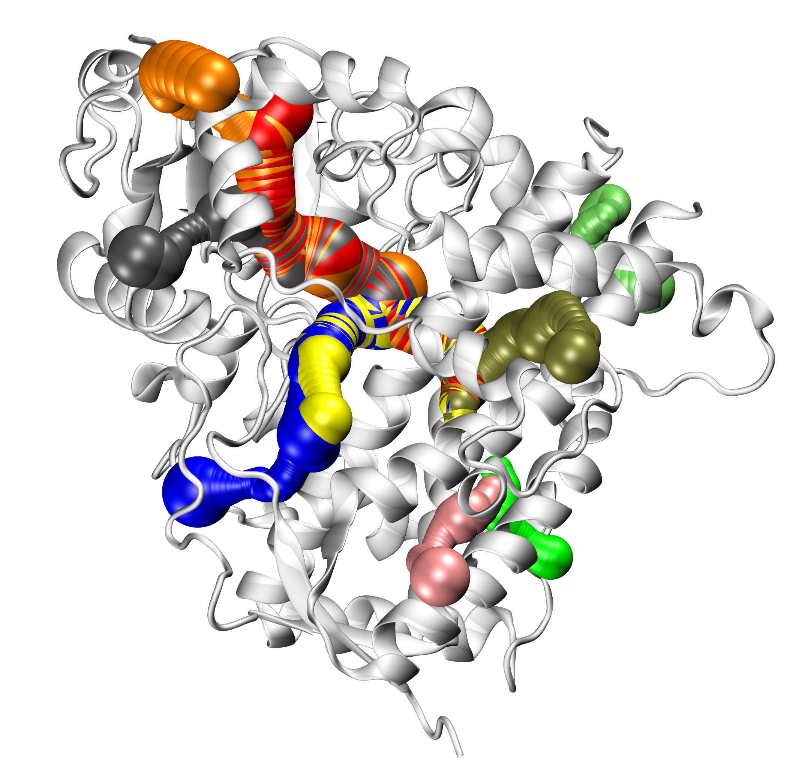

CaviTracer provides various information about predicted
channels/tunnels/pores, such as volume, length of the channels, and the
bottleneck (narrowest point of the channel). To obtain this information use
:func:`.getChannelParameters` function.

.. ipython:: python
   :verbatim:

   getChannelParameters(channels)

.. parsed-literal::

   @> Channel ID: 	Volume [ų] 	Length [Å] 	Bottleneck [Å]
   @> channel 0: 	871.33 		56.95 		1.15
   @> channel 1: 	1113.95 	48.53 		1.15
   @> channel 2: 	1049.53 	52.79 		1.15
   @> channel 3: 	1342.21 	69.76 		1.15
   @> channel 4: 	626.63 		36.5 		1.15
   @> channel 5: 	417.49 		33.76 		1.15
   @> channel 6: 	104.09 		11.7 		1.16
   @> channel 7: 	187.24 		16.15 		1.31
   @> channel 8: 	219.88 		22.43 		1.21

   ([56.945124331611794,
     48.534803029525044,
     52.793238139469054,
     69.76196724198059,
     36.49901131352283,
     33.764800308315536,
     11.699064048139602,
     16.154296930458283,
     22.42697614131529],
    [1.1529255252365347,
     1.1529255252365347,
     1.1529255252365347,
     1.1529255252365347,
     1.1529255252365347,
     1.1529255252365347,
     1.161672543421736,
     1.3122081535867374,
     1.2063476851586834],
    [871.3272015249249,
     1113.9480417205011,
     1049.5320771190782,
     1342.2090130173915,
     626.6339281791867,
     417.4940800159774,
     104.08765471789833,
     187.24450715204378,
     219.87584623622723])

Additionally, to obtain information on which residues are involved in the
formation of the predicted channels, use :func:`.getChannelResidueNames` function.
To save the data in the local directory, provide a name for ``residues_file_name``.
This information can be saved with a one-letter or three-letter code of
residues, as shown below. 

.. ipython:: python
   :verbatim:

   getChannelResidueNames(atoms, channels, residues_file_name='1tqn_data')

.. parsed-literal::

   @> 4021 atoms and 1 coordinate set(s) were parsed in 0.06s.
   @> 3961 atoms and 1 coordinate set(s) were parsed in 0.04s.
   @> 4011 atoms and 1 coordinate set(s) were parsed in 0.04s.
   @> 4041 atoms and 1 coordinate set(s) were parsed in 0.04s.
   @> 3911 atoms and 1 coordinate set(s) were parsed in 0.04s.
   @> 3911 atoms and 1 coordinate set(s) were parsed in 0.04s.
   @> 3841 atoms and 1 coordinate set(s) were parsed in 0.04s.
   @> 3866 atoms and 1 coordinate set(s) were parsed in 0.04s.
   @> 3876 atoms and 1 coordinate set(s) were parsed in 0.04s.

   ['channel0: LYS173, SER180, VAL183, ILE184, ARG212, PHE302, ALA305, GLY306, THR309, THR310, SER312, SER315, PHE316, TYR319, GLU320, PHE367, ILE369, ALA370, CYS442, GLY444, PHE447, ASN451, LEU475, LEU482, LEU483, GLN484, PRO485, VAL489',
    'channel1: ARG106, SER180, VAL183, ILE184, PHE215, THR224, PHE302, ALA305, GLY306, THR310, CYS442, GLY444, PHE447, ASN451',
    'channel2: ILE50, LEU51, TYR53, HIS54, PHE57, SER180, VAL183, ILE184, PHE215, LEU216, LEU221, THR224, PHE302, ALA305, GLY306, THR310, CYS442, GLY444, PHE447, ASN451',
    'channel3: PHE46, ASP76, GLY77, GLN78, GLN79, ARG106, SER180, VAL183, ILE184, PHE215, THR224, VAL225, PHE226, PRO227, PHE228, PHE302, ALA305, GLY306, THR310, CYS442, GLY444, PHE447, ASN451',
    'channel4: SER180, VAL183, ILE184, ARG212, PHE302, ALA305, GLY306, GLU308, THR309, THR310, SER312, ILE369, ALA370, CYS442, GLY444, PHE447, ASN451, LEU482, GLN484',
    'channel5: SER180, VAL183, ILE184, THR187, SER188, PHE203, PHE248, SER252, VAL253, ARG255, MET256, PHE271, SER299, PHE302, ILE303, GLY306, THR310, PHE447, ASN451',
    'channel6: ILE149, ALA150, GLY153, ASP154, TYR179, PRO344, PRO345, MET450, ASN451, LEU454, ALA455, ARG458',
    'channel7: TYR152, LEU156, ASN159, LEU160, GLU163, VAL175, ALA178, TYR179, ASP182, LEU196',
    'channel8: LEU132, PRO135, THR136, LYS141, LEU274, MET275, SER278, GLN279, LEU290, LEU295']

.. ipython:: python
   :verbatim:

   getChannelResidueNames(atoms, channels, distA=3, one_letter_aa=True, residues_file_name='1tqn_data_1letter')

.. parsed-literal::

   @> 4021 atoms and 1 coordinate set(s) were parsed in 0.04s.
   @> 3961 atoms and 1 coordinate set(s) were parsed in 0.04s.
   @> 4011 atoms and 1 coordinate set(s) were parsed in 0.04s.
   @> 4041 atoms and 1 coordinate set(s) were parsed in 0.04s.
   @> 3911 atoms and 1 coordinate set(s) were parsed in 0.04s.
   @> 3911 atoms and 1 coordinate set(s) were parsed in 0.04s.
   @> 3841 atoms and 1 coordinate set(s) were parsed in 0.04s.
   @> 3866 atoms and 1 coordinate set(s) were parsed in 0.04s.
   @> 3876 atoms and 1 coordinate set(s) were parsed in 0.04s.

   ['channel0: S180, S312, F316, Y319, E320, F367, N451, L475, L483, Q484',
    'channel1: S180, N451',
    'channel2: I50, Y53, S180, L216, L221, N451',
    'channel3: F46, S180, N451',
    'channel4: S180, N451, Q484',
    'channel5: S180, F203, S252, R255, M256, N451',
    'channel6: I149, Y179, N451, L454',
    'channel7: N159, V175, L196',
    'channel8: L132, T136, M275, S278, Q279, L290, L295']

Visualization of channels within ProDy
-------------------------------------------------------------------------------

To visualize CaviTracer predictions, we do not need external programs. If
VMD_ and Open3D_ are installed on our machine, we can visalize the
predictions directly in ProDy. 

First, we need to use :func:`.getVmdModel` function and provide the pathway
to where VMD_ binary file is localized, as shown below. VMD_ is used to
create protein structure in the NewCartoon representation. That model is
further used by CaviTracer functions to display predicted channels/tunnels using
Open3D_ library. 

.. ipython:: python
   :verbatim:

   vmd_path = '/usr/local/bin/vmd'
   model = getVmdModel(vmd_path, atoms)

.. parsed-literal::

   @> Model created successfully.

.. ipython:: python
   :verbatim:

   model

.. parsed-literal::

   TriangleMesh with 56180 points and 112320 triangles.

Once the model is created, we can display several things: 

**(i)** Cavities with :func:`.showCavities`:

.. ipython:: python
   :verbatim:

   showCavities(surface)

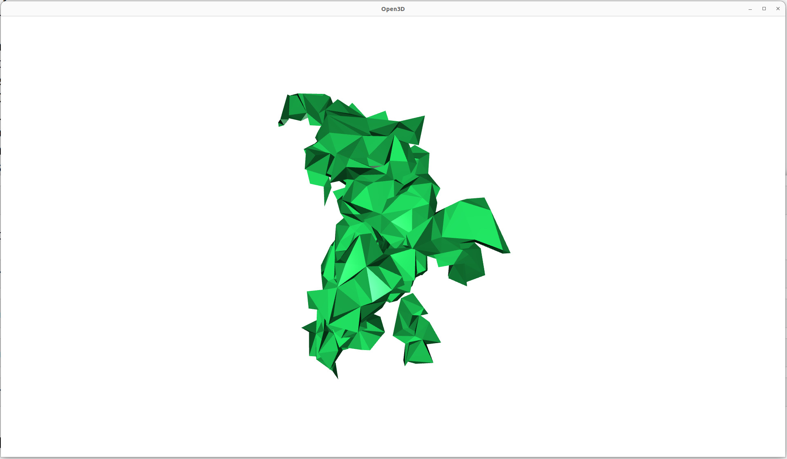

**(ii)** Channels with :func:`.showChannels` in a several ways:

.. ipython:: python
   :verbatim:

   showChannels(channels, surface=surface, model=model)

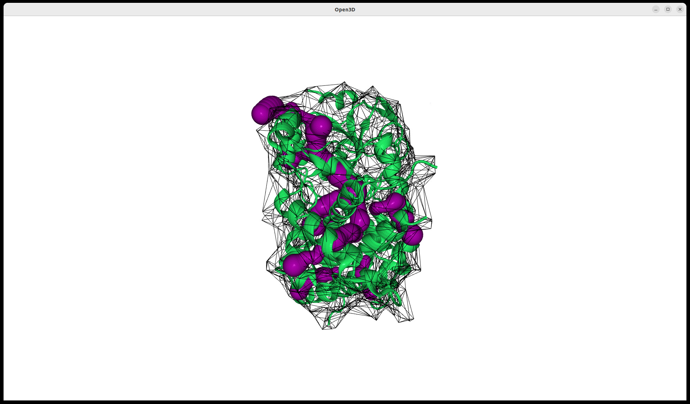

.. ipython:: python
   :verbatim:

   showChannels(channels, model=model)

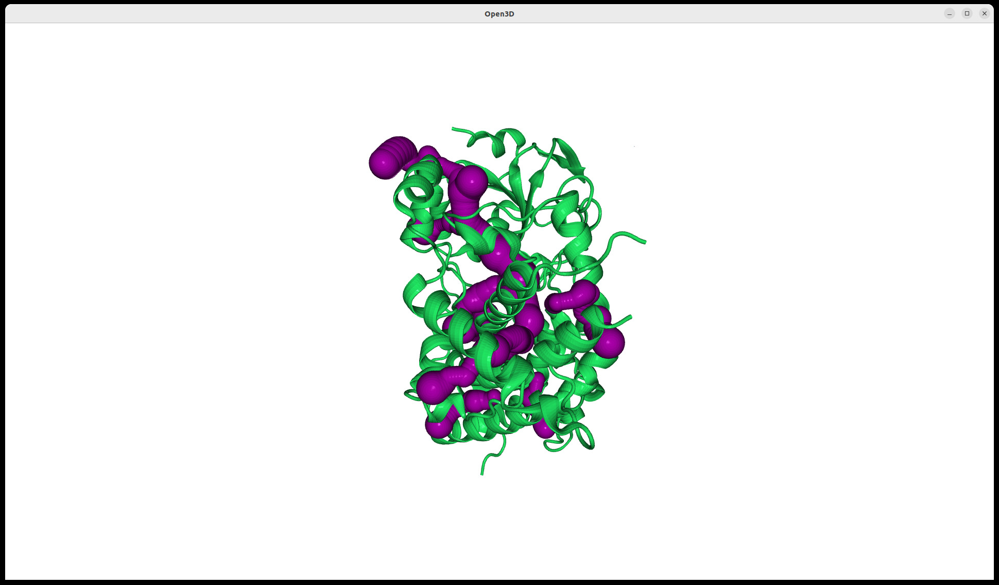

.. ipython:: python
   :verbatim:

   showCavities(surface, show_surface=True)

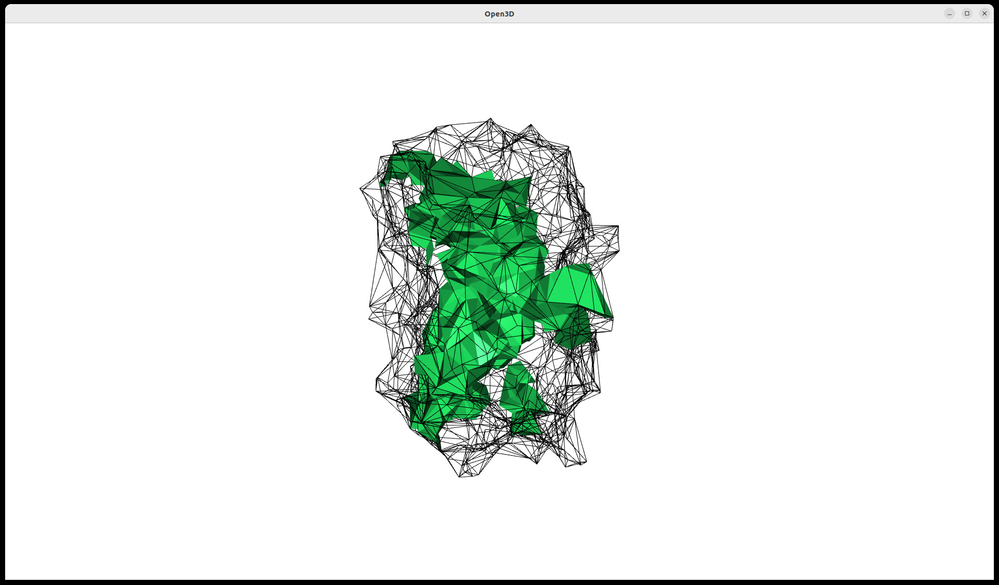

Channels can be visualized separately. Below are several examples of how to
display single channels (channel #1, channel #2), two channels at once (channel
#1 and channel #8), or a range of channels (channels from #1 to channel #4
#from the prediction).

.. ipython:: python
   :verbatim:

   showChannels(channels[1], model)

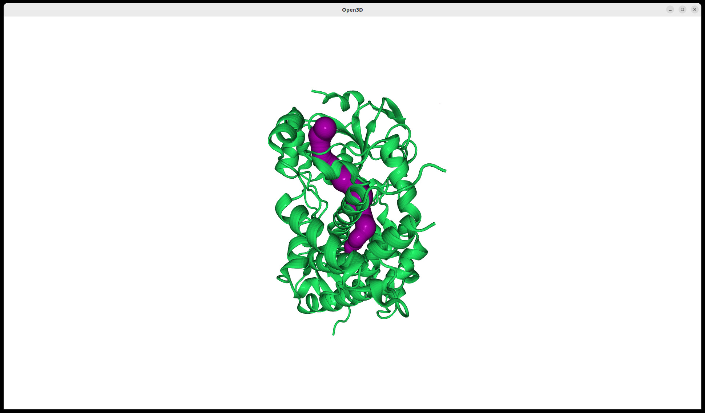

.. ipython:: python
   :verbatim:

   showChannels(channels[2], model)

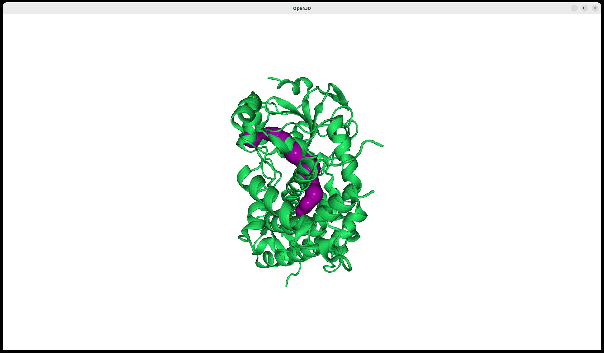

.. ipython:: python
   :verbatim:

   selected_channels = [channels[1], channels[8]]
   showChannels(selected_channels, model)

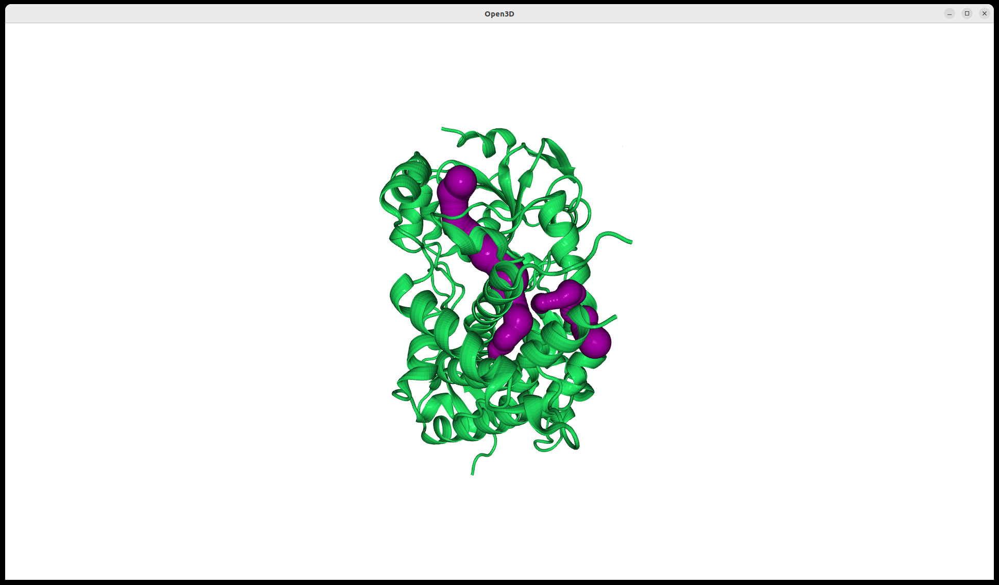

.. ipython:: python
   :verbatim:

   selected_channels = channels[1:4]
   showChannels(selected_channels, model)

Once we select which channels are of interest, we can obtain information
about their parameters.

.. ipython:: python
   :verbatim:

   selected_channels = channels[1:4]
   lengths, bottlenecks, volumes = getChannelParameters(selected_channels)
   selected_channels_atoms = getChannelAtoms(selected_channels)

.. parsed-literal::

   @> Channel ID: 	Volume [ų] 	Length [Å] 	Bottleneck [Å]
   @> channel 0: 	1113.95 	48.53 		1.15
   @> channel 1: 	1049.53 	52.79 		1.15
   @> channel 2: 	1342.21 	69.76 		1.15
   @> 715 atoms and 1 coordinate set(s) were parsed in 0.01s.

Predefined starting point for channel prediction
-------------------------------------------------------------------------------

By default, CaviTracer automatically selects the starting tetrahedron
(starting point for the interior cavity prediction) based on cavity depth.
Alternatively, users can provide a custom starting point using
``start_point`` argument. This can be either a 3D coordinate point or an 
atomic selection/AtomGroup as show below. If an atomic selection is provided, its 
geometric center is used as the starting point.

.. ipython:: python
   :verbatim:

   channels, surface = calcChannels(atoms, start_point=[-22.312, -20.065, -11.144])

.. parsed-literal::

   @> Using user-provided start_point for channel seed: [-22.312, -20.065, -11.144] Å
   @> Detected 9 channels.

.. ipython:: python
   :verbatim:

   start_sel = protein.select('resid 212 309 483')
   calcChannels(protein, output_path='results.pdb', start_point=start_sel)

.. parsed-literal::

   @> Using user-provided start_point for channel seed: [-24.395, -23.462, -15.132] Å
   @> Detected 9 channels.
   @> Saving results to results.pdb.

Below is the visualization of channel identification for the two different starting
points mentioned above. The blue one represents identification of channels when
the starting point is [-22.312, -20.065, -11.144], whereas the orange one
represents identification based on the center of the mass for residues 212, 309,
and 483 (displayed as orange spheres). 

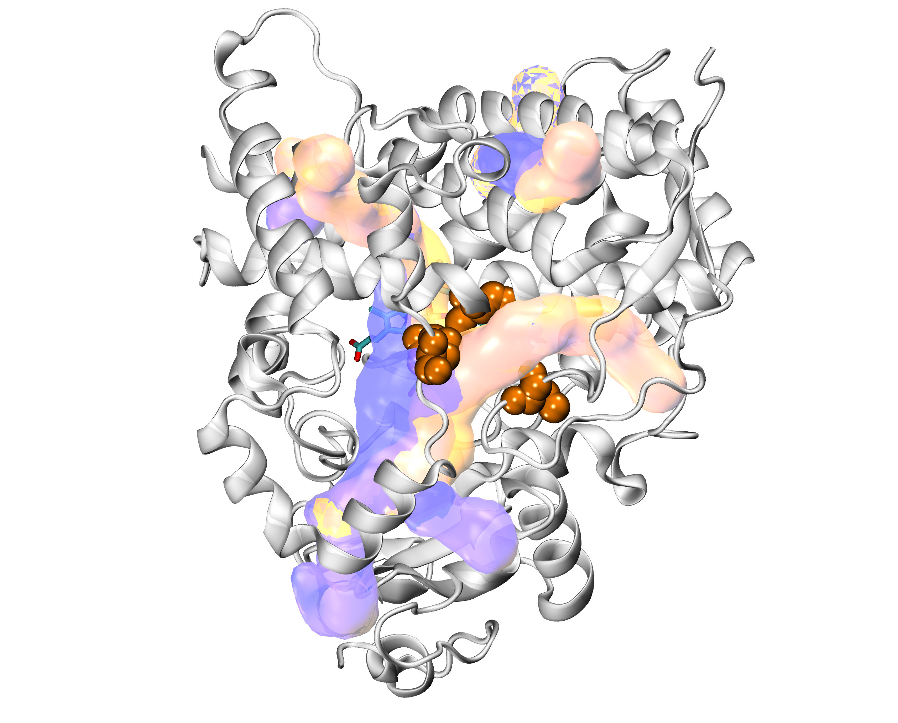

Visualization of the system was performed in the VMD_ program. This outcome
shows how the prediction result can change when the ``start_point`` changes.

Detection of surface cavities in a single PDB structure
===============================================================================

In this part of the tutorial, we will also use the Cytochrome P450 structure,
but this time we will identify surface cavities instead of intraprotein
cavities.  

Once again we will parse protein structure with PDB ID ``1tqn``. 

.. ipython:: python
   :verbatim:

   atoms = parsePDB('1tqn').select('protein')

.. parsed-literal::

   @> PDB file is found in working directory (1tqn.pdb).
   @> 3999 atoms and 1 coordinate set(s) were parsed in 0.04s.

Now, to identify the potential surface cavities, we will use
:func:`.calcSurfaceCavities` and save the results as :file:`test_surf_cav.pqr`
file using ``output_path`` parameter.

.. ipython:: python
   :verbatim:

   cavities, surface = calcSurfaceCavities(atoms, output_path='test_surf_cav.pqr')

.. parsed-literal::

   @> Returning surface cavities
   @> Saving surface cavities to test_surf_cav.pqr.

To display the identified surface cavities, similarly to the channel
identification, we need to use VMD_ to create the model for visualization
within ProDy. For that reason, we need to provide ``vmd_path`` and use 
:func:`.getVmdModel`. 

.. ipython:: python
   :verbatim:

   vmd_path = '/usr/local/bin/vmd'
   model = getVmdModel(vmd_path, atoms)

.. parsed-literal::

   @> Model created successfully.

To display the results using the Open3D library in ProDy, we can use
:func:`.showSurfaceCavities` and provide the ``surface`` object together
with the protein ``model`` generated by VMD_. When ``show_surface`` is set
to ``True``, the protein surface is displayed together with the detected
surface cavities. The protein is shown in the NewCartoon representation,
whereas the detected surface cavities are visualized as tetrahedron-derived
regions based on the Voronoi/Delaunay tessellation.

.. ipython:: python
   :verbatim:

   showSurfaceCavities(surface, model=model, show_surface=True)

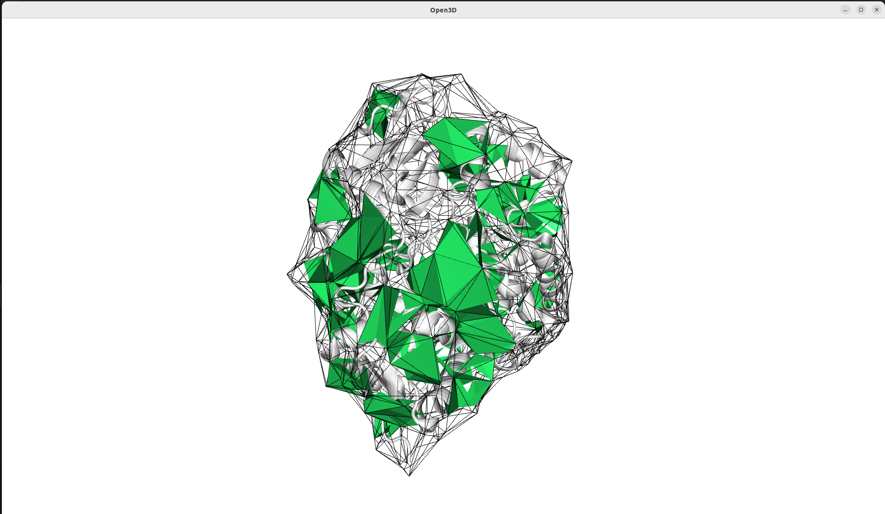

The :func:`.calcSurfaceCavities` function provides several parameters that
can be used to tune the detection and selection of surface cavities,
including min_volume, max_volume, min_depth, max_depth, min_tetrahedra,
max_tetrahedra, as well as r1, r2, and sparsity. In the example below, only
surface cavities with volumes between 500 and 1000 ų are selected and
saved to a file specified by the output_path parameter,
:file:`surf_cav_MinMax_volume.pqr`.

.. ipython:: python
   :verbatim:

   cavities2, surface2 = calcSurfaceCavities(atoms, min_volume=500,
		max_volume=1000, output_path='surf_cav_MinMax_volume.pqr')

.. parsed-literal::

   @> Returning surface cavities
   @> Saving surface cavities to surf_cav_MinMax_volume.pqr.

We can display the results using :func:`.showSurfaceCavities` function:

.. ipython:: python
   :verbatim:

   showSurfaceCavities(surface2, model=model, show_surface=True)

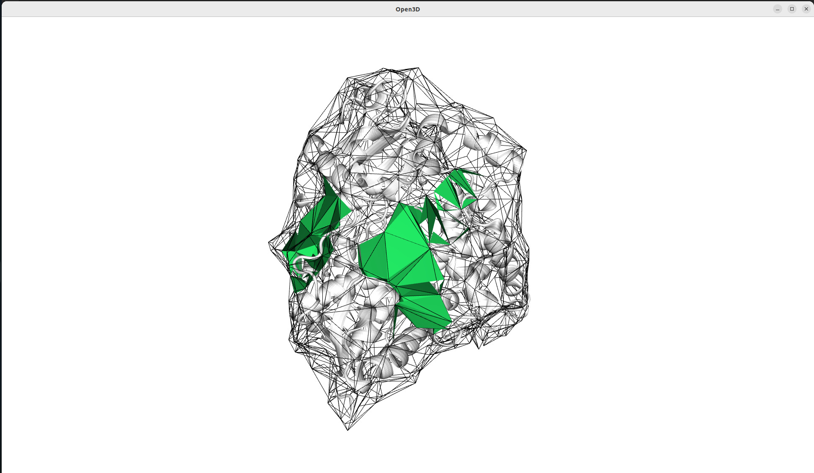

To provide nicer visualization for the surface cavities, we can also use
:func:`.getVmdModel` function with ``representation`` parameter set to
``'QuickSurf'``. We need to provide the PQR file to do that.

.. ipython:: python
   :verbatim:

   cav_model = getVmdModel(vmd_path, 
        parsePQR('surf_cav_MinMax_volume.pqr'),
    	representation='QuickSurf')

.. parsed-literal::

   @> Model created successfully.

Once the model is created, we can display it by setting ``cavity_atoms``
parameter.

.. ipython:: python
   :verbatim:

   showSurfaceCavities(surface2, model=model, cavity_atoms=cav_model)

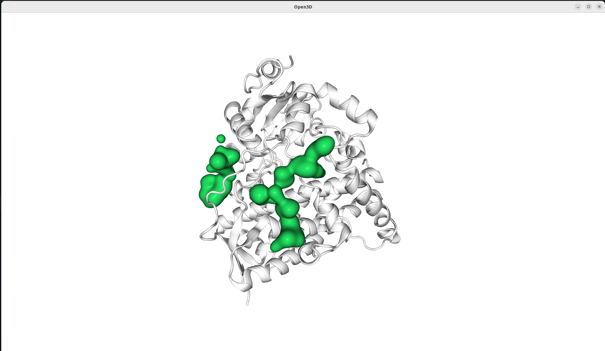

To obtain information about the surface cavities, such as volume, depth or
tetrahedra count, use :func:`getSurfaceCavityParameters`.

.. ipython:: python
   :verbatim:

   parameters = getSurfaceCavityParameters(cavities2)

.. parsed-literal::

   @> Cavity ID: 	Volume [ų] 	Depth [Å] 	Tetrahedra count
   @> cavity 0: 	928.09 		8 		97
   @> cavity 1: 	771.55 		5 		77
   @> Surface cavity residues were saved to: results_Residues_All_surface_cavities.txt

By assigning the output of :func:`getSurfaceCavityParameters` to the
variable parameters, the extracted cavity descriptors can be accessed as
lists, including cavity volume (``parameters[0]``), depth
(``parameters[1]``), and tetrahedra count (``parameters[2]``).

.. ipython:: python
   :verbatim:

   parameters

.. parsed-literal::

   ([928.0878561950001, 771.5530158881667], [8, 5], [97, 77])

.. ipython:: python
   :verbatim:

   parameters[0]

.. parsed-literal::

   [928.0878561950001, 771.5530158881667]

In addition to quantitative descriptors, CaviTracer also allows the
identification of residues forming each detected surface cavity. This
information can be obtained using :func:`getSurfaceCavityResidueNames`,
which returns residue names and residue numbers for each cavity based on
the distance between cavity points and protein residues. The results can be
saved using the ``residues_file_name`` parameter. The provided name will 
be used to save the results with the ``_Residues_All_surface_cavities.txt``
sufix.

.. ipython:: python
   :verbatim:

   residues = getSurfaceCavityResidueNames(atoms, cavities2, surface2, 
					residues_file_name='results')

.. parsed-literal::

   @> Surface cavity residues were saved to: results_Residues_All_surface_cavities.txt

.. ipython:: python
   :verbatim:

   residues

.. parsed-literal::

   ['cavity0: LYS173, ASP174, GLY177, ALA178, SER195, LEU196, PRO199, LYS208, LYS209,
   LEU211, ARG212, PHE213, PHE219, PHE220, CYS239, VAL240, PHE241, PRO242, PHE304,
   TYR307, GLU308, SER311, LEU482', 'cavity1: LYS55, MET59, MET62, GLU63, TYR319, 
   GLU320, THR323, HIS324, PHE367, TYR399, ARG403, GLU412, LYS413, PHE414, ILE473, 
   PRO474, LEU475, LEU477, SER478, LEU479']

