.. _cavitracer_single:

Detection of intraprotein tunnels, channels and cavities in a single PDB structure
===============================================================================

CaviTracer prediction
-------------------------------------------------------------------------------

As an example for this tutorial, we will analyze the structure of cytochrome
P450 which contains 486 residues. To analyze the structure, we need to parse
a structure :file:`1tqn` using :func:`.parsePDB`:

.. ipython:: python
   :verbatim:

   p = parsePDB('1tqn')

.. parsed-literal::

   @> Connecting wwPDB FTP server RCSB PDB (USA).
   @> Downloading PDB files via FTP failed, trying HTTP.
   @> 1tqn downloaded (1tqn.pdb.gz)
   @> PDB download via HTTP completed (1 downloaded, 0 failed).
   @> 3999 atoms and 1 coordinate set(s) were parsed in 0.14s.

Now, we select protein structure for analysis:

.. ipython:: python
   :verbatim:

   atoms = p.select("protein")

To predict channels, tunnels, or cavities within protein structure, we should
utilize :func:`.calcChannels` function. This function analyzes the provided
atomic structure to detect intraprotein channels/tunnels/cavities, which
are voids or pathways within the molecular structure. It employs Voronoi
and Delaunay tessellations to identify these regions (see more details in
the description of the function). 

The ``'separate'`` parameter controls whether each detected channel is
saved to a separate file (``True``) or if all channels are saved in a single
file (``False``). Files are saved as PQR file under the name specified using
``'output_path'``. If we add ``.pdb`` the file will be saved as a PDB file;
Otherwise, it will be saved as a PQR file. Results with ``'separate'``
option set to True can be saved only as a PQR files. 

.. ipython:: python
   :verbatim:

   channels, surface = calcChannels(atoms, output_path='channels_1tqn_ALL.pdb')

.. parsed-literal::

   @> The atoms supplied to calcChannels contain protein atoms only.
   @> WARNING structure has no hydrogens and r2=0.90 is below 1.2 A: the space left by the missing H is then wide enough for the probe to pass, and channels will be found through interstices that do not exist in the real protein (their number can rise several-fold). Either add hydrogens, or raise r2 to 1.2 A or more, where protonated and unprotonated structures give the same channels.
   @> Substituted 3766 atoms with 23638 homogeneous balls of radius 1.52 A in 0.26s.
   @> Delaunay tessellation of 23638 points constructed in 0.87s.
   @> Surface and inner simplices filtered in 1.41s.
   @> 5 surface cavities detected and filtered in 0.32s.
   @> Channel pathfinding (graph Dijkstra) over 5 cavities completed in 4.12s.
   @> Detected 57 channels.
   @> Saving results to channels_1tqn_ALL.pdb.
   @> Channel calculation completed in 7.07s.

.. ipython:: python
   :verbatim:

   channels, surface = calcChannels(atoms, output_path='channels_1tqn', separate=True)

.. parsed-literal::

   @> The atoms supplied to calcChannels contain protein atoms only.
   @> WARNING structure has no hydrogens and r2=0.90 is below 1.2 A: the space left by the missing H is then wide enough for the probe to pass, and channels will be found through interstices that do not exist in the real protein (their number can rise several-fold). Either add hydrogens, or raise r2 to 1.2 A or more, where protonated and unprotonated structures give the same channels.
   @> Substituted 3766 atoms with 23638 homogeneous balls of radius 1.52 A in 0.26s.
   @> Delaunay tessellation of 23638 points constructed in 0.85s.
   @> Surface and inner simplices filtered in 1.41s.
   @> 5 surface cavities detected and filtered in 0.29s.
   @> Channel pathfinding (graph Dijkstra) over 5 cavities completed in 4.11s.
   @> Detected 57 channels.
   @> Saving multiple results to directory ..
   @> Channel calculation completed in 7.07s.

Files with separated channels will be saved in separate PQR files in the
local directory:

.. parsed-literal::

   channels_1tqn_chl0.pqr
   channels_1tqn_chl1.pqr  
   channels_1tqn_chl2.pqr  
   channels_1tqn_chl3.pqr  
   channels_1tqn_chl4.pqr
   channels_1tqn_chl5.pqr  
   channels_1tqn_chl6.pqr  
   channels_1tqn_chl7.pqr  
   channels_1tqn_chl8.pqr
   ..
   channels_1tqn_chl56.pqr

Each PQR file will contain ``FIL`` atoms that describe the predicted
channel/tunnel/pore. The ``Beta`` column denotes the radius of
the sphere, which is needed for visualization purposes.

.. parsed-literal::

   ATOM      1  H   FIL T   1     -20.047 -33.772 -10.026  1.00  1.15
   ATOM      2  H   FIL T   1     -19.937 -33.497  -9.816  1.00  1.26
   ATOM      3  H   FIL T   1     -19.835 -33.235  -9.619  1.00  1.36
   ATOM      4  H   FIL T   1     -19.748 -32.998  -9.449  1.00  1.45
   ATOM      5  H   FIL T   1     -19.685 -32.797  -9.317  1.00  1.52
   ATOM      6  H   FIL T   1     -19.655 -32.644  -9.237  1.00  1.57
   ATOM      7  H   FIL T   1     -19.659 -32.549  -9.218  1.00  1.60
   ATOM      8  H   FIL T   1     -19.680 -32.494  -9.240  1.00  1.61
   ATOM      9  H   FIL T   1     -19.692 -32.456  -9.278  1.00  1.61
   ATOM     10  H   FIL T   1     -19.669 -32.414  -9.304  1.00  1.62
   ATOM     11  H   FIL T   1     -19.586 -32.344  -9.294  1.00  1.64
   ATOM     12  H   FIL T   1     -19.421 -32.227  -9.225  1.00  1.69
   ..

Generated PQR file can be visualized together with protein PDB file using VMD_
or another program for graphical visualizations of molecules.

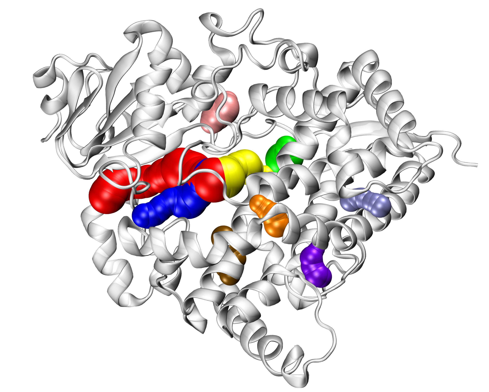

CaviTracer provides various information about predicted
channels/tunnels/pores, such as volume, length of the channels, and the
bottleneck (narrowest point of the channel). To obtain this information use
:func:`.getChannelParameters` function.

.. ipython:: python
   :verbatim:

   getChannelParameters(channels)

.. parsed-literal::

   @> Channel ID: 	Volume [ų] 	Length [Å] 	Bottleneck [Å]
   @> channel 0: 	60.22 		6.49 		0.95
   @> channel 1: 	46.16 		8.75 		0.89
   @> channel 2: 	63.12 		9.89 		0.89
   @> channel 3: 	40.11 		8.97 		0.95
   @> channel 4: 	75.41 		11.22 		0.89
   @> channel 5: 	35.54 		8.98 		0.93
   @> channel 6: 	76.9 		12.55 		0.89
   @> channel 7: 	74.84 		16.19 		0.86
   @> channel 8: 	100.23 		19.31 		0.86
   @> channel 9: 	193.9 		33.95 		0.91
   @> channel 10: 	187.54 		34.46 		0.91
   @> channel 11: 	135.54 		34.2 		0.87
   @> channel 12: 	214.24 		43.14 		0.84
   @> channel 13: 	146.5 		36.37 		0.87
   @> channel 14: 	756.01 		65.84 		0.85
   @> channel 15: 	312.62 		48.38 		0.85
   @> channel 16: 	626.95 		63.69 		0.85
   @> channel 17: 	1099.1 		76.6 		0.85
   @> channel 18: 	633.91 		64.34 		0.85
   @> channel 19: 	1174.08 	77.85 		0.85
   @> channel 20: 	217.18 		45.23 		0.91
   @> channel 21: 	237.05 		47.31 		0.91
   @> channel 22: 	1038.56 	76.77 		0.85
   @> channel 23: 	1037.87 	76.97 		0.85
   @> channel 24: 	551.39 		62.29 		0.85
   @> channel 25: 	287.77 		52.63 		0.91
   @> channel 26: 	249.46 		48.77 		0.79
   @> channel 27: 	273.57 		52.29 		0.91
   @> channel 28: 	521.44 		61.41 		0.84
   @> channel 29: 	387.2 		57.1 		0.85
   @> channel 30: 	745.97 		70.94 		0.85
   @> channel 31: 	335.67 		55.67 		0.85
   @> channel 32: 	402.03 		59.42 		0.85
   @> channel 33: 	463.98 		63.81 		0.85
   @> channel 34: 	473.98 		65.06 		0.85
   @> channel 35: 	1012.12 	81.79 		0.85
   @> channel 36: 	747.34 		72.88 		0.85
   @> channel 37: 	504.33 		68.06 		0.85
   @> channel 38: 	1030.95 	84.17 		0.85
   @> channel 39: 	457.82 		65.23 		0.85
   @> channel 40: 	476.47 		65.18 		0.77
   @> channel 41: 	489.71 		67.2 		0.77
   @> channel 42: 	541.12 		71.05 		0.85
   @> channel 43: 	1000.67 	85.13 		0.85
   @> channel 44: 	453.94 		69.05 		0.85
   @> channel 45: 	767.08 		78.21 		0.85
   @> channel 46: 	424.95 		65.58 		0.78
   @> channel 47: 	1063.79 	86.23 		0.59
   @> channel 48: 	1003.87 	87.76 		0.67
   @> channel 49: 	1057.96 	86.47 		0.59
   @> channel 50: 	376.7 		70.69 		0.85
   @> channel 51: 	372.05 		70.8 		0.85
   @> channel 52: 	1011.7 		90.14 		0.66
   @> channel 53: 	334.86 		68.83 		0.85
   @> channel 54: 	362.79 		70.69 		0.84
   @> channel 55: 	1022.15 	92.38 		0.66
   @> channel 56: 	1013.42 	93.48 		0.66

   ([6.492057612806176,
     8.747214787071009,
     9.88835768477351,
     ..
     70.69375950960386,
     92.37669761808526,
     93.47861401991176],
    [0.9465177739700246,
     0.8945378037566032,
     0.8860264274901208,
     ..
     0.8378961392220603,
     0.6624844558162226,
     0.6624844558162226],
    [60.221979215355034,
     46.16486691455868,
     63.11707773997961,
     ..
     362.7912307310119,
     1022.1498363831043,
     1013.4237285330822])

Additionally, to obtain information on which residues are involved in the
formation of the predicted channels, use :func:`.getChannelResidueNames` function.
To save the data in the local directory, provide a name for ``residues_file_name``.
This information can be saved with a one-letter or three-letter code of
residues, as shown below. 

.. ipython:: python
   :verbatim:

   getChannelResidueNames(atoms, channels, residues_file_name='1tqn_data')

.. parsed-literal::

   @> 3831 atoms and 1 coordinate set(s) were parsed in 0.04s.
   @> 3861 atoms and 1 coordinate set(s) were parsed in 0.04s.
   @> 3861 atoms and 1 coordinate set(s) were parsed in 0.04s.
   @> 3856 atoms and 1 coordinate set(s) were parsed in 0.04s.
   ..
   @> 4311 atoms and 1 coordinate set(s) were parsed in 0.04s.
   @> 4336 atoms and 1 coordinate set(s) were parsed in 0.04s.
   @> 4486 atoms and 1 coordinate set(s) were parsed in 0.04s.
   @> 4496 atoms and 1 coordinate set(s) were parsed in 0.04s.
   @> Channel residues were saved to: 1tqn_data_Residues_All_channels.txt

   ['channel0: PHE33, ILE38, PRO39, GLY40, PRO41, PRO43, ASN49, GLY73, PHE74, TYR75',
    'channel1: LEU172, SER315, MET318, TYR319, ALA322, THR323, PRO467, THR471, ILE473, VAL489, LEU491',
    'channel2: LEU172, SER315, MET318, TYR319, GLU470, THR471, GLN472, PRO488, VAL489, VAL490, LEU491',
    'channel3: MET89, THR92, VAL93, GLU97, PHE102, ILE383, ASN384',
    ..
    'channel53: MET145, ILE148, ILE149, ALA150, TYR152, GLY153, VAL155, LEU156, VAL157, ASN159, LEU160, VAL170, LEU172, VAL175, PHE176, TYR179, ASP182, VAL183, SER186, THR187, ILE193, ASP194, SER195, LEU196, ALA322, PHE447, MET450, ASN451, LEU454, ALA455, ARG458, VAL459, PHE463, PHE465, LYS466, PRO467, LEU491, LYS492, VAL493',
    'channel54: MET145, ILE148, ILE149, ALA150, TYR152, GLY153, VAL155, LEU156, VAL157, ASN159, LEU160, VAL170, LEU172, ASP174, VAL175, PHE176, ALA178, TYR179, ASP182, VAL183, SER186, THR187, LEU196, ALA322, PHE447, MET450, ASN451, LEU454, ALA455, ARG458, VAL459, PHE463, PHE465, LYS466, PRO467, LEU491, LYS492, VAL493',
    'channel55: PHE57, CYS58, ASP61, MET62, HIS65, TRP72, THR85, LEU156, LEU160, VAL170, LEU172, VAL175, PHE176, TYR179, SER180, ILE184, ALA305, GLY306, THR309, THR310, SER311, LEU314, ALA322, ALA370, MET371, ARG372, PRO397, SER398, TYR399, ALA400, LEU401, ASP404, TYR407, CYS442, GLY444, PHE447, ALA448, ASN451, PHE465, LYS466, PRO467, LEU491, LYS492, VAL493',
    'channel56: PHE57, CYS58, ASP61, MET62, HIS65, TRP72, THR85, LEU156, LEU160, VAL170, LEU172, VAL175, PHE176, TYR179, SER180, ILE184, ALA305, GLY306, THR309, THR310, SER311, LEU314, ALA322, ALA370, MET371, ARG372, PRO397, SER398, TYR399, ALA400, LEU401, ASP404, TYR407, ILE431, CYS442, GLY444, PHE447, ALA448, ASN451, PHE465, LYS466, PRO467, LEU491, LYS492, VAL493']

.. ipython:: python
   :verbatim:

   getChannelResidueNames(atoms, channels, distA=3, one_letter_aa=True, residues_file_name='1tqn_data_1letter')

.. parsed-literal::

   @> 3831 atoms and 1 coordinate set(s) were parsed in 0.04s.
   @> 3861 atoms and 1 coordinate set(s) were parsed in 0.04s.
   @> 3861 atoms and 1 coordinate set(s) were parsed in 0.04s.
   @> 3856 atoms and 1 coordinate set(s) were parsed in 0.04s.
   ..
   @> 4311 atoms and 1 coordinate set(s) were parsed in 0.04s.
   @> 4336 atoms and 1 coordinate set(s) were parsed in 0.04s.
   @> 4486 atoms and 1 coordinate set(s) were parsed in 0.04s.
   @> 4496 atoms and 1 coordinate set(s) were parsed in 0.04s.
   @> Channel residues were saved to: 1tqn_data_Residues_All_channels.txt

   ['channel0: P41, N49, G73, F74, Y75',
    'channel1: L172, Y319, T323, P467, T471, I473, V489, L491',
    'channel2: L172, Y319, T471, V489, L491',
    'channel3: M89, T92, V93, E97, F102, I383, N384',
     ..
    'channel53: M145, I148, I149, Y152, G153, V155, L156, V157, N159, L160, V170, L172, Y179, D182, V183, T187, I193, D194, A322, F447, N451, L454, A455, R458, V459, F465, K466, P467, L491, K492, V493',
    'channel54: M145, I148, I149, Y152, G153, L156, V157, L160, V170, L172, D174, V175, A178, Y179, D182, V183, T187, L196, A322, F447, N451, L454, A455, R458, V459, F465, K466, P467, L491, K492, V493',
    'channel55: F57, D61, H65, W72, L156, V170, L172, V175, F176, Y179, S180, T310, L314, A322, M371, R372, P397, A400, L401, D404, Y407, N451, F465, K466, P467, L491, K492, V493',
    'channel56: F57, D61, H65, W72, T85, L156, V170, L172, V175, F176, Y179, S180, T310, L314, A322, M371, R372, P397, A400, L401, D404, Y407, I431, N451, F465, K466, P467, L491, K492, V493']

Visualization of channels within ProDy
-------------------------------------------------------------------------------

To visualize CaviTracer predictions, we do not need external programs. If
VMD_ and Open3D_ are installed on our machine, we can visalize the
predictions directly in ProDy. 

First, we need to use :func:`.getVmdModel` function and provide the pathway
to where VMD_ binary file is localized, as shown below. VMD_ is used to
create protein structure in the NewCartoon representation. That model is
further used by CaviTracer functions to display predicted channels/tunnels using
Open3D_ library. 

.. ipython:: python
   :verbatim:

   vmd_path = '/usr/local/bin/vmd'
   model = getVmdModel(vmd_path, atoms)

.. parsed-literal::

   @> Model created successfully.

.. ipython:: python
   :verbatim:

   model

.. parsed-literal::

   TriangleMesh with 56180 points and 112320 triangles.

Once the model is created, we can display several things: 

**(i)** Cavities with :func:`.showCavities`:

.. ipython:: python
   :verbatim:

   showCavities(surface)

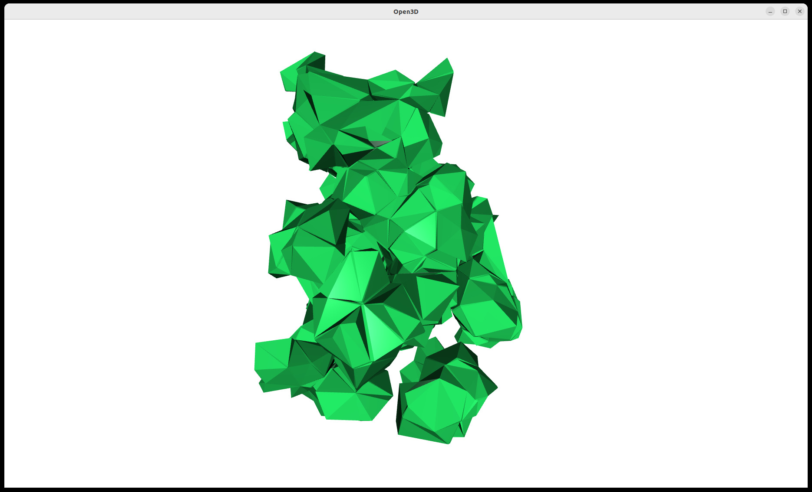

**(ii)** Channels with :func:`.showChannels` in a several ways:

.. ipython:: python
   :verbatim:

   showChannels(channels, surface=surface, model=model)

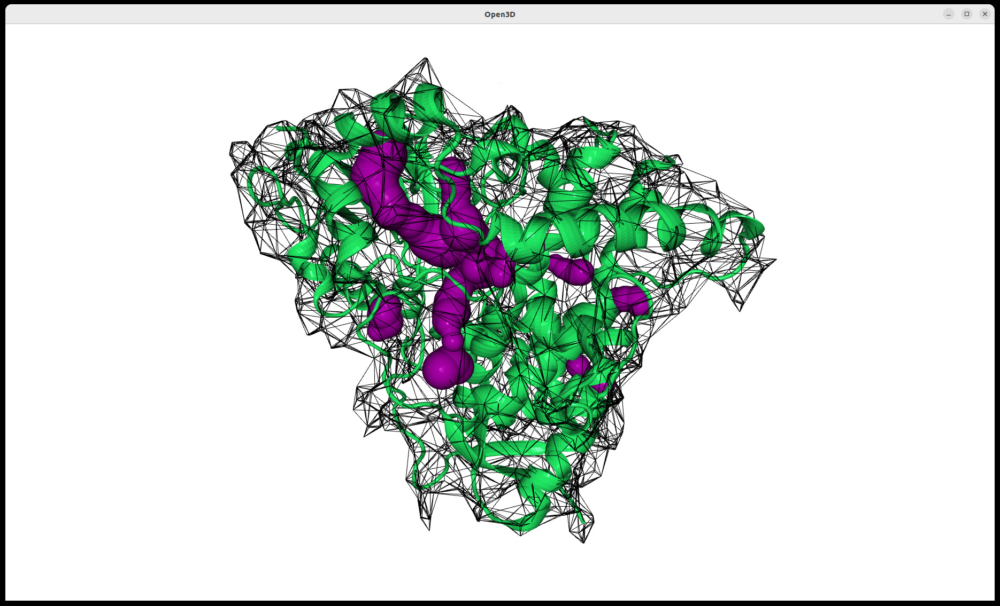

.. ipython:: python
   :verbatim:

   showChannels(channels, model=model)

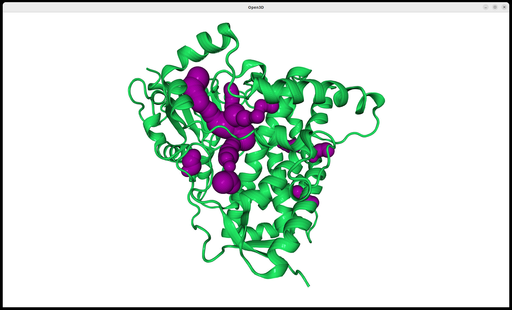

.. ipython:: python
   :verbatim:

   showCavities(surface, show_surface=True)

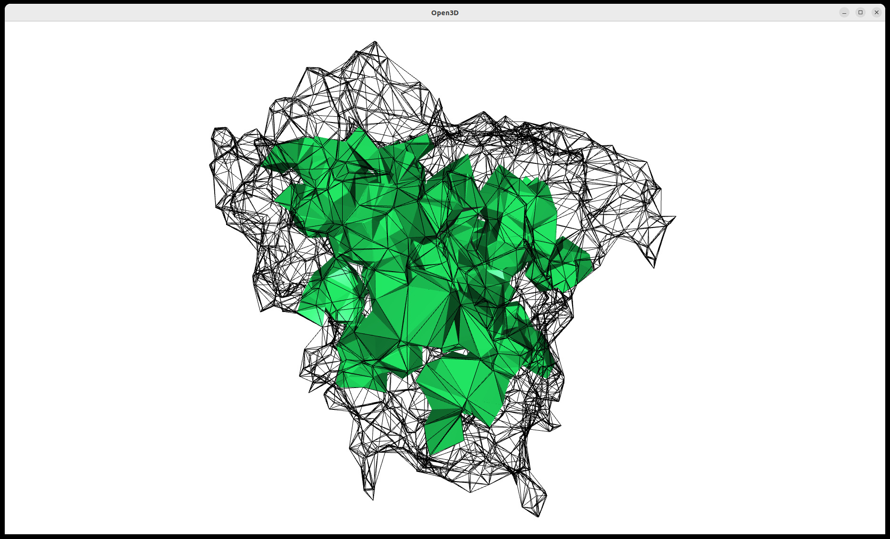

Channels can be visualized separately. Below are several examples of how to
display single channels (channel #1, channel #2), two channels at once (channel
#1 and channel #8), or a range of channels (channels from #1 to channel #4
#from the prediction).

.. ipython:: python
   :verbatim:

   showChannels(channels[40], model)

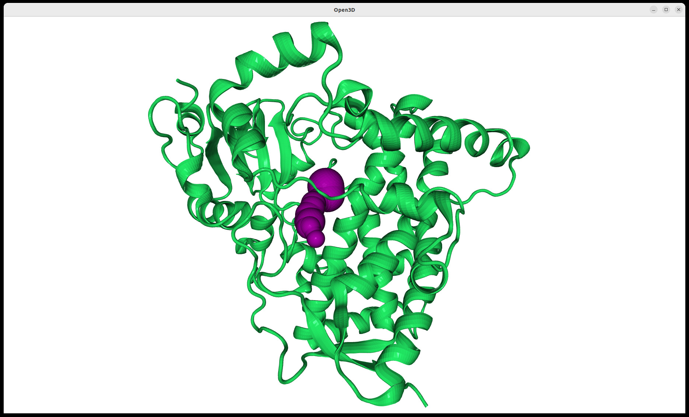

.. ipython:: python
   :verbatim:

   showChannels(channels[15], model)

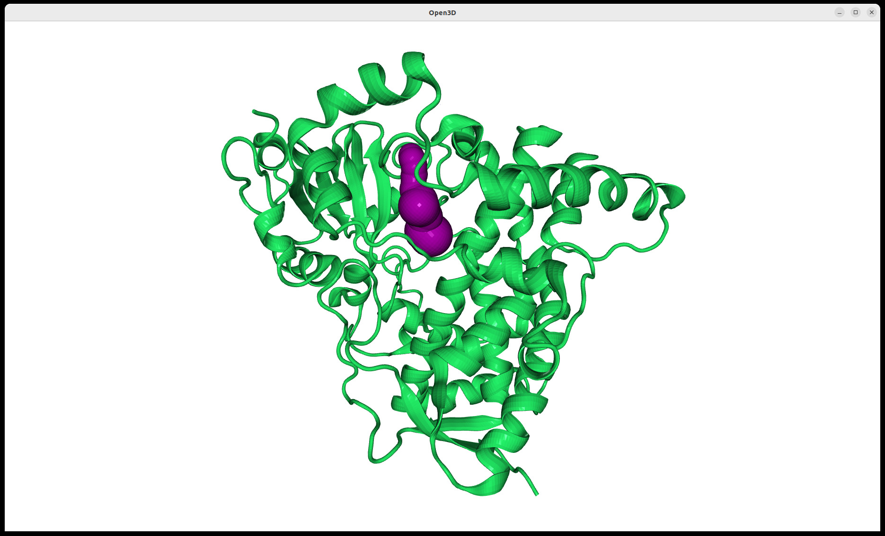

.. ipython:: python
   :verbatim:

   selected_channels = [channels[9], channels[40]]
   showChannels(selected_channels, model)

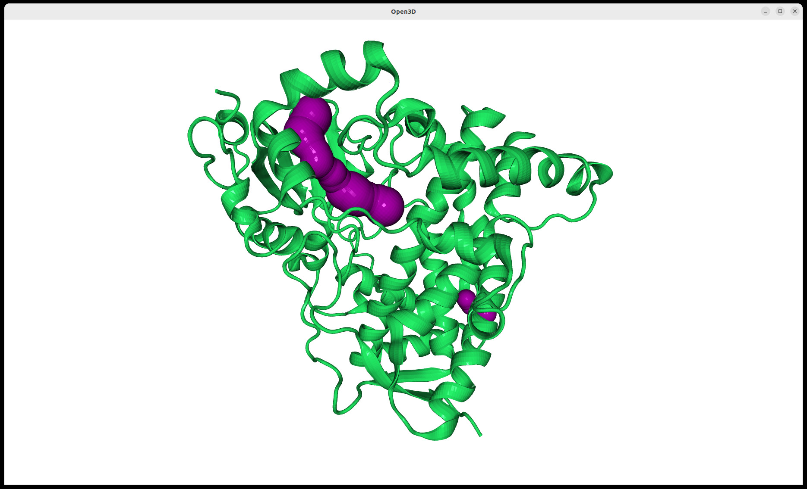

.. ipython:: python
   :verbatim:

   selected_channels = channels[10:20]
   showChannels(selected_channels, model)

Once we select which channels are of interest, we can obtain information
about their parameters.

.. ipython:: python
   :verbatim:

   selected_channels = channels[10:20]
   lengths, bottlenecks, volumes = getChannelParameters(selected_channels)
   selected_channels_atoms = getChannelAtoms(selected_channels)

.. parsed-literal::

   @> Channel ID: 	Volume [ų] 	Length [Å] 	Bottleneck [Å]
   @> channel 0: 	187.54 		34.46 		0.91
   @> channel 1: 	135.54 		34.2 		0.87
   @> channel 2: 	214.24 		43.14 		0.84
   @> channel 3: 	146.5 		36.37 		0.87
   @> channel 4: 	756.01 		65.84 		0.85
   @> channel 5: 	312.62 		48.38 		0.85
   @> channel 6: 	626.95 		63.69 		0.85
   @> channel 7: 	1099.1 		76.6 		0.85
   @> channel 8: 	633.91 		64.34 		0.85
   @> channel 9: 	1174.08 	77.85 		0.85
   @> 4330 atoms and 1 coordinate set(s) were parsed in 0.10s.

Predefined starting point for channel prediction
-------------------------------------------------------------------------------

By default, CaviTracer automatically selects the starting tetrahedron
(starting point for the interior cavity prediction) based on cavity depth.
Alternatively, users can provide a custom starting point using
``start_point`` argument. This can be either a 3D coordinate point or an 
atomic selection/AtomGroup as show below. If an atomic selection is provided, its 
geometric center is used as the starting point.

.. ipython:: python
   :verbatim:

   channels, surface = calcChannels(atoms, start_point=[-22.312, -20.065, -11.144])

.. parsed-literal::

   @> Using user-provided start_point for channel seed: [-22.312, -20.065, -11.144] Å
   @> The atoms supplied to calcChannels contain protein atoms only.
   @> WARNING structure has no hydrogens and r2=0.90 is below 1.2 A: the space left by the missing H is then wide enough for the probe to pass, and channels will be found through interstices that do not exist in the real protein (their number can rise several-fold). Either add hydrogens, or raise r2 to 1.2 A or more, where protonated and unprotonated structures give the same channels.
   @> Substituted 3766 atoms with 23638 homogeneous balls of radius 1.52 A in 0.27s.
   @> Delaunay tessellation of 23638 points constructed in 0.87s.
   @> Surface and inner simplices filtered in 1.43s.
   @> start_point seeded at tetrahedron 11317 (Voronoi vertex at [-24.951, -19.189, -10.516], 2.850 A from start_point, inscribed radius 1.330 A, depth 13.3 A).
   @>     widened from the nearest tetrahedron 8399 (2.444 A away, inscribed radius 0.924 A, depth 13.1 A), the widest of the 4 tetrahedra no shallower than it among the 4 reachable within 3.0 A; seeding the narrow one would have capped every channel here at its radius.
   @>     restricting the channel search to the cavity that contains it (10149 tetrahedra, depth 32.4 A).
   @> 1 surface cavities detected and filtered in 0.36s.
   @> Channel pathfinding (graph Dijkstra) over 1 cavities completed in 3.03s.
   @> Detected 47 channels.
   @> No output path given.
   @> Channel calculation completed in 5.97s.

.. ipython:: python
   :verbatim:

   start_sel = atoms.select('resid 212 309 483')
   calcChannels(atoms, output_path='results.pdb', start_point=start_sel)

.. parsed-literal::

   @> Using user-provided start_point for channel seed: [-24.395, -23.462, -15.132] Å
   @> The atoms supplied to calcChannels contain protein atoms only.
   @> WARNING structure has no hydrogens and r2=0.90 is below 1.2 A: the space left by the missing H is then wide enough for the probe to pass, and channels will be found through interstices that do not exist in the real protein (their number can rise several-fold). Either add hydrogens, or raise r2 to 1.2 A or more, where protonated and unprotonated structures give the same channels.
   @> Substituted 3766 atoms with 23638 homogeneous balls of radius 1.52 A in 0.27s.
   @> Delaunay tessellation of 23638 points constructed in 0.86s.
   @> Surface and inner simplices filtered in 1.33s.
   @> start_point seeded at tetrahedron 10064 (Voronoi vertex at [-24.209, -22.626, -15.674], 1.013 A from start_point, inscribed radius 2.308 A, depth 6.6 A).
   @>     already the widest of the 31 tetrahedra no shallower than it among the 84 reachable within 3.0 A.
   @>     restricting the channel search to the cavity that contains it (10149 tetrahedra, depth 32.4 A).
   @> 1 surface cavities detected and filtered in 0.32s.
   @> Channel pathfinding (graph Dijkstra) over 1 cavities completed in 2.76s.
   @> Detected 47 channels.
   @> Saving results to results.pdb.
   @> Channel calculation completed in 5.59s.

   ([<prody.proteins.channels.Channel at 0x79c0da891e10>,
     <prody.proteins.channels.Channel at 0x79c0da891a80>,
     <prody.proteins.channels.Channel at 0x79c1479697e0>,
     ..
     <prody.proteins.channels.Channel at 0x79c147045c30>,
     <prody.proteins.channels.Channel at 0x79c0da8924d0>],
    [array([[-30.07      ,   8.178     , -13.891     ],
            [-29.618     ,   8.226     , -15.315     ],
            [-29.58642188,   8.14478071, -15.1575    ],
            ...,
            [-26.49550663, -61.26776883, -23.6695    ],
            [-26.76969072, -61.18417412, -23.7145    ],
            [-26.57247665, -61.10354151, -23.7595    ]]),
     array([[ 408,  393,  396,  405],
            [ 394,  408,  396,  405],
            [ 394,  408,  393,  396],
            ...,
            [2348, 2340, 2322, 2355],
            [2348, 2340, 2357, 2355],
            [2348, 2340, 2357, 2322]], dtype=int32),
     array([[ 7615, 21484, 14211, 14209],
            [21290,  7615, 21484, 14211],
            [21264, 21290,  7615, 21484],
            ...,
            [21319, 21338, 21339, 21118],
            [21338, 21339, 21126, 21118],
            [21290, 14214, 21484, 14211]], dtype=int32),
     array([[ 7615, 21484, 14211, 14209],
            [ 9671,  9668,  9476,  9278],
            [16207, 16434, 16401, 16192],
            ...,
            [ 2356,  1907,  2976,  1917],
            [ 1504,  1501, 18522,  1516],
            [ 1504,  1501, 18522, 18495]], dtype=int32)])

Below is the visualization of channel identification for the two different starting
points mentioned above. The blue one represents identification of channels when
the starting point is [-22.312, -20.065, -11.144], whereas the orange one
represents identification based on the center of the mass for residues 212, 309,
and 483 (displayed as orange spheres). 

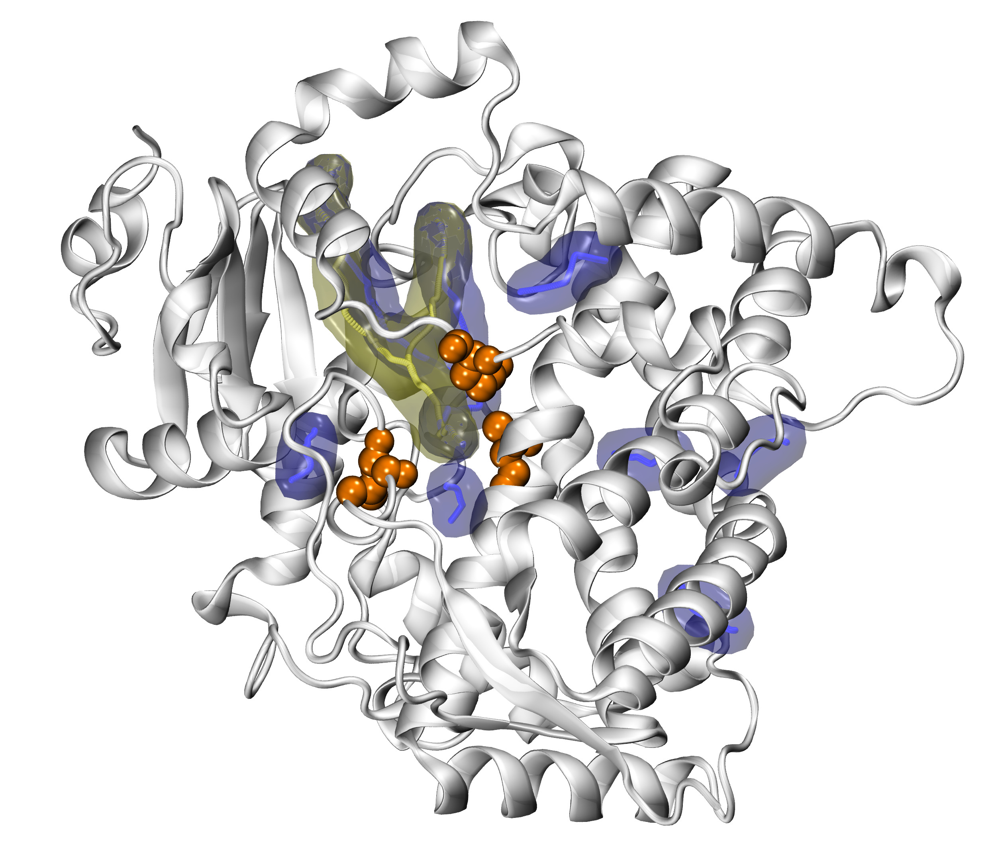

Visualization of the system was performed in the VMD_ program. This outcome
shows how the prediction result can change when the ``start_point`` changes.

Detection of surface cavities in a single PDB structure
===============================================================================

In this part of the tutorial, we will also use the Cytochrome P450 structure,
but this time we will identify surface cavities instead of intraprotein
cavities.  

Once again we will parse protein structure with PDB ID ``1tqn``. 

.. ipython:: python
   :verbatim:

   atoms = parsePDB('1tqn').select('protein')

.. parsed-literal::

   @> PDB file is found in working directory (1tqn.pdb).
   @> 3999 atoms and 1 coordinate set(s) were parsed in 0.04s.

Now, to identify the potential surface cavities, we will use
:func:`.calcSurfaceCavities` and save the results as :file:`test_surf_cav.pqr`
file using ``output_path`` parameter.

.. ipython:: python
   :verbatim:

   cavities, surface = calcSurfaceCavities(atoms, output_path='test_surf_cav.pqr')

.. parsed-literal::

  @> The atoms supplied to calcChannels contain protein atoms only.
  @> Substituted 3766 atoms with 23638 homogeneous balls of radius 1.52 A in 0.22s.
  @> Delaunay tessellation of 23638 points constructed in 0.84s.
  @> Surface and inner simplices filtered in 0.32s.
  @> 40 surface cavities detected and filtered in 0.30s.
  @> Returning surface cavities
  @> Saving surface cavities to test_surf_cav.pqr.
  @> Surface cavity calculation completed in 1.81s.

To display the identified surface cavities, similarly to the channel
identification, we need to use VMD_ to create the model for visualization
within ProDy. For that reason, we need to provide ``vmd_path`` and use 
:func:`.getVmdModel`. 

.. ipython:: python
   :verbatim:

   vmd_path = '/usr/local/bin/vmd'
   model = getVmdModel(vmd_path, atoms)

.. parsed-literal::

   @> Model created successfully.

To display the results using the Open3D library in ProDy, we can use
:func:`.showSurfaceCavities` and provide the ``surface`` object together
with the protein ``model`` generated by VMD_. When ``show_surface`` is set
to ``True``, the protein surface is displayed together with the detected
surface cavities. The protein is shown in the NewCartoon representation,
whereas the detected surface cavities are visualized as tetrahedron-derived
regions based on the Voronoi/Delaunay tessellation.

.. ipython:: python
   :verbatim:

   showSurfaceCavities(surface, model=model, show_surface=True)

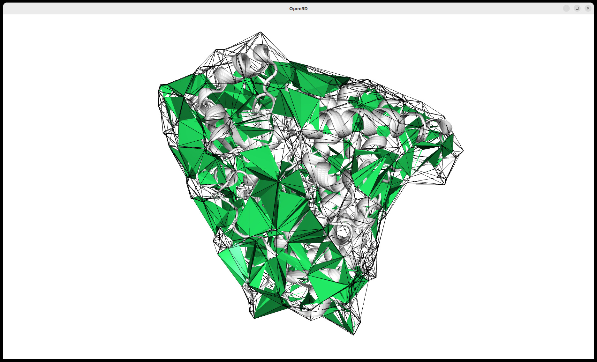

The :func:`.calcSurfaceCavities` function provides several parameters that
can be used to tune the detection and selection of surface cavities,
including min_volume, max_volume, min_depth, max_depth, min_tetrahedra,
max_tetrahedra, as well as r1, r2, and sparsity. In the example below, only
surface cavities with volumes between 500 and 1000 ų are selected and
saved to a file specified by the output_path parameter,
:file:`surf_cav_MinMax_volume.pqr`.

.. ipython:: python
   :verbatim:

   cavities2, surface2 = calcSurfaceCavities(atoms, min_volume=500,
		max_volume=1000, output_path='surf_cav_MinMax_volume.pqr')

.. parsed-literal::

   @> The atoms supplied to calcChannels contain protein atoms only.
   @> Substituted 3766 atoms with 23638 homogeneous balls of radius 1.52 A in 0.28s.
   @> Delaunay tessellation of 23638 points constructed in 0.81s.
   @> Surface and inner simplices filtered in 0.33s.
   @> 40 surface cavities detected and filtered in 0.31s.
   @> Returning surface cavities
   @> Saving surface cavities to surf_cav_MinMax_volume.pqr.
   @> Surface cavity calculation completed in 1.84s.

We can display the results using :func:`.showSurfaceCavities` function:

.. ipython:: python
   :verbatim:

   showSurfaceCavities(surface2, model=model, show_surface=True)

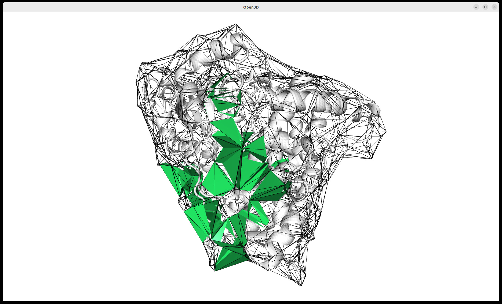

To provide nicer visualization for the surface cavities, we can also use
:func:`.getVmdModel` function with ``representation`` parameter set to
``'QuickSurf'``. We need to provide the PQR file to do that.

.. ipython:: python
   :verbatim:

   cav_model = getVmdModel(vmd_path, 
        parsePQR('surf_cav_MinMax_volume.pqr'),
    	representation='QuickSurf')

.. parsed-literal::

   @> Model created successfully.

Once the model is created, we can display it by setting ``cavity_atoms``
parameter.

.. ipython:: python
   :verbatim:

   showSurfaceCavities(surface2, model=model, cavity_atoms=cav_model)

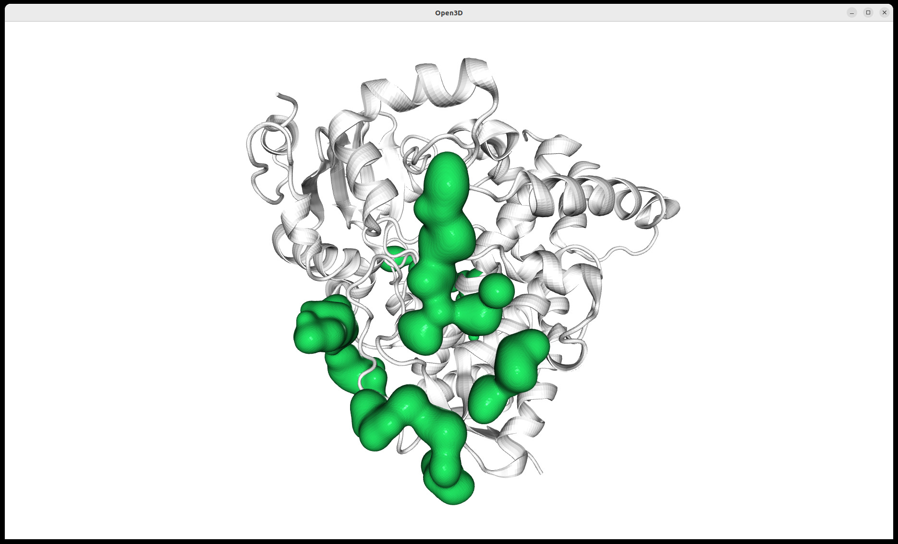

To obtain information about the surface cavities, such as volume, depth or
tetrahedra count, use :func:`getSurfaceCavityParameters`.

.. ipython:: python
   :verbatim:

   parameters = getSurfaceCavityParameters(cavities2)

.. parsed-literal::

   @> Cavity ID: 	Volume [ų] 	Depth [Å] 	Tetrahedra count
   @> cavity 0: 	503.05 		7.78 		133
   @> cavity 1: 	955.46 		8.29 		269
   @> cavity 2: 	621.45 		8.01 		152

By assigning the output of :func:`getSurfaceCavityParameters` to the
variable parameters, the extracted cavity descriptors can be accessed as
lists, including cavity volume (``parameters[0]``), depth
(``parameters[1]``), and tetrahedra count (``parameters[2]``).

.. ipython:: python
   :verbatim:

   parameters

.. parsed-literal::

   ([503.04967293496003, 955.46028274561, 621.4527824426602],
    [7.7812978201386995, 8.293453349117478, 8.006634128744826],
    [133, 269, 152])

.. ipython:: python
   :verbatim:

   parameters[0]

.. parsed-literal::

   [503.04967293496003, 955.46028274561, 621.4527824426602]

In addition to quantitative descriptors, CaviTracer also allows the
identification of residues forming each detected surface cavity. This
information can be obtained using :func:`getSurfaceCavityResidueNames`,
which returns residue names and residue numbers for each cavity based on
the distance between cavity points and protein residues. The results can be
saved using the ``residues_file_name`` parameter. The provided name will 
be used to save the results with the ``_Residues_All_surface_cavities.txt``
sufix.

.. ipython:: python
   :verbatim:

   residues = getSurfaceCavityResidueNames(atoms, cavities2, surface2, 
					residues_file_name='results')

.. parsed-literal::

   @> Surface cavity residues were saved to: results_Residues_All_surface_cavities.txt

.. ipython:: python
   :verbatim:

   residues

.. parsed-literal::

   ['cavity0: LYS55, MET59, MET62, TYR319, THR323, HIS324, TYR399, GLU412, 
     LYS413, PHE414, LEU415, ILE473, LYS476, LEU477, LEU479, GLU486',
    'cavity1: GLU163, GLY167, LYS168, PRO169, VAL170, THR171, LYS173, 
     ASP174, SER195, LEU196, PRO199, LYS208, LYS209, LEU211, ARG212, PHE213, 
     ASP214, ASP217, PHE219, PHE220, ILE238, CYS239, VAL240, TYR307, GLU308, 
     CYS468, LYS469, GLU470, GLN472, LEU482, GLN484, PRO485, GLU486, LYS487, 
     PRO488, VAL490, LYS492',
    'cavity2: LEU142, TYR347, LEU351, GLN352, GLU354, ASN361, PHE419, LYS424, 
     ASP425, ASN426, ILE427, ASP428, PRO429, TYR432, PRO434, PHE435, GLY436, 
     SER437, MET445, ARG446, LEU449, MET450, LYS453']

