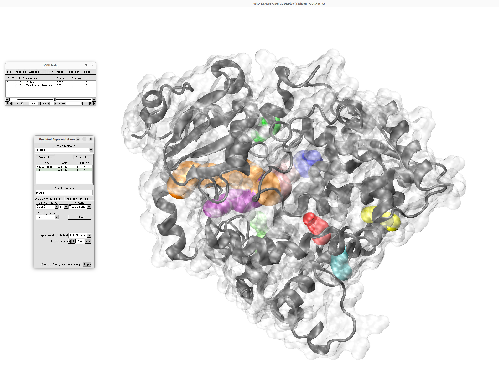
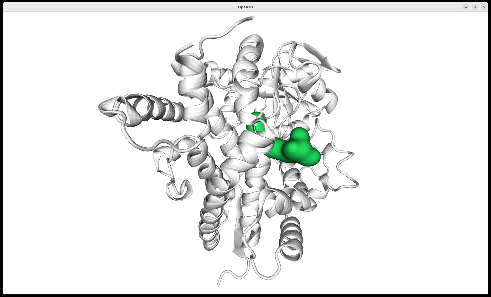

.. _cavitracer_single:

I. Detection of intraprotein tunnels and channels in a single PDB structure
===============================================================================

CaviTracer prediction
-------------------------------------------------------------------------------

As an example for this tutorial, we will analyze the structure of cytochrome
P450 which contains 486 residues. To analyze the structure, we need to parse
a structure :file:`1tqn` using :func:`.parsePDB`:

.. ipython:: python
   :verbatim:

   p = parsePDB('1tqn')

.. parsed-literal::

   @> Connecting wwPDB FTP server RCSB PDB (USA).
   @> Downloading PDB files via FTP failed, trying HTTP.
   @> 1tqn downloaded (1tqn.pdb.gz)
   @> PDB download via HTTP completed (1 downloaded, 0 failed).
   @> 3999 atoms and 1 coordinate set(s) were parsed in 0.14s.

Now, we select protein structure for analysis:

.. ipython:: python
   :verbatim:

   atoms = p.select("protein")

To predict channels or tunnels within protein structure, we should
utilize :func:`.calcChannels` function. This function analyzes the provided
atomic structure to detect intraprotein channels/tunnels, which
are voids or pathways within the molecular structure. It employs Voronoi
and Delaunay tessellations to identify these regions (see more details 
in the description of the function). 

The ``'separate'`` parameter controls whether each detected channel is
saved to a separate file (``True``) or if all channels are saved in a single
file (``False``). Files are saved as PQR file under the name specified using
``'output_path'``. If we add ``.pdb`` the file will be saved as a PDB file;
Otherwise, it will be saved as a PQR file. Results with ``'separate'``
option set to ``True`` can be saved only as a PQR files. 

.. ipython:: python
   :verbatim:

   channels, surface = calcChannels(atoms, output_path='channels_1tqn_ALL.pdb')

.. parsed-literal::

    @> The atoms supplied to calcChannels contain protein atoms only.
    @> Substituted 3766 atoms with 23638 homogeneous balls of radius 1.52 Å in 0.17s.
    @> Delaunay tessellation of 23638 points constructed in 0.78s.
    @> Surface and inner simplices filtered in 1.63s.
    @> Cavities: 129 found, 7 deeper than min_depth=5.0 Å and searched for channels, in 0.30s.
    @> Chambers (probe 1.40 Å): 6 of the 7 searched cavities have them; the other 4 are searched whole.
    @>     cavity 0: 10 chambers, 2 of them seeded.
    @>     cavity 1: 1 chamber, none of them deep and large enough to seed; searched whole.
    @>     cavity 2: 1 chamber, seeded.
    @>     cavity 3: 1 chamber, none of them deep and large enough to seed; searched whole.
    @>     cavity 4: 3 chambers, 1 of them seeded.
    @>     cavity 5: 1 chamber, none of them deep and large enough to seed; searched whole.
    @> 8 search sites (sp) in 0.06s: one per seeded chamber, one per cavity searched whole.
    @> Channel search (Dijkstra) over 8 search sites in 7 cavities completed in 0.21s.
    @> Found 9 channels.
    @> Search sites (sp), the void each search ran from, largest first; sp<n> tags every channel, link and output file:
    @>     site  start_point [Å]              void                   volume [ų]  depth [Å]  channels  links
    @>     sp0   [-17.336, -19.734, -11.982]  cavity 0, chamber 1/2         4701       14.9         3      -
    @>     sp1   [-9.260, -31.344, -5.479]    cavity 1, whole               1410        5.0         1      -
    @>     sp2   [-27.710, -17.308, -22.652]  cavity 3, whole                359        5.0         1      -
    @>     sp3   [-15.652, -41.491, -12.372]  cavity 5, whole                256        5.6         1      -
    @>     sp4   [-13.208, -37.795, -3.550]   cavity 6, whole                247        5.0         1      -
    @>     sp5   [-25.439, -42.211, -10.996]  cavity 2, chamber 1/1          199        6.9         -      -  sealed
    @>     sp6   [-26.621, -29.554, -20.717]  cavity 0, chamber 2/2          116        5.1         1      -
    @>     sp7   [-27.498, -24.585, 0.741]    cavity 4, chamber 1/1           50        9.3         1      -
    @>     (site volumes measure the void itself and are not on the swept-sphere scale of the channel volumes)
    @> The 1 site marked sealed above report neither a channel nor a link: no route out of them survived - either narrower than bottleneck=1.20 Å, or dropped as a duplicate of a shallower site's, or the v
    @> Saving 9 channels to channels_1tqn_ALL.pdb.
    @> Channel calculation completed in 3.09s.

.. ipython:: python
   :verbatim:

   channels, surface = calcChannels(atoms, output_path='channels_1tqn', separate=True)

.. parsed-literal::

    @> The atoms supplied to calcChannels contain protein atoms only.
    @> Substituted 3766 atoms with 23638 homogeneous balls of radius 1.52 Å in 0.18s.
    @> Delaunay tessellation of 23638 points constructed in 0.75s.
    @> Surface and inner simplices filtered in 1.63s.
    @> Cavities: 129 found, 7 deeper than min_depth=5.0 Å and searched for channels, in 0.29s.
    @> Chambers (probe 1.40 Å): 6 of the 7 searched cavities have them; the other 4 are searched whole.
    @>     cavity 0: 10 chambers, 2 of them seeded.
    @>     cavity 1: 1 chamber, none of them deep and large enough to seed; searched whole.
    @>     cavity 2: 1 chamber, seeded.
    @>     cavity 3: 1 chamber, none of them deep and large enough to seed; searched whole.
    @>     cavity 4: 3 chambers, 1 of them seeded.
    @>     cavity 5: 1 chamber, none of them deep and large enough to seed; searched whole.
    @> 8 search sites (sp) in 0.08s: one per seeded chamber, one per cavity searched whole.
    @> Channel search (Dijkstra) over 8 search sites in 7 cavities completed in 0.24s.
    @> Found 9 channels.
    @> Search sites (sp), the void each search ran from, largest first; sp<n> tags every channel, link and output file:
    @>     site  start_point [Å]              void                   volume [ų]  depth [Å]  channels  links
    @>     sp0   [-17.336, -19.734, -11.982]  cavity 0, chamber 1/2         4701       14.9         3      -
    @>     sp1   [-9.260, -31.344, -5.479]    cavity 1, whole               1410        5.0         1      -
    @>     sp2   [-27.710, -17.308, -22.652]  cavity 3, whole                359        5.0         1      -
    @>     sp3   [-15.652, -41.491, -12.372]  cavity 5, whole                256        5.6         1      -
    @>     sp4   [-13.208, -37.795, -3.550]   cavity 6, whole                247        5.0         1      -
    @>     sp5   [-25.439, -42.211, -10.996]  cavity 2, chamber 1/1          199        6.9         -      -  sealed
    @>     sp6   [-26.621, -29.554, -20.717]  cavity 0, chamber 2/2          116        5.1         1      -
    @>     sp7   [-27.498, -24.585, 0.741]    cavity 4, chamber 1/1           50        9.3         1      -
    @>     (site volumes measure the void itself and are not on the swept-sphere scale of the channel volumes)
    @> The 1 site marked sealed above report neither a channel nor a link: no route out of them survived - either narrower than bottleneck=1.20 Å, or dropped as a duplicate of a shallower site's, or the v
    @> Saving 9 channels to directory ., one file per object named sp<site>_chl<n>.
    @> Channel calculation completed in 3.11s.

Files with separated channels will be saved in separate PQR files in the
local directory:

.. parsed-literal::

   channels_1tqn_sp6_chl0.pqr
   channels_1tqn_sp2_chl1.pqr
   channels_1tqn_sp1_chl2.pqr
   channels_1tqn_sp4_chl3.pqr
   channels_1tqn_sp3_chl4.pqr
   channels_1tqn_sp0_chl5.pqr
   channels_1tqn_sp0_chl7.pqr
   channels_1tqn_sp0_chl6.pqr
   channels_1tqn_sp7_chl8.pqr

Each PQR file will contain ``FIL`` atoms that describe the predicted
channels/tunnels. The ``Beta`` column denotes the radius of the sphere, 
which is needed for visualization purposes.

.. parsed-literal::

   REMARK   channel 0  length=5.129 A  bottleneck=1.774 A  curvature=1.200  cost=0.9796  from sp6
   ATOM      1  H   FIL T   1     -26.621 -29.554 -20.717  1.00  1.77
   ATOM      2  H   FIL T   1     -26.744 -29.596 -20.620  1.00  1.77
   ATOM      3  H   FIL T   1     -26.866 -29.637 -20.523  1.00  1.77
   ATOM      4  H   FIL T   1     -26.988 -29.678 -20.426  1.00  1.77
   ATOM      5  H   FIL T   1     -27.111 -29.718 -20.328  1.00  1.77
   ATOM      6  H   FIL T   1     -27.233 -29.757 -20.231  1.00  1.80
   ATOM      7  H   FIL T   1     -27.354 -29.795 -20.133  1.00  1.89
   ATOM      8  H   FIL T   1     -27.476 -29.831 -20.036  1.00  2.01
   ATOM      9  H   FIL T   1     -27.596 -29.865 -19.938  1.00  2.10
   ATOM     10  H   FIL T   1     -27.717 -29.897 -19.839  1.00  2.13
   ATOM     11  H   FIL T   1     -27.835 -29.927 -19.742  1.00  2.13
   ATOM     12  H   FIL T   1     -27.945 -29.953 -19.651  1.00  2.13
   ATOM     13  H   FIL T   1     -28.042 -29.977 -19.570  1.00  2.13
   ATOM     14  H   FIL T   1     -28.122 -29.997 -19.505  1.00  2.26
   ATOM     15  H   FIL T   1     -28.178 -30.013 -19.459  1.00  2.41
   ATOM     16  H   FIL T   1     -28.205 -30.025 -19.437  1.00  2.47
   ATOM     17  H   FIL T   1     -28.222 -30.025 -19.430  1.00  2.48
   ATOM     18  H   FIL T   1     -28.267 -29.999 -19.412  1.00  2.47
   ATOM     19  H   FIL T   1     -28.336 -29.950 -19.382  1.00  2.47
   ATOM     20  H   FIL T   1     -28.419 -29.883 -19.341  1.00  2.47
   ATOM     21  H   FIL T   1     -28.508 -29.804 -19.291  1.00  2.47
   ATOM     22  H   FIL T   1     -28.594 -29.716 -19.231  1.00  2.47
   ATOM     23  H   FIL T   1     -28.671 -29.625 -19.164  1.00  2.47
   ATOM     24  H   FIL T   1     -28.741 -29.534 -19.095  1.00  2.47
   ATOM     25  H   FIL T   1     -28.810 -29.446 -19.028  1.00  2.47
   ATOM     26  H   FIL T   1     -28.886 -29.363 -18.970  1.00  2.48
   ATOM     27  H   FIL T   1     -28.974 -29.289 -18.926  1.00  2.52
   ATOM     28  H   FIL T   1     -29.081 -29.226 -18.902  1.00  2.58
   ATOM     29  H   FIL T   1     -29.214 -29.177 -18.903  1.00  2.60
   ATOM     30  H   FIL T   1     -29.376 -29.145 -18.932  1.00  2.59
   ATOM     31  H   FIL T   1     -29.559 -29.126 -18.984  1.00  2.58
   ATOM     32  H   FIL T   1     -29.753 -29.118 -19.050  1.00  2.57
   ATOM     33  H   FIL T   1     -29.950 -29.118 -19.124  1.00  2.56
   ATOM     34  H   FIL T   1     -30.138 -29.123 -19.199  1.00  2.57
   ATOM     35  H   FIL T   1     -30.309 -29.130 -19.266  1.00  2.59
   ATOM     36  H   FIL T   1     -30.453 -29.136 -19.318  1.00  2.62
   ATOM     37  H   FIL T   1     -30.559 -29.138 -19.349  1.00  2.65
   ATOM     38  H   FIL T   1     -30.619 -29.133 -19.350  1.00  2.66
   ATOM     39  H   FIL T   1     -30.632 -29.121 -19.320  1.00  2.66
   ATOM     40  H   FIL T   1     -30.619 -29.104 -19.273  1.00  2.66
   CONECT    1    2
   CONECT    2    3
   CONECT    3    4
   CONECT    4    5
   CONECT    5    6
   CONECT    6    7
   CONECT    7    8
   CONECT    8    9
   CONECT    9   10
   CONECT   10   11
   CONECT   11   12
   CONECT   12   13
   CONECT   13   14
   ..

Generated PQR file can be visualized together with protein PDB file using 
VMD_ or another program for graphical visualizations of molecules.

.. figure:: images/cavitracer_figure1.jpg
   :scale: 50 %

CaviTracer provides various information about predicted channels/tunnels, 
such as volume, length of the channels, and the bottleneck (narrowest point 
of the channel). To obtain this information use :func:`.getChannelParameters` 
function.

.. ipython:: python
   :verbatim:

   getChannelParameters(channels)

.. parsed-literal::

    @> Channel ID:      Volume [ų]     Length [Å]      Bottleneck [Å]
    @> channel 0:       138.41          5.13            1.77
    @> channel 1:       90.59           5.28            1.64
    @> channel 2:       68.57           5.08            1.44
    @> channel 3:       64.17           5.49            1.27
    @> channel 4:       67.18           5.65            1.43
    @> channel 5:       396.19          15.13           1.92
    @> channel 6:       714.24          24.04           2.15
    @> channel 7:       390.67          16.68           1.33
    @> channel 8:       81.58           9.31            1.25

    ([5.129135300103848,
      5.281500944479156,
      5.081904597491893,
      5.488653033340102,
      5.646459881044546,
      15.127276607587081,
      24.036004895393283,
      16.682534121845208,
      9.312225012366774],
     [1.7741893943179705,
      1.6355672375379195,
      1.4382771264858563,
      1.272189841690206,
      1.4309319113942687,
      1.9175873515511555,
      2.152093925749909,
      1.3286111466243056,
      1.2491726199010307],
     [138.41196426854665,
      90.58924005876884,
      68.57101225971567,
      64.16952055549137,
      67.17597871360951,
      396.18571503642966,
      714.2414285211511,
      390.6715356387118,
      81.58365085260795])

Additionally, to obtain information on which residues are involved in the
formation of the predicted channels, use :func:`.getChannelResidueNames` 
function. To save the data in the local directory, provide a name for 
``residues_file_name``. This information can be saved with a one-letter 
or three-letter code of residues, as shown below. 

.. ipython:: python
   :verbatim:

   getChannelResidueNames(atoms, channels, 
				residues_file_name='1tqn_data')

.. parsed-literal::

    @> Channel residues were saved to: 1tqn_data_Residues_All_channels.txt

    ['channel0: LYS173:A, SER311:A, SER312:A, SER315:A, PHE316:A, GLN484:A, PRO485:A, PRO488:A',
     'channel1: LYS55:A, GLY56:A, PHE57:A, CYS58:A, MET59:A, MET371:A, LEU477:A, SER478:A, 
                LEU479:A, GLY480:A, GLY481:A, LEU482:A, LEU483:A',
     'channel2: THR136:A, PHE137:A, THR138:A, LYS141:A, LEU142:A, MET145:A, PHE271:A, ILE443:A, 
                GLY444:A, MET445:A, ARG446:A, PHE447:A',
     'channel3: MET145:A, ILE148:A, ILE149:A, SER186:A, THR187:A, SER188:A, ARG268:A, VAL269:A, 
                ASP270:A',
     'channel4: ILE149:A, ALA150:A, GLN151:A, TYR152:A, GLY153:A, ASP154:A, TYR179:A, PRO344:A, 
                PRO345:A, LEU454:A, ALA455:A, ARG458:A',
     'channel5: ARG105:A, ARG106:A, PRO107:A, PHE108:A, SER119:A, ILE120:A, GLU122:A, ARG212:A, 
                PHE213:A, PHE215:A, PHE304:A, ALA305:A, THR309:A, ALA370:A, PHE435:A, ASN441:A, 
                CYS442:A',
     'channel6: ASP76:A, GLN79:A, ARG105:A, ARG106:A, PRO107:A, PHE108:A, SER119:A, ARG212:A, 
                PHE215:A, PHE220:A, ILE223:A, THR224:A, PRO227:A, ILE230:A, ALA305:A, THR309:A, 
                ALA370:A, ARG372:A, LEU373:A,
     'channel7: ARG105:A, SER119:A, ARG212:A, ALA305:A, GLU308:A, THR309:A, SER312:A, ILE369:A, 
                ALA370:A, PRO434:A, PHE435:A, ASN441:A, CYS442:A, LEU482:A, LEU483:A, GLN484:A',
     'channel8: ASN206:A, LYS209:A, LEU210:A, LEU211:A, PHE213:A, VAL240:A, PHE241:A, PRO242:A, 
                VAL245:A, THR246:A, LEU249:A, ILE300:A, PHE304:A']

.. ipython:: python
   :verbatim:

   getChannelResidueNames(atoms, channels, distA=3, 
		one_letter_aa=True, residues_file_name='1tqn_data_1letter')

.. parsed-literal::

    @> Channel residues were saved to: 1tqn_data_1letter_Residues_All_channels.txt

    ['channel0: T171:A, L172:A, K173:A, D174:A, E308:A, S311:A, S312:A, V313:A, L314:A, S315:A, 
                F316:A, L483:A, Q484:A, P485:A, E486:A, K487:A, P488:A, V489:A',
     'channel1: K55:A, G56:A, F57:A, C58:A, M59:A, L216:A, M371:A, Y399:A, L477:A, S478:A, 
                L479:A, G480:A, G481:A, L482:A, L483:A, Q484:A',
     'channel2: P135:A, T136:A, F137:A, T138:A, S139:A, K141:A, L142:A, K143:A, M145:A, F271:A, 
                L274:A, I443:A, G444:A, M445:A, R446:A, F447:A, A448:A',
     'channel3: K141:A, E144:A, M145:A, V146:A, P147:A, I148:A, I149:A, V183:A, S186:A, T187:A, 
                S188:A, F189:A, G190:A, N192:A, R268:A, V269:A, D270:A, F271:A, F447:A',
     'channel4: V146:A, I149:A, A150:A, Q151:A, Y152:A, G153:A, D154:A, Y179:A, V183:A, P344:A, 
                P345:A, M450:A, N451:A, K453:A, L454:A, A455:A, L456:A, I457:A, R458:A, Q461:A',
     'channel5: N104:A, R105:A, R106:A, P107:A, F108:A, V111:A, S119:A, I120:A, A121:A, E122:A, 
                R212:A, F213:A, F215:A, F241:A, I301:A, F304:A, A305:A, T309:A, I369:A, A370:A, 
                R372:A, L373:A, R375:A, P434
     'channel6: F57:A, D76:A, G77:A, Q78:A, Q79:A, R105:A, R106:A, P107:A, F108:A, G109:A, S119:A, 
                R212:A, F213:A, F215:A, F220:A, I223:A, T224:A, V225:A, F226:A, P227:A, F228:A, 
                I230:A, F304:A, A305:A, T
     'channel7: R105:A, S119:A, R212:A, F213:A, F304:A, A305:A, G306:A, E308:A, T309:A, S312:A, 
                F316:A, P368:A, I369:A, A370:A, M371:A, R372:A, L373:A, P434:A, F435:A, G436:A, 
                R440:A, N441:A, C442:A, I443
     'channel8: F113:A, M114:A, N206:A, T207:A, K208:A, K209:A, L210:A, L211:A, R212:A, F213:A, 
                V240:A, F241:A, P242:A, R243:A, E244:A, V245:A, T246:A, N247:A, L249:A, I300:A, 
                F304:A']

Visualization of channels within ProDy
-------------------------------------------------------------------------------

To visualize CaviTracer predictions, we do not need external programs. If
VMD_ and Open3D_ are installed on our machine, we can visalize the
predictions directly in ProDy. 

First, we need to use :func:`.getVmdModel` function and provide the pathway
to where VMD_ binary file is localized, as shown below. VMD_ is used to
create protein structure in the NewCartoon representation. That model is
further used by CaviTracer functions to display predicted channels/tunnels 
using Open3D_ library. 

.. ipython:: python
   :verbatim:

   vmd_path = '/usr/local/bin/vmd'
   model = getVmdModel(vmd_path, atoms)

.. parsed-literal::

   @> Model created successfully.

.. ipython:: python
   :verbatim:

   model

.. parsed-literal::

   TriangleMesh with 56180 points and 112320 triangles.

Once the model is created, we can display several things: 

**(i)** Cavities with :func:`.showCavities`:

.. ipython:: python
   :verbatim:

   showCavities(surface)

.. figure:: images/cavitracer_figure2.jpg
   :scale: 50 %

**(ii)** Channels with :func:`.showChannels` in a several ways:

.. ipython:: python
   :verbatim:

   showChannels(channels, surface=surface, model=model)

.. figure:: images/cavitracer_figure3.jpg
   :scale: 50 %

.. ipython:: python
   :verbatim:

   showChannels(channels, model=model)

.. figure:: images/cavitracer_figure4.jpg
   :scale: 50 %

.. ipython:: python
   :verbatim:

   showCavities(surface, show_surface=True)

.. figure:: images/cavitracer_figure5.jpg
   :scale: 50 %

Channels can be visualized separately. Below are several examples of how to
display single channels (channel #7, channel #5), two channels at once (channel
#4 and channel #6), or a range of channels (channels from #4 to channel #7
from the prediction).

.. ipython:: python
   :verbatim:

   showChannels(channels[7], model)

.. figure:: images/cavitracer_figure6.jpg
   :scale: 50 %

.. ipython:: python
   :verbatim:

   showChannels(channels[5], model)

.. figure:: images/cavitracer_figure7.jpg
   :scale: 50 %

.. ipython:: python
   :verbatim:

   selected_channels = [channels[4], channels[6]]
   showChannels(selected_channels, model)

.. figure:: images/cavitracer_figure8.jpg
   :scale: 50 %

.. ipython:: python
   :verbatim:

   selected_channels = channels[4:7]
   showChannels(selected_channels, model)

.. figure:: images/cavitracer_figure8B.jpg
   :scale: 50 %

Once we select which channels are of interest, we can obtain information
about their parameters.

.. ipython:: python
   :verbatim:

   selected_channels = channels[5:9]
   lengths, bottlenecks, volumes = getChannelParameters(selected_channels)
   selected_channels_atoms = getChannelAtoms(selected_channels)

.. parsed-literal::

   @> Channel ID: 	Volume [ų] 	Length [Å] 	Bottleneck [Å]
   @> channel 0: 	396.19 		15.13 		1.92
   @> channel 1: 	714.24 		24.04 		2.15
   @> channel 2: 	390.67 		16.68 		1.33
   @> channel 3: 	81.58 		9.31 		1.25
   @> 430 atoms and 1 coordinate set(s) were parsed in 0.01s.

Predefined starting point for channel prediction
-------------------------------------------------------------------------------

By default, CaviTracer automatically selects the starting tetrahedron
(starting point for the interior cavity prediction) based on cavity depth.
Alternatively, users can provide a custom starting point using
``start_point`` argument. This can be either a 3D coordinate point or an 
atomic selection/AtomGroup as show below. If an atomic selection is provided, its 
geometric center is used as the starting point.

.. ipython:: python
   :verbatim:

   channels, surface = calcChannels(atoms, start_point=[-22.312, -20.065, -11.144])

.. parsed-literal::

    @> Using user-provided start_point for channel seed: [-22.312, -20.065, -11.144] Å
    @> The atoms supplied to calcChannels contain protein atoms only.
    @> Substituted 3766 atoms with 23638 homogeneous balls of radius 1.52 Å in 0.19s.
    @> Delaunay tessellation of 23638 points constructed in 0.80s.
    @> Surface and inner simplices filtered in 1.66s.
    @> start_point seeded at tetrahedron 3792 (Voronoi vertex at [-21.468, -19.598, -8.582], 2.738 Å from start_point, inscribed radius 1.218 Å, depth 11.9 Å).
    @>     already the widest of the 1 tetrahedra at least 5.0 Å deep among the 1 reachable within 3.0 Å.
    @>     restricting the channel search to the cavity that contains it (2396 tetrahedra, depth 41.4 Å).
    @> Cavities: 1 found, 1 deeper than min_depth=5.0 Å and searched for channels, in 0.26s.
    @> Channel search (Dijkstra) over 1 search sites in 1 cavities completed in 0.10s.
    @> Found 3 channels.
    @> The void the search ran from:
    @>     start_point [Å]             void             volume [ų]  depth [Å]  channels
    @>     [-21.468, -19.598, -8.582]  cavity 0, whole         7680       11.9         3
    @>     (site volumes measure the void itself and are not on the swept-sphere scale of the channel volumes)
    @> No output path given.
    @> Channel calculation completed in 3.01s.

.. ipython:: python
   :verbatim:

   start_sel = atoms.select('resid 212 309 483')
   calcChannels(atoms, output_path='results.pdb', start_point=start_sel)

.. parsed-literal::

    @> Using user-provided start_point for channel seed: [-24.395, -23.462, -15.132] Å
    @> The atoms supplied to calcChannels contain protein atoms only.
    @> Substituted 3766 atoms with 23638 homogeneous balls of radius 1.52 Å in 0.19s.
    @> Delaunay tessellation of 23638 points constructed in 0.75s.
    @> Surface and inner simplices filtered in 1.66s.
    @> start_point seeded at tetrahedron 2807 (Voronoi vertex at [-25.350, -23.741, -16.491], 1.684 Å from start_point, inscribed radius 2.623 Å, depth 5.1 Å).
    @>     widened from the nearest tetrahedron 4872 (1.013 Å away, inscribed radius 2.308 Å, depth 6.6 Å), the widest of the 51 tetrahedra at least 5.0 Å deep among the 70 reachable within 3.0 Å; seeding
    @>     restricting the channel search to the cavity that contains it (2396 tetrahedra, depth 41.4 Å).
    @> Cavities: 1 found, 1 deeper than min_depth=5.0 Å and searched for channels, in 0.25s.
    @> Channel search (Dijkstra) over 1 search sites in 1 cavities completed in 0.10s.
    @> Found 3 channels.
    @> The void the search ran from:
    @>     start_point [Å]              void             volume [ų]  depth [Å]  channels
    @>     [-25.350, -23.741, -16.491]  cavity 0, whole         7680        5.1         3
    @>     (site volumes measure the void itself and are not on the swept-sphere scale of the channel volumes)
    @> Saving 3 channels to results.pdb.
    @> Channel calculation completed in 2.96s.
    ([<prody.proteins.channels.Channel at 0x764dd8cd36a0>,
      <prody.proteins.channels.Channel at 0x764dd8cd3730>,
      <prody.proteins.channels.Channel at 0x764dd8cd3850>],
     [array([[-30.07      ,   8.178     , -13.891     ],
             [-29.618     ,   8.226     , -15.315     ],
             [-29.58642188,   8.14478071, -15.1575    ],
             ...,
             [-26.49550663, -61.26776883, -23.6695    ],
             [-26.76969072, -61.18417412, -23.7145    ],
             [-26.57247665, -61.10354151, -23.7595    ]]),
      array([[ 408,  393,  396,  405],
             [ 394,  408,  396,  405],
             [ 394,  408,  393,  396],
             ...,
             [2348, 2340, 2322, 2355],
             [2348, 2340, 2357, 2355],
             [2348, 2340, 2357, 2322]], dtype=int32),
      array([[21102, 14053, 21104, 21283],
             [21061, 21102, 14053, 21283],
             [21121, 21061, 21102, 14053],
             ...,
             [21319, 21126, 21324, 21326],
             [21328, 14162, 14033, 14028],
             [21121, 21123, 21102, 14053]], dtype=int32),
      array([[16207, 16434, 16401, 16192],
             [16198, 16207, 16434, 16221],
             [16198, 16207, 16434, 16192],
             ...,
             [ 2356, 18579, 18430,  2354],
             [ 2356,  1907, 18579, 18430],
             [ 2356,  1907,  2973, 18430]], dtype=int32)])

Below is the visualization of channel identification for the two different starting
points mentioned above. The blue one represents identification of channels when
the starting point is [-22.312, -20.065, -11.144], whereas the dark-yellow one
represents identification based on the center of the mass for residues 212, 309,
and 483 (displayed as orange spheres). 

.. figure:: images/cavitracer_figure19.jpg
   :scale: 50 %

Visualization of the system was performed in the VMD_ program. This outcome
shows how the prediction result can change when the ``start_point`` changes.
Changes in the prediction can be better seen when the protein is
undisplayed, as shown bellow.

.. figure:: images/cavitracer_figure19B.jpg
   :scale: 50 %

Visualization in VMD
-------------------------------------------------------------------------------

CaviTracer results can be visualized automatically in VMD_. The
:func:`.writeVmdCaviTracerScript` function saves the molecular structure and
the selected CaviTracer objects and generates a TCL script containing the VMD
visualization settings.

For channels:

.. ipython:: python
   :verbatim:

   writeVmdCaviTracerScript(channels, protein)

This generates ``channels.pqr``, ``protein.pdb`` and ``vis_channels.tcl``.
Channels are displayed as VDW representations using their CaviTracer radii,
with individual channels shown in different colors. The protein is displayed
as NewCartoon together with a transparent molecular surface.

The visualization can be opened directly from the Bash console:

.. code-block:: console

   $ vmd -e vis_channels.tcl

Visualization in PyMol
-------------------------------------------------------------------------------

Since CaviTracer results can be exported in standard PDB or PQR formats, they 
can be readily visualized using commonly available molecular visualization 
programs, as demonstrated above with VMD_. In addition, CaviTracer provides 
a dedicated tool for PyMOL that automatically prepares the analyzed protein 
structure together with the identified channels, facilitating direct inspection 
of the results.

To prepare the output for PyMOL visualization, :func:`.calcChannels` should be 
called with ``output_format='mmcif'`` and ``output_path='.'``. This generates 
the ``channels.cif`` file containing the identified channels together with 
the ``vis_channels.py`` visualization script:

.. ipython:: python
   :verbatim:

   channels, surface = calcChannels(atoms, 
				    output_path='.',
				    output_format='mmcif', 
				    separate=True)

.. parsed-literal::

    @> The atoms supplied to calcChannels contain protein atoms only.
    @> Substituted 3766 atoms with 23638 homogeneous balls of radius 1.52 Å in 0.27s.
    @> Delaunay tessellation of 23638 points constructed in 0.90s.
    @> Surface and inner simplices filtered in 1.77s.
    @> Cavities: 129 found, 7 deeper than min_depth=5.0 Å and searched for channels, in 0.29s.
    @> Chambers (probe 1.40 Å): 6 of the 7 searched cavities have them; the other 4 are searched whole.
    @>     cavity 0: 10 chambers, 2 of them seeded.
    @>     cavity 1: 1 chamber, none of them deep and large enough to seed; searched whole.
    @>     cavity 2: 1 chamber, seeded.
    @>     cavity 3: 1 chamber, none of them deep and large enough to seed; searched whole.
    @>     cavity 4: 3 chambers, 1 of them seeded.
    @>     cavity 5: 1 chamber, none of them deep and large enough to seed; searched whole.
    @> 8 search sites (sp) in 0.07s: one per seeded chamber, one per cavity searched whole.
    @> Channel search (Dijkstra) over 8 search sites in 7 cavities completed in 0.21s.
    @> Found 9 channels.
    @> Search sites (sp), the void each search ran from, largest first; sp<n> tags every channel, link and output file:
    @>     site  start_point [Å]              void                   volume [ų]  depth [Å]  channels  links
    @>     sp0   [-17.336, -19.734, -11.982]  cavity 0, chamber 1/2         4701       14.9         3      -
    @>     sp1   [-9.260, -31.344, -5.479]    cavity 1, whole               1410        5.0         1      -
    @>     sp2   [-27.710, -17.308, -22.652]  cavity 3, whole                359        5.0         1      -
    @>     sp3   [-15.652, -41.491, -12.372]  cavity 5, whole                256        5.6         1      -
    @>     sp4   [-13.208, -37.795, -3.550]   cavity 6, whole                247        5.0         1      -
    @>     sp5   [-25.439, -42.211, -10.996]  cavity 2, chamber 1/1          199        6.9         -      -  sealed
    @>     sp6   [-26.621, -29.554, -20.717]  cavity 0, chamber 2/2          116        5.1         1      -
    @>     sp7   [-27.498, -24.585, 0.741]    cavity 4, chamber 1/1           50        9.3         1      -
    @>     (site volumes measure the void itself and are not on the swept-sphere scale of the channel volumes)
    @> The 1 site marked sealed above report neither a channel nor a link: no route out of them survived - either narrower than bottleneck=1.20 Å, or dropped as a duplicate of a shallower site's, or the void is its own mouth and has nowhere to path to. Lower bottleneck to see how the first kind connect.
    @> separate is ignored for mmCIF output: every channel goes into one file, which is what lets its categories refer to one another.
    @> 9 channel(s) written to channels.cif.
    @> Wrote the PyMOL viewer ./vis_channels.py. View the output with `pymol vis_channels.py -- <protein>.pdb "channels.cif"`.
    @> Channel calculation completed in 3.54s.

Once the files have been generated, the system and channels can be loaded 
directly into PyMOL from the Bash terminal using:

.. code-block:: console

    $ pymol vis_channels.py -- 1tqn.pdb channels.cif

This command opens the protein structure and the identified channels in PyMOL 
with the visualization settings prepared by the script. PyMOL is an external 
molecular visualization program and therefore needs to be installed separately 
before using this functionality.

.. figure:: images/cavitracer_figure28.jpg
   :scale: 50 %

II. Detection of surface cavities in a single PDB structure
===============================================================================

CaviTracer prediction and visualization
-------------------------------------------------------------------------------

In this part of the tutorial, we will also use the Cytochrome P450 structure,
but this time we will identify surface cavities instead of intraprotein
cavities.  

Once again we will parse protein structure with PDB ID ``1tqn``. 

.. ipython:: python
   :verbatim:

   atoms = parsePDB('1tqn').select('protein')

.. parsed-literal::

   @> PDB file is found in working directory (1tqn.pdb).
   @> 3999 atoms and 1 coordinate set(s) were parsed in 0.04s.

Now, to identify the potential surface cavities, we will use
:func:`.calcSurfaceCavities` and save the results as :file:`test_surf_cav.pqr`
file using ``output_path`` parameter.

.. ipython:: python
   :verbatim:

   cavities, surface = calcSurfaceCavities(atoms, output_path='test_surf_cav.pqr')

.. parsed-literal::

    @> The atoms supplied to calcChannels contain protein atoms only.
    @> Substituted 3766 atoms with 23638 homogeneous balls of radius 1.52 Å in 0.18s.
    @> Delaunay tessellation of 23638 points constructed in 0.75s.
    @> Surface and inner simplices filtered in 0.29s.
    @> Cavities: 336 found, 40 deeper than min_depth=1.5 Å and kept, in 0.21s.
    @> Returning surface cavities
    @> Saving surface cavities to test_surf_cav.pqr.
    @> Surface cavity calculation completed in 1.53s.

To display the identified surface cavities, similarly to the channel
identification, we need to use VMD_ to create the model for visualization
within ProDy. For that reason, we need to provide ``vmd_path`` and use 
:func:`.getVmdModel`. 

.. ipython:: python
   :verbatim:

   vmd_path = '/usr/local/bin/vmd'
   model = getVmdModel(vmd_path, atoms)

.. parsed-literal::

   @> Model created successfully.

To display the results using the Open3D library in ProDy, we can use
:func:`.showSurfaceCavities` and provide the ``surface`` object together
with the protein ``model`` generated by VMD_. When ``show_surface`` is set
to ``True``, the protein surface is displayed together with the detected
surface cavities. The protein is shown in the NewCartoon representation,
whereas the detected surface cavities are visualized as tetrahedron-derived
regions based on the Voronoi/Delaunay tessellation.

.. ipython:: python
   :verbatim:

   showSurfaceCavities(surface, model=model, show_surface=True)

.. figure:: images/cavitracer_figure20.jpg
   :scale: 50 %

The :func:`.calcSurfaceCavities` function provides several parameters that
can be used to tune the detection and selection of surface cavities,
including min_volume, max_volume, min_depth, max_depth, min_tetrahedra,
max_tetrahedra, as well as surf_radius, inner_radius, and sparsity. In the
example below, only surface cavities with volumes between 500 and 1000 ų are
selected and saved to a file specified by the output_path parameter,
:file:`surf_cav_MinMax_volume.pqr`.

.. ipython:: python
   :verbatim:

   cavities2, surface2 = calcSurfaceCavities(atoms, min_volume=500,
		max_volume=1000, output_path='surf_cav_MinMax_volume.pqr')

.. parsed-literal::

    @> The atoms supplied to calcChannels contain protein atoms only.
    @> Substituted 3766 atoms with 23638 homogeneous balls of radius 1.52 Å in 0.18s.
    @> Delaunay tessellation of 23638 points constructed in 0.78s.
    @> Surface and inner simplices filtered in 0.30s.
    @> Cavities: 336 found, 40 deeper than min_depth=1.5 Å and kept, in 0.21s.
    @> Returning surface cavities
    @> Saving surface cavities to surf_cav_MinMax_volume.pqr.
    @> Surface cavity calculation completed in 1.58s.

We can display the results using :func:`.showSurfaceCavities` function:

.. ipython:: python
   :verbatim:

   showSurfaceCavities(surface2, model=model, show_surface=True)

.. figure:: images/cavitracer_figure21.jpg
   :scale: 50 %

To provide nicer visualization for the surface cavities, we can also use
:func:`.getVmdModel` function with ``representation`` parameter set to
``'QuickSurf'``. We need to provide the PQR file to do that.

.. ipython:: python
   :verbatim:

   cav_model = getVmdModel(vmd_path, 
        parsePQR('surf_cav_MinMax_volume.pqr'),
    	representation='QuickSurf')

.. parsed-literal::

   @> Model created successfully.

Once the model is created, we can display it by setting ``cavity_atoms``
parameter.

.. ipython:: python
   :verbatim:

   showSurfaceCavities(surface2, model=model, cavity_atoms=cav_model)

.. figure:: images/cavitracer_figure22.jpg
   :scale: 50 %

To obtain information about the surface cavities, such as volume, depth or
tetrahedra count, use :func:`.getSurfaceCavityParameters`.

.. ipython:: python
   :verbatim:

   parameters = getSurfaceCavityParameters(cavities2)

.. parsed-literal::

   @> Cavity ID: 	Volume [ų] 	Depth [Å] 	Tetrahedra count
   @> cavity 0: 	955.46 		8.29 		269
   @> cavity 1: 	621.45 		8.01 		152
   @> cavity 2: 	503.05 		7.78 		133

By assigning the output of :func:`.getSurfaceCavityParameters` to the
variable parameters, the extracted cavity descriptors can be accessed as
lists, including cavity volume (``parameters[0]``), depth
(``parameters[1]``), and tetrahedra count (``parameters[2]``).

.. ipython:: python
   :verbatim:

   parameters

.. parsed-literal::

   ([955.46028274561, 621.4527824426602, 503.04967293496003],
    [8.293453349117478, 8.006634128744826, 7.7812978201386995],
    [269, 152, 133])

.. ipython:: python
   :verbatim:

   parameters[0]

.. parsed-literal::

   [955.46028274561, 621.4527824426602, 503.04967293496003]

In addition to quantitative descriptors, CaviTracer also allows the
identification of residues forming each detected surface cavity. This
information can be obtained using :func:`.getSurfaceCavityResidueNames`,
which returns residue names and residue numbers for each cavity based on
the distance between cavity points and protein residues. The results can be
saved using the ``residues_file_name`` parameter. The provided name will 
be used to save the results with the ``_Residues_All_surface_cavities.txt``
sufix.

.. ipython:: python
   :verbatim:

   residues = getSurfaceCavityResidueNames(atoms, cavities2, surface2, 
					residues_file_name='results')

.. parsed-literal::

   @> Surface cavity residues were saved to: results_Residues_All_surface_cavities.txt

.. ipython:: python
   :verbatim:

   residues

.. parsed-literal::

    ['cavity0: PRO110:A, GLU163:A, GLY167:A, LYS168:A, PRO169:A, VAL170:A, THR171:A, 
               LYS173:A, ASP174:A, VAL175:A, GLY177:A, ALA178:A, SER195:A, LEU196:A, 
               PRO199:A, GLU205:A, LYS208:A, LYS209:A, LEU211:A,
     'cavity1: LEU142:A, TYR347:A, VAL350:A, LEU351:A, GLN352:A, GLU354:A, ASP357:A, 
               ASN361:A, LEU364:A, PHE419:A, LYS421:A, LYS424:A, ASP425:A, ASN426:A, 
               ILE427:A, ASP428:A, PRO429:A, TYR432:A, THR433:A,
     'cavity2: LYS55:A, MET59:A, MET62:A, TYR319:A, GLU320:A, ALA322:A, THR323:A, 
               HIS324:A, TYR399:A, ARG403:A, GLU412:A, LYS413:A, PHE414:A, LEU415:A, 
               PRO467:A, ILE473:A, PRO474:A, LEU475:A, LYS476:A, LEU477:A, SER478:A, 
               LEU479:A, GLU486:A']

Channel–Surface Cavity Reconstruction
-------------------------------------------------------------------------------

When both channels and surface cavities have been identified, channels 
associated with an additional cavity at their entrance can be further 
distinguished using the func:`.connectChannelsToSurfaceCavities` function. 
Spatially connected channel–surface cavity pairs are identified and 
reconstructed as combined systems.

As a post-processing approach, this analysis allows channels and surface 
cavities to be calculated independently using parameters optimized for each 
type of structure before their connectivity is evaluated. These 
channel-associated surface cavities may highlight potential ligand-binding 
or druggable sites whose occupation could restrict access to the channel.

First, we parse `1tqn` structure and select `protein`:

.. ipython:: python
   :verbatim:

   protein = parsePDB('1tqn').select('protein')

.. parsed-literal::

   @> PDB file is found in working directory (1tqn.pdb).
   @> 3999 atoms and 1 coordinate set(s) were parsed in 0.21s.

Next, channels are identified using :func:`.calcChannels`. Setting return_details=True provides 
the additional geometric information required by connectChannelsToSurfaceCavities for 
the subsequent identification and reconstruction of channel–surface cavity systems. 
Importantly, channel detection parameters can be selected independently from those 
used for surface cavity detection, which we do next.

.. ipython:: python
   :verbatim:

   channels, channel_surface, channel_details = calcChannels(
    	protein,
    	inner_radius=0.8,
    	min_depth=3,
    	return_details=True,
    	output_path='channels',
    	separate=True)

.. parsed-literal::

    @> The atoms supplied to calcChannels contain protein atoms only.
    @> WARNING inner_radius=0.80 is below 1.2 Å but the protein carries no hydrogens: the space left by the missing H is then wide enough for the probe to pass, and channels will be found through intersti
    @> Substituted 3766 atoms with 23638 homogeneous balls of radius 1.52 Å in 0.19s.
    @> Delaunay tessellation of 23638 points constructed in 0.76s.
    @> Surface and inner simplices filtered in 1.83s.
    @> Cavities: 224 found, 6 deeper than min_depth=3.0 Å and searched for channels, in 0.87s.
    @> Chambers (probe 1.40 Å): 2 of the 6 searched cavities have them; the other 5 are searched whole.
    @>     cavity 0: 71 chambers, 15 of them seeded.
    @>     cavity 1: 1 chamber, none of them deep and large enough to seed; searched whole.
    @> 20 search sites (sp) in 0.10s: one per seeded chamber, one per cavity searched whole.
    @> Channel search (Dijkstra) over 20 search sites in 6 cavities completed in 3.12s.
    @> Found 68 channels and 18 links (a link joins a deep chamber to a shallower one and never reaches the surface).
    @> Search sites (sp), the void each search ran from, largest first; sp<n> tags every channel, link and output file:
    @>     site  start_point [Å]              void                     volume [ų]  depth [Å]  channels  links
    @>     sp0   [-17.336, -19.734, -11.982]  cavity 0, chamber 1/15          4853       14.1        25      -
    @>     sp1   [-24.989, 1.816, -23.778]    cavity 1, whole                  302        3.1         1      -
    @>     sp2   [-27.459, -31.066, -17.993]  cavity 0, chamber 2/15           255        4.9         1      -
    @>     sp3   [-25.439, -42.211, -10.996]  cavity 0, chamber 3/15           216        6.9         5      2  -> sp14, sp9
    @>     sp4   [-27.689, -17.438, -22.876]  cavity 0, chamber 4/15           173        4.7         2      1  -> sp0
    @>     sp5   [-11.841, -17.478, 5.864]    cavity 2, whole                  161        3.9         1      -
    @>     sp6   [-10.213, -6.320, -23.806]   cavity 3, whole                  127        3.6         1      -
    @>     sp7   [-23.142, -14.394, -22.447]  cavity 0, chamber 5/15           123       10.4         -      2  -> sp0, sp4
    @>     sp8   [-25.373, -40.703, -19.864]  cavity 0, chamber 6/15           121        9.9         4      2  -> sp3, sp14
    @>     sp9   [-9.276, -31.119, -5.477]    cavity 0, chamber 7/15           120        4.8         3      1  -> sp0
    @>     sp10  [-20.164, -39.918, -20.365]  cavity 0, chamber 8/15           107       13.9         4      3  -> sp8, sp14, sp0
    @>     sp11  [-10.497, -34.620, -29.295]  cavity 4, whole                   86        5.6         -      -  sealed
    @>     sp12  [-19.751, -27.772, -22.149]  cavity 0, chamber 9/15            83       13.4         3      3  -> sp0, sp2, sp10
    @>     sp13  [-16.946, -11.110, -5.797]   cavity 0, chamber 10/15           69        4.8         4      -
    @>     sp14  [-15.652, -41.491, -12.372]  cavity 0, chamber 11/15           66        5.4         3      2  -> sp9, sp0
    @>     sp15  [-18.978, -4.383, -30.428]   cavity 5, whole                   55        3.4         1      -
    @>     sp16  [-12.202, -2.546, -19.417]   cavity 0, chamber 12/15           53        6.2         3      -
    @>     sp17  [-26.631, -30.972, -12.251]  cavity 0, chamber 13/15           51        5.3         2      1  -> sp2
    @>     sp18  [-28.188, -5.485, -21.880]   cavity 0, chamber 14/15           50        5.1         1      -
    @>     sp19  [-27.498, -24.585, 0.741]    cavity 0, chamber 15/15           50        5.5         4      1  -> sp0
    @>     (site volumes measure the void itself and are not on the swept-sphere scale of the channel volumes)
    @> The 1 site marked sealed above report neither a channel nor a link: no route out of them survived - either narrower than bottleneck=0.80 Å, or dropped as a duplicate of a shallower site's, or the v
    @> Saving 68 channels and 18 links to directory ., one file per object named sp<site>_chl<n> and sp<site>_lnk<n>.
    @> Channel calculation completed in 6.86s.

Next, surface cavities are identified using :func:`.calcSurfaceCavities`, with parameters selected independently from 
those used for channel detection. In this example, more restrictive parameters are applied to retain sufficiently 
large and deep surface cavities for subsequent analysis.

.. ipython:: python
   :verbatim:

   cavities, cavity_surface = calcSurfaceCavities(
    	protein,
    	surf_radius=3.8,
    	inner_radius=1.1,
    	min_depth=5,
    	min_volume=500,
    	output_path='surface_cavities',
    	separate=True)

.. parsed-literal::

    @> The atoms supplied to calcChannels contain protein atoms only.
    @> WARNING inner_radius=1.10 is below 1.2 Å but the protein carries no hydrogens: the space left by the missing H is then wide enough for the probe to pass, and channels will be found through intersti
    @> Substituted 3766 atoms with 23638 homogeneous balls of radius 1.52 Å in 0.18s.
    @> Delaunay tessellation of 23638 points constructed in 0.76s.
    @> Surface and inner simplices filtered in 0.31s.
    @> Cavities: 309 found, 7 deeper than min_depth=5.0 Å and kept, in 0.29s.
    @> Returning surface cavities
    @> Saving multiple surface cavities to directory ..
    @> Surface cavity calculation completed in 1.80s.

Finally, the independently identified channels and surface cavities are analyzed using 
:func:`.connectChannelsToSurfaceCavities`. The function identifies spatially connected 
channel–surface cavity pairs and reconstructs them as combined systems. The
``tolerance`` and ``min_contact_points`` parameters define the criteria for identifying 
a connection, while ``cavity_margin`` controls the extent of the surface cavity retained 
around the connected channel. Setting separate=True additionally saves each reconstructed 
channel–surface cavity system as a separate PQR file.

.. ipython:: python
   :verbatim:

   connected = connectChannelsToSurfaceCavities(
    	channels,
    	channel_details,
    	cavities,
    	cavity_surface,
    	tolerance=1.0,
    	min_contact_points=3,
    	cavity_margin=4.0,
    	output_path='connected_cavities_channels.pqr',
    	separate=True)

.. parsed-literal::

    @> Detected 12 connected surface cavity-channel pair(s).
    @> Connected surface cavities and channels:
    @>     cavity 0 <-> channel 1 (sp1), minimum distance 0.00 A, local cavity 65/3897 tetrahedra
    @>     cavity 0 <-> channel 11 (sp0), minimum distance 0.00 A, local cavity 111/3897 tetrahedra
    @>     cavity 0 <-> channel 13 (sp3), minimum distance 0.00 A, local cavity 38/3897 tetrahedra
    @>     cavity 0 <-> channel 14 (sp13), minimum distance 0.00 A, local cavity 70/3897 tetrahedra
    @>     cavity 0 <-> channel 16 (sp18), minimum distance 0.00 A, local cavity 60/3897 tetrahedra
    @>     cavity 0 <-> channel 24 (sp0), minimum distance 0.00 A, local cavity 19/3897 tetrahedra
    @>     cavity 0 <-> channel 27 (sp0), minimum distance 0.00 A, local cavity 44/3897 tetrahedra
    @>     cavity 0 <-> channel 28 (sp0), minimum distance 0.00 A, local cavity 24/3897 tetrahedra
    @>     cavity 3 <-> channel 30 (sp16), minimum distance 0.00 A, local cavity 50/288 tetrahedra
    @>     cavity 0 <-> channel 31 (sp0), minimum distance 0.00 A, local cavity 40/3897 tetrahedra
    @>     cavity 0 <-> channel 36 (sp12), minimum distance 0.00 A, local cavity 15/3897 tetrahedra
    @>     cavity 3 <-> channel 62 (sp0), minimum distance 0.00 A, local cavity 50/288 tetrahedra
    @> Surface cavities without connected channels: cavity 1, cavity 2.
    @> Channels without connected surface cavities: channel 0 (sp2), channel 2 (sp17), channel 3 (sp4), channel 4 (sp13), channel 5 (sp9), channel 6 (sp14), channel 7 (sp6), channel 8 (sp0), channel 9 (sp
    @> Connected surface cavities and channels saved to connected_cavities_channels.pqr.
    @> Saved 12 individual connected cavity-channel file(s).

We can then visualize the reconstructed channel–surface cavity system in ProDy. First, we create a model 
of the protein using :func:`.getVmdModel`. Next, we load the selected reconstructed system from the 
corresponding PQR file and create its QuickSurf representation. Finally, we use
:func:`.showSurfaceCavities` to display the reconstructed channel–surface cavity system together with 
the protein structure.

.. ipython:: python
   :verbatim:

   vmd_path = '/usr/local/bin/vmd'
   model = getVmdModel(vmd_path, protein)

.. parsed-literal::
   
   @> Model created successfully.

.. ipython:: python
   :verbatim:

   cav_model = getVmdModel(vmd_path,
     	parsePQR('connected_cavities_channels_cavchl6.pqr'),
     	representation='QuickSurf')

.. parsed-literal::

   @> Model created successfully.

.. ipython:: python
   :verbatim:

   showSurfaceCavities(cavity_surface, model=model, cavity_atoms=cav_model)

The figure above illustrates an example of a reconstructed channel–surface 
cavity system, showing a channel connected to a surface cavity at its entrance.

III. Indentification of pores in a single PDB structure
===============================================================================

CaviTracer prediction and visualization
-------------------------------------------------------------------------------

In this example, we will identify pores in the outer membrane porin Omp32 from 
Delftia acidovorans using the crystal structure deposited under PDB ID 2FGQ. 
Omp32 is a strongly anion-selective membrane channel formed by a 16-stranded 
β-barrel and shows substrate specificity for organic acids such as malate. 
The deposited protein structure contains 330 amino acids.

In order to identify pores, we first need to upload the structure, select
the protein structure, and identify channels.

.. ipython:: python
   :verbatim:

   pdb = parsePDB('2fgq')

.. parsed-literal::

   @> Connecting wwPDB FTP server RCSB PDB (USA).
   @> Downloading PDB files via FTP failed, trying HTTP.
   @> 2fgq downloaded (2fgq.pdb.gz)
   @> PDB download via HTTP completed (1 downloaded, 0 failed).
   @> 2866 atoms and 1 coordinate set(s) were parsed in 0.12s.

.. ipython:: python
   :verbatim:

   protein = pdb.select('protein')

.. ipython:: python
   :verbatim:

   protein

.. parsed-literal::

   <Selection: 'protein' from 2fgq (2447 atoms)>

Now, we are using :func:`.calcChannels` to identify the channels with protein
structure. ``starting point`` is selected and various channels are saved
separately as PQR files (``separate`` = True). Additionally, we are using
``return_details`` parameter which is required for pores reconstruction. 

.. ipython:: python
   :verbatim:

   channels, surface, details = calcChannels(protein, 
	surf_radius=20, inner_radius=1, 
	start_point = [39.277, 43.995, -0.961], 
	return_details=True, 
	output_path='channels', separate=True)

.. parsed-literal::

    @> Using user-provided start_point for channel seed: [39.277, 43.995, -0.961] Å
    @> The atoms supplied to calcChannels contain protein atoms only.
    @> WARNING inner_radius=1.00 is below 1.2 Å but the protein carries no hydrogens: the space left by the missing H is then wide enough for the probe to pass, and channels will be found through intersti
    @> Substituted 2447 atoms with 14777 homogeneous balls of radius 1.52 Å in 0.12s.
    @> Delaunay tessellation of 14777 points constructed in 0.44s.
    @> Surface and inner simplices filtered in 1.49s.
    @> start_point seeded at tetrahedron 2488 (Voronoi vertex at [40.254, 44.976, -0.984], 1.385 Å from start_point, inscribed radius 1.021 Å, depth 6.6 Å).
    @>     already the widest of the 1 tetrahedra at least 5.7 Å deep among the 3 reachable within 3.0 Å.
    @>     restricting the channel search to the cavity that contains it (2588 tetrahedra, depth 24.5 Å).
    @> Cavities: 1 found, 1 deeper than min_depth=5.0 Å and searched for channels, in 0.25s.
    @> Channel search (Dijkstra) over 1 search sites in 1 cavities completed in 0.05s.
    @> Found 2 channels.
    @> The void the search ran from:
    @>     start_point [Å]           void             volume [ų]  depth [Å]  channels
    @>     [40.254, 44.976, -0.984]  cavity 0, whole         7335        6.6         2
    @>     (site volumes measure the void itself and are not on the swept-sphere scale of the channel volumes)
    @> Saving 2 channels to directory ., one file per object named chl<n>.
    @> Channel calculation completed in 2.35s.

Becasue PQR files with channels were saved, they can be displayed in VMD_.

.. figure:: images/cavitracer_figure25.jpg
   :scale: 50 %

To reconstruct pores, we should use :func:`.calcPoresFromChannels` function
by providing information about channels and its details.

.. ipython:: python
   :verbatim:

   pores = calcPoresFromChannels(channels, details)

.. ipython:: python
   :verbatim:

   pores

.. parsed-literal::

    [<prody.proteins.channels.Channel at 0x764e58620370>]

Pores can be displayed directly in ProDy, but first, a model of protein
should be created using :func:`.getVmdModel`.

.. ipython:: python
   :verbatim:

   vmd_path = '/usr/local/bin/vmd'
   model = getVmdModel(vmd_path, protein)

.. parsed-literal::

   @> Model created successfully.

Now, we can display all pores at once or each pore separately, as shown
below.

.. ipython:: python
   :verbatim:

   showPores(pores, model=model)

.. figure:: images/cavitracer_figure26.jpg
   :scale: 50 %

Pore can be displayed as shown below. In this example, we have only one pore.
Therefore, the outcome will be the same.

.. ipython:: python
   :verbatim:

   showPores(pores[0], model=model)

.. figure:: images/cavitracer_figure27.jpg
   :scale: 50 %

Except for visualizing reconstructed pores, we can get information about
residues that form pores and details about pores, such as volume,
length, and bottleneck.

.. ipython:: python
   :verbatim:

   getPoreResidueNames(protein, pores)

.. parsed-literal::

    ['pore0: THR36:X, ARG38:X, GLU60:X, ARG75:X, LEU94:X, GLN99:X, THR102:X, SER103:X, SER108:X, 
             ALA109:X, THR110:X, ASN130:X, ILE132:X, ARG133:X, LYS308:X']

.. ipython:: python
   :verbatim:
   
   getPoreParameters(pores)

.. parsed-literal::

    @> Pore ID:         Volume [ų]     Length [Å]      Bottleneck [Å]
    @> pore 0:  799.52          16.1            2.47

    ([16.10158738420679], [2.4681569231154814], [799.5232372549483])

For some structures, particularly when a smaller ``r2`` value is used,
predictions may provide a large number of channels. Consequently, the number
of reconstructed pore candidates will be very large. Therefore, the function
:func:`.calcPoresFromChannels` provides several types of filters that can be
used to retain only pores with the desired geometrical properties. 

The available filters include:

``min_end_to_end`` | ``max_end_to_end`` — minimum and maximum distance 
between the two pore openings. These parameters can be used to remove short,
local connections that do not span a substantial part of the protein.

``min_bottleneck`` | ``max_bottleneck`` — minimum and maximum radius of 
the narrowest region along the pore.

``min_length`` | ``max_length`` — minimum and maximum total length of the 
reconstructed pore pathway.

``min_volume`` | ``max_volume`` — minimum and maximum estimated pore volume.

The examples of usage are shown for multi-model PDBs and trajectories. In a
similar way, it can be applied to a single PDB analysis.