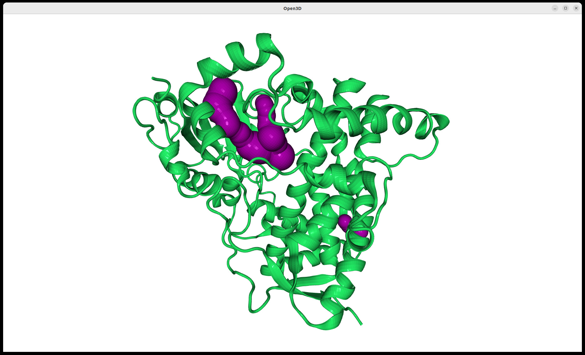
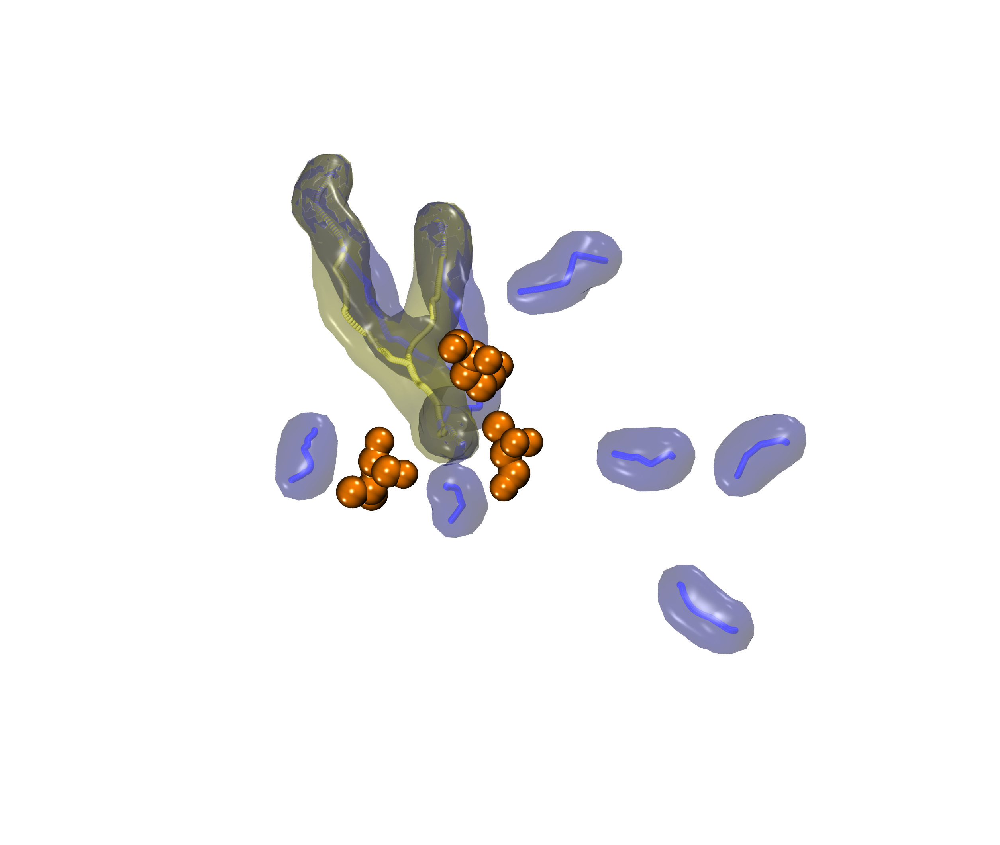
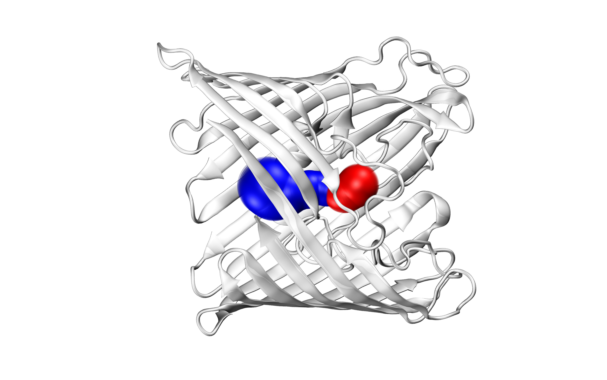
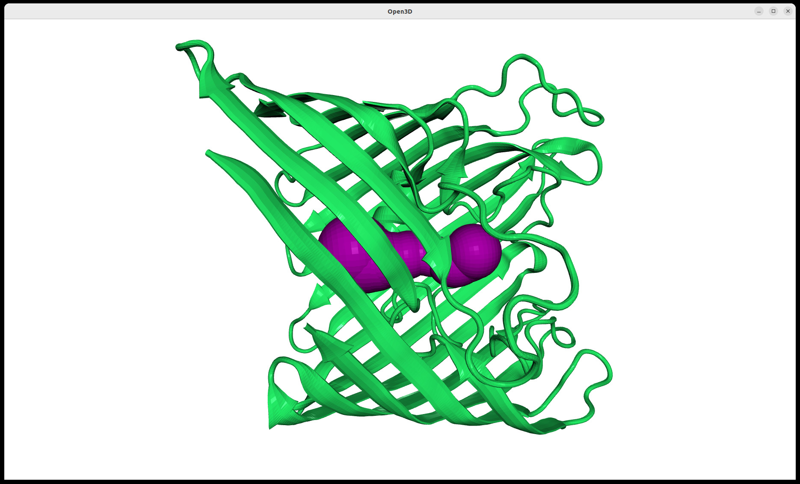
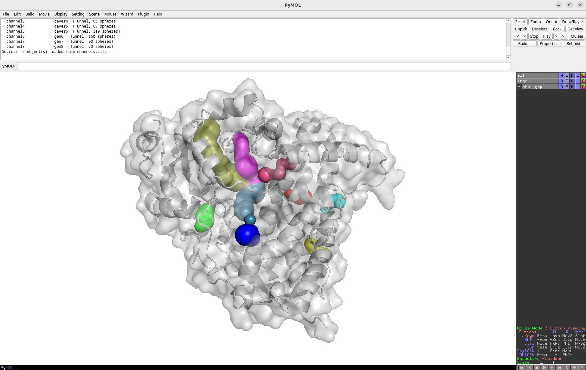

.. _cavitracer_single:

I. Detection of intraprotein tunnels and channels in a single PDB structure
===============================================================================

CaviTracer prediction
-------------------------------------------------------------------------------

As an example for this tutorial, we will analyze the structure of cytochrome
P450 which contains 486 residues. To analyze the structure, we need to parse
a structure :file:`1tqn` using :func:`.parsePDB`:

.. ipython:: python
   :verbatim:

   p = parsePDB('1tqn')

.. parsed-literal::

   @> Connecting wwPDB FTP server RCSB PDB (USA).
   @> Downloading PDB files via FTP failed, trying HTTP.
   @> 1tqn downloaded (1tqn.pdb.gz)
   @> PDB download via HTTP completed (1 downloaded, 0 failed).
   @> 3999 atoms and 1 coordinate set(s) were parsed in 0.14s.

Now, we select protein structure for analysis:

.. ipython:: python
   :verbatim:

   atoms = p.select("protein")

To predict channels or tunnels within protein structure, we should
utilize :func:`.calcChannels` function. This function analyzes the provided
atomic structure to detect intraprotein channels/tunnels, which
are voids or pathways within the molecular structure. It employs Voronoi
and Delaunay tessellations to identify these regions (see more details 
in the description of the function). 

The ``'separate'`` parameter controls whether each detected channel is
saved to a separate file (``True``) or if all channels are saved in a single
file (``False``). Files are saved as PQR file under the name specified using
``'output_path'``. If we add ``.pdb`` the file will be saved as a PDB file;
Otherwise, it will be saved as a PQR file. Results with ``'separate'``
option set to ``True`` can be saved only as a PQR files. 

.. ipython:: python
   :verbatim:

   channels, surface = calcChannels(atoms, output_path='channels_1tqn_ALL.pdb')

.. parsed-literal::

   @> The atoms supplied to calcChannels contain protein atoms only.
   @> WARNING structure has no hydrogens and inner_radius=0.90 is below 1.2 Å: the space left by the missing H is then wide enough for the probe to pass, and channels will be found through interstices that do not exist in the real protein (their number can rise several-fold). Either add hydrogens, or raise inner_radius to 1.2 Å or more, where protonated and unprotonated structures give the same channels.
   @> Substituted 3766 atoms with 23638 homogeneous balls of radius 1.52 Å in 0.27s.
   @> Delaunay tessellation of 23638 points constructed in 0.86s.
   @> Surface and inner simplices filtered in 1.38s.
   @> Surface cavities: 205 found, 5 deeper than min_depth=5.0 Å and searched for channels, in 0.29s.
   @> Chambers (probe 1.40 Å): 2 of the 5 searched cavities have them; the other 3 are searched whole.
   @>     cavity 0: 41 chambers, 21 of them qualify as sites, the 20 largest seeded (max_seeds=20).
   @>     cavity 1: 1 chamber, seeded.
   @> 24 search sites (sp) in 0.12s: one per seeded chamber, one per cavity searched whole.
   @> Channel search (Dijkstra) over 24 search sites in 5 cavities completed in 3.29s.
   @> Found 55 channels and 16 links (a link joins a deep chamber to a shallower one and never reaches the surface).
   @> Search sites (sp), the void each search ran from, largest first; sp<n> tags every channel, link and output file:
   @>     site  void                     volume [ų]  depth [Å]  channels  links
   @>     sp0   cavity 0, chamber 1/20          4634       14.9        19      -
   @>     sp1   cavity 2, whole                  392        5.8         1      -
   @>     sp2   cavity 3, whole                  287        5.6         1      -
   @>     sp3   cavity 0, chamber 2/20           199        6.9         2      -
   @>     sp4   cavity 4, whole                  169        7.3         2      -
   @>     sp5   cavity 0, chamber 3/20           123       10.4         -      1  -> sp0
   @>     sp6   cavity 0, chamber 4/20           121       20.0         -      2  -> sp8, sp22
   @>     sp7   cavity 0, chamber 5/20           116        5.1         2      -
   @>     sp8   cavity 0, chamber 6/20           107       15.3         -      2  -> sp22, sp23
   @>     sp9   cavity 0, chamber 7/20            83       13.9         2      1  -> sp0
   @>     sp10  cavity 1, chamber 1/1             53        7.2         2      -
   @>     sp11  cavity 0, chamber 8/20            50        5.1         1      -
   @>     sp12  cavity 0, chamber 9/20            50        6.8         2      -
   @>     sp13  cavity 0, chamber 10/20           50        5.5         3      -
   @>     sp14  cavity 0, chamber 11/20           49        9.7         3      -
   @>     sp15  cavity 0, chamber 12/20           47       13.9         -      1  -> sp0
   @>     sp16  cavity 0, chamber 13/20           47       15.5         2      3  -> sp8, sp9, sp0
   @>     sp17  cavity 0, chamber 14/20           46        9.1         1      1  -> sp0
   @>     sp18  cavity 0, chamber 15/20           43        6.2         1      -
   @>     sp19  cavity 0, chamber 16/20           42       11.9         4      3  -> sp23, sp14, sp0
   @>     sp20  cavity 0, chamber 17/20           41        9.9         2      1  -> sp0
   @>     sp21  cavity 0, chamber 18/20           39        7.3         -      -  sealed
   @>     sp22  cavity 0, chamber 19/20           39        8.4         1      1  -> sp23
   @>     sp23  cavity 0, chamber 20/20           39        5.6         4      -
   @>     (site volumes measure the void itself and are not on the swept-sphere scale of the channel volumes)
   @> The 1 site marked sealed above report neither a channel nor a link: every route out of them is narrower than bottleneck=0.90 Å. Lower it to see how they connect.
   @> Saving 55 channels to channels_1tqn_ALL.pdb and 16 links to channels_1tqn_ALL_links.pdb.
   @> Channel calculation completed in 6.58s.

.. ipython:: python
   :verbatim:

   channels, surface = calcChannels(atoms, output_path='channels_1tqn', separate=True)

.. parsed-literal::

   @> The atoms supplied to calcChannels contain protein atoms only.
   @> WARNING structure has no hydrogens and inner_radius=0.90 is below 1.2 Å: the space left by the missing H is then wide enough for the probe to pass, and channels will be found through interstices that do not exist in the real protein (their number can rise several-fold). Either add hydrogens, or raise inner_radius to 1.2 Å or more, where protonated and unprotonated structures give the same channels.
   @> Substituted 3766 atoms with 23638 homogeneous balls of radius 1.52 Å in 0.27s.
   @> Delaunay tessellation of 23638 points constructed in 0.85s.
   @> Surface and inner simplices filtered in 1.36s.
   @> Surface cavities: 205 found, 5 deeper than min_depth=5.0 Å and searched for channels, in 0.29s.
   @> Chambers (probe 1.40 Å): 2 of the 5 searched cavities have them; the other 3 are searched whole.
   @>     cavity 0: 41 chambers, 21 of them qualify as sites, the 20 largest seeded (max_seeds=20).
   @>     cavity 1: 1 chamber, seeded.
   @> 24 search sites (sp) in 0.08s: one per seeded chamber, one per cavity searched whole.
   @> Channel search (Dijkstra) over 24 search sites in 5 cavities completed in 3.26s.
   @> Found 55 channels and 16 links (a link joins a deep chamber to a shallower one and never reaches the surface).
   @> Search sites (sp), the void each search ran from, largest first; sp<n> tags every channel, link and output file:
   @>     site  void                     volume [ų]  depth [Å]  channels  links
   @>     sp0   cavity 0, chamber 1/20          4634       14.9        19      -
   @>     sp1   cavity 2, whole                  392        5.8         1      -
   @>     sp2   cavity 3, whole                  287        5.6         1      -
   @>     sp3   cavity 0, chamber 2/20           199        6.9         2      -
   @>     sp4   cavity 4, whole                  169        7.3         2      -
   @>     sp5   cavity 0, chamber 3/20           123       10.4         -      1  -> sp0
   @>     sp6   cavity 0, chamber 4/20           121       20.0         -      2  -> sp8, sp22
   @>     sp7   cavity 0, chamber 5/20           116        5.1         2      -
   @>     sp8   cavity 0, chamber 6/20           107       15.3         -      2  -> sp22, sp23
   @>     sp9   cavity 0, chamber 7/20            83       13.9         2      1  -> sp0
   @>     sp10  cavity 1, chamber 1/1             53        7.2         2      -
   @>     sp11  cavity 0, chamber 8/20            50        5.1         1      -
   @>     sp12  cavity 0, chamber 9/20            50        6.8         2      -
   @>     sp13  cavity 0, chamber 10/20           50        5.5         3      -
   @>     sp14  cavity 0, chamber 11/20           49        9.7         3      -
   @>     sp15  cavity 0, chamber 12/20           47       13.9         -      1  -> sp0
   @>     sp16  cavity 0, chamber 13/20           47       15.5         2      3  -> sp8, sp9, sp0
   @>     sp17  cavity 0, chamber 14/20           46        9.1         1      1  -> sp0
   @>     sp18  cavity 0, chamber 15/20           43        6.2         1      -
   @>     sp19  cavity 0, chamber 16/20           42       11.9         4      3  -> sp23, sp14, sp0
   @>     sp20  cavity 0, chamber 17/20           41        9.9         2      1  -> sp0
   @>     sp21  cavity 0, chamber 18/20           39        7.3         -      -  sealed
   @>     sp22  cavity 0, chamber 19/20           39        8.4         1      1  -> sp23
   @>     sp23  cavity 0, chamber 20/20           39        5.6         4      -
   @>     (site volumes measure the void itself and are not on the swept-sphere scale of the channel volumes)
   @> The 1 site marked sealed above report neither a channel nor a link: every route out of them is narrower than bottleneck=0.90 Å. Lower it to see how they connect.
   @> Saving 55 channels and 16 links to directory ., one file per object named sp<site>_chl<n> and sp<site>_lnk<n>.
   @> Channel calculation completed in 6.54s.

Files with separated channels will be saved in separate PQR files in the
local directory:

.. parsed-literal::

   channels_1tqn_sp0_chl0.pqr 
   channels_1tqn_sp0_chl1.pqr 
   channels_1tqn_sp0_chl2.pqr 
   channels_1tqn_sp0_chl3.pqr 
   channels_1tqn_sp0_chl4.pqr 
   channels_1tqn_sp0_chl5.pqr 
   channels_1tqn_sp0_chl6.pqr 
   ...
   channels_1tqn_sp23_chl47.pqr
   channels_1tqn_sp23_chl48.pqr   
   channels_1tqn_sp5_lnk0_sp0.pqr
   channels_1tqn_sp22_lnk1_sp23.pqr
   channels_1tqn_sp9_lnk5_sp0.pqr
   channels_1tqn_sp6_lnk2_sp8.pqr
   channels_1tqn_sp16_lnk4_sp8.pqr
   channels_1tqn_sp15_lnk3_sp0.pqr
   channels_1tqn_sp8_lnk7_sp22.pqr
   channels_1tqn_sp19_lnk8_sp23.pqr
   channels_1tqn_sp17_lnk6_sp0.pqr
   channels_1tqn_sp6_lnk9_sp22.pqr
   channels_1tqn_sp20_lnk10_sp0.pqr
   channels_1tqn_sp8_lnk11_sp23.pqr
   channels_1tqn_sp19_lnk12_sp14.pqr
   channels_1tqn_sp19_lnk13_sp0.pqr
   channels_1tqn_sp16_lnk14_sp9.pqr
   channels_1tqn_sp16_lnk15_sp0.pqr

Each PQR file will contain ``FIL`` atoms that describe the predicted
channels/tunnels. The ``Beta`` column denotes the radius of the sphere, 
which is needed for visualization purposes.

.. parsed-literal::

   REMARK   channel 3  length=16.134 A  bottleneck=1.918 A  curvature=1.288  cost=2.733  from sp0
   ATOM      1  H   FIL T   4     -17.336 -19.734 -11.982  1.00  3.54
   ATOM      2  H   FIL T   4     -17.498 -19.456 -11.981  1.00  3.38
   ATOM      3  H   FIL T   4     -17.648 -19.194 -11.986  1.00  3.25
   ATOM      4  H   FIL T   4     -17.774 -18.966 -12.001  1.00  3.18
   ATOM      5  H   FIL T   4     -17.864 -18.789 -12.034  1.00  3.18
   ATOM      6  H   FIL T   4     -17.906 -18.679 -12.088  1.00  3.20
   ATOM      7  H   FIL T   4     -17.893 -18.648 -12.168  1.00  3.19
   ATOM      8  H   FIL T   4     -17.846 -18.674 -12.249  1.00  3.18
   ATOM      9  H   FIL T   4     -17.802 -18.717 -12.297  1.00  3.20
   ATOM     10  H   FIL T   4     -17.795 -18.739 -12.278  1.00  3.25
   ATOM     11  H   FIL T   4     -17.861 -18.702 -12.159  1.00  3.23
   ATOM     12  H   FIL T   4     -18.032 -18.571 -11.907  1.00  3.07
   ATOM     13  H   FIL T   4     -18.293 -18.355 -11.544  1.00  2.79
   ATOM     14  H   FIL T   4     -18.595 -18.100 -11.126  1.00  2.57
   ATOM     15  H   FIL T   4     -18.887 -17.848 -10.709  1.00  2.51
   ATOM     16  H   FIL T   4     -19.118 -17.645 -10.350  1.00  2.55
   ATOM     17  H   FIL T   4     -19.240 -17.534 -10.105  1.00  2.59
   ATOM     18  H   FIL T   4     -19.251 -17.520  -9.985  1.00  2.59
   ..

Generated PQR file can be visualized together with protein PDB file using 
VMD_ or another program for graphical visualizations of molecules.

.. figure:: images/cavitracer_figure1.jpg
   :scale: 50 %

CaviTracer provides various information about predicted channels/tunnels, 
such as volume, length of the channels, and the bottleneck (narrowest point 
of the channel). To obtain this information use :func:`.getChannelParameters` 
function.

.. ipython:: python
   :verbatim:

   getChannelParameters(channels)

.. parsed-literal::

   @> Channel ID: 	Volume [ų] 	Length [Å] 	Bottleneck [Å]
   @> channel 0: 	146.5 		5.51 		1.77
   @> channel 1: 	69.03 		5.89 		1.43
   @> channel 2: 	64.05 		6.59 		1.24
   @> channel 3: 	423.9 		16.13 		1.92
   @> channel 4: 	51.56 		5.71 		1.25
   @> channel 5: 	57.41 		5.74 		0.97
   @> channel 6: 	664.86 		23.93 		2.15
   @> channel 7: 	739.84 		25.18 		2.15
   @> channel 8: 	86.51 		8.15 		1.11
   @> channel 9: 	385.95 		16.16 		1.29
   @> channel 10: 	392.91 		16.81 		1.33
   @> channel 11: 	40.68 		6.49 		1.01
   @> channel 12: 	54.21 		7.11 		1.11
   @> channel 13: 	82.22 		8.29 		1.03
   @> channel 14: 	81.91 		8.71 		1.13
   @> channel 15: 	34.03 		5.36 		0.9
   @> channel 16: 	604.32 		24.1 		1.12
   @> channel 17: 	49.35 		7.36 		0.99
   @> channel 18: 	59.47 		8.46 		0.99
   @> channel 19: 	90.68 		11.23 		1.18
   @> channel 20: 	603.63 		24.3 		1.0
   @> channel 21: 	46.0 		7.58 		0.94
   @> channel 22: 	38.39 		7.9 		0.99
   @> channel 23: 	89.84 		10.84 		0.91
   @> channel 24: 	426.27 		20.87 		0.91
   @> channel 25: 	122.11 		12.11 		0.95
   @> channel 26: 	72.5 		10.84 		0.96
   @> channel 27: 	33.82 		7.91 		0.93
   @> channel 28: 	75.64 		10.51 		0.91
   @> channel 29: 	98.23 		12.75 		0.97
   @> channel 30: 	56.07 		8.89 		0.94
   @> channel 31: 	85.59 		11.73 		0.97
   @> channel 32: 	301.19 		16.72 		0.99
   @> channel 33: 	74.27 		11.62 		0.97
   @> channel 34: 	48.36 		9.65 		0.91
   @> channel 35: 	63.68 		11.17 		0.99
   @> channel 36: 	51.14 		10.13 		0.9
   @> channel 37: 	64.48 		12.44 		1.02
   @> channel 38: 	96.08 		15.8 		0.97
   @> channel 39: 	115.94 		17.88 		1.11
   @> channel 40: 	313.89 		20.23 		0.9
   @> channel 41: 	602.7 		34.6 		1.02
   @> channel 42: 	388.08 		23.9 		0.91
   @> channel 43: 	483.05 		28.97 		0.95
   @> channel 44: 	596.71 		31.5 		0.98
   @> channel 45: 	85.62 		16.34 		0.95
   @> channel 46: 	86.68 		17.73 		0.94
   @> channel 47: 	124.35 		20.39 		0.93
   @> channel 48: 	113.03 		20.28 		0.93
   @> channel 49: 	100.52 		19.31 		0.94
   @> channel 50: 	629.5 		38.68 		0.91
   @> channel 51: 	683.4 		42.38 		0.91
   @> channel 52: 	685.23 		44.49 		0.9
   @> channel 53: 	514.54 		36.79 		0.95
   @> channel 54: 	673.91 		47.46 		0.9

   ([5.514260036626099,
     5.886380861494063,
     6.5934334141643145,
     16.13378355698167,
     5.707212434124496,
     5.743534416215082,
     23.93205559550196,
     25.18416954265959,
     8.14858424927066,
     16.159465309540064,
     16.8060796205449,
     6.485933613458969,
     7.111113208265152,
     8.285912512775523,
     8.709097354513776,
     5.361456571558767,
     24.096755473777034,
     ..
     596.7108038562736,
     85.622888910006,
     86.68202485968703,
     124.35038669081072,
     113.02985361728128,
     100.52196879281517,
     629.5048123718835,
     683.4028210551583,
     685.2304661354045,
     514.5362345553576,
     673.9143514431406])

Additionally, to obtain information on which residues are involved in the
formation of the predicted channels, use :func:`.getChannelResidueNames` 
function. To save the data in the local directory, provide a name for 
``residues_file_name``. This information can be saved with a one-letter 
or three-letter code of residues, as shown below. 

.. ipython:: python
   :verbatim:

   getChannelResidueNames(atoms, channels, 
				residues_file_name='1tqn_data')

.. parsed-literal::

   @> Channel residues were saved to: 1tqn_data_Residues_All_channels.txt

   ['channel0: LYS173:A, SER312:A, SER315:A, PHE316:A, GLN484:A, PRO485:A, PRO488:A',
    'channel1: ILE149:A, ALA150:A, GLY153:A, ASP154:A, TYR179:A, PRO345:A, LEU454:A, ALA455:A, ARG458:A',
    'channel2: ILE149:A, ALA150:A, GLY153:A, TYR179:A, PRO345:A, LEU454:A, ALA455:A, ARG458:A',
    'channel3: ARG105:A, ARG106:A, PRO107:A, PHE108:A, SER119:A, ILE120:A, GLU122:A, ARG212:A, PHE304:A, ALA370:A, CYS442:A',
    'channel4: LYS209:A, LEU210:A, PRO242:A, VAL245:A, THR246:A, LEU249:A, ILE300:A',
    'channel5: PHE33:A, ILE38:A, PRO39:A, GLY40:A, PRO41:A, ASN49:A, GLY73:A, PHE74:A, TYR75:A',
    'channel6: ASP76:A, GLN79:A, ARG105:A, ARG106:A, PRO107:A, PHE108:A, ARG212:A, PHE215:A, ILE223:A, THR224:A, PRO227:A, ALA370:A, ARG372:A, GLU374:A, CYS442:A',
    'channel7: ASP76:A, GLN79:A, ARG105:A, ARG106:A, PRO107:A, PHE108:A, ARG212:A, PHE215:A, ILE223:A, THR224:A, PRO227:A, ILE230:A, ALA370:A, ARG372:A, GLU374:A, CYS442:A',
    'channel8: VAL155:A, LEU156:A, ASN159:A, LEU160:A, GLU163:A, VAL175:A, ALA178:A, TYR179:A, ASP182:A, LEU196:A',
    'channel9: ARG105:A, ARG212:A, ALA305:A, GLU308:A, THR309:A, SER312:A, ILE369:A, ALA370:A, CYS442:A, LEU482:A, LEU483:A, GLN484:A',
    'channel10: ARG105:A, ARG212:A, ALA305:A, GLU308:A, THR309:A, SER312:A, ILE369:A, ALA370:A, CYS442:A, LEU482:A, LEU483:A, GLN484:A',
    'channel11: TYR319:A, ALA322:A, THR323:A, PRO467:A, THR471:A, ILE473:A, VAL489:A, LEU491:A',
    'channel12: ALA150:A, GLY153:A, LEU156:A, PRO345:A, LEU454:A, ALA455:A, ARG458:A, VAL459:A',
    'channel13: VAL155:A, LEU156:A, ASN159:A, GLU163:A, ASP174:A, VAL175:A, ALA178:A, TYR179:A, ASP182:A, LEU196:A',
    'channel14: LYS209:A, LEU210:A, LEU211:A, PHE213:A, VAL240:A, PHE241:A, PRO242:A, VAL245:A, THR246:A, LEU249:A, ILE300:A, PHE304:A',
    'channel15: PRO41:A, ASN49:A, SER52:A, TYR53:A, PHE60:A, PHE74:A, ASP76:A',
    'channel16: ILE50:A, TYR53:A, PHE57:A, ASP76:A, ARG105:A, ARG106:A, ARG212:A, PHE215:A, LEU216:A, LEU221:A, THR224:A, ALA370:A, ARG372:A, GLU374:A, CYS442:A',
    'channel17: LEU129:A, LEU132:A, LEU133:A, SER278:A, LEU290:A, GLN298:A',
    'channel18: LEU129:A, LEU132:A, LEU133:A, THR136:A, LEU274:A, MET275:A, SER278:A, LEU290:A, GLN298:A',
    'channel19: SER312:A, SER315:A, PHE316:A, TYR319:A, GLU320:A, PHE367:A, LEU475:A, PRO485:A, VAL489:A',
    'channel20: ILE50:A, TYR53:A, PHE57:A, ASP76:A, ARG105:A, ARG106:A, ARG212:A, PHE215:A, LEU216:A, LEU221:A, THR224:A, ALA370:A, ARG372:A, GLU374:A, CYS442:A',
    'channel21: LEU82:A, ILE84:A, MET89:A, ILE383:A, ASN384:A, GLY385:A, MET386:A, ILE388:A, VAL394:A',
    'channel22: MET89:A, THR92:A, VAL93:A, GLU97:A, PHE102:A, ILE383:A, ASN384:A',
    'channel23: MET145:A, ILE148:A, ILE149:A, TYR152:A, ASP182:A, VAL183:A, SER186:A, THR187:A, ARG268:A, VAL269:A, ASP270:A',
    'channel24: ARG105:A, SER119:A, PHE137:A, ARG212:A, PHE302:A, ALA305:A, GLY306:A, ALA370:A, ASN441:A, CYS442:A, ILE443:A, GLY444:A, MET445:A, ARG446:A, PHE447:A',
    'channel25: PHE113:A, MET114:A, LEU210:A, CYS239:A, PHE241:A, ARG243:A, VAL245:A, THR246:A, LEU249:A, ILE300:A',
    'channel26: PHE33:A, LEU36:A, ILE38:A, LEU82:A, ILE84:A, ILE383:A, PHE387:A, ILE388:A, PRO389:A, VAL392:A, VAL394:A',
    'channel27: MET89:A, THR92:A, VAL93:A, GLU97:A, PHE102:A, ILE383:A, ASN384:A',
    'channel28: MET145:A, ILE148:A, ILE149:A, TYR152:A, ASP182:A, VAL183:A, SER186:A, THR187:A, ARG268:A, VAL269:A, ASP270:A',
    'channel29: THR136:A, PHE137:A, THR138:A, LEU142:A, MET145:A, ILE149:A, PHE271:A, ILE443:A, GLY444:A, ARG446:A, PHE447:A, MET450:A, ASN451:A',
    'channel30: HIS65:A, TRP72:A, THR85:A, PRO397:A, ALA400:A, LEU401:A, ASP404:A, TYR407:A',
    'channel31: LEU142:A, MET145:A, ILE148:A, ILE149:A, SER186:A, THR187:A, ARG268:A, VAL269:A, ASP270:A, PHE447:A, MET450:A, ASN451:A',
    'channel32: LEU94:A, ARG105:A, ARG212:A, ALA370:A, LEU373:A, ARG375:A, PRO429:A, TYR432:A, THR433:A, PRO434:A, PHE435:A, GLY436:A, SER437:A, ARG440:A, ASN441:A, CYS442:A',
    'channel33: LEU142:A, MET145:A, ILE148:A, ILE149:A, SER186:A, THR187:A, ARG268:A, VAL269:A, ASP270:A, PHE447:A, MET450:A, ASN451:A',
    'channel34: MET145:A, ILE148:A, ILE149:A, TYR152:A, ASP182:A, VAL183:A, SER186:A, THR187:A',
    'channel35: ILE90:A, LEU94:A, LEU373:A, ILE396:A, LEU401:A, PRO429:A, TYR430:A, ILE431:A, TYR432:A, THR433:A, GLY436:A, SER437:A',
    'channel36: ILE90:A, LEU94:A, ILE396:A, LEU401:A, PRO429:A, TYR430:A, ILE431:A, THR433:A, SER437:A',
    'channel37: CYS98:A, TYR99:A, PHE102:A, THR103:A, ASN104:A, ARG105:A, TRP126:A, LYS127:A, GLU374:A, ARG375:A, ARG440:A',
    'channel38: VAL313:A, PHE316:A, ILE317:A, ASP357:A, VAL360:A, THR363:A, LEU364:A, PHE367:A, LEU449:A, MET452:A, LYS453:A, LEU456:A',
    'channel39: VAL313:A, PHE316:A, ILE317:A, ASP357:A, VAL360:A, ASN361:A, THR363:A, LEU364:A, PHE367:A, LEU449:A, MET452:A, LYS453:A, LEU456:A',
    'channel40: LEU94:A, ARG105:A, ARG212:A, ALA370:A, LEU373:A, ARG375:A, PRO429:A, TYR430:A, THR433:A, PRO434:A, PHE435:A, GLY436:A, SER437:A, ARG440:A, ASN441:A, CYS442:A',
    'channel41: ARG105:A, SER119:A, LEU132:A, LEU133:A, THR136:A, PHE137:A, ILE184:A, THR187:A, SER188:A, ARG212:A, PHE271:A, LEU272:A, LEU274:A, MET275:A, SER278:A, SER299:A, PHE302:A, ILE303:A, ALA305:A, GLY306:A, ALA370:A, ASN441:A, CYS442:A, ILE443:A, GLY444:A, PHE447:A',
    'channel42: ARG105:A, ARG212:A, ALA305:A, THR309:A, VAL313:A, ILE317:A, VAL360:A, LEU364:A, ILE369:A, ALA370:A, PRO434:A, PHE435:A, CYS442:A, LEU449:A, MET452:A, LYS453:A, LEU456:A',
    'channel43: ARG105:A, SER119:A, THR136:A, PHE137:A, THR138:A, LYS141:A, LEU142:A, MET145:A, ARG212:A, VAL269:A, PHE271:A, LEU274:A, PHE302:A, ALA305:A, GLY306:A, ALA370:A, ASN441:A, CYS442:A, ILE443:A, GLY444:A, PHE447:A',
    'channel44: ARG105:A, ARG106:A, PRO107:A, PHE108:A, GLY109:A, PRO110:A, ARG212:A, PHE215:A, PHE219:A, PHE220:A, ILE223:A, THR224:A, LEU229:A, ILE230:A, LEU233:A, ALA370:A, ARG372:A, GLU374:A, CYS442:A',
    'channel45: THR136:A, PHE137:A, THR138:A, LYS141:A, LEU142:A, MET145:A, ILE149:A, VAL269:A, PHE271:A, LEU274:A, PHE447:A, MET450:A, ASN451:A',
    'channel46: ILE317:A, LEU321:A, LEU331:A, ILE335:A, LEU356:A, VAL359:A, VAL360:A, LEU449:A, MET452:A, LYS453:A, LEU456:A, ILE457:A, LEU460:A',
    'channel47: MET145:A, ILE148:A, ILE149:A, ALA150:A, GLY153:A, TYR179:A, VAL183:A, SER186:A, THR187:A, ARG268:A, VAL269:A, ASP270:A, PHE447:A, MET450:A, ASN451:A, LEU454:A, ALA455:A',
    'channel48: MET145:A, ILE148:A, ILE149:A, ALA150:A, GLY153:A, TYR179:A, VAL183:A, SER186:A, THR187:A, ARG268:A, VAL269:A, ASP270:A, PHE447:A, MET450:A, ASN451:A, LEU454:A, ALA455:A',
    'channel49: ILE317:A, LEU321:A, LEU331:A, ILE335:A, LEU356:A, ASP357:A, VAL359:A, VAL360:A, ASN361:A, LEU449:A, MET452:A, LYS453:A, LEU456:A, ILE457:A, LEU460:A',
    'channel50: ARG105:A, SER119:A, LEU133:A, PRO135:A, THR136:A, PHE137:A, LYS141:A, ILE184:A, THR187:A, SER188:A, ARG212:A, PHE271:A, LEU272:A, LEU274:A, MET275:A, SER278:A, SER299:A, PHE302:A, ILE303:A, ALA305:A, GLY306:A, ALA370:A, ASN441:A, CYS442:A, ILE443:A, GLY444:A, PHE447:A',
    'channel51: ARG105:A, PHE113:A, SER119:A, PHE137:A, ILE184:A, THR187:A, SER188:A, PHE203:A, ARG212:A, THR246:A, ASN247:A, LEU249:A, ARG250:A, VAL253:A, PHE271:A, VAL296:A, SER299:A, ILE300:A, PHE302:A, ILE303:A, ALA305:A, GLY306:A, ALA370:A, ASN441:A, CYS442:A, ILE443:A, GLY444:A, PHE447:A',
    'channel52: ARG105:A, SER119:A, PHE137:A, LYS173:A, ASP174:A, GLY177:A, ALA178:A, MET181:A, ILE184:A, THR185:A, THR187:A, SER188:A, THR207:A, LYS208:A, ARG212:A, PHE271:A, SER299:A, PHE302:A, ILE303:A, ALA305:A, GLY306:A, TYR307:A, ALA370:A, ASN441:A, CYS442:A, ILE443:A, GLY444:A, PHE447:A',
    'channel53: ARG105:A, SER119:A, THR136:A, PHE137:A, THR138:A, LEU142:A, MET145:A, ILE148:A, ILE149:A, SER186:A, THR187:A, ARG212:A, PHE271:A, PHE302:A, ALA305:A, GLY306:A, ALA370:A, ASN441:A, CYS442:A, ILE443:A, GLY444:A, PHE447:A',
    'channel54: ARG105:A, SER119:A, PHE137:A, GLY177:A, ALA178:A, MET181:A, ILE184:A, THR185:A, THR187:A, SER188:A, SER195:A, VAL204:A, THR207:A, LYS208:A, ARG212:A, PHE271:A, SER299:A, PHE302:A, ILE303:A, ALA305:A, GLY306:A, TYR307:A, ALA370:A, ASN441:A, CYS442:A, ILE443:A, GLY444:A, PHE447:A']

.. ipython:: python
   :verbatim:

   getChannelResidueNames(atoms, channels, distA=3, 
		one_letter_aa=True, residues_file_name='1tqn_data_1letter')

.. parsed-literal::

   @> Channel residues were saved to: 1tqn_data_1letter_Residues_All_channels.txt

   ['channel0: K173:A, S311:A, S312:A, S315:A, F316:A, Q484:A, P485:A, P488:A',
    'channel1: I149:A, A150:A, Q151:A, G153:A, D154:A, Y179:A, P344:A, P345:A, L454:A, A455:A, R458:A',
    'channel2: I149:A, A150:A, G153:A, Y179:A, P344:A, P345:A, T346:A, L454:A, A455:A, R458:A',
    'channel3: R105:A, R106:A, P107:A, F108:A, S119:A, I120:A, E122:A, R212:A, F215:A, F304:A, A305:A, A370:A, N441:A, C442:A',
    'channel4: N206:A, K209:A, L210:A, F241:A, P242:A, V245:A, T246:A, L249:A, I300:A',
    'channel5: F33:A, K34:A, I38:A, P39:A, G40:A, P41:A, P43:A, N49:A, G73:A, F74:A, Y75:A',
    'channel6: D76:A, Q78:A, Q79:A, R105:A, R106:A, P107:A, F108:A, R212:A, F215:A, F220:A, I223:A, T224:A, P227:A, I230:A, A305:A, A370:A, R372:A, E374:A, N441:A, C442:A',
    'channel7: D76:A, Q79:A, R105:A, R106:A, P107:A, F108:A, R212:A, F215:A, F220:A, I223:A, T224:A, P227:A, I230:A, A305:A, A370:A, R372:A, E374:A, N441:A, C442:A',
    'channel8: V155:A, L156:A, N159:A, L160:A, E163:A, V175:A, A178:A, Y179:A, D182:A, D194:A, L196:A',
    'channel9: R105:A, R212:A, A305:A, E308:A, T309:A, S312:A, I369:A, A370:A, P434:A, F435:A, N441:A, C442:A, L482:A, L483:A, Q484:A',
    'channel10: R105:A, R212:A, A305:A, E308:A, T309:A, S312:A, I369:A, A370:A, P434:A, F435:A, N441:A, C442:A, L482:A, L483:A, Q484:A',
    'channel11: M318:A, Y319:A, A322:A, T323:A, K466:A, P467:A, T471:A, I473:A, V489:A, L491:A',
    ..
    'channel49: I317:A, L321:A, L331:A, I335:A, L356:A, D357:A, V359:A, V360:A, N361:A, L449:A, M452:A, K453:A, L456:A, I457:A, L460:A',
    'channel50: R105:A, S119:A, L132:A, L133:A, P135:A, T136:A, F137:A, K141:A, V183:A, I184:A, T187:A, S188:A, R212:A, F271:A, L272:A, L274:A, M275:A, S278:A, Q298:A, S299:A, F302:A, I303:A, A305:A, G306:A, A370:A, N441:A, C442:A, I443:A, G444:A, F447:A',
    'channel51: R105:A, F113:A, S119:A, F137:A, V183:A, I184:A, T187:A, S188:A, F203:A, R212:A, T246:A, N247:A, L249:A, R250:A, V253:A, M256:A, F271:A, L272:A, V296:A, S299:A, I300:A, F302:A, I303:A, A305:A, G306:A, A370:A, N441:A, C442:A, I443:A, G444:A, F447:A',
    'channel52: R105:A, S119:A, F137:A, K173:A, D174:A, G177:A, A178:A, M181:A, V183:A, I184:A, T185:A, T187:A, S188:A, F203:A, T207:A, K208:A, R212:A, F271:A, S299:A, F302:A, I303:A, A305:A, G306:A, Y307:A, A370:A, N441:A, C442:A, I443:A, G444:A, F447:A',
    'channel53: R105:A, S119:A, T136:A, F137:A, T138:A, K141:A, L142:A, M145:A, V146:A, I148:A, I149:A, S186:A, T187:A, R212:A, F271:A, F302:A, A305:A, G306:A, A370:A, N441:A, C442:A, I443:A, G444:A, F447:A',
    'channel54: R105:A, S119:A, F137:A, G177:A, A178:A, M181:A, V183:A, I184:A, T185:A, T187:A, S188:A, S195:A, L196:A, N198:A, P199:A, F203:A, V204:A, T207:A, K208:A, R212:A, F271:A, S299:A, F302:A, I303:A, A305:A, G306:A, Y307:A, A370:A, N441:A, C442:A, I443:A, G444:A, F447:A']

Visualization of channels within ProDy
-------------------------------------------------------------------------------

To visualize CaviTracer predictions, we do not need external programs. If
VMD_ and Open3D_ are installed on our machine, we can visalize the
predictions directly in ProDy. 

First, we need to use :func:`.getVmdModel` function and provide the pathway
to where VMD_ binary file is localized, as shown below. VMD_ is used to
create protein structure in the NewCartoon representation. That model is
further used by CaviTracer functions to display predicted channels/tunnels 
using Open3D_ library. 

.. ipython:: python
   :verbatim:

   vmd_path = '/usr/local/bin/vmd'
   model = getVmdModel(vmd_path, atoms)

.. parsed-literal::

   @> Model created successfully.

.. ipython:: python
   :verbatim:

   model

.. parsed-literal::

   TriangleMesh with 56180 points and 112320 triangles.

Once the model is created, we can display several things: 

**(i)** Cavities with :func:`.showCavities`:

.. ipython:: python
   :verbatim:

   showCavities(surface)

.. figure:: images/cavitracer_figure2.jpg
   :scale: 50 %

**(ii)** Channels with :func:`.showChannels` in a several ways:

.. ipython:: python
   :verbatim:

   showChannels(channels, surface=surface, model=model)

.. figure:: images/cavitracer_figure3.jpg
   :scale: 50 %

.. ipython:: python
   :verbatim:

   showChannels(channels, model=model)

.. figure:: images/cavitracer_figure4.jpg
   :scale: 50 %

.. ipython:: python
   :verbatim:

   showCavities(surface, show_surface=True)

.. figure:: images/cavitracer_figure5.jpg
   :scale: 50 %

Channels can be visualized separately. Below are several examples of how to
display single channels (channel #40, channel #15), two channels at once (channel
#9 and channel #40), or a range of channels (channels from #10 to channel #20
from the prediction).

.. ipython:: python
   :verbatim:

   showChannels(channels[3], model)

.. figure:: images/cavitracer_figure6.jpg
   :scale: 50 %

.. ipython:: python
   :verbatim:

   showChannels(channels[41], model)

.. figure:: images/cavitracer_figure7.jpg
   :scale: 50 %

.. ipython:: python
   :verbatim:

   selected_channels = [channels[9], channels[40]]
   showChannels(selected_channels, model)

.. figure:: images/cavitracer_figure8.jpg
   :scale: 50 %

.. ipython:: python
   :verbatim:

   selected_channels = channels[10:20]
   showChannels(selected_channels, model)

Once we select which channels are of interest, we can obtain information
about their parameters.

.. ipython:: python
   :verbatim:

   selected_channels = channels[10:20]
   lengths, bottlenecks, volumes = getChannelParameters(selected_channels)
   selected_channels_atoms = getChannelAtoms(selected_channels)

.. parsed-literal::

   @> Channel ID: 	Volume [ų] 	Length [Å] 	Bottleneck [Å]
   @> channel 0: 	392.91 		16.81 		1.33
   @> channel 1: 	40.68 		6.49 		1.01
   @> channel 2: 	54.21 		7.11 		1.11
   @> channel 3: 	82.22 		8.29 		1.03
   @> channel 4: 	81.91 		8.71 		1.13
   @> channel 5: 	34.03 		5.36 		0.9
   @> channel 6: 	604.32 		24.1 		1.12
   @> channel 7: 	49.35 		7.36 		0.99
   @> channel 8: 	59.47 		8.46 		0.99
   @> channel 9: 	90.68 		11.23 		1.18
   @> 845 atoms and 1 coordinate set(s) were parsed in 0.02s.

Predefined starting point for channel prediction
-------------------------------------------------------------------------------

By default, CaviTracer automatically selects the starting tetrahedron
(starting point for the interior cavity prediction) based on cavity depth.
Alternatively, users can provide a custom starting point using
``start_point`` argument. This can be either a 3D coordinate point or an 
atomic selection/AtomGroup as show below. If an atomic selection is provided, its 
geometric center is used as the starting point.

.. ipython:: python
   :verbatim:

   channels, surface = calcChannels(atoms, start_point=[-22.312, -20.065, -11.144])

.. parsed-literal::

   @> Using user-provided start_point for channel seed: [-22.312, -20.065, -11.144] Å
   @> The atoms supplied to calcChannels contain protein atoms only.
   @> WARNING structure has no hydrogens and inner_radius=0.90 is below 1.2 Å: the space left by the missing H is then wide enough for the probe to pass, and channels will be found through interstices that do not exist in the real protein (their number can rise several-fold). Either add hydrogens, or raise inner_radius to 1.2 Å or more, where protonated and unprotonated structures give the same channels.
   @> Substituted 3766 atoms with 23638 homogeneous balls of radius 1.52 Å in 0.27s.
   @> Delaunay tessellation of 23638 points constructed in 0.86s.
   @> Surface and inner simplices filtered in 1.45s.
   @> start_point seeded at tetrahedron 11317 (Voronoi vertex at [-24.951, -19.189, -10.516], 2.850 Å from start_point, inscribed radius 1.330 Å, depth 13.3 Å).
   @>     widened from the nearest tetrahedron 8399 (2.444 Å away, inscribed radius 0.924 Å, depth 13.1 Å), the widest of the 4 tetrahedra no shallower than it among the 4 reachable within 3.0 Å; seeding the narrow one would have capped every channel here at its radius.
   @>     restricting the channel search to the cavity that contains it (10149 tetrahedra, depth 32.4 Å).
   @> Surface cavities: 1 found, 1 deeper than min_depth=5.0 Å and searched for channels, in 0.33s.
   @> Channel search (Dijkstra) over 1 search sites in 1 cavities completed in 1.10s.
   @> Found 23 channels.
   @> Search sites (sp), the void each search ran from, largest first; sp<n> tags every channel, link and output file:
   @>     site  void             volume [ų]  depth [Å]  channels  links
   @>     sp0   cavity 0, whole        22599       13.3        23      -
   @>     (site volumes measure the void itself and are not on the swept-sphere scale of the channel volumes)
   @> No output path given.
   @> Channel calculation completed in 4.45s.

.. ipython:: python
   :verbatim:

   start_sel = atoms.select('resid 212 309 483')
   calcChannels(atoms, output_path='results.pdb', start_point=start_sel)

.. parsed-literal::

   @> Using user-provided start_point for channel seed: [-24.395, -23.462, -15.132] Å
   @> The atoms supplied to calcChannels contain protein atoms only.
   @> WARNING structure has no hydrogens and inner_radius=0.90 is below 1.2 A: the space left by the missing H is then wide enough for the probe to pass, and channels will be found through interstices that do not exist in the real protein (their number can rise several-fold). Either add hydrogens, or raise r2 to 1.2 A or more, where protonated and unprotonated structures give the same channels.
   @> Substituted 3766 atoms with 23638 homogeneous balls of radius 1.52 A in 0.27s.
   @> Delaunay tessellation of 23638 points constructed in 0.86s.
   @> Surface and inner simplices filtered in 1.33s.
   @> start_point seeded at tetrahedron 10064 (Voronoi vertex at [-24.209, -22.626, -15.674], 1.013 A from start_point, inscribed radius 2.308 A, depth 6.6 A).
   @>     already the widest of the 31 tetrahedra no shallower than it among the 84 reachable within 3.0 A.
   @>     restricting the channel search to the cavity that contains it (10149 tetrahedra, depth 32.4 A).
   @> 1 surface cavities detected and filtered in 0.32s.
   @> Channel pathfinding (graph Dijkstra) over 1 cavities completed in 2.76s.
   @> Detected 47 channels.
   @> Saving results to results.pdb.
   @> Channel calculation completed in 5.59s.

   ([<prody.proteins.channels.Channel at 0x79c0da891e10>,
     <prody.proteins.channels.Channel at 0x79c0da891a80>,
     <prody.proteins.channels.Channel at 0x79c1479697e0>,
     ..
     <prody.proteins.channels.Channel at 0x79c147045c30>,
     <prody.proteins.channels.Channel at 0x79c0da8924d0>],
    [array([[-30.07      ,   8.178     , -13.891     ],
            [-29.618     ,   8.226     , -15.315     ],
            [-29.58642188,   8.14478071, -15.1575    ],
            ...,
            [-26.49550663, -61.26776883, -23.6695    ],
            [-26.76969072, -61.18417412, -23.7145    ],
            [-26.57247665, -61.10354151, -23.7595    ]]),
     array([[ 408,  393,  396,  405],
            [ 394,  408,  396,  405],
            [ 394,  408,  393,  396],
            ...,
            [2348, 2340, 2322, 2355],
            [2348, 2340, 2357, 2355],
            [2348, 2340, 2357, 2322]], dtype=int32),
     array([[ 7615, 21484, 14211, 14209],
            [21290,  7615, 21484, 14211],
            [21264, 21290,  7615, 21484],
            ...,
            [21319, 21338, 21339, 21118],
            [21338, 21339, 21126, 21118],
            [21290, 14214, 21484, 14211]], dtype=int32),
     array([[ 7615, 21484, 14211, 14209],
            [ 9671,  9668,  9476,  9278],
            [16207, 16434, 16401, 16192],
            ...,
            [ 2356,  1907,  2976,  1917],
            [ 1504,  1501, 18522,  1516],
            [ 1504,  1501, 18522, 18495]], dtype=int32)])

Below is the visualization of channel identification for the two different starting
points mentioned above. The blue one represents identification of channels when
the starting point is [-22.312, -20.065, -11.144], whereas the dark-yellow one
represents identification based on the center of the mass for residues 212, 309,
and 483 (displayed as orange spheres). 

.. figure:: images/cavitracer_figure19.jpg
   :scale: 50 %

Visualization of the system was performed in the VMD_ program. This outcome
shows how the prediction result can change when the ``start_point`` changes.
Changes in the prediction can be better seen when the protein is
undisplayed, as shown bellow.

II. Detection of surface cavities in a single PDB structure
===============================================================================

In this part of the tutorial, we will also use the Cytochrome P450 structure,
but this time we will identify surface cavities instead of intraprotein
cavities.  

Once again we will parse protein structure with PDB ID ``1tqn``. 

.. ipython:: python
   :verbatim:

   atoms = parsePDB('1tqn').select('protein')

.. parsed-literal::

   @> PDB file is found in working directory (1tqn.pdb).
   @> 3999 atoms and 1 coordinate set(s) were parsed in 0.04s.

Now, to identify the potential surface cavities, we will use
:func:`.calcSurfaceCavities` and save the results as :file:`test_surf_cav.pqr`
file using ``output_path`` parameter.

.. ipython:: python
   :verbatim:

   cavities, surface = calcSurfaceCavities(atoms, output_path='test_surf_cav.pqr')

.. parsed-literal::

  @> The atoms supplied to calcChannels contain protein atoms only.
  @> Substituted 3766 atoms with 23638 homogeneous balls of radius 1.52 A in 0.22s.
  @> Delaunay tessellation of 23638 points constructed in 0.84s.
  @> Surface and inner simplices filtered in 0.32s.
  @> 40 surface cavities detected and filtered in 0.30s.
  @> Returning surface cavities
  @> Saving surface cavities to test_surf_cav.pqr.
  @> Surface cavity calculation completed in 1.81s.

To display the identified surface cavities, similarly to the channel
identification, we need to use VMD_ to create the model for visualization
within ProDy. For that reason, we need to provide ``vmd_path`` and use 
:func:`.getVmdModel`. 

.. ipython:: python
   :verbatim:

   vmd_path = '/usr/local/bin/vmd'
   model = getVmdModel(vmd_path, atoms)

.. parsed-literal::

   @> Model created successfully.

To display the results using the Open3D library in ProDy, we can use
:func:`.showSurfaceCavities` and provide the ``surface`` object together
with the protein ``model`` generated by VMD_. When ``show_surface`` is set
to ``True``, the protein surface is displayed together with the detected
surface cavities. The protein is shown in the NewCartoon representation,
whereas the detected surface cavities are visualized as tetrahedron-derived
regions based on the Voronoi/Delaunay tessellation.

.. ipython:: python
   :verbatim:

   showSurfaceCavities(surface, model=model, show_surface=True)

.. figure:: images/cavitracer_figure20.jpg
   :scale: 50 %

The :func:`.calcSurfaceCavities` function provides several parameters that
can be used to tune the detection and selection of surface cavities,
including min_volume, max_volume, min_depth, max_depth, min_tetrahedra,
max_tetrahedra, as well as surf_radius, inner_radius, and sparsity. In the
example below, only surface cavities with volumes between 500 and 1000 ų are
selected and saved to a file specified by the output_path parameter,
:file:`surf_cav_MinMax_volume.pqr`.

.. ipython:: python
   :verbatim:

   cavities2, surface2 = calcSurfaceCavities(atoms, min_volume=500,
		max_volume=1000, output_path='surf_cav_MinMax_volume.pqr')

.. parsed-literal::

   @> The atoms supplied to calcChannels contain protein atoms only.
   @> Substituted 3766 atoms with 23638 homogeneous balls of radius 1.52 A in 0.28s.
   @> Delaunay tessellation of 23638 points constructed in 0.81s.
   @> Surface and inner simplices filtered in 0.33s.
   @> 40 surface cavities detected and filtered in 0.31s.
   @> Returning surface cavities
   @> Saving surface cavities to surf_cav_MinMax_volume.pqr.
   @> Surface cavity calculation completed in 1.84s.

We can display the results using :func:`.showSurfaceCavities` function:

.. ipython:: python
   :verbatim:

   showSurfaceCavities(surface2, model=model, show_surface=True)

.. figure:: images/cavitracer_figure21.jpg
   :scale: 50 %

To provide nicer visualization for the surface cavities, we can also use
:func:`.getVmdModel` function with ``representation`` parameter set to
``'QuickSurf'``. We need to provide the PQR file to do that.

.. ipython:: python
   :verbatim:

   cav_model = getVmdModel(vmd_path, 
        parsePQR('surf_cav_MinMax_volume.pqr'),
    	representation='QuickSurf')

.. parsed-literal::

   @> Model created successfully.

Once the model is created, we can display it by setting ``cavity_atoms``
parameter.

.. ipython:: python
   :verbatim:

   showSurfaceCavities(surface2, model=model, cavity_atoms=cav_model)

.. figure:: images/cavitracer_figure22.jpg
   :scale: 50 %

To obtain information about the surface cavities, such as volume, depth or
tetrahedra count, use :func:`getSurfaceCavityParameters`.

.. ipython:: python
   :verbatim:

   parameters = getSurfaceCavityParameters(cavities2)

.. parsed-literal::

   @> Cavity ID: 	Volume [ų] 	Depth [Å] 	Tetrahedra count
   @> cavity 0: 	503.05 		7.78 		133
   @> cavity 1: 	955.46 		8.29 		269
   @> cavity 2: 	621.45 		8.01 		152

By assigning the output of :func:`getSurfaceCavityParameters` to the
variable parameters, the extracted cavity descriptors can be accessed as
lists, including cavity volume (``parameters[0]``), depth
(``parameters[1]``), and tetrahedra count (``parameters[2]``).

.. ipython:: python
   :verbatim:

   parameters

.. parsed-literal::

   ([503.04967293496003, 955.46028274561, 621.4527824426602],
    [7.7812978201386995, 8.293453349117478, 8.006634128744826],
    [133, 269, 152])

.. ipython:: python
   :verbatim:

   parameters[0]

.. parsed-literal::

   [503.04967293496003, 955.46028274561, 621.4527824426602]

In addition to quantitative descriptors, CaviTracer also allows the
identification of residues forming each detected surface cavity. This
information can be obtained using :func:`getSurfaceCavityResidueNames`,
which returns residue names and residue numbers for each cavity based on
the distance between cavity points and protein residues. The results can be
saved using the ``residues_file_name`` parameter. The provided name will 
be used to save the results with the ``_Residues_All_surface_cavities.txt``
sufix.

.. ipython:: python
   :verbatim:

   residues = getSurfaceCavityResidueNames(atoms, cavities2, surface2, 
					residues_file_name='results')

.. parsed-literal::

   @> Surface cavity residues were saved to: results_Residues_All_surface_cavities.txt

.. ipython:: python
   :verbatim:

   residues

.. parsed-literal::

   ['cavity0: LYS55, MET59, MET62, TYR319, THR323, HIS324, TYR399, GLU412, 
     LYS413, PHE414, LEU415, ILE473, LYS476, LEU477, LEU479, GLU486',
    'cavity1: GLU163, GLY167, LYS168, PRO169, VAL170, THR171, LYS173, 
     ASP174, SER195, LEU196, PRO199, LYS208, LYS209, LEU211, ARG212, PHE213, 
     ASP214, ASP217, PHE219, PHE220, ILE238, CYS239, VAL240, TYR307, GLU308, 
     CYS468, LYS469, GLU470, GLN472, LEU482, GLN484, PRO485, GLU486, LYS487, 
     PRO488, VAL490, LYS492',
    'cavity2: LEU142, TYR347, LEU351, GLN352, GLU354, ASN361, PHE419, LYS424, 
     ASP425, ASN426, ILE427, ASP428, PRO429, TYR432, PRO434, PHE435, GLY436, 
     SER437, MET445, ARG446, LEU449, MET450, LYS453']

III. Indentification of pores in a single PDB structure
===============================================================================

In this example, we will identify pores in the outer membrane porin Omp32 from 
Delftia acidovorans using the crystal structure deposited under PDB ID 2FGQ. 
Omp32 is a strongly anion-selective membrane channel formed by a 16-stranded 
β-barrel and shows substrate specificity for organic acids such as malate. 
The deposited protein structure contains 330 amino acids.

In order to identify pores, we first need to upload the structure, select
the protein structure, and identify channels.

.. ipython:: python
   :verbatim:

   pdb = parsePDB('2fgq')

.. parsed-literal::

   @> Connecting wwPDB FTP server RCSB PDB (USA).
   @> Downloading PDB files via FTP failed, trying HTTP.
   @> 2fgq downloaded (2fgq.pdb.gz)
   @> PDB download via HTTP completed (1 downloaded, 0 failed).
   @> 2866 atoms and 1 coordinate set(s) were parsed in 0.12s.

.. ipython:: python
   :verbatim:

   protein = pdb.select('protein')

.. ipython:: python
   :verbatim:

   protein

.. parsed-literal::

   <Selection: 'protein' from 2fgq (2447 atoms)>

Now, we are using :func:`calcChannels` to identify the channels with protein
structure. ``starting point`` is selected and various channels are saved
separately as PQR files (``separate`` = True). Additionally, we are using
``return_details`` parameter which is required for pores reconstruction. 

.. ipython:: python
   :verbatim:

   channels, surface, details = calcChannels(protein, 
	surf_radius=20, inner_radius=1, 
	start_point = [39.277, 43.995, -0.961], 
	return_details=True, 
	output_path='channels', separate=True)

.. parsed-literal::

   @> Using user-provided start_point for channel seed: [39.277, 43.995, -0.961] Å
   @> The atoms supplied to calcChannels contain protein atoms only.
   @> WARNING structure has no hydrogens and inner_radius=1.00 is below 1.2 A: the space left by the missing H is then wide enough for the probe to pass, and channels will be found through interstices that do not exist in the real protein (their number can rise several-fold). Either add hydrogens, or raise r2 to 1.2 A or more, where protonated and unprotonated structures give the same channels.
   @> Substituted 2447 atoms with 14777 homogeneous balls of radius 1.52 A in 0.19s.
   @> Delaunay tessellation of 14777 points constructed in 0.46s.
   @> Surface and inner simplices filtered in 1.49s.
   @> start_point seeded at tetrahedron 2488 (Voronoi vertex at [40.254, 44.976, -0.984], 1.385 A from start_point, inscribed radius 1.021 A, depth 6.6 A).
   @>     already the widest of the 1 tetrahedra no shallower than it among the 3 reachable within 3.0 A.
   @>     restricting the channel search to the cavity that contains it (2588 tetrahedra, depth 24.5 A).
   @> 1 surface cavities detected and filtered in 0.18s.
   @> Channel pathfinding (graph Dijkstra) over 1 cavities completed in 0.21s.
   @> Detected 4 channels.
   @> Saving multiple results to directory ..
   @> Channel calculation completed in 2.56s.

Becasue PQR files with channels were saved, they can be displayed in VMD_.

To reconstruct pores, we should use :func:`calcPoresFromChannels` function
by providing information about channels and its details.

.. ipython:: python
   :verbatim:

   pores = calcPoresFromChannels(channels, details)

.. ipython:: python
   :verbatim:

   pores

.. parsed-literal::

   [<prody.proteins.channels.Channel at 0x7ad5b8da3400>,
    <prody.proteins.channels.Channel at 0x7ad5b8da2d70>,
    <prody.proteins.channels.Channel at 0x7ad5b8da3160>,
    <prody.proteins.channels.Channel at 0x7ad5b8f933d0>,
    <prody.proteins.channels.Channel at 0x7ad5b8f93bb0>,
    <prody.proteins.channels.Channel at 0x7ad5b8f93940>]

Pores can be displayed directly in ProDy, but first, a model of protein
should be created using :func:`getVmdModel`.

.. ipython:: python
   :verbatim:

   vmd_path = '/usr/local/bin/vmd'
   model = getVmdModel(vmd_path, protein)

.. parsed-literal::

   @> Model created successfully.

Now, we can display all pores at once or each pore separately, as shown
below.

.. ipython:: python
   :verbatim:

   showPores(pores, model=model)

Pore #1:

.. ipython:: python
   :verbatim:

   showPores(pores[0], model=model)

.. figure:: images/cavitracer_figure27.jpg
   :scale: 50 %

Pore #2:

.. ipython:: python
   :verbatim:

   showPores(pores[1], model=model)

Except for visualizing reconstructed pores, we can get information about
residues that form pores and details about pores, such as volume,
length, and bottleneck.

.. ipython:: python
   :verbatim:

   getPoreResidueNames(protein, pores)

.. parsed-literal::

   @> 2547 atoms and 1 coordinate set(s) were parsed in 0.03s.
   @> 2552 atoms and 1 coordinate set(s) were parsed in 0.04s.
   @> 2562 atoms and 1 coordinate set(s) were parsed in 0.04s.
   @> 2577 atoms and 1 coordinate set(s) were parsed in 0.03s.
   @> 2587 atoms and 1 coordinate set(s) were parsed in 0.03s.
   @> 2492 atoms and 1 coordinate set(s) were parsed in 0.03s.

   ['pore0: ALA109, ARG133',
    'pore1: ALA34, SER35, THR36, ARG38, ARG75, SER108, ALA109, ARG133',
    'pore2: ILE9, SER35, THR36, ARG38, ARG75, SER108, ALA109, ARG133',
    'pore3: ALA34, SER35, THR36, ARG38, ARG75, SER108',
    'pore4: ILE9, SER35, THR36, ARG38, ARG75, SER108',
    'pore5: ILE9, ALA34, SER35, ARG38, SER108']

.. ipython:: python
   :verbatim:
   
   getPoreParameters(pores)

.. parsed-literal::

   @> Pore ID: 	Volume [ų] 	Length [Å] 	Bottleneck [Å]
   @> pore 0: 	808.12 		16.44 		2.47
   @> pore 1: 	406.51 		18.04 		1.37
   @> pore 2: 	477.25 		20.81 		1.55
   @> pore 3: 	763.24 		22.24 		1.37
   @> pore 4: 	833.99 		25.01 		1.55
   @> pore 5: 	128.78 		8.68 		1.37

   ([16.442455628341676,
     18.043389175660067,
     20.810131379452656,
     22.23999878703292,
     25.005354064264544,
     8.682169636960701],
    [2.4681569231154814,
     1.3720934190119256,
     1.5463489935179795,
     1.3720934190119256,
     1.5463489935179795,
     1.3720934190119256],
    [808.1235129472813,
     406.51125360840706,
     477.2547276494931,
     763.2420957499684,
     833.9855419940334,
     128.78107671605596])

For some structures, particularly when a smaller ``r2`` value is used,
predictions may provide a large number of channels. Consequently, the number
of reconstructed pore candidates will be very large. Therefore, the function
:func:`calcPoresFromChannels` provides several types of filters that can be
used to retain only pores with the desired geometrical properties. 

The available filters include:

``min_end_to_end`` | ``max_end_to_end`` — minimum and maximum distance 
between the two pore openings. These parameters can be used to remove short,
local connections that do not span a substantial part of the protein.

``min_bottleneck`` | ``max_bottleneck`` — minimum and maximum radius of 
the narrowest region along the pore.

``min_length`` | ``max_length`` — minimum and maximum total length of the 
reconstructed pore pathway.

``min_volume`` | ``max_volume`` — minimum and maximum estimated pore volume.

The examples of usage are shown for multi-model PDBs and trajectories. In a
similar way, it can be applied to a single PDB analysis.