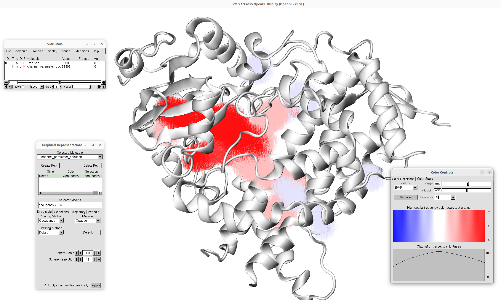
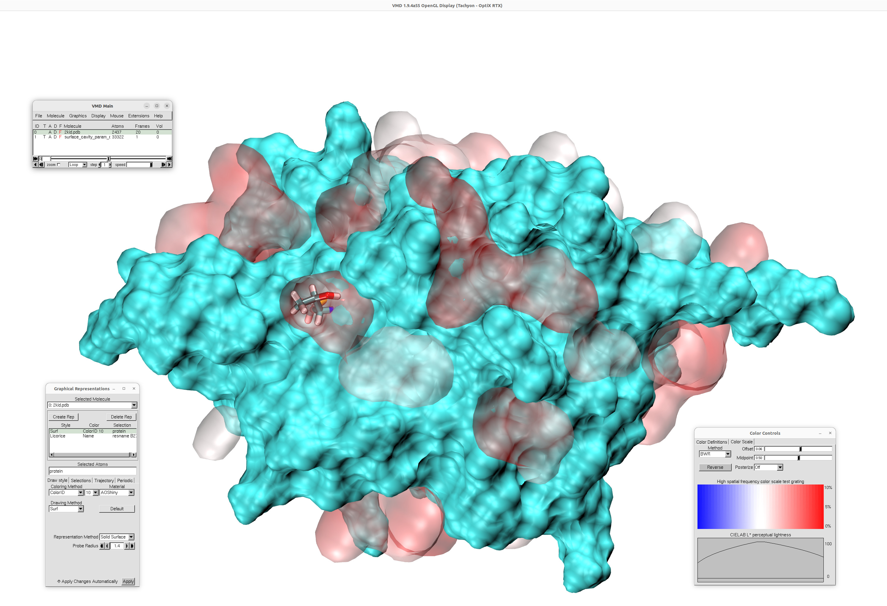

.. _cavitracer_single:

Exploring CaviTracer Parameters for Channels and Surface Cavities
===============================================================================

Choosing suitable parameters for channel and surface-cavity calculations may
depend on the analyzed system, its size, structural resolution, and the type of
pathway or pocket of interest. This tutorial shows how to explore different
CaviTracer parameter combinations in ProDy and compare the resulting channels
and surface cavities.

The examples demonstrate how to run parameter scans, save the detected objects
as PQR files, and generate spatial occupancy maps. These maps help identify
regions that are consistently detected across parameter sets, as well as
channels or surface cavities that appear only for selected parameter values.
This can guide the choice of parameters for further analysis and visualization.

Channels
-------------------------------------------------------------------------------

As an example for this tutorial, we will analyze the structure of cytochrome
P450 which contains 486 residues. To analyze the structure, we need to parse
a structure :file:`1tqn` using :func:`.parsePDB` and select protein
structure:

.. ipython:: python
   :verbatim:

   atoms = parsePDB('1tqn')
   protein = atoms.select('protein')

.. parsed-literal::

   @> Connecting wwPDB FTP server RCSB PDB (USA).
   @> Downloading PDB files via FTP failed, trying HTTP.
   @> 1tqn downloaded (1tqn.pdb.gz)
   @> PDB download via HTTP completed (1 downloaded, 0 failed).
   @> 3999 atoms and 1 coordinate set(s) were parsed in 0.14s.

Next, :func:`scanChannelParameters` can be use to explore various parameters 
and how they affects channel detection. This is useful when the optimal values are
not known for a given protein or when the user wants to identify channels that
are robustly detected across several parameter combinations.

By default, the function tests all combinations of the following parameters:

- ``inner_radius``: ``1.2``, ``1.4``, and ``1.6`` Å,
- ``sparsity``: ``1.0``, ``3.0``, and ``5.0`` Å,
- ``min_depth``: ``3.0``, ``5.0``, and ``10.0`` Å.

This gives 27 parameter combinations in total. For each combination, channels
are calculated and saved as a PQR file. The function also generates an
occupancy map showing which regions are detected repeatedly across the parameter
scan. Regions with higher occupancy correspond to channels that are less
sensitive to parameter choice, whereas low-occupancy regions indicate channels
detected only under selected parameter settings.

The returned ``channels_all`` object contains the channels detected for each
parameter combination, ``parameter_sets`` stores the corresponding parameter
values, and ``occupancy_file`` is the path to the PDB file containing the spatial
occupancy map.

.. ipython:: python
   :verbatim:

   channels_all, parameter_sets, occupancy_file = scanChannelParameters(protein, 
						output_path='channel_param_grid')

.. parsed-literal::

   @> Calculating channels for 27 parameter combinations.
   @> Grid run 1/27: inner_radius=1.2, sparsity=1, min_depth=3
   @> The atoms supplied to calcChannels contain protein atoms only.
   @> Substituted 3766 atoms with 23638 homogeneous balls of radius 1.52 Å in 0.23s.
   @> Delaunay tessellation of 23638 points constructed in 0.87s.
   @> Surface and inner simplices filtered in 1.18s.
   @> Surface cavities: 143 found, 17 deeper than min_depth=3.0 Å and searched for channels, in 0.24s.
   @> Chambers (probe 1.40 Å): 12 of the 17 searched cavities have them; the other 10 are searched whole.
   @>     cavity 0: 13 chambers, 3 of them seeded.
   @>     cavity 1: 1 chamber, seeded.
   @>     cavity 2: 1 chamber, seeded.
   @>     cavity 3: 3 chambers, 1 of them seeded.
   @>     cavity 4: 1 chamber, none of them deep and large enough to seed; searched whole.
   @>     cavity 5: 4 chambers, 2 of them seeded.
   @>     cavity 7: 1 chamber, seeded.
   @>     cavity 8: 1 chamber, seeded.
   @>     cavity 9: 2 chambers, none of them deep and large enough to seed; searched whole.
   @>     cavity 10: 1 chamber, none of them deep and large enough to seed; searched whole.
   @>     cavity 11: 2 chambers, none of them deep and large enough to seed; searched whole.
   @>     cavity 12: 1 chamber, none of them deep and large enough to seed; searched whole.
   @> 20 search sites (sp) in 0.08s: one per seeded chamber, one per cavity searched whole.
   @> Channel search (Dijkstra) over 20 search sites in 17 cavities completed in 0.46s.
   @> Found 30 channels and 2 links (a link joins a deep chamber to a shallower one and never reaches the surface).
   @> Search sites (sp), the void each search ran from, largest first; sp<n> tags every channel, link and output file:
   @>     site  void                   volume [ų]  depth [Å]  channels  links
   @>     sp0   cavity 0, chamber 1/3         4919       14.9         5      -
   @>     sp1   cavity 4, whole                311        3.6         2      -
   @>     sp2   cavity 6, whole                275        3.1         1      -
   @>     sp3   cavity 9, whole                246        3.1         1      -
   @>     sp4   cavity 0, chamber 2/3          228        3.6         2      -
   @>     sp5   cavity 2, chamber 1/1          216        6.9         -      -  sealed
   @>     sp6   cavity 10, whole               214        3.1         1      -
   @>     sp7   cavity 11, whole               184        3.6         4      -
   @>     sp8   cavity 3, chamber 1/1          173        3.6         2      -
   @>     sp9   cavity 12, whole               148        3.1         1      -
   @>     sp10  cavity 13, whole               139        3.4         1      -
   @>     sp11  cavity 1, chamber 1/1          120        4.8         1      -
   @>     sp12  cavity 14, whole               109        3.0         2      -
   @>     sp13  cavity 7, chamber 1/1           97        3.1         2      -
   @>     sp14  cavity 15, whole                87        3.8         1      -
   @>     sp15  cavity 0, chamber 3/3           69        3.9         1      1  -> sp0
   @>     sp16  cavity 5, chamber 1/2           50        9.3         -      1  -> sp19
   @>     sp17  cavity 16, whole                50        3.7         -      -  sealed
   @>     sp18  cavity 8, chamber 1/1           49        3.3         2      -
   @>     sp19  cavity 5, chamber 2/2           41        3.9         1      -
   @>     (site volumes measure the void itself and are not on the swept-sphere scale of the channel volumes)
   @> The 1 site marked sealed above report neither a channel nor a link: every route out of them is narrower than bottleneck=1.20 Å. Lower it to see how they connect.
   @> Saving 30 channels to channel_param_grid/channels_run000_inner_radius_1p2_sparsity_1_depth_3.pqr and 2 links to channel_param_grid/channels_run000_inner_radius_1p2_sparsity_1_depth_3_links.pqr.
   @> Channel calculation completed in 3.15s.
   ..
   ..
   @> Grid run 24/27: inner_radius=1.6, sparsity=3, min_depth=10
   @> The atoms supplied to calcChannels contain protein atoms only.
   @> Substituted 3766 atoms with 23638 homogeneous balls of radius 1.52 Å in 0.19s.
   @> Delaunay tessellation of 23638 points constructed in 0.80s.
   @> Surface and inner simplices filtered in 0.99s.
   @> Surface cavities: 97 found, 1 deeper than min_depth=10.0 Å and searched for channels, in 0.10s.
   @> Channel search (Dijkstra) over 1 search sites in 1 cavities completed in 0.06s.
   @> Found 3 channels.
   @> Search sites (sp), the void each search ran from, largest first; sp<n> tags every channel, link and output file:
   @>     site  void             volume [ų]  depth [Å]  channels  links
   @>     sp0   cavity 0, whole         4930       41.1         3      -
   @>     (site volumes measure the void itself and are not on the swept-sphere scale of the channel volumes)
   @> Saving 3 channels to channel_param_grid/channels_run023_inner_radius_1p6_sparsity_3_depth_10.pqr.
   @> Channel calculation completed in 2.20s.
   @> Grid run 25/27: inner_radius=1.6, sparsity=5, min_depth=3
   @> The atoms supplied to calcChannels contain protein atoms only.
   @> Substituted 3766 atoms with 23638 homogeneous balls of radius 1.52 Å in 0.19s.
   @> Delaunay tessellation of 23638 points constructed in 0.78s.
   @> Surface and inner simplices filtered in 0.96s.
   @> Surface cavities: 97 found, 7 deeper than min_depth=3.0 Å and searched for channels, in 0.10s.
   @> Channel search (Dijkstra) over 7 search sites in 7 cavities completed in 0.11s.
   @> Found 5 channels.
   @> Search sites (sp), the void each search ran from, largest first; sp<n> tags every channel, link and output file:
   @>     site  void             volume [ų]  depth [Å]  channels  links
   @>     sp0   cavity 0, whole         4930       41.1         2      -
   @>     sp1   cavity 1, whole          464        6.9         1      -
   @>     sp2   cavity 2, whole          250        5.6         -      -  sealed
   @>     sp3   cavity 3, whole          166        4.9         1      -
   @>     sp4   cavity 4, whole          142        6.3         -      -  sealed
   @>     sp5   cavity 5, whole          137        3.2         1      -
   @>     sp6   cavity 6, whole          132        4.5         -      -  sealed
   @>     (site volumes measure the void itself and are not on the swept-sphere scale of the channel volumes)
   @> Saving 5 channels to channel_param_grid/channels_run024_inner_radius_1p6_sparsity_5_depth_3.pqr.
   @> Channel calculation completed in 2.21s.
   @> Grid run 26/27: inner_radius=1.6, sparsity=5, min_depth=5
   @> The atoms supplied to calcChannels contain protein atoms only.
   @> Substituted 3766 atoms with 23638 homogeneous balls of radius 1.52 Å in 0.18s.
   @> Delaunay tessellation of 23638 points constructed in 0.74s.
   @> Surface and inner simplices filtered in 0.99s.
   @> Surface cavities: 97 found, 4 deeper than min_depth=5.0 Å and searched for channels, in 0.10s.
   @> Channel search (Dijkstra) over 4 search sites in 4 cavities completed in 0.09s.
   @> Found 3 channels.
   @> Search sites (sp), the void each search ran from, largest first; sp<n> tags every channel, link and output file:
   @>     site  void             volume [ų]  depth [Å]  channels  links
   @>     sp0   cavity 0, whole         4930       41.1         2      -
   @>     sp1   cavity 1, whole          464        6.9         1      -
   @>     sp2   cavity 2, whole          250        5.6         -      -  sealed
   @>     sp3   cavity 3, whole          142        6.3         -      -  sealed
   @>     (site volumes measure the void itself and are not on the swept-sphere scale of the channel volumes)
   @> Saving 3 channels to channel_param_grid/channels_run025_inner_radius_1p6_sparsity_5_depth_5.pqr.
   @> Channel calculation completed in 2.17s.
   @> Grid run 27/27: inner_radius=1.6, sparsity=5, min_depth=10
   @> The atoms supplied to calcChannels contain protein atoms only.
   @> Substituted 3766 atoms with 23638 homogeneous balls of radius 1.52 Å in 0.18s.
   @> Delaunay tessellation of 23638 points constructed in 0.75s.
   @> Surface and inner simplices filtered in 0.93s.
   @> Surface cavities: 97 found, 1 deeper than min_depth=10.0 Å and searched for channels, in 0.09s.
   @> Channel search (Dijkstra) over 1 search sites in 1 cavities completed in 0.06s.
   @> Found 2 channels.
   @> Search sites (sp), the void each search ran from, largest first; sp<n> tags every channel, link and output file:
   @>     site  void             volume [ų]  depth [Å]  channels  links
   @>     sp0   cavity 0, whole         4930       41.1         2      -
   @>     (site volumes measure the void itself and are not on the swept-sphere scale of the channel volumes)
   @> Saving 2 channels to channel_param_grid/channels_run026_inner_radius_1p6_sparsity_5_depth_10.pqr.
   @> Channel calculation completed in 2.07s.
   @> Number of PQR files: 27
   @> Resolution: 0.5
   @> max_proc: 2
   @> Calculating overlaps using 2 processes.
   @> 960 atoms and 1 coordinate sets were parsed in 0.01s.
   @> 1480 atoms and 1 coordinate sets were parsed in 0.01s.
   @> 860 atoms and 1 coordinate sets were parsed in 0.00s.
   @> 1140 atoms and 1 coordinate sets were parsed in 0.01s.
   @> 725 atoms and 1 coordinate sets were parsed in 0.00s.
   @> 835 atoms and 1 coordinate sets were parsed in 0.00s.
   @> 805 atoms and 1 coordinate sets were parsed in 0.00s.
   @> 705 atoms and 1 coordinate sets were parsed in 0.00s.
   @> 1955 atoms and 1 coordinate sets were parsed in 0.01s.
   @> 490 atoms and 1 coordinate sets were parsed in 0.00s.
   @> 1880 atoms and 1 coordinate sets were parsed in 0.01s.
   @> 1625 atoms and 1 coordinate sets were parsed in 0.01s.
   @> 1620 atoms and 1 coordinate sets were parsed in 0.01s.
   @> 1420 atoms and 1 coordinate sets were parsed in 0.01s.
   @> 1415 atoms and 1 coordinate sets were parsed in 0.01s.
   @> 1495 atoms and 1 coordinate sets were parsed in 0.01s.
   @> 1235 atoms and 1 coordinate sets were parsed in 0.01s.
   @> 1305 atoms and 1 coordinate sets were parsed in 0.01s.
   @> 1030 atoms and 1 coordinate sets were parsed in 0.01s.
   @> 1125 atoms and 1 coordinate sets were parsed in 0.01s.
   @> 1060 atoms and 1 coordinate sets were parsed in 0.01s.
   @> 1235 atoms and 1 coordinate sets were parsed in 0.01s.
   @> 1120 atoms and 1 coordinate sets were parsed in 0.01s.
   @> 860 atoms and 1 coordinate sets were parsed in 0.01s.
   @> 1055 atoms and 1 coordinate sets were parsed in 0.01s.
   @> 745 atoms and 1 coordinate sets were parsed in 0.00s.
   @> 680 atoms and 1 coordinate sets were parsed in 0.00s.
   @> Overlap written to: channel_param_grid/channel_parameter_occupancy.pdb
   @> Number of occupied overlap voxels: 29905
   @> Channel parameters scan completed in 78.05s.

The results can be visualized using VMD_ as shown below. Red regions 
correspond to the channel's regions present in the largest number of 
results (across various parameters), and blue regions (displayed as 
dots) correspond only to certain parameters.

If other values are required, the scan can be customized as follows:

.. ipython:: python
   :verbatim:

   channels_all, parameter_sets, occupancy_file = scanChannelParameters(
       protein,
       inner_radius_values=[1.2, 1.5, 2.0],
       sparsity_values=[1.0, 3.0],
       min_depth_values=[5.0, 10.0, 15.0],
       output_path='channel_param_grid_custom')

Surface Cavities
-------------------------------------------------------------------------------

For surface cavity analysis, we will use the S. aureus Sortase A, the NMR 
structure (PDB ID: 2KID). 

We first load the protein structure and select protein structure and model 0
in the NMR ensemble. This step removes the bound substrate peptide from the 
analysis, allowing the cavity detection procedure to identify the surface 
groove that accommodates the substrate.

.. ipython:: python
   :verbatim:

   protein = parsePDB('2KID').select('protein')

.. parsed-literal::

   @> Connecting wwPDB FTP server RCSB PDB (USA).
   @> Downloading PDB files via FTP failed, trying HTTP.
   @> 2kid downloaded (2kid.pdb.gz)
   @> PDB download via HTTP completed (1 downloaded, 0 failed).
   @> 2437 atoms and 20 coordinate set(s) were parsed in 0.33s.

.. ipython:: python
   :verbatim:

   protein.setACSIndex(0)

Now, we use model 1 for the analysis using :func:`scanSurfaceCavityParameters`.

By default, the function tests all combinations of the following parameters:

- ``surf_radius``: ``4.0``, ``4.5``, and ``5.0`` Å,
- ``inner_radius``: ``1.5`` and ``2.0`` Å,
- ``min_depth``: ``1.5`` and ``2.0`` Å,
- ``max_depth``: ``2.5`` and ``3.0`` Å,
- ``min_volume``: ``None`` and ``50`` ų.

This gives 48 parameter combinations in total. For each combination, surface
cavities are calculated and saved as a PQR file. The function also generates an
occupancy map showing which surface regions are detected repeatedly across the
parameter scan. Regions with higher occupancy correspond to cavities that are
less sensitive to parameter choice, whereas low-occupancy regions indicate
cavities detected only under selected parameter settings.

.. ipython:: python
   :verbatim:

   cavities_all, parameter_sets, occupancy_file = scanSurfaceCavityParameters(protein)

.. parsed-literal::

   @> Calculating surface cavities for 48 parameter combinations.
   @> Grid run 1/48: surf_radius=4, inner_radius=1.5, min_depth=1.5, max_depth=2.5, min_volume=None
   @> The atoms supplied to calcChannels contain protein atoms only.
   @> Substituted 2403 atoms with 31123 homogeneous balls of radius 1.20 Å in 0.13s.
   @> Delaunay tessellation of 31123 points constructed in 1.34s.
   @> Surface and inner simplices filtered in 0.40s.
   @> Surface cavities: 281 found, 30 deeper than min_depth=1.5 Å and kept, in 0.30s.
   @> Returning surface cavities
   @> Saving surface cavities to surface_cavity_parameter_grid/surface_cavities_run000_surf_radius_4_inner_radius_1p5_mindepth_1p5_maxdepth_2p5_minvol_none.pqr.
   @> Surface cavity calculation completed in 2.27s.
   @> Grid run 2/48: surf_radius=4, inner_radius=1.5, min_depth=1.5, max_depth=2.5, min_volume=50.0
   @> The atoms supplied to calcChannels contain protein atoms only.
   @> Substituted 2403 atoms with 31123 homogeneous balls of radius 1.20 Å in 0.10s.
   @> Delaunay tessellation of 31123 points constructed in 1.23s.
   @> Surface and inner simplices filtered in 0.37s.
   @> Surface cavities: 281 found, 30 deeper than min_depth=1.5 Å and kept, in 0.29s.
   @> Returning surface cavities
   @> Saving surface cavities to surface_cavity_parameter_grid/surface_cavities_run001_surf_radius_4_inner_radius_1p5_mindepth_1p5_maxdepth_2p5_minvol_50.pqr.
   @> Surface cavity calculation completed in 2.09s.
   @> Grid run 3/48: surf_radius=4, inner_radius=1.5, min_depth=1.5, max_depth=3, min_volume=None
   @> The atoms supplied to calcChannels contain protein atoms only.
   @> Substituted 2403 atoms with 31123 homogeneous balls of radius 1.20 Å in 0.10s.
   @> Delaunay tessellation of 31123 points constructed in 1.25s.
   @> Surface and inner simplices filtered in 0.38s.
   @> Surface cavities: 281 found, 30 deeper than min_depth=1.5 Å and kept, in 0.35s.
   @> Returning surface cavities
   @> Saving surface cavities to surface_cavity_parameter_grid/surface_cavities_run002_surf_radius_4_inner_radius_1p5_mindepth_1p5_maxdepth_3_minvol_none.pqr.
   @> Surface cavity calculation completed in 2.18s.
   ..
   ..
   @> Grid run 45/48: surf_radius=5, inner_radius=2, min_depth=2, max_depth=2.5, min_volume=None
   @> The atoms supplied to calcChannels contain protein atoms only.
   @> Substituted 2403 atoms with 31123 homogeneous balls of radius 1.20 Å in 0.10s.
   @> Delaunay tessellation of 31123 points constructed in 1.11s.
   @> Surface and inner simplices filtered in 0.34s.
   @> Surface cavities: 244 found, 19 deeper than min_depth=2.0 Å and kept, in 0.23s.
   @> Returning surface cavities
   @> Saving surface cavities to surface_cavity_parameter_grid/surface_cavities_run044_surf_radius_5_inner_radius_2_mindepth_2_maxdepth_2p5_minvol_none.pqr.
   @> Surface cavity calculation completed in 1.82s.
   @> Grid run 46/48: surf_radius=5, inner_radius=2, min_depth=2, max_depth=2.5, min_volume=50.0
   @> The atoms supplied to calcChannels contain protein atoms only.
   @> Substituted 2403 atoms with 31123 homogeneous balls of radius 1.20 Å in 0.10s.
   @> Delaunay tessellation of 31123 points constructed in 1.10s.
   @> Surface and inner simplices filtered in 0.34s.
   @> Surface cavities: 244 found, 19 deeper than min_depth=2.0 Å and kept, in 0.23s.
   @> Returning surface cavities
   @> Saving surface cavities to surface_cavity_parameter_grid/surface_cavities_run045_surf_radius_5_inner_radius_2_mindepth_2_maxdepth_2p5_minvol_50.pqr.
   @> Surface cavity calculation completed in 1.82s.
   @> Grid run 47/48: surf_radius=5, inner_radius=2, min_depth=2, max_depth=3, min_volume=None
   @> The atoms supplied to calcChannels contain protein atoms only.
   @> Substituted 2403 atoms with 31123 homogeneous balls of radius 1.20 Å in 0.10s.
   @> Delaunay tessellation of 31123 points constructed in 1.18s.
   @> Surface and inner simplices filtered in 0.40s.
   @> Surface cavities: 244 found, 19 deeper than min_depth=2.0 Å and kept, in 0.24s.
   @> Returning surface cavities
   @> Saving surface cavities to surface_cavity_parameter_grid/surface_cavities_run046_surf_radius_5_inner_radius_2_mindepth_2_maxdepth_3_minvol_none.pqr.
   @> Surface cavity calculation completed in 1.97s.
   @> Grid run 48/48: surf_radius=5, inner_radius=2, min_depth=2, max_depth=3, min_volume=50.0
   @> The atoms supplied to calcChannels contain protein atoms only.
   @> Substituted 2403 atoms with 31123 homogeneous balls of radius 1.20 Å in 0.11s.
   @> Delaunay tessellation of 31123 points constructed in 1.20s.
   @> Surface and inner simplices filtered in 0.38s.
   @> Surface cavities: 244 found, 19 deeper than min_depth=2.0 Å and kept, in 0.26s.
   @> Returning surface cavities
   @> Saving surface cavities to surface_cavity_parameter_grid/surface_cavities_run047_surf_radius_5_inner_radius_2_mindepth_2_maxdepth_3_minvol_50.pqr.
   @> Surface cavity calculation completed in 2.00s.
   @> Number of PQR files: 48
   @> Resolution: 0.5
   @> max_proc: 2
   @> Calculating overlaps using 2 processes.
   @> 1794 atoms and 1 coordinate sets were parsed in 0.01s.
   @> 1961 atoms and 1 coordinate sets were parsed in 0.01s.
   @> 1730 atoms and 1 coordinate sets were parsed in 0.01s.
   @> 1734 atoms and 1 coordinate sets were parsed in 0.01s.
   @> 654 atoms and 1 coordinate sets were parsed in 0.00s.
   @> 2076 atoms and 1 coordinate sets were parsed in 0.01s.
   @> 591 atoms and 1 coordinate sets were parsed in 0.00s.
   @> 685 atoms and 1 coordinate sets were parsed in 0.00s.
   @> 622 atoms and 1 coordinate sets were parsed in 0.00s.
   @> 1847 atoms and 1 coordinate sets were parsed in 0.01s.
   @> 1679 atoms and 1 coordinate sets were parsed in 0.01s.
   @> 1617 atoms and 1 coordinate sets were parsed in 0.01s.
   @> 512 atoms and 1 coordinate sets were parsed in 0.00s.
   @> 512 atoms and 1 coordinate sets were parsed in 0.00s.
   @> 543 atoms and 1 coordinate sets were parsed in 0.00s.
   @> 543 atoms and 1 coordinate sets were parsed in 0.00s.
   @> 2214 atoms and 1 coordinate sets were parsed in 0.01s.
   @> 1979 atoms and 1 coordinate sets were parsed in 0.01s.
   @> 2359 atoms and 1 coordinate sets were parsed in 0.01s.
   @> 2120 atoms and 1 coordinate sets were parsed in 0.01s.
   @> 850 atoms and 1 coordinate sets were parsed in 0.00s.
   @> 728 atoms and 1 coordinate sets were parsed in 0.00s.
   @> 1979 atoms and 1 coordinate sets were parsed in 0.01s.
   @> 902 atoms and 1 coordinate sets were parsed in 0.01s.
   @> 779 atoms and 1 coordinate sets were parsed in 0.00s.
   @> 1897 atoms and 1 coordinate sets were parsed in 0.01s.
   @> 688 atoms and 1 coordinate sets were parsed in 0.00s.
   @> 673 atoms and 1 coordinate sets were parsed in 0.00s.
   @> 2124 atoms and 1 coordinate sets were parsed in 0.01s.
   @> 2038 atoms and 1 coordinate sets were parsed in 0.01s.
   @> 740 atoms and 1 coordinate sets were parsed in 0.00s.
   @> 724 atoms and 1 coordinate sets were parsed in 0.01s.
   @> 2472 atoms and 1 coordinate sets were parsed in 0.02s.
   @> 2236 atoms and 1 coordinate sets were parsed in 0.01s.
   @> 2629 atoms and 1 coordinate sets were parsed in 0.01s.
   @> 2387 atoms and 1 coordinate sets were parsed in 0.01s.
   @> 2263 atoms and 1 coordinate sets were parsed in 0.02s.
   @> 2154 atoms and 1 coordinate sets were parsed in 0.01s.
   @> 2420 atoms and 1 coordinate sets were parsed in 0.01s.
   @> 2305 atoms and 1 coordinate sets were parsed in 0.01s.
   @> 1087 atoms and 1 coordinate sets were parsed in 0.01s.
   @> 932 atoms and 1 coordinate sets were parsed in 0.01s.
   @> 1164 atoms and 1 coordinate sets were parsed in 0.01s.
   @> 1005 atoms and 1 coordinate sets were parsed in 0.01s.
   @> 1015 atoms and 1 coordinate sets were parsed in 0.01s.
   @> 911 atoms and 1 coordinate sets were parsed in 0.01s.
   @> 1092 atoms and 1 coordinate sets were parsed in 0.01s.
   @> 984 atoms and 1 coordinate sets were parsed in 0.01s.
   @> Overlap written to: surface_cavity_parameter_grid/surface_cavity_param_occupancy.pdb
   @> Number of occupied overlap voxels: 33322
   @> Surface cavity parameters scan completed in 102.59s.

The results can be visualized using VMD_. As we can see, the red
region (present in at least 50% of results; ``occupancy > 0.5``)
is also shown at the ligand binding spot.

