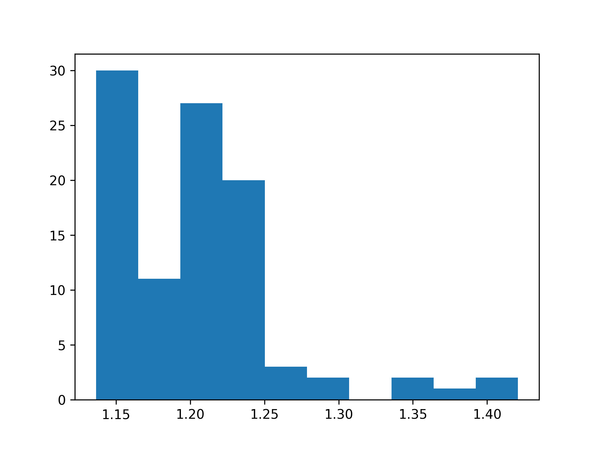

.. _cavitracer_single:

Detection of channels in molecular dynamics (MD) trajectory
===============================================================================

Analysis of the trajectory will be performed on a short MD trajectory
containing a few frames of simulation performed for 15-lipoxygenase from
P.aeruginosa (pLoxA). This protein contains 665 residues and a catalytic center
with iron. During the analysis, the metal center is ignored.

Before analyzing the trajectory, its need to be parsed (see more details
in `Trajectory tutorial`_).

.. ipython:: python
   :verbatim:

   PDBfile = 'pLoxA2.pdb'
   DCDfile = 'pLoxA2_ev5.dcd'
   atoms = parsePDB(PDBfile)
   dcd = Trajectory(DCDfile)
   dcd.link(atoms)
   dcd.setCoords(atoms)

.. parsed-literal::

   @> 10298 atoms and 1 coordinate set(s) were parsed in 0.11s.

To detect channels in MD trajectories, we need to use
:func:`.scalcChannelsMultipleFrames` function.

.. ipython:: python
   :verbatim:

   channels4, surfaces4=calcChannelsMultipleFrames(atoms, dcd, output_path = 'channels_pLoxA_dcd', separate=True)

.. parsed-literal::

   @> Frame: 0
   @> Detected 23 channels.
   @> Saving multiple results to directory ..
   @> Frame: 1
   @> Detected 21 channels.
   @> Saving multiple results to directory ..
   @> Frame: 2
   @> Detected 20 channels.
   @> Saving multiple results to directory ..
   @> Frame: 3
   @> Detected 17 channels.
   @> Saving multiple results to directory ..
   @> Frame: 4
   @> Detected 17 channels.
   @> Saving multiple results to directory ..  

All the details about the predicted channels can be displayed using
:func:`.getChannelParameters`.

.. ipython:: python
   :verbatim:

   getChannelParameters(channels4, param_file_name='DATA_channels_pLoxA_dcd')

.. parsed-literal::

   @> Channel ID: 	Volume [ų] 	Length [Å] 	Bottleneck [Å]
   @> Frame 0
   @> channel 0: 	992.48 		81.53 		1.2
   @> channel 1: 	1312.76 	100.87 		1.2
   @> channel 2: 	2054.1 		155.22 		1.2
   @> channel 3: 	418.26 		44.36 		1.2
   @> channel 4: 	1859.55 	141.17 		1.2
   @> channel 5: 	1790.54 	116.13 		1.2
   @> channel 6: 	312.79 		40.46 		1.15
   @> channel 7: 	1904.32 	130.45 		1.2
   @> channel 8: 	1745.99 	131.33 		1.2
   @> channel 9: 	1680.53 	113.63 		1.2
   @> channel 10: 	402.18 		47.8 		1.15
   @> channel 11: 	682.06 		63.98 		1.19
   @> channel 12: 	846.48 		86.61 		1.16
   @> channel 13: 	637.88 		62.92 		1.19
   @> channel 14: 	1134.36 	119.14 		1.16
   @> channel 15: 	352.71 		44.41 		1.19
   @> channel 16: 	408.86 		36.05 		1.29
   @> channel 17: 	356.74 		38.1 		1.17
   @> channel 18: 	425.39 		47.89 		1.16
   @> channel 19: 	238.69 		29.66 		1.17
   @> channel 20: 	135.42 		14.25 		1.23
   @> channel 21: 	312.2 		28.6 		1.2
   @> channel 22: 	262.23 		30.13 		1.24
   @> Frame 1
   @> channel 0: 	938.59 		74.19 		1.22
   @> channel 1: 	556.67 		36.35 		1.22
   @> channel 2: 	1754.65 	114.13 		1.22
   @> channel 3: 	820.62 		69.04 		1.17
   @> channel 4: 	1099.72 	88.55 		1.22
   @> channel 5: 	1192.77 	75.42 		1.22
   @> channel 6: 	734.64 		55.9 		1.22
   @> channel 7: 	583.27 		49.71 		1.22
   @> channel 8: 	1147.81 	80.93 		1.22
   @> channel 9: 	876.36 		67.71 		1.22
   @> channel 10: 	1248.18 	110.28 		1.19
   @> channel 11: 	1459.2 		104.78 		1.22
   @> channel 12: 	592.62 		42.78 		1.22
   @> channel 13: 	327.34 		27.46 		1.42
   @> channel 14: 	843.11 		74.27 		1.21
   @> channel 15: 	1154.27 	101.07 		1.21
   @> channel 16: 	776.61 		64.91 		1.42
   @> channel 17: 	119.26 		12.88 		1.18
   @> channel 18: 	378.36 		44.11 		1.26
   @> channel 19: 	257.43 		25.44 		1.26
   @> channel 20: 	135.45 		12.38 		1.24
   @> Frame 2
   @> channel 0: 	657.62 		57.69 		1.22
   @> channel 1: 	382.37 		36.18 		1.22
   @> channel 2: 	360.74 		35.36 		1.22
   @> channel 3: 	705.24 		75.91 		1.22
   @> channel 4: 	1113.35 	120.45 		1.21
   @> channel 5: 	1064.11 	104.61 		1.22
   @> channel 6: 	994.6 		112.42 		1.21
   @> channel 7: 	841.52 		88.26 		1.22
   @> channel 8: 	771.1 		78.79 		1.22
   @> channel 9: 	1039.73 	109.33 		1.2
   @> channel 10: 	888.9 		95.13 		1.22
   @> channel 11: 	523.87 		63.65 		1.25
   @> channel 12: 	778.0 		35.3 		1.14
   @> channel 13: 	521.2 		28.3 		1.14
   @> channel 14: 	801.16 		33.07 		1.14
   @> channel 15: 	1200.77 	62.09 		1.14
   @> channel 16: 	851.3 		35.67 		1.14
   @> channel 17: 	168.1 		12.94 		1.28
   @> channel 18: 	191.81 		16.51 		1.34
   @> channel 19: 	217.48 		17.62 		1.16
   @> Frame 3
   @> channel 0: 	2169.69 	229.15 		1.14
   @> channel 1: 	1616.05 	180.27 		1.14
   @> channel 2: 	2558.28 	247.6 		1.14
   @> channel 3: 	3125.51 	272.92 		1.14
   @> channel 4: 	3021.33 	258.99 		1.14
   @> channel 5: 	2688.17 	255.62 		1.14
   @> channel 6: 	1355.6 		140.36 		1.14
   @> channel 7: 	2455.01 	254.3 		1.14
   @> channel 8: 	360.38 		42.81 		1.14
   @> channel 9: 	479.56 		55.04 		1.14
   @> channel 10: 	1192.58 	126.35 		1.14
   @> channel 11: 	1437.5 		147.12 		1.14
   @> channel 12: 	826.59 		71.77 		1.14
   @> channel 13: 	831.59 		94.04 		1.14
   @> channel 14: 	1250.23 	138.19 		1.14
   @> channel 15: 	495.7 		56.03 		1.14
   @> channel 16: 	188.57 		16.54 		1.25
   @> Frame 4
   @> channel 0: 	1166.47 	78.73 		1.23
   @> channel 1: 	1337.89 	92.61 		1.23
   @> channel 2: 	812.56 		67.79 		1.23
   @> channel 3: 	1604.16 	119.55 		1.23
   @> channel 4: 	1147.63 	96.77 		1.23
   @> channel 5: 	532.67 		47.51 		1.23
   @> channel 6: 	621.67 		58.09 		1.23
   @> channel 7: 	357.02 		43.58 		1.2
   @> channel 8: 	1327.45 	94.03 		1.23
   @> channel 9: 	550.83 		58.65 		1.19
   @> channel 10: 	302.35 		31.08 		1.19
   @> channel 11: 	91.71 		13.11 		1.18
   @> channel 12: 	313.56 		24.87 		1.37
   @> channel 13: 	423.17 		40.18 		1.14
   @> channel 14: 	460.7 		49.85 		1.14
   @> channel 15: 	514.97 		51.72 		1.14
   @> channel 16: 	175.27 		14.78 		1.34

   [([81.53076854675717,
      100.87184622137524,
      155.21730562517422,
      44.35946093281574,
      141.1656656186375,
      116.12867797358405,
      40.46376251691566,
      130.45000999468857,
      131.33211590537636,
      113.63048581490258,
      47.795798586969184,
      63.978188025186526,
      86.60576976913924,
      62.919007506778094,
      119.14107539131692,
      44.40927920760103,
      36.04783735884794,
      38.09776525349153,
      47.89398842913637,
      29.65774826306761,
      14.248646497732171,
      28.599643876182448,
      30.129791668784087],
     [1.196090464916565,
      1.196090464916565,
      1.196090464916565,
      1.196090464916565,
      1.196090464916565,
      1.196090464916565,
      1.148694455970017,
      1.196090464916565,
      ..
      ..
     [1.227526787656218,
      1.227526787656218,
      1.227526787656218,
      1.227526787656218,
      1.227526787656218,
      1.227526787656218,
      1.227526787656218,
      1.2011749676816736,
      1.227526787656218,
      1.1932295513238282,
      1.1932295513238282,
      1.183074525904224,
      1.3700950318669023,
      1.138079894553803,
      1.138079894553803,
      1.138079894553803,
      1.3402358031075432],
     [1166.4706995833308,
      1337.8854802839428,
      812.560483578324,
      1604.1597848068766,
      1147.6292984197153,
      532.6712321117886,
      621.6682874770008,
      357.0213867625684,
      1327.4544405780978,
      550.8263659229955,
      302.3506391526108,
      91.71321425940671,
      313.5638679068994,
      423.17395857062263,
      460.69557216242544,
      514.9659792511438,
      175.2730899436576])]

Assigning the function's output to the ``results`` variable grants access 
to these parameters, as shown below.

.. ipython:: python
   :verbatim:

   results = getChannelParameters(channels4)

.. parsed-literal::

   @> Channel ID: 	Volume [ų] 	Length [Å] 	Bottleneck [Å]
   @> Frame 0
   @> channel 0: 	992.48 		81.53 		1.2
   @> channel 1: 	1312.76 	100.87 		1.2
   @> channel 2: 	2054.1 		155.22 		1.2
   @> channel 3: 	418.26 		44.36 		1.2
   @> channel 4: 	1859.55 	141.17 		1.2
   @> channel 5: 	1790.54 	116.13 		1.2
   @> channel 6: 	312.79 		40.46 		1.15
   @> channel 7: 	1904.32 	130.45 		1.2
   @> channel 8: 	1745.99 	131.33 		1.2
   @> channel 9: 	1680.53 	113.63 		1.2
   @> channel 10: 	402.18 		47.8 		1.15
   ..

Results for the first frame in the trajectory:

.. ipython:: python
   :verbatim:

   results[0]

.. parsed-literal::

   ([81.53076854675717,
    100.87184622137524,
    155.21730562517422,
     44.35946093281574,
    141.1656656186375,
    116.12867797358405,
     40.46376251691566,
    130.45000999468857,
    131.33211590537636,
    113.63048581490258,
    47.795798586969184,
    63.978188025186526,
    86.60576976913924,
    62.919007506778094,
    119.14107539131692,
    44.40927920760103,
    36.04783735884794,
    38.09776525349153,
    47.89398842913637,
    29.65774826306761,
    14.248646497732171,
    28.599643876182448,
    30.129791668784087],
   [1.196090464916565,
    1.196090464916565,
    1.196090464916565,
    1.196090464916565,
    1.196090464916565,
    1.196090464916565,
    1.148694455970017,
    1.196090464916565,
    1.196090464916565,
    1.196090464916565,
    1.148694455970017,
    1.1910426818565816,
    1.1639197434893152,
    1.1910426818565816,
    1.1639197434893152,
    1.1910426818565816,
    1.285962724963367,
    1.1697509690515397,
    1.158333238790114,
    1.1697509690515397,
    1.2290282909977648,
    1.2045446926470393,
    1.2372900747968767],
   [992.4842653102705,
    1312.7649852915242,
    2054.1011826328895,
    418.26050817006507,
    1859.5528753413366,
    1790.5405946658473,
    312.7857361187134,
    1904.3157874898,
    1745.9901933926658,
    1680.5336124135697,
    402.17503054377386,
    682.063499836242,
    846.4839456899284,
    637.8841942942074,
    1134.3607901158177,
    352.71210068388814,
    408.8563806761948,
    356.73525993569035,
    425.38870942307784,
    238.68740556217102,
    135.4169260377724,
    312.2046931577367,
    262.2261752030014])

To obtain information about the lengths of the channels detected in the 
first frame in the trajectory (#0):

.. ipython:: python
   :verbatim:

   results[0][0]

.. parsed-literal::

   [81.53076854675717,
   100.87184622137524,
   155.21730562517422,
    44.35946093281574,
   141.1656656186375,
   116.12867797358405,
    40.46376251691566,
   130.45000999468857,
   131.33211590537636,
   113.63048581490258,
    47.795798586969184,
    63.978188025186526,
    86.60576976913924,
    62.919007506778094,
   119.14107539131692,
    44.40927920760103,
    36.04783735884794,
    38.09776525349153,
    47.89398842913637,
    29.65774826306761,
    14.248646497732171,
    28.599643876182448,
    30.129791668784087]

Bottlenecks of the channels in the first frame in the trajectory (#0):

.. ipython:: python
   :verbatim:

   results[0][1]

.. parsed-literal::

   [1.196090464916565,
    1.196090464916565,
    1.196090464916565,
    1.196090464916565,
    1.196090464916565,
    1.196090464916565,
    1.148694455970017,
    1.196090464916565,
    1.196090464916565,
    1.196090464916565,
    1.148694455970017,
    1.1910426818565816,
    1.1639197434893152,
    1.1910426818565816,
    1.1639197434893152,
    1.1910426818565816,
    1.285962724963367,
    1.1697509690515397,
    1.158333238790114,
    1.1697509690515397,
    1.2290282909977648,
    1.2045446926470393,
    1.2372900747968767]

Volume of the channels detected in the first frame in the trajectory:

.. ipython:: python
   :verbatim:

   results[0][2]

.. parsed-literal::

   [992.4842653102705,
    1312.7649852915242,
    2054.1011826328895,
    418.26050817006507,
    1859.5528753413366,
    1790.5405946658473,
    312.7857361187134,
    1904.3157874898,
    1745.9901933926658,
    1680.5336124135697,
    402.17503054377386,
    682.063499836242,
    846.4839456899284,
    637.8841942942074,
    1134.3607901158177,
    352.71210068388814,
    408.8563806761948,
    356.73525993569035,
    425.38870942307784,
    238.68740556217102,
    135.4169260377724,
    312.2046931577367,
    262.2261752030014]

Once we have access to ``results``, we can display bottleneck data for all
the channels in the following way:

.. ipython:: python
   :verbatim:

   import matplotlib.pylab as plt
   all_Bottleneck = []
   for nr_i,i in enumerate(results):
      all_Bottleneck.extend(results[nr_i][1])

   plt.hist(all_Bottleneck)

.. parsed-literal::

   (array([30., 11., 27., 20.,  3.,  2.,  0.,  2.,  1.,  2.]),
    array([1.13653642, 1.16496133, 1.19338624, 1.22181114, 1.25023605,
        1.27866096, 1.30708586, 1.33551077, 1.36393568, 1.39236058,
        1.42078549]),
    <BarContainer object of 10 artists>)

To have access to a particular frame, we need to use :meth:`.getFrame`.
Below, we will select third frame from the simulation (counting from 0):

.. ipython:: python
   :verbatim:

   frame3 = dcd.getFrame(2)
   frame3

.. parsed-literal::

   <Frame: 2 from pLoxA2_ev5 (10298 atoms)>

.. ipython:: python
   :verbatim:

   getChannelResidueNames(frame3, channels4[1], residues_file_name='pLoxA_DCD_res')

.. parsed-literal::

   @> 10633 atoms and 1 coordinate set(s) were parsed in 0.10s.
   @> 10438 atoms and 1 coordinate set(s) were parsed in 0.09s.
   @> 10793 atoms and 1 coordinate set(s) were parsed in 0.10s.
   @> 10618 atoms and 1 coordinate set(s) were parsed in 0.09s.
   @> 10663 atoms and 1 coordinate set(s) were parsed in 0.10s.
   @> 10638 atoms and 1 coordinate set(s) were parsed in 0.10s.
   @> 10543 atoms and 1 coordinate set(s) were parsed in 0.10s.
   @> 10513 atoms and 1 coordinate set(s) were parsed in 0.10s.
   @> 10678 atoms and 1 coordinate set(s) were parsed in 0.10s.
   @> 10588 atoms and 1 coordinate set(s) were parsed in 0.10s.
   @> 10753 atoms and 1 coordinate set(s) were parsed in 0.10s.
   @> 10753 atoms and 1 coordinate set(s) were parsed in 0.11s.
   @> 10463 atoms and 1 coordinate set(s) were parsed in 0.11s.
   @> 10423 atoms and 1 coordinate set(s) were parsed in 0.10s.
   @> 10668 atoms and 1 coordinate set(s) were parsed in 0.11s.
   @> 10753 atoms and 1 coordinate set(s) were parsed in 0.10s.
   @> 10633 atoms and 1 coordinate set(s) were parsed in 0.10s.
   @> 10368 atoms and 1 coordinate set(s) were parsed in 0.10s.
   @> 10513 atoms and 1 coordinate set(s) were parsed in 0.10s.
   @> 10433 atoms and 1 coordinate set(s) were parsed in 0.10s.
   @> 10358 atoms and 1 coordinate set(s) were parsed in 0.09s.

   ['channel0: GLU223, VAL224, SER227, PHE228, ASP230, ASP231, GLU232, ALA233, PHE234, ALA235, TYR236, VAL239, TYR311, LEU319, ALA324, ARG325, LEU326, LEU327, GLN358, LYS361, THR362, GLN365, VAL366, LEU475, ASP477, TYR478, ALA569, PRO570, ALA571, ILE572, CYS573, SER576, TRP592, MET595, MET596, PRO597, ARG668, ARG669',
    'channel1: VAL224, SER227, PHE228, ARG229, ASP230, ASP231, PHE234, ALA235, TYR311, PRO328, ARG345, PRO346, ALA347, SER349, TYR354, TRP357, GLN358, LYS361, THR362, GLN365, VAL366, ALA569, PRO570, ALA571, ILE572, CYS573, SER576, TRP592, MET595, MET596, PRO597',
    'channel2: LEU221, PRO222, GLU223, VAL224, ASP226, SER227, PHE228, ASP230, ALA233, PHE234, TYR311, GLN358, LYS361, THR362, GLN365, VAL366, ALA569, PRO570, ALA571, ILE572, CYS573, SER576, TRP592, MET595, MET596, PRO597',
    'channel3: ASP104, THR381, HSD382, SER385, PHE388, THR392, HSE400, PRO401, LEU402, LEU405, LEU406, HSD409, PHE410, THR413, TRP494, ALA495, TYR498, VAL499, TYR502, TYR503, LEU515, TRP518, LEU540, VAL543, LEU544, VAL547, ILE548, THR550, ALA551, HSD555, PHE560, SER614, VAL615, TYR616, PRO680, SER682, THR683, ASN684, ILE685',
    'channel4: PHE83, LEU291, LEU294, ALA295, PRO296, SER297, GLY298, ALA299, PHE309, ALA310, TYR311, ALA312, GLY334, GLN335, HSD340, ASN370, TYR371, GLU373, MET374, PHE375, LEU378, THR381, HSD382, SER385, PHE388, THR392, HSE400, PRO401, LEU402, LEU405, LEU406, HSD409, PHE410, THR413, ILE416, ASN417, ALA420, LEU424, LEU425, ILE431, ALA437, THR442, GLN443, THR445, ALA446, TRP494, ALA495, TYR498, VAL499, TYR502, TYR503, LEU515, TRP518, LEU540, VAL543, LEU544, VAL547, ILE548, THR550, ALA551, HSD555, THR683, ASN684, ILE685',
    'channel5: ILE113, LEU116, PHE120, VAL189, LEU193, VAL200, GLN205, LEU209, THR381, HSD382, SER385, PHE388, THR392, HSE400, PRO401, LEU402, LEU405, LEU406, HSD409, PHE410, THR413, ILE416, ASN417, ALA420, ILE423, PHE430, TRP494, ALA495, TYR498, VAL499, TYR502, TYR503, LEU515, TRP518, LEU540, VAL543, LEU544, VAL547, ILE548, THR550, ALA551, HSD555, THR599, LEU600, LEU603, GLU604, ILE608, LEU611, LEU612, THR683, ASN684, ILE685',
    'channel6: PHE83, LEU291, LEU294, VAL300, LYS302, ASN370, TYR371, GLU373, MET374, PHE375, LEU378, THR381, HSD382, SER385, PHE388, THR392, HSE400, PRO401, LEU402, LEU405, LEU406, HSD409, PHE410, THR413, ILE416, ASN417, ALA420, LEU424, LEU425, ILE431, ASP432, PHE435, ALA436, ALA437, PRO438, ILE439, THR442, GLN443, THR445, ALA446, TRP494, ALA495, TYR498, VAL499, TYR502, TYR503, LEU515, TRP518, LEU540, VAL543, LEU544, VAL547, ILE548, THR550, ALA551, HSD555, THR683, ASN684, ILE685',
    'channel7: VAL95, LEU100, ILE179, LEU182, THR381, HSD382, SER385, PHE388, THR392, HSE400, PRO401, LEU402, LEU405, LEU406, HSD409, PHE410, THR413, PHE415, ILE416, ASN417, GLU418, GLY419, ALA420, ARG422, ILE423, TRP494, ALA495, TYR498, VAL499, TYR502, TYR503, LEU515, TRP518, LEU540, VAL543, LEU544, VAL547, ILE548, THR550, ALA551, HSD555, LEU612, THR683, ASN684, ILE685',
    'channel8: PHE83, GLY84, LEU378, THR381, HSD382, LEU383, SER385, GLU386, PHE388, THR392, HSE400, PRO401, LEU402, LEU405, LEU406, HSD409, PHE410, THR413, ILE416, ASN417, ALA420, ALA421, LEU424, LEU425, TRP494, ALA495, TYR498, VAL499, TYR502, TYR503, LEU515, TRP518, LEU540, VAL543, LEU544, VAL547, ILE548, THR550, ALA551, HSD555, THR683, ASN684, ILE685',
    'channel9: VAL112, ILE113, GLU115, LEU116, VAL118, ASN119, THR137, SER140, VAL189, THR381, HSD382, SER385, PHE388, THR392, HSE400, PRO401, LEU402, LEU405, LEU406, HSD409, PHE410, THR413, ILE416, ASN417, ALA420, ILE423, PHE430, TRP494, ALA495, TYR498, VAL499, TYR502, TYR503, LEU515, TRP518, LEU540, VAL543, LEU544, VAL547, ILE548, THR550, ALA551, HSD555, GLU604, ASN607, ILE608, LEU611, LEU612, THR683, ASN684, ILE685',
    'channel10: ILE113, LEU116, GLY186, LEU187, VAL189, ASP190, LEU193, THR381, HSD382, SER385, PHE388, THR392, HSE400, PRO401, LEU402, LEU405, LEU406, HSD409, PHE410, THR413, ILE416, ASN417, ALA420, ARG422, ILE423, ALA428, GLY429, PHE430, TRP494, ALA495, TYR498, VAL499, TYR502, TYR503, LEU515, TRP518, LEU540, VAL543, LEU544, VAL547, ILE548, THR550, ALA551, HSD555, LEU611, LEU612, THR683, ASN684, ILE685',
    'channel11: LEU245, GLN380, VAL384, SER385, PHE388, THR392, HSE400, PRO401, LEU402, LEU405, LEU406, HSD409, PHE410, PHE453, PHE455, GLY458, SER463, TRP494, ALA495, TYR498, VAL499, TYR502, TYR503, LEU515, TRP518, LEU540, VAL543, LEU544, MET546, VAL547, ILE548, THR550, ALA551, GLN554',
    'channel12: ALA33, ARG37, ALA41, GLY98, GLU99, LEU100, PHE171, THR172, GLN175, GLU411, TYR616, HSP617, GLY618, TYR623, ARG624, PRO680, ALA681, SER682, THR683, ASN684',
    'channel13: ASP104, LEU154, GLU411, TYR616, HSP617, GLY618, TYR623, ARG624, GLN625, THR626, GLY627, PHE628, PRO629, PRO680, ALA681, SER682, THR683, ASN684',
    'channel14: SER44, LEU49, GLU411, TYR616, HSP617, GLY618, TYR623, ARG624, PRO629, ALA631, PRO632, SER635, PRO680, ALA681, SER682, THR683, ASN684',
    'channel15: GLN36, ILE39, ASP40, PRO55, ARG66, ARG67, VAL69, LEU70, LYS73, GLU99, GLN393, THR395, LEU396, ALA397, PRO398, HSE403, ALA407, GLU411, ASP512, VAL513, GLU514, TYR616, HSP617, GLY618, TYR623, ARG624, VAL633, PRO680, ALA681, SER682, THR683, ASN684',
    'channel16: GLN36, ILE39, ASP40, VAL69, LYS73, GLU99, GLN393, ALA397, PRO398, HSE403, ALA407, GLU411, TYR616, HSP617, GLY618, TYR623, ARG624, VAL633, PRO680, ALA681, SER682, THR683, ASN684',
    'channel17: PHE212, ALA214, VAL215, PHE216, THR567, TYR568, ALA569, PRO570, ALA602, LEU603, LYS605, VAL606',
    'channel18: VAL487, ALA490, ILE491, ARG619, LEU620, GLY621, ASP622, PHE649, LEU653, LYS654, VAL656, PRO676, SER677, ILE679',
    'channel19: THR80, GLU81, ASN82, PHE83, VAL86, LYS87, GLY88, VAL89, PRO90, MET91, GLY447, GLY448, LEU451, LYS527']

To display the results for a particular frame, we need to create a model
using :func:`.getVmdModel` function and provide a path to VMD_.

.. ipython:: python
   :verbatim:

   vmd_path = '/usr/local/bin/vmd'
   model2_traj = getVmdModel(vmd_path, frame2)

.. parsed-literal::

   @> Model created successfully.

Once the model is created, the channels can be displayed together with the
protein structure using :func:`.showChannels`.

.. ipython:: python
   :verbatim:

   showChannels(channels4[2], model=model2_traj)

.. figure:: images/cavitracer_figure15.jpg
   :scale: 50 %

.. _Trajectory tutorial: http://www.bahargroup.org/prody/tutorials/trajectory_analysis/