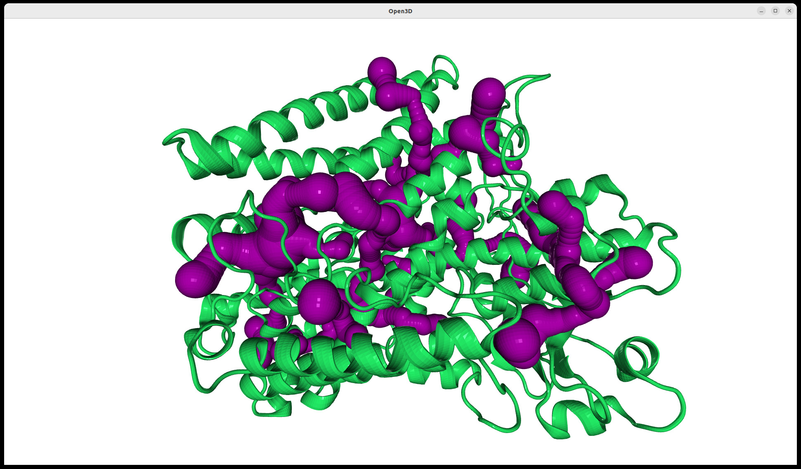

.. _cavitracer_single:

Detection of channels in molecular dynamics (MD) trajectory
===============================================================================

Analysis of the trajectory will be performed on a short MD trajectory
containing a few frames of simulation performed for 15-lipoxygenase from
P.aeruginosa (pLoxA). This protein contains 665 residues and a catalytic center
with iron. During the analysis, the metal center is ignored.

Before analyzing the trajectory, its need to be parsed (see more details
in `Trajectory tutorial`_).

.. ipython:: python
   :verbatim:

   PDBfile = 'pLoxA2.pdb'
   DCDfile = 'pLoxA2_ev5.dcd'
   atoms = parsePDB(PDBfile)
   dcd = Trajectory(DCDfile)
   dcd.link(atoms)
   dcd.setCoords(atoms)

.. parsed-literal::

   @> 10298 atoms and 1 coordinate set(s) were parsed in 0.11s.

To detect channels in MD trajectories, we need to use
:func:`.scalcChannelsMultipleFrames` function.

.. ipython:: python
   :verbatim:

   channels4, surfaces4=calcChannelsMultipleFrames(atoms, dcd, output_path = 'channels_pLoxA_dcd', separate=True)

.. parsed-literal::

   @> Frame: 0
   @> Detected 23 channels.
   @> Saving multiple results to directory ..
   @> Frame: 1
   @> Detected 21 channels.
   @> Saving multiple results to directory ..
   @> Frame: 2
   @> Detected 20 channels.
   @> Saving multiple results to directory ..
   @> Frame: 3
   @> Detected 17 channels.
   @> Saving multiple results to directory ..
   @> Frame: 4
   @> Detected 17 channels.
   @> Saving multiple results to directory ..  

To have access to a particular frame, we need to use :meth:`.getFrame`.
Below, we will select third frame from the simulation (counting from 0):

.. ipython:: python
   :verbatim:

   frame3 = dcd.getFrame(2)
   frame3

.. parsed-literal::

   <Frame: 2 from pLoxA2_ev5 (10298 atoms)>

.. ipython:: python
   :verbatim:

   getChannelResidueNames(frame3, channels4[1], residues_file_name='pLoxA_DCD_res')

.. parsed-literal::

   @> 10633 atoms and 1 coordinate set(s) were parsed in 0.10s.
   @> 10438 atoms and 1 coordinate set(s) were parsed in 0.09s.
   @> 10793 atoms and 1 coordinate set(s) were parsed in 0.10s.
   @> 10618 atoms and 1 coordinate set(s) were parsed in 0.09s.
   @> 10663 atoms and 1 coordinate set(s) were parsed in 0.10s.
   @> 10638 atoms and 1 coordinate set(s) were parsed in 0.10s.
   @> 10543 atoms and 1 coordinate set(s) were parsed in 0.10s.
   @> 10513 atoms and 1 coordinate set(s) were parsed in 0.10s.
   @> 10678 atoms and 1 coordinate set(s) were parsed in 0.10s.
   @> 10588 atoms and 1 coordinate set(s) were parsed in 0.10s.
   @> 10753 atoms and 1 coordinate set(s) were parsed in 0.10s.
   @> 10753 atoms and 1 coordinate set(s) were parsed in 0.11s.
   @> 10463 atoms and 1 coordinate set(s) were parsed in 0.11s.
   @> 10423 atoms and 1 coordinate set(s) were parsed in 0.10s.
   @> 10668 atoms and 1 coordinate set(s) were parsed in 0.11s.
   @> 10753 atoms and 1 coordinate set(s) were parsed in 0.10s.
   @> 10633 atoms and 1 coordinate set(s) were parsed in 0.10s.
   @> 10368 atoms and 1 coordinate set(s) were parsed in 0.10s.
   @> 10513 atoms and 1 coordinate set(s) were parsed in 0.10s.
   @> 10433 atoms and 1 coordinate set(s) were parsed in 0.10s.
   @> 10358 atoms and 1 coordinate set(s) were parsed in 0.09s.

   ['channel0: GLU223, VAL224, SER227, PHE228, ASP230, ASP231, GLU232, ALA233, PHE234, ALA235, TYR236, VAL239, TYR311, LEU319, ALA324, ARG325, LEU326, LEU327, GLN358, LYS361, THR362, GLN365, VAL366, LEU475, ASP477, TYR478, ALA569, PRO570, ALA571, ILE572, CYS573, SER576, TRP592, MET595, MET596, PRO597, ARG668, ARG669',
    'channel1: VAL224, SER227, PHE228, ARG229, ASP230, ASP231, PHE234, ALA235, TYR311, PRO328, ARG345, PRO346, ALA347, SER349, TYR354, TRP357, GLN358, LYS361, THR362, GLN365, VAL366, ALA569, PRO570, ALA571, ILE572, CYS573, SER576, TRP592, MET595, MET596, PRO597',
    'channel2: LEU221, PRO222, GLU223, VAL224, ASP226, SER227, PHE228, ASP230, ALA233, PHE234, TYR311, GLN358, LYS361, THR362, GLN365, VAL366, ALA569, PRO570, ALA571, ILE572, CYS573, SER576, TRP592, MET595, MET596, PRO597',
    'channel3: ASP104, THR381, HSD382, SER385, PHE388, THR392, HSE400, PRO401, LEU402, LEU405, LEU406, HSD409, PHE410, THR413, TRP494, ALA495, TYR498, VAL499, TYR502, TYR503, LEU515, TRP518, LEU540, VAL543, LEU544, VAL547, ILE548, THR550, ALA551, HSD555, PHE560, SER614, VAL615, TYR616, PRO680, SER682, THR683, ASN684, ILE685',
    'channel4: PHE83, LEU291, LEU294, ALA295, PRO296, SER297, GLY298, ALA299, PHE309, ALA310, TYR311, ALA312, GLY334, GLN335, HSD340, ASN370, TYR371, GLU373, MET374, PHE375, LEU378, THR381, HSD382, SER385, PHE388, THR392, HSE400, PRO401, LEU402, LEU405, LEU406, HSD409, PHE410, THR413, ILE416, ASN417, ALA420, LEU424, LEU425, ILE431, ALA437, THR442, GLN443, THR445, ALA446, TRP494, ALA495, TYR498, VAL499, TYR502, TYR503, LEU515, TRP518, LEU540, VAL543, LEU544, VAL547, ILE548, THR550, ALA551, HSD555, THR683, ASN684, ILE685',
    'channel5: ILE113, LEU116, PHE120, VAL189, LEU193, VAL200, GLN205, LEU209, THR381, HSD382, SER385, PHE388, THR392, HSE400, PRO401, LEU402, LEU405, LEU406, HSD409, PHE410, THR413, ILE416, ASN417, ALA420, ILE423, PHE430, TRP494, ALA495, TYR498, VAL499, TYR502, TYR503, LEU515, TRP518, LEU540, VAL543, LEU544, VAL547, ILE548, THR550, ALA551, HSD555, THR599, LEU600, LEU603, GLU604, ILE608, LEU611, LEU612, THR683, ASN684, ILE685',
    'channel6: PHE83, LEU291, LEU294, VAL300, LYS302, ASN370, TYR371, GLU373, MET374, PHE375, LEU378, THR381, HSD382, SER385, PHE388, THR392, HSE400, PRO401, LEU402, LEU405, LEU406, HSD409, PHE410, THR413, ILE416, ASN417, ALA420, LEU424, LEU425, ILE431, ASP432, PHE435, ALA436, ALA437, PRO438, ILE439, THR442, GLN443, THR445, ALA446, TRP494, ALA495, TYR498, VAL499, TYR502, TYR503, LEU515, TRP518, LEU540, VAL543, LEU544, VAL547, ILE548, THR550, ALA551, HSD555, THR683, ASN684, ILE685',
    'channel7: VAL95, LEU100, ILE179, LEU182, THR381, HSD382, SER385, PHE388, THR392, HSE400, PRO401, LEU402, LEU405, LEU406, HSD409, PHE410, THR413, PHE415, ILE416, ASN417, GLU418, GLY419, ALA420, ARG422, ILE423, TRP494, ALA495, TYR498, VAL499, TYR502, TYR503, LEU515, TRP518, LEU540, VAL543, LEU544, VAL547, ILE548, THR550, ALA551, HSD555, LEU612, THR683, ASN684, ILE685',
    'channel8: PHE83, GLY84, LEU378, THR381, HSD382, LEU383, SER385, GLU386, PHE388, THR392, HSE400, PRO401, LEU402, LEU405, LEU406, HSD409, PHE410, THR413, ILE416, ASN417, ALA420, ALA421, LEU424, LEU425, TRP494, ALA495, TYR498, VAL499, TYR502, TYR503, LEU515, TRP518, LEU540, VAL543, LEU544, VAL547, ILE548, THR550, ALA551, HSD555, THR683, ASN684, ILE685',
    'channel9: VAL112, ILE113, GLU115, LEU116, VAL118, ASN119, THR137, SER140, VAL189, THR381, HSD382, SER385, PHE388, THR392, HSE400, PRO401, LEU402, LEU405, LEU406, HSD409, PHE410, THR413, ILE416, ASN417, ALA420, ILE423, PHE430, TRP494, ALA495, TYR498, VAL499, TYR502, TYR503, LEU515, TRP518, LEU540, VAL543, LEU544, VAL547, ILE548, THR550, ALA551, HSD555, GLU604, ASN607, ILE608, LEU611, LEU612, THR683, ASN684, ILE685',
    'channel10: ILE113, LEU116, GLY186, LEU187, VAL189, ASP190, LEU193, THR381, HSD382, SER385, PHE388, THR392, HSE400, PRO401, LEU402, LEU405, LEU406, HSD409, PHE410, THR413, ILE416, ASN417, ALA420, ARG422, ILE423, ALA428, GLY429, PHE430, TRP494, ALA495, TYR498, VAL499, TYR502, TYR503, LEU515, TRP518, LEU540, VAL543, LEU544, VAL547, ILE548, THR550, ALA551, HSD555, LEU611, LEU612, THR683, ASN684, ILE685',
    'channel11: LEU245, GLN380, VAL384, SER385, PHE388, THR392, HSE400, PRO401, LEU402, LEU405, LEU406, HSD409, PHE410, PHE453, PHE455, GLY458, SER463, TRP494, ALA495, TYR498, VAL499, TYR502, TYR503, LEU515, TRP518, LEU540, VAL543, LEU544, MET546, VAL547, ILE548, THR550, ALA551, GLN554',
    'channel12: ALA33, ARG37, ALA41, GLY98, GLU99, LEU100, PHE171, THR172, GLN175, GLU411, TYR616, HSP617, GLY618, TYR623, ARG624, PRO680, ALA681, SER682, THR683, ASN684',
    'channel13: ASP104, LEU154, GLU411, TYR616, HSP617, GLY618, TYR623, ARG624, GLN625, THR626, GLY627, PHE628, PRO629, PRO680, ALA681, SER682, THR683, ASN684',
    'channel14: SER44, LEU49, GLU411, TYR616, HSP617, GLY618, TYR623, ARG624, PRO629, ALA631, PRO632, SER635, PRO680, ALA681, SER682, THR683, ASN684',
    'channel15: GLN36, ILE39, ASP40, PRO55, ARG66, ARG67, VAL69, LEU70, LYS73, GLU99, GLN393, THR395, LEU396, ALA397, PRO398, HSE403, ALA407, GLU411, ASP512, VAL513, GLU514, TYR616, HSP617, GLY618, TYR623, ARG624, VAL633, PRO680, ALA681, SER682, THR683, ASN684',
    'channel16: GLN36, ILE39, ASP40, VAL69, LYS73, GLU99, GLN393, ALA397, PRO398, HSE403, ALA407, GLU411, TYR616, HSP617, GLY618, TYR623, ARG624, VAL633, PRO680, ALA681, SER682, THR683, ASN684',
    'channel17: PHE212, ALA214, VAL215, PHE216, THR567, TYR568, ALA569, PRO570, ALA602, LEU603, LYS605, VAL606',
    'channel18: VAL487, ALA490, ILE491, ARG619, LEU620, GLY621, ASP622, PHE649, LEU653, LYS654, VAL656, PRO676, SER677, ILE679',
    'channel19: THR80, GLU81, ASN82, PHE83, VAL86, LYS87, GLY88, VAL89, PRO90, MET91, GLY447, GLY448, LEU451, LYS527']

To display the results for a particular frame, we need to create a model
using :func:`.getVmdModel` function and provide a path to VMD_.

.. ipython:: python
   :verbatim:

   vmd_path = '/usr/local/bin/vmd'
   model2_traj = getVmdModel(vmd_path, frame2)

.. parsed-literal::

   @> Model created successfully.

Once the model is created, the channels can be displayed together with the
protein structure using :func:`.showChannels`.

.. ipython:: python
   :verbatim:

   showChannels(channels4[2], model=model2_traj)

.. _Trajectory tutorial: http://www.bahargroup.org/prody/tutorials/trajectory_analysis/