.. _cavitracer_single:

I. Detection of channels in molecular dynamics (MD) trajectory
===============================================================================

Analysis of the trajectory will be performed on a short MD trajectory
containing over 200 frames of simulation performed for the vesicular monoamine 
transporter VMAT2. This protein contains 460 residues. During the analysis, 
only protein structure will be taken into consideration.

Before analyzing the trajectory, its need to be parsed (see more details
in `Trajectory tutorial`_).

.. ipython:: python
   :verbatim:

   PDBfile = 'caseStudy2.pdb'
   DCDfile = 'caseStudy2.dcd'
   atoms = parsePDB(PDBfile)
   dcd = Trajectory(DCDfile)
   dcd.link(atoms)
   dcd.setCoords(atoms)

.. parsed-literal::

   @> 56457 atoms and 1 coordinate set(s) were parsed in 0.69s.

To analyze only protein structure for the analysis, we will select protein
structure:

.. ipython:: python
   :verbatim:

   protein = atoms.select("protein")
   dcd.setAtoms(protein)

Next, to detect channels in MD trajectories, we need to use
:func:`.scalcChannelsMultipleFrames` function. To speed up the calculations,
``max_proc`` parameter can be set up to a higher number. In the example
below, we will use 4 processors to perform the calulations. The results will
saved with the prefix ``"chls_dcd"``, and all the channels will be storage
separately (``separate=True``). 

.. ipython:: python
   :verbatim:

   channels4, surfaces4=calcChannelsMultipleFrames(protein, dcd, 
		output_path='chls_dcd', separate=True, max_proc=4)

.. parsed-literal::

   @> Frame/model: 0
   @> Frame/model: 14
   @> Frame/model: 28
   @> Frame/model: 42
   @> The atoms supplied to calcChannels contain protein atoms only.
   @> The atoms supplied to calcChannels contain protein atoms only.
   @> The atoms supplied to calcChannels contain protein atoms only.
   @> The atoms supplied to calcChannels contain protein atoms only.
   @> Substituted 5986 atoms with 77434 homogeneous balls of radius 1.20 A in 0.29s.
   @> Substituted 5986 atoms with 77434 homogeneous balls of radius 1.20 A in 0.29s.
   @> Substituted 5986 atoms with 77434 homogeneous balls of radius 1.20 A in 0.30s.
   @> Substituted 5986 atoms with 77434 homogeneous balls of radius 1.20 A in 0.30s.
   @> Delaunay tessellation of 77434 points constructed in 4.00s.
   @> Delaunay tessellation of 77434 points constructed in 4.04s.
   @> Delaunay tessellation of 77434 points constructed in 4.10s.
   @> Delaunay tessellation of 77434 points constructed in 4.16s.
   @> Surface and inner simplices filtered in 3.77s.
   @> Surface and inner simplices filtered in 3.86s.
   @> Surface and inner simplices filtered in 3.97s.
   @> Surface and inner simplices filtered in 3.84s.
   @> 6 surface cavities detected and filtered in 0.55s.
   @> 7 surface cavities detected and filtered in 0.57s.
   @> 11 surface cavities detected and filtered in 0.55s.
   @> 12 surface cavities detected and filtered in 0.55s.
   @> Channel pathfinding (graph Dijkstra) over 7 cavities completed in 0.99s.
   @> Detected 25 channels.
   @> Saving multiple results to directory ..
   @> Channel calculation completed in 9.81s.
   @> Frame/model: 29
   @> The atoms supplied to calcChannels contain protein atoms only.
   @> Channel pathfinding (graph Dijkstra) over 11 cavities completed in 1.04s.
   @> Detected 20 channels.
   @> Saving multiple results to directory ..
   @> Channel calculation completed in 9.91s.
   @> Frame/model: 15
   ..
   ..
   @> Frame/model: 195
   @> The atoms supplied to calcChannels contain protein atoms only.
   @> Substituted 5986 atoms with 77434 homogeneous balls of radius 1.20 A in 0.31s.
   @> Surface and inner simplices filtered in 2.70s.
   @> 9 surface cavities detected and filtered in 0.55s.
   @> Delaunay tessellation of 77434 points constructed in 3.00s.
   @> Channel pathfinding (graph Dijkstra) over 9 cavities completed in 1.28s.
   @> Detected 30 channels.
   @> Saving multiple results to directory ..
   @> Channel calculation completed in 8.12s.
   @> Delaunay tessellation of 77434 points constructed in 3.24s.
   @> Surface and inner simplices filtered in 2.93s.
   @> Surface and inner simplices filtered in 2.69s.
   @> 9 surface cavities detected and filtered in 0.53s.
   @> 6 surface cavities detected and filtered in 0.50s.
   @> Channel pathfinding (graph Dijkstra) over 9 cavities completed in 1.43s.
   @> Detected 35 channels.
   @> Saving multiple results to directory ..
   @> Channel calculation completed in 8.31s.
   @> Channel pathfinding (graph Dijkstra) over 6 cavities completed in 2.36s.
   @> Detected 36 channels.
   @> Saving multiple results to directory ..
   @> Channel calculation completed in 9.20s.

All the details about the predicted channels can be displayed using
:func:`.getChannelParametersMultipleFrames`.

.. ipython:: python
   :verbatim:

   getChannelParametersMultipleFrames(channels4, param_file_name='DATA_chls_dcd')

.. parsed-literal::

   @> Frame/model: 0
   @> Channel ID: 	Volume [ų] 	Length [Å] 	Bottleneck [Å]
   @> channel 0: 	42.62 		5.23 		0.91
   @> channel 1: 	46.26 		6.49 		0.91
   @> channel 2: 	41.15 		6.61 		0.91
   @> channel 3: 	39.01 		6.52 		0.95
   @> channel 4: 	39.8 		6.83 		0.91
   @> channel 5: 	28.15 		6.23 		0.85
   @> channel 6: 	31.99 		7.13 		0.85
   @> channel 7: 	43.34 		9.08 		0.8
   @> channel 8: 	42.4 		10.06 		0.99
   @> channel 9: 	57.35 		10.05 		0.94
   @> channel 10: 	28.1 		7.24 		0.56
   @> channel 11: 	54.05 		11.69 		0.96
   @> channel 12: 	64.98 		12.59 		0.82
   @> channel 13: 	76.95 		14.62 		0.94
   @> channel 14: 	72.35 		14.99 		0.94
   @> channel 15: 	48.2 		12.18 		0.56
   @> channel 16: 	60.7 		15.73 		0.81
   @> channel 17: 	61.95 		17.84 		0.85
   @> channel 18: 	487.25 		46.63 		0.93
   @> channel 19: 	141.6 		27.14 		0.85
   @> channel 20: 	133.72 		26.46 		0.85
   @> channel 21: 	97.65 		20.64 		0.53
   @> channel 22: 	64.82 		18.52 		0.53
   @> channel 23: 	434.36 		46.08 		0.93
   @> channel 24: 	72.47 		19.67 		0.53
   @> channel 25: 	420.49 		52.08 		0.9
   @> channel 26: 	377.6 		51.75 		0.9
   @> channel 27: 	547.44 		62.65 		0.9
   @> channel 28: 	520.97 		61.04 		0.9
   @> channel 29: 	563.87 		65.18 		0.9
   @> channel 30: 	579.84 		66.15 		0.9
   @> channel 31: 	587.81 		66.92 		0.9
   @> Frame/model: 1
   @> Channel ID: 	Volume [ų] 	Length [Å] 	Bottleneck [Å]
   @> channel 0: 	25.35 		5.48 		0.88
   @> channel 1: 	33.95 		6.76 		0.9
   @> channel 2: 	39.95 		7.56 		0.89
   @> channel 3: 	23.72 		6.63 		0.87
   @> channel 4: 	36.81 		10.0 		0.9
   @> channel 5: 	80.37 		13.18 		0.79
   @> channel 6: 	52.55 		11.86 		0.9
   @> channel 7: 	49.69 		13.07 		0.79
   @> channel 8: 	75.65 		14.36 		0.64
   @> channel 9: 	108.27 		22.83 		0.88
   @> channel 10: 	96.26 		21.57 		0.78
   @> channel 11: 	69.35 		18.87 		0.58
   @> channel 12: 	42.33 		14.67 		0.5
   @> channel 13: 	136.31 		26.84 		0.84
   @> channel 14: 	127.65 		26.21 		0.84
   @> channel 15: 	517.36 		47.06 		0.81
   @> channel 16: 	136.2 		28.73 		0.81
   @> channel 17: 	455.47 		48.29 		0.81
   @> channel 18: 	110.0 		27.4 		0.59
   @> channel 19: 	355.87 		48.16 		0.81
   @> channel 20: 	308.57 		48.47 		0.81
   @> channel 21: 	464.03 		55.84 		0.81
   @> channel 22: 	498.0 		58.37 		0.81
   @> channel 23: 	489.61 		58.64 		0.81
   @> channel 24: 	506.86 		60.38 		0.81
   ..
   ..
   [([5.227329141803516,
      6.487400298449215,
      6.605144066108894,
      6.516275048865574,
      6.82887082510323,
      6.225022727043587,
      7.130896203430573,
      9.0820395745718,
      10.055076137621302,
      10.046965975880378,
      7.2448800420085835,
      11.685716270931396,
      12.588204876727449,
      14.615599846655114,
      14.987739219808653,
      12.177197068381641,
      15.728096263328084,
      17.83669237347921,
      46.63095154889754,
      27.14201931744085,
      26.46087867366709,
      20.638332276673168,
      18.520993854173597,
      46.07627263551035,
      19.666847649036676,
      52.08168239809312,
      51.754432428231695,
      62.65440497610238,
      61.038934300273354,
      65.17632012481089,
      66.14572267592729,
      66.91973888604468],
     [0.9062093848777095,
      0.9062093848777095,
      0.9091246523541974,
      0.9466973308923545,
      0.9062093848777095,
      0.8450995780137116,
      0.8450995780137116,
      0.7964742507765301,
      0.9877666026933867,
      0.9440099272394715,
      0.5627200930417462,
      0.9580799362892518,
      0.8168412673605527,
      0.9368914605676404,
      0.9368914605676404,
      0.5634107045739882,
      0.8126297939221512,
      0.8458444201300528,
      0.9288219861959515,
      0.8471905678106821,
      0.8471905678106821,
      0.5336380547900532,
      0.5336380547900532,
      0.9288219861959515,
      0.5336380547900532,
      0.8980676489273869,
      0.8980676489273869,
      0.8980374597036274,
      0.8980374597036274,
      0.8980374597036274,
      0.8980374597036274,
      0.8980374597036274],
      ..
      ..
     [33.93878201451358,
      53.57138814058363,
      51.65102405007965,
      60.40988921509134,
      93.47767217117577,
      153.06628278359594,
      65.78081695746604,
      188.95516489959445,
      160.83223704342512,
      174.62962363999816,
      62.95855748022218,
      71.36168073076173,
      140.79568166555896,
      68.43219227709203,
      114.26271670969929,
      746.4890229908065,
      784.8926565168398,
      699.5382690630242,
      770.3751166765595,
      805.863155925841,
      695.3510801096598,
      767.8987104643048,
      621.7119196863381,
      797.251345235155,
      694.1672952596066,
      820.4920143280556,
      749.9826774750843,
      758.222986561308,
      788.8971708945872,
      539.6884081368177,
      794.5395102358551,
      537.7938757590493,
      473.89250290133845,
      371.30162647018585,
      383.5343643574686,
      381.43842455263564,
      324.36179374323757])]

Assigning the function's output to the ``results`` variable grants access 
to these parameters, as shown below.

.. ipython:: python
   :verbatim:

   results = getChannelParametersMultipleFrames(channels4)

.. parsed-literal::

   @> Frame/model: 0
   @> Channel ID: 	Volume [ų] 	Length [Å] 	Bottleneck [Å]
   @> channel 0: 	42.62 		5.23 		0.91
   @> channel 1: 	46.26 		6.49 		0.91
   @> channel 2: 	41.15 		6.61 		0.91
   @> channel 3: 	39.01 		6.52 		0.95
   @> channel 4: 	39.8 		6.83 		0.91
   @> channel 5: 	28.15 		6.23 		0.85
   @> channel 6: 	31.99 		7.13 		0.85
   @> channel 7: 	43.34 		9.08 		0.8
   @> channel 8: 	42.4 		10.06 		0.99
   @> channel 9: 	57.35 		10.05 		0.94
   @> channel 10: 	28.1 		7.24 		0.56
   @> channel 11: 	54.05 		11.69 		0.96
   @> channel 12: 	64.98 		12.59 		0.82
   @> channel 13: 	76.95 		14.62 		0.94
   @> channel 14: 	72.35 		14.99 		0.94
   @> channel 15: 	48.2 		12.18 		0.56
   @> channel 16: 	60.7 		15.73 		0.81
   @> channel 17: 	61.95 		17.84 		0.85
   @> channel 18: 	487.25 		46.63 		0.93
   @> channel 19: 	141.6 		27.14 		0.85
   @> channel 20: 	133.72 		26.46 		0.85
   @> channel 21: 	97.65 		20.64 		0.53
   @> channel 22: 	64.82 		18.52 		0.53
   @> channel 23: 	434.36 		46.08 		0.93
   @> channel 24: 	72.47 		19.67 		0.53
   @> channel 25: 	420.49 		52.08 		0.9
   @> channel 26: 	377.6 		51.75 		0.9
   @> channel 27: 	547.44 		62.65 		0.9
   @> channel 28: 	520.97 		61.04 		0.9
   @> channel 29: 	563.87 		65.18 		0.9
   @> channel 30: 	579.84 		66.15 		0.9
   @> channel 31: 	587.81 		66.92 		0.9
   @> Frame/model: 1
   @> Channel ID: 	Volume [ų] 	Length [Å] 	Bottleneck [Å]
   @> channel 0: 	25.35 		5.48 		0.88
   @> channel 1: 	33.95 		6.76 		0.9
   @> channel 2: 	39.95 		7.56 		0.89
   @> channel 3: 	23.72 		6.63 		0.87
   @> channel 4: 	36.81 		10.0 		0.9
   @> channel 5: 	80.37 		13.18 		0.79
   @> channel 6: 	52.55 		11.86 		0.9
   @> channel 7: 	49.69 		13.07 		0.79
   @> channel 8: 	75.65 		14.36 		0.64
   @> channel 9: 	108.27 		22.83 		0.88
   @> channel 10: 	96.26 		21.57 		0.78
   @> channel 11: 	69.35 		18.87 		0.58
   @> channel 12: 	42.33 		14.67 		0.5
   @> channel 13: 	136.31 		26.84 		0.84
   @> channel 14: 	127.65 		26.21 		0.84
   @> channel 15: 	517.36 		47.06 		0.81
   @> channel 16: 	136.2 		28.73 		0.81
   @> channel 17: 	455.47 		48.29 		0.81
   @> channel 18: 	110.0 		27.4 		0.59
   @> channel 19: 	355.87 		48.16 		0.81
   @> channel 20: 	308.57 		48.47 		0.81
   @> channel 21: 	464.03 		55.84 		0.81
   @> channel 22: 	498.0 		58.37 		0.81
   @> channel 23: 	489.61 		58.64 		0.81
   @> channel 24: 	506.86 		60.38 		0.81
   ..
   ..
   @> Frame/model: 210
   @> Channel ID: 	Volume [ų] 	Length [Å] 	Bottleneck [Å]
   @> channel 0: 	33.94 		5.84 		0.91
   @> channel 1: 	53.57 		6.06 		0.9
   @> channel 2: 	51.65 		8.36 		0.92
   @> channel 3: 	60.41 		10.15 		0.9
   @> channel 4: 	93.48 		14.96 		0.9
   @> channel 5: 	153.07 		20.89 		0.85
   @> channel 6: 	65.78 		15.06 		0.78
   @> channel 7: 	188.96 		22.78 		0.85
   @> channel 8: 	160.83 		22.3 		0.85
   @> channel 9: 	174.63 		23.52 		0.85
   @> channel 10: 	62.96 		15.47 		0.8
   @> channel 11: 	71.36 		16.67 		0.78
   @> channel 12: 	140.8 		23.1 		0.85
   @> channel 13: 	68.43 		16.98 		0.8
   @> channel 14: 	114.26 		26.12 		0.75
   @> channel 15: 	746.49 		56.91 		0.82
   @> channel 16: 	784.89 		59.45 		0.82
   @> channel 17: 	699.54 		57.48 		0.82
   @> channel 18: 	770.38 		59.6 		0.82
   @> channel 19: 	805.86 		61.61 		0.82
   @> channel 20: 	695.35 		58.25 		0.82
   @> channel 21: 	767.9 		61.46 		0.82
   @> channel 22: 	621.71 		56.17 		0.82
   @> channel 23: 	797.25 		63.75 		0.82
   @> channel 24: 	694.17 		58.74 		0.82
   @> channel 25: 	820.49 		65.8 		0.82
   @> channel 26: 	749.98 		61.69 		0.82
   @> channel 27: 	758.22 		61.31 		0.81
   @> channel 28: 	788.9 		64.56 		0.82
   @> channel 29: 	539.69 		56.59 		0.82
   @> channel 30: 	794.54 		68.51 		0.82
   @> channel 31: 	537.79 		57.32 		0.82
   @> channel 32: 	473.89 		53.43 		0.73
   @> channel 33: 	371.3 		55.49 		0.82
   @> channel 34: 	383.53 		57.85 		0.82
   @> channel 35: 	381.44 		57.9 		0.82
   @> channel 36: 	324.36 		53.64 		0.64

Results for the first frame in the trajectory:

.. ipython:: python
   :verbatim:

   results[0]

.. parsed-literal::

   ([5.227329141803516,
     6.487400298449215,
     6.605144066108894,
     6.516275048865574,
     6.82887082510323,
     6.225022727043587,
     7.130896203430573,
     9.0820395745718,
     10.055076137621302,
     10.046965975880378,
     7.2448800420085835,
     11.685716270931396,
     12.588204876727449,
     14.615599846655114,
     14.987739219808653,
     12.177197068381641,
     15.728096263328084,
     17.83669237347921,
     46.63095154889754,
     27.14201931744085,
     26.46087867366709,
     20.638332276673168,
     18.520993854173597,
     46.07627263551035,
     19.666847649036676,
     52.08168239809312,
     51.754432428231695,
     62.65440497610238,
     61.038934300273354,
     65.17632012481089,
     66.14572267592729,
     66.91973888604468],
    [0.9062093848777095,
     0.9062093848777095,
     0.9091246523541974,
     0.9466973308923545,
     0.9062093848777095,
     0.8450995780137116,
     0.8450995780137116,
     0.7964742507765301,
     0.9877666026933867,
     0.9440099272394715,
     0.5627200930417462,
     0.9580799362892518,
     0.8168412673605527,
     0.9368914605676404,
     0.9368914605676404,
     0.5634107045739882,
     0.8126297939221512,
     0.8458444201300528,
     0.9288219861959515,
     0.8471905678106821,
     0.8471905678106821,
     0.5336380547900532,
     0.5336380547900532,
     0.9288219861959515,
     0.5336380547900532,
     0.8980676489273869,
     0.8980676489273869,
     0.8980374597036274,
     0.8980374597036274,
     0.8980374597036274,
     0.8980374597036274,
     0.8980374597036274],
    [42.618844639015094,
     46.26452069417938,
     41.145690082853065,
     39.00955277636218,
     39.7986371406858,
     28.151929526035254,
     31.988857209237942,
     43.33960313799116,
     42.39734128980631,
     57.34659622602214,
     28.095445326847372,
     54.05182624768031,
     64.97821132673613,
     76.94831436706494,
     72.34929204813164,
     48.195036012352446,
     60.699269451579816,
     61.954394708434094,
     487.24788755195357,
     141.60215966117727,
     133.71951470120246,
     97.64763069231812,
     64.81924213531595,
     434.36430272846616,
     72.47178046077198,
     420.49095799060683,
     377.5965996540025,
     547.4403640282828,
     520.965184770951,
     563.8703645100817,
     579.8383939046562,
     587.8109741174737])

To obtain information about the lengths of the channels detected in the 
first frame in the trajectory (#0):

.. ipython:: python
   :verbatim:

   results[0][0]

.. parsed-literal::

   [5.227329141803516,
    6.487400298449215,
    6.605144066108894,
    6.516275048865574,
    6.82887082510323,
    6.225022727043587,
    7.130896203430573,
    9.0820395745718,
    10.055076137621302,
    10.046965975880378,
    7.2448800420085835,
    11.685716270931396,
    12.588204876727449,
    14.615599846655114,
    14.987739219808653,
    12.177197068381641,
    15.728096263328084,
    17.83669237347921,
    46.63095154889754,
    27.14201931744085,
    26.46087867366709,
    20.638332276673168,
    18.520993854173597,
    46.07627263551035,
    19.666847649036676,
    52.08168239809312,
    51.754432428231695,
    62.65440497610238,
    61.038934300273354,
    65.17632012481089,
    66.14572267592729,
    66.91973888604468]

Bottlenecks of the channels in the first frame in the trajectory (#0):

.. ipython:: python
   :verbatim:

   results[0][1]

.. parsed-literal::

   [0.9062093848777095,
    0.9062093848777095,
    0.9091246523541974,
    0.9466973308923545,
    0.9062093848777095,
    0.8450995780137116,
    0.8450995780137116,
    0.7964742507765301,
    0.9877666026933867,
    0.9440099272394715,
    0.5627200930417462,
    0.9580799362892518,
    0.8168412673605527,
    0.9368914605676404,
    0.9368914605676404,
    0.5634107045739882,
    0.8126297939221512,
    0.8458444201300528,
    0.9288219861959515,
    0.8471905678106821,
    0.8471905678106821,
    0.5336380547900532,
    0.5336380547900532,
    0.9288219861959515,
    0.5336380547900532,
    0.8980676489273869,
    0.8980676489273869,
    0.8980374597036274,
    0.8980374597036274,
    0.8980374597036274,
    0.8980374597036274,
    0.8980374597036274]

Volume of the channels detected in the first frame in the trajectory:

.. ipython:: python
   :verbatim:

   results[0][2]

.. parsed-literal::

   [42.618844639015094,
    46.26452069417938,
    41.145690082853065,
    39.00955277636218,
    39.7986371406858,
    28.151929526035254,
    31.988857209237942,
    43.33960313799116,
    42.39734128980631,
    57.34659622602214,
    28.095445326847372,
    54.05182624768031,
    64.97821132673613,
    76.94831436706494,
    72.34929204813164,
    48.195036012352446,
    60.699269451579816,
    61.954394708434094,
    487.24788755195357,
    141.60215966117727,
    133.71951470120246,
    97.64763069231812,
    64.81924213531595,
    434.36430272846616,
    72.47178046077198,
    420.49095799060683,
    377.5965996540025,
    547.4403640282828,
    520.965184770951,
    563.8703645100817,
    579.8383939046562,
    587.8109741174737]

Once we have access to ``results``, we can display bottleneck data for all
the channels in the following way:

.. ipython:: python
   :verbatim:

   import matplotlib.pylab as plt
   all_Bottleneck = []
   for nr_i,i in enumerate(results):
      all_Bottleneck.extend(results[nr_i][1])

   plt.hist(all_Bottleneck)
   plt.show()

.. parsed-literal::

   (array([  15.,   20.,   68.,  105.,  186.,  475., 1295., 3483.,  953.,
             43.]),
    array([0.10125895, 0.20444863, 0.30763831, 0.410828  , 0.51401768,
           0.61720736, 0.72039704, 0.82358673, 0.92677641, 1.02996609,
           1.13315577]),
    <BarContainer object of 10 artists>)

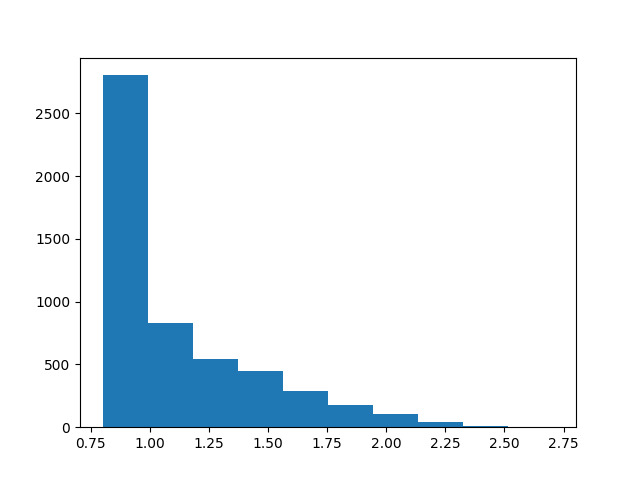

To obtain information about all residues that are participating in the
formation of channels, use :func:.`getChannelResidueNamesMultipleFrames`.
It may take some time because each channel is mapped to a particular
protein structure. Therefore, if only a paricualar region is interested for
us, we first might apply filtering of the channels which is described below.

.. ipython:: python
   :verbatim:

   residuesALL = getChannelResidueNamesMultipleFrames(protein, 
					channels4, dcd, 
					residues_file_name='DCD_res_ALL')

.. parsed-literal::

   @> Frame: 0
   @> Channel residues were saved to: DCD_res_ALL_frame0_Residues_All_channels.txt
   @> Frame: 1
   @> Channel residues were saved to: DCD_res_ALL_frame1_Residues_All_channels.txt
   @> Frame: 2
   @> Channel residues were saved to: DCD_res_ALL_frame2_Residues_All_channels.txt
   @> Frame: 3
   @> Channel residues were saved to: DCD_res_ALL_frame3_Residues_All_channels.txt
   @> Frame: 4
   @> Channel residues were saved to: DCD_res_ALL_frame4_Residues_All_channels.txt
   @> Frame: 5
   @> Channel residues were saved to: DCD_res_ALL_frame5_Residues_All_channels.txt
   @> Frame: 6
   @> Channel residues were saved to: DCD_res_ALL_frame6_Residues_All_channels.txt
   @> Frame: 7
   @> Channel residues were saved to: DCD_res_ALL_frame7_Residues_All_channels.txt
   @> Frame: 8
   @> Channel residues were saved to: DCD_res_ALL_frame8_Residues_All_channels.txt
   @> Frame: 9
   @> Channel residues were saved to: DCD_res_ALL_frame9_Residues_All_channels.txt
   @> Frame: 10
   @> Channel residues were saved to: DCD_res_ALL_frame10_Residues_All_channels.txt
   ..
   ..
   @> Frame: 208
   @> Channel residues were saved to: DCD_res_ALL_frame208_Residues_All_channels.txt
   @> Frame: 209
   @> Channel residues were saved to: DCD_res_ALL_frame209_Residues_All_channels.txt
   @> Frame: 210
   @> Channel residues were saved to: DCD_res_ALL_frame210_Residues_All_channels.txt

To have access to a particular frame, we need to use :meth:`.getFrame`.
Below, we will select third frame from the simulation (counting from 0):

.. ipython:: python
   :verbatim:

   frame3 = dcd.getFrame(2)
   frame3

.. parsed-literal::

   <Frame: 2 from caseStudy2 (selected 5986 of 56457 atoms)>

To obtain infromation about residues for a particular frame, the following
operations should be performed:

.. ipython:: python
   :verbatim:

   protein_frame3 = protein.copy()
   protein_frame3.setCoords(frame3.getCoords())

.. ipython:: python
   :verbatim:

   getChannelResidueNames(protein_frame3, channels4[2], 
				residues_file_name='DCD_fr3_res')

.. parsed-literal::

   ['channel0: MET310:P, ALA444:P, PHE449:P, LEU452:P, MET453:P, ILE456:P',
    'channel1: ASP214:P, ARG217:P, MET221:P, PRO404:P, GLY407:P, TYR408:P, ASP411:P, TYR422:P',
    'channel2: ARG19:P, TYR211:P, THR212:P, ASP213:P, GLU216:P, ARG217:P',
    'channel3: ASP214:P, TYR293:P, HSP353:P, GLY356:P, ARG357:P, TRP358:P, ILE405:P, TYR408:P, LEU409:P, PHE469:P, LEU470:P, ARG471:P, PRO473:P',
    'channel4: LEU285:P, LEU288:P, LEU289:P, ILE294:P, SER420:P, VAL421:P, ALA423:P, ILE424:P, VAL427:P',
    'channel5: TYR293:P, ILE405:P, TYR408:P, LEU409:P, PHE469:P, LEU470:P, ARG471:P, SER472:P, PRO473:P',
    'channel6: MET310:P, ALA444:P, PHE449:P, LEU452:P, MET453:P, ILE456:P',
    'channel7: LEU288:P, LEU289:P, ASP291:P, ILE294:P, LEU295:P, ALA298:P, ILE424:P',
    'channel8: LEU151:P, ASN154:P, LYS281:P, GLY282:P, THR283:P, PRO284:P, LEU288:P, VAL410:P, VAL417:P, TYR418:P, SER420:P, VAL421:P',
    'channel9: PHE303:P, ALA304:P, GLY364:P, MET365:P, VAL368:P, ALA394:P, ILE395:P, MET397:P, VAL398:P, ILE459:P, ASP460:P, PHE463:P',
    'channel10: PHE303:P, ALA304:P, GLY364:P, MET365:P, VAL368:P, ALA394:P, ILE395:P, MET397:P, VAL398:P, ILE459:P, ASP460:P, LEU462:P, PHE463:P',
    'channel11: MET204:P, GLY218:P, MET221:P, GLY222:P, LEU225:P, GLY349:P, ALA352:P, HSP353:P, LYS354:P, GLY356:P, ARG357:P, LEU359:P, CYS360:P, LEU363:P, ASP399:P, SER400:P, SER401:P, MET403:P, PRO404:P',
    'channel12: LEU30:P, ASP33:P, ASN34:P, LEU37:P, THR38:P, PHE135:P, LYS138:P, GLN142:P, SER196:P, SER200:P, LEU225:P, LEU228:P, VAL232:P, ALA297:P, ILE301:P, ILE308:P, GLU312:P, LEU315:P, ILE317:P, GLN329:P, VAL332:P, ALA333:P, PHE334:P, PRO336:P, ALA337:P, TYR341:P, ILE381:P, ILE385:P, ASN388:P, ASP399:P, MET402:P, MET403:P, MET406:P, ALA425:P, ASP426:P, PHE429:P, TYR433:P',
    'channel13: LEU30:P, ASP33:P, ASN34:P, LEU37:P, THR38:P, PHE135:P, LYS138:P, GLN142:P, SER196:P, SER200:P, LEU225:P, LEU228:P, VAL232:P, ALA297:P, ILE301:P, ILE308:P, GLU312:P, LEU315:P, ILE317:P, GLN329:P, ALA333:P, PHE334:P, PRO336:P, ALA337:P, TYR341:P, ILE381:P, TYR382:P, ILE385:P, ASN388:P, ASP399:P, MET402:P, MET403:P, MET406:P, ALA425:P, ASP426:P, PHE429:P, TYR433:P',
    'channel14: LEU30:P, ASP33:P, ASN34:P, LEU37:P, THR38:P, PHE135:P, LYS138:P, GLN142:P, SER196:P, SER200:P, LEU225:P, LEU228:P, VAL232:P, ALA297:P, ILE301:P, ILE308:P, GLU312:P, LEU315:P, ILE317:P, VAL332:P, ALA333:P, PHE334:P, PRO336:P, ALA337:P, TYR341:P, ILE381:P, ILE385:P, ASN388:P, ASP399:P, MET402:P, MET403:P, MET406:P, ALA425:P, ASP426:P, PHE429:P, TYR433:P',
    'channel15: ASP33:P, ASN34:P, LEU37:P, THR38:P, PHE135:P, LYS138:P, GLN142:P, SER196:P, SER200:P, LEU225:P, LEU228:P, VAL232:P, ALA297:P, ILE301:P, ILE308:P, GLU312:P, LEU315:P, PRO316:P, ILE317:P, ARG326:P, GLN329:P, ALA333:P, PHE334:P, PRO336:P, ALA337:P, TYR341:P, ILE381:P, ILE385:P, ASN388:P, ASP399:P, MET402:P, MET403:P, MET406:P, ALA425:P, ASP426:P, PHE429:P, TYR433:P',
    'channel16: ASP33:P, ASN34:P, LEU37:P, THR38:P, PHE135:P, LYS138:P, GLN142:P, SER196:P, SER200:P, LEU225:P, LEU228:P, VAL232:P, ALA297:P, ILE301:P, ILE308:P, GLU312:P, LEU315:P, PRO316:P, ILE317:P, ARG326:P, GLN329:P, ALA333:P, PHE334:P, PRO336:P, ALA337:P, TYR341:P, ILE381:P, TYR382:P, ILE385:P, ASN388:P, ASP399:P, MET402:P, MET403:P, MET406:P, ALA425:P, ASP426:P, PHE429:P, TYR433:P',
    'channel17: ASP33:P, ASN34:P, LEU37:P, THR38:P, PHE135:P, LYS138:P, GLN142:P, SER196:P, SER200:P, LEU225:P, LEU228:P, VAL232:P, ALA297:P, ILE301:P, ILE308:P, GLU312:P, LEU315:P, PRO316:P, ILE317:P, ARG326:P, GLN329:P, ALA333:P, PHE334:P, PRO336:P, ALA337:P, TYR341:P, ILE381:P, ILE385:P, ASN388:P, ASP399:P, MET402:P, MET403:P, MET406:P, ALA425:P, ASP426:P, PHE429:P, TYR433:P',
    'channel18: ASP33:P, ASN34:P, LEU37:P, THR38:P, PHE135:P, LYS138:P, GLN142:P, SER196:P, SER200:P, LEU225:P, LEU228:P, VAL232:P, ALA297:P, ILE301:P, ILE308:P, GLU312:P, LEU315:P, PRO316:P, ILE317:P, MET319:P, GLU321:P, THR322:P, ARG326:P, GLN329:P, ALA333:P, PHE334:P, PRO336:P, ALA337:P, TYR341:P, ILE381:P, ILE385:P, ASN388:P, ASP399:P, MET402:P, MET403:P, MET406:P, ALA425:P, ASP426:P, PHE429:P, TYR433:P',
    'channel19: ASP33:P, ASN34:P, LEU37:P, THR38:P, VAL40:P, VAL41:P, PRO42:P, ILE44:P, PHE135:P, LYS138:P, GLN142:P, ARG189:P, SER196:P, SER200:P, LEU225:P, LEU228:P, VAL232:P, PRO236:P, SER240:P, ALA297:P, ILE301:P, ILE308:P, GLU312:P, ILE317:P, TRP318:P, LYS327:P, TRP328:P, LEU330:P, GLY331:P, ALA333:P, PHE334:P, TYR341:P, ASP399:P, MET402:P, MET403:P, MET406:P, ALA425:P, ASP426:P, PHE429:P, TYR433:P',
    'channel20: ASP33:P, ASN34:P, LEU37:P, THR38:P, VAL40:P, VAL41:P, PRO42:P, ILE44:P, PHE135:P, LYS138:P, GLN142:P, ARG189:P, SER196:P, SER200:P, LEU225:P, LEU228:P, VAL232:P, PRO236:P, SER240:P, TYR243:P, GLU244:P, ALA297:P, ILE301:P, ILE308:P, GLU312:P, ILE317:P, TRP318:P, LYS327:P, TRP328:P, LEU330:P, GLY331:P, ALA333:P, PHE334:P, TYR341:P, ASP399:P, MET402:P, MET403:P, MET406:P, ALA425:P, ASP426:P, PHE429:P, TYR433:P',
    'channel21: ASP33:P, ASN34:P, LEU37:P, THR38:P, VAL40:P, VAL41:P, PRO42:P, ILE44:P, PHE135:P, LYS138:P, GLN142:P, ARG189:P, SER196:P, SER200:P, LEU225:P, LEU228:P, VAL232:P, PRO236:P, SER240:P, TYR243:P, GLU244:P, ALA297:P, ILE301:P, ILE308:P, GLU312:P, ILE317:P, TRP318:P, LYS327:P, LEU330:P, GLY331:P, ALA333:P, PHE334:P, TYR341:P, ASP399:P, MET402:P, MET403:P, MET406:P, ALA425:P, ASP426:P, PHE429:P, TYR433:P',
    'channel22: ASP33:P, ASN34:P, LEU37:P, THR38:P, VAL40:P, VAL41:P, PRO42:P, ILE44:P, PRO45:P, PHE135:P, LYS138:P, GLN142:P, ARG189:P, SER196:P, SER200:P, LEU225:P, LEU228:P, VAL232:P, PRO236:P, SER240:P, TYR243:P, ALA297:P, ILE301:P, ILE308:P, GLU312:P, ILE317:P, TRP318:P, LYS327:P, LEU330:P, GLY331:P, ALA333:P, PHE334:P, TYR341:P, ASP399:P, MET402:P, MET403:P, MET406:P, ALA425:P, ASP426:P, PHE429:P, TYR433:P',
    'channel23: ASP33:P, ASN34:P, LEU37:P, THR38:P, VAL40:P, VAL41:P, PRO42:P, ILE44:P, PRO45:P, PHE135:P, LYS138:P, GLN142:P, ARG189:P, SER196:P, SER200:P, LEU225:P, LEU228:P, VAL232:P, PRO236:P, SER240:P, TYR243:P, ALA297:P, ILE301:P, ILE308:P, GLU312:P, ILE317:P, TRP318:P, MET323:P, LYS327:P, LEU330:P, GLY331:P, ALA333:P, PHE334:P, TYR341:P, ASP399:P, MET402:P, MET403:P, MET406:P, ALA425:P, ASP426:P, PHE429:P, TYR433:P',
    'channel24: ASP33:P, ASN34:P, LEU37:P, THR38:P, PHE135:P, LYS138:P, GLN142:P, SER196:P, SER200:P, LEU225:P, LEU228:P, VAL232:P, ALA297:P, ILE301:P, ILE308:P, LEU311:P, GLU312:P, LEU315:P, ALA333:P, PHE334:P, ALA337:P, TYR341:P, SER371:P, ILE372:P, LEU373:P, ILE375:P, PRO376:P, LEU384:P, ILE385:P, PRO387:P, ASN388:P, ASP399:P, MET402:P, MET403:P, MET406:P, ALA425:P, ASP426:P, PHE429:P, TYR433:P, PRO450:P, TRP451:P, MET453:P, THR454:P',
    'channel25: ASP33:P, ASN34:P, LEU37:P, THR38:P, PHE135:P, LYS138:P, GLN142:P, SER196:P, SER200:P, LEU225:P, LEU228:P, VAL232:P, ALA297:P, ILE301:P, PHE303:P, ALA304:P, MET306:P, GLY307:P, ILE308:P, LEU311:P, GLU312:P, LEU315:P, ALA333:P, PHE334:P, ALA337:P, TYR341:P, VAL368:P, ILE372:P, LEU384:P, ILE385:P, PRO387:P, ASN388:P, VAL391:P, ILE395:P, ASP399:P, MET402:P, MET403:P, MET406:P, ALA425:P, ASP426:P, PHE429:P, TYR433:P, ILE456:P, ILE459:P, ASP460:P',
    'channel26: ASP33:P, ASN34:P, LEU37:P, THR38:P, LYS122:P, PHE135:P, LYS138:P, GLN142:P, SER196:P, SER200:P, LEU225:P, LEU228:P, VAL232:P, ALA297:P, ILE301:P, ILE308:P, LEU311:P, GLU312:P, LEU315:P, ALA333:P, PHE334:P, ALA337:P, TYR341:P, SER371:P, ILE372:P, LEU373:P, ILE375:P, PRO376:P, LYS379:P, LEU384:P, ILE385:P, PRO387:P, ASN388:P, ASP399:P, MET402:P, MET403:P, MET406:P, ALA425:P, ASP426:P, PHE429:P, TYR433:P, PRO450:P, MET453:P, THR454:P',
    'channel27: ASP33:P, ASN34:P, LEU37:P, THR38:P, LYS122:P, PHE135:P, LYS138:P, GLN142:P, SER196:P, SER200:P, LEU225:P, LEU228:P, VAL232:P, ALA297:P, ILE301:P, ILE308:P, LEU311:P, GLU312:P, LEU315:P, ALA333:P, PHE334:P, ALA337:P, TYR341:P, SER371:P, ILE372:P, LEU373:P, ILE375:P, PRO376:P, LEU384:P, ILE385:P, PRO387:P, ASN388:P, ASP399:P, MET402:P, MET403:P, MET406:P, ALA425:P, ASP426:P, PHE429:P, TYR433:P, PRO450:P, MET453:P, THR454:P']

To display the results for a particular frame, we need to create a model
using :func:`.getVmdModel` function and provide a path to VMD_.

.. ipython:: python
   :verbatim:

   vmd_path = '/usr/local/bin/vmd'
   model3_traj = getVmdModel(vmd_path, frame3)

.. parsed-literal::

   @> Model created successfully.

Once the model is created, the channels can be displayed together with the
protein structure using :func:`.showChannels`.

.. ipython:: python
   :verbatim:

   showChannels(channels4[2], model=model3_traj)

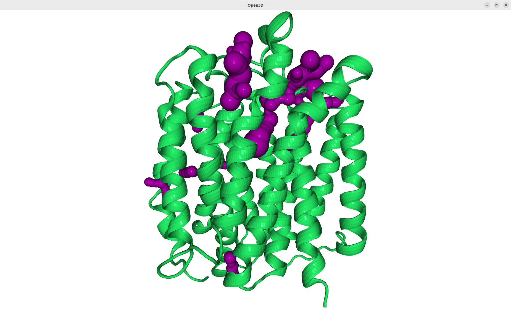

To select channels with particular localization, we can further use
:func:`.selectChannelBySelection` function and specify which region will be
analyzed, for example, using residues, as shown below. In the example, we
are selecting channels that are generated from MD trajectory using
``"chls_dcd*_chl*.pqr"`` pattern. List with ``pqr`` files
called ``pqr_files_channels`` is further use by
:func:`.selectChannelBySelection`.

.. ipython:: python
   :verbatim:
   
   from pathlib import Path
   pqr_files_channels = [i.name for i in Path(".").glob("chls_dcd*_chl*.pqr") if i.is_file()]
   pqr_files_channels

.. parsed-literal::

   ['chls_dcd118_chl19.pqr',
    'chls_dcd185_chl31.pqr',
    'chls_dcd13_chl10.pqr',
    'chls_dcd186_chl16.pqr',
    'chls_dcd47_chl16.pqr',
    'chls_dcd3_chl27.pqr',
    'chls_dcd184_chl18.pqr',
    'chls_dcd52_chl21.pqr',
    'chls_dcd174_chl5.pqr',
    'chls_dcd16_chl17.pqr',
    'chls_dcd163_chl24.pqr',
    'chls_dcd173_chl11.pqr',
    'chls_dcd204_chl6.pqr',
    'chls_dcd63_chl39.pqr',
    'chls_dcd183_chl4.pqr',
    ..
    'chls_dcd90_chl11.pqr',
    'chls_dcd124_chl18.pqr',
    'chls_dcd145_chl19.pqr',
    'chls_dcd22_chl7.pqr',
    'chls_dcd125_chl14.pqr',
    'chls_dcd46_chl12.pqr',
    'chls_dcd29_chl35.pqr',
    'chls_dcd12_chl9.pqr',
    ...]

.. ipython:: python
   :verbatim:

   selectChannelBySelection(atoms, pqr_files=pqr_files_channels, 
			residue_sele='resid 135 37 and backbone', 
                        folder_name="Selected_channel1", 
			distA=4.0)

.. parsed-literal::

   @> 390 atoms and 1 coordinate sets were parsed in 0.01s.
   @> 455 atoms and 1 coordinate sets were parsed in 0.01s.
   @> 105 atoms and 1 coordinate sets were parsed in 0.00s.
   @> 325 atoms and 1 coordinate sets were parsed in 0.01s.
   @> 115 atoms and 1 coordinate sets were parsed in 0.00s.
   @> 455 atoms and 1 coordinate sets were parsed in 0.01s.
   @> Filtered files are now in: Selected_channel1
   @> 410 atoms and 1 coordinate sets were parsed in 0.01s.
   @> Filtered files are now in: Selected_channel1
   @> 565 atoms and 1 coordinate sets were parsed in 0.01s.
   @> 70 atoms and 1 coordinate sets were parsed in 0.00s.
   @> 380 atoms and 1 coordinate sets were parsed in 0.01s.
   @> 215 atoms and 1 coordinate sets were parsed in 0.00s.
   @> 180 atoms and 1 coordinate sets were parsed in 0.00s.
   @> 85 atoms and 1 coordinate sets were parsed in 0.00s.
   ..
   ..
   @> 60 atoms and 1 coordinate sets were parsed in 0.00s.
   @> 210 atoms and 1 coordinate sets were parsed in 0.00s.
   @> 85 atoms and 1 coordinate sets were parsed in 0.00s.
   @> 475 atoms and 1 coordinate sets were parsed in 0.00s.
   @> 140 atoms and 1 coordinate sets were parsed in 0.00s.
   @> 65 atoms and 1 coordinate sets were parsed in 0.00s.
   @> 400 atoms and 1 coordinate sets were parsed in 0.00s.
   @> 440 atoms and 1 coordinate sets were parsed in 0.00s.
   @> Filtered files are now in: Selected_channel1
   @> 155 atoms and 1 coordinate sets were parsed in 0.00s.
   @> 490 atoms and 1 coordinate sets were parsed in 0.00s.
   @> 75 atoms and 1 coordinate sets were parsed in 0.00s.
   @> 450 atoms and 1 coordinate sets were parsed in 0.00s.
   @> Filtered files are now in: Selected_channel1
   @> 390 atoms and 1 coordinate sets were parsed in 0.00s.
   @> 100 atoms and 1 coordinate sets were parsed in 0.00s.
   @> 60 atoms and 1 coordinate sets were parsed in 0.00s.
   @> 430 atoms and 1 coordinate sets were parsed in 0.00s.
   @> 335 atoms and 1 coordinate sets were parsed in 0.00s.
   @> Filtered files are now in: Selected_channel1
   @> 130 atoms and 1 coordinate sets were parsed in 0.00s.
   @> 170 atoms and 1 coordinate sets were parsed in 0.00s.
   @> 165 atoms and 1 coordinate sets were parsed in 0.00s.
   @> 130 atoms and 1 coordinate sets were parsed in 0.00s.
   @> 435 atoms and 1 coordinate sets were parsed in 0.00s.
   @> Filtered files are now in: Selected_channel1
   @> 545 atoms and 1 coordinate sets were parsed in 0.00s.
   @> 385 atoms and 1 coordinate sets were parsed in 0.00s.
   @> 505 atoms and 1 coordinate sets were parsed in 0.00s.
   @> 570 atoms and 1 coordinate sets were parsed in 0.00s.
   @> 70 atoms and 1 coordinate sets were parsed in 0.00s.
   @> Selected files: 
   @> chls_dcd3_chl27.pqr chls_dcd184_chl18.pqr chls_dcd75_chl25.pqr chls_dcd85_chl16.pqr chls_dcd140_chl12.pqr chls_dcd174_chl19.pqr chls_dcd204_chl35.pqr chls_dcd66_chl17.pqr chls_dcd97_chl19.pqr chls_dcd3_chl24.pqr chls_dcd44_chl27.pqr chls_dcd205_chl19.pqr chls_dcd154_chl18.pqr chls_dcd134_chl13.pqr chls_dcd135_chl26.pqr chls_dcd116_chl29.pqr chls_dcd181_chl20.pqr chls_dcd14_chl19.pqr chls_dcd69_chl21.pqr chls_dcd87_chl13.pqr chls_dcd120_chl5.pqr chls_dcd209_chl14.pqr chls_dcd101_chl21.pqr chls_dcd95_chl10.pqr chls_dcd142_chl12.pqr chls_dcd143_chl14.pqr chls_dcd113_chl21.pqr chls_dcd10_chl37.pqr chls_dcd135_chl18.pqr chls_dcd12_chl17.pqr chls_dcd17_chl24.pqr chls_dcd3_chl20.pqr chls_dcd124_chl7.pqr chls_dcd72_chl16.pqr chls_dcd195_chl21.pqr chls_dcd54_chl28.pqr chls_dcd14_chl17.pqr chls_dcd136_chl29.pqr chls_dcd153_chl11.pqr chls_dcd31_chl21.pqr chls_dcd83_chl18.pqr chls_dcd77_chl23.pqr chls_dcd21_chl16.pqr chls_dcd74_chl29.pqr chls_dcd80_chl20.pqr chls_dcd93_chl20.pqr chls_dcd209_chl23.pqr chls_dcd74_chl31.pqr chls_dcd5_chl19.pqr chls_dcd118_chl13.pqr chls_dcd157_chl20.pqr chls_dcd65_chl33.pqr chls_dcd8_chl29.pqr chls_dcd3_chl19.pqr chls_dcd102_chl19.pqr chls_dcd21_chl15.pqr chls_dcd173_chl9.pqr chls_dcd9_chl23.pqr chls_dcd8_chl30.pqr chls_dcd82_chl17.pqr chls_dcd131_chl25.pqr chls_dcd101_chl29.pqr chls_dcd29_chl14.pqr chls_dcd103_chl25.pqr chls_dcd127_chl21.pqr chls_dcd19_chl27.pqr chls_dcd116_chl22.pqr chls_dcd122_chl17.pqr chls_dcd90_chl19.pqr chls_dcd145_chl19.pqr chls_dcd125_chl14.pqr chls_dcd151_chl31.pqr chls_dcd111_chl18.pqr chls_dcd191_chl19.pqr chls_dcd88_chl26.pqr chls_dcd153_chl9.pqr chls_dcd97_chl20.pqr chls_dcd196_chl18.pqr chls_dcd85_chl15.pqr chls_dcd106_chl19.pqr chls_dcd133_chl15.pqr chls_dcd126_chl24.pqr chls_dcd17_chl25.pqr chls_dcd16_chl20.pqr chls_dcd173_chl17.pqr chls_dcd129_chl17.pqr chls_dcd206_chl20.pqr chls_dcd137_chl23.pqr chls_dcd58_chl23.pqr chls_dcd135_chl24.pqr chls_dcd104_chl23.pqr chls_dcd24_chl9.pqr chls_dcd0_chl26.pqr chls_dcd92_chl21.pqr chls_dcd173_chl13.pqr chls_dcd100_chl20.pqr chls_dcd22_chl19.pqr chls_dcd4_chl26.pqr chls_dcd80_chl16.pqr chls_dcd19_chl23.pqr chls_dcd22_chl20.pqr chls_dcd0_chl25.pqr chls_dcd16_chl25.pqr chls_dcd19_chl25.pqr chls_dcd11_chl22.pqr chls_dcd165_chl17.pqr chls_dcd1_chl20.pqr chls_dcd146_chl13.pqr chls_dcd95_chl14.pqr chls_dcd83_chl17.pqr chls_dcd101_chl20.pqr chls_dcd14_chl18.pqr chls_dcd74_chl23.pqr chls_dcd150_chl26.pqr chls_dcd22_chl16.pqr chls_dcd150_chl27.pqr chls_dcd155_chl17.pqr chls_dcd114_chl17.pqr chls_dcd109_chl23.pqr chls_dcd59_chl22.pqr chls_dcd146_chl14.pqr chls_dcd209_chl12.pqr chls_dcd148_chl14.pqr chls_dcd94_chl25.pqr chls_dcd48_chl29.pqr chls_dcd149_chl27.pqr chls_dcd184_chl15.pqr chls_dcd194_chl27.pqr chls_dcd19_chl21.pqr chls_dcd46_chl29.pqr chls_dcd45_chl12.pqr chls_dcd44_chl26.pqr chls_dcd105_chl23.pqr chls_dcd118_chl15.pqr chls_dcd76_chl20.pqr chls_dcd60_chl26.pqr chls_dcd186_chl20.pqr chls_dcd97_chl34.pqr chls_dcd66_chl12.pqr chls_dcd175_chl19.pqr chls_dcd107_chl36.pqr chls_dcd143_chl16.pqr chls_dcd113_chl9.pqr chls_dcd197_chl30.pqr chls_dcd6_chl30.pqr chls_dcd100_chl21.pqr chls_dcd172_chl16.pqr chls_dcd148_chl18.pqr chls_dcd210_chl20.pqr chls_dcd206_chl12.pqr chls_dcd3_chl29.pqr chls_dcd68_chl14.pqr chls_dcd210_chl17.pqr chls_dcd130_chl14.pqr chls_dcd45_chl15.pqr chls_dcd92_chl16.pqr chls_dcd171_chl13.pqr chls_dcd132_chl22.pqr chls_dcd173_chl27.pqr chls_dcd67_chl15.pqr chls_dcd60_chl27.pqr chls_dcd155_chl11.pqr chls_dcd209_chl11.pqr chls_dcd201_chl14.pqr chls_dcd165_chl19.pqr chls_dcd131_chl24.pqr chls_dcd59_chl24.pqr chls_dcd157_chl26.pqr chls_dcd93_chl19.pqr chls_dcd59_chl26.pqr chls_dcd12_chl16.pqr chls_dcd21_chl18.pqr chls_dcd125_chl9.pqr chls_dcd201_chl20.pqr chls_dcd68_chl15.pqr chls_dcd5_chl20.pqr chls_dcd33_chl41.pqr chls_dcd50_chl26.pqr chls_dcd203_chl19.pqr chls_dcd144_chl16.pqr chls_dcd121_chl15.pqr chls_dcd9_chl22.pqr chls_dcd132_chl24.pqr chls_dcd157_chl27.pqr chls_dcd148_chl23.pqr chls_dcd122_chl18.pqr chls_dcd167_chl13.pqr chls_dcd119_chl22.pqr chls_dcd20_chl23.pqr chls_dcd3_chl25.pqr chls_dcd59_chl23.pqr chls_dcd22_chl18.pqr chls_dcd65_chl29.pqr chls_dcd11_chl25.pqr chls_dcd68_chl21.pqr chls_dcd120_chl10.pqr chls_dcd87_chl17.pqr chls_dcd22_chl21.pqr chls_dcd151_chl26.pqr chls_dcd1_chl19.pqr chls_dcd149_chl28.pqr chls_dcd70_chl18.pqr chls_dcd170_chl25.pqr chls_dcd30_chl17.pqr chls_dcd206_chl24.pqr chls_dcd27_chl29.pqr chls_dcd180_chl23.pqr chls_dcd60_chl24.pqr chls_dcd19_chl26.pqr chls_dcd188_chl11.pqr chls_dcd182_chl15.pqr chls_dcd13_chl29.pqr chls_dcd176_chl17.pqr chls_dcd107_chl41.pqr chls_dcd72_chl18.pqr chls_dcd55_chl31.pqr chls_dcd204_chl32.pqr chls_dcd114_chl13.pqr chls_dcd97_chl22.pqr chls_dcd119_chl21.pqr chls_dcd182_chl17.pqr chls_dcd149_chl24.pqr chls_dcd20_chl22.pqr chls_dcd191_chl20.pqr chls_dcd152_chl17.pqr chls_dcd113_chl22.pqr chls_dcd181_chl16.pqr chls_dcd59_chl29.pqr chls_dcd81_chl24.pqr chls_dcd147_chl17.pqr chls_dcd115_chl23.pqr chls_dcd33_chl39.pqr chls_dcd180_chl27.pqr chls_dcd45_chl18.pqr chls_dcd19_chl24.pqr chls_dcd197_chl29.pqr chls_dcd158_chl17.pqr chls_dcd157_chl25.pqr chls_dcd44_chl30.pqr chls_dcd110_chl17.pqr chls_dcd175_chl22.pqr chls_dcd4_chl24.pqr chls_dcd146_chl16.pqr chls_dcd157_chl32.pqr chls_dcd179_chl31.pqr chls_dcd153_chl8.pqr chls_dcd112_chl13.pqr chls_dcd95_chl8.pqr chls_dcd180_chl25.pqr chls_dcd10_chl35.pqr chls_dcd121_chl21.pqr chls_dcd123_chl19.pqr chls_dcd177_chl22.pqr chls_dcd53_chl21.pqr chls_dcd57_chl25.pqr chls_dcd92_chl20.pqr chls_dcd188_chl15.pqr chls_dcd157_chl28.pqr chls_dcd120_chl6.pqr chls_dcd96_chl13.pqr chls_dcd71_chl19.pqr chls_dcd127_chl13.pqr chls_dcd198_chl5.pqr chls_dcd3_chl28.pqr chls_dcd206_chl11.pqr chls_dcd113_chl11.pqr chls_dcd150_chl23.pqr chls_dcd90_chl21.pqr chls_dcd87_chl18.pqr chls_dcd8_chl27.pqr chls_dcd196_chl25.pqr chls_dcd16_chl23.pqr chls_dcd10_chl32.pqr chls_dcd178_chl11.pqr chls_dcd189_chl4.pqr chls_dcd107_chl32.pqr chls_dcd145_chl27.pqr chls_dcd194_chl26.pqr chls_dcd207_chl6.pqr chls_dcd91_chl13.pqr chls_dcd8_chl28.pqr chls_dcd134_chl15.pqr chls_dcd187_chl10.pqr chls_dcd126_chl25.pqr chls_dcd191_chl21.pqr chls_dcd202_chl22.pqr chls_dcd16_chl22.pqr chls_dcd31_chl20.pqr chls_dcd194_chl29.pqr chls_dcd181_chl17.pqr chls_dcd202_chl20.pqr chls_dcd107_chl40.pqr chls_dcd60_chl20.pqr chls_dcd16_chl21.pqr chls_dcd164_chl19.pqr chls_dcd21_chl17.pqr chls_dcd57_chl36.pqr chls_dcd187_chl8.pqr chls_dcd123_chl14.pqr chls_dcd173_chl18.pqr chls_dcd164_chl28.pqr chls_dcd15_chl27.pqr chls_dcd75_chl15.pqr chls_dcd98_chl20.pqr chls_dcd154_chl21.pqr chls_dcd60_chl28.pqr chls_dcd18_chl22.pqr chls_dcd128_chl16.pqr chls_dcd99_chl15.pqr chls_dcd111_chl16.pqr chls_dcd141_chl19.pqr chls_dcd10_chl34.pqr chls_dcd205_chl18.pqr chls_dcd141_chl26.pqr chls_dcd62_chl22.pqr chls_dcd107_chl37.pqr chls_dcd126_chl28.pqr chls_dcd81_chl23.pqr chls_dcd127_chl17.pqr chls_dcd195_chl9.pqr chls_dcd173_chl20.pqr chls_dcd200_chl19.pqr chls_dcd207_chl9.pqr chls_dcd111_chl9.pqr chls_dcd210_chl24.pqr chls_dcd198_chl9.pqr chls_dcd165_chl18.pqr chls_dcd76_chl25.pqr chls_dcd198_chl17.pqr chls_dcd6_chl29.pqr chls_dcd17_chl21.pqr chls_dcd202_chl18.pqr chls_dcd14_chl16.pqr chls_dcd28_chl15.pqr chls_dcd80_chl21.pqr chls_dcd197_chl33.pqr chls_dcd110_chl16.pqr chls_dcd170_chl26.pqr chls_dcd108_chl19.pqr chls_dcd175_chl9.pqr chls_dcd168_chl18.pqr chls_dcd39_chl27.pqr chls_dcd136_chl24.pqr chls_dcd180_chl21.pqr chls_dcd10_chl36.pqr chls_dcd130_chl19.pqr chls_dcd3_chl18.pqr chls_dcd144_chl24.pqr chls_dcd152_chl18.pqr chls_dcd196_chl22.pqr chls_dcd130_chl17.pqr chls_dcd200_chl17.pqr chls_dcd167_chl16.pqr chls_dcd116_chl28.pqr chls_dcd181_chl21.pqr chls_dcd187_chl11.pqr chls_dcd193_chl21.pqr chls_dcd180_chl20.pqr chls_dcd124_chl16.pqr chls_dcd13_chl27.pqr chls_dcd3_chl21.pqr chls_dcd10_chl33.pqr chls_dcd156_chl23.pqr chls_dcd84_chl13.pqr chls_dcd117_chl15.pqr chls_dcd131_chl26.pqr chls_dcd148_chl19.pqr chls_dcd3_chl26.pqr chls_dcd71_chl14.pqr chls_dcd173_chl22.pqr chls_dcd157_chl18.pqr chls_dcd149_chl26.pqr chls_dcd55_chl32.pqr chls_dcd184_chl13.pqr chls_dcd104_chl26.pqr chls_dcd116_chl30.pqr chls_dcd33_chl40.pqr chls_dcd93_chl16.pqr chls_dcd143_chl13.pqr chls_dcd119_chl19.pqr chls_dcd9_chl18.pqr chls_dcd18_chl23.pqr chls_dcd88_chl22.pqr chls_dcd57_chl22.pqr chls_dcd125_chl15.pqr chls_dcd71_chl20.pqr chls_dcd156_chl17.pqr chls_dcd185_chl28.pqr chls_dcd146_chl12.pqr chls_dcd57_chl38.pqr chls_dcd82_chl20.pqr chls_dcd192_chl16.pqr chls_dcd3_chl31.pqr chls_dcd162_chl19.pqr chls_dcd29_chl13.pqr chls_dcd3_chl30.pqr chls_dcd102_chl24.pqr chls_dcd64_chl25.pqr chls_dcd20_chl21.pqr chls_dcd106_chl18.pqr chls_dcd127_chl27.pqr chls_dcd167_chl22.pqr chls_dcd9_chl21.pqr chls_dcd12_chl18.pqr chls_dcd173_chl24.pqr chls_dcd162_chl17.pqr chls_dcd71_chl12.pqr chls_dcd3_chl23.pqr chls_dcd15_chl26.pqr chls_dcd4_chl25.pqr chls_dcd101_chl24.pqr chls_dcd112_chl15.pqr chls_dcd124_chl21.pqr chls_dcd114_chl15.pqr chls_dcd11_chl20.pqr chls_dcd207_chl11.pqr chls_dcd132_chl17.pqr chls_dcd117_chl14.pqr chls_dcd91_chl11.pqr chls_dcd107_chl35.pqr chls_dcd158_chl12.pqr chls_dcd109_chl29.pqr chls_dcd19_chl22.pqr chls_dcd145_chl26.pqr chls_dcd178_chl16.pqr chls_dcd109_chl19.pqr chls_dcd15_chl25.pqr chls_dcd188_chl10.pqr chls_dcd5_chl18.pqr chls_dcd147_chl19.pqr chls_dcd71_chl15.pqr chls_dcd88_chl32.pqr chls_dcd70_chl21.pqr chls_dcd94_chl23.pqr chls_dcd105_chl22.pqr chls_dcd4_chl23.pqr chls_dcd129_chl18.pqr chls_dcd128_chl20.pqr chls_dcd89_chl15.pqr chls_dcd175_chl20.pqr chls_dcd127_chl20.pqr chls_dcd101_chl19.pqr chls_dcd86_chl10.pqr chls_dcd133_chl12.pqr chls_dcd83_chl13.pqr chls_dcd193_chl15.pqr chls_dcd202_chl21.pqr chls_dcd73_chl14.pqr chls_dcd109_chl28.pqr chls_dcd66_chl13.pqr chls_dcd171_chl19.pqr chls_dcd171_chl11.pqr chls_dcd147_chl18.pqr chls_dcd172_chl11.pqr chls_dcd55_chl28.pqr chls_dcd6_chl28.pqr chls_dcd15_chl10.pqr chls_dcd161_chl26.pqr chls_dcd112_chl18.pqr chls_dcd156_chl16.pqr chls_dcd8_chl31.pqr chls_dcd192_chl20.pqr chls_dcd197_chl35.pqr chls_dcd133_chl20.pqr chls_dcd139_chl21.pqr chls_dcd118_chl20.pqr chls_dcd96_chl15.pqr
   @> If newly created files are empty please check whether the parameter names are: PDB_id+_Parameters_All_channels.txt

Filtered pqr files will be stored in ``"Selected_channel1"``. Once the files
are filtered, the :func:`.calcChannelSurfaceOverlaps` function can be used to
display the overlapping surface that is shared by filtered channels, which
will be saved when using ``output_file_name`` option.

.. ipython:: python
   :verbatim:

   calcChannelSurfaceOverlaps(pqr_files="./Selected_channel1", 
			output_file_name='overlapping_surf_traj.pdb',
			max_proc=4)

.. parsed-literal::

   @> Number of PQR files: 467
   @> Resolution: 0.5
   @> max_proc: 4
   @> Calculating overlaps using 4 processes.
   @> 450 atoms and 1 coordinate sets were parsed in 0.00s.
   @> 455 atoms and 1 coordinate sets were parsed in 0.00s.
   @> 395 atoms and 1 coordinate sets were parsed in 0.01s.
   @> 455 atoms and 1 coordinate sets were parsed in 0.01s.
   @> 400 atoms and 1 coordinate sets were parsed in 0.00s.
   @> 285 atoms and 1 coordinate sets were parsed in 0.00s.
   @> 410 atoms and 1 coordinate sets were parsed in 0.00s.
   @> 385 atoms and 1 coordinate sets were parsed in 0.00s.
   @> 480 atoms and 1 coordinate sets were parsed in 0.00s.
   @> 475 atoms and 1 coordinate sets were parsed in 0.00s.
   @> 295 atoms and 1 coordinate sets were parsed in 0.00s.
   @> 450 atoms and 1 coordinate sets were parsed in 0.00s.
   @> 495 atoms and 1 coordinate sets were parsed in 0.00s.
   @> 415 atoms and 1 coordinate sets were parsed in 0.00s.
   @> 455 atoms and 1 coordinate sets were parsed in 0.00s.
   @> 445 atoms and 1 coordinate sets were parsed in 0.00s.
   @> 500 atoms and 1 coordinate sets were parsed in 0.00s.
   @> 185 atoms and 1 coordinate sets were parsed in 0.00s.
   @> 390 atoms and 1 coordinate sets were parsed in 0.00s.
   @> 425 atoms and 1 coordinate sets were parsed in 0.00s.
   ..
   ..
   @> 505 atoms and 1 coordinate sets were parsed in 0.00s.
   @> 435 atoms and 1 coordinate sets were parsed in 0.00s.
   @> 405 atoms and 1 coordinate sets were parsed in 0.00s.
   @> 600 atoms and 1 coordinate sets were parsed in 0.00s.
   @> 345 atoms and 1 coordinate sets were parsed in 0.00s.
   @> 450 atoms and 1 coordinate sets were parsed in 0.00s.
   @> 345 atoms and 1 coordinate sets were parsed in 0.00s.
   @> 370 atoms and 1 coordinate sets were parsed in 0.00s.
   @> 490 atoms and 1 coordinate sets were parsed in 0.00s.
   @> 440 atoms and 1 coordinate sets were parsed in 0.00s.
   @> 450 atoms and 1 coordinate sets were parsed in 0.00s.
   @> 335 atoms and 1 coordinate sets were parsed in 0.00s.
   @> 435 atoms and 1 coordinate sets were parsed in 0.00s.
   @> Overlap written to: overlapping_surf_traj.pdb
   @> Number of occupied overlap voxels: 68347

   'overlapping_surf_traj.pdb'

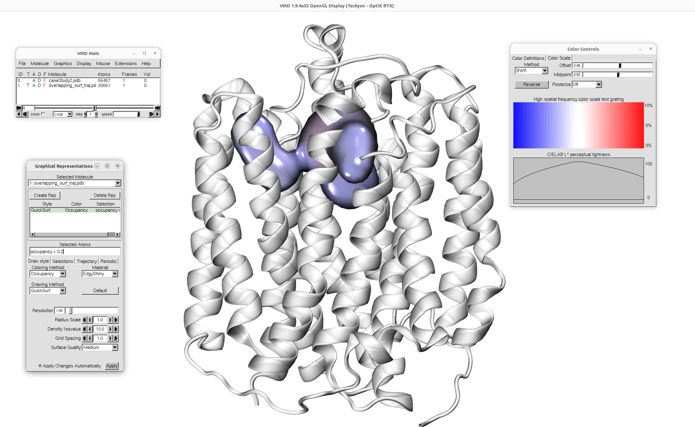

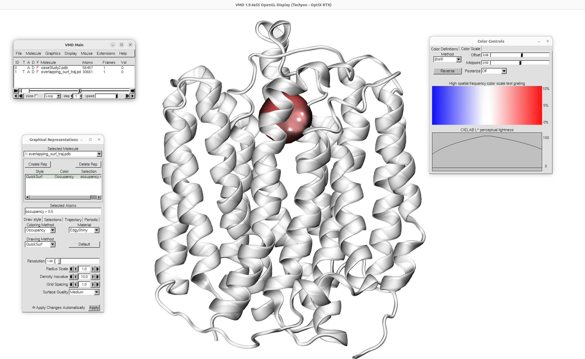

II. Reconstruction of pores in molecular dynamics (MD) trajectory
===============================================================================

Now, we will use the same MD trajectory to show how to detect pores with
protein structure.

First, we need to upload the data in the same way as for the channels
calculations.

.. ipython:: python
   :verbatim:

   PDBfile = 'caseStudy2.pdb'
   DCDfile = 'caseStudy2.dcd'
   atoms = parsePDB(PDBfile)
   dcd = Trajectory(DCDfile)
   dcd.link(atoms)
   dcd.setCoords(atoms)
   protein = atoms.select("protein")
   dcd.setAtoms(protein)

.. parsed-literal::

   @> 56457 atoms and 1 coordinate set(s) were parsed in 0.77s.

Next, we use :func:.`calcChannelsMultipleFrames`, but this time with
``return_details=True``. Without it, it is not possible to obtain
information about pores. Additionally, this time, ``inner_radius=0.8`` 
to find narrower passages within protein structure.

.. ipython:: python
   :verbatim:

   channels, surface, details = calcChannelsMultipleFrames(protein, dcd,
				inner_radius=0.8, 
                                output_path='ch_dcd_', separate=True, 
				return_details=True, max_proc=4)

.. parsed-literal::

   @> Frame/model: 0
   @> Frame/model: 14
   @> Frame/model: 28
   @> Frame/model: 42
   @> The atoms supplied to calcChannels contain protein atoms only.
   @> The atoms supplied to calcChannels contain protein atoms only.
   @> The atoms supplied to calcChannels contain protein atoms only.
   @> The atoms supplied to calcChannels contain protein atoms only.
   @> Substituted 5986 atoms with 77434 homogeneous balls of radius 1.20 A in 0.28s.
   @> Substituted 5986 atoms with 77434 homogeneous balls of radius 1.20 A in 0.28s.
   @> Substituted 5986 atoms with 77434 homogeneous balls of radius 1.20 A in 0.29s.
   @> Substituted 5986 atoms with 77434 homogeneous balls of radius 1.20 A in 0.29s.
   @> Delaunay tessellation of 77434 points constructed in 3.89s.
   @> Delaunay tessellation of 77434 points constructed in 3.91s.
   @> Delaunay tessellation of 77434 points constructed in 3.91s.
   @> Delaunay tessellation of 77434 points constructed in 3.99s.
   @> Surface and inner simplices filtered in 3.60s.
   @> Surface and inner simplices filtered in 3.70s.
   @> Surface and inner simplices filtered in 3.76s.
   @> Surface and inner simplices filtered in 3.80s.
   @> 6 surface cavities detected and filtered in 0.69s.
   @> 7 surface cavities detected and filtered in 0.72s.
   @> 10 surface cavities detected and filtered in 0.65s.
   @> 14 surface cavities detected and filtered in 0.70s.
   @> Channel pathfinding (graph Dijkstra) over 14 cavities completed in 1.67s.
   @> Detected 36 channels.
   @> Saving multiple results to directory ..
   @> Channel calculation completed in 10.44s.
   ..
   ..
   @> Frame/model: 209
   @> The atoms supplied to calcChannels contain protein atoms only.
   @> Substituted 5986 atoms with 77434 homogeneous balls of radius 1.20 A in 0.27s.
   @> 10 surface cavities detected and filtered in 0.77s.
   @> Delaunay tessellation of 77434 points constructed in 2.99s.
   @> Channel pathfinding (graph Dijkstra) over 10 cavities completed in 3.83s.
   @> Detected 50 channels.
   @> Saving multiple results to directory ..
   @> Channel calculation completed in 11.13s.
   @> Surface and inner simplices filtered in 2.91s.
   @> 10 surface cavities detected and filtered in 0.65s.
   @> Channel pathfinding (graph Dijkstra) over 10 cavities completed in 2.80s.
   @> Detected 48 channels.
   @> Saving multiple results to directory ..
   @> Channel calculation completed in 9.75s.

Once the channels are identified, a function called
:func:.`calcPoresFromChannelsMultipleFrames` can be applied to reconstrct
pores. To eliminate certain pores an additional filters will be applied,
such as ``min_end_to_end`` and ``min_bottleneck``.

.. ipython:: python
   :verbatim:

   pores = calcPoresFromChannelsMultipleFrames(channels, details, 
					min_end_to_end=45, 
                                	output_path='pores_dcd_', 
					separate=True, 
					min_bottleneck=0.6, 
					max_proc=4)

.. parsed-literal::
   
   @> Frame/model: 0
   @> Frame/model: 1
   ..
   ..
   @> Frame/model: 204
   @> Frame/model: 205
   @> Frame/model: 206
   @> Frame/model: 207
   @> Frame/model: 208
   @> Frame/model: 209

.. ipython:: python
   :verbatim:

   pores

.. parsed-literal::

   [[<prody.proteins.channels.Channel at 0x723a25804250>,
     <prody.proteins.channels.Channel at 0x723a258043d0>,
     <prody.proteins.channels.Channel at 0x723a258044c0>,
     <prody.proteins.channels.Channel at 0x723a25804610>,
     <prody.proteins.channels.Channel at 0x723a25804700>,
     <prody.proteins.channels.Channel at 0x723a25804820>,
     <prody.proteins.channels.Channel at 0x723a258048e0>,
     <prody.proteins.channels.Channel at 0x723a25804a00>,
     <prody.proteins.channels.Channel at 0x723a25804af0>,
     <prody.proteins.channels.Channel at 0x723a25804c10>,
     <prody.proteins.channels.Channel at 0x723a25804d00>,
     <prody.proteins.channels.Channel at 0x723a25804e50>,
     <prody.proteins.channels.Channel at 0x723a25804f10>,
     <prody.proteins.channels.Channel at 0x723a25805060>,
     <prody.proteins.channels.Channel at 0x723a25805120>,
     <prody.proteins.channels.Channel at 0x723a25805240>,
     <prody.proteins.channels.Channel at 0x723a25805390>],
    [<prody.proteins.channels.Channel at 0x723a25805480>,
     <prody.proteins.channels.Channel at 0x723a258055a0>,
     <prody.proteins.channels.Channel at 0x723a25805690>,
     <prody.proteins.channels.Channel at 0x723a25805780>,
     <prody.proteins.channels.Channel at 0x723a258058a0>,
     <prody.proteins.channels.Channel at 0x723a25805990>,
     <prody.proteins.channels.Channel at 0x723a25805a80>,
     ..
     <prody.proteins.channels.Channel at 0x723a76160c40>,
     <prody.proteins.channels.Channel at 0x723a76161ed0>,
     <prody.proteins.channels.Channel at 0x723a76161bd0>,
     <prody.proteins.channels.Channel at 0x723a76162ce0>,
     <prody.proteins.channels.Channel at 0x723a76160130>,
     <prody.proteins.channels.Channel at 0x723a76160430>]]

.. ipython:: python
   :verbatim:

   getPoreParametersMultipleFrames(pores, param_file_name='pores_DATA')

.. parsed-literal::

   @> Frame/model: 0
   @> Pore ID: 	Volume [ų] 	Length [Å] 	Bottleneck [Å]
   @> pore 0: 	488.65 		69.46 		0.79
   @> pore 1: 	496.62 		71.97 		0.79
   @> pore 2: 	581.56 		79.68 		0.78
   @> pore 3: 	633.35 		87.67 		0.78
   @> pore 4: 	608.23 		86.7 		0.78
   @> pore 5: 	573.67 		79.0 		0.78
   @> pore 6: 	625.47 		86.98 		0.78
   @> pore 7: 	600.34 		86.02 		0.78
   @> pore 8: 	445.76 		69.13 		0.79
   @> pore 9: 	458.33 		71.27 		0.79
   @> pore 10: 	453.73 		71.64 		0.79
   @> pore 11: 	605.6 		79.42 		0.79
   @> pore 12: 	621.57 		80.39 		0.79
   @> pore 13: 	629.54 		81.16 		0.79
   @> pore 14: 	613.57 		81.93 		0.79
   @> pore 15: 	629.54 		82.9 		0.79
   @> pore 16: 	637.51 		83.68 		0.79
   @> Frame/model: 1
   @> Pore ID: 	Volume [ų] 	Length [Å] 	Bottleneck [Å]
   @> pore 0: 	534.25 		67.29 		0.69
   @> pore 1: 	485.48 		69.16 		0.86
   @> pore 2: 	438.18 		69.48 		0.86
   @> pore 3: 	455.5 		71.94 		0.86
   @> pore 4: 	567.56 		70.19 		0.69
   @> pore 5: 	443.17 		71.95 		0.81
   @> pore 6: 	581.06 		77.88 		0.82
   @> pore 7: 	598.31 		79.62 		0.82
   @> pore 8: 	460.5 		74.42 		0.81
   ..
   ..

   [([69.45502993303754,
      71.96649622694555,
      79.68334256806159,
      87.66602479713018,
      86.70487263137626,
      78.9984426504088,
      86.98323351113143,
      86.02207112060964,
      69.12751210792567,
      71.26709343921263,
      71.63962681557534,
      79.42123977383082,
      80.39068347838764,
      81.16435270464021,
      81.9337633916112,
      82.9032107565874,
      83.67604002776511],
     [0.787475023965595,
      0.787475023965595,
      0.7801363553848397,
      0.7801363553848397,
      0.7801363553848397,
      0.7801363553848397,
      0.7801363553848397,
      0.7801363553848397,
      0.787475023965595,
      0.787475023965595,
      0.787475023965595,
      0.787475023965595,
      0.787475023965595,
      0.787475023965595,
      0.787475023965595,
      0.787475023965595,
      0.787475023965595],
     ..
     ..
     [859.3209819223591,
      857.2250421175263,
      800.1479407180493,
      832.6513119668273,
      830.5553721619943,
      773.4782707625176,
      863.3254963001066,
      861.2295564952738,
      804.1524550957969,
      846.2005807778157,
      828.9071023368879,
      826.811162532055,
      769.7340611325781,
      851.1192785668344,
      849.0233387620015,
      791.9462373625246,
      868.9678356413744,
      866.8718958365415,
      809.7947944370645])]

To visualize the results directly in ProDy create the model and use
:func:.`showPores` function.

.. ipython:: python
   :verbatim:

   vmd_path = '/usr/local/bin/vmd'
   model = getVmdModel(vmd_path, protein)

.. parsed-literal::

   @> Model created successfully.

	
To display all the pores from frame #0:

.. ipython:: python
   :verbatim:

   showPores(pores[0], model=model)

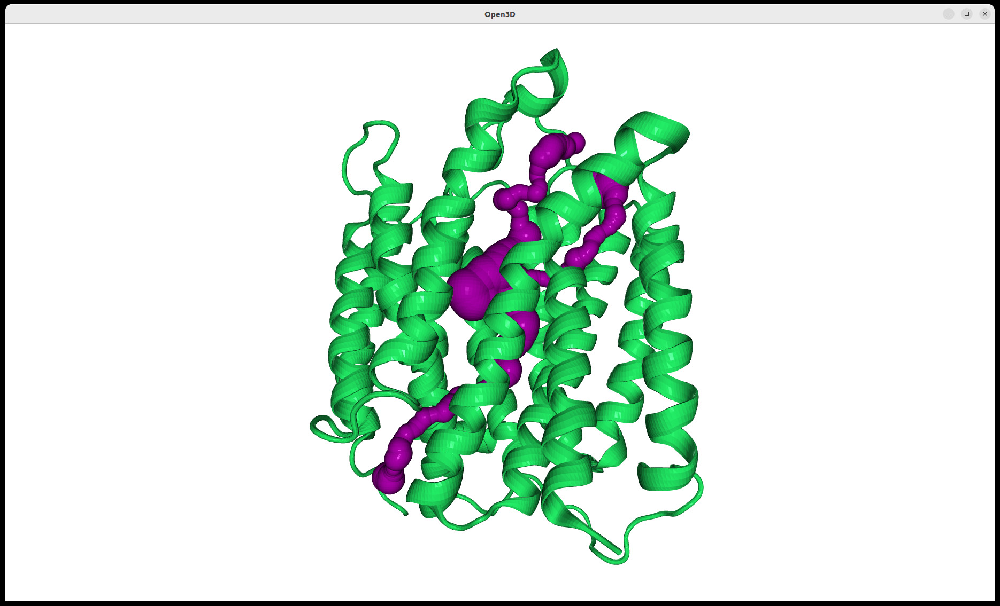

To display first pore in frame #0:

.. ipython:: python
   :verbatim:

   showPores(pores[0][0], model=model)

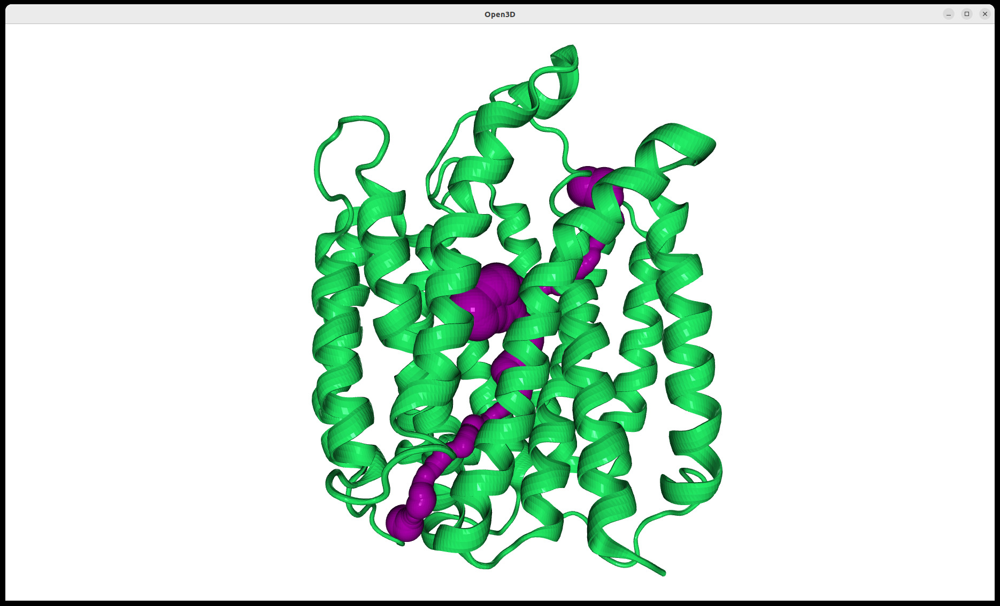

To display second pore in frame #1:

.. ipython:: python
   :verbatim:

   showPores(pores[0][1], model=model)

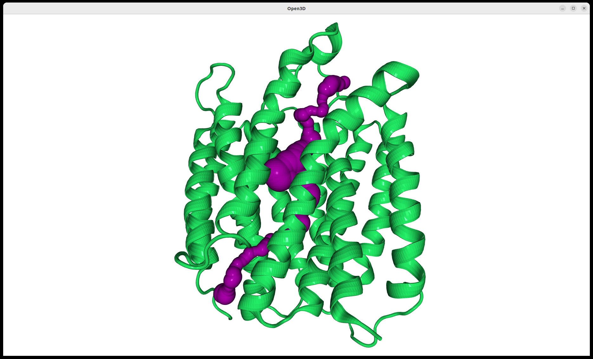

Below are also the results for frames #101 and #201 (counting from 0). 
As we can see, pores are changing along the MD trajectory.

.. ipython:: python
   :verbatim:

   showPores(pores[100], model=model)

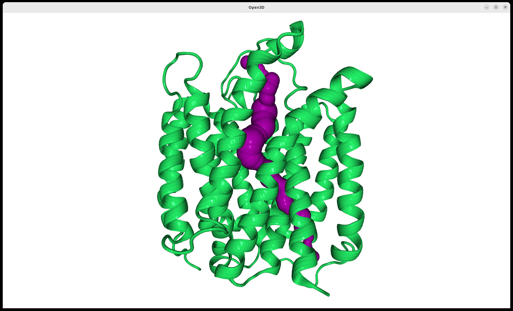

.. ipython:: python
   :verbatim:

   showPores(pores[200], model=model)

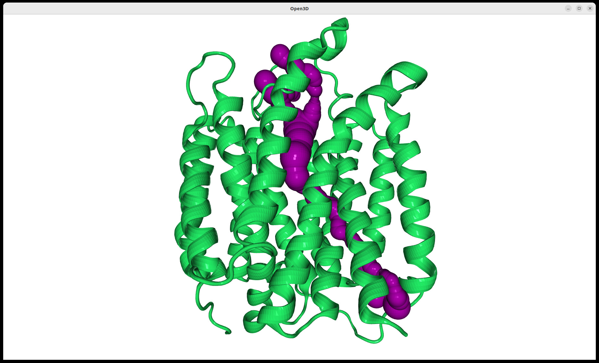

Next, the residues that are forming the pores can be identified using
:func:.`getPoreResidueNamesMultipleFrames` function.

.. ipython:: python
   :verbatim:

   getPoreResidueNamesMultipleFrames(protein, pores, dcd,
		residues_file_name='pores_Residues')

.. parsed-literal::

   @> Frame: 0
   @> Pore residues were saved to: pores_Residues_frame0_Residues_All_pores.txt
   @> Frame: 1
   @> Pore residues were saved to: pores_Residues_frame1_Residues_All_pores.txt
   @> Frame: 2
   @> Pore residues were saved to: pores_Residues_frame2_Residues_All_pores.txt
   @> Frame: 3
   @> Pore residues were saved to: pores_Residues_frame3_Residues_All_pores.txt
   @> Frame: 4
   @> Pore residues were saved to: pores_Residues_frame4_Residues_All_pores.txt
   @> Frame: 5
   @> Pore residues were saved to: pores_Residues_frame5_Residues_All_pores.txt
   @> Frame: 6
   @> Pore residues were saved to: pores_Residues_frame6_Residues_All_pores.txt
   @> Frame: 7
   @> Pore residues were saved to: pores_Residues_frame7_Residues_All_pores.txt
   @> Frame: 8
   @> Pore residues were saved to: pores_Residues_frame8_Residues_All_pores.txt
   @> Frame: 9
   @> Pore residues were saved to: pores_Residues_frame9_Residues_All_pores.txt
   @> Frame: 10
   @> Pore residues were saved to: pores_Residues_frame10_Residues_All_pores.txt
   ..
   ..

III. Identification of surface cavities in molecular dynamics (MD) trajectory
===============================================================================

In this example, surface cavities are analyzed for a trajectory prepared from
the structure with PDB ID 5KQM. This structure corresponds to human low molecular
weight phosphotyrosine protein phosphatase (LMW-PTP, ACP1) in complex with MES.

The trajectory used here contains both the protein without the ligand (MES). 
The protein selection is applied to the trajectory using :meth:`Trajectory.setAtoms`, 
so that only protein coordinates are passed to the surface-cavity calculation.

.. ipython:: python
   :verbatim:
   
   PDBfile = '5kqm_all_sci_wWat.pdb'
   DCDfile = '5kqm_all_sci_wWat.dcd'
   atoms = parsePDB(PDBfile)
   dcd = Trajectory(DCDfile)
   dcd.link(atoms)
   dcd.setCoords(atoms)

.. ipython:: python
   :verbatim:

   protein = atoms.select("protein")
   dcd.setAtoms(protein)

.. parsed-literal::

   @> 2425 atoms and 1 coordinate set(s) were parsed in 0.02s.

The selected protein and the linked trajectory are then used as input for
:func:`calcSurfaceCavitiesMultipleFrames`. The function calculates surface
cavities independently for each trajectory frame. With ``separate=True``, each
detected cavity is saved as an individual PQR file for each frame, using the
prefix provided by ``output_path``.

.. ipython:: python
   :verbatim:

   cavities, surfaces=calcSurfaceCavitiesMultipleFrames(protein, dcd, 
		output_path='cav_dcd', separate=True)
		

.. parsed-literal::

   @> Frame: 0
   @> The atoms supplied to calcChannels contain protein atoms only.
   @> Substituted 2425 atoms with 31833 homogeneous balls of radius 1.20 A in 0.12s.
   @> Delaunay tessellation of 31833 points constructed in 1.33s.
   @> Surface and inner simplices filtered in 0.39s.
   @> 20 surface cavities detected and filtered in 0.24s.
   @> Returning surface cavities
   @> Saving multiple surface cavities to directory ..
   @> Surface cavity calculation completed in 2.14s.
   @> Frame: 1
   @> The atoms supplied to calcChannels contain protein atoms only.
   @> Substituted 2425 atoms with 31833 homogeneous balls of radius 1.20 A in 0.11s.
   @> Delaunay tessellation of 31833 points constructed in 1.27s.
   @> Surface and inner simplices filtered in 0.37s.
   @> 20 surface cavities detected and filtered in 0.22s.
   @> Returning surface cavities
   @> Saving multiple surface cavities to directory ..
   @> Surface cavity calculation completed in 2.02s.
   @> Frame: 2
   @> The atoms supplied to calcChannels contain protein atoms only.
   @> Substituted 2425 atoms with 31833 homogeneous balls of radius 1.20 A in 0.11s.
   @> Delaunay tessellation of 31833 points constructed in 1.23s.
   @> Surface and inner simplices filtered in 0.37s.
   @> 27 surface cavities detected and filtered in 0.21s.
   @> Returning surface cavities
   @> Saving multiple surface cavities to directory ..
   @> Surface cavity calculation completed in 1.97s.
   ..
   ..
   @> Frame: 49
   @> The atoms supplied to calcChannels contain protein atoms only.
   @> Substituted 2425 atoms with 31833 homogeneous balls of radius 1.20 A in 0.11s.
   @> Delaunay tessellation of 31833 points constructed in 1.18s.
   @> Surface and inner simplices filtered in 0.42s.
   @> 27 surface cavities detected and filtered in 0.21s.
   @> Returning surface cavities
   @> Saving multiple surface cavities to directory ..
   @> Surface cavity calculation completed in 1.97s.

The parameters of the detected surface cavities can be extracted with
:func:`getSurfaceCavityParametersMultipleFrames`. This function analyzes the
surface cavities returned for all trajectory frames and reports, for each frame,
the volume, depth, and number of tetrahedra assigned to each detected cavity.
If ``param_file_name`` is provided, the results are also saved to text files
using this name as a prefix.

.. ipython:: python
   :verbatim:

   parameters = getSurfaceCavityParametersMultipleFrames(cavities,
   		                         param_file_name='cavi_param')

.. parsed-literal::

   @> Model/frame: 0
   @> Cavity ID: 	Volume [ų] 	Depth [Å] 	Tetrahedra count
   @> cavity 0: 	185.19 		7.26 		80
   @> cavity 1: 	221.58 		4.37 		84
   @> cavity 2: 	53.79 		2.41 		24
   @> cavity 3: 	313.39 		4.69 		156
   @> cavity 4: 	360.65 		4.04 		117
   @> cavity 5: 	84.52 		2.2 		36
   @> cavity 6: 	87.28 		3.23 		40
   @> cavity 7: 	66.87 		2.92 		45
   @> cavity 8: 	242.94 		3.75 		87
   @> cavity 9: 	147.79 		3.12 		48
   @> cavity 10: 	194.93 		2.42 		75
   @> cavity 11: 	92.82 		1.64 		52
   @> Model/frame: 1
   @> Cavity ID: 	Volume [ų] 	Depth [Å] 	Tetrahedra count
   @> cavity 0: 	320.4 		7.76 		175
   @> cavity 1: 	162.26 		3.32 		53
   @> cavity 2: 	155.38 		2.3 		70
   @> cavity 3: 	51.88 		1.86 		36
   @> cavity 4: 	95.75 		1.73 		49
   @> cavity 5: 	56.5 		1.54 		27
   @> cavity 6: 	260.45 		3.66 		89
   @> cavity 7: 	292.86 		4.41 		86
   @> cavity 8: 	70.15 		2.41 		38
   @> cavity 9: 	77.78 		7.26 		25
   @> cavity 10: 	98.21 		2.59 		52
   @> cavity 11: 	207.6 		2.55 		70
   @> cavity 12: 	127.42 		2.34 		72
   ..
   ..
   @> Model/frame: 49
   @> Cavity ID: 	Volume [ų] 	Depth [Å] 	Tetrahedra count
   @> cavity 0: 	121.03 		2.72 		56
   @> cavity 1: 	227.05 		2.83 		103
   @> cavity 2: 	91.85 		3.77 		49
   @> cavity 3: 	458.74 		2.96 		145
   @> cavity 4: 	177.08 		2.45 		78
   @> cavity 5: 	90.71 		2.03 		43
   @> cavity 6: 	212.61 		3.84 		106
   @> cavity 7: 	172.96 		2.39 		63
   @> cavity 8: 	78.59 		1.86 		29
   @> cavity 9: 	130.72 		2.08 		45
   @> cavity 10: 	81.99 		3.7 		28
   @> cavity 11: 	54.33 		1.66 		39
   @> cavity 12: 	51.63 		2.09 		21
   @> cavity 13: 	159.86 		3.45 		59
   @> cavity 14: 	66.62 		2.28 		24
   @> cavity 15: 	60.45 		1.71 		21
   	

Residues lining the detected surface cavities can be identified with
:func:`getSurfaceCavityResidueNamesMultipleFrames`. The function analyzes each
trajectory frame using the corresponding set of surface cavities and surface
vertices returned by :func:`calcSurfaceCavitiesMultipleFrames`.

For each cavity, residues are selected based on their distance from the cavity
surface. The calculation uses the protein coordinates from the matching
trajectory frame, so the supplied trajectory should be the same trajectory that
was used for cavity detection. If ``residues_file_name`` is provided, the
identified residues are also saved to text files using this name as a prefix.

.. ipython:: python
   :verbatim:

   residues = getSurfaceCavityResidueNamesMultipleFrames(protein, cavities,
                             surfaces, dcd, residues_file_name='cavi_resAA')

.. parsed-literal::

   @> Surface cavity residues were saved to: cavi_resAA_frame0_Residues_All_surface_cavities.txt
   @> Surface cavity residues were saved to: cavi_resAA_frame1_Residues_All_surface_cavities.txt
   @> Surface cavity residues were saved to: cavi_resAA_frame2_Residues_All_surface_cavities.txt
   @> Surface cavity residues were saved to: cavi_resAA_frame3_Residues_All_surface_cavities.txt
   @> Surface cavity residues were saved to: cavi_resAA_frame4_Residues_All_surface_cavities.txt
   @> Surface cavity residues were saved to: cavi_resAA_frame5_Residues_All_surface_cavities.txt
   @> Surface cavity residues were saved to: cavi_resAA_frame6_Residues_All_surface_cavities.txt
   @> Surface cavity residues were saved to: cavi_resAA_frame7_Residues_All_surface_cavities.txt
   @> Surface cavity residues were saved to: cavi_resAA_frame8_Residues_All_surface_cavities.txt
   @> Surface cavity residues were saved to: cavi_resAA_frame9_Residues_All_surface_cavities.txt
   @> Surface cavity residues were saved to: cavi_resAA_frame10_Residues_All_surface_cavities.txt
   @> Surface cavity residues were saved to: cavi_resAA_frame11_Residues_All_surface_cavities.txt
   ..
   ..
   @> Surface cavity residues were saved to: cavi_resAA_frame43_Residues_All_surface_cavities.txt
   @> Surface cavity residues were saved to: cavi_resAA_frame44_Residues_All_surface_cavities.txt
   @> Surface cavity residues were saved to: cavi_resAA_frame45_Residues_All_surface_cavities.txt
   @> Surface cavity residues were saved to: cavi_resAA_frame46_Residues_All_surface_cavities.txt
   @> Surface cavity residues were saved to: cavi_resAA_frame47_Residues_All_surface_cavities.txt
   @> Surface cavity residues were saved to: cavi_resAA_frame48_Residues_All_surface_cavities.txt
   @> Surface cavity residues were saved to: cavi_resAA_frame49_Residues_All_surface_cavities.txt

The returned ``residues`` object contains residue lists for all analyzed frames.
By default, chain identifiers are included in the residue labels, which makes it
possible to distinguish residues from different protein chains.

The residue lists obtained for all trajectory frames can be further analyzed with
:func:`calcFrequentObjectResidues`. This function counts how often individual
residues occur among the residues lining the detected objects. The counting can
be performed separately for each chain, which is useful for multichain systems
or oligomeric proteins.

In this example, the function is applied to residues lining surface cavities.
The ``object_type`` argument is used only for labeling the output and can be set
to ``'channel'``, ``'pore'``, or ``'surface_cavity'`` depending on the analyzed
object.

.. ipython:: python
   :verbatim:

   frequent_residues = calcFrequentObjectResidues(residues, output_file_name='cavi_freq_res')

.. parsed-literal::

   @> Residue counts by chain were saved to: cavi_freq_res_ResCounts.txt

.. ipython:: python
   :verbatim:

   frequent_residues

.. parsed-literal::

   {'P': Counter({'GLU128': 51,
             'ARG75': 51,
             'HSE72': 51,
             'ARG40': 50,
             'ASP129': 50,
             'LYS79': 50,
             'THR78': 50,
             'HSE157': 50,
             'LYS6': 50,
             'GLN76': 50,
             'LEU13': 50,
             'PRO130': 50,
             'ASP137': 49,
             'LYS155': 49,
             'THR140': 49,
             'ARG27': 49,
             'SER71': 49,
             'TYR131': 49,
             'TYR119': 48,
             'ILE16': 48,
             'THR31': 48,
             'ALA156': 48,
             'THR84': 48,
             'ILE51': 48,
             'GLU80': 48,
             'TRP39': 48,
             'ASP42': 48,
             'LYS102': 48,
             'SER94': 47,
             'TYR49': 47,
             'GLU154': 47,
             'ILE77': 47,
             'ILE126': 47,
             'THR5': 46,
             'ASP86': 46,
             'LYS28': 46,
             'LYS110': 46,
             'PHE85': 46,
             'LEU153': 46,
             'THR46': 45,
             'VAL73': 45,
             'GLN124': 45,
             'VAL106': 45,
             'ILE68': 44,
             'PRO54': 44,
             'ARG101': 44,
             'VAL41': 44,
             'SER118': 44,
             'GLU23': 44,
             'ARG150': 44,
             'LYS123': 44,
             'LYS112': 44,
             'ALA83': 44,
             'PRO69': 43,
             'ARG18': 43,
             'ASP92': 43,
             'GLU50': 43,
             'MET70': 43,
             'GLN60': 43,
             'ILE35': 43,
             'TYR87': 43,
             'SER36': 42,
             'ASP32': 42,
             'GLY48': 42,
             'GLN33': 42,
             'GLU37': 41,
             'PRO55': 41,
             'SER47': 41,
             'TYR57': 41,
             'SER136': 41,
             'LYS107': 41,
             'ALA151': 40,
             'GLN143': 40,
             'GLU93': 40,
             'ASP56': 40,
             'ASP98': 40,
             'SER7': 40,
             'THR108': 40,
             'ASN53': 39,
             'ARG97': 39,
             'GLN105': 39,
             'ARG58': 39,
             'TYR132': 39,
             'VAL146': 38,
             'GLY14': 38,
             'ASN38': 38,
             'SER43': 37,
             'ARG147': 37,
             ..
	     ..
	     'ALA45': 2,
             'PRO20': 1,
             'LEU99': 1,
             'PHE26': 1})}

.. ipython:: python
   :verbatim:

   import matplotlib.pyplot as plt
   showFrequentObjectResidues(frequent_residues)
   plt.show()

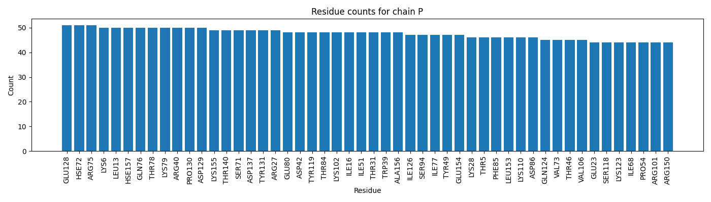

If ``count_residue_names=True``, residue types are counted instead of individual
residue positions. For example, residues such as ``ARG75:P`` and ``ARG150:P``
are counted together as ``ARG`` for chain ``R``. This option is useful when
we want to identify which amino-acid types most frequently line the detected
surface cavities.

.. ipython:: python
   :verbatim:

   frequent_residue_names = calcFrequentObjectResidues(residues, count_residue_names=True)
   frequent_residue_names

.. parsed-literal::

   {'P': Counter({'SER': 51,
             'TYR': 51,
             'ARG': 51,
             'LYS': 51,
             'VAL': 51,
             'HSE': 51,
             'PRO': 51,
             'GLN': 51,
             'THR': 51,
             'GLU': 51,
             'ALA': 51,
             'LEU': 51,
             'GLY': 51,
             'ASP': 51,
             'ILE': 51,
             'PHE': 50,
             'ASN': 50,
             'TRP': 48,
             'MET': 43,
             'CYS': 35})}

.. ipython:: python
   :verbatim:

   import matplotlib.pyplot as plt
   showFrequentObjectResidues(frequent_residue_names)
   plt.show()

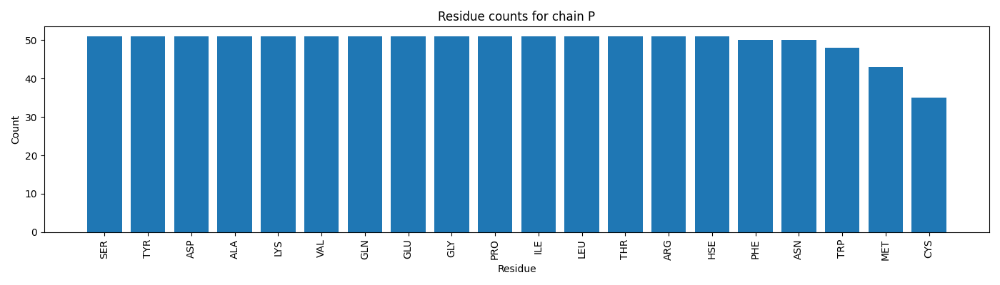

If ``count_once_per_frame=False``, every occurrence of a residue is counted. In
this mode, if the same residue appears in more than one detected surface cavity
within the same frame, it contributes more than once to the final count. This
option emphasizes repeated object-level participation rather than simple
frame-level occurrence.

.. ipython:: python
   :verbatim:

   frequent_residue_occurrences = calcFrequentObjectResidues(
       residues,
       count_once_per_frame=False,
       output_file_name='cavi_frequent_residue_occurrences')

   showFrequentObjectResidues(frequent_residue_occurrences, top=20)

.. parsed-literal::
   
   @> Residue counts by chain were saved to: cavi_frequent_residue_occurrences_ResCounts.txt

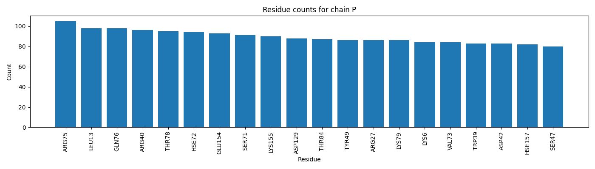

In general, ``count_residue_names=True`` changes what is counted, from residue
positions to residue types, whereas ``count_once_per_frame=False`` changes how
often repeated appearances are counted.

Finally, surface cavities detected across trajectory frames can be combined into
a spatial overlap map using :func:`calcSurfaceCavityOverlaps`. In this example,
the PQR files generated by :func:`calcSurfaceCavitiesMultipleFrames` are first
collected with :mod:`glob`. The patterns ``"cav_dcd?.pqr"`` and
``"cav_dcd??.pqr"`` select files with one- and two-digit frame numbers,
respectively.

The overlap calculation voxelizes the FIL pseudoatoms from all selected PQR
files and writes a PDB file in which the occupancy column stores the normalized
frequency of each voxel. Regions with higher occupancy correspond to surface
cavity regions that are detected in more frames.

.. ipython:: python
   :verbatim:

   import glob
   pqr_files_cavities = glob.glob("cav_dcd?.pqr") + glob.glob("cav_dcd??.pqr")
   calcSurfaceCavityOverlaps(pqr_files=pqr_files_cavities, 
			     output_file_name='surface_cavity_overlap.pdb', 
			     max_proc=4)

.. parsed-literal::

   @> Number of PQR files: 51
   @> Resolution: 0.5
   @> max_proc: 4
   @> Calculating overlaps using 4 processes.
   @> 686 atoms and 1 coordinate sets were parsed in 0.01s.
   @> 946 atoms and 1 coordinate sets were parsed in 0.02s.
   @> 1072 atoms and 1 coordinate sets were parsed in 0.02s.
   @> 803 atoms and 1 coordinate sets were parsed in 0.02s.
   @> 818 atoms and 1 coordinate sets were parsed in 0.00s.
   @> 966 atoms and 1 coordinate sets were parsed in 0.01s.
   @> 1140 atoms and 1 coordinate sets were parsed in 0.01s.
   @> 772 atoms and 1 coordinate sets were parsed in 0.00s.
   @> 858 atoms and 1 coordinate sets were parsed in 0.00s.
   @> 1043 atoms and 1 coordinate sets were parsed in 0.01s.
   @> 723 atoms and 1 coordinate sets were parsed in 0.00s.
   @> 980 atoms and 1 coordinate sets were parsed in 0.01s.
   @> 832 atoms and 1 coordinate sets were parsed in 0.00s.
   @> 774 atoms and 1 coordinate sets were parsed in 0.00s.
   @> 1020 atoms and 1 coordinate sets were parsed in 0.01s.
   ..
   ..
   @> 1020 atoms and 1 coordinate sets were parsed in 0.01s.
   @> 962 atoms and 1 coordinate sets were parsed in 0.01s.
   @> 691 atoms and 1 coordinate sets were parsed in 0.00s.
   @> 936 atoms and 1 coordinate sets were parsed in 0.01s.
   @> 899 atoms and 1 coordinate sets were parsed in 0.01s.
   @> 869 atoms and 1 coordinate sets were parsed in 0.01s.
   @> 885 atoms and 1 coordinate sets were parsed in 0.00s.
   @> Overlap written to: surface_cavity_overlap.pdb
   @> Number of occupied overlap voxels: 138222

   'surface_cavity_overlap.pdb'

The results can be visualized using VMD_ as shown below.

The resulting overlap map can be visualized at different occupancy thresholds.
Below, we show examples for occupancy values greater than 0.2 and 0.5.

At the lower occupancy threshold, the surface-cavity region overlaps with the
ligand-binding site, indicating that this region is detected in part of the
trajectory. At the higher threshold, only a few recurrent cavity regions remain,
and these regions do not coincide with the ligand-binding site.

This suggests that the ligand-binding cavity may be sensitive to the selected
surface-cavity parameters in this system. However, it may also reflect the
dynamic character of this region. Since the ligand is not present in the
trajectory (and only displayed based on initial PDB structure) 
The binding-site cavity may not remain open throughout the
simulation and may instead alternate between more open and more closed
conformations.

Therefore, the default settings should be treated as a starting point rather
than a universal choice. Nevertheless, this can be further examined using
:func:`scanSurfaceCavityParameters`, which samples different combinations of
surface-cavity parameters and helps determine whether the observed cavity is
robustly detected under alternative settings.

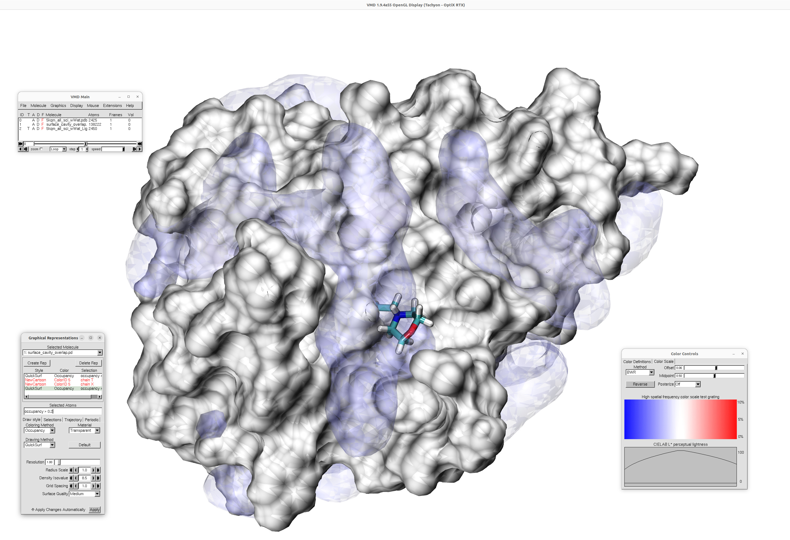

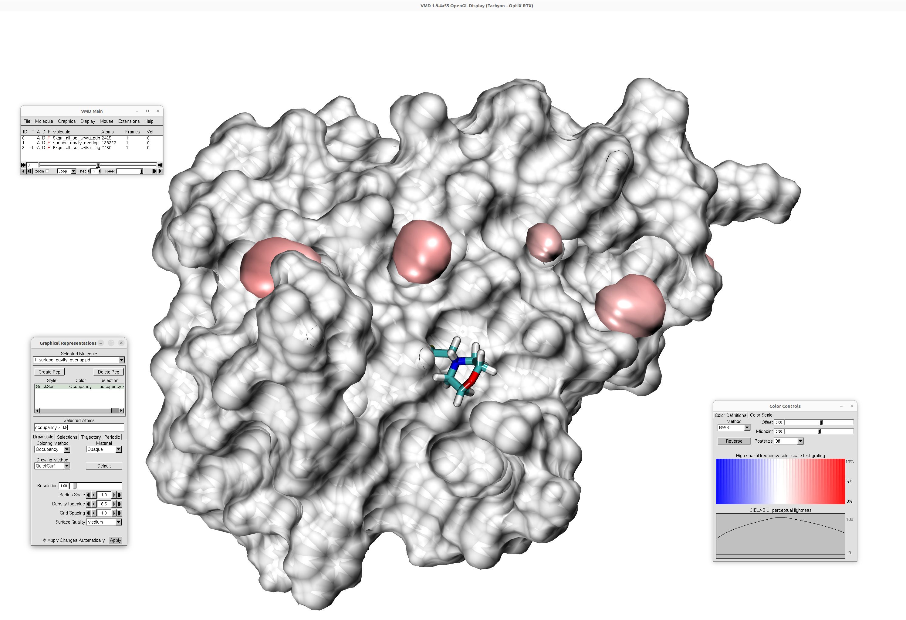

.. _Trajectory tutorial: http://www.bahargroup.org/prody/tutorials/trajectory_analysis/

