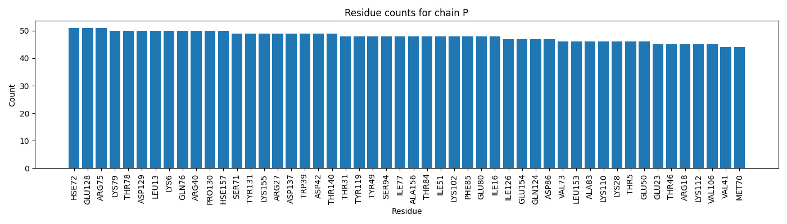
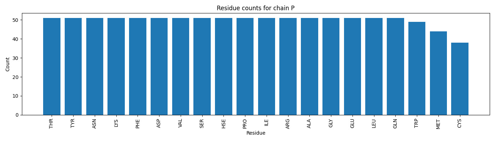
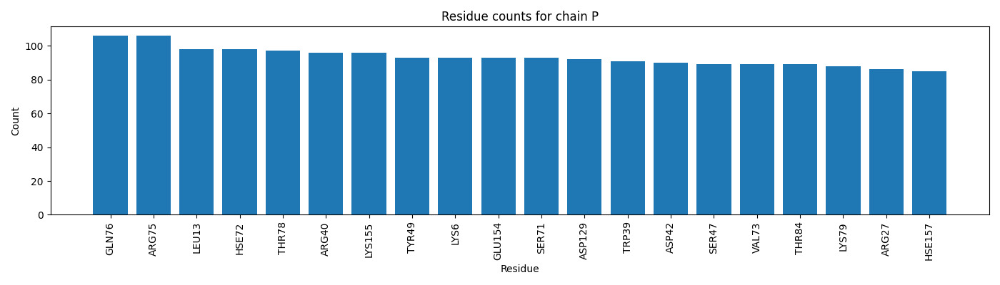

.. _cavitracer_single:

I. Detection of channels in molecular dynamics (MD) trajectory
===============================================================================

Analysis of the trajectory will be performed on a short MD trajectory
containing over 200 frames of simulation performed for the vesicular monoamine 
transporter VMAT2. This protein contains 460 residues. During the analysis, 
only protein structure will be taken into consideration.

Before analyzing the trajectory, its need to be parsed (see more details
in `Trajectory tutorial`_).

.. ipython:: python
   :verbatim:

   PDBfile = 'caseStudy2.pdb'
   DCDfile = 'caseStudy2.dcd'
   atoms = parsePDB(PDBfile)
   dcd = Trajectory(DCDfile)
   dcd.link(atoms)
   dcd.setCoords(atoms)

.. parsed-literal::

   @> 56457 atoms and 1 coordinate set(s) were parsed in 0.69s.

To analyze only protein structure for the analysis, we will select protein
structure:

.. ipython:: python
   :verbatim:

   protein = atoms.select("protein")
   dcd.setAtoms(protein)

Next, to detect channels in MD trajectories, we need to use
:func:`.scalcChannelsMultipleFrames` function. To speed up the calculations,
``max_proc`` parameter can be set up to a higher number. In the example
below, we will use 4 processors to perform the calulations. The results will
saved with the prefix ``"chls_dcd"``, and all the channels will be storage
separately (``separate=True``). 

.. ipython:: python
   :verbatim:

   channels4, surfaces4=calcChannelsMultipleFrames(protein, dcd, 
		output_path='chls_dcd', separate=True, max_proc=4,
		inner_radius=0.8, surf_radius=3, sparsity=1)

.. parsed-literal::

    @> Frame/model: 0
    @> Frame/model: 14
    @> Frame/model: 28
    @> Frame/model: 42
    @> The atoms supplied to calcChannels contain protein atoms only.
    @> The atoms supplied to calcChannels contain protein atoms only.
    @> The atoms supplied to calcChannels contain protein atoms only.
    @> The atoms supplied to calcChannels contain protein atoms only.
    @> Substituted 5986 atoms with 77434 homogeneous balls of radius 1.20 Å in 0.28s.
    @> Substituted 5986 atoms with 77434 homogeneous balls of radius 1.20 Å in 0.28s.
    @> Substituted 5986 atoms with 77434 homogeneous balls of radius 1.20 Å in 0.28s.
    @> Substituted 5986 atoms with 77434 homogeneous balls of radius 1.20 Å in 0.28s.
    @> Delaunay tessellation of 77434 points constructed in 4.61s.
    @> Delaunay tessellation of 77434 points constructed in 4.67s.
    @> Delaunay tessellation of 77434 points constructed in 4.90s.
    @> Delaunay tessellation of 77434 points constructed in 4.89s.
    @> Surface and inner simplices filtered in 4.22s.
    @> Surface and inner simplices filtered in 4.26s.
    @> Surface and inner simplices filtered in 4.07s.
    @> Surface and inner simplices filtered in 4.13s.
    @> Cavities: 431 found, 7 deeper than min_depth=5.0 Å and searched for channels, in 1.38s.
    @> Cavities: 431 found, 14 deeper than min_depth=5.0 Å and searched for channels, in 1.38s.
    @> Cavities: 409 found, 6 deeper than min_depth=5.0 Å and searched for channels, in 1.36s.
    @> Cavities: 395 found, 10 deeper than min_depth=5.0 Å and searched for channels, in 1.36s.
    @> Chambers (probe 1.40 Å): 1 of the 7 searched cavities have them; the other 6 are searched whole.
    @>     cavity 0: 26 chambers, 3 of them seeded.
    @> 9 search sites (sp) in 0.09s: one per seeded chamber, one per cavity searched whole.
    @> Chambers (probe 1.40 Å): 3 of the 14 searched cavities have them; the other 12 are searched whole.
    @>     cavity 0: 9 chambers, 3 of them seeded.
    @>     cavity 1: 5 chambers, 2 of them seeded.
    @>     cavity 2: 1 chamber, none of them deep and large enough to seed; searched whole.
    @> 17 search sites (sp) in 0.08s: one per seeded chamber, one per cavity searched whole.
    @> Chambers (probe 1.40 Å): 1 of the 10 searched cavities have them; the other 9 are searched whole.
    @>     cavity 0: 21 chambers, 6 of them seeded.
    @> 15 search sites (sp) in 0.06s: one per seeded chamber, one per cavity searched whole.
    @> Chambers (probe 1.40 Å): 2 of the 6 searched cavities have them; the other 5 are searched whole.
    @>     cavity 0: 15 chambers, 7 of them seeded.
    @>     cavity 3: 1 chamber, none of them deep and large enough to seed; searched whole.
    @> 12 search sites (sp) in 0.15s: one per seeded chamber, one per cavity searched whole.
    @> Channel search (Dijkstra) over 9 search sites in 7 cavities completed in 0.81s.
    @> Found 13 channels and 2 links (a link joins a deep chamber to a shallower one and never reaches the surface).
    @> Search sites (sp), the void each search ran from, largest first; sp<n> tags every channel, link and output file:
    @>     site  start_point [Å]            void                   volume [ų]  depth [Å]  channels  links
    @>     sp0   [0.207, -2.294, 0.217]     cavity 0, chamber 1/3         1659       18.0         7      1  -> sp4
    @>     sp1   [1.720, 5.813, -4.600]     cavity 1, whole                249        9.5         -      -  sealed
    @>     sp2   [10.209, -4.149, -10.750]  cavity 2, whole                248        6.8         -      -  sealed
    @>     sp3   [1.601, -2.764, 18.972]    cavity 3, whole                128        5.3         -      -  sealed
    @>     sp4   [7.917, 7.068, 11.712]     cavity 0, chamber 2/3           79        8.3         4      -
    @>     sp5   [-8.408, -3.405, 3.548]    cavity 0, chamber 3/3           79       13.9         1      1  -> sp0
    @>     sp6   [-17.069, -2.605, -8.273]  cavity 4, whole                 57        5.7         1      -
    @>     sp7   [21.624, 2.747, -2.671]    cavity 5, whole                 54        5.0         -      -  sealed
    @>     sp8   [10.419, -6.575, 11.068]   cavity 6, whole                 51        5.0         -      -  sealed
    @>     (site volumes measure the void itself and are not on the swept-sphere scale of the channel volumes)
    @> The 5 sites marked sealed above report neither a channel nor a link: no route out of them survived - either narrower than bottleneck=0.80 Å, or dropped as a duplicate of a shallower site's, or the void is its own mouth and has nowhere to path to. Lower bottleneck to see how the first kind connect.
    @> Saving 13 channels and 2 links to directory ., one file per object named sp<site>_chl<n> and sp<site>_lnk<n>.
    @> Channel calculation completed in 11.35s.
    @> Frame/model: 29
    @> The atoms supplied to calcChannels contain protein atoms only.
    @> Channel search (Dijkstra) over 17 search sites in 14 cavities completed in 0.80s.
    @> Found 17 channels and 1 link (a link joins a deep chamber to a shallower one and never reaches the surface).
    @> Search sites (sp), the void each search ran from, largest first; sp<n> tags every channel, link and output file:
    @>     site  start_point [Å]             void                   volume [ų]  depth [Å]  channels  links
    @>     sp0   [2.849, 3.805, 1.723]       cavity 0, chamber 1/3         1452       17.0         1      1  -> sp9
    @>     sp1   [7.937, 7.759, -18.866]     cavity 2, whole                862        5.3         1      -
    @>     sp2   [6.445, -4.187, 1.319]      cavity 3, whole                286        9.4         2      -
    @>     sp3   [10.134, -1.611, 16.422]    cavity 4, whole                259        5.2         2      -
    @>     sp4   [10.849, 9.741, -14.429]    cavity 5, whole                254        6.6         2      -
    @>     sp5   [6.663, 9.509, -9.781]      cavity 6, whole                198        6.7         -      -  sealed
    @>     sp6   [12.916, -12.369, -13.735]  cavity 7, whole                158        6.2         1      -
    @>     sp7   [16.390, -2.596, -3.483]    cavity 8, whole                138        6.5         1      -
    @>     sp8   [-5.321, 4.623, -12.118]    cavity 9, whole                126        6.0         -      -  sealed
    @>     sp9   [5.156, 9.023, 11.677]      cavity 0, chamber 2/3          108        5.3         1      -
    @>     sp10  [13.626, -8.476, -18.577]   cavity 10, whole               103        8.1         -      -  sealed
    @>     sp11  [-5.706, 2.245, -19.519]    cavity 11, whole                93        8.2         -      -  sealed
    @>     sp12  [-19.199, -1.418, 6.458]    cavity 12, whole                80        6.1         -      -  sealed
    @>     sp13  [-10.068, -0.839, -15.343]  cavity 1, chamber 1/2           68        7.6         2      -
    @>     sp14  [13.306, 9.826, 14.612]     cavity 0, chamber 3/3           67        6.6         3      -
    @>     sp15  [4.655, -11.752, -19.758]   cavity 1, chamber 2/2           57       11.3         -      -  sealed
    @>     sp16  [8.421, 10.488, -5.750]     cavity 13, whole                56        6.0         1      -
    @>     (site volumes measure the void itself and are not on the swept-sphere scale of the channel volumes)
    @> The 6 sites marked sealed above report neither a channel nor a link: no route out of them survived - either narrower than bottleneck=0.80 Å, or dropped as a duplicate of a shallower site's, or the void is its own mouth and has nowhere to path to. Lower bottleneck to see how the first kind connect.
    @> Saving 17 channels and 1 links to directory ., one file per object named sp<site>_chl<n> and sp<site>_lnk<n>.
    @> Channel calculation completed in 11.44s.
    ..
    ..
    @> Frame/model: 209
    @> The atoms supplied to calcChannels contain protein atoms only.
    @> Substituted 5986 atoms with 77434 homogeneous balls of radius 1.20 Å in 0.29s.
    @> Substituted 5986 atoms with 77434 homogeneous balls of radius 1.20 Å in 0.28s.
    @> Delaunay tessellation of 77434 points constructed in 3.41s.
    @> Delaunay tessellation of 77434 points constructed in 3.28s.
    @> Surface and inner simplices filtered in 2.99s.
    @> Surface and inner simplices filtered in 3.06s.
    @> Cavities: 429 found, 10 deeper than min_depth=5.0 Å and searched for channels, in 1.08s.
    @> Cavities: 467 found, 10 deeper than min_depth=5.0 Å and searched for channels, in 1.10s.
    @> Chambers (probe 1.40 Å): 3 of the 10 searched cavities have them; the other 8 are searched whole.
    @>     cavity 0: 17 chambers, 6 of them seeded.
    @>     cavity 1: 3 chambers, 1 of them seeded.
    @>     cavity 2: 1 chamber, none of them deep and large enough to seed; searched whole.
    @> 15 search sites (sp) in 0.09s: one per seeded chamber, one per cavity searched whole.
    @> Chambers (probe 1.40 Å): 2 of the 10 searched cavities have them; the other 9 are searched whole.
    @>     cavity 0: 14 chambers, 6 of them seeded.
    @>     cavity 1: 1 chamber, none of them deep and large enough to seed; searched whole.
    @> 15 search sites (sp) in 0.08s: one per seeded chamber, one per cavity searched whole.
    @> Channel search (Dijkstra) over 15 search sites in 10 cavities completed in 0.92s.
    @> Found 31 channels and 6 links (a link joins a deep chamber to a shallower one and never reaches the surface).
    @> Search sites (sp), the void each search ran from, largest first; sp<n> tags every channel, link and output file:
    @>     site  start_point [Å]             void                   volume [ų]  depth [Å]  channels  links
    @>     sp0   [-0.638, 0.102, 11.113]     cavity 0, chamber 1/6         2362       11.8        11      -
    @>     sp1   [-4.464, 5.343, 18.136]     cavity 0, chamber 2/6          312        7.2         4      1  -> sp0
    @>     sp2   [12.452, -9.233, -18.570]   cavity 2, whole                277        7.3         -      -  sealed
    @>     sp3   [-12.397, -2.858, -5.864]   cavity 0, chamber 3/6          252       12.2         3      3  -> sp0, sp8, sp6
    @>     sp4   [-0.434, 1.617, -17.901]    cavity 3, whole                251       14.2         -      -  sealed
    @>     sp5   [-19.476, -1.969, 5.627]    cavity 4, whole                216        5.0         2      -
    @>     sp6   [-8.871, -3.822, 6.701]     cavity 0, chamber 4/6          198        8.3         1      1  -> sp0
    @>     sp7   [7.010, 7.107, -13.851]     cavity 1, chamber 1/1          153        7.0         5      -
    @>     sp8   [-9.600, -2.217, -14.903]   cavity 0, chamber 5/6          104        7.9         2      1  -> sp0
    @>     sp9   [13.423, 11.216, -10.429]   cavity 5, whole                103        5.6         -      -  sealed
    @>     sp10  [-13.508, -7.888, 5.904]    cavity 6, whole                 77        5.3         -      -  sealed
    @>     sp11  [13.864, -5.668, -20.527]   cavity 7, whole                 75        5.1         -      -  sealed
    @>     sp12  [-2.816, -11.821, -18.928]  cavity 0, chamber 6/6           68        7.1         3      -
    @>     sp13  [-5.556, 4.193, -12.621]    cavity 8, whole                 68        5.8         -      -  sealed
    @>     sp14  [2.454, 10.766, -11.349]    cavity 9, whole                 65        5.8         -      -  sealed
    @>     (site volumes measure the void itself and are not on the swept-sphere scale of the channel volumes)
    @> The 7 sites marked sealed above report neither a channel nor a link: no route out of them survived - either narrower than bottleneck=0.80 Å, or dropped as a duplicate of a shallower site's, or the void is its own mouth and has nowhere to path to. Lower bottleneck to see how the first kind connect.
    @> Saving 31 channels and 6 links to directory ., one file per object named sp<site>_chl<n> and sp<site>_lnk<n>.
    @> Channel calculation completed in 8.75s.
    @> Channel search (Dijkstra) over 15 search sites in 10 cavities completed in 0.87s.
    @> Found 31 channels and 6 links (a link joins a deep chamber to a shallower one and never reaches the surface).
    @> Search sites (sp), the void each search ran from, largest first; sp<n> tags every channel, link and output file:
    @>     site  start_point [Å]             void                   volume [ų]  depth [Å]  channels  links
    @>     sp0   [-0.147, -1.002, 11.590]    cavity 0, chamber 1/6         2514       10.2         8      2  -> sp4, sp8
    @>     sp1   [-3.179, -12.027, -18.873]  cavity 1, whole               1111        5.5         4      -
    @>     sp2   [8.754, -6.592, -8.759]     cavity 2, whole                353        6.1         1      -
    @>     sp3   [4.492, -10.888, -18.088]   cavity 3, whole                322        5.3         1      -
    @>     sp4   [-9.973, -4.802, 11.669]    cavity 0, chamber 2/6          250        5.1         2      -
    @>     sp5   [-16.283, 2.060, -12.027]   cavity 4, whole                207        5.6         1      -
    @>     sp6   [-12.836, -2.186, -6.064]   cavity 0, chamber 3/6          202       26.7         1      1  -> sp14
    @>     sp7   [-5.381, 5.295, 18.108]     cavity 0, chamber 4/6          195        7.6         5      2  -> sp0, sp0
    @>     sp8   [7.487, 7.767, -15.132]     cavity 0, chamber 5/6          141        6.5         4      -
    @>     sp9   [15.039, 7.514, 13.112]     cavity 5, whole                116        6.3         1      -
    @>     sp10  [11.920, 10.767, -3.445]    cavity 6, whole                 69        5.2         1      -
    @>     sp11  [15.516, -5.408, -20.311]   cavity 7, whole                 64        5.1         -      -  sealed
    @>     sp12  [15.229, 9.710, -7.024]     cavity 8, whole                 62        5.0         -      -  sealed
    @>     sp13  [19.533, 3.245, -0.270]     cavity 9, whole                 62        5.1         1      -
    @>     sp14  [-6.792, -3.004, -5.696]    cavity 0, chamber 6/6           60       20.4         1      1  -> sp0
    @>     (site volumes measure the void itself and are not on the swept-sphere scale of the channel volumes)
    @> The 2 sites marked sealed above report neither a channel nor a link: no route out of them survived - either narrower than bottleneck=0.80 Å, or dropped as a duplicate of a shallower site's, or the void is its own mouth and has nowhere to path to. Lower bottleneck to see how the first kind connect.
    @> Saving 31 channels and 6 links to directory ., one file per object named sp<site>_chl<n> and sp<site>_lnk<n>.
    @> Channel calculation completed in 8.65s.

All the details about the predicted channels can be displayed using
:func:`.getChannelParametersMultipleFrames`.

.. ipython:: python
   :verbatim:

   getChannelParametersMultipleFrames(channels4, param_file_name='DATA_chls_dcd')

.. parsed-literal::

    @> Frame/model: 0
    @> Channel ID: 	Volume [ų] 	Length [Å] 	Bottleneck [Å]
    @> channel 0: 	122.67 		7.0 		1.94
    @> channel 1: 	37.17 		5.3 		1.15
    @> channel 2: 	86.59 		7.42 		1.06
    @> channel 3: 	35.82 		5.27 		0.99
    @> channel 4: 	76.43 		8.36 		0.96
    @> channel 5: 	26.44 		5.09 		0.81
    @> channel 6: 	25.56 		6.09 		0.83
    @> channel 7: 	21.52 		6.18 		0.81
    @> channel 8: 	39.83 		8.71 		0.99
    @> channel 9: 	51.37 		10.34 		0.96
    @> channel 10: 	120.06 		15.17 		0.9
    @> channel 11: 	66.56 		12.25 		0.84
    @> channel 12: 	79.21 		15.16 		0.9
    @> channel 13: 	275.69 		31.12 		0.81
    @> channel 14: 	250.74 		29.76 		0.81
    @> channel 15: 	293.14 		33.82 		0.81
    @> channel 16: 	388.34 		39.37 		0.82
    @> channel 17: 	313.83 		35.24 		0.81
    @> channel 18: 	348.88 		37.05 		0.8
    @> channel 19: 	352.41 		37.9 		0.8
    @> Frame/model: 1
    @> Channel ID: 	Volume [ų] 	Length [Å] 	Bottleneck [Å]
    @> channel 0: 	145.47 		6.67 		2.09
    @> channel 1: 	37.34 		5.06 		1.06
    @> channel 2: 	81.51 		7.23 		1.05
    @> channel 3: 	31.78 		5.38 		0.96
    @> channel 4: 	22.76 		6.11 		0.84
    @> channel 5: 	39.05 		9.11 		1.0
    @> channel 6: 	53.68 		10.88 		0.97
    @> channel 7: 	130.35 		15.89 		0.94
    @> channel 8: 	82.47 		16.12 		0.94
    @> channel 9: 	36.98 		11.32 		0.81
    @> channel 10: 	129.88 		23.25 		0.84
    @> channel 11: 	137.3 		22.87 		0.81
    @> channel 12: 	458.56 		37.53 		0.94
    @> channel 13: 	145.16 		24.13 		0.81
    @> channel 14: 	341.77 		34.27 		0.82
    @> channel 15: 	372.74 		36.49 		0.82
    @> channel 16: 	366.45 		36.95 		0.82
    @> channel 17: 	384.04 		38.76 		0.82
    @> channel 18: 	191.46 		30.0 		0.81
    @> channel 19: 	412.36 		43.2 		0.86
    @> channel 20: 	427.5 		45.23 		0.86
    @> channel 21: 	397.02 		43.94 		0.81
    ..
    ..
    @> Frame/model: 210
    @> Channel ID: 	Volume [ų] 	Length [Å] 	Bottleneck [Å]
    @> channel 0: 	83.6 		6.19 		1.33
    @> channel 1: 	63.68 		5.04 		1.28
    @> channel 2: 	61.92 		5.14 		1.2
    @> channel 3: 	289.49 		11.26 		1.66
    @> channel 4: 	63.95 		5.71 		1.13
    @> channel 5: 	308.26 		13.46 		1.68
    @> channel 6: 	252.38 		11.87 		1.47
    @> channel 7: 	297.3 		13.11 		1.3
    @> channel 8: 	332.57 		15.18 		1.34
    @> channel 9: 	32.17 		5.12 		0.94
    @> channel 10: 	251.43 		13.2 		1.21
    @> channel 11: 	327.7 		17.36 		1.37
    @> channel 12: 	130.16 		10.49 		0.94
    @> channel 13: 	230.02 		10.69 		0.87
    @> channel 14: 	96.12 		10.52 		1.02
    @> channel 15: 	49.98 		6.8 		0.85
    @> channel 16: 	363.67 		17.5 		1.31
    @> channel 17: 	275.83 		15.12 		1.06
    @> channel 18: 	19.88 		5.05 		0.82
    @> channel 19: 	122.25 		11.06 		0.94
    @> channel 20: 	27.0 		6.13 		0.85
    @> channel 21: 	255.46 		15.17 		0.94
    @> channel 22: 	53.73 		9.26 		0.98
    @> channel 23: 	310.3 		18.38 		1.1
    @> channel 24: 	274.33 		15.88 		0.8
    @> channel 25: 	58.98 		10.76 		0.97
    @> channel 26: 	130.6 		14.86 		0.86
    @> channel 27: 	126.56 		15.93 		1.03
    @> channel 28: 	324.88 		21.81 		0.88
    @> channel 29: 	302.38 		19.17 		0.92
    @> channel 30: 	135.56 		17.77 		1.02
    @> channel 31: 	457.7 		27.48 		0.84

    [([6.998387387741667,
       5.303172477607449,
       7.424139030627947,
       5.2659170905184824,
       8.35740852137885,
       5.093405345305847,
       6.092621910500336,
       6.180530535675624,
       8.71079677156628,
       10.344910284757466,
       15.168048578536567,
       12.251536919255052,
       15.160102077763696,
       31.120647292066007,
       29.75630514917943,
       33.819366971497246,
       39.368727579508075,
       35.243172763482114,
       37.04870906095068,
       37.904100091964146],
      [1.9405313948234382,
       1.152320766942539,
       1.0645333889224762,
       0.9859267878849265,
       0.960869971959921,
       0.8073091500094105,
       0.8278747551239076,
       0.8071973083852868,
       0.9877666026933867,
       0.9580799362892518,
       0.8980676489273869,
       0.8432957808929771,
       0.8980676489273869,
       0.8061141449102893,
       0.8061141449102893,
       0.8061141449102893,
       0.8200997153399292,
       0.8061141449102893,
       0.8006819917106462,
       0.8006819917106462],
      [122.67418882185356,
       37.16951627684856,
       86.58915072431647,
       35.82124282633341,
       76.42737482860223,
       26.44484138635255,
       25.555800352277522,
       21.5206431114953,
       39.82544926165155,
       51.37153408264983,
       120.06455271805027,
       66.55686141907744,
       79.21480934337261,
       275.6944878185434,
       250.74487597093977,
       293.13562050041503,
       388.33728502326886,
       313.83078639172174,
       348.87502583062104,
       352.41442291159865]),
     ([6.666208430331574,
       5.062093421773026,
       7.2311678249055475,
       5.382835047329444,
       6.113371775873583,
       9.105847532674623,
       10.878273403390564,
       15.888871884986175,
       16.115042364842473,
       11.318778442008208,
       23.247434828134406,
       22.873655523127315,
       37.52856350987419,
       24.126092671195483,
       34.26884258582122,
       36.49271169135095,
       36.94947674407031,
       38.75783301308944,
       30.00002994051499,
       43.20189351078517,
       45.23344034055475,
       43.94490773382957],
      [2.090812708434658,
       1.0623812930547942,
       1.0471845702272462,
       0.9571172690192149,
       0.8449268122781513,
       0.9954539238921221,
       0.9749107084242066,
       0.9439294000294807,
       0.9439294000294807,
       0.8097128966951506,
       0.8373048768332725,
       0.8139921786716704,
       0.9439294000294807,
       0.8139921786716704,
       0.8227300033137241,
       0.8227300033137241,
       0.8227300033137241,
       0.8227300033137241,
       0.8139921786716704,
       0.8638067601582977,
       0.8638067601582977,
       0.8122785779825941],
      [145.47324696045195,
       37.3412758925552,
       81.5089056511521,
       31.77680111549436,
       22.764400252151404,
       39.0497215849298,
       53.68386894667025,
       130.35437828302616,
       82.47152894054676,
       36.97972213732292,
       129.88167948510315,
       137.2973490037416,
       458.557824496348,
       145.15864377149072,
       341.7726518848522,
       372.7400812378777,
       366.446201188914,
       384.0426664437898,
       191.45799810486443,
       412.3623792495127,
       427.49795403990515,
       397.02045917512146]),
     ([8.378381387300436,
       6.258660177269664,
       5.174523704451115,
       11.026780936581648,
       5.1232158860834645,
       13.31277503107215,
       5.400746553554164,
       16.139310286207103,
       8.598204673691846,
       17.513999169357355,
       10.441216090342945,
       17.724324391022513,
       21.841289340886085,
       28.5005707341503,
       32.458116574380085,
       32.87666937961622,
       31.42358234171881],
      ..
      ..
      [1.3253521540721842,
       1.2797909473647724,
       1.197594229647194,
       1.6639913436549463,
       1.125057440540494,
       1.684645260508318,
       1.4660453547846706,
       1.2963158417703402,
       1.3370396034799514,
       0.9394916690845243,
       1.2050626005341114,
       1.3738494561152466,
       0.9430405959482153,
       0.8707204893836031,
       1.022456630570635,
       0.8479732549453465,
       1.3114666587307637,
       1.0639400359228517,
       0.8209634208667163,
       0.9430405959482153,
       0.8453435382010934,
       0.9387149417238299,
       0.9815894041533733,
       1.1008311050318709,
       0.8000329414555447,
       0.9675437840314769,
       0.8642383105456155,
       1.0341832722499273,
       0.8759864336417598,
       0.9225932100157632,
       1.015063216273062,
       0.8401827201386258],
      [83.60335821671228,
       63.680433804021874,
       61.91661282787108,
       289.4915096364011,
       63.9481022004254,
       308.2623126013169,
       252.382705629095,
       297.3017583630692,
       332.5653266180851,
       32.17401433754185,
       251.4260372918061,
       327.7035324070297,
       130.16039892338813,
       230.02116625510698,
       96.11819881755777,
       49.97928720597054,
       363.66523396339335,
       275.83163703413544,
       19.88490140292739,
       122.25042350629448,
       27.00372237050735,
       255.45782858572528,
       53.733782098675626,
       310.29672392091527,
       274.3334509643867,
       58.976073755215154,
       130.60122777159793,
       126.56414790297423,
       324.87964477739996,
       302.3794196365056,
       135.55860932053383,
       457.6992178333358])]

Assigning the function's output to the ``results`` variable grants access 
to these parameters, as shown below.

.. ipython:: python
   :verbatim:

   results = getChannelParametersMultipleFrames(channels4)

.. parsed-literal::

    @> Frame/model: 0
    @> Channel ID: 	Volume [ų] 	Length [Å] 	Bottleneck [Å]
    @> channel 0: 	122.67 		7.0 		1.94
    @> channel 1: 	37.17 		5.3 		1.15
    @> channel 2: 	86.59 		7.42 		1.06
    @> channel 3: 	35.82 		5.27 		0.99
    @> channel 4: 	76.43 		8.36 		0.96
    @> channel 5: 	26.44 		5.09 		0.81
    @> channel 6: 	25.56 		6.09 		0.83
    @> channel 7: 	21.52 		6.18 		0.81
    @> channel 8: 	39.83 		8.71 		0.99
    @> channel 9: 	51.37 		10.34 		0.96
    @> channel 10: 	120.06 		15.17 		0.9
    @> channel 11: 	66.56 		12.25 		0.84
    @> channel 12: 	79.21 		15.16 		0.9
    @> channel 13: 	275.69 		31.12 		0.81
    @> channel 14: 	250.74 		29.76 		0.81
    @> channel 15: 	293.14 		33.82 		0.81
    @> channel 16: 	388.34 		39.37 		0.82
    @> channel 17: 	313.83 		35.24 		0.81
    @> channel 18: 	348.88 		37.05 		0.8
    @> channel 19: 	352.41 		37.9 		0.8
    @> Frame/model: 1
    @> Channel ID: 	Volume [ų] 	Length [Å] 	Bottleneck [Å]
    @> channel 0: 	145.47 		6.67 		2.09
    @> channel 1: 	37.34 		5.06 		1.06
    @> channel 2: 	81.51 		7.23 		1.05
    @> channel 3: 	31.78 		5.38 		0.96
    @> channel 4: 	22.76 		6.11 		0.84
    @> channel 5: 	39.05 		9.11 		1.0
    @> channel 6: 	53.68 		10.88 		0.97
    @> channel 7: 	130.35 		15.89 		0.94
    @> channel 8: 	82.47 		16.12 		0.94
    @> channel 9: 	36.98 		11.32 		0.81
    @> channel 10: 	129.88 		23.25 		0.84
    @> channel 11: 	137.3 		22.87 		0.81
    @> channel 12: 	458.56 		37.53 		0.94
    @> channel 13: 	145.16 		24.13 		0.81
    @> channel 14: 	341.77 		34.27 		0.82
    @> channel 15: 	372.74 		36.49 		0.82
    @> channel 16: 	366.45 		36.95 		0.82
    @> channel 17: 	384.04 		38.76 		0.82
    @> channel 18: 	191.46 		30.0 		0.81
    @> channel 19: 	412.36 		43.2 		0.86
    @> channel 20: 	427.5 		45.23 		0.86
    @> channel 21: 	397.02 		43.94 		0.81
    @> Frame/model: 2
    @> Channel ID: 	Volume [ų] 	Length [Å] 	Bottleneck [Å]
    @> channel 0: 	129.91 		8.38 		1.77
    @> channel 1: 	68.15 		6.26 		1.11
    @> channel 2: 	33.17 		5.17 		1.06
    @> channel 3: 	133.7 		11.03 		1.05
    @> channel 4: 	29.9 		5.12 		0.91
    @> channel 5: 	143.67 		13.31 		1.02
    @> channel 6: 	19.81 		5.4 		0.83
    @> channel 7: 	171.4 		16.14 		0.98
    @> channel 8: 	38.96 		8.6 		0.98
    @> channel 9: 	142.55 		17.51 		0.87
    @> channel 10: 	33.57 		10.44 		0.85
    @> channel 11: 	94.46 		17.72 		0.87
    @> channel 12: 	133.58 		21.84 		0.82
    @> channel 13: 	243.14 		28.5 		0.9
    @> channel 14: 	288.49 		32.46 		0.9
    @> channel 15: 	286.79 		32.88 		0.9
    @> channel 16: 	265.25 		31.42 		0.9
    @> Frame/model: 3
    @> Channel ID: 	Volume [ų] 	Length [Å] 	Bottleneck [Å]
    @> channel 0: 	127.38 		8.63 		1.61
    @> channel 1: 	78.08 		6.16 		1.15
    @> channel 2: 	43.3 		5.68 		1.2
    @> channel 3: 	32.17 		5.19 		1.09
    @> channel 4: 	140.38 		11.54 		1.09
    @> channel 5: 	143.9 		13.5 		0.95
    @> channel 6: 	19.88 		5.38 		0.8
    @> channel 7: 	155.36 		14.96 		1.04
    @> channel 8: 	28.06 		6.97 		0.85
    @> channel 9: 	129.48 		15.31 		0.86
    @> channel 10: 	80.69 		15.16 		0.86
    @> channel 11: 	78.63 		15.0 		0.85
    @> channel 12: 	223.34 		24.68 		0.93
    @> channel 13: 	196.06 		25.05 		0.93
    @> channel 14: 	238.3 		31.31 		0.93
    @> channel 15: 	124.35 		22.54 		0.84
    @> channel 16: 	246.87 		32.5 		0.93
    @> channel 17: 	239.53 		32.6 		0.93
    @> channel 18: 	170.32 		27.8 		0.91
    ..
    ..
    @> Frame/model: 209
    @> Channel ID: 	Volume [ų] 	Length [Å] 	Bottleneck [Å]
    @> channel 0: 	204.17 		7.72 		2.08
    @> channel 1: 	118.86 		5.53 		1.63
    @> channel 2: 	325.65 		12.61 		2.08
    @> channel 3: 	66.74 		5.12 		1.26
    @> channel 4: 	85.21 		6.67 		1.54
    @> channel 5: 	87.09 		7.4 		1.35
    @> channel 6: 	76.77 		7.06 		1.29
    @> channel 7: 	273.62 		12.46 		1.45
    @> channel 8: 	227.75 		10.31 		1.26
    @> channel 9: 	291.29 		11.79 		1.34
    @> channel 10: 	330.83 		14.94 		1.73
    @> channel 11: 	33.82 		5.43 		0.87
    @> channel 12: 	94.3 		8.26 		1.16
    @> channel 13: 	413.61 		18.19 		1.36
    @> channel 14: 	29.84 		5.7 		0.91
    @> channel 15: 	70.34 		8.59 		0.99
    @> channel 16: 	83.76 		9.25 		1.0
    @> channel 17: 	104.86 		9.58 		0.98
    @> channel 18: 	68.06 		8.49 		0.85
    @> channel 19: 	73.39 		8.15 		0.87
    @> channel 20: 	51.38 		6.32 		0.83
    @> channel 21: 	41.05 		6.92 		0.88
    @> channel 22: 	18.99 		5.3 		0.81
    @> channel 23: 	16.75 		5.15 		0.84
    @> channel 24: 	76.74 		9.98 		0.93
    @> channel 25: 	83.76 		11.16 		0.91
    @> channel 26: 	83.72 		11.0 		0.86
    @> channel 27: 	350.38 		22.21 		1.04
    @> channel 28: 	472.18 		34.37 		0.93
    @> channel 29: 	88.4 		21.61 		0.8
    @> channel 30: 	135.93 		27.42 		0.8
    @> Frame/model: 210
    @> Channel ID: 	Volume [ų] 	Length [Å] 	Bottleneck [Å]
    @> channel 0: 	83.6 		6.19 		1.33
    @> channel 1: 	63.68 		5.04 		1.28
    @> channel 2: 	61.92 		5.14 		1.2
    @> channel 3: 	289.49 		11.26 		1.66
    @> channel 4: 	63.95 		5.71 		1.13
    @> channel 5: 	308.26 		13.46 		1.68
    @> channel 6: 	252.38 		11.87 		1.47
    @> channel 7: 	297.3 		13.11 		1.3
    @> channel 8: 	332.57 		15.18 		1.34
    @> channel 9: 	32.17 		5.12 		0.94
    @> channel 10: 	251.43 		13.2 		1.21
    @> channel 11: 	327.7 		17.36 		1.37
    @> channel 12: 	130.16 		10.49 		0.94
    @> channel 13: 	230.02 		10.69 		0.87
    @> channel 14: 	96.12 		10.52 		1.02
    @> channel 15: 	49.98 		6.8 		0.85
    @> channel 16: 	363.67 		17.5 		1.31
    @> channel 17: 	275.83 		15.12 		1.06
    @> channel 18: 	19.88 		5.05 		0.82
    @> channel 19: 	122.25 		11.06 		0.94
    @> channel 20: 	27.0 		6.13 		0.85
    @> channel 21: 	255.46 		15.17 		0.94
    @> channel 22: 	53.73 		9.26 		0.98
    @> channel 23: 	310.3 		18.38 		1.1
    @> channel 24: 	274.33 		15.88 		0.8
    @> channel 25: 	58.98 		10.76 		0.97
    @> channel 26: 	130.6 		14.86 		0.86
    @> channel 27: 	126.56 		15.93 		1.03
    @> channel 28: 	324.88 		21.81 		0.88
    @> channel 29: 	302.38 		19.17 		0.92
    @> channel 30: 	135.56 		17.77 		1.02
    @> channel 31: 	457.7 		27.48 		0.84

Results for the first frame in the trajectory:

.. ipython:: python
   :verbatim:

   results[0]

.. parsed-literal::

    ([6.998387387741667,
      5.303172477607449,
      7.424139030627947,
      5.2659170905184824,
      8.35740852137885,
      5.093405345305847,
      6.092621910500336,
      6.180530535675624,
      8.71079677156628,
      10.344910284757466,
      15.168048578536567,
      12.251536919255052,
      15.160102077763696,
      31.120647292066007,
      29.75630514917943,
      33.819366971497246,
      39.368727579508075,
      35.243172763482114,
      37.04870906095068,
      37.904100091964146],
     [1.9405313948234382,
      1.152320766942539,
      1.0645333889224762,
      0.9859267878849265,
      0.960869971959921,
      0.8073091500094105,
      0.8278747551239076,
      0.8071973083852868,
      0.9877666026933867,
      0.9580799362892518,
      0.8980676489273869,
      0.8432957808929771,
      0.8980676489273869,
      0.8061141449102893,
      0.8061141449102893,
      0.8061141449102893,
      0.8200997153399292,
      0.8061141449102893,
      0.8006819917106462,
      0.8006819917106462],
     [122.67418882185356,
      37.16951627684856,
      86.58915072431647,
      35.82124282633341,
      76.42737482860223,
      26.44484138635255,
      25.555800352277522,
      21.5206431114953,
      39.82544926165155,
      51.37153408264983,
      120.06455271805027,
      66.55686141907744,
      79.21480934337261,
      275.6944878185434,
      250.74487597093977,
      293.13562050041503,
      388.33728502326886,
      313.83078639172174,
      348.87502583062104,
      352.41442291159865])

To obtain information about the lengths of the channels detected in the 
first frame in the trajectory (#0):

.. ipython:: python
   :verbatim:

   results[0][0]

.. parsed-literal::

    [6.998387387741667,
     5.303172477607449,
     7.424139030627947,
     5.2659170905184824,
     8.35740852137885,
     5.093405345305847,
     6.092621910500336,
     6.180530535675624,
     8.71079677156628,
     10.344910284757466,
     15.168048578536567,
     12.251536919255052,
     15.160102077763696,
     31.120647292066007,
     29.75630514917943,
     33.819366971497246,
     39.368727579508075,
     35.243172763482114,
     37.04870906095068,
     37.904100091964146]

Bottlenecks of the channels in the first frame in the trajectory (#0):

.. ipython:: python
   :verbatim:

   results[0][1]

.. parsed-literal::

    [1.9405313948234382,
     1.152320766942539,
     1.0645333889224762,
     0.9859267878849265,
     0.960869971959921,
     0.8073091500094105,
     0.8278747551239076,
     0.8071973083852868,
     0.9877666026933867,
     0.9580799362892518,
     0.8980676489273869,
     0.8432957808929771,
     0.8980676489273869,
     0.8061141449102893,
     0.8061141449102893,
     0.8061141449102893,
     0.8200997153399292,
     0.8061141449102893,
     0.8006819917106462,
     0.8006819917106462]

Volume of the channels detected in the first frame in the trajectory:

.. ipython:: python
   :verbatim:

   results[0][2]

.. parsed-literal::

    [122.67418882185356,
     37.16951627684856,
     86.58915072431647,
     35.82124282633341,
     76.42737482860223,
     26.44484138635255,
     25.555800352277522,
     21.5206431114953,
     39.82544926165155,
     51.37153408264983,
     120.06455271805027,
     66.55686141907744,
     79.21480934337261,
     275.6944878185434,
     250.74487597093977,
     293.13562050041503,
     388.33728502326886,
     313.83078639172174,
     348.87502583062104,
     352.41442291159865]

Once we have access to ``results``, we can display bottleneck data for all
the channels in the following way:

.. ipython:: python
   :verbatim:

   import matplotlib.pylab as plt
   all_Bottleneck = []
   for nr_i,i in enumerate(results):
      all_Bottleneck.extend(results[nr_i][1])

   plt.hist(all_Bottleneck)
   plt.show()

.. figure:: images/cavitracer_figure16.jpg
   :scale: 50 %

To obtain information about all residues that are participating in the
formation of channels, use :func:`.getChannelResidueNamesMultipleFrames`.
It may take some time because each channel is mapped to a particular
protein structure. Therefore, if only a paricualar region is interested for
us, we first might apply filtering of the channels which is described below.

.. ipython:: python
   :verbatim:

   residuesALL = getChannelResidueNamesMultipleFrames(protein, 
					channels4, dcd, 
					residues_file_name='DCD_res_ALL')

.. parsed-literal::

   @> Frame: 0
   @> Channel residues were saved to: DCD_res_ALL_frame0_Residues_All_channels.txt
   @> Frame: 1
   @> Channel residues were saved to: DCD_res_ALL_frame1_Residues_All_channels.txt
   @> Frame: 2
   @> Channel residues were saved to: DCD_res_ALL_frame2_Residues_All_channels.txt
   @> Frame: 3
   @> Channel residues were saved to: DCD_res_ALL_frame3_Residues_All_channels.txt
   @> Frame: 4
   @> Channel residues were saved to: DCD_res_ALL_frame4_Residues_All_channels.txt
   @> Frame: 5
   @> Channel residues were saved to: DCD_res_ALL_frame5_Residues_All_channels.txt
   @> Frame: 6
   @> Channel residues were saved to: DCD_res_ALL_frame6_Residues_All_channels.txt
   @> Frame: 7
   @> Channel residues were saved to: DCD_res_ALL_frame7_Residues_All_channels.txt
   @> Frame: 8
   @> Channel residues were saved to: DCD_res_ALL_frame8_Residues_All_channels.txt
   @> Frame: 9
   @> Channel residues were saved to: DCD_res_ALL_frame9_Residues_All_channels.txt
   @> Frame: 10
   @> Channel residues were saved to: DCD_res_ALL_frame10_Residues_All_channels.txt
   ..
   ..
   @> Frame: 208
   @> Channel residues were saved to: DCD_res_ALL_frame208_Residues_All_channels.txt
   @> Frame: 209
   @> Channel residues were saved to: DCD_res_ALL_frame209_Residues_All_channels.txt
   @> Frame: 210
   @> Channel residues were saved to: DCD_res_ALL_frame210_Residues_All_channels.txt

To have access to a particular frame, we need to use :meth:`.getFrame`.
Below, we will select third frame from the simulation (counting from 0):

.. ipython:: python
   :verbatim:

   frame3 = dcd.getFrame(2)
   frame3

.. parsed-literal::

   <Frame: 2 from caseStudy2 (selected 5986 of 56457 atoms)>

To obtain infromation about residues for a particular frame, the following
operations should be performed:

.. ipython:: python
   :verbatim:

   protein_frame3 = protein.copy()
   protein_frame3.setCoords(frame3.getCoords())

.. ipython:: python
   :verbatim:

   getChannelResidueNames(protein_frame3, channels4[2], 
				residues_file_name='DCD_fr3_res')

.. parsed-literal::

    @> Channel residues were saved to: DCD_fr3_res_Residues_All_channels.txt

    ['channel0: LEU315:P, ILE317:P, GLN329:P, ALA333:P, PRO336:P, ILE381:P, TYR382:P, LEU384:P, ILE385:P, ASN388:P',
     'channel1: LEU315:P, ILE317:P, VAL332:P, ALA333:P, PRO336:P, ILE381:P, LEU384:P, ILE385:P, ASN388:P',
     'channel2: MET310:P, ALA444:P, PHE449:P, LEU452:P, MET453:P, ILE456:P',
     'channel3: LEU315:P, PRO316:P, ILE317:P, ARG326:P, GLN329:P, ALA333:P, PRO336:P, ILE381:P, LEU384:P, ILE385:P, ASN388:P',
     'channel4: THR212:P, ASP213:P, ASP214:P, ARG217:P, ARG357:P, PRO404:P, ILE405:P, GLY407:P, TYR408:P, ASP411:P',
     'channel5: LEU315:P, PRO316:P, ILE317:P, THR322:P, ARG326:P, GLN329:P, ALA333:P, PRO336:P, ILE381:P, LEU384:P, ILE385:P, ASN388:P',
     'channel6: ALA361:P, LEU362:P, MET365:P, ILE366:P, ASP460:P, ILE461:P, PHE463:P, ALA464:P, CYS467:P',
     'channel7: SER119:P, LEU315:P, PRO316:P, ILE317:P, MET319:P, GLU321:P, THR322:P, ARG326:P, GLN329:P, ALA333:P, PRO336:P, ILE381:P, LEU384:P, ILE385:P, ASN388:P',
     'channel8: SER300:P, PHE303:P, ALA304:P, GLY364:P, MET365:P, VAL368:P, ILE459:P, ASP460:P, PHE463:P',
     'channel9: LEU36:P, LEU37:P, VAL39:P, VAL40:P, ILE43:P, LYS138:P, PHE176:P, SER179:P, SER180:P, SER181:P, TYR182:P, LEU185:P, ARG189:P, GLN192:P, LYS248:P, PHE252:P',
     'channel10: ILE301:P, CYS302:P, ASN305:P, MET306:P, ALA309:P, ALA428:P, PHE429:P, CYS430:P, MET431:P, GLY432:P, TYR433:P, ILE435:P',
     'channel11: LEU36:P, LEU37:P, VAL39:P, VAL40:P, ILE43:P, LYS138:P, PHE176:P, ALA177:P, PHE178:P, SER179:P, LEU185:P, ARG189:P, GLN192:P, LYS248:P, THR249:P, PHE252:P',
     'channel12: LEU36:P, LEU37:P, VAL39:P, VAL40:P, ILE43:P, ILE44:P, TYR47:P, LEU134:P, LYS138:P, PHE176:P, SER179:P, SER181:P, TYR182:P, LEU185:P, ARG189:P, GLN192:P, PHE252:P',
     'channel13: ASN34:P, LEU37:P, THR38:P, VAL40:P, VAL41:P, PRO42:P, ILE44:P, PHE135:P, ARG189:P, VAL232:P, PRO236:P, SER240:P, ILE308:P, GLU312:P, ILE317:P, TRP318:P, LYS327:P, TRP328:P, LEU330:P, GLY331:P, ALA333:P, PHE334:P, TYR433:P',
     'channel14: ASN34:P, LEU37:P, THR38:P, VAL40:P, VAL41:P, PRO42:P, ILE44:P, PHE135:P, ARG189:P, VAL232:P, PRO236:P, SER240:P, TYR243:P, GLU244:P, ILE308:P, GLU312:P, ILE317:P, TRP318:P, LYS327:P, TRP328:P, LEU330:P, GLY331:P, ALA333:P, PHE334:P, TYR433:P',
     'channel15: ASN34:P, LEU37:P, THR38:P, VAL40:P, VAL41:P, PRO42:P, ILE44:P, PHE135:P, ARG189:P, VAL232:P, PRO236:P, SER240:P, TYR243:P, GLU244:P, ILE308:P, GLU312:P, ILE317:P, TRP318:P, LYS327:P, LEU330:P, GLY331:P, ALA333:P, PHE334:P, TYR433:P',
     'channel16: ASN34:P, LEU37:P, THR38:P, VAL40:P, VAL41:P, PRO42:P, ILE44:P, PRO45:P, PHE135:P, ARG189:P, VAL232:P, PRO236:P, SER240:P, TYR243:P, ILE308:P, GLU312:P, ILE317:P, TRP318:P, LYS327:P, LEU330:P, GLY331:P, ALA333:P, PHE334:P, TYR433:P']

To display the results for a particular frame, we need to create a model
using :func:`.getVmdModel` function and provide a path to VMD_.

.. ipython:: python
   :verbatim:

   vmd_path = '/usr/local/bin/vmd'
   model3_traj = getVmdModel(vmd_path, frame3)

.. parsed-literal::

   @> Model created successfully.

Once the model is created, the channels can be displayed together with the
protein structure using :func:`.showChannels`.

.. ipython:: python
   :verbatim:

   showChannels(channels4[2], model=model3_traj)

.. figure:: images/cavitracer_figure15.jpg
   :scale: 50 %

To select channels with particular localization, we can further use
:func:`.selectChannelBySelection` function and specify which region will be
analyzed, for example, using residues, as shown below. In the example, we
are selecting channels that are generated from MD trajectory using
``"chls_dcd*_chl*.pqr"`` pattern. List with ``pqr`` files
called ``pqr_files_channels`` is further use by
:func:`.selectChannelBySelection`.

.. ipython:: python
   :verbatim:
   
   from pathlib import Path
   pqr_files_channels = [i.name for i in Path(".").glob("chls_dcd*_chl*.pqr") if i.is_file()]
   pqr_files_channels

.. parsed-literal::

    ['chls_dcd35_sp0_chl15.pqr',
     'chls_dcd53_sp8_chl1.pqr',
     'chls_dcd168_sp6_chl4.pqr',
     'chls_dcd194_sp8_chl8.pqr',
     'chls_dcd195_sp7_chl28.pqr',
     'chls_dcd141_sp1_chl22.pqr',
     'chls_dcd33_sp0_chl19.pqr',
     'chls_dcd17_sp11_chl4.pqr',
     'chls_dcd0_sp1_chl2.pqr',
     'chls_dcd71_sp0_chl8.pqr',
     'chls_dcd41_sp0_chl20.pqr',
     'chls_dcd132_sp0_chl6.pqr',
     'chls_dcd94_sp0_chl19.pqr',
     'chls_dcd93_sp4_chl21.pqr',
     ..
     ..
     'chls_dcd138_sp10_chl23.pqr',
     'chls_dcd144_sp1_chl1.pqr',
     'chls_dcd60_sp7_chl10.pqr',
     'chls_dcd119_sp1_chl1.pqr',
     'chls_dcd175_sp8_chl5.pqr',
     'chls_dcd58_sp5_chl8.pqr',
     'chls_dcd107_sp4_chl1.pqr',
     'chls_dcd81_sp0_chl13.pqr',
     'chls_dcd139_sp3_chl0.pqr',
     'chls_dcd19_sp1_chl8.pqr',
     'chls_dcd174_sp0_chl21.pqr',
     'chls_dcd168_sp1_chl5.pqr',
     'chls_dcd145_sp0_chl2.pqr',
     'chls_dcd101_sp0_chl3.pqr',
     'chls_dcd150_sp3_chl5.pqr',
     'chls_dcd12_sp3_chl2.pqr',
     'chls_dcd11_sp1_chl3.pqr',
     'chls_dcd154_sp8_chl12.pqr',
     ...]

.. ipython:: python
   :verbatim:

   selectChannelBySelection(atoms, pqr_files=pqr_files_channels, 
			residue_sele='resid 135 37 and backbone', 
                        folder_name="Selected_channel1", 
			distA=4.0)

.. parsed-literal::

    @> 135 atoms and 1 coordinate sets were parsed in 0.00s.
    @> 55 atoms and 1 coordinate sets were parsed in 0.00s.
    @> 95 atoms and 1 coordinate sets were parsed in 0.00s.
    @> 50 atoms and 1 coordinate sets were parsed in 0.00s.
    @> 125 atoms and 1 coordinate sets were parsed in 0.00s.
    @> 200 atoms and 1 coordinate sets were parsed in 0.00s.
    @> 315 atoms and 1 coordinate sets were parsed in 0.00s.
    @> 55 atoms and 1 coordinate sets were parsed in 0.00s.
    @> 65 atoms and 1 coordinate sets were parsed in 0.00s.
    @> 170 atoms and 1 coordinate sets were parsed in 0.00s.
    @> 165 atoms and 1 coordinate sets were parsed in 0.00s.
    @> 100 atoms and 1 coordinate sets were parsed in 0.00s.
    @> 150 atoms and 1 coordinate sets were parsed in 0.00s.
    @> 245 atoms and 1 coordinate sets were parsed in 0.00s.
    @> 150 atoms and 1 coordinate sets were parsed in 0.00s.
    @> 90 atoms and 1 coordinate sets were parsed in 0.00s.
    ..
    ..
    @> 100 atoms and 1 coordinate sets were parsed in 0.00s.
    @> 55 atoms and 1 coordinate sets were parsed in 0.00s.
    @> 155 atoms and 1 coordinate sets were parsed in 0.00s.
    @> 120 atoms and 1 coordinate sets were parsed in 0.00s.
    @> 165 atoms and 1 coordinate sets were parsed in 0.00s.
    @> 110 atoms and 1 coordinate sets were parsed in 0.00s.
    @> 130 atoms and 1 coordinate sets were parsed in 0.00s.
    @> 190 atoms and 1 coordinate sets were parsed in 0.00s.
    @> 140 atoms and 1 coordinate sets were parsed in 0.00s.
    @> 65 atoms and 1 coordinate sets were parsed in 0.00s.
    @> 230 atoms and 1 coordinate sets were parsed in 0.00s.
    @> 80 atoms and 1 coordinate sets were parsed in 0.00s.
    @> 50 atoms and 1 coordinate sets were parsed in 0.00s.
    @> Filtered files are now in: Selected_channel1
    @> Selected files: 
    @> chls_dcd71_sp0_chl8.pqr chls_dcd132_sp0_chl6.pqr chls_dcd1_sp0_chl12.pqr chls_dcd57_sp0_chl11.pqr chls_dcd46_sp0_chl23.pqr chls_dcd132_sp0_chl7.pqr chls_dcd0_sp10_chl12.pqr chls_dcd8_sp16_chl9.pqr chls_dcd100_sp0_chl9.pqr chls_dcd59_sp0_chl7.pqr chls_dcd118_sp0_chl15.pqr chls_dcd127_sp0_chl9.pqr chls_dcd197_sp0_chl8.pqr chls_dcd202_sp0_chl9.pqr chls_dcd116_sp0_chl3.pqr chls_dcd22_sp1_chl13.pqr chls_dcd167_sp5_chl18.pqr chls_dcd89_sp0_chl9.pqr chls_dcd155_sp0_chl0.pqr chls_dcd18_sp12_chl20.pqr chls_dcd55_sp0_chl15.pqr chls_dcd22_sp1_chl12.pqr chls_dcd152_sp0_chl3.pqr chls_dcd184_sp0_chl8.pqr chls_dcd25_sp3_chl5.pqr chls_dcd77_sp0_chl12.pqr chls_dcd124_sp0_chl14.pqr chls_dcd1_sp11_chl8.pqr chls_dcd111_sp0_chl2.pqr chls_dcd101_sp0_chl4.pqr chls_dcd14_sp0_chl13.pqr chls_dcd54_sp0_chl25.pqr chls_dcd59_sp0_chl8.pqr chls_dcd133_sp0_chl14.pqr chls_dcd195_sp0_chl5.pqr chls_dcd12_sp1_chl17.pqr chls_dcd195_sp0_chl19.pqr chls_dcd96_sp0_chl8.pqr chls_dcd147_sp0_chl6.pqr chls_dcd175_sp0_chl4.pqr chls_dcd93_sp0_chl8.pqr chls_dcd112_sp0_chl10.pqr chls_dcd16_sp13_chl9.pqr chls_dcd187_sp0_chl4.pqr chls_dcd60_sp0_chl11.pqr chls_dcd93_sp0_chl7.pqr chls_dcd100_sp0_chl5.pqr chls_dcd175_sp0_chl17.pqr chls_dcd112_sp0_chl7.pqr chls_dcd46_sp8_chl2.pqr chls_dcd176_sp0_chl12.pqr chls_dcd107_sp0_chl18.pqr chls_dcd9_sp0_chl9.pqr chls_dcd188_sp0_chl32.pqr chls_dcd22_sp1_chl14.pqr chls_dcd130_sp0_chl13.pqr chls_dcd175_sp0_chl3.pqr chls_dcd173_sp0_chl13.pqr chls_dcd183_sp4_chl19.pqr chls_dcd35_sp0_chl24.pqr chls_dcd1_sp10_chl5.pqr chls_dcd7_sp15_chl9.pqr chls_dcd18_sp12_chl19.pqr chls_dcd210_sp0_chl6.pqr chls_dcd42_sp8_chl4.pqr chls_dcd180_sp0_chl10.pqr chls_dcd136_sp0_chl18.pqr chls_dcd165_sp0_chl10.pqr chls_dcd170_sp0_chl9.pqr chls_dcd191_sp2_chl12.pqr chls_dcd173_sp0_chl4.pqr chls_dcd119_sp0_chl7.pqr chls_dcd165_sp0_chl25.pqr chls_dcd187_sp0_chl6.pqr chls_dcd18_sp12_chl23.pqr chls_dcd57_sp0_chl17.pqr chls_dcd128_sp0_chl12.pqr chls_dcd133_sp0_chl6.pqr chls_dcd132_sp0_chl14.pqr chls_dcd180_sp0_chl4.pqr chls_dcd66_sp0_chl15.pqr chls_dcd210_sp0_chl21.pqr chls_dcd7_sp15_chl13.pqr chls_dcd210_sp0_chl10.pqr chls_dcd1_sp11_chl9.pqr chls_dcd7_sp0_chl14.pqr chls_dcd117_sp0_chl9.pqr chls_dcd75_sp0_chl9.pqr chls_dcd140_sp0_chl2.pqr chls_dcd65_sp0_chl3.pqr chls_dcd131_sp0_chl8.pqr chls_dcd173_sp0_chl22.pqr chls_dcd112_sp0_chl5.pqr chls_dcd45_sp0_chl16.pqr chls_dcd18_sp12_chl22.pqr chls_dcd85_sp0_chl4.pqr chls_dcd204_sp0_chl27.pqr chls_dcd7_sp0_chl17.pqr chls_dcd191_sp1_chl8.pqr chls_dcd124_sp0_chl6.pqr chls_dcd81_sp0_chl7.pqr chls_dcd167_sp5_chl20.pqr chls_dcd209_sp0_chl7.pqr chls_dcd4_sp13_chl10.pqr chls_dcd8_sp16_chl14.pqr chls_dcd177_sp0_chl9.pqr chls_dcd149_sp0_chl3.pqr chls_dcd35_sp1_chl5.pqr chls_dcd2_sp7_chl10.pqr chls_dcd145_sp0_chl1.pqr chls_dcd149_sp0_chl2.pqr chls_dcd73_sp0_chl11.pqr chls_dcd191_sp2_chl8.pqr chls_dcd8_sp16_chl15.pqr chls_dcd153_sp0_chl7.pqr chls_dcd90_sp0_chl11.pqr chls_dcd85_sp0_chl11.pqr chls_dcd109_sp0_chl18.pqr chls_dcd4_sp13_chl15.pqr chls_dcd205_sp0_chl3.pqr chls_dcd154_sp0_chl11.pqr chls_dcd97_sp0_chl8.pqr chls_dcd86_sp0_chl7.pqr chls_dcd146_sp0_chl8.pqr chls_dcd188_sp0_chl27.pqr chls_dcd99_sp0_chl19.pqr chls_dcd3_sp8_chl6.pqr chls_dcd14_sp0_chl15.pqr chls_dcd10_sp14_chl13.pqr chls_dcd86_sp0_chl34.pqr chls_dcd120_sp0_chl6.pqr chls_dcd3_sp8_chl9.pqr chls_dcd152_sp0_chl25.pqr chls_dcd55_sp0_chl22.pqr chls_dcd200_sp0_chl18.pqr chls_dcd9_sp0_chl6.pqr chls_dcd175_sp0_chl12.pqr chls_dcd177_sp0_chl4.pqr chls_dcd2_sp7_chl11.pqr chls_dcd102_sp0_chl8.pqr chls_dcd99_sp0_chl21.pqr chls_dcd4_sp13_chl7.pqr chls_dcd201_sp0_chl30.pqr chls_dcd95_sp0_chl9.pqr chls_dcd66_sp0_chl7.pqr chls_dcd191_sp1_chl11.pqr chls_dcd26_sp0_chl26.pqr chls_dcd6_sp12_chl11.pqr chls_dcd181_sp0_chl3.pqr chls_dcd114_sp0_chl9.pqr chls_dcd182_sp0_chl16.pqr chls_dcd120_sp0_chl7.pqr chls_dcd8_sp16_chl12.pqr chls_dcd28_sp6_chl14.pqr chls_dcd1_sp10_chl8.pqr chls_dcd86_sp0_chl15.pqr chls_dcd95_sp0_chl8.pqr chls_dcd142_sp0_chl13.pqr chls_dcd141_sp0_chl12.pqr chls_dcd67_sp0_chl8.pqr chls_dcd9_sp0_chl5.pqr chls_dcd122_sp2_chl9.pqr chls_dcd176_sp4_chl7.pqr chls_dcd14_sp0_chl12.pqr chls_dcd126_sp0_chl8.pqr chls_dcd59_sp0_chl5.pqr chls_dcd67_sp0_chl5.pqr chls_dcd129_sp0_chl9.pqr chls_dcd9_sp0_chl8.pqr chls_dcd153_sp0_chl3.pqr chls_dcd122_sp0_chl3.pqr chls_dcd5_sp0_chl11.pqr chls_dcd10_sp14_chl22.pqr chls_dcd59_sp0_chl11.pqr chls_dcd184_sp0_chl6.pqr chls_dcd95_sp0_chl13.pqr chls_dcd125_sp0_chl16.pqr chls_dcd152_sp0_chl9.pqr chls_dcd109_sp0_chl9.pqr chls_dcd66_sp0_chl16.pqr chls_dcd107_sp0_chl9.pqr chls_dcd188_sp0_chl5.pqr chls_dcd80_sp0_chl15.pqr chls_dcd143_sp0_chl9.pqr chls_dcd42_sp7_chl3.pqr chls_dcd105_sp0_chl5.pqr chls_dcd66_sp0_chl11.pqr chls_dcd96_sp0_chl6.pqr chls_dcd206_sp0_chl14.pqr chls_dcd1_sp10_chl6.pqr chls_dcd157_sp0_chl16.pqr chls_dcd109_sp0_chl17.pqr chls_dcd186_sp0_chl8.pqr chls_dcd94_sp0_chl26.pqr chls_dcd45_sp0_chl7.pqr chls_dcd179_sp1_chl8.pqr chls_dcd153_sp0_chl4.pqr chls_dcd84_sp0_chl9.pqr chls_dcd194_sp0_chl7.pqr chls_dcd5_sp0_chl18.pqr chls_dcd46_sp0_chl22.pqr chls_dcd111_sp0_chl3.pqr chls_dcd191_sp0_chl25.pqr chls_dcd0_sp10_chl10.pqr chls_dcd179_sp0_chl23.pqr chls_dcd60_sp0_chl2.pqr chls_dcd124_sp2_chl25.pqr chls_dcd167_sp5_chl12.pqr chls_dcd171_sp0_chl9.pqr chls_dcd88_sp0_chl14.pqr chls_dcd5_sp0_chl17.pqr chls_dcd157_sp0_chl10.pqr chls_dcd117_sp0_chl4.pqr chls_dcd162_sp0_chl10.pqr chls_dcd206_sp0_chl4.pqr chls_dcd90_sp0_chl10.pqr chls_dcd161_sp0_chl16.pqr chls_dcd114_sp0_chl10.pqr chls_dcd75_sp0_chl17.pqr chls_dcd6_sp12_chl13.pqr chls_dcd202_sp0_chl16.pqr chls_dcd168_sp0_chl27.pqr chls_dcd203_sp0_chl20.pqr chls_dcd65_sp0_chl11.pqr chls_dcd91_sp0_chl10.pqr chls_dcd206_sp0_chl5.pqr chls_dcd52_sp0_chl23.pqr chls_dcd183_sp4_chl13.pqr chls_dcd8_sp16_chl10.pqr chls_dcd99_sp0_chl18.pqr chls_dcd94_sp0_chl14.pqr chls_dcd113_sp0_chl3.pqr chls_dcd87_sp0_chl9.pqr chls_dcd136_sp0_chl10.pqr chls_dcd144_sp0_chl18.pqr chls_dcd179_sp6_chl12.pqr chls_dcd160_sp0_chl17.pqr chls_dcd37_sp4_chl7.pqr chls_dcd88_sp0_chl10.pqr chls_dcd3_sp8_chl7.pqr chls_dcd69_sp0_chl16.pqr chls_dcd143_sp4_chl3.pqr chls_dcd72_sp0_chl6.pqr chls_dcd91_sp0_chl9.pqr chls_dcd77_sp0_chl11.pqr chls_dcd171_sp0_chl7.pqr chls_dcd164_sp0_chl12.pqr chls_dcd5_sp0_chl13.pqr chls_dcd93_sp0_chl12.pqr chls_dcd193_sp1_chl10.pqr chls_dcd0_sp10_chl8.pqr chls_dcd66_sp0_chl8.pqr chls_dcd165_sp0_chl23.pqr chls_dcd10_sp14_chl17.pqr chls_dcd119_sp0_chl14.pqr chls_dcd6_sp1_chl16.pqr chls_dcd74_sp0_chl3.pqr chls_dcd196_sp0_chl3.pqr chls_dcd141_sp0_chl11.pqr chls_dcd5_sp0_chl15.pqr chls_dcd98_sp0_chl9.pqr chls_dcd196_sp0_chl18.pqr chls_dcd134_sp0_chl8.pqr chls_dcd181_sp0_chl5.pqr chls_dcd133_sp0_chl2.pqr chls_dcd113_sp0_chl10.pqr chls_dcd120_sp0_chl5.pqr chls_dcd192_sp0_chl18.pqr chls_dcd70_sp0_chl17.pqr chls_dcd172_sp0_chl12.pqr chls_dcd143_sp2_chl5.pqr chls_dcd110_sp0_chl5.pqr chls_dcd76_sp0_chl10.pqr chls_dcd152_sp0_chl2.pqr chls_dcd114_sp0_chl8.pqr chls_dcd148_sp0_chl13.pqr chls_dcd65_sp0_chl2.pqr chls_dcd116_sp0_chl9.pqr chls_dcd96_sp0_chl19.pqr chls_dcd102_sp0_chl15.pqr chls_dcd105_sp0_chl13.pqr chls_dcd203_sp0_chl22.pqr chls_dcd12_sp1_chl19.pqr chls_dcd28_sp5_chl4.pqr chls_dcd125_sp0_chl1.pqr chls_dcd92_sp0_chl14.pqr chls_dcd209_sp0_chl2.pqr chls_dcd101_sp0_chl5.pqr chls_dcd2_sp7_chl9.pqr chls_dcd135_sp0_chl11.pqr chls_dcd118_sp0_chl19.pqr chls_dcd2_sp7_chl12.pqr chls_dcd16_sp13_chl10.pqr chls_dcd186_sp3_chl3.pqr chls_dcd117_sp0_chl10.pqr chls_dcd44_sp0_chl17.pqr chls_dcd102_sp0_chl2.pqr chls_dcd82_sp0_chl19.pqr chls_dcd135_sp0_chl2.pqr chls_dcd10_sp14_chl19.pqr chls_dcd76_sp0_chl11.pqr chls_dcd83_sp0_chl15.pqr chls_dcd3_sp8_chl10.pqr chls_dcd106_sp0_chl8.pqr chls_dcd87_sp0_chl12.pqr chls_dcd50_sp0_chl13.pqr chls_dcd178_sp0_chl14.pqr chls_dcd75_sp0_chl18.pqr chls_dcd2_sp7_chl7.pqr chls_dcd57_sp0_chl23.pqr chls_dcd10_sp14_chl15.pqr chls_dcd181_sp0_chl2.pqr chls_dcd101_sp0_chl6.pqr chls_dcd209_sp0_chl4.pqr chls_dcd11_sp0_chl17.pqr chls_dcd28_sp5_chl5.pqr chls_dcd124_sp11_chl10.pqr chls_dcd127_sp0_chl16.pqr chls_dcd68_sp0_chl21.pqr chls_dcd37_sp4_chl9.pqr chls_dcd18_sp12_chl21.pqr chls_dcd97_sp0_chl9.pqr chls_dcd58_sp0_chl21.pqr chls_dcd59_sp0_chl17.pqr chls_dcd156_sp0_chl9.pqr chls_dcd121_sp0_chl11.pqr chls_dcd73_sp0_chl10.pqr chls_dcd4_sp13_chl13.pqr chls_dcd178_sp0_chl5.pqr chls_dcd104_sp0_chl12.pqr chls_dcd196_sp0_chl2.pqr chls_dcd116_sp0_chl6.pqr chls_dcd201_sp4_chl5.pqr chls_dcd181_sp0_chl12.pqr chls_dcd131_sp0_chl14.pqr chls_dcd118_sp0_chl14.pqr chls_dcd179_sp6_chl22.pqr chls_dcd147_sp0_chl9.pqr chls_dcd141_sp0_chl3.pqr chls_dcd171_sp0_chl17.pqr chls_dcd11_sp0_chl19.pqr chls_dcd1_sp0_chl10.pqr chls_dcd88_sp0_chl11.pqr chls_dcd16_sp13_chl8.pqr chls_dcd9_sp0_chl7.pqr chls_dcd18_sp12_chl24.pqr chls_dcd198_sp0_chl9.pqr chls_dcd61_sp0_chl9.pqr chls_dcd162_sp0_chl6.pqr chls_dcd6_sp1_chl14.pqr chls_dcd122_sp0_chl4.pqr chls_dcd62_sp0_chl14.pqr chls_dcd197_sp0_chl20.pqr chls_dcd22_sp1_chl11.pqr chls_dcd149_sp0_chl7.pqr chls_dcd6_sp12_chl12.pqr chls_dcd6_sp12_chl14.pqr chls_dcd53_sp0_chl28.pqr chls_dcd8_sp16_chl13.pqr chls_dcd107_sp0_chl23.pqr chls_dcd150_sp0_chl11.pqr chls_dcd12_sp1_chl18.pqr chls_dcd35_sp0_chl22.pqr chls_dcd145_sp0_chl5.pqr chls_dcd111_sp0_chl13.pqr chls_dcd4_sp13_chl11.pqr chls_dcd68_sp0_chl9.pqr chls_dcd87_sp0_chl8.pqr chls_dcd105_sp0_chl6.pqr chls_dcd8_sp16_chl16.pqr chls_dcd35_sp0_chl17.pqr chls_dcd205_sp0_chl1.pqr chls_dcd72_sp0_chl3.pqr chls_dcd96_sp0_chl7.pqr chls_dcd200_sp0_chl20.pqr chls_dcd107_sp0_chl20.pqr chls_dcd108_sp0_chl4.pqr chls_dcd1_sp10_chl7.pqr chls_dcd191_sp0_chl10.pqr chls_dcd109_sp0_chl15.pqr chls_dcd114_sp0_chl7.pqr chls_dcd92_sp0_chl8.pqr chls_dcd112_sp0_chl6.pqr chls_dcd123_sp0_chl11.pqr chls_dcd35_sp1_chl6.pqr chls_dcd7_sp15_chl11.pqr

Filtered pqr files will be stored in ``"Selected_channel1"``. Once the files
are filtered, the :func:`.calcChannelSurfaceOverlaps` function can be used to
display the overlapping surface that is shared by filtered channels, which
will be saved when using ``output_file_name`` option.

.. ipython:: python
   :verbatim:

   calcChannelSurfaceOverlaps(pqr_files="./Selected_channel1", 
			output_file_name='overlapping_surf_traj.pdb',
			max_proc=4)

.. parsed-literal::

    @> Number of PQR files: 417
    @> Resolution: 0.5
    @> max_proc: 4
    @> Calculating overlaps using 4 processes.
    @> 50 atoms and 1 coordinate sets were parsed in 0.00s.
    @> 170 atoms and 1 coordinate sets were parsed in 0.00s.
    @> 105 atoms and 1 coordinate sets were parsed in 0.00s.
    @> 130 atoms and 1 coordinate sets were parsed in 0.00s.
    @> 165 atoms and 1 coordinate sets were parsed in 0.00s.
    @> 110 atoms and 1 coordinate sets were parsed in 0.00s.
    @> 100 atoms and 1 coordinate sets were parsed in 0.00s.
    @> 290 atoms and 1 coordinate sets were parsed in 0.00s.
    @> 190 atoms and 1 coordinate sets were parsed in 0.00s.
    @> 135 atoms and 1 coordinate sets were parsed in 0.00s.
    @> 110 atoms and 1 coordinate sets were parsed in 0.00s.
    @> 390 atoms and 1 coordinate sets were parsed in 0.00s.
    ..
    ..
    @> 215 atoms and 1 coordinate sets were parsed in 0.00s.
    @> 340 atoms and 1 coordinate sets were parsed in 0.00s.
    @> 175 atoms and 1 coordinate sets were parsed in 0.00s.
    @> 220 atoms and 1 coordinate sets were parsed in 0.00s.
    @> 205 atoms and 1 coordinate sets were parsed in 0.00s.
    @> 180 atoms and 1 coordinate sets were parsed in 0.00s.
    @> 140 atoms and 1 coordinate sets were parsed in 0.00s.
    @> 125 atoms and 1 coordinate sets were parsed in 0.00s.
    @> 355 atoms and 1 coordinate sets were parsed in 0.00s.
    @> 125 atoms and 1 coordinate sets were parsed in 0.00s.
    @> 245 atoms and 1 coordinate sets were parsed in 0.00s.
    @> 110 atoms and 1 coordinate sets were parsed in 0.00s.
    @> 185 atoms and 1 coordinate sets were parsed in 0.00s.
    @> 105 atoms and 1 coordinate sets were parsed in 0.00s.
    @> 170 atoms and 1 coordinate sets were parsed in 0.00s.
    @> 225 atoms and 1 coordinate sets were parsed in 0.00s.
    @> 160 atoms and 1 coordinate sets were parsed in 0.00s.
    @> 115 atoms and 1 coordinate sets were parsed in 0.00s.
    @> 110 atoms and 1 coordinate sets were parsed in 0.00s.
    @> 130 atoms and 1 coordinate sets were parsed in 0.00s.
    @> 165 atoms and 1 coordinate sets were parsed in 0.00s.
    @> Overlap written to: overlapping_surf_traj.pdb
    @> Number of occupied overlap voxels: 38219

    'overlapping_surf_traj.pdb'

.. figure:: images/cavitracer_figure17.jpg
   :scale: 50 %

.. figure:: images/cavitracer_figure18.jpg
   :scale: 50 %

II. Reconstruction of pores in molecular dynamics (MD) trajectory
===============================================================================

Now, we will use the same MD trajectory to show how to detect pores with
protein structure.

First, we need to upload the data in the same way as for the channels
calculations.

.. ipython:: python
   :verbatim:

   PDBfile = 'caseStudy2.pdb'
   DCDfile = 'caseStudy2.dcd'
   atoms = parsePDB(PDBfile)
   dcd = Trajectory(DCDfile)
   dcd.link(atoms)
   dcd.setCoords(atoms)
   protein = atoms.select("protein")
   dcd.setAtoms(protein)

.. parsed-literal::

   @> 56457 atoms and 1 coordinate set(s) were parsed in 0.77s.

Next, we use :func:`.calcChannelsMultipleFrames`, but this time with
``return_details=True``. Without it, it is not possible to obtain
information about pores. Additionally, this time, ``inner_radius=0.8`` 
to find narrower passages within protein structure.

.. ipython:: python
   :verbatim:

   channels, surface, details = calcChannelsMultipleFrames(protein, dcd,
				inner_radius=0.8, 
                                output_path='ch_dcd_', separate=True, 
				return_details=True, max_proc=4)

.. parsed-literal::

    @> Frame/model: 0
    @> Frame/model: 14
    @> Frame/model: 28
    @> Frame/model: 42
    @> The atoms supplied to calcChannels contain protein atoms only.
    @> The atoms supplied to calcChannels contain protein atoms only.
    @> The atoms supplied to calcChannels contain protein atoms only.
    @> The atoms supplied to calcChannels contain protein atoms only.
    @> Substituted 5986 atoms with 77434 homogeneous balls of radius 1.20 Å in 0.28s.
    @> Substituted 5986 atoms with 77434 homogeneous balls of radius 1.20 Å in 0.28s.
    @> Substituted 5986 atoms with 77434 homogeneous balls of radius 1.20 Å in 0.28s.
    @> Substituted 5986 atoms with 77434 homogeneous balls of radius 1.20 Å in 0.28s.
    @> Delaunay tessellation of 77434 points constructed in 3.87s.
    @> Delaunay tessellation of 77434 points constructed in 3.98s.
    @> Delaunay tessellation of 77434 points constructed in 3.98s.
    @> Delaunay tessellation of 77434 points constructed in 3.99s.
    @> Surface and inner simplices filtered in 4.61s.
    @> Surface and inner simplices filtered in 4.86s.
    @> Surface and inner simplices filtered in 4.77s.
    @> Surface and inner simplices filtered in 4.78s.
    @> Cavities: 427 found, 7 deeper than min_depth=5.0 Å and searched for channels, in 1.17s.
    @> Cavities: 430 found, 14 deeper than min_depth=5.0 Å and searched for channels, in 1.11s.
    @> Cavities: 395 found, 10 deeper than min_depth=5.0 Å and searched for channels, in 1.17s.
    @> Cavities: 407 found, 6 deeper than min_depth=5.0 Å and searched for channels, in 1.20s.
    @> Chambers (probe 1.40 Å): 1 of the 7 searched cavities have them; the other 6 are searched whole.
    @>     cavity 0: 26 chambers, 3 of them seeded.
    @> 9 search sites (sp) in 0.07s: one per seeded chamber, one per cavity searched whole.
    @> Chambers (probe 1.40 Å): 3 of the 14 searched cavities have them; the other 12 are searched whole.
    @>     cavity 0: 10 chambers, 3 of them seeded.
    @>     cavity 1: 5 chambers, 2 of them seeded.
    @>     cavity 2: 1 chamber, none of them deep and large enough to seed; searched whole.
    @> 17 search sites (sp) in 0.06s: one per seeded chamber, one per cavity searched whole.
    @> Chambers (probe 1.40 Å): 1 of the 10 searched cavities have them; the other 9 are searched whole.
    @>     cavity 0: 21 chambers, 6 of them seeded.
    @> 15 search sites (sp) in 0.06s: one per seeded chamber, one per cavity searched whole.
    @> Chambers (probe 1.40 Å): 2 of the 6 searched cavities have them; the other 5 are searched whole.
    @>     cavity 0: 14 chambers, 7 of them seeded.
    @>     cavity 3: 1 chamber, none of them deep and large enough to seed; searched whole.
    @> 12 search sites (sp) in 0.10s: one per seeded chamber, one per cavity searched whole.
    @> Channel search (Dijkstra) over 9 search sites in 7 cavities completed in 0.77s.
    @> Found 10 channels and 1 link (a link joins a deep chamber to a shallower one and never reaches the surface).
    @> Search sites (sp), the void each search ran from, largest first; sp<n> tags every channel, link and output file:
    @>     site  start_point [Å]            void                   volume [ų]  depth [Å]  channels  links
    @>     sp0   [0.207, -2.294, 0.217]     cavity 0, chamber 1/3         1659       18.0         5      -
    @>     sp1   [1.720, 5.813, -4.600]     cavity 1, whole                249        9.5         -      -  sealed
    @>     sp2   [10.209, -4.149, -10.750]  cavity 2, whole                248        6.8         -      -  sealed
    @>     sp3   [1.601, -2.764, 18.972]    cavity 3, whole                128        5.3         -      -  sealed
    @>     sp4   [7.917, 7.068, 11.712]     cavity 0, chamber 2/3           79        8.3         3      -
    @>     sp5   [-8.408, -3.405, 3.548]    cavity 0, chamber 3/3           79       13.9         1      1  -> sp0
    @>     sp6   [-17.069, -2.605, -8.273]  cavity 4, whole                 57        5.7         1      -
    @>     sp7   [21.624, 2.747, -2.671]    cavity 5, whole                 54        5.0         -      -  sealed
    @>     sp8   [10.419, -6.575, 11.068]   cavity 6, whole                 51        5.0         -      -  sealed
    @>     (site volumes measure the void itself and are not on the swept-sphere scale of the channel volumes)
    @> The 5 sites marked sealed above report neither a channel nor a link: no route out of them survived - either narrower than bottleneck=0.80 Å, or dropped as a duplicate of a shallower site's, or the void is its own mouth and has nowhere to path to. Lower bottleneck to see how the first kind connect.
    @> Saving 10 channels and 1 links to directory ., one file per object named sp<site>_chl<n> and sp<site>_lnk<n>.
    @> Channel calculation completed in 10.87s.
    @> Frame/model: 29
    @> The atoms supplied to calcChannels contain protein atoms only.
    @> Channel search (Dijkstra) over 17 search sites in 14 cavities completed in 0.77s.
    @> Found 14 channels and 1 link (a link joins a deep chamber to a shallower one and never reaches the surface).
    @> Search sites (sp), the void each search ran from, largest first; sp<n> tags every channel, link and output file:
    @>     site  start_point [Å]             void                   volume [ų]  depth [Å]  channels  links
    @>     sp0   [2.849, 3.805, 1.723]       cavity 0, chamber 1/3         1452       17.0         1      1  -> sp9
    @>     sp1   [7.937, 7.759, -18.866]     cavity 2, whole                862        5.3         1      -
    @>     sp2   [6.445, -4.187, 1.319]      cavity 3, whole                286        9.4         1      -
    @>     sp3   [10.134, -1.611, 16.422]    cavity 4, whole                259        5.2         1      -
    @>     sp4   [10.849, 9.741, -14.429]    cavity 5, whole                254        6.6         1      -
    @>     sp5   [6.663, 9.509, -9.781]      cavity 6, whole                198        6.7         -      -  sealed
    @>     sp6   [12.916, -12.369, -13.735]  cavity 7, whole                158        6.2         1      -
    @>     sp7   [16.390, -2.596, -3.483]    cavity 8, whole                138        6.5         1      -
    @>     sp8   [-5.321, 4.623, -12.118]    cavity 9, whole                126        6.0         -      -  sealed
    @>     sp9   [5.156, 9.023, 11.677]      cavity 0, chamber 2/3          108        5.3         1      -
    @>     sp10  [13.626, -8.476, -18.577]   cavity 10, whole               103        8.1         -      -  sealed
    @>     sp11  [-5.706, 2.245, -19.519]    cavity 11, whole                93        8.2         -      -  sealed
    @>     sp12  [-19.199, -1.418, 6.458]    cavity 12, whole                80        6.1         -      -  sealed
    @>     sp13  [-10.068, -0.839, -15.343]  cavity 1, chamber 1/2           68        7.6         2      -
    @>     sp14  [13.306, 9.826, 14.612]     cavity 0, chamber 3/3           67        6.6         3      -
    @>     sp15  [4.655, -11.752, -19.758]   cavity 1, chamber 2/2           57       11.3         -      -  sealed
    @>     sp16  [8.421, 10.488, -5.750]     cavity 13, whole                56        6.0         1      -
    @>     (site volumes measure the void itself and are not on the swept-sphere scale of the channel volumes)
    @> The 6 sites marked sealed above report neither a channel nor a link: no route out of them survived - either narrower than bottleneck=0.80 Å, or dropped as a duplicate of a shallower site's, or the void is its own mouth and has nowhere to path to. Lower bottleneck to see how the first kind connect.
    @> Saving 14 channels and 1 links to directory ., one file per object named sp<site>_chl<n> and sp<site>_lnk<n>.
    @> Channel calculation completed in 10.94s.
    ..
    ..
    @> Frame/model: 209
    @> The atoms supplied to calcChannels contain protein atoms only.
    @> Substituted 5986 atoms with 77434 homogeneous balls of radius 1.20 Å in 0.28s.
    @> Cavities: 425 found, 10 deeper than min_depth=5.0 Å and searched for channels, in 1.21s.
    @> Chambers (probe 1.40 Å): 5 of the 10 searched cavities have them; the other 9 are searched whole.
    @>     cavity 0: 26 chambers, 3 of them seeded.
    @>     cavity 1: 1 chamber, none of them deep and large enough to seed; searched whole.
    @>     cavity 2: 1 chamber, none of them deep and large enough to seed; searched whole.
    @>     cavity 5: 2 chambers, none of them deep and large enough to seed; searched whole.
    @>     cavity 6: 1 chamber, none of them deep and large enough to seed; searched whole.
    @> 12 search sites (sp) in 0.10s: one per seeded chamber, one per cavity searched whole.
    @> Channel search (Dijkstra) over 12 search sites in 10 cavities completed in 0.78s.
    @> Found 21 channels and 1 link (a link joins a deep chamber to a shallower one and never reaches the surface).
    @> Search sites (sp), the void each search ran from, largest first; sp<n> tags every channel, link and output file:
    @>     site  start_point [Å]             void                   volume [ų]  depth [Å]  channels  links
    @>     sp0   [0.516, -0.662, 11.707]     cavity 0, chamber 1/3         3008       11.1        10      -
    @>     sp1   [-3.599, -10.845, -19.331]  cavity 1, whole                791        5.4         3      -
    @>     sp2   [4.744, -11.119, -19.429]   cavity 2, whole                374        5.1         1      -
    @>     sp3   [9.151, -13.918, -12.758]   cavity 3, whole                316        7.0         -      -  sealed
    @>     sp4   [16.344, -6.713, 14.820]    cavity 4, whole                306        7.2         -      -  sealed
    @>     sp5   [-12.275, -3.120, -5.575]   cavity 0, chamber 2/3          303       12.7         2      1  -> sp0
    @>     sp6   [16.923, 1.103, -8.312]     cavity 5, whole                300        8.6         1      -
    @>     sp7   [-14.916, -5.923, -13.430]  cavity 6, whole                174        6.9         -      -  sealed
    @>     sp8   [2.725, 10.038, -9.560]     cavity 7, whole                139        5.2         1      -
    @>     sp9   [-4.679, 3.663, -18.405]    cavity 8, whole                120        6.3         1      -
    @>     sp10  [10.205, 8.239, -13.349]    cavity 0, chamber 3/3           87        5.0         2      -
    @>     sp11  [-12.641, -7.949, 6.029]    cavity 9, whole                 64        6.2         -      -  sealed
    @>     (site volumes measure the void itself and are not on the swept-sphere scale of the channel volumes)
    @> The 4 sites marked sealed above report neither a channel nor a link: no route out of them survived - either narrower than bottleneck=0.80 Å, or dropped as a duplicate of a shallower site's, or the void is its own mouth and has nowhere to path to. Lower bottleneck to see how the first kind connect.
    @> Saving 21 channels and 1 links to directory ., one file per object named sp<site>_chl<n> and sp<site>_lnk<n>.
    @> Channel calculation completed in 9.51s.
    @> Delaunay tessellation of 77434 points constructed in 3.19s.
    @> Delaunay tessellation of 77434 points constructed in 3.40s.
    @> Surface and inner simplices filtered in 3.84s.
    @> Cavities: 426 found, 10 deeper than min_depth=5.0 Å and searched for channels, in 1.29s.
    @> Chambers (probe 1.40 Å): 3 of the 10 searched cavities have them; the other 8 are searched whole.
    @>     cavity 0: 19 chambers, 6 of them seeded.
    @>     cavity 1: 3 chambers, 1 of them seeded.
    @>     cavity 2: 1 chamber, none of them deep and large enough to seed; searched whole.
    @> 15 search sites (sp) in 0.09s: one per seeded chamber, one per cavity searched whole.
    @> Surface and inner simplices filtered in 3.83s.
    @> Channel search (Dijkstra) over 15 search sites in 10 cavities completed in 0.98s.
    @> Found 23 channels and 5 links (a link joins a deep chamber to a shallower one and never reaches the surface).
    @> Search sites (sp), the void each search ran from, largest first; sp<n> tags every channel, link and output file:
    @>     site  start_point [Å]             void                   volume [ų]  depth [Å]  channels  links
    @>     sp0   [-0.638, 0.102, 11.113]     cavity 0, chamber 1/6         2363       11.8         8      1  -> sp5
    @>     sp1   [-4.464, 5.343, 18.136]     cavity 0, chamber 2/6          312        7.2         3      1  -> sp0
    @>     sp2   [12.452, -9.233, -18.570]   cavity 2, whole                277        7.3         -      -  sealed
    @>     sp3   [-12.397, -2.858, -5.864]   cavity 0, chamber 3/6          252       12.2         1      2  -> sp0, sp8
    @>     sp4   [-0.434, 1.617, -17.901]    cavity 3, whole                251       14.2         -      -  sealed
    @>     sp5   [-11.826, -3.055, 12.025]   cavity 0, chamber 4/6          245        5.0         1      -
    @>     sp6   [-19.476, -1.969, 5.627]    cavity 4, whole                216        5.0         1      -
    @>     sp7   [7.010, 7.107, -13.851]     cavity 1, chamber 1/1          153        7.0         4      -
    @>     sp8   [-9.600, -2.217, -14.903]   cavity 0, chamber 5/6          104        7.9         2      1  -> sp0
    @>     sp9   [13.423, 11.216, -10.429]   cavity 5, whole                103        5.6         -      -  sealed
    @>     sp10  [-13.508, -7.888, 5.904]    cavity 6, whole                 77        5.3         -      -  sealed
    @>     sp11  [13.864, -5.668, -20.527]   cavity 7, whole                 75        5.1         -      -  sealed
    @>     sp12  [-2.816, -11.821, -18.928]  cavity 0, chamber 6/6           68        7.1         3      -
    @>     sp13  [-5.556, 4.193, -12.621]    cavity 8, whole                 68        5.8         -      -  sealed
    @>     sp14  [2.454, 10.766, -11.349]    cavity 9, whole                 65        5.8         -      -  sealed
    @>     (site volumes measure the void itself and are not on the swept-sphere scale of the channel volumes)
    @> The 7 sites marked sealed above report neither a channel nor a link: no route out of them survived - either narrower than bottleneck=0.80 Å, or dropped as a duplicate of a shallower site's, or the void is its own mouth and has nowhere to path to. Lower bottleneck to see how the first kind connect.
    @> Saving 23 channels and 5 links to directory ., one file per object named sp<site>_chl<n> and sp<site>_lnk<n>.
    @> Channel calculation completed in 9.65s.
    @> Cavities: 465 found, 10 deeper than min_depth=5.0 Å and searched for channels, in 1.31s.
    @> Chambers (probe 1.40 Å): 2 of the 10 searched cavities have them; the other 9 are searched whole.
    @>     cavity 0: 14 chambers, 6 of them seeded.
    @>     cavity 1: 1 chamber, none of them deep and large enough to seed; searched whole.
    @> 15 search sites (sp) in 0.10s: one per seeded chamber, one per cavity searched whole.
    @> Channel search (Dijkstra) over 15 search sites in 10 cavities completed in 0.97s.
    @> Found 29 channels and 6 links (a link joins a deep chamber to a shallower one and never reaches the surface).
    @> Search sites (sp), the void each search ran from, largest first; sp<n> tags every channel, link and output file:
    @>     site  start_point [Å]             void                   volume [ų]  depth [Å]  channels  links
    @>     sp0   [-0.147, -1.002, 11.590]    cavity 0, chamber 1/6         2514       10.2         8      2  -> sp4, sp8
    @>     sp1   [-3.179, -12.027, -18.873]  cavity 1, whole               1306        5.5         3      -
    @>     sp2   [8.754, -6.592, -8.759]     cavity 2, whole                353        6.1         1      -
    @>     sp3   [4.492, -10.888, -18.088]   cavity 3, whole                322        5.3         1      -
    @>     sp4   [-9.973, -4.802, 11.669]    cavity 0, chamber 2/6          250        5.1         2      -
    @>     sp5   [-16.283, 2.060, -12.027]   cavity 4, whole                207        5.6         1      -
    @>     sp6   [-12.836, -2.186, -6.064]   cavity 0, chamber 3/6          202       26.7         1      1  -> sp14
    @>     sp7   [-5.381, 5.295, 18.108]     cavity 0, chamber 4/6          195        7.6         4      2  -> sp0, sp0
    @>     sp8   [7.487, 7.767, -15.132]     cavity 0, chamber 5/6          141        6.5         4      -
    @>     sp9   [15.039, 7.514, 13.112]     cavity 5, whole                116        6.3         1      -
    @>     sp10  [11.920, 10.767, -3.445]    cavity 6, whole                 69        5.2         1      -
    @>     sp11  [15.516, -5.408, -20.311]   cavity 7, whole                 64        5.1         -      -  sealed
    @>     sp12  [15.229, 9.710, -7.024]     cavity 8, whole                 62        5.0         -      -  sealed
    @>     sp13  [19.533, 3.245, -0.270]     cavity 9, whole                 62        5.1         1      -
    @>     sp14  [-6.792, -3.004, -5.696]    cavity 0, chamber 6/6           60       20.4         1      1  -> sp0
    @>     (site volumes measure the void itself and are not on the swept-sphere scale of the channel volumes)
    @> The 2 sites marked sealed above report neither a channel nor a link: no route out of them survived - either narrower than bottleneck=0.80 Å, or dropped as a duplicate of a shallower site's, or the void is its own mouth and has nowhere to path to. Lower bottleneck to see how the first kind connect.
    @> Saving 29 channels and 6 links to directory ., one file per object named sp<site>_chl<n> and sp<site>_lnk<n>.
    @> Channel calculation completed in 9.86s.

Once the channels are identified, a function called
:func:`.calcPoresFromChannelsMultipleFrames` can be applied to reconstrct
pores. To eliminate certain pores an additional filters will be applied,
such as ``min_end_to_end`` and ``min_bottleneck``.

.. ipython:: python
   :verbatim:

   pores = calcPoresFromChannelsMultipleFrames(channels, details, 
					min_end_to_end=45, 
                                	output_path='pores_dcd_', 
					separate=True, 
					min_bottleneck=0.6, 
					max_proc=4)

.. parsed-literal::
   
   @> Frame/model: 0
   @> Frame/model: 1
   ..
   ..
   @> Frame/model: 204
   @> Frame/model: 205
   @> Frame/model: 206
   @> Frame/model: 207
   @> Frame/model: 208
   @> Frame/model: 209

.. ipython:: python
   :verbatim:

   pores

.. parsed-literal::

    [[],
     [<prody.proteins.channels.Channel at 0x7fce751db340>,
      <prody.proteins.channels.Channel at 0x7fce751db310>],
     [],
     [],
     [],
     [<prody.proteins.channels.Channel at 0x7fce74086290>,
      <prody.proteins.channels.Channel at 0x7fce740849d0>],
     [],
     [],
     [],
     [],
     [],
     [],
     [],
     [<prody.proteins.channels.Channel at 0x7fce74087a00>,
      <prody.proteins.channels.Channel at 0x7fce740849a0>,
      <prody.proteins.channels.Channel at 0x7fce74086500>],
     [],
     [],
     [],
     [],
     [],
     [],
     [],
     [],
     [],
     [],
     [],
     [],
     [],
     [],
     [<prody.proteins.channels.Channel at 0x7fcd75423130>,
      <prody.proteins.channels.Channel at 0x7fcd75423940>],
     [],
     [],
     [],
     [<prody.proteins.channels.Channel at 0x7fcd75423e80>,
      <prody.proteins.channels.Channel at 0x7fcd754218d0>],
     [],
     [<prody.proteins.channels.Channel at 0x7fce02987640>,
      <prody.proteins.channels.Channel at 0x7fce02986f80>,
      <prody.proteins.channels.Channel at 0x7fce029845e0>,
      <prody.proteins.channels.Channel at 0x7fce02985600>,
      <prody.proteins.channels.Channel at 0x7fce029877c0>,
      <prody.proteins.channels.Channel at 0x7fce029845b0>],
     [<prody.proteins.channels.Channel at 0x7fce02984ee0>,
      <prody.proteins.channels.Channel at 0x7fce02985570>,
      <prody.proteins.channels.Channel at 0x7fce02985ba0>],
     [],
     ..
     ..
     [<prody.proteins.channels.Channel at 0x7fce02000580>,
      <prody.proteins.channels.Channel at 0x7fce020006d0>,
      <prody.proteins.channels.Channel at 0x7fce02000880>],
     [],
     [],
     [],
     [],
     [],
     [],
     []]

.. ipython:: python
   :verbatim:

   getPoreParametersMultipleFrames(pores, param_file_name='pores_DATA')

.. parsed-literal::

    @> Frame/model: 0
    @> Pore ID: 	Volume [ų] 	Length [Å] 	Bottleneck [Å]
    @> Frame/model: 1
    @> Pore ID: 	Volume [ų] 	Length [Å] 	Bottleneck [Å]
    @> pore 0: 	774.03 		80.74 		0.86
    @> pore 1: 	681.92 		80.16 		0.82
    @> Frame/model: 2
    @> Pore ID: 	Volume [ų] 	Length [Å] 	Bottleneck [Å]
    @> Frame/model: 3
    @> Pore ID: 	Volume [ų] 	Length [Å] 	Bottleneck [Å]
    @> Frame/model: 4
    @> Pore ID: 	Volume [ų] 	Length [Å] 	Bottleneck [Å]
    @> Frame/model: 5
    @> Pore ID: 	Volume [ų] 	Length [Å] 	Bottleneck [Å]
    @> pore 0: 	518.94 		70.07 		0.87
    @> pore 1: 	532.15 		74.59 		0.82
    @> Frame/model: 6
    @> Pore ID: 	Volume [ų] 	Length [Å] 	Bottleneck [Å]
    @> Frame/model: 7
    @> Pore ID: 	Volume [ų] 	Length [Å] 	Bottleneck [Å]
    @> Frame/model: 8
    @> Pore ID: 	Volume [ų] 	Length [Å] 	Bottleneck [Å]
    @> Frame/model: 9
    @> Pore ID: 	Volume [ų] 	Length [Å] 	Bottleneck [Å]
    @> Frame/model: 10
    @> Pore ID: 	Volume [ų] 	Length [Å] 	Bottleneck [Å]
    @> Frame/model: 11
    @> Pore ID: 	Volume [ų] 	Length [Å] 	Bottleneck [Å]
    @> Frame/model: 12
    @> Pore ID: 	Volume [ų] 	Length [Å] 	Bottleneck [Å]
    @> Frame/model: 13
    @> Pore ID: 	Volume [ų] 	Length [Å] 	Bottleneck [Å]
    @> pore 0: 	508.17 		66.15 		0.88
    @> pore 1: 	509.16 		68.02 		0.88
    @> pore 2: 	534.39 		73.1 		0.87
    @> Frame/model: 14
    @> Pore ID: 	Volume [ų] 	Length [Å] 	Bottleneck [Å]
    @> Frame/model: 15
    @> Pore ID: 	Volume [ų] 	Length [Å] 	Bottleneck [Å]
    @> Frame/model: 16
    @> Pore ID: 	Volume [ų] 	Length [Å] 	Bottleneck [Å]
    @> Frame/model: 17
    @> Pore ID: 	Volume [ų] 	Length [Å] 	Bottleneck [Å]
    @> Frame/model: 18
    @> Pore ID: 	Volume [ų] 	Length [Å] 	Bottleneck [Å]
    @> Frame/model: 19
    @> Pore ID: 	Volume [ų] 	Length [Å] 	Bottleneck [Å]
    @> Frame/model: 20
    @> Pore ID: 	Volume [ų] 	Length [Å] 	Bottleneck [Å]
    @> Frame/model: 21
    @> Pore ID: 	Volume [ų] 	Length [Å] 	Bottleneck [Å]
    @> Frame/model: 22
    @> Pore ID: 	Volume [ų] 	Length [Å] 	Bottleneck [Å]
    @> Frame/model: 23
    @> Pore ID: 	Volume [ų] 	Length [Å] 	Bottleneck [Å]
    @> Frame/model: 24
    @> Pore ID: 	Volume [ų] 	Length [Å] 	Bottleneck [Å]
    @> Frame/model: 25
    @> Pore ID: 	Volume [ų] 	Length [Å] 	Bottleneck [Å]
    @> Frame/model: 26
    @> Pore ID: 	Volume [ų] 	Length [Å] 	Bottleneck [Å]
    @> Frame/model: 27
    @> Pore ID: 	Volume [ų] 	Length [Å] 	Bottleneck [Å]
    @> Frame/model: 28
    @> Pore ID: 	Volume [ų] 	Length [Å] 	Bottleneck [Å]
    @> pore 0: 	582.59 		63.76 		0.8
    @> pore 1: 	535.51 		66.24 		0.8
    @> Frame/model: 29
    @> Pore ID: 	Volume [ų] 	Length [Å] 	Bottleneck [Å]
    @> Frame/model: 30
    @> Pore ID: 	Volume [ų] 	Length [Å] 	Bottleneck [Å]
    @> Frame/model: 31
    @> Pore ID: 	Volume [ų] 	Length [Å] 	Bottleneck [Å]
    @> Frame/model: 32
    @> Pore ID: 	Volume [ų] 	Length [Å] 	Bottleneck [Å]
    @> pore 0: 	650.39 		65.52 		0.9
    @> pore 1: 	622.7 		68.91 		0.9
    @> Frame/model: 33
    @> Pore ID: 	Volume [ų] 	Length [Å] 	Bottleneck [Å]
    @> Frame/model: 34
    @> Pore ID: 	Volume [ų] 	Length [Å] 	Bottleneck [Å]
    @> pore 0: 	823.69 		65.27 		0.84
    @> pore 1: 	837.65 		64.92 		0.84
    @> pore 2: 	780.47 		81.5 		0.84
    @> pore 3: 	794.44 		81.15 		0.84
    @> pore 4: 	761.93 		79.41 		0.82
    @> pore 5: 	775.9 		79.05 		0.82
    @> Frame/model: 35
    @> Pore ID: 	Volume [ų] 	Length [Å] 	Bottleneck [Å]
    @> pore 0: 	1057.82 		69.9 		0.87
    @> pore 1: 	1040.13 		74.77 		0.83
    @> pore 2: 	916.87 		80.29 		0.86
    @> Frame/model: 36
    @> Pore ID: 	Volume [ų] 	Length [Å] 	Bottleneck [Å]
    @> Frame/model: 37
    @> Pore ID: 	Volume [ų] 	Length [Å] 	Bottleneck [Å]
    @> pore 0: 	1043.23 		63.57 		0.92
    @> pore 1: 	1016.1 		66.41 		0.83
    @> pore 2: 	963.0 		67.85 		0.92
    @> pore 3: 	935.87 		70.69 		0.83
    @> pore 4: 	761.93 		68.75 		0.89
    @> pore 5: 	734.8 		71.59 		0.83
    @> pore 6: 	694.4 		68.46 		0.83
    @> pore 7: 	834.84 		74.68 		0.92
    @> pore 8: 	807.71 		77.52 		0.83
    @> Frame/model: 38
    @> Pore ID: 	Volume [ų] 	Length [Å] 	Bottleneck [Å]
    @> Frame/model: 39
    @> Pore ID: 	Volume [ų] 	Length [Å] 	Bottleneck [Å]
    @> Frame/model: 40
    @> Pore ID: 	Volume [ų] 	Length [Å] 	Bottleneck [Å]
    @> Frame/model: 41
    @> Pore ID: 	Volume [ų] 	Length [Å] 	Bottleneck [Å]
    @> Frame/model: 42
    @> Pore ID: 	Volume [ų] 	Length [Å] 	Bottleneck [Å]
    @> Frame/model: 43
    @> Pore ID: 	Volume [ų] 	Length [Å] 	Bottleneck [Å]
    @> pore 0: 	747.63 		61.4 		0.9
    @> pore 1: 	760.39 		59.34 		0.85
    @> pore 2: 	813.97 		66.84 		0.9
    @> Frame/model: 44
    @> Pore ID: 	Volume [ų] 	Length [Å] 	Bottleneck [Å]
    @> Frame/model: 45
    @> Pore ID: 	Volume [ų] 	Length [Å] 	Bottleneck [Å]
    @> pore 0: 	777.37 		58.3 		0.95
    @> pore 1: 	843.23 		68.85 		0.94
    @> Frame/model: 46
    @> Pore ID: 	Volume [ų] 	Length [Å] 	Bottleneck [Å]
    @> Frame/model: 47
    @> Pore ID: 	Volume [ų] 	Length [Å] 	Bottleneck [Å]
    @> Frame/model: 48
    @> Pore ID: 	Volume [ų] 	Length [Å] 	Bottleneck [Å]
    @> Frame/model: 49
    @> Pore ID: 	Volume [ų] 	Length [Å] 	Bottleneck [Å]
    @> Frame/model: 50
    @> Pore ID: 	Volume [ų] 	Length [Å] 	Bottleneck [Å]
    @> Frame/model: 51
    @> Pore ID: 	Volume [ų] 	Length [Å] 	Bottleneck [Å]
    @> Frame/model: 52
    @> Pore ID: 	Volume [ų] 	Length [Å] 	Bottleneck [Å]
    @> Frame/model: 53
    @> Pore ID: 	Volume [ų] 	Length [Å] 	Bottleneck [Å]
    @> Frame/model: 54
    @> Pore ID: 	Volume [ų] 	Length [Å] 	Bottleneck [Å]
    @> Frame/model: 55
    @> Pore ID: 	Volume [ų] 	Length [Å] 	Bottleneck [Å]
    @> Frame/model: 56
    @> Pore ID: 	Volume [ų] 	Length [Å] 	Bottleneck [Å]
    @> Frame/model: 57
    @> Pore ID: 	Volume [ų] 	Length [Å] 	Bottleneck [Å]
    @> pore 0: 	848.18 		58.4 		1.03
    @> pore 1: 	983.04 		66.61 		1.03
    @> Frame/model: 58
    @> Pore ID: 	Volume [ų] 	Length [Å] 	Bottleneck [Å]
    @> Frame/model: 59
    @> Pore ID: 	Volume [ų] 	Length [Å] 	Bottleneck [Å]
    @> Frame/model: 60
    @> Pore ID: 	Volume [ų] 	Length [Å] 	Bottleneck [Å]
    @> Frame/model: 61
    @> Pore ID: 	Volume [ų] 	Length [Å] 	Bottleneck [Å]
    @> pore 0: 	867.36 		62.78 		0.83
    @> Frame/model: 62
    @> Pore ID: 	Volume [ų] 	Length [Å] 	Bottleneck [Å]
    @> Frame/model: 63
    @> Pore ID: 	Volume [ų] 	Length [Å] 	Bottleneck [Å]
    @> Frame/model: 64
    @> Pore ID: 	Volume [ų] 	Length [Å] 	Bottleneck [Å]
    @> Frame/model: 65
    @> Pore ID: 	Volume [ų] 	Length [Å] 	Bottleneck [Å]
    @> Frame/model: 66
    @> Pore ID: 	Volume [ų] 	Length [Å] 	Bottleneck [Å]
    @> Frame/model: 67
    @> Pore ID: 	Volume [ų] 	Length [Å] 	Bottleneck [Å]
    @> Frame/model: 68
    @> Pore ID: 	Volume [ų] 	Length [Å] 	Bottleneck [Å]
    @> Frame/model: 69
    @> Pore ID: 	Volume [ų] 	Length [Å] 	Bottleneck [Å]
    @> pore 0: 	950.59 		60.48 		0.91
    @> pore 1: 	1228.6 		69.39 		0.91
    @> pore 2: 	1074.47 		73.45 		0.81
    @> pore 3: 	1024.73 		75.32 		0.81
    @> Frame/model: 70
    @> Pore ID: 	Volume [ų] 	Length [Å] 	Bottleneck [Å]
    @> pore 0: 	794.43 		59.76 		0.84
    @> Frame/model: 71
    @> Pore ID: 	Volume [ų] 	Length [Å] 	Bottleneck [Å]
    @> Frame/model: 72
    @> Pore ID: 	Volume [ų] 	Length [Å] 	Bottleneck [Å]
    @> Frame/model: 73
    @> Pore ID: 	Volume [ų] 	Length [Å] 	Bottleneck [Å]
    @> Frame/model: 74
    @> Pore ID: 	Volume [ų] 	Length [Å] 	Bottleneck [Å]
    @> Frame/model: 75
    @> Pore ID: 	Volume [ų] 	Length [Å] 	Bottleneck [Å]
    @> Frame/model: 76
    @> Pore ID: 	Volume [ų] 	Length [Å] 	Bottleneck [Å]
    @> Frame/model: 77
    @> Pore ID: 	Volume [ų] 	Length [Å] 	Bottleneck [Å]
    @> pore 0: 	858.71 		60.98 		0.85
    @> pore 1: 	904.72 		70.78 		0.85
    @> pore 2: 	933.39 		78.19 		0.85
    @> pore 3: 	929.62 		78.33 		0.85
    @> pore 4: 	922.12 		64.96 		0.85
    @> pore 5: 	968.13 		74.77 		0.85
    @> pore 6: 	996.8 		82.18 		0.85
    @> pore 7: 	868.02 		63.47 		0.85
    @> Frame/model: 78
    @> Pore ID: 	Volume [ų] 	Length [Å] 	Bottleneck [Å]
    @> Frame/model: 79
    @> Pore ID: 	Volume [ų] 	Length [Å] 	Bottleneck [Å]
    @> pore 0: 	1107.55 		61.82 		1.01
    @> Frame/model: 80
    @> Pore ID: 	Volume [ų] 	Length [Å] 	Bottleneck [Å]
    @> Frame/model: 81
    @> Pore ID: 	Volume [ų] 	Length [Å] 	Bottleneck [Å]
    @> pore 0: 	824.6 		61.16 		0.81
    @> pore 1: 	728.69 		61.67 		0.81
    @> pore 2: 	743.21 		64.14 		0.81
    @> Frame/model: 82
    @> Pore ID: 	Volume [ų] 	Length [Å] 	Bottleneck [Å]
    @> pore 0: 	844.62 		78.14 		0.82
    @> Frame/model: 83
    @> Pore ID: 	Volume [ų] 	Length [Å] 	Bottleneck [Å]
    @> pore 0: 	1032.92 		61.17 		0.88
    @> Frame/model: 84
    @> Pore ID: 	Volume [ų] 	Length [Å] 	Bottleneck [Å]
    @> Frame/model: 85
    @> Pore ID: 	Volume [ų] 	Length [Å] 	Bottleneck [Å]
    @> Frame/model: 86
    @> Pore ID: 	Volume [ų] 	Length [Å] 	Bottleneck [Å]
    @> Frame/model: 87
    @> Pore ID: 	Volume [ų] 	Length [Å] 	Bottleneck [Å]
    @> Frame/model: 88
    @> Pore ID: 	Volume [ų] 	Length [Å] 	Bottleneck [Å]
    @> Frame/model: 89
    @> Pore ID: 	Volume [ų] 	Length [Å] 	Bottleneck [Å]
    @> Frame/model: 90
    @> Pore ID: 	Volume [ų] 	Length [Å] 	Bottleneck [Å]
    @> Frame/model: 91
    @> Pore ID: 	Volume [ų] 	Length [Å] 	Bottleneck [Å]
    @> Frame/model: 92
    @> Pore ID: 	Volume [ų] 	Length [Å] 	Bottleneck [Å]
    @> Frame/model: 93
    @> Pore ID: 	Volume [ų] 	Length [Å] 	Bottleneck [Å]
    @> pore 0: 	1073.37 		63.18 		0.86
    @> pore 1: 	1002.4 		63.44 		0.86
    @> pore 2: 	895.82 		64.82 		0.86
    @> Frame/model: 94
    @> Pore ID: 	Volume [ų] 	Length [Å] 	Bottleneck [Å]
    @> Frame/model: 95
    @> Pore ID: 	Volume [ų] 	Length [Å] 	Bottleneck [Å]
    @> Frame/model: 96
    @> Pore ID: 	Volume [ų] 	Length [Å] 	Bottleneck [Å]
    @> Frame/model: 97
    @> Pore ID: 	Volume [ų] 	Length [Å] 	Bottleneck [Å]
    @> pore 0: 	762.15 		56.28 		0.86
    @> pore 1: 	733.51 		60.53 		0.86
    @> pore 2: 	749.75 		64.37 		0.84
    @> Frame/model: 98
    @> Pore ID: 	Volume [ų] 	Length [Å] 	Bottleneck [Å]
    @> Frame/model: 99
    @> Pore ID: 	Volume [ų] 	Length [Å] 	Bottleneck [Å]
    @> pore 0: 	1126.54 		65.58 		1.05
    @> pore 1: 	1062.73 		68.34 		0.9
    @> pore 2: 	1092.38 		69.42 		0.92
    @> Frame/model: 100
    @> Pore ID: 	Volume [ų] 	Length [Å] 	Bottleneck [Å]
    @> pore 0: 	784.64 		61.2 		0.89
    @> Frame/model: 101
    @> Pore ID: 	Volume [ų] 	Length [Å] 	Bottleneck [Å]
    @> pore 0: 	1003.78 		62.12 		0.9
    @> pore 1: 	916.19 		66.54 		0.9
    @> Frame/model: 102
    @> Pore ID: 	Volume [ų] 	Length [Å] 	Bottleneck [Å]
    @> Frame/model: 103
    @> Pore ID: 	Volume [ų] 	Length [Å] 	Bottleneck [Å]
    @> Frame/model: 104
    @> Pore ID: 	Volume [ų] 	Length [Å] 	Bottleneck [Å]
    @> Frame/model: 105
    @> Pore ID: 	Volume [ų] 	Length [Å] 	Bottleneck [Å]
    @> pore 0: 	948.68 		64.64 		0.82
    @> pore 1: 	912.68 		65.21 		0.89
    @> Frame/model: 106
    @> Pore ID: 	Volume [ų] 	Length [Å] 	Bottleneck [Å]
    @> Frame/model: 107
    @> Pore ID: 	Volume [ų] 	Length [Å] 	Bottleneck [Å]
    @> Frame/model: 108
    @> Pore ID: 	Volume [ų] 	Length [Å] 	Bottleneck [Å]
    @> Frame/model: 109
    @> Pore ID: 	Volume [ų] 	Length [Å] 	Bottleneck [Å]
    @> Frame/model: 110
    @> Pore ID: 	Volume [ų] 	Length [Å] 	Bottleneck [Å]
    @> pore 0: 	924.87 		65.63 		1.05
    @> pore 1: 	980.78 		67.67 		1.05
    @> pore 2: 	789.28 		62.62 		0.83
    @> Frame/model: 111
    @> Pore ID: 	Volume [ų] 	Length [Å] 	Bottleneck [Å]
    @> pore 0: 	1029.69 		61.31 		1.06
    @> pore 1: 	1049.5 		69.1 		0.83
    @> pore 2: 	958.11 		63.95 		0.81
    @> Frame/model: 112
    @> Pore ID: 	Volume [ų] 	Length [Å] 	Bottleneck [Å]
    @> pore 0: 	873.44 		60.3 		0.81
    @> pore 1: 	653.81 		70.02 		0.8
    @> pore 2: 	703.69 		75.01 		0.81
    @> Frame/model: 113
    @> Pore ID: 	Volume [ų] 	Length [Å] 	Bottleneck [Å]
    @> Frame/model: 114
    @> Pore ID: 	Volume [ų] 	Length [Å] 	Bottleneck [Å]
    @> pore 0: 	1007.88 		61.73 		0.86
    @> Frame/model: 115
    @> Pore ID: 	Volume [ų] 	Length [Å] 	Bottleneck [Å]
    @> Frame/model: 116
    @> Pore ID: 	Volume [ų] 	Length [Å] 	Bottleneck [Å]
    @> pore 0: 	1006.55 		65.56 		0.82
    @> pore 1: 	859.21 		66.44 		0.82
    @> pore 2: 	860.92 		72.12 		0.82
    ..
    ..
     ([72.5582537353563, 78.84971226529137, 76.7582392743217],
      [0.8275522707399434, 0.8275522707399434, 0.8275522707399434],
      [826.3574064922473, 929.3639019541449, 889.9899716000948]),
     ([], [], []),
     ([], [], []),
     ([], [], []),
     ([65.3589430375765, 74.15422479015022, 74.92814257640121],
      [0.8880888092106989, 0.8880888092106989, 0.8758236837301101],
      [739.1995744742641, 805.1452880694223, 816.2549748183264]),
     ([], [], []),
     ([], [], []),
     ([], [], []),
     ([], [], []),
     ([], [], []),
     ([], [], []),
     ([], [], []),
     ([], [], []),
     ([], [], []),
     ([], [], []),
     ([], [], []),
     ([], [], []),
     ([], [], []),
     ([], [], []),
     ([], [], []),
     ([62.97142106551004, 64.34877600845904, 64.74572580571376],
      [0.9221146872063575, 0.9221146872063575, 0.8444739252098838],
      [775.374631951892, 793.2050133606698, 780.1167351262897]),
     ([], [], []),
     ([], [], []),
     ([], [], []),
     ([], [], []),
     ([64.80745598856693, 67.76127705446518, 65.95463897280592],
      [0.8274116417737531, 0.8238053792078694, 0.8238053792078694],
      [702.743437435241, 712.5019876375803, 672.3391897473211]),
     ([], [], []),
     ([], [], []),
     ([], [], []),
     ([], [], []),
     ([], [], []),
     ([], [], []),
     ([], [], [])]

To visualize the results directly in ProDy create the model and use
:func:`.showPores` function.

.. ipython:: python
   :verbatim:

   vmd_path = '/usr/local/bin/vmd'
   model = getVmdModel(vmd_path, protein)

.. parsed-literal::

   @> Model created successfully.

	
To display all the pores from frame #1:

.. ipython:: python
   :verbatim:

   showPores(pores[1], model=model)

.. figure:: images/cavitracer_figure29.jpg
   :scale: 50 %

To display first pore in frame #1:

.. ipython:: python
   :verbatim:

   showPores(pores[1][0], model=model)

.. figure:: images/cavitracer_figure30.jpg
   :scale: 50 %

To display second pore in frame #1:

.. ipython:: python
   :verbatim:

   showPores(pores[1][1], model=model)

.. figure:: images/cavitracer_figure31.jpg
   :scale: 50 %

Below are also the results for frames #101 and #201 (counting from 0). 
As we can see, pores are changing along the MD trajectory.

.. ipython:: python
   :verbatim:

   showPores(pores[100], model=model)

.. figure:: images/cavitracer_figure33.jpg
   :scale: 50 %

.. ipython:: python
   :verbatim:

   showPores(pores[150], model=model)

.. figure:: images/cavitracer_figure32.jpg
   :scale: 50 %

Next, the residues that are forming the pores can be identified using
:func:`.getPoreResidueNamesMultipleFrames` function.

.. ipython:: python
   :verbatim:

   getPoreResidueNamesMultipleFrames(protein, pores, dcd,
		residues_file_name='pores_Residues')

.. parsed-literal::

   @> Frame: 0
   @> Pore residues were saved to: pores_Residues_frame0_Residues_All_pores.txt
   @> Frame: 1
   @> Pore residues were saved to: pores_Residues_frame1_Residues_All_pores.txt
   @> Frame: 2
   @> Pore residues were saved to: pores_Residues_frame2_Residues_All_pores.txt
   @> Frame: 3
   @> Pore residues were saved to: pores_Residues_frame3_Residues_All_pores.txt
   @> Frame: 4
   @> Pore residues were saved to: pores_Residues_frame4_Residues_All_pores.txt
   @> Frame: 5
   @> Pore residues were saved to: pores_Residues_frame5_Residues_All_pores.txt
   @> Frame: 6
   @> Pore residues were saved to: pores_Residues_frame6_Residues_All_pores.txt
   @> Frame: 7
   @> Pore residues were saved to: pores_Residues_frame7_Residues_All_pores.txt
   @> Frame: 8
   @> Pore residues were saved to: pores_Residues_frame8_Residues_All_pores.txt
   @> Frame: 9
   @> Pore residues were saved to: pores_Residues_frame9_Residues_All_pores.txt
   @> Frame: 10
   @> Pore residues were saved to: pores_Residues_frame10_Residues_All_pores.txt
   ..
   ..

     ['pore0: LEU30:P, ASP33:P, ASN34:P, LEU37:P, THR38:P, VAL40:P, VAL41:P, ILE44:P, GLU120:P, ASP121:P, LYS122:P, ASP123:P, LEU124:P, GLU127:P, ASN128:P, VAL131:P, GLY132:P, PHE135:P, LYS138:P, GLN142:P, SER196:P, SER200:P, MET204:P, LEU207:P, ALA208:P, TYR211:P, THR212:P, ARG217:P, VAL220:P, MET221:P, LEU225:P, LEU228:P, VAL232:P, GLU312:P, PRO313:P, LEU315:P, PRO316:P, ILE317:P, TRP318:P, PHE334:P, TYR341:P, MET403:P, GLY407:P, ASP411:P, TYR418:P, TYR422:P, ALA425:P, ASP426:P, PHE429:P, CYS430:P, TYR433:P',
      'pore1: LEU30:P, ASP33:P, ASN34:P, LEU37:P, THR38:P, VAL40:P, VAL41:P, ILE44:P, GLU120:P, ASP121:P, LYS122:P, ASP123:P, LEU124:P, GLU127:P, ASN128:P, VAL131:P, GLY132:P, PHE135:P, LYS138:P, GLN142:P, SER196:P, SER200:P, MET204:P, LEU207:P, ALA208:P, TYR211:P, ASP214:P, GLU215:P, ARG217:P, GLY218:P, ASN219:P, VAL220:P, MET221:P, LEU225:P, LEU228:P, VAL232:P, GLU312:P, PRO313:P, LEU315:P, PRO316:P, ILE317:P, TRP318:P, PHE334:P, TYR341:P, PHE348:P, HSP353:P, ARG357:P, MET403:P, PRO404:P, GLY407:P, TYR422:P, ALA425:P, ASP426:P, PHE429:P, CYS430:P, TYR433:P',
      'pore2: LEU30:P, ASP33:P, ASN34:P, LEU37:P, THR38:P, VAL40:P, VAL41:P, PRO42:P, ILE44:P, SER46:P, ASN128:P, VAL131:P, GLY132:P, PHE135:P, LYS138:P, GLN142:P, SER196:P, SER200:P, MET204:P, LEU207:P, ALA208:P, TYR211:P, THR212:P, ARG217:P, VAL220:P, MET221:P, LEU225:P, LEU228:P, VAL232:P, GLU312:P, PRO313:P, ILE317:P, TRP318:P, MET319:P, MET320:P, GLU321:P, THR322:P, MET323:P, ARG326:P, LYS327:P, TRP328:P, GLN329:P, LEU330:P, PHE334:P, TYR341:P, MET403:P, GLY407:P, ASP411:P, TYR418:P, TYR422:P, ALA425:P, ASP426:P, PHE429:P, CYS430:P, TYR433:P'],
     [],
     [],
     [],
     ['pore0: LEU30:P, ASN34:P, LEU37:P, THR38:P, VAL41:P, ILE44:P, GLU120:P, ASN128:P, GLN130:P, VAL131:P, GLY132:P, PHE135:P, LYS138:P, GLN142:P, SER200:P, MET204:P, ALA208:P, SER209:P, TYR211:P, THR212:P, ARG217:P, MET221:P, ALA224:P, LEU225:P, LEU228:P, VAL232:P, ILE308:P, GLU312:P, PRO313:P, ILE317:P, TRP318:P, PHE334:P, TYR341:P, MET403:P, PRO404:P, GLY407:P, ASP411:P, TYR418:P, TYR422:P, ASP426:P, PHE429:P, TYR433:P',
      'pore1: LEU30:P, ASN34:P, LEU37:P, THR38:P, VAL41:P, PRO42:P, ILE44:P, SER46:P, VAL131:P, GLY132:P, PHE135:P, LYS138:P, GLN142:P, SER200:P, MET204:P, ALA208:P, SER209:P, TYR211:P, THR212:P, ARG217:P, MET221:P, ALA224:P, LEU225:P, LEU228:P, VAL232:P, ILE308:P, GLU312:P, PRO313:P, ILE317:P, TRP318:P, MET319:P, MET320:P, GLU321:P, THR322:P, ARG326:P, LYS327:P, TRP328:P, GLN329:P, LEU330:P, PHE334:P, TYR341:P, MET403:P, PRO404:P, GLY407:P, ASP411:P, TYR418:P, TYR422:P, ASP426:P, PHE429:P, TYR433:P',
      'pore2: LEU30:P, ASN34:P, LEU37:P, THR38:P, VAL41:P, PRO42:P, ILE43:P, ILE44:P, SER46:P, VAL131:P, GLY132:P, PHE135:P, LYS138:P, GLN142:P, SER200:P, MET204:P, ALA208:P, SER209:P, TYR211:P, THR212:P, ARG217:P, MET221:P, ALA224:P, LEU225:P, LEU228:P, VAL232:P, TYR243:P, GLU244:P, ILE308:P, GLU312:P, PRO313:P, ILE317:P, TRP318:P, MET319:P, MET320:P, THR322:P, MET323:P, SER325:P, LEU330:P, PHE334:P, TYR341:P, MET403:P, PRO404:P, GLY407:P, ASP411:P, TYR418:P, TYR422:P, ASP426:P, PHE429:P, TYR433:P'],
     [],
     [],
     [],
     [],
     [],
     [],
     [],
     [],
     [],
     [],
     [],
     [],
     [],
     [],
     [],
     ['pore0: ARG17:P, ILE22:P, ILE25:P, VAL26:P, ALA29:P, LEU30:P, ASP33:P, ASN34:P, LEU37:P, THR38:P, VAL41:P, LYS122:P, LEU124:P, ASN128:P, VAL131:P, GLY132:P, PHE135:P, LYS138:P, GLN142:P, TYR158:P, PRO159:P, ILE162:P, SER196:P, SER199:P, SER200:P, GLY203:P, MET206:P, LEU228:P, VAL232:P, VAL269:P, LEU270:P, GLN276:P, ILE308:P, GLU312:P, PRO313:P, ALA314:P, LEU315:P, PRO316:P, ILE317:P, TRP318:P, PHE334:P, TYR341:P, ASP426:P, PHE429:P, TYR433:P',
      'pore1: ARG17:P, ILE22:P, ILE25:P, VAL26:P, ALA29:P, LEU30:P, ASP33:P, ASN34:P, LEU37:P, THR38:P, VAL41:P, GLU120:P, ASP121:P, LYS122:P, ASP123:P, LEU124:P, GLU127:P, ASN128:P, VAL131:P, GLY132:P, PHE135:P, LYS138:P, GLN142:P, TYR158:P, PRO159:P, ILE162:P, SER196:P, SER199:P, SER200:P, GLY203:P, MET206:P, LEU228:P, VAL232:P, VAL269:P, LEU270:P, GLN276:P, ILE308:P, GLU312:P, PRO313:P, LEU315:P, ILE317:P, TRP318:P, PHE334:P, TYR341:P, ASP426:P, PHE429:P, TYR433:P',
      'pore2: ARG17:P, ILE22:P, ILE25:P, VAL26:P, ALA29:P, LEU30:P, ASP33:P, ASN34:P, LEU37:P, THR38:P, VAL41:P, LYS122:P, ASP123:P, LEU124:P, GLU127:P, ASN128:P, VAL131:P, GLY132:P, PHE135:P, LYS138:P, GLN142:P, TYR158:P, PRO159:P, ILE162:P, SER196:P, SER199:P, SER200:P, GLY203:P, MET206:P, LEU228:P, VAL232:P, VAL269:P, LEU270:P, GLN276:P, ILE308:P, GLU312:P, PRO313:P, LEU315:P, ILE317:P, TRP318:P, PHE334:P, TYR341:P, ASP426:P, PHE429:P, TYR433:P'],
     [],
     [],
     [],
     [],
     ['pore0: VAL26:P, LEU30:P, ASP33:P, ASN34:P, LEU37:P, THR38:P, VAL40:P, VAL41:P, GLU120:P, ASP121:P, LYS122:P, ASP123:P, LEU124:P, GLU127:P, ASN128:P, VAL131:P, PHE135:P, LYS138:P, GLN142:P, ARG189:P, SER196:P, SER200:P, MET204:P, LEU207:P, ALA208:P, SER209:P, TYR211:P, THR212:P, ARG217:P, VAL220:P, MET221:P, ALA224:P, LEU225:P, LEU228:P, VAL232:P, ILE308:P, GLU312:P, PRO313:P, LEU315:P, ILE317:P, TRP318:P, PHE334:P, TYR341:P, MET403:P, TYR418:P, ASP426:P, PHE429:P, TYR433:P',
      'pore1: VAL26:P, LEU30:P, ASP33:P, ASN34:P, LEU37:P, THR38:P, VAL40:P, VAL41:P, GLU120:P, ASP121:P, LYS122:P, ASP123:P, LEU124:P, GLU127:P, ASN128:P, VAL131:P, PHE135:P, LYS138:P, GLN142:P, ARG189:P, SER196:P, SER200:P, MET204:P, LEU207:P, ALA208:P, TYR211:P, THR212:P, ASP213:P, ASP214:P, ARG217:P, VAL220:P, MET221:P, ALA224:P, LEU225:P, LEU228:P, VAL232:P, ILE308:P, GLU312:P, PRO313:P, LEU315:P, ILE317:P, TRP318:P, PHE334:P, TYR341:P, MET403:P, ASP411:P, TYR418:P, ASP426:P, PHE429:P, TYR433:P',
      'pore2: VAL26:P, LEU30:P, ASP33:P, ASN34:P, LEU37:P, THR38:P, VAL40:P, VAL41:P, ILE44:P, GLU120:P, ASN128:P, GLN130:P, VAL131:P, LEU134:P, PHE135:P, LYS138:P, GLN142:P, ARG189:P, SER196:P, SER200:P, MET204:P, LEU207:P, ALA208:P, TYR211:P, THR212:P, ASP213:P, ASP214:P, ARG217:P, VAL220:P, MET221:P, ALA224:P, LEU225:P, LEU228:P, VAL232:P, ILE308:P, GLU312:P, ILE317:P, TRP318:P, PHE334:P, TYR341:P, MET403:P, ASP411:P, TYR418:P, ASP426:P, PHE429:P, TYR433:P'],
     [],
     [],
     [],
     [],
     [],
     [],
     []]

III. Identification of surface cavities in molecular dynamics (MD) trajectory
===============================================================================

In this example, surface cavities are analyzed for a trajectory prepared from
the structure with PDB ID 5KQM. This structure corresponds to human low molecular
weight phosphotyrosine protein phosphatase (LMW-PTP, ACP1) in complex with MES.

The trajectory used here contains both the protein without the ligand (MES). 
The protein selection is applied to the trajectory using :meth:`Trajectory.setAtoms`, 
so that only protein coordinates are passed to the surface-cavity calculation.

.. ipython:: python
   :verbatim:
   
   PDBfile = '5kqm_all_sci_wWat.pdb'
   DCDfile = '5kqm_all_sci_wWat.dcd'
   atoms = parsePDB(PDBfile)
   dcd = Trajectory(DCDfile)
   dcd.link(atoms)
   dcd.setCoords(atoms)

.. ipython:: python
   :verbatim:

   protein = atoms.select("protein")
   dcd.setAtoms(protein)

.. parsed-literal::

   @> 2425 atoms and 1 coordinate set(s) were parsed in 0.02s.

The selected protein and the linked trajectory are then used as input for
:func:`.calcSurfaceCavitiesMultipleFrames`. The function calculates surface
cavities independently for each trajectory frame. With ``separate=True``, each
detected cavity is saved as an individual PQR file for each frame, using the
prefix provided by ``output_path``.

.. ipython:: python
   :verbatim:

   cavities, surfaces=calcSurfaceCavitiesMultipleFrames(protein, dcd, 
		output_path='cav_dcd', separate=True)
		

.. parsed-literal::

    @> Frame/model: 0
    @> Frame/model: 7
    @> The atoms supplied to calcChannels contain protein atoms only.
    @> The structure carries its hydrogens (98% of what a complete protein would hold), so inner_radius=2.00 is more conservative than it needs to be: the 1.2 Å floor exists only to keep a sub-water probe out of the space that missing hydrogens leave open, and here that space is filled. A smaller probe, down to about 0.9 Å, measures the narrow connections instead of reporting them closed.
    @> The atoms supplied to calcChannels contain protein atoms only.
    @> The structure carries its hydrogens (98% of what a complete protein would hold), so inner_radius=2.00 is more conservative than it needs to be: the 1.2 Å floor exists only to keep a sub-water probe out of the space that missing hydrogens leave open, and here that space is filled. A smaller probe, down to about 0.9 Å, measures the narrow connections instead of reporting them closed.
    @> Substituted 2425 atoms with 31833 homogeneous balls of radius 1.20 Å in 0.14s.
    @> Substituted 2425 atoms with 31833 homogeneous balls of radius 1.20 Å in 0.14s.
    @> Delaunay tessellation of 31833 points constructed in 1.45s.
    @> Delaunay tessellation of 31833 points constructed in 1.50s.
    @> Surface and inner simplices filtered in 0.46s.
    @> Surface and inner simplices filtered in 0.43s.
    @> Cavities: 222 found, 22 deeper than min_depth=1.5 Å and kept, in 0.20s.
    @> Cavities: 228 found, 25 deeper than min_depth=1.5 Å and kept, in 0.21s.
    @> Returning surface cavities
    @> Saving multiple surface cavities to directory ..
    @> Surface cavity calculation completed in 2.34s.
    @> Frame/model: 1
    @> The atoms supplied to calcChannels contain protein atoms only.
    @> The structure carries its hydrogens (98% of what a complete protein would hold), so inner_radius=2.00 is more conservative than it needs to be: the 1.2 Å floor exists only to keep a sub-water probe out of the space that missing hydrogens leave open, and here that space is filled. A smaller probe, down to about 0.9 Å, measures the narrow connections instead of reporting them closed.
    @> Returning surface cavities
    @> Saving multiple surface cavities to directory ..
    @> Surface cavity calculation completed in 2.37s.
    @> Frame/model: 8
    @> The atoms supplied to calcChannels contain protein atoms only.
    @> The structure carries its hydrogens (98% of what a complete protein would hold), so inner_radius=2.00 is more conservative than it needs to be: the 1.2 Å floor exists only to keep a sub-water probe out of the space that missing hydrogens leave open, and here that space is filled. A smaller probe, down to about 0.9 Å, measures the narrow connections instead of reporting them closed.
    @> Substituted 2425 atoms with 31833 homogeneous balls of radius 1.20 Å in 0.12s.
    @> Substituted 2425 atoms with 31833 homogeneous balls of radius 1.20 Å in 0.15s.
    @> Delaunay tessellation of 31833 points constructed in 1.45s.
    @> Delaunay tessellation of 31833 points constructed in 1.48s.
    @> Surface and inner simplices filtered in 0.40s.
    @> Surface and inner simplices filtered in 0.48s.
    @> Cavities: 209 found, 22 deeper than min_depth=1.5 Å and kept, in 0.19s.
    @> Returning surface cavities
    @> Saving multiple surface cavities to directory ..
    @> Surface cavity calculation completed in 2.26s.
    @> Frame/model: 2
    @> The atoms supplied to calcChannels contain protein atoms only.
    @> The structure carries its hydrogens (98% of what a complete protein would hold), so inner_radius=2.00 is more conservative than it needs to be: the 1.2 Å floor exists only to keep a sub-water probe out of the space that missing hydrogens leave open, and here that space is filled. A smaller probe, down to about 0.9 Å, measures the narrow connections instead of reporting them closed.
    @> Cavities: 220 found, 19 deeper than min_depth=1.5 Å and kept, in 0.21s.
    @> Returning surface cavities
    @> Saving multiple surface cavities to directory ..
    @> Surface cavity calculation completed in 2.35s.
    @> Frame/model: 9
    @> The atoms supplied to calcChannels contain protein atoms only.
    @> The structure carries its hydrogens (98% of what a complete protein would hold), so inner_radius=2.00 is more conservative than it needs to be: the 1.2 Å floor exists only to keep a sub-water probe out of the space that missing hydrogens leave open, and here that space is filled. A smaller probe, down to about 0.9 Å, measures the narrow connections instead of reporting them closed.
    @> Substituted 2425 atoms with 31833 homogeneous balls of radius 1.20 Å in 0.12s.
    @> Substituted 2425 atoms with 31833 homogeneous balls of radius 1.20 Å in 0.12s.
    @> Delaunay tessellation of 31833 points constructed in 1.38s.
    @> Delaunay tessellation of 31833 points constructed in 1.41s.
    @> Surface and inner simplices filtered in 0.46s.
    @> Surface and inner simplices filtered in 0.43s.
    @> Cavities: 238 found, 26 deeper than min_depth=1.5 Å and kept, in 0.21s.
    @> Returning surface cavities
    @> Saving multiple surface cavities to directory ..
    @> Surface cavity calculation completed in 2.24s.
    @> Frame/model: 3
    @> The atoms supplied to calcChannels contain protein atoms only.
    @> The structure carries its hydrogens (98% of what a complete protein would hold), so inner_radius=2.00 is more conservative than it needs to be: the 1.2 Å floor exists only to keep a sub-water probe out of the space that missing hydrogens leave open, and here that space is filled. A smaller probe, down to about 0.9 Å, measures the narrow connections instead of reporting them closed.
    @> Cavities: 232 found, 21 deeper than min_depth=1.5 Å and kept, in 0.20s.
    @> Returning surface cavities
    @> Saving multiple surface cavities to directory ..
    @> Surface cavity calculation completed in 2.22s.
    ..
    ..
    @> Frame/model: 46
    @> The atoms supplied to calcChannels contain protein atoms only.
    @> The structure carries its hydrogens (98% of what a complete protein would hold), so inner_radius=2.00 is more conservative than it needs to be: the 1.2 Å floor exists only to keep a sub-water probe out of the space that missing hydrogens leave open, and here that space is filled. A smaller probe, down to about 0.9 Å, measures the narrow connections instead of reporting them closed.
    @> Substituted 2425 atoms with 31833 homogeneous balls of radius 1.20 Å in 0.12s.
    @> Delaunay tessellation of 31833 points constructed in 1.25s.
    @> Surface and inner simplices filtered in 0.43s.
    @> Cavities: 242 found, 29 deeper than min_depth=1.5 Å and kept, in 0.21s.
    @> Returning surface cavities
    @> Saving multiple surface cavities to directory ..
    @> Surface cavity calculation completed in 2.10s.
    @> Frame/model: 47
    @> The atoms supplied to calcChannels contain protein atoms only.
    @> The structure carries its hydrogens (98% of what a complete protein would hold), so inner_radius=2.00 is more conservative than it needs to be: the 1.2 Å floor exists only to keep a sub-water probe out of the space that missing hydrogens leave open, and here that space is filled. A smaller probe, down to about 0.9 Å, measures the narrow connections instead of reporting them closed.
    @> Substituted 2425 atoms with 31833 homogeneous balls of radius 1.20 Å in 0.12s.
    @> Delaunay tessellation of 31833 points constructed in 1.25s.
    @> Surface and inner simplices filtered in 0.44s.
    @> Cavities: 225 found, 25 deeper than min_depth=1.5 Å and kept, in 0.20s.
    @> Returning surface cavities
    @> Saving multiple surface cavities to directory ..
    @> Surface cavity calculation completed in 2.09s.
    @> Frame/model: 48
    @> The atoms supplied to calcChannels contain protein atoms only.
    @> The structure carries its hydrogens (98% of what a complete protein would hold), so inner_radius=2.00 is more conservative than it needs to be: the 1.2 Å floor exists only to keep a sub-water probe out of the space that missing hydrogens leave open, and here that space is filled. A smaller probe, down to about 0.9 Å, measures the narrow connections instead of reporting them closed.
    @> Substituted 2425 atoms with 31833 homogeneous balls of radius 1.20 Å in 0.12s.
    @> Delaunay tessellation of 31833 points constructed in 1.27s.
    @> Surface and inner simplices filtered in 0.44s.
    @> Cavities: 251 found, 26 deeper than min_depth=1.5 Å and kept, in 0.22s.
    @> Returning surface cavities
    @> Saving multiple surface cavities to directory ..
    @> Surface cavity calculation completed in 2.13s.

The parameters of the detected surface cavities can be extracted with
:func:`.getSurfaceCavityParametersMultipleFrames`. This function analyzes the
surface cavities returned for all trajectory frames and reports, for each frame,
the volume, depth, and number of tetrahedra assigned to each detected cavity.
If ``param_file_name`` is provided, the results are also saved to text files
using this name as a prefix.

.. ipython:: python
   :verbatim:

   parameters = getSurfaceCavityParametersMultipleFrames(cavities,
   		                         param_file_name='cavi_param')

.. parsed-literal::

    @> Model/frame: 0
    @> Cavity ID: 	Volume [ų] 	Depth [Å] 	Tetrahedra count
    @> cavity 0: 	402.75 		4.87 		132
    @> cavity 1: 	392.11 		4.12 		161
    @> cavity 2: 	318.46 		6.12 		136
    @> cavity 3: 	214.1 		2.99 		110
    @> cavity 4: 	169.45 		3.64 		48
    @> cavity 5: 	116.88 		5.59 		27
    @> cavity 6: 	114.71 		1.97 		61
    @> cavity 7: 	103.98 		2.34 		47
    @> cavity 8: 	92.73 		1.84 		29
    @> cavity 9: 	89.05 		1.62 		48
    @> cavity 10: 	83.4 		1.93 		27
    @> cavity 11: 	77.01 		3.19 		60
    @> cavity 12: 	74.52 		1.99 		34
    @> cavity 13: 	67.8 		1.96 		38
    @> cavity 14: 	53.49 		2.6 		22
    @> Model/frame: 1
    @> Cavity ID: 	Volume [ų] 	Depth [Å] 	Tetrahedra count
    @> cavity 0: 	355.13 		4.06 		111
    @> cavity 1: 	273.6 		5.54 		137
    @> cavity 2: 	247.31 		2.26 		105
    @> cavity 3: 	188.24 		2.05 		78
    @> cavity 4: 	176.18 		7.41 		107
    @> cavity 5: 	162.63 		2.34 		56
    @> cavity 6: 	149.92 		3.13 		54
    @> cavity 7: 	142.73 		1.79 		61
    @> cavity 8: 	133.09 		5.38 		42
    @> cavity 9: 	94.12 		2.03 		54
    @> cavity 10: 	84.77 		1.75 		48
    @> cavity 11: 	84.44 		2.76 		26
    @> cavity 12: 	73.41 		2.48 		27
    @> cavity 13: 	53.78 		2.42 		40
    @> Model/frame: 2
    @> Cavity ID: 	Volume [ų] 	Depth [Å] 	Tetrahedra count
    @> cavity 0: 	319.82 		7.57 		150
    @> cavity 1: 	257.64 		3.02 		93
    @> cavity 2: 	250.78 		4.33 		87
    @> cavity 3: 	212.92 		3.0 		59
    @> cavity 4: 	157.35 		2.34 		83
    @> cavity 5: 	139.55 		3.26 		48
    @> cavity 6: 	99.49 		1.88 		65
    @> cavity 7: 	73.13 		1.81 		25
    @> cavity 8: 	64.63 		1.93 		28
    @> cavity 9: 	59.25 		2.5 		24
    @> cavity 10: 	54.5 		3.0 		19
    @> cavity 11: 	50.28 		1.96 		5
    ..
    ..
    @> Model/frame: 49
    @> Cavity ID: 	Volume [ų] 	Depth [Å] 	Tetrahedra count
    @> cavity 0: 	644.81 		5.03 		271
    @> cavity 1: 	186.85 		3.18 		93
    @> cavity 2: 	180.0 		2.71 		63
    @> cavity 3: 	147.08 		4.14 		56
    @> cavity 4: 	144.13 		3.14 		45
    @> cavity 5: 	126.09 		2.36 		47
    @> cavity 6: 	98.62 		1.8 		33
    @> cavity 7: 	97.26 		3.01 		56
    @> cavity 8: 	96.58 		2.21 		63
    @> cavity 9: 	78.52 		3.16 		31
    @> cavity 10: 	78.41 		1.95 		30
    @> cavity 11: 	66.82 		2.74 		32
    @> cavity 12: 	66.53 		2.34 		27
    @> cavity 13: 	51.27 		2.48 		34
    @> Model/frame: 50
    @> Cavity ID: 	Volume [ų] 	Depth [Å] 	Tetrahedra count
    @> cavity 0: 	503.78 		4.84 		145
    @> cavity 1: 	214.13 		3.85 		108
    @> cavity 2: 	188.51 		2.75 		95
    @> cavity 3: 	173.52 		2.4 		62
    @> cavity 4: 	158.52 		3.03 		71
    @> cavity 5: 	158.33 		1.82 		64
    @> cavity 6: 	130.09 		2.08 		38
    @> cavity 7: 	126.88 		2.82 		58
    @> cavity 8: 	94.47 		4.01 		51
    @> cavity 9: 	89.66 		1.78 		42
    @> cavity 10: 	86.84 		1.89 		28
    @> cavity 11: 	80.71 		2.55 		54
    @> cavity 12: 	68.29 		2.36 		22
    @> cavity 13: 	54.54 		2.17 		40
    @> cavity 14: 	54.13 		1.71 		21
   	

Residues lining the detected surface cavities can be identified with
:func:`.getSurfaceCavityResidueNamesMultipleFrames`. The function analyzes each
trajectory frame using the corresponding set of surface cavities and surface
vertices returned by :func:`.calcSurfaceCavitiesMultipleFrames`.

For each cavity, residues are selected based on their distance from the cavity
surface. The calculation uses the protein coordinates from the matching
trajectory frame, so the supplied trajectory should be the same trajectory that
was used for cavity detection. If ``residues_file_name`` is provided, the
identified residues are also saved to text files using this name as a prefix.

.. ipython:: python
   :verbatim:

   residues = getSurfaceCavityResidueNamesMultipleFrames(protein, cavities,
                             surfaces, dcd, residues_file_name='cavi_resAA')

.. parsed-literal::

   @> Surface cavity residues were saved to: cavi_resAA_frame0_Residues_All_surface_cavities.txt
   @> Surface cavity residues were saved to: cavi_resAA_frame1_Residues_All_surface_cavities.txt
   @> Surface cavity residues were saved to: cavi_resAA_frame2_Residues_All_surface_cavities.txt
   @> Surface cavity residues were saved to: cavi_resAA_frame3_Residues_All_surface_cavities.txt
   @> Surface cavity residues were saved to: cavi_resAA_frame4_Residues_All_surface_cavities.txt
   @> Surface cavity residues were saved to: cavi_resAA_frame5_Residues_All_surface_cavities.txt
   @> Surface cavity residues were saved to: cavi_resAA_frame6_Residues_All_surface_cavities.txt
   @> Surface cavity residues were saved to: cavi_resAA_frame7_Residues_All_surface_cavities.txt
   @> Surface cavity residues were saved to: cavi_resAA_frame8_Residues_All_surface_cavities.txt
   @> Surface cavity residues were saved to: cavi_resAA_frame9_Residues_All_surface_cavities.txt
   @> Surface cavity residues were saved to: cavi_resAA_frame10_Residues_All_surface_cavities.txt
   @> Surface cavity residues were saved to: cavi_resAA_frame11_Residues_All_surface_cavities.txt
   ..
   ..
   @> Surface cavity residues were saved to: cavi_resAA_frame43_Residues_All_surface_cavities.txt
   @> Surface cavity residues were saved to: cavi_resAA_frame44_Residues_All_surface_cavities.txt
   @> Surface cavity residues were saved to: cavi_resAA_frame45_Residues_All_surface_cavities.txt
   @> Surface cavity residues were saved to: cavi_resAA_frame46_Residues_All_surface_cavities.txt
   @> Surface cavity residues were saved to: cavi_resAA_frame47_Residues_All_surface_cavities.txt
   @> Surface cavity residues were saved to: cavi_resAA_frame48_Residues_All_surface_cavities.txt
   @> Surface cavity residues were saved to: cavi_resAA_frame49_Residues_All_surface_cavities.txt

The returned ``residues`` object contains residue lists for all analyzed frames.
By default, chain identifiers are included in the residue labels, which makes it
possible to distinguish residues from different protein chains.

The residue lists obtained for all trajectory frames can be further analyzed with
:func:`.calcFrequentObjectResidues`. This function counts how often individual
residues occur among the residues lining the detected objects. The counting can
be performed separately for each chain, which is useful for multichain systems
or oligomeric proteins.

In this example, the function is applied to residues lining surface cavities.
The ``object_type`` argument is used only for labeling the output and can be set
to ``'channel'``, ``'pore'``, or ``'surface_cavity'`` depending on the analyzed
object.

.. ipython:: python
   :verbatim:

   frequent_residues = calcFrequentObjectResidues(residues, 
					output_file_name='cavi_freq_res')

.. parsed-literal::

   @> Residue counts by chain were saved to: cavi_freq_res_ResCounts.txt

.. ipython:: python
   :verbatim:

   frequent_residues

.. parsed-literal::

    {'P': Counter({'ARG75': 51,
              'HSE72': 51,
              'GLU128': 51,
              'LYS6': 50,
              'THR78': 50,
              'PRO130': 50,
              'LEU13': 50,
              'ASP129': 50,
              'LYS79': 50,
              'GLN76': 50,
              'HSE157': 50,
              'ARG40': 50,
              'LYS155': 49,
              'ARG27': 49,
              'THR140': 49,
              'ASP42': 49,
              'ASP137': 49,
              'SER71': 49,
              'TYR131': 49,
              'TRP39': 49,
              'ILE16': 48,
              'PHE85': 48,
              'TYR49': 48,
              'THR84': 48,
              'ILE51': 48,
              'SER94': 48,
              'THR31': 48,
              'ALA156': 48,
              'LYS102': 48,
              'GLU80': 48,
              'TYR119': 48,
              'ILE77': 48,
              'ASP86': 47,
              'GLU154': 47,
              'GLN124': 47,
              'ILE126': 47,
              'VAL73': 46,
              'ALA83': 46,
              'LYS28': 46,
              'LEU153': 46,
              'LYS110': 46,
              'THR5': 46,
              'GLU50': 46,
              'GLU23': 45,
              'THR46': 45,
              'ARG18': 45,
              'VAL106': 45,
              'LYS112': 45,
              'VAL41': 44,
              'LYS123': 44,
              'ILE68': 44,
              'ARG150': 44,
              'MET70': 44,
              'GLN60': 44,
              'PRO69': 44,
              'SER118': 44,
              'ARG101': 44,
              'SER47': 44,
              'PRO54': 44,
              'GLY48': 43,
              'ARG58': 43,
              'SER36': 43,
              'ASP98': 43,
               ..
               ..
              'LEU99': 3,
              'PRO20': 1,
              'PHE26': 1})}

.. ipython:: python
   :verbatim:

   import matplotlib.pyplot as plt
   showFrequentObjectResidues(frequent_residues)
   plt.show()

If ``count_residue_names=True``, residue types are counted instead of individual
residue positions. For example, residues such as ``ARG75:P`` and ``ARG150:P``
are counted together as ``ARG`` for chain ``R``. This option is useful when
we want to identify which amino-acid types most frequently line the detected
surface cavities.

.. ipython:: python
   :verbatim:

   frequent_residue_names = calcFrequentObjectResidues(residues, 
						count_residue_names=True)
   frequent_residue_names

.. parsed-literal::

    {'P': Counter({'ASP': 51,
              'TYR': 51,
              'ARG': 51,
              'HSE': 51,
              'ILE': 51,
              'LEU': 51,
              'ASN': 51,
              'VAL': 51,
              'THR': 51,
              'GLN': 51,
              'GLY': 51,
              'PRO': 51,
              'PHE': 51,
              'LYS': 51,
              'ALA': 51,
              'GLU': 51,
              'SER': 51,
              'TRP': 49,
              'MET': 44,
              'CYS': 38})}

.. ipython:: python
   :verbatim:

   import matplotlib.pyplot as plt
   showFrequentObjectResidues(frequent_residue_names)
   plt.show()

If ``count_once_per_frame=False``, every occurrence of a residue is counted. In
this mode, if the same residue appears in more than one detected surface cavity
within the same frame, it contributes more than once to the final count. This
option emphasizes repeated object-level participation rather than simple
frame-level occurrence.

.. ipython:: python
   :verbatim:

   frequent_residue_occurrences = calcFrequentObjectResidues(
       residues,
       count_once_per_frame=False,
       output_file_name='cavi_frequent_residue_occurrences')

   showFrequentObjectResidues(frequent_residue_occurrences, top=20)
   plt.show()

.. parsed-literal::
   
   @> Residue counts by chain were saved to: cavi_frequent_residue_occurrences_ResCounts.txt

In general, ``count_residue_names=True`` changes what is counted, from residue
positions to residue types, whereas ``count_once_per_frame=False`` changes how
often repeated appearances are counted.

Finally, surface cavities detected across trajectory frames can be combined into
a spatial overlap map using :func:`.calcSurfaceCavityOverlaps`. In this example,
the PQR files generated by :func:`.calcSurfaceCavitiesMultipleFrames` are first
collected with :mod:`glob`. The patterns ``"cav_dcd?.pqr"`` and
``"cav_dcd??.pqr"`` select files with one- and two-digit frame numbers,
respectively.

The overlap calculation voxelizes the FIL pseudoatoms from all selected PQR
files and writes a PDB file in which the occupancy column stores the normalized
frequency of each voxel. Regions with higher occupancy correspond to surface
cavity regions that are detected in more frames.

.. ipython:: python
   :verbatim:

   import glob
   pqr_files_cavities = glob.glob("cav_dcd?.pqr") + glob.glob("cav_dcd??.pqr")
   calcSurfaceCavityOverlaps(pqr_files=pqr_files_cavities, 
			     output_file_name='surface_cavity_overlap.pdb', 
			     max_proc=4)

.. parsed-literal::

    @> Number of PQR files: 100
    @> Resolution: 0.5
    @> max_proc: 4
    @> Calculating overlaps using 4 processes.
    @> 832 atoms and 1 coordinate sets were parsed in 0.01s.
    @> 794 atoms and 1 coordinate sets were parsed in 0.01s.
    @> 946 atoms and 1 coordinate sets were parsed in 0.01s.
    @> 1072 atoms and 1 coordinate sets were parsed in 0.01s.
    @> 774 atoms and 1 coordinate sets were parsed in 0.00s.
    @> 1852 atoms and 1 coordinate sets were parsed in 0.01s.
    @> 1140 atoms and 1 coordinate sets were parsed in 0.01s.
    @> 772 atoms and 1 coordinate sets were parsed in 0.00s.
    @> 1337 atoms and 1 coordinate sets were parsed in 0.01s.
    ..
    ..
    @> 1291 atoms and 1 coordinate sets were parsed in 0.01s.
    @> 869 atoms and 1 coordinate sets were parsed in 0.01s.
    @> 1579 atoms and 1 coordinate sets were parsed in 0.01s.
    @> 885 atoms and 1 coordinate sets were parsed in 0.01s.
    @> 1627 atoms and 1 coordinate sets were parsed in 0.01s.
    @> Overlap written to: surface_cavity_overlap.pdb
    @> Number of occupied overlap voxels: 329286

    'surface_cavity_overlap.pdb'

The results can be visualized using VMD_ as shown below.

The resulting overlap map can be visualized at different occupancy thresholds.
Below, we show examples for occupancy values greater than 0.2 and 0.5.

At the lower occupancy threshold, the surface-cavity region overlaps with the
ligand-binding site, indicating that this region is detected in part of the
trajectory. At the higher threshold, only a few recurrent cavity regions remain,
and these regions do not coincide with the ligand-binding site.

This suggests that the ligand-binding cavity may be sensitive to the selected
surface-cavity parameters in this system. However, it may also reflect the
dynamic character of this region. Since the ligand is not present in the
trajectory (and only displayed based on initial PDB structure) 
The binding-site cavity may not remain open throughout the
simulation and may instead alternate between more open and more closed
conformations.

Therefore, the default settings should be treated as a starting point rather
than a universal choice. Nevertheless, this can be further examined using
:func:`.scanSurfaceCavityParameters`, which samples different combinations of
surface-cavity parameters and helps determine whether the observed cavity is
robustly detected under alternative settings.

.. figure:: images/cavitracer_figure36.jpg
   :scale: 50 %

.. figure:: images/cavitracer_figure36b.jpg
   :scale: 50 %

.. _Trajectory tutorial: http://www.bahargroup.org/prody/tutorials/trajectory_analysis/

