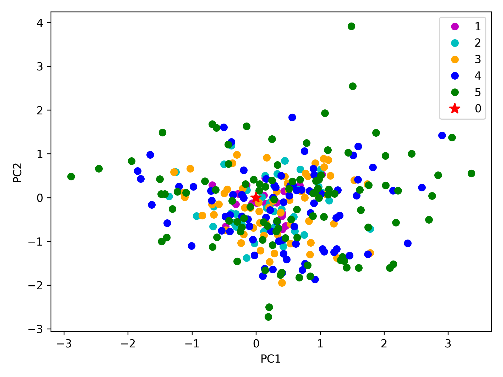
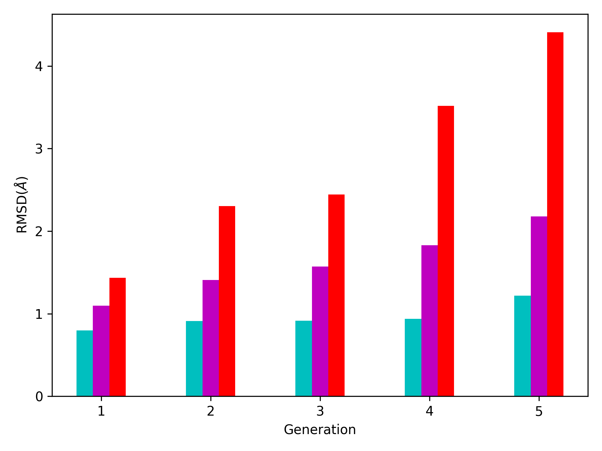
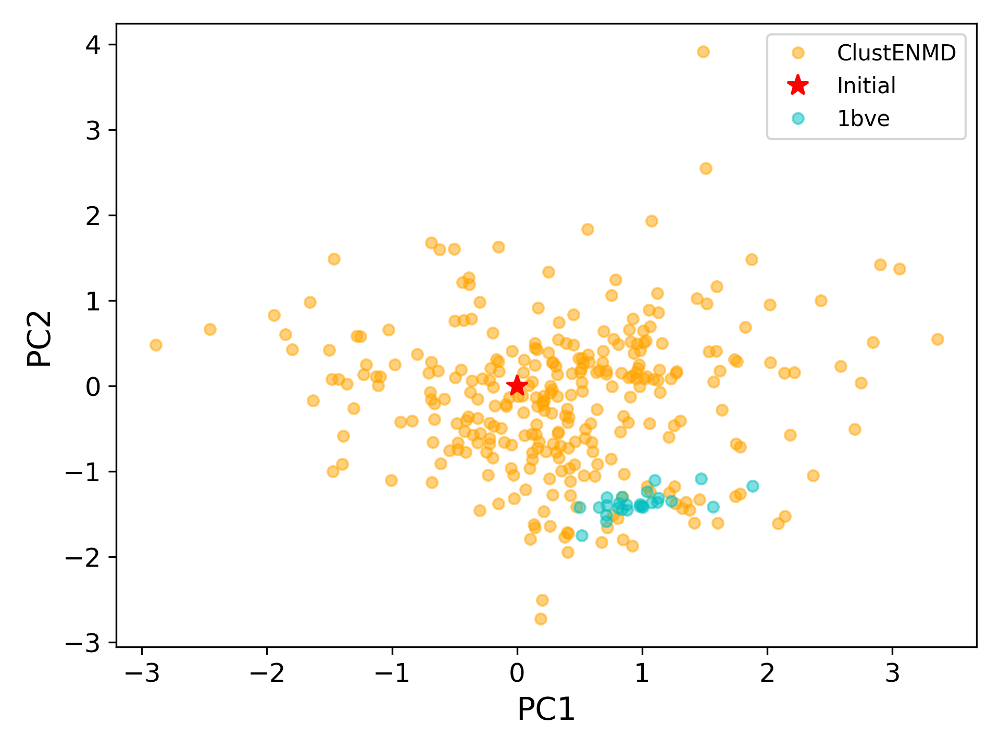

.. _clustenmd:

ClustENMD Simulation and Analysis
===============================================================================

First, we will make the following necessary imports ProDy_, NumPy_, and Matplotlib_ 
if you haven't already done it:

.. ipython:: python
   :verbatim:

   import numpy as np
   import matplotlib.pyplot as plt
   from prody import *
   plt.ion()

Preparing the system and ClustENMD simulation
-------------------------------------------------------------------------------

We start our calculations by parsing the structure, from which we would like to sample
conformations. For this tutorial, we will fetch the X-Ray structure of HIV-1 protease 
in an open conformation in the absence of any inhibitor (PDB id: 1tw7) from the PDB server.

It is important to note that if the starting structure is provided by the user, it 
should satisfy the PDB file standards, e.g., the chain IDs need to be set properly.

The pdb file (PDB id: 1tw7) is fetched by the method :func:`.parsePDB`. Please check the 
`ProDy Basics tutorials <http://prody.csb.pitt.edu/tutorials/prody_tutorial/basics.html>`_ 
for the details.

.. ipython:: python
   :verbatim:

   pdb = parsePDB('1tw7', compressed=False)

.. parsed-literal::

   @> PDB file is found in working directory (1tw7.pdb).
   @> 1890 atoms and 1 coordinate set(s) were parsed in 0.03s.
   
ClustENMD is implemented as a ProDy class, named as :class:`ClustENM`, so we can instantiate an object of it. You can provide a title, but it is optional.

.. ipython:: python
   :verbatim:

   clustenm = ClustENM()

Before running a simulation, we need to set the atom group that we would like to use. This 
method uses PDBFixer to add all hydrogen atoms as well as any missing heavy atoms in any 
partially resolved residues. Note that even though PDBFixer can add any residues/segments 
that are not resolved in the PDB structure, we are not using this option of PDBFixer. Instead, 
we leave modeling of those parts to the user. User-provided models should include chain IDs in 
their PDB files.

At this step, you can also set the pH level of the solution to select the protonation states 
for adding hydrogens by setting the ``pH`` parameter (default ``pH=7.0``).

.. ipython:: python
   :verbatim:

   clustenm.setAtoms(pdb)

.. parsed-literal::

   @> Fixing the structure ...
   @> 3108 atoms and 1 coordinate set(s) were parsed in 0.03s.
   @> The structure was fixed in 1.91s.
    
After setting the atoms, you can write the fixed PDB file by the method :meth:`.ClustENM.writePDBFixed`.

.. ipython:: python
   :verbatim:

   clustenm.writePDBFixed()

A ClustENMD simulation is started by the :meth:`.ClustENM.run` method. This method accepts numerous 
parameters, and we will only cover the essential ones to perform a simulation in this tutorial. 
Therefore, we would like to encourage the readers to refer to the docstring of this method for 
the description of all parameters.

As this method is iterative, the user needs to set the number of generations (default ``n_gens=5``). 
Depending on the system size, its flexibility, and the computational resources available, the user 
can increase or decrease the number of generations. In this tutorial, we are using its default value.

The parameters regarding the main steps of the method can be grouped as follows:

1. **ANM sampling:**

   ``cutoff`` : Cutoff distance (Angstrom) for pairwise
   interactions used in ANM computations (default is 15.0).

   ``n_modes`` : Number of global modes for sampling (default is 3).

   ``n_confs`` : Number of new conformers generated from each parent
   conformer (default is 50).

   ``rmsd`` : RMSD (Angstrom) of new conformers with
   respect to the parent (default is 1.0).

   ``v1`` : Full enumeration of ANM modes, which is used in the original
   ClustENM method (default is False; see below).

   In the current ClustENMD version, ANM sampling is done randomly by
   the ProDy method ``sampleModes``, where the ``rmsd`` value corresponds to
   the average RMSD of the new conformers with respect to the parent
   conformer. As the bigger RMSD value yields larger excursions from the
   parent, the user should be cautious on increasing its value. 
   
   In contrast, the original ClustENM [KD16]_ uses the full enumeration 
   (all possible combinations) of ANM modes with fixed maximum RMSD, 
   which can be enabled by setting ``v1=True``. 
   
   In both cases, we suggest using the first 3 to 5 global modes as 
   they are known to facilitate the conformational transitions.

   The ``rmsd`` parameter can be not only set to a single value across the
   generations, but also provided exclusive to each generation as a
   tuple, e.g., ``rmsd=(1.0, 1.5, 1.5)``.

2. **Clustering:**

   ``maxclust`` : Maximum number of clusters to be formed in each
   generation (default is None).

   ``threshold`` : RMSD threshold to apply when forming clusters
   (default is None).

   We are using `SciPy hierarchical clustering
   library <https://docs.scipy.org/doc/scipy/reference/cluster.hierarchy.html>`_
   to cluster the conformers in each generation. Either ``maxclust`` or
   ``threshold`` parameter must be specified by the user. As a
   guideline, we suggest to use the ``maxclust`` parameter. Furthermore,
   the parameters can be not only set to a single value across the
   generations, but also provided exclusive to each generation as a
   tuple, e.g., ``maxclust=(20, 40, 60)``. Increasing the number of
   maximum clusters in subsequent generations allows for maximum
   excursion from the initial structure, thus should be preferred.

3. **Relaxation via MD simulations:**

   ``temp`` : Temperature at which the simulation is conducted (default
   is 303.15 K).

   ``solvent`` : Solvent model to be used. Default is ``'imp'``, which
   corresponds to the implicit solvent model (``'amber99sbildn.xml'``,
   ``'amber99_obc.xml'``). To choose the explicit solvent model
   (``'amber14-all.xml'``, ``'amber14/tip3pfb.xml'``), ``solvent`` should be set
   to ``'exp'``. The user may choose other force fields available in
   OpenMM, please see the description of ``force_field`` parameter.
   However, only the default force-fields named above have been tested in 
   ClustENMD so far. In the current implementation of ClustENMD,
   implicit solvent model is applicable to protein chains only. If there
   are any DNA/RNA chains in your structure, ClustENMD automatically
   uses explicit solvent.

   ``padding`` : Padding distance to be used for solvation (default is
   1.0 nm).

   ``ionicStrength`` : Total concentration of ions (both positive and
   negative) to add. This does not include ions that are added to
   neutralize the system. Default concentration is 0.0 molar.

   ``tolerance`` : Energy tolerance to be used for performing a local energy minimization on the system
   (default is 10.0 kJ/mole).

   ``maxIterations`` : Maximum number of iterations to perform during
   energy minimization. If this is 0 (default), minimization is
   continued until the results converge without regard to how many
   iterations it takes.

   ``sim`` : A short MD simulation using a time step of 2.0 fs is
   performed if ``sim=True``. Note that there is also a *heating-up
   phase* until the desired temperature is reached before the short MD
   simulation. If ``sim`` is set to False, only energy minizimation is
   performed. If only a heating-up phase is to be performed, the
   parameters ``t_steps_i`` and ``t_steps_g`` should be set to 0 with
   ``sim=True`` (please see below).

   ``t_steps_i`` : Number of simulation steps for the starting
   conformer, i.e. zeroth generation, (default is 1000).

   ``t_steps_g`` : Number of simulation steps for all conformers except
   the starting conformer, (default is 7500). If desired, time steps for
   subsequent generations can be varied and given as a tuple, e.g.,
   (3000, 5000, 7000).

   ``platform`` : Achitecture on which the OpenMM runs (default is
   None). It can be chosen as ``'CUDA'``, ``'OpenCL'``, or ``'CPU'``. For
   efficiency, ``'CUDA'`` or ``'OpenCL'`` is highly recommended.

We suggest to use implicit solvation and GPU platform for computational efficiency. 
Default parameters are highly efficient on GPU platform for proteins comprising several 
thousand residues. For larger assemblies, the user may prefer: (*i*) to decrease the 
number of clusters and/or generations, (*ii*) to perform only energy minimization with/out 
heating-up phase, or (*iii*) to carefully shrink the padding distance in explicit solvent.

Running a ClustENMD simulation
-------------------------------------------------------------------------------

In the following, we will perform a ClustENMD simulation of 5 generations using the first 
3 global modes. Relaxation of conformers is carried out in implicit solvent via energy 
minimization followed by a heating-up phase. We are conducting the simulation on a GPU platform. 
Simulation details will be printed out during execution.

.. ipython:: python
   :verbatim:

   clustenm.run(n_modes=3, n_gens=5,
                maxclust=tuple(range(20, 120, 20)),
                sim=True, solvent='imp',
                t_steps_i=0, t_steps_g=0,
                platform='CUDA')

.. parsed-literal::

   @> Kirchhoff was built in 0.02s.
   @> Generation 0 ...
   @> Minimization & heating-up in generation 0 ...
   @> Completed in 1.94s.
   @> #-------------------/``*``\\-------------------#
   @> Generation 1 ...
   @> Sampling conformers in generation 1 ...
   @> Hessian was built in 0.07s.
   @> 3 modes were calculated in 0.04s.
   @> Parameter: rmsd = 1.00 A
   @> Parameter: n_confs = 50
   @> Modes are scaled by 24.611726681118544.
   @> Clustering in generation 1 ...
   @> Centroids were generated in 0.24s.
   @> Minimization & heating-up in generation 1 ...
   @> Structures were sampled in 33.37s.
   @> #-------------------/``*``\\-------------------#
   @> Generation 2 ...
   @> Sampling conformers in generation 2 ...
   @> Hessian was built in 0.07s.
   @> 3 modes were calculated in 0.08s.
   @> Parameter: rmsd = 1.00 A
   @> Parameter: n_confs = 50
   @> Modes are scaled by 21.96801859205728.
   @> Hessian was built in 0.06s.
   @> 3 modes were calculated in 0.07s.
   ...
   @> #-------------------/``*``\\-------------------#
   @> Generation 5 ...
   @> Sampling conformers in generation 5 ...
   @> Hessian was built in 0.06s.
   @> 3 modes were calculated in 0.03s.
   @> Parameter: rmsd = 1.00 A
   @> Parameter: n_confs = 50
   @> Modes are scaled by 19.25666801776903.
   ...
   @> Clustering in generation 5 ...
   @> Centroids were generated in 14.04s.
   @> Minimization & heating-up in generation 5 ...
   @> Structures were sampled in 174.84s.
   @> #-------------------/``*``\\-------------------#
   @> Creating an ensemble of conformers ...
   @> Ensemble was created in 0.00s.
   @> All completed in 558.38s.

The generated conformers are stored in a ClustENM ensemble object. For future reference, the 
parameters set for a simulation can be saved into a file by the method :meth:`.ClustENM.writeParameters`:

.. ipython:: python
   :verbatim:

   clustenm.writeParameters()

As ClustENM ensemble is actually a `ProDy ensemble <http://prody.csb.pitt.edu/manual/reference/ensemble/index.html>`_, 
we can also save it by using the :func:`.saveEnsemble` method:

.. ipython:: python
   :verbatim:

   saveEnsemble(clustenm)

.. parsed-literal::

   '1tw7_clustenm.ens.npz'

We also provide a method, called :meth:`.ClustENM.writePDB`, to write the conformers into a PDB file. The 
boolean parameter ``single`` (default is ``True``) of this method controls whether the conformers 
are stored as models in a single PDB file, or each of them are saved as a separate PDB file.

.. ipython:: python
   :verbatim:

   clustenm.writePDB()

.. parsed-literal::

   @> PDB file saved as 1tw7_clustenm.pdb
 
One can also load the previously saved ensemble using :meth:`.loadEnsemble`

.. ipython:: python
   :verbatim:

   saved_clustenm = loadEnsemble('1tw7_clustenm.ens.npz')
    
Features of ClustENM ensembles
-------------------------------------------------------------------------------

As we mentioned above, ClustENM class is derived from ProDy ensemble class, therefore the methods 
defined for the latter, such as :meth:`.ClustENM.getCoordsets`, :meth:`.ClustENM.superpose` and 
many more can apply to ClustENM objects as well. All conformers in generations (:math:`i=1,2,3,\ldots`) 
are automatically superposed onto the initial/zeroth conformer based on C\ :math:`^\alpha`-atoms 
during a ClustENMD simulation.

There are alternative ways of indexing the generated conformers. User can either index ClustENM 
object by ``clustenm[3]``, which picks the 4th conformer (presumably the 2nd conformer in the 
1st generation) or equivalently with the generation number and an index as ``clustenm[1, 2]``. 
Note that indices start from 0.

Let’s check we obtain the same coordinates by two alternative methods:

.. ipython:: python
   :verbatim:

   np.allclose(clustenm[3].getCoords(), clustenm[1, 2].getCoords())

.. parsed-literal::

   True

A ClustENM object supports slicing as well. For example, if we want to select the 4th conformer 
for every generation, then we only need to specify the index of the conformer in the second slot 
and select all in the first slot. If the desired conformers are not available in a particular 
generation, then they will be skipped.

.. ipython:: python
   :verbatim:

   clustenm[:, 3]

.. parsed-literal::

   <ClustENM: 1tw7_clustenm (5 conformations; 3108 atoms)>

We can access the coordinates of these conformers by the :meth:`.ClustENM.getCoordsets` method:

.. ipython:: python
   :verbatim:

   clustenm[:, 3].getCoordsets()

.. parsed-literal::

   array([[[ -3.95957387,  32.35691799,  -4.37383242],
            [ -4.94566778,  32.35594469,  -4.59228821],
            [ -3.63788137,  31.46009385,  -4.70897438],
            ...,
            [ -2.37337274,  29.5071206 ,  -3.7201629 ],
            [ -1.39627789,  29.60381804,  -3.27034612],
            [ -7.98974581,  31.21050202,  -4.31887029]],

            [[ -6.89570222,  32.89490785,  -5.27764023],
            [ -7.80893237,  32.7297113 ,  -5.67617107],
            [ -6.31021832,  32.07285054,  -5.23854147],
            ...,
            [ -5.32171232,  30.53324814,  -3.46080742],
            [ -4.58778402,  30.86851485,  -2.74293152],
            [-10.41683474,  31.15561532,  -5.46381784]],

            [[ -6.3447726 ,  34.20123262,  -5.5673921 ],
            [ -7.22727328,  34.01664711,  -6.02260974],
            [ -5.82362403,  33.34645491,  -5.43376411],
            ...,
            [ -4.07602444,  31.36764316,  -4.08790043],
            [ -3.22430149,  31.72057964,  -3.52540378],
            [-10.13066977,  31.95881599,  -6.06925207]],

            [[ -6.03426394,  33.17008188,  -5.2525952 ],
            [ -6.90546384,  32.76869162,  -5.56882538],
            [ -5.41631979,  32.40739972,  -5.01477094],
            ...,
            [ -4.18322255,  30.96462084,  -3.54549089],
            [ -3.39843848,  31.42003303,  -2.95973127],
            [-10.00982495,  30.65422159,  -6.45285668]],

            [[ -5.90545369,  33.39176383,  -5.49324755],
            [ -6.79399411,  33.26907861,  -5.95751872],
            [ -5.56441284,  32.44150355,  -5.52143941],
            ...,
            [ -2.89975089,  29.95653924,  -5.45052765],
            [ -1.8757943 ,  30.2292032 ,  -5.24180161],
            [ -9.38759977,  30.58004821,  -5.53001208]]])

On the other hand, we may want to select all the conformers of a specific generation. It is then 
enough to set the index of the generation in the first slot and select all in the second slot.

.. ipython:: python
   :verbatim:

   clustenm[3, :]

.. parsed-literal::

   <ClustENM: 1tw7_clustenm (60 conformations; 3108 atoms)>

Analysing the results
-------------------------------------------------------------------------------

We would like to show how the computed conformers populate the conformational space as regards 
the essential dynamics of the structure. For this aim, we perform a principal component analysis 
(PCA) on the generated ensemble. Next, we will project the conformers onto the space spanned by 
the first two PCs, which explain the highest variance of the ensemble. This can be done using 
`ProDy ensemble analysis <http://prody.csb.pitt.edu/tutorials/ensemble_analysis/>`_.

We are calculating PCs based on the C\ :math:`^\alpha`-atoms. This selection can be done directly 
on the ClustENM object.

.. ipython:: python
   :verbatim:

   clustenm.select('ca')

.. ipython:: python
   :verbatim:

   clustenm

.. parsed-literal::

   <ClustENM: 1tw7_clustenm (301 conformations; selected 198 of 3108 atoms)>

.. ipython:: python
   :verbatim:

   pca_clustenm = PCA()
   pca_clustenm.buildCovariance(clustenm)
   pca_clustenm.calcModes()

.. parsed-literal::

   @> Covariance is calculated using 301 coordinate sets.
   @> Covariance matrix calculated in 0.016746s.
   @> 20 modes were calculated in 0.06s.

We can observe the progression of the conformers by coloring them in successive generations (from initial/zeroth to the last/fifth).

.. ipython:: python
   :verbatim:

   with plt.style.context({'figure.dpi': 300,
                           'axes.labelsize': 'x-large',
                           'xtick.labelsize': 'large',
                           'ytick.labelsize': 'large'}):
       colors = ['r', 'm', 'c', 'orange', 'blue', 'green']
       plt.figure()
       for i in range(1, clustenm.numGenerations() + 1):
           showProjection(clustenm[i, :], pca_clustenm[:2],
                          c=colors[i], label='%d'%i)
       showProjection(clustenm[0, :], pca_clustenm[:2],
                      c=colors[0], label='0',
                      marker='*', markersize=10)
       plt.xlabel('PC1')
       plt.ylabel('PC2')
       plt.legend()
       plt.tight_layout()
       plt.show()

The median and maximum RMSDs with respect to the initial conformer can be calculated for the whole ensemble by

.. ipython:: python
   :verbatim:

   rmsds = clustenm.getRMSDs()

.. ipython:: python
   :verbatim:

   np.median(rmsds), np.max(rmsds)

.. parsed-literal::

   (1.6681441595969058, 4.407775779940453)

One can also check the RMSDs of the conformers in each generation with respect to the initial conformer:

.. ipython:: python
   :verbatim:

   rmsd_gens = []
   for i in range(1, clustenm.numGenerations()+1):
       tmp = calcRMSD(clustenm.getCoords(),
                         clustenm[i, :].getCoordsets())
       rmsd_gens.append([tmp.min(), tmp.mean(), tmp.max()])
   rmsd_gens = np.array(rmsd_gens)

.. ipython:: python
   :verbatim:

   with plt.style.context({'figure.dpi': 300,
                           'axes.labelsize': 'x-large',
                           'xtick.labelsize': 'large',
                           'ytick.labelsize': 'large'}):
       plt.figure()
       plt.bar(np.arange(1, 6)-0.15, rmsd_gens[:, 0],
               width=.15, color='c', label='min')
       plt.bar(np.arange(1, 6), rmsd_gens[:, 1],
               width=.15, color='m', label='mean')
       plt.bar(np.arange(1, 6)+0.15, rmsd_gens[:, 2],
               width=.15, color='r', label='max')
       plt.xlabel('Generation')
       plt.ylabel(r'RMSD($\AA$)')
       plt.tight_layout()
       plt.show()

We want to also observe if our conformers approach the closed state of HIV-1 protease. For this purpose, an NMR ensemble of 28 models (PDB ID: 1bve with closed flaps) is projected onto the same subspace.

Let’s first fetch these models and superpose them onto the initial/zeroth conformer. For 
this step, we generate a temporary ensemble of NMR models.

.. ipython:: python
   :verbatim:

   closed = parsePDB('1bve', subset='ca', compressed=False)

.. parsed-literal::

   @> PDB file is found in working directory (1bve.pdb).
   @> 198 atoms and 28 coordinate set(s) were parsed in 0.10s.
    
.. ipython:: python
   :verbatim:

   ens_cl = Ensemble()
   ens_cl.setAtoms(closed)
   ens_cl.setCoords(clustenm.getCoords())
   ens_cl.addCoordset(closed.getCoordsets())
   ens_cl.superpose()

.. parsed-literal::

   @> Superposition completed in 0.03 seconds.
    
At this point, we will project both ClustENMD and NMR conformers on the subspace 
spanned by the first two PCs of the ClustENMD ensemble.

.. ipython:: python
   :verbatim:

   with plt.style.context({'figure.dpi': 300,
                           'axes.labelsize': 'x-large',
                           'xtick.labelsize': 'large',
                           'ytick.labelsize': 'large'}):
       plt.figure()
       showProjection(clustenmd, pca_clustenmd[:2],
                         c='orange', markersize=5, alpha=.5, label='ClustENMD')
       showProjection(clustenmd[0], pca_clustenmd[:2],
                         c='r', marker='*', markersize=10, label='Initial')
       showProjection(ens_cl[2:], pca_clustenmd[:2],
                         markersize=5, c='c', label='1bve', alpha=.5)
       plt.xlabel('PC1')
       plt.ylabel('PC2')
       plt.legend()
       plt.tight_layout()
       plt.show()

The figure above indicates that the unbiased conformer generation starting from the open state of HIV-1 protease (red star) 
can successfully encompass the NMR models representing its closed state (cyan dots). Each time you perform a ClustENMD run, 
you will obtain a unique ensemble due to the random sampling and MD simulations. Therefore, it is good practice to perform at 
least three independent runs, and combine the resulting ensembles for analysis.

**Note:** In this tutorial we showed the variability of our generated conformers following the procedure in our original paper [KD16]_. 
An alternative approach could also be followed if there are enough experimentally resolved homologous structures representing alternative 
states of a flexible protein. In this approach, we can perform PCA on the ensemble of experimental structures and later project the ClustENMD 
conformers onto the subspace defined by PCs of experimental structures (see the examples in [KD21]_). The movie on the ClustENMD webpage displays 
how the distribution, generated by a Gaussian kernel estimate plot, of HIV-1 protease conformational ensemble progresses as more generations are included. 
In that movie, ClustENMD conformers are projected on the experimental PC1 vs PC2. Specifically, blue surfaces/levels correspond to the progress of 
the runs starting from open structure.
