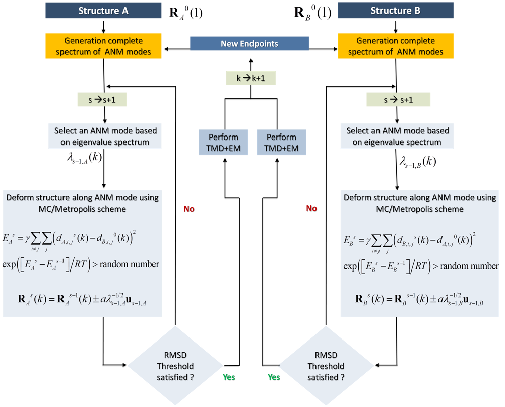

Background
==========

Biological functions of biomolecules is accomplished by conformational motions that enable the molecules to sample functional substates.  Some of these substates are short-lived, and therefore difficult (or even impossible) to detect experimentally. Here, computational tools are useful to predict plausible transition pathways, which can be probed experimentally. They may also provide insights into accessible conformational states, or the energy landscape, which often determines the structural changes taking place during interactions with other proteins and ligands. Full atomic MD simulations often fail in sampling large-scale cooperative changes in conformation (global motions) especially in the case of large molecular systems. Coarse-grained approaches like ANM fail in providing atomic details, while they provide an accurate description of global dynamics. We have developed a hybrid method, coMD, that takes advantage of the ability of ANM to sample global modes so as to direct MD simulations. This way we can sample global motions at full atomic resolution. Each step in coMD is a collective movement of the entire molecule along a given ANM mode, selected by a Monte Carlo/Metropolis algorithm.

Methodology
===========

Below is a schematic description of the methodology for sampling the transition pathway between two known structures A and B. The same approach can be used for sampling the conformational space in the vicinity of both substates, simply by defining the Metropolis criteria to accept all moves, irrespective of the energy change at the last step. Thus, the method can be used for either characterizing the pathway(s) between two endpoints A and B, or mapping the conformational space in general for exploring alternative 
substates.

In a nutshell, the method consists of the following steps applied to each endpoint in parallel: (i) selecting a given ANM mode using a Monte Carlo algorithm based on the weight (inverse eigenvalue, square root) of each mode, (ii) examining if this mode allows for approaching the other endpoint, and accepting/rejecting it with the help of a Metropolis algorithm based on an energy function that penalizes the increase in RMSD from the endpoint (this condition can be removed to allow for unconstrained sampling),  (iii) generate a target conformation based on the selected mode, (iv) use this target conformation to simulate (by TMD) the transition toward this target conformation - which defines an intermediate conformer in the process of sampling the transition path (or the conformational space), (v) energy minimize, and (vi) go back to step (i) by redefining the intermediate conformation as the new endpoint, until completion of the sampling (e.g. if the two endpoints generated in parallel are sufficiently close to each other).