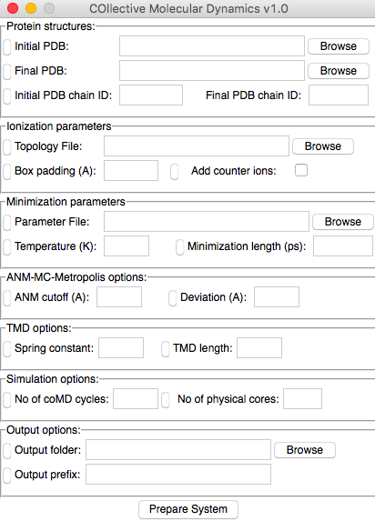

Introduction
============

Collective Molecular Dynamics is a VMD_ plugin GUI and a Python module developed for setup and analysis of simulations described in [MG13]_.

Installation
------------

1. VMD_ 1.9.2 or later is required for using GUI. `NAMD`_ is required for
   running molecular dynamics simulations and latest version of ProDy_ is required for elastic network model calculations. Following are required for performing coMD calculations:

  * Python_ 2.7
  * NumPy_ 1.3 or later

2. Download one of the following archive files:

  * `comd_plugin_files.tgz <comd_plugin_files.tgz>`_
  * `comd_plugin_files.zip <comd_plugin_files.zip>`_

3. Extract contents of the archive and copy :file:`comd` folder to
   VMD TCL plugins directory, i.e. :file:`$VMDDIR/plugins/noarch/tcl/`.

   Then, insert following line into :file:`$VMDDIR/scripts/vmd/loadplugins.tcl`
   at line 200::

     vmd_install_extension comd comd_tk "Modeling/DruGUI"

   If you are not sure where VMD directory is located, run :program:`vmd`, and
   type the following command line in the VMD console::

     global env; puts $env(VMDDIR)

coMD Plugin
-------------

Collective Molecular Dynamics (coMD) plugin, shown below, has a panel to
setup, collective molecular dynamics simulations:

  * :ref:`setup`

The rest of the tutorial will show you how to use this panel, and described
required inputs and outputs from analysis steps. 

Tutorial Files
--------------

Files in the following archives can be used to follow this tutorial:

  * `coMD Tutorial Files (TGZ) <comd_tutorial_files.tgz>`_
  * `coMD Tutorial Files (ZIP) <comd_tutorial_files.zip>`_

Here is a list of these files:

.. literalinclude:: files.txt

How to Cite
--------------
If you benefited from collective molecular dynamics in your research, please cite the
following paper:

.. [MG13] Gur M, Madura J, Bahar I `Global Transitions of Proteins Explored by a Multiscale Hybrid Methodology: Application to Adenylate Kinase <http://www.sciencedirect.com/science/article/pii/S000634951300934X>`_
   *Biophys J* **2013** 7:1643–1652

.. _NAMD: http://www.ks.uiuc.edu/Research/namd/
