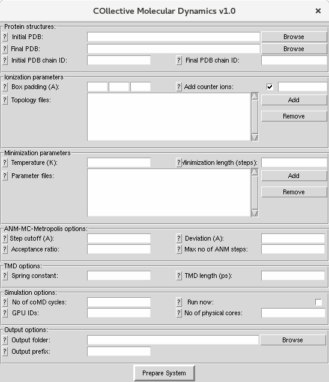

.. _setup:

Simulation Setup
================

A system that contains protein structures with water and counter ions in collective 
molecular dynamics simulations can be prepared using the following interface:

Input Files
-----------

:file:`.pdb` files for both initial and final structure of the protein are required from the user. You can learn how to prepare these files from `NAMD tutorials`_.

Protein Structures
------------------

1. First, select initial :file:`.pdb` (structure) files and final :file:`.pdb` 
   (structure) files. You can use the adelynate kinase files provided for 
   this tutorial (1ake.pdb, 4ake.pdb). Alternatively, structure and 
   coordinate files for a protein of interest can also be used. These 
   files should contain all atoms required for protein stability and
   function, these may include cofactors and metal atoms. Crystallographic 
   water molecules may also be retained in the structure. 

2. Select the corresponding chain IDs for initial and final structure. 
   For adenylate kinase both chain IDs should be 'A'. You can also select chains 
   containing non-protein components such as membrane. If you leave this box blank,
   all protein atoms will be selected.

Ionization Parameters
--------------------- 

1. To build the topology of the structure, a topology file needs to be
   provided. This file will parametrize the topology of structures e.g.
   bond lengths and bond angles. If not given, it will use CHARMM36
   all-hydrogen topology file for proteins and lipids. For more information
   visit `Topology`_ pages. 

2. Enter simulation box padding (distance from the protein to box surfaces)
   in x, y and z and select whether you would like to add counter ions and what concentration.
   Collective Molecular Dynamics GUI uses `Solvate`_ and `Autoionize`_ plugins to add
   water and ions.

Minimization Parameters
-----------------------

1. For every cycle, the structures (protein and water) will be minimized by using NAMD. 
   For parametrization of molecular dynamics simulation in NAMD, an input file is required. 
   If not given, it will use CHARMM36 all-hydrogen parameter files. For more information visit `Parameter`_ pages. 

2. For minimization, two additional parameters are required. The first one is the temperature
   at which the minimization will be performed and the second one is the total number of 
   steps to perform minimization.

Conformational Sampling with ANM Modes
--------------------------------------

For sampling of conformations with ANM modes, there are some optional parameters that all take default 
(recommended) values. 

ANM cutoff is the parameter to determine the contacts on the proteins for ANM calculations (default 15).

The second parameter is the maximum deviation for each step - this would be the RMSD for the first 
(largest amplitude) mode. From this, we derive a scale factor for perturbing structure in the direction 
of a given ANM mode. The default is 2 A.

Other important parameters are the acceptance ratio (default 0.9), which determines how many wrong 
direction moves are accepted versus right direction ones, and the maximum number of steps (default 100). 

Targeted Molecular Dynamics Parameters
--------------------------------------

For every cycle, after conformational sampling with ANM modes towards to the other structure, 
the side chains of the protein need to move by performing a fast targeted molecular dynamics
(TMD) simulation. In TMD simulations, two parameters are required. The first one is the spring 
constant (kcal/mol/A^2) and the second one is the length of TMD simulation (ps). For further 
information visit `TMD`_ pages. 

Simulation Options
------------------

coMD simulations will run in cycles and the number of cycles is the global parameter for them. 
The simulation will run until the number of cycles is achieved or the RMSD between initial and final
structure is less than 1.5 A or the reduction in the RMSD is less than 0.15 A. Also provided 
in this block are which GPUs and the number of physical cores to use for parallel NAMD simulations, 
and the option to run now or not. You would not run now if you intended to copy the files to a 
cluster for example.

Output Options
--------------

Here you select an output folder and a file prefix to distinguish different runs. 
Performing multiple simulations to see whether results are reproducible is always a good idea.

Output Files
------------

There will be an output folder with a python script (.py file), a tcl script (.tcl file), and two .pdb and 
.psf files. The tcl script should run from vmd. 

For a summary of contents of the final system, see :file:`prefix.log` file.

Simulation
----------

Now you need to run coMD simulations. To perform those simulations it is possible 
to use the following command::

   vmd –dispdev text –e your_output_prefix.tcl

If you want to run this simulation on a cluster, copy this directory on cluster and put the command on the queue system.

When simulations are complete, you can continue with following analysis steps.

.. _NAMD tutorials: http://www.ks.uiuc.edu/Training/Tutorials/
.. _Autoionize: http://www.ks.uiuc.edu/Research/vmd/plugins/autoionize/
.. _Solvate: http://www.ks.uiuc.edu/Research/vmd/plugins/solvate/
.. _Topology: http://www.ks.uiuc.edu/Training/Tutorials/namd/namd-tutorial-unix-html/node24.html
.. _Parameter: http://www.ks.uiuc.edu/Training/Tutorials/namd/namd-tutorial-unix-html/node25.html
.. _TMD: http://www.ks.uiuc.edu/Research/namd/2.10b1/ug/node47.html
