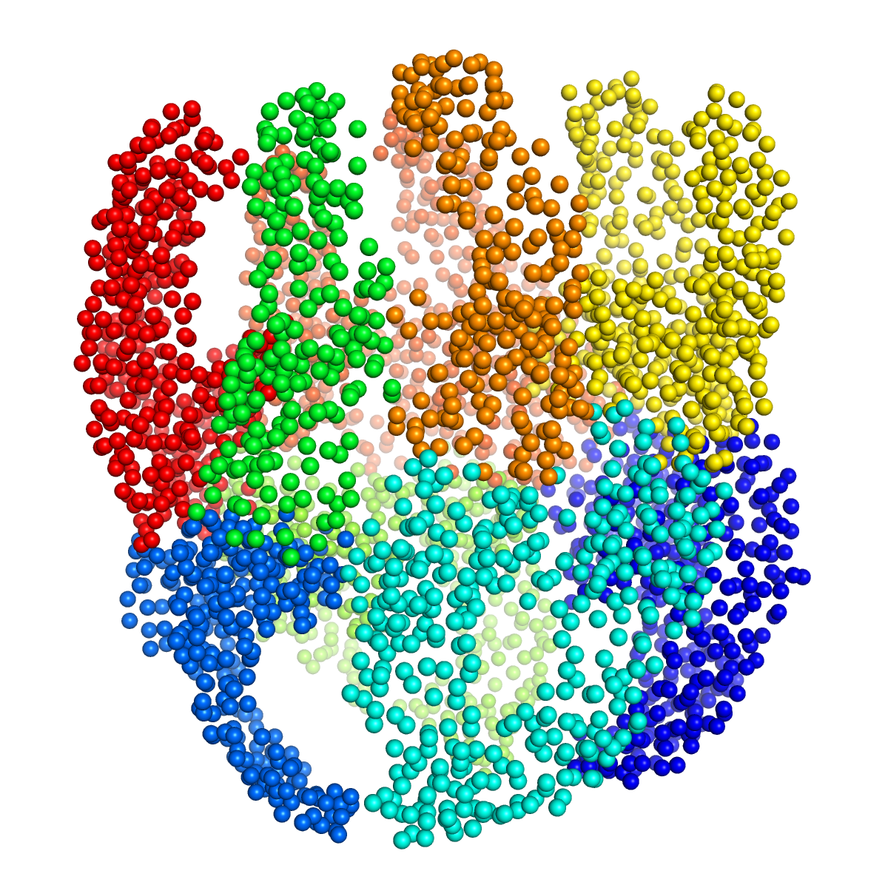

.. em_analysis:

Dynamical Domain Decomposition
==================================================================

Let's start with essential import statements:

.. ipython:: python

   from prody import *
   import numpy as np

We'll start by parsing the pseudo-atoms from a PDB file generated in the previous step.

.. ipython:: python

   emd = parsePDB('EMD-1961.pdb')

The order of pseudo-atoms generated by TRN is random and does not follow a sequence like 
residues in an atomic model do. Nor do they have no chain identifiers. 

As an alternative to reordering the pseudo-atoms and assigning residue and chain identifers 
to the pseudo-atoms based on the PDB structure in the previous section, we demonstrate here 
the use of dynamical domain decomposition using GNM modes with the function :func:`.calcGNMDomains`.
The number of dynamical domains obtained is approximately equal to the number of modes use so 
we use 8 modes to get about 8 domains as in our recent paper ([YZ20]_). 

.. ipython:: python

   gnm, _ = calcGNM(emd, selstr='all')
   domains = calcGNMDomains(gnm[:8])
   print(np.unique(domains))

We actually get 9 in this case as you will see in the figure at the end.

We can assign this data to the :class:`.AtomGroup` as follows:

.. ipython:: python

   emd.setData('domain', domains)

This allows the domains to be used for selection:

.. ipython:: python

   domain1 = emd.select('domain 1')
   print(domain1)

Finally, we save a domain-labelled pseudo-atom model to a PDB file for visualization and other 
downstream analyses, using the B-factor field for writing the domains:

.. ipython:: python

   writePDB('EMD-1961_domains.pdb', emd, beta=domains)

Visualisation of the resultant structure will look something like the following figure. 

We see 9 domains, including 7 pairs of domains and 2 individual domains. 

Another round of decomposition with each of the resulting domains can be used to divide them 
further. For example, we can decompose the first domain (index 0) into 4 dynamical domains
using the first 3 modes, which can be combined to create subunits or used as they are for comparison 
with dynamical domains for atomic models.

.. ipython:: python

   gnm0, domain0 = calcGNM(ag, selstr='domain 0')
   domains0 = calcGNMDomains(gnm0[:3])
   writePDB('EMD-1961_domain0_subdomains4.pdb', domain0, beta=domains0)
