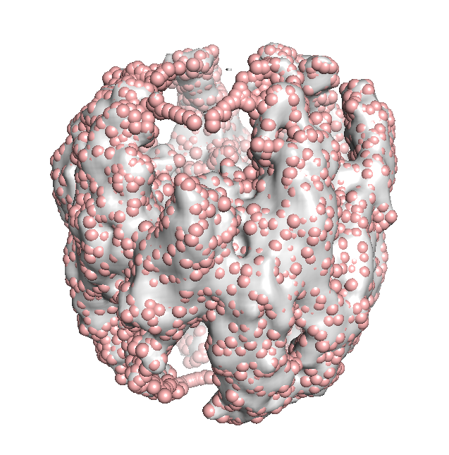

.. em_analysis:

Processing Cryo-EM Electron Density Maps
==================================================================

Let's start with essential import statements:

.. ipython:: python

   from prody import *
   import numpy as np

Parse Density Map
-----------------------------------------------------------------

The first step is to parse a .map file, which contains information
about a density map as the electron density at points on a grid.
This file format is a binary format also known as CCP4 or MRC2014. 

We provide parameters to return pseudoatom beads from the electron 
density map using the Topology Representing Network algorithm.

Note: Depending on your hardware and the system size, this may take a while. 
To skip this step, you can load the structure file for the beads directly in 
PDB format (EMD-1961.pdb; see below).

.. ipython:: python

   emd = parseEMD('1961', cutoff=1.2, n_nodes=3000)
   emd

This function returns an :class:`.AtomGroup` from the electron density
map. The **cutoff** parameter discards any electron density lower than
the given number and we select this based on the suggestion on the `EMDB`_ website. 
In this case, we raise it slightly to remove unassigned density inside the CCT rings.

The parameter **n_nodes** describes the total number of beads in the system, 
which we choose to be a few times smaller than the number of residues to 
increase efficiency and account for the low resolution. 

This procedure is an iterative one and **num_iter** can be used to set the 
number of them (the default value is 20).

The resultant structure will look something like the following figure. 

Now that the 144x144x144 density grid is converted into an 
:class:`.AtomGroup` object, elastic network model analysis 
can be applied to the constructed structure as usual. 

First, let's save the structure so we can use it later:

.. ipython:: python

   writePDB('EMD-1961.pdb', emd)

Map pseudo-atoms to PDB atomic model
-----------------------------------------------------------------

To save time, you may parse pseudo-atoms from a PDB file generated as
above. We also parse the PDB model for comparison later.

.. ipython:: python

   emd = parsePDB('EMD-1961.pdb')
   pdb = parsePDB('4a0v', subset='ca')

The order of pseudo-atoms generated by TRN is random and does not follow a sequence like 
residues in an atomic model do. Also, they have no chain identifiers. For the purpose of 
visualization and later comparative analyses, we reorder the pseudo-atoms and assign the 
residue and chain identifers to the pseudo-atoms based on the PDB structure in the following section. 

Unique one-to-one mapping of pseudo-atoms to an atomic model is nontrivial, 
since there is no correspondence between the beads and the residues of the 
protein. For simplicity, here we use the k-nearest neighbors algorithm to 
find 20 closest residues in the atomic model to a given pseudo-atom. Then 
we create a one-to-one mapping by assigning the closest residue, or the 
next closest if it is already assigned, to a pseudo-atom. Note that this 
is by no means the optimal one-to-one mapping, and for more complicated methods 
which guarantees the optimal mapping, see for example the "stable marriage problem".

.. ipython:: python

   from sklearn.neighbors import NearestNeighbors
   mapping = []
   nbrs = NearestNeighbors(n_neighbors=20, algorithm='ball_tree').fit(pdb.getCoords())
   _, indices = nbrs.kneighbors(emd.getCoords())
   for neighbors in indices:
      for i in neighbors: 
         if i not in mapping:
            mapping.append(i)
            break
            
   indices = np.array(mapping)
   I = np.argsort(indices)

Note that ``indices`` returned from :class:`~sklearn.NearestNeighbors` is a 2-D array with 
rows corresponding to pseudo-atoms and columns their k-neighbors. After being processed by the 
for-loop above, each element of ``indices`` is the index of the residue in the atomic model 
that should be assigned to the pseudo-atom. Then, :func:`~numpy.argsort` is applied to obtain 
indices for reordering the pseudo-atoms following the order of the atoms (residues) in the 
atomic model. 

We first create a :class:`AtomMap` for the atomic model with only the residues that were mapped 
to a pseudo-atom.

.. ipython:: python

   pmap = AtomMap(pdb, indices[I])

Then we create a new :class:`AtomGroup` for the pseudo-atoms based on the mapping, such that 
they are ordered according to the sequence of residues they are assigned to:

.. ipython:: python

   emd2 = AtomMap(emd, I).toAtomGroup()
   resnums = pmap.getResnums()
   emd2.setResnums(resnums)

   chids = pmap.getChids()
   emd2.setChids(chids)

Now we can calculate the RMSD between the pseudo-atoms and their mapped residues in the 
atomic model:

.. ipython:: python

   calcRMSD(emd2, pmap)

Finally, we save the ordered pseudo-atom model to a PDB file for visualization and other 
downstream analyses:

.. ipython:: python

   writePDB('EMD-1961_mapped.pdb', emd2)

Elastic Network Model Analysis
==================================================================

Elastic network model analysis can be applied to the pseudo-atomic model as usual. 
We use ``cutoff=20`` to account for the level of coarse-graining (see [PD02]_).

.. [PD02] P. Doruker, R.L. Jernigan, I. Bahar,
    Dynamics of large proteins through hierarchical levels of coarse-grained structures,
    *J. Comput. Chem.* **2002** 23:119-127.

.. ipython:: python
   
   anm_emd = ANM('TRiC EMDMAP ANM Analysis')
   anm_emd.buildHessian(emd2, cutoff=20)
   anm_emd.calcModes(n_modes=5)
   writeNMD('tric_anm_3_modes_3000nodes.nmd', anm_emd[:3], emd2)

Compare results with atomic models
-----------------------------------------------------------------

For comparison, let's perform ENM analysis for the atomic model (i.e. ``pmap`` we 
created earlier) as well, and apply the reduced model to it to treat residues 
that are not assigned to a pseudo-atom as the environment.

.. ipython:: python

   anm_pdb = ANM('4a0v ANM')
   anm_pdb.buildHessian(pdb)
   
   anm_pdb_reduced, _ = reduceModel(anm_pdb, pdb, pmap)

   anm_pdb_reduced.calcModes(n_modes=5)

Now we compare modes of the pseudo-atomic model to the atomic model:

.. ipython:: python

   @savefig cryody_anm_overlap.png width=4in
   showOverlapTable(anm_emd, anm_pdb_reduced)

