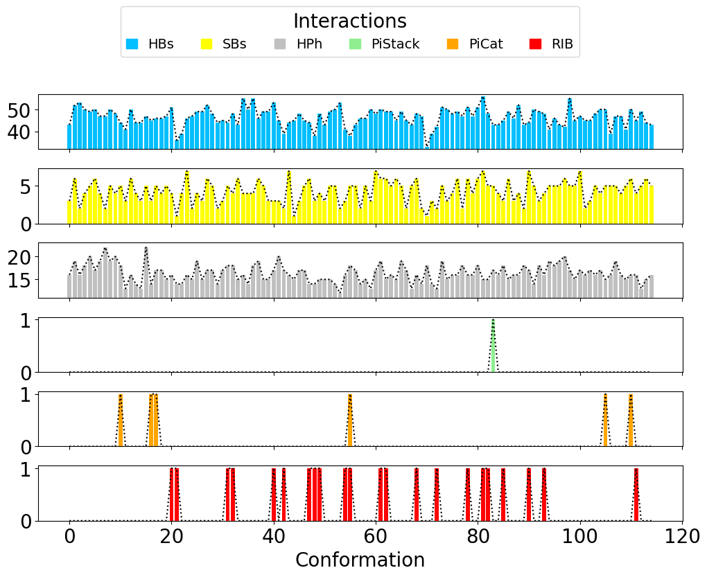
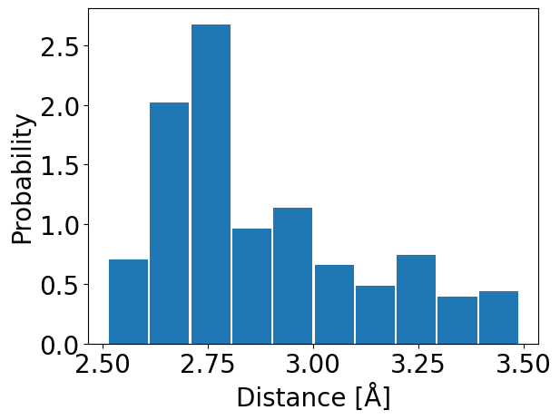
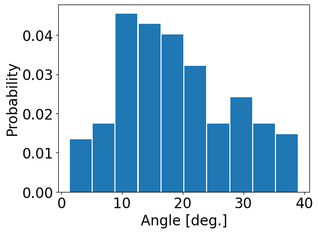
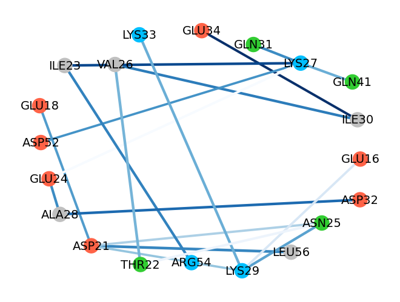

.. _insty_tutorial:

Ensemble PDB analysis
===============================================================================

This example shows how to compute interactions for an Ensemble PDB
(e.g. NMR data). The example is prepared for a NMR structure of ubiquitin 
(PDB: **2K39**) and visualize the results using Matplotlib_ library and VMD_ program. 

Parse structure
-------------------------------------------------------------------------------

We start by parsing PDB file which contain multiple conformations of
ubiquitin structure.

.. ipython:: python
   :verbatim:

   atoms = parsePDB('2k39')

.. parsed-literal::

   @> Connecting wwPDB FTP server RCSB PDB (USA).
   @> 2k39 downloaded (2k39.pdb.gz)
   @> PDB download via FTP completed (1 downloaded, 0 failed).
   @> 1231 atoms and 116 coordinate set(s) were parsed in 0.29s.

Compute interactions for an Ensemble PDB
-------------------------------------------------------------------------------

To compute hydrogen bonds for each frame use :func:`.calcHydrogenBondsTrajectory`
function:

.. ipython:: python
   :verbatim:

   calcHydrogenBondsTrajectory(atoms)

.. parsed-literal::

   @> Model: 0
   @> Calculating hydrogen bonds.
   @>      DONOR (res chid atom)   <--->       ACCEPTOR (res chid atom)    Distance  Angle
   @>      GLN49    A       NE2_784  <--->      GLU51    A       OE2_820     2.6    16.2
   @>      LYS11    A        NZ_175  <--->      GLU34    A       OE1_547     2.6     7.0
   @>      GLY10    A         N_160  <--->       THR7    A         O_116     2.7    19.8
   @>      ARG72    A        N_1149  <--->      GLN40    A         O_624     2.7    21.1
   @>      ARG72    A      NH1_1158  <--->      GLN40    A       OE1_628     2.7     7.5
   @>       LYS6    A          N_91  <--->      LEU67    A        O_1062     2.7     2.6
   @>      GLU34    A         N_540  <--->      ILE30    A         O_473     2.8    28.2
   @>      THR55    A         N_870  <--->      ASP58    A       OD2_921     2.8    19.7
   @>      ILE44    A         N_698  <--->      HIS68    A        O_1081     2.9    20.2
   @>      THR55    A       OG1_875  <--->      ASP58    A       OD2_921     2.9    13.2
   @>      LYS29    A         N_448  <--->      ASN25    A         O_389     2.9    13.6
   @>      LEU73    A        N_1173  <--->      LEU71    A        O_1133     2.9    27.8
   @>      HIS68    A        N_1078  <--->      ILE44    A         O_701     2.9    21.8
   @>      THR14    A       OG1_227  <--->       ILE3    A          O_39     2.9    13.1
   @>      GLU51    A         N_812  <--->      TYR59    A        OH_937     3.0    23.4
   @>      GLU64    A        N_1019  <--->       GLN2    A          O_22     3.0    23.2
   @>      LEU50    A         N_793  <--->      LEU43    A         O_682     3.0    15.3
   @>      GLN62    A         N_980  <--->      SER65    A       OG_1039     3.0    23.4
   @>      ILE13    A         N_203  <--->       VAL5    A          O_78     3.0    12.8
   @>      SER65    A        N_1034  <--->      GLN62    A         O_983     3.0    18.3
   @>      VAL17    A         N_270  <--->       MET1    A           O_3     3.0     8.8
   @>      ASN60    A         N_947  <--->      SER57    A         O_906     3.1    28.5
   @>      LYS33    A         N_518  <--->      LYS29    A         O_451     3.1    33.1
   @>      VAL70    A        N_1114  <--->      ARG42    A         O_658     3.1    17.9
   @>      ASP32    A         N_506  <--->      ALA28    A         O_441     3.1    10.6
   @>      LEU67    A        N_1059  <--->       PHE4    A          O_58     3.1    32.7
   @>       THR7    A         N_113  <--->      LYS11    A         O_170     3.1    10.9
   @>      LEU15    A         N_236  <--->       ILE3    A          O_39     3.1    18.3
   @>      GLU18    A         N_286  <--->      ASP21    A       OD2_333     3.1    29.0
   @>      ILE61    A         N_961  <--->      LEU56    A         O_887     3.1    32.1
   @>      GLN41    A       NE2_646  <--->      LYS27    A         O_419     3.1    30.7
   @>       PHE4    A          N_55  <--->      SER65    A        O_1037     3.2    15.4
   @>       ILE3    A          N_36  <--->      LEU15    A         O_239     3.2    33.3
   @>      LYS48    A         N_754  <--->      PHE45    A         O_720     3.2    18.9
   @>      ARG42    A         N_655  <--->      VAL70    A        O_1117     3.2    24.8
   @>      SER57    A         N_903  <--->      PRO19    A         O_304     3.3    29.1
   @>      PHE45    A         N_717  <--->      LYS48    A         O_757     3.3    15.6
   @>       GLN2    A        NE2_27  <--->      THR14    A       OG1_227     3.3    19.4
   @>      GLN41    A         N_638  <--->      PRO38    A         O_598     3.4    33.7
   @>      THR66    A      OG1_1050  <--->      GLU64    A        O_1022     3.4    28.3
   @>      LEU56    A         N_884  <--->      ASP21    A         O_329     3.4    23.8
   @>      ALA28    A         N_438  <--->      GLU24    A         O_374     3.5    18.5
   @>      GLN41    A       NE2_646  <--->      PRO37    A         O_584     3.5    26.0
   @> Number of detected hydrogen bonds: 43.
   @> Model: 1
   @> Calculating hydrogen bonds.
   @>      DONOR (res chid atom)   <--->       ACCEPTOR (res chid atom)    Distance  Angle
   @>       MET1    A           N_0  <--->      VAL17    A         O_273     2.5    28.9
   @>      LYS11    A        NZ_175  <--->      GLU34    A       OE1_547     2.5     7.3
   @>      LYS33    A        NZ_526  <--->      GLU16    A       OE2_263     2.6    12.7
   @>      SER65    A       OG_1039  <--->      GLN62    A         O_983     2.6    15.7
   @>      LYS27    A        NZ_424  <--->      ASP52    A       OD2_834     2.6    29.5
   @>      GLN62    A       NE2_988  <--->      ASN60    A       OD1_953     2.6    18.2
   @>      ARG74    A      NH2_1202  <--->      GLY76    A      OXT_1227     2.6    19.4
   @>      SER57    A        OG_908  <--->      THR55    A       OG1_875     2.6    24.1
   @>      ARG74    A       NE_1199  <--->      GLY76    A        O_1226     2.7    22.0
   @>      LYS29    A         N_448  <--->      ASN25    A         O_389     2.7    16.0
   @>      LYS29    A        NZ_456  <--->      GLU16    A       OE1_262     2.7    23.7
   @>      ILE13    A         N_203  <--->       VAL5    A          O_78     2.7    14.9
   @>      GLY35    A         N_555  <--->      GLN31    A         O_492     2.7    32.0
   @>      THR55    A       OG1_875  <--->      ASP58    A       OD2_921     2.7    19.9
   @>      LEU69    A        N_1095  <--->       LYS6    A          O_94     2.7    26.5
   @>      GLU51    A         N_812  <--->      TYR59    A        OH_937     2.7    21.7
   @>      GLU64    A        N_1019  <--->       GLN2    A          O_22     2.7     5.2
   @>      VAL70    A        N_1114  <--->      ARG42    A         O_658     2.7    22.0
   @>      THR55    A         N_870  <--->      ASP58    A       OD2_921     2.7    18.5
   @>       THR7    A       OG1_118  <--->      LYS11    A         O_170     2.7    23.8
   @>      ARG42    A         N_655  <--->      VAL70    A        O_1117     2.7    32.6
   @>      GLU34    A         N_540  <--->      ILE30    A         O_473     2.8    22.0
   @>      LEU15    A         N_236  <--->       ILE3    A          O_39     2.8    13.0
   @>      LEU67    A        N_1059  <--->       PHE4    A          O_58     2.8     9.7
   @>      LYS33    A        NZ_526  <--->      THR14    A         O_225     2.9    37.2
   @>       VAL5    A          N_75  <--->      ILE13    A         O_206     2.9    17.0
   @>       LYS6    A          N_91  <--->      LEU67    A        O_1062     2.9    14.9
   @>      VAL17    A         N_270  <--->       MET1    A           O_3     2.9     9.5
   @>      GLN41    A       NE2_646  <--->      ILE36    A         O_565     2.9    31.4
   @>      GLN41    A       NE2_646  <--->      LYS27    A         O_419     2.9    10.1
   @>      SER57    A         N_903  <--->      PRO19    A         O_304     2.9    33.8
   @>      ALA28    A         N_438  <--->      GLU24    A         O_374     2.9    26.2
   @>       THR7    A         N_113  <--->      LYS11    A         O_170     2.9    35.2
   @>      ILE61    A         N_961  <--->      LEU56    A         O_887     3.0    18.2
   @>       PHE4    A          N_55  <--->      SER65    A        O_1037     3.0     6.5
   @>      ARG72    A      NH2_1159  <--->      ASP39    A       OD2_616     3.0    25.5
   @>      GLU18    A         N_286  <--->      ASP21    A       OD2_333     3.0     1.5
   @>      HIS68    A        N_1078  <--->      ILE44    A         O_701     3.0    27.8
   @>      ILE30    A         N_470  <--->      VAL26    A         O_403     3.0    32.5
   @>      ILE44    A         N_698  <--->      HIS68    A        O_1081     3.0    19.2
   @>      ASN25    A         N_386  <--->      THR22    A       OG1_343     3.1    38.5
   @>      ASP21    A         N_326  <--->      GLU18    A         O_289     3.1    21.6
   @>      ARG72    A        N_1149  <--->      GLN40    A         O_624     3.1    13.3
   @>      GLN40    A         N_621  <--->      PRO37    A         O_584     3.1    21.1
   @>      LYS27    A         N_416  <--->      ILE23    A         O_355     3.1    36.2
   @>      LYS33    A         N_518  <--->      LYS29    A         O_451     3.2    22.9
   @>      TYR59    A         N_926  <--->      THR55    A         O_873     3.3    20.9
   @>      ARG54    A         N_846  <--->      GLU51    A         O_815     3.3    24.1
   @>      VAL26    A         N_400  <--->      THR22    A         O_341     3.4    23.5
   @>      GLN41    A         N_638  <--->      PRO38    A         O_598     3.4    34.4
   @>      ILE23    A         N_352  <--->      ARG54    A         O_849     3.5    23.1
   @>      ASN60    A         N_947  <--->      SER57    A         O_906     3.5    25.0
   @> Number of detected hydrogen bonds: 52.
   @> Model: 2
   @> Calculating hydrogen bonds.
   @>      DONOR (res chid atom)   <--->       ACCEPTOR (res chid atom)    Distance  Angle
   @>      LYS11    A        NZ_175  <--->      GLU34    A       OE2_548     2.5    27.6
   @>       MET1    A           N_0  <--->      GLU16    A       OE2_263     2.6    11.9
   @>       PHE4    A          N_55  <--->      SER65    A        O_1037     2.6    19.5
   @>      GLN41    A       NE2_646  <--->      LYS27    A         O_419     2.6    39.4
   @>      THR55    A       OG1_875  <--->      ASP58    A       OD2_921     2.6    26.1
   @>      VAL17    A         N_270  <--->       MET1    A           O_3     2.7    14.9
   @>      GLU18    A         N_286  <--->      ASP21    A       OD2_333     2.7     5.0
   @>      GLU34    A         N_540  <--->      ILE30    A         O_473     2.7     7.6
   @>      ILE44    A         N_698  <--->      HIS68    A        O_1081     2.7    13.8
   @>      THR22    A         N_338  <--->      ASN25    A       OD1_392     2.7    20.3
   @>      SER20    A        OG_320  <--->      GLU18    A       OE1_293     2.7    21.5
   @>      GLU51    A         N_812  <--->      TYR59    A        OH_937     2.7    23.9
   @>       MET1    A           N_0  <--->      VAL17    A         O_273     2.7    18.4
   @>      GLN41    A       NE2_646  <--->      ILE36    A         O_565     2.8    31.7
   @>       LYS6    A          N_91  <--->      LEU67    A        O_1062     2.8    14.6
   @>      ILE13    A         N_203  <--->       VAL5    A          O_78     2.8     7.4
   @>      LYS11    A         N_167  <--->       THR7    A       OG1_118     2.8    30.1
   @>      VAL70    A        N_1114  <--->      ARG42    A         O_658     2.8    28.1
   @>      THR22    A       OG1_343  <--->      ASN25    A       OD1_392     2.8    16.5
   @>      LEU56    A         N_884  <--->      ASP21    A         O_329     2.8    25.9
   @>      HIS68    A        N_1078  <--->      ILE44    A         O_701     2.8     4.3
   @>       THR7    A       OG1_118  <--->      LYS11    A         O_170     2.8    11.4
   @>       VAL5    A          N_75  <--->      ILE13    A         O_206     2.8    37.9
   @>      LYS63    A       NZ_1005  <--->       GLN2    A        OE1_26     2.8    13.5
   @>      ARG54    A       NH1_855  <--->      ASP52    A         O_830     2.8     5.2
   @>       THR7    A         N_113  <--->      LYS11    A         O_170     2.9    19.8
   @>      ALA28    A         N_438  <--->      GLU24    A         O_374     2.9    26.5
   @>      GLU64    A        N_1019  <--->       GLN2    A          O_22     2.9     6.5
   @>      ILE61    A         N_961  <--->      LEU56    A         O_887     2.9     3.4
   @>      LEU69    A        N_1095  <--->       LYS6    A          O_94     2.9    12.0
   @>      GLN31    A         N_489  <--->      LYS27    A         O_419     2.9    26.1
   @>      GLN40    A       NE2_629  <--->      GLY76    A        O_1226     2.9     3.8
   @>      ASN25    A         N_386  <--->      THR22    A         O_341     2.9    29.4
   @>      LEU67    A        N_1059  <--->       PHE4    A          O_58     3.0    23.6
   @>       LYS6    A         NZ_99  <--->      THR12    A       OG1_194     3.0    11.7
   @>      ILE30    A         N_470  <--->      VAL26    A         O_403     3.0    29.3
   @>      ARG42    A         N_655  <--->      VAL70    A        O_1117     3.1     6.2
   @>      ARG72    A      NH2_1159  <--->      ASP39    A         O_612     3.1    16.4
   @>      GLN40    A       NE2_629  <--->      ARG72    A        O_1152     3.1    26.5
   @>      SER57    A         N_903  <--->      PRO19    A         O_304     3.1     6.5
   @>      ASP21    A         N_326  <--->      GLU18    A         O_289     3.1    31.9
   @>      SER65    A        N_1034  <--->      GLN62    A         O_983     3.1    21.5
   @>      ARG72    A        N_1149  <--->      GLN40    A         O_624     3.1    38.2
   @>       ILE3    A          N_36  <--->      LEU15    A         O_239     3.1    17.0
   @>      ASP32    A         N_506  <--->      ALA28    A         O_441     3.1    19.2
   @>      GLN62    A         N_980  <--->      SER65    A       OG_1039     3.2    26.8
   @>      GLN40    A         N_621  <--->      PRO37    A         O_584     3.2    36.5
   @>      TYR59    A         N_926  <--->      THR55    A         O_873     3.2     9.2
   @>      LYS48    A         N_754  <--->      PHE45    A         O_720     3.2    25.0
   @>      PHE45    A         N_717  <--->      LYS48    A         O_757     3.3     3.9
   @>      LYS29    A         N_448  <--->      ASN25    A         O_389     3.3    33.9
   @>      LEU15    A         N_236  <--->       ILE3    A          O_39     3.3    36.1
   @>      LYS27    A         N_416  <--->      ILE23    A         O_355     3.4     7.1
   @> Number of detected hydrogen bonds: 53.
   ..
   ..
   @> Model: 114
   @> Calculating hydrogen bonds.
   @>      DONOR (res chid atom)   <--->       ACCEPTOR (res chid atom)    Distance  Angle
   @>      LYS27    A        NZ_424  <--->      ASP52    A       OD2_834     2.5     8.2
   @>      LYS11    A        NZ_175  <--->      GLU34    A       OE2_548     2.5    29.1
   @>      LYS29    A        NZ_456  <--->      ASP21    A       OD2_333     2.6     6.4
   @>       MET1    A           N_0  <--->      GLU16    A       OE2_263     2.6    10.9
   @>      LEU69    A        N_1095  <--->       LYS6    A          O_94     2.7    16.8
   @>      THR55    A       OG1_875  <--->      ASP58    A       OD2_921     2.7     2.4
   @>      ASN25    A       ND2_393  <--->      ASP21    A       OD2_333     2.7    31.6
   @>      HIS68    A        N_1078  <--->      ILE44    A         O_701     2.7    11.6
   @>      SER57    A        OG_908  <--->      THR55    A       OG1_875     2.7    32.8
   @>       MET1    A           N_0  <--->      VAL17    A         O_273     2.7    19.3
   @>      THR55    A         N_870  <--->      ASP58    A       OD2_921     2.8    18.3
   @>      ILE44    A         N_698  <--->      HIS68    A        O_1081     2.8     7.9
   @>      GLU34    A         N_540  <--->      ILE30    A         O_473     2.8    14.8
   @>       LYS6    A          N_91  <--->      LEU67    A        O_1062     2.8    19.2
   @>       VAL5    A          N_75  <--->      ILE13    A         O_206     2.8    16.6
   @>      GLU64    A        N_1019  <--->       GLN2    A          O_22     2.8    32.4
   @>      ARG54    A        NE_853  <--->      GLU51    A       OE1_819     2.8     3.2
   @>      ILE13    A         N_203  <--->       VAL5    A          O_78     2.9    22.7
   @>       THR7    A       OG1_118  <--->      LYS11    A         O_170     2.9    11.0
   @>      ARG74    A      NH1_1201  <--->      GLY76    A        O_1226     2.9    34.6
   @>      LEU50    A         N_793  <--->      LEU43    A         O_682     2.9    31.5
   @>      LEU15    A         N_236  <--->       ILE3    A          O_39     2.9    18.9
   @>      SER65    A       OG_1039  <--->      GLN62    A         O_983     2.9    33.9
   @>      ALA28    A         N_438  <--->      GLU24    A         O_374     2.9    19.9
   @>      VAL70    A        N_1114  <--->      ARG42    A         O_658     3.0     9.9
   @>      SER57    A         N_903  <--->      PRO19    A         O_304     3.0    12.8
   @>      GLU51    A         N_812  <--->      TYR59    A        OH_937     3.0    21.3
   @>      LYS27    A         N_416  <--->      ILE23    A         O_355     3.0    16.1
   @>      GLN31    A         N_489  <--->      LYS27    A         O_419     3.0    29.6
   @>      LYS29    A         N_448  <--->      VAL26    A         O_403     3.0    38.6
   @>      LYS48    A         N_754  <--->      PHE45    A         O_720     3.0    20.6
   @>      ILE61    A         N_961  <--->      LEU56    A         O_887     3.1    13.3
   @>       ILE3    A          N_36  <--->      LEU15    A         O_239     3.1     8.4
   @>      ILE23    A         N_352  <--->      ARG54    A         O_849     3.1    21.3
   @>      ILE30    A         N_470  <--->      VAL26    A         O_403     3.2     6.6
   @>      ARG42    A         N_655  <--->      VAL70    A        O_1117     3.2    29.2
   @>      VAL17    A         N_270  <--->       MET1    A           O_3     3.2    21.9
   @>      PHE45    A         N_717  <--->      LYS48    A         O_757     3.2    19.4
   @>      ASP21    A         N_326  <--->      GLU18    A         O_289     3.2    26.5
   @>      ARG54    A         N_846  <--->      GLU51    A         O_815     3.3    31.0
   @>       PHE4    A          N_55  <--->      SER65    A        O_1037     3.3    29.3
   @>      GLN41    A       NE2_646  <--->      PRO37    A         O_584     3.4     9.0
   @>      VAL26    A         N_400  <--->      ILE23    A         O_355     3.4    37.5
   @> Number of detected hydrogen bonds: 43.

Similarly, it can be done with other interaction types. Salt bridges with
:func:`.calcSaltBridgesTrajectory`:  

.. ipython:: python
   :verbatim:

   calcSaltBridgesTrajectory(atoms)

.. parsed-literal::

   @> Model: 0
   @> Calculating salt bridges.
   @>      GLU34    A     OE1_547_548  <--->      LYS11    A          NZ_175     2.7
   @>      ASP32    A     OD1_512_513  <--->      LYS33    A          NZ_526     3.6
   @>      LYS29    A          NZ_456  <--->      ASP21    A     OD1_332_333     4.5
   @> Number of detected salt bridges: 3.
   @> Model: 1
   @> Calculating salt bridges.
   @>      LYS27    A          NZ_424  <--->      ASP52    A     OD1_833_834     2.5
   @>      GLU16    A     OE1_262_263  <--->      LYS33    A          NZ_526     2.8
   @>      GLU34    A     OE1_547_548  <--->      LYS11    A          NZ_175     2.9
   @>      LYS29    A          NZ_456  <--->      GLU16    A     OE1_262_263     3.3
   @>      LYS63    A         NZ_1005  <--->      GLU64    A   OE1_1026_1027     3.7
   @>      ASP39    A     OD1_615_616  <--->      ARG72    A   NH1_1158_1159     4.6
   @> Number of detected salt bridges: 6.
   @> Model: 2
   @> Calculating salt bridges.
   @>      GLU34    A     OE1_547_548  <--->      LYS11    A          NZ_175     3.1
   @>      LYS27    A          NZ_424  <--->      ASP52    A     OD1_833_834     4.8
   @> Number of detected salt bridges: 2.
   @> Model: 3
   @> Calculating salt bridges.
   @>      GLU34    A     OE1_547_548  <--->      LYS11    A          NZ_175     2.7
   @>      ASP39    A     OD1_615_616  <--->      ARG72    A   NH1_1158_1159     2.8
   @>      LYS27    A          NZ_424  <--->      ASP52    A     OD1_833_834     3.1
   @>      GLU51    A     OE1_819_820  <--->      ARG54    A     NH1_855_856     3.9
   @> Number of detected salt bridges: 4.
   @> Model: 4
   @> Calculating salt bridges.
   @>      GLU34    A     OE1_547_548  <--->      LYS11    A          NZ_175     2.8
   @>      LYS63    A         NZ_1005  <--->      GLU64    A   OE1_1026_1027     3.3
   @>      GLU51    A     OE1_819_820  <--->      ARG54    A     NH1_855_856     4.1
   @>      LYS27    A          NZ_424  <--->      ASP52    A     OD1_833_834     4.5
   @>      GLU16    A     OE1_262_263  <--->      LYS33    A          NZ_526     4.9
   @> Number of detected salt bridges: 5.
   @> Model: 5
   @> Calculating salt bridges.
   @>      LYS27    A          NZ_424  <--->      ASP52    A     OD1_833_834     2.5
   @>      GLU34    A     OE1_547_548  <--->      LYS11    A          NZ_175     2.5
   @>      GLU16    A     OE1_262_263  <--->      LYS33    A          NZ_526     2.7
   @>      LYS29    A          NZ_456  <--->      ASP21    A     OD1_332_333     3.1
   @>      ASP58    A     OD1_920_921  <--->      ARG54    A     NH1_855_856     4.5
   @>      GLU51    A     OE1_819_820  <--->      ARG54    A     NH1_855_856     4.9
   @> Number of detected salt bridges: 6.
   @> Model: 6
   @> Calculating salt bridges.
   @>      GLU34    A     OE1_547_548  <--->      LYS11    A          NZ_175     2.6
   @>      LYS29    A          NZ_456  <--->      ASP21    A     OD1_332_333     3.0
   @>      LYS27    A          NZ_424  <--->      ASP52    A     OD1_833_834     3.4
   @>      ASP58    A     OD1_920_921  <--->      ARG54    A     NH1_855_856     4.3
   @> Number of detected salt bridges: 4.
   @> Model: 7
   @> Calculating salt bridges.
   @>      GLU34    A     OE1_547_548  <--->      LYS11    A          NZ_175     2.7
   @>      ASP58    A     OD1_920_921  <--->      ARG54    A     NH1_855_856     4.2
   @> Number of detected salt bridges: 2.
   @> Model: 8
   @> Calculating salt bridges.
   @>      GLU16    A     OE1_262_263  <--->      LYS33    A          NZ_526     2.5
   @>      LYS27    A          NZ_424  <--->      ASP52    A     OD1_833_834     3.2
   @>      GLU34    A     OE1_547_548  <--->      LYS11    A          NZ_175     3.4
   @>      GLU51    A     OE1_819_820  <--->      ARG54    A     NH1_855_856     3.6
   @>      LYS29    A          NZ_456  <--->      GLU16    A     OE1_262_263     4.6
   @> Number of detected salt bridges: 5.
   @> Model: 9
   @> Calculating salt bridges.
   @>      ASP39    A     OD1_615_616  <--->      ARG72    A   NH1_1158_1159     2.7
   @>      LYS27    A          NZ_424  <--->      ASP52    A     OD1_833_834     2.8
   @>      GLU34    A     OE1_547_548  <--->      LYS11    A          NZ_175     3.1
   @>      GLU51    A     OE1_819_820  <--->      ARG54    A     NH1_855_856     3.7
   @> Number of detected salt bridges: 4.
   @> Model: 10
   @> Calculating salt bridges.
   @>      LYS63    A         NZ_1005  <--->      GLU64    A   OE1_1026_1027     2.6
   @>      LYS27    A          NZ_424  <--->      ASP52    A     OD1_833_834     2.6
   @>      GLU34    A     OE1_547_548  <--->      LYS11    A          NZ_175     2.9
   @>      LYS29    A          NZ_456  <--->      ASP21    A     OD1_332_333     2.9
   @>      ASP32    A     OD1_512_513  <--->      LYS33    A          NZ_526     3.7
   @> Number of detected salt bridges: 5.
   @> Model: 11
   @> Calculating salt bridges.
   @>      GLU34    A     OE1_547_548  <--->      LYS11    A          NZ_175     2.6
   @>      LYS27    A          NZ_424  <--->      ASP52    A     OD1_833_834     3.1
   @>      LYS29    A          NZ_456  <--->      ASP21    A     OD1_332_333     3.2
   @> Number of detected salt bridges: 3.
   @> Model: 12
   @> Calculating salt bridges.
   @>      LYS27    A          NZ_424  <--->      GLU24    A     OE1_378_379     2.8
   @>      GLU34    A     OE1_547_548  <--->      LYS11    A          NZ_175     2.9
   @>      LYS63    A         NZ_1005  <--->      GLU64    A   OE1_1026_1027     2.9
   @>      LYS29    A          NZ_456  <--->      ASP21    A     OD1_332_333     3.0
   @>      ASP32    A     OD1_512_513  <--->      LYS33    A          NZ_526     3.7
   @>      ARG74    A   NH1_1201_1202  <--->      ASP39    A     OD1_615_616     4.3
   @> Number of detected salt bridges: 6.
   @> Model: 13
   @> Calculating salt bridges.
   @>      GLU34    A     OE1_547_548  <--->      LYS11    A          NZ_175     2.9
   @>      LYS63    A         NZ_1005  <--->      GLU64    A   OE1_1026_1027     2.9
   @>      LYS27    A          NZ_424  <--->      ASP52    A     OD1_833_834     3.1
   @>      GLU51    A     OE1_819_820  <--->      ARG54    A     NH1_855_856     3.9
   @> Number of detected salt bridges: 4.
   @> Model: 14
   @> Calculating salt bridges.
   @>      LYS27    A          NZ_424  <--->      ASP52    A     OD1_833_834     2.6
   @>      GLU34    A     OE1_547_548  <--->      LYS11    A          NZ_175     3.0
   @>      LYS29    A          NZ_456  <--->      ASP21    A     OD1_332_333     3.5
   @> Number of detected salt bridges: 3.
   @> Model: 15
   @> Calculating salt bridges.
   @>      GLU34    A     OE1_547_548  <--->      LYS11    A          NZ_175     2.5
   @>      LYS29    A          NZ_456  <--->      ASP21    A     OD1_332_333     2.6
   @>      LYS27    A          NZ_424  <--->      ASP52    A     OD1_833_834     2.9
   @>      ASP32    A     OD1_512_513  <--->      LYS33    A          NZ_526     3.4
   @>      LYS63    A         NZ_1005  <--->      GLU64    A   OE1_1026_1027     3.5
   @> Number of detected salt bridges: 5.
   @> Model: 16
   @> Calculating salt bridges.
   @>      GLU34    A     OE1_547_548  <--->      LYS11    A          NZ_175     2.6
   @>      LYS29    A          NZ_456  <--->      ASP21    A     OD1_332_333     3.3
   @>      GLU51    A     OE1_819_820  <--->      ARG54    A     NH1_855_856     4.5
   @> Number of detected salt bridges: 3.
   ..
   ..
   @> Model: 112
   @> Calculating salt bridges.
   @>      LYS29    A          NZ_456  <--->      ASP21    A     OD1_332_333     2.6
   @>      LYS63    A         NZ_1005  <--->      GLU64    A   OE1_1026_1027     3.5
   @>      LYS27    A          NZ_424  <--->      ASP52    A     OD1_833_834     4.0
   @>      ASP58    A     OD1_920_921  <--->      ARG54    A     NH1_855_856     4.3
   @>      LYS29    A          NZ_456  <--->      GLU18    A     OE1_293_294     4.7
   @> Number of detected salt bridges: 5.
   @> Model: 113
   @> Calculating salt bridges.
   @>      GLU16    A     OE1_262_263  <--->      LYS33    A          NZ_526     3.2
   @>      LYS27    A          NZ_424  <--->      ASP52    A     OD1_833_834     3.3
   @>      LYS63    A         NZ_1005  <--->      GLU64    A   OE1_1026_1027     3.4
   @>      LYS29    A          NZ_456  <--->      ASP21    A     OD1_332_333     3.4
   @>      LYS27    A          NZ_424  <--->      GLU24    A     OE1_378_379     3.4
   @>      ASP58    A     OD1_920_921  <--->      ARG54    A     NH1_855_856     4.5
   @> Number of detected salt bridges: 6.
   @> Model: 114
   @> Calculating salt bridges.
   @>      LYS27    A          NZ_424  <--->      ASP52    A     OD1_833_834     2.9
   @>      GLU34    A     OE1_547_548  <--->      LYS11    A          NZ_175     3.1

   @>      LYS29    A          NZ_456  <--->      ASP21    A     OD1_332_333     3.4
   @>      ASP32    A     OD1_512_513  <--->      LYS33    A          NZ_526     3.7
   @>      GLU51    A     OE1_819_820  <--->      ARG54    A     NH1_855_856     4.3
   @> Number of detected salt bridges: 5.

Repulsive Ionic Bonding using :func:`.calcRepulsiveIonicBondingTrajectory`
for residues with the same charges:

.. ipython:: python
   :verbatim:

   calcRepulsiveIonicBondingTrajectory(atoms)

.. parsed-literal::

   @> Model: 0                                                                                                   
   @> Calculating repulsive ionic bonding.
   @> Number of detected Repulsive Ionic Bonding interactions: 0.
   @> Model: 1
   @> Calculating repulsive ionic bonding.
   @> Number of detected Repulsive Ionic Bonding interactions: 0.
   ..
   ..
   @> Model: 90
   @> Calculating repulsive ionic bonding.
   @>      ARG72    A   NH1_1158_1159  <--->      ARG42    A     NH1_664_665     4.4
   ..
   ..
   @> Model: 111
   @> Calculating repulsive ionic bonding.
   @>      ARG72    A   NH1_1158_1159  <--->      ARG42    A     NH1_664_665     4.3
   @> Number of detected Repulsive Ionic Bonding interactions: 1.
   @> Model: 112
   @> Calculating repulsive ionic bonding.
   @> Number of detected Repulsive Ionic Bonding interactions: 0.
   @> Model: 113
   @> Calculating repulsive ionic bonding.
   @> Number of detected Repulsive Ionic Bonding interactions: 0.
   @> Model: 114
   @> Calculating repulsive ionic bonding.
   @> Number of detected Repulsive Ionic Bonding interactions: 0.

Pi-Stacking interactions using :func:`.calcPiStackingTrajectory`:

.. ipython:: python
   :verbatim:

   calcPiStackingTrajectory(atoms)

.. parsed-literal::

   @> Model: 0
   @> Calculating Pi stacking interactions.
   @> Number of detected Pi stacking interactions: 0.
   @> Model: 1
   @> Calculating Pi stacking interactions.
   @> Number of detected Pi stacking interactions: 0.
   @> Model: 2
   @> Calculating Pi stacking interactions.
   @> Number of detected Pi stacking interactions: 0.
   @> Model: 3
   @> Calculating Pi stacking interactions.
   @> Number of detected Pi stacking interactions: 0.
   ..
   ..
   @> Calculating Pi stacking interactions.
   @>      PHE45       A         722_723_724_725_726_727  <--->      TYR59       A         931_932_933_934_935_936     4.7   130.4
   @> Number of detected Pi stacking interactions: 1.
   ..
   ..
   @> Model: 113
   @> Calculating Pi stacking interactions.
   @> Number of detected Pi stacking interactions: 0.
   @> Model: 114
   @> Calculating Pi stacking interactions.
   @> Number of detected Pi stacking interactions: 0.

Pi-Cation interactions using :func:`.calcPiCationTrajectory`:

.. ipython:: python
   :verbatim:

   calcPiCationTrajectory(atoms)

.. parsed-literal::

   @> Model: 0
   @> Calculating cation-Pi interactions.
   @> Number of detected cation-pi interactions: 0.
   @> Model: 1
   @> Calculating cation-Pi interactions.
   @> Number of detected cation-pi interactions: 0.
   ..
   ..
   @> Model: 10
   @> Calculating cation-Pi interactions.
   @>      TYR59   A         931_932_933_934_935_936  <--->      ARG54   A                     NH1_855_856     4.8
   @> Number of detected cation-pi interactions: 1.
   @> Model: 11
   @> Calculating cation-Pi interactions.
   @> Number of detected cation-pi interactions: 0.
   @> Model: 12
   @> Calculating cation-Pi interactions.
   @> Number of detected cation-pi interactions: 0.
   @> Model: 13
   @> Calculating cation-Pi interactions.
   @> Number of detected cation-pi interactions: 0.
   @> Model: 14
   @> Calculating cation-Pi interactions.
   @> Number of detected cation-pi interactions: 0.
   @> Model: 15
   @> Calculating cation-Pi interactions.
   @> Number of detected cation-pi interactions: 0.
   @> Model: 16
   @> Calculating cation-Pi interactions.
   @>      TYR59   A         931_932_933_934_935_936  <--->      ARG54   A                     NH1_855_856     4.9
   @> Number of detected cation-pi interactions: 1.
   @> Model: 17
   @> Calculating cation-Pi interactions.
   @>      TYR59   A         931_932_933_934_935_936  <--->      ARG54   A                     NH1_855_856     4.5
   @> Number of detected cation-pi interactions: 1.
   ..
   ..
   @> Model: 114
   @> Calculating cation-Pi interactions.
   @> Number of detected cation-pi interactions: 0.

Hydrophobic interactions using :func:`.calcHydrophohicTrajectory`:

.. ipython:: python
   :verbatim:

   calcHydrophobicTrajectory(atoms)

.. parsed-literal::

   @> Model: 0
   @> Hydrophobic Overlaping Areas are computed.
   @> Calculating hydrophobic interactions.
   @>      PHE45    A       CD1_72314s  <--->      LEU67    A      CD1_1065     3.6    25.2
   @>      VAL17    A       CG2_27614s  <--->       ILE3    A        CG1_41     3.6    17.8
   @>      ILE23    A       CD1_35914s  <--->      LEU56    A       CD2_891     3.6    22.8
   @>      LEU43    A       CD1_68514s  <--->      ILE23    A       CG2_358     3.7    10.1
   @>      LYS27    A        CG_42114s  <--->      LEU43    A       CD1_685     3.7    13.4
   @>      ILE61    A       CD1_96814s  <--->      LEU56    A       CD2_891     3.8    40.6
   @>      TYR59    A       CD2_93314s  <--->      ILE23    A       CD1_359     3.8    24.0
   @>      LEU69    A      CD1_110114s  <--->      ILE30    A       CD1_477     3.8    10.5
   @>       MET1    A          CE_714s  <--->       ILE3    A        CG2_42     3.8    28.7
   @>       VAL5    A        CG1_8014s  <--->      LEU69    A      CD1_1101     3.9    14.6
   @>      ILE13    A       CG2_20914s  <--->      LEU15    A       CD1_242     3.9    19.8
   @>      ARG42    A        CG_66014s  <--->      VAL70    A      CG2_1120     4.0    42.9
   @>      ILE44    A       CD1_70514s  <--->      VAL70    A      CG1_1119     4.0    17.7
   @>      ALA46    A        CB_74114s  <--->      PHE45    A       CD2_724     4.1    50.7
   @>      LYS11    A        CG_17214s  <--->      ILE13    A       CG1_208     4.1    30.5
   @>       LEU8    A       CD1_13314s  <--->      VAL70    A      CG1_1119     4.5     8.8
   @> Number of detected hydrophobic interactions: 16.
   @> Model: 1
   @> Hydrophobic Overlaping Areas are computed.
   @> Calculating hydrophobic interactions.
   @>      LEU15    A       CD1_24214s  <--->      LYS29    A        CD_454     3.5    18.8
   @>       MET1    A          CE_714s  <--->      LEU56    A       CD2_891     3.5    12.0
   @>      LEU43    A       CD1_68514s  <--->      LYS27    A        CG_421     3.5    17.3
   @>      LEU67    A      CD1_106514s  <--->       ILE3    A        CD1_43     3.5    16.4
   @>      VAL17    A       CG2_27614s  <--->      LEU56    A       CD2_891     3.6    12.5
   @>      TYR59    A       CE2_93514s  <--->      ILE23    A       CD1_359     3.6    17.3
   @>       VAL5    A        CG2_8114s  <--->      LEU15    A       CD2_243     3.7    24.5
   @>      ILE30    A       CD1_47714s  <--->      LEU43    A       CD2_686     3.7    13.8
   @>      PHE45    A       CD1_72314s  <--->      LEU67    A      CD2_1066     3.7    13.2
   @>      LEU50    A       CD2_80014s  <--->      TYR59    A       CE1_934     3.7    41.8
   @>      ILE13    A       CG2_20914s  <--->      LEU15    A       CD2_243     3.7    21.7
   @>      ILE36    A       CG2_56814s  <--->      LEU73    A      CD2_1180     3.8    26.2
   @>      LEU69    A      CD2_110214s  <--->      ILE36    A       CD1_569     3.9     7.9
   @>      LYS11    A        CD_17314s  <--->      ILE13    A       CD1_210     3.9    29.1
   @>      LYS33    A        CD_52414s  <--->      ILE13    A       CG2_209     3.9    11.1
   @>      ARG42    A        CG_66014s  <--->      ILE44    A       CG2_704     4.0    15.7
   @>      VAL26    A       CG1_40514s  <--->      LEU15    A        CG_241     4.1    15.5
   @>      VAL70    A      CG2_112014s  <--->       LEU8    A       CD1_133     4.3    14.7
   @>      ARG74    A       CG_119714s  <--->      LEU71    A      CD1_1136     4.5    17.2
   @> Number of detected hydrophobic interactions: 19.
   ..
   ..

And disulfide bonds using :func:`.calcDisulfideBondsTrajectory`:

.. ipython:: python
   :verbatim:

   calcDisulfideBondsTrajectory(atoms)

.. parsed-literal::

   @> Model: 0
   @> Lack of cysteines in the structure.
   @> Number of detected disulfide bonds: 0.
   @> Model: 1
   @> Lack of cysteines in the structure.
   @> Number of detected disulfide bonds: 0.
   @> Model: 2
   @> Lack of cysteines in the structure.
   @> Number of detected disulfide bonds: 0.
   ..
   ..

Select particular frames or change the default parameters of the interactions
-------------------------------------------------------------------------------

The default parameters which are assigned to the interaction types could be
changed as follows:

.. ipython:: python
   :verbatim:
  
   calcHydrogenBondsTrajectory(atoms, distA=2.7, angle=35, cutoff_dist=10)

.. parsed-literal::

   @> Model: 0
   @> Calculating hydrogen bonds.
   @>      DONOR (res chid atom)   <--->       ACCEPTOR (res chid atom)    Distance  Angle
   @>      GLN49    A       NE2_784  <--->      GLU51    A       OE2_820     2.6    16.2
   @>      LYS11    A        NZ_175  <--->      GLU34    A       OE1_547     2.6     7.0
   @>      GLY10    A         N_160  <--->       THR7    A         O_116     2.7    19.8
   @>      ARG72    A        N_1149  <--->      GLN40    A         O_624     2.7    21.1
   @> Number of detected hydrogen bonds: 4.
   @> Model: 1
   @> Calculating hydrogen bonds.
   @>      DONOR (res chid atom)   <--->       ACCEPTOR (res chid atom)    Distance  Angle
   @>       MET1    A           N_0  <--->      VAL17    A         O_273     2.5    28.9
   @>      LYS11    A        NZ_175  <--->      GLU34    A       OE1_547     2.5     7.3
   @>      LYS33    A        NZ_526  <--->      GLU16    A       OE2_263     2.6    12.7
   @>      SER65    A       OG_1039  <--->      GLN62    A         O_983     2.6    15.7
   @>      LYS27    A        NZ_424  <--->      ASP52    A       OD2_834     2.6    29.5
   @>      GLN62    A       NE2_988  <--->      ASN60    A       OD1_953     2.6    18.2
   @>      ARG74    A      NH2_1202  <--->      GLY76    A      OXT_1227     2.6    19.4
   @>      SER57    A        OG_908  <--->      THR55    A       OG1_875     2.6    24.1
   @>      ARG74    A       NE_1199  <--->      GLY76    A        O_1226     2.7    22.0
   @>      LYS29    A         N_448  <--->      ASN25    A         O_389     2.7    16.0
   @>      LYS29    A        NZ_456  <--->      GLU16    A       OE1_262     2.7    23.7
   @>      ILE13    A         N_203  <--->       VAL5    A          O_78     2.7    14.9
   @>      GLY35    A         N_555  <--->      GLN31    A         O_492     2.7    32.0
   @>      THR55    A       OG1_875  <--->      ASP58    A       OD2_921     2.7    19.9
   @>      LEU69    A        N_1095  <--->       LYS6    A          O_94     2.7    26.5
   @> Number of detected hydrogen bonds: 15.
   @> Model: 2
   @> Calculating hydrogen bonds.
   @>      DONOR (res chid atom)   <--->       ACCEPTOR (res chid atom)    Distance  Angle
   @>      LYS11    A        NZ_175  <--->      GLU34    A       OE2_548     2.5    27.6
   @>       MET1    A           N_0  <--->      GLU16    A       OE2_263     2.6    11.9
   @>       PHE4    A          N_55  <--->      SER65    A        O_1037     2.6    19.5
   @>      THR55    A       OG1_875  <--->      ASP58    A       OD2_921     2.6    26.1
   @>      VAL17    A         N_270  <--->       MET1    A           O_3     2.7    14.9
   @>      GLU18    A         N_286  <--->      ASP21    A       OD2_333     2.7     5.0
   @>      GLU34    A         N_540  <--->      ILE30    A         O_473     2.7     7.6
   @>      ILE44    A         N_698  <--->      HIS68    A        O_1081     2.7    13.8
   @> Number of detected hydrogen bonds: 8.
   @> Model: 3
   @> Calculating hydrogen bonds.
   @>      DONOR (res chid atom)   <--->       ACCEPTOR (res chid atom)    Distance  Angle
   @>      LYS29    A        NZ_456  <--->      GLU16    A         O_258     2.5    26.1
   @>      ARG54    A       NH1_855  <--->      GLU51    A       OE1_819     2.5    15.4
   @>      LYS11    A        NZ_175  <--->      GLU34    A       OE2_548     2.6    24.7
   @>      ILE13    A         N_203  <--->       VAL5    A          O_78     2.6    17.0
   @>       GLN2    A        NE2_27  <--->      GLU16    A       OE1_262     2.6     7.7
   @>      LYS27    A        NZ_424  <--->      ASP52    A       OD1_833     2.6    12.0
   @>      ARG72    A      NH1_1158  <--->      ASP39    A       OD1_615     2.7    21.2
   @> Number of detected hydrogen bonds: 7.
   @> Model: 4
   @> Calculating hydrogen bonds.
   @>      DONOR (res chid atom)   <--->       ACCEPTOR (res chid atom)    Distance  Angle
   @>      ARG54    A        NE_853  <--->      GLU51    A       OE1_819     2.5    16.1
   @>      ARG74    A      NH2_1202  <--->      GLN49    A       OE1_783     2.6    20.2
   @>      LYS11    A        NZ_175  <--->      GLU34    A       OE2_548     2.7    29.8
   @> Number of detected hydrogen bonds: 3.
   @> Model: 5
   @> Calculating hydrogen bonds.
   @>      DONOR (res chid atom)   <--->       ACCEPTOR (res chid atom)    Distance  Angle
   @>      ARG54    A        NE_853  <--->      GLU51    A       OE1_819     2.5     8.7
   @>      LYS27    A        NZ_424  <--->      ASP52    A       OD2_834     2.6    19.9
   @>      LYS33    A        NZ_526  <--->      GLU16    A       OE1_262     2.6     9.0
   @>      ARG74    A       NE_1199  <--->      GLY76    A        O_1226     2.6    19.2
   @>      LYS11    A        NZ_175  <--->      GLU34    A       OE1_547     2.6    18.4
   @>      ARG72    A        N_1149  <--->      GLN40    A         O_624     2.6    15.8
   @>      ARG74    A      NH2_1202  <--->      GLY76    A      OXT_1227     2.7    25.2
   @>      GLU64    A        N_1019  <--->       GLN2    A          O_22     2.7    32.4
   @> Number of detected hydrogen bonds: 8.
   @> Model: 6
   @> Calculating hydrogen bonds.
   @>      DONOR (res chid atom)   <--->       ACCEPTOR (res chid atom)    Distance  Angle
   @>      LYS11    A        NZ_175  <--->      GLU34    A       OE2_548     2.6    10.2
   @>      LYS27    A        NZ_424  <--->      ASP52    A       OD2_834     2.6    31.7
   @>      LYS29    A        NZ_456  <--->      ASP21    A       OD2_333     2.6    21.1
   @>      ASN25    A       ND2_393  <--->      ASP21    A       OD2_333     2.7    10.1
   @> Number of detected hydrogen bonds: 4.
   @> Model: 7
   @> Calculating hydrogen bonds.
   @>      DONOR (res chid atom)   <--->       ACCEPTOR (res chid atom)    Distance  Angle
   @>      THR55    A       OG1_875  <--->      ASP58    A       OD2_921     2.5    10.2
   @>       GLN2    A        NE2_27  <--->      GLU16    A       OE2_263     2.6    14.9
   @>       MET1    A           N_0  <--->      VAL17    A         O_273     2.7    23.3
   @>      ALA28    A         N_438  <--->      GLU24    A         O_374     2.7    24.8
   @>      ARG72    A        N_1149  <--->      GLN40    A         O_624     2.7    10.0
   @> Number of detected hydrogen bonds: 5.
   @> Model: 8
   @> Calculating hydrogen bonds.
   @>      DONOR (res chid atom)   <--->       ACCEPTOR (res chid atom)    Distance  Angle
   @>      LYS11    A        NZ_175  <--->      GLU34    A       OE1_547     2.6    19.1
   @>      ARG54    A        NE_853  <--->      GLU51    A       OE1_819     2.6    25.8
   @>      ARG54    A       NH2_856  <--->      GLU51    A       OE2_820     2.6    28.0
   @>       THR7    A       OG1_118  <--->      LYS11    A         O_170     2.6    24.5
   @> Number of detected hydrogen bonds: 4.
   @> Model: 9
   @> Calculating hydrogen bonds.
   @>      DONOR (res chid atom)   <--->       ACCEPTOR (res chid atom)    Distance  Angle
   @>      ARG54    A       NH1_855  <--->      GLU51    A       OE1_819     2.5    11.5
   @>      ARG72    A      NH1_1158  <--->      ASP39    A       OD1_615     2.5     7.0
   @>      GLN41    A       NE2_646  <--->      LYS27    A         O_419     2.7     3.7
   @>      LYS11    A        NZ_175  <--->      GLU34    A       OE1_547     2.7    11.1
   @> Number of detected hydrogen bonds: 4.
   ..
   ..
   @> Model: 111
   @> Calculating hydrogen bonds.
   @>      DONOR (res chid atom)   <--->       ACCEPTOR (res chid atom)    Distance  Angle
   @>      ARG54    A       NH2_856  <--->      GLU51    A       OE1_819     2.5    28.6
   @>       MET1    A           N_0  <--->      VAL17    A         O_273     2.6    17.0
   @>      LEU69    A        N_1095  <--->       LYS6    A          O_94     2.6    24.5
   @>      LYS27    A        NZ_424  <--->      ASP52    A       OD1_833     2.6    10.8
   @>      SER65    A       OG_1039  <--->      GLN62    A         O_983     2.6    24.6
   @>      ARG74    A       NE_1199  <--->      GLY76    A        O_1226     2.7     8.4
   @>       ILE3    A          N_36  <--->      LEU15    A         O_239     2.7    24.6
   @>      GLN62    A       NE2_988  <--->      SER57    A        OG_908     2.7    11.5
   @>      ILE13    A         N_203  <--->       VAL5    A          O_78     2.7    17.3
   @> Number of detected hydrogen bonds: 9.
   @> Model: 112
   @> Calculating hydrogen bonds.
   @>      DONOR (res chid atom)   <--->       ACCEPTOR (res chid atom)    Distance  Angle
   @>       MET1    A           N_0  <--->      VAL17    A         O_273     2.6    32.7
   @>      LEU69    A        N_1095  <--->       LYS6    A          O_94     2.6    21.2
   @>      LYS29    A        NZ_456  <--->      ASP21    A       OD2_333     2.7    10.0
   @> Number of detected hydrogen bonds: 3.
   @> Model: 113
   @> Calculating hydrogen bonds.
   @>      DONOR (res chid atom)   <--->       ACCEPTOR (res chid atom)    Distance  Angle
   @>       MET1    A           N_0  <--->      VAL17    A         O_273     2.5    23.5
   @>      ARG54    A       NH1_855  <--->      ASP58    A       OD2_921     2.6    16.3
   @>      GLU34    A         N_540  <--->      ILE30    A         O_473     2.7    13.4
   @>      LYS33    A        NZ_526  <--->      THR14    A         O_225     2.7    21.4
   @>      LYS27    A        NZ_424  <--->      GLU24    A       OE1_378     2.7     7.7
   @>      LYS33    A        NZ_526  <--->      GLU16    A       OE1_262     2.7    16.4
   @> Number of detected hydrogen bonds: 6.
   @> Model: 114
   @> Calculating hydrogen bonds.
   @>      DONOR (res chid atom)   <--->       ACCEPTOR (res chid atom)    Distance  Angle
   @>      LYS27    A        NZ_424  <--->      ASP52    A       OD2_834     2.5     8.2
   @>      LYS11    A        NZ_175  <--->      GLU34    A       OE2_548     2.5    29.1
   @>      LYS29    A        NZ_456  <--->      ASP21    A       OD2_333     2.6     6.4
   @>       MET1    A           N_0  <--->      GLU16    A       OE2_263     2.6    10.9
   @>      LEU69    A        N_1095  <--->       LYS6    A          O_94     2.7    16.8
   @>      THR55    A       OG1_875  <--->      ASP58    A       OD2_921     2.7     2.4
   @>      ASN25    A       ND2_393  <--->      ASP21    A       OD2_333     2.7    31.6
   @> Number of detected hydrogen bonds: 7.

Similarly, for other interactions type. Moreover, we can also select frames
that we would like to analyze as well as the selection with the protein
structure. Below you will find such examples:

.. ipython:: python
   :verbatim:
  
   calcPiCationTrajectory(atoms, distA=7, start_frame=15, stop_frame=20)

.. parsed-literal::

   @> Model: 15
   @> Calculating cation-Pi interactions.
   @>      HIS68   A        1083_1084_1085_1086_1087  <--->       LYS6   A                           NZ_99     6.1
   @>      TYR59   A         931_932_933_934_935_936  <--->      LYS48   A                          NZ_762     6.6
   @> Number of detected cation-pi interactions: 2.
   @> Model: 16
   @> Calculating cation-Pi interactions.
   @>      TYR59   A         931_932_933_934_935_936  <--->      ARG54   A                     NH1_855_856     4.9
   @> Number of detected cation-pi interactions: 1.
   @> Model: 17
   @> Calculating cation-Pi interactions.
   @>      TYR59   A         931_932_933_934_935_936  <--->      ARG54   A                     NH1_855_856     4.5
   @> Number of detected cation-pi interactions: 1.
   @> Model: 18
   @> Calculating cation-Pi interactions.
   @>      HIS68   A        1083_1084_1085_1086_1087  <--->       LYS6   A                           NZ_99     6.1
   @> Number of detected cation-pi interactions: 1.
   @> Model: 19
   @> Calculating cation-Pi interactions.
   @>      TYR59   A         931_932_933_934_935_936  <--->      ARG54   A                     NH1_855_856     5.9
   @> Number of detected cation-pi interactions: 1.

.. ipython:: python
   :verbatim:
  
   calcHydrophobicTrajectory(atoms, start_frame=10, stop_frame=13, selection='resid 50 to 60')

.. parsed-literal::

   @> Model: 10
   @> Hydrophobic Overlaping Areas are computed.
   @> Calculating hydrophobic interactions.
   @>      ILE61    A       CD1_96814s  <--->      LEU56    A       CD2_891     3.4    37.9
   @>      TYR59    A        CG_93114s  <--->      LEU50    A       CD2_800     3.5    47.9
   @>      VAL17    A       CG2_27614s  <--->      LEU56    A       CD1_890     3.5    19.4
   @> Number of detected hydrophobic interactions: 3.
   @> Model: 11
   @> Hydrophobic Overlaping Areas are computed.
   @> Calculating hydrophobic interactions.
   @>      VAL17    A       CG2_27614s  <--->      LEU56    A       CD1_890     3.5    18.9
   @>      ILE23    A       CD1_35914s  <--->      LEU50    A       CD1_799     3.8    30.1
   @> Number of detected hydrophobic interactions: 2.
   @> Model: 12
   @> Hydrophobic Overlaping Areas are computed.
   @> Calculating hydrophobic interactions.
   @>      TYR59    A       CE2_93514s  <--->      ILE23    A       CD1_359     3.4    24.5
   @>      ILE61    A       CD1_96814s  <--->      LEU56    A       CD2_891     3.4    39.2
   @>      LEU50    A       CD2_80014s  <--->      TYR59    A       CE1_934     3.6    44.7
   @>      VAL17    A       CG2_27614s  <--->      LEU56    A       CD1_890     3.8    11.6
   @> Number of detected hydrophobic interactions: 4.

Compute all types of interactions at once
-------------------------------------------------------------------------------

Next, we instantiate an :class:`.InteractionsTrajectory` instance, which stores all the
information about interactions in protein structures for multiple frames.
With :meth:`.InteractionsTrajectory.calcProteinInteractionsTrajectory`, we can compute
all types of interactions such as hydrogen bonds, salt bridges, repulsive ionic bonding, 
Pi-cation, Pi-stacking, hydrophobic and disulfide bonds) at once. Be aware that those
computations may take a while, depending on the size of the system and the number
of frames that are stored by the Ensemble PDB file. Therefore, we recommend saving the
results as an *output* file. The *output* file, *calcProteinInteractionsEnseblePDB.pkl*
can be reloaded and used with all available functions and methods. 

.. ipython:: python
   :verbatim:

   interactionsTrajectoryNMR = InteractionsTrajectory('ensambleNMR')
   interactionsTrajectoryNMR.calcProteinInteractionsTrajectory(atoms,
   filename='calcProteinInteractionsEnseblePDB.pkl')

.. parsed-literal::

   @> Model: 0
   @> Calculating hydrogen bonds.
   @>      DONOR (res chid atom)   <--->       ACCEPTOR (res chid atom)    Distance  Angle
   @>      GLN49    A       NE2_784  <--->      GLU51    A       OE2_820     2.6    16.2
   @>      LYS11    A        NZ_175  <--->      GLU34    A       OE1_547     2.6     7.0
   @>      GLY10    A         N_160  <--->       THR7    A         O_116     2.7    19.8
   @>      ARG72    A        N_1149  <--->      GLN40    A         O_624     2.7    21.1
   @>      ARG72    A      NH1_1158  <--->      GLN40    A       OE1_628     2.7     7.5
   @>       LYS6    A          N_91  <--->      LEU67    A        O_1062     2.7     2.6
   @>      GLU34    A         N_540  <--->      ILE30    A         O_473     2.8    28.2
   @>      THR55    A         N_870  <--->      ASP58    A       OD2_921     2.8    19.7
   @>      ILE44    A         N_698  <--->      HIS68    A        O_1081     2.9    20.2
   @>      THR55    A       OG1_875  <--->      ASP58    A       OD2_921     2.9    13.2
   @>      LYS29    A         N_448  <--->      ASN25    A         O_389     2.9    13.6
   @>      LEU73    A        N_1173  <--->      LEU71    A        O_1133     2.9    27.8
   @>      HIS68    A        N_1078  <--->      ILE44    A         O_701     2.9    21.8
   @>      THR14    A       OG1_227  <--->       ILE3    A          O_39     2.9    13.1
   @>      GLU51    A         N_812  <--->      TYR59    A        OH_937     3.0    23.4
   @>      GLU64    A        N_1019  <--->       GLN2    A          O_22     3.0    23.2
   @>      LEU50    A         N_793  <--->      LEU43    A         O_682     3.0    15.3
   @>      GLN62    A         N_980  <--->      SER65    A       OG_1039     3.0    23.4
   @>      ILE13    A         N_203  <--->       VAL5    A          O_78     3.0    12.8
   @>      SER65    A        N_1034  <--->      GLN62    A         O_983     3.0    18.3
   @>      VAL17    A         N_270  <--->       MET1    A           O_3     3.0     8.8
   @>      ASN60    A         N_947  <--->      SER57    A         O_906     3.1    28.5
   @>      LYS33    A         N_518  <--->      LYS29    A         O_451     3.1    33.1
   @>      VAL70    A        N_1114  <--->      ARG42    A         O_658     3.1    17.9
   @>      ASP32    A         N_506  <--->      ALA28    A         O_441     3.1    10.6
   @>      LEU67    A        N_1059  <--->       PHE4    A          O_58     3.1    32.7
   @>       THR7    A         N_113  <--->      LYS11    A         O_170     3.1    10.9
   @>      LEU15    A         N_236  <--->       ILE3    A          O_39     3.1    18.3
   @>      GLU18    A         N_286  <--->      ASP21    A       OD2_333     3.1    29.0
   @>      ILE61    A         N_961  <--->      LEU56    A         O_887     3.1    32.1
   @>      GLN41    A       NE2_646  <--->      LYS27    A         O_419     3.1    30.7
   @>       PHE4    A          N_55  <--->      SER65    A        O_1037     3.2    15.4
   @>       ILE3    A          N_36  <--->      LEU15    A         O_239     3.2    33.3
   @>      LYS48    A         N_754  <--->      PHE45    A         O_720     3.2    18.9
   @>      ARG42    A         N_655  <--->      VAL70    A        O_1117     3.2    24.8
   @>      SER57    A         N_903  <--->      PRO19    A         O_304     3.3    29.1
   @>      PHE45    A         N_717  <--->      LYS48    A         O_757     3.3    15.6
   @>       GLN2    A        NE2_27  <--->      THR14    A       OG1_227     3.3    19.4
   @>      GLN41    A         N_638  <--->      PRO38    A         O_598     3.4    33.7
   @>      THR66    A      OG1_1050  <--->      GLU64    A        O_1022     3.4    28.3
   @>      LEU56    A         N_884  <--->      ASP21    A         O_329     3.4    23.8
   @>      ALA28    A         N_438  <--->      GLU24    A         O_374     3.5    18.5
   @>      GLN41    A       NE2_646  <--->      PRO37    A         O_584     3.5    26.0
   @> Number of detected hydrogen bonds: 43.
   @> Calculating salt bridges.
   @>      GLU34    A     OE1_547_548  <--->      LYS11    A          NZ_175     2.7
   @>      ASP32    A     OD1_512_513  <--->      LYS33    A          NZ_526     3.6
   @>      ASP21    A     OD1_332_333  <--->      LYS29    A          NZ_456     4.5
   @> Number of detected salt bridges: 3.
   @> Calculating repulsive ionic bonding.
   @> Number of detected Repulsive Ionic Bonding interactions: 0.
   @> Calculating Pi stacking interactions.
   @> Number of detected Pi stacking interactions: 0.
   @> Calculating cation-Pi interactions.
   @> Number of detected cation-pi interactions: 0.
   @> Hydrophobic Overlaping Areas are computed.
   @> Calculating hydrophobic interactions.
   @>      PHE45    A       CD1_72314s  <--->      LEU67    A      CD1_1065     3.6    25.2
   @>      VAL17    A       CG2_27614s  <--->       ILE3    A        CG1_41     3.6    17.8
   @>      ILE23    A       CD1_35914s  <--->      LEU56    A       CD2_891     3.6    22.8
   @>      LEU43    A       CD1_68514s  <--->      ILE23    A       CG2_358     3.7    10.1
   @>      LYS27    A        CG_42114s  <--->      LEU43    A       CD1_685     3.7    13.4
   @>      ILE61    A       CD1_96814s  <--->      LEU56    A       CD2_891     3.8    40.6
   @>      TYR59    A       CD2_93314s  <--->      ILE23    A       CD1_359     3.8    24.0
   @>      LEU69    A      CD1_110114s  <--->      ILE30    A       CD1_477     3.8    10.5
   @>       MET1    A          CE_714s  <--->       ILE3    A        CG2_42     3.8    28.7
   @>       VAL5    A        CG1_8014s  <--->      LEU69    A      CD1_1101     3.9    14.6
   @>      ILE13    A       CG2_20914s  <--->      LEU15    A       CD1_242     3.9    19.8
   @>      ARG42    A        CG_66014s  <--->      VAL70    A      CG2_1120     4.0    42.9
   @>      ILE44    A       CD1_70514s  <--->      VAL70    A      CG1_1119     4.0    17.7
   @>      ALA46    A        CB_74114s  <--->      PHE45    A       CD2_724     4.1    50.7
   @>      LYS11    A        CG_17214s  <--->      ILE13    A       CG1_208     4.1    30.5
   @>       LEU8    A       CD1_13314s  <--->      VAL70    A      CG1_1119     4.5     8.8
   @> Number of detected hydrophobic interactions: 16.
   @> Lack of cysteines in the structure.
   @> Number of detected disulfide bonds: 0.
   @> Model: 1
   @> Calculating hydrogen bonds.
   @>      DONOR (res chid atom)   <--->       ACCEPTOR (res chid atom)    Distance  Angle
   @>       MET1    A           N_0  <--->      VAL17    A         O_273     2.5    28.9
   @>      LYS11    A        NZ_175  <--->      GLU34    A       OE1_547     2.5     7.3
   @>      LYS33    A        NZ_526  <--->      GLU16    A       OE2_263     2.6    12.7
   @>      SER65    A       OG_1039  <--->      GLN62    A         O_983     2.6    15.7
   @>      LYS27    A        NZ_424  <--->      ASP52    A       OD2_834     2.6    29.5
   @>      GLN62    A       NE2_988  <--->      ASN60    A       OD1_953     2.6    18.2
   @>      ARG74    A      NH2_1202  <--->      GLY76    A      OXT_1227     2.6    19.4
   @>      SER57    A        OG_908  <--->      THR55    A       OG1_875     2.6    24.1
   @>      ARG74    A       NE_1199  <--->      GLY76    A        O_1226     2.7    22.0
   @>      LYS29    A         N_448  <--->      ASN25    A         O_389     2.7    16.0
   @>      LYS29    A        NZ_456  <--->      GLU16    A       OE1_262     2.7    23.7
   @>      ILE13    A         N_203  <--->       VAL5    A          O_78     2.7    14.9
   @>      GLY35    A         N_555  <--->      GLN31    A         O_492     2.7    32.0
   @>      THR55    A       OG1_875  <--->      ASP58    A       OD2_921     2.7    19.9
   @>      LEU69    A        N_1095  <--->       LYS6    A          O_94     2.7    26.5
   @>      GLU51    A         N_812  <--->      TYR59    A        OH_937     2.7    21.7
   @>      GLU64    A        N_1019  <--->       GLN2    A          O_22     2.7     5.2
   @>      VAL70    A        N_1114  <--->      ARG42    A         O_658     2.7    22.0
   @>      THR55    A         N_870  <--->      ASP58    A       OD2_921     2.7    18.5
   @>       THR7    A       OG1_118  <--->      LYS11    A         O_170     2.7    23.8
   @>      ARG42    A         N_655  <--->      VAL70    A        O_1117     2.7    32.6
   @>      GLU34    A         N_540  <--->      ILE30    A         O_473     2.8    22.0
   @>      LEU15    A         N_236  <--->       ILE3    A          O_39     2.8    13.0
   @>      LEU67    A        N_1059  <--->       PHE4    A          O_58     2.8     9.7
   @>      LYS33    A        NZ_526  <--->      THR14    A         O_225     2.9    37.2
   @>       VAL5    A          N_75  <--->      ILE13    A         O_206     2.9    17.0
   @>       LYS6    A          N_91  <--->      LEU67    A        O_1062     2.9    14.9
   @>      VAL17    A         N_270  <--->       MET1    A           O_3     2.9     9.5
   @>      GLN41    A       NE2_646  <--->      ILE36    A         O_565     2.9    31.4
   @>      GLN41    A       NE2_646  <--->      LYS27    A         O_419     2.9    10.1
   @>      SER57    A         N_903  <--->      PRO19    A         O_304     2.9    33.8
   @>      ALA28    A         N_438  <--->      GLU24    A         O_374     2.9    26.2
   @>       THR7    A         N_113  <--->      LYS11    A         O_170     2.9    35.2
   @>      ILE61    A         N_961  <--->      LEU56    A         O_887     3.0    18.2
   @>       PHE4    A          N_55  <--->      SER65    A        O_1037     3.0     6.5
   @>      ARG72    A      NH2_1159  <--->      ASP39    A       OD2_616     3.0    25.5
   @>      GLU18    A         N_286  <--->      ASP21    A       OD2_333     3.0     1.5
   @>      HIS68    A        N_1078  <--->      ILE44    A         O_701     3.0    27.8
   @>      ILE30    A         N_470  <--->      VAL26    A         O_403     3.0    32.5
   @>      ILE44    A         N_698  <--->      HIS68    A        O_1081     3.0    19.2
   @>      ASN25    A         N_386  <--->      THR22    A       OG1_343     3.1    38.5
   @>      ASP21    A         N_326  <--->      GLU18    A         O_289     3.1    21.6
   @>      ARG72    A        N_1149  <--->      GLN40    A         O_624     3.1    13.3
   @>      GLN40    A         N_621  <--->      PRO37    A         O_584     3.1    21.1
   @>      LYS27    A         N_416  <--->      ILE23    A         O_355     3.1    36.2
   @>      LYS33    A         N_518  <--->      LYS29    A         O_451     3.2    22.9
   @>      TYR59    A         N_926  <--->      THR55    A         O_873     3.3    20.9
   @>      ARG54    A         N_846  <--->      GLU51    A         O_815     3.3    24.1
   @>      VAL26    A         N_400  <--->      THR22    A         O_341     3.4    23.5
   @>      GLN41    A         N_638  <--->      PRO38    A         O_598     3.4    34.4
   @>      ILE23    A         N_352  <--->      ARG54    A         O_849     3.5    23.1
   @>      ASN60    A         N_947  <--->      SER57    A         O_906     3.5    25.0
   @> Number of detected hydrogen bonds: 52.
   @> Calculating salt bridges.
   @>      LYS27    A          NZ_424  <--->      ASP52    A     OD1_833_834     2.5
   @>      LYS33    A          NZ_526  <--->      GLU16    A     OE1_262_263     2.8
   @>      GLU34    A     OE1_547_548  <--->      LYS11    A          NZ_175     2.9
   @>      LYS29    A          NZ_456  <--->      GLU16    A     OE1_262_263     3.3
   @>      LYS63    A         NZ_1005  <--->      GLU64    A   OE1_1026_1027     3.7
   @>      ASP39    A     OD1_615_616  <--->      ARG72    A   NH1_1158_1159     4.6
   @> Number of detected salt bridges: 6.
   @> Calculating repulsive ionic bonding.
   @> Number of detected Repulsive Ionic Bonding interactions: 0.
   @> Calculating Pi stacking interactions.
   @> Number of detected Pi stacking interactions: 0.
   @> Calculating cation-Pi interactions.
   @> Number of detected cation-pi interactions: 0.
   @> Hydrophobic Overlaping Areas are computed.
   @> Calculating hydrophobic interactions.
   @>      LYS29    A        CD_45414s  <--->      LEU15    A       CD1_242     3.5    18.8
   @>       MET1    A          CE_714s  <--->      LEU56    A       CD2_891     3.5    12.0
   @>      LEU43    A       CD1_68514s  <--->      LYS27    A        CG_421     3.5    17.3
   @>      LEU67    A      CD1_106514s  <--->       ILE3    A        CD1_43     3.5    16.4
   @>      VAL17    A       CG2_27614s  <--->      LEU56    A       CD2_891     3.6    12.5
   @>      TYR59    A       CE2_93514s  <--->      ILE23    A       CD1_359     3.6    17.3
   @>       VAL5    A        CG2_8114s  <--->      LEU15    A       CD2_243     3.7    24.5
   @>      ILE30    A       CD1_47714s  <--->      LEU43    A       CD2_686     3.7    13.8
   @>      PHE45    A       CD1_72314s  <--->      LEU67    A      CD2_1066     3.7    13.2
   @>      LEU50    A       CD2_80014s  <--->      TYR59    A       CE1_934     3.7    41.8
   @>      ILE13    A       CG2_20914s  <--->      LEU15    A       CD2_243     3.7    21.7
   @>      LEU73    A      CD2_118014s  <--->      ILE36    A       CG2_568     3.8    26.2
   @>      LEU69    A      CD2_110214s  <--->      ILE36    A       CD1_569     3.9     7.9
   @>      LYS11    A        CD_17314s  <--->      ILE13    A       CD1_210     3.9    29.1
   @>      LYS33    A        CD_52414s  <--->      ILE13    A       CG2_209     3.9    11.1
   @>      ARG42    A        CG_66014s  <--->      ILE44    A       CG2_704     4.0    15.7
   @>      VAL26    A       CG1_40514s  <--->      LEU15    A        CG_241     4.1    15.5
   @>      VAL70    A      CG2_112014s  <--->       LEU8    A       CD1_133     4.3    14.7
   @>      ARG74    A       CG_119714s  <--->      LEU71    A      CD1_1136     4.5    17.2
   @> Number of detected hydrophobic interactions: 19.
   @> Lack of cysteines in the structure.
   @> Number of detected disulfide bonds: 0.
   @> Model: 2
   @> Calculating hydrogen bonds.
   @>      DONOR (res chid atom)   <--->       ACCEPTOR (res chid atom)    Distance  Angle
   @>      LYS11    A        NZ_175  <--->      GLU34    A       OE2_548     2.5    27.6
   @>       MET1    A           N_0  <--->      GLU16    A       OE2_263     2.6    11.9
   @>       PHE4    A          N_55  <--->      SER65    A        O_1037     2.6    19.5
   @>      GLN41    A       NE2_646  <--->      LYS27    A         O_419     2.6    39.4
   @>      THR55    A       OG1_875  <--->      ASP58    A       OD2_921     2.6    26.1
   @>      VAL17    A         N_270  <--->       MET1    A           O_3     2.7    14.9
   @>      GLU18    A         N_286  <--->      ASP21    A       OD2_333     2.7     5.0
   @>      GLU34    A         N_540  <--->      ILE30    A         O_473     2.7     7.6
   @>      ILE44    A         N_698  <--->      HIS68    A        O_1081     2.7    13.8
   @>      THR22    A         N_338  <--->      ASN25    A       OD1_392     2.7    20.3
   @>      SER20    A        OG_320  <--->      GLU18    A       OE1_293     2.7    21.5
   @>      GLU51    A         N_812  <--->      TYR59    A        OH_937     2.7    23.9
   @>       MET1    A           N_0  <--->      VAL17    A         O_273     2.7    18.4
   @>      GLN41    A       NE2_646  <--->      ILE36    A         O_565     2.8    31.7
   @>       LYS6    A          N_91  <--->      LEU67    A        O_1062     2.8    14.6
   @>      ILE13    A         N_203  <--->       VAL5    A          O_78     2.8     7.4
   @>      LYS11    A         N_167  <--->       THR7    A       OG1_118     2.8    30.1
   @>      VAL70    A        N_1114  <--->      ARG42    A         O_658     2.8    28.1
   @>      THR22    A       OG1_343  <--->      ASN25    A       OD1_392     2.8    16.5
   @>      LEU56    A         N_884  <--->      ASP21    A         O_329     2.8    25.9
   @>      HIS68    A        N_1078  <--->      ILE44    A         O_701     2.8     4.3
   @>       THR7    A       OG1_118  <--->      LYS11    A         O_170     2.8    11.4
   @>       VAL5    A          N_75  <--->      ILE13    A         O_206     2.8    37.9
   @>      LYS63    A       NZ_1005  <--->       GLN2    A        OE1_26     2.8    13.5
   @>      ARG54    A       NH1_855  <--->      ASP52    A         O_830     2.8     5.2
   @>       THR7    A         N_113  <--->      LYS11    A         O_170     2.9    19.8
   @>      ALA28    A         N_438  <--->      GLU24    A         O_374     2.9    26.5
   @>      GLU64    A        N_1019  <--->       GLN2    A          O_22     2.9     6.5
   @>      ILE61    A         N_961  <--->      LEU56    A         O_887     2.9     3.4
   @>      LEU69    A        N_1095  <--->       LYS6    A          O_94     2.9    12.0
   @>      GLN31    A         N_489  <--->      LYS27    A         O_419     2.9    26.1
   @>      GLN40    A       NE2_629  <--->      GLY76    A        O_1226     2.9     3.8
   @>      ASN25    A         N_386  <--->      THR22    A         O_341     2.9    29.4
   @>      LEU67    A        N_1059  <--->       PHE4    A          O_58     3.0    23.6
   @>       LYS6    A         NZ_99  <--->      THR12    A       OG1_194     3.0    11.7
   @>      ILE30    A         N_470  <--->      VAL26    A         O_403     3.0    29.3
   @>      ARG42    A         N_655  <--->      VAL70    A        O_1117     3.1     6.2
   @>      ARG72    A      NH2_1159  <--->      ASP39    A         O_612     3.1    16.4
   @>      GLN40    A       NE2_629  <--->      ARG72    A        O_1152     3.1    26.5
   @>      SER57    A         N_903  <--->      PRO19    A         O_304     3.1     6.5
   @>      ASP21    A         N_326  <--->      GLU18    A         O_289     3.1    31.9
   @>      SER65    A        N_1034  <--->      GLN62    A         O_983     3.1    21.5
   @>      ARG72    A        N_1149  <--->      GLN40    A         O_624     3.1    38.2
   @>       ILE3    A          N_36  <--->      LEU15    A         O_239     3.1    17.0
   @>      ASP32    A         N_506  <--->      ALA28    A         O_441     3.1    19.2
   @>      GLN62    A         N_980  <--->      SER65    A       OG_1039     3.2    26.8
   @>      GLN40    A         N_621  <--->      PRO37    A         O_584     3.2    36.5
   @>      TYR59    A         N_926  <--->      THR55    A         O_873     3.2     9.2
   @>      LYS48    A         N_754  <--->      PHE45    A         O_720     3.2    25.0
   @>      PHE45    A         N_717  <--->      LYS48    A         O_757     3.3     3.9
   @>      LYS29    A         N_448  <--->      ASN25    A         O_389     3.3    33.9
   @>      LEU15    A         N_236  <--->       ILE3    A          O_39     3.3    36.1
   @>      LYS27    A         N_416  <--->      ILE23    A         O_355     3.4     7.1
   @> Number of detected hydrogen bonds: 53.
   @> Calculating salt bridges.
   @>      GLU34    A     OE1_547_548  <--->      LYS11    A          NZ_175     3.1
   @>      LYS27    A          NZ_424  <--->      ASP52    A     OD1_833_834     4.8
   @> Number of detected salt bridges: 2.
   @> Calculating repulsive ionic bonding.
   @> Number of detected Repulsive Ionic Bonding interactions: 0.
   @> Calculating Pi stacking interactions.
   @> Number of detected Pi stacking interactions: 0.
   @> Calculating cation-Pi interactions.
   @> Number of detected cation-pi interactions: 0.
   @> Hydrophobic Overlaping Areas are computed.
   @> Calculating hydrophobic interactions.
   @>      ILE30    A       CG2_47614s  <--->      LEU69    A      CD2_1102     3.4    20.7
   @>      ILE61    A       CG1_96614s  <--->      PHE45    A       CE1_725     3.5    28.7
   @>      VAL17    A       CG1_27514s  <--->       ILE3    A        CD1_43     3.6    23.2
   @>      LEU56    A       CD1_89014s  <--->      VAL17    A       CG2_276     3.6    20.2
   @>      LEU71    A      CD2_113714s  <--->      ILE36    A       CG2_568     3.7    21.0
   @>       MET1    A          CE_714s  <--->      VAL17    A       CG2_276     3.7    46.7
   @>      TYR59    A       CE1_93414s  <--->      LEU50    A       CD2_800     3.7    43.5
   @>      ILE23    A       CD1_35914s  <--->      TYR59    A       CD2_933     3.8    15.1
   @>      LYS33    A        CD_52414s  <--->      ILE13    A       CG2_209     3.9    15.8
   @>      LEU15    A       CD1_24214s  <--->       VAL5    A        CG2_81     3.9     8.0
   @>      VAL70    A      CG1_111914s  <--->       LEU8    A       CD2_134     3.9    11.7
   @>      VAL26    A       CG1_40514s  <--->      LEU43    A       CD2_686     4.0    10.8
   @>      ARG42    A        CG_66014s  <--->      ILE44    A       CD1_705     4.1    21.0
   @>      ALA46    A        CB_74114s  <--->      PHE45    A       CD2_724     4.1    46.2
   @>      LYS27    A        CG_42114s  <--->      LEU43    A       CD2_686     4.1    13.4
   @>      LYS29    A        CD_45414s  <--->      LEU15    A       CD2_243     4.4    11.2
   @> Number of detected hydrophobic interactions: 16.
   @> Lack of cysteines in the structure.
   @> Number of detected disulfide bonds: 0.
   ..
   ..

The results can be displayed using :meth:`.getTimeInteractions`, where all
the interactions are displayed and can be tracked per each
conformation (frame in the Ensemble PDB file).

.. ipython:: python
   :verbatim:

   number_of_counts = interactionsTrajectoryNMR.getTimeInteractions()

Each interaction type could be further counted with some additional
quantitative analysis using :func:`.calcStatisticsInteractions`:

.. ipython:: python
   :verbatim:

   statistics = calcStatisticsInteractions(interactionsTrajectoryNMR.getHydrogenBonds())

.. parsed-literal::

   @> Statistics for LYS11A-GLU34A:
   @>   Average [Ang.]: 2.720873
   @>   Standard deviation [Ang.]: 0.179343
   @>   Weight: 0.8
   @> Statistics for GLY10A-THR7A:
   @>   Average [Ang.]: 3.037245
   @>   Standard deviation [Ang.]: 0.1988
   @>   Weight: 0.669565
   @> Statistics for ARG72A-GLN40A:
   @>   Average [Ang.]: 2.874946
   @>   Standard deviation [Ang.]: 0.18885
   @>   Weight: 0.782609
   @> Statistics for LYS6A-LEU67A:
   @>   Average [Ang.]: 2.920333
   @>   Standard deviation [Ang.]: 0.157525
   @>   Weight: 0.947826
   @> Statistics for GLU34A-ILE30A:
   @>   Average [Ang.]: 2.896524
   @>   Standard deviation [Ang.]: 0.171493
   @>   Weight: 0.878261
   @> Statistics for THR55A-ASP58A:
   @>   Average [Ang.]: 2.777835
   @>   Standard deviation [Ang.]: 0.158068
   @>   Weight: 1.504348
   @> Statistics for ILE44A-HIS68A:
   @>   Average [Ang.]: 2.941125
   @>   Standard deviation [Ang.]: 0.177848
   @>   Weight: 0.834783
   @> Statistics for LYS29A-ASN25A:
   @>   Average [Ang.]: 3.050209
   @>   Standard deviation [Ang.]: 0.211243
   @>   Weight: 0.582609
   @> Statistics for HIS68A-ILE44A:
   @>   Average [Ang.]: 2.951679
   @>   Standard deviation [Ang.]: 0.195428
   @>   Weight: 0.826087
   @> Statistics for GLU51A-TYR59A:
   @>   Average [Ang.]: 2.967038
   @>   Standard deviation [Ang.]: 0.18416
   @>   Weight: 0.834783
   @> Statistics for GLU64A-GLN2A:
   @>   Average [Ang.]: 2.860456
   @>   Standard deviation [Ang.]: 0.142289
   @>   Weight: 0.895652
   @> Statistics for LEU50A-LEU43A:
   @>   Average [Ang.]: 3.028411
   @>   Standard deviation [Ang.]: 0.19173
   @>   Weight: 0.773913
   @> Statistics for ILE13A-VAL5A:
   @>   Average [Ang.]: 2.900624
   @>   Standard deviation [Ang.]: 0.149592
   @>   Weight: 0.930435
   @> Statistics for SER65A-GLN62A:
   @>   Average [Ang.]: 2.989405
   @>   Standard deviation [Ang.]: 0.276179
   @>   Weight: 0.678261
   @> Statistics for VAL17A-MET1A:
   @>   Average [Ang.]: 2.917662
   @>   Standard deviation [Ang.]: 0.146237
   @>   Weight: 0.93913
   @> Statistics for ASN60A-SER57A:
   @>   Average [Ang.]: 3.176033
   @>   Standard deviation [Ang.]: 0.176174
   @>   Weight: 0.626087
   @> Statistics for LYS33A-LYS29A:
   @>   Average [Ang.]: 3.124632
   @>   Standard deviation [Ang.]: 0.203019
   @>   Weight: 0.547826
   @> Statistics for VAL70A-ARG42A:
   @>   Average [Ang.]: 2.990983
   @>   Standard deviation [Ang.]: 0.202089
   @>   Weight: 0.921739
   @> Statistics for ASP32A-ALA28A:
   @>   Average [Ang.]: 3.06256
   @>   Standard deviation [Ang.]: 0.189158
   @>   Weight: 0.730435
   @> Statistics for LEU67A-PHE4A:
   @>   Average [Ang.]: 2.967632
   @>   Standard deviation [Ang.]: 0.178013
   @>   Weight: 0.852174
   @> Statistics for THR7A-LYS11A:
   @>   Average [Ang.]: 2.907541
   @>   Standard deviation [Ang.]: 0.188693
   @>   Weight: 1.46087
   @> Statistics for LEU15A-ILE3A:
   @>   Average [Ang.]: 3.006021
   @>   Standard deviation [Ang.]: 0.198347
   @>   Weight: 0.913043
   @> Statistics for GLU18A-ASP21A:
   @>   Average [Ang.]: 2.909238
   @>   Standard deviation [Ang.]: 0.185235
   @>   Weight: 0.6
   @> Statistics for ILE61A-LEU56A:
   @>   Average [Ang.]: 3.054711
   @>   Standard deviation [Ang.]: 0.198213
   @>   Weight: 0.878261
   @> Statistics for GLN41A-LYS27A:
   @>   Average [Ang.]: 2.989313
   @>   Standard deviation [Ang.]: 0.183486
   @>   Weight: 0.547826
   @> Statistics for PHE4A-SER65A:
   @>   Average [Ang.]: 2.992881
   @>   Standard deviation [Ang.]: 0.18513
   @>   Weight: 0.886957
   @> Statistics for ILE3A-LEU15A:
   @>   Average [Ang.]: 3.023158
   @>   Standard deviation [Ang.]: 0.185656
   @>   Weight: 0.869565
   @> Statistics for LYS48A-PHE45A:
   @>   Average [Ang.]: 3.081561
   @>   Standard deviation [Ang.]: 0.189569
   @>   Weight: 0.608696
   @> Statistics for ARG42A-VAL70A:
   @>   Average [Ang.]: 2.971445
   @>   Standard deviation [Ang.]: 0.212987
   @>   Weight: 0.834783
   @> Statistics for SER57A-PRO19A:
   @>   Average [Ang.]: 3.036466
   @>   Standard deviation [Ang.]: 0.200139
   @>   Weight: 0.713043
   @> Statistics for PHE45A-LYS48A:
   @>   Average [Ang.]: 3.03853
   @>   Standard deviation [Ang.]: 0.184267
   @>   Weight: 0.86087
   @> Statistics for GLN41A-PRO38A:
   @>   Average [Ang.]: 3.203149
   @>   Standard deviation [Ang.]: 0.186063
   @>   Weight: 0.6
   @> Statistics for LEU56A-ASP21A:
   @>   Average [Ang.]: 3.200349
   @>   Standard deviation [Ang.]: 0.171184
   @>   Weight: 0.66087
   @> Statistics for ALA28A-GLU24A:
   @>   Average [Ang.]: 3.044323
   @>   Standard deviation [Ang.]: 0.201314
   @>   Weight: 0.643478
   @> Statistics for GLN41A-PRO37A:
   @>   Average [Ang.]: 3.211332
   @>   Standard deviation [Ang.]: 0.228772
   @>   Weight: 0.243478
   @> Statistics for MET1A-VAL17A:
   @>   Average [Ang.]: 2.750209
   @>   Standard deviation [Ang.]: 0.133402
   @>   Weight: 0.886957
   @> Statistics for LYS27A-ASP52A:
   @>   Average [Ang.]: 2.683467
   @>   Standard deviation [Ang.]: 0.112508
   @>   Weight: 0.626087
   @> Statistics for ARG74A-GLY76A:
   @>   Average [Ang.]: 2.81111
   @>   Standard deviation [Ang.]: 0.212007
   @>   Weight: 0.434783
   ..
   ..

To provide a better way for visualization of those results, another function,
:func:`.showInteractionsGraph`, could be used, which provides a graph with
residue-residue pairs of interactions. The intensity of the color of the
lines connecting two residues corresponds to the number of counts. Darker
lines are assigned to the most frequent appearance of interaction. The
distance between pairs corresponds to the average distance across
all the frames. Moreover, ovals with residue names are color-coded: acidic
residues: *red*, basic: *blue*, polar: *green*, non-polar: *silver*, and
proline: *pink*.

Below is an example with additional parameters: *1-letter* code of residues,
which can be used instead of 3-letter code, *cutoff* = 0.5 for the number of counts
for residue interaction, *font_size* for the residue names displayed on the
graph, and *seed*, which is a random number that can help to organize the
graph in a nicer way.

.. ipython:: python
   :verbatim:

   showInteractionsGraph(statistics, code='1-letter', cutoff=0.5, font_size=8, seed=42)

.. figure:: images/insty_ensemble_graph.png
   :scale: 60 %

We can also obtain a distribution of distance or angle for each residue by
using :func:`.calcDistribution`:

.. ipython:: python
   :verbatim:

    statistics_2 = interactionsTrajectoryNMR.getHydrogenBonds()
    calcDistribution(statistics_2, 'THR55','ASP58')

.. parsed-literal::

   @> Additional contacts for THR55:
   @> TYR59
   @> SER57

We will obtain a histogram with distances for *LYS11* residue and information
about other contact residues for this particular residue. 

We can also give residue name and number and :func:`.calcDistribution` will
display contact residues for which we can display a histogram.

.. ipython:: python
   :verbatim:

    calcDistribution(statistics_2, 'LYS11')

.. parsed-literal::

   @> Possible contacts for LYS11:
   @> GLY76
   @> THR7
   @> GLU34
   @> LEU73

.. ipython:: python
   :verbatim:

    calcDistribution(statistics_2, 'LYS11', 'THR7', metrics='angle')

.. parsed-literal::

   @> Additional contacts for LYS11:
   @> GLY76
   @> GLU34
   @> LEU73

Selection of protein regions and conformations
-------------------------------------------------------------------------------

Selection of the residue pairs can be made as needed by choosing pairs with
a higher number of counts or by changing the selection to a certain region:

.. ipython:: python
   :verbatim:

   showInteractionsGraph(statistics, code='1-letter', cutoff=50, font_size=16,
   node_distance=3, seed=1)

.. figure:: images/insty_ensemble_graph2.png
   :scale: 60 %

.. ipython:: python
   :verbatim:

   hbs_20to30 = interactionsTrajectoryNMR.getHydrogenBonds(selection='resid 20 to 30')
   statistics2 = calcStatisticsInteractions(hbs_20to30)
   showInteractionsGraph(statistics2)

.. parsed-literal::

   @> Statistics for GLU34A-ILE30A:
   @>   Average [Ang.]: 2.896524
   @>   Standard deviation [Ang.]: 0.171493
   @>   Weight: 0.878261
   @> Statistics for LYS29A-ASN25A:
   @>   Average [Ang.]: 3.050209
   @>   Standard deviation [Ang.]: 0.211243
   @>   Weight: 0.582609
   @> Statistics for LYS33A-LYS29A:
   @>   Average [Ang.]: 3.124632
   @>   Standard deviation [Ang.]: 0.203019
   @>   Weight: 0.547826
   @> Statistics for ASP32A-ALA28A:
   @>   Average [Ang.]: 3.06256
   @>   Standard deviation [Ang.]: 0.189158
   @>   Weight: 0.730435
   @> Statistics for GLU18A-ASP21A:
   @>   Average [Ang.]: 2.909238
   @>   Standard deviation [Ang.]: 0.185235
   @>   Weight: 0.6
   @> Statistics for GLN41A-LYS27A:
   @>   Average [Ang.]: 2.989313
   @>   Standard deviation [Ang.]: 0.183486
   @>   Weight: 0.547826
   @> Statistics for LEU56A-ASP21A:
   @>   Average [Ang.]: 3.200349
   @>   Standard deviation [Ang.]: 0.171184
   @>   Weight: 0.66087
   @> Statistics for ALA28A-GLU24A:
   @>   Average [Ang.]: 3.044323
   @>   Standard deviation [Ang.]: 0.201314
   @>   Weight: 0.643478
   @> Statistics for LYS27A-ASP52A:
   @>   Average [Ang.]: 2.683467
   @>   Standard deviation [Ang.]: 0.112508
   @>   Weight: 0.626087
   @> Statistics for LYS29A-GLU16A:
   @>   Average [Ang.]: 2.768368
   @>   Standard deviation [Ang.]: 0.147545
   @>   Weight: 0.321739
   @> Statistics for ILE30A-VAL26A:
   @>   Average [Ang.]: 3.0535
   @>   Standard deviation [Ang.]: 0.185896
   @>   Weight: 0.686957
   @> Statistics for ASN25A-THR22A:
   @>   Average [Ang.]: 3.052567
   @>   Standard deviation [Ang.]: 0.229106
   @>   Weight: 0.521739
   @> Statistics for ASP21A-GLU18A:
   @>   Average [Ang.]: 3.115035
   @>   Standard deviation [Ang.]: 0.196551
   @>   Weight: 0.86087
   @> Statistics for LYS27A-ILE23A:
   @>   Average [Ang.]: 3.030938
   @>   Standard deviation [Ang.]: 0.201816
   @>   Weight: 0.817391
   @> Statistics for VAL26A-THR22A:
   @>   Average [Ang.]: 3.169813
   @>   Standard deviation [Ang.]: 0.174811
   @>   Weight: 0.530435
   @> Statistics for ILE23A-ARG54A:
   @>   Average [Ang.]: 3.098573
   @>   Standard deviation [Ang.]: 0.202762
   @>   Weight: 0.669565
   @> Statistics for THR22A-ASN25A:
   @>   Average [Ang.]: 2.897331
   @>   Standard deviation [Ang.]: 0.186672
   @>   Weight: 0.252174
   @> Statistics for GLN31A-LYS27A:
   @>   Average [Ang.]: 3.034919
   @>   Standard deviation [Ang.]: 0.190252
   @>   Weight: 0.643478
   @> Statistics for LYS29A-ASP21A:
   @>   Average [Ang.]: 2.658942
   @>   Standard deviation [Ang.]: 0.149072
   @>   Weight: 0.478261
   @> Statistics for ASN25A-ASP21A:
   @>   Average [Ang.]: 2.746326
   @>   Standard deviation [Ang.]: 0.174366
   @>   Weight: 0.434783
   @> Statistics for LYS27A-GLU24A:
   @>   Average [Ang.]: 2.817776
   @>   Standard deviation [Ang.]: 0.244667
   @>   Weight: 0.217391

The selection can be made at different stages of analysis. The example below
shows how to analyze only certain frames (from 5th to 10th frame) for
residues numbers between 10 and 30.

.. ipython:: python
   :verbatim:

   interactionsTrajectoryNMR.calcProteinInteractionsTrajectory(atoms, start_frame=5, stop_frame=10, selection='resid 10 to 30')

.. parsed-literal::

   @> Model: 5                                                                                   
   @> Calculating hydrogen bonds.
   @>      DONOR (res chid atom)   <--->       ACCEPTOR (res chid atom)    Distance  Angle
   @>      LYS27    A        NZ_424  <--->      ASP52    A       OD2_834     2.6    19.9
   @>      LYS33    A        NZ_526  <--->      GLU16    A       OE1_262     2.6     9.0
   @>      LYS11    A        NZ_175  <--->      GLU34    A       OE1_547     2.6    18.4
   @>      LYS27    A        NZ_424  <--->      PRO38    A         O_598     2.7    19.3
   @>       MET1    A           N_0  <--->      VAL17    A         O_273     2.7    29.3
   @>       VAL5    A          N_75  <--->      ILE13    A         O_206     2.7    10.6
   @>      LEU15    A         N_236  <--->       ILE3    A          O_39     2.8     9.8
   @>      ILE23    A         N_352  <--->      ARG54    A         O_849     2.8    21.8
   @>      ILE13    A         N_203  <--->       VAL5    A          O_78     2.8     7.6
   @>      GLU18    A         N_286  <--->      ASP21    A       OD2_333     2.8     8.8
   @>      LYS33    A        NZ_526  <--->      THR14    A         O_225     2.9    18.2
   @>      GLN31    A         N_489  <--->      LYS27    A         O_419     2.9    37.8
   @>       ILE3    A          N_36  <--->      LEU15    A         O_239     2.9    14.8
   @>      VAL17    A         N_270  <--->       MET1    A           O_3     3.0    15.3
   @>      ILE30    A         N_470  <--->      VAL26    A         O_403     3.0    16.9
   @>      THR22    A       OG1_343  <--->      ASN25    A       OD1_392     3.0    21.3
   @>       THR7    A       OG1_118  <--->      LYS11    A         O_170     3.0    22.2
   @>      VAL26    A         N_400  <--->      THR22    A         O_341     3.0    37.8
   @>      GLU34    A         N_540  <--->      ILE30    A         O_473     3.1    21.2
   @>      GLN41    A       NE2_646  <--->      LYS27    A         O_419     3.1    22.1
   @>      GLN31    A       NE2_497  <--->      ALA28    A         O_441     3.2     5.3
   @>      LYS33    A         N_518  <--->      LYS29    A         O_451     3.2    31.7
   @>      ASP21    A         N_326  <--->      GLU18    A         O_289     3.3    23.7
   @>      GLU24    A         N_371  <--->      THR22    A       OG1_343     3.4    19.1
   @>      GLY10    A         N_160  <--->       THR7    A         O_116     3.4    17.1
   @>      THR22    A         N_338  <--->      ASN25    A       OD1_392     3.5    28.4
   @> Number of detected hydrogen bonds: 26.
   @> Calculating salt bridges.
   @>      LYS27    A          NZ_424  <--->      ASP52    A     OD1_833_834     2.5
   @>      GLU34    A     OE1_547_548  <--->      LYS11    A          NZ_175     2.5
   @>      LYS33    A          NZ_526  <--->      GLU16    A     OE1_262_263     2.7
   @>      ASP21    A     OD1_332_333  <--->      LYS29    A          NZ_456     3.1
   @> Number of detected salt bridges: 4.
   @> Calculating repulsive ionic bonding.
   @> Number of detected Repulsive Ionic Bonding interactions: 0.
   @> Calculating Pi stacking interactions.
   @> Number of detected Pi stacking interactions: 0.
   @> Calculating cation-Pi interactions.
   @> Number of detected cation-pi interactions: 0.
   @> Hydrophobic Overlaping Areas are computed.
   @> Calculating hydrophobic interactions.
   @>      VAL26    A       CG1_40514s  <--->      ILE30    A       CD1_477     3.6    25.5
   @>      VAL17    A       CG2_27614s  <--->      LEU56    A       CD1_890     3.8    18.6
   @>      LEU15    A       CD2_24314s  <--->      ILE30    A       CG1_475     3.8    13.1
   @>       ILE3    A        CG1_4114s  <--->      VAL17    A       CG2_276     3.8    15.6
   @>       VAL5    A        CG2_8114s  <--->      LEU15    A       CD2_243     3.8    20.4
   @>      LYS33    A        CD_52414s  <--->      ILE13    A       CG2_209     3.9    14.6
   @>      LYS11    A        CG_17214s  <--->      ILE13    A       CD1_210     4.1    25.6
   @>      ILE23    A       CD1_35914s  <--->      LEU56    A       CD2_891     4.2    18.8
   @>      LYS27    A        CG_42114s  <--->      LEU43    A       CD1_685     4.2    10.1
   @> Number of detected hydrophobic interactions: 9.
   @> Lack of cysteines in the structure.
   @> Number of detected disulfide bonds: 0.
   @> Model: 6
   @> Calculating hydrogen bonds.
   @>      DONOR (res chid atom)   <--->       ACCEPTOR (res chid atom)    Distance  Angle
   @>      LYS11    A        NZ_175  <--->      GLU34    A       OE2_548     2.6    10.2
   @>      LYS27    A        NZ_424  <--->      ASP52    A       OD2_834     2.6    31.7
   @>      LYS29    A        NZ_456  <--->      ASP21    A       OD2_333     2.6    21.1
   @>      ASN25    A       ND2_393  <--->      ASP21    A       OD2_333     2.7    10.1
   @>      LYS29    A        NZ_456  <--->      GLU16    A         O_258     2.8    17.1
   @>       THR7    A         N_113  <--->      LYS11    A         O_170     2.8     7.6
   @>      GLU24    A         N_371  <--->      ASP52    A         O_830     2.8    16.2
   @>      LYS27    A         N_416  <--->      ILE23    A         O_355     2.8     9.6
   @>      GLN31    A         N_489  <--->      LYS27    A         O_419     2.8    28.6
   @>      LEU15    A         N_236  <--->       ILE3    A          O_39     2.9    28.1
   @>       MET1    A           N_0  <--->      VAL17    A         O_273     2.9    11.6
   @>      ASP21    A         N_326  <--->      GLU18    A         O_289     2.9    34.6
   @>      SER57    A         N_903  <--->      PRO19    A         O_304     2.9    22.4
   @>      LYS11    A         N_167  <--->       THR7    A       OG1_118     2.9    30.6
   @>      GLU18    A         N_286  <--->      ASP21    A       OD1_332     2.9    34.3
   @>      VAL17    A         N_270  <--->       MET1    A           O_3     3.0    13.5
   @>      GLN41    A       NE2_646  <--->      LYS27    A         O_419     3.0    22.3
   @>      ILE13    A         N_203  <--->       VAL5    A          O_78     3.1    28.8
   @>      ILE30    A         N_470  <--->      VAL26    A         O_403     3.1    14.2
   @>      ASP32    A         N_506  <--->      ALA28    A         O_441     3.1    20.3
   @>      VAL26    A         N_400  <--->      THR22    A         O_341     3.1    34.4
   @>       ILE3    A          N_36  <--->      LEU15    A         O_239     3.2    13.9
   @>      LYS29    A         N_448  <--->      ASN25    A         O_389     3.2    36.0
   @>      GLU34    A         N_540  <--->      ILE30    A         O_473     3.2    11.1
   @>       VAL5    A          N_75  <--->      ILE13    A         O_206     3.2    10.5
   @>      GLY10    A         N_160  <--->       THR7    A         O_116     3.2    29.6
   @>      ILE23    A         N_352  <--->      ARG54    A         O_849     3.3     9.1
   @>      ALA28    A         N_438  <--->      GLU24    A         O_374     3.4    35.6
   @> Number of detected hydrogen bonds: 28.
   @> Calculating salt bridges.
   @>      GLU34    A     OE1_547_548  <--->      LYS11    A          NZ_175     2.6
   @>      ASP21    A     OD1_332_333  <--->      LYS29    A          NZ_456     3.0
   @>      LYS27    A          NZ_424  <--->      ASP52    A     OD1_833_834     3.4
   @> Number of detected salt bridges: 3.
   @> Calculating repulsive ionic bonding.
   @> Number of detected Repulsive Ionic Bonding interactions: 0.
   @> Calculating Pi stacking interactions.
   @> Number of detected Pi stacking interactions: 0.
   @> Calculating cation-Pi interactions.
   @> Number of detected cation-pi interactions: 0.
   @> Hydrophobic Overlaping Areas are computed.
   @> Calculating hydrophobic interactions.
   @>      VAL17    A       CG2_27614s  <--->       ILE3    A        CG2_42     3.4    21.2
   @>      ILE13    A       CG2_20914s  <--->      LEU15    A       CD1_242     3.5    32.6
   @>      LYS11    A        CD_17314s  <--->      ILE13    A       CD1_210     3.6    32.3
   @>      LEU43    A       CD2_68614s  <--->      LYS27    A        CG_421     3.6    13.1
   @>      LYS33    A        CD_52414s  <--->      LEU15    A       CD1_242     3.6    20.8
   @>      LEU56    A       CD1_89014s  <--->      VAL17    A       CG2_276     3.8    11.7
   @>      ILE30    A       CG1_47514s  <--->      LEU15    A       CD2_243     3.9    11.2
   @>      ILE23    A       CG2_35814s  <--->      LEU43    A       CD2_686     3.9    15.4
   @>      LYS29    A        CD_45414s  <--->      LEU15    A       CD2_243     4.5    14.6
   @> Number of detected hydrophobic interactions: 9.

   @> Lack of cysteines in the structure.
   @> Number of detected disulfide bonds: 0.
   @> Model: 7
   @> Calculating hydrogen bonds.
   @>      DONOR (res chid atom)   <--->       ACCEPTOR (res chid atom)    Distance  Angle
   @>       GLN2    A        NE2_27  <--->      GLU16    A       OE2_263     2.6    14.9
   @>       MET1    A           N_0  <--->      VAL17    A         O_273     2.7    23.3
   @>      ALA28    A         N_438  <--->      GLU24    A         O_374     2.7    24.8
   @>      GLU34    A         N_540  <--->      ILE30    A         O_473     2.7    35.2
   @>      LYS11    A        NZ_175  <--->      GLU34    A       OE2_548     2.7    23.8
   @>       THR7    A       OG1_118  <--->      LYS11    A         O_170     2.7    12.2
   @>      VAL17    A         N_270  <--->       MET1    A           O_3     2.8    15.8
   @>      GLY10    A         N_160  <--->       THR7    A         O_116     2.8     6.1
   @>      ILE13    A         N_203  <--->       VAL5    A          O_78     2.8    30.9
   @>      LEU15    A         N_236  <--->       ILE3    A          O_39     2.9    12.9
   @>      GLU18    A         N_286  <--->      ASP21    A       OD2_333     2.9    14.2
   @>      GLN41    A       NE2_646  <--->      LYS27    A         O_419     2.9    25.8
   @>       ILE3    A          N_36  <--->      LEU15    A         O_239     3.0    28.8
   @>      SER57    A        OG_908  <--->      PRO19    A         O_304     3.0    15.4
   @>       THR7    A         N_113  <--->      LYS11    A         O_170     3.0    15.8
   @>      ASP21    A         N_326  <--->      GLU18    A         O_289     3.0    27.1
   @>      LYS27    A         N_416  <--->      ILE23    A         O_355     3.0    31.1
   @>      ASN25    A         N_386  <--->      THR22    A       OG1_343     3.1    21.5
   @>       VAL5    A          N_75  <--->      ILE13    A         O_206     3.1    10.1
   @>      VAL26    A         N_400  <--->      THR22    A         O_341     3.2    25.3
   @>      LEU56    A         N_884  <--->      ASP21    A         O_329     3.2    13.0
   @>      LYS33    A         N_518  <--->      LYS29    A         O_451     3.3    15.4
   @>      THR12    A       OG1_194  <--->      GLY10    A         O_163     3.4    32.7
   @> Number of detected hydrogen bonds: 23.
   @> Calculating salt bridges.
   @>      GLU34    A     OE1_547_548  <--->      LYS11    A          NZ_175     2.7
   @> Number of detected salt bridges: 1.
   @> Calculating repulsive ionic bonding.
   @> Number of detected Repulsive Ionic Bonding interactions: 0.
   @> Calculating Pi stacking interactions.
   @> Number of detected Pi stacking interactions: 0.
   @> Calculating cation-Pi interactions.
   @> Number of detected cation-pi interactions: 0.
   @> Hydrophobic Overlaping Areas are computed.
   @> Calculating hydrophobic interactions.
   @>      ILE23    A       CD1_35914s  <--->      LEU56    A       CD2_891     3.5    16.7
   @>      LEU43    A       CD1_68514s  <--->      ILE23    A       CG2_358     3.5    23.4
   @>      ILE13    A       CG2_20914s  <--->      LEU15    A       CD1_242     3.6    27.7
   @>      LEU50    A       CD2_80014s  <--->      ILE23    A       CD1_359     3.6    16.1
   @>      VAL26    A       CG2_40614s  <--->      LEU56    A       CD2_891     3.7    17.6
   @>      LYS27    A        CD_42214s  <--->      ILE23    A       CG2_358     3.7    35.4
   @>       VAL5    A        CG2_8114s  <--->      LEU15    A       CD2_243     3.7    11.1
   @>      VAL17    A       CG2_27614s  <--->       MET1    A          CE_7     3.8    54.3
   @>      LYS29    A        CD_45414s  <--->      LEU15    A        CG_241     3.8    26.2
   @>       ILE3    A        CD1_4314s  <--->      VAL26    A       CG1_405     3.9    14.1
   @>      LYS33    A        CG_52314s  <--->      ILE13    A       CG2_209     3.9    17.6
   @>      TYR59    A       CD2_93314s  <--->      ILE23    A       CG1_357     3.9     7.8
   @>      ILE30    A       CD1_47714s  <--->      LEU15    A       CD1_242     4.0    10.9
   @>      LYS11    A        CD_17314s  <--->      ILE13    A       CD1_210     4.1    30.0
   @> Number of detected hydrophobic interactions: 14.
   @> Lack of cysteines in the structure.
   @> Number of detected disulfide bonds: 0.
   @> Model: 8
   @> Calculating hydrogen bonds.
   @>      DONOR (res chid atom)   <--->       ACCEPTOR (res chid atom)    Distance  Angle
   @>      LYS11    A        NZ_175  <--->      GLU34    A       OE1_547     2.6    19.1
   @>       THR7    A       OG1_118  <--->      LYS11    A         O_170     2.6    24.5
   @>      LYS27    A        NZ_424  <--->      ASP52    A       OD1_833     2.7     8.6
   @>      LYS33    A        NZ_526  <--->      GLU16    A       OE1_262     2.7    32.9
   @>      LYS33    A        NZ_526  <--->      GLU16    A       OE2_263     2.7    39.9
   @>       MET1    A           N_0  <--->      VAL17    A         O_273     2.8    22.1
   @>       ILE3    A          N_36  <--->      LEU15    A         O_239     2.8    20.9
   @>      GLU34    A         N_540  <--->      ILE30    A         O_473     2.8    12.7
   @>       THR7    A         N_113  <--->      LYS11    A         O_170     2.9    12.8
   @>      SER57    A         N_903  <--->      PRO19    A         O_304     2.9    18.6
   @>      ILE30    A         N_470  <--->      VAL26    A         O_403     2.9     7.4
   @>      LEU15    A         N_236  <--->       ILE3    A          O_39     2.9    29.2
   @>       VAL5    A          N_75  <--->      ILE13    A         O_206     3.0    17.0
   @>      LEU56    A         N_884  <--->      ASP21    A         O_329     3.1    24.2
   @>      ILE13    A         N_203  <--->       VAL5    A          O_78     3.1    16.0
   @>      GLU18    A         N_286  <--->      ASP21    A       OD2_333     3.1    21.5
   @>      VAL17    A         N_270  <--->       MET1    A           O_3     3.2     8.9
   @>      ALA28    A         N_438  <--->      GLU24    A         O_374     3.2    26.3
   @>      LYS29    A         N_448  <--->      ASN25    A         O_389     3.2    34.3
   @>      GLU24    A         N_371  <--->      ASP52    A         O_830     3.2    33.4
   @>      GLY10    A         N_160  <--->       THR7    A         O_116     3.2    19.9
   @>      VAL26    A         N_400  <--->      THR22    A         O_341     3.3    28.4
   @>      ASP32    A         N_506  <--->      ALA28    A         O_441     3.3    22.5
   @>      ILE23    A         N_352  <--->      ARG54    A         O_849     3.4    30.3
   @> Number of detected hydrogen bonds: 24.
   @> Calculating salt bridges.
   @>      LYS33    A          NZ_526  <--->      GLU16    A     OE1_262_263     2.5
   @>      LYS27    A          NZ_424  <--->      ASP52    A     OD1_833_834     3.2
   @>      GLU34    A     OE1_547_548  <--->      LYS11    A          NZ_175     3.4
   @>      LYS29    A          NZ_456  <--->      GLU16    A     OE1_262_263     4.6
   @> Number of detected salt bridges: 4.
   @> Calculating repulsive ionic bonding.
   @> Number of detected Repulsive Ionic Bonding interactions: 0.
   @> Calculating Pi stacking interactions.
   @> Number of detected Pi stacking interactions: 0.
   @> Calculating cation-Pi interactions.
   @> Number of detected cation-pi interactions: 0.
   @> Hydrophobic Overlaping Areas are computed.
   @> Calculating hydrophobic interactions.
   @>      TYR59    A       CE2_93514s  <--->      ILE23    A       CD1_359     3.3    18.2
   @>      ILE30    A       CD1_47714s  <--->       VAL5    A        CG2_81     3.6    17.6
   @>      VAL26    A       CG1_40514s  <--->      ILE30    A       CD1_477     3.6    21.8
   @>      VAL17    A       CG2_27614s  <--->       MET1    A          CG_5     3.6    48.0
   @>      LEU56    A       CD1_89014s  <--->      VAL17    A       CG2_276     3.7    18.4
   @>      LEU15    A       CD1_24214s  <--->      VAL26    A       CG1_405     3.7    12.1
   @>       ILE3    A        CD1_4314s  <--->      VAL17    A       CG1_275     3.8    16.1
   @>      LYS27    A        CG_42114s  <--->      LEU43    A       CD1_685     3.9    11.4
   @>      LYS33    A        CG_52314s  <--->      LEU15    A       CD2_243     4.3     9.4
   @> Number of detected hydrophobic interactions: 9.
   @> Lack of cysteines in the structure.
   @> Number of detected disulfide bonds: 0.
   @> Model: 9
   @> Calculating hydrogen bonds.
   @>      DONOR (res chid atom)   <--->       ACCEPTOR (res chid atom)    Distance  Angle
   @>      GLN41    A       NE2_646  <--->      LYS27    A         O_419     2.7     3.7
   @>      LYS11    A        NZ_175  <--->      GLU34    A       OE1_547     2.7    11.1
   @>      LYS27    A        NZ_424  <--->      ASP52    A       OD1_833     2.8    18.1
   @>      GLU18    A         N_286  <--->      ASP21    A       OD2_333     2.8     5.2
   @>       VAL5    A          N_75  <--->      ILE13    A         O_206     2.8    18.5
   @>      ILE13    A         N_203  <--->       VAL5    A          O_78     2.8    22.3
   @>       MET1    A           N_0  <--->      VAL17    A         O_273     2.9    29.4
   @>       THR7    A       OG1_118  <--->      LYS11    A         O_170     3.0    14.7
   @>      ILE23    A         N_352  <--->      ARG54    A         O_849     3.0    11.6
   @>       GLN2    A        NE2_27  <--->      GLU16    A       OE1_262     3.0    25.2
   @>      LYS33    A         N_518  <--->      LYS29    A         O_451     3.0    22.3
   @>      LYS11    A         N_167  <--->       THR7    A       OG1_118     3.0    33.6
   @>      LEU15    A         N_236  <--->       ILE3    A          O_39     3.0    10.0
   @>      LYS27    A         N_416  <--->      ILE23    A         O_355     3.1     2.4
   @>       THR7    A         N_113  <--->      LYS11    A         O_170     3.1    28.2
   @>       ILE3    A          N_36  <--->      LEU15    A         O_239     3.1     7.6
   @>      ASP21    A         N_326  <--->      GLU18    A         O_289     3.2    22.9
   @>      VAL26    A         N_400  <--->      THR22    A         O_341     3.2     4.1
   @>      GLY10    A         N_160  <--->       THR7    A         O_116     3.2    12.6
   @>      LEU56    A         N_884  <--->      ASP21    A         O_329     3.2    19.8
   @>      ALA28    A         N_438  <--->      GLU24    A         O_374     3.3    10.7
   @>      ILE30    A         N_470  <--->      LYS27    A         O_419     3.3    35.7
   @> Number of detected hydrogen bonds: 22.
   @> Calculating salt bridges.
   @>      LYS27    A          NZ_424  <--->      ASP52    A     OD1_833_834     2.8
   @>      GLU34    A     OE1_547_548  <--->      LYS11    A          NZ_175     3.1
   @> Number of detected salt bridges: 2.
   @> Calculating repulsive ionic bonding.
   @> Number of detected Repulsive Ionic Bonding interactions: 0.
   @> Calculating Pi stacking interactions.
   @> Number of detected Pi stacking interactions: 0.
   @> Calculating cation-Pi interactions.
   @> Number of detected cation-pi interactions: 0.
   @> Hydrophobic Overlaping Areas are computed.
   @> Calculating hydrophobic interactions.
   @>      LEU43    A       CD2_68614s  <--->      ILE23    A       CG2_358     3.7    13.3
   @>      TYR59    A       CE2_93514s  <--->      ILE23    A       CD1_359     3.7    16.6
   @>      LEU15    A       CD2_24314s  <--->       VAL5    A        CG2_81     3.7    19.2
   @>      VAL17    A       CG2_27614s  <--->       ILE3    A        CG1_41     3.7    21.4
   @>      LEU56    A       CD1_89014s  <--->      VAL17    A       CG2_276     3.7    17.4
   @>      ILE30    A       CG2_47614s  <--->      LEU69    A      CD1_1101     3.8    16.9
   @>      ILE13    A       CG2_20914s  <--->      LEU15    A       CD1_242     3.8    29.7
   @>      VAL26    A       CG1_40514s  <--->      LEU15    A       CD2_243     3.9    16.7
   @>      LYS33    A        CG_52314s  <--->      ILE13    A       CG2_209     4.1    13.9
   @>      LYS27    A        CD_42214s  <--->      ILE23    A       CG2_358     4.2    35.1
   @>      LYS29    A        CD_45414s  <--->      LEU15    A        CG_241     4.4    16.5
   @> Number of detected hydrophobic interactions: 11.
   @> Lack of cysteines in the structure.
   @> Number of detected disulfide bonds: 0.
                                                                                                        

Import previously saved file with interactions
-------------------------------------------------------------------------------

We previously saved pkl file *interactions_data_5kqm.pkl* with interactions, and now
we will import it for analysis. To do that we need to initiate a new instance and
use :func:`.parseInteractions` function to parse pkl file:

.. ipython:: python
   :verbatim:

    interactionsTrajectory2 = InteractionsTrajectory('5kqm_import')
    interactionsTrajectory2.parseInteractions('calcProteinInteractionsEnsemblePDB.pkl')

.. parsed-literal::

   [[[['GLN49', 'NE2_784', 'A', 'GLU51', 'OE2_820', 'A', 2.5853, 16.2407],
      ['LYS11', 'NZ_175', 'A', 'GLU34', 'OE1_547', 'A', 2.6141, 7.0039],
      ['GLY10', 'N_160', 'A', 'THR7', 'O_116', 'A', 2.6801, 19.8254],
      ['ARG72', 'N_1149', 'A', 'GLN40', 'O_624', 'A', 2.6883, 21.0779],
      ['ARG72', 'NH1_1158', 'A', 'GLN40', 'OE1_628', 'A', 2.7336, 7.4598],
      ['LYS6', 'N_91', 'A', 'LEU67', 'O_1062', 'A', 2.7367, 2.6222],
      ['GLU34', 'N_540', 'A', 'ILE30', 'O_473', 'A', 2.7587, 28.1769],
      ['THR55', 'N_870', 'A', 'ASP58', 'OD2_921', 'A', 2.7775, 19.6842],
      ['ILE44', 'N_698', 'A', 'HIS68', 'O_1081', 'A', 2.8708, 20.2386],
      ['THR55', 'OG1_875', 'A', 'ASP58', 'OD2_921', 'A', 2.8819, 13.1563],
      ['LYS29', 'N_448', 'A', 'ASN25', 'O_389', 'A', 2.8866, 13.6397],
      ['LEU73', 'N_1173', 'A', 'LEU71', 'O_1133', 'A', 2.9102, 27.7682],
      ['HIS68', 'N_1078', 'A', 'ILE44', 'O_701', 'A', 2.9174, 21.7682],
      ['THR14', 'OG1_227', 'A', 'ILE3', 'O_39', 'A', 2.919, 13.0791],
      ['GLU51', 'N_812', 'A', 'TYR59', 'OH_937', 'A', 2.9532, 23.4224],
      ['GLU64', 'N_1019', 'A', 'GLN2', 'O_22', 'A', 2.9586, 23.2217],
      ['LEU50', 'N_793', 'A', 'LEU43', 'O_682', 'A', 2.995, 15.3383],
      ['GLN62', 'N_980', 'A', 'SER65', 'OG_1039', 'A', 3.0046, 23.3912],
      ['ILE13', 'N_203', 'A', 'VAL5', 'O_78', 'A', 3.0123, 12.8492],
      ['SER65', 'N_1034', 'A', 'GLN62', 'O_983', 'A', 3.0171, 18.3009],
      ['VAL17', 'N_270', 'A', 'MET1', 'O_3', 'A', 3.0299, 8.8346],
      ['ASN60', 'N_947', 'A', 'SER57', 'O_906', 'A', 3.0544, 28.4747],
      ['LYS33', 'N_518', 'A', 'LYS29', 'O_451', 'A', 3.0814, 33.0882],
      ['VAL70', 'N_1114', 'A', 'ARG42', 'O_658', 'A', 3.1015, 17.9449],
      ['ASP32', 'N_506', 'A', 'ALA28', 'O_441', 'A', 3.1118, 10.5675],
      ..
      ..

After parsing the file we will have access to the same functions as before:

.. ipython:: python
   :verbatim:

    calcStatisticsInteractions(interactionsTrajectory2.getHydrogenBonds())

.. parsed-literal::

   @> Statistics for LYS11A-GLU34A:
   @>   Average [Ang.]: 2.720873
   @>   Standard deviation [Ang.]: 0.179343
   @>   Weight: 0.8
   @> Statistics for GLY10A-THR7A:
   @>   Average [Ang.]: 3.037245
   @>   Standard deviation [Ang.]: 0.1988
   @>   Weight: 0.669565
   @> Statistics for ARG72A-GLN40A:
   @>   Average [Ang.]: 2.874946
   @>   Standard deviation [Ang.]: 0.18885
   @>   Weight: 0.782609
   @> Statistics for LYS6A-LEU67A:
   @>   Average [Ang.]: 2.920333
   @>   Standard deviation [Ang.]: 0.157525
   @>   Weight: 0.947826
   @> Statistics for GLU34A-ILE30A:
   @>   Average [Ang.]: 2.896524
   @>   Standard deviation [Ang.]: 0.171493
   @>   Weight: 0.878261
   @> Statistics for THR55A-ASP58A:
   @>   Average [Ang.]: 2.777835
   @>   Standard deviation [Ang.]: 0.158068
   @>   Weight: 1.504348
   @> Statistics for ILE44A-HIS68A:
   @>   Average [Ang.]: 2.941125
   @>   Standard deviation [Ang.]: 0.177848
   @>   Weight: 0.834783
   @> Statistics for LYS29A-ASN25A:
   @>   Average [Ang.]: 3.050209
   @>   Standard deviation [Ang.]: 0.211243
   @>   Weight: 0.582609
   @> Statistics for HIS68A-ILE44A:
   @>   Average [Ang.]: 2.951679
   @>   Standard deviation [Ang.]: 0.195428
   @>   Weight: 0.826087
   @> Statistics for GLU51A-TYR59A:
   @>   Average [Ang.]: 2.967038
   @>   Standard deviation [Ang.]: 0.18416
   @>   Weight: 0.834783
   @> Statistics for GLU64A-GLN2A:
   @>   Average [Ang.]: 2.860456
   @>   Standard deviation [Ang.]: 0.142289
   @>   Weight: 0.895652
   @> Statistics for LEU50A-LEU43A:
   @>   Average [Ang.]: 3.028411
   @>   Standard deviation [Ang.]: 0.19173
   @>   Weight: 0.773913
   @> Statistics for ILE13A-VAL5A:
   @>   Average [Ang.]: 2.900624
   @>   Standard deviation [Ang.]: 0.149592
   @>   Weight: 0.930435
   ..
   ..

.. ipython:: python
   :verbatim:

    time_interaction_import = interactionsTrajectory2.getTimeInteractions()

.. figure:: images/insty_ensemble_counts2.png
   :scale: 60 %

Change selection criteria for interaction type
-------------------------------------------------------------------------------

The :meth:`.calcProteinInteractionsTrajectory` method computes interactions 
using default parameters for interactions. However, it can be changed
according to our needs. To do that, we need to recalculate the selected type
of interactions. 

We can do it using the following functions: :func:`.calcHydrogenBonds`,
:func:`.calcHydrogenBonds`, :func:`.calcSaltBridges`,
:func:`.calcRepulsiveIonicBonding`, :func:`.calcPiStacking`,
:func:`.calcPiCation`, :func:`.calcHydrophohic`, 
:func:`.calcDisulfideBonds`, and use
:meth:`.InteractionsTrajectory.setNewHydrogenBonds`,
:meth:`.InteractionsTrajectory.setNewSaltBridges`,
:meth:`.InteractionsTrajectory.setNewRepulsiveIonicBonding`,
:meth:`.InteractionsTrajectory.setNewPiStacking`,
:meth:`.InteractionsTrajectory.setNewPiCation`,
:meth:`.InteractionsTrajectory.setNewHydrophohic`,
:meth:`.InteractionsTrajectory.setNewDisulfideBonds` method to replace it in
the main Instance.

.. ipython:: python
   :verbatim:

   picat2 = calcPiCation(atoms, distA=8)
   interactionsTrajectoryNMR.setNewPiCation(picat2).setNewPiCation(picat2)

.. parsed-literal::

   @> Calculating cation-Pi interactions.
   @>      TYR59   A         931_932_933_934_935_936  <--->      ARG54   A       NH1_855_856     5.7
   @>       PHE4   A               60_61_62_63_64_65  <--->       LYS6   A             NZ_99     5.8
   @>      TYR59   A         931_932_933_934_935_936  <--->      LYS48   A            NZ_762     6.4
   @>      HIS68   A        1083_1084_1085_1086_1087  <--->       LYS6   A             NZ_99     7.2
   @>      PHE45   A         722_723_724_725_726_727  <--->      LYS48   A            NZ_762     7.5
   @> Number of detected cation-pi interactions: 5.
   @> Pi-Cation interactions are replaced

Now, interactions are replaced:

.. ipython:: python
   :verbatim:

    interactionsTrajectoryNMR.getPiCation()

.. parsed-literal::

   [['TYR59',
     '931_932_933_934_935_936',
     'A',
     'ARG54',
     'NH1_855_856',
     'A',
     5.7097],
    ['PHE4', '60_61_62_63_64_65', 'A', 'LYS6', 'NZ_99', 'A', 5.8358],
    ['TYR59', '931_932_933_934_935_936', 'A', 'LYS48', 'NZ_762', 'A', 6.3869],
    ['HIS68', '1083_1084_1085_1086_1087', 'A', 'LYS6', 'NZ_99', 'A', 7.1937],
    ['PHE45', '722_723_724_725_726_727', 'A', 'LYS48', 'NZ_762', 'A', 7.5218]]

