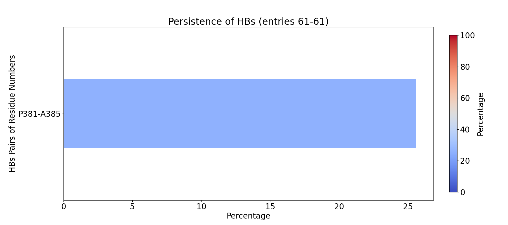
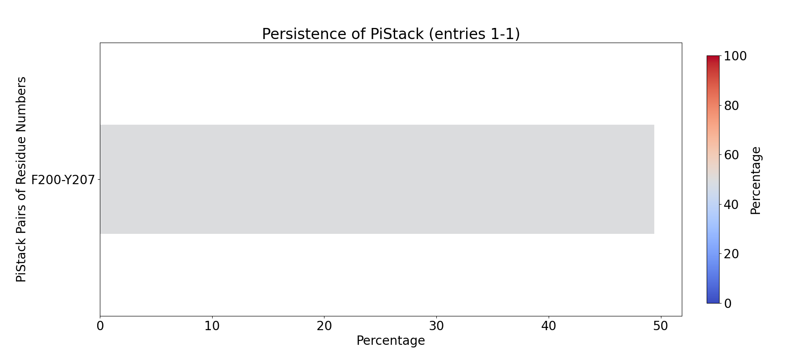
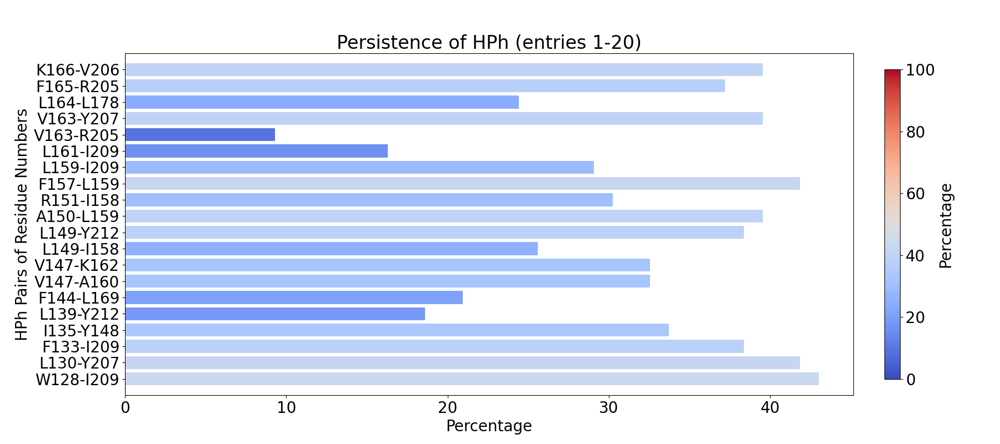
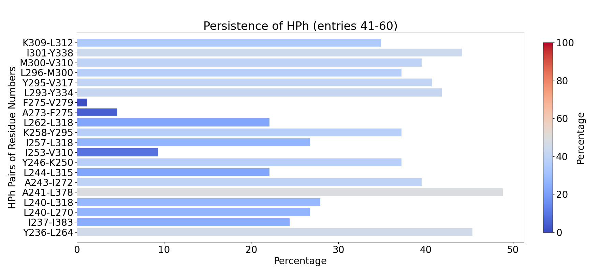
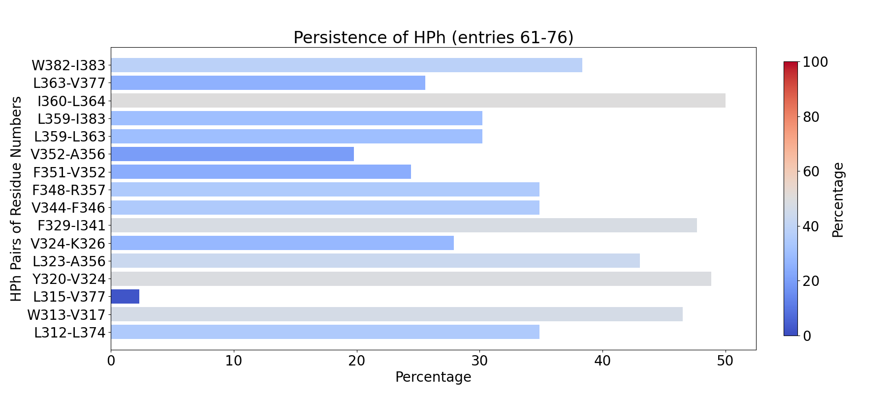

.. _insty_tutorial:
=======

Signature Interactions of ensembles
===============================================================================

We have developed a pipeline that leverages BLAST, Dali, or Foldseek search to
identify and download homologs for a particular PDB structure. The
identified structures are prepared for InSty analysis by applying the following
steps: (i) download PDB, (ii) extract particular chains, (iii) add
hydrogens/side chains, (iv) perform structural alignment, (v) create a
folder with prepared structures in it.

As an example, we will use Aurora kinase A structure (PDB code: **1OL5**).

BLAST approach
-------------------------------------------------------------------------------

We will use the PDB code and chain ID to access information from the BLAST server.
Additionally, we can also define many different types of parameters. Here, we
will define sequence identity (``seqid``) and the method to add missing hydrogen bonds
and side chains (``fixer``; it can be PDBFixer or Openbabel). We can also define a name for
a folder in which all the downloaded files will be uploaded (``folder_name``). 

To download homologs, add missing hydrogens and align structures, we will
use the :func:`.runBLAST` function:

.. ipython:: python
   :verbatim:

   PDBcode = '1ol5'
   runBLAST(PDBcode, 'A', seqid=70, fixer='openbabel', folder_name='struc_homologs_BLAST')

.. parsed-literal::

   @> PDB file is found in working directory (1ol5.pdb).
   @> 2607 atoms and 1 coordinate set(s) were parsed in 0.03s.
   @> Blast searching NCBI PDB database for "SKKRQ..."
   @> Blast search completed in 46.3s.                     
   @> Separating chains and saving into PDB file
   @> PDB code 1muo and chain A
   @> Connecting wwPDB FTP server RCSB PDB (USA).
   @> Downloading PDB files via FTP failed, trying HTTP.
   @> 1muo downloaded (1muo.pdb.gz)
   @> PDB download via HTTP completed (1 downloaded, 0 failed).
   @> 2029 atoms and 1 coordinate set(s) were parsed in 0.07s.
   @> PDB code 2j4z and chain A
   @> Connecting wwPDB FTP server RCSB PDB (USA).
   @> Downloading PDB files via FTP failed, trying HTTP.
   @> 2j4z downloaded (2j4z.pdb.gz)
   @> PDB download via HTTP completed (1 downloaded, 0 failed).
   @> 4626 atoms and 1 coordinate set(s) were parsed in 0.14s.
   @> PDB code 7o2v and chain A
   @> Connecting wwPDB FTP server RCSB PDB (USA).
   @> Downloading PDB files via FTP failed, trying HTTP.
   @> 7o2v downloaded (7o2v.pdb.gz)
   @> PDB download via HTTP completed (1 downloaded, 0 failed).
   @> 2265 atoms and 1 coordinate set(s) were parsed in 0.10s.
   @> PDB code 6c83 and chain A
   @> Connecting wwPDB FTP server RCSB PDB (USA).
   @> Downloading PDB files via FTP failed, trying HTTP.
   @> 6c83 downloaded (6c83.pdb.gz)
   @> PDB download via HTTP completed (1 downloaded, 0 failed).
   @> 4937 atoms and 1 coordinate set(s) were parsed in 0.16s.
   @> PDB code 6cpe and chain A
   @> Connecting wwPDB FTP server RCSB PDB (USA).
   @> Downloading PDB files via FTP failed, trying HTTP.
   @> 6cpe downloaded (6cpe.pdb.gz)
   @> PDB download via HTTP completed (1 downloaded, 0 failed).
   @> 4024 atoms and 1 coordinate set(s) were parsed in 0.13s.
   @> PDB code 6cpf and chain A
   @> Connecting wwPDB FTP server RCSB PDB (USA).
   @> Downloading PDB files via FTP failed, trying HTTP.
   @> 6cpf downloaded (6cpf.pdb.gz)
   @> PDB download via HTTP completed (1 downloaded, 0 failed).
   @> 4100 atoms and 1 coordinate set(s) were parsed in 0.13s.
   @> PDB code 6cpg and chain A
   @> Connecting wwPDB FTP server RCSB PDB (USA).
   @> Downloading PDB files via FTP failed, trying HTTP.
   @> 6cpg downloaded (6cpg.pdb.gz)
   @> PDB download via HTTP completed (1 downloaded, 0 failed).
   @> 9962 atoms and 1 coordinate set(s) were parsed in 0.20s.
   @> PDB code 8sso and chain A
   @> Connecting wwPDB FTP server RCSB PDB (USA).
   @> Downloading PDB files via FTP failed, trying HTTP.
   @> 8sso downloaded (8sso.pdb.gz)
   @> PDB download via HTTP completed (1 downloaded, 0 failed).
   @> 6151 atoms and 1 coordinate set(s) were parsed in 0.18s.
   @> PDB code 2xng and chain A
   @> Connecting wwPDB FTP server RCSB PDB (USA).
   @> Downloading PDB files via FTP failed, trying HTTP.
   @> 2xng downloaded (2xng.pdb.gz)
   @> PDB download via HTTP completed (1 downloaded, 0 failed).
   @> 2001 atoms and 1 coordinate set(s) were parsed in 0.07s.
   @> PDB code 4b0g and chain A
   @> Connecting wwPDB FTP server RCSB PDB (USA).
   @> Downloading PDB files via FTP failed, trying HTTP.
   @> 4b0g downloaded (4b0g.pdb.gz)
   @> PDB download via HTTP completed (1 downloaded, 0 failed).
   @> 2065 atoms and 1 coordinate set(s) were parsed in 0.07s.
   @> PDB code 8ssp and chain A
   @> Connecting wwPDB FTP server RCSB PDB (USA).
   @> Downloading PDB files via FTP failed, trying HTTP.
   @> 8ssp downloaded (8ssp.pdb.gz)
   @> PDB download via HTTP completed (1 downloaded, 0 failed).
   @> 3066 atoms and 1 coordinate set(s) were parsed in 0.05s.
   @> PDB code 2x6d and chain A
   @> Connecting wwPDB FTP server RCSB PDB (USA).
   @> Downloading PDB files via FTP failed, trying HTTP.
   @> 2x6d downloaded (2x6d.pdb.gz)
   @> PDB download via HTTP completed (1 downloaded, 0 failed).
   @> 2144 atoms and 1 coordinate set(s) were parsed in 0.08s.
   @> PDB code 2x6e and chain A
   @> Connecting wwPDB FTP server RCSB PDB (USA).
   @> Downloading PDB files via FTP failed, trying HTTP.
   @> 2x6e downloaded (2x6e.pdb.gz)
   @> PDB download via HTTP completed (1 downloaded, 0 failed).
   @> 2007 atoms and 1 coordinate set(s) were parsed in 0.06s.
   @> PDB code 4byi and chain A
   @> Connecting wwPDB FTP server RCSB PDB (USA).
   @> Downloading PDB files via FTP failed, trying HTTP.
   @> 4byi downloaded (4byi.pdb.gz)
   @> PDB download via HTTP completed (1 downloaded, 0 failed).
   @> 2049 atoms and 1 coordinate set(s) were parsed in 0.09s.
   @> PDB code 4byj and chain A
   ..
   ..
   @> Connecting wwPDB FTP server RCSB PDB (USA).
   @> Downloading PDB files via FTP failed, trying HTTP.
   @> 5k3y downloaded (5k3y.pdb.gz)
   @> PDB download via HTTP completed (1 downloaded, 0 failed).
   @> 5831 atoms and 1 coordinate set(s) were parsed in 0.19s.
   @> Adding hydrogens to the structures..
   @> Hydrogens were added to the structure. New structure is saved as addH_1muoA.pdb.
   @> Hydrogens were added to the structure. New structure is saved as addH_2j4zA.pdb.
   @> Hydrogens were added to the structure. New structure is saved as addH_7o2vA.pdb.
   @> Hydrogens were added to the structure. New structure is saved as addH_6c83A.pdb.
   @> Hydrogens were added to the structure. New structure is saved as addH_6cpeA.pdb.
   @> Hydrogens were added to the structure. New structure is saved as addH_6cpfA.pdb.
   @> Hydrogens were added to the structure. New structure is saved as addH_6cpgA.pdb.
   @> Hydrogens were added to the structure. New structure is saved as addH_8ssoA.pdb.
   @> Hydrogens were added to the structure. New structure is saved as addH_2xngA.pdb.
   @> Hydrogens were added to the structure. New structure is saved as addH_4b0gA.pdb.
   @> Hydrogens were added to the structure. New structure is saved as addH_8sspA.pdb.
   @> Hydrogens were added to the structure. New structure is saved as addH_2x6dA.pdb.
   @> Hydrogens were added to the structure. New structure is saved as addH_2x6eA.pdb.
   @> Hydrogens were added to the structure. New structure is saved as addH_4byiA.pdb.
   @> Hydrogens were added to the structure. New structure is saved as addH_4byjA.pdb.
   @> Hydrogens were added to the structure. New structure is saved as addH_4zs0A.pdb.
   @> Hydrogens were added to the structure. New structure is saved as addH_4ztqA.pdb.
   @> Hydrogens were added to the structure. New structure is saved as addH_4ztrA.pdb.
   @> Hydrogens were added to the structure. New structure is saved as addH_4ztsA.pdb.
   @> Hydrogens were added to the structure. New structure is saved as addH_5oneA.pdb.
   @> Hydrogens were added to the structure. New structure is saved as addH_6graA.pdb.
   @> Hydrogens were added to the structure. New structure is saved as addH_6z4yA.pdb.
   @> Hydrogens were added to the structure. New structure is saved as addH_7ayhA.pdb.
   @> Hydrogens were added to the structure. New structure is saved as addH_7ayiA.pdb.
   @> Hydrogens were added to the structure. New structure is saved as addH_5zanA.pdb.
   ..
   ..
   @> Hydrogens were added to the structure. New structure is saved as addH_2vgoA.pdb.
   @> Hydrogens were added to the structure. New structure is saved as addH_2vgpA.pdb.
   @> Hydrogens were added to the structure. New structure is saved as addH_3ztxA.pdb.
   @> Hydrogens were added to the structure. New structure is saved as addH_2vrxA.pdb.
   @> Hydrogens were added to the structure. New structure is saved as addH_4c2vA.pdb.
   @> Hydrogens were added to the structure. New structure is saved as addH_4c2wA.pdb.
   @> Hydrogens were added to the structure. New structure is saved as addH_6gr8A.pdb.
   @> Hydrogens were added to the structure. New structure is saved as addH_6gr9A.pdb.
   @> Hydrogens were added to the structure. New structure is saved as addH_2bfyA.pdb.
   @> Hydrogens were added to the structure. New structure is saved as addH_5eykA.pdb.
   @> Hydrogens were added to the structure. New structure is saved as addH_5k3yA.pdb.
   @> 209 PDBs were parsed in 8.49s.        
   @> Aligning the structures..
   @> addH_2j4zA
   @> Checking AtomGroup addH_2j4zA: 1 chains are identified
   @> Checking AtomGroup addH_1muoA: 1 chains are identified
   @> Trying to match chains based on residue numbers and names:
   @>   Comparing Chain A from addH_2j4zA (len=263) and Chain A from addH_1muoA (len=251):
   @> 	Match: 251 residues match with 100% sequence identity and 95% overlap.
   @> Aligning the structures..
   @> addH_7o2vA
   @> Checking AtomGroup addH_7o2vA: 1 chains are identified
   @> Checking AtomGroup addH_1muoA: 1 chains are identified
   @> Trying to match chains based on residue numbers and names:
   @>   Comparing Chain A from addH_7o2vA (len=264) and Chain A from addH_1muoA (len=251):
   @> 	Match: 250 residues match with 100% sequence identity and 95% overlap.
   @> Aligning the structures..
   @> addH_6c83A
   @> Checking AtomGroup addH_6c83A: 1 chains are identified
   @> Checking AtomGroup addH_1muoA: 1 chains are identified
   @> Trying to match chains based on residue numbers and names:
   @>   Comparing Chain A from addH_6c83A (len=248) and Chain A from addH_1muoA (len=251):
   @> 	Match: 246 residues match with 99% sequence identity and 98% overlap.
   @> Aligning the structures..
   @> addH_6cpeA
   @> Checking AtomGroup addH_6cpeA: 1 chains are identified
   @> Checking AtomGroup addH_1muoA: 1 chains are identified
   @> Trying to match chains based on residue numbers and names:
   @>   Comparing Chain A from addH_6cpeA (len=256) and Chain A from addH_1muoA (len=251):
   @> 	Match: 248 residues match with 99% sequence identity and 97% overlap.
   @> Aligning the structures..
   @> addH_6cpfA
   @> Checking AtomGroup addH_6cpfA: 1 chains are identified
   @> Checking AtomGroup addH_1muoA: 1 chains are identified
   @> Trying to match chains based on residue numbers and names:
   @>   Comparing Chain A from addH_6cpfA (len=259) and Chain A from addH_1muoA (len=251):
   @> 	Match: 249 residues match with 99% sequence identity and 96% overlap.
   @> Aligning the structures..
   @> addH_6cpgA
   @> Checking AtomGroup addH_6cpgA: 1 chains are identified
   @> Checking AtomGroup addH_1muoA: 1 chains are identified
   @> Trying to match chains based on residue numbers and names:
   @>   Comparing Chain A from addH_6cpgA (len=249) and Chain A from addH_1muoA (len=251):
   @> 	Match: 248 residues match with 100% sequence identity and 99% overlap.
   @> Aligning the structures..
   @> addH_8ssoA
   @> Checking AtomGroup addH_8ssoA: 1 chains are identified
   @> Checking AtomGroup addH_1muoA: 1 chains are identified
   @> Trying to match chains based on residue numbers and names:
   @>   Comparing Chain A from addH_8ssoA (len=256) and Chain A from addH_1muoA (len=251):
   @> 	Match: 251 residues match with 100% sequence identity and 98% overlap.
   @> Aligning the structures..
   @> addH_2xngA
   @> Checking AtomGroup addH_2xngA: 1 chains are identified
   @> Checking AtomGroup addH_1muoA: 1 chains are identified
   @> Trying to match chains based on residue numbers and names:
   @>   Comparing Chain A from addH_2xngA (len=253) and Chain A from addH_1muoA (len=251):
   @> 	Match: 248 residues match with 99% sequence identity and 98% overlap.
   @> Aligning the structures..
   @> addH_4b0gA
   @> Checking AtomGroup addH_4b0gA: 1 chains are identified
   @> Checking AtomGroup addH_1muoA: 1 chains are identified
   @> Trying to match chains based on residue numbers and names:
   @>   Comparing Chain A from addH_4b0gA (len=247) and Chain A from addH_1muoA (len=251):
   @> 	Match: 241 residues match with 98% sequence identity and 96% overlap.
   @> Aligning the structures..
   @> addH_8sspA
   @> Checking AtomGroup addH_8sspA: 1 chains are identified
   @> Checking AtomGroup addH_1muoA: 1 chains are identified
   @> Trying to match chains based on residue numbers and names:
   @>   Comparing Chain A from addH_8sspA (len=264) and Chain A from addH_1muoA (len=251):
   @> 	Match: 251 residues match with 100% sequence identity and 95% overlap.
   @> Aligning the structures..
   @> addH_2x6dA
   @> Checking AtomGroup addH_2x6dA: 1 chains are identified
   @> Checking AtomGroup addH_1muoA: 1 chains are identified
   @> Trying to match chains based on residue numbers and names:
   @>   Comparing Chain A from addH_2x6dA (len=255) and Chain A from addH_1muoA (len=251):
   @> 	Match: 246 residues match with 98% sequence identity and 96% overlap.
   @> Aligning the structures..
   @> addH_2x6eA
   @> Checking AtomGroup addH_2x6eA: 1 chains are identified
   @> Checking AtomGroup addH_1muoA: 1 chains are identified
   @> Trying to match chains based on residue numbers and names:
   @>   Comparing Chain A from addH_2x6eA (len=249) and Chain A from addH_1muoA (len=251):
   @> 	Match: 245 residues match with 98% sequence identity and 98% overlap.
   @> Aligning the structures..
   @> addH_4byiA
   @> Checking AtomGroup addH_4byiA: 1 chains are identified
   @> Checking AtomGroup addH_1muoA: 1 chains are identified
   @> Trying to match chains based on residue numbers and names:
   @>   Comparing Chain A from addH_4byiA (len=254) and Chain A from addH_1muoA (len=251):
   @> 	Match: 249 residues match with 99% sequence identity and 98% overlap.
   @> Aligning the structures..
   @> addH_4byjA
   @> Checking AtomGroup addH_4byjA: 1 chains are identified
   @> Checking AtomGroup addH_1muoA: 1 chains are identified
   @> Trying to match chains based on residue numbers and names:
   @>   Comparing Chain A from addH_4byjA (len=246) and Chain A from addH_1muoA (len=251):
   @> 	Match: 244 residues match with 99% sequence identity and 97% overlap.
   @> Aligning the structures..
   @> addH_4zs0A
   @> Checking AtomGroup addH_4zs0A: 1 chains are identified
   @> Checking AtomGroup addH_1muoA: 1 chains are identified
   @> Trying to match chains based on residue numbers and names:
   @>   Comparing Chain A from addH_4zs0A (len=257) and Chain A from addH_1muoA (len=251):
   @> 	Match: 248 residues match with 99% sequence identity and 96% overlap.
   ..
   ..
   @> Aligning the structures..
   @> addH_5eykA
   @> Checking AtomGroup addH_5eykA: 1 chains are identified
   @> Checking AtomGroup addH_1muoA: 1 chains are identified
   @> Trying to match chains based on residue numbers and names:
   @>   Comparing Chain A from addH_5eykA (len=264) and Chain A from addH_1muoA (len=251):
   @> 	Failed to match chains (seqid=5%, overlap=81%).
   @> Trying to match chains based on local sequence alignment:
   @>  Comparing Chain A from addH_5eykA (len=264) and Chain A from addH_1muoA (len=251):
   @> 	Match: 246 residues match with 70% sequence identity and 93% overlap.
   @> Aligning the structures..
   @> addH_5k3yA
   @> Checking AtomGroup addH_5k3yA: 1 chains are identified
   @> Checking AtomGroup addH_1muoA: 1 chains are identified
   @> Trying to match chains based on residue numbers and names:
   @>   Comparing Chain A from addH_5k3yA (len=268) and Chain A from addH_1muoA (len=251):
   @> 	Failed to match chains (seqid=5%, overlap=81%).
   @> Trying to match chains based on local sequence alignment:
   @>  Comparing Chain A from addH_5k3yA (len=268) and Chain A from addH_1muoA (len=251):
   @> 	Match: 246 residues match with 71% sequence identity and 92% overlap.

To compute all types of interactions for each homolog, we use the
:func:`.calcSignatureInteractions` function, and we are providing the name of the
folder with the structures.

This function will create additional files with the prefix ``'INT_'+type_of_interactions``
for each file. In such a file besides the protein structure,
we will have dummy atoms that will correspond to the interactions. 
The dummy atoms will be inserted exactly between the residue-residue pair which
is interacting. We are computing seven types of non-covalent interactions 
(hydrogen bonds - ``HBs``, salt bridges - ``SBs``, repulsive ionic bonding -
``RIB``, pi-cation - ``PiCat``, pi-stacking - ``PiStack``, hydrophobic interactions -
``HPh``, and disulfide bonds - ``DiBs``).

.. ipython:: python
   :verbatim:

   calcSignatureInteractions('struc_homologs_BLAST')

.. parsed-literal::

   @> struc_homologs_BLAST/align__addH_5l8kA.pdb
   @> 4385 atoms and 1 coordinate set(s) were parsed in 0.04s.
   @> Calculating hydrogen bonds.
   @>      DONOR (res chid atom)   <--->       ACCEPTOR (res chid atom)    Distance  Angle
   @>     LEU178    A         N_868  <--->     VAL174    A         O_808     2.8    25.5
   @>     GLU321    A        N_3203  <--->     VAL317    A        O_3141     2.8    27.8
   @>     VAL324    A        N_3257  <--->     TYR320    A        O_3187     2.9    37.4
   @>     LEU208    A        N_1397  <--->     LYS162    A         O_609     2.9    31.8
   @>     ILE360    A        N_3839  <--->     ALA356    A        O_3779     2.9    19.9
   @>     LYS224    A        N_1666  <--->     ARG220    A        O_1596     2.9    39.0
   @>     LEU263    A        N_2315  <--->     LYS271    A        O_2427     2.9    34.6
   @>     LEU318    A        N_3152  <--->     SER314    A        O_3104     2.9    35.1
   @>     GLY173    A         N_796  <--->     GLU170    A         O_754     3.0    38.1
   @>     LEU149    A         N_377  <--->     ARG137    A         O_189     3.0    28.6
   @>     ALA243    A        N_1978  <--->     GLU239    A        O_1925     3.0    23.2
   @>     ILE253    A        N_2140  <--->     SER278    A        O_2541     3.0    23.1
   @>     TYR236    A        N_1866  <--->     ARG232    A        O_1809     3.0     7.4
   @>     SER314    A        N_3099  <--->     VAL310    A        O_3033     3.0    30.1
   @>     ARG220    A        N_1591  <--->     THR217    A      OG1_1548     3.0    17.6
   @>     ILE193    A        N_1133  <--->     HIS190    A        O_1093     3.0    13.9
   @>     VAL317    A        N_3136  <--->     TRP313    A        O_3080     3.0    34.9
   @>     SER342    A        N_3556  <--->     TYR338    A        O_3475     3.0    25.6
   @>     THR337    A        N_3456  <--->     THR333    A        O_3394     3.0    24.4
   @>     TYR320    A        N_3182  <--->     GLY316    A        O_3135     3.1    39.9
   @>     LEU169    A         N_730  <--->     PHE165    A         O_666     3.1    35.0
   @>     LEU315    A        N_3110  <--->     ASP311    A        O_3049     3.1    22.9
   @>     HIS187    A        N_1028  <--->     ILE184    A         O_986     3.1    38.9
   @>     ARG362    A        N_3869  <--->     ASP358    A        O_3813     3.1    23.5
   @>     PHE133    A         N_123  <--->     LEU130    A          O_82     3.1     3.3
   @>     HIS380    A        N_4189  <--->     VAL377    A        O_4144     3.1    34.9
   @>     LEU363    A        N_3893  <--->     LEU359    A        O_3825     3.1    39.5
   @>     GLY316    A        N_3129  <--->     LEU312    A        O_3061     3.1    36.0
   @>     LYS339    A        N_3491  <--->     GLN335    A        O_3429     3.1    15.1
   @>     ILE184    A         N_981  <--->     ARG180    A         O_916     3.1    16.3
   @>     LEU359    A        N_3820  <--->     GLY355    A        O_3773     3.1    37.9
   @>     ARG179    A         N_887  <--->     GLU175    A         O_824     3.2     4.7
   @>     LEU262    A        N_2296  <--->     PRO259    A        O_2257     3.2    25.9
   @>     VAL352    A        N_3722  <--->     PRO349    A        O_3680     3.2    26.7
   @>     VAL377    A        N_4139  <--->     MET373    A        O_4069     3.2    15.7
   @>     GLU183    A         N_966  <--->     ARG179    A         O_892     3.2     6.3
   @>     TYR219    A        N_1570  <--->     PRO259    A        O_2257     3.2    39.1
   @>     LYS309    A       NZ_3024  <--->     PRO372    A        O_4054     3.2    38.5
   @>     ALA172    A         N_786  <--->     GLN168    A         O_718     3.2     6.7
   @>     LEU323    A        N_3238  <--->     CYS319    A        O_3176     3.2    13.8
   @>     GLU221    A        N_1615  <--->     THR217    A        O_1545     3.2    24.1
   @>     ALA241    A        N_1954  <--->     THR238    A        O_1911     3.3    37.2
   @>     GLU336    A        N_3441  <--->     THR333    A        O_3394     3.3    13.4
   @>     ILE301    A        N_2880  <--->     PRO297    A        O_2824     3.3    24.6
   @>     HIS248    A        N_2050  <--->     SER245    A        O_2012     3.4    38.4
   @>     ARG205    A       NE_1351  <--->     ASP202    A      OD2_1311     3.4    29.3
   @>     SER245    A        N_2007  <--->     ASN242    A        O_1969     3.4    31.2
   @>     THR333    A        N_3389  <--->     GLU336    A      OE1_3454     3.4    29.4
   @>     GLY140    A         N_241  <--->     VAL147    A         O_345     3.4    25.0
   @>     LEU225    A        N_1688  <--->     LEU222    A        O_1635     3.5    35.1
   @>     LYS166    A        NZ_699  <--->     ALA203    A        O_1317     3.5    31.4
   @>     ASN386    A      ND2_4298  <--->     TRP382    A      NE1_4233     3.5    40.0
   @>     GLY145    A         N_319  <--->     GLY142    A         O_276     3.5    32.9
   @>     LYS250    A        N_2078  <--->     TYR246    A        O_2023     3.5    14.1
   @> Number of detected hydrogen bonds: 54.
   @> Creating file with dummy atoms
   @> struc_homologs_BLAST/align__addH_3dj5A.pdb
   @> 4154 atoms and 1 coordinate set(s) were parsed in 0.04s.
   @> Calculating hydrogen bonds.
   @>      DONOR (res chid atom)   <--->       ACCEPTOR (res chid atom)    Distance  Angle
   @>     PHE241    A        N_1708  <--->     PHE335    A        O_3061     2.8    39.0
   @>     LEU162    A         N_337  <--->     ARG150    A         O_149     2.8    30.9
   @>     LEU172    A         N_518  <--->     ALA163    A         O_361     2.9    30.2
   @>     LYS179    A         N_643  <--->     THR217    A        O_1293     2.9    21.4
   @>     ASP269    A        N_2168  <--->     ASP287    A      OD2_2456     2.9    28.9
   @>     PHE335    A        N_3056  <--->     LEU331    A        O_2995     2.9    34.2
   @>     ILE222    A        N_1382  <--->     GLY211    A        O_1207     2.9    31.4
   @>     ARG384    A       NE_3875  <--->     LYS378    A        O_3774     2.9    28.1
   @>     ARG208    A        N_1137  <--->     GLU224    A      OE2_1434     2.9    11.0
   @>     GLN236    A        N_1615  <--->     TYR232    A        O_1541     2.9     8.0
   @>     GLN190    A       NE2_831  <--->     GLU194    A       OE2_915     2.9    28.4
   @>     LEU238    A        N_1654  <--->     GLU234    A        O_1586     2.9    25.0
   @>     CYS260    A        N_2007  <--->     ALA256    A        O_1951     2.9    34.8
   @>     ASP371    A        N_3646  <--->     GLU367    A        O_3595     3.0    35.9
   @>     ARG356    A        N_3405  <--->     ARG352    A        O_3332     3.0    36.5
   @>     GLU165    A         N_390  <--->     PHE170    A         O_484     3.0    39.4
   @>     GLU196    A         N_932  <--->     ARG192    A         O_858     3.0    20.9
   @>     ILE373    A        N_3677  <--->     ALA369    A        O_3617     3.0    37.6
   @>     LYS263    A        N_2046  <--->     TYR259    A        O_1991     3.0    17.9
   @>     ARG352    A        N_3327  <--->     GLN348    A        O_3265     3.0     2.1
   @>     VAL330    A        N_2974  <--->     TRP326    A        O_2918     3.0    37.0
   @>     ARG233    A        N_1557  <--->     THR230    A      OG1_1514     3.0    21.3
   @>     TYR308    A        N_2618  <--->     THR305    A        O_2578     3.0     3.8
   @>     ALA185    A         N_752  <--->     GLN181    A         O_684     3.0    35.9
   @>     ARG192    A         N_853  <--->     GLU188    A         O_790     3.0    36.0
   @>     HIS261    A        N_2018  <--->     LEU257    A        O_1961     3.1    32.6
   @>     ASP324    A        N_2882  <--->     ASP320    A        O_2822     3.1     2.2
   @>     GLU252    A        N_1888  <--->     THR248    A        O_1825     3.1    17.2
   @>     SER262    A        N_2035  <--->     SER258    A        O_1980     3.1    19.0
   @>     LEU182    A         N_696  <--->     PHE178    A         O_628     3.1    13.4
   @>     GLY158    A         N_279  <--->     GLY155    A         O_236     3.1    33.6
   @>     ARG375    A        N_3707  <--->     ASP371    A        O_3651     3.1    11.7
   @>     GLU194    A         N_901  <--->     GLN190    A         O_822     3.1    20.1
   @>     VAL323    A        N_2866  <--->     ASP320    A      OD1_2827     3.1    12.3
   @>     TYR333    A        N_3020  <--->     GLY329    A        O_2973     3.1    36.7
   @>     GLU349    A        N_3277  <--->     THR346    A      OG1_3233     3.1    22.2
   @>     LEU325    A        N_2894  <--->     GLU321    A        O_2834     3.1    15.2
   @>     ARG193    A         N_877  <--->     HIS189    A         O_805     3.1    33.8
   @>     SER327    A        N_2937  <--->     VAL323    A        O_2871     3.1    22.3
   @>     HIS393    A        N_4011  <--->     VAL390    A        O_3966     3.2    26.4
   @>     LEU372    A        N_3658  <--->     GLY368    A        O_3611     3.2    26.4
   @>     THR350    A        N_3292  <--->     THR346    A        O_3230     3.2    18.0
   @>     ILE197    A         N_947  <--->     ARG193    A         O_882     3.2    33.7
   @>     GLY329    A        N_2967  <--->     LEU325    A        O_2899     3.2    22.1
   @>     LEU376    A        N_3731  <--->     LEU372    A        O_3663     3.2    39.7
   @>     GLY186    A         N_762  <--->     GLU183    A         O_720     3.2    16.4
   @>     VAL187    A         N_769  <--->     LEU182    A         O_701     3.2     9.9
   @>     TYR232    A        N_1536  <--->     PRO272    A        O_2225     3.2    26.8
   @>     LEU336    A        N_3076  <--->     CYS332    A        O_3014     3.2    32.0
   @>     GLU389    A        N_3946  <--->     THR386    A      OG1_3911     3.2    35.4
   @>     ASN399    A        N_4117  <--->     ILE396    A        O_4071     3.3    27.4
   @>     GLU392    A        N_3996  <--->     ALA388    A        O_3941     3.4    17.0
   @>     ILE314    A        N_2718  <--->     PRO310    A        O_2662     3.4    20.0
   @>     LYS179    A        NZ_661  <--->     HIS214    A      ND1_1259     3.5    35.5
   @>     ARG384    A      NH1_3878  <--->     HIS379    A        O_3796     3.5    11.1
   @> Number of detected hydrogen bonds: 55.
   @> Creating file with dummy atoms
   @> struc_homologs_BLAST/align__addH_2x6dA.pdb
   @> 4202 atoms and 1 coordinate set(s) were parsed in 0.04s.
   @> Calculating hydrogen bonds.
   @>      DONOR (res chid atom)   <--->       ACCEPTOR (res chid atom)    Distance  Angle
   @>     PHE322    A        N_3096  <--->     LEU318    A        O_3035     2.8    15.1
   @>     LEU240    A        N_1880  <--->     TYR236    A        O_1816     2.8    33.3
   @>     SER361    A        N_3736  <--->     ARG357    A        O_3667     2.9    30.2
   @>     SER342    A        N_3434  <--->     TYR338    A        O_3353     2.9    39.1
   @>     ARG343    A        N_3445  <--->     LYS339    A        O_3374     2.9    38.2
   @>     GLN223    A        N_1594  <--->     TYR219    A        O_1520     2.9     7.0
   @>     THR238    A        N_1851  <--->     ALA234    A        O_1792     2.9    38.2
   @>     THR235    A        N_1797  <--->     GLN231    A        O_1737     2.9     9.8
   @>     CYS319    A        N_3049  <--->     LEU315    A        O_2993     2.9    37.4
   @>     LEU315    A        N_2988  <--->     ASP311    A        O_2927     2.9     9.6
   @>     ASN242    A        N_1909  <--->     THR238    A        O_1856     3.0    39.2
   @>     ARG362    A        N_3747  <--->     ASP358    A        O_3691     3.0    28.4
   @>     TYR246    A        N_1963  <--->     ASN242    A        O_1914     3.0    36.6
   @>     SER283    A        N_2549  <--->     HIS306    A        O_2845     3.0    34.3
   @>     CYS247    A        N_1984  <--->     ALA243    A        O_1928     3.0    12.8
   @>     TYR320    A        N_3060  <--->     GLY316    A        O_3013     3.0    35.7
   @>     TYR338    A        N_3348  <--->     TYR334    A        O_3286     3.0    34.3
   @>     SER186    A         N_962  <--->     VAL182    A         O_900     3.0    28.2
   @>     GLU379    A        N_4052  <--->     ARG375    A        O_3983     3.0    32.3
   @>     VAL344    A        N_3469  <--->     ILE341    A        O_3420     3.0    37.7
   @>     ILE209    A        N_1361  <--->     GLY198    A        O_1186     3.0    29.7
   @>     HIS248    A      NE2_2010  <--->     ASP311    A      OD2_2933     3.1    23.7
   @>     ASP256    A        N_2145  <--->     HIS254    A      ND1_2114     3.1    36.7
   @>     LYS271    A       NZ_2385  <--->     PRO191    A        O_1054     3.1    32.9
   @>     VAL377    A        N_4017  <--->     MET373    A        O_3947     3.1    27.4
   @>     LEU323    A        N_3116  <--->     CYS319    A        O_3054     3.1    16.5
   @>     HIS380    A        N_4067  <--->     VAL377    A        O_4022     3.2    21.1
   @>     THR233    A        N_1773  <--->     ASP229    A        O_1710     3.2    32.3
   @>     GLU336    A        N_3319  <--->     THR333    A        O_3272     3.2    26.9
   @>     HIS306    A        N_2840  <--->     SER283    A        O_2554     3.2    18.0
   @>     TRP313    A        N_2953  <--->     LYS309    A        O_2889     3.2    31.5
   @>     ALA356    A        N_3652  <--->     THR353    A      OG1_3624     3.2    16.9
   @>     ARG371    A        N_3904  <--->     PRO368    A        O_3866     3.2    19.6
   @>     VAL182    A         N_895  <--->     ARG179    A         O_837     3.2    31.6
   @>     ARG371    A      NH1_3922  <--->     HIS366    A        O_3836     3.2    39.7
   @>     SER314    A        N_2977  <--->     VAL310    A        O_2911     3.3    19.9
   @>     GLU134    A         N_143  <--->     ARG151    A         O_411     3.3    17.4
   @>     LYS224    A       NZ_1629  <--->     GLU221    A      OE1_1573     3.3    25.2
   @>     LYS250    A        N_2023  <--->     TYR246    A        O_1968     3.3    38.1
   @>     ARG179    A         N_832  <--->     GLU175    A         O_769     3.3    25.3
   @>     LEU359    A        N_3698  <--->     GLY355    A        O_3651     3.3     9.3
   @>     LEU169    A         N_730  <--->     PHE165    A         O_666     3.4     6.5
   @>     TYR219    A        N_1515  <--->     PRO259    A        O_2202     3.4    26.8
   @>     THR384    A        N_4141  <--->     PRO381    A        O_4088     3.4    39.9
   @>     GLY316    A        N_3007  <--->     LEU312    A        O_2939     3.4    18.4
   @>     LYS339    A        N_3369  <--->     GLN335    A        O_3307     3.4    18.9
   @>     HIS254    A      ND1_2114  <--->     ILE257    A        N_2157     3.4    35.9
   @>     LEU270    A        N_2348  <--->     GLU239    A      OE1_1878     3.4    36.6
   @>     LYS224    A        N_1611  <--->     GLU221    A        O_1565     3.4    32.2
   @>     LYS271    A       NZ_2385  <--->     GLU211    A      OE2_1413     3.4    35.6
   @>     ARG304    A      NH2_2820  <--->     HIS366    A      NE2_3847     3.4    27.2
   @>     HIS248    A        N_1995  <--->     SER245    A        O_1957     3.5    38.5
   @>     VAL324    A        N_3135  <--->     GLU321    A        O_3086     3.5    32.7
   @>     PHE157    A         N_517  <--->     GLU152    A         O_435     3.5    33.7
   @>     LEU378    A        N_4033  <--->     ARG375    A        O_3983     3.5    37.4
   @> Number of detected hydrogen bonds: 55.
   @> Creating file with dummy atoms
   @> struc_homologs_BLAST/align__addH_2c6eA.pdb
   @> 4141 atoms and 1 coordinate set(s) were parsed in 0.04s.
   @> Calculating hydrogen bonds.
   @>      DONOR (res chid atom)   <--->       ACCEPTOR (res chid atom)    Distance  Angle
   @>     LEU243    A        N_1964  <--->     LEU239    A        O_1916     2.7    38.9
   @>     GLN369    A        N_3804  <--->     ASN366    A        O_3770     2.8    29.7
   @>     LEU221    A        N_1606  <--->     VAL217    A        O_1535     2.9    32.6
   @>     ILE208    A        N_1392  <--->     GLY197    A        O_1217     2.9    16.0
   @>     TRP381    A      NE1_4028  <--->     GLU229    A      OE2_1762     2.9    33.1
   @>     ARG194    A        N_1147  <--->     GLU210    A      OE2_1444     2.9    40.0
   @>     VAL217    A        N_1530  <--->     LEU261    A        O_2277     2.9    11.6
   @>     TYR337    A        N_3265  <--->     TYR333    A        O_3203     2.9    33.3
   @>     ALA233    A        N_1818  <--->     GLU229    A        O_1753     2.9    39.6
   @>     LYS338    A        N_3286  <--->     GLN334    A        O_3224     3.0    25.4
   @>     ILE183    A         N_957  <--->     ARG179    A         O_892     3.0    25.3
   @>     GLU180    A         N_911  <--->     GLN176    A         O_832     3.0    14.5
   @>     VAL251    A        N_2100  <--->     CYS246    A        O_2020     3.0    13.1
   @>     ARG356    A        N_3579  <--->     THR352    A        O_3538     3.0    20.1
   @>     ALA149    A         N_372  <--->     LEU158    A         O_537     3.0    38.4
   @>     SER313    A        N_2894  <--->     VAL309    A        O_2828     3.0    38.0
   @>     ARG342    A        N_3362  <--->     LYS338    A        O_3291     3.0    22.7
   @>     ILE340    A        N_3332  <--->     THR336    A        O_3256     3.0    31.2
   @>     CYS318    A        N_2966  <--->     LEU314    A        O_2910     3.0    23.8
   @>     LEU158    A         N_532  <--->     ALA149    A         O_377     3.0    33.9
   @>     LEU168    A         N_706  <--->     PHE164    A         O_642     3.0    17.4
   @>     ALA384    A        N_4072  <--->     PRO380    A        O_4005     3.1    16.4
   @>     LYS161    A         N_580  <--->     LEU207    A        O_1378     3.1    37.4
   @>     SER341    A        N_3351  <--->     TYR337    A        O_3270     3.1    21.0
   @>     ARG219    A        N_1567  <--->     THR216    A      OG1_1524     3.1    23.9
   @>     LEU239    A        N_1911  <--->     TYR235    A        O_1847     3.1    29.2
   @>     VAL316    A        N_2931  <--->     TRP312    A        O_2875     3.1    33.5
   @>     CYS246    A        N_2015  <--->     ALA242    A        O_1959     3.1    33.9
   @>     THR232    A        N_1804  <--->     ASP228    A        O_1741     3.1    18.4
   @>     LEU362    A        N_3688  <--->     LEU358    A        O_3620     3.1    37.1
   @>     ILE359    A        N_3634  <--->     ALA355    A        O_3574     3.1    28.2
   @>     SER387    A        N_4107  <--->     THR234    A      OG1_1836     3.1    23.1
   @>     HIS379    A        N_3984  <--->     VAL376    A        O_3939     3.1     7.8
   @>     LEU224    A        N_1664  <--->     GLU220    A        O_1596     3.2     3.5
   @>     THR336    A        N_3251  <--->     THR332    A        O_3189     3.2    12.0
   @>     GLU238    A        N_1896  <--->     THR234    A        O_1833     3.2    18.5
   @>     ARG361    A        N_3664  <--->     ASP357    A        O_3608     3.2     8.1
   @>     ASN241    A        N_1940  <--->     THR237    A        O_1887     3.2    20.2
   @>     ASN260    A      ND2_2269  <--->     ASP255    A      OD1_2186     3.2    33.1
   @>     GLY315    A        N_2924  <--->     LEU311    A        O_2856     3.2    28.2
   @>     LEU358    A        N_3615  <--->     GLY354    A        O_3568     3.2    27.7
   @>     TYR319    A        N_2977  <--->     GLY315    A        O_2930     3.2    17.1
   @>     SER248    A        N_2043  <--->     SER244    A        O_1988     3.2    15.8
   @>     LEU322    A        N_3033  <--->     CYS318    A        O_2971     3.2    27.9
   @>     THR237    A        N_1882  <--->     ALA233    A        O_1823     3.2    24.3
   @>     LEU214    A        N_1490  <--->     LEU263    A        O_2315     3.2    33.9
   @>     VAL146    A         N_316  <--->     GLY139    A         O_223     3.3    31.4
   @>     ASN385    A        N_4082  <--->     TRP381    A        O_4020     3.3    37.2
   @>     GLU378    A        N_3969  <--->     ARG374    A        O_3900     3.3    27.3
   @>     GLU335    A        N_3236  <--->     THR332    A      OG1_3192     3.3    39.6
   @>     LYS249    A        N_2054  <--->     TYR245    A        O_1999     3.3    26.4
   @>     ALA128    A          N_43  <--->     ASP131    A        OD1_97     3.4     4.6
   @>     GLU220    A        N_1591  <--->     THR216    A        O_1521     3.4    37.4
   @>     VAL309    A        N_2823  <--->     ASP306    A        O_2779     3.4    19.5
   @>     TYR218    A        N_1546  <--->     PRO258    A        O_2233     3.4    28.7
   @>     GLY197    A        N_1211  <--->     ILE208    A        O_1397     3.4    20.4
   @>     ARG254    A        N_2152  <--->     ASP310    A      OD1_2849     3.4    20.2
   @>     ASP310    A        N_2839  <--->     GLU307    A        O_2791     3.4    27.3
   @>     ALA171    A         N_762  <--->     GLN167    A         O_694     3.4    23.6
   @>     VAL181    A         N_926  <--->     ARG178    A         O_868     3.4    34.7
   @>     GLY215    A        N_1509  <--->     ALA212    A        O_1471     3.4     6.4
   @>     TRP312    A        N_2870  <--->     LYS308    A        O_2806     3.5    22.5
   @>     GLN184    A       NE2_990  <--->     ASP273    A      OD1_2459     3.5    17.3
   @>     VAL376    A        N_3934  <--->     MET372    A        O_3864     3.5    26.9
   @> Number of detected hydrogen bonds: 64.
   @> Creating file with dummy atoms
   ..
   ..

Now, we need to go to the newly created folder ``struc_homologs_BLAST`` and use
:func:`.findClusterCenters` for each type of interactions to detect clusters
of interactions. We cannot do it in an automatic way because each system is
different and often default parameters of ``numC`` and ``distC`` should be tuned.

To compute fingerprint interactions of hydrogen bonds, use the command below.
This function uses the prefix ``INT_HBs_`` to select analyzed interactions. 
Originally, :func:`.findClusterCenters` was created to analyze water clusters
with the WatFinder module. To apply it here, we are changing the ``selection``
to ``resnume DUM`` given to dummy atoms that represent interactions.  

.. ipython:: python
   :verbatim:

   findClusterCenters('INT_HBs_*.pdb', selection = 'resname DUM')

.. parsed-literal::

   @> 4362 atoms and 1 coordinate set(s) were parsed in 0.11s.
   @> 4433 atoms and 1 coordinate set(s) were parsed in 0.05s.
   @> 4122 atoms and 1 coordinate set(s) were parsed in 0.05s.
   @> 4383 atoms and 1 coordinate set(s) were parsed in 0.05s.
   @> 4568 atoms and 1 coordinate set(s) were parsed in 0.05s.
   @> 4594 atoms and 1 coordinate set(s) were parsed in 0.05s.
   @> 4269 atoms and 1 coordinate set(s) were parsed in 0.05s.
   @> 4249 atoms and 1 coordinate set(s) were parsed in 0.05s.
   @> 4205 atoms and 1 coordinate set(s) were parsed in 0.05s.
   ..
   ..
   @> 4177 atoms and 1 coordinate set(s) were parsed in 0.04s.
   @> 4428 atoms and 1 coordinate set(s) were parsed in 0.04s.
   @> 4245 atoms and 1 coordinate set(s) were parsed in 0.04s.
   @> 4269 atoms and 1 coordinate set(s) were parsed in 0.04s.
   @> 4417 atoms and 1 coordinate set(s) were parsed in 0.04s.
   @> 4610 atoms and 1 coordinate set(s) were parsed in 0.05s.
   @> Results are saved in clusters_INT_HBs_.pdb.

To compute the fingerprint interactions of salt bridges, use the prefix
``INT_SBs_``:

.. ipython:: python
   :verbatim:

   findClusterCenters('INT_SBs_*.pdb', selection = 'resname DUM')

.. parsed-literal::

   @> 4306 atoms and 1 coordinate set(s) were parsed in 0.11s.
   @> 4383 atoms and 1 coordinate set(s) were parsed in 0.05s.
   @> 4082 atoms and 1 coordinate set(s) were parsed in 0.04s.
   @> 4337 atoms and 1 coordinate set(s) were parsed in 0.05s.
   @> 4532 atoms and 1 coordinate set(s) were parsed in 0.05s.
   @> 4558 atoms and 1 coordinate set(s) were parsed in 0.05s.
   @> 4228 atoms and 1 coordinate set(s) were parsed in 0.05s.
   @> 4213 atoms and 1 coordinate set(s) were parsed in 0.05s.
   @> 4154 atoms and 1 coordinate set(s) were parsed in 0.05s.
   @> 4303 atoms and 1 coordinate set(s) were parsed in 0.06s.
   @> 4350 atoms and 1 coordinate set(s) were parsed in 0.05s.
   @> 4107 atoms and 1 coordinate set(s) were parsed in 0.05s.
   ..
   ..
   @> 4199 atoms and 1 coordinate set(s) were parsed in 0.04s.
   @> 4233 atoms and 1 coordinate set(s) were parsed in 0.04s.
   @> 4369 atoms and 1 coordinate set(s) were parsed in 0.05s.
   @> 4569 atoms and 1 coordinate set(s) were parsed in 0.05s.
   @> Results are saved in clusters_INT_SBs_.pdb.

To compute the fingerprint interactions of repulsive ionic bonding, use the
prefix ``INT_RIB_``:

.. ipython:: python
   :verbatim:

   findClusterCenters('INT_RIB_*.pdb', selection = 'resname DUM')

.. parsed-literal::

   @> 4367 atoms and 1 coordinate set(s) were parsed in 0.11s.
   @> 4322 atoms and 1 coordinate set(s) were parsed in 0.05s.
   @> 4510 atoms and 1 coordinate set(s) were parsed in 0.05s.
   @> 4537 atoms and 1 coordinate set(s) were parsed in 0.05s.
   @> 4218 atoms and 1 coordinate set(s) were parsed in 0.05s.
   @> 4199 atoms and 1 coordinate set(s) were parsed in 0.05s.
   @> 4142 atoms and 1 coordinate set(s) were parsed in 0.05s.
   @> 4286 atoms and 1 coordinate set(s) were parsed in 0.05s.
   ..
   ..
   @> 4353 atoms and 1 coordinate set(s) were parsed in 0.04s.
   @> 4182 atoms and 1 coordinate set(s) were parsed in 0.04s.
   @> 4215 atoms and 1 coordinate set(s) were parsed in 0.04s.
   @> 4351 atoms and 1 coordinate set(s) were parsed in 0.04s.
   @> 4548 atoms and 1 coordinate set(s) were parsed in 0.04s.
   @> Results are saved in clusters_INT_RIB_.pdb.

To compute the fingerprint of pi-stacking interactions, use the prefix
``INT_PiStack_``:

.. ipython:: python
   :verbatim:

   findClusterCenters('INT_PiStack_*.pdb', selection = 'resname DUM')

.. parsed-literal::

   @> 4292 atoms and 1 coordinate set(s) were parsed in 0.04s.
   @> 4368 atoms and 1 coordinate set(s) were parsed in 0.05s.
   @> 4066 atoms and 1 coordinate set(s) were parsed in 0.04s.
   @> 4322 atoms and 1 coordinate set(s) were parsed in 0.04s.
   @> 4510 atoms and 1 coordinate set(s) were parsed in 0.05s.
   @> 4536 atoms and 1 coordinate set(s) were parsed in 0.04s.
   @> 4220 atoms and 1 coordinate set(s) were parsed in 0.04s.
   ..
   ..
   @> 4119 atoms and 1 coordinate set(s) were parsed in 0.05s.
   @> 4354 atoms and 1 coordinate set(s) were parsed in 0.05s.
   @> 4182 atoms and 1 coordinate set(s) were parsed in 0.04s.
   @> 4352 atoms and 1 coordinate set(s) were parsed in 0.05s.
   @> 4548 atoms and 1 coordinate set(s) were parsed in 0.04s.
   @> Results are saved in clusters_INT_PiStack_.pdb.

To compute the fingerprint of pi-stacking interactions, use the prefix
``INT_PiCat_``:

.. ipython:: python
   :verbatim:

   findClusterCenters('INT_PiCat_*.pdb', selection = 'resname DUM')

.. parsed-literal::

   @> 4295 atoms and 1 coordinate set(s) were parsed in 0.04s.
   @> 4369 atoms and 1 coordinate set(s) were parsed in 0.05s.
   @> 4068 atoms and 1 coordinate set(s) were parsed in 0.05s.
   @> 4323 atoms and 1 coordinate set(s) were parsed in 0.05s.
   @> 4516 atoms and 1 coordinate set(s) were parsed in 0.05s.
   ..
   ..
   @> 4184 atoms and 1 coordinate set(s) were parsed in 0.04s.
   @> 4219 atoms and 1 coordinate set(s) were parsed in 0.04s.
   @> 4356 atoms and 1 coordinate set(s) were parsed in 0.04s.
   @> 4551 atoms and 1 coordinate set(s) were parsed in 0.05s.
   @> Results are saved in clusters_INT_PiCat_.pdb.

To compute the fingerprint of hydrophobic interactions, use the prefix
``INT_HPh_``:

.. ipython:: python
   :verbatim:

   findClusterCenters('INT_HPh_*.pdb', selection = 'resname DUM')

.. parsed-literal::

   @> 4374 atoms and 1 coordinate set(s) were parsed in 0.12s.
   @> 4446 atoms and 1 coordinate set(s) were parsed in 0.05s.
   @> 4142 atoms and 1 coordinate set(s) were parsed in 0.04s.
   @> 4398 atoms and 1 coordinate set(s) were parsed in 0.05s.
   @> 4594 atoms and 1 coordinate set(s) were parsed in 0.05s.
   ..
   ..
   @> 4427 atoms and 1 coordinate set(s) were parsed in 0.04s.
   @> 4260 atoms and 1 coordinate set(s) were parsed in 0.04s.
   @> 4295 atoms and 1 coordinate set(s) were parsed in 0.04s.
   @> 4426 atoms and 1 coordinate set(s) were parsed in 0.04s.
   @> 4625 atoms and 1 coordinate set(s) were parsed in 0.04s.
   @> Results are saved in clusters_INT_HPh_.pdb.

We can further visualize those results in a graphical program like VMD_.
The obtained results are with default ``numC`` and ``distC`` parameters, and it means
that we were identifying interactions that were within 0.3 Ang. from each other 
(``distC``) in at least three structures (``numC``). To see more information about those 
parameters, see the `WatFinder tutorial`_.

The visualization of hydrogen bond clusters is as follows:

.. figure:: images/blast_hbs.png
   :scale: 60 %

The visualization of salt bridge clusters:   

.. figure:: images/blast_sbs.png
   :scale: 60 %
   

The visualization of repulsive ionic bonding clusters:   

.. figure:: images/blast_rib.png
   :scale: 60 %
   

The visualization of pi-cation clusters:   

.. figure:: images/blast_picat.png
   :scale: 60 %
   
   
The visualization of pi-stacking clusters:

.. figure:: images/blast_pistack.png
   :scale: 60 %

The visualization of hydrophobic clusters:
   
.. figure:: images/blast_hph.png
   :scale: 60 %

Dali approach
-------------------------------------------------------------------------------

We can use a similar approach with the PDB list provided by the Dali server
instead of BLAST. This time, to download homologs, add missing hydrogens, and
align structures, we will use :func:`.runDali` function. 

For the ``subset_Dali`` parameter, we will use ``PDB25`` instead of the full 
list of homologs, which is the default. 

We will use Openbabel to fix the structure and all prepared structures will
be copied to a folder with ``folder_name`` set to ``struc_homologs_Dali``.

.. ipython:: python
   :verbatim:

   runDali(PDBcode, 'A', fixer='openbabel', subset_Dali='PDB25', 
           folder_name='struc_homologs_Dali')

.. parsed-literal::

   @> Submitted Dali search for PDB "1ol5A".
   @> http://ekhidna2.biocenter.helsinki.fi/barcosel/tmp//1ol5A/
   @> Dali results were fetched in 0.2s.   
   @> Obtained 158 PDB chains from Dali for 1ol5A.
   @> 28 PDBs have been filtered out from 158 Dali hits (remaining: 130).
   @> Separating chains and saving into PDB file
   @> PDB code 4ysm and chain A
   @> Connecting wwPDB FTP server RCSB PDB (USA).
   @> Downloading PDB files via FTP failed, trying HTTP.
   @> 4ysm downloaded (4ysm.pdb.gz)
   @> PDB download via HTTP completed (1 downloaded, 0 failed).
   @> 7528 atoms and 1 coordinate set(s) were parsed in 0.20s.
   @> PDB code 5dzc and chain A
   @> Connecting wwPDB FTP server RCSB PDB (USA).
   @> Downloading PDB files via FTP failed, trying HTTP.
   @> 5dzc downloaded (5dzc.pdb.gz)
   @> PDB download via HTTP completed (1 downloaded, 0 failed).
   @> 6578 atoms and 1 coordinate set(s) were parsed in 0.18s.
   @> PDB code 8jpb and chain G
   @> Connecting wwPDB FTP server RCSB PDB (USA).
   @> Downloading PDB files via FTP failed, trying HTTP.
   @> 8jpb downloaded (8jpb.pdb.gz)
   @> PDB download via HTTP completed (1 downloaded, 0 failed).
   @> 9650 atoms and 1 coordinate set(s) were parsed in 0.14s.
   @> PDB code 5u6y and chain A
   @> Connecting wwPDB FTP server RCSB PDB (USA).
   @> Downloading PDB files via FTP failed, trying HTTP.
   @> 5u6y downloaded (5u6y.pdb.gz)
   @> PDB download via HTTP completed (1 downloaded, 0 failed).
   @> 86921 atoms and 1 coordinate set(s) were parsed in 0.94s.
   @> PDB code 7myj and chain C
   @> Connecting wwPDB FTP server RCSB PDB (USA).
   @> Downloading PDB files via FTP failed, trying HTTP.
   @> 7myj downloaded (7myj.pdb.gz)
   @> PDB download via HTTP completed (1 downloaded, 0 failed).
   @> 14740 atoms and 1 coordinate set(s) were parsed in 0.25s.
   @> PDB code 6c9j and chain A
   @> Connecting wwPDB FTP server RCSB PDB (USA).
   @> Downloading PDB files via FTP failed, trying HTTP.
   @> 6c9j downloaded (6c9j.pdb.gz)
   @> PDB download via HTTP completed (1 downloaded, 0 failed).
   @> 7034 atoms and 1 coordinate set(s) were parsed in 0.19s.
   @> PDB code 3pfq and chain A
   @> Connecting wwPDB FTP server RCSB PDB (USA).
   @> Downloading PDB files via FTP failed, trying HTTP.
   @> 3pfq downloaded (3pfq.pdb.gz)
   @> PDB download via HTTP completed (1 downloaded, 0 failed).
   @> 4273 atoms and 1 coordinate set(s) were parsed in 0.12s.
   @> PDB code 8qgy and chain B
   @> Connecting wwPDB FTP server RCSB PDB (USA).
   @> Downloading PDB files via FTP failed, trying HTTP.
   @> 8qgy downloaded (8qgy.pdb.gz)
   @> PDB download via HTTP completed (1 downloaded, 0 failed).
   @> 25443 atoms and 1 coordinate set(s) were parsed in 0.33s.
   @> PDB code 5xzw and chain B
   @> Connecting wwPDB FTP server RCSB PDB (USA).
   @> Downloading PDB files via FTP failed, trying HTTP.
   @> 5xzw downloaded (5xzw.pdb.gz)
   @> PDB download via HTTP completed (1 downloaded, 0 failed).
   @> 5648 atoms and 1 coordinate set(s) were parsed in 0.18s.
   @> PDB code 2pml and chain X
   ..
   ..
   @> Connecting wwPDB FTP server RCSB PDB (USA).
   @> Downloading PDB files via FTP failed, trying HTTP.
   @> 9b9g downloaded (9b9g.pdb.gz)
   @> PDB download via HTTP completed (1 downloaded, 0 failed).
   @> 48664 atoms and 1 coordinate set(s) were parsed in 0.55s.
   @> Adding hydrogens to the structures..
   @> Hydrogens were added to the structure. New structure is saved as addH_4ysmA.pdb.
   @> Hydrogens were added to the structure. New structure is saved as addH_5dzcA.pdb.
   @> Hydrogens were added to the structure. New structure is saved as addH_8jpbG.pdb.
   @> Hydrogens were added to the structure. New structure is saved as addH_5u6yA.pdb.
   @> Hydrogens were added to the structure. New structure is saved as addH_7myjC.pdb.
   @> Hydrogens were added to the structure. New structure is saved as addH_6c9jA.pdb.
   ..
   ..
   @> Hydrogens were added to the structure. New structure is saved as addH_8fnyA.pdb.
   @> Hydrogens were added to the structure. New structure is saved as addH_4axdA.pdb.
   @> Hydrogens were added to the structure. New structure is saved as addH_7k10A.pdb.
   @> Hydrogens were added to the structure. New structure is saved as addH_6z2wE.pdb.
   @> Hydrogens were added to the structure. New structure is saved as addH_9b9gA.pdb.
   @> 130 PDBs were parsed in 11.15s.        
   @> Aligning the structures..
   @> addH_5dzcA
   @> Checking AtomGroup addH_5dzcA: 1 chains are identified
   @> Checking AtomGroup addH_4ysmA: 1 chains are identified
   @> Trying to match chains based on residue numbers and names:
   @>   Comparing Chain A from addH_5dzcA (len=816) and Chain A from addH_4ysmA (len=475):
   @> 	Match: 468 residues match with 6% sequence identity and 57% overlap.
   @> Aligning the structures..
   @> addH_8jpbG
   @> Checking AtomGroup addH_8jpbG: 1 chains are identified
   @> Checking AtomGroup addH_4ysmA: 1 chains are identified
   @> Trying to match chains based on residue numbers and names:
   @>   Comparing Chain G from addH_8jpbG (len=658) and Chain A from addH_4ysmA (len=475):
   @> 	Match: 475 residues match with 8% sequence identity and 72% overlap.
   @> Aligning the structures..
   @> addH_5u6yA
   @> Checking AtomGroup addH_5u6yA: 1 chains are identified
   @> Checking AtomGroup addH_4ysmA: 1 chains are identified
   @> Trying to match chains based on residue numbers and names:
   @>   Comparing Chain A from addH_5u6yA (len=459) and Chain A from addH_4ysmA (len=475):
   @> 	Match: 458 residues match with 8% sequence identity and 96% overlap.
   @> Aligning the structures..
   @> addH_7myjC
   @> Checking AtomGroup addH_7myjC: 1 chains are identified
   @> Checking AtomGroup addH_4ysmA: 1 chains are identified
   @> Trying to match chains based on residue numbers and names:
   @>   Comparing Chain C from addH_7myjC (len=465) and Chain A from addH_4ysmA (len=475):
   @> 	Match: 443 residues match with 5% sequence identity and 93% overlap.
   @> Aligning the structures..
   @> addH_6c9jA
   @> Checking AtomGroup addH_6c9jA: 1 chains are identified
   @> Checking AtomGroup addH_4ysmA: 1 chains are identified
   @> Trying to match chains based on residue numbers and names:
   @>   Comparing Chain A from addH_6c9jA (len=386) and Chain A from addH_4ysmA (len=475):
   @> 	Failed to match chains (seqid=5%, overlap=76%).
   @> Trying to match chains based on local sequence alignment:
   @>  Comparing Chain A from addH_6c9jA (len=386) and Chain A from addH_4ysmA (len=475):
   /home/karolamik/.local/lib/python3.10/site-packages/Bio/pairwise2.py:278: BiopythonDeprecationWarning: Bio.pairwise2 has been deprecated, and we intend to remove it in a future release of Biopython. As an alternative, please consider using Bio.Align.PairwiseAligner as a replacement, and contact the Biopython developers if you still need the Bio.pairwise2 module.
   warnings.warn(
   @> 	Match: 381 residues match with 35% sequence identity and 80% overlap.
   @> Aligning the structures..
   @> addH_3pfqA
   @> Checking AtomGroup addH_3pfqA: 1 chains are identified
   @> Checking AtomGroup addH_4ysmA: 1 chains are identified
   @> Trying to match chains based on residue numbers and names:
   @>   Comparing Chain A from addH_3pfqA (len=523) and Chain A from addH_4ysmA (len=475):
   @> 	Failed to match chains (seqid=4%, overlap=64%).
   @> Trying to match chains based on local sequence alignment:
   @>  Comparing Chain A from addH_3pfqA (len=523) and Chain A from addH_4ysmA (len=475):
   @> 	Match: 334 residues match with 24% sequence identity and 64% overlap.
   @> Aligning the structures..
   @> addH_8qgyB
   @> Checking AtomGroup addH_8qgyB: 1 chains are identified
   @> Checking AtomGroup addH_4ysmA: 1 chains are identified
   @> Trying to match chains based on residue numbers and names:
   @>   Comparing Chain B from addH_8qgyB (len=809) and Chain A from addH_4ysmA (len=475):
   @> 	Failed to match chains (seqid=4%, overlap=45%).
   @> Trying to match chains based on local sequence alignment:
   @>  Comparing Chain B from addH_8qgyB (len=809) and Chain A from addH_4ysmA (len=475):
   @> 	Match: 457 residues match with 35% sequence identity and 56% overlap.
   @> Aligning the structures..
   @> addH_5xzwB
   @> Checking AtomGroup addH_5xzwB: 1 chains are identified
   @> Checking AtomGroup addH_4ysmA: 1 chains are identified
   @> Trying to match chains based on residue numbers and names:
   @>   Comparing Chain B from addH_5xzwB (len=379) and Chain A from addH_4ysmA (len=475):
   @> 	Match: 379 residues match with 6% sequence identity and 80% overlap.
   @> Aligning the structures..
   @> addH_2pmlX
   @> Checking AtomGroup addH_2pmlX: 1 chains are identified
   @> Checking AtomGroup addH_4ysmA: 1 chains are identified
   @> Trying to match chains based on residue numbers and names:
   @>   Comparing Chain X from addH_2pmlX (len=340) and Chain A from addH_4ysmA (len=475):
   @> 	Match: 329 residues match with 10% sequence identity and 69% overlap.
   ..
   ..
   @> Aligning the structures..
   @> addH_7k10A
   @> Checking AtomGroup addH_7k10A: 1 chains are identified
   @> Checking AtomGroup addH_4ysmA: 1 chains are identified
   @> Trying to match chains based on residue numbers and names:
   @>   Comparing Chain A from addH_7k10A (len=1259) and Chain A from addH_4ysmA (len=475):
   @> 	Failed to match chains (seqid=0%, overlap=0%).
   @> Trying to match chains based on local sequence alignment:
   @>  Comparing Chain A from addH_7k10A (len=1259) and Chain A from addH_4ysmA (len=475):
   @> 	Failed to match chains (seqid=32%, overlap=36%).
   @> WARNING There is a problem with addH_7k10A. Change seqid or overlap parameter to include the structure.
   @> Aligning the structures..
   @> addH_6z2wE
   @> Checking AtomGroup addH_6z2wE: 1 chains are identified
   @> Checking AtomGroup addH_4ysmA: 1 chains are identified
   @> Trying to match chains based on residue numbers and names:
   @>   Comparing Chain E from addH_6z2wE (len=2325) and Chain A from addH_4ysmA (len=475):
   @> 	Failed to match chains (seqid=6%, overlap=20%).
   @> Trying to match chains based on local sequence alignment:
   @>  Comparing Chain E from addH_6z2wE (len=2325) and Chain A from addH_4ysmA (len=475):
   @> 	Failed to match chains (seqid=36%, overlap=20%).
   @> WARNING There is a problem with addH_6z2wE. Change seqid or overlap parameter to include the structure.
   @> Aligning the structures..
   @> addH_9b9gA
   @> Checking AtomGroup addH_9b9gA: 1 chains are identified
   @> Checking AtomGroup addH_4ysmA: 1 chains are identified
   @> Trying to match chains based on residue numbers and names:
   @>   Comparing Chain A from addH_9b9gA (len=1696) and Chain A from addH_4ysmA (len=475):
   @> 	Failed to match chains (seqid=5%, overlap=19%).
   @> Trying to match chains based on local sequence alignment:
   @>  Comparing Chain A from addH_9b9gA (len=1696) and Chain A from addH_4ysmA (len=475):
   @> 	Failed to match chains (seqid=32%, overlap=27%).
   @> WARNING There is a problem with addH_9b9gA. Change seqid or overlap parameter to include the structure.

Further, we can analyze ``struc_homologs_Dali`` folder with prepared PDB files
in a similar way as for the BLAST dataset by using
:func:`.calcSignatureInteractions` and :func:`.findClusterCenters` for each
interaction type (see the BLAST approach).

.. ipython:: python
   :verbatim:

   calcSignatureInteractions('struc_homologs_Dali')

.. parsed-literal::

   @> struc_homologs_Dali/align__addH_6yb8A.pdb
   @> 6563 atoms and 1 coordinate set(s) were parsed in 0.07s.
   @> Calculating hydrogen bonds.
   @>      DONOR (res chid atom)   <--->       ACCEPTOR (res chid atom)    Distance  Angle
   @>     ASN184    A        N_2817  <--->     LEU181    A        O_2772     2.8     7.3
   @>     ILE411    A        N_6306  <--->     LEU407    A        O_6240     2.8    32.4
   @>     ALA387    A        N_5916  <--->     SER383    A        O_5863     2.8    34.0
   @>      ALA88    A        N_1278  <--->      VAL31    A         O_401     2.9    34.0
   @>     PHE121    A        N_1812  <--->     ARG102    A        O_1509     2.9    29.2
   @>     SER349    A        N_5373  <--->     SER375    A        O_5756     2.9    33.9
   @>     SER383    A       OG_5867  <--->     PRO380    A        O_5826     2.9    28.3
   @>     LYS178    A        N_2710  <--->     GLU174    A        O_2647     2.9    36.2
   @>     VAL196    A        N_3003  <--->      GLU92    A        O_1335     2.9    38.7
   @>     CYS350    A        N_5384  <--->     ALA327    A        O_5080     2.9    36.4
   @>      ASN43    A       ND2_590  <--->     ASN136    A      OD1_2073     2.9     5.6
   @>     GLU174    A        N_2642  <--->     GLN170    A        O_2581     2.9    34.3
   @>     GLY305    A        N_4743  <--->     SER301    A        O_4688     2.9    33.3
   @>     ASP163    A        N_2476  <--->     GLN159    A        O_2419     2.9    17.6
   @>     VAL162    A        N_2460  <--->     GLY158    A        O_2413     2.9    31.4
   @>     SER166    A        N_2524  <--->     VAL162    A        O_2465     2.9    37.4
   @>     VAL204    A        N_3131  <--->     GLY195    A        O_3002     2.9    29.1
   @>      LYS59    A         N_817  <--->      ALA55    A         O_768     2.9    22.4
   @>     ASN136    A        N_2063  <--->     ASP133    A        O_2032     2.9    17.8
   @>      ILE94    A        N_1362  <--->     PHE194    A        O_2981     2.9    38.6
   @>     LYS418    A        N_6416  <--->     LYS414    A        O_6360     2.9     5.8
   @>      THR61    A         N_858  <--->      SER57    A         O_797     3.0    22.5
   @>     GLY341    A        N_5258  <--->     PRO337    A        O_5204     3.0    35.1
   @>     ILE192    A        N_2942  <--->      TRP98    A        O_1434     3.0    28.5
   @>     GLU250    A        N_3886  <--->     LYS246    A        O_3813     3.0    29.9
   @>     ALA253    A        N_3941  <--->     PHE249    A        O_3871     3.0    30.3
   @>     GLU317    A        N_4935  <--->     LYS313    A        O_4872     3.0    16.3
   @>     GLN144    A        N_2185  <--->     SER141    A       OG_2153     3.0    12.3
   @>     LYS125    A        N_1881  <--->     ARG101    A        O_1485     3.0    38.6
   @>     LYS246    A        N_3808  <--->     LEU242    A        O_3744     3.0    33.3
   @>     THR409    A        N_6268  <--->     SER405    A        O_6210     3.0     1.5
   @>     HIS167    A        N_2535  <--->     ASP163    A        O_2481     3.0    33.2
   @>      ARG46    A       NH1_631  <--->     TYR231    A        O_3565     3.0    23.7
   @>     ALA314    A        N_4889  <--->     LEU310    A        O_4810     3.0    36.2
   @>     SER349    A       OG_5382  <--->     ASN333    A      ND2_5164     3.0    24.2
   @>     VAL324    A        N_5023  <--->     ARG267    A        O_4170     3.0    34.6
   @>     LYS419    A        N_6438  <--->     GLN415    A        O_6382     3.0    23.6
   @>     ARG111    A        N_1650  <--->     SER107    A        O_1583     3.0    29.5
   @>     ASN248    A        N_3852  <--->     MET244    A        O_3780     3.0    31.1
   @>     ILE406    A        N_6216  <--->     LEU402    A        O_6157     3.0    23.2
   @>      GLY72    A        N_1030  <--->      GLN69    A         O_993     3.0    28.6
   @>     ALA147    A        N_2240  <--->     GLU143    A        O_2175     3.0    20.6
   @>     GLY241    A        N_3732  <--->     THR238    A      OG1_3697     3.0    23.3
   @>     GLN224    A        N_3442  <--->     ASP221    A        O_3400     3.0    19.9
   @>     VAL188    A        N_2875  <--->     ARG215    A        O_3301     3.0    23.0
   @>     THR309    A        N_4791  <--->     GLY305    A        O_4749     3.0    31.8
   @>     PHE173    A        N_2622  <--->     THR169    A        O_2567     3.0     1.9
   @>     ARG421    A      NH1_6497  <--->     ASP417    A      OD2_6415     3.0    38.6
   @>     LEU402    A        N_6152  <--->     VAL398    A        O_6084     3.0    18.5
   @>     ILE390    A        N_5953  <--->     PHE386    A        O_5901     3.0    15.4
   @>     TRP399    A        N_6095  <--->     ASN395    A        O_6034     3.0    31.4
   @>     SER394    A        N_6018  <--->     PHE391    A        O_5977     3.0    36.8
   @>     LYS414    A        N_6355  <--->     TRP410    A        O_6287     3.0    17.7
   @>     ALA206    A        N_3166  <--->     GLU193    A        O_2966     3.0    13.9
   @>     VAL268    A        N_4189  <--->     PRO294    A        O_4574     3.1    28.0
   @>      VAL21    A         N_240  <--->      TYR14    A         O_129     3.1    25.1
   @>     ARG111    A      NH1_1668  <--->     SER107    A       OG_1587     3.1    32.8
   @>      ILE56    A         N_773  <--->      GLY52    A         O_730     3.1    15.0
   @>     ARG311    A        N_4824  <--->     ASP307    A        O_4769     3.1    33.3
   @>     LEU259    A        N_4040  <--->     VAL256    A        O_3995     3.1    29.7
   @>     VAL198    A        N_3031  <--->      GLN90    A        O_1307     3.1    31.9
   @>     LEU242    A        N_3739  <--->     THR238    A        O_3694     3.1     5.5
   @>     LYS285    A        N_4438  <--->     CYS281    A        O_4376     3.1    32.4
   @>     MET165    A        N_2507  <--->     GLU161    A        O_2450     3.1    24.8
   @>      LEU32    A         N_412  <--->      TYR22    A         O_261     3.1    31.8
   @>     LYS228    A        N_3510  <--->     ASN211    A        O_3240     3.1    27.9
   @>     ASP197    A        N_3019  <--->     GLU202    A        O_3102     3.1    13.8
   @>     PHE391    A        N_5972  <--->     ALA387    A        O_5921     3.1    19.4
   @>     ASP277    A        N_4316  <--->     SER274    A        O_4285     3.1    21.7
   @>     PHE325    A        N_5039  <--->     PRO346    A        O_5328     3.1    35.1
   @>     VAL377    A        N_5776  <--->     SER349    A        O_5378     3.1    35.0
   @>     GLY289    A        N_4503  <--->     LYS285    A        O_4443     3.1    37.5
   @>     GLU315    A        N_4899  <--->     ARG311    A        O_4829     3.1    27.0
   @>       ASN8    A          N_21  <--->      ASP26    A       OD2_341     3.1    25.4
   @>     ALA148    A        N_2250  <--->     GLN144    A        O_2190     3.1    16.0
   @>     LYS304    A        N_4721  <--->     SER301    A       OG_4692     3.1    19.1
   @>      GLY10    A          N_54  <--->      GLU23    A         O_282     3.1    33.5
   @>     ALA171    A        N_2593  <--->     HIS167    A        O_2540     3.1    11.4
   @>     LEU216    A        N_3320  <--->     ASP227    A      OD1_3508     3.1    27.7
   @>     TRP410    A        N_6282  <--->     ILE406    A        O_6221     3.1    26.6
   @>      GLU23    A         N_277  <--->      LYS11    A          O_66     3.1    20.8
   @>     LYS401    A        N_6130  <--->     LEU397    A        O_6065     3.2    17.9
   @>     CYS281    A        N_4371  <--->     ASP277    A        O_4321     3.2    15.2
   @>     LYS226    A        N_3476  <--->     LEU216    A        O_3325     3.2    39.6
   @>     LEU310    A        N_4805  <--->     PRO306    A        O_4754     3.2    10.6
   @>      ALA71    A        N_1020  <--->      LEU67    A         O_955     3.2    11.3
   @>      PHE86    A        N_1239  <--->      LEU33    A         O_436     3.2    34.3
   @>      LEU25    A         N_311  <--->       ASN8    A          O_26     3.2    29.8
   @>      SER27    A         N_342  <--->      LEU24    A         O_297     3.2    21.1
   @>     LEU413    A        N_6336  <--->     THR409    A        O_6273     3.2    11.0
   @>     VAL245    A        N_3792  <--->     GLY241    A        O_3738     3.2    16.2
   @>     ARG215    A        N_3296  <--->     ASP189    A        O_2896     3.2    34.7
   @>     GLY118    A        N_1762  <--->     ALA104    A        O_1552     3.2    36.9
   @>     LYS149    A        N_2260  <--->     ILE146    A        O_2226     3.2    11.1
   @>     LEU407    A        N_6235  <--->     ARG403    A        O_6176     3.2    17.0
   @>      LYS17    A        NZ_185  <--->     ASP133    A      OD2_2038     3.2    27.2
   @>     ASN112    A        N_1674  <--->     LEU109    A        O_1614     3.3    35.6
   @>     ASN290    A        N_4510  <--->     LYS286    A        O_4465     3.3    32.4
   @>     GLN159    A      NE2_2428  <--->     ASP163    A      OD2_2487     3.3    34.8
   @>     TYR119    A        N_1769  <--->     LYS116    A        O_1730     3.3     9.8
   @>     GLY392    A        N_5992  <--->     GLN389    A        O_5941     3.3    32.8
   @>     GLN243    A        N_3758  <--->     PRO239    A        O_3707     3.3    17.0
   @>     LEU145    A        N_2202  <--->     SER141    A        O_2149     3.3     9.6
   @>     HIS280    A      NE2_4369  <--->     CYS350    A       SG_5393     3.3    39.9
   @>     LEU234    A        N_3617  <--->     TYR231    A        O_3565     3.3    28.0
   @>     ILE103    A        N_1528  <--->     VAL188    A        O_2880     3.3    37.2
   @>     MET244    A        N_3775  <--->     GLU240    A        O_3722     3.3    28.9
   @>      ASN58    A       ND2_814  <--->      GLY82    A        O_1199     3.4    35.5
   @>     THR200    A      OG1_3069  <--->     ASP197    A      OD1_3029     3.4     4.3
   @>      ARG46    A       NH2_634  <--->     LYS235    A        O_3641     3.4    27.6
   @>     ASN342    A        N_5265  <--->     VAL338    A        O_5219     3.4    34.2
   @>     LEU181    A        N_2767  <--->     GLU177    A        O_2700     3.4     7.3
   @>     GLN170    A        N_2576  <--->     SER166    A        O_2529     3.4    12.9
   @>     TYR316    A        N_4914  <--->     ILE312    A        O_4853     3.4    24.9
   @>     GLU202    A        N_3097  <--->     THR200    A      OG1_3069     3.4    34.6
   @>     ASN424    A        N_6529  <--->     ARG421    A        O_6484     3.4    23.2
   @>      LEU68    A         N_969  <--->      PHE65    A         O_918     3.4    37.0
   @>      ARG79    A        N_1136  <--->      ILE87    A        O_1264     3.4    25.5
   @>     ALA384    A        N_5869  <--->     PRO380    A        O_5826     3.4    36.1
   @>      LYS53    A         N_731  <--->      LEU50    A         O_695     3.4    39.7
   @>     HIS396    A        N_6043  <--->     GLU263    A      OE1_4124     3.4    14.8
   @>     ILE284    A        N_4419  <--->     HIS280    A        O_4359     3.5    29.6
   @> Number of detected hydrogen bonds: 122.
   @> Creating file with dummy atoms
   @> struc_homologs_Dali/align__addH_8uw7A.pdb
   @> 6534 atoms and 1 coordinate set(s) were parsed in 0.08s.
   @> Calculating hydrogen bonds.
   @>      DONOR (res chid atom)   <--->       ACCEPTOR (res chid atom)    Distance  Angle
   @>      VAL57    A         N_820  <--->      GLY33    A         O_542     2.8    35.2
   @>     LEU202    A        N_2866  <--->     ASN199    A        O_2817     2.8    30.9
   @>     PHE245    A        N_3579  <--->     MET342    A        O_4924     2.8    31.3
   @>     LYS420    A        N_6207  <--->     HIS415    A        O_6121     2.8    37.6
   @>     MET118    A        N_1817  <--->     GLU114    A        O_1762     2.8    28.8
   @>     ARG222    A      NH1_3216  <--->     ASP221    A        O_3191     2.9    34.5
   @>     ILE290    A        N_4318  <--->     PHE209    A        O_2987     2.9    29.4
   @>     GLN218    A      NE2_3152  <--->     GLU198    A      OE2_2811     2.9    35.2
   @>     MET281    A        N_4171  <--->     LYS289    A        O_4301     2.9    10.3
   @>     MET339    A        N_4866  <--->     LEU335    A        O_4813     2.9    40.0
   @>     ARG241    A        N_3500  <--->     PHE237    A        O_3438     2.9    31.1
   @>     THR100    A        N_1544  <--->      ARG96    A        O_1471     2.9    24.7
   @>     ASP108    A        N_1658  <--->     GLN104    A        O_1606     2.9    21.1
   @>     ARG391    A       NE_5755  <--->     LYS385    A        O_5636     2.9    34.7
   @>     LEU335    A        N_4808  <--->     ASP331    A        O_4746     2.9    39.1
   @>     VAL337    A        N_4834  <--->     TRP333    A        O_4782     2.9    27.5
   @>     LYS111    A        N_1696  <--->     ALA107    A        O_1653     2.9    37.3
   @>     ILE103    A        N_1582  <--->      TRP99    A        O_1525     2.9    39.7
   @>     LEU181    A        N_2595  <--->     LEU223    A        O_3227     2.9    37.2
   @>     TYR340    A        N_4883  <--->     GLY336    A        O_4833     2.9    38.7
   @>     LYS170    A        N_2408  <--->     GLU149    A        O_2057     2.9    31.2
   @>     SER381    A        N_5575  <--->     LYS377    A        O_5509     2.9    35.5
   @>      GLY33    A         N_536  <--->      LYS30    A         O_493     2.9    31.2
   @>     ARG391    A      NH1_5758  <--->     ALA329    A        O_4720     2.9    24.4
   @>     THR105    A        N_1618  <--->     THR101    A        O_1563     2.9    34.5
   @>     VAL271    A        N_3990  <--->      ASN54    A       OD1_785     2.9    10.3
   @>     LEU264    A        N_3876  <--->     ALA260    A        O_3819     2.9    33.9
   @>     SER378    A        N_5526  <--->     PRO374    A        O_5469     3.0     9.1
   @>      THR65    A         N_949  <--->      THR72    A        O_1073     3.0    24.5
   @>     GLN104    A        N_1601  <--->     THR100    A        O_1549     3.0    39.3
   @>     SER259    A        N_3803  <--->     ALA255    A        O_3748     3.0    37.2
   @>     LEU235    A        N_3394  <--->     LEU280    A        O_4157     3.0    30.2
   @>     GLY393    A        N_5783  <--->     GLU401    A      OE1_5887     3.0    11.8
   @>     GLU322    A        N_4610  <--->     PRO318    A        O_4550     3.0    36.4
   @>     HIS238    A        N_3453  <--->     GLU234    A        O_3384     3.0    32.5
   @>     LEU357    A        N_5166  <--->     ASP353    A        O_5105     3.0    30.9
   @>      GLU97    A        N_1490  <--->      PRO93    A        O_1426     3.0    33.8
   @>     ALA107    A        N_1648  <--->     ILE103    A        O_1587     3.0    20.9
   @>     TYR417    A        N_6149  <--->     TRP413    A        O_6080     3.0    27.9
   @>      THR82    A        N_1238  <--->      GLN79    A        O_1188     3.1    31.2
   @>     TYR215    A        N_3086  <--->     VAL226    A        O_3277     3.1    37.3
   @>     GLU228    A        N_3305  <--->     ALA212    A        O_3040     3.1    36.8
   @>     GLU418    A        N_6170  <--->     GLN414    A        O_6104     3.1    23.2
   @>     GLY373    A        N_5458  <--->     GLU247    A      OE2_3624     3.1    10.3
   @>     TYR263    A        N_3855  <--->     SER259    A        O_3808     3.1    15.6
   @>     TYR253    A        N_3715  <--->     ARG249    A        O_3642     3.1    33.1
   @>     GLY157    A        N_2202  <--->     VAL164    A        O_2306     3.1    32.3
   @>      ARG96    A        N_1466  <--->      THR92    A        O_1413     3.1    29.8
   @>     LEU110    A        N_1677  <--->     VAL106    A        O_1637     3.1    30.4
   @>     ALA260    A        N_3814  <--->     GLU256    A        O_3758     3.1    15.7
   @>     ASP331    A        N_4741  <--->     ARG328    A        O_4696     3.1    38.1
   @>     THR100    A      OG1_1552  <--->      GLU97    A        O_1495     3.2    30.9
   @>     GLY109    A        N_1670  <--->     THR105    A        O_1623     3.2    32.6
   @>      ARG15    A         N_201  <--->      THR87    A        O_1331     3.2    16.5
   @>     GLU256    A        N_3753  <--->     PHE252    A        O_3700     3.2     5.4
   @>     VAL187    A        N_2708  <--->     LYS183    A        O_2641     3.2    17.5
   @>     TRP333    A        N_4777  <--->     ALA329    A        O_4720     3.2    31.9
   @>     GLU359    A        N_5205  <--->     GLU355    A        O_5134     3.2     8.1
   @>      GLU98    A        N_1505  <--->      GLU94    A        O_1441     3.2    15.5
   @>     GLY334    A        N_4801  <--->     VAL330    A        O_4730     3.2    31.0
   @>      PHE55    A         N_789  <--->      LEU52    A         O_747     3.3    28.2
   @>     PHE150    A        N_2067  <--->     MET147    A        O_2026     3.3    17.7
   @>     ILE186    A        N_2689  <--->     LYS183    A        O_2641     3.3    22.2
   @>     ARG391    A        N_5740  <--->     PRO388    A        O_5691     3.3    23.0
   @>     GLU116    A        N_1787  <--->     LYS112    A        O_1723     3.3    23.9
   @>     HIS405    A        N_5942  <--->     GLU401    A        O_5879     3.3    23.5
   @>     HIS265    A        N_3895  <--->     ASP262    A        O_3848     3.3    38.1
   @>     ARG243    A        N_3539  <--->     SER240    A        O_3494     3.3    13.1
   @>     ASN231    A      ND2_3362  <--->     ASP434    A        O_6435     3.4     9.2
   @>      ARG86    A      NH2_1323  <--->      PHE55    A         O_794     3.4    32.9
   @>      VAL90    A        N_1377  <--->      ASN71    A        O_1059     3.4    19.9
   @>     TYR315    A        N_4496  <--->     THR312    A        O_4458     3.4    15.4
   @>      THR72    A      OG1_1076  <--->      ARG69    A        O_1021     3.4    36.8
   @>     GLU242    A        N_3524  <--->     LEU239    A        O_3475     3.4    31.5
   @>     LEU384    A        N_5612  <--->     SER381    A        O_5580     3.4    31.7
   @>     VAL185    A        N_2673  <--->     LYS182    A        O_2619     3.5    30.9
   @> Number of detected hydrogen bonds: 76.
   @> Creating file with dummy atoms
   ..
   ..

Foldseek approach
-------------------------------------------------------------------------------

Foldseek requires additional installation of Foldseek and the PDB database
download. See more details on the Foldseek_ website. Once the installation of
Foldseek and downloading database to ``~/Downloads/foldseek`` folder is done,
we can run :func:`.runFoldseek` function. Foldseek requires a PDB file in the
local directory. Therefore, first, we will fetch it.

.. ipython:: python
   :verbatim:

   fetchPDB(PDBcode, compressed=False)

.. parsed-literal::

   @> Connecting wwPDB FTP server RCSB PDB (USA).
   @> Downloading PDB files via FTP failed, trying HTTP.
   @> 1ol5 downloaded (1ol5.pdb)
   @> PDB download via HTTP completed (1 downloaded, 0 failed).

Now, we will run Foldseek, but with more restricted parameters by applying
higher values for ``coverage_threshold`` and ``tm_threshold``. Default
criteria is providing large number of PDB files for analysis (~4000 files
for PDB code 1OL5). 

.. ipython:: python
   :verbatim:

   runFoldseek('1ol5.pdb', 'A', coverage_threshold=0.9, tm_threshold=0.9, 
		database_folder='/home/karolamik/Downloads/foldseek/pdb')

.. parsed-literal::

   Create directory tmp2
   easy-search inp.pdb ~/Downloads/foldseek/pdb prot.foldseek tmp2 --exhaustive-search 1 --format-output query,target,qstart,qend,tstart,tend,qcov,tcov,qtmscore,ttmscore,rmsd,qaln,taln -c 0.9 --cov-mode 0 

   MMseqs Version:              	9.427df8a
   Seq. id. threshold           	0
   Coverage threshold           	0.9
   Coverage mode                	0
   Max reject                   	2147483647
   Max accept                   	2147483647
   Add backtrace                	false
   TMscore threshold            	0
   TMalign hit order            	0
   TMalign fast                 	1
   Preload mode                 	0
   Threads                      	12
   Verbosity                    	3
   LDDT threshold               	0
   Sort by structure bit score  	1
   Alignment type               	2
   Exact TMscore                	0
   Substitution matrix          	aa:3di.out,nucl:3di.out
   Alignment mode               	3
   Alignment mode               	0
   E-value threshold            	10
   Min alignment length         	0
   Seq. id. mode                	0
   Alternative alignments       	0
   Max sequence length          	65535
   Compositional bias           	1
   Compositional bias           	1
   Gap open cost                	aa:10,nucl:10
   Gap extension cost           	aa:1,nucl:1
   Compressed                   	0
   Seed substitution matrix     	aa:3di.out,nucl:3di.out
   Sensitivity                  	9.5
   k-mer length                 	6
   Target search mode           	0
   k-score                      	seq:2147483647,prof:2147483647
   Max results per query        	1000
   Split database               	0
   Split mode                   	2
   Split memory limit           	0
   Diagonal scoring             	true
   Exact k-mer matching         	0
   Mask residues                	0
   Mask residues probability    	0.99995
   Mask lower case residues     	1
   Minimum diagonal score       	30
   Selected taxa                	
   Spaced k-mers                	1
   Spaced k-mer pattern         	
   Local temporary path         	
   Exhaustive search mode       	true
   Prefilter mode               	0
   Search iterations            	1
   Remove temporary files       	true
   MPI runner                   	
   Force restart with latest tmp	false
   Cluster search               	0
   Path to ProstT5              	
   Chain name mode              	0
   Write mapping file           	0
   Mask b-factor threshold      	0
   Coord store mode             	2
   Write lookup file            	1
   Input format                 	0
   File Inclusion Regex         	.*
   File Exclusion Regex         	^$
   Alignment format             	0
   Format alignment output      	query,target,qstart,qend,tstart,tend,qcov,tcov,qtmscore,ttmscore,rmsd,qaln,taln
   Database output              	false
   Greedy best hits             	false

   Alignment backtraces will be computed, since they were requested by output format.
   createdb inp.pdb tmp2/13199197767129585930/query --chain-name-mode 0 --write-mapping 0 --mask-bfactor-threshold 0 --coord-store-mode 2 --write-lookup 1 --input-format 0 --file-include '.*' --file-exclude '^$' --threads 12 -v 3 

   Output file: tmp2/13199197767129585930/query
   [=================================================================] 100.00% 1 eta -
   Time for merging to query_ss: 0h 0m 0s 0ms
   Time for merging to query_h: 0h 0m 0s 0ms
   Time for merging to query_ca: 0h 0m 0s 0ms
   Time for merging to query: 0h 0m 0s 0ms
   Ignore 0 out of 1.
   Too short: 0, incorrect: 0, not proteins: 0.
   Time for processing: 0h 0m 0s 10ms
   Create directory tmp2/13199197767129585930/search_tmp
   search tmp2/13199197767129585930/query ~/Downloads/foldseek/pdb tmp2/13199197767129585930/result tmp2/13199197767129585930/search_tmp -c 0.9 --cov-mode 0 -a 1 --alignment-mode 3 --comp-bias-corr 1 --gap-open aa:10,nucl:10 --gap-extend aa:1,nucl:1 -s 9.5 -k 6 --mask 0 --mask-prob 0.99995 --exhaustive-search 1 --remove-tmp-files 1 

   structurealign tmp2/13199197767129585930/query ~/Downloads/foldseek/pdb tmp2/13199197767129585930/search_tmp/6692268060764353809/pref tmp2/13199197767129585930/search_tmp/6692268060764353809/strualn --tmscore-threshold 0 --lddt-threshold 0 --sort-by-structure-bits 1 --alignment-type 2 --exact-tmscore 0 --sub-mat 'aa:3di.out,nucl:3di.out' -a 1 --alignment-mode 3 --alignment-output-mode 0 --wrapped-scoring 0 -e 10 --min-seq-id 0 --min-aln-len 0 --seq-id-mode 0 --alt-ali 0 -c 0.9 --cov-mode 0 --max-seq-len 65535 --comp-bias-corr 1 --comp-bias-corr-scale 0.5 --max-rejected 2147483647 --max-accept 2147483647 --add-self-matches 0 --db-load-mode 0 --pca substitution:1.100,context:1.400 --pcb substitution:4.100,context:5.800 --score-bias 0 --realign 0 --realign-score-bias -0.2 --realign-max-seqs 2147483647 --corr-score-weight 0 --gap-open aa:10,nucl:10 --gap-extend aa:1,nucl:1 --zdrop 40 --threads 12 --compressed 0 -v 3 

   [=================================================================] 100.00% 1 eta -
   Time for merging to strualn: 0h 0m 0s 0ms
   Time for processing: 0h 0m 4s 364ms
   mvdb tmp2/13199197767129585930/search_tmp/6692268060764353809/strualn tmp2/13199197767129585930/search_tmp/6692268060764353809/aln 

   Time for processing: 0h 0m 0s 0ms
   mvdb tmp2/13199197767129585930/search_tmp/6692268060764353809/aln tmp2/13199197767129585930/result -v 3 

   Time for processing: 0h 0m 0s 0ms
   Removing temporary files
   rmdb tmp2/13199197767129585930/search_tmp/6692268060764353809/pref -v 3 

   Time for processing: 0h 0m 0s 0ms
   convertalis tmp2/13199197767129585930/query ~/Downloads/foldseek/pdb tmp2/13199197767129585930/result prot.foldseek --sub-mat 'aa:3di.out,nucl:3di.out' --format-mode 0 --format-output query,target,qstart,qend,tstart,tend,qcov,tcov,qtmscore,ttmscore,rmsd,qaln,taln --translation-table 1 --gap-open aa:10,nucl:10 --gap-extend aa:1,nucl:1 --db-output 0 --db-load-mode 0 --search-type 0 --threads 12 --compressed 0 -v 3 --exact-tmscore 0 

   [=================================================================] 100.00% 1 eta -
   Time for merging to prot.foldseek: 0h 0m 0s 0ms
   Time for processing: 0h 0m 6s 547ms
   rmdb tmp2/13199197767129585930/result -v 3 

   Time for processing: 0h 0m 0s 0ms
   rmdb tmp2/13199197767129585930/query -v 3 

   Time for processing: 0h 0m 0s 0ms
   rmdb tmp2/13199197767129585930/query_h -v 3 

   Time for processing: 0h 0m 0s 0ms
   rmdb tmp2/13199197767129585930/query_ca -v 3 

   Time for processing: 0h 0m 0s 0ms
   rmdb tmp2/13199197767129585930/query_ss -v 3 

   Time for processing: 0h 0m 0s 0ms
   @> MSA file is now created, and saved as prot_struc.msa.
   --2024-11-29 22:53:23--  https://files.rcsb.org/download/6vpg.pdb
   Resolving files.rcsb.org (files.rcsb.org)... 132.249.213.241
   Connecting to files.rcsb.org (files.rcsb.org)|132.249.213.241|:443... connected.
   HTTP request sent, awaiting response... 200 OK
   Length: unspecified [application/octet-stream]
   Saving to: temp/6vpg.pdb

   6vpg.pdb                                    [       <=>                                                                    ] 420,82K   277KB/s    in 1,5s    

   2024-11-29 22:53:26 (277 KB/s) - temp/6vpg.pdb saved [430920]

   Mismatch in sequence and structure of Target protein 6vpgA at Line 1477 Index 165-None ne T
   --2024-11-29 22:53:26--  https://files.rcsb.org/download/7ztl.pdb
   Resolving files.rcsb.org (files.rcsb.org)... 132.249.213.241
   Connecting to files.rcsb.org (files.rcsb.org)|132.249.213.241|:443... connected.
   HTTP request sent, awaiting response... 200 OK
   Length: unspecified [application/octet-stream]
   Saving to: temp/7ztl.pdb

   7ztl.pdb                                    [        <=>                                                                   ] 451,35K   185KB/s    in 2,4s    

   2024-11-29 22:53:29 (185 KB/s) - temp/7ztl.pdb saved [462186]

   Mismatch in sequence and structure of Target protein 7ztlA at Line 1320 Index 162-None ne T
   --2024-11-29 22:53:29--  https://files.rcsb.org/download/1mq4.pdb
   Resolving files.rcsb.org (files.rcsb.org)... 132.249.213.241
   Connecting to files.rcsb.org (files.rcsb.org)|132.249.213.241|:443... connected.
   HTTP request sent, awaiting response... 200 OK
   Length: unspecified [application/octet-stream]
   Saving to: temp/1mq4.pdb

   1mq4.pdb                                    [     <=>                                                                      ] 223,15K   217KB/s    in 1,0s    

   2024-11-29 22:53:31 (217 KB/s) - temp/1mq4.pdb saved [228501]

   --2024-11-29 22:53:31--  https://files.rcsb.org/download/5dt3.pdb
   Resolving files.rcsb.org (files.rcsb.org)... 132.249.213.241
   Connecting to files.rcsb.org (files.rcsb.org)|132.249.213.241|:443... connected.
   HTTP request sent, awaiting response... 200 OK
   Length: unspecified [application/octet-stream]
   Saving to: temp/5dt3.pdb

   5dt3.pdb                                    [     <=>                                                                      ] 220,38K   180KB/s    in 1,2s    

   2024-11-29 22:53:34 (180 KB/s) - temp/5dt3.pdb saved [225666]

   Mismatch in sequence and structure of Target protein 5dt3A at Line 1313 Index 160-None ne T
   --2024-11-29 22:53:34--  https://files.rcsb.org/download/2w1g.pdb
   Resolving files.rcsb.org (files.rcsb.org)... 132.249.213.241
   Connecting to files.rcsb.org (files.rcsb.org)|132.249.213.241|:443... connected.
   HTTP request sent, awaiting response... 200 OK
   Length: unspecified [application/octet-stream]
   Saving to: temp/2w1g.pdb

   2w1g.pdb                                    [            <=>                                                               ] 214,92K  33,3KB/s    in 6,5s    

   2024-11-29 22:53:41 (33,3 KB/s) - temp/2w1g.pdb saved [220077]

   --2024-11-29 22:53:41--  https://files.rcsb.org/download/5dpv.pdb
   Resolving files.rcsb.org (files.rcsb.org)... 132.249.213.241
   Connecting to files.rcsb.org (files.rcsb.org)|132.249.213.241|:443... connected.
   HTTP request sent, awaiting response... 200 OK
   Length: unspecified [application/octet-stream]
   Saving to: temp/5dpv.pdb
   ..
   ..
   @> Individual models are saved in struc_homologs.
   @> Adding hydrogens to the structures..
   @> Hydrogens were added to the structure. New structure is saved as addH_model1.pdb.
   @> Hydrogens were added to the structure. New structure is saved as addH_model2.pdb.
   @> Hydrogens were added to the structure. New structure is saved as addH_model3.pdb.
   @> Hydrogens were added to the structure. New structure is saved as addH_model4.pdb.
   ..
   ..
   @> 87 PDBs were parsed in 3.40s.                                                                                                                              
   @> Aligning the structures..
   @> addH_model2
   @> Checking AtomGroup addH_model2: 1 chains are identified
   @> Checking AtomGroup addH_model1: 1 chains are identified
   @> Trying to match chains based on residue numbers and names:
   @>   Comparing Chain A from addH_model2 (len=260) and Chain A from addH_model1 (len=264):
   @> 	Match: 259 residues match with 100% sequence identity and 98% overlap.
   @> Aligning the structures..
   @> addH_model3
   @> Checking AtomGroup addH_model3: 1 chains are identified
   @> Checking AtomGroup addH_model1: 1 chains are identified
   @> Trying to match chains based on residue numbers and names:
   @>   Comparing Chain A from addH_model3 (len=252) and Chain A from addH_model1 (len=264):
   @> 	Match: 252 residues match with 100% sequence identity and 95% overlap.
   @> Aligning the structures..
   @> addH_model4
   @> Checking AtomGroup addH_model4: 1 chains are identified
   @> Checking AtomGroup addH_model1: 1 chains are identified
   @> Trying to match chains based on residue numbers and names:
   @>   Comparing Chain A from addH_model4 (len=255) and Chain A from addH_model1 (len=264):
   @> 	Match: 255 residues match with 100% sequence identity and 97% overlap.
   @> Aligning the structures..
   ..
   ..

Once the folder with PDB files will be created, we can analyze it with 
:func:`.calcSignatureInteractions` and :func:`.findClusterCenters`. Foldseek
along with the folder containing PDB files, also generates an MSA file that can
be used to obtain sequentially conserved pairs of residues that are
corresponding to the interacation types. Therefore, we can analyze only the folder
or the folder with the MSA file by giving ``mapping_file``. Both cases are shown
below. Using the MSA allows us to compare interactions between corresponding residues
rather than just comparing in 3D space as above.

Analysis of the folder with prepared PDB homologs:

.. ipython:: python
   :verbatim:

   calcSignatureInteractions('struc_homologs')

.. parsed-literal::

   @> struc_homologs/align__addH_model65.pdb
   @> 4126 atoms and 1 coordinate set(s) were parsed in 0.05s.
   @> Calculating hydrogen bonds.
   @>      DONOR (res chid atom)   <--->       ACCEPTOR (res chid atom)    Distance  Angle
   @>     ARG357    A       NE_3612  <--->     VAL352    A        O_3540     2.7    38.9
   @>     LEU225    A        N_1656  <--->     GLU221    A        O_1588     2.8    32.6
   @>     ALA150    A         N_372  <--->     LEU159    A         O_537     2.8    30.0
   @>     ARG357    A        N_3597  <--->     THR353    A        O_3556     2.9    30.8
   @>     LEU159    A         N_532  <--->     ALA150    A         O_377     2.9    29.3
   @>     LEU149    A         N_353  <--->     ARG137    A         O_165     2.9    15.6
   @>     ARG371    A       NE_3854  <--->     LYS365    A        O_3749     2.9    37.3
   @>     MET373    A        N_3877  <--->     GLU376    A      OE1_3950     2.9     2.4
   @>     TYR338    A        N_3283  <--->     TYR334    A        O_3221     2.9    20.2
   @>     GLU239    A        N_1888  <--->     THR235    A        O_1825     2.9    31.3
   @>     CYS319    A        N_2984  <--->     LEU315    A        O_2928     2.9    20.3
   @>     VAL344    A        N_3404  <--->     ILE341    A        O_3355     2.9    39.6
   @>     VAL163    A         N_602  <--->     ASN146    A         O_307     3.0    29.5
   @>     ALA160    A         N_551  <--->     CYS210    A        O_1416     3.0    22.2
   @>     LEU169    A         N_706  <--->     PHE165    A         O_642     3.0    36.1
   @>     GLU321    A        N_3016  <--->     VAL317    A        O_2954     3.0    30.5
   @>     LYS224    A        N_1634  <--->     ARG220    A        O_1564     3.0    23.9
   @>     HIS380    A        N_4002  <--->     VAL377    A        O_3957     3.0    19.8
   @>     VAL317    A        N_2949  <--->     TRP313    A        O_2893     3.0    27.3
   @>     TYR246    A        N_1986  <--->     ASN242    A        O_1937     3.0    34.8
   @>     ASN242    A        N_1932  <--->     THR238    A        O_1879     3.0    27.4
   @>     ILE209    A        N_1392  <--->     GLY198    A        O_1217     3.1    27.2
   @>     THR238    A        N_1874  <--->     ALA234    A        O_1815     3.1    32.0
   @>     CYS247    A        N_2007  <--->     ALA243    A        O_1951     3.1    36.4
   @>     TYR246    A       OH_2005  <--->     ARG189    A        N_1040     3.1    28.4
   @>     ALA243    A        N_1946  <--->     GLU239    A        O_1893     3.1    15.4
   @>     ALA385    A        N_4090  <--->     PRO381    A        O_4023     3.1    26.6
   @>     TYR148    A         N_332  <--->     LEU161    A         O_566     3.1    34.4
   @>     SER361    A        N_3671  <--->     ARG357    A        O_3602     3.1    14.6
   @>     LEU296    A        N_2614  <--->     LEU293    A        O_2567     3.1    25.1
   @>     ILE360    A        N_3652  <--->     ALA356    A        O_3592     3.1    31.3
   @>     LEU315    A        N_2923  <--->     ASP311    A        O_2862     3.1    26.1
   @>     GLN223    A        N_1617  <--->     TYR219    A        O_1543     3.1    18.3
   @>     LYS250    A        N_2046  <--->     TYR246    A        O_1991     3.1    38.7
   @>     GLU336    A        N_3254  <--->     THR333    A      OG1_3210     3.1    27.3
   @>     THR235    A        N_1820  <--->     GLN231    A        O_1760     3.1    31.5
   @>     SER249    A        N_2035  <--->     SER245    A        O_1980     3.2    13.1
   @>     SER314    A        N_2912  <--->     VAL310    A        O_2846     3.2    20.2
   @>     LYS250    A       NZ_2064  <--->     HIS187    A        O_1009     3.2    22.6
   @>     ASP202    A        N_1276  <--->     ARG205    A        O_1317     3.2    32.9
   @>     TYR320    A        N_2995  <--->     GLY316    A        O_2948     3.2    26.2
   @>     TYR219    A        N_1538  <--->     PRO259    A        O_2225     3.2    18.1
   @>     LEU359    A        N_3633  <--->     GLY355    A        O_3586     3.2     5.7
   @>     LEU363    A        N_3706  <--->     LEU359    A        O_3638     3.2    29.4
   @>     ALA129    A          N_43  <--->     ASP132    A        OD2_98     3.3    33.5
   @>     VAL352    A        N_3535  <--->     PRO349    A        O_3493     3.3    28.8
   @>     GLY316    A        N_2942  <--->     LEU312    A        O_2874     3.3    31.9
   @>     ALA172    A         N_762  <--->     GLN168    A         O_694     3.3    29.0
   @>     ARG180    A         N_887  <--->     HIS176    A         O_815     3.3    17.0
   @>     ILE184    A         N_957  <--->     ARG180    A         O_892     3.3    20.8
   @>     VAL377    A        N_3952  <--->     MET373    A        O_3882     3.3    17.5
   @>     GLY216    A        N_1501  <--->     ALA213    A        O_1463     3.4    18.2
   @>     THR384    A      OG1_4084  <--->     HIS380    A        O_4007     3.4    28.3
   @>     ILE301    A        N_2693  <--->     PRO297    A        O_2637     3.4    30.7
   @>     ARG362    A        N_3682  <--->     ASP358    A        O_3626     3.4    14.3
   @>     THR337    A        N_3269  <--->     THR333    A        O_3207     3.4     8.2
   @>     ALA241    A        N_1922  <--->     THR238    A        O_1879     3.4    39.5
   @>     GLU379    A        N_3987  <--->     ARG375    A        O_3918     3.4    33.0
   @>     TRP313    A        N_2888  <--->     LYS309    A        O_2824     3.4    22.9
   @>     GLU330    A        N_3163  <--->     PRO327    A        O_3119     3.4    15.1
   @>     LEU323    A        N_3051  <--->     CYS319    A        O_2989     3.4    34.6
   @>     TYR295    A        N_2593  <--->     THR292    A        O_2553     3.5    19.4
   @> Number of detected hydrogen bonds: 62.
   @> Creating file with dummy atoms
   @> struc_homologs/align__addH_model20.pdb
   @> 4205 atoms and 1 coordinate set(s) were parsed in 0.05s.
   @> Calculating hydrogen bonds.
   ..
   ..

Analysis of the folder with prepared PDB homologs, including the MSA file
generated by :func:`.runFoldseek` function:

.. ipython:: python
   :verbatim:

   calcSignatureInteractions('struc_homologs', mapping_file='shortlisted_resind.msa')

.. parsed-literal::

   @> [INFO] Processing HBs
   @> [INFO] Loading mapping file: shortlisted_resind.msa
   @> 2158 atoms and 1 coordinate set(s) were parsed in 0.05s.
   @> [INFO] Processing PDB files in folder: struc_homologs_MSA
   @> [INFO] Processing file 1: struc_homologs_MSA/align__addH_model65.pdb
   @> 4126 atoms and 1 coordinate set(s) were parsed in 0.04s.
   @> Calculating hydrogen bonds.
   @>      DONOR (res chid atom)   <--->       ACCEPTOR (res chid atom)    Distance  Angle
   @>     ARG357    A       NE_3612  <--->     VAL352    A        O_3540     2.7    38.9
   @>     LEU225    A        N_1656  <--->     GLU221    A        O_1588     2.8    32.6
   @>     ALA150    A         N_372  <--->     LEU159    A         O_537     2.8    30.0
   @>     ARG357    A        N_3597  <--->     THR353    A        O_3556     2.9    30.8
   @>     LEU159    A         N_532  <--->     ALA150    A         O_377     2.9    29.3
   @>     LEU149    A         N_353  <--->     ARG137    A         O_165     2.9    15.6
   @>     ARG371    A       NE_3854  <--->     LYS365    A        O_3749     2.9    37.3
   @>     MET373    A        N_3877  <--->     GLU376    A      OE1_3950     2.9     2.4
   @>     TYR338    A        N_3283  <--->     TYR334    A        O_3221     2.9    20.2
   @>     GLU239    A        N_1888  <--->     THR235    A        O_1825     2.9    31.3
   @>     CYS319    A        N_2984  <--->     LEU315    A        O_2928     2.9    20.3
   @>     VAL344    A        N_3404  <--->     ILE341    A        O_3355     2.9    39.6
   @>     VAL163    A         N_602  <--->     ASN146    A         O_307     3.0    29.5
   @>     ALA160    A         N_551  <--->     CYS210    A        O_1416     3.0    22.2
   @>     LEU169    A         N_706  <--->     PHE165    A         O_642     3.0    36.1
   @>     GLU321    A        N_3016  <--->     VAL317    A        O_2954     3.0    30.5
   @>     LYS224    A        N_1634  <--->     ARG220    A        O_1564     3.0    23.9
   @>     HIS380    A        N_4002  <--->     VAL377    A        O_3957     3.0    19.8
   @>     VAL317    A        N_2949  <--->     TRP313    A        O_2893     3.0    27.3
   @>     TYR246    A        N_1986  <--->     ASN242    A        O_1937     3.0    34.8
   @>     ASN242    A        N_1932  <--->     THR238    A        O_1879     3.0    27.4
   @>     ILE209    A        N_1392  <--->     GLY198    A        O_1217     3.1    27.2
   @>     THR238    A        N_1874  <--->     ALA234    A        O_1815     3.1    32.0
   @>     CYS247    A        N_2007  <--->     ALA243    A        O_1951     3.1    36.4
   @>     TYR246    A       OH_2005  <--->     ARG189    A        N_1040     3.1    28.4
   @>     ALA243    A        N_1946  <--->     GLU239    A        O_1893     3.1    15.4
   @>     ALA385    A        N_4090  <--->     PRO381    A        O_4023     3.1    26.6
   @>     TYR148    A         N_332  <--->     LEU161    A         O_566     3.1    34.4
   @>     SER361    A        N_3671  <--->     ARG357    A        O_3602     3.1    14.6
   @>     LEU296    A        N_2614  <--->     LEU293    A        O_2567     3.1    25.1
   @>     ILE360    A        N_3652  <--->     ALA356    A        O_3592     3.1    31.3
   @>     LEU315    A        N_2923  <--->     ASP311    A        O_2862     3.1    26.1
   @>     GLN223    A        N_1617  <--->     TYR219    A        O_1543     3.1    18.3
   @>     LYS250    A        N_2046  <--->     TYR246    A        O_1991     3.1    38.7
   @>     GLU336    A        N_3254  <--->     THR333    A      OG1_3210     3.1    27.3
   @>     THR235    A        N_1820  <--->     GLN231    A        O_1760     3.1    31.5
   @>     SER249    A        N_2035  <--->     SER245    A        O_1980     3.2    13.1
   @>     SER314    A        N_2912  <--->     VAL310    A        O_2846     3.2    20.2
   @>     LYS250    A       NZ_2064  <--->     HIS187    A        O_1009     3.2    22.6
   @>     ASP202    A        N_1276  <--->     ARG205    A        O_1317     3.2    32.9
   @>     TYR320    A        N_2995  <--->     GLY316    A        O_2948     3.2    26.2
   @>     TYR219    A        N_1538  <--->     PRO259    A        O_2225     3.2    18.1
   @>     LEU359    A        N_3633  <--->     GLY355    A        O_3586     3.2     5.7
   @>     LEU363    A        N_3706  <--->     LEU359    A        O_3638     3.2    29.4
   @>     ALA129    A          N_43  <--->     ASP132    A        OD2_98     3.3    33.5
   @>     VAL352    A        N_3535  <--->     PRO349    A        O_3493     3.3    28.8
   @>     GLY316    A        N_2942  <--->     LEU312    A        O_2874     3.3    31.9
   @>     ALA172    A         N_762  <--->     GLN168    A         O_694     3.3    29.0
   @>     ARG180    A         N_887  <--->     HIS176    A         O_815     3.3    17.0
   @>     ILE184    A         N_957  <--->     ARG180    A         O_892     3.3    20.8
   @>     VAL377    A        N_3952  <--->     MET373    A        O_3882     3.3    17.5
   @>     GLY216    A        N_1501  <--->     ALA213    A        O_1463     3.4    18.2
   @>     THR384    A      OG1_4084  <--->     HIS380    A        O_4007     3.4    28.3
   @>     ILE301    A        N_2693  <--->     PRO297    A        O_2637     3.4    30.7
   @>     ARG362    A        N_3682  <--->     ASP358    A        O_3626     3.4    14.3
   @>     THR337    A        N_3269  <--->     THR333    A        O_3207     3.4     8.2
   @>     ALA241    A        N_1922  <--->     THR238    A        O_1879     3.4    39.5
   @>     GLU379    A        N_3987  <--->     ARG375    A        O_3918     3.4    33.0
   @>     TRP313    A        N_2888  <--->     LYS309    A        O_2824     3.4    22.9
   @>     GLU330    A        N_3163  <--->     PRO327    A        O_3119     3.4    15.1
   @>     LEU323    A        N_3051  <--->     CYS319    A        O_2989     3.4    34.6
   @>     TYR295    A        N_2593  <--->     THR292    A        O_2553     3.5    19.4
   @> Number of detected hydrogen bonds: 62.
   @> Creating file with dummy atoms
   @> [INFO] Processing file 2: struc_homologs_MSA/align__addH_model20.pdb
   @> 4205 atoms and 1 coordinate set(s) were parsed in 0.04s.
   @> Calculating hydrogen bonds.
   @>      DONOR (res chid atom)   <--->       ACCEPTOR (res chid atom)    Distance  Angle
   @>     HIS380    B        N_4081  <--->     GLU376    B        O_4021     2.8    32.3
   @>     LEU263    B        N_2274  <--->     LYS271    B        O_2386     2.9    36.8
   @>     LEU149    B         N_336  <--->     ARG137    B         O_148     2.9    34.0
   @>     ILE253    B        N_2099  <--->     VAL279    B        O_2511     2.9    31.0
   @>     ALA385    B        N_4169  <--->     PRO381    B        O_4102     2.9    32.3
   @>     LEU240    B        N_1894  <--->     TYR236    B        O_1830     2.9    28.2
   @>     CYS247    B        N_1998  <--->     ALA243    B        O_1942     2.9    26.9
   @>     TYR320    B        N_3074  <--->     GLY316    B        O_3027     3.0    22.9
   @>     VAL252    B        N_2083  <--->     CYS247    B        O_2003     3.0    39.7
   @>     SER342    B        N_3448  <--->     TYR338    B        O_3367     3.0    18.9
   @>     TYR246    B        N_1977  <--->     ASN242    B        O_1928     3.0    34.7
   @>     VAL317    B        N_3028  <--->     TRP313    B        O_2972     3.0    19.8
   @>     ALA243    B        N_1937  <--->     GLU239    B        O_1884     3.0    33.7
   @>     ARG195    B        N_1130  <--->     GLU211    B      OE2_1427     3.0    31.8
   @>     PHE322    B        N_3110  <--->     LEU318    B        O_3049     3.0    21.6
   @>     GLU170    B         N_708  <--->     LYS166    B         O_645     3.0    30.4
   @>     TYR236    B        N_1825  <--->     ARG232    B        O_1768     3.0    12.3
   @>     GLN185    B         N_959  <--->     GLU181    B         O_899     3.0    35.5
   @>     SER155    B         N_443  <--->     GLU152    B       OE1_402     3.0    32.8
   @>     THR337    B        N_3348  <--->     THR333    B        O_3286     3.0    22.5
   @>     ALA241    B        N_1913  <--->     ILE237    B        O_1851     3.0    12.7
   @>     GLU134    B         N_102  <--->     ARG151    B         O_370     3.0    36.4
   @>     HIS254    B        N_2118  <--->     ASP311    B      OD2_2947     3.0    19.4
   @>     ILE272    B        N_2403  <--->     ASN192    B        O_1083     3.0    32.2
   @>     LEU359    B        N_3712  <--->     GLY355    B        O_3665     3.0     5.9
   @>     LYS224    B        N_1625  <--->     ARG220    B        O_1555     3.1    39.7
   @>     VAL182    B         N_909  <--->     LEU178    B         O_832     3.1    11.8
   @>     ARG151    B         N_365  <--->     GLU134    B         O_107     3.1    37.7
   @>     ARG362    B        N_3761  <--->     ASP358    B        O_3705     3.1    28.6
   @>     THR233    B        N_1787  <--->     ASP229    B        O_1724     3.1    19.5
   @>     ARG220    B      NH1_1568  <--->     GLN223    B      OE1_1621     3.1    35.1
   @>     ASP358    B        N_3700  <--->     GLU354    B        O_3649     3.1    11.1
   @>     LEU169    B         N_689  <--->     PHE165    B         O_625     3.1    18.5
   @>     GLU221    B        N_1574  <--->     THR217    B        O_1504     3.2    29.6
   @>     TYR338    B        N_3362  <--->     TYR334    B        O_3300     3.2    36.1
   @>     LEU215    B        N_1473  <--->     LEU264    B        O_2298     3.2    29.8
   @>     GLU379    B        N_4066  <--->     ARG375    B        O_3997     3.2    19.4
   @>     LEU296    B        N_2693  <--->     LEU293    B        O_2646     3.2    21.4
   @>     ALA172    B         N_745  <--->     GLN168    B         O_677     3.2    34.6
   @>     ILE301    B        N_2772  <--->     PRO297    B        O_2716     3.2    17.8
   @>     GLY316    B        N_3021  <--->     LEU312    B        O_2953     3.2    31.8
   @>     LEU178    B         N_827  <--->     VAL174    B         O_767     3.2    38.9
   @>     ARG232    B        N_1763  <--->     ASP229    B      OD1_1729     3.2    29.7
   @>     ILE209    B        N_1375  <--->     GLY198    B        O_1200     3.3     9.5
   @>     LEU222    B        N_1589  <--->     TYR219    B        O_1534     3.3    29.3
   @>     SER249    B        N_2026  <--->     SER245    B        O_1971     3.3    29.7
   @>     ARG357    B        N_3676  <--->     THR353    B        O_3635     3.3    39.5
   @>     LYS166    B         N_640  <--->     THR204    B        O_1286     3.3    38.8
   @>     VAL310    B        N_2920  <--->     ASP307    B        O_2876     3.3     9.5
   @>     TRP313    B        N_2967  <--->     LYS309    B        O_2903     3.3    15.1
   @>     VAL147    B         N_299  <--->     GLY140    B         O_206     3.4    26.0
   @>     TYR219    B        N_1529  <--->     PRO259    B        O_2216     3.4    10.3
   @>     HIS254    B      ND1_2128  <--->     ILE257    B        N_2171     3.4    31.5
   @>     HIS248    B        N_2009  <--->     SER245    B        O_1971     3.4    33.3
   @>     GLN370    B        N_3901  <--->     ASN367    B      ND2_3873     3.4    34.9
   @>     ASN386    B        N_4179  <--->     TRP382    B        O_4117     3.5    29.4
   @>     LEU323    B        N_3130  <--->     CYS319    B        O_3068     3.5    20.8
   @> Number of detected hydrogen bonds: 57.
   @> Creating file with dummy atoms
   ..
   ..

Once the calculations are completed and files with the prefix ``'INT_'``
are generated, we can look at the clusters for each type of interaction.  
When we are providing an MSA file for analysis, besides ``INT_*.pdb`` files,
several additional files are generated, such as consensus ``txt`` files with
pairs of residues that are participating in each type of interactions and
their count/percentage of occurence among the homolog structures.  

For this example, we obtained six consensus files: ``HBs_consensus.txt``,
``SBs_consensus.txt``, ``RIB_consensus.txt``, ``PiStack_consensus.txt``,
``PiCat_consensus.txt``, ``HPh_consensus.txt``. Disulfide bonds are not
present in the protein structure.

The file ``HBs_consensus.txt`` content is as follows:

.. parsed-literal::

   Res1 Res2 Count Percentage
   A129 D132 17 19.767441860465116
   R137 L149 14 16.27906976744186
   N146 V163 10 11.627906976744185
   Y148 L161 13 15.11627906976744
   A150 L159 18 20.930232558139537
   A160 L210 14 16.27906976744186
   F165 L169 27 31.3953488372093
   Q168 A172 21 24.418604651162788
   H176 R180 23 26.744186046511626
   R180 I184 23 26.744186046511626
   H187 K250 2 2.3255813953488373
   R189 Y246 10 11.627906976744185
   G198 I209 22 25.581395348837212
   D202 R205 14 16.27906976744186
   A213 G216 18 20.930232558139537
   Y219 Q223 30 34.883720930232556
   Y219 P259 20 23.25581395348837
   R220 K224 28 32.55813953488372
   E221 L225 20 23.25581395348837
   Q231 T235 36 41.86046511627907
   A234 T238 31 36.04651162790697
   T235 E239 27 31.3953488372093
   T238 A241 7 8.13953488372093
   T238 N242 26 30.23255813953488
   E239 A243 28 32.55813953488372
   N242 Y246 27 31.3953488372093
   A243 C247 37 43.02325581395349
   S245 S249 35 40.69767441860465
   Y246 K250 26 30.23255813953488
   ..
   ..

This content is also displayed on the plot in ``PNG`` format that is saved
in the folder. If there are a lot of results, several plots will be created,
as exemplified by hydrogen bonds for which we identified 61 pairs of
residues.

For the salt bridges, we obtained the following plot:

For the repulsive ionic bonding, we obtained the following plot:

For the pi-stacking interactions, we obtained the following plot:

For the pi-cation interactions, we obtained the following plot:

.. figure:: images/foldseek_PiCat_plot_part1.png
   :scale: 60 %

For the hydrophobic interactions, we obtained the following plots:

Further, to compute the fingerprint interactions, use the corresponding
prefix. For hydrogen bonds is ``INT_HBs_``:

.. ipython:: python
   :verbatim:

   findClusterCenters('INT_HBs_*.pdb', selection = 'resname DUM')

.. parsed-literal::

   @> 4338 atoms and 1 coordinate set(s) were parsed in 0.12s.
   @> 4230 atoms and 1 coordinate set(s) were parsed in 0.05s.
   @> 4231 atoms and 1 coordinate set(s) were parsed in 0.05s.
   @> 4328 atoms and 1 coordinate set(s) were parsed in 0.05s.
   @> 4284 atoms and 1 coordinate set(s) were parsed in 0.05s.
   @> 4365 atoms and 1 coordinate set(s) were parsed in 0.05s.
   ..
   @> 4062 atoms and 1 coordinate set(s) were parsed in 0.04s.
   @> 4389 atoms and 1 coordinate set(s) were parsed in 0.04s.
   @> Results are saved in clusters_INT_HBs_.pdb.

When we visualize ``clusters_INT_HBs_.pdb`` in the graphical program with
protein structure, we will see:

.. figure:: images/foldseek_HBs.png
   :scale: 60 %

To compute fingerprint interactions of salt bridges, use the prefix
``INT_SBs_``:

.. ipython:: python
   :verbatim:

   findClusterCenters('INT_SBs_*.pdb', selection = 'resname DUM')

.. parsed-literal::

   @> 4305 atoms and 1 coordinate set(s) were parsed in 0.12s.
   @> 4191 atoms and 1 coordinate set(s) were parsed in 0.05s.
   @> 4193 atoms and 1 coordinate set(s) were parsed in 0.05s.
   @> 4280 atoms and 1 coordinate set(s) were parsed in 0.05s.
   @> 4239 atoms and 1 coordinate set(s) were parsed in 0.05s.
   @> 4187 atoms and 1 coordinate set(s) were parsed in 0.05s.
   @> 4059 atoms and 1 coordinate set(s) were parsed in 0.04s.
   @> 4214 atoms and 1 coordinate set(s) were parsed in 0.05s
   ..
   @> 4021 atoms and 1 coordinate set(s) were parsed in 0.04s.
   @> 4306 atoms and 1 coordinate set(s) were parsed in 0.04s.
   @> Results are saved in clusters_INT_SBs_.pdb.

When we visualize ``clusters_INT_SBs_.pdb`` in the graphical program with
protein structure, we will see:

.. figure:: images/foldseek_SBs.png
   :scale: 60 %

To compute the fingerprint of pi-stacking interactions, use the prefix
``INT_PiCat_``:

.. ipython:: python
   :verbatim:

   findClusterCenters('INT_PiCat_*.pdb', selection = 'resname DUM')

.. parsed-literal::

   @> 4291 atoms and 1 coordinate set(s) were parsed in 0.12s.
   @> 4180 atoms and 1 coordinate set(s) were parsed in 0.05s.
   @> 4185 atoms and 1 coordinate set(s) were parsed in 0.05s.
   @> 4268 atoms and 1 coordinate set(s) were parsed in 0.05s.
   @> 4224 atoms and 1 coordinate set(s) were parsed in 0.05s.
   @> 4174 atoms and 1 coordinate set(s) were parsed in 0.05s.
   @> 4048 atoms and 1 coordinate set(s) were parsed in 0.05s.
   @> 4200 atoms and 1 coordinate set(s) were parsed in 0.05s.
   @> 4225 atoms and 1 coordinate set(s) were parsed in 0.06s.
   @> 4336 atoms and 1 coordinate set(s) were parsed in 0.05s.
   ..
   ..
   @> 4112 atoms and 1 coordinate set(s) were parsed in 0.04s.
   @> 4191 atoms and 1 coordinate set(s) were parsed in 0.04s.
   @> 4010 atoms and 1 coordinate set(s) were parsed in 0.04s.
   @> 4127 atoms and 1 coordinate set(s) were parsed in 0.04s.
   @> 4009 atoms and 1 coordinate set(s) were parsed in 0.04s.
   @> Results are saved in clusters_INT_PiCat_.pdb.

When we visualize ``clusters_INT_PiCat_.pdb`` in the graphical program with
protein structure, we will see:

.. figure:: images/foldseek_PiCat.png
   :scale: 60 %

To compute the fingerprint of pi-stacking interactions, use the prefix
``INT_PiStack_``:

.. ipython:: python
   :verbatim:

   findClusterCenters('INT_PiStack_*.pdb', selection = 'resname DUM')

.. parsed-literal::

   @> 4291 atoms and 1 coordinate set(s) were parsed in 0.05s.
   @> 4178 atoms and 1 coordinate set(s) were parsed in 0.05s.
   @> 4182 atoms and 1 coordinate set(s) were parsed in 0.05s.
   @> 4267 atoms and 1 coordinate set(s) were parsed in 0.05s.
   @> 4223 atoms and 1 coordinate set(s) were parsed in 0.05s.
   @> 4172 atoms and 1 coordinate set(s) were parsed in 0.04s.
   @> 4047 atoms and 1 coordinate set(s) were parsed in 0.04s.
   @> 4200 atoms and 1 coordinate set(s) were parsed in 0.05s.
   @> 4223 atoms and 1 coordinate set(s) were parsed in 0.05s.
   @> 4335 atoms and 1 coordinate set(s) were parsed in 0.05s.
   ..
   ..
   @> 4104 atoms and 1 coordinate set(s) were parsed in 0.04s.
   @> 4114 atoms and 1 coordinate set(s) were parsed in 0.04s.
   @> 4192 atoms and 1 coordinate set(s) were parsed in 0.04s.
   @> 4009 atoms and 1 coordinate set(s) were parsed in 0.04s.
   @> 4129 atoms and 1 coordinate set(s) were parsed in 0.04s.
   @> 4008 atoms and 1 coordinate set(s) were parsed in 0.04s.
   @> 4291 atoms and 1 coordinate set(s) were parsed in 0.04s.
   @> Results are saved in clusters_INT_PiStack_.pdb.

When we visualize ``clusters_INT_PiStack_.pdb`` in the graphical program with
protein structure, we will see:

.. figure:: images/foldseek_PiStack.png
   :scale: 60 %

To compute fingerprint interactions of repulsive ionic bonding, use the
prefix ``INT_RIB_``:

.. ipython:: python
   :verbatim:

   findClusterCenters('INT_RIB_*.pdb', selection = 'resname DUM')

.. parsed-literal::

   @> 4291 atoms and 1 coordinate set(s) were parsed in 0.12s.
   @> 4177 atoms and 1 coordinate set(s) were parsed in 0.05s.
   @> 4182 atoms and 1 coordinate set(s) were parsed in 0.05s.
   @> 4266 atoms and 1 coordinate set(s) were parsed in 0.05s.
   @> 4222 atoms and 1 coordinate set(s) were parsed in 0.05s.
   @> 4199 atoms and 1 coordinate set(s) were parsed in 0.05s.
   @> 4334 atoms and 1 coordinate set(s) were parsed in 0.05s.
   @> 4206 atoms and 1 coordinate set(s) were parsed in 0.05s.
   @> 4217 atoms and 1 coordinate set(s) were parsed in 0.05s.
   ..
   ..
   @> 4204 atoms and 1 coordinate set(s) were parsed in 0.04s.
   @> 4103 atoms and 1 coordinate set(s) were parsed in 0.04s.
   @> 4112 atoms and 1 coordinate set(s) were parsed in 0.04s.
   @> 4190 atoms and 1 coordinate set(s) were parsed in 0.04s.
   @> 4008 atoms and 1 coordinate set(s) were parsed in 0.04s.
   @> 4290 atoms and 1 coordinate set(s) were parsed in 0.04s.
   @> Results are saved in clusters_INT_RIB_.pdb.

When we visualize ``clusters_INT_RIB_.pdb`` in the graphical program with
protein structure, we will see:

.. figure:: images/foldseek_RIB.png
   :scale: 60 %

To compute the fingerprint of hydrophobic interactions, use the prefix
``INT_HPh_``:

.. ipython:: python
   :verbatim:

   findClusterCenters('INT_HPh_*.pdb', selection = 'resname DUM')

.. parsed-literal::

   @> 4371 atoms and 1 coordinate set(s) were parsed in 0.12s.
   @> 4253 atoms and 1 coordinate set(s) were parsed in 0.05s.
   @> 4257 atoms and 1 coordinate set(s) were parsed in 0.05s.
   @> 4346 atoms and 1 coordinate set(s) were parsed in 0.05s.
   @> 4304 atoms and 1 coordinate set(s) were parsed in 0.05s.
   @> 4249 atoms and 1 coordinate set(s) were parsed in 0.05s.
   @> 4124 atoms and 1 coordinate set(s) were parsed in 0.05s.
   @> 4280 atoms and 1 coordinate set(s) were parsed in 0.05s.
   @> 4298 atoms and 1 coordinate set(s) were parsed in 0.05s.
   ..
   ..
   @> 4195 atoms and 1 coordinate set(s) were parsed in 0.04s.
   @> 4265 atoms and 1 coordinate set(s) were parsed in 0.04s.
   @> 4085 atoms and 1 coordinate set(s) were parsed in 0.04s.
   @> 4210 atoms and 1 coordinate set(s) were parsed in 0.04s.
   @> 4087 atoms and 1 coordinate set(s) were parsed in 0.04s.
   @> 4365 atoms and 1 coordinate set(s) were parsed in 0.04s.
   @> Results are saved in clusters_INT_HPh_.pdb.

When we visualize ``clusters_INT_HPh_.pdb`` in the graphical program with
protein structure, we will see:

.. figure:: images/foldseek_HPh.png
   :scale: 60 %

If we compare BLAST and Foldseek results, we can see that, in this case,
BLAST detected more conserved interactions. However, the results for
Foldseek or Dali would look differently if we used a full database with
default parameters. 
It is important, however, to know that some of the methods might be better
than others, and all depends on the protein we are choosing, their sequence
identity, and 3D structure similarity toward homologs. 

.. _WatFinder tutorial: http://www.bahargroup.org/prody/tutorials/watfinder_tutorial
.. _Foldseek: https://github.com/steineggerlab/foldseek
