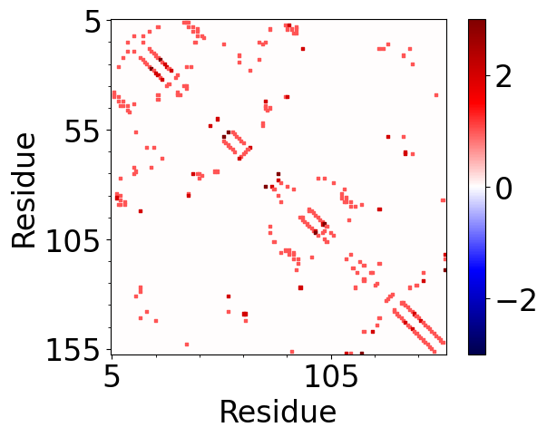
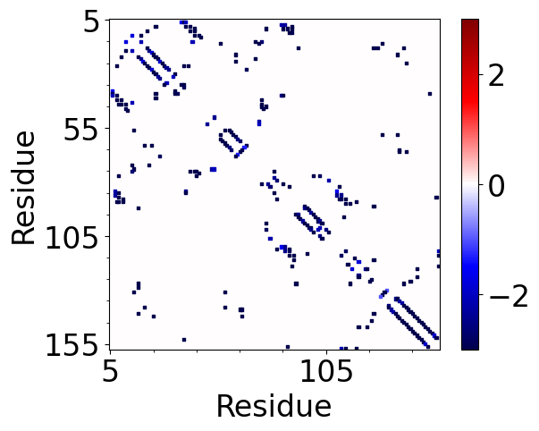
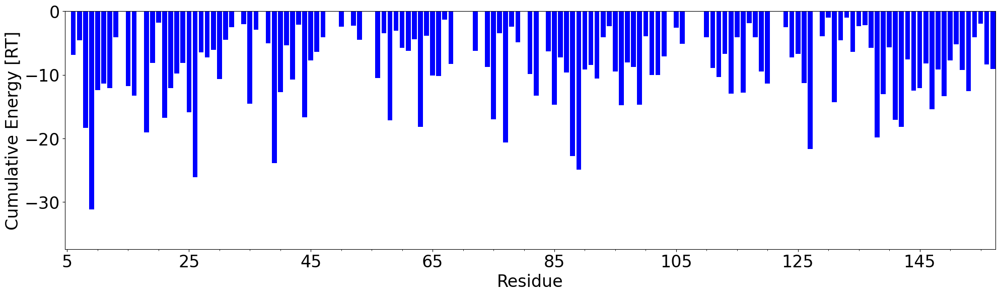

.. _insty_tutorial:

Interactions/Stability Evaluation
===============================================================================

This example shows how to perform Interactions/Stability Evaluation
(**InSty**) analysis for a small protein (<200 residues) called tyrosine
phosphatase LMW-PTP (PDB: **5KQM**) and visualize the results using
Matplotlib_ library and VMD_ program. 
In the tutorial, we will use an already prepared structure for
simulation (with hydrogens added). The same structure will be later
analyzed with the trajectory file to show how the analysis of interactions 
in the course of the simulation can change. The file is available in tutorial
files.

The tutorial will also include an example of a PDB structure directly
downloaded from Protein Data Bank (PDB) which requires adding the missing hydrogen
atoms to the protein and ligand structure.

Analysis of interactions for a single PDB structure
-------------------------------------------------------------------------------

We start by parsing PDB file with LMW-PTP :file:`5kqm_all_sci.pdb` which is avalable
in the tutorial files. The PDB file contains protein structure with water and
counter ions prepared using VMD_ program.

Before that import everything from the ProDy packages.

.. ipython:: python

   from prody import *
   from pylab import *
   import matplotlib

.. ipython:: python
   :verbatim:

   PDBfile = '5kqm_all_sci.pdb'
   coords = parsePDB(PDBfile)
   coords

.. parsed-literal::

   @> 19321 atoms and 1 coordinate set(s) were parsed in 0.23s.

For the analysis we will use only protein coordinates (``atoms``):

.. ipython:: python
   :verbatim:

   atoms = coords.select('protein')
   atoms

.. parsed-literal::

   @> 19321 atoms and 1 coordinate set(s) were parsed in 0.21s.

Compute all types of interactions
-------------------------------------------------------------------------------

In the next step, we instantiate an :class:`.Interactions` instance:

.. ipython:: python
   :verbatim:

   interactions = Interactions()

Now we can compute all available types of interactions (seven types: hydrogen
bonds, salt bridges, repulsive ionic bonding, Pi-cation, Pi-stacking,
hydrophobic interactions, and disulfide bonds) for protein structure by passing
selected atoms (``atoms``) to :meth:`.Interactions.calcProteinInteractions` method:

.. ipython:: python
   :verbatim:

   all_interactions = interactions.calcProteinInteractions(atoms)

.. parsed-literal::

   @> Calculating interations.
   @> Calculating hydrogen bonds.
   @>      DONOR (res chid atom)   <--->       ACCEPTOR (res chid atom)    Distance  Angle
   @>     ARG101    P      NH1_1516  <--->      ASP98    P      OD1_1463     2.0    33.1
   @>      HSE72    P      NE2_1042  <--->      ASN15    P       OD1_165     2.6    34.8
   @>     GLN143    P      NE2_2192  <--->     GLU139    P      OE2_2126     2.7     9.2
   @>      HSE66    P       NE2_957  <--->     GLU139    P      OE1_2125     2.7     6.4
   @>      ARG40    P         N_561  <--->       LYS6    P          O_37     2.7    17.1
   @>      ARG58    P         N_813  <--->      ASP56    P       OD1_788     2.7    30.0
   @>      ALA45    P         N_634  <--->      ARG75    P        O_1097     2.8    35.1
   @>      ASN53    P       ND2_747  <--->      GLU50    P       OE1_708     2.8    18.2
   @>      ALA74    P        N_1064  <--->      ASN53    P         O_751     2.8    21.3
   @>      ASP56    P         N_780  <--->      ILE16    P         O_189     2.8    27.0
   @>     LYS110    P       NZ_1667  <--->      THR84    P        O_1240     2.8    38.2
   @>     LEU116    P        N_1758  <--->      CYS90    P        O_1342     2.8    15.0
   @>     SER103    P        N_1546  <--->      LEU99    P        O_1485     2.8    29.1
   @>     ASN134    P        N_2045  <--->     ASP137    P      OD2_2091     2.8    22.6
   @>     PHE152    P        N_2321  <--->     CYS148    P        O_2275     2.8     8.3
   @>      ASN95    P        N_1398  <--->      ASP92    P      OD1_1368     2.8    12.6
   @>       LYS6    P          N_16  <--->      ASN38    P         O_536     2.8    25.0
   @>      ILE77    P        N_1115  <--->      ALA45    P         O_643     2.8    12.2
   @>      ARG58    P       NH2_832  <--->      ASP56    P       OD2_789     2.8    27.7
   @>      LEU99    P        N_1467  <--->      ASN95    P        O_1411     2.8    15.5
   @>     CYS149    P        N_2276  <--->     CYS145    P        O_2224     2.8     9.6
   @>      GLY52    P         N_731  <--->      ALA74    P        O_1073     2.8     6.6
   @>      ASP32    P         N_435  <--->      LYS28    P         O_385     2.8     8.8
   @>      ILE88    P        N_1294  <--->     LYS112    P        O_1704     2.8    17.7
   @>     GLN143    P        N_2180  <--->     GLU139    P        O_2128     2.8    21.7
   @>      ARG27    P         N_340  <--->      GLU23    P         O_293     2.8    15.4
   @>     TYR142    P        N_2159  <--->     PHE138    P        O_2113     2.9    14.2
   @>     GLY133    P        N_2038  <--->     PRO130    P        O_1995     2.9    25.4
   @>      PHE26    P         N_320  <--->      ALA22    P         O_278     2.9     4.9
   @>      ASN15    P       ND2_166  <--->      SER19    P        OG_232     2.9    32.1
   @>      ARG75    P      NH1_1090  <--->      ASP81    P      OD2_1194     2.9    19.7
   @>      ARG75    P      NH2_1093  <--->      ASP42    P       OD2_610     2.9    23.5
   @>      ARG97    P        N_1431  <--->      GLU93    P        O_1386     2.9    22.2
   @>      ARG65    P       NH2_941  <--->     GLU139    P      OE1_2125     2.9    32.3
   @>      VAL25    P         N_304  <--->      ILE21    P         O_268     2.9     8.2
   @>     LEU153    P        N_2341  <--->     CYS149    P        O_2286     2.9    12.5
   @>       SER7    P          N_38  <--->      ASP86    P      OD2_1270     2.9    39.9
   @>      ASP86    P        N_1261  <--->       SER7    P         OG_45     2.9    34.7
   @>      ARG58    P       NH2_832  <--->     TYR131    P        O_2016     2.9    33.1
   @>      THR46    P         N_644  <--->      CYS12    P         O_130     2.9    36.1
   @>     GLN144    P        N_2197  <--->     THR140    P        O_2142     2.9    23.3
   @>      THR78    P        N_1134  <--->      ASP81    P      OD2_1194     2.9    12.4
   @>      LEU89    P        N_1313  <--->       LEU9    P          O_83     2.9    29.5
   @>      THR31    P         N_421  <--->      ARG27    P         O_363     2.9    24.1
   @>      CYS90    P        N_1332  <--->     GLU114    P        O_1738     2.9    24.6
   ..
   ..
   @> Number of detected hydrogen bonds: 124.
   @> Calculating salt bridges.
   @>      HSE66    P         NE2_957  <--->     GLU139    P   OE1_2125_2126     2.8
   @>      ASP81    P   OD1_1193_1194  <--->      ARG75    P   NH1_1090_1093     2.9
   @>      ASP32    P     OD1_443_444  <--->      LYS28    P          NZ_380     3.0
   @>     ARG101    P   NH1_1516_1519  <--->      ASP98    P   OD1_1463_1464     3.1
   @>      ARG27    P     NH1_356_359  <--->      GLU23    P     OE1_290_291     3.7
   @>     GLU139    P   OE1_2125_2126  <--->      ARG65    P     NH1_938_941     3.8
   @>     LYS102    P         NZ_1540  <--->      ASP98    P   OD1_1463_1464     3.9
   @>      ARG58    P     NH1_829_832  <--->      ASP56    P     OD1_788_789     3.9
   @>      ARG18    P     NH1_217_220  <--->      ASP92    P   OD1_1368_1369     4.1
   @>     GLU114    P   OE1_1735_1736  <--->     LYS112    P         NZ_1699     4.1
   @>     ASP120    P   OD1_1824_1825  <--->     ARG147    P   NH1_2257_2260     4.2
   @>     LYS110    P         NZ_1667  <--->      ASP86    P   OD1_1269_1270     4.2
   @>     GLU114    P   OE1_1735_1736  <--->     HSE157    P        NE2_2418     4.4
   @>      ARG18    P     NH1_217_220  <--->     ASP129    P   OD1_1978_1979     4.6
   @>      ARG75    P   NH1_1090_1093  <--->      ASP42    P     OD1_609_610     4.6
   @>      GLU23    P     OE1_290_291  <--->      HSE72    P        NE2_1042     5.0
   @> Number of detected salt bridges: 16.
   @> Calculating repulsive ionic bonding.
   @>     ARG101    P   NH1_1516_1519  <--->     LYS102    P         NZ_1540     4.3
   @> Number of detected Repulsive Ionic Bonding interactions: 1.
   @> Calculating Pi stacking interactions.
   @>      HSE66       P             953_954_955_957_959  <--->     TYR142       P   2166_2167_2169_2171_2174_2176     3.9   162.1
   @>     HSE157       P 2414_2415_2416_2418_2420_2423_2424  <--->     TYR119       P   1802_1803_1805_1807_1810_1812     4.4     3.0
   @>      TRP39       P         549_550_551_553_555_557  <--->      PHE26       P         327_328_330_332_334_336     4.8    75.5
   @>     TYR131       P   2003_2004_2006_2008_2011_2013  <--->     TYR132       P   2024_2025_2027_2029_2032_2034     4.9    91.4
   @> Number of detected Pi stacking interactions: 4.
   @> Calculating cation-Pi interactions.
   @>      PHE85   P   1248_1249_1251_1253_1255_1257  <--->      ARG40   P                     NH1_577_580     3.7
   @>      HSE66   P             953_954_955_957_959  <--->      ARG65   P                     NH1_938_941     4.5
   @>     HSE157   P2414_2415_2416_2418_2420_2423_2424  <--->     LYS112   P                         NZ_1699     4.8
   @> Number of detected cation-pi interactions: 3.
   @> Hydrophobic Overlaping Areas are computed.
   @> Calculating hydrophobic interactions.
   @>      TYR87    P    OH_128614s  <--->     ALA156    P    CB_2401     3.0    22.0
   @>      MET63    P     CE_89414s  <--->      ALA24    P     CB_298     3.3     5.2
   @>      ILE68    P    CG2_97614s  <--->      MET63    P     CE_894     3.3    52.4
   @>     TYR142    P    CZ_217114s  <--->     VAL146    P   CG2_2235     3.5    49.7
   @>      PHE10    P     CD1_9214s  <--->      ALA22    P     CB_273     3.5    31.2
   @>       LYS6    P      CD_2614s  <--->      TRP39    P    CZ2_555     3.5    68.7
   @>      VAL30    P    CG1_41114s  <--->      PHE26    P    CE2_336     3.6    21.1
   @>     ALA111    P    CB_167714s  <--->      ILE88    P    CD_1307     3.6    21.2
   @>      VAL11    P    CG2_11414s  <--->      ILE88    P   CG2_1300     3.6     9.3
   @>      VAL41    P    CG2_59514s  <--->      PHE26    P    CD2_334     3.6    16.6
   @>     PHE152    P   CE1_233114s  <--->     ALA156    P    CB_2401     3.7    17.5
   @>     VAL106    P   CG2_159814s  <--->      LYS79    P    CG_1155     3.7    25.1
   @>      ILE77    P    CD_112814s  <--->      LEU99    P   CD2_1480     3.7    12.0
   @>      PHE82    P   CD1_120514s  <--->      ILE88    P    CD_1307     3.7    17.6
   @>     LEU116    P   CD2_177114s  <--->     ILE127    P    CD_1949     3.7    17.4
   @>       VAL8    P     CG1_5514s  <--->      PHE26    P    CE2_336     3.7    12.1
   @>      LEU96    P   CD1_142114s  <--->     ILE113    P   CG2_1711     3.7    17.0
   @>       LEU9    P     CD2_7814s  <--->      ILE77    P    CD_1128     3.7    15.4
   @>      LEU89    P   CD1_132214s  <--->       VAL8    P     CG2_59     3.8    15.9
   @>     ILE126    P    CD_193014s  <--->     LEU125    P   CD1_1907     3.8    54.2
   @>     VAL141    P   CG1_214914s  <--->     ILE127    P   CG2_1942     3.9    11.5
   ..
   ..
   @> Number of detected hydrophobic interactions: 39.
   @> Calculating disulfide bonds.
   @> Number of detected disulfide bonds: 0.

All types of interactions will be displayed on the screen with all types of
information such as distance or angle (if applied).

Moreover, we will have access to the details of each interaction type
using the following methods: 

:meth:`.Interactions.getHydrogenBonds` - hydrogen bonds:

.. ipython:: python
   :verbatim:   

   interactions.getHydrogenBonds()

.. parsed-literal::

   [['ARG101', 'NH1_1516', 'P', 'ASP98', 'OD1_1463', 'P', 1.998, 33.1238],
    ['HSE72', 'NE2_1042', 'P', 'ASN15', 'OD1_165', 'P', 2.5997, 34.752],
    ['GLN143', 'NE2_2192', 'P', 'GLU139', 'OE2_2126', 'P', 2.7287, 9.1823],
    ['HSE66', 'NE2_957', 'P', 'GLU139', 'OE1_2125', 'P', 2.7314, 6.3592],
    ['ARG40', 'N_561', 'P', 'LYS6', 'O_37', 'P', 2.7479, 17.1499],
    ['ARG58', 'N_813', 'P', 'ASP56', 'OD1_788', 'P', 2.7499, 29.9737],
    ['ALA45', 'N_634', 'P', 'ARG75', 'O_1097', 'P', 2.7609, 35.0983],
    ['ASN53', 'ND2_747', 'P', 'GLU50', 'OE1_708', 'P', 2.7702, 18.2336],
    ['ALA74', 'N_1064', 'P', 'ASN53', 'O_751', 'P', 2.7782, 21.3375],
    ['ASP56', 'N_780', 'P', 'ILE16', 'O_189', 'P', 2.7793, 27.0481],
    ['LYS110', 'NZ_1667', 'P', 'THR84', 'O_1240', 'P', 2.7977, 38.2213],
    ['LEU116', 'N_1758', 'P', 'CYS90', 'O_1342', 'P', 2.8072, 15.0239],
    ['SER103', 'N_1546', 'P', 'LEU99', 'O_1485', 'P', 2.8075, 29.107],
    ['ASN134', 'N_2045', 'P', 'ASP137', 'OD2_2091', 'P', 2.8132, 22.562],
    ['PHE152', 'N_2321', 'P', 'CYS148', 'O_2275', 'P', 2.8141, 8.2562],
    ['ASN95', 'N_1398', 'P', 'ASP92', 'OD1_1368', 'P', 2.8148, 12.5701],
    ['LYS6', 'N_16', 'P', 'ASN38', 'O_536', 'P', 2.8178, 25.0305],
    ['ILE77', 'N_1115', 'P', 'ALA45', 'O_643', 'P', 2.8179, 12.1855],
    ..
    ..

:meth:`.Interactions.getSaltBridges` - salt bridges (residues with oposite
charges):

.. ipython:: python
   :verbatim:   

   interactions.getSaltBridges()

.. parsed-literal::

   [['HSE66', 'NE2_957', 'P', 'GLU139', 'OE1_2125_2126', 'P', 2.8359],
    ['ASP81', 'OD1_1193_1194', 'P', 'ARG75', 'NH1_1090_1093', 'P', 2.9163],
    ['ASP32', 'OD1_443_444', 'P', 'LYS28', 'NZ_380', 'P', 3.037],
    ['ARG101', 'NH1_1516_1519', 'P', 'ASP98', 'OD1_1463_1464', 'P', 3.0699],
    ['ARG27', 'NH1_356_359', 'P', 'GLU23', 'OE1_290_291', 'P', 3.7148],
    ['GLU139', 'OE1_2125_2126', 'P', 'ARG65', 'NH1_938_941', 'P', 3.7799],
    ['LYS102', 'NZ_1540', 'P', 'ASP98', 'OD1_1463_1464', 'P', 3.9359],
    ['ARG58', 'NH1_829_832', 'P', 'ASP56', 'OD1_788_789', 'P', 3.9486],
    ['ARG18', 'NH1_217_220', 'P', 'ASP92', 'OD1_1368_1369', 'P', 4.0693],
    ['GLU114', 'OE1_1735_1736', 'P', 'LYS112', 'NZ_1699', 'P', 4.0787],
    ['ASP120', 'OD1_1824_1825', 'P', 'ARG147', 'NH1_2257_2260', 'P', 4.1543],
    ['LYS110', 'NZ_1667', 'P', 'ASP86', 'OD1_1269_1270', 'P', 4.1879],
    ['GLU114', 'OE1_1735_1736', 'P', 'HSE157', 'NE2_2418', 'P', 4.3835],
    ['ARG18', 'NH1_217_220', 'P', 'ASP129', 'OD1_1978_1979', 'P', 4.5608],
    ['ARG75', 'NH1_1090_1093', 'P', 'ASP42', 'OD1_609_610', 'P', 4.5612],
    ['GLU23', 'OE1_290_291', 'P', 'HSE72', 'NE2_1042', 'P', 4.99]]

:meth:`.Interactions.getRepulsiveIonicBonding` - repulsive ionic bonding
(between residues with the same charges):

.. ipython:: python
   :verbatim:

   interactions.getRepulsiveIonicBonding()

.. parsed-literal::

   [['ARG101', 'NH1_1516_1519', 'P', 'LYS102', 'NZ_1540', 'P', 4.2655]]

:meth:`.Interactions.getPiStacking` - Pi-stacking interactions (HSE is a histidine
(HIS) type in the CHARMM force field):

.. ipython:: python
   :verbatim:

   interactions.getPiStacking()

.. parsed-literal::

   [['HSE66',
     '953_954_955_957_959',
     'P',
     'TYR142',
     '2166_2167_2169_2171_2174_2176',
     'P',
     3.8882,
     162.1245],
    ['HSE157',
     '2414_2415_2416_2418_2420_2423_2424',
     'P',
     'TYR119',
     '1802_1803_1805_1807_1810_1812',
     'P',
     4.3605,
     3.0062],
    ['TRP39',
     '549_550_551_553_555_557',
     'P',
     'PHE26',
     '327_328_330_332_334_336',
     'P',
     4.8394,
     75.4588],
    ['TYR131',
     '2003_2004_2006_2008_2011_2013',
     'P',
     'TYR132',
     '2024_2025_2027_2029_2032_2034',
     'P',
     4.8732,
     91.4358]]

:meth:`.Interactions.getPiCation` - Pi-cation:

.. ipython:: python
   :verbatim:

   interactions.getPiCation()

.. parsed-literal::

   [['PHE85',
     '1248_1249_1251_1253_1255_1257',
     'P',
     'ARG40',
     'NH1_577_580',
     'P',
     3.6523],
    ['HSE66', '953_954_955_957_959', 'P', 'ARG65', 'NH1_938_941', 'P', 4.5323],
    ['HSE157',
     '2414_2415_2416_2418_2420_2423_2424',
     'P',
     'LYS112',
     'NZ_1699',
     'P',
     4.828]]

:meth:`.Interactions.getHydrophobic` - hydrophobic interactions:

.. ipython:: python
   :verbatim:

   interactions.getHydrophobic()

.. parsed-literal::

   [['TYR87', 'OH_1286', 'P', 'ALA156', 'CB_2401', 'P', 3.0459],
    ['MET63', 'CE_894', 'P', 'ALA24', 'CB_298', 'P', 3.3105],
    ['ILE68', 'CG2_976', 'P', 'MET63', 'CE_894', 'P', 3.3306],
    ['TYR142', 'CZ_2171', 'P', 'VAL146', 'CG2_2235', 'P', 3.4815],
    ['PHE10', 'CD1_92', 'P', 'ALA22', 'CB_273', 'P', 3.5334],
    ['LYS6', 'CD_26', 'P', 'TRP39', 'CZ2_555', 'P', 3.5427],
    ['VAL30', 'CG1_411', 'P', 'PHE26', 'CE2_336', 'P', 3.5603],
    ['ALA111', 'CB_1677', 'P', 'ILE88', 'CD_1307', 'P', 3.5627],
    ['VAL11', 'CG2_114', 'P', 'ILE88', 'CG2_1300', 'P', 3.6386],
    ['VAL41', 'CG2_595', 'P', 'PHE26', 'CD2_334', 'P', 3.6448],
    ['PHE152', 'CE1_2331', 'P', 'ALA156', 'CB_2401', 'P', 3.6594],
    ['VAL106', 'CG2_1598', 'P', 'LYS79', 'CG_1155', 'P', 3.6828],
    ['ILE77', 'CD_1128', 'P', 'LEU99', 'CD2_1480', 'P', 3.6917],
    ['PHE82', 'CD1_1205', 'P', 'ILE88', 'CD_1307', 'P', 3.692],
    ['LEU116', 'CD2_1771', 'P', 'ILE127', 'CD_1949', 'P', 3.7057],
    ['VAL8', 'CG1_55', 'P', 'PHE26', 'CE2_336', 'P', 3.7106],
    ..
    ..

:meth:`.Interactions.getDisulfideBonds` - disulfide bonds (none in the
structure):

.. ipython:: python
   :verbatim:

   interactions.getDisulfideBonds()

.. parsed-literal::

   []

To display residues with the biggest number of potential interactions and their
types, we can use :meth:`.Interactions.getFrequentInteractors` method:

.. ipython:: python
   :verbatim:

   interactions.getFrequentInteractors(contacts_min=4)

.. parsed-literal::

   @> VAL8P  <--->  hb:ASP42P  hp:LEU89P  hp:PHE26P  hb:ARG40P
   @> LEU9P  <--->  hp:ALA44P  hp:PHE85P  hb:LEU89P  hp:ILE77P  hb:TYR87P
   @> CYS12P  <--->  hb:ASN15P  hb:SER19P  hb:THR46P  hb:ALA44P
   @> ASN15P  <--->  hb:HIS72P  hb:ARG75P  hb:CYS12P  hb:SER19P  hb:SER43P
   @> ARG18P  <--->  hb:ALA22P  hb:ASP92P  sb:ASP92P  hb:ILE127P  sb:ASP129P  hp:VAL141P
   @> GLU23P  <--->  hb:ARG27P  hb:ARG27P  hb:ARG27P  sb:ARG27P  sb:HIS72P  hb:SER19P
   @> VAL25P  <--->  hb:LEU29P  hp:LEU29P  hb:ILE21P  hp:TYR142P
   @> PHE26P  <--->  hp:VAL8P  hb:VAL30P  hp:VAL30P  ps:TRP39P  hp:VAL41P  hb:ALA22P
   @> ARG27P  <--->  hb:THR31P  hb:GLU23P  hb:GLU23P  hb:GLU23P  sb:GLU23P
   @> LYS28P  <--->  hb:ASP32P  sb:ASP32P  hb:ALA24P  hp:ILE68P
   @> TRP39P  <--->  hp:LYS6P  hp:ILE35P  hp:LEU153P  ps:PHE26P  hb:SER36P
   @> ARG40P  <--->  hb:VAL8P  pc:PHE85P  hb:LYS6P  hb:THR84P  hp:PHE85P
   @> ASP42P  <--->  hb:PHE10P  hb:ARG75P  sb:ARG75P  hb:VAL8P
   @> ALA44P  <--->  hb:CYS12P  hp:ARG75P  hp:LEU9P  hb:PHE10P
   @> ASP56P  <--->  hb:ARG58P  hb:ARG58P  hb:ARG58P  sb:ARG58P  hb:GLN60P  hb:ILE16P
   @> ARG58P  <--->  hb:CYS62P  hb:ASP56P  hb:ASP56P  hb:ASP56P  sb:ASP56P  hb:TYR131P  hb:TYR131P  hp:PHE138P
   @> MET63P  <--->  hp:ILE21P  hb:ILE68P  hp:ILE68P  hp:ALA24P  hb:GLY59P
   @> ARG65P  <--->  pc:HIS66P  sb:GLU139P  hb:SER61P  hb:GLU139P
   @> HIS66P  <--->  ps:TYR142P  pc:ARG65P  hb:GLU139P  sb:GLU139P
   @> ARG75P  <--->  hb:ALA45P  sb:ASP81P  hb:ASN15P  hb:ASP42P  sb:ASP42P  hp:ALA44P  hb:ASP81P  hb:ASP81P
   @> ILE77P  <--->  hp:LEU9P  hp:LYS102P  hb:ALA45P  hp:LEU99P
   @> ASP81P  <--->  hb:ARG75P  hb:ARG75P  hb:THR78P  hb:PHE85P  sb:ARG75P  hb:THR78P
   @> PHE85P  <--->  hp:ARG40P  hp:LEU9P  pc:ARG40P  hb:ASP81P
   @> ASP86P  <--->  hb:SER7P  sb:LYS110P  hb:LYS112P  hb:SER7P
   @> ILE88P  <--->  hp:VAL11P  hp:PHE82P  hp:ALA111P  hb:GLU114P  hb:LYS112P
   @> LEU89P  <--->  hb:VAL11P  hp:TYR119P  hp:VAL8P  hb:LEU9P
   @> ASP92P  <--->  hb:ARG18P  sb:ARG18P  hb:ASN95P  hb:LEU96P
   @> ASP98P  <--->  hb:ARG101P  sb:ARG101P  hb:LYS102P  hb:LYS102P  sb:LYS102P  hb:SER94P
   @> LYS102P  <--->  rb:ARG101P  hb:GLN105P  hp:ILE77P  hb:ASP98P  hb:ASP98P  sb:ASP98P
   @> LYS112P  <--->  hb:ILE88P  sb:GLU114P  pc:HIS157P  hb:ASP86P  hb:HIS157P
   @> GLU114P  <--->  hb:CYS90P  hb:ILE88P  sb:LYS112P  sb:HIS157P
   @> TYR119P  <--->  hb:HIS157P  hp:LEU89P  hb:HIS157P  ps:HIS157P
   @> ASP120P  <--->  hb:LYS123P  hb:GLN124P  sb:ARG147P  hb:GLY117P
   @> ILE127P  <--->  hb:ARG18P  hp:MET91P  hp:LEU116P  hp:VAL141P  hb:MET91P
   @> TYR131P  <--->  hb:ARG58P  hb:ARG58P  ps:TYR132P  hp:ILE16P
   @> PHE138P  <--->  hp:ARG58P  hb:TYR142P  hp:ILE21P  hb:ASN134P
   @> GLU139P  <--->  hb:ARG65P  hb:HIS66P  sb:HIS66P  hb:GLN143P  hb:GLN143P  sb:ARG65P  hb:ASP135P
   @> VAL141P  <--->  hp:ARG18P  hb:CYS145P  hp:ILE127P  hb:ASP137P
   @> TYR142P  <--->  hp:VAL25P  hb:VAL146P  ps:HIS66P  hb:PHE138P  hp:VAL146P
   @> ARG147P  <--->  hb:ALA151P  sb:ASP120P  hb:GLN124P  hb:GLN124P  hb:GLN143P
   @> HIS157P  <--->  hb:LYS112P  sb:GLU114P  hb:TYR119P  ps:TYR119P  pc:LYS112P  hb:TYR119P
   @> ARG101P  <--->  hb:ARG97P  hb:ASP98P  sb:ASP98P  rb:LYS102P
   @> 
   Legend: hb-hydrogen bond, sb-salt bridge, rb-repulsive ionic bond, ps-Pi stacking interaction,
   pc-Cation-Pi interaction, hp-hydrophobic interaction, dibs-disulfide bonds

The value of ``contacts_min`` can be modified to display residues with smaller
or bigger number of interactions. 

Visualize interactions in VMD
-------------------------------------------------------------------------------

We can generate tcl files for visualizing each type of interaction with VMD_ 
using the :func:`.showProteinInteractions_VMD` function in the following way:

.. ipython:: python
   :verbatim:

   showProteinInteractions_VMD(atoms, interactions.getHydrogenBonds(), 
					color='blue', filename='HBs.tcl')
   showProteinInteractions_VMD(atoms, interactions.getSaltBridges(), 
					color='yellow',filename='SBs.tcl')
   showProteinInteractions_VMD(atoms, interactions.getRepulsiveIonicBonding(), 
					color='red',filename='RIB.tcl')
   showProteinInteractions_VMD(atoms, interactions.getPiStacking(), 
					color='green',filename='PiStacking.tcl') 
   showProteinInteractions_VMD(atoms, interactions.getPiCation(), 
					color='orange',filename='PiCation.tcl') 
   showProteinInteractions_VMD(atoms, interactions.getHydrophobic(), 
					color='silver',filename='HPh.tcl')
   showProteinInteractions_VMD(atoms, interactions.getDisulfideBonds(), 
					color='black',filename='DiBs.tcl') 

.. parsed-literal::

   @> TCL file saved
   @> TCL file saved
   @> TCL file saved
   @> TCL file saved
   @> TCL file saved
   @> TCL file saved
   @> Lack of results
   @> TCL file saved

A ``TCL file`` will be saved and can be used in VMD_ after uploading the PDB file
with protein structure :file:`5kqm_all_sci.pdb` and by running the following command 
line instruction in the VMD_ :guilabel:`TK Console` (via :guilabel:`VMD Main`)
for Linux, Windows and Mac users: 

.. parsed-literal::

   play HBs.tcl

The tcl file contains a method for drawing lines between selected pairs of 
residues. Those residues are also displayed. Now, we uploaded hydrogen
bonds which are displayed in blue as we defined in
:func:`.showProteinInteractions_VMD` function.

.. figure:: images/HBs.png
   :scale: 50 %

Salt bridges in yellow (VMD_ :guilabel:`TK Console`):

.. parsed-literal::

   play SBs.tcl

.. figure:: images/SBs.png
   :scale: 50 %

Repulsive ionic bonding in red (VMD_ :guilabel:`TK Console`):

.. parsed-literal::

   play RIB.tcl

.. figure:: images/RIB.png
   :scale: 50 %

Pi-Pi stacking interactions in green (VMD_ :guilabel:`TK Console`):

.. parsed-literal::

   play PiStacking.tcl

.. figure:: images/PiStacking.png
   :scale: 50 %

Pi-cation interactions in orange (VMD_ :guilabel:`TK Console`):

.. parsed-literal::

   play PiCation.tcl

.. figure:: images/PiCation.png
   :scale: 50 %

and hydrophobic interactions in grey (VMD_ :guilabel:`TK Console`):

.. parsed-literal::

   play HPh.tcl

.. figure:: images/Hydrophobic.png
   :scale: 50 %

Additional selections
-------------------------------------------------------------------------------

From the predicted interactions, we can select only interactions assigned to
certain regions, chains, or between different chains (binding interface
between two chains in protein complex).

We can compute them by adding additional parameters to the selected
function. See examples below:

.. ipython:: python
   :verbatim:

   interactions.getSaltBridges(selection='chain P')

.. parsed-literal::

   [['HSE66', 'NE2_957', 'P', 'GLU139', 'OE1_2125_2126', 'P', 2.8359],
    ['ASP81', 'OD1_1193_1194', 'P', 'ARG75', 'NH1_1090_1093', 'P', 2.9163],
    ['ASP32', 'OD1_443_444', 'P', 'LYS28', 'NZ_380', 'P', 3.037],
    ['ARG101', 'NH1_1516_1519', 'P', 'ASP98', 'OD1_1463_1464', 'P', 3.0699],
    ['ARG27', 'NH1_356_359', 'P', 'GLU23', 'OE1_290_291', 'P', 3.7148],
    ['GLU139', 'OE1_2125_2126', 'P', 'ARG65', 'NH1_938_941', 'P', 3.7799],
    ['LYS102', 'NZ_1540', 'P', 'ASP98', 'OD1_1463_1464', 'P', 3.9359],
    ['ARG58', 'NH1_829_832', 'P', 'ASP56', 'OD1_788_789', 'P', 3.9486],
    ['ARG18', 'NH1_217_220', 'P', 'ASP92', 'OD1_1368_1369', 'P', 4.0693],
    ['GLU114', 'OE1_1735_1736', 'P', 'LYS112', 'NZ_1699', 'P', 4.0787],
    ['ASP120', 'OD1_1824_1825', 'P', 'ARG147', 'NH1_2257_2260', 'P', 4.1543],
    ['LYS110', 'NZ_1667', 'P', 'ASP86', 'OD1_1269_1270', 'P', 4.1879],
    ['GLU114', 'OE1_1735_1736', 'P', 'HSE157', 'NE2_2418', 'P', 4.3835],
    ['ARG18', 'NH1_217_220', 'P', 'ASP129', 'OD1_1978_1979', 'P', 4.5608],
    ['ARG75', 'NH1_1090_1093', 'P', 'ASP42', 'OD1_609_610', 'P', 4.5612],
    ['GLU23', 'OE1_290_291', 'P', 'HSE72', 'NE2_1042', 'P', 4.99]]

.. ipython:: python
   :verbatim:

   interactions.getRepulsiveIonicBonding(selection='resid 102')

.. parsed-literal::

   [['ARG101', 'NH1_1516_1519', 'P', 'LYS102', 'NZ_1540', 'P', 4.2655]]

.. ipython:: python
   :verbatim:

   interactions.getPiStacking(selection='chain P and resid 26')

.. parsed-literal::

   [['TRP39',
  '549_550_551_553_555_557',
  'P',
  'PHE26',
  '327_328_330_332_334_336',
  'P',
  4.8394,
  75.4588]]

It can be done for all kinds of interactions is a similar way. The function will
return a list of interactions with following order:

    (1) Hydrogen bonds
    (2) Salt Bridges
    (3) RepulsiveIonicBonding 
    (4) Pi stacking interactions
    (5) Pi-cation interactions
    (6) Hydrophobic interactions
    (7) Disulfide bonds

.. ipython:: python
   :verbatim:

   allRes_20to50 = interactions.getInteractions(selection='resid 20 to 50')
   allRes_20to50

.. parsed-literal::

   [[['ARG40', 'N_561', 'P', 'LYS6', 'O_37', 'P', 2.7479, 17.1499],
     ['ALA45', 'N_634', 'P', 'ARG75', 'O_1097', 'P', 2.7609, 35.0983],
     ['ASN53', 'ND2_747', 'P', 'GLU50', 'OE1_708', 'P', 2.7702, 18.2336],
     ['LYS6', 'N_16', 'P', 'ASN38', 'O_536', 'P', 2.8178, 25.0305],
     ['ILE77', 'N_1115', 'P', 'ALA45', 'O_643', 'P', 2.8179, 12.1855],
     ['ASP32', 'N_435', 'P', 'LYS28', 'O_385', 'P', 2.8357, 8.8318],
     ['ARG27', 'N_340', 'P', 'GLU23', 'O_293', 'P', 2.8446, 15.4167],
     ['PHE26', 'N_320', 'P', 'ALA22', 'O_278', 'P', 2.8541, 4.8732],
     ['ARG75', 'NH2_1093', 'P', 'ASP42', 'OD2_610', 'P', 2.8649, 23.5083],
     ['VAL25', 'N_304', 'P', 'ILE21', 'O_268', 'P', 2.8666, 8.2255],
     ['THR46', 'N_644', 'P', 'CYS12', 'O_130', 'P', 2.883, 36.1279],
     ['THR31', 'N_421', 'P', 'ARG27', 'O_363', 'P', 2.896, 24.1287],
     ['GLU23', 'N_279', 'P', 'SER19', 'O_235', 'P', 2.8979, 15.4146],
     ['PHE10', 'N_84', 'P', 'ASP42', 'O_612', 'P', 2.9026, 22.751],
     ['ARG27', 'NH2_359', 'P', 'GLU23', 'OE2_291', 'P', 2.9199, 31.5487],
     ['ASN38', 'N_523', 'P', 'ILE35', 'O_496', 'P', 2.9255, 29.091],
     ['GLN76', 'NE2_1110', 'P', 'THR46', 'O_657', 'P', 2.9381, 31.3836],
     ['ARG40', 'NH1_577', 'P', 'THR84', 'OG1_1233', 'P', 2.9482, 8.3748],
     ['ALA44', 'N_624', 'P', 'PHE10', 'O_103', 'P', 2.9499, 33.1772],
     ['VAL8', 'N_49', 'P', 'ARG40', 'O_584', 'P', 2.9631, 25.0079],
     ['ILE35', 'N_478', 'P', 'VAL30', 'O_420', 'P', 2.9811, 23.5092],
     ['ASN53', 'N_738', 'P', 'GLU50', 'O_711', 'P', 2.995, 28.587],
     ['ASN34', 'N_464', 'P', 'THR31', 'O_434', 'P', 3.0041, 18.2465],
     ['ASN15', 'ND2_166', 'P', 'SER43', 'OG_620', 'P', 3.0129, 25.6996],
     ['ARG27', 'NH1_356', 'P', 'GLU23', 'OE2_291', 'P', 3.0175, 36.9343],
     ['LEU29', 'N_386', 'P', 'VAL25', 'O_319', 'P', 3.0299, 19.109],
     ['SER47', 'N_658', 'P', 'LEU13', 'O_149', 'P', 3.0386, 28.8029],
     ['VAL30', 'N_405', 'P', 'PHE26', 'O_339', 'P', 3.0394, 17.6883],
     ['ALA24', 'N_294', 'P', 'PRO20', 'O_249', 'P', 3.0751, 29.9487],
     ['LYS28', 'N_364', 'P', 'ALA24', 'O_303', 'P', 3.0783, 19.9504],
     ['ALA22', 'N_269', 'P', 'ARG18', 'O_224', 'P', 3.088, 21.873],
     ['ASP42', 'N_601', 'P', 'VAL8', 'O_64', 'P', 3.1331, 35.5671],
     ['TRP39', 'N_537', 'P', 'SER36', 'O_507', 'P', 3.1343, 15.1776],
     ['CYS12', 'N_120', 'P', 'ALA44', 'O_633', 'P', 3.3349, 36.1006]],
    [['ASP32', 'OD1_443_444', 'P', 'LYS28', 'NZ_380', 'P', 3.037],
     ['ARG27', 'NH1_356_359', 'P', 'GLU23', 'OE1_290_291', 'P', 3.7148],
     ['ARG75', 'NH1_1090_1093', 'P', 'ASP42', 'OD1_609_610', 'P', 4.5612],
     ['GLU23', 'OE1_290_291', 'P', 'HSE72', 'NE2_1042', 'P', 4.99]],
    [],
    [['TRP39',
      '549_550_551_553_555_557',
      'P',
      'PHE26',
      '327_328_330_332_334_336',
      'P',
      4.8394,
      75.4588]],
    [['PHE85',
      '1248_1249_1251_1253_1255_1257',
      'P',
      'ARG40',
      'NH1_577_580',
      'P',
      3.6523]],
    [['MET63', 'CE_894', 'P', 'ALA24', 'CB_298', 'P', 3.3105],
     ['PHE10', 'CD1_92', 'P', 'ALA22', 'CB_273', 'P', 3.5334],
     ['LYS6', 'CD_26', 'P', 'TRP39', 'CZ2_555', 'P', 3.5427],
     ['VAL30', 'CG1_411', 'P', 'PHE26', 'CE2_336', 'P', 3.5603],
     ['VAL41', 'CG2_595', 'P', 'PHE26', 'CD2_334', 'P', 3.6448],
     ['VAL8', 'CG1_55', 'P', 'PHE26', 'CE2_336', 'P', 3.7106],
     ['ALA44', 'CB_628', 'P', 'LEU9', 'CD1_74', 'P', 3.8992],
     ['VAL25', 'CG2_314', 'P', 'TYR142', 'CE1_2169', 'P', 3.92],
     ['ILE21', 'CG2_256', 'P', 'MET63', 'SD_893', 'P', 3.9614],
     ['LEU153', 'CD1_2350', 'P', 'TRP39', 'NE1_547', 'P', 3.967],
     ['ILE35', 'CD_491', 'P', 'TRP39', 'NE1_547', 'P', 4.0172],
     ['LEU29', 'CD1_395', 'P', 'VAL25', 'CG1_310', 'P', 4.0642],
     ['ARG75', 'CG_1081', 'P', 'ALA44', 'CB_628', 'P', 4.0853],
     ['ARG40', 'CG_568', 'P', 'PHE85', 'CE2_1257', 'P', 4.2669],
     ['LYS28', 'CG_371', 'P', 'ILE68', 'CD_983', 'P', 4.2707],
     ['PHE138', 'CD2_2108', 'P', 'ILE21', 'CD_263', 'P', 4.3082]],
    []]

The list of hydrogen bonds, salt bridges and other types of interactions can
be displayed as follows:

Hydrogen bonds:

.. ipython:: python
   :verbatim:

   allRes_20to50[0]

.. parsed-literal::

   [['ARG40', 'N_561', 'P', 'LYS6', 'O_37', 'P', 2.7479, 17.1499],
    ['ALA45', 'N_634', 'P', 'ARG75', 'O_1097', 'P', 2.7609, 35.0983],
    ['ASN53', 'ND2_747', 'P', 'GLU50', 'OE1_708', 'P', 2.7702, 18.2336],
    ['LYS6', 'N_16', 'P', 'ASN38', 'O_536', 'P', 2.8178, 25.0305],
    ['ILE77', 'N_1115', 'P', 'ALA45', 'O_643', 'P', 2.8179, 12.1855],
    ['ASP32', 'N_435', 'P', 'LYS28', 'O_385', 'P', 2.8357, 8.8318],
    ['ARG27', 'N_340', 'P', 'GLU23', 'O_293', 'P', 2.8446, 15.4167],
    ['PHE26', 'N_320', 'P', 'ALA22', 'O_278', 'P', 2.8541, 4.8732],
    ['ARG75', 'NH2_1093', 'P', 'ASP42', 'OD2_610', 'P', 2.8649, 23.5083],
    ['VAL25', 'N_304', 'P', 'ILE21', 'O_268', 'P', 2.8666, 8.2255],
    ['THR46', 'N_644', 'P', 'CYS12', 'O_130', 'P', 2.883, 36.1279],
    ['THR31', 'N_421', 'P', 'ARG27', 'O_363', 'P', 2.896, 24.1287],
    ['GLU23', 'N_279', 'P', 'SER19', 'O_235', 'P', 2.8979, 15.4146],
    ['PHE10', 'N_84', 'P', 'ASP42', 'O_612', 'P', 2.9026, 22.751],
    ['ARG27', 'NH2_359', 'P', 'GLU23', 'OE2_291', 'P', 2.9199, 31.5487],
    ['ASN38', 'N_523', 'P', 'ILE35', 'O_496', 'P', 2.9255, 29.091],
    ['GLN76', 'NE2_1110', 'P', 'THR46', 'O_657', 'P', 2.9381, 31.3836],
    ['ARG40', 'NH1_577', 'P', 'THR84', 'OG1_1233', 'P', 2.9482, 8.3748],
    ['ALA44', 'N_624', 'P', 'PHE10', 'O_103', 'P', 2.9499, 33.1772],
    ['VAL8', 'N_49', 'P', 'ARG40', 'O_584', 'P', 2.9631, 25.0079],
    ['ILE35', 'N_478', 'P', 'VAL30', 'O_420', 'P', 2.9811, 23.5092],
    ['ASN53', 'N_738', 'P', 'GLU50', 'O_711', 'P', 2.995, 28.587],
    ['ASN34', 'N_464', 'P', 'THR31', 'O_434', 'P', 3.0041, 18.2465],
    ['ASN15', 'ND2_166', 'P', 'SER43', 'OG_620', 'P', 3.0129, 25.6996],
    ['ARG27', 'NH1_356', 'P', 'GLU23', 'OE2_291', 'P', 3.0175, 36.9343],
    ['LEU29', 'N_386', 'P', 'VAL25', 'O_319', 'P', 3.0299, 19.109],
    ['SER47', 'N_658', 'P', 'LEU13', 'O_149', 'P', 3.0386, 28.8029],
    ['VAL30', 'N_405', 'P', 'PHE26', 'O_339', 'P', 3.0394, 17.6883],
    ['ALA24', 'N_294', 'P', 'PRO20', 'O_249', 'P', 3.0751, 29.9487],
    ['LYS28', 'N_364', 'P', 'ALA24', 'O_303', 'P', 3.0783, 19.9504],
    ['ALA22', 'N_269', 'P', 'ARG18', 'O_224', 'P', 3.088, 21.873],
    ['ASP42', 'N_601', 'P', 'VAL8', 'O_64', 'P', 3.1331, 35.5671],
    ['TRP39', 'N_537', 'P', 'SER36', 'O_507', 'P', 3.1343, 15.1776],
    ['CYS12', 'N_120', 'P', 'ALA44', 'O_633', 'P', 3.3349, 36.1006]]

Salt Bridges:

.. ipython:: python
   :verbatim:

   allRes_20to50[1]

.. parsed-literal::

   [['ASP32', 'OD1_443_444', 'P', 'LYS28', 'NZ_380', 'P', 3.037],
    ['ARG27', 'NH1_356_359', 'P', 'GLU23', 'OE1_290_291', 'P', 3.7148],
    ['ARG75', 'NH1_1090_1093', 'P', 'ASP42', 'OD1_609_610', 'P', 4.5612],
    ['GLU23', 'OE1_290_291', 'P', 'HSE72', 'NE2_1042', 'P', 4.99]]

We can also select one particular residue or a region of our interest:

.. ipython:: python
   :verbatim:

   interactions.getPiCation(selection='resid 85')

.. parsed-literal::

   [['PHE85',
     '1248_1249_1251_1253_1255_1257',
     'P',
     'ARG40',
     'NH1_577_580',
     'P',
     3.6523]]

.. ipython:: python
   :verbatim:

   interactions.getHydrophobic(selection='resid 26 to 100')

.. parsed-literal::

   [['TYR87', 'OH_1286', 'P', 'ALA156', 'CB_2401', 'P', 3.0459],
    ['MET63', 'CE_894', 'P', 'ALA24', 'CB_298', 'P', 3.3105],
    ['ILE68', 'CG2_976', 'P', 'MET63', 'CE_894', 'P', 3.3306],
    ['LYS6', 'CD_26', 'P', 'TRP39', 'CZ2_555', 'P', 3.5427],
    ['VAL30', 'CG1_411', 'P', 'PHE26', 'CE2_336', 'P', 3.5603],
    ['ALA111', 'CB_1677', 'P', 'ILE88', 'CD_1307', 'P', 3.5627],
    ['VAL11', 'CG2_114', 'P', 'ILE88', 'CG2_1300', 'P', 3.6386],
    ['VAL41', 'CG2_595', 'P', 'PHE26', 'CD2_334', 'P', 3.6448],
    ['VAL106', 'CG2_1598', 'P', 'LYS79', 'CG_1155', 'P', 3.6828],
    ['ILE77', 'CD_1128', 'P', 'LEU99', 'CD2_1480', 'P', 3.6917],
    ['PHE82', 'CD1_1205', 'P', 'ILE88', 'CD_1307', 'P', 3.692],
    ['VAL8', 'CG1_55', 'P', 'PHE26', 'CE2_336', 'P', 3.7106],
    ['MET70', 'CE_1014', 'P', 'MET63', 'CG_890', 'P', 3.7262],
    ['LEU96', 'CD1_1421', 'P', 'ILE113', 'CG2_1711', 'P', 3.7263],
    ['LEU9', 'CD2_78', 'P', 'ILE77', 'CD_1128', 'P', 3.745],
    ['LEU89', 'CD1_1322', 'P', 'VAL8', 'CG2_59', 'P', 3.7672],
    ['MET91', 'SD_1353', 'P', 'ILE127', 'CD_1949', 'P', 3.8864],
    ['ALA44', 'CB_628', 'P', 'LEU9', 'CD1_74', 'P', 3.8992],
    ['ILE21', 'CG2_256', 'P', 'MET63', 'SD_893', 'P', 3.9614],
    ['LEU153', 'CD1_2350', 'P', 'TRP39', 'NE1_547', 'P', 3.967],
    ['PHE85', 'CZ_1253', 'P', 'LEU9', 'CD1_74', 'P', 4.0119],
    ['ILE35', 'CD_491', 'P', 'TRP39', 'NE1_547', 'P', 4.0172],
    ['LEU29', 'CD1_395', 'P', 'VAL25', 'CG1_310', 'P', 4.0642],
    ['ALA74', 'CB_1068', 'P', 'ILE16', 'CG2_177', 'P', 4.0772],
    ['ARG75', 'CG_1081', 'P', 'ALA44', 'CB_628', 'P', 4.0853],
    ['LYS102', 'CD_1534', 'P', 'ILE77', 'CG2_1121', 'P', 4.1048],
    ['TYR119', 'CE1_1805', 'P', 'LEU89', 'CD2_1326', 'P', 4.1435],
    ['ARG40', 'CG_568', 'P', 'PHE85', 'CE2_1257', 'P', 4.2669],
    ['LYS28', 'CG_371', 'P', 'ILE68', 'CD_983', 'P', 4.2707],
    ['LYS112', 'CG_1690', 'P', 'TYR87', 'CE1_1283', 'P', 4.3083],
    ['ARG58', 'CG_820', 'P', 'PHE138', 'CE1_2104', 'P', 4.4781]]

Change selection criteria for interaction type
-------------------------------------------------------------------------------

The :meth:`.Interactions.buildInteractionMatrix` method computes interactions 
using default parameters for interactions. However, it can be changed
according to our needs. To do that, we need to recalculate the selected type
of interactions using the preferable parameters. 

We can do it using the following functions: :func:`.calcHydrogenBonds`,
:func:`.calcHydrogenBonds`, :func:`.calcSaltBridges`,
:func:`.calcRepulsiveIonicBonding`, :func:`.calcPiStacking`,
:func:`.calcPiCation`, :func:`.calcHydrophobic`,
:func:`.calcDisulfideBonds`, and use
:meth:`.Interactions.setNewHydrogenBonds`,
:meth:`.Interactions.setNewSaltBridges`,
:meth:`.Interactions.setNewRepulsiveIonicBonding`,
:meth:`.Interactions.setNewPiStacking`,
:meth:`.Interactions.setNewPiCation`,
:meth:`.Interactions.setNewHydrophobic`,
:meth:`.Interactions.setNewDisulfideBonds` method to replace it in the main
Instance. 

For example:
If we want to replace hydrogen bonds:

.. ipython:: python
   :verbatim:

   newHydrogenBonds2 = calcHydrogenBonds(atoms, distA=2.8, 
				angle=30, cutoff_dist=15)
   interactions.setNewHydrogenBonds(newHydrogenBonds2)

.. parsed-literal::

   @> Calculating hydrogen bonds.
   @>      DONOR (res chid atom)   <--->       ACCEPTOR (res chid atom)    Distance  Angle
   @>     GLN143    P      NE2_2192  <--->     GLU139    P      OE2_2126     2.7     9.2
   @>      HSE66    P       NE2_957  <--->     GLU139    P      OE1_2125     2.7     6.4
   @>      ARG40    P         N_561  <--->       LYS6    P          O_37     2.7    17.1
   @>      ARG58    P         N_813  <--->      ASP56    P       OD1_788     2.7    30.0
   @>      ASN53    P       ND2_747  <--->      GLU50    P       OE1_708     2.8    18.2
   @>      ALA74    P        N_1064  <--->      ASN53    P         O_751     2.8    21.3
   @>      ASP56    P         N_780  <--->      ILE16    P         O_189     2.8    27.0
   @> Number of detected hydrogen bonds: 7.
   @> Hydrogen Bonds are replaced
   
.. ipython:: python
   :verbatim:

   interactions.getHydrogenBonds()

.. parsed-literal::

   [['GLN143', 'NE2_2192', 'P', 'GLU139', 'OE2_2126', 'P', 2.7287, 9.1823],
    ['HSE66', 'NE2_957', 'P', 'GLU139', 'OE1_2125', 'P', 2.7314, 6.3592],
    ['ARG40', 'N_561', 'P', 'LYS6', 'O_37', 'P', 2.7479, 17.1499],
    ['ARG58', 'N_813', 'P', 'ASP56', 'OD1_788', 'P', 2.7499, 29.9737],
    ['ASN53', 'ND2_747', 'P', 'GLU50', 'OE1_708', 'P', 2.7702, 18.2336],
    ['ALA74', 'N_1064', 'P', 'ASN53', 'O_751', 'P', 2.7782, 21.3375],
    ['ASP56', 'N_780', 'P', 'ILE16', 'O_189', 'P', 2.7793, 27.0481]]

If we want to replace salt bridges, repulsive ionic bonding, or Pi-cation
interactions:

.. ipython:: python
   :verbatim:

   sb2 = calcSaltBridges(atoms, distA=6)
   interactions.setNewSaltBridges(sb2)

   rib2 = calcRepulsiveIonicBonding(atoms, distA=9)
   interactions.setNewRepulsiveIonicBonding(rib2)

   picat2 = calcPiCation(atoms, distA=7)
   interactions.setNewPiCation(picat2)

.. parsed-literal::

   @> Calculating salt bridges.
   @>      HSE66    P         NE2_957  <--->     GLU139    P   OE1_2125_2126     2.8
   @>      ASP81    P   OD1_1193_1194  <--->      ARG75    P   NH1_1090_1093     2.9
   @>      ASP32    P     OD1_443_444  <--->      LYS28    P          NZ_380     3.0
   @>     ARG101    P   NH1_1516_1519  <--->      ASP98    P   OD1_1463_1464     3.1
   @>      ARG27    P     NH1_356_359  <--->      GLU23    P     OE1_290_291     3.7
   @>     GLU139    P   OE1_2125_2126  <--->      ARG65    P     NH1_938_941     3.8
   @>     LYS102    P         NZ_1540  <--->      ASP98    P   OD1_1463_1464     3.9
   @>      ARG58    P     NH1_829_832  <--->      ASP56    P     OD1_788_789     3.9
   @>      ARG18    P     NH1_217_220  <--->      ASP92    P   OD1_1368_1369     4.1
   @>     GLU114    P   OE1_1735_1736  <--->     LYS112    P         NZ_1699     4.1
   @>     ASP120    P   OD1_1824_1825  <--->     ARG147    P   NH1_2257_2260     4.2
   @>     LYS110    P         NZ_1667  <--->      ASP86    P   OD1_1269_1270     4.2
   @>     GLU114    P   OE1_1735_1736  <--->     HSE157    P        NE2_2418     4.4
   @>      ARG18    P     NH1_217_220  <--->     ASP129    P   OD1_1978_1979     4.6
   @>      ARG75    P   NH1_1090_1093  <--->      ASP42    P     OD1_609_610     4.6
   @>      GLU23    P     OE1_290_291  <--->      HSE72    P        NE2_1042     5.0
   @>      ASP42    P     OD1_609_610  <--->      HSE72    P        NE2_1042     5.4
   @>      ASP81    P   OD1_1193_1194  <--->      ARG40    P     NH1_577_580     5.8
   @> Number of detected salt bridges: 18.
   @> Salt Bridges are replaced
   @> Calculating repulsive ionic bonding.
   @>      ASP42    P     OD1_609_610  <--->      ASP81    P   OD1_1193_1194     6.7
   @>      GLU80    P   OE1_1181_1182  <--->      ASP81    P   OD1_1193_1194     7.0
   @>      ASP92    P   OD1_1368_1369  <--->     ASP129    P   OD1_1978_1979     7.6
   @>     LYS110    P         NZ_1667  <--->      ARG40    P     NH1_577_580     7.8
   @>      ASP92    P   OD1_1368_1369  <--->      GLU93    P   OE1_1383_1384     8.6
   @>     GLU128    P   OE1_1966_1967  <--->     ASP137    P   OD1_2090_2091     8.9
   @> Number of detected Repulsive Ionic Bonding interactions: 6.
   @> Repulsive Ionic Bonding are replaced
   @> Calculating cation-Pi interactions.
   @>      PHE85   P   1248_1249_1251_1253_1255_1257  <--->      ARG40   P                     NH1_577_580     3.7
   @>      HSE66   P             953_954_955_957_959  <--->      ARG65   P                     NH1_938_941     4.5
   @>     HSE157   P2414_2415_2416_2418_2420_2423_2424  <--->     LYS112   P                         NZ_1699     4.8
   @>     PHE138   P   2101_2102_2104_2106_2108_2110  <--->      ARG58   P                     NH1_829_832     5.0
   @>     TYR131   P   2003_2004_2006_2008_2011_2013  <--->      ARG58   P                     NH1_829_832     5.1
   @>      PHE85   P   1248_1249_1251_1253_1255_1257  <--->      ARG75   P                   NH1_1090_1093     6.3
   @>      TRP39   P         549_550_551_553_555_557  <--->       LYS6   P                           NZ_32     6.6
   @>      TYR87   P   1280_1281_1283_1285_1288_1290  <--->     LYS112   P                         NZ_1699     6.8
   @> Number of detected cation-pi interactions: 8.
   @> Pi-Cation interactions are replaced

Assess the functional significance of a residue
-------------------------------------------------------------------------------

For assessing the functional significance of each residue in protein
structure, we counted the number of possible contacts based on:

    (1) Hydrogen bonds (``HBs``)
    (2) Salt Bridges (``SBs``)
    (3) Repulsive Ionic Bonding (``RIB``)  
    (4) Pi stacking interactions (``PiStack``)
    (5) Pi-cation interactions (``PiCat``) 
    (6) Hydrophobic interactions (``HPh``) 
    (7) Disulfide Bonds (``DiBs``)

To compute the weighted interactions use the 
:meth:`.Interactions.buildInteractionMatrix` method:

.. ipython:: python
   :verbatim:

   matrix = interactions.buildInteractionMatrix()

.. parsed-literal::

   @> Calculating interactions

The results can be displayed in the following way:

.. ipython:: python
   :verbatim:

    import matplotlib.pylab as plt
    showAtomicMatrix(matrix, atoms=atoms.ca, cmap='seismic', markersize=5)
    plt.xlabel('Residue')
    plt.ylabel('Residue')
    plt.clim([-3,3])

The total number of interaction for each residue can be displayed on the plot using
:func:`.showCumulativeInteractionTypes()` function.

.. ipython:: python
   :verbatim:

   interactions.showCumulativeInteractionTypes()

.. parsed-literal::

   @> Calculating interaction matrix
   @> Calculating interaction matrix
   @> Calculating interaction matrix
   @> Calculating interaction matrix
   @> Calculating interaction matrix
   @> Calculating interaction matrix
   @> Calculating interaction matrix

.. parsed-literal::

Energy of interactions
-------------------------------------------------------------------------------

Additionally, we can also obtain energy of the pairs of identified interactions 
with several functions. One of them is :meth:`.showPairEnergy` method that will 
check the energy of interactions for pairs of residues and add it to the
interactions list. Energies will be added at the last position for each
pair.

.. ipython:: python
   :verbatim:

   showPairEnergy(interactions.getHydrogenBonds())

.. parsed-literal::

   [['ARG101', 'NH1_1516', 'P', 'ASP98', 'OD1_1463', 'P', 1.998, 33.1238, -3.92],
   ['HIS72', 'NE2_1042', 'P', 'ASN15', 'OD1_165', 'P', 2.5997, 34.752, -3.05],
   ['GLN143', 'NE2_2192', 'P', 'GLU139', 'OE2_2126', 'P', 2.7287, 9.1823, -3.45],
   ['HIS66', 'NE2_957', 'P', 'GLU139', 'OE1_2125', 'P', 2.7314, 6.3592, -3.15],
   ['ARG40', 'N_561', 'P', 'LYS6', 'O_37', 'P', 2.7479, 17.1499, -2.11],
   ['ARG58', 'N_813', 'P', 'ASP56', 'OD1_788', 'P', 2.7499, 29.9737, -3.92],
   ['ALA45', 'N_634', 'P', 'ARG75', 'O_1097', 'P', 2.7609, 35.0983, -3.26],
   ['ASN53', 'ND2_747', 'P', 'GLU50', 'OE1_708', 'P', 2.7702, 18.2336, -2.43],
   ['ALA74', 'N_1064', 'P', 'ASN53', 'O_751', 'P', 2.7782, 21.3375, -2.06],
   ['ASP56', 'N_780', 'P', 'ILE16', 'O_189', 'P', 2.7793, 27.0481, -3.46],
   ['LYS110', 'NZ_1667', 'P', 'THR84', 'O_1240', 'P', 2.7977, 38.2213, -1.64],
   ['LEU116', 'N_1758', 'P', 'CYS90', 'O_1342', 'P', 2.8072, 15.0239, -6.13],
   ['SER103', 'N_1546', 'P', 'LEU99', 'O_1485', 'P', 2.8075, 29.107, -4.12],
   ['ASN134', 'N_2045', 'P', 'ASP137', 'OD2_2091', 'P', 2.8132, 22.562, -2.5],
   ['PHE152', 'N_2321', 'P', 'CYS148', 'O_2275', 'P', 2.8141, 8.2562, -4.81],
   ['ASN95', 'N_1398', 'P', 'ASP92', 'OD1_1368', 'P', 2.8148, 12.5701, -2.5],
   ['LYS6', 'N_16', 'P', 'ASN38', 'O_536', 'P', 2.8178, 25.0305, -1.63],
   ['ILE77', 'N_1115', 'P', 'ALA45', 'O_643', 'P', 2.8179, 12.1855, -4.45],
   ['ARG58', 'NH2_832', 'P', 'ASP56', 'OD2_789', 'P', 2.8204, 27.6617, -3.92],
   ['LEU99', 'N_1467', 'P', 'ASN95', 'O_1411', 'P', 2.8205, 15.4867, -3.94],
   ['CYS149', 'N_2276', 'P', 'CYS145', 'O_2224', 'P', 2.8247, 9.5914, -7.23],
   ['GLY52', 'N_731', 'P', 'ALA74', 'O_1073', 'P', 2.832, 6.6442, -2.24],
   ['ASP32', 'N_435', 'P', 'LYS28', 'O_385', 'P', 2.8357, 8.8318, -2.47],
   ['ILE88', 'N_1294', 'P', 'LYS112', 'O_1704', 'P', 2.8429, 17.7147, -2.88],
   ..
   ..

Another function is :meth:`.Interactions.buildInteractionMatrixEnergy` which
provides matrix with energies of interactions for each pair.

.. ipython:: python
   :verbatim:

   matrix_en = interactions.buildInteractionMatrixEnergy()

.. parsed-literal::

   @> Calculating interaction matrix

The results can be displayed in the following way:

.. ipython:: python
   :verbatim:

    import matplotlib.pylab as plt
    showAtomicMatrix(matrix_en, atoms=atoms.ca, cmap='seismic', markersize=5)
    plt.xlabel('Residue')
    plt.ylabel('Residue')
    plt.clim([-3,3])

The total energy of interaction for each residue can be displayed on the plot using
:func:`.showCumulativeInteractionTypes()` function with ``energy=True``.

.. ipython:: python
   :verbatim:

   interactions.showCumulativeInteractionTypes(energy=True)

.. parsed-literal::

   @> Calculating interaction matrix
   @> Calculating interaction matrix
   @> Calculating interaction matrix
   @> Calculating interaction matrix
   @> Calculating interaction matrix
   @> Calculating interaction matrix
   @> Calculating interaction matrix

.. parsed-literal::

Visualize number of interactions onto 3D structure
-------------------------------------------------------------------------------

The number of the interaction or total energy can be saved to a PDB file in the
*Occupancy* column by using :meth:`.Interactions.saveInteractionsPDB`
method. Then the score would be displayed in color in any available graphical
program, for example, in VMD_.
 
.. ipython:: python
   :verbatim:

   interactions.saveInteractionsPDB(filename='5kqm_meanMatrix.pdb')

.. parsed-literal::

   @> PDB file saved.

A file ``5kqm_meanMatrix.pdb`` will be saved and can be used in VMD_ by 
uploading PDB structure and displaying it with :guilabel:`Coloring Method`
:guilabel:`Occupancy`. By default blue colors correspond to the highest
values but we can change it in :menuselection:`VMD Main -> Graphics ->
Color Controls -> Color Scale -> Method to BWR`.

.. figure:: images/fig1.png
   :scale: 50 %

To save energy of interaction instead of number of interactions we can use
the following command:

 
.. ipython:: python
   :verbatim:

   interactions.saveInteractionsPDB(filename='5kqm_meanMatrix_en.pdb', energy=True)

.. parsed-literal::

   @> PDB file saved.

Exclude some interaction types from calculations
-------------------------------------------------------------------------------

For analysis we can exclude some of the interaction types by assigning zero
to the type of interactions (``HBs`` - hydrogen bonds, ``SBs`` - salt bridges, ``RIB`` -
repulsive ionic bonding, ``PiCat`` - Pi-Cation, ``PiStack`` - Pi-Stacking, ``HPh`` -
hydrophobic interactions and finally DiBs - disulfide bonds). 

.. ipython:: python
   :verbatim:

   matrix = interactions.buildInteractionMatrix(RIB=0, HBs=0, HPh=0, DiBs=0)

.. parsed-literal::

   @> Calculating interaction matrix

The results can be displayed in a similar way:

.. ipython:: python
   :verbatim:

    showAtomicMatrix(matrix, atoms=atoms.ca, cmap='seismic', markersize=8)
    plt.xlabel('Residue')
    plt.ylabel('Residue')
    plt.clim([-3,3])

.. figure:: images/single_imshow2.png
   :scale: 50 %

.. ipython:: python
   :verbatim:

   interactions.showCumulativeInteractionTypes(HPh=0, DiBs=0)

.. parsed-literal::

   @> Calculating interaction matrix
   @> Calculating interaction matrix
   @> Calculating interaction matrix
   @> Calculating interaction matrix
   @> Calculating interaction matrix
   @> Calculating interaction matrix
   @> Calculating interaction matrix

