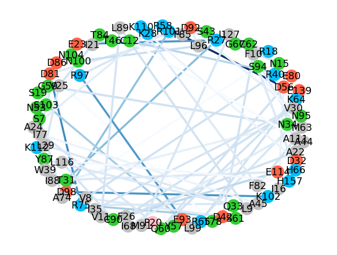
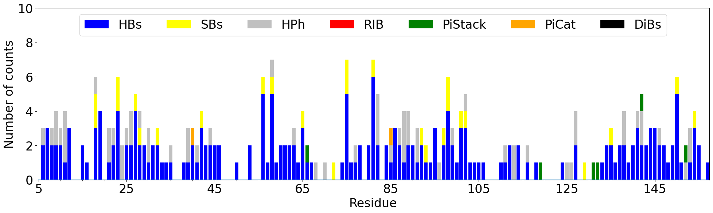
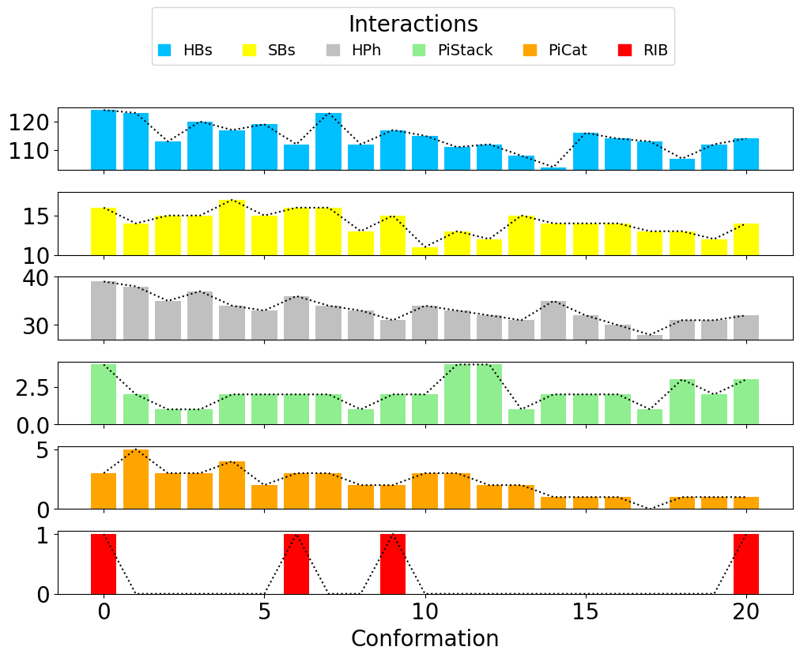

.. _insty_tutorial:
=======

Trajectory analysis
===============================================================================

This example shows how to compute interactions for a trajectory performed
using NAMD_ software for a small protein tyrosine phosphatase LMW-PTP 
in a complex with inhibitor MES (PDB: **5KQM**) and visualize the results using 
Matplotlib_ library and VMD_ program. 

In the tutorial, we will use already prepared files for
simulation (*PDB* and *DCD* file).

_NAMD: http://www.ks.uiuc.edu/Research/namd/

Parse trajectory
-------------------------------------------------------------------------------

We start by parsing PDB and DCD files, which contain LMW-PTP protein
structure (available as tutorial files). PDB file contains the
coordinates of protein structure with water and counter ions. DCD
file is a binary file that contains a short simulation computed in NAMD_
package (20 frames). The commands shown below are explained in *Trajectory
Analysis* tutorial.

.. ipython:: python
   :verbatim:

   PDBfile = '5kqm_all_sci.pdb'
   DCDfile = 'NAMD_D2_co100.dcd'
   atoms = parsePDB(PDBfile)
   dcd = Trajectory(DCDfile)
   dcd.link(atoms)
   dcd.setCoords(atoms)

.. parsed-literal::

   @> 19321 atoms and 1 coordinate set(s) were parsed in 0.17s.

To compute hydrogen bonds for each frame of the simulation use
:func:`.calcHydrogenBondsTrajectory` function:

.. ipython:: python
   :verbatim:

   calcHydrogenBondsTrajectory(atoms, dcd)

.. parsed-literal::

   @> Frame: 0
   @> Calculating hydrogen bonds.
   @>      DONOR (res chid atom)   <--->       ACCEPTOR (res chid atom)    Distance  Angle
   @>     ARG101    P      NH1_1516  <--->      ASP98    P      OD1_1463     2.0    33.1
   @>      HSE72    P      NE2_1042  <--->      ASN15    P       OD1_165     2.6    34.8
   @>     GLN143    P      NE2_2192  <--->     GLU139    P      OE2_2126     2.7     9.2
   @>      HSE66    P       NE2_957  <--->     GLU139    P      OE1_2125     2.7     6.4
   @>      ARG40    P         N_561  <--->       LYS6    P          O_37     2.7    17.1
   @>      ARG58    P         N_813  <--->      ASP56    P       OD1_788     2.7    30.0
   @>      ALA45    P         N_634  <--->      ARG75    P        O_1097     2.8    35.1
   @>      ASN53    P       ND2_747  <--->      GLU50    P       OE1_708     2.8    18.2
   @>      ALA74    P        N_1064  <--->      ASN53    P         O_751     2.8    21.3
   @>      ASP56    P         N_780  <--->      ILE16    P         O_189     2.8    27.0
   @>     LYS110    P       NZ_1667  <--->      THR84    P        O_1240     2.8    38.2
   @>     LEU116    P        N_1758  <--->      CYS90    P        O_1342     2.8    15.0
   @>     SER103    P        N_1546  <--->      LEU99    P        O_1485     2.8    29.1
   @>     ASN134    P        N_2045  <--->     ASP137    P      OD2_2091     2.8    22.6
   @>     PHE152    P        N_2321  <--->     CYS148    P        O_2275     2.8     8.3
   @>      ASN95    P        N_1398  <--->      ASP92    P      OD1_1368     2.8    12.6
   @>       LYS6    P          N_16  <--->      ASN38    P         O_536     2.8    25.0
   @>      ILE77    P        N_1115  <--->      ALA45    P         O_643     2.8    12.2
   @>      ARG58    P       NH2_832  <--->      ASP56    P       OD2_789     2.8    27.7
   @>      LEU99    P        N_1467  <--->      ASN95    P        O_1411     2.8    15.5
   @>     CYS149    P        N_2276  <--->     CYS145    P        O_2224     2.8     9.6
   @>      GLY52    P         N_731  <--->      ALA74    P        O_1073     2.8     6.6
   @>      ASP32    P         N_435  <--->      LYS28    P         O_385     2.8     8.8
   @>      ILE88    P        N_1294  <--->     LYS112    P        O_1704     2.8    17.7
   @>     GLN143    P        N_2180  <--->     GLU139    P        O_2128     2.8    21.7
   @>      ARG27    P         N_340  <--->      GLU23    P         O_293     2.8    15.4
   @>     TYR142    P        N_2159  <--->     PHE138    P        O_2113     2.9    14.2
   @>     GLY133    P        N_2038  <--->     PRO130    P        O_1995     2.9    25.4
   @>      PHE26    P         N_320  <--->      ALA22    P         O_278     2.9     4.9
   @>      ASN15    P       ND2_166  <--->      SER19    P        OG_232     2.9    32.1
   @>      ARG75    P      NH1_1090  <--->      ASP81    P      OD2_1194     2.9    19.7
   @>      ARG75    P      NH2_1093  <--->      ASP42    P       OD2_610     2.9    23.5
   @>      ARG97    P        N_1431  <--->      GLU93    P        O_1386     2.9    22.2
   @>      ARG65    P       NH2_941  <--->     GLU139    P      OE1_2125     2.9    32.3
   @>      VAL25    P         N_304  <--->      ILE21    P         O_268     2.9     8.2
   @>     LEU153    P        N_2341  <--->     CYS149    P        O_2286     2.9    12.5
   @>       SER7    P          N_38  <--->      ASP86    P      OD2_1270     2.9    39.9
   @>      ASP86    P        N_1261  <--->       SER7    P         OG_45     2.9    34.7
   @>      ARG58    P       NH2_832  <--->     TYR131    P        O_2016     2.9    33.1
   @>      THR46    P         N_644  <--->      CYS12    P         O_130     2.9    36.1
   @>     GLN144    P        N_2197  <--->     THR140    P        O_2142     2.9    23.3
   @>      THR78    P        N_1134  <--->      ASP81    P      OD2_1194     2.9    12.4
   @>      LEU89    P        N_1313  <--->       LEU9    P          O_83     2.9    29.5
   @>      THR31    P         N_421  <--->      ARG27    P         O_363     2.9    24.1
   @>      CYS90    P        N_1332  <--->     GLU114    P        O_1738     2.9    24.6
   ..
   ..
   @>      ARG40    P       NH1_577  <--->      THR84    P      OG1_1233     2.9     8.4
   @>      ALA44    P         N_624  <--->      PHE10    P         O_103     2.9    33.2
   @>     GLU154    P        N_2360  <--->     ARG150    P        O_2310     3.0    22.6
   @>       VAL8    P          N_49  <--->      ARG40    P         O_584     3.0    25.0
   @>      SER19    P         N_225  <--->      CYS12    P        SG_127     3.3     8.0
   @>      PHE82    P        N_1197  <--->      LYS79    P        O_1169     3.4    37.7
   @>      ASP81    P        N_1185  <--->      THR78    P      OG1_1140     3.5    39.5
   @>     LYS102    P       NZ_1540  <--->      ASP98    P      OD2_1464     3.5    26.1
   @>     ARG147    P      NH2_2260  <--->     GLN124    P      OE1_1892     3.5    33.9
   @>     VAL106    P        N_1588  <--->     SER103    P        O_1556     3.5    34.2
   @> Number of detected hydrogen bonds: 124.

   @> Frame: 1
   @> Calculating hydrogen bonds.
   @>      DONOR (res chid atom)   <--->       ACCEPTOR (res chid atom)    Distance  Angle
   @>     LYS112    P       NZ_1699  <--->     GLU114    P      OE1_1735     2.5    20.8
   @>      THR78    P        N_1134  <--->      ASP81    P      OD2_1194     2.5    15.6
   @>      ARG27    P       NH2_359  <--->      GLU23    P       OE2_291     2.5    36.5
   @>      THR78    P      OG1_1140  <--->      ASP81    P      OD2_1194     2.6    25.2
   @>       SER7    P         OG_45  <--->      ASP86    P      OD2_1270     2.6    32.3
   @>     LYS102    P       NZ_1540  <--->      ASP98    P      OD2_1464     2.6    18.6
   @>     LYS112    P       NZ_1699  <--->     HSE157    P      OT1_2423     2.6    17.8
   @>      ARG75    P      NH2_1093  <--->      ASP81    P      OD1_1193     2.6    17.6
   @>     SER118    P       OG_1791  <--->     LEU115    P        O_1757     2.7    25.6
   @>      ARG58    P        NE_826  <--->      ASP56    P       OD1_788     2.7     6.4
   @>     GLN124    P        N_1881  <--->     ASP120    P      OD1_1824     2.7    17.2
   @>     ARG147    P      NH1_2257  <--->     GLN124    P      OE1_1892     2.7    11.8
   @>      ARG18    P       NH1_217  <--->      ASP92    P      OD2_1369     2.7    14.6
   @>      ARG75    P      NH1_1090  <--->      ASP81    P      OD2_1194     2.7    23.9
   @>      TYR87    P       OH_1286  <--->     HSE157    P      OT1_2423     2.7    11.6
   @>      SER43    P        OG_620  <--->      GLU23    P       OE1_290     2.7    15.2
   @>      LYS28    P        NZ_380  <--->      ASP32    P       OD1_443     2.7     3.6
   @>     LYS110    P       NZ_1667  <--->      ASP86    P      OD1_1269     2.7    25.2
   @>     THR140    P      OG1_2135  <--->     SER136    P        O_2081     2.7     5.2
   @>     LEU116    P        N_1758  <--->      CYS90    P        O_1342     2.7    24.4
   @>       THR5    P         OG1_8  <--->      ASN38    P         O_536     2.7    38.6
   @>      LYS64    P         N_900  <--->      GLN60    P         O_860     2.7    26.8
   @>     ARG147    P      NH1_2257  <--->     ASP120    P      OD2_1825     2.7    15.2
   @>      ARG27    P         N_340  <--->      GLU23    P         O_293     2.7    21.9
   @>     TYR119    P       OH_1808  <--->     GLU114    P      OE1_1735     2.7    15.9
   @>      ARG18    P       NH1_217  <--->     ILE127    P        O_1954     2.8    16.0
   @>     SER103    P        N_1546  <--->      LEU99    P        O_1485     2.8    13.6
   @>     LYS102    P        N_1524  <--->      ASP98    P        O_1466     2.8    15.9
   @>      ARG58    P       NH1_829  <--->     GLY133    P        O_2044     2.8    31.9
   @>      ARG75    P      NH2_1093  <--->      ASP42    P       OD2_610     2.8    13.0
   @>     LYS112    P        N_1683  <--->      ASP86    P        O_1272     2.8    13.2
   ..
   ..
   @>     ILE127    P        N_1936  <--->      MET91    P        O_1359     3.3    29.4
   @>     ASN104    P        N_1557  <--->     ASN100    P        O_1499     3.4    12.6
   @>     GLN105    P        N_1571  <--->     ARG101    P        O_1523     3.4    38.7
   @>     ARG147    P        N_2241  <--->     GLN143    P        O_2196     3.4    10.9
   @>      ASP56    P         N_780  <--->      ILE16    P         O_189     3.4    25.5
   @>      ASN95    P        N_1398  <--->      ASP92    P      OD1_1368     3.5    32.5
   @>      HSE72    P      NE2_1042  <--->      ASN15    P       OD1_165     3.5     7.1
   @>     VAL106    P        N_1588  <--->     LYS102    P        O_1545     3.5    29.8
   @>      ILE21    P         N_250  <--->      CYS17    P         O_200     3.5    34.9
   @>      LEU96    P        N_1412  <--->      ASP92    P        O_1371     3.5     8.7
   @> Number of detected hydrogen bonds: 123.

   @> Frame: 2
   @> Calculating hydrogen bonds.
   @>      DONOR (res chid atom)   <--->       ACCEPTOR (res chid atom)    Distance  Angle
   @>      ARG18    P       NH1_217  <--->      ASP92    P      OD2_1369     2.5     4.9
   @>      THR31    P       OG1_427  <--->      ARG27    P         O_363     2.5     5.5
   @>      ARG58    P       NH2_832  <--->      ASP56    P       OD2_789     2.6     8.2
   @>     LYS112    P       NZ_1699  <--->     HSE157    P      OT1_2423     2.6    19.0
   @>      ARG75    P      NH2_1093  <--->      ASP42    P       OD2_610     2.6    25.0
   @>     TYR119    P       OH_1808  <--->     GLU114    P      OE2_1736     2.6    10.3
   @>     LYS102    P       NZ_1540  <--->      ASP98    P      OD2_1464     2.6     7.9
   @>      TYR87    P       OH_1286  <--->     HSE157    P      OT1_2423     2.7    14.1
   @>      LYS64    P         N_900  <--->      GLN60    P         O_860     2.7     4.9
   @>      SER43    P        OG_620  <--->      GLU23    P       OE1_290     2.7     8.6
   @>      THR78    P      OG1_1140  <--->      ASP81    P      OD2_1194     2.7     6.5
   @>      ILE88    P        N_1294  <--->     LYS112    P        O_1704     2.7    25.0
   @>     SER118    P       OG_1791  <--->     LEU115    P        O_1757     2.7    26.9
   @>      LYS28    P        NZ_380  <--->      ASP32    P       OD2_444     2.7    13.9
   @>      THR84    P      OG1_1233  <--->      GLU80    P        O_1184     2.7    13.4
   @>      LEU89    P        N_1313  <--->       LEU9    P          O_83     2.8    11.8
   @>     ARG147    P      NH1_2257  <--->     GLN124    P      OE1_1892     2.8    15.1
   @>      ARG27    P       NH2_359  <--->      GLU23    P       OE2_291     2.8    18.0
   @>      ILE35    P         N_478  <--->      VAL30    P         O_420     2.8    20.7
   @>      PHE26    P         N_320  <--->      ALA22    P         O_278     2.8    21.8
   @>      VAL11    P         N_104  <--->      LEU89    P        O_1331     2.8    10.3
   @>      VAL25    P         N_304  <--->      ILE21    P         O_268     2.8     9.2
   @>       SER7    P         OG_45  <--->      ASP86    P      OD2_1270     2.8    29.4
   @>      HSE72    P      NE2_1042  <--->      ASN15    P       OD1_165     2.8    37.1
   @>      ASN34    P         N_464  <--->      THR31    P         O_434     2.8    19.7
   @>     LYS110    P        N_1651  <--->      PHE82    P        O_1216     2.8     9.2
   @>     LYS110    P       NZ_1667  <--->      ASP86    P      OD1_1269     2.8    13.5
   @>      ARG58    P        NE_826  <--->      ASP56    P       OD1_788     2.8     8.0
   @>      ARG75    P      NH1_1090  <--->      ASP81    P      OD2_1194     2.8    14.9
   @>       VAL8    P          N_49  <--->      ARG40    P         O_584     2.8    19.4
   @>      ARG18    P       NH1_217  <--->     ILE127    P        O_1954     2.8     7.0
   @>     LYS155    P        N_2375  <--->     ALA151    P        O_2320     2.8    15.1
   @>      HSE66    P       NE2_957  <--->     GLU139    P      OE1_2125     2.8    28.9
   @>     ARG147    P      NH1_2257  <--->     ASP120    P      OD2_1825     2.8    31.7
   @>      ARG97    P        N_1431  <--->      GLU93    P        O_1386     2.8    15.2
   @>     LYS123    P        N_1859  <--->     ASP120    P      OD1_1824     2.8    34.0
   @>     LYS112    P        N_1683  <--->      ASP86    P        O_1272     2.8    10.3
   @>      ASP86    P        N_1261  <--->       SER7    P         OG_45     2.8    22.0
   @>      ARG65    P         N_922  <--->      SER61    P         O_871     2.8    24.4
   @>     ILE127    P        N_1936  <--->      MET91    P        O_1359     2.8     4.1
   @>     LYS112    P       NZ_1699  <--->     HSE157    P      ND1_2414     2.9    14.0
   @>      GLY67    P         N_963  <--->      MET63    P         O_899     2.9    38.6
   @>     SER103    P        N_1546  <--->      LEU99    P        O_1485     2.9    17.1
   @>     LYS112    P       NZ_1699  <--->     GLU114    P      OE2_1736     2.9    18.1
   @>      ARG75    P       NE_1087  <--->      ASP42    P       OD2_610     2.9    38.3
   @>      ALA44    P         N_624  <--->      PHE10    P         O_103     2.9    30.1
   @>      ILE68    P         N_970  <--->      MET63    P         O_899     2.9    12.9
   @>      ARG58    P         N_813  <--->      ASP56    P       OD1_788     2.9    21.1
   @>      THR78    P        N_1134  <--->      ASP81    P      OD2_1194     2.9    26.3
   @>      ALA45    P         N_634  <--->      ARG75    P        O_1097     2.9    27.7
   ..
   ..
   @>      HSE66    P         N_946  <--->      CYS62    P         O_882     2.9    17.6
   @>      ASP32    P         N_435  <--->      LYS28    P         O_385     3.0    20.4
   @>     VAL146    P        N_2225  <--->     TYR142    P        O_2179     3.0    20.7
   @>     VAL106    P        N_1588  <--->     LYS102    P        O_1545     3.0    10.6
   @>      ARG40    P         N_561  <--->       LYS6    P          O_37     3.4    33.1
   @>     HSE157    P        N_2407  <--->     TYR119    P       OH_1808     3.4    27.6
   @>      ARG65    P       NH1_938  <--->     GLU139    P      OE1_2125     3.4    32.0
   @>     GLU114    P        N_1724  <--->      ILE88    P        O_1312     3.5    13.0
   @>      ASP92    P        N_1360  <--->      ASN95    P      OD1_1406     3.5    35.4
   @>      ASN15    P       ND2_166  <--->      SER43    P        OG_620     3.5    33.3
   @> Number of detected hydrogen bonds: 113.
   ..
   ..
   @> Frame: 20
   @> Calculating hydrogen bonds.
   @>      DONOR (res chid atom)   <--->       ACCEPTOR (res chid atom)    Distance  Angle
   @>      ARG97    P       NE_1444  <--->      GLU93    P      OE1_1383     2.5    12.5
   @>      SER19    P        OG_232  <--->      ASN15    P       OD1_165     2.6    31.5
   @>      ARG27    P       NH1_356  <--->      GLU23    P       OE1_290     2.6    19.1
   @>      THR78    P        N_1134  <--->      ASP81    P      OD2_1194     2.6    21.5
   @>     GLN122    P      NE2_1854  <--->     ASP120    P      OD2_1825     2.6    39.7
   @>     SER118    P       OG_1791  <--->     GLU114    P      OE2_1736     2.6    24.5
   @>      ARG65    P       NH1_938  <--->     GLU139    P      OE1_2125     2.7     6.1
   @>      ARG65    P       NH2_941  <--->     ASP135    P      OD1_2067     2.7    15.6
   @>      SER43    P        OG_620  <--->      GLU23    P       OE2_291     2.7    13.9
   @>      ARG75    P       NE_1087  <--->      ASP42    P       OD1_609     2.7    26.5
   @>     ARG150    P       NE_2300  <--->     GLU154    P      OE2_2372     2.7     4.9
   @>     VAL106    P        N_1588  <--->     LYS102    P        O_1545     2.7    16.2
   @>      LYS28    P         N_364  <--->      ALA24    P         O_303     2.7    38.8
   @>     HSE157    P      NE2_2418  <--->     PHE152    P        O_2340     2.7    28.5
   @>      ARG58    P       NH2_832  <--->      ASP56    P       OD2_789     2.7    19.3
   @>      ARG97    P      NH2_1450  <--->      GLU93    P      OE2_1384     2.7    15.8
   @>      ARG75    P      NH2_1093  <--->      ASP42    P       OD1_609     2.7    30.5
   @>      ALA45    P         N_634  <--->      ARG75    P        O_1097     2.7    22.3
   @>      ARG75    P      NH2_1093  <--->      ASP81    P      OD1_1193     2.7    19.2
   @>      THR31    P       OG1_427  <--->      ARG27    P         O_363     2.7    13.1
   @>     ARG150    P      NH2_2306  <--->     GLU154    P      OE1_2371     2.7     8.5
   @>      ARG75    P      NH1_1090  <--->      ASP81    P      OD2_1194     2.7    14.8
   @>      GLY67    P         N_963  <--->      MET63    P         O_899     2.7    25.3
   @>      LEU89    P        N_1313  <--->       LEU9    P          O_83     2.8    18.4
   @>     ARG101    P      NH1_1516  <--->      ASP98    P      OD2_1464     2.8    11.5
   @>      ILE77    P        N_1115  <--->      ALA45    P         O_643     2.8    39.9
   @>     LYS110    P        N_1651  <--->      PHE82    P        O_1216     2.8    32.3
   @>      LEU29    P         N_386  <--->      VAL25    P         O_319     2.8     5.4
   @>     ASN100    P        N_1486  <--->      LEU96    P        O_1430     2.8     6.7
   @>     LYS102    P        N_1524  <--->      ASP98    P        O_1466     2.8     4.9
   @>      THR78    P      OG1_1140  <--->      ASP81    P      OD2_1194     2.8    10.5
   @>       VAL8    P          N_49  <--->      ARG40    P         O_584     2.8    16.8
   @>     GLU154    P        N_2360  <--->     ARG150    P        O_2310     2.8    15.1
   @>     LYS110    P       NZ_1667  <--->      ASP86    P      OD2_1270     2.8    32.5
   @>      ARG58    P        NE_826  <--->      ASP56    P       OD1_788     2.8     3.3
   @>      ILE35    P         N_478  <--->      VAL30    P         O_420     2.8     7.9
   @>      ARG58    P       NH1_829  <--->     GLY133    P        O_2044     2.8    34.3
   @>     GLN105    P        N_1571  <--->     ARG101    P        O_1523     2.8    29.9
   @>       SER7    P          N_38  <--->      ASP86    P      OD1_1269     2.8    10.5
   @>     ARG101    P      NH2_1519  <--->      ASP98    P      OD1_1463     2.8    17.5
   @>     GLN143    P        N_2180  <--->     GLU139    P        O_2128     2.8    20.5
   @>     CYS149    P        N_2276  <--->     CYS145    P        O_2224     2.8    16.0
   @>     SER103    P       OG_1553  <--->      LEU99    P        O_1485     2.9    21.4
   @>      ARG18    P       NH1_217  <--->      ASP92    P      OD2_1369     2.9     6.7
   @>      CYS90    P        N_1332  <--->     GLU114    P        O_1738     2.9     7.9
   ..
   ..
   @>     ALA151    P        N_2311  <--->     ARG147    P        O_2264     3.3    28.5
   @>      ILE88    P        N_1294  <--->     LYS112    P        O_1704     3.3     8.1
   @>      CYS12    P         N_120  <--->      ALA44    P         O_633     3.4    24.0
   @>     GLN124    P      NE2_1893  <--->     ILE126    P        O_1935     3.4     3.3
   @>      ARG97    P        N_1431  <--->      GLU93    P        O_1386     3.4    28.8
   @>      SER61    P         N_861  <--->      TYR57    P         O_812     3.4    29.6
   @>     GLN122    P      NE2_1854  <--->     ASP120    P      OD1_1824     3.5    17.2
   @> Number of detected hydrogen bonds: 114.

Similarly, it can be done with other interaction types. Salt bridges
(residues with opposite changes) with :func:`.calcSaltBridgesTrajectory`:  

.. ipython:: python
   :verbatim:

   calcSaltBridgesTrajectory(atoms, dcd)

.. parsed-literal::

   @> Frame: 0
   @> Calculating salt bridges.
   @>     GLU139    P   OE1_2125_2126  <--->      HSE66    P         NE2_957     2.8
   @>      ASP81    P   OD1_1193_1194  <--->      ARG75    P   NH1_1090_1093     2.9
   @>      ASP32    P     OD1_443_444  <--->      LYS28    P          NZ_380     3.0
   @>      ASP98    P   OD1_1463_1464  <--->     ARG101    P   NH1_1516_1519     3.1
   @>      ARG27    P     NH1_356_359  <--->      GLU23    P     OE1_290_291     3.7
   @>     GLU139    P   OE1_2125_2126  <--->      ARG65    P     NH1_938_941     3.8
   @>     LYS102    P         NZ_1540  <--->      ASP98    P   OD1_1463_1464     3.9
   @>      ARG58    P     NH1_829_832  <--->      ASP56    P     OD1_788_789     3.9
   @>      ARG18    P     NH1_217_220  <--->      ASP92    P   OD1_1368_1369     4.1
   @>     GLU114    P   OE1_1735_1736  <--->     LYS112    P         NZ_1699     4.1
   @>     ASP120    P   OD1_1824_1825  <--->     ARG147    P   NH1_2257_2260     4.2
   @>      ASP86    P   OD1_1269_1270  <--->     LYS110    P         NZ_1667     4.2
   @>     HSE157    P        NE2_2418  <--->     GLU114    P   OE1_1735_1736     4.4
   @>      ARG18    P     NH1_217_220  <--->     ASP129    P   OD1_1978_1979     4.6
   @>      ARG75    P   NH1_1090_1093  <--->      ASP42    P     OD1_609_610     4.6
   @>      GLU23    P     OE1_290_291  <--->      HSE72    P        NE2_1042     5.0
   @> Number of detected salt bridges: 16.
   
   @> Frame: 1
   @> Calculating salt bridges.
   @>      ASP32    P     OD1_443_444  <--->      LYS28    P          NZ_380     2.6
   @>      ASP81    P   OD1_1193_1194  <--->      ARG75    P   NH1_1090_1093     2.6
   @>      ASP98    P   OD1_1463_1464  <--->     ARG101    P   NH1_1516_1519     2.8
   @>     GLU114    P   OE1_1735_1736  <--->     LYS112    P         NZ_1699     3.1
   @>     HSE157    P        NE2_2418  <--->     GLU114    P   OE1_1735_1736     3.2
   @>      ASP86    P   OD1_1269_1270  <--->     LYS110    P         NZ_1667     3.3
   @>      ARG27    P     NH1_356_359  <--->      GLU23    P     OE1_290_291     3.4
   @>     GLU139    P   OE1_2125_2126  <--->      ARG65    P     NH1_938_941     3.4
   @>     LYS102    P         NZ_1540  <--->      ASP98    P   OD1_1463_1464     3.5
   @>     ASP120    P   OD1_1824_1825  <--->     ARG147    P   NH1_2257_2260     3.8
   @>      ARG58    P     NH1_829_832  <--->      ASP56    P     OD1_788_789     3.8
   @>      ARG18    P     NH1_217_220  <--->      ASP92    P   OD1_1368_1369     3.8
   @>     GLU139    P   OE1_2125_2126  <--->      HSE66    P         NE2_957     4.0
   @>      ARG75    P   NH1_1090_1093  <--->      ASP42    P     OD1_609_610     4.5
   @> Number of detected salt bridges: 14.
   
   @> Frame: 2
   @> Calculating salt bridges.
   @>     GLU114    P   OE1_1735_1736  <--->     LYS112    P         NZ_1699     2.6
   @>      ASP32    P     OD1_443_444  <--->      LYS28    P          NZ_380     2.6
   @>     GLU139    P   OE1_2125_2126  <--->      ARG65    P     NH1_938_941     2.7
   @>      ASP81    P   OD1_1193_1194  <--->      ARG75    P   NH1_1090_1093     2.9
   @>     LYS102    P         NZ_1540  <--->      ASP98    P   OD1_1463_1464     3.1
   @>      ARG58    P     NH1_829_832  <--->      ASP56    P     OD1_788_789     3.6
   @>     GLU139    P   OE1_2125_2126  <--->      HSE66    P         NE2_957     3.6
   @>      ARG18    P     NH1_217_220  <--->      ASP92    P   OD1_1368_1369     3.7
   @>      ASP86    P   OD1_1269_1270  <--->     LYS110    P         NZ_1667     3.7
   @>     ASP120    P   OD1_1824_1825  <--->     ARG147    P   NH1_2257_2260     3.8
   @>      ARG27    P     NH1_356_359  <--->      GLU23    P     OE1_290_291     3.9
   @>     HSE157    P        NE2_2418  <--->     GLU114    P   OE1_1735_1736     4.2
   @>      ARG75    P   NH1_1090_1093  <--->      ASP42    P     OD1_609_610     4.3
   @>      ARG18    P     NH1_217_220  <--->     ASP129    P   OD1_1978_1979     4.6
   @>      ASP86    P   OD1_1269_1270  <--->       LYS6    P           NZ_32     5.0
   @> Number of detected salt bridges: 15.
   
   ..
   ..

   @> Frame: 18
   @> Calculating salt bridges.
   @>      ASP81    P   OD1_1193_1194  <--->      ARG75    P   NH1_1090_1093     2.6
   @>      ASP32    P     OD1_443_444  <--->      LYS28    P          NZ_380     2.7
   @>     ASP135    P   OD1_2067_2068  <--->      ARG65    P     NH1_938_941     2.8
   @>     LYS102    P         NZ_1540  <--->      ASP98    P   OD1_1463_1464     3.0
   @>      GLU23    P     OE1_290_291  <--->      HSE72    P        NE2_1042     3.4
   @>      ARG27    P     NH1_356_359  <--->      GLU23    P     OE1_290_291     3.6
   @>      ARG58    P     NH1_829_832  <--->      ASP56    P     OD1_788_789     3.6
   @>      ASP98    P   OD1_1463_1464  <--->     ARG101    P   NH1_1516_1519     3.9
   @>      ARG18    P     NH1_217_220  <--->      ASP92    P   OD1_1368_1369     4.2
   @>      ARG97    P   NH1_1447_1450  <--->      GLU93    P   OE1_1383_1384     4.5
   @>     ARG150    P   NH1_2303_2306  <--->     GLU154    P   OE1_2371_2372     4.5
   @>      ARG75    P   NH1_1090_1093  <--->      ASP42    P     OD1_609_610     4.5
   @>      ARG18    P     NH1_217_220  <--->     ASP129    P   OD1_1978_1979     4.7
   @> Number of detected salt bridges: 13.

   @> Frame: 19
   @> Calculating salt bridges.
   @>     ASP135    P   OD1_2067_2068  <--->      ARG65    P     NH1_938_941     2.7
   @>      ASP81    P   OD1_1193_1194  <--->      ARG75    P   NH1_1090_1093     2.9
   @>     LYS102    P         NZ_1540  <--->      ASP98    P   OD1_1463_1464     3.1
   @>      ARG27    P     NH1_356_359  <--->      GLU23    P     OE1_290_291     3.3
   @>      ASP98    P   OD1_1463_1464  <--->     ARG101    P   NH1_1516_1519     3.7
   @>      ARG58    P     NH1_829_832  <--->      ASP56    P     OD1_788_789     3.7
   @>      ARG97    P   NH1_1447_1450  <--->      GLU93    P   OE1_1383_1384     3.7
   @>      ASP86    P   OD1_1269_1270  <--->     LYS110    P         NZ_1667     3.9
   @>      ARG18    P     NH1_217_220  <--->      ASP92    P   OD1_1368_1369     3.9
   @>      GLU23    P     OE1_290_291  <--->      HSE72    P        NE2_1042     4.0
   @>     ARG150    P   NH1_2303_2306  <--->     GLU154    P   OE1_2371_2372     4.2
   @>      ARG75    P   NH1_1090_1093  <--->      ASP42    P     OD1_609_610     4.6
   @> Number of detected salt bridges: 12.

   @> Frame: 20
   @> Calculating salt bridges.
   @>     ASP135    P   OD1_2067_2068  <--->      ARG65    P     NH1_938_941     2.5
   @>      ASP81    P   OD1_1193_1194  <--->      ARG75    P   NH1_1090_1093     2.7
   @>      ASP98    P   OD1_1463_1464  <--->     ARG101    P   NH1_1516_1519     2.8
   @>      ASP86    P   OD1_1269_1270  <--->     LYS110    P         NZ_1667     3.4
   @>      ARG97    P   NH1_1447_1450  <--->      GLU93    P   OE1_1383_1384     3.5
   @>     ARG150    P   NH1_2303_2306  <--->     GLU154    P   OE1_2371_2372     3.7
   @>      ARG58    P     NH1_829_832  <--->      ASP56    P     OD1_788_789     3.7
   @>     GLU139    P   OE1_2125_2126  <--->      HSE66    P         NE2_957     3.9
   @>      ARG18    P     NH1_217_220  <--->      ASP92    P   OD1_1368_1369     4.0
   @>      ARG27    P     NH1_356_359  <--->      GLU23    P     OE1_290_291     4.0
   @>      ARG75    P   NH1_1090_1093  <--->      ASP42    P     OD1_609_610     4.4
   @>      GLU23    P     OE1_290_291  <--->      HSE72    P        NE2_1042     4.7
   @>     GLU139    P   OE1_2125_2126  <--->      ARG65    P     NH1_938_941     4.8
   @>      ARG18    P     NH1_217_220  <--->     ASP129    P   OD1_1978_1979     5.0
   @> Number of detected salt bridges: 14.

Repulsive Ionic Bonding using :func:`.calcRepulsiveIonicBondingTrajectory` for residues with
the same charges:

.. ipython:: python
   :verbatim:

   calcRepulsiveIonicBondingTrajectory(atoms, dcd, distA=7)

.. parsed-literal::

   @> Frame: 0
   @> Calculating repulsive ionic bonding.
   @>     LYS102    P         NZ_1540  <--->     ARG101    P   NH1_1516_1519     4.3
   @> Number of detected Repulsive Ionic Bonding interactions: 1.
   @> Frame: 1
   @> Calculating repulsive ionic bonding.
   @> Number of detected Repulsive Ionic Bonding interactions: 0.
   @> Frame: 2
   @> Calculating repulsive ionic bonding.
   @> Number of detected Repulsive Ionic Bonding interactions: 0.
   @> Frame: 3
   @> Calculating repulsive ionic bonding.
   @> Number of detected Repulsive Ionic Bonding interactions: 0.
   @> Frame: 4
   @> Calculating repulsive ionic bonding.
   @> Number of detected Repulsive Ionic Bonding interactions: 0.
   @> Frame: 5
   @> Calculating repulsive ionic bonding.
   @> Number of detected Repulsive Ionic Bonding interactions: 0.
   @> Frame: 6
   @> Calculating repulsive ionic bonding.
   @>     LYS102    P         NZ_1540  <--->     ARG101    P   NH1_1516_1519     4.3
   @> Number of detected Repulsive Ionic Bonding interactions: 1.
   @> Frame: 7
   @> Calculating repulsive ionic bonding.
   @> Number of detected Repulsive Ionic Bonding interactions: 0.
   @> Frame: 8
   @> Calculating repulsive ionic bonding.
   @> Number of detected Repulsive Ionic Bonding interactions: 0.
   @> Frame: 9
   @> Calculating repulsive ionic bonding.
   @>     LYS102    P         NZ_1540  <--->     ARG101    P   NH1_1516_1519     4.3
   @> Number of detected Repulsive Ionic Bonding interactions: 1.
   @> Frame: 10
   @> Calculating repulsive ionic bonding.
   @> Number of detected Repulsive Ionic Bonding interactions: 0.
   ..
   ..
   @> Frame: 20
   @> Calculating repulsive ionic bonding.
   @>     ARG147    P   NH1_2257_2260  <--->     LYS123    P         NZ_1875     4.5
   @> Number of detected Repulsive Ionic Bonding interactions: 1.

Pi-Stacking interactions using :func:`.calcPiStackingTrajectory`:

.. ipython:: python
   :verbatim:

   calcPiStackingTrajectory(atoms, dcd, distA=5)

.. parsed-literal::

   @> Frame: 0
   @> Calculating Pi stacking interactions.
   @>      HSE66       P             953_954_955_957_959  <--->     TYR142       P   2166_2167_2169_2171_2174_2176     3.9   162.1
   @>     HSE157       P2414_2415_2416_2418_2420_2423_2424  <--->     TYR119       P   1802_1803_1805_1807_1810_1812     4.4     3.0
   @>      PHE26       P         327_328_330_332_334_336  <--->      TRP39       P         549_550_551_553_555_557     4.8    75.5
   @>     TYR132       P   2024_2025_2027_2029_2032_2034  <--->     TYR131       P   2003_2004_2006_2008_2011_2013     4.9    91.4
   @> Number of detected Pi stacking interactions: 4.
   @> Frame: 1
   @> Calculating Pi stacking interactions.
   @>      PHE26       P         327_328_330_332_334_336  <--->      TRP39       P         549_550_551_553_555_557     4.8    71.0
   @>      HSE66       P             953_954_955_957_959  <--->     TYR142       P   2166_2167_2169_2171_2174_2176     4.8   138.9
   @> Number of detected Pi stacking interactions: 2.
   @> Frame: 2
   @> Calculating Pi stacking interactions.
   @>      HSE66       P             953_954_955_957_959  <--->     TYR142       P   2166_2167_2169_2171_2174_2176     3.6   174.2
   @> Number of detected Pi stacking interactions: 1.
   @> Frame: 3
   @> Calculating Pi stacking interactions.
   @>      HSE66       P             953_954_955_957_959  <--->     TYR142       P   2166_2167_2169_2171_2174_2176     4.1   143.3
   @> Number of detected Pi stacking interactions: 1.
   @> Frame: 4
   @> Calculating Pi stacking interactions.
   @>      HSE66       P             953_954_955_957_959  <--->     TYR142       P   2166_2167_2169_2171_2174_2176     4.3   137.5
   @>      TYR87       P   1280_1281_1283_1285_1288_1290  <--->     PHE152       P   2328_2329_2331_2333_2335_2337     5.0    73.7
   @> Number of detected Pi stacking interactions: 2.
   ..
   ..
   @> Frame: 19
   @> Calculating Pi stacking interactions.
   @>     TYR132       P   2024_2025_2027_2029_2032_2034  <--->     TYR131       P   2003_2004_2006_2008_2011_2013     4.6    62.2
   @>     TYR119       P   1802_1803_1805_1807_1810_1812  <--->     PHE152       P   2328_2329_2331_2333_2335_2337     4.9    60.8
   @> Number of detected Pi stacking interactions: 2.
   @> Frame: 20
   @> Calculating Pi stacking interactions.
   @>     TYR119       P   1802_1803_1805_1807_1810_1812  <--->     PHE152       P   2328_2329_2331_2333_2335_2337     4.7   125.5
   @>      HSE66       P             953_954_955_957_959  <--->     TYR142       P   2166_2167_2169_2171_2174_2176     4.8   165.0
   @>     TYR132       P   2024_2025_2027_2029_2032_2034  <--->     TYR131       P   2003_2004_2006_2008_2011_2013     4.9   116.3
   @> Number of detected Pi stacking interactions: 3.

Pi-Cation interactions using :func:`.calcPiCationTrajectory`:

.. ipython:: python
   :verbatim:

   calcPiCationTrajectory(atoms, dcd)

.. parsed-literal::

   @> Frame: 0
   @> Calculating cation-Pi interactions.
   @>      PHE85   P   1248_1249_1251_1253_1255_1257  <--->      ARG40   P                     NH1_577_580     3.7
   @>      HSE66   P             953_954_955_957_959  <--->      ARG65   P                     NH1_938_941     4.5
   @>     HSE157   P2414_2415_2416_2418_2420_2423_2424  <--->     LYS112   P                         NZ_1699     4.8
   @> Number of detected cation-pi interactions: 3.
   @> Frame: 1
   @> Calculating cation-Pi interactions.
   @>     HSE157   P2414_2415_2416_2418_2420_2423_2424  <--->     LYS112   P                         NZ_1699     3.5
   @>      PHE85   P   1248_1249_1251_1253_1255_1257  <--->      ARG40   P                     NH1_577_580     3.9
   @>      HSE66   P             953_954_955_957_959  <--->      ARG65   P                     NH1_938_941     4.9
   @>      TYR87   P   1280_1281_1283_1285_1288_1290  <--->     LYS112   P                         NZ_1699     4.9
   @>     TYR131   P   2003_2004_2006_2008_2011_2013  <--->      ARG58   P                     NH1_829_832     4.9
   @> Number of detected cation-pi interactions: 5.
   @> Frame: 2
   @> Calculating cation-Pi interactions.
   @>     HSE157   P2414_2415_2416_2418_2420_2423_2424  <--->     LYS112   P                         NZ_1699     2.7
   @>      HSE66   P             953_954_955_957_959  <--->      ARG65   P                     NH1_938_941     4.1
   @>      PHE85   P   1248_1249_1251_1253_1255_1257  <--->      ARG40   P                     NH1_577_580     4.5
   @> Number of detected cation-pi interactions: 3.
   @> Frame: 3
   @> Calculating cation-Pi interactions.
   @>     HSE157   P2414_2415_2416_2418_2420_2423_2424  <--->     LYS112   P                         NZ_1699     2.6
   @>      PHE85   P   1248_1249_1251_1253_1255_1257  <--->      ARG40   P                     NH1_577_580     3.6
   @>      HSE66   P             953_954_955_957_959  <--->      ARG65   P                     NH1_938_941     3.8
   @> Number of detected cation-pi interactions: 3.
   @> Frame: 4
   @> Calculating cation-Pi interactions.
   @>      PHE85   P   1248_1249_1251_1253_1255_1257  <--->      ARG40   P                     NH1_577_580     3.9
   @>      HSE66   P             953_954_955_957_959  <--->      ARG65   P                     NH1_938_941     4.8
   @>     HSE157   P2414_2415_2416_2418_2420_2423_2424  <--->     LYS155   P                         NZ_2391     4.8
   @>     HSE157   P2414_2415_2416_2418_2420_2423_2424  <--->     LYS112   P                         NZ_1699     4.9
   @> Number of detected cation-pi interactions: 4.
   ..
   ..
   @> Frame: 19
   @> Calculating cation-Pi interactions.
   @>      PHE85   P   1248_1249_1251_1253_1255_1257  <--->      ARG40   P                     NH1_577_580     4.9
   @> Number of detected cation-pi interactions: 1.
   @> Frame: 20
   @> Calculating cation-Pi interactions.
   @>     PHE138   P   2101_2102_2104_2106_2108_2110  <--->      ARG58   P                     NH1_829_832     5.0
   @> Number of detected cation-pi interactions: 1.

Hydrophobic interactions using :func:`.calcHydrophohicTrajectory`:

.. ipython:: python
   :verbatim:

   calcHydrophohicTrajectory(atoms, dcd)

.. parsed-literal::

   @> Frame: 0
   @> Hydrophobic Overlaping Areas are computed.
   @> Calculating hydrophobic interactions.
   @>     ALA156    P       CB_240114s  <--->      TYR87    P       OH_1286     3.0    22.0
   @>      ALA24    P        CB_29814s  <--->      MET63    P        CE_894     3.3     5.2
   @>      ILE68    P       CG2_97614s  <--->      MET63    P        CE_894     3.3    52.4
   @>     TYR142    P       CZ_217114s  <--->     VAL146    P      CG2_2235     3.5    49.7
   @>      PHE10    P        CD1_9214s  <--->      ALA22    P        CB_273     3.5    31.2
   @>       LYS6    P         CD_2614s  <--->      TRP39    P       CZ2_555     3.5    68.7
   @>      PHE26    P       CE2_33614s  <--->      VAL30    P       CG1_411     3.6    21.1
   @>      ILE88    P       CD_130714s  <--->     ALA111    P       CB_1677     3.6    21.2
   @>      VAL11    P       CG2_11414s  <--->      ILE88    P      CG2_1300     3.6     9.3
   @>      VAL41    P       CG2_59514s  <--->      PHE26    P       CD2_334     3.6    16.6
   @>     PHE152    P      CE1_233114s  <--->     ALA156    P       CB_2401     3.7    17.5
   @>      LYS79    P       CG_115514s  <--->     VAL106    P      CG2_1598     3.7    25.1
   @>      LEU99    P      CD2_148014s  <--->      ILE77    P       CD_1128     3.7    12.0
   @>      PHE82    P      CD1_120514s  <--->      ILE88    P       CD_1307     3.7    17.6
   @>     LEU116    P      CD2_177114s  <--->     ILE127    P       CD_1949     3.7    17.4
   @>       VAL8    P        CG1_5514s  <--->      PHE26    P       CE2_336     3.7    12.1
   @>      LEU96    P      CD1_142114s  <--->     ILE113    P      CG2_1711     3.7    17.0
   @>       LEU9    P        CD2_7814s  <--->      ILE77    P       CD_1128     3.7    15.4
   @>      LEU89    P      CD1_132214s  <--->       VAL8    P        CG2_59     3.8    15.9
   @>     ILE126    P       CD_193014s  <--->     LEU125    P      CD1_1907     3.8    54.2
   @>     VAL141    P      CG1_214914s  <--->     ILE127    P      CG2_1942     3.9    11.5
   @>      MET91    P       SD_135314s  <--->     ILE127    P       CD_1949     3.9    35.9
   @>      ALA44    P        CB_62814s  <--->       LEU9    P        CD1_74     3.9    15.1
   @>      VAL25    P       CG2_31414s  <--->     TYR142    P      CE1_2169     3.9    12.0
   @>      ILE21    P       CG2_25614s  <--->      MET63    P        SD_893     4.0    20.8
   @>     LEU153    P      CD1_235014s  <--->      TRP39    P       NE1_547     4.0     9.4
   @>      PHE85    P       CZ_125314s  <--->       LEU9    P        CD1_74     4.0    32.1
   @>      ILE35    P        CD_49114s  <--->      TRP39    P       NE1_547     4.0    26.0
   @>      LEU29    P       CD1_39514s  <--->      VAL25    P       CG1_310     4.1    19.7
   @>      ALA74    P       CB_106814s  <--->      ILE16    P       CG2_177     4.1     6.7
   @>      ARG75    P       CG_108114s  <--->      ALA44    P        CB_628     4.1    36.2
   @>      ARG18    P        CG_20814s  <--->     VAL141    P      CG1_2149     4.1    20.3
   @>     LYS102    P       CD_153414s  <--->      ILE77    P      CG2_1121     4.1    17.5
   @>     TYR119    P      CE1_180514s  <--->      LEU89    P      CD2_1326     4.1    11.6
   @>      ARG40    P        CG_56814s  <--->      PHE85    P      CE2_1257     4.3    60.9
   @>      LYS28    P        CG_37114s  <--->      ILE68    P        CD_983     4.3    21.8
   @>     PHE138    P      CD2_210814s  <--->      ILE21    P        CD_263     4.3     6.6
   @>     TYR131    P      CE1_200614s  <--->      ILE16    P        CD_184     4.3     8.9
   @>      ARG58    P        CG_82014s  <--->     PHE138    P      CE1_2104     4.5    59.4
   @> Number of detected hydrophobic interactions: 39.
   @> Frame: 1
   @> Hydrophobic Overlaping Areas are computed.
   @> Calculating hydrophobic interactions.
   @>      MET63    P        SD_89314s  <--->     TYR142    P      CD1_2167     3.3    26.8
   @>      ALA24    P        CB_29814s  <--->      MET63    P        CE_894     3.4     7.1
   @>       VAL8    P        CG2_5914s  <--->      PHE10    P         CZ_96     3.4    27.8
   @>      LEU96    P      CD1_142114s  <--->     ILE113    P      CG2_1711     3.4    13.3
   @>     LEU116    P      CD1_176714s  <--->      PHE10    P        CE1_94     3.5    13.5
   @>      PHE82    P       CZ_120914s  <--->      ILE77    P       CD_1128     3.6    20.4
   @>      ILE68    P        CD_98314s  <--->     TYR142    P       OH_2172     3.6    27.4
   @>      PHE26    P       CE2_33614s  <--->      VAL30    P       CG1_411     3.6    28.1
   @>     ALA156    P       CB_240114s  <--->     PHE152    P      CD1_2329     3.6    24.5
   @>      VAL11    P       CG2_11414s  <--->      ILE88    P      CG2_1300     3.6     8.6
   @>     LYS102    P       CD_153414s  <--->      ILE77    P      CG2_1121     3.7    18.2
   @>      LEU99    P      CD2_148014s  <--->      ILE77    P       CD_1128     3.7     8.0
   @>     LEU153    P      CD1_235014s  <--->      VAL30    P       CG1_411     3.7    14.5
   @>       LEU9    P        CD2_7814s  <--->      ILE77    P       CD_1128     3.7    16.0
   @>      TRP39    P       CD1_54514s  <--->      VAL30    P       CG1_411     3.7    14.9
   @>     PHE138    P      CD2_210814s  <--->      ILE21    P        CD_263     3.8    15.8
   @>     TYR119    P       OH_180814s  <--->     ALA156    P       CB_2401     3.8    18.6
   @>     VAL146    P      CG2_223514s  <--->     TYR142    P       CZ_2171     3.8    40.5
   @>      VAL25    P       CG2_31414s  <--->     TYR142    P      CD1_2167     3.8    14.3
   @>      MET91    P       CE_135414s  <--->     LEU116    P      CD2_1771     3.8    19.1
   @>      ILE35    P        CD_49114s  <--->     LEU153    P      CD1_2350     3.9    17.2
   @>      VAL41    P       CG2_59514s  <--->      PHE26    P       CD2_334     3.9    21.9
   @>     ILE127    P       CD_194914s  <--->     LEU116    P      CD2_1771     3.9    11.7
   @>      LEU29    P       CD1_39514s  <--->      VAL25    P       CG1_310     3.9    25.1
   @>      ALA22    P        CB_27314s  <--->     LEU116    P      CD2_1771     4.0     7.3
   @>     ALA111    P       CB_167714s  <--->      ILE88    P       CD_1307     4.0    14.9
   @>      ARG75    P       CG_108114s  <--->      ALA44    P        CB_628     4.0    36.8
   @>     ILE126    P       CD_193014s  <--->     LEU125    P       CG_1905     4.0    53.2
   @>     VAL106    P      CG2_159814s  <--->      PHE82    P      CD2_1211     4.0    13.1
   @>      PHE85    P       CZ_125314s  <--->       LEU9    P        CD1_74     4.1    28.5
   @>      ARG40    P        CG_56814s  <--->      PHE85    P      CE2_1257     4.1    50.3
   @>      TYR87    P      CD1_128114s  <--->      LEU89    P      CD2_1326     4.2    14.7
   @>      LYS28    P        CG_37114s  <--->      ILE68    P       CG2_976     4.2    15.9
   @>      LYS79    P       CG_115514s  <--->     VAL106    P      CG2_1598     4.2    20.4
   @>      ARG18    P        CG_20814s  <--->     VAL141    P      CG1_2149     4.3    10.9
   @>      ARG58    P        CG_82014s  <--->     PHE138    P      CD1_2102     4.3    48.8
   @>      ALA74    P       CB_106814s  <--->      ILE16    P       CG2_177     4.4     4.3
   @>     ARG150    P       CG_229414s  <--->      LEU29    P       CD2_399     4.5    22.3
   @> Number of detected hydrophobic interactions: 38.
   ..
   ..
   @> Frame: 20
   @> Hydrophobic Overlaping Areas are computed.
   @> Calculating hydrophobic interactions.
   @>      LEU96    P      CD1_142114s  <--->     ILE113    P      CG2_1711     3.3    21.1
   @>      ILE88    P       CD_130714s  <--->      PHE82    P      CD2_1211     3.4    25.2
   @>      VAL11    P       CG2_11414s  <--->      LEU99    P      CD1_1476     3.4    11.5
   @>      MET63    P        SD_89314s  <--->     TYR142    P      CE1_2169     3.4    37.7
   @>      TRP39    P       NE1_54714s  <--->     LEU153    P      CD1_2350     3.4    19.2
   @>     ALA111    P       CB_167714s  <--->      ILE88    P       CD_1307     3.5    23.0
   @>      ILE35    P        CD_49114s  <--->     LEU153    P      CD1_2350     3.5    16.4
   @>      VAL30    P       CG1_41114s  <--->     LEU153    P      CD2_2354     3.5     9.8
   @>       LEU9    P        CD2_7814s  <--->      ILE77    P       CD_1128     3.5    17.0
   @>      PHE10    P        CE1_9414s  <--->      LEU89    P      CD1_1322     3.5    25.4
   @>     TYR119    P      CE1_180514s  <--->      LEU89    P      CD2_1326     3.6    18.5
   @>      ALA24    P        CB_29814s  <--->      MET63    P        CE_894     3.6    13.8
   @>      PHE26    P        CZ_33214s  <--->     LEU153    P      CD1_2350     3.6    27.1
   @>       VAL8    P        CG2_5914s  <--->      LEU89    P      CD1_1322     3.6    13.0
   @>      ALA22    P        CB_27314s  <--->      PHE10    P        CD1_92     3.6    29.5
   @>      MET91    P       CE_135414s  <--->      ALA22    P        CB_273     3.7     9.1
   @>      VAL41    P       CG2_59514s  <--->      PHE26    P       CD2_334     3.7    17.5
   @>     LEU116    P      CD2_177114s  <--->      MET91    P       SD_1353     3.7    21.9
   @>      ALA44    P        CB_62814s  <--->      VAL11    P       CG1_110     3.7    34.2
   @>       LYS6    P         CD_2614s  <--->      TRP39    P       CH2_557     3.7    44.8
   @>     VAL146    P      CG2_223514s  <--->     TYR142    P      CE2_2176     3.8    39.4
   @>      PHE85    P      CE1_125114s  <--->       LEU9    P        CD1_74     3.8    31.6
   @>      ILE21    P       CG2_25614s  <--->      VAL25    P       CG2_314     3.8    25.0
   @>     VAL141    P      CG1_214914s  <--->      ILE21    P        CD_263     3.9    13.0
   @>      ILE68    P       CG1_98014s  <--->      MET63    P        CE_894     3.9    37.2
   @>     PHE152    P       CZ_233314s  <--->      LEU89    P      CD1_1322     3.9    18.0
   @>      ARG18    P        CG_20814s  <--->     VAL141    P      CG1_2149     4.0    26.2
   @>      ARG75    P       CG_108114s  <--->      ALA44    P        CB_628     4.2    27.4
   @>     ILE127    P       CD_194914s  <--->     LEU116    P      CD2_1771     4.3     7.9
   @>      LYS79    P       CG_115514s  <--->     VAL106    P      CG2_1598     4.3    15.6
   @>      LEU29    P        CG_39314s  <--->      VAL25    P       CG1_310     4.3    21.7
   @>     ILE126    P      CG1_192714s  <--->     LEU125    P       CG_1905     4.4    55.6
   @> Number of detected hydrophobic interactions: 32.

In this particular example you will not have disulfide bonds, but you can
compute it using :func:`.calcDisulfideBondsTrajectory`:

.. ipython:: python
   :verbatim:

   calcDisulfideBondsTrajectory(atoms, dcd)

.. parsed-literal::

   @> Frame: 0
   @> Calculating disulfide bonds.
   @> Number of detected disulfide bonds: 0.
   @> Frame: 1
   @> Calculating disulfide bonds.
   @> Number of detected disulfide bonds: 0.
   @> Frame: 2
   @> Calculating disulfide bonds.
   @> Number of detected disulfide bonds: 0.
   @> Frame: 3
   @> Calculating disulfide bonds.
   @> Number of detected disulfide bonds: 0.
   @> Frame: 4
   @> Calculating disulfide bonds.
   @> Number of detected disulfide bonds: 0.
   ..
   ..

Compute all availabe types of interactions
-------------------------------------------------------------------------------

First, we instantiate a :class:`.InteractionsTrajectory` instance, which stores all the
information about interactions for protein structure for multiple frames.
With :meth:`.InteractionsTrajectory.calcProteinInteractionsTrajectory`, we can compute all
types of interactions such as hydrogen bonds, salt bridges, repulsive ionic bonding, 
Pi-cation, Pi-stacking, and hydrophobic) at once. Be aware that those
computations may take a while, depending on the size of the system and the number
of frames that are stored by the DCD file. Therefore, we recommend saving the
results as a *filename* file. *filename* file, here
*calcProteinInteractionsTrajectory.pkl*, can be reloaded and used with all available
functions and methods. 

.. ipython:: python
   :verbatim:

   interactionsTrajectory = InteractionsTrajectory('trajectory')
   interactionsTrajectory.calcProteinInteractionsTrajectory(atoms, dcd,
       filename='calcProteinInteractionsTrajectory')

.. parsed-literal::

   @> Frame: 0
   @> Calculating hydrogen bonds.
   @>      DONOR (res chid atom)   <--->       ACCEPTOR (res chid atom)    Distance  Angle
   @>     ARG101    P      NH1_1516  <--->      ASP98    P      OD1_1463     2.0    33.1
   @>      HSE72    P      NE2_1042  <--->      ASN15    P       OD1_165     2.6    34.8
   @>     GLN143    P      NE2_2192  <--->     GLU139    P      OE2_2126     2.7     9.2
   @>      HSE66    P       NE2_957  <--->     GLU139    P      OE1_2125     2.7     6.4
   @>      ARG40    P         N_561  <--->       LYS6    P          O_37     2.7    17.1
   @>      ARG58    P         N_813  <--->      ASP56    P       OD1_788     2.7    30.0
   @>      ALA45    P         N_634  <--->      ARG75    P        O_1097     2.8    35.1
   @>      ASN53    P       ND2_747  <--->      GLU50    P       OE1_708     2.8    18.2
   @>      ALA74    P        N_1064  <--->      ASN53    P         O_751     2.8    21.3
   @>      ASP56    P         N_780  <--->      ILE16    P         O_189     2.8    27.0
   @>     LYS110    P       NZ_1667  <--->      THR84    P        O_1240     2.8    38.2
   @>     LEU116    P        N_1758  <--->      CYS90    P        O_1342     2.8    15.0
   @>     SER103    P        N_1546  <--->      LEU99    P        O_1485     2.8    29.1
   @>     ASN134    P        N_2045  <--->     ASP137    P      OD2_2091     2.8    22.6
   @>     PHE152    P        N_2321  <--->     CYS148    P        O_2275     2.8     8.3
   @>      ASN95    P        N_1398  <--->      ASP92    P      OD1_1368     2.8    12.6
   @>       LYS6    P          N_16  <--->      ASN38    P         O_536     2.8    25.0
   @>      ILE77    P        N_1115  <--->      ALA45    P         O_643     2.8    12.2
   @>      ARG58    P       NH2_832  <--->      ASP56    P       OD2_789     2.8    27.7
   @>      LEU99    P        N_1467  <--->      ASN95    P        O_1411     2.8    15.5
   @>     CYS149    P        N_2276  <--->     CYS145    P        O_2224     2.8     9.6
   @>      GLY52    P         N_731  <--->      ALA74    P        O_1073     2.8     6.6
   @>      ASP32    P         N_435  <--->      LYS28    P         O_385     2.8     8.8
   @>      ILE88    P        N_1294  <--->     LYS112    P        O_1704     2.8    17.7
   @>     GLN143    P        N_2180  <--->     GLU139    P        O_2128     2.8    21.7
   @>      ARG27    P         N_340  <--->      GLU23    P         O_293     2.8    15.4
   @>     TYR142    P        N_2159  <--->     PHE138    P        O_2113     2.9    14.2
   @>     GLY133    P        N_2038  <--->     PRO130    P        O_1995     2.9    25.4
   @>      PHE26    P         N_320  <--->      ALA22    P         O_278     2.9     4.9
   @>      ASN15    P       ND2_166  <--->      SER19    P        OG_232     2.9    32.1
   @>      ARG75    P      NH1_1090  <--->      ASP81    P      OD2_1194     2.9    19.7
   @>      ARG75    P      NH2_1093  <--->      ASP42    P       OD2_610     2.9    23.5
   @>      ARG97    P        N_1431  <--->      GLU93    P        O_1386     2.9    22.2
   @>      ARG65    P       NH2_941  <--->     GLU139    P      OE1_2125     2.9    32.3
   @>      VAL25    P         N_304  <--->      ILE21    P         O_268     2.9     8.2
   @>     LEU153    P        N_2341  <--->     CYS149    P        O_2286     2.9    12.5
   @>       SER7    P          N_38  <--->      ASP86    P      OD2_1270     2.9    39.9
   @>      ASP86    P        N_1261  <--->       SER7    P         OG_45     2.9    34.7
   @>      ARG58    P       NH2_832  <--->     TYR131    P        O_2016     2.9    33.1
   @>      THR46    P         N_644  <--->      CYS12    P         O_130     2.9    36.1
   @>     GLN144    P        N_2197  <--->     THR140    P        O_2142     2.9    23.3
   @>      THR78    P        N_1134  <--->      ASP81    P      OD2_1194     2.9    12.4
   @>      LEU89    P        N_1313  <--->       LEU9    P          O_83     2.9    29.5
   @>      THR31    P         N_421  <--->      ARG27    P         O_363     2.9    24.1
   @>      CYS90    P        N_1332  <--->     GLU114    P        O_1738     2.9    24.6
   @>     CYS148    P        N_2265  <--->     GLN144    P        O_2213     2.9     9.3
   @>      GLU23    P         N_279  <--->      SER19    P         O_235     2.9    15.4
   @>      ILE68    P         N_970  <--->      MET63    P         O_899     2.9    13.0
   @>      PHE10    P          N_84  <--->      ASP42    P         O_612     2.9    22.8
   @>     LYS112    P        N_1683  <--->      ASP86    P        O_1272     2.9    10.1
   @>      SER61    P         N_861  <--->      TYR57    P         O_812     2.9    35.1
   @>     CYS145    P        N_2214  <--->     VAL141    P        O_2158     2.9    15.9
   @>      ARG27    P       NH2_359  <--->      GLU23    P       OE2_291     2.9    31.5
   @>      LYS64    P         N_900  <--->      GLN60    P         O_860     2.9    22.9
   @>       LEU9    P          N_65  <--->      TYR87    P        O_1293     2.9    16.4
   @>      ASN38    P         N_523  <--->      ILE35    P         O_496     2.9    29.1
   @>      VAL11    P         N_104  <--->      LEU89    P        O_1331     2.9    29.7
   @>     ASN100    P        N_1486  <--->      LEU96    P        O_1430     2.9    10.3
   @>     GLN124    P        N_1881  <--->     ASP120    P      OD2_1825     2.9    27.5
   @>     LYS102    P        N_1524  <--->      ASP98    P        O_1466     2.9     9.3
   @>      GLN76    P      NE2_1110  <--->      THR46    P         O_657     2.9    31.4
   @>      ARG40    P       NH1_577  <--->      THR84    P      OG1_1233     2.9     8.4
   @>      ALA44    P         N_624  <--->      PHE10    P         O_103     2.9    33.2
   @>     GLU154    P        N_2360  <--->     ARG150    P        O_2310     3.0    22.6
   @>       VAL8    P          N_49  <--->      ARG40    P         O_584     3.0    25.0
   @>      MET63    P         N_883  <--->      GLY59    P         O_843     3.0    18.3
   @>      GLN60    P         N_844  <--->      ASP56    P         O_791     3.0    35.5
   @>      ILE35    P         N_478  <--->      VAL30    P         O_420     3.0    23.5
   @>     VAL146    P        N_2225  <--->     TYR142    P        O_2179     3.0    31.5
   @>      ARG58    P       NH1_829  <--->     TYR131    P        O_2016     3.0    38.1
   @>      ASN53    P         N_738  <--->      GLU50    P         O_711     3.0    28.6
   @>     ARG101    P        N_1500  <--->      ARG97    P        O_1454     3.0    32.3
   @>      ARG18    P       NH1_217  <--->     ILE127    P        O_1954     3.0    26.0
   @>      ARG75    P        N_1074  <--->      ASN15    P       OD1_165     3.0    25.1
   @>     GLN144    P      NE2_2209  <--->     ILE126    P        O_1935     3.0    18.3
   @>      ASN34    P         N_464  <--->      THR31    P         O_434     3.0    18.2
   @>      ASN15    P       ND2_166  <--->      SER43    P        OG_620     3.0    25.7
   @>      ARG58    P        NE_826  <--->      ASP56    P       OD1_788     3.0    22.2
   @>      ARG27    P       NH1_356  <--->      GLU23    P       OE2_291     3.0    36.9
   @>     ILE127    P        N_1936  <--->      MET91    P        O_1359     3.0    17.6
   @>     TYR119    P       OH_1808  <--->     HSE157    P        N_2407     3.0    28.1
   @>     HSE157    P        N_2407  <--->     TYR119    P       OH_1808     3.0    19.2
   @>     GLU139    P        N_2114  <--->     ASP135    P        O_2070     3.0    27.9
   @>      LEU29    P         N_386  <--->      VAL25    P         O_319     3.0    19.1
   @>      SER47    P         N_658  <--->      LEU13    P         O_149     3.0    28.8
   @>      VAL30    P         N_405  <--->      PHE26    P         O_339     3.0    17.7
   @>     GLN105    P        N_1571  <--->     LYS102    P        O_1545     3.0    19.7
   @>     SER118    P        N_1784  <--->     LEU115    P        O_1757     3.1    21.4
   @>     LYS155    P        N_2375  <--->     ALA151    P        O_2320     3.1    21.3
   @>     GLU114    P        N_1724  <--->      ILE88    P        O_1312     3.1    24.2
   @>     ASP120    P        N_1816  <--->     GLY117    P        O_1783     3.1    12.7
   @>      CYS62    P         N_872  <--->      ARG58    P         O_836     3.1    20.4
   @>      ARG18    P       NH1_217  <--->      ASP92    P      OD2_1369     3.1     4.3
   @>      ALA24    P         N_294  <--->      PRO20    P         O_249     3.1    29.9
   @>     ARG150    P        N_2287  <--->     VAL146    P        O_2240     3.1    12.7
   @>      LYS28    P         N_364  <--->      ALA24    P         O_303     3.1    20.0
   @>     VAL141    P        N_2143  <--->     ASP137    P        O_2093     3.1    18.5
   @>      ASP98    P        N_1455  <--->      SER94    P        O_1397     3.1    19.6
   @>      LEU96    P        N_1412  <--->      ASP92    P        O_1371     3.1    36.3
   @>      ALA22    P         N_269  <--->      ARG18    P         O_224     3.1    21.9
   @>     ALA151    P        N_2311  <--->     ARG147    P        O_2264     3.1    15.6
   @>      GLY67    P         N_963  <--->      LYS64    P         O_921     3.1    22.8
   @>      ASP42    P         N_601  <--->       VAL8    P          O_64     3.1    35.6
   @>      ARG65    P         N_922  <--->      SER61    P         O_871     3.1    23.4
   @>      TRP39    P         N_537  <--->      SER36    P         O_507     3.1    15.2
   @>     LYS123    P        N_1859  <--->     ASP120    P        O_1827     3.1    18.7
   @>      MET91    P        N_1343  <--->      ASN95    P      OD1_1406     3.2    39.0
   @>     THR140    P        N_2129  <--->     SER136    P        O_2081     3.2    30.3
   @>      PHE85    P        N_1241  <--->      ASP81    P        O_1196     3.2    20.2
   @>      ASN15    P         N_157  <--->      CYS12    P        SG_127     3.2    37.5
   @>     ALA111    P        N_1673  <--->      PHE82    P        O_1216     3.2    20.6
   @>     ARG147    P        N_2241  <--->     GLN143    P        O_2196     3.2    12.1
   @>      ARG75    P      NH2_1093  <--->      ASP81    P      OD1_1193     3.2    29.3
   @>     LYS112    P       NZ_1699  <--->     HSE157    P      OT2_2424     3.3    28.7
   @>     ARG147    P      NH1_2257  <--->     GLN124    P      OE1_1892     3.3    29.9
   @>     PHE138    P        N_2094  <--->     ASN134    P        O_2058     3.3    31.0
   @>       SER7    P         OG_45  <--->      THR84    P        O_1240     3.3    35.5
   @>      CYS12    P         N_120  <--->      ALA44    P         O_633     3.3    36.1
   @>      SER19    P         N_225  <--->      CYS12    P        SG_127     3.3     8.0
   @>      PHE82    P        N_1197  <--->      LYS79    P        O_1169     3.4    37.7
   @>      ASP81    P        N_1185  <--->      THR78    P      OG1_1140     3.5    39.5
   @>     LYS102    P       NZ_1540  <--->      ASP98    P      OD2_1464     3.5    26.1
   @>     ARG147    P      NH2_2260  <--->     GLN124    P      OE1_1892     3.5    33.9
   @>     VAL106    P        N_1588  <--->     SER103    P        O_1556     3.5    34.2
   @> Number of detected hydrogen bonds: 124.
   @> Calculating salt bridges.
   @>     GLU139    P   OE1_2125_2126  <--->      HSE66    P         NE2_957     2.8
   @>      ASP81    P   OD1_1193_1194  <--->      ARG75    P   NH1_1090_1093     2.9
   @>      ASP32    P     OD1_443_444  <--->      LYS28    P          NZ_380     3.0
   @>      ASP98    P   OD1_1463_1464  <--->     ARG101    P   NH1_1516_1519     3.1
   @>      ARG27    P     NH1_356_359  <--->      GLU23    P     OE1_290_291     3.7
   @>     GLU139    P   OE1_2125_2126  <--->      ARG65    P     NH1_938_941     3.8
   @>     LYS102    P         NZ_1540  <--->      ASP98    P   OD1_1463_1464     3.9
   @>      ARG58    P     NH1_829_832  <--->      ASP56    P     OD1_788_789     3.9
   @>      ARG18    P     NH1_217_220  <--->      ASP92    P   OD1_1368_1369     4.1
   @>     GLU114    P   OE1_1735_1736  <--->     LYS112    P         NZ_1699     4.1
   @>     ASP120    P   OD1_1824_1825  <--->     ARG147    P   NH1_2257_2260     4.2
   @>      ASP86    P   OD1_1269_1270  <--->     LYS110    P         NZ_1667     4.2
   @>     HSE157    P        NE2_2418  <--->     GLU114    P   OE1_1735_1736     4.4
   @>      ARG18    P     NH1_217_220  <--->     ASP129    P   OD1_1978_1979     4.6
   @>      ARG75    P   NH1_1090_1093  <--->      ASP42    P     OD1_609_610     4.6
   @>      GLU23    P     OE1_290_291  <--->      HSE72    P        NE2_1042     5.0
   @> Number of detected salt bridges: 16.
   @> Calculating repulsive ionic bonding.
   @>     LYS102    P         NZ_1540  <--->     ARG101    P   NH1_1516_1519     4.3
   @> Number of detected Repulsive Ionic Bonding interactions: 1.
   @> Calculating Pi stacking interactions.
   @>      HSE66       P             953_954_955_957_959  <--->     TYR142       P   2166_2167_2169_2171_2174_2176     3.9   162.1
   @>     HSE157       P2414_2415_2416_2418_2420_2423_2424  <--->     TYR119       P   1802_1803_1805_1807_1810_1812     4.4     3.0
   @>      PHE26       P         327_328_330_332_334_336  <--->      TRP39       P         549_550_551_553_555_557     4.8    75.5
   @>     TYR132       P   2024_2025_2027_2029_2032_2034  <--->     TYR131       P   2003_2004_2006_2008_2011_2013     4.9    91.4
   @> Number of detected Pi stacking interactions: 4.
   @> Calculating cation-Pi interactions.
   @>      PHE85   P   1248_1249_1251_1253_1255_1257  <--->      ARG40   P                     NH1_577_580     3.7
   @>      HSE66   P             953_954_955_957_959  <--->      ARG65   P                     NH1_938_941     4.5
   @>     HSE157   P2414_2415_2416_2418_2420_2423_2424  <--->     LYS112   P                         NZ_1699     4.8
   @> Number of detected cation-pi interactions: 3.
   @> Hydrophobic Overlaping Areas are computed.
   @> Calculating hydrophobic interactions.
   @>     ALA156    P       CB_240114s  <--->      TYR87    P       OH_1286     3.0    22.0
   @>      ALA24    P        CB_29814s  <--->      MET63    P        CE_894     3.3     5.2
   @>      ILE68    P       CG2_97614s  <--->      MET63    P        CE_894     3.3    52.4
   @>     TYR142    P       CZ_217114s  <--->     VAL146    P      CG2_2235     3.5    49.7
   @>      PHE10    P        CD1_9214s  <--->      ALA22    P        CB_273     3.5    31.2
   @>       LYS6    P         CD_2614s  <--->      TRP39    P       CZ2_555     3.5    68.7
   @>      PHE26    P       CE2_33614s  <--->      VAL30    P       CG1_411     3.6    21.1
   @>      ILE88    P       CD_130714s  <--->     ALA111    P       CB_1677     3.6    21.2
   @>      VAL11    P       CG2_11414s  <--->      ILE88    P      CG2_1300     3.6     9.3
   @>      VAL41    P       CG2_59514s  <--->      PHE26    P       CD2_334     3.6    16.6
   @>     PHE152    P      CE1_233114s  <--->     ALA156    P       CB_2401     3.7    17.5
   @>      LYS79    P       CG_115514s  <--->     VAL106    P      CG2_1598     3.7    25.1
   @>      LEU99    P      CD2_148014s  <--->      ILE77    P       CD_1128     3.7    12.0
   @>      PHE82    P      CD1_120514s  <--->      ILE88    P       CD_1307     3.7    17.6
   @>     LEU116    P      CD2_177114s  <--->     ILE127    P       CD_1949     3.7    17.4
   @>       VAL8    P        CG1_5514s  <--->      PHE26    P       CE2_336     3.7    12.1
   @>      LEU96    P      CD1_142114s  <--->     ILE113    P      CG2_1711     3.7    17.0
   @>       LEU9    P        CD2_7814s  <--->      ILE77    P       CD_1128     3.7    15.4
   @>      LEU89    P      CD1_132214s  <--->       VAL8    P        CG2_59     3.8    15.9
   @>     ILE126    P       CD_193014s  <--->     LEU125    P      CD1_1907     3.8    54.2
   @>     VAL141    P      CG1_214914s  <--->     ILE127    P      CG2_1942     3.9    11.5
   @>      MET91    P       SD_135314s  <--->     ILE127    P       CD_1949     3.9    35.9
   @>      ALA44    P        CB_62814s  <--->       LEU9    P        CD1_74     3.9    15.1
   @>      VAL25    P       CG2_31414s  <--->     TYR142    P      CE1_2169     3.9    12.0
   @>      ILE21    P       CG2_25614s  <--->      MET63    P        SD_893     4.0    20.8
   @>     LEU153    P      CD1_235014s  <--->      TRP39    P       NE1_547     4.0     9.4
   @>      PHE85    P       CZ_125314s  <--->       LEU9    P        CD1_74     4.0    32.1
   @>      ILE35    P        CD_49114s  <--->      TRP39    P       NE1_547     4.0    26.0
   @>      LEU29    P       CD1_39514s  <--->      VAL25    P       CG1_310     4.1    19.7
   @>      ALA74    P       CB_106814s  <--->      ILE16    P       CG2_177     4.1     6.7
   @>      ARG75    P       CG_108114s  <--->      ALA44    P        CB_628     4.1    36.2
   @>      ARG18    P        CG_20814s  <--->     VAL141    P      CG1_2149     4.1    20.3
   @>     LYS102    P       CD_153414s  <--->      ILE77    P      CG2_1121     4.1    17.5
   @>     TYR119    P      CE1_180514s  <--->      LEU89    P      CD2_1326     4.1    11.6
   @>      ARG40    P        CG_56814s  <--->      PHE85    P      CE2_1257     4.3    60.9
   @>      LYS28    P        CG_37114s  <--->      ILE68    P        CD_983     4.3    21.8
   @>     PHE138    P      CD2_210814s  <--->      ILE21    P        CD_263     4.3     6.6
   @>     TYR131    P      CE1_200614s  <--->      ILE16    P        CD_184     4.3     8.9
   @>      ARG58    P        CG_82014s  <--->     PHE138    P      CE1_2104     4.5    59.4
   @> Number of detected hydrophobic interactions: 39.
   @> Calculating disulfide bonds.
   @> Number of detected disulfide bonds: 0.
   ..
   ..
   @> Frame: 20
   @> Calculating hydrogen bonds.
   @>      DONOR (res chid atom)   <--->       ACCEPTOR (res chid atom)    Distance  Angle
   @>      ARG97    P       NE_1444  <--->      GLU93    P      OE1_1383     2.5    12.5
   @>      SER19    P        OG_232  <--->      ASN15    P       OD1_165     2.6    31.5
   @>      ARG27    P       NH1_356  <--->      GLU23    P       OE1_290     2.6    19.1
   @>      THR78    P        N_1134  <--->      ASP81    P      OD2_1194     2.6    21.5
   @>     GLN122    P      NE2_1854  <--->     ASP120    P      OD2_1825     2.6    39.7
   @>     SER118    P       OG_1791  <--->     GLU114    P      OE2_1736     2.6    24.5
   @>      ARG65    P       NH1_938  <--->     GLU139    P      OE1_2125     2.7     6.1
   @>      ARG65    P       NH2_941  <--->     ASP135    P      OD1_2067     2.7    15.6
   @>      SER43    P        OG_620  <--->      GLU23    P       OE2_291     2.7    13.9
   @>      ARG75    P       NE_1087  <--->      ASP42    P       OD1_609     2.7    26.5
   @>     ARG150    P       NE_2300  <--->     GLU154    P      OE2_2372     2.7     4.9
   @>     VAL106    P        N_1588  <--->     LYS102    P        O_1545     2.7    16.2
   @>      LYS28    P         N_364  <--->      ALA24    P         O_303     2.7    38.8
   @>     HSE157    P      NE2_2418  <--->     PHE152    P        O_2340     2.7    28.5
   @>      ARG58    P       NH2_832  <--->      ASP56    P       OD2_789     2.7    19.3
   @>      ARG97    P      NH2_1450  <--->      GLU93    P      OE2_1384     2.7    15.8
   @>      ARG75    P      NH2_1093  <--->      ASP42    P       OD1_609     2.7    30.5
   @>      ALA45    P         N_634  <--->      ARG75    P        O_1097     2.7    22.3
   @>      ARG75    P      NH2_1093  <--->      ASP81    P      OD1_1193     2.7    19.2
   @>      THR31    P       OG1_427  <--->      ARG27    P         O_363     2.7    13.1
   @>     ARG150    P      NH2_2306  <--->     GLU154    P      OE1_2371     2.7     8.5
   @>      ARG75    P      NH1_1090  <--->      ASP81    P      OD2_1194     2.7    14.8
   @>      GLY67    P         N_963  <--->      MET63    P         O_899     2.7    25.3
   @>      LEU89    P        N_1313  <--->       LEU9    P          O_83     2.8    18.4
   @>     ARG101    P      NH1_1516  <--->      ASP98    P      OD2_1464     2.8    11.5
   @>      ILE77    P        N_1115  <--->      ALA45    P         O_643     2.8    39.9
   @>     LYS110    P        N_1651  <--->      PHE82    P        O_1216     2.8    32.3
   @>      LEU29    P         N_386  <--->      VAL25    P         O_319     2.8     5.4
   @>     ASN100    P        N_1486  <--->      LEU96    P        O_1430     2.8     6.7
   @>     LYS102    P        N_1524  <--->      ASP98    P        O_1466     2.8     4.9
   @>      THR78    P      OG1_1140  <--->      ASP81    P      OD2_1194     2.8    10.5
   @>       VAL8    P          N_49  <--->      ARG40    P         O_584     2.8    16.8
   @>     GLU154    P        N_2360  <--->     ARG150    P        O_2310     2.8    15.1
   @>     LYS110    P       NZ_1667  <--->      ASP86    P      OD2_1270     2.8    32.5
   @>      ARG58    P        NE_826  <--->      ASP56    P       OD1_788     2.8     3.3
   @>      ILE35    P         N_478  <--->      VAL30    P         O_420     2.8     7.9
   @>      ARG58    P       NH1_829  <--->     GLY133    P        O_2044     2.8    34.3
   @>     GLN105    P        N_1571  <--->     ARG101    P        O_1523     2.8    29.9
   @>       SER7    P          N_38  <--->      ASP86    P      OD1_1269     2.8    10.5
   @>     ARG101    P      NH2_1519  <--->      ASP98    P      OD1_1463     2.8    17.5
   @>     GLN143    P        N_2180  <--->     GLU139    P        O_2128     2.8    20.5
   @>     CYS149    P        N_2276  <--->     CYS145    P        O_2224     2.8    16.0
   @>     SER103    P       OG_1553  <--->      LEU99    P        O_1485     2.9    21.4
   @>      ARG18    P       NH1_217  <--->      ASP92    P      OD2_1369     2.9     6.7
   @>      CYS90    P        N_1332  <--->     GLU114    P        O_1738     2.9     7.9
   @>      ARG18    P       NH1_217  <--->     ILE127    P        O_1954     2.9    13.0
   @>     LYS155    P       NZ_2391  <--->     TYR119    P        O_1815     2.9    27.9
   @>     ARG150    P        N_2287  <--->     VAL146    P        O_2240     2.9    39.3
   @>      ARG65    P       NH1_938  <--->     ASP135    P      OD2_2068     2.9    39.2
   @>      VAL30    P         N_405  <--->      PHE26    P         O_339     2.9     2.0
   @>      VAL11    P         N_104  <--->      LEU89    P        O_1331     2.9    19.9
   @>     GLN144    P        N_2197  <--->     THR140    P        O_2142     2.9    16.4
   @>     LEU116    P        N_1758  <--->      CYS90    P        O_1342     2.9    22.2
   @>     SER103    P        N_1546  <--->      LEU99    P        O_1485     2.9    35.6
   @>      ASP56    P         N_780  <--->      ILE16    P         O_189     2.9     5.0
   @>     GLU139    P        N_2114  <--->     ASP135    P        O_2070     2.9    33.1
   @>      PHE10    P          N_84  <--->      ASP42    P         O_612     2.9    11.4
   @>     LYS155    P        N_2375  <--->     ALA151    P        O_2320     2.9    39.0
   @>      PHE26    P         N_320  <--->      ALA22    P         O_278     2.9    21.1
   @>     THR140    P        N_2129  <--->     SER136    P        O_2081     3.0    36.4
   @>      ALA74    P        N_1064  <--->      ASN53    P         O_751     3.0    20.8
   @>       LYS6    P          N_16  <--->      ASN38    P         O_536     3.0    12.1
   @>      ARG65    P         N_922  <--->      SER61    P         O_871     3.0    15.7
   @>       LEU9    P          N_65  <--->      TYR87    P        O_1293     3.0     6.8
   @>     PHE152    P        N_2321  <--->     CYS148    P        O_2275     3.0     8.8
   @>      ALA22    P         N_269  <--->      ARG18    P         O_224     3.0    20.9
   @>     LEU153    P        N_2341  <--->     CYS149    P        O_2286     3.0    21.0
   @>      VAL25    P         N_304  <--->      ILE21    P         O_268     3.0    20.7
   @>     ARG101    P        N_1500  <--->      ARG97    P        O_1454     3.0     9.4
   @>     SER118    P        N_1784  <--->     LEU115    P        O_1757     3.0    19.7
   @>      GLN33    P         N_447  <--->      LEU29    P         O_404     3.0    34.3
   @>      ARG58    P         N_813  <--->      ASP56    P       OD1_788     3.0    13.9
   @>      MET63    P         N_883  <--->      GLY59    P         O_843     3.0    29.4
   @>      ARG27    P         N_340  <--->      GLU23    P         O_293     3.0    27.7
   @>      ASP32    P         N_435  <--->      LYS28    P         O_385     3.0    20.7
   @>      ASP86    P        N_1261  <--->       SER7    P          O_48     3.0    16.1
   @>      TYR87    P        N_1273  <--->       SER7    P          O_48     3.0    23.9
   @>     ILE127    P        N_1936  <--->      MET91    P        O_1359     3.1     5.8
   @>      PHE85    P        N_1241  <--->      ASP81    P        O_1196     3.1    19.7
   @>      ASN15    P       ND2_166  <--->      SER43    P        OG_620     3.1     7.2
   @>     VAL146    P        N_2225  <--->     TYR142    P        O_2179     3.1    12.6
   @>      LYS64    P         N_900  <--->      GLN60    P         O_860     3.1    13.0
   @>      ALA24    P         N_294  <--->      PRO20    P         O_249     3.1    24.5
   @>      ARG40    P         N_561  <--->       LYS6    P          O_37     3.1    27.1
   @>     ASN134    P        N_2045  <--->     ASP137    P      OD1_2090     3.1     9.7
   @>     CYS148    P       SG_2272  <--->     GLN144    P        O_2213     3.1    21.5
   @>     ALA111    P        N_1673  <--->      PHE82    P        O_1216     3.1    20.5
   @>     CYS145    P        N_2214  <--->     VAL141    P        O_2158     3.1    21.4
   @>      HSE66    P         N_946  <--->      CYS62    P         O_882     3.1    27.2
   @>      GLU23    P         N_279  <--->      SER19    P         O_235     3.1     8.9
   @>      ASP42    P         N_601  <--->       VAL8    P          O_64     3.2    24.3
   @>     CYS149    P       SG_2283  <--->     CYS145    P        O_2224     3.2    39.4
   @>      CYS62    P         N_872  <--->      ARG58    P         O_836     3.2    36.0
   @>      GLN60    P         N_844  <--->      ASP56    P         O_791     3.2    15.5
   @>      CYS90    P       SG_1339  <--->      ASP92    P        O_1371     3.2    36.0
   @>      ASN95    P      ND2_1407  <--->      THR46    P       OG1_650     3.2    20.2
   @>      ASN53    P       ND2_747  <--->      GLU50    P         O_711     3.2    29.9
   @>      PHE82    P        N_1197  <--->      LYS79    P        O_1169     3.2    35.5
   @>     TYR142    P        N_2159  <--->     PHE138    P        O_2113     3.2    25.9
   @>     ARG147    P        N_2241  <--->     GLN143    P        O_2196     3.3    10.7
   @>     GLU114    P        N_1724  <--->      ILE88    P        O_1312     3.3    11.2
   @>      ASN95    P        N_1398  <--->      ASP92    P      OD1_1368     3.3    18.9
   @>     CYS148    P        N_2265  <--->     GLN144    P        O_2213     3.3    16.0
   @>      TRP39    P         N_537  <--->      SER36    P         O_507     3.3    14.6
   @>      LEU96    P        N_1412  <--->      ASP92    P        O_1371     3.3    36.0
   @>      ALA83    P        N_1217  <--->      GLU80    P        O_1184     3.3    29.2
   @>      LEU99    P        N_1467  <--->      ASN95    P        O_1411     3.3     9.7
   @>     ALA151    P        N_2311  <--->     ARG147    P        O_2264     3.3    28.5
   @>      ILE88    P        N_1294  <--->     LYS112    P        O_1704     3.3     8.1
   @>      CYS12    P         N_120  <--->      ALA44    P         O_633     3.4    24.0
   @>     GLN124    P      NE2_1893  <--->     ILE126    P        O_1935     3.4     3.3
   @>      ARG97    P        N_1431  <--->      GLU93    P        O_1386     3.4    28.8
   @>      SER61    P         N_861  <--->      TYR57    P         O_812     3.4    29.6
   @>     GLN122    P      NE2_1854  <--->     ASP120    P      OD1_1824     3.5    17.2
   @> Number of detected hydrogen bonds: 114.
   @> Calculating salt bridges.
   @>     ASP135    P   OD1_2067_2068  <--->      ARG65    P     NH1_938_941     2.5
   @>      ASP81    P   OD1_1193_1194  <--->      ARG75    P   NH1_1090_1093     2.7
   @>      ASP98    P   OD1_1463_1464  <--->     ARG101    P   NH1_1516_1519     2.8
   @>      ASP86    P   OD1_1269_1270  <--->     LYS110    P         NZ_1667     3.4
   @>      ARG97    P   NH1_1447_1450  <--->      GLU93    P   OE1_1383_1384     3.5
   @>     ARG150    P   NH1_2303_2306  <--->     GLU154    P   OE1_2371_2372     3.7
   @>      ARG58    P     NH1_829_832  <--->      ASP56    P     OD1_788_789     3.7
   @>     GLU139    P   OE1_2125_2126  <--->      HSE66    P         NE2_957     3.9
   @>      ARG18    P     NH1_217_220  <--->      ASP92    P   OD1_1368_1369     4.0
   @>      ARG27    P     NH1_356_359  <--->      GLU23    P     OE1_290_291     4.0
   @>      ARG75    P   NH1_1090_1093  <--->      ASP42    P     OD1_609_610     4.4
   @>      GLU23    P     OE1_290_291  <--->      HSE72    P        NE2_1042     4.7
   @>     GLU139    P   OE1_2125_2126  <--->      ARG65    P     NH1_938_941     4.8
   @>      ARG18    P     NH1_217_220  <--->     ASP129    P   OD1_1978_1979     5.0
   @> Number of detected salt bridges: 14.
   @> Calculating repulsive ionic bonding.
   @>     ARG147    P   NH1_2257_2260  <--->     LYS123    P         NZ_1875     4.5
   @> Number of detected Repulsive Ionic Bonding interactions: 1.
   @> Calculating Pi stacking interactions.
   @>     TYR119       P   1802_1803_1805_1807_1810_1812  <--->     PHE152       P   2328_2329_2331_2333_2335_2337     4.7   125.5
   @>      HSE66       P             953_954_955_957_959  <--->     TYR142       P   2166_2167_2169_2171_2174_2176     4.8   165.0
   @>     TYR132       P   2024_2025_2027_2029_2032_2034  <--->     TYR131       P   2003_2004_2006_2008_2011_2013     4.9   116.3
   @> Number of detected Pi stacking interactions: 3.
   @> Calculating cation-Pi interactions.
   @>     PHE138   P   2101_2102_2104_2106_2108_2110  <--->      ARG58   P                     NH1_829_832     5.0
   @> Number of detected cation-pi interactions: 1.
   @> Hydrophobic Overlaping Areas are computed.
   @> Calculating hydrophobic interactions.
   @>      LEU96    P      CD1_142114s  <--->     ILE113    P      CG2_1711     3.3    21.1
   @>      ILE88    P       CD_130714s  <--->      PHE82    P      CD2_1211     3.4    25.2
   @>      VAL11    P       CG2_11414s  <--->      LEU99    P      CD1_1476     3.4    11.5
   @>      MET63    P        SD_89314s  <--->     TYR142    P      CE1_2169     3.4    37.7
   @>      TRP39    P       NE1_54714s  <--->     LEU153    P      CD1_2350     3.4    19.2
   @>     ALA111    P       CB_167714s  <--->      ILE88    P       CD_1307     3.5    23.0
   @>      ILE35    P        CD_49114s  <--->     LEU153    P      CD1_2350     3.5    16.4
   @>      VAL30    P       CG1_41114s  <--->     LEU153    P      CD2_2354     3.5     9.8
   @>       LEU9    P        CD2_7814s  <--->      ILE77    P       CD_1128     3.5    17.0
   @>      PHE10    P        CE1_9414s  <--->      LEU89    P      CD1_1322     3.5    25.4
   @>     TYR119    P      CE1_180514s  <--->      LEU89    P      CD2_1326     3.6    18.5
   @>      ALA24    P        CB_29814s  <--->      MET63    P        CE_894     3.6    13.8
   @>      PHE26    P        CZ_33214s  <--->     LEU153    P      CD1_2350     3.6    27.1
   @>       VAL8    P        CG2_5914s  <--->      LEU89    P      CD1_1322     3.6    13.0
   @>      ALA22    P        CB_27314s  <--->      PHE10    P        CD1_92     3.6    29.5
   @>      MET91    P       CE_135414s  <--->      ALA22    P        CB_273     3.7     9.1
   @>      VAL41    P       CG2_59514s  <--->      PHE26    P       CD2_334     3.7    17.5
   @>     LEU116    P      CD2_177114s  <--->      MET91    P       SD_1353     3.7    21.9
   @>      ALA44    P        CB_62814s  <--->      VAL11    P       CG1_110     3.7    34.2
   @>       LYS6    P         CD_2614s  <--->      TRP39    P       CH2_557     3.7    44.8
   @>     VAL146    P      CG2_223514s  <--->     TYR142    P      CE2_2176     3.8    39.4
   @>      PHE85    P      CE1_125114s  <--->       LEU9    P        CD1_74     3.8    31.6
   @>      ILE21    P       CG2_25614s  <--->      VAL25    P       CG2_314     3.8    25.0
   @>     VAL141    P      CG1_214914s  <--->      ILE21    P        CD_263     3.9    13.0
   @>      ILE68    P       CG1_98014s  <--->      MET63    P        CE_894     3.9    37.2
   @>     PHE152    P       CZ_233314s  <--->      LEU89    P      CD1_1322     3.9    18.0
   @>      ARG18    P        CG_20814s  <--->     VAL141    P      CG1_2149     4.0    26.2
   @>      ARG75    P       CG_108114s  <--->      ALA44    P        CB_628     4.2    27.4
   @>     ILE127    P       CD_194914s  <--->     LEU116    P      CD2_1771     4.3     7.9
   @>      LYS79    P       CG_115514s  <--->     VAL106    P      CG2_1598     4.3    15.6
   @>      LEU29    P        CG_39314s  <--->      VAL25    P       CG1_310     4.3    21.7
   @>     ILE126    P      CG1_192714s  <--->     LEU125    P       CG_1905     4.4    55.6
   @> Number of detected hydrophobic interactions: 32.
   @> Calculating disulfide bonds.
   @> Number of detected disulfide bonds: 0.
   @> File with interactions saved.

The results are displayed on the screen and they can be fetch by
using :meth:`.InteractionsTrajectory.getInteractions()` method.

.. ipython:: python
   :verbatim:

   interactionsTrajectory.getInteractions()

.. parsed-literal::

   [[[['ARG101', 'NH1_1516', 'P', 'ASP98', 'OD1_1463', 'P', 1.998, 33.1238],
      ['HSE72', 'NE2_1042', 'P', 'ASN15', 'OD1_165', 'P', 2.5997, 34.752],
      ['GLN143', 'NE2_2192', 'P', 'GLU139', 'OE2_2126', 'P', 2.7287, 9.1822],
      ['HSE66', 'NE2_957', 'P', 'GLU139', 'OE1_2125', 'P', 2.7314, 6.3592],
      ['ARG40', 'N_561', 'P', 'LYS6', 'O_37', 'P', 2.7479, 17.1499],
      ['ARG58', 'N_813', 'P', 'ASP56', 'OD1_788', 'P', 2.7499, 29.9737],
      ['ALA45', 'N_634', 'P', 'ARG75', 'O_1097', 'P', 2.7609, 35.0983],
      ['ASN53', 'ND2_747', 'P', 'GLU50', 'OE1_708', 'P', 2.7702, 18.2336],
      ['ALA74', 'N_1064', 'P', 'ASN53', 'O_751', 'P', 2.7782, 21.3375],
      ['ASP56', 'N_780', 'P', 'ILE16', 'O_189', 'P', 2.7793, 27.0481],
      ['LYS110', 'NZ_1667', 'P', 'THR84', 'O_1240', 'P', 2.7977, 38.2213],
      ['LEU116', 'N_1758', 'P', 'CYS90', 'O_1342', 'P', 2.8072, 15.0239],
      ['SER103', 'N_1546', 'P', 'LEU99', 'O_1485', 'P', 2.8075, 29.107],
      ['ASN134', 'N_2045', 'P', 'ASP137', 'OD2_2091', 'P', 2.8132, 22.562],
      ['PHE152', 'N_2321', 'P', 'CYS148', 'O_2275', 'P', 2.8141, 8.2562],
      ['ASN95', 'N_1398', 'P', 'ASP92', 'OD1_1368', 'P', 2.8148, 12.5701],
      ['LYS6', 'N_16', 'P', 'ASN38', 'O_536', 'P', 2.8178, 25.0306],
      ['ILE77', 'N_1115', 'P', 'ALA45', 'O_643', 'P', 2.8179, 12.1856],
      ['ARG58', 'NH2_832', 'P', 'ASP56', 'OD2_789', 'P', 2.8204, 27.6617],
      ['LEU99', 'N_1467', 'P', 'ASN95', 'O_1411', 'P', 2.8205, 15.4867],
      ['CYS149', 'N_2276', 'P', 'CYS145', 'O_2224', 'P', 2.8247, 9.5914],
      ['GLY52', 'N_731', 'P', 'ALA74', 'O_1073', 'P', 2.832, 6.6442],
      ['ASP32', 'N_435', 'P', 'LYS28', 'O_385', 'P', 2.8357, 8.8318],
      ['ILE88', 'N_1294', 'P', 'LYS112', 'O_1704', 'P', 2.8429, 17.7147],
      ['GLN143', 'N_2180', 'P', 'GLU139', 'O_2128', 'P', 2.8445, 21.6714],
      ['ARG27', 'N_340', 'P', 'GLU23', 'O_293', 'P', 2.8446, 15.4167],
      ['TYR142', 'N_2159', 'P', 'PHE138', 'O_2113', 'P', 2.8515, 14.2061],
      ['GLY133', 'N_2038', 'P', 'PRO130', 'O_1995', 'P', 2.854, 25.4301],
      ['PHE26', 'N_320', 'P', 'ALA22', 'O_278', 'P', 2.8541, 4.8732],
      ['ASN15', 'ND2_166', 'P', 'SER19', 'OG_232', 'P', 2.8592, 32.1244],
      ['ARG75', 'NH1_1090', 'P', 'ASP81', 'OD2_1194', 'P', 2.8632, 19.6664],
      ['ARG75', 'NH2_1093', 'P', 'ASP42', 'OD2_610', 'P', 2.8649, 23.5083],
      ['ARG97', 'N_1431', 'P', 'GLU93', 'O_1386', 'P', 2.8654, 22.24],
      ['ARG65', 'NH2_941', 'P', 'GLU139', 'OE1_2125', 'P', 2.8655, 32.3239],
      ['VAL25', 'N_304', 'P', 'ILE21', 'O_268', 'P', 2.8666, 8.2255],
      ['LEU153', 'N_2341', 'P', 'CYS149', 'O_2286', 'P', 2.8707, 12.4931],
      ['SER7', 'N_38', 'P', 'ASP86', 'OD2_1270', 'P', 2.8732, 39.8839],
      ['ASP86', 'N_1261', 'P', 'SER7', 'OG_45', 'P', 2.8753, 34.7426],
      ['ARG58', 'NH2_832', 'P', 'TYR131', 'O_2016', 'P', 2.8815, 33.1098],
      ['THR46', 'N_644', 'P', 'CYS12', 'O_130', 'P', 2.883, 36.1279],
      ['GLN144', 'N_2197', 'P', 'THR140', 'O_2142', 'P', 2.8836, 23.2545],
      ['THR78', 'N_1134', 'P', 'ASP81', 'OD2_1194', 'P', 2.8869, 12.4465],
      ['LEU89', 'N_1313', 'P', 'LEU9', 'O_83', 'P', 2.8946, 29.5105],
      ['THR31', 'N_421', 'P', 'ARG27', 'O_363', 'P', 2.896, 24.1287],
      ['CYS90', 'N_1332', 'P', 'GLU114', 'O_1738', 'P', 2.8975, 24.576],
      ['CYS148', 'N_2265', 'P', 'GLN144', 'O_2213', 'P', 2.8976, 9.3165],
      ['GLU23', 'N_279', 'P', 'SER19', 'O_235', 'P', 2.8979, 15.4146],
      ['ILE68', 'N_970', 'P', 'MET63', 'O_899', 'P', 2.8986, 12.9903],
      ['PHE10', 'N_84', 'P', 'ASP42', 'O_612', 'P', 2.9026, 22.751],
      ['LYS112', 'N_1683', 'P', 'ASP86', 'O_1272', 'P', 2.912, 10.1158],
      ['SER61', 'N_861', 'P', 'TYR57', 'O_812', 'P', 2.9132, 35.1196],
      ['CYS145', 'N_2214', 'P', 'VAL141', 'O_2158', 'P', 2.9144, 15.8507],
      ['ARG27', 'NH2_359', 'P', 'GLU23', 'OE2_291', 'P', 2.9199, 31.5487],
      ['LYS64', 'N_900', 'P', 'GLN60', 'O_860', 'P', 2.9211, 22.8783],
      ['LEU9', 'N_65', 'P', 'TYR87', 'O_1293', 'P', 2.9229, 16.439],
      ['ASN38', 'N_523', 'P', 'ILE35', 'O_496', 'P', 2.9255, 29.091],
      ['VAL11', 'N_104', 'P', 'LEU89', 'O_1331', 'P', 2.9316, 29.7192],
      ['ASN100', 'N_1486', 'P', 'LEU96', 'O_1430', 'P', 2.933, 10.3321],
      ['GLN124', 'N_1881', 'P', 'ASP120', 'OD2_1825', 'P', 2.9333, 27.4547],
      ['LYS102', 'N_1524', 'P', 'ASP98', 'O_1466', 'P', 2.9361, 9.2855],
      ['GLN76', 'NE2_1110', 'P', 'THR46', 'O_657', 'P', 2.9381, 31.3836],
      ['ARG40', 'NH1_577', 'P', 'THR84', 'OG1_1233', 'P', 2.9482, 8.3748],
      ['ALA44', 'N_624', 'P', 'PHE10', 'O_103', 'P', 2.9499, 33.1771],
      ['GLU154', 'N_2360', 'P', 'ARG150', 'O_2310', 'P', 2.956, 22.5898],
      ['VAL8', 'N_49', 'P', 'ARG40', 'O_584', 'P', 2.9631, 25.0079],
      ['MET63', 'N_883', 'P', 'GLY59', 'O_843', 'P', 2.9733, 18.2731],
      ['GLN60', 'N_844', 'P', 'ASP56', 'O_791', 'P', 2.9795, 35.5229],
      ['ILE35', 'N_478', 'P', 'VAL30', 'O_420', 'P', 2.9811, 23.5092],
      ['VAL146', 'N_2225', 'P', 'TYR142', 'O_2179', 'P', 2.9914, 31.4798],
      ['ARG58', 'NH1_829', 'P', 'TYR131', 'O_2016', 'P', 2.9942, 38.0937],
      ['ASN53', 'N_738', 'P', 'GLU50', 'O_711', 'P', 2.995, 28.587],
      ['ARG101', 'N_1500', 'P', 'ARG97', 'O_1454', 'P', 2.9952, 32.2712],
      ['ARG18', 'NH1_217', 'P', 'ILE127', 'O_1954', 'P', 2.9957, 25.9507],
      ['ARG75', 'N_1074', 'P', 'ASN15', 'OD1_165', 'P', 3.0026, 25.0853],
      ['GLN144', 'NE2_2209', 'P', 'ILE126', 'O_1935', 'P', 3.0038, 18.2744],
      ['ASN34', 'N_464', 'P', 'THR31', 'O_434', 'P', 3.0041, 18.2465],
      ['ASN15', 'ND2_166', 'P', 'SER43', 'OG_620', 'P', 3.0129, 25.6996],
      ['ARG58', 'NE_826', 'P', 'ASP56', 'OD1_788', 'P', 3.017, 22.2284],
      ['ARG27', 'NH1_356', 'P', 'GLU23', 'OE2_291', 'P', 3.0175, 36.9342],
      ['ILE127', 'N_1936', 'P', 'MET91', 'O_1359', 'P', 3.018, 17.5601],
      ['TYR119', 'OH_1808', 'P', 'HSE157', 'N_2407', 'P', 3.0224, 28.0923],
      ['HSE157', 'N_2407', 'P', 'TYR119', 'OH_1808', 'P', 3.0224, 19.1804],
      ['GLU139', 'N_2114', 'P', 'ASP135', 'O_2070', 'P', 3.0245, 27.9246],
      ['LEU29', 'N_386', 'P', 'VAL25', 'O_319', 'P', 3.0299, 19.1089],
      ['SER47', 'N_658', 'P', 'LEU13', 'O_149', 'P', 3.0386, 28.8029],
      ['VAL30', 'N_405', 'P', 'PHE26', 'O_339', 'P', 3.0394, 17.6883],
      ['GLN105', 'N_1571', 'P', 'LYS102', 'O_1545', 'P', 3.0464, 19.6807],
      ['SER118', 'N_1784', 'P', 'LEU115', 'O_1757', 'P', 3.051, 21.4045],
      ['LYS155', 'N_2375', 'P', 'ALA151', 'O_2320', 'P', 3.0555, 21.3244],
      ['GLU114', 'N_1724', 'P', 'ILE88', 'O_1312', 'P', 3.059, 24.1606],
      ['ASP120', 'N_1816', 'P', 'GLY117', 'O_1783', 'P', 3.0623, 12.666],
      ['CYS62', 'N_872', 'P', 'ARG58', 'O_836', 'P', 3.0651, 20.443],
      ['ARG18', 'NH1_217', 'P', 'ASP92', 'OD2_1369', 'P', 3.0679, 4.2778],
      ['ALA24', 'N_294', 'P', 'PRO20', 'O_249', 'P', 3.0751, 29.9487],
      ['ARG150', 'N_2287', 'P', 'VAL146', 'O_2240', 'P', 3.078, 12.7022],
      ['LYS28', 'N_364', 'P', 'ALA24', 'O_303', 'P', 3.0783, 19.9504],
      ['VAL141', 'N_2143', 'P', 'ASP137', 'O_2093', 'P', 3.081, 18.4811],
      ['ASP98', 'N_1455', 'P', 'SER94', 'O_1397', 'P', 3.0844, 19.56],
      ['LEU96', 'N_1412', 'P', 'ASP92', 'O_1371', 'P', 3.085, 36.3254],
      ['ALA22', 'N_269', 'P', 'ARG18', 'O_224', 'P', 3.088, 21.873],
      ['ALA151', 'N_2311', 'P', 'ARG147', 'O_2264', 'P', 3.0991, 15.5713],
      ['GLY67', 'N_963', 'P', 'LYS64', 'O_921', 'P', 3.122, 22.7833],
      ['ASP42', 'N_601', 'P', 'VAL8', 'O_64', 'P', 3.1331, 35.5671],
      ['ARG65', 'N_922', 'P', 'SER61', 'O_871', 'P', 3.1339, 23.3682],
      ['TRP39', 'N_537', 'P', 'SER36', 'O_507', 'P', 3.1343, 15.1775],
      ['LYS123', 'N_1859', 'P', 'ASP120', 'O_1827', 'P', 3.1375, 18.6589],
      ['MET91', 'N_1343', 'P', 'ASN95', 'OD1_1406', 'P', 3.1581, 39.0427],
      ['THR140', 'N_2129', 'P', 'SER136', 'O_2081', 'P', 3.1742, 30.2937],
      ['PHE85', 'N_1241', 'P', 'ASP81', 'O_1196', 'P', 3.1845, 20.2243],
      ['ASN15', 'N_157', 'P', 'CYS12', 'SG_127', 'P', 3.2043, 37.4576],
      ['ALA111', 'N_1673', 'P', 'PHE82', 'O_1216', 'P', 3.2054, 20.58],
      ['ARG147', 'N_2241', 'P', 'GLN143', 'O_2196', 'P', 3.2416, 12.0678],
      ['ARG75', 'NH2_1093', 'P', 'ASP81', 'OD1_1193', 'P', 3.2447, 29.3403],
      ['LYS112', 'NZ_1699', 'P', 'HSE157', 'OT2_2424', 'P', 3.2687, 28.6743],
      ['ARG147', 'NH1_2257', 'P', 'GLN124', 'OE1_1892', 'P', 3.3008, 29.853],
      ['PHE138', 'N_2094', 'P', 'ASN134', 'O_2058', 'P', 3.3062, 31.0247],
      ['SER7', 'OG_45', 'P', 'THR84', 'O_1240', 'P', 3.3227, 35.5231],
      ['CYS12', 'N_120', 'P', 'ALA44', 'O_633', 'P', 3.3349, 36.1006],
      ['SER19', 'N_225', 'P', 'CYS12', 'SG_127', 'P', 3.339, 8.0033],
      ['PHE82', 'N_1197', 'P', 'LYS79', 'O_1169', 'P', 3.3527, 37.7265],
      ['ASP81', 'N_1185', 'P', 'THR78', 'OG1_1140', 'P', 3.4526, 39.5114],
      ['LYS102', 'NZ_1540', 'P', 'ASP98', 'OD2_1464', 'P', 3.4548, 26.1223],
      ['ARG147', 'NH2_2260', 'P', 'GLN124', 'OE1_1892', 'P', 3.4691, 33.8944],
      ['VAL106', 'N_1588', 'P', 'SER103', 'O_1556', 'P', 3.4974, 34.2367]],
     [['LYS112', 'NZ_1699', 'P', 'GLU114', 'OE1_1735', 'P', 2.5487, 20.8176],
      ['THR78', 'N_1134', 'P', 'ASP81', 'OD2_1194', 'P', 2.5494, 15.6392],
      ['ARG27', 'NH2_359', 'P', 'GLU23', 'OE2_291', 'P', 2.5496, 36.5043],
      ['THR78', 'OG1_1140', 'P', 'ASP81', 'OD2_1194', 'P', 2.5756, 25.1514],
      ['SER7', 'OG_45', 'P', 'ASP86', 'OD2_1270', 'P', 2.5904, 32.2995],
      ['LYS102', 'NZ_1540', 'P', 'ASP98', 'OD2_1464', 'P', 2.5963, 18.6089],
      ['LYS112', 'NZ_1699', 'P', 'HSE157', 'OT1_2423', 'P', 2.6334, 17.8203],
      ['ARG75', 'NH2_1093', 'P', 'ASP81', 'OD1_1193', 'P', 2.6367, 17.6426],
      ['SER118', 'OG_1791', 'P', 'LEU115', 'O_1757', 'P', 2.6547, 25.6442],
      ['ARG58', 'NE_826', 'P', 'ASP56', 'OD1_788', 'P', 2.6611, 6.4459],
      ['GLN124', 'N_1881', 'P', 'ASP120', 'OD1_1824', 'P', 2.6666, 17.1571],
      ['ARG147', 'NH1_2257', 'P', 'GLN124', 'OE1_1892', 'P', 2.6875, 11.8479],
      ['ARG18', 'NH1_217', 'P', 'ASP92', 'OD2_1369', 'P', 2.6879, 14.5803],
      ['ARG75', 'NH1_1090', 'P', 'ASP81', 'OD2_1194', 'P', 2.6889, 23.9375],
      ['TYR87', 'OH_1286', 'P', 'HSE157', 'OT1_2423', 'P', 2.6945, 11.5603],
      ['SER43', 'OG_620', 'P', 'GLU23', 'OE1_290', 'P', 2.6978, 15.166],
      ['LYS28', 'NZ_380', 'P', 'ASP32', 'OD1_443', 'P', 2.7003, 3.632],
      ['LYS110', 'NZ_1667', 'P', 'ASP86', 'OD1_1269', 'P', 2.7025, 25.1511],
      ['THR140', 'OG1_2135', 'P', 'SER136', 'O_2081', 'P', 2.71, 5.2209],
      ['LEU116', 'N_1758', 'P', 'CYS90', 'O_1342', 'P', 2.7125, 24.3959],
      ['THR5', 'OG1_8', 'P', 'ASN38', 'O_536', 'P', 2.7162, 38.6072],
      ['LYS64', 'N_900', 'P', 'GLN60', 'O_860', 'P', 2.7222, 26.7806],
      ['ARG147', 'NH1_2257', 'P', 'ASP120', 'OD2_1825', 'P', 2.731, 15.2446],
      ['ARG27', 'N_340', 'P', 'GLU23', 'O_293', 'P', 2.7341, 21.9432],
      ['TYR119', 'OH_1808', 'P', 'GLU114', 'OE1_1735', 'P', 2.735, 15.8502],
      ['ARG18', 'NH1_217', 'P', 'ILE127', 'O_1954', 'P', 2.7501, 16.0113],
      ['SER103', 'N_1546', 'P', 'LEU99', 'O_1485', 'P', 2.7535, 13.6202],
      ['LYS102', 'N_1524', 'P', 'ASP98', 'O_1466', 'P', 2.7626, 15.9446],
      ['ARG58', 'NH1_829', 'P', 'GLY133', 'O_2044', 'P', 2.7673, 31.8828],
      ['ARG75', 'NH2_1093', 'P', 'ASP42', 'OD2_610', 'P', 2.7744, 13.0389],
      ['LYS112', 'N_1683', 'P', 'ASP86', 'O_1272', 'P', 2.7935, 13.2257],
      ['GLU23', 'N_279', 'P', 'SER19', 'O_235', 'P', 2.8067, 10.8775],
      ['SER7', 'N_38', 'P', 'ASP86', 'OD2_1270', 'P', 2.813, 38.9132],
      ['VAL11', 'N_104', 'P', 'LEU89', 'O_1331', 'P', 2.8182, 13.801],
      ['PHE26', 'N_320', 'P', 'ALA22', 'O_278', 'P', 2.8212, 18.2267],
      ['LEU9', 'N_65', 'P', 'TYR87', 'O_1293', 'P', 2.8249, 34.2551],
      ['ARG65', 'NH2_941', 'P', 'GLU139', 'OE1_2125', 'P', 2.8308, 14.8745],
      ['ILE68', 'N_970', 'P', 'MET63', 'O_899', 'P', 2.8328, 9.2758],
      ['ASN15', 'ND2_166', 'P', 'SER43', 'OG_620', 'P', 2.8346, 21.36],
      ['ILE77', 'N_1115', 'P', 'ALA45', 'O_643', 'P', 2.8435, 26.4912],
      ['THR31', 'OG1_427', 'P', 'ARG27', 'O_363', 'P', 2.8451, 9.6966],
      ['ALA44', 'N_624', 'P', 'PHE10', 'O_103', 'P', 2.8474, 31.6517],
      ['ASP32', 'N_435', 'P', 'LYS28', 'O_385', 'P', 2.853, 21.8685],
      ['THR140', 'N_2129', 'P', 'SER136', 'O_2081', 'P', 2.86, 26.0995],
      ['LYS110', 'N_1651', 'P', 'PHE82', 'O_1216', 'P', 2.8658, 16.0153],
      ['ASP92', 'N_1360', 'P', 'ASN95', 'OD1_1406', 'P', 2.8742, 7.4395],
      ['ARG58', 'N_813', 'P', 'ASP56', 'OD1_788', 'P', 2.876, 22.2977],
      ['LYS28', 'N_364', 'P', 'ALA24', 'O_303', 'P', 2.884, 39.6689],
      ['ILE88', 'N_1294', 'P', 'LYS112', 'O_1704', 'P', 2.8946, 17.9316],
      ['HSE66', 'NE2_957', 'P', 'GLU139', 'OE1_2125', 'P', 2.9048, 36.9495],
      ['ARG101', 'NH2_1519', 'P', 'ASP98', 'OD2_1464', 'P', 2.9067, 16.7879],
      ['GLN76', 'NE2_1110', 'P', 'THR46', 'O_657', 'P', 2.9085, 19.9733],
      ['VAL146', 'N_2225', 'P', 'TYR142', 'O_2179', 'P', 2.9175, 20.1889],
      ['LEU89', 'N_1313', 'P', 'LEU9', 'O_83', 'P', 2.9242, 21.2042],
      ['ARG97', 'N_1431', 'P', 'GLU93', 'O_1386', 'P', 2.9253, 11.1611],
      ['GLN144', 'N_2197', 'P', 'THR140', 'O_2142', 'P', 2.9276, 22.6242],
      ['THR84', 'N_1227', 'P', 'GLU80', 'O_1184', 'P', 2.9412, 35.5645],
      ['ARG40', 'NH1_577', 'P', 'THR84', 'OG1_1233', 'P', 2.9425, 22.6241],
      ['LEU29', 'N_386', 'P', 'VAL25', 'O_319', 'P', 2.9445, 32.8373],
      ['CYS90', 'N_1332', 'P', 'GLU114', 'O_1738', 'P', 2.9523, 13.8795],
      ['CYS149', 'N_2276', 'P', 'CYS145', 'O_2224', 'P', 2.9539, 24.1481],
      ['PHE152', 'N_2321', 'P', 'CYS148', 'O_2275', 'P', 2.9561, 38.7598],
      ['GLY52', 'N_731', 'P', 'ALA74', 'O_1073', 'P', 2.9588, 21.4243],
      ['VAL141', 'N_2143', 'P', 'ASP137', 'O_2093', 'P', 2.9744, 9.2608],
      ['HSE66', 'N_946', 'P', 'CYS62', 'O_882', 'P', 2.9846, 23.3754],
      ['GLN143', 'N_2180', 'P', 'GLU139', 'O_2128', 'P', 2.9849, 10.5466],
      ['VAL25', 'N_304', 'P', 'ILE21', 'O_268', 'P', 2.9869, 25.8248],
      ['LEU153', 'N_2341', 'P', 'CYS149', 'O_2286', 'P', 2.9962, 12.2359],
      ['TYR142', 'N_2159', 'P', 'PHE138', 'O_2113', 'P', 3.0038, 18.6595],
      ['MET63', 'N_883', 'P', 'GLY59', 'O_843', 'P', 3.01, 3.4801],
      ['ASN100', 'N_1486', 'P', 'LEU96', 'O_1430', 'P', 3.0125, 16.6445],
      ['PHE10', 'N_84', 'P', 'ASP42', 'O_612', 'P', 3.016, 19.8154],
      ['THR46', 'N_644', 'P', 'CYS12', 'O_130', 'P', 3.0185, 29.0445],
      ['ARG58', 'NH2_832', 'P', 'ASP56', 'OD2_789', 'P', 3.0225, 19.4554],
      ['CYS145', 'N_2214', 'P', 'VAL141', 'O_2158', 'P', 3.0243, 27.0009],
      ['GLU114', 'N_1724', 'P', 'ILE88', 'O_1312', 'P', 3.0323, 8.8409],
      ['ALA111', 'N_1673', 'P', 'PHE82', 'O_1216', 'P', 3.0355, 8.955],
      ['ALA74', 'N_1064', 'P', 'ASN53', 'O_751', 'P', 3.0398, 27.8559],
      ['CYS12', 'N_120', 'P', 'ALA44', 'O_633', 'P', 3.0432, 22.1907],
      ['SER61', 'N_861', 'P', 'TYR57', 'O_812', 'P', 3.0442, 29.4613],
      ['ILE35', 'N_478', 'P', 'VAL30', 'O_420', 'P', 3.045, 32.2493],
      ['LEU99', 'N_1467', 'P', 'ASN95', 'O_1411', 'P', 3.0517, 8.7596],
      ['ALA22', 'N_269', 'P', 'ARG18', 'O_224', 'P', 3.0524, 5.3136],
      ['CYS148', 'N_2265', 'P', 'GLN144', 'O_2213', 'P', 3.0527, 5.0222],
      ['ARG101', 'NH1_1516', 'P', 'ASP98', 'OD1_1463', 'P', 3.0551, 13.8509],
      ['GLU154', 'N_2360', 'P', 'ARG150', 'O_2310', 'P', 3.0609, 27.2255],
      ['VAL8', 'N_49', 'P', 'ARG40', 'O_584', 'P', 3.0756, 22.7116],
      ['GLN33', 'N_447', 'P', 'LEU29', 'O_404', 'P', 3.0846, 10.7153],
      ['TYR87', 'N_1273', 'P', 'SER7', 'O_48', 'P', 3.088, 1.9225],
      ['GLN60', 'N_844', 'P', 'ASP56', 'O_791', 'P', 3.1223, 16.3447],
      ['ARG150', 'N_2287', 'P', 'VAL146', 'O_2240', 'P', 3.1275, 12.3557],
      ['ASN53', 'N_738', 'P', 'GLU50', 'O_711', 'P', 3.1279, 31.5571],
      ['LYS155', 'N_2375', 'P', 'ALA151', 'O_2320', 'P', 3.1312, 29.9101],
      ['ALA83', 'N_1217', 'P', 'GLU80', 'O_1184', 'P', 3.1404, 36.9743],
      ['ARG75', 'N_1074', 'P', 'ASN15', 'OD1_165', 'P', 3.1442, 19.3298],
      ['VAL30', 'N_405', 'P', 'PHE26', 'O_339', 'P', 3.1473, 15.0707],
      ['SER103', 'OG_1553', 'P', 'LEU99', 'O_1485', 'P', 3.1649, 39.2608],
      ['ALA24', 'N_294', 'P', 'PRO20', 'O_249', 'P', 3.1831, 11.0378],
      ['PHE85', 'N_1241', 'P', 'ASP81', 'O_1196', 'P', 3.1844, 26.6697],
      ['GLU139', 'N_2114', 'P', 'ASP135', 'O_2070', 'P', 3.1894, 22.1857],
      ['CYS145', 'SG_2221', 'P', 'VAL141', 'O_2158', 'P', 3.1995, 18.0629],
      ['SER118', 'N_1784', 'P', 'LEU115', 'O_1757', 'P', 3.2094, 37.0837],
      ['GLN60', 'NE2_856', 'P', 'TYR57', 'O_812', 'P', 3.2179, 19.8736],
      ['ARG101', 'N_1500', 'P', 'ARG97', 'O_1454', 'P', 3.2195, 25.4359],
      ['ASP120', 'N_1816', 'P', 'GLY117', 'O_1783', 'P', 3.2216, 15.9428],
      ['MET91', 'N_1343', 'P', 'ASN95', 'OD1_1406', 'P', 3.2242, 35.685],
      ['CYS90', 'SG_1339', 'P', 'GLU114', 'O_1738', 'P', 3.2322, 23.7336],
      ['THR31', 'N_421', 'P', 'ARG27', 'O_363', 'P', 3.2481, 34.7235],
      ['HSE157', 'NE2_2418', 'P', 'GLU114', 'OE2_1736', 'P', 3.253, 23.8402],
      ['ALA151', 'N_2311', 'P', 'ARG147', 'O_2264', 'P', 3.2668, 12.1724],
      ['GLN143', 'NE2_2192', 'P', 'GLU139', 'O_2128', 'P', 3.267, 24.9932],
      ['ARG75', 'NH1_1090', 'P', 'ASP81', 'OD1_1193', 'P', 3.2847, 37.9909],
      ['CYS148', 'SG_2272', 'P', 'GLN144', 'O_2213', 'P', 3.2934, 16.3257],
      ['ILE127', 'N_1936', 'P', 'MET91', 'O_1359', 'P', 3.3071, 29.431],
      ['ASN104', 'N_1557', 'P', 'ASN100', 'O_1499', 'P', 3.3521, 12.6376],
      ['GLN105', 'N_1571', 'P', 'ARG101', 'O_1523', 'P', 3.3904, 38.6896],
      ['ARG147', 'N_2241', 'P', 'GLN143', 'O_2196', 'P', 3.4216, 10.9471],
      ['ASP56', 'N_780', 'P', 'ILE16', 'O_189', 'P', 3.4259, 25.5007],
      ['ASN95', 'N_1398', 'P', 'ASP92', 'OD1_1368', 'P', 3.4507, 32.4614],
      ['HSE72', 'NE2_1042', 'P', 'ASN15', 'OD1_165', 'P', 3.455, 7.1313],
      ['VAL106', 'N_1588', 'P', 'LYS102', 'O_1545', 'P', 3.46, 29.7639],
      ['ILE21', 'N_250', 'P', 'CYS17', 'O_200', 'P', 3.4676, 34.91],
      ['LEU96', 'N_1412', 'P', 'ASP92', 'O_1371', 'P', 3.4704, 8.6877]],
     [['ARG18', 'NH1_217', 'P', 'ASP92', 'OD2_1369', 'P', 2.5097, 4.9218],
      ['THR31', 'OG1_427', 'P', 'ARG27', 'O_363', 'P', 2.5496, 5.4538],
      ['ARG58', 'NH2_832', 'P', 'ASP56', 'OD2_789', 'P', 2.5525, 8.1856],
      ['LYS112', 'NZ_1699', 'P', 'HSE157', 'OT1_2423', 'P', 2.5902, 19.0335],
      ['ARG75', 'NH2_1093', 'P', 'ASP42', 'OD2_610', 'P', 2.6114, 24.975],
      ['TYR119', 'OH_1808', 'P', 'GLU114', 'OE2_1736', 'P', 2.6441, 10.2991],
      ['LYS102', 'NZ_1540', 'P', 'ASP98', 'OD2_1464', 'P', 2.6466, 7.8982],
      ['TYR87', 'OH_1286', 'P', 'HSE157', 'OT1_2423', 'P', 2.6516, 14.0793],
      ['LYS64', 'N_900', 'P', 'GLN60', 'O_860', 'P', 2.6643, 4.9246],
      ['SER43', 'OG_620', 'P', 'GLU23', 'OE1_290', 'P', 2.7024, 8.6062],
      ['THR78', 'OG1_1140', 'P', 'ASP81', 'OD2_1194', 'P', 2.7158, 6.5273],
      ['ILE88', 'N_1294', 'P', 'LYS112', 'O_1704', 'P', 2.7184, 24.9984],
      ['SER118', 'OG_1791', 'P', 'LEU115', 'O_1757', 'P', 2.7238, 26.9156],
      ['LYS28', 'NZ_380', 'P', 'ASP32', 'OD2_444', 'P', 2.7274, 13.9298],
      ['THR84', 'OG1_1233', 'P', 'GLU80', 'O_1184', 'P', 2.7314, 13.4406],
      ['LEU89', 'N_1313', 'P', 'LEU9', 'O_83', 'P', 2.7581, 11.8493],
      ['ARG147', 'NH1_2257', 'P', 'GLN124', 'OE1_1892', 'P', 2.7633, 15.0984],
      ['ARG27', 'NH2_359', 'P', 'GLU23', 'OE2_291', 'P', 2.765, 17.97],
      ['ILE35', 'N_478', 'P', 'VAL30', 'O_420', 'P', 2.7659, 20.7163],
      ['PHE26', 'N_320', 'P', 'ALA22', 'O_278', 'P', 2.7663, 21.7712],
      ['VAL11', 'N_104', 'P', 'LEU89', 'O_1331', 'P', 2.767, 10.3325],
      ['VAL25', 'N_304', 'P', 'ILE21', 'O_268', 'P', 2.7679, 9.2024],
      ['SER7', 'OG_45', 'P', 'ASP86', 'OD2_1270', 'P', 2.7682, 29.4143],
      ['HSE72', 'NE2_1042', 'P', 'ASN15', 'OD1_165', 'P', 2.7756, 37.1399],
      ['ASN34', 'N_464', 'P', 'THR31', 'O_434', 'P', 2.7794, 19.6803],
      ['LYS110', 'N_1651', 'P', 'PHE82', 'O_1216', 'P', 2.7863, 9.1814],
      ['LYS110', 'NZ_1667', 'P', 'ASP86', 'OD1_1269', 'P', 2.7932, 13.508],
      ['ARG58', 'NE_826', 'P', 'ASP56', 'OD1_788', 'P', 2.8021, 8.0221],
      ['ARG75', 'NH1_1090', 'P', 'ASP81', 'OD2_1194', 'P', 2.8066, 14.9419],
      ['VAL8', 'N_49', 'P', 'ARG40', 'O_584', 'P', 2.8114, 19.4027],
      ['ARG18', 'NH1_217', 'P', 'ILE127', 'O_1954', 'P', 2.8173, 6.9549],
      ['LYS155', 'N_2375', 'P', 'ALA151', 'O_2320', 'P', 2.8212, 15.1026],
      ['HSE66', 'NE2_957', 'P', 'GLU139', 'OE1_2125', 'P', 2.8239, 28.9105],
      ['ARG147', 'NH1_2257', 'P', 'ASP120', 'OD2_1825', 'P', 2.8257, 31.6579],
      ['ARG97', 'N_1431', 'P', 'GLU93', 'O_1386', 'P', 2.8291, 15.1587],
      ['LYS123', 'N_1859', 'P', 'ASP120', 'OD1_1824', 'P', 2.8292, 34.0011],
      ['LYS112', 'N_1683', 'P', 'ASP86', 'O_1272', 'P', 2.8381, 10.253],
      ['ASP86', 'N_1261', 'P', 'SER7', 'OG_45', 'P', 2.8406, 22.034],
      ['ARG65', 'N_922', 'P', 'SER61', 'O_871', 'P', 2.8423, 24.4142],
      ['ILE127', 'N_1936', 'P', 'MET91', 'O_1359', 'P', 2.8469, 4.126],
      ['LYS112', 'NZ_1699', 'P', 'HSE157', 'ND1_2414', 'P', 2.8616, 14.018],
      ['GLY67', 'N_963', 'P', 'MET63', 'O_899', 'P', 2.8626, 38.6183],
      ['SER103', 'N_1546', 'P', 'LEU99', 'O_1485', 'P', 2.8761, 17.0562],
      ['LYS112', 'NZ_1699', 'P', 'GLU114', 'OE2_1736', 'P', 2.8761, 18.0626],
      ['ARG75', 'NE_1087', 'P', 'ASP42', 'OD2_610', 'P', 2.8795, 38.3078],
      ['ALA44', 'N_624', 'P', 'PHE10', 'O_103', 'P', 2.8798, 30.1431],
      ['ILE68', 'N_970', 'P', 'MET63', 'O_899', 'P', 2.8902, 12.9079],
      ['ARG58', 'N_813', 'P', 'ASP56', 'OD1_788', 'P', 2.903, 21.0711],
      ['THR78', 'N_1134', 'P', 'ASP81', 'OD2_1194', 'P', 2.9152, 26.3475],
      ['ALA45', 'N_634', 'P', 'ARG75', 'O_1097', 'P', 2.9235, 27.7222],
      ['LYS102', 'N_1524', 'P', 'ASP98', 'O_1466', 'P', 2.9269, 16.8394],
      ['ARG65', 'NH2_941', 'P', 'GLU139', 'OE1_2125', 'P', 2.9301, 29.4762],
      ['SER19', 'OG_232', 'P', 'ALA44', 'O_633', 'P', 2.9306, 18.3651],
      ['HSE66', 'N_946', 'P', 'CYS62', 'O_882', 'P', 2.9388, 17.5828],
      ['ASP32', 'N_435', 'P', 'LYS28', 'O_385', 'P', 2.9505, 20.4401],
      ['VAL146', 'N_2225', 'P', 'TYR142', 'O_2179', 'P', 2.9548, 20.7164],
      ['VAL141', 'N_2143', 'P', 'ASP137', 'O_2093', 'P', 2.9637, 5.7654],
      ['GLY52', 'N_731', 'P', 'ALA74', 'O_1073', 'P', 2.9712, 38.1125],
      ['CYS149', 'N_2276', 'P', 'CYS145', 'O_2224', 'P', 2.9795, 18.4963],
      ['VAL106', 'N_1588', 'P', 'LYS102', 'O_1545', 'P', 2.984, 10.6183],
      ['ALA74', 'N_1064', 'P', 'ASN53', 'O_751', 'P', 3.0042, 12.8372],
      ['TYR142', 'N_2159', 'P', 'PHE138', 'O_2113', 'P', 3.0115, 16.6709],
      ['ASN134', 'N_2045', 'P', 'ASP137', 'OD2_2091', 'P', 3.014, 14.0844],
      ['VAL30', 'N_405', 'P', 'PHE26', 'O_339', 'P', 3.0179, 24.5399],
      ['ALA111', 'N_1673', 'P', 'PHE82', 'O_1216', 'P', 3.0226, 33.866],
      ['THR140', 'N_2129', 'P', 'SER136', 'O_2081', 'P', 3.0289, 23.7706],
      ['SER118', 'N_1784', 'P', 'LEU115', 'O_1757', 'P', 3.0416, 27.2343],
      ['GLN143', 'N_2180', 'P', 'GLU139', 'O_2128', 'P', 3.0489, 17.9583],
      ['CYS148', 'N_2265', 'P', 'GLN144', 'O_2213', 'P', 3.0517, 5.9002],
      ['LEU116', 'N_1758', 'P', 'CYS90', 'O_1342', 'P', 3.057, 32.8474],
      ['ASN95', 'N_1398', 'P', 'ASP92', 'OD1_1368', 'P', 3.0617, 26.4987],
      ['GLN60', 'N_844', 'P', 'ASP56', 'O_791', 'P', 3.0622, 18.9604],
      ['THR84', 'N_1227', 'P', 'GLU80', 'O_1184', 'P', 3.0684, 14.5907],
      ['ALA22', 'N_269', 'P', 'ARG18', 'O_224', 'P', 3.0838, 11.3399],
      ['GLU23', 'N_279', 'P', 'SER19', 'O_235', 'P', 3.0884, 12.1062],
      ['CYS145', 'N_2214', 'P', 'VAL141', 'O_2158', 'P', 3.0906, 5.6983],
      ['ARG101', 'N_1500', 'P', 'ARG97', 'O_1454', 'P', 3.101, 38.8603],
      ['ARG147', 'NH1_2257', 'P', 'ASP120', 'OD1_1824', 'P', 3.1026, 30.6236],
      ['ALA24', 'N_294', 'P', 'PRO20', 'O_249', 'P', 3.1098, 15.587],
      ['GLU139', 'N_2114', 'P', 'ASP135', 'O_2070', 'P', 3.1205, 33.0668],
      ['LEU29', 'N_386', 'P', 'VAL25', 'O_319', 'P', 3.1211, 30.0342],
      ['PHE10', 'N_84', 'P', 'ASP42', 'O_612', 'P', 3.1265, 12.9829],
      ['ASP56', 'N_780', 'P', 'ILE16', 'O_189', 'P', 3.1269, 17.8816],
      ['LYS28', 'N_364', 'P', 'ALA24', 'O_303', 'P', 3.1372, 35.278],
      ['PHE152', 'N_2321', 'P', 'CYS148', 'O_2275', 'P', 3.1463, 12.6085],
      ['MET63', 'N_883', 'P', 'GLY59', 'O_843', 'P', 3.1636, 11.183],
      ['LEU153', 'N_2341', 'P', 'CYS149', 'O_2286', 'P', 3.1695, 10.9185],
      ['SER61', 'N_861', 'P', 'TYR57', 'O_812', 'P', 3.1745, 15.1809],
      ['ARG147', 'N_2241', 'P', 'GLN143', 'O_2196', 'P', 3.1778, 39.2966],
      ['CYS62', 'N_872', 'P', 'ARG58', 'O_836', 'P', 3.1893, 22.2055],
      ['ARG75', 'N_1074', 'P', 'ASN15', 'OD1_165', 'P', 3.1904, 22.1605],
      ['CYS90', 'N_1332', 'P', 'GLU114', 'O_1738', 'P', 3.195, 38.6534],
      ['GLN144', 'N_2197', 'P', 'THR140', 'O_2142', 'P', 3.2176, 9.698],
      ['LEU96', 'N_1412', 'P', 'ASP92', 'O_1371', 'P', 3.2252, 14.1459],
      ['ASN100', 'N_1486', 'P', 'LEU96', 'O_1430', 'P', 3.2553, 38.5648],
      ['LEU99', 'N_1467', 'P', 'ASN95', 'O_1411', 'P', 3.2646, 10.2747],
      ['ASN15', 'N_157', 'P', 'CYS12', 'SG_127', 'P', 3.267, 24.8216],
      ['GLN144', 'NE2_2209', 'P', 'ILE126', 'O_1935', 'P', 3.2792, 20.9176],
      ['CYS12', 'N_120', 'P', 'ALA44', 'O_633', 'P', 3.2851, 18.0741],
      ['ASP98', 'N_1455', 'P', 'SER94', 'O_1397', 'P', 3.2921, 25.3114],
      ['GLN143', 'NE2_2192', 'P', 'GLU139', 'O_2128', 'P', 3.2945, 24.8651],
      ['TYR87', 'N_1273', 'P', 'SER7', 'O_48', 'P', 3.3145, 28.441],
      ['ASP42', 'N_601', 'P', 'VAL8', 'O_64', 'P', 3.3176, 38.9587],
      ['CYS148', 'SG_2272', 'P', 'GLN144', 'O_2213', 'P', 3.3456, 39.727],
      ['TRP39', 'N_537', 'P', 'ILE35', 'O_496', 'P', 3.3488, 27.1191],
      ['ARG75', 'NH2_1093', 'P', 'ASP81', 'OD1_1193', 'P', 3.3702, 13.2285],
      ['SER19', 'N_225', 'P', 'CYS12', 'SG_127', 'P', 3.3777, 17.0855],
      ['ARG40', 'N_561', 'P', 'LYS6', 'O_37', 'P', 3.3827, 33.1268],
      ['HSE157', 'N_2407', 'P', 'TYR119', 'OH_1808', 'P', 3.3929, 27.5977],
      ['ARG65', 'NH1_938', 'P', 'GLU139', 'OE1_2125', 'P', 3.4427, 32.0255],
      ['GLU114', 'N_1724', 'P', 'ILE88', 'O_1312', 'P', 3.4603, 13.0317],
      ['ASP92', 'N_1360', 'P', 'ASN95', 'OD1_1406', 'P', 3.4736, 35.4212],
      ['ASN15', 'ND2_166', 'P', 'SER43', 'OG_620', 'P', 3.4782, 33.2566]],
     [['SER118', 'OG_1791', 'P', 'GLU114', 'OE1_1735', 'P', 2.5321, 12.1754],
      ['SER7', 'OG_45', 'P', 'ASP86', 'OD2_1270', 'P', 2.5681, 8.2326],
      ['SER43', 'OG_620', 'P', 'GLU23', 'OE1_290', 'P', 2.5908, 6.4741],
      ['ARG101', 'NH2_1519', 'P', 'ASP98', 'OD1_1463', 'P', 2.5911, 17.069],
      ['ARG58', 'NH2_832', 'P', 'ASP56', 'OD2_789', 'P', 2.6234, 15.5609],
      ['THR78', 'OG1_1140', 'P', 'ASP81', 'OD2_1194', 'P', 2.6239, 11.6022],
      ['LYS102', 'NZ_1540', 'P', 'ASP98', 'OD2_1464', 'P', 2.6274, 12.9418],
      ['ASP32', 'N_435', 'P', 'LYS28', 'O_385', 'P', 2.6388, 5.0129],
      ['CYS149', 'N_2276', 'P', 'CYS145', 'O_2224', 'P', 2.6571, 20.4048],
      ['TYR119', 'OH_1808', 'P', 'GLU114', 'OE2_1736', 'P', 2.6666, 5.0368],
      ['ARG65', 'NH2_941', 'P', 'GLU139', 'OE1_2125', 'P', 2.677, 21.8922],
      ['ARG18', 'NH2_220', 'P', 'ASP92', 'OD2_1369', 'P', 2.6813, 31.3689],
      ['LYS112', 'NZ_1699', 'P', 'GLU114', 'OE2_1736', 'P', 2.6844, 12.4337],
      ['SER103', 'OG_1553', 'P', 'LEU99', 'O_1485', 'P', 2.7018, 15.5273],
      ['LYS64', 'N_900', 'P', 'GLN60', 'O_860', 'P', 2.7094, 34.9749],
      ['HSE66', 'NE2_957', 'P', 'GLU139', 'OE1_2125', 'P', 2.7146, 21.3402],
      ['GLY52', 'N_731', 'P', 'ALA74', 'O_1073', 'P', 2.719, 23.3583],
      ['ARG27', 'NH2_359', 'P', 'GLU23', 'OE2_291', 'P', 2.7207, 8.4795],
      ['LEU116', 'N_1758', 'P', 'CYS90', 'O_1342', 'P', 2.7283, 14.8893],
      ['ARG18', 'NH1_217', 'P', 'ASP92', 'OD2_1369', 'P', 2.7353, 26.7201],
      ['THR31', 'OG1_427', 'P', 'ARG27', 'O_363', 'P', 2.7466, 22.4844],
      ['ARG18', 'NH1_217', 'P', 'ILE127', 'O_1954', 'P', 2.7489, 16.6396],
      ['ARG58', 'NH1_829', 'P', 'TYR132', 'O_2037', 'P', 2.7511, 23.6002],
      ['ARG147', 'NH1_2257', 'P', 'ASP120', 'OD1_1824', 'P', 2.7592, 19.3384],
      ['LYS112', 'NZ_1699', 'P', 'HSE157', 'OT2_2424', 'P', 2.7625, 21.1367],
      ['ILE88', 'N_1294', 'P', 'LYS112', 'O_1704', 'P', 2.7703, 4.1752],
      ['ARG75', 'NH2_1093', 'P', 'ASP42', 'OD2_610', 'P', 2.7726, 18.0115],
      ['ARG65', 'NH1_938', 'P', 'GLU139', 'OE1_2125', 'P', 2.7749, 18.9952],
      ['GLY133', 'N_2038', 'P', 'ASP137', 'OD2_2091', 'P', 2.7764, 32.7458],
      ['ARG75', 'NH2_1093', 'P', 'ASP81', 'OD1_1193', 'P', 2.7783, 16.8911],
      ['TYR87', 'OH_1286', 'P', 'HSE157', 'OT2_2424', 'P', 2.7928, 9.9286],
      ['ILE35', 'N_478', 'P', 'VAL30', 'O_420', 'P', 2.7945, 6.0583],
      ['LYS28', 'NZ_380', 'P', 'ASP32', 'OD2_444', 'P', 2.7993, 35.4827],
      ['PHE152', 'N_2321', 'P', 'CYS148', 'O_2275', 'P', 2.8, 5.5477],
      ['LYS110', 'NZ_1667', 'P', 'ASP86', 'OD1_1269', 'P', 2.8021, 14.2767],
      ['LYS112', 'N_1683', 'P', 'ASP86', 'O_1272', 'P', 2.813, 11.6498],
      ['GLN60', 'N_844', 'P', 'ASP56', 'O_791', 'P', 2.8156, 25.2584],
      ['ALA45', 'N_634', 'P', 'ARG75', 'O_1097', 'P', 2.8209, 30.082],
      ['CYS90', 'N_1332', 'P', 'GLU114', 'O_1738', 'P', 2.8375, 24.3092],
      ['ARG150', 'N_2287', 'P', 'VAL146', 'O_2240', 'P', 2.8394, 21.6561],
      ..
      ..
   [['LEU96', 'CD1_1421', 'P', 'ILE113', 'CG2_1711', 'P', 3.2931, 21.0747],
      ['ILE88', 'CD_1307', 'P', 'PHE82', 'CD2_1211', 'P', 3.3689, 25.2319],
      ['VAL11', 'CG2_114', 'P', 'LEU99', 'CD1_1476', 'P', 3.3771, 11.4804],
      ['MET63', 'SD_893', 'P', 'TYR142', 'CE1_2169', 'P', 3.3896, 37.7382],
      ['TRP39', 'NE1_547', 'P', 'LEU153', 'CD1_2350', 'P', 3.4345, 19.2142],
      ['ALA111', 'CB_1677', 'P', 'ILE88', 'CD_1307', 'P', 3.4669, 22.9943],
      ['ILE35', 'CD_491', 'P', 'LEU153', 'CD1_2350', 'P', 3.4868, 16.4472],
      ['VAL30', 'CG1_411', 'P', 'LEU153', 'CD2_2354', 'P', 3.4938, 9.7531],
      ['LEU9', 'CD2_78', 'P', 'ILE77', 'CD_1128', 'P', 3.5133, 16.9544],
      ['PHE10', 'CE1_94', 'P', 'LEU89', 'CD1_1322', 'P', 3.5468, 25.3848],
      ['TYR119', 'CE1_1805', 'P', 'LEU89', 'CD2_1326', 'P', 3.554, 18.5297],
      ['ALA24', 'CB_298', 'P', 'MET63', 'CE_894', 'P', 3.5859, 13.7697],
      ['PHE26', 'CZ_332', 'P', 'LEU153', 'CD1_2350', 'P', 3.6118, 27.1048],
      ['VAL8', 'CG2_59', 'P', 'LEU89', 'CD1_1322', 'P', 3.6199, 12.9537],
      ['ALA22', 'CB_273', 'P', 'PHE10', 'CD1_92', 'P', 3.6246, 29.4846],
      ['MET91', 'CE_1354', 'P', 'ALA22', 'CB_273', 'P', 3.6628, 9.0978],
      ['VAL41', 'CG2_595', 'P', 'PHE26', 'CD2_334', 'P', 3.6792, 17.4783],
      ['LEU116', 'CD2_1771', 'P', 'MET91', 'SD_1353', 'P', 3.6984, 21.9302],
      ['ALA44', 'CB_628', 'P', 'VAL11', 'CG1_110', 'P', 3.7022, 34.2417],
      ['LYS6', 'CD_26', 'P', 'TRP39', 'CH2_557', 'P', 3.7135, 44.8],
      ['VAL146', 'CG2_2235', 'P', 'TYR142', 'CE2_2176', 'P', 3.7622, 39.414],
      ['PHE85', 'CE1_1251', 'P', 'LEU9', 'CD1_74', 'P', 3.8118, 31.6126],
      ['ILE21', 'CG2_256', 'P', 'VAL25', 'CG2_314', 'P', 3.825, 25.047],
      ['VAL141', 'CG1_2149', 'P', 'ILE21', 'CD_263', 'P', 3.8615, 13.036],
      ['ILE68', 'CG1_980', 'P', 'MET63', 'CE_894', 'P', 3.8698, 37.1931],
      ['PHE152', 'CZ_2333', 'P', 'LEU89', 'CD1_1322', 'P', 3.9131, 17.9674],
      ['ARG18', 'CG_208', 'P', 'VAL141', 'CG1_2149', 'P', 3.9881, 26.173],
      ['ARG75', 'CG_1081', 'P', 'ALA44', 'CB_628', 'P', 4.1878, 27.3996],
      ['ILE127', 'CD_1949', 'P', 'LEU116', 'CD2_1771', 'P', 4.2643, 7.8575],
      ['LYS79', 'CG_1155', 'P', 'VAL106', 'CG2_1598', 'P', 4.2738, 15.6412],
      ['LEU29', 'CG_393', 'P', 'VAL25', 'CG1_310', 'P', 4.3325, 21.7286],
      ['ILE126', 'CG1_1927', 'P', 'LEU125', 'CG_1905', 'P', 4.4374, 55.6364]]],
    [[],
     [],
     [],
     [],
     [],
     [],
     [],
     [],
     [],
     [],
     [],
     [],
     [],
     [],
     [],
     [],
     [],
     [],
     [],
     [],
     []]]

Moreover, we can display the evolution of each interaction type during the
simulation. There are the following types of plots: hydrogen bonds (*blue*),
salt bridges (*yellow*), hydrophobic interactions (*silver*), Pi-stacking
(*green*), Pi-cation (*orange*), repulsive ionic bonding (*red*), disulfide
bonds(*black*).  

.. ipython:: python
   :verbatim:

   interactionsTrajectory.getTimeInteractions()

.. figure:: images/insty_traj_counts.png
   :scale: 60 %

If the structure is stable, we will not observe a lot of changes in protein
structure.

Similar to the single PDB analysis, we have an access to each interaction
type by using: :meth:`.InteractionsTrajectory.getHydrogenBonds` method, etc.

.. ipython:: python
   :verbatim:
   
   interactionsTrajectory.getHydrogenBonds()

.. parsed-literal::

   [[['ARG101', 'NH1_1516', 'P', 'ASP98', 'OD1_1463', 'P', 1.998, 33.1238],
     ['HSE72', 'NE2_1042', 'P', 'ASN15', 'OD1_165', 'P', 2.5997, 34.752],
     ['GLN143', 'NE2_2192', 'P', 'GLU139', 'OE2_2126', 'P', 2.7287, 9.1822],
     ['HSE66', 'NE2_957', 'P', 'GLU139', 'OE1_2125', 'P', 2.7314, 6.3592],
     ['ARG40', 'N_561', 'P', 'LYS6', 'O_37', 'P', 2.7479, 17.1499],
     ['ARG58', 'N_813', 'P', 'ASP56', 'OD1_788', 'P', 2.7499, 29.9737],
     ['ALA45', 'N_634', 'P', 'ARG75', 'O_1097', 'P', 2.7609, 35.0983],
     ['ASN53', 'ND2_747', 'P', 'GLU50', 'OE1_708', 'P', 2.7702, 18.2336],
     ['ALA74', 'N_1064', 'P', 'ASN53', 'O_751', 'P', 2.7782, 21.3375],
     ['ASP56', 'N_780', 'P', 'ILE16', 'O_189', 'P', 2.7793, 27.0481],
     ['LYS110', 'NZ_1667', 'P', 'THR84', 'O_1240', 'P', 2.7977, 38.2213],
     ['LEU116', 'N_1758', 'P', 'CYS90', 'O_1342', 'P', 2.8072, 15.0239],
     ['SER103', 'N_1546', 'P', 'LEU99', 'O_1485', 'P', 2.8075, 29.107],
     ['ASN134', 'N_2045', 'P', 'ASP137', 'OD2_2091', 'P', 2.8132, 22.562],
     ['PHE152', 'N_2321', 'P', 'CYS148', 'O_2275', 'P', 2.8141, 8.2562],
     ['ASN95', 'N_1398', 'P', 'ASP92', 'OD1_1368', 'P', 2.8148, 12.5701],
     ['LYS6', 'N_16', 'P', 'ASN38', 'O_536', 'P', 2.8178, 25.0306],
     ['ILE77', 'N_1115', 'P', 'ALA45', 'O_643', 'P', 2.8179, 12.1856],
     ['ARG58', 'NH2_832', 'P', 'ASP56', 'OD2_789', 'P', 2.8204, 27.6617],
     ['LEU99', 'N_1467', 'P', 'ASN95', 'O_1411', 'P', 2.8205, 15.4867],
     ['CYS149', 'N_2276', 'P', 'CYS145', 'O_2224', 'P', 2.8247, 9.5914],
     ['GLY52', 'N_731', 'P', 'ALA74', 'O_1073', 'P', 2.832, 6.6442],
     ['ASP32', 'N_435', 'P', 'LYS28', 'O_385', 'P', 2.8357, 8.8318],
     ['ILE88', 'N_1294', 'P', 'LYS112', 'O_1704', 'P', 2.8429, 17.7147],
     ['GLN143', 'N_2180', 'P', 'GLU139', 'O_2128', 'P', 2.8445, 21.6714],
     ['ARG27', 'N_340', 'P', 'GLU23', 'O_293', 'P', 2.8446, 15.4167],
     ['TYR142', 'N_2159', 'P', 'PHE138', 'O_2113', 'P', 2.8515, 14.2061],
     ['GLY133', 'N_2038', 'P', 'PRO130', 'O_1995', 'P', 2.854, 25.4301],
     ['PHE26', 'N_320', 'P', 'ALA22', 'O_278', 'P', 2.8541, 4.8732],
     ['ASN15', 'ND2_166', 'P', 'SER19', 'OG_232', 'P', 2.8592, 32.1244],
     ['ARG75', 'NH1_1090', 'P', 'ASP81', 'OD2_1194', 'P', 2.8632, 19.6664],
     ['ARG75', 'NH2_1093', 'P', 'ASP42', 'OD2_610', 'P', 2.8649, 23.5083],
     ['ARG97', 'N_1431', 'P', 'GLU93', 'O_1386', 'P', 2.8654, 22.24],
     ['ARG65', 'NH2_941', 'P', 'GLU139', 'OE1_2125', 'P', 2.8655, 32.3239],
     ['VAL25', 'N_304', 'P', 'ILE21', 'O_268', 'P', 2.8666, 8.2255],
     ['LEU153', 'N_2341', 'P', 'CYS149', 'O_2286', 'P', 2.8707, 12.4931],
     ['SER7', 'N_38', 'P', 'ASP86', 'OD2_1270', 'P', 2.8732, 39.8839],
     ['ASP86', 'N_1261', 'P', 'SER7', 'OG_45', 'P', 2.8753, 34.7426],
     ['ARG58', 'NH2_832', 'P', 'TYR131', 'O_2016', 'P', 2.8815, 33.1098],
     ['THR46', 'N_644', 'P', 'CYS12', 'O_130', 'P', 2.883, 36.1279],
     ['GLN144', 'N_2197', 'P', 'THR140', 'O_2142', 'P', 2.8836, 23.2545],
     ['THR78', 'N_1134', 'P', 'ASP81', 'OD2_1194', 'P', 2.8869, 12.4465],
     ['LEU89', 'N_1313', 'P', 'LEU9', 'O_83', 'P', 2.8946, 29.5105],
     ['THR31', 'N_421', 'P', 'ARG27', 'O_363', 'P', 2.896, 24.1287],
     ['CYS90', 'N_1332', 'P', 'GLU114', 'O_1738', 'P', 2.8975, 24.576],
     ['CYS148', 'N_2265', 'P', 'GLN144', 'O_2213', 'P', 2.8976, 9.3165],
     ['GLU23', 'N_279', 'P', 'SER19', 'O_235', 'P', 2.8979, 15.4146],
     ['ILE68', 'N_970', 'P', 'MET63', 'O_899', 'P', 2.8986, 12.9903],
     ['PHE10', 'N_84', 'P', 'ASP42', 'O_612', 'P', 2.9026, 22.751],
     ['LYS112', 'N_1683', 'P', 'ASP86', 'O_1272', 'P', 2.912, 10.1158],
     ['SER61', 'N_861', 'P', 'TYR57', 'O_812', 'P', 2.9132, 35.1196],
     ['CYS145', 'N_2214', 'P', 'VAL141', 'O_2158', 'P', 2.9144, 15.8507],
     ['ARG27', 'NH2_359', 'P', 'GLU23', 'OE2_291', 'P', 2.9199, 31.5487],
     ['LYS64', 'N_900', 'P', 'GLN60', 'O_860', 'P', 2.9211, 22.8783],
     ['LEU9', 'N_65', 'P', 'TYR87', 'O_1293', 'P', 2.9229, 16.439],
     ['ASN38', 'N_523', 'P', 'ILE35', 'O_496', 'P', 2.9255, 29.091],
     ['VAL11', 'N_104', 'P', 'LEU89', 'O_1331', 'P', 2.9316, 29.7192],
     ['ASN100', 'N_1486', 'P', 'LEU96', 'O_1430', 'P', 2.933, 10.3321],
     ['GLN124', 'N_1881', 'P', 'ASP120', 'OD2_1825', 'P', 2.9333, 27.4547],
     ['LYS102', 'N_1524', 'P', 'ASP98', 'O_1466', 'P', 2.9361, 9.2855],
     ['GLN76', 'NE2_1110', 'P', 'THR46', 'O_657', 'P', 2.9381, 31.3836],
     ['ARG40', 'NH1_577', 'P', 'THR84', 'OG1_1233', 'P', 2.9482, 8.3748],
     ['ALA44', 'N_624', 'P', 'PHE10', 'O_103', 'P', 2.9499, 33.1771],
     ['GLU154', 'N_2360', 'P', 'ARG150', 'O_2310', 'P', 2.956, 22.5898],
     ['VAL8', 'N_49', 'P', 'ARG40', 'O_584', 'P', 2.9631, 25.0079],
     ['MET63', 'N_883', 'P', 'GLY59', 'O_843', 'P', 2.9733, 18.2731],
     ['GLN60', 'N_844', 'P', 'ASP56', 'O_791', 'P', 2.9795, 35.5229],
     ['ILE35', 'N_478', 'P', 'VAL30', 'O_420', 'P', 2.9811, 23.5092],
     ['VAL146', 'N_2225', 'P', 'TYR142', 'O_2179', 'P', 2.9914, 31.4798],
     ['ARG58', 'NH1_829', 'P', 'TYR131', 'O_2016', 'P', 2.9942, 38.0937],
     ['ASN53', 'N_738', 'P', 'GLU50', 'O_711', 'P', 2.995, 28.587],
     ['ARG101', 'N_1500', 'P', 'ARG97', 'O_1454', 'P', 2.9952, 32.2712],
     ['ARG18', 'NH1_217', 'P', 'ILE127', 'O_1954', 'P', 2.9957, 25.9507],
     ['ARG75', 'N_1074', 'P', 'ASN15', 'OD1_165', 'P', 3.0026, 25.0853],
     ['GLN144', 'NE2_2209', 'P', 'ILE126', 'O_1935', 'P', 3.0038, 18.2744],
     ['ASN34', 'N_464', 'P', 'THR31', 'O_434', 'P', 3.0041, 18.2465],
     ['ASN15', 'ND2_166', 'P', 'SER43', 'OG_620', 'P', 3.0129, 25.6996],
     ['ARG58', 'NE_826', 'P', 'ASP56', 'OD1_788', 'P', 3.017, 22.2284],
     ['ARG27', 'NH1_356', 'P', 'GLU23', 'OE2_291', 'P', 3.0175, 36.9342],
     ['ILE127', 'N_1936', 'P', 'MET91', 'O_1359', 'P', 3.018, 17.5601],
     ['TYR119', 'OH_1808', 'P', 'HSE157', 'N_2407', 'P', 3.0224, 28.0923],
     ['HSE157', 'N_2407', 'P', 'TYR119', 'OH_1808', 'P', 3.0224, 19.1804],
     ['GLU139', 'N_2114', 'P', 'ASP135', 'O_2070', 'P', 3.0245, 27.9246],
     ['LEU29', 'N_386', 'P', 'VAL25', 'O_319', 'P', 3.0299, 19.1089],
     ['SER47', 'N_658', 'P', 'LEU13', 'O_149', 'P', 3.0386, 28.8029],
     ['VAL30', 'N_405', 'P', 'PHE26', 'O_339', 'P', 3.0394, 17.6883],
     ['GLN105', 'N_1571', 'P', 'LYS102', 'O_1545', 'P', 3.0464, 19.6807],
     ['SER118', 'N_1784', 'P', 'LEU115', 'O_1757', 'P', 3.051, 21.4045],
     ['LYS155', 'N_2375', 'P', 'ALA151', 'O_2320', 'P', 3.0555, 21.3244],
     ['GLU114', 'N_1724', 'P', 'ILE88', 'O_1312', 'P', 3.059, 24.1606],
     ['ASP120', 'N_1816', 'P', 'GLY117', 'O_1783', 'P', 3.0623, 12.666],
     ['CYS62', 'N_872', 'P', 'ARG58', 'O_836', 'P', 3.0651, 20.443],
     ['ARG18', 'NH1_217', 'P', 'ASP92', 'OD2_1369', 'P', 3.0679, 4.2778],
     ['ALA24', 'N_294', 'P', 'PRO20', 'O_249', 'P', 3.0751, 29.9487],
     ['ARG150', 'N_2287', 'P', 'VAL146', 'O_2240', 'P', 3.078, 12.7022],
     ['LYS28', 'N_364', 'P', 'ALA24', 'O_303', 'P', 3.0783, 19.9504],
     ['VAL141', 'N_2143', 'P', 'ASP137', 'O_2093', 'P', 3.081, 18.4811],
     ['ASP98', 'N_1455', 'P', 'SER94', 'O_1397', 'P', 3.0844, 19.56],
     ['LEU96', 'N_1412', 'P', 'ASP92', 'O_1371', 'P', 3.085, 36.3254],
     ['ALA22', 'N_269', 'P', 'ARG18', 'O_224', 'P', 3.088, 21.873],
     ['ALA151', 'N_2311', 'P', 'ARG147', 'O_2264', 'P', 3.0991, 15.5713],
     ['GLY67', 'N_963', 'P', 'LYS64', 'O_921', 'P', 3.122, 22.7833],
     ['ASP42', 'N_601', 'P', 'VAL8', 'O_64', 'P', 3.1331, 35.5671],
     ['ARG65', 'N_922', 'P', 'SER61', 'O_871', 'P', 3.1339, 23.3682],
     ['TRP39', 'N_537', 'P', 'SER36', 'O_507', 'P', 3.1343, 15.1775],
     ['LYS123', 'N_1859', 'P', 'ASP120', 'O_1827', 'P', 3.1375, 18.6589],
     ['MET91', 'N_1343', 'P', 'ASN95', 'OD1_1406', 'P', 3.1581, 39.0427],
     ['THR140', 'N_2129', 'P', 'SER136', 'O_2081', 'P', 3.1742, 30.2937],
     ['PHE85', 'N_1241', 'P', 'ASP81', 'O_1196', 'P', 3.1845, 20.2243],
     ['ASN15', 'N_157', 'P', 'CYS12', 'SG_127', 'P', 3.2043, 37.4576],
     ['ALA111', 'N_1673', 'P', 'PHE82', 'O_1216', 'P', 3.2054, 20.58],
     ['ARG147', 'N_2241', 'P', 'GLN143', 'O_2196', 'P', 3.2416, 12.0678],
     ['ARG75', 'NH2_1093', 'P', 'ASP81', 'OD1_1193', 'P', 3.2447, 29.3403],
     ['LYS112', 'NZ_1699', 'P', 'HSE157', 'OT2_2424', 'P', 3.2687, 28.6743],
     ['ARG147', 'NH1_2257', 'P', 'GLN124', 'OE1_1892', 'P', 3.3008, 29.853],
     ['PHE138', 'N_2094', 'P', 'ASN134', 'O_2058', 'P', 3.3062, 31.0247],
     ['SER7', 'OG_45', 'P', 'THR84', 'O_1240', 'P', 3.3227, 35.5231],
     ['CYS12', 'N_120', 'P', 'ALA44', 'O_633', 'P', 3.3349, 36.1006],
     ..
     ..

.. ipython:: python
   :verbatim:
   
   interactionsTrajectory.getSaltBridges()

.. parsed-literal::

   [[['GLU139', 'OE1_2125_2126', 'P', 'HSE66', 'NE2_957', 'P', 2.8359],
     ['ASP81', 'OD1_1193_1194', 'P', 'ARG75', 'NH1_1090_1093', 'P', 2.9163],
     ['ASP32', 'OD1_443_444', 'P', 'LYS28', 'NZ_380', 'P', 3.037],
     ['ASP98', 'OD1_1463_1464', 'P', 'ARG101', 'NH1_1516_1519', 'P', 3.0699],
     ['ARG27', 'NH1_356_359', 'P', 'GLU23', 'OE1_290_291', 'P', 3.7148],
     ['GLU139', 'OE1_2125_2126', 'P', 'ARG65', 'NH1_938_941', 'P', 3.7799],
     ['LYS102', 'NZ_1540', 'P', 'ASP98', 'OD1_1463_1464', 'P', 3.9359],
     ['ARG58', 'NH1_829_832', 'P', 'ASP56', 'OD1_788_789', 'P', 3.9486],
     ['ARG18', 'NH1_217_220', 'P', 'ASP92', 'OD1_1368_1369', 'P', 4.0693],
     ['GLU114', 'OE1_1735_1736', 'P', 'LYS112', 'NZ_1699', 'P', 4.0787],
     ['ASP120', 'OD1_1824_1825', 'P', 'ARG147', 'NH1_2257_2260', 'P', 4.1543],
     ['ASP86', 'OD1_1269_1270', 'P', 'LYS110', 'NZ_1667', 'P', 4.1879],
     ['HSE157', 'NE2_2418', 'P', 'GLU114', 'OE1_1735_1736', 'P', 4.3835],
     ['ARG18', 'NH1_217_220', 'P', 'ASP129', 'OD1_1978_1979', 'P', 4.5608],
     ['ARG75', 'NH1_1090_1093', 'P', 'ASP42', 'OD1_609_610', 'P', 4.5612],
     ['GLU23', 'OE1_290_291', 'P', 'HSE72', 'NE2_1042', 'P', 4.99]],
    [['ASP32', 'OD1_443_444', 'P', 'LYS28', 'NZ_380', 'P', 2.5568],
     ['ASP81', 'OD1_1193_1194', 'P', 'ARG75', 'NH1_1090_1093', 'P', 2.6325],
     ['ASP98', 'OD1_1463_1464', 'P', 'ARG101', 'NH1_1516_1519', 'P', 2.8263],
     ['GLU114', 'OE1_1735_1736', 'P', 'LYS112', 'NZ_1699', 'P', 3.0552],
     ['HSE157', 'NE2_2418', 'P', 'GLU114', 'OE1_1735_1736', 'P', 3.2384],
     ['ASP86', 'OD1_1269_1270', 'P', 'LYS110', 'NZ_1667', 'P', 3.3269],
     ['ARG27', 'NH1_356_359', 'P', 'GLU23', 'OE1_290_291', 'P', 3.4115],
     ['GLU139', 'OE1_2125_2126', 'P', 'ARG65', 'NH1_938_941', 'P', 3.4427],
     ['LYS102', 'NZ_1540', 'P', 'ASP98', 'OD1_1463_1464', 'P', 3.5063],
     ['ASP120', 'OD1_1824_1825', 'P', 'ARG147', 'NH1_2257_2260', 'P', 3.8015],
     ['ARG58', 'NH1_829_832', 'P', 'ASP56', 'OD1_788_789', 'P', 3.8017],
     ['ARG18', 'NH1_217_220', 'P', 'ASP92', 'OD1_1368_1369', 'P', 3.8368],
     ['GLU139', 'OE1_2125_2126', 'P', 'HSE66', 'NE2_957', 'P', 3.9677],
     ['ARG75', 'NH1_1090_1093', 'P', 'ASP42', 'OD1_609_610', 'P', 4.5207]],
    [['GLU114', 'OE1_1735_1736', 'P', 'LYS112', 'NZ_1699', 'P', 2.5925],
     ['ASP32', 'OD1_443_444', 'P', 'LYS28', 'NZ_380', 'P', 2.5955],
     ['GLU139', 'OE1_2125_2126', 'P', 'ARG65', 'NH1_938_941', 'P', 2.6677],
     ['ASP81', 'OD1_1193_1194', 'P', 'ARG75', 'NH1_1090_1093', 'P', 2.945],
     ['LYS102', 'NZ_1540', 'P', 'ASP98', 'OD1_1463_1464', 'P', 3.0796],
     ['ARG58', 'NH1_829_832', 'P', 'ASP56', 'OD1_788_789', 'P', 3.6],
     ['GLU139', 'OE1_2125_2126', 'P', 'HSE66', 'NE2_957', 'P', 3.6121],
     ['ARG18', 'NH1_217_220', 'P', 'ASP92', 'OD1_1368_1369', 'P', 3.6951],
     ['ASP86', 'OD1_1269_1270', 'P', 'LYS110', 'NZ_1667', 'P', 3.7353],
     ['ASP120', 'OD1_1824_1825', 'P', 'ARG147', 'NH1_2257_2260', 'P', 3.8213],
     ['ARG27', 'NH1_356_359', 'P', 'GLU23', 'OE1_290_291', 'P', 3.897],
     ['HSE157', 'NE2_2418', 'P', 'GLU114', 'OE1_1735_1736', 'P', 4.2197],
     ['ARG75', 'NH1_1090_1093', 'P', 'ASP42', 'OD1_609_610', 'P', 4.3401],
     ['ARG18', 'NH1_217_220', 'P', 'ASP129', 'OD1_1978_1979', 'P', 4.6103],
     ['ASP86', 'OD1_1269_1270', 'P', 'LYS6', 'NZ_32', 'P', 4.9726]],
    [['ASP32', 'OD1_443_444', 'P', 'LYS28', 'NZ_380', 'P', 2.5045],
     ['LYS102', 'NZ_1540', 'P', 'ASP98', 'OD1_1463_1464', 'P', 2.8527],
     ['ASP81', 'OD1_1193_1194', 'P', 'ARG75', 'NH1_1090_1093', 'P', 2.8842],
     ['ASP86', 'OD1_1269_1270', 'P', 'LYS110', 'NZ_1667', 'P', 3.2487],
     ..
     ..
.. ipython:: python
   :verbatim:
   
   interactionsTrajectory.getHydrophobic()

.. parsed-literal::

   [[['ALA156', 'CB_2401', 'P', 'TYR87', 'OH_1286', 'P', 3.0459, 21.959],
     ['ALA24', 'CB_298', 'P', 'MET63', 'CE_894', 'P', 3.3105, 5.1584],
     ['ILE68', 'CG2_976', 'P', 'MET63', 'CE_894', 'P', 3.3306, 52.4165],
     ['TYR142', 'CZ_2171', 'P', 'VAL146', 'CG2_2235', 'P', 3.4815, 49.7427],
     ['PHE10', 'CD1_92', 'P', 'ALA22', 'CB_273', 'P', 3.5334, 31.1973],
     ['LYS6', 'CD_26', 'P', 'TRP39', 'CZ2_555', 'P', 3.5427, 68.7284],
     ['PHE26', 'CE2_336', 'P', 'VAL30', 'CG1_411', 'P', 3.5603, 21.127],
     ['ILE88', 'CD_1307', 'P', 'ALA111', 'CB_1677', 'P', 3.5627, 21.2201],
     ['VAL11', 'CG2_114', 'P', 'ILE88', 'CG2_1300', 'P', 3.6386, 9.3289],
     ['VAL41', 'CG2_595', 'P', 'PHE26', 'CD2_334', 'P', 3.6448, 16.55],
     ['PHE152', 'CE1_2331', 'P', 'ALA156', 'CB_2401', 'P', 3.6594, 17.4765],
     ['LYS79', 'CG_1155', 'P', 'VAL106', 'CG2_1598', 'P', 3.6828, 25.1359],
     ['LEU99', 'CD2_1480', 'P', 'ILE77', 'CD_1128', 'P', 3.6917, 11.9735],
     ['PHE82', 'CD1_1205', 'P', 'ILE88', 'CD_1307', 'P', 3.692, 17.6138],
     ['LEU116', 'CD2_1771', 'P', 'ILE127', 'CD_1949', 'P', 3.7057, 17.4094],
     ['VAL8', 'CG1_55', 'P', 'PHE26', 'CE2_336', 'P', 3.7106, 12.1392],
     ['LEU96', 'CD1_1421', 'P', 'ILE113', 'CG2_1711', 'P', 3.7263, 16.9718],
     ['LEU9', 'CD2_78', 'P', 'ILE77', 'CD_1128', 'P', 3.745, 15.4175],
     ['LEU89', 'CD1_1322', 'P', 'VAL8', 'CG2_59', 'P', 3.7672, 15.9262],
     ['ILE126', 'CD_1930', 'P', 'LEU125', 'CD1_1907', 'P', 3.7885, 54.1512],
     ['VAL141', 'CG1_2149', 'P', 'ILE127', 'CG2_1942', 'P', 3.8659, 11.4623],
     ['MET91', 'SD_1353', 'P', 'ILE127', 'CD_1949', 'P', 3.8864, 35.855],
     ['ALA44', 'CB_628', 'P', 'LEU9', 'CD1_74', 'P', 3.8992, 15.0915],
     ['VAL25', 'CG2_314', 'P', 'TYR142', 'CE1_2169', 'P', 3.92, 12.0265],
     ['ILE21', 'CG2_256', 'P', 'MET63', 'SD_893', 'P', 3.9614, 20.7701],
     ['LEU153', 'CD1_2350', 'P', 'TRP39', 'NE1_547', 'P', 3.967, 9.4118],
     ['PHE85', 'CZ_1253', 'P', 'LEU9', 'CD1_74', 'P', 4.0119, 32.0573],
     ['ILE35', 'CD_491', 'P', 'TRP39', 'NE1_547', 'P', 4.0172, 25.9805],
     ['LEU29', 'CD1_395', 'P', 'VAL25', 'CG1_310', 'P', 4.0642, 19.7098],
     ['ALA74', 'CB_1068', 'P', 'ILE16', 'CG2_177', 'P', 4.0772, 6.6731],
     ['ARG75', 'CG_1081', 'P', 'ALA44', 'CB_628', 'P', 4.0853, 36.2109],
     ['ARG18', 'CG_208', 'P', 'VAL141', 'CG1_2149', 'P', 4.104, 20.3057],
     ['LYS102', 'CD_1534', 'P', 'ILE77', 'CG2_1121', 'P', 4.1048, 17.4819],
     ['TYR119', 'CE1_1805', 'P', 'LEU89', 'CD2_1326', 'P', 4.1435, 11.5628],
     ['ARG40', 'CG_568', 'P', 'PHE85', 'CE2_1257', 'P', 4.2669, 60.8933],
     ['LYS28', 'CG_371', 'P', 'ILE68', 'CD_983', 'P', 4.2707, 21.8011],
     ['PHE138', 'CD2_2108', 'P', 'ILE21', 'CD_263', 'P', 4.3082, 6.5618],
     ['TYR131', 'CE1_2006', 'P', 'ILE16', 'CD_184', 'P', 4.3352, 8.9118],
     ['ARG58', 'CG_820', 'P', 'PHE138', 'CE1_2104', 'P', 4.4781, 59.4126]],
    [['MET63', 'SD_893', 'P', 'TYR142', 'CD1_2167', 'P', 3.3036, 26.7569],
     ['ALA24', 'CB_298', 'P', 'MET63', 'CE_894', 'P', 3.3592, 7.0868],
     ['VAL8', 'CG2_59', 'P', 'PHE10', 'CZ_96', 'P', 3.3808, 27.8216],
     ['LEU96', 'CD1_1421', 'P', 'ILE113', 'CG2_1711', 'P', 3.429, 13.2977],
     ['LEU116', 'CD1_1767', 'P', 'PHE10', 'CE1_94', 'P', 3.549, 13.546],
     ['PHE82', 'CZ_1209', 'P', 'ILE77', 'CD_1128', 'P', 3.5608, 20.4262],
     ['ILE68', 'CD_983', 'P', 'TYR142', 'OH_2172', 'P', 3.5692, 27.4475],
     ['PHE26', 'CE2_336', 'P', 'VAL30', 'CG1_411', 'P', 3.5789, 28.1292],
     ['ALA156', 'CB_2401', 'P', 'PHE152', 'CD1_2329', 'P', 3.6255, 24.4807],
     ['VAL11', 'CG2_114', 'P', 'ILE88', 'CG2_1300', 'P', 3.6421, 8.6093],
     ..
     ..                                                                                     

.. ipython:: python
   :verbatim:   

   interactionsTrajectory.getPiCation()

.. parsed-literal::

   [[['PHE85',
      '1248_1249_1251_1253_1255_1257',
      'P',
      'ARG40',
      'NH1_577_580',
      'P',
      3.6523],
     ['HSE66', '953_954_955_957_959', 'P', 'ARG65', 'NH1_938_941', 'P', 4.5323],
     ['HSE157',
      '2414_2415_2416_2418_2420_2423_2424',
      'P',
      'LYS112',
      'NZ_1699',
      'P',
      4.828]],
    [['HSE157',
      '2414_2415_2416_2418_2420_2423_2424',
      'P',
      'LYS112',
      'NZ_1699',
      'P',
      3.4611],
     ['PHE85',
      '1248_1249_1251_1253_1255_1257',
      'P',
      'ARG40',
      'NH1_577_580',
      'P',
      3.924],
     ['HSE66', '953_954_955_957_959', 'P', 'ARG65', 'NH1_938_941', 'P', 4.8561],
     ['TYR87',
      '1280_1281_1283_1285_1288_1290',
      'P',
      'LYS112',
      'NZ_1699',
      'P',
      4.9287],
     ['TYR131',
      '2003_2004_2006_2008_2011_2013',
      'P',
      'ARG58',
      'NH1_829_832',
      'P',
      4.9441]],
    [['HSE157',
      '2414_2415_2416_2418_2420_2423_2424',
      'P',
      'LYS112',
      'NZ_1699',
      'P',
      2.693],
     ['HSE66', '953_954_955_957_959', 'P', 'ARG65', 'NH1_938_941', 'P', 4.0971],
     ['PHE85',
      '1248_1249_1251_1253_1255_1257',
      'P',
      'ARG40',
      'NH1_577_580',
      'P',
      4.4856]],
    [['HSE157',
      '2414_2415_2416_2418_2420_2423_2424',
      'P',
      'LYS112',
      'NZ_1699',
      'P',
      2.5938],
     ['PHE85',
      '1248_1249_1251_1253_1255_1257',
      'P',
      'ARG40',
      'NH1_577_580',
      'P',
      3.5816],
     ['HSE66', '953_954_955_957_959', 'P', 'ARG65', 'NH1_938_941', 'P', 3.8296]],
    [['PHE85',
      '1248_1249_1251_1253_1255_1257',
      'P',
      'ARG40',
      'NH1_577_580',
      'P',
      3.9363],
     ['HSE66', '953_954_955_957_959', 'P', 'ARG65', 'NH1_938_941', 'P', 4.7618],
     ['HSE157',
      '2414_2415_2416_2418_2420_2423_2424',
      'P',
      'LYS155',
      'NZ_2391',
      'P',
      4.8181],
     ['HSE157',
      '2414_2415_2416_2418_2420_2423_2424',
      'P',
      'LYS112',
      'NZ_1699',
      'P',
      4.8867]],
    [['HSE66', '953_954_955_957_959', 'P', 'ARG65', 'NH1_938_941', 'P', 4.2935],
     ['HSE157',
      '2414_2415_2416_2418_2420_2423_2424',
      'P',
      'LYS112',
      'NZ_1699',
      'P',
      4.3158]],
    [['PHE85',
      '1248_1249_1251_1253_1255_1257',
      'P',
      'ARG40',
      'NH1_577_580',
      'P',
      3.8709],
     ['HSE66', '953_954_955_957_959', 'P', 'ARG65', 'NH1_938_941', 'P', 4.4195],
     ['PHE138',
      '2101_2102_2104_2106_2108_2110',
      'P',
      'ARG58',
      'NH1_829_832',
      'P',
      4.9708]],
     ..
     ..

.. ipython:: python
   :verbatim:
   
   interactionsTrajectory.getPiStacking()

.. parsed-literal::

   [[['HSE66',
      '953_954_955_957_959',
      'P',
      'TYR142',
      '2166_2167_2169_2171_2174_2176',
      'P',
      3.8882,
      162.1245],
     ['HSE157',
      '2414_2415_2416_2418_2420_2423_2424',
      'P',
      'TYR119',
      '1802_1803_1805_1807_1810_1812',
      'P',
      4.3605,
      3.0063],
     ['PHE26',
      '327_328_330_332_334_336',
      'P',
      'TRP39',
      '549_550_551_553_555_557',
      'P',
      4.8394,
      75.4587],
     ['TYR132',
      '2024_2025_2027_2029_2032_2034',
      'P',
      'TYR131',
      '2003_2004_2006_2008_2011_2013',
      'P',
      4.8732,
      91.4358]],
    [['PHE26',
      '327_328_330_332_334_336',
      'P',
      'TRP39',
      '549_550_551_553_555_557',
      'P',
      4.8046,
      70.9506],
     ['HSE66',
      '953_954_955_957_959',
      'P',
      'TYR142',
      '2166_2167_2169_2171_2174_2176',
      'P',
      4.8351,
      138.8872]],
    [['HSE66',
      '953_954_955_957_959',
      'P',
      'TYR142',
      '2166_2167_2169_2171_2174_2176',
      'P',
      3.6419,
      174.2245]],
    [['HSE66',
      '953_954_955_957_959',
      'P',
      'TYR142',
      '2166_2167_2169_2171_2174_2176',
      'P',
      4.1376,
      143.3286]],
    [['HSE66',
      '953_954_955_957_959',
      'P',
      'TYR142',
      '2166_2167_2169_2171_2174_2176',
      'P',
      4.2999,
      137.4965],
     ['TYR87',
      '1280_1281_1283_1285_1288_1290',
      'P',
      'PHE152',
      '2328_2329_2331_2333_2335_2337',
      'P',
      4.9646,
      73.7093]],
    [['HSE66',
      '953_954_955_957_959',
      'P',
      'TYR142',
      '2166_2167_2169_2171_2174_2176',
      'P',
      4.2623,
      158.0688],
      ..
      ..

Once we compute interactions, we can also select two that are interesting for
us by using *selection* or *selection* and *selection2* if we want to
compare two chains of protein structure.
Here, we can display all interactions with residues with numbers between 100
and 106.

.. ipython:: python
   :verbatim:

   interactionsTrajectory.getInteractions(selection='resid 100 to 106')

.. parsed-literal::

   [[['ARG101', 'NH1_1516', 'P', 'ASP98', 'OD1_1463', 'P', 1.998, 33.1238],
     ['SER103', 'N_1546', 'P', 'LEU99', 'O_1485', 'P', 2.8075, 29.107],
     ['ASN100', 'N_1486', 'P', 'LEU96', 'O_1430', 'P', 2.933, 10.3321],
     ['LYS102', 'N_1524', 'P', 'ASP98', 'O_1466', 'P', 2.9361, 9.2855],
     ['ARG101', 'N_1500', 'P', 'ARG97', 'O_1454', 'P', 2.9952, 32.2712],
     ['GLN105', 'N_1571', 'P', 'LYS102', 'O_1545', 'P', 3.0464, 19.6807],
     ['LYS102', 'NZ_1540', 'P', 'ASP98', 'OD2_1464', 'P', 3.4548, 26.1223],
     ['VAL106', 'N_1588', 'P', 'SER103', 'O_1556', 'P', 3.4974, 34.2367]],
    [['LYS102', 'NZ_1540', 'P', 'ASP98', 'OD2_1464', 'P', 2.5963, 18.6089],
     ['SER103', 'N_1546', 'P', 'LEU99', 'O_1485', 'P', 2.7535, 13.6202],
     ['LYS102', 'N_1524', 'P', 'ASP98', 'O_1466', 'P', 2.7626, 15.9446],
     ['ARG101', 'NH2_1519', 'P', 'ASP98', 'OD2_1464', 'P', 2.9067, 16.7879],
     ['ASN100', 'N_1486', 'P', 'LEU96', 'O_1430', 'P', 3.0125, 16.6445],
     ['ARG101', 'NH1_1516', 'P', 'ASP98', 'OD1_1463', 'P', 3.0551, 13.8509],
     ['SER103', 'OG_1553', 'P', 'LEU99', 'O_1485', 'P', 3.1649, 39.2608],
     ['ARG101', 'N_1500', 'P', 'ARG97', 'O_1454', 'P', 3.2195, 25.4359],
     ['ASN104', 'N_1557', 'P', 'ASN100', 'O_1499', 'P', 3.3521, 12.6376],
     ['GLN105', 'N_1571', 'P', 'ARG101', 'O_1523', 'P', 3.3904, 38.6896],
     ['VAL106', 'N_1588', 'P', 'LYS102', 'O_1545', 'P', 3.46, 29.7639]],
    [['LYS102', 'NZ_1540', 'P', 'ASP98', 'OD2_1464', 'P', 2.6466, 7.8982],
     ['SER103', 'N_1546', 'P', 'LEU99', 'O_1485', 'P', 2.8761, 17.0562],
     ['LYS102', 'N_1524', 'P', 'ASP98', 'O_1466', 'P', 2.9269, 16.8394],
     ['VAL106', 'N_1588', 'P', 'LYS102', 'O_1545', 'P', 2.984, 10.6183],
     ['ARG101', 'N_1500', 'P', 'ARG97', 'O_1454', 'P', 3.101, 38.8603],
     ['ASN100', 'N_1486', 'P', 'LEU96', 'O_1430', 'P', 3.2553, 38.5648]],
    [['ARG101', 'NH2_1519', 'P', 'ASP98', 'OD1_1463', 'P', 2.5911, 17.069],
     ['LYS102', 'NZ_1540', 'P', 'ASP98', 'OD2_1464', 'P', 2.6274, 12.9418],
     ['SER103', 'OG_1553', 'P', 'LEU99', 'O_1485', 'P', 2.7018, 15.5273],
     ['LYS102', 'N_1524', 'P', 'ASP98', 'O_1466', 'P', 2.8801, 16.6129],
     ['ARG101', 'N_1500', 'P', 'ARG97', 'O_1454', 'P', 2.9348, 25.5713],
     ['GLN105', 'N_1571', 'P', 'LYS102', 'O_1545', 'P', 2.9562, 38.6882],
     ['ARG101', 'NE_1513', 'P', 'ASP98', 'OD1_1463', 'P', 3.1464, 36.9083],
     ['LYS102', 'NZ_1540', 'P', 'SER47', 'OG_665', 'P', 3.155, 33.2035],
     ['SER103', 'N_1546', 'P', 'LEU99', 'O_1485', 'P', 3.2314, 26.449]],
    [['LYS102', 'NZ_1540', 'P', 'ASP98', 'OD2_1464', 'P', 2.6718, 15.3661],
     ['ASN100', 'N_1486', 'P', 'LEU96', 'O_1430', 'P', 2.6858, 28.5654],
     ['ARG101', 'NH2_1519', 'P', 'ASP98', 'OD1_1463', 'P', 2.7479, 25.7898],
     ['LYS102', 'N_1524', 'P', 'ASP98', 'O_1466', 'P', 2.7584, 9.5766],
     ['SER103', 'OG_1553', 'P', 'LEU99', 'O_1485', 'P', 2.8029, 24.9678],
     ['ARG101', 'NE_1513', 'P', 'ASP98', 'OD1_1463', 'P', 2.9645, 18.3577],
     ['SER103', 'N_1546', 'P', 'LEU99', 'O_1485', 'P', 3.0085, 24.3135],
     ['ARG101', 'N_1500', 'P', 'ARG97', 'O_1454', 'P', 3.2018, 39.9842],
     ['VAL106', 'N_1588', 'P', 'LYS102', 'O_1545', 'P', 3.2421, 26.211],
     ['ASN104', 'N_1557', 'P', 'ARG101', 'O_1523', 'P', 3.3623, 38.1443]],
    [['SER103', 'OG_1553', 'P', 'LEU99', 'O_1485', 'P', 2.6595, 13.3173],
     ['LYS102', 'NZ_1540', 'P', 'ASP98', 'OD2_1464', 'P', 2.8351, 14.4292],
     ['ARG101', 'NE_1513', 'P', 'ASP98', 'OD1_1463', 'P', 2.8423, 25.7739],
     ['ARG101', 'NH2_1519', 'P', 'ASP98', 'OD1_1463', 'P', 2.8761, 36.221],
     ['ASN100', 'N_1486', 'P', 'LEU96', 'O_1430', 'P', 2.9016, 29.2602],
     ['SER103', 'N_1546', 'P', 'LEU99', 'O_1485', 'P', 2.9501, 21.9519],
     ['LYS102', 'N_1524', 'P', 'ASP98', 'O_1466', 'P', 2.9534, 4.572],
     ['VAL106', 'N_1588', 'P', 'LYS102', 'O_1545', 'P', 2.9715, 13.2817],
     ['ASN104', 'N_1557', 'P', 'ASN100', 'O_1499', 'P', 3.0385, 28.4861],
     ['GLN105', 'N_1571', 'P', 'ARG101', 'O_1523', 'P', 3.0741, 22.6725],
     ['ARG101', 'N_1500', 'P', 'ARG97', 'O_1454', 'P', 3.0961, 21.9463]],
    [['LYS102', 'NZ_1540', 'P', 'ASP98', 'OD2_1464', 'P', 2.6673, 5.897],
     ['ARG101', 'NE_1513', 'P', 'ASP98', 'OD2_1464', 'P', 2.8621, 21.3715],
     ['ARG101', 'NH2_1519', 'P', 'ASP98', 'OD2_1464', 'P', 2.9062, 37.2809],
     ['SER103', 'OG_1553', 'P', 'LEU99', 'O_1485', 'P', 2.9467, 14.2625],
     ['LYS102', 'N_1524', 'P', 'ASP98', 'O_1466', 'P', 3.0105, 15.1965],
     ['ASN100', 'N_1486', 'P', 'LEU96', 'O_1430', 'P', 3.1835, 33.0481],
     ['GLN105', 'N_1571', 'P', 'ARG101', 'O_1523', 'P', 3.2504, 29.8412],
     ['VAL106', 'N_1588', 'P', 'LYS102', 'O_1545', 'P', 3.4557, 26.8981]],
    [['ARG101', 'NE_1513', 'P', 'ASP98', 'OD1_1463', 'P', 2.6955, 15.9473],
     ['LYS102', 'NZ_1540', 'P', 'ASP98', 'OD1_1463', 'P', 2.7336, 13.04],
     ['SER103', 'OG_1553', 'P', 'LEU99', 'O_1485', 'P', 2.7844, 21.0059],
     ['ASN100', 'N_1486', 'P', 'LEU96', 'O_1430', 'P', 2.7921, 34.0413],
     ['ASN104', 'N_1557', 'P', 'ASN100', 'O_1499', 'P', 2.8616, 30.9582],
     ['SER103', 'N_1546', 'P', 'LEU99', 'O_1485', 'P', 2.9622, 35.633],
     ['LYS102', 'N_1524', 'P', 'ASP98', 'O_1466', 'P', 2.9862, 9.5713],
     ['ARG101', 'NH2_1519', 'P', 'ASP98', 'OD2_1464', 'P', 2.992, 28.725],
     ['ARG101', 'NH2_1519', 'P', 'ASP98', 'OD1_1463', 'P', 3.0439, 38.4803],
     ['ARG101', 'N_1500', 'P', 'ARG97', 'O_1454', 'P', 3.2289, 6.3339],
     ['GLN105', 'N_1571', 'P', 'ARG101', 'O_1523', 'P', 3.3376, 16.6525],
     ['VAL106', 'N_1588', 'P', 'LYS102', 'O_1545', 'P', 3.3409, 32.703]],
    [['SER103', 'OG_1553', 'P', 'LEU99', 'O_1485', 'P', 2.6495, 18.2239],
     ['ARG101', 'NE_1513', 'P', 'ASP98', 'OD1_1463', 'P', 2.675, 14.3671],
     ['ASN100', 'N_1486', 'P', 'LEU96', 'O_1430', 'P', 2.6999, 16.6616],
     ['LYS102', 'NZ_1540', 'P', 'ASP98', 'OD1_1463', 'P', 2.7186, 10.5368],
     ['SER103', 'N_1546', 'P', 'LEU99', 'O_1485', 'P', 2.8422, 23.6928],
     ['ASN104', 'N_1557', 'P', 'ASN100', 'O_1499', 'P', 2.8537, 21.8508],
     ['LYS102', 'N_1524', 'P', 'ASP98', 'O_1466', 'P', 2.8826, 12.651],
     ['ARG101', 'N_1500', 'P', 'ARG97', 'O_1454', 'P', 2.9711, 26.7601],
     ['GLN105', 'N_1571', 'P', 'ARG101', 'O_1523', 'P', 3.1186, 14.3141],
     ['VAL106', 'N_1588', 'P', 'LYS102', 'O_1545', 'P', 3.2655, 29.3262]],
    [['LYS102', 'NZ_1540', 'P', 'ASP98', 'OD2_1464', 'P', 2.6587, 11.1386],
     ['ARG101', 'NH2_1519', 'P', 'ASP98', 'OD2_1464', 'P', 2.7047, 15.6631],
     ['ASN100', 'N_1486', 'P', 'LEU96', 'O_1430', 'P', 2.791, 11.1184],
     ['GLN105', 'N_1571', 'P', 'ARG101', 'O_1523', 'P', 2.801, 22.9498],
     ['ARG101', 'NE_1513', 'P', 'ASP98', 'OD2_1464', 'P', 2.9519, 31.5282],
     ['SER103', 'N_1546', 'P', 'LEU99', 'O_1485', 'P', 3.0148, 11.0913],
     ['ARG101', 'N_1500', 'P', 'ARG97', 'O_1454', 'P', 3.3007, 38.2386],
     ['LYS102', 'N_1524', 'P', 'ASP98', 'O_1466', 'P', 3.3317, 21.1],
     ['VAL106', 'N_1588', 'P', 'LYS102', 'O_1545', 'P', 3.4041, 33.0264]],
    [['ARG101', 'NH2_1519', 'P', 'ASP98', 'OD2_1464', 'P', 2.5558, 15.1737],
     ['ARG101', 'NE_1513', 'P', 'ASP98', 'OD2_1464', 'P', 2.7324, 21.7444],
     ['SER103', 'N_1546', 'P', 'LEU99', 'O_1485', 'P', 2.8949, 31.6832],
     ['ASN100', 'ND2_1495', 'P', 'LEU96', 'O_1430', 'P', 2.9391, 22.8993],
     ['LYS102', 'NZ_1540', 'P', 'ASP98', 'OD1_1463', 'P', 3.1202, 21.236],
     ['LYS102', 'N_1524', 'P', 'ASP98', 'O_1466', 'P', 3.1673, 16.8727],
     ['GLN105', 'N_1571', 'P', 'LYS102', 'O_1545', 'P', 3.1973, 19.7715],
     ['ARG101', 'N_1500', 'P', 'ARG97', 'O_1454', 'P', 3.271, 31.13],
     ['CYS109', 'SG_1647', 'P', 'SER103', 'OG_1553', 'P', 3.3052, 14.7978]],
    [['LYS102', 'NZ_1540', 'P', 'ASP98', 'OD2_1464', 'P', 2.671, 37.3323],
     ['ARG101', 'NH2_1519', 'P', 'ASP98', 'OD2_1464', 'P', 2.739, 34.0943],
     ['ARG101', 'NE_1513', 'P', 'ASP98', 'OD2_1464', 'P', 2.7588, 35.9299],
     ['ASN100', 'N_1486', 'P', 'LEU96', 'O_1430', 'P', 2.8159, 18.3284],
     ['ASN100', 'ND2_1495', 'P', 'LEU96', 'O_1430', 'P', 2.8621, 29.9939],
     ['LYS102', 'NZ_1540', 'P', 'ASP98', 'OD1_1463', 'P', 2.8717, 34.7545],
     ['LYS102', 'N_1524', 'P', 'ASP98', 'O_1466', 'P', 2.9076, 6.0046],
     ['VAL106', 'N_1588', 'P', 'LYS102', 'O_1545', 'P', 3.079, 29.8594],
     ['ASN104', 'N_1557', 'P', 'ARG101', 'O_1523', 'P', 3.4094, 37.1284],
     ['ARG101', 'N_1500', 'P', 'ARG97', 'O_1454', 'P', 3.4107, 38.1571]],
    [['ARG101', 'NH2_1519', 'P', 'ASP98', 'OD2_1464', 'P', 2.6803, 15.1718],
     ['LYS102', 'NZ_1540', 'P', 'ASP98', 'OD1_1463', 'P', 2.7669, 25.5278],
     ['ASN100', 'N_1486', 'P', 'LEU96', 'O_1430', 'P', 2.8242, 31.1474],
     ['SER103', 'N_1546', 'P', 'LEU99', 'O_1485', 'P', 3.0011, 28.4159],
     ['ARG101', 'N_1500', 'P', 'ARG97', 'O_1454', 'P', 3.0907, 32.962],
     ['ASN104', 'N_1557', 'P', 'ARG101', 'O_1523', 'P', 3.0944, 31.0232],
     ['ASN100', 'ND2_1495', 'P', 'LEU96', 'O_1430', 'P', 3.1066, 31.2941],
     ['LYS102', 'N_1524', 'P', 'ASP98', 'O_1466', 'P', 3.153, 7.2531],
     ['ARG101', 'NE_1513', 'P', 'ASP98', 'OD2_1464', 'P', 3.1683, 35.5334]],
    [['LYS102', 'NZ_1540', 'P', 'ASP98', 'OD1_1463', 'P', 2.5916, 5.2678],
     ['LYS102', 'N_1524', 'P', 'ASP98', 'O_1466', 'P', 2.7483, 9.7499],
     ['ARG101', 'NH2_1519', 'P', 'ASP98', 'OD2_1464', 'P', 2.7533, 23.1952],
     ['GLN105', 'NE2_1583', 'P', 'ARG101', 'O_1523', 'P', 2.8947, 9.5954],
     ['SER103', 'N_1546', 'P', 'LEU99', 'O_1485', 'P', 2.9874, 36.0359],
     ['ASN100', 'ND2_1495', 'P', 'LEU96', 'O_1430', 'P', 2.9944, 17.1267],
     ['ASN100', 'N_1486', 'P', 'LEU96', 'O_1430', 'P', 3.0055, 24.8374],
     ['ASN104', 'N_1557', 'P', 'ASN100', 'O_1499', 'P', 3.0528, 29.1184],
     ['VAL106', 'N_1588', 'P', 'LYS102', 'O_1545', 'P', 3.0686, 20.4109],
     ['ARG101', 'N_1500', 'P', 'ARG97', 'O_1454', 'P', 3.1474, 24.7453]],
    [['ASN100', 'N_1486', 'P', 'LEU96', 'O_1430', 'P', 2.7044, 10.5924],
     ['LYS102', 'NZ_1540', 'P', 'ASP98', 'OD1_1463', 'P', 2.7509, 8.0677],
     ['LYS102', 'N_1524', 'P', 'ASP98', 'O_1466', 'P', 2.8112, 11.4161],
     ['ARG101', 'NH2_1519', 'P', 'ASP98', 'OD1_1463', 'P', 2.8136, 16.1535],
     ['ASN104', 'N_1557', 'P', 'ASN100', 'O_1499', 'P', 2.8215, 39.6551],
     ['ARG101', 'N_1500', 'P', 'ARG97', 'O_1454', 'P', 2.8508, 18.2442],
     ['SER103', 'N_1546', 'P', 'LEU99', 'O_1485', 'P', 2.9434, 34.3129],
     ['VAL106', 'N_1588', 'P', 'LYS102', 'O_1545', 'P', 2.9806, 20.0253],
     ['GLN105', 'N_1571', 'P', 'ARG101', 'O_1523', 'P', 3.1026, 29.4155]],
    [['LYS102', 'NZ_1540', 'P', 'ASP98', 'OD1_1463', 'P', 2.6685, 15.0847],
     ['ASN100', 'N_1486', 'P', 'LEU96', 'O_1430', 'P', 2.757, 19.0853],
     ['ARG101', 'NH2_1519', 'P', 'ASP98', 'OD1_1463', 'P', 2.7715, 5.5688],
     ['SER103', 'N_1546', 'P', 'LEU99', 'O_1485', 'P', 2.7976, 24.804],
     ['LYS102', 'N_1524', 'P', 'ASP98', 'O_1466', 'P', 2.869, 19.5567],
     ['ASN104', 'N_1557', 'P', 'ASN100', 'O_1499', 'P', 2.9269, 20.4698],
     ['VAL106', 'N_1588', 'P', 'LYS102', 'O_1545', 'P', 3.1468, 8.581],
     ['CYS109', 'SG_1647', 'P', 'SER103', 'OG_1553', 'P', 3.2707, 39.8715],
     ['ARG101', 'N_1500', 'P', 'ARG97', 'O_1454', 'P', 3.2959, 34.2995]],
    [['LYS102', 'N_1524', 'P', 'ASP98', 'O_1466', 'P', 2.6797, 11.1273],
     ['ARG101', 'NH2_1519', 'P', 'ASP98', 'OD2_1464', 'P', 2.7404, 22.8181],
     ['LYS102', 'NZ_1540', 'P', 'ASP98', 'OD1_1463', 'P', 2.8344, 21.332],
     ['VAL106', 'N_1588', 'P', 'LYS102', 'O_1545', 'P', 2.8389, 18.5308],
     ['SER103', 'N_1546', 'P', 'LEU99', 'O_1485', 'P', 2.8491, 12.329],
     ['ASN104', 'N_1557', 'P', 'ASN100', 'O_1499', 'P', 2.9264, 7.5038],
     ['GLN105', 'N_1571', 'P', 'ARG101', 'O_1523', 'P', 2.9504, 10.3511],
     ['ASN100', 'N_1486', 'P', 'LEU96', 'O_1430', 'P', 3.0236, 6.9167],
     ['CYS109', 'SG_1647', 'P', 'SER103', 'OG_1553', 'P', 3.106, 38.5309],
     ['ASN100', 'ND2_1495', 'P', 'LEU96', 'O_1430', 'P', 3.2461, 4.2582]],
    [['LYS102', 'NZ_1540', 'P', 'ASP98', 'OD1_1463', 'P', 2.6103, 19.241],
     ['SER103', 'OG_1553', 'P', 'LEU99', 'O_1485', 'P', 2.6343, 15.3945],
     ['ARG101', 'NH1_1516', 'P', 'ASP98', 'OD2_1464', 'P', 2.6543, 10.2308],
     ['LYS102', 'N_1524', 'P', 'ASP98', 'O_1466', 'P', 2.7596, 12.1992],
     ['ARG101', 'N_1500', 'P', 'ARG97', 'O_1454', 'P', 2.7949, 12.7041],
     ['VAL106', 'N_1588', 'P', 'LYS102', 'O_1545', 'P', 2.9188, 34.6284],
     ['SER103', 'N_1546', 'P', 'LEU99', 'O_1485', 'P', 2.9977, 39.8669],
     ['ASN104', 'N_1557', 'P', 'ASN100', 'O_1499', 'P', 3.162, 37.02],
     ['ASN100', 'N_1486', 'P', 'LEU96', 'O_1430', 'P', 3.1719, 26.513],
     ['GLN105', 'N_1571', 'P', 'ARG101', 'O_1523', 'P', 3.2101, 36.7681]],
    [['LYS102', 'NZ_1540', 'P', 'ASP98', 'OD1_1463', 'P', 2.7558, 29.536],
     ['ARG101', 'NH2_1519', 'P', 'ASP98', 'OD2_1464', 'P', 2.7988, 8.8578],
     ['LYS102', 'N_1524', 'P', 'ASP98', 'O_1466', 'P', 2.8421, 28.9541],
     ['ARG101', 'N_1500', 'P', 'ARG97', 'O_1454', 'P', 2.9436, 3.1426],
     ['ASN104', 'N_1557', 'P', 'ASN100', 'O_1499', 'P', 3.0155, 38.3833],
     ['VAL106', 'N_1588', 'P', 'LYS102', 'O_1545', 'P', 3.0202, 2.421],
     ['GLN105', 'N_1571', 'P', 'ARG101', 'O_1523', 'P', 3.2096, 28.1311],
     ['SER103', 'OG_1553', 'P', 'LEU99', 'O_1485', 'P', 3.4213, 14.8714]],
    [['LYS102', 'NZ_1540', 'P', 'ASP98', 'OD2_1464', 'P', 2.6129, 19.7326],
     ['ARG101', 'NH2_1519', 'P', 'ASP98', 'OD1_1463', 'P', 2.6911, 19.978],
     ['SER103', 'OG_1553', 'P', 'LEU99', 'O_1485', 'P', 2.7089, 22.225],
     ['ARG101', 'N_1500', 'P', 'ARG97', 'O_1454', 'P', 2.7963, 25.158],
     ['SER103', 'N_1546', 'P', 'LEU99', 'O_1485', 'P', 2.8504, 16.7766],
     ['LYS102', 'N_1524', 'P', 'ASP98', 'O_1466', 'P', 2.8915, 21.1984],
     ['ASN100', 'N_1486', 'P', 'LEU96', 'O_1430', 'P', 3.0135, 31.6808],
     ['VAL106', 'N_1588', 'P', 'LYS102', 'O_1545', 'P', 3.0372, 20.7935],
     ['ASN104', 'N_1557', 'P', 'ASN100', 'O_1499', 'P', 3.0379, 38.205],
     ['GLN105', 'NE2_1583', 'P', 'ARG101', 'O_1523', 'P', 3.2845, 28.1096],
     ['CYS109', 'SG_1647', 'P', 'SER103', 'OG_1553', 'P', 3.4421, 25.6483]],
    [['VAL106', 'N_1588', 'P', 'LYS102', 'O_1545', 'P', 2.6793, 16.1937],
     ['ARG101', 'NH1_1516', 'P', 'ASP98', 'OD2_1464', 'P', 2.7584, 11.5432],
     ['ASN100', 'N_1486', 'P', 'LEU96', 'O_1430', 'P', 2.775, 6.6534],
     ['LYS102', 'N_1524', 'P', 'ASP98', 'O_1466', 'P', 2.7754, 4.8907],
     ['GLN105', 'N_1571', 'P', 'ARG101', 'O_1523', 'P', 2.8177, 29.9366],
     ['ARG101', 'NH2_1519', 'P', 'ASP98', 'OD1_1463', 'P', 2.8304, 17.4803],
     ['SER103', 'OG_1553', 'P', 'LEU99', 'O_1485', 'P', 2.856, 21.4102],
     ['SER103', 'N_1546', 'P', 'LEU99', 'O_1485', 'P', 2.9243, 35.6267],
     ['ARG101', 'N_1500', 'P', 'ARG97', 'O_1454', 'P', 3.0156, 9.3534]],
    [['ASP98', 'OD1_1463_1464', 'P', 'ARG101', 'NH1_1516_1519', 'P', 3.0699],
     ['LYS102', 'NZ_1540', 'P', 'ASP98', 'OD1_1463_1464', 'P', 3.9359]],
    [['ASP98', 'OD1_1463_1464', 'P', 'ARG101', 'NH1_1516_1519', 'P', 2.8263],
     ['LYS102', 'NZ_1540', 'P', 'ASP98', 'OD1_1463_1464', 'P', 3.5063]],
    [['LYS102', 'NZ_1540', 'P', 'ASP98', 'OD1_1463_1464', 'P', 3.0796]],
    [['LYS102', 'NZ_1540', 'P', 'ASP98', 'OD1_1463_1464', 'P', 2.8527],
     ['ASP98', 'OD1_1463_1464', 'P', 'ARG101', 'NH1_1516_1519', 'P', 4.5055]],
    [['LYS102', 'NZ_1540', 'P', 'ASP98', 'OD1_1463_1464', 'P', 2.5251],
     ['ASP98', 'OD1_1463_1464', 'P', 'ARG101', 'NH1_1516_1519', 'P', 4.6639]],
    [['LYS102', 'NZ_1540', 'P', 'ASP98', 'OD1_1463_1464', 'P', 2.784],
     ['ASP98', 'OD1_1463_1464', 'P', 'ARG101', 'NH1_1516_1519', 'P', 4.7415]],
    [['LYS102', 'NZ_1540', 'P', 'ASP98', 'OD1_1463_1464', 'P', 2.7833],
     ['ASP98', 'OD1_1463_1464', 'P', 'ARG101', 'NH1_1516_1519', 'P', 4.6905]],
    [['LYS102', 'NZ_1540', 'P', 'ASP98', 'OD1_1463_1464', 'P', 3.118],
     ['ASP98', 'OD1_1463_1464', 'P', 'ARG101', 'NH1_1516_1519', 'P', 3.7333]],
    [['LYS102', 'NZ_1540', 'P', 'ASP98', 'OD1_1463_1464', 'P', 2.9802],
     ['ASP98', 'OD1_1463_1464', 'P', 'ARG101', 'NH1_1516_1519', 'P', 4.3115]],
    [['LYS102', 'NZ_1540', 'P', 'ASP98', 'OD1_1463_1464', 'P', 3.1925],
     ['ASP98', 'OD1_1463_1464', 'P', 'ARG101', 'NH1_1516_1519', 'P', 4.3314]],
    [['LYS102', 'NZ_1540', 'P', 'ASP98', 'OD1_1463_1464', 'P', 3.1321],
     ['ASP98', 'OD1_1463_1464', 'P', 'ARG101', 'NH1_1516_1519', 'P', 4.377]],
    [['LYS102', 'NZ_1540', 'P', 'ASP98', 'OD1_1463_1464', 'P', 2.5465],
     ['ASP98', 'OD1_1463_1464', 'P', 'ARG101', 'NH1_1516_1519', 'P', 4.1424]],
    [['LYS102', 'NZ_1540', 'P', 'ASP98', 'OD1_1463_1464', 'P', 2.8662],
     ['ASP98', 'OD1_1463_1464', 'P', 'ARG101', 'NH1_1516_1519', 'P', 4.7765]],
    [['LYS102', 'NZ_1540', 'P', 'ASP98', 'OD1_1463_1464', 'P', 3.4575],
     ['ASP98', 'OD1_1463_1464', 'P', 'ARG101', 'NH1_1516_1519', 'P', 4.7844]],
    [['LYS102', 'NZ_1540', 'P', 'ASP98', 'OD1_1463_1464', 'P', 2.7106],
     ['ASP98', 'OD1_1463_1464', 'P', 'ARG101', 'NH1_1516_1519', 'P', 4.2495]],
    [['LYS102', 'NZ_1540', 'P', 'ASP98', 'OD1_1463_1464', 'P', 2.9739],
     ['ASP98', 'OD1_1463_1464', 'P', 'ARG101', 'NH1_1516_1519', 'P', 4.3131]],
    [['LYS102', 'NZ_1540', 'P', 'ASP98', 'OD1_1463_1464', 'P', 3.0533],
     ['ASP98', 'OD1_1463_1464', 'P', 'ARG101', 'NH1_1516_1519', 'P', 4.8328]],
    [['LYS102', 'NZ_1540', 'P', 'ASP98', 'OD1_1463_1464', 'P', 3.2511],
     ['ASP98', 'OD1_1463_1464', 'P', 'ARG101', 'NH1_1516_1519', 'P', 3.6196]],
    [['LYS102', 'NZ_1540', 'P', 'ASP98', 'OD1_1463_1464', 'P', 2.955],
     ['ASP98', 'OD1_1463_1464', 'P', 'ARG101', 'NH1_1516_1519', 'P', 3.9277]],
    [['LYS102', 'NZ_1540', 'P', 'ASP98', 'OD1_1463_1464', 'P', 3.1188],
     ['ASP98', 'OD1_1463_1464', 'P', 'ARG101', 'NH1_1516_1519', 'P', 3.6654]],
    [['ASP98', 'OD1_1463_1464', 'P', 'ARG101', 'NH1_1516_1519', 'P', 2.7506]],
    [['LYS102', 'NZ_1540', 'P', 'ARG101', 'NH1_1516_1519', 'P', 4.2655]],
    [],
    [],
    [],
    [],
    [],
    [['LYS102', 'NZ_1540', 'P', 'ARG101', 'NH1_1516_1519', 'P', 4.2903]],
    [],
    [],
    [['LYS102', 'NZ_1540', 'P', 'ARG101', 'NH1_1516_1519', 'P', 4.3093]],
    [],
    [],
    [],
    [],
    [],
    [],
    [],
    [],
    [],
    [],
    [],
    [],
    [],
    [],
    [],
    [],
    [],
    [],
    [],
    [],
    [],
    [],
    [],
    [],
    [],
    [],
    [],
    [],
    [],
    [],
    [],
    [],
    [],
    [],
    [],
    [],
    [],
    [],
    [],
    [],
    [],
    [],
    [],
    [],
    [],
    [],
    [],
    [],
    [],
    [],
    [],
    [],
    [],
    [['LYS79', 'CG_1155', 'P', 'VAL106', 'CG2_1598', 'P', 3.6828, 25.1359],
     ['LYS102', 'CD_1534', 'P', 'ILE77', 'CG2_1121', 'P', 4.1048, 17.4819]],
    [['LYS102', 'CD_1534', 'P', 'ILE77', 'CG2_1121', 'P', 3.6601, 18.1513],
     ['VAL106', 'CG2_1598', 'P', 'PHE82', 'CD2_1211', 'P', 4.0401, 13.1367],
     ['LYS79', 'CG_1155', 'P', 'VAL106', 'CG2_1598', 'P', 4.2489, 20.4475]],
    [['LYS79', 'CG_1155', 'P', 'VAL106', 'CG2_1598', 'P', 3.9579, 24.0447],
     ['LYS102', 'CD_1534', 'P', 'ILE77', 'CG2_1121', 'P', 3.993, 10.9852]],
    [['LYS79', 'CG_1155', 'P', 'VAL106', 'CG1_1594', 'P', 3.7771, 25.8417],
     ['LYS102', 'CD_1534', 'P', 'ILE77', 'CG2_1121', 'P', 4.2695, 6.7328]],
    [['VAL106', 'CG2_1598', 'P', 'PHE82', 'CD2_1211', 'P', 3.7581, 24.2415],
     ['LYS102', 'CD_1534', 'P', 'LEU99', 'CD2_1480', 'P', 4.3995, 30.7521]],
    [['LYS79', 'CD_1158', 'P', 'VAL106', 'CG2_1598', 'P', 3.9758, 19.5257],
     ['LYS102', 'CD_1534', 'P', 'ILE77', 'CG2_1121', 'P', 4.2315, 11.0609]],
    [['VAL106', 'CG1_1594', 'P', 'PHE82', 'CG_1204', 'P', 3.8971, 17.973],
     ['LYS79', 'CG_1155', 'P', 'VAL106', 'CG2_1598', 'P', 4.0318, 20.1861]],
    [['VAL106', 'CG2_1598', 'P', 'PHE82', 'CD2_1211', 'P', 3.9504, 18.2026],
     ['LYS102', 'CD_1534', 'P', 'LEU99', 'CD2_1480', 'P', 4.0183, 24.7812],
     ['LYS79', 'CG_1155', 'P', 'VAL106', 'CG2_1598', 'P', 4.354, 18.5823]],
    [['LYS102', 'CD_1534', 'P', 'ILE77', 'CG2_1121', 'P', 4.1345, 9.1889],
     ['LYS79', 'CD_1158', 'P', 'VAL106', 'CG2_1598', 'P', 4.1488, 19.0544]],
    [['LYS79', 'CG_1155', 'P', 'VAL106', 'CG2_1598', 'P', 3.7492, 21.5977]],
    [['VAL106', 'CG2_1598', 'P', 'PHE82', 'CD2_1211', 'P', 3.7532, 20.5214],
     ['LYS79', 'CG_1155', 'P', 'VAL106', 'CG2_1598', 'P', 4.1843, 21.2188]],
    [['LYS79', 'CD_1158', 'P', 'VAL106', 'CG2_1598', 'P', 4.1132, 33.2299],
     ['LYS102', 'CD_1534', 'P', 'LEU99', 'CD2_1480', 'P', 4.2545, 30.9532]],
    [['VAL106', 'CG1_1594', 'P', 'PHE82', 'CG_1204', 'P', 4.2115, 22.6531],
     ['LYS79', 'CG_1155', 'P', 'VAL106', 'CG2_1598', 'P', 4.4451, 30.8638]],
    [['LYS102', 'CD_1534', 'P', 'PHE82', 'CE2_1213', 'P', 4.1132, 21.6908],
     ['VAL106', 'CG2_1598', 'P', 'PHE82', 'CD2_1211', 'P', 4.301, 14.4692]],
    [['VAL106', 'CG1_1594', 'P', 'PHE82', 'CD1_1205', 'P', 3.769, 29.2683]],
    [['LYS79', 'CG_1155', 'P', 'VAL106', 'CG2_1598', 'P', 3.7591, 26.6179]],
    [['LYS79', 'CG_1155', 'P', 'VAL106', 'CG1_1594', 'P', 3.7466, 15.362],
     ['LYS102', 'CD_1534', 'P', 'PHE82', 'CZ_1209', 'P', 4.3692, 20.969]],
    [['LYS79', 'CG_1155', 'P', 'VAL106', 'CG2_1598', 'P', 3.7838, 20.4368],
     ['LYS102', 'CD_1534', 'P', 'ILE77', 'CG2_1121', 'P', 4.2006, 12.5337]],
    [['LYS102', 'CD_1534', 'P', 'PHE82', 'CZ_1209', 'P', 4.3001, 14.6918]],
    [['LYS79', 'CG_1155', 'P', 'VAL106', 'CG2_1598', 'P', 4.2078, 41.8606],
     ['LYS102', 'CD_1534', 'P', 'ILE77', 'CG2_1121', 'P', 4.3141, 10.5395]],
    [['LYS79', 'CG_1155', 'P', 'VAL106', 'CG2_1598', 'P', 4.2738, 15.6412]],
    [],
    [],
    [],
    [],
    [],
    [],
    [],
    [],
    [],
    [],
    [],
    [],
    [],
    [],
    [],
    [],
    [],
    [],
    [],
    [],
    []]

We can apply the same selection to any type of interaction, for example:

.. ipython:: python
   :verbatim:
    
    interactionsTrajectory.getHydrophobic(selection='chain P and resid 90 to 100')

.. parsed-literal::

   [[['LEU99', 'CD2_1480', 'P', 'ILE77', 'CD_1128', 'P', 3.6917, 11.9735],
     ['LEU96', 'CD1_1421', 'P', 'ILE113', 'CG2_1711', 'P', 3.7263, 16.9718],
     ['MET91', 'SD_1353', 'P', 'ILE127', 'CD_1949', 'P', 3.8864, 35.855]],
    [['LEU96', 'CD1_1421', 'P', 'ILE113', 'CG2_1711', 'P', 3.429, 13.2977],
     ['LEU99', 'CD2_1480', 'P', 'ILE77', 'CD_1128', 'P', 3.6871, 7.95],
     ['MET91', 'CE_1354', 'P', 'LEU116', 'CD2_1771', 'P', 3.8434, 19.1277]],
    [['ILE88', 'CG2_1300', 'P', 'LEU99', 'CD1_1476', 'P', 3.5436, 9.3247],
     ['LEU96', 'CD1_1421', 'P', 'ILE113', 'CG2_1711', 'P', 3.57, 23.3065],
     ['LEU116', 'CD2_1771', 'P', 'MET91', 'SD_1353', 'P', 3.6654, 17.4729]],
    [['LEU99', 'CD1_1476', 'P', 'ILE88', 'CG2_1300', 'P', 3.5506, 10.5506],
     ['LEU96', 'CD1_1421', 'P', 'ILE113', 'CG2_1711', 'P', 3.6132, 25.5246],
     ['LEU116', 'CD2_1771', 'P', 'MET91', 'CE_1354', 'P', 3.6989, 21.7296]],
    [['VAL11', 'CG2_114', 'P', 'LEU99', 'CD1_1476', 'P', 3.681, 13.3699],
     ['LEU116', 'CD2_1771', 'P', 'MET91', 'CE_1354', 'P', 3.7838, 19.4208],
     ['ILE127', 'CD_1949', 'P', 'MET91', 'SD_1353', 'P', 3.8538, 35.0746],
     ['LEU96', 'CD1_1421', 'P', 'ILE113', 'CD_1718', 'P', 3.993, 32.6427],
     ['LYS102', 'CD_1534', 'P', 'LEU99', 'CD2_1480', 'P', 4.3995, 30.7521]],
    [['LEU99', 'CD2_1480', 'P', 'ILE77', 'CD_1128', 'P', 3.4473, 9.6836],
     ['ILE127', 'CD_1949', 'P', 'MET91', 'SD_1353', 'P', 3.7931, 33.4972],
     ['LEU116', 'CD2_1771', 'P', 'MET91', 'CE_1354', 'P', 3.8599, 15.7656],
     ['LEU96', 'CD1_1421', 'P', 'ILE113', 'CG1_1715', 'P', 4.0839, 25.8005]],
    [['LEU99', 'CD2_1480', 'P', 'ILE77', 'CD_1128', 'P', 3.6656, 11.2061],
     ['LEU96', 'CD1_1421', 'P', 'ILE113', 'CD_1718', 'P', 3.7465, 13.9407],
     ['MET91', 'CE_1354', 'P', 'ALA22', 'CB_273', 'P', 4.1873, 5.8643]],
    [['LEU96', 'CD1_1421', 'P', 'ILE113', 'CG2_1711', 'P', 3.577, 21.8565],
     ['LEU116', 'CD2_1771', 'P', 'MET91', 'CE_1354', 'P', 3.7311, 16.6688],
     ['LEU99', 'CD1_1476', 'P', 'ILE77', 'CD_1128', 'P', 3.7918, 13.9645],
     ['LYS102', 'CD_1534', 'P', 'LEU99', 'CD2_1480', 'P', 4.0183, 24.7812]],
    [['LEU99', 'CD1_1476', 'P', 'ILE88', 'CG2_1300', 'P', 3.493, 12.0525],
     ['LEU116', 'CD2_1771', 'P', 'MET91', 'SD_1353', 'P', 3.8477, 17.8661],
     ['LEU96', 'CD1_1421', 'P', 'ILE113', 'CG2_1711', 'P', 3.9465, 13.0407],
     ['ARG18', 'CG_208', 'P', 'MET91', 'CG_1350', 'P', 4.4773, 45.2545]],
    [['MET91', 'SD_1353', 'P', 'ILE127', 'CD_1949', 'P', 3.6073, 35.8986],
     ['LEU99', 'CD1_1476', 'P', 'VAL11', 'CG1_110', 'P', 3.8196, 19.5026],
     ['LEU96', 'CD1_1421', 'P', 'ILE113', 'CG2_1711', 'P', 3.8266, 8.1345]],
    [['LEU116', 'CD2_1771', 'P', 'MET91', 'CE_1354', 'P', 3.688, 16.5389],
     ['LEU99', 'CD2_1480', 'P', 'ILE77', 'CD_1128', 'P', 3.8303, 12.8658],
     ['LEU96', 'CD1_1421', 'P', 'ILE113', 'CG2_1711', 'P', 3.9125, 20.3824],
     ['ARG18', 'CG_208', 'P', 'MET91', 'CG_1350', 'P', 4.3469, 47.3018]],
    [['LEU116', 'CD2_1771', 'P', 'MET91', 'SD_1353', 'P', 3.4146, 25.9366],
     ['LEU99', 'CD2_1480', 'P', 'PHE82', 'CZ_1209', 'P', 3.6458, 17.5698],
     ['ILE113', 'CG2_1711', 'P', 'LEU99', 'CD1_1476', 'P', 3.7998, 30.7151],
     ['LEU96', 'CD1_1421', 'P', 'ILE113', 'CG2_1711', 'P', 4.0071, 18.0266],
     ['LYS102', 'CD_1534', 'P', 'LEU99', 'CD2_1480', 'P', 4.2545, 30.9532]],
    [['LEU116', 'CD2_1771', 'P', 'MET91', 'SD_1353', 'P', 3.5757, 19.6775],
     ['LEU99', 'CD2_1480', 'P', 'ILE88', 'CG2_1300', 'P', 3.8102, 10.1337],
     ['ILE113', 'CG2_1711', 'P', 'LEU96', 'CG_1419', 'P', 3.8694, 28.8723]],
    [['VAL11', 'CG2_114', 'P', 'LEU99', 'CD1_1476', 'P', 3.5696, 9.6273],
     ['LEU116', 'CD2_1771', 'P', 'MET91', 'SD_1353', 'P', 3.8426, 17.9602]],
    [['LEU96', 'CD1_1421', 'P', 'ILE113', 'CG2_1711', 'P', 3.511, 19.586],
     ['LEU99', 'CD1_1476', 'P', 'VAL11', 'CG2_114', 'P', 3.5732, 10.7329],
     ['MET91', 'CE_1354', 'P', 'LEU116', 'CD2_1771', 'P', 3.9678, 13.6217]],
    [['VAL11', 'CG2_114', 'P', 'LEU99', 'CD1_1476', 'P', 3.6543, 13.7308],
     ['ILE113', 'CG2_1711', 'P', 'LEU96', 'CG_1419', 'P', 3.7456, 22.5419],
     ['LEU116', 'CD2_1771', 'P', 'MET91', 'SD_1353', 'P', 3.8152, 17.9895]],
    [['VAL11', 'CG2_114', 'P', 'LEU99', 'CD1_1476', 'P', 3.4849, 12.5888],
     ['MET91', 'CE_1354', 'P', 'ALA22', 'CB_273', 'P', 3.5767, 9.5877],
     ['LEU96', 'CD1_1421', 'P', 'ILE113', 'CG2_1711', 'P', 3.7229, 15.3003],
     ['ILE127', 'CD_1949', 'P', 'MET91', 'SD_1353', 'P', 4.274, 35.6655]],
    [['LEU116', 'CD2_1771', 'P', 'MET91', 'SD_1353', 'P', 3.6286, 22.7844],
     ['LEU96', 'CD1_1421', 'P', 'ILE113', 'CG2_1711', 'P', 3.6984, 12.3956],
     ['ALA22', 'CB_273', 'P', 'MET91', 'CE_1354', 'P', 3.7795, 8.4161],
     ['LEU99', 'CD2_1480', 'P', 'ILE88', 'CG2_1300', 'P', 3.7921, 7.4352]],
    [['ILE127', 'CD_1949', 'P', 'MET91', 'SD_1353', 'P', 3.4598, 42.01],
     ['LEU99', 'CD1_1476', 'P', 'ILE113', 'CG2_1711', 'P', 3.6609, 33.0336],
     ['LEU96', 'CD1_1421', 'P', 'ILE113', 'CG2_1711', 'P', 3.7378, 17.5379],
     ['LEU116', 'CD2_1771', 'P', 'MET91', 'CE_1354', 'P', 3.7686, 14.0166]],
    [['LEU99', 'CD1_1476', 'P', 'VAL11', 'CG2_114', 'P', 3.518, 18.8799],
     ['LEU116', 'CD2_1771', 'P', 'MET91', 'CE_1354', 'P', 3.5399, 12.2359],
     ['LEU96', 'CD1_1421', 'P', 'ILE113', 'CG2_1711', 'P', 3.7165, 21.0434]],
    [['LEU96', 'CD1_1421', 'P', 'ILE113', 'CG2_1711', 'P', 3.2931, 21.0747],
     ['VAL11', 'CG2_114', 'P', 'LEU99', 'CD1_1476', 'P', 3.3771, 11.4804],
     ['MET91', 'CE_1354', 'P', 'ALA22', 'CB_273', 'P', 3.6628, 9.0978],
     ['LEU116', 'CD2_1771', 'P', 'MET91', 'SD_1353', 'P', 3.6984, 21.9302]]]

.. ipython:: python
   :verbatim:

    interactionsTrajectory.getHydrogenBonds(selection='chain P and resid 112 to 115')

.. parsed-literal::

   [[['ILE88', 'N_1294', 'P', 'LYS112', 'O_1704', 'P', 2.8429, 17.7147],
     ['CYS90', 'N_1332', 'P', 'GLU114', 'O_1738', 'P', 2.8975, 24.576],
     ['LYS112', 'N_1683', 'P', 'ASP86', 'O_1272', 'P', 2.912, 10.1158],
     ['SER118', 'N_1784', 'P', 'LEU115', 'O_1757', 'P', 3.051, 21.4045],
     ['GLU114', 'N_1724', 'P', 'ILE88', 'O_1312', 'P', 3.059, 24.1606],
     ['LYS112', 'NZ_1699', 'P', 'HSE157', 'OT2_2424', 'P', 3.2687, 28.6743]],
    [['LYS112', 'NZ_1699', 'P', 'GLU114', 'OE1_1735', 'P', 2.5487, 20.8176],
     ['LYS112', 'NZ_1699', 'P', 'HSE157', 'OT1_2423', 'P', 2.6334, 17.8203],
     ['SER118', 'OG_1791', 'P', 'LEU115', 'O_1757', 'P', 2.6547, 25.6442],
     ['TYR119', 'OH_1808', 'P', 'GLU114', 'OE1_1735', 'P', 2.735, 15.8502],
     ['LYS112', 'N_1683', 'P', 'ASP86', 'O_1272', 'P', 2.7935, 13.2257],
     ['ILE88', 'N_1294', 'P', 'LYS112', 'O_1704', 'P', 2.8946, 17.9316],
     ['CYS90', 'N_1332', 'P', 'GLU114', 'O_1738', 'P', 2.9523, 13.8795],
     ['GLU114', 'N_1724', 'P', 'ILE88', 'O_1312', 'P', 3.0323, 8.8409],
     ['SER118', 'N_1784', 'P', 'LEU115', 'O_1757', 'P', 3.2094, 37.0837],
     ['CYS90', 'SG_1339', 'P', 'GLU114', 'O_1738', 'P', 3.2322, 23.7336],
     ['HSE157', 'NE2_2418', 'P', 'GLU114', 'OE2_1736', 'P', 3.253, 23.8402]],
    [['LYS112', 'NZ_1699', 'P', 'HSE157', 'OT1_2423', 'P', 2.5902, 19.0335],
     ['TYR119', 'OH_1808', 'P', 'GLU114', 'OE2_1736', 'P', 2.6441, 10.2991],
     ['ILE88', 'N_1294', 'P', 'LYS112', 'O_1704', 'P', 2.7184, 24.9984],
     ['SER118', 'OG_1791', 'P', 'LEU115', 'O_1757', 'P', 2.7238, 26.9156],
     ['LYS112', 'N_1683', 'P', 'ASP86', 'O_1272', 'P', 2.8381, 10.253],
     ['LYS112', 'NZ_1699', 'P', 'HSE157', 'ND1_2414', 'P', 2.8616, 14.018],
     ['LYS112', 'NZ_1699', 'P', 'GLU114', 'OE2_1736', 'P', 2.8761, 18.0626],
     ['SER118', 'N_1784', 'P', 'LEU115', 'O_1757', 'P', 3.0416, 27.2343],
     ['CYS90', 'N_1332', 'P', 'GLU114', 'O_1738', 'P', 3.195, 38.6534],
     ['GLU114', 'N_1724', 'P', 'ILE88', 'O_1312', 'P', 3.4603, 13.0317]],
    [['SER118', 'OG_1791', 'P', 'GLU114', 'OE1_1735', 'P', 2.5321, 12.1754],
     ['TYR119', 'OH_1808', 'P', 'GLU114', 'OE2_1736', 'P', 2.6666, 5.0368],
     ['LYS112', 'NZ_1699', 'P', 'GLU114', 'OE2_1736', 'P', 2.6844, 12.4337],
     ['LYS112', 'NZ_1699', 'P', 'HSE157', 'OT2_2424', 'P', 2.7625, 21.1367],
     ['ILE88', 'N_1294', 'P', 'LYS112', 'O_1704', 'P', 2.7703, 4.1752],
     ['LYS112', 'N_1683', 'P', 'ASP86', 'O_1272', 'P', 2.813, 11.6498],
     ['CYS90', 'N_1332', 'P', 'GLU114', 'O_1738', 'P', 2.8375, 24.3092],
     ['LYS112', 'NZ_1699', 'P', 'HSE157', 'ND1_2414', 'P', 2.8399, 24.5852],
     ['GLU114', 'N_1724', 'P', 'ILE88', 'O_1312', 'P', 2.9985, 12.7544]],
    [['TYR119', 'OH_1808', 'P', 'GLU114', 'OE2_1736', 'P', 2.6438, 28.5062],
     ['LYS112', 'NZ_1699', 'P', 'HSE157', 'OT2_2424', 'P', 2.7748, 6.971],
     ['LYS112', 'N_1683', 'P', 'ASP86', 'O_1272', 'P', 2.8324, 30.6076],
     ['ILE88', 'N_1294', 'P', 'LYS112', 'O_1704', 'P', 2.8567, 3.076],
     ['LYS112', 'NZ_1699', 'P', 'GLU114', 'OE2_1736', 'P', 2.8677, 22.3219],
     ['CYS90', 'N_1332', 'P', 'GLU114', 'O_1738', 'P', 2.9251, 9.0077],
     ['SER118', 'N_1784', 'P', 'LEU115', 'O_1757', 'P', 3.0506, 7.4102],
     ['GLU114', 'N_1724', 'P', 'ILE88', 'O_1312', 'P', 3.4475, 19.9922]],
    [['TYR119', 'OH_1808', 'P', 'GLU114', 'OE1_1735', 'P', 2.6085, 18.3035],
     ['LYS112', 'NZ_1699', 'P', 'HSE157', 'OT1_2423', 'P', 2.7054, 1.3697],
     ['LYS112', 'NZ_1699', 'P', 'GLU114', 'OE1_1735', 'P', 2.7093, 27.1289],
     ['CYS90', 'N_1332', 'P', 'GLU114', 'O_1738', 'P', 2.8128, 18.817],
     ['ILE88', 'N_1294', 'P', 'LYS112', 'O_1704', 'P', 3.0762, 12.1723],
     ['GLU114', 'N_1724', 'P', 'ILE88', 'O_1312', 'P', 3.1037, 10.0101],
     ['LYS112', 'N_1683', 'P', 'ASP86', 'O_1272', 'P', 3.1356, 19.0662],
     ['CYS90', 'SG_1339', 'P', 'GLU114', 'O_1738', 'P', 3.3017, 27.3282],
     ['SER118', 'N_1784', 'P', 'LEU115', 'O_1757', 'P', 3.3047, 11.3911]],
    [['SER118', 'OG_1791', 'P', 'GLU114', 'OE2_1736', 'P', 2.652, 10.3503],
     ['CYS90', 'N_1332', 'P', 'GLU114', 'O_1738', 'P', 2.762, 14.1022],
     ['LYS112', 'N_1683', 'P', 'ASP86', 'O_1272', 'P', 2.7884, 21.6503],
     ['LYS112', 'NZ_1699', 'P', 'HSE157', 'OT1_2423', 'P', 2.7994, 5.7305],
     ['ILE88', 'N_1294', 'P', 'LYS112', 'O_1704', 'P', 2.8628, 30.0771],
     ['GLU114', 'N_1724', 'P', 'ILE88', 'O_1312', 'P', 2.9474, 28.4869],
     ['SER118', 'N_1784', 'P', 'LEU115', 'O_1757', 'P', 3.4304, 27.1097]],
    [['CYS90', 'N_1332', 'P', 'GLU114', 'O_1738', 'P', 2.7778, 28.0614],
     ['LYS112', 'NZ_1699', 'P', 'HSE157', 'OT1_2423', 'P', 2.7868, 18.8919],
     ['ILE88', 'N_1294', 'P', 'LYS112', 'O_1704', 'P', 2.8504, 18.6098],
     ['GLU114', 'N_1724', 'P', 'ILE88', 'O_1312', 'P', 2.9351, 15.9934],
     ['LYS112', 'N_1683', 'P', 'ASP86', 'O_1272', 'P', 2.9391, 14.958]],
    [['SER118', 'OG_1791', 'P', 'GLU114', 'OE2_1736', 'P', 2.6858, 23.9752],
     ['CYS90', 'N_1332', 'P', 'GLU114', 'O_1738', 'P', 2.8512, 7.2231],
     ['SER118', 'N_1784', 'P', 'LEU115', 'O_1757', 'P', 2.9951, 23.9118],
     ['GLU114', 'N_1724', 'P', 'ILE88', 'O_1312', 'P', 3.0881, 6.5417],
     ['ILE88', 'N_1294', 'P', 'LYS112', 'O_1704', 'P', 3.1217, 14.0883],
     ['LYS112', 'N_1683', 'P', 'ASP86', 'O_1272', 'P', 3.2069, 19.3312],
     ['CYS90', 'SG_1339', 'P', 'GLU114', 'O_1738', 'P', 3.2331, 32.7145]],
    [['LYS112', 'NZ_1699', 'P', 'HSE157', 'OT1_2423', 'P', 2.6385, 22.7134],
     ['LYS112', 'N_1683', 'P', 'ASP86', 'O_1272', 'P', 2.6967, 1.035],
     ['ILE88', 'N_1294', 'P', 'LYS112', 'O_1704', 'P', 2.7267, 17.2895],
     ['SER118', 'OG_1791', 'P', 'GLU114', 'OE2_1736', 'P', 2.8598, 29.0811],
     ['CYS90', 'N_1332', 'P', 'GLU114', 'O_1738', 'P', 2.9766, 16.8905],
     ['GLU114', 'N_1724', 'P', 'ILE88', 'O_1312', 'P', 3.0616, 27.2229],
     ['CYS90', 'SG_1339', 'P', 'GLU114', 'O_1738', 'P', 3.4089, 25.9472]],
    [['LYS112', 'NZ_1699', 'P', 'HSE157', 'OT2_2424', 'P', 2.8001, 13.1653],
     ['LYS112', 'N_1683', 'P', 'ASP86', 'O_1272', 'P', 2.8336, 11.5184],
     ['ILE88', 'N_1294', 'P', 'LYS112', 'O_1704', 'P', 2.8683, 15.5308],
     ['CYS90', 'N_1332', 'P', 'GLU114', 'O_1738', 'P', 2.8949, 10.1824],
     ['SER118', 'OG_1791', 'P', 'GLU114', 'OE2_1736', 'P', 2.9677, 16.3497],
     ['GLU114', 'N_1724', 'P', 'ILE88', 'O_1312', 'P', 3.089, 17.9789]],
    [['LYS112', 'NZ_1699', 'P', 'HSE157', 'OT2_2424', 'P', 2.7045, 11.8564],
     ['ILE88', 'N_1294', 'P', 'LYS112', 'O_1704', 'P', 2.8002, 5.9828],
     ['LYS112', 'N_1683', 'P', 'ASP86', 'O_1272', 'P', 2.8444, 31.549],
     ['SER118', 'N_1784', 'P', 'LEU115', 'O_1757', 'P', 3.0718, 34.4381],
     ['CYS90', 'N_1332', 'P', 'GLU114', 'O_1738', 'P', 3.3002, 12.0528]],
    [['SER118', 'OG_1791', 'P', 'GLU114', 'OE2_1736', 'P', 2.549, 18.6576],
     ['CYS90', 'N_1332', 'P', 'GLU114', 'O_1738', 'P', 2.7292, 11.3872],
     ['ILE88', 'N_1294', 'P', 'LYS112', 'O_1704', 'P', 2.7951, 19.2119],
     ['LYS112', 'N_1683', 'P', 'ASP86', 'O_1272', 'P', 2.861, 9.3445],
     ['GLU114', 'N_1724', 'P', 'ILE88', 'O_1312', 'P', 2.8723, 5.3509],
     ['SER118', 'N_1784', 'P', 'LEU115', 'O_1757', 'P', 3.2056, 13.0868]],
    [['SER118', 'OG_1791', 'P', 'GLU114', 'OE2_1736', 'P', 2.7432, 12.0576],
     ['CYS90', 'N_1332', 'P', 'GLU114', 'O_1738', 'P', 2.8455, 10.8341],
     ['LYS112', 'N_1683', 'P', 'ASP86', 'O_1272', 'P', 2.8979, 18.8959],
     ['ILE88', 'N_1294', 'P', 'LYS112', 'O_1704', 'P', 2.9513, 25.3055],
     ['GLU114', 'N_1724', 'P', 'ILE88', 'O_1312', 'P', 3.2646, 30.184]],
    [['SER118', 'OG_1791', 'P', 'GLU114', 'OE2_1736', 'P', 2.7509, 33.4365],
     ['LYS112', 'N_1683', 'P', 'ASP86', 'O_1272', 'P', 2.7569, 15.9129],
     ['ILE88', 'N_1294', 'P', 'LYS112', 'O_1704', 'P', 2.8989, 5.3091],
     ['CYS90', 'N_1332', 'P', 'GLU114', 'O_1738', 'P', 3.0521, 14.9906],
     ['GLU114', 'N_1724', 'P', 'ILE88', 'O_1312', 'P', 3.2193, 17.7506]],
    [['SER118', 'OG_1791', 'P', 'GLU114', 'OE1_1735', 'P', 2.9107, 11.3311],
     ['CYS90', 'N_1332', 'P', 'GLU114', 'O_1738', 'P', 2.9279, 24.4459],
     ['LYS112', 'N_1683', 'P', 'ASP86', 'O_1272', 'P', 2.9572, 22.8551],
     ['ILE88', 'N_1294', 'P', 'LYS112', 'O_1704', 'P', 3.0531, 39.2571],
     ['GLU114', 'N_1724', 'P', 'ILE88', 'O_1312', 'P', 3.2647, 19.7898]],
    [['SER118', 'OG_1791', 'P', 'GLU114', 'OE1_1735', 'P', 2.7301, 6.4912],
     ['LYS112', 'N_1683', 'P', 'ASP86', 'O_1272', 'P', 3.0067, 19.0131],
     ['CYS90', 'N_1332', 'P', 'GLU114', 'O_1738', 'P', 3.0515, 32.6929],
     ['ILE88', 'N_1294', 'P', 'LYS112', 'O_1704', 'P', 3.0654, 16.9354],
     ['SER118', 'N_1784', 'P', 'LEU115', 'O_1757', 'P', 3.2584, 28.3632]],
    [['SER118', 'OG_1791', 'P', 'LEU115', 'O_1757', 'P', 2.7161, 4.3692],
     ['LYS112', 'N_1683', 'P', 'ASP86', 'O_1272', 'P', 2.7665, 15.6553],
     ['CYS90', 'N_1332', 'P', 'GLU114', 'O_1738', 'P', 2.833, 1.7101],
     ['ILE88', 'N_1294', 'P', 'LYS112', 'O_1704', 'P', 2.9604, 20.771],
     ['GLU114', 'N_1724', 'P', 'ILE88', 'O_1312', 'P', 3.1924, 36.5103],
     ['SER118', 'N_1784', 'P', 'LEU115', 'O_1757', 'P', 3.3101, 22.7426]],
    [['ILE88', 'N_1294', 'P', 'LYS112', 'O_1704', 'P', 2.7306, 1.388],
     ['LYS112', 'N_1683', 'P', 'ASP86', 'O_1272', 'P', 2.7477, 25.8134],
     ['CYS90', 'N_1332', 'P', 'GLU114', 'O_1738', 'P', 2.7669, 4.8657],
     ['SER118', 'OG_1791', 'P', 'GLU114', 'OE2_1736', 'P', 2.7852, 20.1148]],
    [['CYS90', 'N_1332', 'P', 'GLU114', 'O_1738', 'P', 2.8181, 19.759],
     ['ILE88', 'N_1294', 'P', 'LYS112', 'O_1704', 'P', 2.8698, 4.299],
     ['LYS112', 'N_1683', 'P', 'ASP86', 'O_1272', 'P', 3.0671, 23.7084],
     ['SER118', 'N_1784', 'P', 'LEU115', 'O_1757', 'P', 3.1112, 27.1195],
     ['GLU114', 'N_1724', 'P', 'ILE88', 'O_1312', 'P', 3.1262, 21.7619]],
    [['SER118', 'OG_1791', 'P', 'GLU114', 'OE2_1736', 'P', 2.6334, 24.4833],
     ['CYS90', 'N_1332', 'P', 'GLU114', 'O_1738', 'P', 2.8598, 7.853],
     ['SER118', 'N_1784', 'P', 'LEU115', 'O_1757', 'P', 3.0172, 19.6851],
     ['GLU114', 'N_1724', 'P', 'ILE88', 'O_1312', 'P', 3.2603, 11.1927],
     ['ILE88', 'N_1294', 'P', 'LYS112', 'O_1704', 'P', 3.3213, 8.0609]]]

.. ipython:: python
   :verbatim:

    interactionsTrajectory.getSaltBridges(selection='chain P and resid 100 to 120')

.. parsed-literal::

   [[['ASP98', 'OD1_1463_1464', 'P', 'ARG101', 'NH1_1516_1519', 'P', 3.0699],
     ['LYS102', 'NZ_1540', 'P', 'ASP98', 'OD1_1463_1464', 'P', 3.9359],
     ['GLU114', 'OE1_1735_1736', 'P', 'LYS112', 'NZ_1699', 'P', 4.0787],
     ['ASP120', 'OD1_1824_1825', 'P', 'ARG147', 'NH1_2257_2260', 'P', 4.1543],
     ['ASP86', 'OD1_1269_1270', 'P', 'LYS110', 'NZ_1667', 'P', 4.1879],
     ['HSE157', 'NE2_2418', 'P', 'GLU114', 'OE1_1735_1736', 'P', 4.3835]],
    [['ASP98', 'OD1_1463_1464', 'P', 'ARG101', 'NH1_1516_1519', 'P', 2.8263],
     ['GLU114', 'OE1_1735_1736', 'P', 'LYS112', 'NZ_1699', 'P', 3.0552],
     ['HSE157', 'NE2_2418', 'P', 'GLU114', 'OE1_1735_1736', 'P', 3.2384],
     ['ASP86', 'OD1_1269_1270', 'P', 'LYS110', 'NZ_1667', 'P', 3.3269],
     ['LYS102', 'NZ_1540', 'P', 'ASP98', 'OD1_1463_1464', 'P', 3.5063],
     ['ASP120', 'OD1_1824_1825', 'P', 'ARG147', 'NH1_2257_2260', 'P', 3.8015]],
    [['GLU114', 'OE1_1735_1736', 'P', 'LYS112', 'NZ_1699', 'P', 2.5925],
     ['LYS102', 'NZ_1540', 'P', 'ASP98', 'OD1_1463_1464', 'P', 3.0796],
     ['ASP86', 'OD1_1269_1270', 'P', 'LYS110', 'NZ_1667', 'P', 3.7353],
     ['ASP120', 'OD1_1824_1825', 'P', 'ARG147', 'NH1_2257_2260', 'P', 3.8213],
     ['HSE157', 'NE2_2418', 'P', 'GLU114', 'OE1_1735_1736', 'P', 4.2197]],
    [['LYS102', 'NZ_1540', 'P', 'ASP98', 'OD1_1463_1464', 'P', 2.8527],
     ['ASP86', 'OD1_1269_1270', 'P', 'LYS110', 'NZ_1667', 'P', 3.2487],
     ['GLU114', 'OE1_1735_1736', 'P', 'LYS112', 'NZ_1699', 'P', 3.281],
     ['HSE157', 'NE2_2418', 'P', 'GLU114', 'OE1_1735_1736', 'P', 3.4289],
     ['ASP98', 'OD1_1463_1464', 'P', 'ARG101', 'NH1_1516_1519', 'P', 4.5055],
     ['ASP120', 'OD1_1824_1825', 'P', 'ARG147', 'NH1_2257_2260', 'P', 4.7295]],
    [['LYS102', 'NZ_1540', 'P', 'ASP98', 'OD1_1463_1464', 'P', 2.5251],
     ['GLU114', 'OE1_1735_1736', 'P', 'LYS112', 'NZ_1699', 'P', 2.5476],
     ['ASP86', 'OD1_1269_1270', 'P', 'LYS110', 'NZ_1667', 'P', 2.8031],
     ['ASP120', 'OD1_1824_1825', 'P', 'ARG147', 'NH1_2257_2260', 'P', 3.7693],
     ['ASP98', 'OD1_1463_1464', 'P', 'ARG101', 'NH1_1516_1519', 'P', 4.6639]],
    [['GLU114', 'OE1_1735_1736', 'P', 'LYS112', 'NZ_1699', 'P', 2.5445],
     ['LYS102', 'NZ_1540', 'P', 'ASP98', 'OD1_1463_1464', 'P', 2.784],
     ['ASP86', 'OD1_1269_1270', 'P', 'LYS110', 'NZ_1667', 'P', 2.9545],
     ['ASP120', 'OD1_1824_1825', 'P', 'ARG147', 'NH1_2257_2260', 'P', 4.4269],
     ['ASP98', 'OD1_1463_1464', 'P', 'ARG101', 'NH1_1516_1519', 'P', 4.7415]],
    [['LYS102', 'NZ_1540', 'P', 'ASP98', 'OD1_1463_1464', 'P', 2.7833],
     ['ASP86', 'OD1_1269_1270', 'P', 'LYS110', 'NZ_1667', 'P', 3.7841],
     ['ASP120', 'OD1_1824_1825', 'P', 'ARG147', 'NH1_2257_2260', 'P', 4.6393],
     ['ASP98', 'OD1_1463_1464', 'P', 'ARG101', 'NH1_1516_1519', 'P', 4.6905],
     ['HSE157', 'NE2_2418', 'P', 'GLU114', 'OE1_1735_1736', 'P', 4.9985]],
    [['ASP86', 'OD1_1269_1270', 'P', 'LYS110', 'NZ_1667', 'P', 2.7718],
     ['LYS102', 'NZ_1540', 'P', 'ASP98', 'OD1_1463_1464', 'P', 3.118],
     ['ASP98', 'OD1_1463_1464', 'P', 'ARG101', 'NH1_1516_1519', 'P', 3.7333],
     ['ASP120', 'OD1_1824_1825', 'P', 'ARG147', 'NH1_2257_2260', 'P', 4.385]],
    [['LYS102', 'NZ_1540', 'P', 'ASP98', 'OD1_1463_1464', 'P', 2.9802],
     ['ASP86', 'OD1_1269_1270', 'P', 'LYS110', 'NZ_1667', 'P', 3.1049],
     ['ASP98', 'OD1_1463_1464', 'P', 'ARG101', 'NH1_1516_1519', 'P', 4.3115],
     ['ASP120', 'OD1_1824_1825', 'P', 'ARG147', 'NH1_2257_2260', 'P', 4.4854]],
    [['LYS102', 'NZ_1540', 'P', 'ASP98', 'OD1_1463_1464', 'P', 3.1925],
     ['ASP86', 'OD1_1269_1270', 'P', 'LYS110', 'NZ_1667', 'P', 3.3668],
     ['ASP98', 'OD1_1463_1464', 'P', 'ARG101', 'NH1_1516_1519', 'P', 4.3314],
     ['ASP120', 'OD1_1824_1825', 'P', 'ARG147', 'NH1_2257_2260', 'P', 4.6386]],
    [['ASP86', 'OD1_1269_1270', 'P', 'LYS110', 'NZ_1667', 'P', 2.7461],
     ['LYS102', 'NZ_1540', 'P', 'ASP98', 'OD1_1463_1464', 'P', 3.1321],
     ['ASP98', 'OD1_1463_1464', 'P', 'ARG101', 'NH1_1516_1519', 'P', 4.377]],
    [['LYS102', 'NZ_1540', 'P', 'ASP98', 'OD1_1463_1464', 'P', 2.5465],
     ['ASP120', 'OD1_1824_1825', 'P', 'ARG150', 'NH1_2303_2306', 'P', 3.7315],
     ['ASP86', 'OD1_1269_1270', 'P', 'LYS110', 'NZ_1667', 'P', 3.886],
     ['ASP98', 'OD1_1463_1464', 'P', 'ARG101', 'NH1_1516_1519', 'P', 4.1424]],
    [['LYS102', 'NZ_1540', 'P', 'ASP98', 'OD1_1463_1464', 'P', 2.8662],
     ['ASP98', 'OD1_1463_1464', 'P', 'ARG101', 'NH1_1516_1519', 'P', 4.7765],
     ['ASP86', 'OD1_1269_1270', 'P', 'LYS110', 'NZ_1667', 'P', 4.9921]],
    [['LYS102', 'NZ_1540', 'P', 'ASP98', 'OD1_1463_1464', 'P', 3.4575],
     ['ASP120', 'OD1_1824_1825', 'P', 'ARG150', 'NH1_2303_2306', 'P', 3.6085],
     ['ASP86', 'OD1_1269_1270', 'P', 'LYS110', 'NZ_1667', 'P', 3.9194],
     ['ASP120', 'OD1_1824_1825', 'P', 'ARG147', 'NH1_2257_2260', 'P', 4.3166],
     ['ASP98', 'OD1_1463_1464', 'P', 'ARG101', 'NH1_1516_1519', 'P', 4.7844]],
    [['LYS102', 'NZ_1540', 'P', 'ASP98', 'OD1_1463_1464', 'P', 2.7106],
     ['ASP120', 'OD1_1824_1825', 'P', 'ARG150', 'NH1_2303_2306', 'P', 3.7026],
     ['ASP120', 'OD1_1824_1825', 'P', 'ARG147', 'NH1_2257_2260', 'P', 3.794],
     ['ASP98', 'OD1_1463_1464', 'P', 'ARG101', 'NH1_1516_1519', 'P', 4.2495]],
    [['LYS102', 'NZ_1540', 'P', 'ASP98', 'OD1_1463_1464', 'P', 2.9739],
     ['ASP86', 'OD1_1269_1270', 'P', 'LYS110', 'NZ_1667', 'P', 3.397],
     ['ASP120', 'OD1_1824_1825', 'P', 'ARG150', 'NH1_2303_2306', 'P', 3.5529],
     ['ASP120', 'OD1_1824_1825', 'P', 'ARG147', 'NH1_2257_2260', 'P', 3.9267],
     ['ASP98', 'OD1_1463_1464', 'P', 'ARG101', 'NH1_1516_1519', 'P', 4.3131]],
    [['LYS102', 'NZ_1540', 'P', 'ASP98', 'OD1_1463_1464', 'P', 3.0533],
     ['ASP120', 'OD1_1824_1825', 'P', 'ARG147', 'NH1_2257_2260', 'P', 3.7951],
     ['ASP120', 'OD1_1824_1825', 'P', 'ARG150', 'NH1_2303_2306', 'P', 3.8215],
     ['ASP86', 'OD1_1269_1270', 'P', 'LYS110', 'NZ_1667', 'P', 3.9526],
     ['ASP98', 'OD1_1463_1464', 'P', 'ARG101', 'NH1_1516_1519', 'P', 4.8328]],
    [['LYS102', 'NZ_1540', 'P', 'ASP98', 'OD1_1463_1464', 'P', 3.2511],
     ['ASP98', 'OD1_1463_1464', 'P', 'ARG101', 'NH1_1516_1519', 'P', 3.6196],
     ['ASP120', 'OD1_1824_1825', 'P', 'ARG150', 'NH1_2303_2306', 'P', 3.9186]],
    [['LYS102', 'NZ_1540', 'P', 'ASP98', 'OD1_1463_1464', 'P', 2.955],
     ['ASP98', 'OD1_1463_1464', 'P', 'ARG101', 'NH1_1516_1519', 'P', 3.9277]],
    [['LYS102', 'NZ_1540', 'P', 'ASP98', 'OD1_1463_1464', 'P', 3.1188],
     ['ASP98', 'OD1_1463_1464', 'P', 'ARG101', 'NH1_1516_1519', 'P', 3.6654],
     ['ASP86', 'OD1_1269_1270', 'P', 'LYS110', 'NZ_1667', 'P', 3.9234]],
    [['ASP98', 'OD1_1463_1464', 'P', 'ARG101', 'NH1_1516_1519', 'P', 2.7506],
     ['ASP86', 'OD1_1269_1270', 'P', 'LYS110', 'NZ_1667', 'P', 3.4341]]]

.. ipython:: python
   :verbatim:

    interactionsTrajectory.getRepulsiveIonicBonding(selection='chain P')

.. parsed-literal::

   [[['LYS102', 'NZ_1540', 'P', 'ARG101', 'NH1_1516_1519', 'P', 4.2655]],
    [],
    [],
    [],
    [],
    [],
    [['LYS102', 'NZ_1540', 'P', 'ARG101', 'NH1_1516_1519', 'P', 4.2903]],
    [],
    [],
    [['LYS102', 'NZ_1540', 'P', 'ARG101', 'NH1_1516_1519', 'P', 4.3093]],
    [],
    [],
    [],
    [],
    [],
    [],
    [],
    [],
    [],
    [],
    [['ARG147', 'NH1_2257_2260', 'P', 'LYS123', 'NZ_1875', 'P', 4.4846]]]

Change selection criteria for interaction type
-------------------------------------------------------------------------------

The :meth:`.interactionsTrajectory.calcProteinInteractionsTrajectory` method computes
interactions using default parameters for interactions. However, it can be
changed according to our needs. To do that, we need to recalculate the
selected types of interactions. 

We can do it using the following functions: :func:`.calcHydrogenBondsTrajectory`,
:func:`.calcHydrogenBondsTrajectory`, :func:`.calcSaltBridgesTrajectory`,
:func:`.calcRepulsiveIonicBondingTrajectory`, :func:`.calcPiStackingTrajectory`,
:func:`.calcPiCationTrajectory`, :func:`.calcHydrophohicTrajectory`, and use
:meth:`.InteractionsTrajectory.setNewHydrogenBondsTrajectory`,
:meth:`.InteractionsTrajectory.setNewSaltBridgesTrajectory`,
:meth:`.InteractionsTrajectory.setNewRepulsiveIonicBondingTrajectory`,
:meth:`.InteractionsTrajectory.setNewPiStackingTrajectory`,
:meth:`.InteractionsTrajectory.setNewPiCationTrajectory`,
:meth:`.InteractionsTrajectory.setNewHydrophohicTrajectory` method to replace it in the main
Instance. 

For example:

Repulsive ionic bonding:

.. ipython:: python
   :verbatim:

   newRIB = calcRepulsiveIonicBondingTrajectory(atoms, dcd, distA=8)
   interactionsTrajectory.setNewRepulsiveIonicBondingTrajectory(newRIB)

.. parsed-literal::

   @> Frame: 0
   @> Calculating repulsive ionic bonding.
   @>      ARG75    P   NH1_1090_1093  <--->      ARG40    P     NH1_577_580     6.7
   @>      ASP81    P   OD1_1193_1194  <--->      GLU80    P   OE1_1181_1182     7.0
   @>     ASP129    P   OD1_1978_1979  <--->      ASP92    P   OD1_1368_1369     7.6
   @> Number of detected Repulsive Ionic Bonding interactions: 3.
   @> Frame: 1
   @> Calculating repulsive ionic bonding.
   @>     ARG101    P   NH1_1516_1519  <--->     LYS102    P         NZ_1540     4.5
   @>      ASP92    P   OD1_1368_1369  <--->      GLU93    P   OE1_1383_1384     7.9
   @> Number of detected Repulsive Ionic Bonding interactions: 2.
   @> Frame: 2
   @> Calculating repulsive ionic bonding.
   @>     ASP129    P   OD1_1978_1979  <--->      ASP92    P   OD1_1368_1369     6.8
   @>     ASP137    P   OD1_2090_2091  <--->     GLU128    P   OE1_1966_1967     7.7
   @>      ASP81    P   OD1_1193_1194  <--->      GLU80    P   OE1_1181_1182     7.9
   @> Number of detected Repulsive Ionic Bonding interactions: 3.
   @> Frame: 3
   @> Calculating repulsive ionic bonding.
   @>      GLU80    P   OE1_1181_1182  <--->      ASP81    P   OD1_1193_1194     6.3
   @>      ASP42    P     OD1_609_610  <--->      ASP81    P   OD1_1193_1194     6.8
   @> Number of detected Repulsive Ionic Bonding interactions: 2.
   @> Frame: 4
   @> Calculating repulsive ionic bonding.
   @>     ARG101    P   NH1_1516_1519  <--->     LYS102    P         NZ_1540     6.0
   @>     ASP129    P   OD1_1978_1979  <--->      ASP92    P   OD1_1368_1369     6.8
   @>      ARG75    P   NH1_1090_1093  <--->      ARG40    P     NH1_577_580     7.0
   @> Number of detected Repulsive Ionic Bonding interactions: 3.
   @> Frame: 5
   @> Calculating repulsive ionic bonding.
   @>     ASP129    P   OD1_1978_1979  <--->      ASP92    P   OD1_1368_1369     6.1
   @>      ASP42    P     OD1_609_610  <--->      ASP81    P   OD1_1193_1194     6.6
   @>      LYS79    P         NZ_1164  <--->     LYS102    P         NZ_1540     7.8
   @> Number of detected Repulsive Ionic Bonding interactions: 3.
   @> Frame: 6
   @> Calculating repulsive ionic bonding.
   @>      ASP42    P     OD1_609_610  <--->      ASP81    P   OD1_1193_1194     6.1
   @>     LYS112    P         NZ_1699  <--->       LYS6    P           NZ_32     6.4
   @>      LYS79    P         NZ_1164  <--->     LYS107    P         NZ_1620     7.1
   @> Number of detected Repulsive Ionic Bonding interactions: 3.
   @> Frame: 7
   @> Calculating repulsive ionic bonding.
   @>     ARG147    P   NH1_2257_2260  <--->     LYS123    P         NZ_1875     4.8
   @>      ASP42    P     OD1_609_610  <--->      GLU23    P     OE1_290_291     5.9
   @>     ASP129    P   OD1_1978_1979  <--->      ASP92    P   OD1_1368_1369     6.4
   @>      ARG75    P   NH1_1090_1093  <--->      ARG40    P     NH1_577_580     6.9
   @> Number of detected Repulsive Ionic Bonding interactions: 4.
   @> Frame: 8
   @> Calculating repulsive ionic bonding.
   @>     LYS123    P         NZ_1875  <--->     ARG147    P   NH1_2257_2260     5.1
   @>     ASP129    P   OD1_1978_1979  <--->      ASP92    P   OD1_1368_1369     7.0
   @>      ASP81    P   OD1_1193_1194  <--->      GLU80    P   OE1_1181_1182     7.2
   @> Number of detected Repulsive Ionic Bonding interactions: 3.
   @> Frame: 9
   @> Calculating repulsive ionic bonding.
   @>     ARG101    P   NH1_1516_1519  <--->     LYS102    P         NZ_1540     4.3
   @>      GLU93    P   OE1_1383_1384  <--->     GLU128    P   OE1_1966_1967     6.2
   @>     ASP129    P   OD1_1978_1979  <--->      ASP92    P   OD1_1368_1369     6.4
   @> Number of detected Repulsive Ionic Bonding interactions: 3.
   @> Frame: 10
   @> Calculating repulsive ionic bonding.
   @>     ARG101    P   NH1_1516_1519  <--->     LYS102    P         NZ_1540     4.6
   @>     LYS123    P         NZ_1875  <--->     ARG147    P   NH1_2257_2260     4.7
   @>      ASP92    P   OD1_1368_1369  <--->     GLU128    P   OE1_1966_1967     6.4
   @>     ASP129    P   OD1_1978_1979  <--->      ASP92    P   OD1_1368_1369     7.4
   @> Number of detected Repulsive Ionic Bonding interactions: 4.
   @> Frame: 11
   @> Calculating repulsive ionic bonding.
   @>     ARG101    P   NH1_1516_1519  <--->     LYS102    P         NZ_1540     5.3
   @>      ASP42    P     OD1_609_610  <--->      ASP81    P   OD1_1193_1194     6.6
   @>     ASP129    P   OD1_1978_1979  <--->      ASP92    P   OD1_1368_1369     7.7
   @> Number of detected Repulsive Ionic Bonding interactions: 3.
   @> Frame: 12
   @> Calculating repulsive ionic bonding.
   @>     LYS123    P         NZ_1875  <--->     ARG147    P   NH1_2257_2260     5.9
   @>      ARG75    P   NH1_1090_1093  <--->      ARG40    P     NH1_577_580     6.2
   @>     ARG150    P   NH1_2303_2306  <--->     ARG147    P   NH1_2257_2260     7.2
   @> Number of detected Repulsive Ionic Bonding interactions: 3.
   @> Frame: 13
   @> Calculating repulsive ionic bonding.
   @>      ASP42    P     OD1_609_610  <--->      ASP81    P   OD1_1193_1194     6.6
   @>     ASP129    P   OD1_1978_1979  <--->     GLU128    P   OE1_1966_1967     6.6
   @>     ARG101    P   NH1_1516_1519  <--->     LYS102    P         NZ_1540     7.8
   @>     ASP129    P   OD1_1978_1979  <--->      ASP92    P   OD1_1368_1369     7.8
   @> Number of detected Repulsive Ionic Bonding interactions: 4.
   @> Frame: 14
   @> Calculating repulsive ionic bonding.
   @>     LYS123    P         NZ_1875  <--->     ARG147    P   NH1_2257_2260     7.0
   @>     ASP129    P   OD1_1978_1979  <--->      ASP92    P   OD1_1368_1369     7.1
   @>      ASP81    P   OD1_1193_1194  <--->      GLU80    P   OE1_1181_1182     7.2
   @>      ASP92    P   OD1_1368_1369  <--->     GLU128    P   OE1_1966_1967     8.0
   @> Number of detected Repulsive Ionic Bonding interactions: 4.
   @> Frame: 15
   @> Calculating repulsive ionic bonding.
   @>     LYS123    P         NZ_1875  <--->     ARG147    P   NH1_2257_2260     6.5
   @>     GLU154    P   OE1_2371_2372  <--->     ASP120    P   OD1_1824_1825     6.5
   @>     ASP129    P   OD1_1978_1979  <--->      ASP92    P   OD1_1368_1369     6.6
   @> Number of detected Repulsive Ionic Bonding interactions: 3.
   @> Frame: 16
   @> Calculating repulsive ionic bonding.
   @>      ASP42    P     OD1_609_610  <--->      GLU23    P     OE1_290_291     5.6
   @>     ARG101    P   NH1_1516_1519  <--->     LYS102    P         NZ_1540     7.1
   @>     ASP129    P   OD1_1978_1979  <--->      ASP92    P   OD1_1368_1369     7.2
   @>     ASP129    P   OD1_1978_1979  <--->     GLU128    P   OE1_1966_1967     7.2
   @> Number of detected Repulsive Ionic Bonding interactions: 4.
   @> Frame: 17
   @> Calculating repulsive ionic bonding.
   @>     ARG101    P   NH1_1516_1519  <--->     LYS102    P         NZ_1540     4.9
   @>      ASP42    P     OD1_609_610  <--->      ASP81    P   OD1_1193_1194     6.5
   @>     ASP129    P   OD1_1978_1979  <--->      ASP92    P   OD1_1368_1369     7.4
   @>     GLU128    P   OE1_1966_1967  <--->     ASP129    P   OD1_1978_1979     8.0
   @> Number of detected Repulsive Ionic Bonding interactions: 4.
   @> Frame: 18
   @> Calculating repulsive ionic bonding.
   @>      ASP42    P     OD1_609_610  <--->      GLU23    P     OE1_290_291     5.7
   @>     ASP135    P   OD1_2067_2068  <--->     GLU139    P   OE1_2125_2126     5.9
   @>     ASP129    P   OD1_1978_1979  <--->      ASP92    P   OD1_1368_1369     6.8
   @>      ASP92    P   OD1_1368_1369  <--->     GLU128    P   OE1_1966_1967     6.8
   @>      GLU93    P   OE1_1383_1384  <--->     GLU128    P   OE1_1966_1967     7.3
   @> Number of detected Repulsive Ionic Bonding interactions: 5.
   @> Frame: 19
   @> Calculating repulsive ionic bonding.
   @>     LYS123    P         NZ_1875  <--->     ARG147    P   NH1_2257_2260     5.3
   @>     GLU139    P   OE1_2125_2126  <--->     ASP135    P   OD1_2067_2068     6.0
   @>      LYS79    P         NZ_1164  <--->     LYS107    P         NZ_1620     6.1
   @>      ASP81    P   OD1_1193_1194  <--->      GLU80    P   OE1_1181_1182     7.0
   @> Number of detected Repulsive Ionic Bonding interactions: 4.
   @> Frame: 20
   @> Calculating repulsive ionic bonding.
   @>     LYS123    P         NZ_1875  <--->     ARG147    P   NH1_2257_2260     4.5
   @>     ASP135    P   OD1_2067_2068  <--->     GLU139    P   OE1_2125_2126     5.5
   @>     ASP129    P   OD1_1978_1979  <--->      ASP92    P   OD1_1368_1369     7.1
   @>      LYS79    P         NZ_1164  <--->     LYS102    P         NZ_1540     7.9
   @> Number of detected Repulsive Ionic Bonding interactions: 4.

   @> Repulsive Ionic Bonding are replaced

Pi-cation interactions:   
.. ipython:: python
   :verbatim:

   newPiCation = calcPiCationTrajectory(atoms, dcd, distA=6)
   interactionsTrajectory.setNewPiCationTrajectory(newPiCation)

.. parsed-literal::

   @> Frame: 0
   @> Calculating cation-Pi interactions.
   @>      PHE85   P   1248_1249_1251_1253_1255_1257  <--->      ARG40   P                     NH1_577_580     3.7
   @>      HSE66   P             953_954_955_957_959  <--->      ARG65   P                     NH1_938_941     4.5
   @>     HSE157   P2414_2415_2416_2418_2420_2423_2424  <--->     LYS112   P                         NZ_1699     4.8
   @>     PHE138   P   2101_2102_2104_2106_2108_2110  <--->      ARG58   P                     NH1_829_832     5.0
   @>     TYR131   P   2003_2004_2006_2008_2011_2013  <--->      ARG58   P                     NH1_829_832     5.1
   @> Number of detected cation-pi interactions: 5.
   @> Frame: 1
   @> Calculating cation-Pi interactions.
   @>     HSE157   P2414_2415_2416_2418_2420_2423_2424  <--->     LYS112   P                         NZ_1699     3.5
   @>      PHE85   P   1248_1249_1251_1253_1255_1257  <--->      ARG40   P                     NH1_577_580     3.9
   @>      HSE66   P             953_954_955_957_959  <--->      ARG65   P                     NH1_938_941     4.9
   @>      TYR87   P   1280_1281_1283_1285_1288_1290  <--->     LYS112   P                         NZ_1699     4.9
   @>     TYR131   P   2003_2004_2006_2008_2011_2013  <--->      ARG58   P                     NH1_829_832     4.9
   @>     PHE138   P   2101_2102_2104_2106_2108_2110  <--->      ARG58   P                     NH1_829_832     5.7
   @>      TRP39   P         549_550_551_553_555_557  <--->       LYS6   P                           NZ_32     6.0
   @> Number of detected cation-pi interactions: 7.
   @> Frame: 2
   @> Calculating cation-Pi interactions.
   @>     HSE157   P2414_2415_2416_2418_2420_2423_2424  <--->     LYS112   P                         NZ_1699     2.7
   @>      HSE66   P             953_954_955_957_959  <--->      ARG65   P                     NH1_938_941     4.1
   @>      PHE85   P   1248_1249_1251_1253_1255_1257  <--->      ARG40   P                     NH1_577_580     4.5
   @>      TYR87   P   1280_1281_1283_1285_1288_1290  <--->     LYS112   P                         NZ_1699     5.6
   @> Number of detected cation-pi interactions: 4.
   @> Frame: 3
   @> Calculating cation-Pi interactions.
   @>     HSE157   P2414_2415_2416_2418_2420_2423_2424  <--->     LYS112   P                         NZ_1699     2.6
   @>      PHE85   P   1248_1249_1251_1253_1255_1257  <--->      ARG40   P                     NH1_577_580     3.6
   @>      HSE66   P             953_954_955_957_959  <--->      ARG65   P                     NH1_938_941     3.8
   @>     PHE138   P   2101_2102_2104_2106_2108_2110  <--->      ARG58   P                     NH1_829_832     5.3
   @>      TYR87   P   1280_1281_1283_1285_1288_1290  <--->     LYS112   P                         NZ_1699     5.3
   @> Number of detected cation-pi interactions: 5.
   @> Frame: 4
   @> Calculating cation-Pi interactions.
   @>      PHE85   P   1248_1249_1251_1253_1255_1257  <--->      ARG40   P                     NH1_577_580     3.9
   @>      HSE66   P             953_954_955_957_959  <--->      ARG65   P                     NH1_938_941     4.8
   @>     HSE157   P2414_2415_2416_2418_2420_2423_2424  <--->     LYS155   P                         NZ_2391     4.8
   @>     HSE157   P2414_2415_2416_2418_2420_2423_2424  <--->     LYS112   P                         NZ_1699     4.9
   @>      TYR87   P   1280_1281_1283_1285_1288_1290  <--->     LYS112   P                         NZ_1699     5.3
   @>     PHE138   P   2101_2102_2104_2106_2108_2110  <--->      ARG58   P                     NH1_829_832     5.4
   @>      TYR87   P   1280_1281_1283_1285_1288_1290  <--->       LYS6   P                           NZ_32     5.6
   @> Number of detected cation-pi interactions: 7.
   @> Frame: 5
   @> Calculating cation-Pi interactions.
   @>      HSE66   P             953_954_955_957_959  <--->      ARG65   P                     NH1_938_941     4.3
   @>     HSE157   P2414_2415_2416_2418_2420_2423_2424  <--->     LYS112   P                         NZ_1699     4.3
   @>      PHE85   P   1248_1249_1251_1253_1255_1257  <--->      ARG40   P                     NH1_577_580     5.2
   @>      TYR87   P   1280_1281_1283_1285_1288_1290  <--->     LYS112   P                         NZ_1699     5.8
   @> Number of detected cation-pi interactions: 4.
   @> Frame: 6
   @> Calculating cation-Pi interactions.
   @>      PHE85   P   1248_1249_1251_1253_1255_1257  <--->      ARG40   P                     NH1_577_580     3.9
   @>      HSE66   P             953_954_955_957_959  <--->      ARG65   P                     NH1_938_941     4.4
   @>     PHE138   P   2101_2102_2104_2106_2108_2110  <--->      ARG58   P                     NH1_829_832     5.0
   @>     HSE157   P2414_2415_2416_2418_2420_2423_2424  <--->     LYS112   P                         NZ_1699     5.0
   @>      TYR87   P   1280_1281_1283_1285_1288_1290  <--->       LYS6   P                           NZ_32     5.3
   @>      TYR87   P   1280_1281_1283_1285_1288_1290  <--->     LYS112   P                         NZ_1699     5.5
   @> Number of detected cation-pi interactions: 6.
   @> Frame: 7
   @> Calculating cation-Pi interactions.
   @>      PHE85   P   1248_1249_1251_1253_1255_1257  <--->      ARG40   P                     NH1_577_580     3.9
   @>      HSE66   P             953_954_955_957_959  <--->      ARG65   P                     NH1_938_941     4.2
   @>     HSE157   P2414_2415_2416_2418_2420_2423_2424  <--->     LYS112   P                         NZ_1699     4.9
   @>     PHE138   P   2101_2102_2104_2106_2108_2110  <--->      ARG58   P                     NH1_829_832     5.7
   @> Number of detected cation-pi interactions: 4.
   @> Frame: 8
   @> Calculating cation-Pi interactions.
   @>      HSE66   P             953_954_955_957_959  <--->      ARG65   P                     NH1_938_941     3.8
   @>      PHE85   P   1248_1249_1251_1253_1255_1257  <--->      ARG40   P                     NH1_577_580     4.5
   @>     HSE157   P2414_2415_2416_2418_2420_2423_2424  <--->     LYS112   P                         NZ_1699     5.4
   @>     PHE138   P   2101_2102_2104_2106_2108_2110  <--->      ARG58   P                     NH1_829_832     5.6
   @> Number of detected cation-pi interactions: 4.
   @> Frame: 9
   @> Calculating cation-Pi interactions.
   @>      HSE66   P             953_954_955_957_959  <--->      ARG65   P                     NH1_938_941     4.4
   @>      PHE85   P   1248_1249_1251_1253_1255_1257  <--->      ARG40   P                     NH1_577_580     4.8
   @>      TRP39   P         549_550_551_553_555_557  <--->       LYS6   P                           NZ_32     5.2
   @>      TYR87   P   1280_1281_1283_1285_1288_1290  <--->     LYS112   P                         NZ_1699     5.4
   @>     PHE138   P   2101_2102_2104_2106_2108_2110  <--->      ARG58   P                     NH1_829_832     5.5
   @>     PHE152   P   2328_2329_2331_2333_2335_2337  <--->       LYS6   P                           NZ_32     5.8
   @>      PHE85   P   1248_1249_1251_1253_1255_1257  <--->      ARG75   P                   NH1_1090_1093     5.8
   @> Number of detected cation-pi interactions: 7.
   @> Frame: 10
   @> Calculating cation-Pi interactions.
   @>      HSE66   P             953_954_955_957_959  <--->      ARG65   P                     NH1_938_941     4.8
   @>     PHE138   P   2101_2102_2104_2106_2108_2110  <--->      ARG58   P                     NH1_829_832     4.9
   @>      PHE85   P   1248_1249_1251_1253_1255_1257  <--->      ARG40   P                     NH1_577_580     5.0
   @>      TYR87   P   1280_1281_1283_1285_1288_1290  <--->     LYS112   P                         NZ_1699     5.2
   @>      PHE85   P   1248_1249_1251_1253_1255_1257  <--->      ARG75   P                   NH1_1090_1093     5.9
   @> Number of detected cation-pi interactions: 5.
   @> Frame: 11
   @> Calculating cation-Pi interactions.
   @>      PHE85   P   1248_1249_1251_1253_1255_1257  <--->      ARG40   P                     NH1_577_580     4.1
   @>     HSE157   P2414_2415_2416_2418_2420_2423_2424  <--->     LYS155   P                         NZ_2391     4.4
   @>      HSE66   P             953_954_955_957_959  <--->      ARG65   P                     NH1_938_941     4.8
   @>      TRP39   P         549_550_551_553_555_557  <--->       LYS6   P                           NZ_32     5.4
          HSE157   P2414_2415_2416_2418_2420_2423_2424  <--->     LYS112   P                         NZ_1699     5.8
   @>
   @> Number of detected cation-pi interactions: 5.
   @> Frame: 12
   @> Calculating cation-Pi interactions.
   @>      PHE85   P   1248_1249_1251_1253_1255_1257  <--->      ARG40   P                     NH1_577_580     4.3
   @>      HSE66   P             953_954_955_957_959  <--->      ARG65   P                     NH1_938_941     4.4
   @>     PHE138   P   2101_2102_2104_2106_2108_2110  <--->      ARG58   P                     NH1_829_832     5.4
   @>      TYR87   P   1280_1281_1283_1285_1288_1290  <--->     LYS112   P                         NZ_1699     5.5
   @>      HSE72   P        1038_1039_1040_1042_1044  <--->      ARG27   P                     NH1_356_359     5.9
   @> Number of detected cation-pi interactions: 5.
   @> Frame: 13
   @> Calculating cation-Pi interactions.
   @>      HSE66   P             953_954_955_957_959  <--->      ARG65   P                     NH1_938_941     4.4
   @>      PHE85   P   1248_1249_1251_1253_1255_1257  <--->      ARG40   P                     NH1_577_580     4.7
   @>     PHE138   P   2101_2102_2104_2106_2108_2110  <--->      ARG58   P                     NH1_829_832     5.2
   @>      PHE85   P   1248_1249_1251_1253_1255_1257  <--->      ARG75   P                   NH1_1090_1093     5.8
   @>     HSE157   P2414_2415_2416_2418_2420_2423_2424  <--->     LYS155   P                         NZ_2391     5.9
   @>      TRP39   P         549_550_551_553_555_557  <--->       LYS6   P                           NZ_32     6.0
   @> Number of detected cation-pi interactions: 6.
   @> Frame: 14
   @> Calculating cation-Pi interactions.
   @>      PHE85   P   1248_1249_1251_1253_1255_1257  <--->      ARG40   P                     NH1_577_580     4.6
   @>     HSE157   P2414_2415_2416_2418_2420_2423_2424  <--->       LYS6   P                           NZ_32     5.2
   @>     PHE138   P   2101_2102_2104_2106_2108_2110  <--->      ARG58   P                     NH1_829_832     5.3
   @>      HSE66   P             953_954_955_957_959  <--->      ARG65   P                     NH1_938_941     5.6
   @> Number of detected cation-pi interactions: 4.
   @> Frame: 15
   @> Calculating cation-Pi interactions.
   @>      PHE85   P   1248_1249_1251_1253_1255_1257  <--->      ARG40   P                     NH1_577_580     4.4
   @>     HSE157   P2414_2415_2416_2418_2420_2423_2424  <--->       LYS6   P                           NZ_32     5.1
   @>     PHE138   P   2101_2102_2104_2106_2108_2110  <--->      ARG58   P                     NH1_829_832     5.7
   @>      HSE66   P             953_954_955_957_959  <--->      ARG65   P                     NH1_938_941     5.8
   @> Number of detected cation-pi interactions: 4.
   @> Frame: 16
   @> Calculating cation-Pi interactions.
   @>      PHE85   P   1248_1249_1251_1253_1255_1257  <--->      ARG40   P                     NH1_577_580     3.8
   @>      TYR87   P   1280_1281_1283_1285_1288_1290  <--->       LYS6   P                           NZ_32     5.4
   @> Number of detected cation-pi interactions: 2.
   @> Frame: 17
   @> Calculating cation-Pi interactions.
   @>     PHE138   P   2101_2102_2104_2106_2108_2110  <--->      ARG58   P                     NH1_829_832     5.4
   @>      TRP39   P         549_550_551_553_555_557  <--->       LYS6   P                           NZ_32     5.6
   @> Number of detected cation-pi interactions: 2.
   @> Frame: 18
   @> Calculating cation-Pi interactions.
   @>      PHE85   P   1248_1249_1251_1253_1255_1257  <--->      ARG40   P                     NH1_577_580     4.5
   @>     PHE138   P   2101_2102_2104_2106_2108_2110  <--->      ARG58   P                     NH1_829_832     5.2
   @>      TRP39   P         549_550_551_553_555_557  <--->       LYS6   P                           NZ_32     5.3
   @>      TYR87   P   1280_1281_1283_1285_1288_1290  <--->     LYS112   P                         NZ_1699     5.7
   @>      HSE72   P        1038_1039_1040_1042_1044  <--->      ARG27   P                     NH1_356_359     5.8
   @>      HSE66   P             953_954_955_957_959  <--->      ARG65   P                     NH1_938_941     6.0
   @>      PHE85   P   1248_1249_1251_1253_1255_1257  <--->      ARG75   P                   NH1_1090_1093     6.0
   @> Number of detected cation-pi interactions: 7.
   @> Frame: 19
   @> Calculating cation-Pi interactions.
   @>      PHE85   P   1248_1249_1251_1253_1255_1257  <--->      ARG40   P                     NH1_577_580     4.9
   @>      TRP39   P         549_550_551_553_555_557  <--->       LYS6   P                           NZ_32     5.0
   @>     PHE138   P   2101_2102_2104_2106_2108_2110  <--->      ARG58   P                     NH1_829_832     5.2
   @>      HSE66   P             953_954_955_957_959  <--->      ARG65   P                     NH1_938_941     5.9
   @>      PHE85   P   1248_1249_1251_1253_1255_1257  <--->      ARG75   P                   NH1_1090_1093     5.9
   @> Number of detected cation-pi interactions: 5.
   @> Frame: 20
   @> Calculating cation-Pi interactions.
   @>     PHE138   P   2101_2102_2104_2106_2108_2110  <--->      ARG58   P                     NH1_829_832     5.0
   @>      TRP39   P         549_550_551_553_555_557  <--->       LYS6   P                           NZ_32     5.6
   @>      PHE85   P   1248_1249_1251_1253_1255_1257  <--->      ARG40   P                     NH1_577_580     5.7
   @>      PHE85   P   1248_1249_1251_1253_1255_1257  <--->      ARG75   P                   NH1_1090_1093     5.8
   @> Number of detected cation-pi interactions: 4.
      Pi-Cation interactions are replaced

We can check whether the interactions were replaced. The repulsive ionic
bonding can be found by using :meth:`.getInteractions` and selecting *2*
(0 - hydrogen bonds, 1 - salt bridges, 2 - repulsive ionic bonding, 
3 - Pi-Stacking, 4 - Pi-Cation, 5 - hydrophobic, 6 - disulfide bonds).

.. ipython:: python
   :verbatim:

    interactionsTrajectory.getInteractions()[2]

.. parsed-literal::

   [[['ARG75', 'NH1_1090_1093', 'P', 'ARG40', 'NH1_577_580', 'P', 6.666],
     ['ASP81', 'OD1_1193_1194', 'P', 'GLU80', 'OE1_1181_1182', 'P', 6.9843],
     ['ASP129', 'OD1_1978_1979', 'P', 'ASP92', 'OD1_1368_1369', 'P', 7.6316]],
    [['ARG101', 'NH1_1516_1519', 'P', 'LYS102', 'NZ_1540', 'P', 4.5002],
     ['ASP92', 'OD1_1368_1369', 'P', 'GLU93', 'OE1_1383_1384', 'P', 7.9458]],
    [['ASP129', 'OD1_1978_1979', 'P', 'ASP92', 'OD1_1368_1369', 'P', 6.8023],
     ['ASP137', 'OD1_2090_2091', 'P', 'GLU128', 'OE1_1966_1967', 'P', 7.7429],
     ['ASP81', 'OD1_1193_1194', 'P', 'GLU80', 'OE1_1181_1182', 'P', 7.9228]],
    [['GLU80', 'OE1_1181_1182', 'P', 'ASP81', 'OD1_1193_1194', 'P', 6.2655],
     ['ASP42', 'OD1_609_610', 'P', 'ASP81', 'OD1_1193_1194', 'P', 6.8064]],
    [['ARG101', 'NH1_1516_1519', 'P', 'LYS102', 'NZ_1540', 'P', 6.0034],
     ['ASP129', 'OD1_1978_1979', 'P', 'ASP92', 'OD1_1368_1369', 'P', 6.8451],
     ['ARG75', 'NH1_1090_1093', 'P', 'ARG40', 'NH1_577_580', 'P', 7.0306]],
    [['ASP129', 'OD1_1978_1979', 'P', 'ASP92', 'OD1_1368_1369', 'P', 6.1332],
     ['ASP42', 'OD1_609_610', 'P', 'ASP81', 'OD1_1193_1194', 'P', 6.6231],
     ['LYS79', 'NZ_1164', 'P', 'LYS102', 'NZ_1540', 'P', 7.81]],
    [['ASP42', 'OD1_609_610', 'P', 'ASP81', 'OD1_1193_1194', 'P', 6.1141],
     ['LYS112', 'NZ_1699', 'P', 'LYS6', 'NZ_32', 'P', 6.4258],
     ['LYS79', 'NZ_1164', 'P', 'LYS107', 'NZ_1620', 'P', 7.0898]],
    [['ARG147', 'NH1_2257_2260', 'P', 'LYS123', 'NZ_1875', 'P', 4.8418],
     ['ASP42', 'OD1_609_610', 'P', 'GLU23', 'OE1_290_291', 'P', 5.8605],
     ['ASP129', 'OD1_1978_1979', 'P', 'ASP92', 'OD1_1368_1369', 'P', 6.3776],
     ['ARG75', 'NH1_1090_1093', 'P', 'ARG40', 'NH1_577_580', 'P', 6.9162]],
    [['LYS123', 'NZ_1875', 'P', 'ARG147', 'NH1_2257_2260', 'P', 5.1095],
     ['ASP129', 'OD1_1978_1979', 'P', 'ASP92', 'OD1_1368_1369', 'P', 6.9653],
     ['ASP81', 'OD1_1193_1194', 'P', 'GLU80', 'OE1_1181_1182', 'P', 7.1885]],
    [['ARG101', 'NH1_1516_1519', 'P', 'LYS102', 'NZ_1540', 'P', 4.3093],
     ['GLU93', 'OE1_1383_1384', 'P', 'GLU128', 'OE1_1966_1967', 'P', 6.2251],
     ['ASP129', 'OD1_1978_1979', 'P', 'ASP92', 'OD1_1368_1369', 'P', 6.3655]],
    [['ARG101', 'NH1_1516_1519', 'P', 'LYS102', 'NZ_1540', 'P', 4.6267],
     ['LYS123', 'NZ_1875', 'P', 'ARG147', 'NH1_2257_2260', 'P', 4.6563],
     ['ASP92', 'OD1_1368_1369', 'P', 'GLU128', 'OE1_1966_1967', 'P', 6.4486],
     ['ASP129', 'OD1_1978_1979', 'P', 'ASP92', 'OD1_1368_1369', 'P', 7.3554]],
    [['ARG101', 'NH1_1516_1519', 'P', 'LYS102', 'NZ_1540', 'P', 5.2803],
     ['ASP42', 'OD1_609_610', 'P', 'ASP81', 'OD1_1193_1194', 'P', 6.6125],
     ['ASP129', 'OD1_1978_1979', 'P', 'ASP92', 'OD1_1368_1369', 'P', 7.7231]],
    [['LYS123', 'NZ_1875', 'P', 'ARG147', 'NH1_2257_2260', 'P', 5.903],
     ['ARG75', 'NH1_1090_1093', 'P', 'ARG40', 'NH1_577_580', 'P', 6.2264],
     ['ARG150', 'NH1_2303_2306', 'P', 'ARG147', 'NH1_2257_2260', 'P', 7.2115]],
    [['ASP42', 'OD1_609_610', 'P', 'ASP81', 'OD1_1193_1194', 'P', 6.5807],
     ['ASP129', 'OD1_1978_1979', 'P', 'GLU128', 'OE1_1966_1967', 'P', 6.6156],
     ['ARG101', 'NH1_1516_1519', 'P', 'LYS102', 'NZ_1540', 'P', 7.7691],
     ['ASP129', 'OD1_1978_1979', 'P', 'ASP92', 'OD1_1368_1369', 'P', 7.8267]],
    [['LYS123', 'NZ_1875', 'P', 'ARG147', 'NH1_2257_2260', 'P', 6.9607],
     ['ASP129', 'OD1_1978_1979', 'P', 'ASP92', 'OD1_1368_1369', 'P', 7.0793],
     ['ASP81', 'OD1_1193_1194', 'P', 'GLU80', 'OE1_1181_1182', 'P', 7.1994],
     ['ASP92', 'OD1_1368_1369', 'P', 'GLU128', 'OE1_1966_1967', 'P', 7.9662]],
    [['LYS123', 'NZ_1875', 'P', 'ARG147', 'NH1_2257_2260', 'P', 6.4558],
     ['GLU154', 'OE1_2371_2372', 'P', 'ASP120', 'OD1_1824_1825', 'P', 6.5391],
     ['ASP129', 'OD1_1978_1979', 'P', 'ASP92', 'OD1_1368_1369', 'P', 6.6406]],
    [['ASP42', 'OD1_609_610', 'P', 'GLU23', 'OE1_290_291', 'P', 5.5599],
     ['ARG101', 'NH1_1516_1519', 'P', 'LYS102', 'NZ_1540', 'P', 7.1302],
     ['ASP129', 'OD1_1978_1979', 'P', 'ASP92', 'OD1_1368_1369', 'P', 7.1991],
     ['ASP129', 'OD1_1978_1979', 'P', 'GLU128', 'OE1_1966_1967', 'P', 7.2499]],
    [['ARG101', 'NH1_1516_1519', 'P', 'LYS102', 'NZ_1540', 'P', 4.913],
     ['ASP42', 'OD1_609_610', 'P', 'ASP81', 'OD1_1193_1194', 'P', 6.4678],
     ['ASP129', 'OD1_1978_1979', 'P', 'ASP92', 'OD1_1368_1369', 'P', 7.3594],
     ['GLU128', 'OE1_1966_1967', 'P', 'ASP129', 'OD1_1978_1979', 'P', 7.9788]],
    [['ASP42', 'OD1_609_610', 'P', 'GLU23', 'OE1_290_291', 'P', 5.6704],
     ['ASP135', 'OD1_2067_2068', 'P', 'GLU139', 'OE1_2125_2126', 'P', 5.9135],
     ['ASP129', 'OD1_1978_1979', 'P', 'ASP92', 'OD1_1368_1369', 'P', 6.7566],
     ['ASP92', 'OD1_1368_1369', 'P', 'GLU128', 'OE1_1966_1967', 'P', 6.7899],
     ['GLU93', 'OE1_1383_1384', 'P', 'GLU128', 'OE1_1966_1967', 'P', 7.3464]],
    [['LYS123', 'NZ_1875', 'P', 'ARG147', 'NH1_2257_2260', 'P', 5.3159],
     ['GLU139', 'OE1_2125_2126', 'P', 'ASP135', 'OD1_2067_2068', 'P', 6.0087],
     ['LYS79', 'NZ_1164', 'P', 'LYS107', 'NZ_1620', 'P', 6.0679],
     ['ASP81', 'OD1_1193_1194', 'P', 'GLU80', 'OE1_1181_1182', 'P', 6.9706]],
    [['LYS123', 'NZ_1875', 'P', 'ARG147', 'NH1_2257_2260', 'P', 4.4846],
     ['ASP135', 'OD1_2067_2068', 'P', 'GLU139', 'OE1_2125_2126', 'P', 5.4686],
     ['ASP129', 'OD1_1978_1979', 'P', 'ASP92', 'OD1_1368_1369', 'P', 7.0978],
     ['LYS79', 'NZ_1164', 'P', 'LYS102', 'NZ_1540', 'P', 7.9242]]]

.. ipython:: python
   :verbatim:

   interactionsTrajectory.getInteractions()[4]

.. parsed-literal::

   [[['PHE85',
      '1248_1249_1251_1253_1255_1257',
      'P',
      'ARG40',
      'NH1_577_580',
      'P',
      3.6523],
     ['HSE66', '953_954_955_957_959', 'P', 'ARG65', 'NH1_938_941', 'P', 4.5323],
     ['HSE157',
      '2414_2415_2416_2418_2420_2423_2424',
      'P',
      'LYS112',
      'NZ_1699',
      'P',
      4.828],
     ['PHE138',
      '2101_2102_2104_2106_2108_2110',
      'P',
      'ARG58',
      'NH1_829_832',
      'P',
      5.0448],
     ['TYR131',
      '2003_2004_2006_2008_2011_2013',
      'P',
      'ARG58',
      'NH1_829_832',
      'P',
      5.0915]],
      ..
      ..

Statistics
-------------------------------------------------------------------------------

Using :func:`.calcStatisticsInteractions` function, we can compute the statistics 
of interaction in the trajectory, such as the average distance between residues
(usually the center of the mass; details are described in the function which
computes the specific type of interactions), standard deviation for the
distance value and weight. Weight is the number of counts for the whole
trajectory and is divided by the number of frames in the dcd file. Weight equal to 1
corresponds to the contact that was main the whole time of the simulation.
Note that weight can be >1 when multiple contacts are present between the same
residues. 

For example:

.. ipython:: python
   :verbatim:

   interactions = interactionsTrajectory.getPiCation()
   calcStatisticsInteractions(interactions)

.. parsed-literal::

   @> Statistics for PHE85P-ARG40P:
   @>   Average [Ang.]: 4.385379791259766
   @>   Standard deviation [Ang.]: 0.5366479754447937
   @>   Weight: 0.952381
   @> Statistics for HSE66P-ARG65P:
   @>   Average [Ang.]: 4.717772006988525
   @>   Standard deviation [Ang.]: 0.6487299799919128
   @>   Weight: 0.857143
   @> Statistics for HSE157P-LYS112P:
   @>   Average [Ang.]: 4.388020038604736
   @>   Standard deviation [Ang.]: 1.0506110191345215
   @>   Weight: 0.47619
   @> Statistics for PHE138P-ARG58P:
   @>   Average [Ang.]: 5.318399906158447
   @>   Standard deviation [Ang.]: 0.24265700578689575
   @>   Weight: 0.809524
   @> Statistics for TYR87P-LYS112P:
   @>   Average [Ang.]: 5.441559791564941
   @>   Standard deviation [Ang.]: 0.25401198863983154
   @>   Weight: 0.47619
   @> Statistics for TRP39P-LYS6P:
   @>   Average [Ang.]: 5.522061824798584
   @>   Standard deviation [Ang.]: 0.31886300444602966
   @>   Weight: 0.380952
   @> Statistics for PHE85P-ARG75P:
   @>   Average [Ang.]: 5.877999782562256
   @>   Standard deviation [Ang.]: 0.06788399815559387
   @>   Weight: 0.285714

.. ipython:: python
   :verbatim:

   calcStatisticsInteractions(interactionsTrajectory.getHydrogenBonds())

.. parsed-literal::

   @> Statistics for ARG101P-ASP98P:
   @>   Average [Ang.]: 2.793931
   @>   Standard deviation [Ang.]: 0.205527
   @>   Weight: 1.52381
   @> Statistics for HSE72P-ASN15P:
   @>   Average [Ang.]: 2.989283
   @>   Standard deviation [Ang.]: 0.270697
   @>   Weight: 0.285714
   @> Statistics for GLN143P-GLU139P:
   @>   Average [Ang.]: 3.051633
   @>   Standard deviation [Ang.]: 0.20753
   @>   Weight: 1.285714
   @> Statistics for HSE66P-GLU139P:
   @>   Average [Ang.]: 2.900411
   @>   Standard deviation [Ang.]: 0.169455
   @>   Weight: 0.428571
   @> Statistics for ARG40P-LYS6P:
   @>   Average [Ang.]: 3.055475
   @>   Standard deviation [Ang.]: 0.213814
   @>   Weight: 0.380952
   @> Statistics for ARG58P-ASP56P:
   @>   Average [Ang.]: 2.827481
   @>   Standard deviation [Ang.]: 0.171087
   @>   Weight: 2.952381
   @> Statistics for ALA45P-ARG75P:
   @>   Average [Ang.]: 2.840721
   @>   Standard deviation [Ang.]: 0.105565
   @>   Weight: 0.904762
   @> Statistics for ASN53P-GLU50P:
   @>   Average [Ang.]: 2.980214
   @>   Standard deviation [Ang.]: 0.147229
   @>   Weight: 0.333333
   @> Statistics for ALA74P-ASN53P:
   @>   Average [Ang.]: 2.98522
   @>   Standard deviation [Ang.]: 0.148331
   @>   Weight: 0.952381
   @> Statistics for ASP56P-ILE16P:
   @>   Average [Ang.]: 3.085957
   @>   Standard deviation [Ang.]: 0.21134
   @>   Weight: 0.666667
   @> Statistics for LYS110P-THR84P:
   @>   Average [Ang.]: 2.774475
   @>   Standard deviation [Ang.]: 0.080304
   @>   Weight: 0.380952
   @> Statistics for LEU116P-CYS90P:
   @>   Average [Ang.]: 2.887425
   @>   Standard deviation [Ang.]: 0.118768
   @>   Weight: 0.952381
   @> Statistics for SER103P-LEU99P:
   @>   Average [Ang.]: 2.897324
   @>   Standard deviation [Ang.]: 0.17182
   @>   Weight: 1.380952
   @> Statistics for ASN134P-ASP137P:
   @>   Average [Ang.]: 2.917242
   @>   Standard deviation [Ang.]: 0.160488
   @>   Weight: 0.904762
   @> Statistics for PHE152P-CYS148P:
   @>   Average [Ang.]: 2.956784
   @>   Standard deviation [Ang.]: 0.160039
   @>   Weight: 0.904762
   @> Statistics for ASN95P-ASP92P:
   @>   Average [Ang.]: 3.061373
   @>   Standard deviation [Ang.]: 0.215848
   @>   Weight: 0.714286
   @> Statistics for LYS6P-ASN38P:
   @>   Average [Ang.]: 3.006786
   @>   Standard deviation [Ang.]: 0.154497
   @>   Weight: 0.333333
   @> Statistics for ILE77P-ALA45P:
   @>   Average [Ang.]: 2.819429
   @>   Standard deviation [Ang.]: 0.092538
   @>   Weight: 0.666667
   @> Statistics for LEU99P-ASN95P:
   @>   Average [Ang.]: 3.027242
   @>   Standard deviation [Ang.]: 0.19744
   @>   Weight: 0.904762
   @> Statistics for CYS149P-CYS145P:
   @>   Average [Ang.]: 2.928052
   @>   Standard deviation [Ang.]: 0.146811
   @>   Weight: 1.190476
   @> Statistics for GLY52P-ALA74P:
   @>   Average [Ang.]: 2.887583
   @>   Standard deviation [Ang.]: 0.088417
   @>   Weight: 0.285714
   @> Statistics for ASP32P-LYS28P:
   @>   Average [Ang.]: 2.86277
   @>   Standard deviation [Ang.]: 0.119982
   @>   Weight: 0.952381
   @> Statistics for ILE88P-LYS112P:
   @>   Average [Ang.]: 2.906433
   @>   Standard deviation [Ang.]: 0.147086
   @>   Weight: 1.0
   @> Statistics for ARG27P-GLU23P:
   @>   Average [Ang.]: 2.790357
   @>   Standard deviation [Ang.]: 0.140396
   @>   Weight: 2.0
   @> Statistics for TYR142P-PHE138P:
   @>   Average [Ang.]: 3.094219
   @>   Standard deviation [Ang.]: 0.152889
   @>   Weight: 1.0
   @> Statistics for PHE26P-ALA22P:
   @>   Average [Ang.]: 3.023619
   @>   Standard deviation [Ang.]: 0.150087
   @>   Weight: 1.0
   @> Statistics for ASN15P-SER19P:
   @>   Average [Ang.]: 2.96532
   @>   Standard deviation [Ang.]: 0.213496
   @>   Weight: 0.238095
   @> Statistics for ARG75P-ASP81P:
   @>   Average [Ang.]: 2.782441
   @>   Standard deviation [Ang.]: 0.185369
   @>   Weight: 2.095238
   @> Statistics for ARG75P-ASP42P:
   @>   Average [Ang.]: 2.760572
   @>   Standard deviation [Ang.]: 0.134486
   @>   Weight: 1.380952
   @> Statistics for ARG97P-GLU93P:
   @>   Average [Ang.]: 2.881173
   @>   Standard deviation [Ang.]: 0.223159
   @>   Weight: 1.952381
   @> Statistics for ARG65P-GLU139P:
   @>   Average [Ang.]: 2.826732
   @>   Standard deviation [Ang.]: 0.198775
   @>   Weight: 1.047619
   @> Statistics for VAL25P-ILE21P:
   @>   Average [Ang.]: 2.975267
   @>   Standard deviation [Ang.]: 0.121046
   @>   Weight: 1.0
   @> Statistics for LEU153P-CYS149P:
   @>   Average [Ang.]: 3.04695
   @>   Standard deviation [Ang.]: 0.1793
   @>   Weight: 0.952381
   @> Statistics for SER7P-ASP86P:
   @>   Average [Ang.]: 2.758983
   @>   Standard deviation [Ang.]: 0.122097
   @>   Weight: 1.142857
   ..
   ..
   @> Statistics for ALA83P-LYS79P:
   @>   Average [Ang.]: 3.225643
   @>   Standard deviation [Ang.]: 0.148806
   @>   Weight: 0.333333
   @> Statistics for GLN60P-MET70P:
   @>   Average [Ang.]: 2.902757
   @>   Standard deviation [Ang.]: 0.162208
   @>   Weight: 0.333333
   @> Statistics for GLN124P-ILE126P:
   @>   Average [Ang.]: 2.98456
   @>   Standard deviation [Ang.]: 0.198396
   @>   Weight: 0.238095
   @> Statistics for SER19P-ASN15P:
   @>   Average [Ang.]: 2.691612
   @>   Standard deviation [Ang.]: 0.10843
   @>   Weight: 0.380952
   @> Statistics for ASN95P-THR46P:
   @>   Average [Ang.]: 3.056129
   @>   Standard deviation [Ang.]: 0.197107
   @>   Weight: 0.333333
   @> Statistics for ARG150P-ASP120P:
   @>   Average [Ang.]: 2.752571
   @>   Standard deviation [Ang.]: 0.112541
   @>   Weight: 0.333333
   @> Statistics for LYS155P-HSE157P:
   @>   Average [Ang.]: 2.833843
   @>   Standard deviation [Ang.]: 0.185712
   @>   Weight: 0.333333
   @> Statistics for ARG65P-ASP135P:
   @>   Average [Ang.]: 2.86488
   @>   Standard deviation [Ang.]: 0.213607
   @>   Weight: 0.47619

For better visualization of the results, we can use
func:`.showInteractionsGraph`, which displays results as a graph with
residue-residue pairs of interactions. The intensity of the color of the
lines connecting two residues corresponds to the number of counts. Darker
lines are assigned to the most frequent appearance of interaction. The
distance between pairs corresponds to the average distance across
all the frames. Moreover, ovals with residue names are color-coded: acidic
residues: *red*, basic: *blue*, polar: *green*, non-polar: *silver*, and
proline: *pink*. The same function can be applied to ensemble PDB (more
examples can be found there). 
We will also change the region of protein structure, which we would like to
analyze from residue 1 to 100.

.. ipython:: python
   :verbatim:
    
    statistics = calcStatisticsInteractions(interactionsTrajectory.getHydrogenBonds(selection='resid 5 to 100'))
    showInteractionsGraph(statistics, code='1-letter', cutoff=0.5)

.. parsed-literal::

   @> Statistics for ARG101P-ASP98P:
   @>   Average [Ang.]: 2.793931
   @>   Standard deviation [Ang.]: 0.205527
   @>   Weight: 1.52381
   @> Statistics for HSE72P-ASN15P:
   @>   Average [Ang.]: 2.989283
   @>   Standard deviation [Ang.]: 0.270697
   @>   Weight: 0.285714
   @> Statistics for HSE66P-GLU139P:
   @>   Average [Ang.]: 2.900411
   @>   Standard deviation [Ang.]: 0.169455
   @>   Weight: 0.428571
   @> Statistics for ARG40P-LYS6P:
   @>   Average [Ang.]: 3.055475
   @>   Standard deviation [Ang.]: 0.213814
   @>   Weight: 0.380952
   @> Statistics for ARG58P-ASP56P:
   @>   Average [Ang.]: 2.827481
   @>   Standard deviation [Ang.]: 0.171087
   @>   Weight: 2.952381
   @> Statistics for ALA45P-ARG75P:
   @>   Average [Ang.]: 2.840721
   @>   Standard deviation [Ang.]: 0.105565
   @>   Weight: 0.904762
   @> Statistics for ASN53P-GLU50P:
   @>   Average [Ang.]: 2.980214
   @>   Standard deviation [Ang.]: 0.147229
   @>   Weight: 0.333333
   @> Statistics for ALA74P-ASN53P:
   @>   Average [Ang.]: 2.98522
   @>   Standard deviation [Ang.]: 0.148331
   @>   Weight: 0.952381
   @> Statistics for ASP56P-ILE16P:
   @>   Average [Ang.]: 3.085957
   @>   Standard deviation [Ang.]: 0.21134
   @>   Weight: 0.666667
   @> Statistics for LYS110P-THR84P:
   @>   Average [Ang.]: 2.774475
   @>   Standard deviation [Ang.]: 0.080304
   @>   Weight: 0.380952
   @> Statistics for LEU116P-CYS90P:
   @>   Average [Ang.]: 2.887425
   @>   Standard deviation [Ang.]: 0.118768
   @>   Weight: 0.952381
   @> Statistics for SER103P-LEU99P:
   @>   Average [Ang.]: 2.897324
   @>   Standard deviation [Ang.]: 0.17182
   @>   Weight: 1.380952
   @> Statistics for ASN95P-ASP92P:
   @>   Average [Ang.]: 3.061373
   @>   Standard deviation [Ang.]: 0.215848
   @>   Weight: 0.714286
   @> Statistics for LYS6P-ASN38P:
   @>   Average [Ang.]: 3.006786
   @>   Standard deviation [Ang.]: 0.154497
   @>   Weight: 0.333333
   @> Statistics for ILE77P-ALA45P:
   @>   Average [Ang.]: 2.819429
   @>   Standard deviation [Ang.]: 0.092538
   @>   Weight: 0.666667
   @> Statistics for LEU99P-ASN95P:
   @>   Average [Ang.]: 3.027242
   @>   Standard deviation [Ang.]: 0.19744
   @>   Weight: 0.904762
   @> Statistics for GLY52P-ALA74P:
   @>   Average [Ang.]: 2.887583
   @>   Standard deviation [Ang.]: 0.088417
   @>   Weight: 0.285714
   ..
   ..

Compare two independent frames
-------------------------------------------------------------------------------

With this analysis, we can also compare interactions between frames. Below, we
will compute hydrogen bonds for frame 0 and frame 18 and we will compare
them using the :func:`.compareInteractions` function. That function will be helpful
in checking the difference between interactions. The results will be saved
as *diff_fr0_vsfr18.dat* file.

Let's check the interactions for the initail frame in our trajectory:

.. ipython:: python
   :verbatim:

    frame0 = dcd.getFrame(0)
    at0 = frame0.getAtoms()
    hb0 = calcHydrogenBonds(at0.select('protein')) 

.. parsed-literal::

   @> Calculating hydrogen bonds.
   @>      DONOR (res chid atom)   <--->       ACCEPTOR (res chid atom)    Distance  Angle
   @>     ARG101    P      NH1_1516  <--->      ASP98    P      OD1_1463     2.0    33.1
   @>      HSE72    P      NE2_1042  <--->      ASN15    P       OD1_165     2.6    34.8
   @>     GLN143    P      NE2_2192  <--->     GLU139    P      OE2_2126     2.7     9.2
   @>      HSE66    P       NE2_957  <--->     GLU139    P      OE1_2125     2.7     6.4
   @>      ARG40    P         N_561  <--->       LYS6    P          O_37     2.7    17.1
   @>      ARG58    P         N_813  <--->      ASP56    P       OD1_788     2.7    30.0
   @>      ALA45    P         N_634  <--->      ARG75    P        O_1097     2.8    35.1
   @>      ASN53    P       ND2_747  <--->      GLU50    P       OE1_708     2.8    18.2
   @>      ALA74    P        N_1064  <--->      ASN53    P         O_751     2.8    21.3
   @>      ASP56    P         N_780  <--->      ILE16    P         O_189     2.8    27.0
   @>     LYS110    P       NZ_1667  <--->      THR84    P        O_1240     2.8    38.2
   @>     LEU116    P        N_1758  <--->      CYS90    P        O_1342     2.8    15.0
   @>     SER103    P        N_1546  <--->      LEU99    P        O_1485     2.8    29.1
   @>     ASN134    P        N_2045  <--->     ASP137    P      OD2_2091     2.8    22.6
   @>     PHE152    P        N_2321  <--->     CYS148    P        O_2275     2.8     8.3
   @>      ASN95    P        N_1398  <--->      ASP92    P      OD1_1368     2.8    12.6
   @>       LYS6    P          N_16  <--->      ASN38    P         O_536     2.8    25.0
   @>      ILE77    P        N_1115  <--->      ALA45    P         O_643     2.8    12.2
   @>      ARG58    P       NH2_832  <--->      ASP56    P       OD2_789     2.8    27.7
   @>      LEU99    P        N_1467  <--->      ASN95    P        O_1411     2.8    15.5
   @>     CYS149    P        N_2276  <--->     CYS145    P        O_2224     2.8     9.6
   @>      GLY52    P         N_731  <--->      ALA74    P        O_1073     2.8     6.6
   @>      ASP32    P         N_435  <--->      LYS28    P         O_385     2.8     8.8
   @>      ILE88    P        N_1294  <--->     LYS112    P        O_1704     2.8    17.7
   @>     GLN143    P        N_2180  <--->     GLU139    P        O_2128     2.8    21.7
   @>      ARG27    P         N_340  <--->      GLU23    P         O_293     2.8    15.4
   @>     TYR142    P        N_2159  <--->     PHE138    P        O_2113     2.9    14.2
   @>     GLY133    P        N_2038  <--->     PRO130    P        O_1995     2.9    25.4
   @>      PHE26    P         N_320  <--->      ALA22    P         O_278     2.9     4.9
   @>      ASN15    P       ND2_166  <--->      SER19    P        OG_232     2.9    32.1
   @>      ARG75    P      NH1_1090  <--->      ASP81    P      OD2_1194     2.9    19.7
   @>      ARG75    P      NH2_1093  <--->      ASP42    P       OD2_610     2.9    23.5
   @>      ARG97    P        N_1431  <--->      GLU93    P        O_1386     2.9    22.2
   @>      ARG65    P       NH2_941  <--->     GLU139    P      OE1_2125     2.9    32.3
   @>      VAL25    P         N_304  <--->      ILE21    P         O_268     2.9     8.2
   @>     LEU153    P        N_2341  <--->     CYS149    P        O_2286     2.9    12.5
   @>       SER7    P          N_38  <--->      ASP86    P      OD2_1270     2.9    39.9
   @>      ASP86    P        N_1261  <--->       SER7    P         OG_45     2.9    34.7
   @>      ARG58    P       NH2_832  <--->     TYR131    P        O_2016     2.9    33.1
   @>      THR46    P         N_644  <--->      CYS12    P         O_130     2.9    36.1
   @>     GLN144    P        N_2197  <--->     THR140    P        O_2142     2.9    23.3
   @>      THR78    P        N_1134  <--->      ASP81    P      OD2_1194     2.9    12.4
   @>      LEU89    P        N_1313  <--->       LEU9    P          O_83     2.9    29.5
   @>      THR31    P         N_421  <--->      ARG27    P         O_363     2.9    24.1
   @>      CYS90    P        N_1332  <--->     GLU114    P        O_1738     2.9    24.6
   @>     CYS148    P        N_2265  <--->     GLN144    P        O_2213     2.9     9.3
   @>      GLU23    P         N_279  <--->      SER19    P         O_235     2.9    15.4
   @>      ILE68    P         N_970  <--->      MET63    P         O_899     2.9    13.0
   @>      PHE10    P          N_84  <--->      ASP42    P         O_612     2.9    22.8
   @>     LYS112    P        N_1683  <--->      ASP86    P        O_1272     2.9    10.1
   @>      SER61    P         N_861  <--->      TYR57    P         O_812     2.9    35.1
   @>     CYS145    P        N_2214  <--->     VAL141    P        O_2158     2.9    15.9
   @>      ARG27    P       NH2_359  <--->      GLU23    P       OE2_291     2.9    31.5
   @>      LYS64    P         N_900  <--->      GLN60    P         O_860     2.9    22.9
   @>       LEU9    P          N_65  <--->      TYR87    P        O_1293     2.9    16.4
   @>      ASN38    P         N_523  <--->      ILE35    P         O_496     2.9    29.1
   @>      VAL11    P         N_104  <--->      LEU89    P        O_1331     2.9    29.7
   @>     ASN100    P        N_1486  <--->      LEU96    P        O_1430     2.9    10.3
   @>     GLN124    P        N_1881  <--->     ASP120    P      OD2_1825     2.9    27.5
   @>     LYS102    P        N_1524  <--->      ASP98    P        O_1466     2.9     9.3
   @>      GLN76    P      NE2_1110  <--->      THR46    P         O_657     2.9    31.4
   @>      ARG40    P       NH1_577  <--->      THR84    P      OG1_1233     2.9     8.4
   @>      ALA44    P         N_624  <--->      PHE10    P         O_103     2.9    33.2
   @>     GLU154    P        N_2360  <--->     ARG150    P        O_2310     3.0    22.6
   @>       VAL8    P          N_49  <--->      ARG40    P         O_584     3.0    25.0
   @>      MET63    P         N_883  <--->      GLY59    P         O_843     3.0    18.3
   @>      GLN60    P         N_844  <--->      ASP56    P         O_791     3.0    35.5
   @>      ILE35    P         N_478  <--->      VAL30    P         O_420     3.0    23.5
   @>     VAL146    P        N_2225  <--->     TYR142    P        O_2179     3.0    31.5
   @>      ARG58    P       NH1_829  <--->     TYR131    P        O_2016     3.0    38.1
   @>      ASN53    P         N_738  <--->      GLU50    P         O_711     3.0    28.6
   @>     ARG101    P        N_1500  <--->      ARG97    P        O_1454     3.0    32.3
   @>      ARG18    P       NH1_217  <--->     ILE127    P        O_1954     3.0    26.0
   @>      ARG75    P        N_1074  <--->      ASN15    P       OD1_165     3.0    25.1
   @>     GLN144    P      NE2_2209  <--->     ILE126    P        O_1935     3.0    18.3
   @>      ASN34    P         N_464  <--->      THR31    P         O_434     3.0    18.2
   @>      ASN15    P       ND2_166  <--->      SER43    P        OG_620     3.0    25.7
   @>      ARG58    P        NE_826  <--->      ASP56    P       OD1_788     3.0    22.2
   @>      ARG27    P       NH1_356  <--->      GLU23    P       OE2_291     3.0    36.9
   @>     ILE127    P        N_1936  <--->      MET91    P        O_1359     3.0    17.6
   @>     TYR119    P       OH_1808  <--->     HSE157    P        N_2407     3.0    28.1
   @>     HSE157    P        N_2407  <--->     TYR119    P       OH_1808     3.0    19.2
   @>     GLU139    P        N_2114  <--->     ASP135    P        O_2070     3.0    27.9
   @>      LEU29    P         N_386  <--->      VAL25    P         O_319     3.0    19.1
   @>      SER47    P         N_658  <--->      LEU13    P         O_149     3.0    28.8
   @>      VAL30    P         N_405  <--->      PHE26    P         O_339     3.0    17.7
   @>     GLN105    P        N_1571  <--->     LYS102    P        O_1545     3.0    19.7
   @>     SER118    P        N_1784  <--->     LEU115    P        O_1757     3.1    21.4
   @>     LYS155    P        N_2375  <--->     ALA151    P        O_2320     3.1    21.3
   @>     GLU114    P        N_1724  <--->      ILE88    P        O_1312     3.1    24.2
   @>     ASP120    P        N_1816  <--->     GLY117    P        O_1783     3.1    12.7
   @>      CYS62    P         N_872  <--->      ARG58    P         O_836     3.1    20.4
   @>      ARG18    P       NH1_217  <--->      ASP92    P      OD2_1369     3.1     4.3
   @>      ALA24    P         N_294  <--->      PRO20    P         O_249     3.1    29.9
   @>     ARG150    P        N_2287  <--->     VAL146    P        O_2240     3.1    12.7
   @>      LYS28    P         N_364  <--->      ALA24    P         O_303     3.1    20.0
   @>     VAL141    P        N_2143  <--->     ASP137    P        O_2093     3.1    18.5
   @>      ASP98    P        N_1455  <--->      SER94    P        O_1397     3.1    19.6
   @>      LEU96    P        N_1412  <--->      ASP92    P        O_1371     3.1    36.3
   @>      ALA22    P         N_269  <--->      ARG18    P         O_224     3.1    21.9
   @>     ALA151    P        N_2311  <--->     ARG147    P        O_2264     3.1    15.6
   @>      GLY67    P         N_963  <--->      LYS64    P         O_921     3.1    22.8
   @>      ASP42    P         N_601  <--->       VAL8    P          O_64     3.1    35.6
   @>      ARG65    P         N_922  <--->      SER61    P         O_871     3.1    23.4
   @>      TRP39    P         N_537  <--->      SER36    P         O_507     3.1    15.2
   @>     LYS123    P        N_1859  <--->     ASP120    P        O_1827     3.1    18.7
   @>      MET91    P        N_1343  <--->      ASN95    P      OD1_1406     3.2    39.0
   @>     THR140    P        N_2129  <--->     SER136    P        O_2081     3.2    30.3
   @>      PHE85    P        N_1241  <--->      ASP81    P        O_1196     3.2    20.2
   @>      ASN15    P         N_157  <--->      CYS12    P        SG_127     3.2    37.5
   @>     ALA111    P        N_1673  <--->      PHE82    P        O_1216     3.2    20.6
   @>     ARG147    P        N_2241  <--->     GLN143    P        O_2196     3.2    12.1
   @>      ARG75    P      NH2_1093  <--->      ASP81    P      OD1_1193     3.2    29.3
   @>     LYS112    P       NZ_1699  <--->     HSE157    P      OT2_2424     3.3    28.7
   @>     ARG147    P      NH1_2257  <--->     GLN124    P      OE1_1892     3.3    29.9
   @>     PHE138    P        N_2094  <--->     ASN134    P        O_2058     3.3    31.0
   @>       SER7    P         OG_45  <--->      THR84    P        O_1240     3.3    35.5
   @>      CYS12    P         N_120  <--->      ALA44    P         O_633     3.3    36.1
   @>      SER19    P         N_225  <--->      CYS12    P        SG_127     3.3     8.0
   @>      PHE82    P        N_1197  <--->      LYS79    P        O_1169     3.4    37.7
   @>      ASP81    P        N_1185  <--->      THR78    P      OG1_1140     3.5    39.5
   @>     LYS102    P       NZ_1540  <--->      ASP98    P      OD2_1464     3.5    26.1
   @>     ARG147    P      NH2_2260  <--->     GLN124    P      OE1_1892     3.5    33.9
   @>     VAL106    P        N_1588  <--->     SER103    P        O_1556     3.5    34.2
   @> Number of detected hydrogen bonds: 124.

Let's check the interactions for frame number 18 in our trajectory:

.. ipython:: python
   :verbatim:

    frame18 = dcd.getFrame(18)
    at18 = frame18.getAtoms()
    hb18 = calcHydrogenBonds(at18.select('protein'))

.. parsed-literal::

   @> Calculating hydrogen bonds.
   @>      DONOR (res chid atom)   <--->       ACCEPTOR (res chid atom)    Distance  Angle
   @>      ARG75    P      NH2_1093  <--->      ASP81    P      OD1_1193     2.6    18.5
   @>      ARG58    P       NH2_832  <--->      ASP56    P       OD2_789     2.6    21.5
   @>      ARG27    P       NH2_359  <--->      GLU23    P       OE2_291     2.7    18.4
   @>      LYS28    P        NZ_380  <--->      ASP32    P       OD2_444     2.7    25.9
   @>     ARG150    P       NE_2300  <--->     GLU154    P      OE1_2371     2.7    22.4
   @>      ARG18    P       NH1_217  <--->      ASP92    P      OD2_1369     2.7    25.9
   @>      ARG75    P       NE_1087  <--->      ASP42    P       OD1_609     2.7    16.1
   @>      ARG58    P        NE_826  <--->      ASP56    P       OD1_788     2.7     2.1
   @>      SER19    P        OG_232  <--->      ASN15    P       OD1_165     2.7     8.1
   @>      ILE88    P        N_1294  <--->     LYS112    P        O_1704     2.7     1.4
   @>       VAL8    P          N_49  <--->      ARG40    P         O_584     2.7    11.5
   @>      THR78    P        N_1134  <--->      ASP81    P      OD2_1194     2.7    28.1
   @>     ASN134    P        N_2045  <--->     ASP137    P      OD1_2090     2.7    12.5
   @>     LYS155    P       NZ_2391  <--->     HSE157    P      OT2_2424     2.7    38.9
   @>     LYS112    P        N_1683  <--->      ASP86    P        O_1272     2.7    25.8
   @>     CYS145    P        N_2214  <--->     VAL141    P        O_2158     2.7    13.7
   @>     LYS102    P       NZ_1540  <--->      ASP98    P      OD1_1463     2.8    29.5
   @>     GLN143    P        N_2180  <--->     GLU139    P        O_2128     2.8    21.3
   @>      LEU29    P         N_386  <--->      VAL25    P         O_319     2.8    16.9
   @>      THR84    P      OG1_1233  <--->      GLU80    P        O_1184     2.8    10.5
   @>      CYS90    P        N_1332  <--->     GLU114    P        O_1738     2.8     4.9
   @>      THR31    P       OG1_427  <--->      ARG27    P         O_363     2.8    21.2
   @>      ASP98    P        N_1455  <--->      SER94    P        O_1397     2.8     6.1
   @>      SER43    P        OG_620  <--->      GLU23    P       OE1_290     2.8    13.9
   @>     LYS110    P        N_1651  <--->      PHE82    P        O_1216     2.8    36.4
   @>     SER118    P       OG_1791  <--->     GLU114    P      OE2_1736     2.8    20.1
   @>      ARG65    P       NH1_938  <--->     ASP135    P      OD2_2068     2.8    12.3
   @>      LYS64    P         N_900  <--->      GLN60    P         O_860     2.8     3.3
   @>     ARG101    P      NH2_1519  <--->      ASP98    P      OD2_1464     2.8     8.9
   @>      ARG75    P      NH1_1090  <--->      ASP81    P      OD2_1194     2.8    25.1
   @>      ARG65    P         N_922  <--->      SER61    P         O_871     2.8    24.3
   @>      ARG58    P       NH1_829  <--->     GLY133    P        O_2044     2.8    34.0
   @>     ILE127    P        N_1936  <--->      MET91    P        O_1359     2.8    22.3
   @>      THR78    P      OG1_1140  <--->      ASP81    P      OD2_1194     2.8    12.4
   @>      THR84    P        N_1227  <--->      GLU80    P        O_1184     2.8    10.8
   @>      GLN33    P         N_447  <--->      LEU29    P         O_404     2.8     6.2
   @>       SER7    P          N_38  <--->      ASP86    P      OD1_1269     2.8    25.3
   @>      ASP32    P         N_435  <--->      LYS28    P         O_385     2.8    16.9
   @>      ASP86    P        N_1261  <--->       SER7    P          O_48     2.8    35.1
   @>     LYS102    P        N_1524  <--->      ASP98    P        O_1466     2.8    29.0
   @>      ASP42    P         N_601  <--->       VAL8    P          O_64     2.9    25.5
   @>      SER61    P         N_861  <--->      TYR57    P         O_812     2.9    32.8
   @>     CYS149    P        N_2276  <--->     CYS145    P        O_2224     2.9     2.6
   @>     VAL146    P        N_2225  <--->     TYR142    P        O_2179     2.9     9.7
   @>      GLN60    P         N_844  <--->      ASP56    P         O_791     2.9    25.1
   @>     LYS155    P        N_2375  <--->     ARG150    P        O_2310     2.9    13.4
   @>      ALA74    P        N_1064  <--->      ASN53    P         O_751     2.9    16.2
   @>      TYR87    P        N_1273  <--->       SER7    P          O_48     2.9    18.2
   @>     GLN144    P        N_2197  <--->     THR140    P        O_2142     2.9    16.3
   @>      LEU89    P        N_1313  <--->       LEU9    P          O_83     2.9    28.6
   @>     ARG101    P        N_1500  <--->      ARG97    P        O_1454     2.9     3.1
   @>      CYS12    P        SG_127  <--->      SER19    P        OG_232     3.0    35.8
   @>      ASN53    P       ND2_747  <--->      GLU50    P       OE2_709     3.0    21.4
   @>      ALA45    P         N_634  <--->      ARG75    P        O_1097     3.0    11.5
   @>      ASP56    P         N_780  <--->      ILE16    P         O_189     3.0    15.2
   @>      ARG58    P         N_813  <--->      ASP56    P       OD1_788     3.0    14.2
   @>      ILE77    P        N_1115  <--->      ALA45    P         O_643     3.0    12.8
   @>      GLY67    P         N_963  <--->      MET63    P         O_899     3.0    16.3
   @>      ARG18    P       NH1_217  <--->     ILE127    P        O_1954     3.0    33.1
   @>      ARG75    P      NH1_1090  <--->      ASP81    P      OD1_1193     3.0    39.7
   @>     THR140    P        N_2129  <--->     SER136    P        O_2081     3.0    18.5
   @>     LEU153    P        N_2341  <--->     CYS149    P        O_2286     3.0    12.0
   @>     ASN104    P        N_1557  <--->     ASN100    P        O_1499     3.0    38.4
   @>      CYS62    P         N_872  <--->      ARG58    P         O_836     3.0    39.7
   @>      VAL11    P         N_104  <--->      LEU89    P        O_1331     3.0    15.4
   @>     VAL106    P        N_1588  <--->     LYS102    P        O_1545     3.0     2.4
   @>     ALA151    P        N_2311  <--->     ARG147    P        O_2264     3.0    21.7
   @>      ARG40    P         N_561  <--->       LYS6    P          O_37     3.0    33.0
   @>       LEU9    P          N_65  <--->      TYR87    P        O_1293     3.0    39.7
   @>      ARG27    P         N_340  <--->      GLU23    P         O_293     3.0    17.9
   @>      ASN95    P      ND2_1407  <--->      THR46    P       OG1_650     3.0    38.8
   @>      ARG27    P       NH2_359  <--->      VAL41    P         O_600     3.0    32.9
   @>      LEU99    P        N_1467  <--->      ASN95    P        O_1411     3.0    21.7
   @>     GLU154    P        N_2360  <--->     ARG150    P        O_2310     3.0    37.1
   @>     ALA111    P        N_1673  <--->      PHE82    P        O_1216     3.0    18.4
   @>     ARG150    P      NH2_2306  <--->     GLU154    P      OE1_2371     3.0    31.0
   @>      VAL25    P         N_304  <--->      ILE21    P         O_268     3.0    10.3
   @>      ASN15    P       ND2_166  <--->      SER43    P        OG_620     3.1    18.8
   @>      MET63    P         N_883  <--->      GLY59    P         O_843     3.1    15.7
   @>      VAL30    P         N_405  <--->      PHE26    P         O_339     3.1     6.2
   @>     ARG150    P        N_2287  <--->     VAL146    P        O_2240     3.1    30.1
   @>     PHE138    P        N_2094  <--->     ASN134    P        O_2058     3.1    10.8
   @>     VAL141    P        N_2143  <--->     ASP137    P        O_2093     3.1    10.8
   @>      PHE10    P          N_84  <--->      ASP42    P         O_612     3.1    17.6
   @>     CYS148    P        N_2265  <--->     GLN144    P        O_2213     3.1    23.2
   @>      PHE26    P         N_320  <--->      ALA22    P         O_278     3.1     9.0
   @>      GLN76    P      NE2_1110  <--->      THR46    P         O_657     3.1    11.9
   @>     LEU116    P        N_1758  <--->      CYS90    P        O_1342     3.2    18.5
   @>      GLU23    P         N_279  <--->      SER19    P         O_235     3.2     2.4
   @>      ALA44    P         N_624  <--->      PHE10    P         O_103     3.2    38.7
   @>      ARG65    P       NH2_941  <--->     ASP135    P      OD1_2067     3.2    19.6
   @>      ASN34    P         N_464  <--->      THR31    P         O_434     3.2    38.6
   @>      ARG97    P        N_1431  <--->      GLU93    P        O_1386     3.2    17.8
   @>      ALA22    P         N_269  <--->      ARG18    P         O_224     3.2    11.6
   @>     GLN105    P        N_1571  <--->     ARG101    P        O_1523     3.2    28.1
   @>       LYS6    P          N_16  <--->      ASN38    P         O_536     3.2    31.6
   @>      ASN95    P        N_1398  <--->      ASP92    P      OD1_1368     3.2    11.6
   @>     CYS145    P       SG_2221  <--->     VAL141    P        O_2158     3.3    30.4
   @>      HSE66    P         N_946  <--->      CYS62    P         O_882     3.3    14.7
   @>     ARG147    P        N_2241  <--->     GLN143    P        O_2196     3.3    26.0
   @>     TYR142    P        N_2159  <--->     PHE138    P        O_2113     3.3    11.5
   @>      TRP39    P         N_537  <--->      ILE35    P         O_496     3.4    35.3
   @>     GLN124    P        N_1881  <--->     GLN144    P      OE1_2208     3.4    35.9
   @>      CYS12    P         N_120  <--->      ALA44    P         O_633     3.4    35.7
   @>     SER103    P       OG_1553  <--->      LEU99    P        O_1485     3.4    14.9
   @>      PHE85    P        N_1241  <--->      ASP81    P        O_1196     3.4    24.1
   @>      SER19    P         N_225  <--->      CYS12    P        SG_127     3.5     7.6
   @> Number of detected hydrogen bonds: 107.

And compare them using :func:`.compareInteractions`. We will obtain
information on which interactions are newly maintained, which are stable,
and which ones were lost.

.. ipython:: python
   :verbatim:

    compareInteractions(hb0, hb18, filename='diff_fr0_vsfr18.dat')

.. parsed-literal::

   @> Which interactions disappeared: 23
   @> TYR87P <---> SER7P
   @> SER43P <---> GLU23P
   @> ASN104P <---> ASN100P
   @> LYS155P <---> HSE157P
   @> ARG150P <---> GLU154P
   @> ASN95P <---> THR46P
   @> LYS110P <---> PHE82P
   @> SER19P <---> ASN15P
   @> LYS155P <---> ARG150P
   @> SER118P <---> GLU114P
   @> GLY67P <---> MET63P
   @> ARG65P <---> ASP135P
   @> TRP39P <---> ILE35P
   @> THR84P <---> GLU80P
   @> HSE66P <---> CYS62P
   @> GLN105P <---> ARG101P
   @> CYS12P <---> SER19P
   @> ARG58P <---> GLY133P
   @> VAL106P <---> LYS102P
   @> LYS28P <---> ASP32P
   @> GLN124P <---> GLN144P
   @> ARG27P <---> VAL41P
   @> GLN33P <---> LEU29P

   Which interactions appeared: 41
   @> SER118P <---> LEU115P
   @> GLY67P <---> LYS64P
   @> GLU139P <---> ASP135P
   @> ARG75P <---> ASN15P
   @> PHE82P <---> LYS79P
   @> ARG147P <---> GLN124P
   @> GLY52P <---> ALA74P
   @> ASP81P <---> THR78P
   @> GLN144P <---> ILE126P
   @> ASN38P <---> ILE35P
   @> SER47P <---> LEU13P
   @> ARG58P <---> TYR131P
   @> LYS155P <---> ALA151P
   @> MET91P <---> ASN95P
   @> PHE152P <---> CYS148P
   @> LYS28P <---> ALA24P
   @> ASN100P <---> LEU96P
   @> VAL106P <---> SER103P
   @> SER7P <---> THR84P
   @> ALA24P <---> PRO20P
   @> HSE66P <---> GLU139P
   @> GLU114P <---> ILE88P
   @> LEU96P <---> ASP92P
   @> GLN105P <---> LYS102P
   @> LYS123P <---> ASP120P
   @> GLY133P <---> PRO130P
   @> TYR119P <---> HSE157P
   @> ASN15P <---> SER19P
   @> ILE35P <---> VAL30P
   @> ARG65P <---> GLU139P
   @> HSE157P <---> TYR119P
   @> ASP120P <---> GLY117P
   @> ARG40P <---> THR84P
   @> ILE68P <---> MET63P
   @> ASN15P <---> CYS12P
   @> HSE72P <---> ASN15P
   @> LYS110P <---> THR84P
   @> GLN124P <---> ASP120P
   @> TRP39P <---> SER36P
   @> THR46P <---> CYS12P
   @> LYS112P <---> HSE157P

   @> Which interactions are the same: 73
   @> GLN60P <---> ASP56P
   @> ARG150P <---> VAL146P
   @> ARG101P <---> ASP98P
   @> ILE77P <---> ALA45P
   @> VAL11P <---> LEU89P
   @> SER61P <---> TYR57P
   @> ARG18P <---> ASP92P
   @> ALA22P <---> ARG18P
   @> THR31P <---> ARG27P
   @> ALA44P <---> PHE10P
   @> LEU153P <---> CYS149P
   @> ARG58P <---> ASP56P
   @> ALA111P <---> PHE82P
   @> CYS62P <---> ARG58P
   @> VAL146P <---> TYR142P
   @> GLU23P <---> SER19P
   @> ARG27P <---> GLU23P
   @> CYS149P <---> CYS145P
   @> LYS64P <---> GLN60P
   @> VAL8P <---> ARG40P
   @> ARG40P <---> LYS6P
   @> ARG65P <---> SER61P
   @> ASP32P <---> LYS28P
   @> ILE88P <---> LYS112P
   @> ALA45P <---> ARG75P
   @> PHE26P <---> ALA22P
   @> ASN95P <---> ASP92P
   @> VAL30P <---> PHE26P
   @> THR140P <---> SER136P
   @> LEU89P <---> LEU9P
   @> SER103P <---> LEU99P
   @> LEU116P <---> CYS90P
   @> PHE10P <---> ASP42P
   @> ASN15P <---> SER43P
   @> TYR142P <---> PHE138P
   @> ASN34P <---> THR31P
   @> ASN134P <---> ASP137P
   @> LEU99P <---> ASN95P
   @> ASP98P <---> SER94P
   @> GLN144P <---> THR140P
   @> ARG97P <---> GLU93P
   @> GLN76P <---> THR46P
   @> LYS6P <---> ASN38P
   @> ARG75P <---> ASP81P
   @> ASN53P <---> GLU50P
   @> THR78P <---> ASP81P
   @> VAL141P <---> ASP137P
   @> SER19P <---> CYS12P
   @> GLN143P <---> GLU139P
   @> LEU29P <---> VAL25P
   @> ALA151P <---> ARG147P
   @> GLU154P <---> ARG150P
   @> ALA74P <---> ASN53P
   @> CYS148P <---> GLN144P
   @> SER7P <---> ASP86P
   @> LYS102P <---> ASP98P
   @> MET63P <---> GLY59P
   @> ASP56P <---> ILE16P
   @> PHE138P <---> ASN134P
   @> CYS90P <---> GLU114P
   @> ASP42P <---> VAL8P
   @> CYS145P <---> VAL141P
   @> ARG147P <---> GLN143P
   @> PHE85P <---> ASP81P
   @> VAL25P <---> ILE21P
   @> LEU9P <---> TYR87P
   @> ASP86P <---> SER7P
   @> ARG101P <---> ARG97P
   @> ILE127P <---> MET91P
   @> LYS112P <---> ASP86P
   @> CYS12P <---> ALA44P
   @> ARG75P <---> ASP42P
   @> ARG18P <---> ILE127P
 
We can also all the tools that are shown for single PDB analysis in this
tutorial. For example, we can compute all interactions for frame0 and
frame18 and display the interactions:

.. ipython:: python
   :verbatim:

    interactions0 = Interactions()
    interactions0.calcProteinInteractions(at0)
    matrix0 = interactions0.buildInteractionMatrix()

.. parsed-literal::
   :verbatim:

   @> Calculating interations.
   @> Calculating hydrogen bonds.
   @>      DONOR (res chid atom)   <--->       ACCEPTOR (res chid atom)    Distance  Angle
   @>      ARG75    P      NH2_1093  <--->      ASP81    P      OD1_1193     2.6    18.5
   @>      ARG58    P       NH2_832  <--->      ASP56    P       OD2_789     2.6    21.5
   @>      ARG27    P       NH2_359  <--->      GLU23    P       OE2_291     2.7    18.4
   @>      LYS28    P        NZ_380  <--->      ASP32    P       OD2_444     2.7    25.9
   @>     ARG150    P       NE_2300  <--->     GLU154    P      OE1_2371     2.7    22.4
   @>      ARG18    P       NH1_217  <--->      ASP92    P      OD2_1369     2.7    25.9
   @>      ARG75    P       NE_1087  <--->      ASP42    P       OD1_609     2.7    16.1
   @>      ARG58    P        NE_826  <--->      ASP56    P       OD1_788     2.7     2.1
   @>      SER19    P        OG_232  <--->      ASN15    P       OD1_165     2.7     8.1
   @>      ILE88    P        N_1294  <--->     LYS112    P        O_1704     2.7     1.4
   @>       VAL8    P          N_49  <--->      ARG40    P         O_584     2.7    11.5
   @>      THR78    P        N_1134  <--->      ASP81    P      OD2_1194     2.7    28.1
   @>     ASN134    P        N_2045  <--->     ASP137    P      OD1_2090     2.7    12.5
   @>     LYS155    P       NZ_2391  <--->     HSE157    P      OT2_2424     2.7    38.9
   ..
   ..

.. ipython:: python
   :verbatim:

    interactions0.showCumulativeInteractionTypes()

.. parsed-literal::

   @> Calculating interactions
   @> Calculating interactions
   @> Calculating interactions
   @> Calculating interactions
   @> Calculating interactions
   @> Calculating interactions
   @> Calculating interactions

.. figure:: images/insty_traj_cum1.png
   :scale: 60 %

.. ipython:: python
   :verbatim:

    interactions18 = Interactions()
    interactions18.calcProteinInteractions(at18)
    matrix18 = interactions18.buildInteractionMatrix()

.. parsed-literal::

   @> Calculating interations.
   @> Calculating hydrogen bonds.
   @>      DONOR (res chid atom)   <--->       ACCEPTOR (res chid atom)    Distance  Angle
   @>      ARG75    P      NH2_1093  <--->      ASP81    P      OD1_1193     2.6    18.5
   @>      ARG58    P       NH2_832  <--->      ASP56    P       OD2_789     2.6    21.5
   @>      ARG27    P       NH2_359  <--->      GLU23    P       OE2_291     2.7    18.4
   @>      LYS28    P        NZ_380  <--->      ASP32    P       OD2_444     2.7    25.9
   @>     ARG150    P       NE_2300  <--->     GLU154    P      OE1_2371     2.7    22.4
   @>      ARG18    P       NH1_217  <--->      ASP92    P      OD2_1369     2.7    25.9
   @>      ARG75    P       NE_1087  <--->      ASP42    P       OD1_609     2.7    16.1
   @>      ARG58    P        NE_826  <--->      ASP56    P       OD1_788     2.7     2.1
   @>      SER19    P        OG_232  <--->      ASN15    P       OD1_165     2.7     8.1
   @>      ILE88    P        N_1294  <--->     LYS112    P        O_1704     2.7     1.4
   @>       VAL8    P          N_49  <--->      ARG40    P         O_584     2.7    11.5
   @>      THR78    P        N_1134  <--->      ASP81    P      OD2_1194     2.7    28.1
   @>     ASN134    P        N_2045  <--->     ASP137    P      OD1_2090     2.7    12.5
   @>     LYS155    P       NZ_2391  <--->     HSE157    P      OT2_2424     2.7    38.9
   @>     LYS112    P        N_1683  <--->      ASP86    P        O_1272     2.7    25.8

.. ipython:: python
   :verbatim:

    interactions18.showCumulativeInteractionTypes()

.. parsed-literal::

   @> Calculating interactions
   @> Calculating interactions
   @> Calculating interactions
   @> Calculating interactions
   @> Calculating interactions
   @> Calculating interactions
   @> Calculating interactions

Parse previously saved data
-------------------------------------------------------------------------------

To upload and further use the interactions data use
:meth:`.InteractionsTrajectory.parseInteractions` function:

.. ipython:: python
   :verbatim:

   interactionsTrajectory2 = InteractionsTrajectory('5kqm_import')
   interactionsTrajectory2.parseInteractions('calcProteinInteractionsTrajectory.pkl')

.. parsed-literal::

   [[[['ARG101', 'NH1_1516', 'P', 'ASP98', 'OD1_1463', 'P', 1.998, 33.1238],
      ['HSE72', 'NE2_1042', 'P', 'ASN15', 'OD1_165', 'P', 2.5997, 34.752],
      ['GLN143', 'NE2_2192', 'P', 'GLU139', 'OE2_2126', 'P', 2.7287, 9.1822],
      ['HSE66', 'NE2_957', 'P', 'GLU139', 'OE1_2125', 'P', 2.7314, 6.3592],
      ['ARG40', 'N_561', 'P', 'LYS6', 'O_37', 'P', 2.7479, 17.1499],
      ['ARG58', 'N_813', 'P', 'ASP56', 'OD1_788', 'P', 2.7499, 29.9737],
      ['ALA45', 'N_634', 'P', 'ARG75', 'O_1097', 'P', 2.7609, 35.0983],
      ['ASN53', 'ND2_747', 'P', 'GLU50', 'OE1_708', 'P', 2.7702, 18.2336],
      ['ALA74', 'N_1064', 'P', 'ASN53', 'O_751', 'P', 2.7782, 21.3375],
      ['ASP56', 'N_780', 'P', 'ILE16', 'O_189', 'P', 2.7793, 27.0481],
      ['LYS110', 'NZ_1667', 'P', 'THR84', 'O_1240', 'P', 2.7977, 38.2213],
      ['LEU116', 'N_1758', 'P', 'CYS90', 'O_1342', 'P', 2.8072, 15.0239],
      ['SER103', 'N_1546', 'P', 'LEU99', 'O_1485', 'P', 2.8075, 29.107],
      ['ASN134', 'N_2045', 'P', 'ASP137', 'OD2_2091', 'P', 2.8132, 22.562],
      ['PHE152', 'N_2321', 'P', 'CYS148', 'O_2275', 'P', 2.8141, 8.2562],
      ['ASN95', 'N_1398', 'P', 'ASP92', 'OD1_1368', 'P', 2.8148, 12.5701],
      ['LYS6', 'N_16', 'P', 'ASN38', 'O_536', 'P', 2.8178, 25.0306],
      ['ILE77', 'N_1115', 'P', 'ALA45', 'O_643', 'P', 2.8179, 12.1856],
      ['ARG58', 'NH2_832', 'P', 'ASP56', 'OD2_789', 'P', 2.8204, 27.6617],
      ['LEU99', 'N_1467', 'P', 'ASN95', 'O_1411', 'P', 2.8205, 15.4867],
      ['CYS149', 'N_2276', 'P', 'CYS145', 'O_2224', 'P', 2.8247, 9.5914],
      ['GLY52', 'N_731', 'P', 'ALA74', 'O_1073', 'P', 2.832, 6.6442],
      ['ASP32', 'N_435', 'P', 'LYS28', 'O_385', 'P', 2.8357, 8.8318],
      ..
      ..

After uploading, we have access to all data, for example:

.. ipython:: python
   :verbatim:

   interactionsTrajectory2.getHydrophohic()

.. parsed-literal::

   [[['ALA156', 'CB_2401', 'P', 'TYR87', 'OH_1286', 'P', 3.0459, 21.959],
     ['ALA24', 'CB_298', 'P', 'MET63', 'CE_894', 'P', 3.3105, 5.1584],
     ['ILE68', 'CG2_976', 'P', 'MET63', 'CE_894', 'P', 3.3306, 52.4165],
     ['TYR142', 'CZ_2171', 'P', 'VAL146', 'CG2_2235', 'P', 3.4815, 49.7427],
     ['PHE10', 'CD1_92', 'P', 'ALA22', 'CB_273', 'P', 3.5334, 31.1973],
     ['LYS6', 'CD_26', 'P', 'TRP39', 'CZ2_555', 'P', 3.5427, 68.7284],
     ['PHE26', 'CE2_336', 'P', 'VAL30', 'CG1_411', 'P', 3.5603, 21.127],
     ['ILE88', 'CD_1307', 'P', 'ALA111', 'CB_1677', 'P', 3.5627, 21.2201],
     ['VAL11', 'CG2_114', 'P', 'ILE88', 'CG2_1300', 'P', 3.6386, 9.3289],
     ['VAL41', 'CG2_595', 'P', 'PHE26', 'CD2_334', 'P', 3.6448, 16.55],
     ['PHE152', 'CE1_2331', 'P', 'ALA156', 'CB_2401', 'P', 3.6594, 17.4765],
     ['LYS79', 'CG_1155', 'P', 'VAL106', 'CG2_1598', 'P', 3.6828, 25.1359],
     ['LEU99', 'CD2_1480', 'P', 'ILE77', 'CD_1128', 'P', 3.6917, 11.9735],
     ['PHE82', 'CD1_1205', 'P', 'ILE88', 'CD_1307', 'P', 3.692, 17.6138],
     ['LEU116', 'CD2_1771', 'P', 'ILE127', 'CD_1949', 'P', 3.7057, 17.4094],
     ..
     ..

.. ipython:: python
   :verbatim:

   calcStatisticsInteractions(interactionsTrajectory2.getHydrogenBonds())

.. parsed-literal::

   @> Statistics for ARG101P-ASP98P:
   @>   Average [Ang.]: 2.793931
   @>   Standard deviation [Ang.]: 0.205527
   @>   Weight: 1.52381
   @> Statistics for HSE72P-ASN15P:
   @>   Average [Ang.]: 2.989283
   @>   Standard deviation [Ang.]: 0.270697
   @>   Weight: 0.285714
   @> Statistics for GLN143P-GLU139P:
   @>   Average [Ang.]: 3.051633
   @>   Standard deviation [Ang.]: 0.20753
   @>   Weight: 1.285714
   @> Statistics for HSE66P-GLU139P:
   @>   Average [Ang.]: 2.900411
   @>   Standard deviation [Ang.]: 0.169455
   @>   Weight: 0.428571
   @> Statistics for ARG40P-LYS6P:
   @>   Average [Ang.]: 3.055475
   @>   Standard deviation [Ang.]: 0.213814
   @>   Weight: 0.380952
   @> Statistics for ARG58P-ASP56P:
   @>   Average [Ang.]: 2.827481
   @>   Standard deviation [Ang.]: 0.171087
   @>   Weight: 2.952381
   ..
   ..

.. ipython:: python
   :verbatim:

   interactionsTrajectory2.getTimeInteractions()

