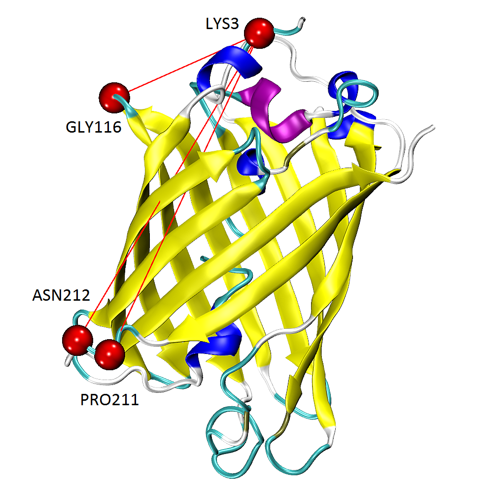
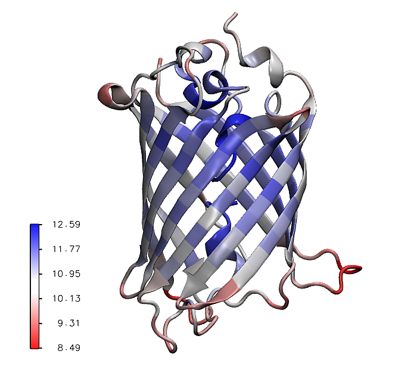

.. _mech_stiff:

Mechanical Stiffness Calculations
===============================================================================

This example shows how to perform mechanical resistance calculation for GFP
protein (**1gfl**) and visualize the results using Matplotlib_ library and VMD_
program.

An :class:`.ANM` instance that stores Hessian matrix and normal mode data 
describing the intrinsic dynamics of the protein structure will be used as 
an input (*model*) as well as cooridinates of protein structure (*coords*, *pdb*).

See [EB08]_ for more information about the theory of mechanical resistance 
calculations and more examples.

Parse structure
-------------------------------------------------------------------------------

We start by importing everything from the ProDy package:

.. ipython:: python

   from prody import *
   from pylab import *
   ion()   # turn interactive mode on

We start by parsing chain A of PDB structure **1gfl** together with the 
header, which will be used later for visualizing the secoundary structure.

.. ipython:: python

   gfp, header = parsePDB('1gflA', header=True)
   gfp

We want to use only Cα atoms for our calculations, so we select them into 
a new object *calphas*:

.. ipython:: python

   calphas = gfp.ca
   calphas

Build Hessian and calculate ANM modes
-------------------------------------------------------------------------------

In the next step we instantiate an :class:`.ANM` instance:

.. ipython:: python

   anm = ANM('GFP ANM analysis')

Then, build the Hessian matrix by passing selected atoms (230 Cα atoms) to
:meth:`.ANM.buildHessian` method:

.. ipython:: python

   anm.buildHessian(calphas, cutoff=13.0)

And calculate all anm modes as they will be needed for later: 

.. ipython:: python

   anm.calcModes(n_modes='all')

All modes are required to perform accurate mechanical stiffness calculations. 

Stiffness Matrix Calculations
-------------------------------------------------------------------------------

Mechanical stiffness calculations for the selected group of atoms can be 
performed using the :func:`.calcMechStiff` function:

.. ipython:: python

   stiffness = calcMechStiff(anm, calphas)
   stiffness

To show the stiffness matrix as an image map use the following function:

.. ipython:: python
	
   @savefig gfp_showMechStiff.png width=4in
   show = showMechStiff(stiffness, calphas, cmap='jet_r')

Note that `'jet_r'` is the reverse of the jet colormap and is 
similar to the default coloring method of the VMD_ program. 

The mean values of the mechanical stiffness matrix for each residue 
can be calculated using the :func:`.showMeanMechStiff` function where 
the secoundary structure of the protein is drawn using header information.

.. ipython:: python

   @savefig gfp_showMeanMechStiff.png width=8in
   show = showMeanMechStiff(stiffness, calphas, header, 'A', cmap='jet_r')
 
Mechanical Stiffness in VMD
-------------------------------------------------------------------------------

We can generate tcl files for visualizing mechanical stiffness with VMD_ 
using the :func:`.writeVMDstiffness` function. Select one residue in *indices* (**[3]**) 
or series of residues (**[3, 7]** means from 3 aa to 7 aa inclusive) and 
a range of effective spring constant *k_range* (**[0, 7.5]**). 

We provide *gfp* as well as *calphas* so VMD_ has information about the complete protein structure,
which it can use for graphical representations.

.. ipython:: python
   :verbatim:

   writeVMDstiffness(stiffness, gfp, [3,7], [0,7.5], filename='1gfl_3-7aa')
   writeVMDstiffness(stiffness, gfp, [3], [0,7], filename='1gfl_3')

A TCL file will be saved automatically and can be used later in VMD_ by running 
the following command line instruction. Results can be loaded automatically to VMD_ 
by setting keyword ``loadToVMD=True``.

::  vmd -e 1gfl_3aa.tcl

or typing the following in the VMD_ *TKConsole* (*VMD Main*) for Linux, Windows and Mac users: 

::  play 1gfl_3aa.tcl

The tcl file contains a method for drawing lines between selected pairs of 
residues, which are highlighted as spheres. The color of the line can be modified 
by changing the ``draw color red`` line in the output file. Only colors from VMD_ 
Coloring Method will work. Other changes can be done within VMD_ in the
*Graphical Representations* menu.

The figure shows GFP results from :func:`.writeVMDstiffness` function opened in VMD_. 
Pairs of found residues LYS3-GLY116, LYS3-PRO211 and PRO211-ASN212 are shown as VDW 
spheres connected with red lines.

Additionally, :file:`1gfl_3aa.txt` file is created. It contains a list 
of residue pairs with the value of effective spring constant (in a.u. because 
*kBT=1*) obtained from :func:`.calcMechStiff`.
::

     LYS3    GLY116  6.91650667766
     LYS3    PRO211  6.85989128668
     LYS3    ASN212  6.69507284967
     ...

The range of spring constant for *k_range* can be checked as follows:  

.. ipython:: python

   calcStiffnessRange(stiffness)

See also :func:`.calcMechStiffStatistic` and :func:`.calcStiffnessRangeSel`
functions for more detailed analysis of the stiffness matrix.

The results of the mean value of mechanical stiffness calculation can be seen 
in VMD_ using:

.. ipython:: python
   :verbatim:
	
   writeDeformProfile(anm, gfp, selstr='chain A and name CA', pdb_selstr='protein')

Calculate Distribution of Deformation 
-------------------------------------------------------------------------------

The distribution of the deformation in the distance contributed by each mode 
for a selected pair of residues has been described in [EB08]_, see *Eq. (10)*
and plots are shown on *Fig. (2)*. 

These results can be plotted using :meth:`.plotting.showPairDeformationDist` 
or a list can be obtained using :meth:`.analysis.calcPairDeformationDist`.

.. ipython:: python

   d0 = calcPairDeformationDist(anm, calphas, 3, 132)

   @savefig mechstiff_pair_deformation_dist_3-132.png width=4in
   show = showPairDeformationDist(anm, calphas, 3, 132)

Figure shows the plotted distribution for deformations between 3-132 residue in each mode *k*.

To obtain results without saving any file type:

.. ipython:: python

   d1 = calcPairDeformationDist(anm, calphas, 3, 212)
   d2 = calcPairDeformationDist(anm, calphas, 132, 212)

   plot(d1[0], d1[1], 'k-', d2[0], d2[1], 'r-')

