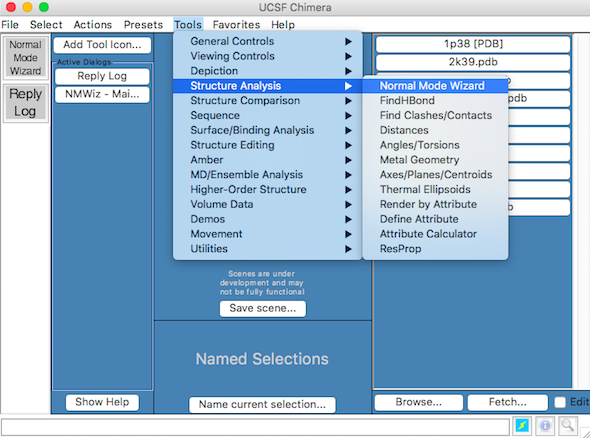
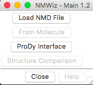
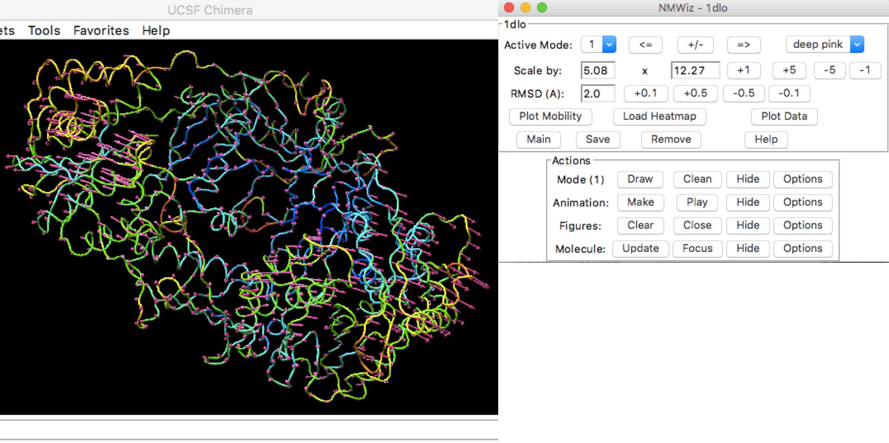
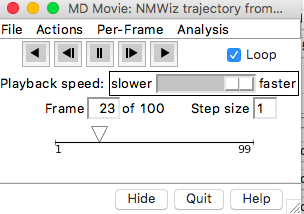

Using NMWiz in Chimera
===============================================================================

This chapter provides an introduction to NMWiz in Chimera and its capabilities.

Main Window
-------------------------------------------------------------------------------

NMWiz is located in :menuselection:`Chimera Main --> Tools --> Structure Analysis` menu
and labeled as :guilabel:`Normal Mode Wizard`, as shown below:

   Location of NMWiz plugin in Chimera menus.

When you first open NMWiz, you will see the :guilabel:`NMWiz 1.2 - Main`
window shown below:

   NMWiz Main window in Chimera.

:guilabel:`NMWiz 1.2 - Main` window offers options to load precalculated
data or to generate data for molecules loaded in VMD:

  * :guilabel:`Load NMD File` lets you load precalculated data (:file:`.nmd`
    files) for analysis.

  * :guilabel:`ProDy interface` facilitates ANM, GNM, and PCA/EDA
    calculations from VMD.  This functionality is illustrated in the 
    following chapters.

NMWiz Window
-------------------------------------------------------------------------------

Now, let's load :file:`1dlo_anm.nmd` file to introduced the :guilabel:`NMWiz`
window:

   NMWiz GUI

Changing and Editing Modes
^^^^^^^^^^^^^^^^^^^^^^^^^^

The active mode is represented by arrows starting at the atom locations and 
pointing in the direction of motion.  The top pane of the NMWiz window 
contains tools for changing some of the basic features of the displayed mode.

Active mode and color
"""""""""""""""""""""

The active mode can be changed using the drop down menu or incremented using
the :guilabel:`<=` and :guilabel:`=>` buttons. Changing the active mode will 
hide previously generated depictions, and the newly depicted mode will be 
assigned a distinct color.

Mode scale and direction
""""""""""""""""""""""""

Mathematically, each mode's sign is arbitrary.  NMWiz depicts normal modes 
as they are read from the input file, but the :guilabel:`+/-` button changes
the mode's sign, inverting its direction.  The size of the arrows can be 
adjusted using the :guilabel:`Scale by` or :guilabel:`RMSD` controls.  
  * **Scale by**: The first number is the inverse of the mode frequency, and the second is a real-valued scaling factor that may be incremented or decremented using the adjacent buttons.  The :guilabel:`+/-` button controls the sign of the scale factor.  By default, NMWiz scales all modes to 2 Angstroms RMSD.
    * **RMSD**: Arrow length can be adjusted to show a specified displacement along the active mode.  The sum of squares of the arrow lengths will be the square of the specified RMSD.  

Animations
^^^^^^^^^^

Clicking :menuselection:`Animation --> Make` will start an animation along
the active mode.  The animated motion changes the structure along the mode
in both directions with an amplitude given by the RMSD displayed in top panel.

You can play/pause the movie from the movie dialog window in Chimera. 

Plots and Heatmaps
^^^^^^^^^^^^^^^^^^

You can generate plots and heatmaps that are linked to the protein display.
Click :guilabel:`Plot Mobility`, for example. You will see a plot of the
residue mean squared fluctuations for the active mode.  Clicking the points
on the plot will toggle labels for the corresponding atoms in the VMD
molecular display.

Main Controls
^^^^^^^^^^^^^

Use the following controls for:

  * :guilabel:`Main` - Open the NMWiz main window, useful when it's closed
  * :guilabel:`Save` - Save current dataset in NMWiz format
  * :guilabel:`Remove` - Remove current dataset and free memory
  * :guilabel:`Help` - Get some help

