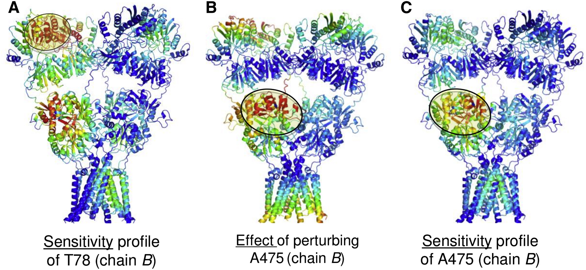

Analysis
===============================================================================

Here are the required imports again. You do not need to repeat them if you are
still in the same python session.

.. ipython:: python

    from prody import *
    from pylab import *
    ion()

You can load the model again if you are starting a new session as follows:

.. ipython:: python

    anm_ampar = loadModel('3kg2.anm.npz')
    ampar_ca = parsePDB('3kg2', subset='ca')

Plotting effectiveness and sensitivity profiles
-------------------------------------------------------------------------------

We can use showPerturbResponse with the matrix=False option to plot the effectiveness 
and sensitivity profiles colored by chain:

.. ipython:: python

    show = showPerturbResponse(anm_ampar, atoms=ampar_ca, 
                               show_matrix=False)
    @savefig 3kg2_prs_eff_and_sens.png width=4in

Plotting residue-specific effectiveness and sensitivity profiles
-------------------------------------------------------------------------------

To look at the effectiveness that perturbing a residue has in eliciting a response 
in individual residues (instead of its overall effectiveness) or to look at the 
sensitivity of a residue to perturbations of individual residues (instead of its 
overall sensitivity), we read out rows or columns from the perturbation response matrix. 
This can again be shown in a plot as in Figure 6D.

.. ipython:: python

    show = showPerturbResponse(anm_ampar, atoms=ampar_ca, 
                               show_matrix=False,
                               select='chain B and resnum 84')
    @savefig 3kg2_prs_chB_T84_eff_and_sens.png width=4in

We can also calculate the PRS matrix and profiles separately from showPerturbResponse. 
This gives us more flexibility with what we show and enables us to do other things with the 
return values. For example, we could apply a cutoff to identify residues with particularly high 
effectiveness and sensitivity as effectors and sensors, or slice out individual rows or columns 
and write them into PDB files for visualization (see below).

.. ipython:: python

    prs_mat, effectiveness, sensitivity = calcPerturbResponse(anm_ampar)

Writing effectiveness and sensitivity profiles to PDB for visualization
-------------------------------------------------------------------------------

It is sometimes more helpful to understand what is happening using a colored structure. 
To achieve this we can overwrite the B-factor or occupancy column of PDB file and use 
PyMOL or VMD to color the structure by B-factor or occupancy.

To do this we modify the ampar_ca object and then write a PDB from it as follows:

.. ipython:: python

    ampar_ca.setBetas(effectiveness)
    writePDB('3kg2_ca_effectiveness.pdb', ampar_ca)

We can also calculate the PRS matrix and profiles separately from showPerturbResponse 
and slice out individual rows or columns and write them into PDB files for visualization.
We slice rows by default (*axis=0*) to obtain the effectiveness profile

.. ipython:: python

    prs_mat, effectiveness, sensitivity = calcPerturbResponse(anm_ampar)
    B_84_effectiveness = sliceAtomicData(prs_mat, atoms=ampar_ca, 
                                         select='chain B and resnum 84')

    writePDB('3kg2_ca_B_84_effectiveness.pdb', ampar_ca, 
             betas=B_84_effectiveness)

and slice columns using *axis=1* to obtain the sensitivity profile

.. ipython:: python

    B_84_sensitivity = sliceAtomicData(prs_mat, atoms=ampar_ca, axis=1,
                                       select='chain B and resnum 84')

    writePDB('3kg2_ca_B_84_sensitivity.pdb', ampar_ca, 
             betas=B_84_sensitivity)

We generated our Figure 7 using this approach together with the `spectrum` command from PyMOL.

