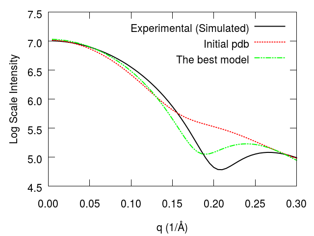

.. _saxs:

Small Angle X-ray Scattering (SAXS) Analysis
===============================================================================
SAXS is an experimental technique which gives information about solution
structure of biological macromolecules. SAXS data is a 1D data of Magnitude of
Scattering Vector (q) vs Scattering Intesity (I). In this tutorial, we will see
how to combine SAXS data with a known protein structure to obtain information
about solution structure of a protein. Basically, we are trying to obtain an
unknown protein conformation from a known pdb file and SAXS data by utilizing
normal modes obtained with anisotropic network model. We will use a widely known
test case, adenylate kinase. Adenylate kinase has two conformations: open
conformation (PDB ID: 4ake) and closed conformation (PDB ID: 1ake). Adenylate kinase
has three domains: Lid domain, NMP binding domain, and core domain. The core domain
of adenylate kinase is almost same in the open and the closed conformations.

We assume that we have pdb file for the open conformation (4ake) and SAXS profile of the
closed conformation (1ake). We are trying to recover a model similar to the
closed conformation by combining initial pdb file with SAXS data. 

Lets start with essential import statements:

.. ipython:: python
   import numpy as np
   import matplotlib

Tutorial files
-------------------------------------------------------------------------------
We will need three files for this tutorial:

.. literalinclude:: files.txt

* :file:`4ake_chainA.pdb`
* :file:`1ake_chainA_saxs_w_yerrorbars.dat`
* :file:`1ake_chainA.pdb`

The first two files are mandatory input files. The last file is used to check
results of our SAXS modeling. 
   

Parse known structure
-------------------------------------------------------------------------------
We start with parsing a PDB file by passing an identifier.
Note that if a file is not found in the current working directory, it will be
downloaded.

.. ipython:: python
   protein = parsePDB('4ake_chainA.pdb')

We want to use only Cα atoms in chain A, so we select them:

.. ipython:: python
   calphas = protein.select('protein and name CA and chain A')
		   

Parse SAXS data
-------------------------------------------------------------------------------
We need to parse experimental SAXS data and save it into Numpy
arrays for further use. An experimental SAXS profile contains three columns:

* Magnitude of scattering vector [q]
* Scattering intensity [I(q)]
* Errors for each I(q) value [Sigma(q)]

If the data is simulated data, it generally contains only q and I(q) values.
Please note that the SAXS data file should only contain data. It should not
contain comment lines. Now, lets start parsing SAXS data:

.. ipython:: python
   from saxs import *
   Q_exp, I_q_exp, sigma_q=parseSaxsData('1ake_chainA_saxs_w_yerrorbars.dat', isLogScale=True)

Sometimes, experimental intensities are saved in log scale. Therefore, we
have to specify this information if the SAXS data is in log scale or not. 
		
Compare SAXS profiles of known structure and experimental (simulated) data
-------------------------------------------------------------------------------
We have to produce theoretical SAXS profile of the open conformation. We will
use Fast-SAXS method for this purpose [SY09]_.

.. [SY09] Yang S, Park S, Makowski L, and Roux B. A Rapid Coarse Residue-Based
   Computational Method for X-Ray Solution Scattering Characterization of
   Protein Folds and Multiple Conformational States of Large Protein Complexes.
   *Biophysical Journal*  **2009** 96:4449–4463.

We will call :function:`calcSaxsPerModel` to compute SAXS profile of our initial
pdb file for each experimental q value. Therefore, we have to use Q_exp array
we have just read from the experimental (or simulated) data file. Theoretical
SAXS intensities will be saved to I_model array. We should note that the
theoretical SAXS intensities are in log scale. 

.. ipython:: python
   I_model=np.zeros(len(Q_exp))
   calcSaxsPerModel(calphas, I_model, Q_exp)

We can write this SAXS profile to a file using :function:`writeSaxsProfile`.
Lets write this model to a file for further investigation. 
   
.. ipython:: python
   writeSaxsProfile(I_model, Q_exp, 'theoreticalSaxsProfile.dat')

It is time to quantify the agreement between the experimental profile and
profile of the initial pdb file. We use Chi value for this purpose. Our purpose
is to produce models by using anisotropic network model that are in better agreement
with the experimental SAXS profile. Of course, better agreement means a lower chi
value. 

.. ipython:: python
   maxChi=calcSaxsChi(Q_exp, I_q_exp, sigma_q, Q_exp, I_model)
   
.. ipython:: python
   showSaxsProfiles('1ake_chainA_saxs_w_yerrorbars.dat', 'theoreticalSaxsProfile.dat')

.. image:: images/saxs_4ake_vs_1ake.png
   :scale: 200 %

Build hessian and get normal modes
-------------------------------------------------------------------------------
We will try to reduce Chi value between SAXS profile of initial pdb and
experimental (or simulated) SAXS data by interpolating normal modes obtained
with anisotropic network model. First, lets calculate normal modes.

.. ipython:: python

   anm = ANM('ANM Analysis')
   anm.buildHessian(calphas, cutoff=15.0)
   modes=anm.calcModes(n_modes=5, zeros=False)
		

Interpolate a single normal mode to get a model
-------------------------------------------------------------------------------
If we want to interpolate a single mode and see if it reduces chi values, we
can use :function:`interpolateMode` function. Return value of this function
will be two lists, one for the chi values and the other one for the frame
numbers. The Default frame number is 20 and they will be listed from -10 to
+10. The negative values indicate that the mode has been subtracted the
original coordinates and vice versa. 

.. ipython:: python

   chi_list, frames_list=interpolateMode(calphas, modes[0], Q_exp, I_q_exp,\
	     sigma_q, maxChi)

Lets see if we have a model in mode 0 that reduces chi value. 
.. ipython:: python

   showChivsFrames(chi_list, frames_list, numFrames=20)

Frame 10 of mode 0 reduces chi value significantly. In this model, lid domain of
adenylate kinase gets closed. 

Perform iterations of over multiple low frequnce normal modes
-------------------------------------------------------------------------------
If we want to do iterations over multiple modes and get a model with the lowest
chi value, we can leave interactive ipython prompt and issue the following
command::

    prody saxs 4ake_chainA.pdb 1ake_chainA_saxs_w_yerrorbars.dat -n 5
   
Here, we specified the maximum number of modes to be used as with -n 5 parameter.
This command will produce the following image:

.. image:: images/chi_vs_frames.png
   :scale: 70 %

The figure above shows that 10th frame of the first mode reduces Chi value
significantly. Generally, checking just a few low frequency normal modes can
be sufficient to observe a large scale conformational change. In our case,
the first mode is sufficient to produce the best model. We can visualize
this model by using VMD_. The model resulting in the lowest Chi value is
saved to :file:`best_model.pdb` file by default. Moreover, the program
will produce theoretical SAXS profile for :file:`best_model.pdb` and
save it into :file:`best_model_I_q.dat`. We can compare SAXS profiles of
the open conformation, the closed conformation and the best model as
given below:

Obviously, the general shape looks like the SAXS of the closed
conformation. If we check :file:`best_model.pdb`, we may see some structural
distortions. We can build all atom representation of :file:`best_model.pdb`
by using a program like pulchra. After this step. we can  perform a minization
with any molecular dynamics program to remove these distortions.
When the minimized structure is compared with :file:`1ake_chainA.pdb` and
:file:`4ake_chainA.pdb`, we can see that the lid domain got closed and
NMP binding domain also gets closed partially. As a result, the solution
structure is more compact. 

.. image:: images/1ake_model_4ake_v2.png
   :scale: 150 %

SAXS is 1-dimensional data and its data content is very low.
Therefore, it is not surprising not to recover exactly the closed
conformation. We should note that another round of iterative
search over normal modes or combining normal modes may give us better models.  

.. _VMD: http://www.ks.uiuc.edu/Research/vmd/
