Core calculations: select, ANM, deformation and comparison
===============================================================================

This example shows how to run a simple workflow in Scipion using core ProDy
calculations: atom selection, ANM NMA and deformation analysis, and analyse 
the results. We will use the open and closed states of adenylate kinase.

See [KJ23]_ for more information about the Scipion-EM-ProDy plugin and more examples.

Getting started
-------------------------------------------------------------------------------
You can start Scipion from the command line as follows::

   scipion3

This will open the Projects window. From here, you can create a new project or open and existing one.
This time we will create a new project. You can call it something like prody_tutorial_core.

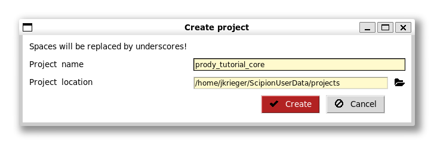

What you will see will be an empty project window with 3 sections:

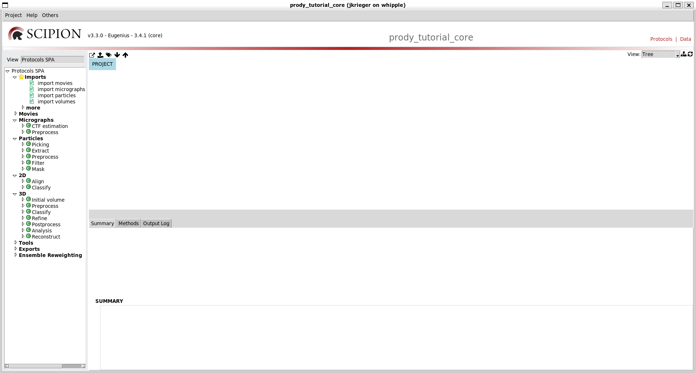

The left-most section is the protocols tree where you can see possible protocols to run for different types of tasks.
The default one is Cryo-EM single particle analysis (SPA), which was the original purpose of Scipion.

If you select the dropdown that says Protocols SPA then you can select other types of tasks and there is one that says 
ProDy. Selecting this then gives you a protocols tree specific to ProDy like the following:

.. figure:: images/core/03_scipion_empty_select_prody.png
   :scale: 80

First workflow from 2 protocols: importing and selecting
-------------------------------------------------------------------------------

As with any ProDy pipeline, we start by parsing an atomic structure and selecting some atoms of interest.

At the top of the tree, we have some optional protocols from the Scipion core for importing atomic structures.
The first of these can import a single atomic structure from the PDB or a file and we will use it for illustration.

The second can do the same for multiple atomic structures as we will see in the Scipion `ensemble analysis tutorial`_.

Double clicking this entry in the tree brings up a form for this protocol:

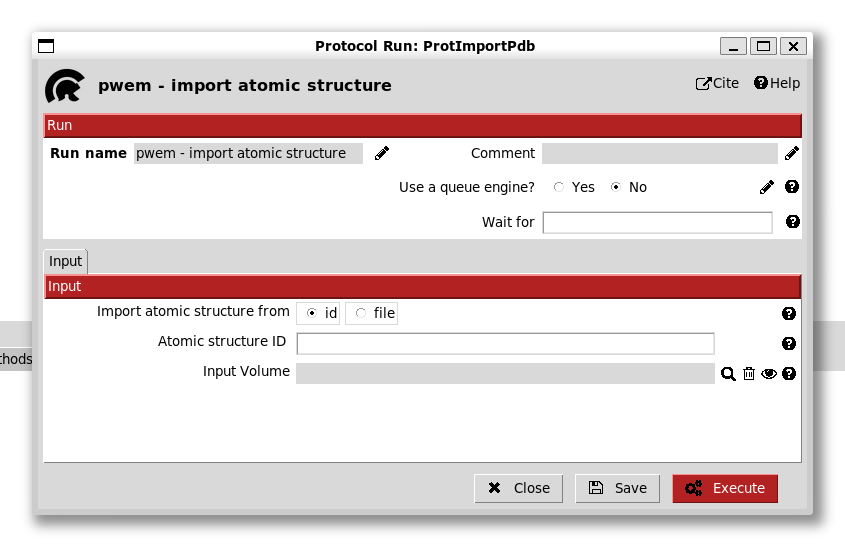

We see that there are options to import from the PDB using an id or from a file. In this case, we 
enter the id 4ake (the open state adenylate kinase). 

Scipion can also associate the structure to a volume but we do not do this now.

Clicking Execute brings up a box in the main workflow panel, which is initially blue then turns 
orange while running and green when done. When it is done, we also get an output and summary below:

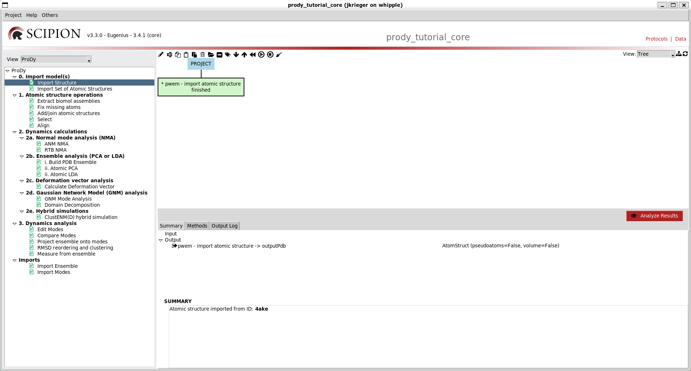

The output is an AtomStruct object, registered in the Scipion sqlite database that stores the path 
to the associated PDB or mmCIF file.

We can then use this AtomStruct in a following protocol as we show for ProDy atom selection. 
When we open up this protocol, we see that the default option is to import a structure into ProDy
using a pointer and, below that, the form has a grey box with a magnifying glass:

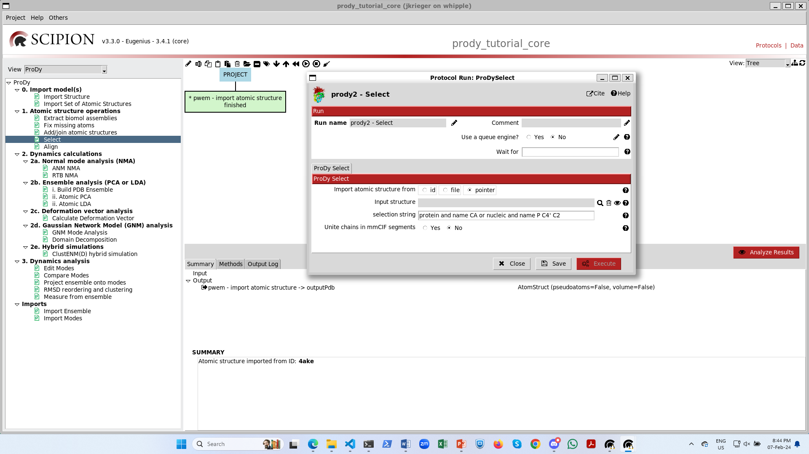

If you click on the magnifying glass, you get a new window with the list of AtomStruct objects to 
point to:

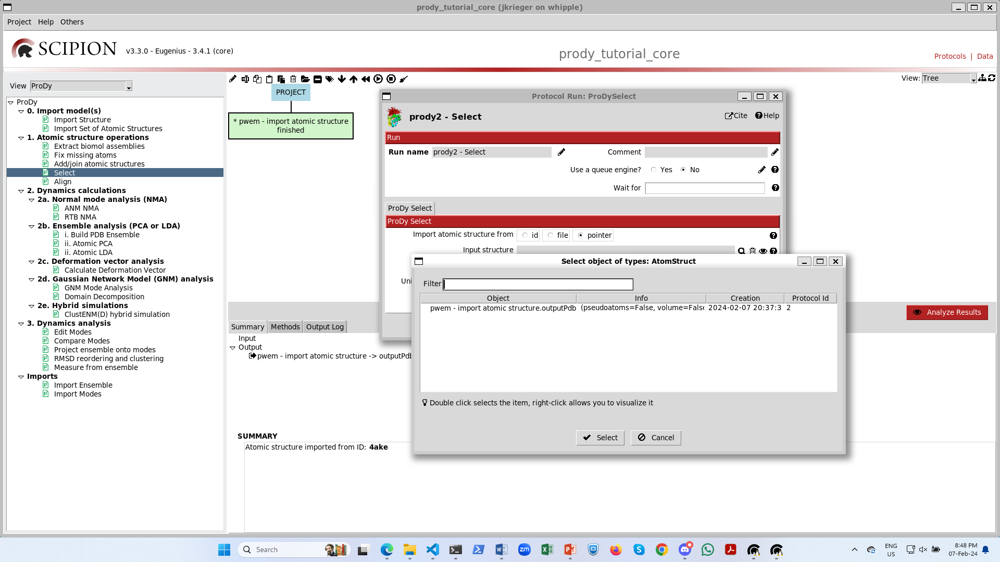

Upon selecting it, we then have it on our form and the red Execute button becomes available:

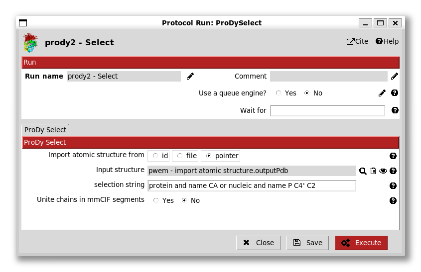

We can then change the selection string to include only chain A (and remove the nucleic part)
and change the run name to change the box label to be more informative.

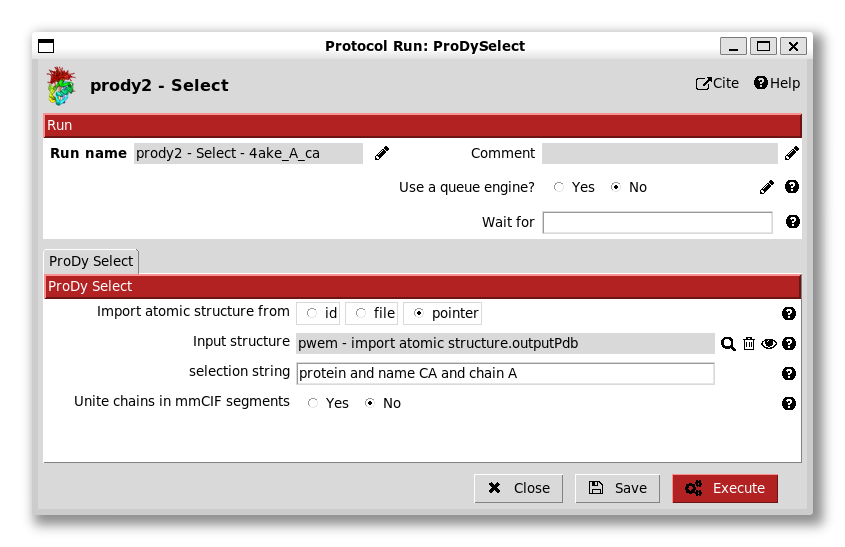

We now get another box in the workflow connected to the first with another output AtomStruct 
for a new file from running the prody select app, and information about the atoms selected.

Another way of parsing and selecting
-------------------------------------------------------------------------------

Rather than using the Scipion core protocol for importing atomic structures, we can also provide 
an id or file straight to any of the ProDy protocols related to atomic operations (excluding the 
alignment one, which takes two AtomStruct pointers, see below). 

We will do this now for PDB id 1ake (the closed adenylate kinase). To do this, we can either 
select the protocol from the list again, or use ctrl + f to find it, 
or right-click it and click Duplicate, which has a shortcut ctrl + d.

We again select CA atoms from chain A and change the run name accordingly:

.. figure:: images/core/10_select_1ake_A_ca.png
   :scale: 80

Executing this now connects it to the top of the tree again:

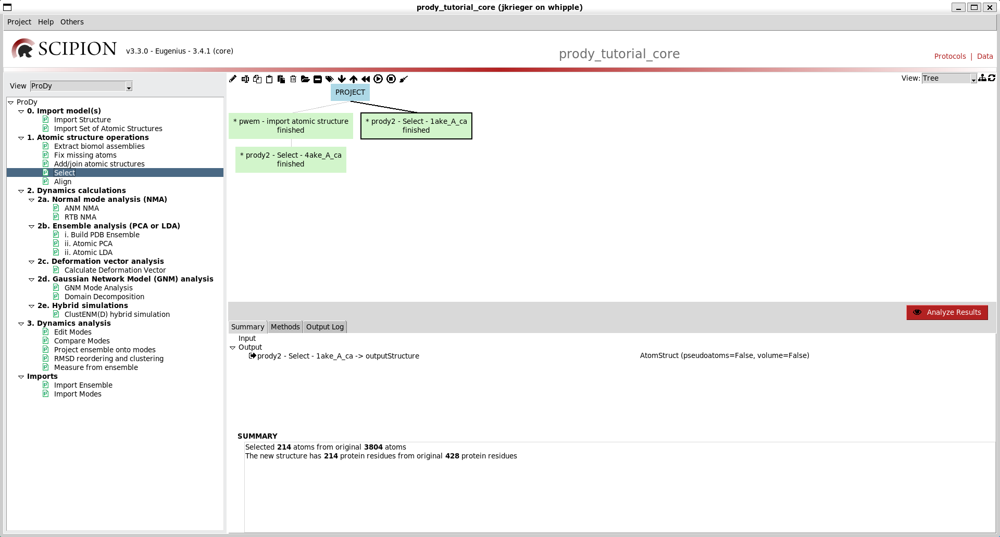

Step 2: dynamics calculations - NMA and deformation vector analysis
-------------------------------------------------------------------------------

We are now ready to perform standard ANM and deformation vector analyses to see how 
the intrinsic dynamics of the open system drives transitions to the closed state as in 
the `deformation analysis tutorial`_.

The first step here is to align the two structures. We do this by providing the two pointers
to the align protocol:

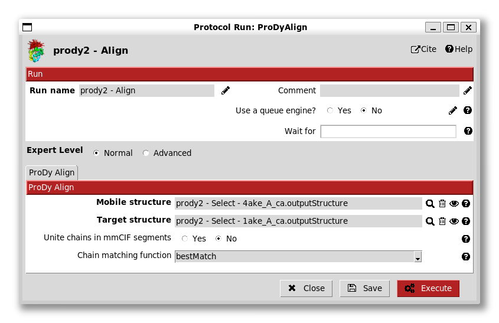

We see here that there are options for chain matching, which we will look at later in the 
`ensemble analysis tutorial`_ as this is a trivial case.

There's also an option of an advanced expert level. Selecting this brings up more options, which 
are again not useful here:

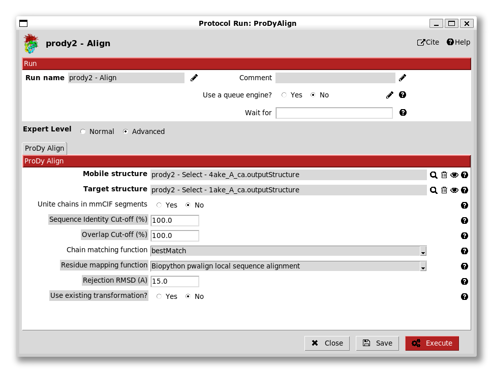

Now we can perform ANM NMA and deformation analysis as usual. The ANM NMA protocol also has various 
options but, as in the ProDy API and apps, we are usually fine to leave these alone. 

.. figure:: images/core/14_anm_advanced.png
   :scale: 80

It can be noted that explicit membrane ANM is also an option here if we provide a structure 
aligned to membrane like that from opm/ppm.

There is also another tab that controls options for animations using :func:`.traverseModel`:

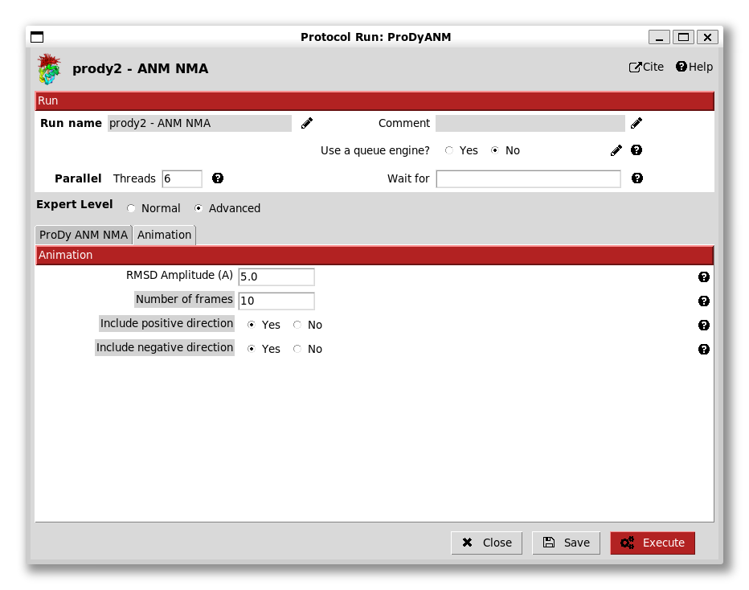

Similar options to the previous two protocol forms are available on that for deformation analysis,
so go ahead and run that too. We now have a tree like the following:

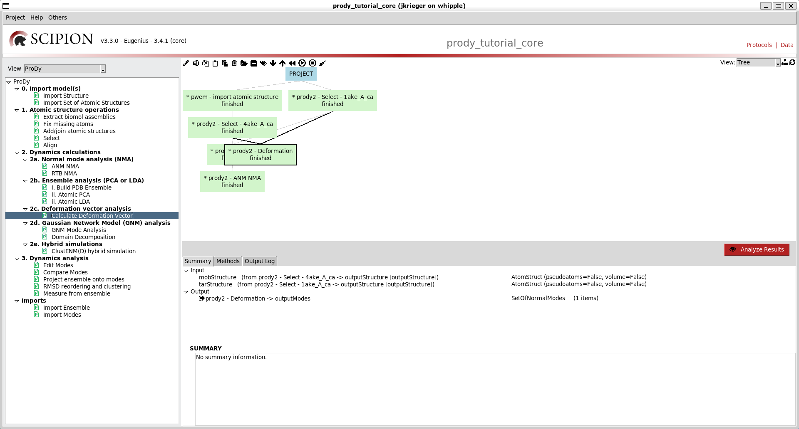

We can make it nicer by dragging the boxes around or clicking the tree icon at the top right:

.. figure:: images/core/17_boxes_nicer.png
   :scale: 80

We can also colour our boxes to make the workflow easier to follow using labels, which are in the 
middle of the set of icons at the top left of the workflow panel (the other icons are for run control,
e.g. stopping and starting and copying protocols):

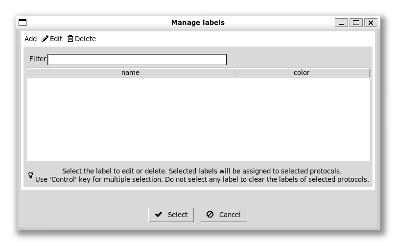

We can add now labels with different colours for different steps. There is a default set of colours 
for each label in order that usually works quite well. We can give the first (red) one a label "import",
for example:

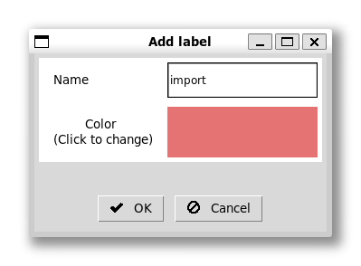

We can then click our first box and select this label for it. At this stage, nothing happens except 
that the box gets a shape on it. However, if we go to the menus at the top and toggle colour mode, 
then we get this box coloured red and the rest white.

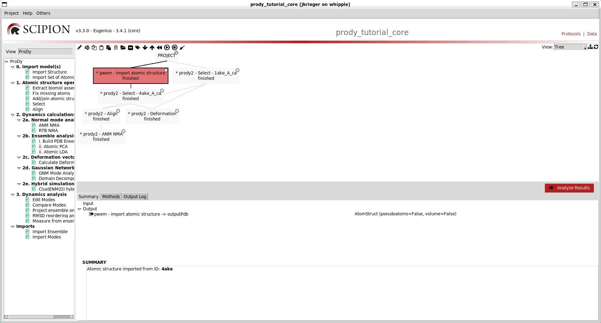

As in the Scipion-EM-ProDy paper, we can then make a blue label for dynamics and a yellow one 
(manually selecting to change the colour) for atomic structure operations.

We can then select multiple boxes with ctrl + click and select labels for them to paint our workflow:

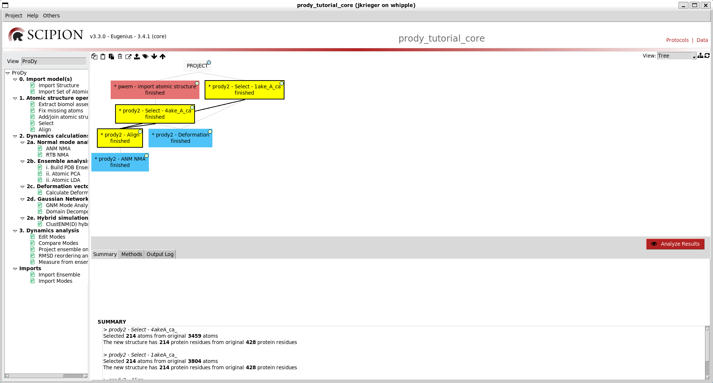

Step 3: analysis
-------------------------------------------------------------------------------

Lastly, we can create a comparison protocol and paint it with a green label. This form has several
options for comparisons as in the ProDy API:

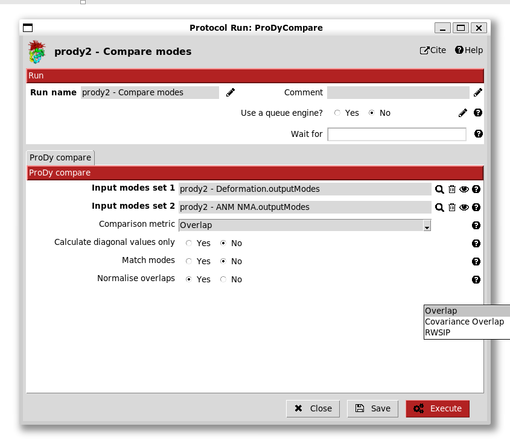

Finally, this completes the workflow and we can analyse our results with the big red button, 
which opens up a viewer. If we select "yes" to cumulative overlaps and click the eye, then we 
get a graph as in the ProDy API:

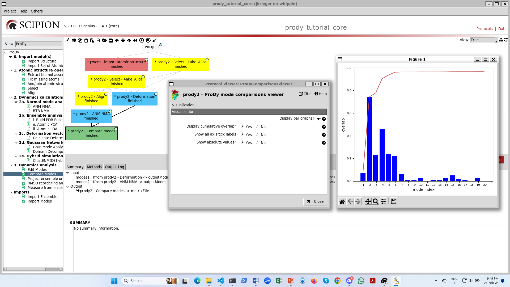

We can also click either of the (blue) two dynamics protocols and click the red button there to open up
the NMWiz viewer in VMD (see the `NMWiz tutorial`_). Note that this will lock up your Scipion window.

We can also right click any input or output object and get options for other viewers.

.. _`ensemble analysis tutorial`: http://prody.csb.pitt.edu/tutorials/scipion_tutorial/ensembles.html
.. _`deformation analysis tutorial`: https://prody.csb.pitt.edu/tutorials/enm_analysis/deformation.html
.. _`NMWiz tutorial`: https://prody.csb.pitt.edu/tutorials/nmwiz_tutorial/
