Ensemble analysis: dynamics from PCA of multiple structures.
===============================================================================

This example shows how to run an ensemble analysis workflow in Scipion by 
importing several structures and building an ensemble, and analysing it via 
PCA. We will use the SARS-CoV-2 spike as in [KJ23]_.

See [KJ23]_ for more information about the Scipion-EM-ProDy plugin and more examples.

Getting started
-------------------------------------------------------------------------------
You can open the Scipion Projects window from the command line as follows::

   scipion3

From here, create a new project and call it prody_tutorial_ensemble. Then,
select the ProDy protocols tree from the dropdown on the left.

Simple case, steps 0 and 2-i: importing related structures and building an ensemble
-------------------------------------------------------------------------------

As with any ProDy pipeline, we start by parsing atomic structures. In this case, we use the second protocol from the Scipion core 
to importing multiple atomic structures at once. 

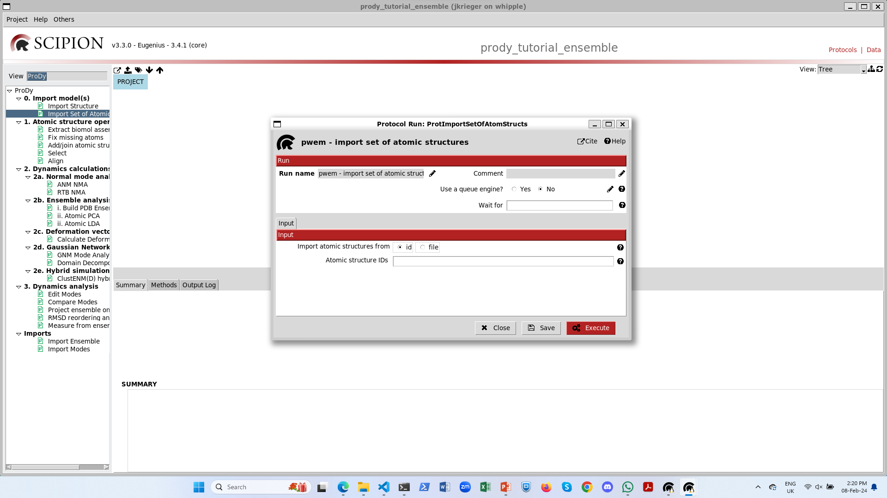

For the simple case, we will just parse the structures of the D614G spike 
without ACE2 from Benton and Wrobel et al. 2021 ([BW21]_). Coming from the
same paper, these have the same chain IDs and can be easily aligned into an 
ensemble as in Figure 2 of [KJ23]_. 

We just provide the 3 PDB IDs separated by commas: `7bnm, 7bnn, 7bno`.

The output is a SetOfAtomStructs with 3 items and if we right-click it, then
we get options of viewers:

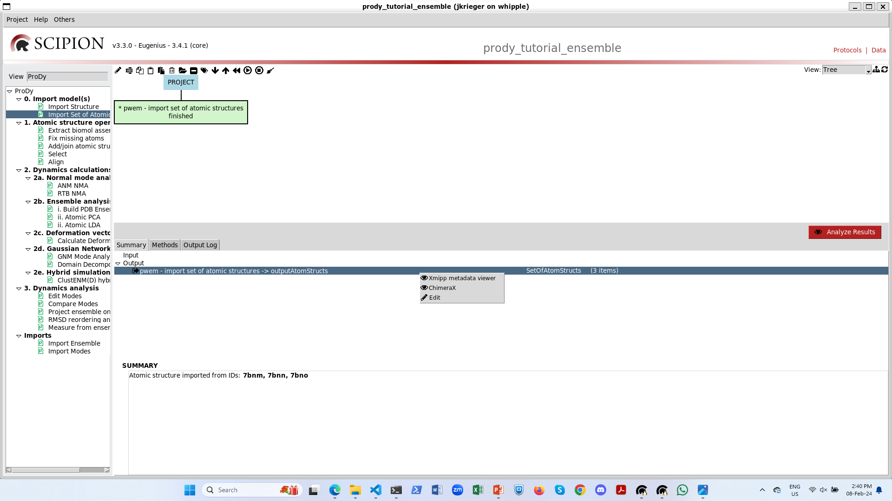

The Xmipp metadata viewer is very useful for seeing the contents of sets and 
any associated metadata. At the moment, we see that each item points to an 
mmCIF file containing the corresponding structures that we can pass on to ProDy:

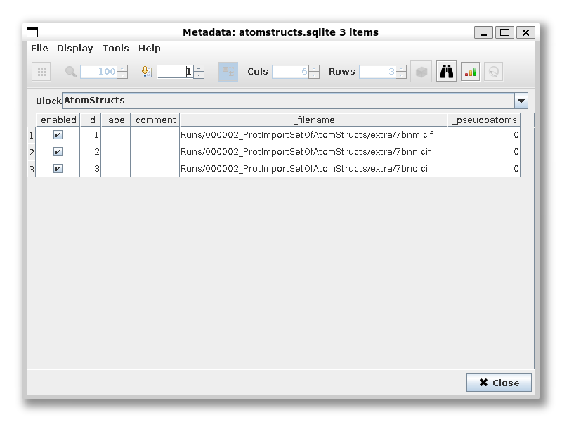

In this case, we skip step 1 as atom selection and alignment happens when we build the ensemble in the first 
protocol of step 2b. We provide the SetOfAtomStructs as a pointer in the list of input structures and keep the 
default options. Alternatively, we could also provide multiple AtomStruct or SetOfAtomStructs pointers, e.g. 
structures after selecting particular regions or sets from experiments and simulations.

In this case, the default chain matching function :func:`.sameChid` works well as they all have the same chain 
nomenclature, but there are many other options as shown in Figure 4 of [KJ23]_ below.

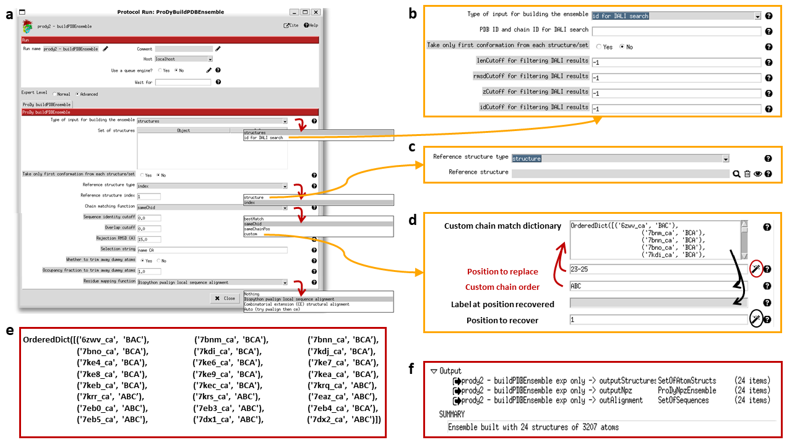

We will explore the custom chain matching in the next section.

By default, the protocol will trim away dummy atoms where there is no occupancy for some structures. We change this 
in the advanced parameters, which then allows us to compare the PCs later. Likewise, we change unite_chains to yes.

We will also change the reference to index 2, which corresponds to the 1-up structure to aid with alignment, especially later.

The output is a ProDyNpzEnsemble object, which is also a type of set that can be opened with the metadata viewer. 
Alternatively, this object and the ensemble building protocol also have a viewer in VMD for visualising the ensemble 
via a DCD file. We also get a SetOfSequences, which we can use to check the alignment.

There is also an option on the form to write a set of atomic structures, which can be registered as an output.
If you also install Scipion-Chem then you also have an option to write out a trajectory and register it as an MDSystem
for further analyses.

Advanced case: many heterogeneous structures
-------------------------------------------------------------------------------

If we import structures from another paper that uses a different nomenclature for chains, then it becomes more 
difficult to align them. One good solution for this is to provide a custom chain matching dictionary as follows.

Let's rename and duplicate the import protocol and import the structures from Zhang and Cai et al. 2021 ([ZC21]_):
7krq, 7krr, 7krs.

When we select the custom match option on the form, then we get an extra section with a wizard for creating a 
matching dictionary:

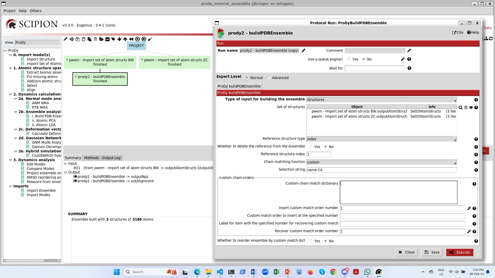

Initially, there is a big empty box, but when we click the magic wand underneath it, then it populates with 
the chain orders in each of the structures:

.. figure:: images/ensemble/04_ensemble_custom_default.png
   :scale: 80

Following our previous studies ([KJ23]_ and [GT22]_), we know that chain order BCA in the first structures
matches chain order ABC in the second set. Therefore, we can change the orders at position numbers 1,2,3
to BCA as follows:

When we then click the magic wand again, the match dictionary changes accordingly:

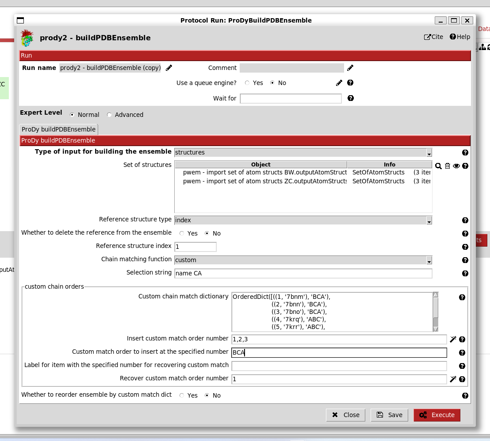

This applies when we use the unite_chains advanced option, so we set this to yes.

We can now execute the protocol and get the correct ensemble. The box gets the same 
name as the other one with "(copy)" added on the end, which is good enough for now.

When we click the red analyse button, we now see that all 1-up structures have the same
RBD up and that RBD is also up in the 2-up structure.

Step 2-ii: PCA
-------------------------------------------------------------------------------

Now we are ready to analyse the ensembles by PCA, which is step 2-ii. We can do this with the default options
for each ensemble, copying the protocol again for the second one. 

By default, it uses half the threads, so we can run both at the same time. 

Scipion also has random failures sometimes, so if this happens, just right-click the protocol box and select restart.

The protocol and output SetOfPrincipalComponents, like the NMA protocol and SetOfNormalModes, can open 
the NMWiz viewer or with the metadata viewer. In this case, the metadata viewer can be helpful for 
looking at the fractional variance.

In the NMWiz viewer, we can see that the first mode features concerted opening and closing of two RBDs,
while the second features anti-correlated opening of these two RBDs. 

For the PCA from the larger ensemble, we also have additional meaningful modes of variation, 
particular PC3 which shows a locking and unlocking of the RBDs with respect to each other and the NTDs.

Step 3: analysis 1 - compare modes
-------------------------------------------------------------------------------

The comparison between two sets of modes is slightly different to the comparison of a single vector against
a set of modes. In this case, we have an overlap matrix. 

This gives us additional options of matching modes and slicing out the diagonal, but we will not pick these now.

In the end, the viewer gives us ways of interacting with this matrix. Either, we can plot the colour map like 
:func:`.showOverlapTable` or we can select rows to plot like :func:`.showOverlap` as in the single deformation 
vector case. We then get the following outputs:

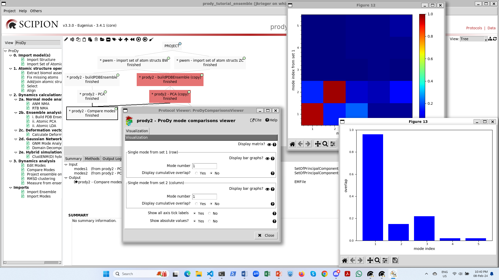

Step 3: analysis 2 - project ensembles on PCA landscapes
-------------------------------------------------------------------------------

Finally, we can run the projection protocol to project the members of the ensemble onto the PCA components,
allowing us to visualise the conformational landscapes. We have options of projecting onto 1, 2 or 3 modes.

If we project onto 1 mode, then the default option is to get a line graph with points for each structure 
with the conformation number on the x-axis and the PC coordinate along the y-axis: 

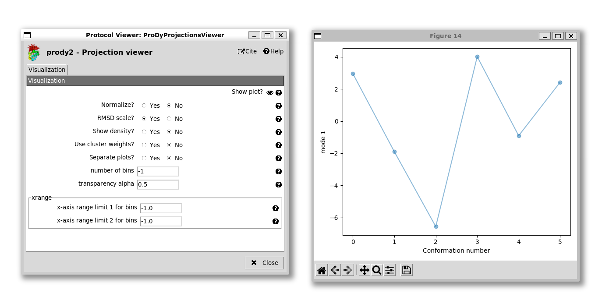

We can change this to a histogram by setting "Show density" to yes:

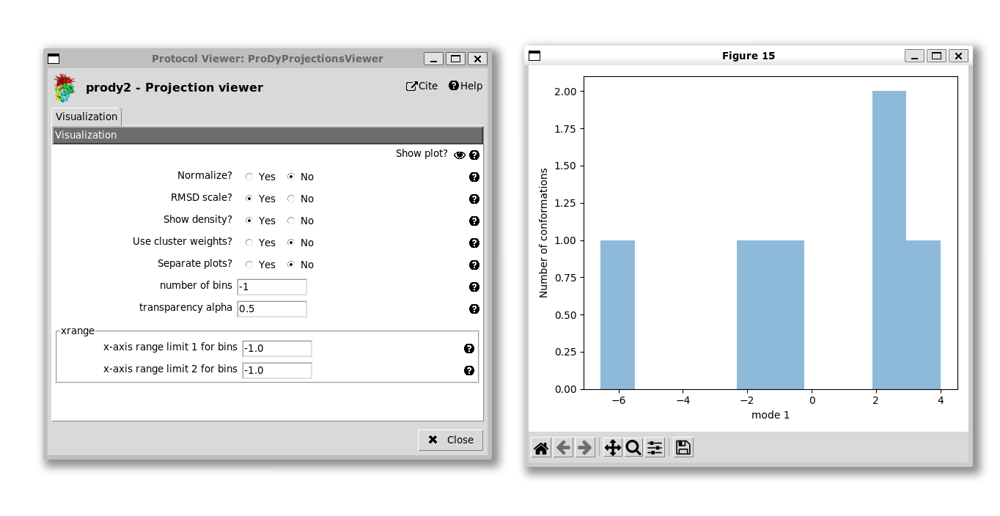

For the 2D case, the default plot is a scatter graph with each point being a structure and the axes being
the two selected PCs:

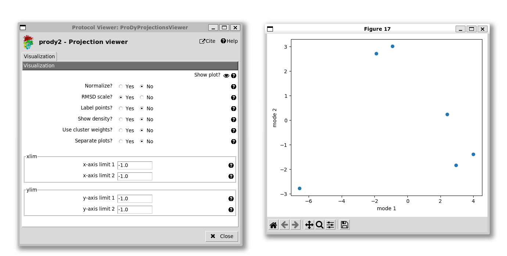

Unlike the 1D case, it's not easy to know which point is which, so we have an option to label the points.
As in the ProDy API, we can adjust the labels if they are overlapping, but that's not necessary here.
We also have the option of setting the axis ranges, which is useful for getting a more equal view, e.g. 
setting the x-axis from -7 to +7 and the y-axis from -3.5 to +3.5 as we do here:

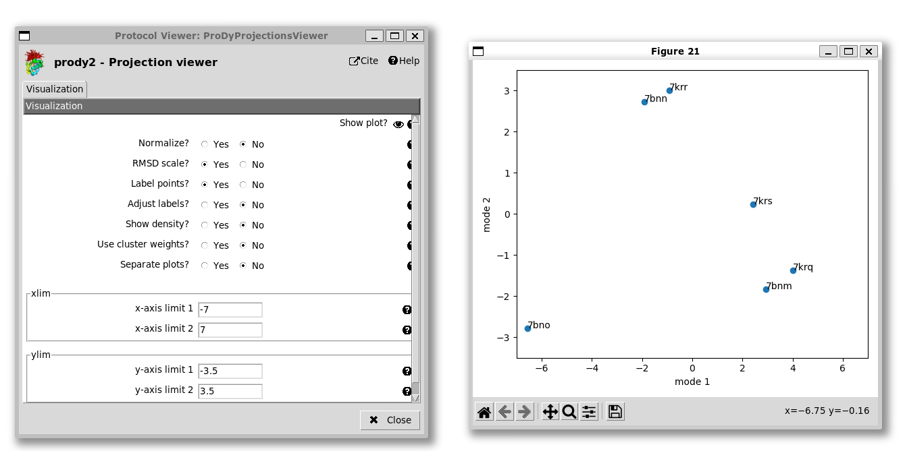

We see that the 2-up structure (PDB: 7bno) locates to the bottom left corner and the 3-down structures 
(PDB: 7bnm and 7krq) are near the the bottom right corner, separated mostly by PC1.

The 1-up structures (PDB: 7bnn and 7krr) lie near the middle of the top, being separated from the 
3-down structures by a combination of PCs 1 and 2. The 1-up, 1-intermediate structure (PDB: 7krs)
lies along the line between the two end states as expected.

We also have the option of showing a kernel density estimate of the landscape, which requires a bigger 
plot space, so we set the x and y limits back to -1 to allow them to take default values:

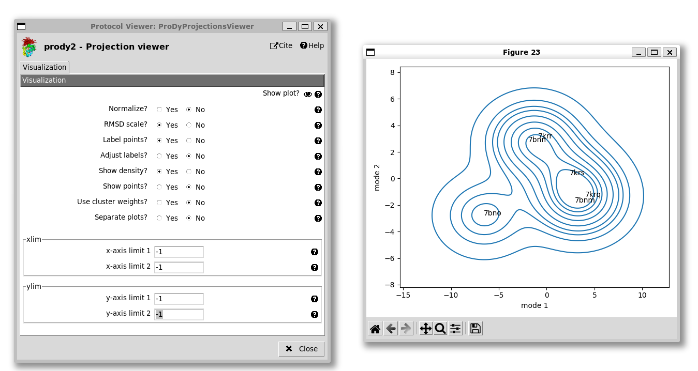

The 3D projection works in a similar way to the 2D with the absence of the density representation. 
It gives a 3D scatter plot that can be rotated as in the ProDy API (not shown here), which shows 
that PC3 mostly separates the structures from the two papers (excluding the 2-up), which may be due 
to differences in the constructs such as stabilising proline mutations in [BW21]_ and absent in [ZC21]_.

There are also other options for calculating distances, angles and dihedrals from these ensembles and 
clustering them by RMSD. 

.. [BW21] Benton DJ, Wrobel AG, Roustan C, Borg A, Xu P, Martin SR, Rosenthal PB, Skehel JJ, Gamblin SJ.
   The effect of the D614G substitution on the structure of the spike glycoprotein of SARS-CoV-2. 
   *Proc. Natl. Acad. Sci. USA* **2021** 118(9): e2022586118.

.. [ZC21] Zhang J, Cai Y, Xiao T, Lu J, Peng H, Sterling SM, Walsh RM Jr, Rits-Volloch S, Zhu H, Woosley AN, 
   Yang W, Sliz P, Chen B. Structural impact on SARS-CoV-2 spike protein by D614G substitution. 
   *Science* **2021** 372(6541): 525-530.

.. [GT22] Ginex T, Marco-Marín C, Wieczór M, Mata CP, Krieger J, Ruiz-Rodriguez P, López-Redondo ML, 
   Francés-Gómez C, Melero R, Sánchez-Sorzano CÓ, Martínez M, Gougeard N, Forcada-Nadal A, 
   Zamora-Caballero S, Gozalbo-Rovira R, Sanz-Frasquet C, Arranz R, Bravo J, Rubio V, Marina A; 
   IBV-Covid19-Pipeline; Geller R, Comas I, Gil C, Coscolla M, Orozco M, Llácer JL, Carazo JM.
   The structural role of SARS-CoV-2 genetic background in the emergence and success of spike mutations: 
   The case of the spike A222V mutation. *PLoS Pathog.* **2022** 18(7): e1010631.
