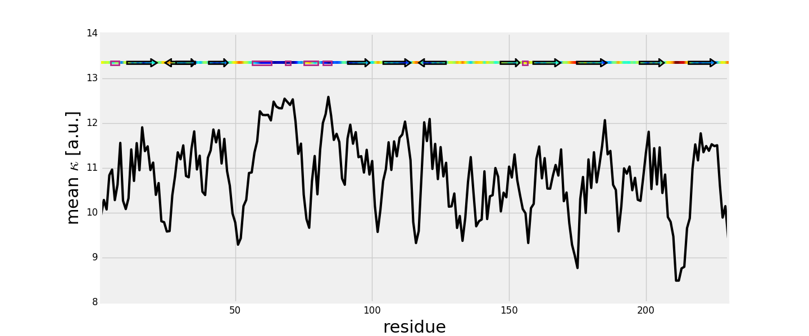
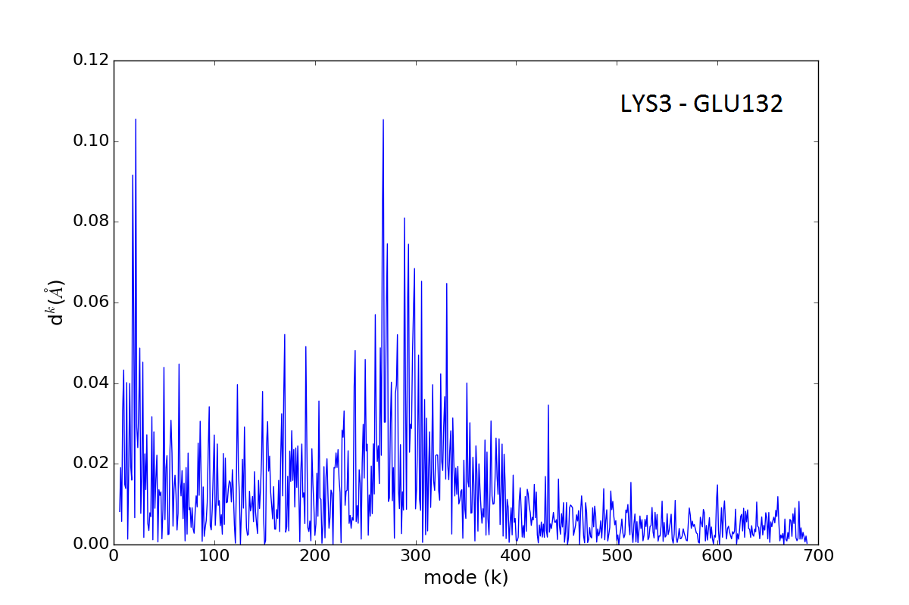

.. _stiffmech:

Mechanical Stiffness Calculations
===============================================================================

This example shows how to perform mechanical resistance calculation for GFP
protein (**1gfl**) and visualize the results using Matplotlib_ library and VMD_
program.

An :class:`.ANM` instance that stores Hessian matrix and normal mode data 
describing the intrinsic dynamics of the protein structure will be used as 
an input (*model*) as well as cooridinates of protein structure (*coords*, *pdb*).

See [EB08]_ for more information about the theory of mechanical resistance 
calculations and more examples.

.. [EB08] Eyal E., Bahar I. Toward a Molecular Understanding of 
   the Anisotropic Response of Proteins to External Forces: Insights from 
   Elastic Network Models. *Biophys. J.* **2008** 94:3424-34355.

Parse structure
-------------------------------------------------------------------------------

We start by importing everything from the ProDy package:

.. ipython:: python

   from prody import *
   from pylab import *
   ion()   # turn interactive mode on

We start with parsing a PDB file by passing an identifier (**1gfl**).
Note that if a file is not found in the current working directory, it will 
be downloaded directly from Protein Data Bank database. We will include
a header of PDB file which will be used in the next function.

.. ipython:: python

   gfp, header = parsePDB('1gfl', header=True)
   gfp

We want to use only Cα atoms from chain A, so we select them:

.. ipython:: python

   calphas = gfp.select('protein and chain A and name CA')
   calphas

Note that, ProDy atom selector gives the flexibility to select any set of 
atoms to be used in calculations. To obtain more information about selection
see: :class:`.AtomGroup`.

Build Hessian
-------------------------------------------------------------------------------

In the next step we instantiate an :class:`.ANM` instance:

.. ipython:: python

   anm = ANM('GFP ANM analysis')

Then, build the Hessian matrix by passing selected atoms (230 Cα's) to
:meth:`.ANM.buildHessian` method:

.. ipython:: python

   anm.buildHessian(calphas, cutoff=13.0)

Those two actions are required to perform mechanical stiffness calculations.
Optained ANM model will be used to mechanical striffness calculations.
We can get a copy of the Hessian matrix using :meth:`.ANM.getHessian` method:

.. ipython:: python

   anm.getHessian().round(4)

Stiffness Matrix Calculations
-------------------------------------------------------------------------------

Mechanical stiffness calculations for selected group of atoms can be 
performed using :meth:`.ANM.buildSM` method:

.. ipython:: python

   anm.buildMechStiff(calphas)
   anm.getStiffness()

Mechanical stiffness matrix is avaliable using :meth:`.ANM.getStiffness` 
method. To save stiffness matrix as an image map use following function:

.. ipython:: python
   :verbatim:
	
   showMechStiff(anm, calphas, 'jet_r'))

.. figure:: images/1gfl_stiffmatrix.png
   :scale: 65 %

Note that 'jet_r' will reverse the colormap of image map which will be 
similar to coloring method of VMD_ program. 

Mean value of mechanical stiffness matrix can be calculated using 
:meth:`showMeanStiff` function where the secoundary structure of protein 
is drawing using header information.

.. ipython:: python
   :verbatim:

   showMeanMechStiff(anm, calphas, header, 'A', 'jet_r')

 
Mechanical Stiffness in VMD
-------------------------------------------------------------------------------

To generate tcl file for VMD_ program with mechanical striffness calculations 
use :func:`.writeVMDstiffness` method. Select one residue in *indices* (**[3]**) 
or series of residues (**[3, 7]**, means from 3 aa to 7 aa including) and 
a range of effective spring constant *k_range* (**[0, 7.5]**). 
This faunction required also *pdb* with complete protein structure which will 
be used in VMD_ representation. If *calphas* instead of full protein structure
will be used in this function, the representation of protein in VMD_ program 
will not be accurate. In this example we considered *chain A* therefore suitable 
selection will be used:

.. ipython:: python

   pdb = gfp.select('chain A')

.. ipython:: python
   :verbatim:

   writeVMDstiffness(anm, pdb, [3,7], [0,7.5], filename='1gfl_3-7aa', 
							loadToVMD=False)
   writeVMDstiffness(anm, pdb, [3], [0,7], filename='1gfl_3')

Results will be loaded automatically to VMD_. Use ``loadToVMD=False`` to 
change it. TCL file will be saved automatically and can be used later by using 
linux command line: 

::  vmd -e 1gfl_3aa.tcl

or in VMD_ *TKConsole* (*VMD Main*) for Linux, Windows and Mac users: 
::  play 1gfl_3aa.tcl

Tcl file contains drawing line method between selected pairs of residues 
which are highlighted as a VDW spheres. Color of the line can be modified 
by changing ``draw color red`` line in output file. Only colors from VMD_ 
Coloring Method will worked. Other changes can be done in VMD_ program in
*Graphical Representations* section.

.. figure:: images/1gfl_chA.png
   :scale: 60 %

GFP results from :meth:`.vmdfile.writeVMDstiffness` method opened VMD_. Pair of 
found residues: LYS3-GLY116, LYS3-PRO211 and PRO211-ASN212 are shown as VDW 
sphesres connected with red line.

Additionally, :file:`1gfl_3aa.txt` file is created. It contains a list 
of residue pairs with the value of effective spring constant (in a.u. because 
*kbT=1*) obtained from :meth:`.ANM.buildSM` method.
::

     LYS3    GLY116  6.91650667766
     LYS3    PRO211  6.85989128668
     LYS3    ASN212  6.69507284967
     ...

The range of spring constant for *k_range* can be check:  

.. ipython:: python

   anm.getStiffnessRange()

See also :meth:`.ANM.getMechStiffStatistic` and :meth:`.ANM.getStiffnessRangeSel`
function for detailed analysis of stiffness matrix.

The results of mean value of mechanical stiffness calculation can be seen 
in VMD_ program using:

.. ipython:: python
   :verbatim:
	
   writeDeformProfile(anm, pdb, selstr='chain A and name CA',\
                                  pdb_selstr='protein')

.. figure:: images/1gfl_defprofile_vmd.png
   :scale: 90 %

Calculate Distribution of Deformation 
-------------------------------------------------------------------------------

Distribution of the deformation in the distance contributed by each mode 
for selected pair of residues has been described in [EB08]_, see *Eq. (10)*
and plots are shown on *Fig. (2)*. 
The results can be received using :meth:`.plotting.showPairDeformationDist`
to obtain a plot or :meth:`.analysis.calcPairDeformationDist` to receive a list
with data that can be modified.

.. ipython:: python
   :verbatim:

   calcPairDeformationDist(anm, calphas, 3, 132)

   showPairDeformationDist(anm, calphas, 3, 132)

Distribution of the deformation plot between 3-132 residue in each mode *k*.

To obtain results without saving any file typed:

.. ipython:: python
   :verbatim:

   d1 = calcPairDeformationDist(anm, calphas, 3, 212)
   d2 = calcPairDeformationDist(anm, calphas, 132, 212)
   print d1[0], d1[1]

   plot(d1[0], d1[1], 'k-', d2[0], d2[1], 'r-')

