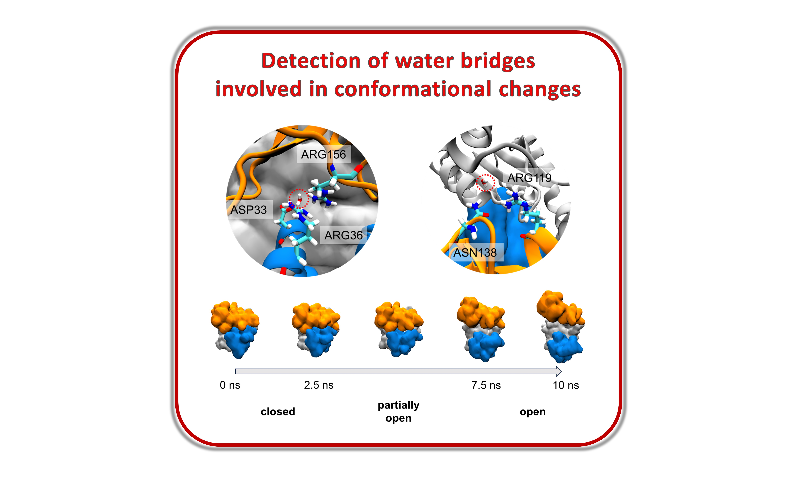
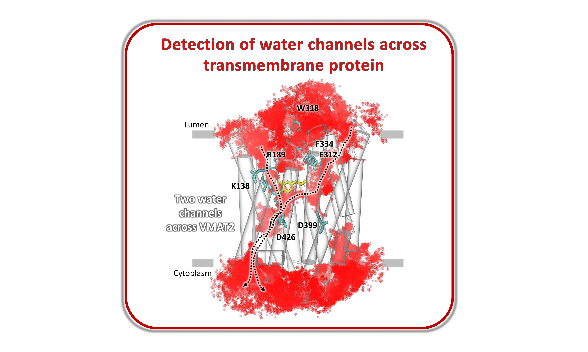
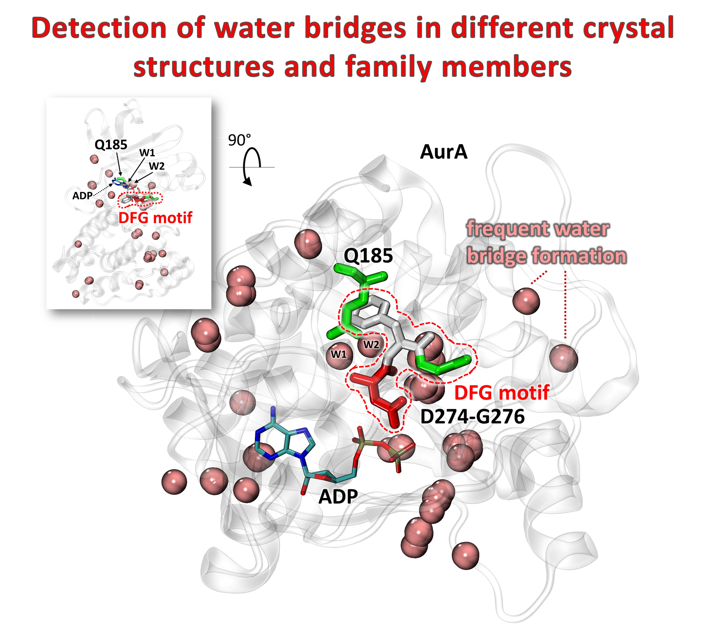
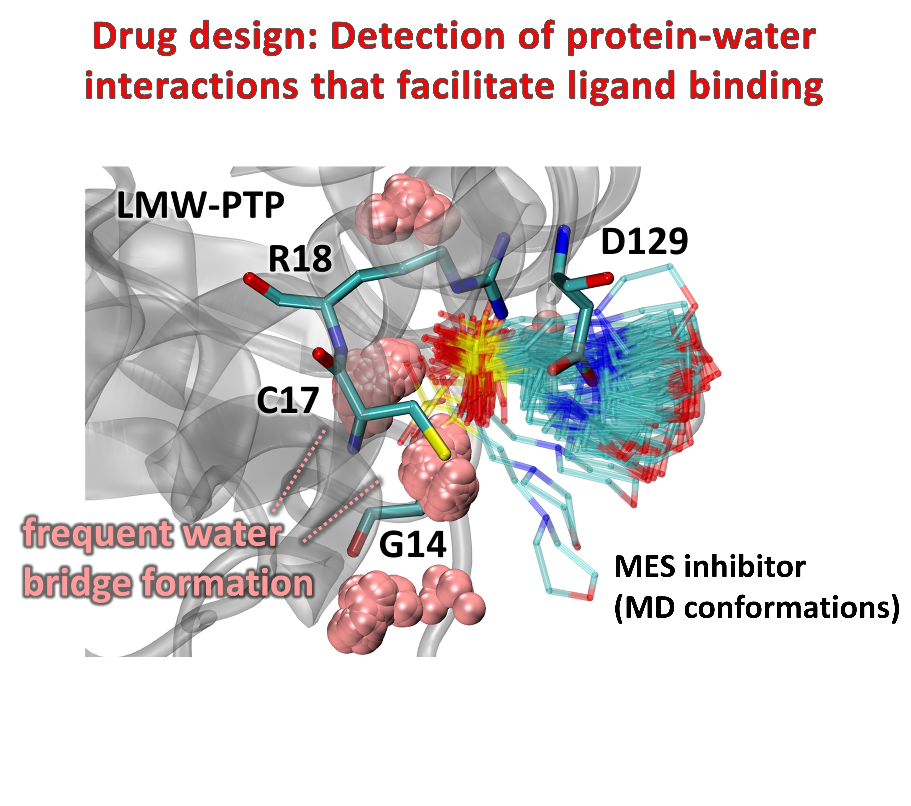
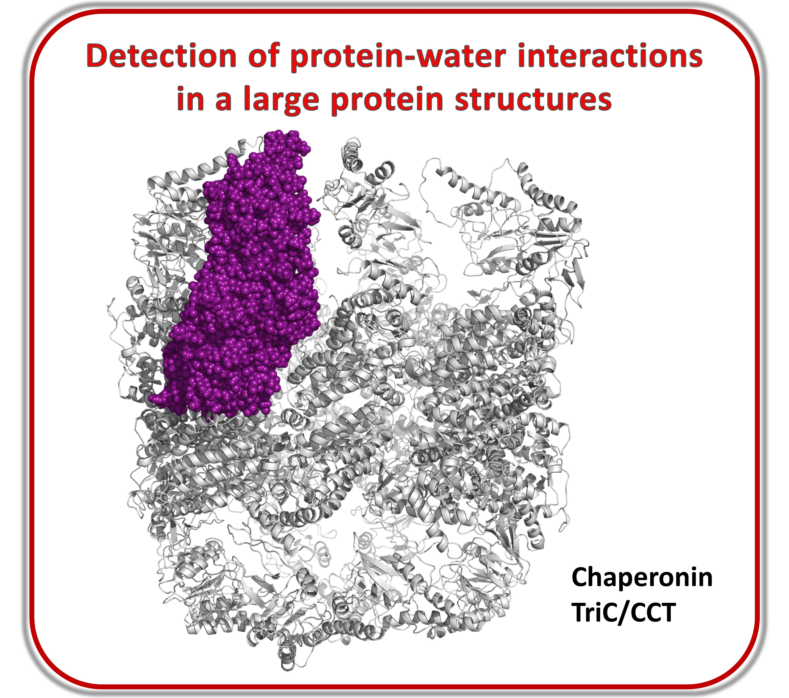
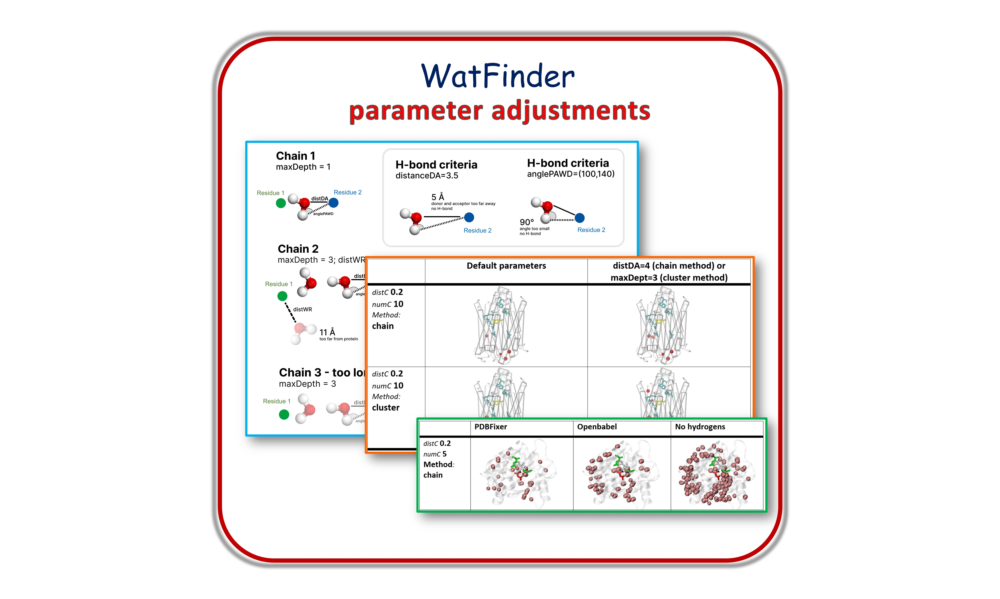

.. _watfinder_additional:

Additional examples of WatFinder utility
===============================================================================

.. _caseStudy1: ../watfinder_tutorial/ipynb_file/caseStudy1.ipynb
.. _caseStudy2: ../watfinder_tutorial/ipynb_file/caseStudy2.ipynb
.. _caseStudy3: ../watfinder_tutorial/ipynb_file/caseStudy3.ipynb
.. _caseStudy4a: ../watfinder_tutorial/ipynb_file/caseStudy4a.ipynb
.. _caseStudy4b: ../watfinder_tutorial/ipynb_file/caseStudy4b.ipynb
.. _caseStudy5: ../watfinder_tutorial/ipynb_file/caseStudy5.ipynb
.. _caseStudy6: ../watfinder_tutorial/ipynb_file/caseStudy6.ipynb

.. |_caseStudy6_tab1_1| raw:: html 

   <a class="reference external" href='../watfinder_tutorial/ipynb_file/caseStudy6_tab1_1.ipynb' download="watfinder_tab1_1.ipynb">watfinder_tab1_1</a>
.. |_caseStudy6_tab1_2| raw:: html 

   <a class="reference external" href='../watfinder_tutorial/ipynb_file/caseStudy6_tab1_2.ipynb' download="watfinder_tab1_2.ipynb">watfinder_tab1_2</a>
.. |_caseStudy6_tab1_3| raw:: html 
  
   <a class="reference external" href='../watfinder_tutorial/ipynb_file/caseStudy6_tab1_3.ipynb' download="watfinder_tab1_3.ipynb">watfinder_tab1_3</a>
.. |_caseStudy6_tab1_4| raw:: html 

   <a class="reference external" href='../watfinder_tutorial/ipynb_file/caseStudy6_tab1_4.ipynb' download="watfinder_tab1_4.ipynb">watfinder_tab1_4</a>
.. |_caseStudy6_tab1_5| raw:: html 
 
   <a class="reference external" href='../watfinder_tutorial/ipynb_file/caseStudy6_tab1_5.ipynb' download="watfinder_tab1_5.ipynb">watfinder_tab1_5</a>
.. |_caseStudy6_tab2_1| raw:: html 

   <a class="reference external" href='../watfinder_tutorial/ipynb_file/caseStudy6_tab2_1.ipynb' download="watfinder_tab2_1.ipynb">watfinder_tab2_1</a>
.. |_caseStudy6_tab2_2| raw:: html 

   <a class="reference external" href='../watfinder_tutorial/ipynb_file/caseStudy6_tab2_2.ipynb' download="watfinder_tab2_2.ipynb">watfinder_tab2_2</a>
.. |_caseStudy6_tab2_3| raw:: html 

   <a class="reference external" href='../watfinder_tutorial/ipynb_file/caseStudy6_tab2_3.ipynb' download="watfinder_tab2_3.ipynb">watfinder_tab2_3</a>
.. |_caseStudy6_tab2_4| raw:: html 

   <a class="reference external" href='../watfinder_tutorial/ipynb_file/caseStudy6_tab2_4.ipynb' download="watfinder_tab2_4.ipynb">watfinder_tab2_4</a>

.. |_caseStudy11| raw:: html 

   <a class="reference external" href='../watfinder_tutorial/ipynb_file/caseStudy1.ipynb' download="caseStudy1.ipynb">caseStudy1</a>

.. |_caseStudy12| raw:: html 

   <a class="reference external" href='../watfinder_tutorial/ipynb_file/caseStudy2.ipynb' download="caseStudy2.ipynb">caseStudy2</a>

.. |_caseStudy13| raw:: html 

   <a class="reference external" href='../watfinder_tutorial/ipynb_file/caseStudy3.ipynb' download="caseStudy3.ipynb">caseStudy3</a>

.. |_caseStudy14a| raw:: html 

   <a class="reference external" href='../watfinder_tutorial/ipynb_file/caseStudy4a.ipynb' download="caseStudy4a.ipynb">caseStudy4a</a>

.. |_caseStudy14b| raw:: html 

   <a class="reference external" href='../watfinder_tutorial/ipynb_file/caseStudy4b.ipynb' download="caseStudy4b.ipynb">caseStudy4b</a>

.. |_caseStudy15| raw:: html 

   <a class="reference external" href='../watfinder_tutorial/ipynb_file/caseStudy5.ipynb' download="caseStudy5.ipynb">caseStudy5</a>
   
.. |_caseStudy16| raw:: html 

   <a class="reference external" href='../watfinder_tutorial/ipynb_file/caseStudy6.ipynb' download="caseStudy6.ipynb">caseStudy6</a>

.. |_caseStudyfiles| raw:: html 

   <a href="http://bahar.labs.stonybrook.edu/watFinder_tutorial_files/" target="_blank">here</a>

Here, we present several more case studies on how to use WatFinder.

The files needed for these case studies can be found here: |_caseStudyfiles|

Case study 1
-------------------------------------------------------------------------------

Detection and quantification of the formation of inter-residue water
bridges as adenylate kinase transitions from the closed to open state

IPython notebook (ipynb): |_caseStudy11| 

Case study 2
-------------------------------------------------------------------------------

Identification of water influx and clusters into the vesicular monoamine
transporter VMAT2

IPython notebook (ipynb): |_caseStudy12|

Case study 3
-------------------------------------------------------------------------------

Identification of key protein-water interactions observed across various
Aurora kinase A crystal structures identified by BLAST

IPython notebook (ipynb): |_caseStudy13|

Case study 4
-------------------------------------------------------------------------------

Derection of protein-water interactions that facilitate ligand binding

IPython notebooks (ipynb): |_caseStudy14a| (protein only) and |_caseStudy14b| (protein+ligand)

Case study 5
-------------------------------------------------------------------------------

Water bridges detection in a large chaperonin TRiC/CCT structure
including timing for selected regions

IPython notebook (ipynb): |_caseStudy15|

Example 6: WatFinder Parameter Adjustments
-------------------------------------------------------------------------------

  
   
IPython notebook (ipynb): |_caseStudy6_tab1_1|

IPython notebook (ipynb): |_caseStudy6_tab1_2|

IPython notebook (ipynb): |_caseStudy6_tab1_3|

IPython notebook (ipynb): |_caseStudy6_tab1_4|

IPython notebook (ipynb): |_caseStudy6_tab1_5|

IPython notebook (ipynb): |_caseStudy6_tab2_1|

IPython notebook (ipynb): |_caseStudy6_tab2_2|

IPython notebook (ipynb): |_caseStudy6_tab2_3|

IPython notebook (ipynb): |_caseStudy6_tab2_4|

The description of all cases are available in the supplementary file of the WatFinder paper
[JK24]_. Trajectories are in the |_caseStudyfiles|.
