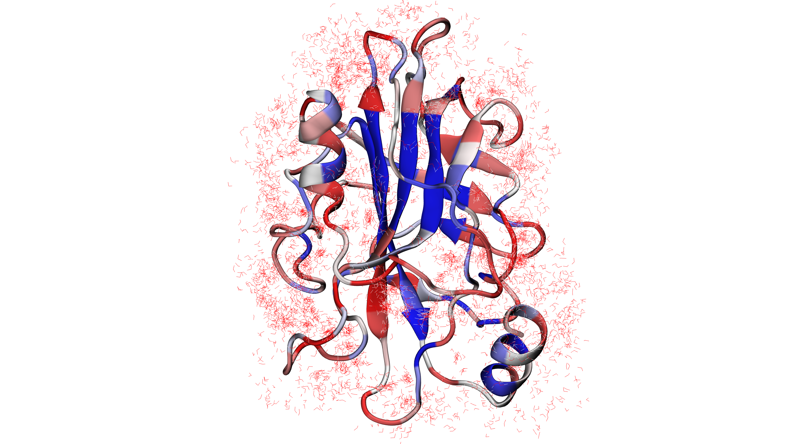
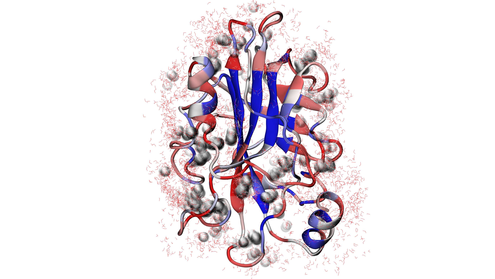

.. _watfinder_tutorial:

Water bridges detection in an Ensemble PDB
===============================================================================

This time we will use an ensemble stored in a multi-model PDB, which contains 50 frames 
from MD simulations from PE-binding protein 1 (PDB: *1BEH*). Simulations were
performed using NAMD_ and saved as a multi-model PDB using VMD_. 

We need to remember to align the protein structure before performing the analysis. 
Otherwise, when all structures are uploaded to the visualization program, they will 
be spread out in space. We could do this inside ProDy by converting the :class:`.Atomic` 
object to an :class:`.Ensemble` object and using its :meth:`.Ensemble.iterpose` method to do this,
but here we demonstrate the process for parsing a multi-model PDB file directly.

Initial analysis
-------------------------------------------------------------------------------

.. ipython:: python
   :verbatim:

   ens = 'pebp1_50frames.pdb'
   coords_ens = parsePDB(ens)
   bridgeFrames_ens = calcWaterBridgesTrajectory(coords_ens, coords_ens)

.. parsed-literal::

   @> 20195 atoms and 51 coordinate set(s) were parsed in 1.88s.
   @> Frame: 0
   @> 161 water bridges detected.
   @> Frame: 1
   @> 127 water bridges detected.
   @> Frame: 2
   @> 168 water bridges detected.
   @> Frame: 3
   @> 132 water bridges detected.
   @> Frame: 4
   @> 142 water bridges detected.
   @> Frame: 5
   @> 166 water bridges detected.
   @> Frame: 6
   @> 150 water bridges detected.
   @> Frame: 7
   @> 159 water bridges detected.
   @> Frame: 8
   @> 147 water bridges detected.
   @> Frame: 9
   @> 136 water bridges detected.
   @> Frame: 10
   @> 127 water bridges detected.
   @> Frame: 11
   @> 135 water bridges detected.
   @> Frame: 12
   @> 162 water bridges detected.
   @> Frame: 13
   @> 135 water bridges detected.
   @> Frame: 14
   @> 178 water bridges detected.
   @> Frame: 15
   @> 128 water bridges detected.
   @> Frame: 16
   @> 145 water bridges detected.
   ...
   ...

Analysis of the results is similar to that presented in trajectory analysis.
Below are examples showing which residues are most frequently involved in water bridge
formation (:func:`.calcBridgingResiduesHistogram`), details of those interactions
(:func:`.calcWaterBridgesStatistics`), and results saved as a PDB structure for further
visualization (:func:`.savePDBWaterBridgesTrajectory`). Other functions can be explored
in the trajectory analysis.

.. ipython:: python
   :verbatim:

   calcBridgingResiduesHistogram(bridgeFrames_ens)

.. figure:: images/ensemble_hist.png
   :scale: 60 %

.. parsed-literal::

   [('VAL34P', 1),        
    ('VAL177P', 1),
    ('PRO43P', 1),
    ('LEU41P', 2),
    ('MET92P', 2),
    ('VAL164P', 3),
    ('LEU14P', 3),
    ('TYR169P', 3),
    ('PHE154P', 4),
    .
    .
    ('ARG49P', 50),
    ('ASN48P', 50),
    ('ARG141P', 50),
    ('LYS150P', 50),
    ('ARG119P', 51),
    ('LYS80P', 51),
    ('ARG76P', 51),
    ('ARG161P', 51),
    ('ARG129P', 51),
    ('ARG82P', 51),
    ('ARG146P', 51)]

.. ipython:: python
   :verbatim:

   analysisAtomic_ens = calcWaterBridgesStatistics(bridgeFrames_ens, coords_ens)

   for item in analysisAtomic_ens.items():
      print(item)

.. parsed-literal::

   @> RES1           RES2           PERC      DIST_AVG  DIST_STD
   @> VAL3P          HSE26P         19.608    5.581     0.696
   @> ASP4P          SER6P          13.725    3.817     0.560
   @> SER6P          LYS7P          43.137    4.394     1.114
   @> LYS7P          GLU36P         1.961     6.088     0.000
   @> LYS7P          LEU37P         7.843     6.353     0.433
   @> GLY10P         SER13P         43.137    4.759     0.612
   @> GLY10P         ARG76P         11.765    5.309     0.586
   @> LEU12P         SER13P         45.098    2.767     0.080
   @> SER13P         GLU16P         25.490    4.449     1.133
   @> GLN15P         ASP18P         7.843     3.732     0.174
   @> GLU16P         ARG82P         45.098    4.550     1.086
   @> GLU16P         VAL17P         17.647    3.438     0.952
   @> GLU16P         LYS150P        21.569    5.056     0.929
   @> GLU16P         GLU83P         9.804     5.476     1.138
   @> GLU16P         ALA152P        7.843     7.307     0.450
   @> VAL17P         GLU83P         1.961     7.262     0.000
   @> VAL17P         LYS150P        13.725    6.303     0.572
   @> GLN22P         GLU126P        33.333    6.458     1.216
   @> GLN22P         HSE23P         37.255    4.738     0.669
   @> HSE23P         GLU126P        7.843     7.911     0.239
   @> PRO24P         ASP56P         17.647    5.592     0.910
   @> THR28P         SER52P         43.137    3.970     0.677
   @> THR28P         ILE53P         5.882     5.849     0.027
   @> TYR29P         THR51P         7.843     3.583     0.286
   @> ALA30P         ARG49P         17.647    5.206     0.304
   ...
   ...

.. ipython:: python
   :verbatim:

   savePDBWaterBridgesTrajectory(bridgeFrames_ens, coords_ens, ens[:-4]+'_ens.pdb')

.. parsed-literal::

   @> All 51 coordinate sets are copied to pebp1_50frames Selection 'protein' + pebp1_50frames Selection 'same residue as...6074 4190 14360'.
   @> All 51 coordinate sets are copied to pebp1_50frames Selection 'protein' + pebp1_50frames Selection 'same residue as...9718 17936 7184'.
   @> All 51 coordinate sets are copied to pebp1_50frames Selection 'protein' + pebp1_50frames Selection 'same residue as...947 10043 11756'.
   @> All 51 coordinate sets are copied to pebp1_50frames Selection 'protein' + pebp1_50frames Selection 'same residue as...0099 12848 4175'.
   @> All 51 coordinate sets are copied to pebp1_50frames Selection 'protein' + pebp1_50frames Selection 'same residue as...6031 8645 18008'.
   ..
   ..

Detecting water centers
-------------------------------------------------------------------------------

The previous function generated multiple PDB files in which we can find protein and 
water molecules for each frame that form water bridges with the protein structure. 
Now we can use another function :func:`.findClusterCenters` which will extract 
water centers (they refer to the oxygens from water molecules that are forming 
clusters). We need to provide a file pattern as show below. Now all the PDB files 
with prefix *'pebp1_50frames_ens_'* will be analyzed.

.. ipython:: python
   :verbatim:

   findClusterCenters('pebp1_50frames_ens_*.pdb')

.. parsed-literal::

   @> 3269 atoms and 1 coordinate set(s) were parsed in 0.11s.
   @> 3161 atoms and 1 coordinate set(s) were parsed in 0.05s.
   @> 3173 atoms and 1 coordinate set(s) were parsed in 0.04s.
   @> 3173 atoms and 1 coordinate set(s) were parsed in 0.04s.
   @> 3218 atoms and 1 coordinate set(s) were parsed in 0.04s.
   @> 3251 atoms and 1 coordinate set(s) were parsed in 0.04s.
   @> 3215 atoms and 1 coordinate set(s) were parsed in 0.04s.
   @> 3230 atoms and 1 coordinate set(s) were parsed in 0.03s.
   @> 3230 atoms and 1 coordinate set(s) were parsed in 0.04s.
   @> 3224 atoms and 1 coordinate set(s) were parsed in 0.03s.
   @> 3158 atoms and 1 coordinate set(s) were parsed in 0.03s.
   ..
   ..
   @> Results are saved in clusters_pebp1_50frames_ens_.pdb.

This function generated one PDB file with water centers. We used default values, 
such as *distC* (distance to other molecule) and *numC* (min number of molecules 
in a cluster), but those values could be changed if the molecules are more 
widely distributed or we would like to have more numerous clusters.
Moreover, this function can be applied to different types of molecules by using 
the *selection* parameter. We can provide the whole molecule, and by
default, the center of mass will be used as a reference.

Saved PDB files using :func:`.savePDBWaterBridgesTrajectory` in the previous
step can be upload to VMD_ or other program for visualization:

After uploading a new PDB file with water centers we can see the results as
follows:

