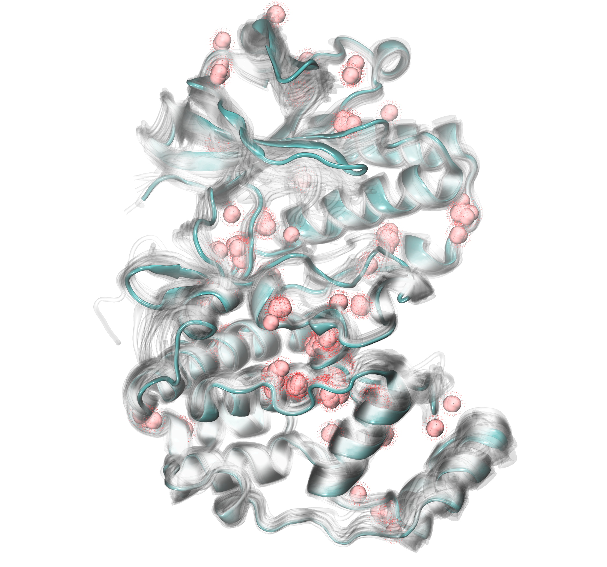
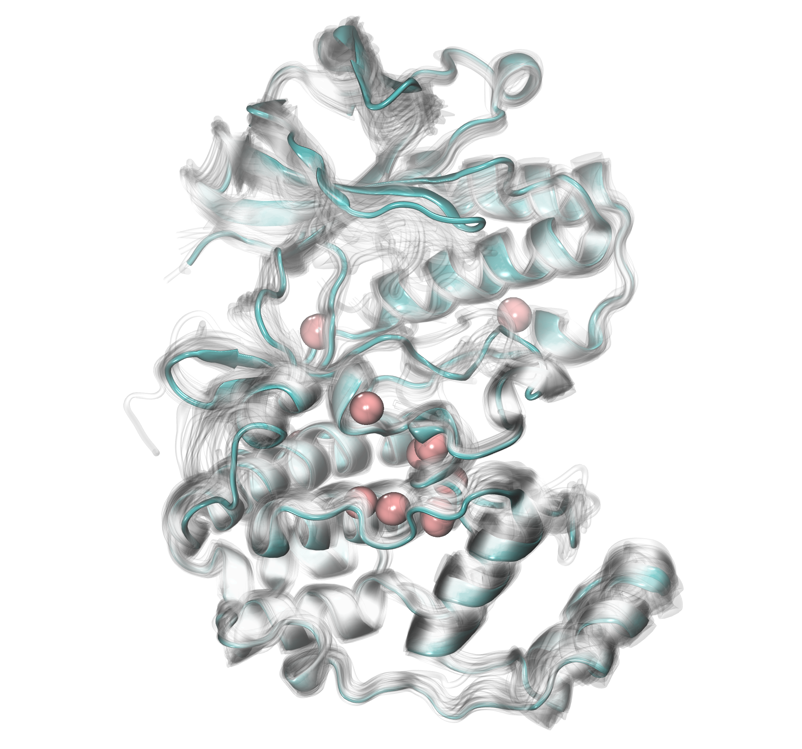
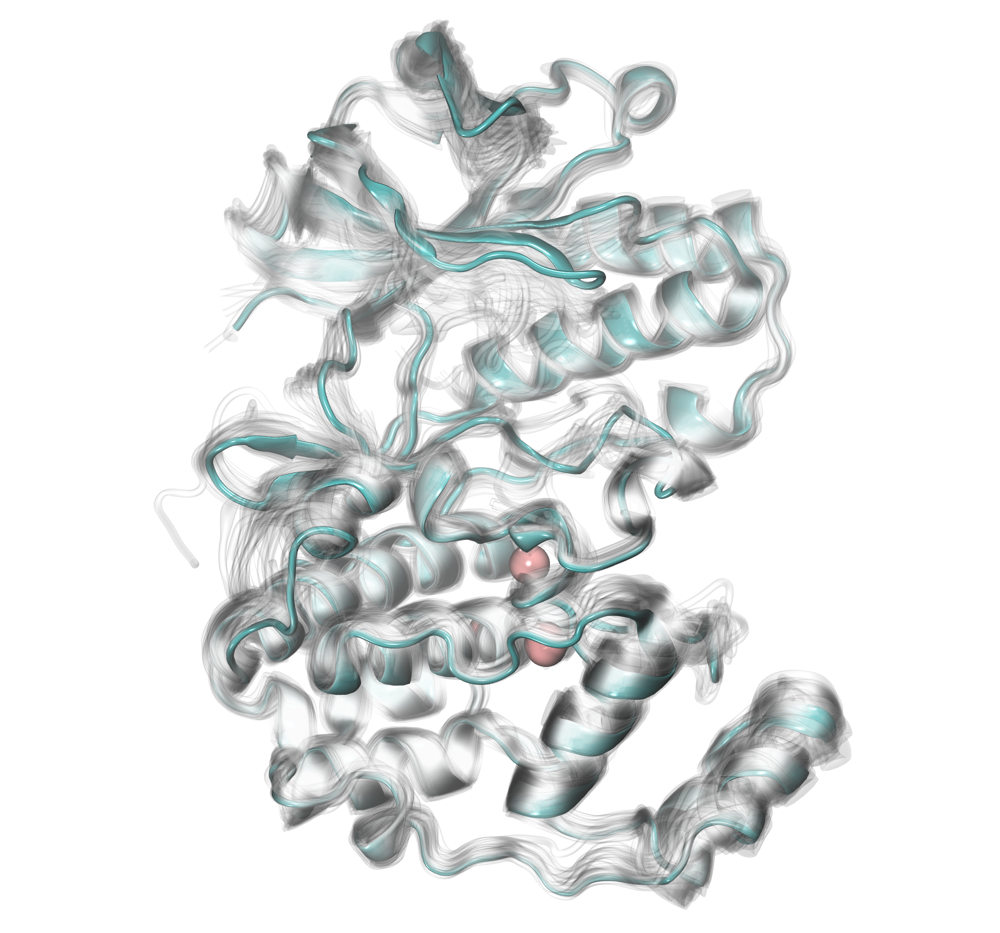

.. _watfinder_tutorial:

Finding significant crystallographic waters across heterogeneous X-ray structures
===============================================================================

Now, we will illustrate how to find significant protein-water interactions
that are observed across different PDB structures. In this example, we will
use 76 heterogeneous PDB structures of p38 MAP kinase (MAPK; analyzed in
:ref:`Ensemble Analysis`), and analyze them with WatFinder to obtain water bridges
present in numerous crystal structures.

Parse multiple PDB structures
-------------------------------------------------------------------------------

First, we need to download all PDB structures that will be used for analysis. We can
do it by providing directly a list with PDB IDs. In this case we are providing
76 structures storage in a list called ``pdbids``.

.. ipython:: python
   :verbatim:

   pdbids = ['5UOJ', '1A9U', '1BL6', '1BL7', '1BMK', '1DI9', '1IAN', '1KV1',
          '1KV2', '1LEW', '1LEZ', '1M7Q', '1OUK', '1OUY', '1OVE', '1OZ1',
          '5UOJ', '1R39', '1R3C', '1W7H', '1W82', '1W83', '1W84', '1WBN',
          '1WBO', '1WBS', '1WBT', '1WBV', '1WBW', '1WFC', '1YQJ', '1YW2',
          '1YWR', '1ZYJ', '1ZZ2', '1ZZL', '2BAJ', '2BAK', '2BAL', '2BAQ',
          '2EWA', '2FSL', '2FSM', '2FSO', '2FST', '2GFS', '2GHL', '2GHM',
          '2GTM', '2GTN', '2I0H', '2NPQ', '2OKR', '2OZA', '3HVC', '3MH0',
          '3MH3', '3MH2', '2PUU', '3MGY', '3MH1', '2QD9', '2RG5', '2RG6',
          '2ZAZ', '2ZB0', '2ZB1', '3BV2', '3BV3', '3BX5', '3C5U', '3L8X',
          '3CTQ', '3D7Z', '3D83', '2ONL']

.. ipython:: python
   :verbatim:

   pdbids

.. parsed-literal::

   ['5UOJ', '1A9U', '1BL6', '1BL7', '1BMK', '1DI9',  '1IAN', '1KV1', 
   '1KV2', '1LEW', '1LEZ', '1M7Q', '1OUK', '1OUY', '1OVE', '1OZ1',
   '5UOJ', '1R39', '1R3C', '1W7H', '1W82', '1W83', '1W84', '1WBN',
   '1WBO', '1WBS', '1WBT', '1WBV', '1WBW', '1WFC', '1YQJ', '1YW2',
   '1YWR', '1ZYJ', '1ZZ2', '1ZZL', '2BAJ', '2BAK', '2BAL', '2BAQ',
   '2EWA', '2FSL', '2FSM', '2FSO', '2FST', '2GFS', '2GHL', '2GHM',
   '2GTM', '2GTN', '2I0H', '2NPQ', '2OKR', '2OZA', '3HVC', '3MH0',
   '3MH3', '3MH2', '2PUU', '3MGY', '3MH1', '2QD9', '2RG5', '2RG6',
   '2ZAZ', '2ZB0', '2ZB1', '3BV2', '3BV3', '3BX5', '3C5U', '3L8X',
   '3CTQ', '3D7Z', '3D83', '2ONL']

Protein preparation
-------------------------------------------------------------------------------

We need to prepare each PDB structure for the analysis with WatFinder. First, we
download each PDB file directly from the Protein Data Bank. 

.. ipython:: python
   :verbatim:

   infiles = fetchPDB(pdbids, compressed=False)

.. parsed-literal::

    @> Connecting wwPDB FTP server RCSB PDB (USA).
    @> 5uoj downloaded (5uoj.pdb)
    @> 1a9u downloaded (1a9u.pdb)
    @> 1bl6 downloaded (1bl6.pdb)
    @> 1bl7 downloaded (1bl7.pdb)
    @> 1bmk downloaded (1bmk.pdb)
    @> 1di9 downloaded (1di9.pdb)
    @> 1ian downloaded (1ian.pdb)
    @> 1kv1 downloaded (1kv1.pdb)
    @> 1kv2 downloaded (1kv2.pdb)
    @> 1lew downloaded (1lew.pdb)
    @> 1lez downloaded (1lez.pdb)
    ..
    ..
    @> 3ctq downloaded (3ctq.pdb)
    @> 3d7z downloaded (3d7z.pdb)
    @> 3d83 downloaded (3d83.pdb)
    @> 2onl downloaded (2onl.pdb)
    @> PDB download via FTP completed (76 downloaded, 0 failed).

Next, we parse all PDB files and exclude those structures that don't contain
water molecules using the :func:`filterStructuresWithoutWater` function. PDB
files need to contain at least ``1`` water molecule. Structures that will be
analyzed are provided using ``filenames``. 

.. ipython:: python
   :verbatim:

   structures = parsePDB(infiles)

.. parsed-literal::

   @> 76 PDBs were parsed in 2.65s. 

.. ipython:: python
   :verbatim:

   new_structures = filterStructuresWithoutWater(structures, 1, filenames=infiles)

.. parsed-literal::

   @> WARNING 2onl doesn't contain water molecules
   @> WARNING 1kv2 doesn't contain water molecules
   @> WARNING 1ian doesn't contain water molecules

We can now check how many structures are left that contain water molecules, and
those will be further taken into analysis with WatFinder.

.. ipython:: python
   :verbatim:

   len(new_structures)

.. parsed-literal::

   73

.. ipython:: python
   :verbatim:

   infiles

.. parsed-literal::

    ['5uoj.pdb',
    '1a9u.pdb',
    '1bl6.pdb',
    '1bl7.pdb',
    '1bmk.pdb',
    '1di9.pdb',
    '1kv1.pdb',
    '1lew.pdb',
    '1lez.pdb',
    '1m7q.pdb',
    '1ouk.pdb',
    ..
    ..
    '3ctq.pdb',
    '3d7z.pdb',
    '3d83.pdb']

Finally, we will add hydrogen atoms, which are typically missing
in the PDB files, using :func:`fixStructuresMissingAtoms` function and
`'pdbfixer'` method. The new files will contain the ``'addH_'`` prefix and
will be stored in ``new_pdbids``.

.. ipython:: python
   :verbatim:

   new_pdbids = fixStructuresMissingAtoms(infiles, method='pdbfixer')

.. parsed-literal::

    @> Hydrogens were added to the structure. New structure is saved as addH_5uoj.pdb.
    @> Hydrogens were added to the structure. New structure is saved as addH_1a9u.pdb.
    @> Hydrogens were added to the structure. New structure is saved as addH_1bl6.pdb.
    @> Hydrogens were added to the structure. New structure is saved as addH_1bl7.pdb.
    @> Hydrogens were added to the structure. New structure is saved as addH_1bmk.pdb.
    @> Hydrogens were added to the structure. New structure is saved as addH_1di9.pdb.
    @> Hydrogens were added to the structure. New structure is saved as addH_1kv1.pdb.
    @> Hydrogens were added to the structure. New structure is saved as addH_1lew.pdb.
    ..
    ..
    @> Hydrogens were added to the structure. New structure is saved as addH_3l8x.pdb.
    @> Hydrogens were added to the structure. New structure is saved as addH_3ctq.pdb.
    @> Hydrogens were added to the structure. New structure is saved as addH_3d7z.pdb.
    @> Hydrogens were added to the structure. New structure is saved as addH_3d83.pdb.

Aligning all PDB heterogeneous structures onto first PDB
-------------------------------------------------------------------------------

In the next step of protein preparation, we need to perform structural
alignment of all PDB structures we will analyze. We will align all PDBs onto
the first PDB structure of our list. Each aligned file is independently
saved in the local directory with ``'align__'`` prefix.

.. ipython:: python
   :verbatim:

   structures = parsePDB(new_pdbids)
   target = structures[0]

   rmsds = []
   for mobile in structures[1:]:
       try:
           i = mobile.getTitle()
           print (i)
           matches = matchChains(mobile.protein, target.protein, subset='bb')
           m = matches[0]
           m0_alg, T = superpose(m[0], m[1], weights=m[0].getFlags("mapped"))
           rmsds.append(calcRMSD(m[0], m[1], weights=m[0].getFlags("mapped")))
           writePDB('align__'+i+'.pdb', mobile)
       except: pass   

   
.. parsed-literal::

    @> 73 PDBs were parsed in 4.79s.        
    @> Checking AtomGroup addH_1a9u: 1 chains are identified
    @> Checking AtomGroup addH_5uoj: 1 chains are identified
    @> Trying to match chains based on residue numbers and names:
    @>   Comparing Chain A from addH_1a9u (len=351) and Chain A from addH_5uoj (len=343):
    @> 	Failed to match chains (seqid=5%, overlap=98%).
    @> Trying to match chains based on local sequence alignment:
    @>  Comparing Chain A from addH_1a9u (len=351) and Chain A from addH_5uoj (len=343):
    @> 	Match: 343 residues match with 99% sequence identity and 98% overlap.

    addH_1a9u

    @> Checking AtomGroup addH_1bl6: 1 chains are identified
    @> Checking AtomGroup addH_5uoj: 1 chains are identified
    @> Trying to match chains based on residue numbers and names:
    @>   Comparing Chain A from addH_1bl6 (len=351) and Chain A from addH_5uoj (len=343):
    @> 	Failed to match chains (seqid=5%, overlap=98%).
    @> Trying to match chains based on local sequence alignment:
    @>  Comparing Chain A from addH_1bl6 (len=351) and Chain A from addH_5uoj (len=343):
    @> 	Match: 343 residues match with 99% sequence identity and 98% overlap.

    addH_1bl6

    @> Checking AtomGroup addH_1bl7: 1 chains are identified
    @> Checking AtomGroup addH_5uoj: 1 chains are identified
    @> Trying to match chains based on residue numbers and names:
    @>   Comparing Chain A from addH_1bl7 (len=351) and Chain A from addH_5uoj (len=343):
    @> 	Failed to match chains (seqid=5%, overlap=98%).
    @> Trying to match chains based on local sequence alignment:
    @>  Comparing Chain A from addH_1bl7 (len=351) and Chain A from addH_5uoj (len=343):
    @> 	Match: 343 residues match with 99% sequence identity and 98% overlap.

    addH_1bl7

    @> Checking AtomGroup addH_1bmk: 1 chains are identified
    @> Checking AtomGroup addH_5uoj: 1 chains are identified
    @> Trying to match chains based on residue numbers and names:
    @>   Comparing Chain A from addH_1bmk (len=351) and Chain A from addH_5uoj (len=343):
    @> 	Failed to match chains (seqid=5%, overlap=98%).
    @> Trying to match chains based on local sequence alignment:
    @>  Comparing Chain A from addH_1bmk (len=351) and Chain A from addH_5uoj (len=343):
    @> 	Match: 343 residues match with 100% sequence identity and 98% overlap.

    ..
    ..

    addH_3c5u

    @> Checking AtomGroup addH_3l8x: 1 chains are identified
    @> Checking AtomGroup addH_5uoj: 1 chains are identified
    @> Trying to match chains based on residue numbers and names:
    @>   Comparing Chain A from addH_3l8x (len=326) and Chain A from addH_5uoj (len=343):
    @> 	Failed to match chains (seqid=5%, overlap=95%).
    @> Trying to match chains based on local sequence alignment:
    @>  Comparing Chain A from addH_3l8x (len=326) and Chain A from addH_5uoj (len=343):
    @> 	Match: 325 residues match with 99% sequence identity and 95% overlap.

    addH_3l8x

    @> Checking AtomGroup addH_3ctq: 1 chains are identified
    @> Checking AtomGroup addH_5uoj: 1 chains are identified
    @> Trying to match chains based on residue numbers and names:
    @>   Comparing Chain A from addH_3ctq (len=336) and Chain A from addH_5uoj (len=343):
    @> 	Failed to match chains (seqid=53%, overlap=98%).
    @> Trying to match chains based on local sequence alignment:
    @>  Comparing Chain A from addH_3ctq (len=336) and Chain A from addH_5uoj (len=343):
    @> 	Match: 336 residues match with 99% sequence identity and 98% overlap.

    addH_3ctq

    @> Checking AtomGroup addH_3d7z: 1 chains are identified
    @> Checking AtomGroup addH_5uoj: 1 chains are identified
    @> Trying to match chains based on residue numbers and names:
    @>   Comparing Chain A from addH_3d7z (len=349) and Chain A from addH_5uoj (len=343):
    @> 	Failed to match chains (seqid=5%, overlap=98%).
    @> Trying to match chains based on local sequence alignment:
    @>  Comparing Chain A from addH_3d7z (len=349) and Chain A from addH_5uoj (len=343):
    @> 	Match: 342 residues match with 99% sequence identity and 98% overlap.

    addH_3d7z

    @> Checking AtomGroup addH_3d83: 1 chains are identified
    @> Checking AtomGroup addH_5uoj: 1 chains are identified
    @> Trying to match chains based on residue numbers and names:
    @>   Comparing Chain A from addH_3d83 (len=349) and Chain A from addH_5uoj (len=343):
    @> 	Failed to match chains (seqid=5%, overlap=98%).
    @> Trying to match chains based on local sequence alignment:
    @>  Comparing Chain A from addH_3d83 (len=349) and Chain A from addH_5uoj (len=343):
    @> 	Match: 342 residues match with 99% sequence identity and 98% overlap.

    addH_3d83

To see how different the protein structures are we will also compute ``RMSD`` (Root
Mean Square Deviation) values:  

.. ipython:: python
   :verbatim:
   
   rmsds

   
.. parsed-literal::   
   
    [3.5502773224903406,
    3.5518560313809213,
    3.531791159385768,
    3.536308595458991,
    3.5883843009524425,
    1.3508050136935905,
    4.024771814068961,
    3.6180331783111113,
    3.6451321851562795,
    3.6225864041371074,
    3.7010843221966856,
    0.7266335022815086,
    1.2192209064105432e-14,
    3.6814519776524275,
    ..
    ..
    1.3153012774723138,
    1.7110265263755273,
    1.3953681417287447,
    4.01269231318287,
    4.071641705884,
    3.5869450244694794,
    3.5599082354788183,
    3.7815283489614484,
    2.190815934106486,
    1.9023911636752533,
    2.184819914027742,
    3.944364439138517,
    4.082500149787881,
    1.9054336876325983,
    3.7413357286577353,
    3.680180759491109]

 
Analyzing PDB structures with certain pattern
-------------------------------------------------------------------------------

When protein structures are prepared, i.e., hydrogens are added, protein
structures that lack water molecules are eliminated, and they are all aligned,
we can finally start the analysis with WatFinder. To do it, we will use the
prefix name ``namePrefix`` to select the PDB structure for the analysis. We
are using the current directory to find those files.

The code below will analyze all found PDB structures with ``'align__'``
prefix in the current directory and analyze them using :func:`calcWaterBridges`
function. Structures that are not protein structures or water molecules will
be ignored. The analyzed structure will be saved using
:func:`savePDBWaterBridges` function with ``'wb_'`` prefix in the same directory.

.. ipython:: python
   :verbatim:

   import os
   namePrefix = 'align__'
   directory = os.getcwd()
   align_files = [file for file in os.listdir(directory) if file.startswith(namePrefix)]

   for file in align_files:
       print (file)
       try:
           atoms = parsePDB(file)
           waterBridges = calcWaterBridges(atoms)
           savePDBWaterBridges(waterBridges, atoms, 'wb_'+file)
       except:
           print("This protein doesn't contain water bridges")

        
.. parsed-literal::

    @> 7359 atoms and 1 coordinate set(s) were parsed in 0.07s.

    align__addH_1wbn.pdb

    @> 59 water bridges detected using method chain.
    @> PHE5 N_69 A ARG91 NH2_1506 A 6.573956038794295 1 ['B_5724']
    @> GLU19 N_323 A ARG20 N_338 A 2.748689869737945 1 ['B_5829']
    @> LYS51 NZ_809 A ASP98 OD1_1613 A 4.4370056344341045 1 ['B_6345']
    @> ARG54 N_843 A ASP98 OD1_1613 A 5.677863770820855 1 ['B_6048']
    @> ILE59 N_929 A ILE60 N_948 A 2.840243123396305 1 ['B_6069']
    @> LYS63 NZ_1012 A TRP334 NE1_5377 A 5.914715715907233 2 ['B_7260', 'B_7287']
    @> LYS63 NZ_1012 A LEU329 N_5280 A 6.702891465628844 2 ['B_7260', 'B_7287']
    @> MET75 O_1239 A LEU83 N_1361 A 4.862355190645785 1 ['B_6135']
    @> MET75 O_1239 A GLY82 N_1354 A 4.490536938941713 1 ['B_6162']
    @> MET75 O_1239 A ILE81 O_1340 A 3.76368888193485 1 ['B_6162']
    @> MET75 O_1239 A HIS77 N_1273 A 4.194540380065494 1 ['B_6162']
    @> HIS77 N_1273 A GLY82 N_1354 A 6.3842001065129494 1 ['B_6162']
    @> HIS77 N_1273 A ILE81 O_1340 A 5.919256794564666 1 ['B_6162']
    @> ILE81 O_1340 A GLY82 N_1354 A 2.259809283988364 1 ['B_6162']
    @> GLY82 N_1354 A LYS162 NZ_2660 A 5.02103296145325 1 ['B_6624']
    @> GLY82 N_1354 A HIS104 ND1_1711 A 5.9096712260497215 1 ['B_6624']
    @> GLU94 O_1544 A LYS335 NZ_5406 A 5.4192233760936634 1 ['B_6336']
    @> GLU95 O_1559 A ASN97 N_1589 A 3.2168667986101007 1 ['B_6348']
    @> HIS104 ND1_1711 A LYS162 NZ_2660 A 5.082646357951735 1 ['B_6624']
    @> GLY107 N_1754 A ALA108 N_1761 A 3.190471281801484 1 ['B_6402']
    @> ALA108 N_1761 A VAL155 O_2545 A 4.347411183681612 1 ['B_6420']
    @> ASP109 N_1771 A ASP109 OD2_1782 A 3.906022145354529 1 ['B_6444']
    @> LYS118 NZ_1933 A THR215 O_3508 A 5.582298899199147 1 ['B_6492']
    @> LYS118 NZ_1933 A LEU213 O_3470 A 5.187238186164194 1 ['B_6504']
    @> TYR129 OH_2121 A ASP313 O_5049 A 4.453922989904518 1 ['B_6537']
    @> ARG133 O_2183 A PRO315 N_5071 A 6.180698423317547 1 ['B_7170']
    @> ARG133 O_2183 A GLU314 O_5061 A 5.992423883538281 1 ['B_7170']
    @> LYS136 NZ_2246 A PRO311 O_5022 A 5.667678978206158 1 ['B_7149']
    @> SER140 O_2312 A ALA317 O_5106 A 4.792094531621847 1 ['B_7179']
    @> ARG146 O_2400 A ARG186 NE_3047 A 4.181967240426447 1 ['B_6573']
    @> ARG183 NH1_2981 A HIS225 N_3648 A 4.030232127309791 1 ['B_6666']
    @> TRP184 O_2992 A LEU219 N_3562 A 6.271808750272923 1 ['B_6801']
    @> TRP184 O_2992 A PHE220 N_3581 A 4.859018933900133 1 ['B_6801']
    @> TYR185 N_3011 A ARG186 N_3032 A 2.704904619390487 1 ['B_6687']
    @> ARG186 O_3037 A TRP204 NE1_3348 A 3.5636415364062675 1 ['B_6690']
    @> GLU189 OE2_3094 A SER290 OG_4704 A 4.031646065814807 1 ['B_6732']
    @> GLU189 OE2_3094 A ASN198 N_3243 A 5.818566919783599 1 ['B_6732']
    @> ASN198 N_3243 A SER290 OG_4704 A 5.702313653246375 1 ['B_6732']
    @> VAL201 O_3293 A SER205 OG_3368 A 3.4239025979136706 1 ['B_6699']
    @> LEU219 N_3562 A PHE220 N_3581 A 2.904216589719166 1 ['B_6801']
    @> THR223 O_3627 A ASP224 OD2_3647 A 3.765190433430952 2 ['B_6810', 'B_6804']
    @> ARG234 NE_3826 A MET265 SD_4317 A 4.2630924221743065 1 ['B_6840']
    @> THR238 O_3882 A MET262 O_4257 A 4.170953008606065 1 ['B_6966']
    @> GLY240 N_3905 A LEU243 N_3937 A 4.966423864311221 1 ['B_6879']
    @> VAL270 O_4385 A ILE272 N_4416 A 3.2146626572628105 1 ['B_6993']
    @> LEU288 N_4664 A ASP289 N_4683 A 2.8610966428976172 1 ['B_7059']
    @> SER290 N_4695 A SER290 OG_4704 A 2.9945961330369735 1 ['B_7068']
    @> ASP291 O_4711 A ARG293 O_4745 A 4.600850356184167 1 ['B_7086']
    @> ALA306 N_4941 A GLN307 N_4951 A 2.858702852693857 1 ['B_7131']
    @> ALA306 N_4941 A GLN307 NE2_4965 A 5.641271310617846 1 ['B_7131']
    @> ALA306 O_4946 A GLN307 O_4956 A 3.778994178349576 1 ['B_7146']
    @> GLN307 N_4951 A GLN307 NE2_4965 A 3.8062708784320645 1 ['B_7131']
    @> GLU314 N_5056 A GLU314 O_5061 A 3.3455619856759498 1 ['B_7152']
    @> GLU314 O_5061 A PRO315 N_5071 A 2.248233306398604 1 ['B_7170']
    @> SER323 OG_5196 A ARG327 NH2_5265 A 4.567763238172486 1 ['B_7248']
    @> SER323 OG_5196 A ARG327 NH1_5262 A 4.2918016030566895 1 ['B_7248']
    @> ARG327 NH1_5262 A ARG327 NH2_5265 A 2.2885257263137766 1 ['B_7248']
    @> LEU329 N_5280 A TRP334 NE1_5377 A 3.839466890077318 1 ['B_7287']
    @> ASP340 OD1_5485 A ASP340 OD2_5486 A 2.1913256261906864 1 ['B_7293']
    @> 5896 atoms and 1 coordinate set(s) were parsed in 0.05s.
    @> 23 water bridges detected using method chain.
    @> GLU19 OE2_337 A ARG20 N_338 A 5.878384216772496 2 ['B_5680', 'B_5683']
    @> GLN22 OE1_396 A ASN23 N_400 A 4.279627670720901 1 ['B_5689']
    @> ARG64 NE_1031 A GLU68 OE1_1112 A 5.168174339164652 1 ['B_5698']
    @> LEU72 O_1181 A LEU83 N_1361 A 3.8260938305274212 1 ['B_5707']
    @> HIS77 N_1273 A VAL80 O_1324 A 4.745099893574423 1 ['B_5713']
    @> ALA90 N_1475 A ASP98 N_1603 A 6.407529633173774 1 ['B_5722']
    @> ALA90 N_1475 A ASN97 N_1589 A 6.004686836130592 1 ['B_5722']
    @> ASN97 N_1589 A ASP98 N_1603 A 2.782156717368737 1 ['B_5722']
    @> HIS139 ND1_2300 A ALA296 N_4797 A 5.051173527013304 1 ['B_5746']
    @> LEU148 N_2431 A SER205 OG_3368 A 4.436225084460889 1 ['B_5755']
    @> LEU148 N_2431 A ASP202 OD1_3314 A 4.948488860248146 1 ['B_5755']
    @> TRP184 O_2992 A PHE220 N_3581 A 4.863268242653289 1 ['B_5773']
    @> ALA187 N_3056 A SER205 OG_3368 A 5.024188292649868 1 ['B_5866']
    @> ALA187 N_3056 A VAL201 O_3293 A 4.655099032244106 1 ['B_5866']
    @> ASN198 OD1_3253 A SER290 OG_4704 A 3.8403593581851165 1 ['B_5782']
    @> VAL201 O_3293 A SER205 OG_3368 A 3.1895346055498424 1 ['B_5866']
    @> ASP202 OD1_3314 A SER205 OG_3368 A 4.915096031615251 1 ['B_5755']
    @> TRP204 NE1_3348 A GLN228 NE2_3710 A 6.121850128841768 1 ['B_5776']
    @> CYS208 O_3398 A LEU219 N_3562 A 4.934281203985034 1 ['B_5788']
    @> VAL236 O_3859 A LEU288 N_4664 A 5.696742929077984 1 ['B_5809']
    @> ALA301 O_4868 A HIS302 O_4878 A 3.24225816368777 1 ['B_5833']
    @> GLN322 OE1_5183 A GLU325 OE2_5232 A 4.976302744005838 1 ['B_5836']
    @> ASP328 OD1_5278 A LEU329 N_5280 A 3.8415040023407494 1 ['B_5839']

    align__addH_1bl6.pdb

    @> 6357 atoms and 1 coordinate set(s) were parsed in 0.06s.

    align__addH_2zb1.pdb

    @> 64 water bridges detected using method chain.
    @> ARG2 NE_32 A ALA88 O_1462 A 4.772681217093805 1 ['B_5868']
    @> ARG2 NE_32 A THR86 O_1434 A 5.221993776327199 1 ['B_5868']
    @> ARG2 NH1_35 A PHE5 O_74 A 6.437162262985144 1 ['B_5835']
    @> ARG2 NH1_35 A PHE5 N_69 A 4.8099134087839905 1 ['B_5835']
    @> ARG2 NH1_35 A PRO3 O_45 A 3.668070882630269 1 ['B_6087']
    @> ARG2 NH2_38 A GLU16 OE2_292 A 5.190005105970515 1 ['B_5970']
    @> THR4 N_55 A GLU19 OE1_336 A 4.543989656678368 1 ['B_5769']
    @> PHE5 N_69 A PHE5 O_74 A 2.7251291712504195 1 ['B_5835']
    @> TYR6 OH_108 A ASN23 N_400 A 4.61897456152337 1 ['B_5976']
    @> TYR6 OH_108 A LEU24 N_414 A 5.237830562360719 1 ['B_5976']
    @> GLU19 N_323 A ARG20 N_338 A 2.8113743969809497 1 ['B_5805']
    @> TYR21 OH_381 A ASP38 OD2_608 A 4.634256251007273 1 ['B_5793']
    @> ASN23 N_400 A LEU24 N_414 A 2.911750504421695 1 ['B_5976']
    @> LEU50 N_795 A VAL97 N_1597 A 4.7754868861719215 1 ['B_5694']
    @> LYS61 NZ_994 A ASP324 OD1_5226 A 5.063379701345736 1 ['B_6114']
    @> ARG68 NH1_1133 A ASP317 O_5111 A 3.6191801557811405 1 ['B_5685']
    @> ARG68 NH1_1133 A PHE320 N_5146 A 5.8201812686547845 1 ['B_5685']
    @> LYS71 NZ_1195 A SER340 OG_5494 A 3.351553222015128 1 ['B_5691']
    @> LYS74 O_1238 A TYR135 OH_2251 A 3.3942828403066243 1 ['B_5856']
    @> GLY80 N_1336 A HIS102 N_1683 A 5.906673598566283 1 ['B_5946']
    @> VAL84 O_1398 A THR86 N_1429 A 4.836624959618022 2 ['B_5877', 'B_5898']
    @> THR86 O_1434 A ALA88 O_1462 A 3.76180289223133 1 ['B_5868']
    @> HIS102 ND1_1693 A LEU103 N_1700 A 4.864742028103854 1 ['B_5919']
    @> HIS102 ND1_1693 A LEU103 O_1705 A 5.994732854765089 1 ['B_5919']
    @> LEU103 N_1700 A LEU103 O_1705 A 2.783313313301253 1 ['B_5919']
    @> ASP107 N_1753 A ASN110 OD1_1808 A 6.078192165438666 1 ['B_6234']
    @> ASP107 OD1_1763 A ASN109 ND2_1795 A 4.464301625114504 1 ['B_6063']
    @> ASN109 OD1_1794 A SER149 OG_2477 A 5.7476750952015365 1 ['B_5886']
    @> ASN109 OD1_1794 A SER149 N_2468 A 4.792361943760091 1 ['B_5886']
    @> LYS134 NZ_2228 A GLU310 OE1_5017 A 4.764214940575204 1 ['B_5706']
    @> HIS137 ND1_2282 A ALA292 N_4745 A 5.275386241783629 1 ['B_5667']
    @> ALA139 O_2305 A TYR316 N_5085 A 4.429644342382354 1 ['B_5820']
    @> LEU146 N_2413 A SER201 OG_3316 A 4.344889641866642 1 ['B_5625']
    @> LEU146 N_2413 A ASP198 OD1_3262 A 4.96568384011709 1 ['B_5625']
    @> SER149 N_2468 A SER149 OG_2477 A 2.849899296466454 1 ['B_5886']
    @> GLY174 N_2843 A ARG179 NH1_2929 A 3.6460610252709738 1 ['B_5640']
    @> GLY174 N_2843 A HIS221 N_3596 A 5.748087855974372 1 ['B_5640']
    @> ARG179 NH1_2929 A HIS221 N_3596 A 4.06007031958807 1 ['B_5640']
    @> ALA183 N_3004 A SER201 OG_3316 A 4.966023157416805 1 ['B_5700']
    @> ALA183 N_3004 A VAL197 O_3241 A 4.810734975032401 1 ['B_5700']
    @> GLU185 OE2_3042 A ASN194 N_3191 A 5.811400347592652 1 ['B_5766']
    @> GLU185 OE2_3042 A SER286 OG_4652 A 4.244290989081684 1 ['B_5766']
    @> LEU188 O_3084 A SER245 OG_4006 A 5.444725337425206 1 ['B_5964']
    @> ASN194 N_3191 A SER286 OG_4652 A 5.824057005215518 1 ['B_5766']
    @> VAL197 O_3241 A SER201 OG_3316 A 3.369221423415205 1 ['B_5700']
    @> ASP198 OD1_3262 A SER201 OG_3316 A 5.045291864699207 1 ['B_5625']
    @> TRP200 NE1_3296 A GLN224 NE2_3658 A 6.015626151947945 1 ['B_5619']
    @> ASP220 OD1_3594 A ASP220 OD2_3595 A 2.2032276323612154 1 ['B_5715']
    @> ARG230 NH1_3777 A ARG230 NH2_3780 A 2.300537545879223 1 ['B_6021']
    @> VAL232 O_3807 A GLY233 O_3824 A 3.3189909611205644 1 ['B_6048']
    @> VAL232 O_3807 A GLY236 N_3853 A 7.877346507549355 2 ['B_6048', 'B_5649']
    @> GLY233 O_3824 A GLY236 N_3853 A 6.694337084431885 2 ['B_6048', 'B_5649']
    @> THR234 O_3830 A GLN257 OE1_4196 A 6.429353388949777 1 ['B_5907']
    @> GLY236 N_3853 A LEU239 N_3885 A 4.738406799758755 1 ['B_5772']
    @> LYS260 N_4231 A LYS260 O_4236 A 2.880827138167091 1 ['B_6081']
    @> ASN262 N_4270 A ASN265 ND2_4325 A 5.6168396808169625 2 ['B_6201', 'B_6204']
    @> ASP285 OD1_4641 A SER286 OG_4652 A 4.554287759902752 1 ['B_5742']
    @> PRO307 O_4970 A GLU310 N_5004 A 4.266950198912568 1 ['B_5718']
    @> TYR316 OH_5104 A GLN318 OE1_5131 A 4.835579075974251 1 ['B_5748']
    @> ASP317 O_5111 A PHE320 N_5146 A 5.125772234502817 1 ['B_5685']
    @> LEU325 N_5228 A TRP330 NE1_5325 A 3.5740752650161127 1 ['B_5679']
    @> SER332 O_5363 A SER332 OG_5367 A 3.17139165036424 1 ['B_6015']
    @> SER332 O_5363 A ASP336 OD1_5433 A 3.7261532442990046 1 ['B_6015']
    @> SER332 OG_5367 A ASP336 OD1_5433 A 4.741911534392011 1 ['B_6015']
    @> 5486 atoms and 1 coordinate set(s) were parsed in 0.05s.
    @> 8 water bridges detected using method chain.
    @> GLU87 N_1455 A GLU87 OE2_1469 A 4.688252766223255 1 ['B_5450']
    @> GLU88 O_1475 A ASN90 N_1505 A 3.170165453095468 1 ['B_5423']
    @> LEU141 N_2340 A SER186 OG_3095 A 4.557214170960148 1 ['B_5399']
    @> TRP165 O_2719 A PHE201 N_3308 A 4.851787093432685 1 ['B_5417']
    @> ALA249 N_4079 A GLU264 OE2_4312 A 5.04425475169524 1 ['B_5411']
    @> ALA249 N_4079 A GLU264 OE1_4311 A 5.336986509257824 1 ['B_5411']
    @> GLU264 OE1_4311 A GLU264 OE2_4312 A 2.1973031197356447 1 ['B_5411']
    @> TYR301 O_4865 A GLN303 N_4893 A 3.291610092340829 1 ['B_5426']

    ..
    ..

    align__addH_1ouk.pdb

    @> 5854 atoms and 1 coordinate set(s) were parsed in 0.05s.
    @> 32 water bridges detected using method chain.
    @> TYR6 OH_108 A ASN23 N_400 A 4.615102490736257 1 ['B_5692']
    @> GLU19 N_323 A ARG20 N_338 A 2.7776072436541495 1 ['B_5689']
    @> LEU52 O_818 A VAL99 N_1615 A 5.222420415860832 1 ['B_5701']
    @> LEU52 O_818 A ASP98 OD1_1613 A 4.411748292910645 1 ['B_5701']
    @> GLY82 N_1354 A HIS104 ND1_1711 A 5.5944181109387925 1 ['B_5839']
    @> GLY82 N_1354 A THR103 OG1_1695 A 3.721591326301155 1 ['B_5839']
    @> GLY82 N_1354 A GLY82 O_1360 A 2.760033514289275 1 ['B_5839']
    @> GLY82 O_1360 A HIS104 ND1_1711 A 5.042785044000984 1 ['B_5839']
    @> GLY82 O_1360 A THR103 OG1_1695 A 2.4203406784996195 1 ['B_5839']
    @> GLU95 O_1559 A ASN97 N_1589 A 3.19543080037731 1 ['B_5722']
    @> ASP98 OD1_1613 A VAL99 N_1615 A 4.4735462443122245 1 ['B_5701']
    @> THR103 OG1_1695 A HIS104 ND1_1711 A 4.038137441940282 1 ['B_5839']
    @> TYR137 OH_2269 A ASP318 N_5111 A 5.034224965175872 1 ['B_5743']
    @> HIS139 ND1_2300 A ALA296 N_4797 A 5.180029922693496 1 ['B_5746']
    @> ARG146 O_2400 A SER205 OG_3368 A 5.5475649613141105 1 ['B_5749']
    @> ASP147 N_2419 A LEU148 N_2431 A 2.918157466621704 1 ['B_5752']
    @> ASP147 N_2419 A SER205 OG_3368 A 5.836999657358222 1 ['B_5752']
    @> ASP147 N_2419 A ASP202 OD1_3314 A 4.6087231420427015 1 ['B_5752']
    @> ASP147 OD2_2430 A LYS149 NZ_2468 A 4.241426764663042 1 ['B_5758']
    @> LEU148 N_2431 A SER205 OG_3368 A 4.471605304585819 1 ['B_5752']
    @> LEU148 N_2431 A ASP202 OD1_3314 A 4.979517446500211 1 ['B_5752']
    @> ASP165 N_2702 A ASP165 OD2_2713 A 3.3099394254276047 1 ['B_5764']
    @> TRP184 O_2992 A GLN228 NE2_3710 A 3.6392044460293795 1 ['B_5773']
    @> TRP184 O_2992 A TRP204 NE1_3348 A 5.492021940961269 1 ['B_5773']
    @> TRP184 O_2992 A ARG186 O_3037 A 5.064636907025022 1 ['B_5773']
    @> ARG186 O_3037 A GLN228 NE2_3710 A 4.172959381542071 1 ['B_5773']
    @> ARG186 O_3037 A TRP204 NE1_3348 A 3.614997372059904 1 ['B_5773']
    @> ASP202 OD1_3314 A SER205 OG_3368 A 4.973505604701778 1 ['B_5752']
    @> TRP204 NE1_3348 A GLN228 NE2_3710 A 6.1119838023345565 1 ['B_5773']
    @> CYS208 O_3398 A LEU219 N_3562 A 4.95488466061522 1 ['B_5782']
    @> LEU219 N_3562 A PHE220 N_3581 A 2.9722883440204777 1 ['B_5776']
    @> ALA301 O_4868 A HIS309 ND1_4999 A 4.853743503729881 1 ['B_5824']

    align__addH_1bl7.pdb

    @> 6020 atoms and 1 coordinate set(s) were parsed in 0.05s.

    align__addH_1lez.pdb

    @> 16 water bridges detected using method chain.
    @> ARG2 NH2_38 A PHE5 N_69 A 4.571194592226415 1 ['C_5912']
    @> TYR6 OH_108 A ASN23 N_400 A 4.50858436762583 1 ['C_5969']
    @> GLU19 N_323 A ARG20 N_338 A 2.772673980113782 1 ['C_5762']
    @> SER58 OG_925 A ILE59 N_927 A 3.3482071321828335 1 ['C_5972']
    @> ARG70 NH1_1149 A PHE317 N_5100 A 5.769974090063145 1 ['C_5693']
    @> LYS73 NZ_1211 A SER337 OG_5448 A 3.0176429543602397 1 ['C_5978']
    @> THR88 OG1_1453 A ASP98 N_1601 A 4.317795386536977 1 ['C_5732']
    @> THR88 OG1_1453 A ASN97 N_1587 A 4.64242630528477 1 ['C_5732']
    @> ASN97 N_1587 A ASP98 N_1601 A 2.8289607632485843 1 ['C_5732']
    @> ASP98 OD2_1612 A TYR100 OH_1648 A 5.2055084285783275 1 ['C_5729']
    @> ASP147 N_2416 A LEU148 N_2428 A 2.8996084218390594 1 ['C_5705']
    @> ASP147 N_2416 A ASP195 OD1_3220 A 4.452267849085452 1 ['C_5705']
    @> LEU148 N_2428 A ASP195 OD1_3220 A 4.954386541237979 1 ['C_5705']
    @> TRP177 O_2898 A PHE213 N_3487 A 4.693564210703845 1 ['C_5765']
    @> VAL194 O_3199 A SER198 OG_3274 A 3.5576895592504996 1 ['C_5717']
    @> TRP197 NE1_3254 A GLN221 NE2_3616 A 6.029092883676613 1 ['C_5702']

    
Finding clusters of water within homologous structures
-------------------------------------------------------------------------------    
    
Once the PDB files with selected water bridges are saved, we can start checking
water clustering using :func:`findClusterCenters` function. With this kind of
analysis, we should check the names of oxygens that are forming water molecules.
If the name is different from the default one, we should set a new ``selection``
parameter. In this case we will use the following selection: ``'resname HOH and name O'``. 
We will use default criteria of ``distC`` and ``numC``, which are set to 0.3 and 3,
respectively.

.. ipython:: python
   :verbatim:

   findClusterCenters('wb_*.pdb', selection = 'resname HOH and name O')

.. parsed-literal::

    @> 5730 atoms and 1 coordinate set(s) were parsed in 0.05s.
    @> 5712 atoms and 1 coordinate set(s) were parsed in 0.06s.
    @> 5703 atoms and 1 coordinate set(s) were parsed in 0.06s.
    @> 5724 atoms and 1 coordinate set(s) were parsed in 0.06s.
    @> 5661 atoms and 1 coordinate set(s) were parsed in 0.05s.
    @> 5381 atoms and 1 coordinate set(s) were parsed in 0.05s.
    @> 5726 atoms and 1 coordinate set(s) were parsed in 0.05s.
    @> 5655 atoms and 1 coordinate set(s) were parsed in 0.05s.
    @> 5700 atoms and 1 coordinate set(s) were parsed in 0.06s.
    @> 5688 atoms and 1 coordinate set(s) were parsed in 0.05s.
    @> 5762 atoms and 1 coordinate set(s) were parsed in 0.05s.
    @> 5645 atoms and 1 coordinate set(s) were parsed in 0.05s.
    @> 5622 atoms and 1 coordinate set(s) were parsed in 0.06s.
    @> 5735 atoms and 1 coordinate set(s) were parsed in 0.05s.
    @> 5780 atoms and 1 coordinate set(s) were parsed in 0.05s.
    ..
    ..
    @> 5470 atoms and 1 coordinate set(s) were parsed in 0.06s.
    @> 5773 atoms and 1 coordinate set(s) were parsed in 0.05s.
    @> 5781 atoms and 1 coordinate set(s) were parsed in 0.05s.
    @> 5399 atoms and 1 coordinate set(s) were parsed in 0.05s.
    @> 5311 atoms and 1 coordinate set(s) were parsed in 0.05s.
    @> 5408 atoms and 1 coordinate set(s) were parsed in 0.05s.
    @> 5419 atoms and 1 coordinate set(s) were parsed in 0.05s.
    @> 5475 atoms and 1 coordinate set(s) were parsed in 0.05s.
    @> 5398 atoms and 1 coordinate set(s) were parsed in 0.05s.
    @> 5462 atoms and 1 coordinate set(s) were parsed in 0.05s.
    @> 5657 atoms and 1 coordinate set(s) were parsed in 0.05s.
    @> Results are saved in clusters_wb_.pdb.

The function will create a file called ``clusters_wb_.pdb`` which will
contain water clusters. We can upload this file to any graphical
visualization program (in this tutorial we used VMD_) and display water clusters.
Additionally, we should upload the protein structure we analyzed to see
where water clusters are localized with respect to the protein structure. 

If we would like to use more restricted criteria to see more conserved
water molecules across different protein structures, we can change the
default parameters for ``distC`` and ``numC``. In the example below, we
will use ``distC=0.2`` and ``numC=5``. It means that we are looking for at
least 5 water molecules among our set of data that are localized with 0.2
Angstrom from each other.
    
    
.. ipython:: python
   :verbatim:
   
    findClusterCenters('wb_*.pdb', selection = 'resname HOH and name O', 
							distC=0.2, numC=5)
    
    
.. parsed-literal::

    @> 5730 atoms and 1 coordinate set(s) were parsed in 0.05s.
    @> 5712 atoms and 1 coordinate set(s) were parsed in 0.06s.
    @> 5703 atoms and 1 coordinate set(s) were parsed in 0.06s.
    @> 5724 atoms and 1 coordinate set(s) were parsed in 0.06s.
    @> 5661 atoms and 1 coordinate set(s) were parsed in 0.05s.
    @> 5381 atoms and 1 coordinate set(s) were parsed in 0.05s.
    @> 5726 atoms and 1 coordinate set(s) were parsed in 0.05s.
    @> 5655 atoms and 1 coordinate set(s) were parsed in 0.05s.
    @> 5700 atoms and 1 coordinate set(s) were parsed in 0.06s.
    @> 5688 atoms and 1 coordinate set(s) were parsed in 0.05s.
    @> 5762 atoms and 1 coordinate set(s) were parsed in 0.05s.
    @> 5645 atoms and 1 coordinate set(s) were parsed in 0.05s.
    @> 5622 atoms and 1 coordinate set(s) were parsed in 0.06s.
    @> 5735 atoms and 1 coordinate set(s) were parsed in 0.05s.
    @> 5780 atoms and 1 coordinate set(s) were parsed in 0.05s.
    ..
    ..
    @> 5470 atoms and 1 coordinate set(s) were parsed in 0.06s.
    @> 5773 atoms and 1 coordinate set(s) were parsed in 0.05s.
    @> 5781 atoms and 1 coordinate set(s) were parsed in 0.05s.
    @> 5399 atoms and 1 coordinate set(s) were parsed in 0.05s.
    @> 5311 atoms and 1 coordinate set(s) were parsed in 0.05s.
    @> 5408 atoms and 1 coordinate set(s) were parsed in 0.05s.
    @> 5419 atoms and 1 coordinate set(s) were parsed in 0.05s.
    @> 5475 atoms and 1 coordinate set(s) were parsed in 0.05s.
    @> 5398 atoms and 1 coordinate set(s) were parsed in 0.05s.
    @> 5462 atoms and 1 coordinate set(s) were parsed in 0.05s.
    @> 5657 atoms and 1 coordinate set(s) were parsed in 0.05s.
    @> Results are saved in clusters_wb_.pdb.

After displaying new results in the visualization program, we can see a
smaller number of water clusters and only those that were more preoccupied
if we compare it with the previous figure.

    
We can increase the number of molecules ``numC`` to 10 to see which places are
occupied more often by water bridges. Now, we will see only two:
the most significantly preoccupied water positions across the heterogeneous
structures of p38 MAP kinase.

.. ipython:: python
   :verbatim:
   
    findClusterCenters('wb_*.pdb', selection = 'resname HOH and name O', 
							distC=0.2, numC=10)    
    
    
.. parsed-literal::

    @> 5730 atoms and 1 coordinate set(s) were parsed in 0.05s.
    @> 5712 atoms and 1 coordinate set(s) were parsed in 0.06s.
    @> 5703 atoms and 1 coordinate set(s) were parsed in 0.06s.
    @> 5724 atoms and 1 coordinate set(s) were parsed in 0.06s.
    @> 5661 atoms and 1 coordinate set(s) were parsed in 0.05s.
    @> 5381 atoms and 1 coordinate set(s) were parsed in 0.05s.
    @> 5726 atoms and 1 coordinate set(s) were parsed in 0.05s.
    @> 5655 atoms and 1 coordinate set(s) were parsed in 0.05s.
    @> 5700 atoms and 1 coordinate set(s) were parsed in 0.06s.
    @> 5688 atoms and 1 coordinate set(s) were parsed in 0.05s.
    @> 5762 atoms and 1 coordinate set(s) were parsed in 0.05s.
    @> 5645 atoms and 1 coordinate set(s) were parsed in 0.05s.
    @> 5622 atoms and 1 coordinate set(s) were parsed in 0.06s.
    @> 5735 atoms and 1 coordinate set(s) were parsed in 0.05s.
    @> 5780 atoms and 1 coordinate set(s) were parsed in 0.05s.
    ..
    ..
    @> 5470 atoms and 1 coordinate set(s) were parsed in 0.06s.
    @> 5773 atoms and 1 coordinate set(s) were parsed in 0.05s.
    @> 5781 atoms and 1 coordinate set(s) were parsed in 0.05s.
    @> 5399 atoms and 1 coordinate set(s) were parsed in 0.05s.
    @> 5311 atoms and 1 coordinate set(s) were parsed in 0.05s.
    @> 5408 atoms and 1 coordinate set(s) were parsed in 0.05s.
    @> 5419 atoms and 1 coordinate set(s) were parsed in 0.05s.
    @> 5475 atoms and 1 coordinate set(s) were parsed in 0.05s.
    @> 5398 atoms and 1 coordinate set(s) were parsed in 0.05s.
    @> 5462 atoms and 1 coordinate set(s) were parsed in 0.05s.
    @> 5657 atoms and 1 coordinate set(s) were parsed in 0.05s.
    @> Results are saved in clusters_wb_.pdb.
    

