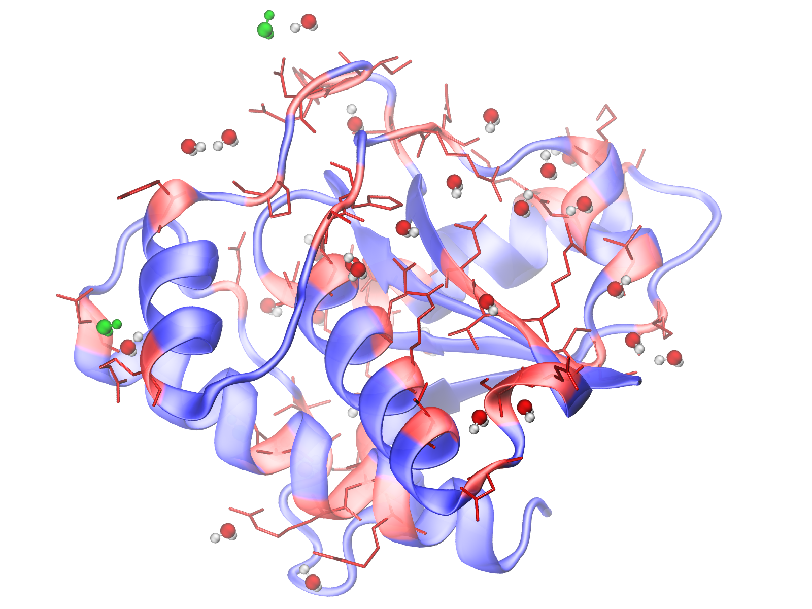
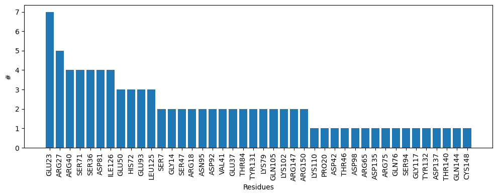

.. _watfinder_tutorial:

Water bridges detection in a single PDB structure
===============================================================================

Water bridges prediction
-------------------------------------------------------------------------------

To analyze the structure we need to parse a structure **addH_5kqm.pdb**
using :func:`.parsePDB`:

.. ipython:: python
   :verbatim:

   atoms = parsePDB(filename2)

.. parsed-literal::

   @> 2815 atoms and 1 coordinate set(s) were parsed in 0.03s.

Before analysis, we can verify the number of water molecules present in our PDB
structure and later compare how many of them contributed meaningfully to protein stability.

.. ipython:: python
   :verbatim:

   water_molecules = atoms.select('water')
   len(water_molecules)

.. parsed-literal::

   363

Subsequently, we can utilize :func:`.calcWaterBridges` along with one of two
methods for detecting water bridges: *'chain'* or *'cluster'*.

1. **Method 'chain' (default)** which will detect water molecules between pairs of 
hydrophilic residues:

.. ipython:: python
   :verbatim:

   waterBridges_chain = calcWaterBridges(atoms)

.. parsed-literal::

   @> 45 water bridges detected.
   @> SER7 OG_21 A ARG40 NH1_285 A 4.900955519079926 1 ['A_1289']
   @> SER7 OG_21 A LYS110 NZ_838 A 4.70722699686344 1 ['A_1316']
   @> GLY14 O_72 A GLU50 N_347 A 4.544135231262378 1 ['A_1274']
   @> GLY14 O_72 A SER47 O_328 A 5.288116583434976 1 ['A_1274']
   @> ARG18 NH2_105 A ASN95 ND2_714 A 4.570361692470302 1 ['A_1261']
   @> ARG18 NH2_105 A ASP92 OD1_690 A 5.373355841557489 1 ['A_1261']
   @> PRO20 O_115 A GLU23 OE1_139 A 4.571172934816621 1 ['A_1292']
   @> GLU23 OE1_139 A GLU23 OE2_140 A 2.206470711339718 1 ['A_1244']
   @> GLU23 OE1_139 A SER71 O_514 A 5.272447154784958 1 ['A_1244']
   @> GLU23 OE1_139 A HIS72 ND1_523 A 3.2114691342125647 1 ['A_1244']
   @> GLU23 OE2_140 A SER71 O_514 A 4.934310286149422 1 ['A_1244']
   @> GLU23 OE2_140 A HIS72 ND1_523 A 4.127239392136104 1 ['A_1244']
   @> ARG27 NE_171 A ARG27 NH2_174 A 2.298703982682415 1 ['A_1339']
   @> ARG27 NE_171 A VAL41 N_287 A 5.672199573357763 1 ['A_1339']
   @> ARG27 NH1_173 A SER71 N_511 A 6.128045528551498 1 ['A_1319']
   @> ARG27 NH2_174 A VAL41 N_287 A 4.642634596864156 1 ['A_1339']
   @> SER36 N_239 A SER36 OG_244 A 2.9687596736684503 1 ['A_1318']
   @> SER36 N_239 A GLU37 N_245 A 2.743692767056837 1 ['A_1318']
   @> SER36 OG_244 A GLU37 N_245 A 3.0545251676815504 1 ['A_1318']
   @> ARG40 NH2_286 A ASP42 OD2_301 A 5.163938516287738 1 ['A_1246']
   @> ARG40 NH2_286 A THR84 OG1_621 A 3.9229717052255175 1 ['A_1262']
   @> ARG40 NH2_286 A ASP81 OD1_598 A 4.365525627000715 1 ['A_1262']
   @> THR46 OG1_323 A ASP98 OD2_741 A 3.80450101853055 1 ['A_1313']
   @> SER47 O_328 A GLU50 N_347 A 5.10489901956934 1 ['A_1274']
   @> GLU50 OE2_355 A TYR131 OH_1009 A 5.157987010452818 1 ['A_1299']
   @> ARG65 NH2_473 A ASP135 O_1037 A 4.820906553751068 1 ['A_1267']
   @> SER71 O_514 A HIS72 ND1_523 A 4.463734423103597 1 ['A_1244']
   @> ARG75 NH1_548 A GLN76 O_553 A 3.303749082481901 1 ['A_1256']
   @> LYS79 NZ_582 A GLN105 NE2_800 A 3.8752885053889865 1 ['A_1249']
   @> LYS79 NZ_582 A LYS102 O_772 A 4.929221236666094 1 ['A_1249']
   @> ASP81 OD1_598 A ASP81 OD2_599 A 2.192005930648912 1 ['A_1239']
   @> ASP81 OD1_598 A THR84 OG1_621 A 4.415462942886057 1 ['A_1262']
   @> ASP92 OD1_690 A ASN95 ND2_714 A 3.3343465626716116 1 ['A_1261']
   @> GLU93 N_692 A SER94 N_701 A 2.720476612654481 1 ['A_1338']
   @> GLU93 O_695 A GLU93 OE2_700 A 4.362719106245552 1 ['A_1251']
   @> LYS102 O_772 A GLN105 NE2_800 A 4.2363221076778395 1 ['A_1249']
   @> GLY117 N_886 A LEU125 O_953 A 3.8595291163560352 1 ['A_1264']
   @> LEU125 N_950 A ILE126 N_958 A 2.9289776373335465 1 ['A_1325']
   @> LEU125 N_950 A ILE126 O_961 A 4.854966117286505 2 ['A_1325', 'A_1275']
   @> ILE126 N_958 A ILE126 O_961 A 2.8761442940158615 2 ['A_1325', 'A_1275']
   @> TYR131 N_998 A TYR132 N_1010 A 2.849420467393326 1 ['A_1298']
   @> ASP137 OD1_1054 A THR140 OG1_1081 A 5.251346017927213 1 ['A_1308']
   @> GLN144 NE2_1119 A CYS148 SG_1149 A 6.149862843999044 1 ['A_1278']
   @> ARG147 NE_1140 A ARG147 NH2_1143 A 2.278232867816633 1 ['A_1304']
   @> ARG150 NH1_1165 A ARG150 NH2_1166 A 2.3112059622629917 1 ['A_1328']

These results may vary slightly depending on the position of added hydrogen atoms.

2. **Method 'cluster'** which will detect water molecules between multiple hydrophilic 
residues:

.. ipython:: python
   :verbatim:

   waterBridges_cluster = calcWaterBridges(atoms, method='cluster')

.. parsed-literal::

   @> 45 water bridges detected.
   @> SER7 OG_21 A ARG40 NH1_285 A 4.900955519079926 1 ['A_1289']                                                                                                                                                       
   @> SER7 OG_21 A LYS110 NZ_838 A 4.70722699686344 1 ['A_1316']
   @> GLY14 O_72 A SER47 O_328 A GLU50 N_347 A 5.288116583434976 4.544135231262378 5.10489901956934 1 ['A_1274']
   @> ARG18 NH2_105 A ASN95 ND2_714 A ASP92 OD1_690 A 4.570361692470302 5.373355841557489 3.3343465626716116 2 ['A_1261', 'A_1300']
   @> PRO20 O_115 A GLU23 OE1_139 A 4.571172934816621 1 ['A_1292']
   @> SER71 O_514 A HIS72 ND1_523 A GLU23 OE2_140 A GLU23 OE1_139 A 4.463734423103597 4.934310286149422 5.272447154784958 4.127239392136104 3.2114691342125647 2.206470711339718 1 ['A_1244']
   @> SER71 O_514 A HIS72 ND1_523 A GLU23 OE2_140 A GLU23 OE1_139 A 4.463734423103597 4.934310286149422 5.272447154784958 4.127239392136104 3.2114691342125647 2.206470711339718 1 ['A_1244']
   @> ARG27 NE_171 A ARG27 NH2_174 A VAL41 N_287 A 2.298703982682415 5.672199573357763 4.642634596864156 1 ['A_1339']
   @> SER71 N_511 A ARG27 NH1_173 A 6.128045528551498 1 ['A_1319']
   @> SER36 N_239 A SER36 OG_244 A GLU37 N_245 A 2.9687596736684503 2.743692767056837 3.0545251676815504 2 ['A_1318', 'A_1277']
   @> SER36 N_239 A SER36 OG_244 A GLU37 N_245 A 2.9687596736684503 2.743692767056837 3.0545251676815504 2 ['A_1318', 'A_1277']
   @> SER7 OG_21 A ARG40 NH1_285 A 4.900955519079926 1 ['A_1289']
   @> ASP42 OD2_301 A ARG40 NH2_286 A 5.163938516287738 1 ['A_1246']
   @> ASP81 OD1_598 A THR84 OG1_621 A ARG40 NH2_286 A 4.415462942886057 4.365525627000715 3.9229717052255175 1 ['A_1262']
   @> ARG27 NE_171 A ARG27 NH2_174 A VAL41 N_287 A 2.298703982682415 5.672199573357763 4.642634596864156 1 ['A_1339']
   @> THR46 OG1_323 A ASP98 OD2_741 A 3.80450101853055 1 ['A_1313']
   @> GLY14 O_72 A SER47 O_328 A GLU50 N_347 A 5.288116583434976 4.544135231262378 5.10489901956934 1 ['A_1274']
   @> GLU50 OE2_355 A TYR131 OH_1009 A 5.157987010452818 1 ['A_1299']
   @> ARG65 NH2_473 A ASP135 O_1037 A 4.820906553751068 2 ['A_1267', 'A_1252']
   @> SER71 N_511 A ARG27 NH1_173 A 6.128045528551498 1 ['A_1319']
   @> SER71 O_514 A HIS72 ND1_523 A GLU23 OE2_140 A GLU23 OE1_139 A 4.463734423103597 4.934310286149422 5.272447154784958 4.127239392136104 3.2114691342125647 2.206470711339718 1 ['A_1244']
   @> GLN76 O_553 A ARG75 NH1_548 A 3.303749082481901 1 ['A_1256']
   @> GLN105 NE2_800 A LYS102 O_772 A LYS79 NZ_582 A 4.2363221076778395 3.8752885053889865 4.929221236666094 1 ['A_1249']
   @> ASP81 OD2_599 A ASP81 OD1_598 A 2.192005930648912 1 ['A_1239']
   @> ASP81 OD1_598 A THR84 OG1_621 A ARG40 NH2_286 A 4.415462942886057 4.365525627000715 3.9229717052255175 1 ['A_1262']
   @> ASP81 OD1_598 A THR84 OG1_621 A ARG40 NH2_286 A 4.415462942886057 4.365525627000715 3.9229717052255175 1 ['A_1262']
   @> ARG18 NH2_105 A ASN95 ND2_714 A ASP92 OD1_690 A 4.570361692470302 5.373355841557489 3.3343465626716116 2 ['A_1261', 'A_1300']
   @> GLU93 N_692 A SER94 N_701 A 2.720476612654481 1 ['A_1338']
   @> GLU93 OE2_700 A GLU93 O_695 A 4.362719106245552 1 ['A_1251']
   @> GLU93 N_692 A SER94 N_701 A 2.720476612654481 1 ['A_1338']
   @> ARG18 NH2_105 A ASN95 ND2_714 A ASP92 OD1_690 A 4.570361692470302 5.373355841557489 3.3343465626716116 2 ['A_1261', 'A_1300']
   @> THR46 OG1_323 A ASP98 OD2_741 A 3.80450101853055 1 ['A_1313']
   @> GLN105 NE2_800 A LYS102 O_772 A LYS79 NZ_582 A 4.2363221076778395 3.8752885053889865 4.929221236666094 1 ['A_1249']
   @> SER7 OG_21 A LYS110 NZ_838 A 4.70722699686344 1 ['A_1316']
   @> LEU125 O_953 A GLY117 N_886 A 3.8595291163560352 1 ['A_1264']
   @> ILE126 O_961 A LEU125 N_950 A ILE126 N_958 A 4.854966117286505 2.8761442940158615 2.9289776373335465 2 ['A_1325', 'A_1275']
   @> ILE126 O_961 A LEU125 N_950 A ILE126 N_958 A 4.854966117286505 2.8761442940158615 2.9289776373335465 2 ['A_1325', 'A_1275']
   @> TYR132 N_1010 A TYR131 N_998 A 2.849420467393326 1 ['A_1298']
   @> GLU50 OE2_355 A TYR131 OH_1009 A 5.157987010452818 1 ['A_1299']
   @> ARG65 NH2_473 A ASP135 O_1037 A 4.820906553751068 2 ['A_1267', 'A_1252']
   @> THR140 OG1_1081 A ASP137 OD1_1054 A 5.251346017927213 1 ['A_1308']
   @> CYS148 SG_1149 A GLN144 NE2_1119 A 6.149862843999044 1 ['A_1278']
   @> ARG147 NE_1140 A ARG147 NH2_1143 A 2.278232867816633 1 ['A_1304']
   @> CYS148 SG_1149 A GLN144 NE2_1119 A 6.149862843999044 1 ['A_1278']
   @> ARG150 NH1_1165 A ARG150 NH2_1166 A 2.3112059622629917 1 ['A_1328']

The *'chain' method* detected **42** water bridges, and the *'cluster' method* second **49**. 
The total number of water molecules in the crystal structure is **363**. As we can 
see, many of them are not significant for protein stability.

Save results in PDB file
-------------------------------------------------------------------------------

We can use :func:`.savePDBWaterBridges` to save the results in a PDB file.
The file will contain water molecules that are forming associations with protein
structure. Residues involved in water bridging can be displayed using the occupancy
column in any graphical visualization tool.

.. ipython:: python
   :verbatim:

   savePDBWaterBridges(waterBridges_cluster, atoms, filename2[:-4]+'_wb_cluster.pdb')
   savePDBWaterBridges(waterBridges_chain, atoms, filename2[:-4]+'_wb_chain.pdb')

.. parsed-literal::
   :verbatim:

   addH_5kqm_wb_chain.pdb

The results can be displayed in VMD_ program. Below we can see a comparison between
results obtained by 'chain' vs. 'cluster' (additional molecules are shown in
green) method.

Access to the raw data
-------------------------------------------------------------------------------

To have access to the raw data, we need to include an 
additional parameter *ouput='info'* in :func:`.calcWaterBridges`.

The atomic output can also be transformed to this 
detailed information using :func:`.getWaterBridgesInfoOutput`.

.. ipython:: python
   :verbatim:

   waterBridges_cluster = calcWaterBridges(atoms, method='cluster', output='info')
   waterBridges_cluster

.. parsed-literal::

   [['SER7',
     'OG_21',
     'A',
     'ARG40',
     'NH1_285',
     'A',
     4.900955519079926,
     1,
     ['A_1289']],
    ['SER7',
     'OG_21',
     'A',
     'LYS110',
     'NZ_838',
     'A',
     4.70722699686344,
     1,
     ['A_1316']],
    ['GLY14',
     'O_72',
     'A',
     'SER47',
     'O_328',
     'A',
     'GLU50',
     'N_347',
     'A',
     5.288116583434976,
     4.544135231262378,
     5.10489901956934,
     1,
     ['A_1274']],
    ['ARG18',
     'NH2_105',
     'A',
     'ASN95',
     'ND2_714',
     'A',
     'ASP92',
     'OD1_690',
     'A',
     4.570361692470302,
     5.373355841557489,
     3.3343465626716116,
     2,
     ['A_1261', 'A_1300']],
    ['PRO20',
     'O_115',
     'A',
     'GLU23',
     'OE1_139',
     'A',
     4.571172934816621,
     1,
     ['A_1292']],
    ['SER71',
     'O_514',
     'A',
     'HIS72',
     'ND1_523',
     'A',
     'GLU23',
     'OE2_140',
     'A',
     'GLU23',
     'OE1_139',
     'A',
     4.463734423103597,
     4.934310286149422,
     5.272447154784958,
     4.127239392136104,
     3.2114691342125647,
     2.206470711339718,
     1,
     ['A_1244']],
     ..
     ..

The distances are between combinations of protein atoms. 2 atoms gives 1 distance, 
3 atoms gives 3 distances, 4 atoms gives 6 distances, etc.

.. ipython:: python
   :verbatim:

   waterBridges_chain = calcWaterBridges(atoms, output='info')

.. parsed-literal::

   @> 45 water bridges detected.
   @> SER7 OG_21 A ARG40 NH1_285 A 4.900955519079926 1 ['A_1289']
   @> SER7 OG_21 A LYS110 NZ_838 A 4.70722699686344 1 ['A_1316']
   @> GLY14 O_72 A GLU50 N_347 A 4.544135231262378 1 ['A_1274']
   @> GLY14 O_72 A SER47 O_328 A 5.288116583434976 1 ['A_1274']
   @> ARG18 NH2_105 A ASN95 ND2_714 A 4.570361692470302 1 ['A_1261']
   @> ARG18 NH2_105 A ASP92 OD1_690 A 5.373355841557489 1 ['A_1261']
   @> PRO20 O_115 A GLU23 OE1_139 A 4.571172934816621 1 ['A_1292']
   @> GLU23 OE1_139 A GLU23 OE2_140 A 2.206470711339718 1 ['A_1244']
   @> GLU23 OE1_139 A SER71 O_514 A 5.272447154784958 1 ['A_1244']
   @> GLU23 OE1_139 A HIS72 ND1_523 A 3.2114691342125647 1 ['A_1244']
   @> GLU23 OE2_140 A SER71 O_514 A 4.934310286149422 1 ['A_1244']
   @> GLU23 OE2_140 A HIS72 ND1_523 A 4.127239392136104 1 ['A_1244']
   @> ARG27 NE_171 A ARG27 NH2_174 A 2.298703982682415 1 ['A_1339']
   @> ARG27 NE_171 A VAL41 N_287 A 5.672199573357763 1 ['A_1339']
   @> ARG27 NH1_173 A SER71 N_511 A 6.128045528551498 1 ['A_1319']
   @> ARG27 NH2_174 A VAL41 N_287 A 4.642634596864156 1 ['A_1339']
   @> SER36 N_239 A SER36 OG_244 A 2.9687596736684503 1 ['A_1318']
   @> SER36 N_239 A GLU37 N_245 A 2.743692767056837 1 ['A_1318']
   @> SER36 OG_244 A GLU37 N_245 A 3.0545251676815504 1 ['A_1318']
   @> ARG40 NH2_286 A ASP42 OD2_301 A 5.163938516287738 1 ['A_1246']
   @> ARG40 NH2_286 A THR84 OG1_621 A 3.9229717052255175 1 ['A_1262']
   @> ARG40 NH2_286 A ASP81 OD1_598 A 4.365525627000715 1 ['A_1262']
   @> THR46 OG1_323 A ASP98 OD2_741 A 3.80450101853055 1 ['A_1313']
   @> SER47 O_328 A GLU50 N_347 A 5.10489901956934 1 ['A_1274']
   @> GLU50 OE2_355 A TYR131 OH_1009 A 5.157987010452818 1 ['A_1299']
   @> ARG65 NH2_473 A ASP135 O_1037 A 4.820906553751068 1 ['A_1267']
   @> SER71 O_514 A HIS72 ND1_523 A 4.463734423103597 1 ['A_1244']
   @> ARG75 NH1_548 A GLN76 O_553 A 3.303749082481901 1 ['A_1256']
   @> LYS79 NZ_582 A GLN105 NE2_800 A 3.8752885053889865 1 ['A_1249']
   @> LYS79 NZ_582 A LYS102 O_772 A 4.929221236666094 1 ['A_1249']
   @> ASP81 OD1_598 A ASP81 OD2_599 A 2.192005930648912 1 ['A_1239']
   @> ASP81 OD1_598 A THR84 OG1_621 A 4.415462942886057 1 ['A_1262']
   @> ASP92 OD1_690 A ASN95 ND2_714 A 3.3343465626716116 1 ['A_1261']
   @> GLU93 N_692 A SER94 N_701 A 2.720476612654481 1 ['A_1338']
   @> GLU93 O_695 A GLU93 OE2_700 A 4.362719106245552 1 ['A_1251']
   @> LYS102 O_772 A GLN105 NE2_800 A 4.2363221076778395 1 ['A_1249']
   @> GLY117 N_886 A LEU125 O_953 A 3.8595291163560352 1 ['A_1264']
   @> LEU125 N_950 A ILE126 N_958 A 2.9289776373335465 1 ['A_1325']
   @> LEU125 N_950 A ILE126 O_961 A 4.854966117286505 2 ['A_1325', 'A_1275']
   @> ILE126 N_958 A ILE126 O_961 A 2.8761442940158615 2 ['A_1325', 'A_1275']
   @> TYR131 N_998 A TYR132 N_1010 A 2.849420467393326 1 ['A_1298']
   @> ASP137 OD1_1054 A THR140 OG1_1081 A 5.251346017927213 1 ['A_1308']
   @> GLN144 NE2_1119 A CYS148 SG_1149 A 6.149862843999044 1 ['A_1278']
   @> ARG147 NE_1140 A ARG147 NH2_1143 A 2.278232867816633 1 ['A_1304']
   @> ARG150 NH1_1165 A ARG150 NH2_1166 A 2.3112059622629917 1 ['A_1328']

We can check which residues are involved in water bridges using the code below. 
First, we need to extract residue names and display them without repetitions.

.. ipython:: python
   :verbatim:

   allresidues = []
   
   for i in waterBridges_chain:
       allresidues.append(i[0])
       allresidues.append(i[3])

   import numpy as np
   allresidues_once = np.unique(allresidues)    
   allresidues_once

.. parsed-literal::

   array(['ARG147', 'ARG150', 'ARG18', 'ARG27', 'ARG40', 'ARG65', 'ARG75',
          'ASN95', 'ASP135', 'ASP137', 'ASP42', 'ASP81', 'ASP92', 'ASP98',
          'CYS148', 'GLN105', 'GLN144', 'GLN76', 'GLU23', 'GLU37', 'GLU50',
          'GLU93', 'GLY117', 'GLY14', 'HIS72', 'ILE126', 'LEU125', 'LYS102',
          'LYS110', 'LYS79', 'PRO20', 'SER36', 'SER47', 'SER7', 'SER71',
          'SER94', 'THR140', 'THR46', 'THR84', 'TYR131', 'TYR132', 'VAL41'],
         dtype='<U6')

We can also count how many times each residue was involved in water bridges 
(with different waters) and display the number of counts as a histogram.

.. ipython:: python
   :verbatim:

   from collections import Counter
   aa_counter = Counter(allresidues)
   sorted_aa_counter = dict(sorted(aa_counter.items(), key=lambda item: item[1], reverse=True))
   sorted_aa_counter

.. parsed-literal::

   {'GLU23': 7,
    'ARG27': 5,
    'ARG40': 4,
    'SER71': 4,
    'SER36': 4,
    'ASP81': 4,
    'ILE126': 4,
    'GLU50': 3,
    'HIS72': 3,
    'GLU93': 3,
    'LEU125': 3,
    'SER7': 2,
    'GLY14': 2,
    'SER47': 2,
    'ARG18': 2,
    'ASN95': 2,
    'ASP92': 2,
    'VAL41': 2,
    'GLU37': 2,
    'THR84': 2,
    'TYR131': 2,
    'LYS79': 2,
    'GLN105': 2,
    'LYS102': 2,
    'ARG147': 2,
    'ARG150': 2,
    'LYS110': 1,
    'PRO20': 1,
    'ASP42': 1,
    'THR46': 1,
    'ASP98': 1,
    'ARG65': 1,
    'ASP135': 1,
    'ARG75': 1,
    'GLN76': 1,
    'SER94': 1,
    'GLY117': 1,
    'TYR132': 1,
    'ASP137': 1,
    'THR140': 1,
    'GLN144': 1,
    'CYS148': 1}

.. ipython:: python
   :verbatim:

   import matplotlib.pyplot as plt

   values = list(sorted_aa_counter.values())
   labels = list(sorted_aa_counter.keys())

   plt.figure(figsize=(10, 4))
   plt.bar(labels, values)
   plt.xticks(rotation=90)
   plt.xlabel('Residues')
   plt.ylabel('#')
   plt.tight_layout()
   plt.show()

Based on the results, we can see that there is one residue, GLU23, which 
often interacts with water molecules.

There are also options to save the output, which is especially important 
for trajectories. The information on how to do it you will find in that
particular section.
