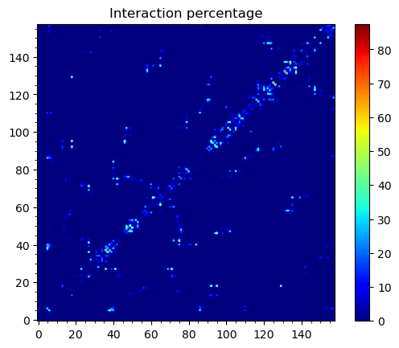
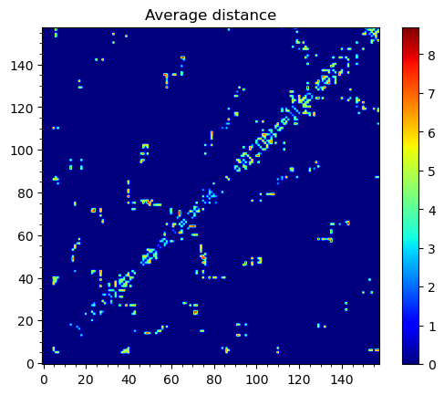
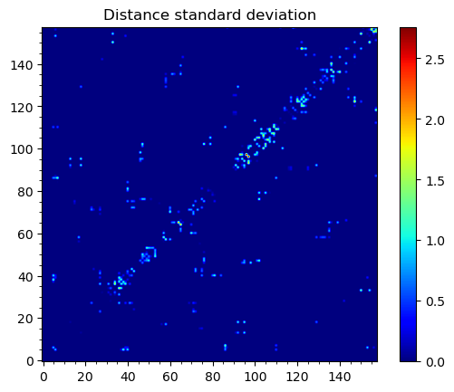
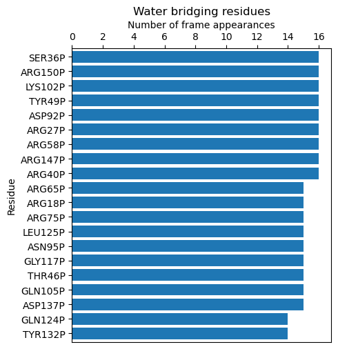
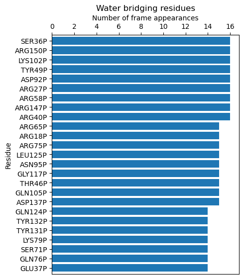
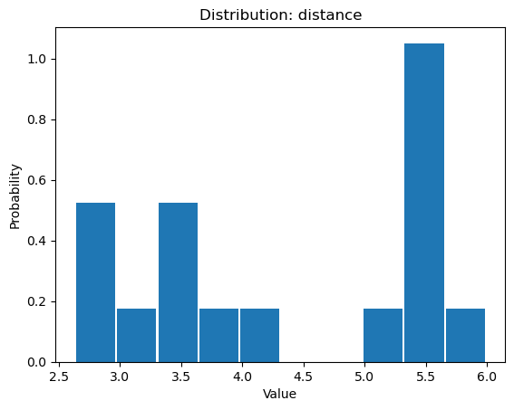
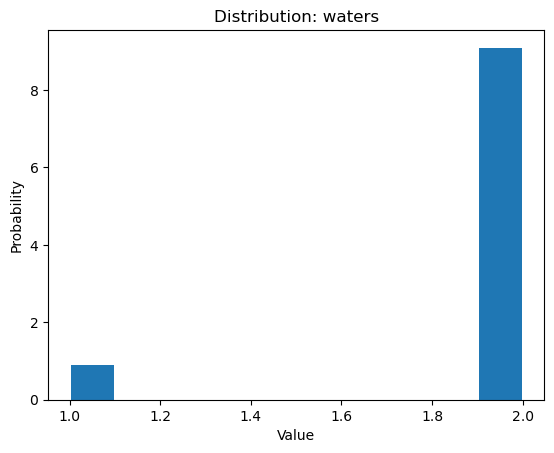
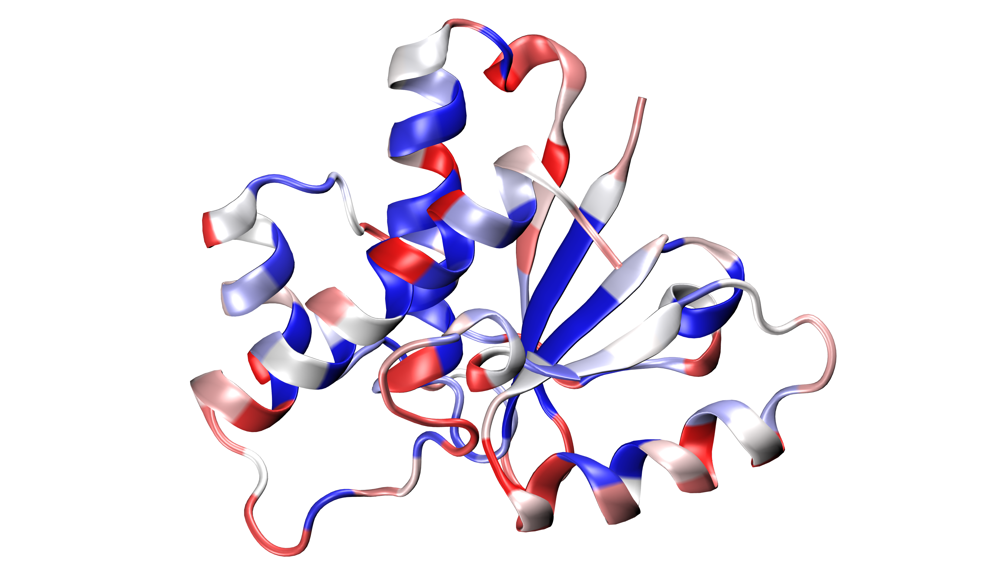

.. _watfinder_tutorial:

Water bridges detection in a trajectory
===============================================================================

Now, we will perform calculations for a trajectory file that was obtained
using the NAMD_ package. We will use :func:`.calcWaterBridgesTrajectory`, for which
we need to provide PDB and DCD files. 

The system (protein in a water box) can be found in :file:`5kqm_all_sci.pdb`. The
trajectory, :file:`NAMD_D2_sample.dcd`, has dcd format. If we want to analyze
trajectories with different formats, we need to convert them to ``dcd`` file
format or save the trajectory as a multi-model PDB (using VMD_ or another tool).

Parse structure with trajectory
-------------------------------------------------------------------------------

.. ipython:: python
   :verbatim:

   PDBtraj_file = "5kqm_all_sci.pdb"
   coords_traj = parsePDB(PDBtraj_file)
   trajectory = parseDCD("NAMD_D2_sample.dcd")

.. parsed-literal::

   @> 19321 atoms and 1 coordinate set(s) were parsed in 0.18s.
   @> DCD file contains 17 coordinate sets for 19321 atoms.
   @> DCD file was parsed in 0.01 seconds.
   @> 3.76 MB parsed at input rate 748.06 MB/s.
   @> 17 coordinate sets parsed at input rate 3382 frame/s.

The analysis od water bridges can be performed on selected frames by using 
``start_frame`` or ``stop_frame``. 

.. ipython:: python
   :verbatim:

   wb_traj = calcWaterBridgesTrajectory(coords_traj, trajectory, start_frame=5, 
                                        stop_frame=15, output='info')

.. parsed-literal::

   @> Frame: 5
   @> 101 water bridges detected.
   @> Frame: 6
   @> 107 water bridges detected.
   @> Frame: 7
   @> 90 water bridges detected.
   @> Frame: 8
   @> 97 water bridges detected.
   @> Frame: 9
   @> 122 water bridges detected.
   @> Frame: 10
   @> 101 water bridges detected.
   @> Frame: 11
   @> 130 water bridges detected.
   @> Frame: 12
   @> 132 water bridges detected.
   @> Frame: 13
   @> 126 water bridges detected.
   @> Frame: 14
   @> 88 water bridges detected.
   @> Frame: 15
   @> 105 water bridges detected.

Because of the amount of data, detailed results will not be displayed. 
We instead access the raw data by using ``output='info'``.

.. ipython:: python
   :verbatim:

   wb_traj

.. parsed-literal::

   [[['THR5',
      'OG1_8',
      'P',
      'TRP39',
      'NE1_547',
      'P',
      3.261452627054999,
      1,
      ['3W_13313']],
     ['THR5',
      'O_15',
      'P',
      'ASP86',
      'OD1_1269',
      'P',
      5.986350034086454,
      2,
      ['3W_12974', '3W_18431']],
     ['THR5',
      'O_15',
      'P',
      'LYS110',
      'NZ_1667',
      'P',
      7.375256709599827,
      2,
      ['3W_12974', '3W_18431']],
     ['THR5',
      'O_15',
      'P',
      'LYS6',
      'NZ_32',
      'P',
      6.414308925017051,
      2,
      ['3W_12974', '3W_12152']],
     ['LYS6',
      'NZ_32',
      'P',
      'TYR87',
      'OH_1286',
      'P',
      4.891713264838611,
      1,
      ['3W_9209']]
      ...
      ...
      ]]

Save the results
-------------------------------------------------------------------------------

The results can be saved using :func:`.saveWaterBridges` in two formats.
The ``txt`` file will contain all the results for analysis and can be visualized in a
text editor, and the ``wb`` file will restore data for further analysis. It can be
loaded using :func:`.parseWaterBridges` as shown below.

First, we have to return the calculation without ``output='info'``. 

We can suppress the logged output using :func:`.confProDy` to set the verbosity 
to ``'none'``.

.. ipython:: python
   :verbatim:

   confProDy(verbosity='none')
   wb_traj = calcWaterBridgesTrajectory(coords_traj, trajectory, 
                                        stop_frame=15)

.. ipython:: python
   :verbatim:

   saveWaterBridges(wb_traj,'wb_saved.txt')
   saveWaterBridges(wb_traj,'wb_saved.wb')

To load the ``wb`` file, use :func:`.parseWaterBridges` and protein coordinates 
as follows:

.. ipython:: python
   :verbatim:

   waterBridges = parseWaterBridges('wb_saved.wb', coords_traj)

Loaded results from a ``.wb`` file are :class:`.Atomic` type and therefore can be used for 
analysis later. 

Analysis of the results:
-------------------------------------------------------------------------------

Information about residues contributing to water bridges
-------------------------------------------------------------------------------

The data can be analyzed using :func:`.calcWaterBridgesStatistics`. The following
analysis provides details about the pairs of residues engaged in water bridges,
their frequency of occurrence, and the average distance between them. The standard
deviation offers insights into the variation in distance throughout the simulation.
Moreover, the analysis can be saved using the ``filename`` option.

We can recover logged output using :func:`.confProDy` again with a different verbosity.

.. ipython:: python
   :verbatim:

   confProDy(verbosity='debug')
   
   analysisAtomic = calcWaterBridgesStatistics(waterBridges, trajectory, 
                                               filename='data.txt')

.. parsed-literal::

   @> RES1           RES2           PERC      DIST_AVG  DIST_STD  
   @> ARG40P         SER7P          12.500    4.901     0.000     
   @> ASP92P         ARG18P         68.750    4.285     1.159     
   @> ASN95P         ARG18P         68.750    5.099     1.192     
   @> GLU23P         PRO20P         12.500    4.571     0.000     
   @> HSE72P         GLU23P         12.500    3.669     0.458     
   @> VAL41P         ARG27P         56.250    5.565     0.781     
   @> SER71P         ARG27P         75.000    6.116     0.445     
   @> ASN34P         ASP32P         25.000    4.218     0.652     
   @> GLU37P         SER36P         75.000    3.700     1.154     
   @> THR84P         ARG40P         50.000    4.235     0.671     
   @> ARG75P         ASP42P         68.750    3.159     0.652     
   @> ASN95P         THR46P         62.500    4.067     0.842     
   @> TYR49P         SER47P         50.000    4.320     0.757
   ..
   ..

The output is a dictionary, so we can use :meth:`dict.items()` 
to inspect it.

.. ipython:: python
   :verbatim:

   for item in list(analysisAtomic.items())[:5]:
      print(item)

.. parsed-literal::

   ((40, 7), {'percentage': 12.5, 'distAvg': 4.9006157, 'distStd': 0.0})
   ((7, 40), {'percentage': 12.5, 'distAvg': 4.9006157, 'distStd': 0.0})
   ((92, 18), {'percentage': 68.75, 'distAvg': 4.2853837, 'distStd': 1.159262})
   ((18, 92), {'percentage': 68.75, 'distAvg': 4.2853837, 'distStd': 1.159262})
   ((95, 18), {'percentage': 68.75, 'distAvg': 5.0986476, 'distStd': 1.1916962})

To have easier access to the data, we can use :func:`.getWaterBridgeStatInfo`.

.. ipython:: python
   :verbatim:
   
   wb_stat_info = getWaterBridgeStatInfo(analysisAtomic, coords_traj)
   wb_stat_info

.. parsed-literal::

   {('SER7P', 'ARG40P'): {'percentage': 12.5,
     'distAvg': 4.9006157,
     'distStd': 0.0},
    ('ARG18P', 'ASP92P'): {'percentage': 68.75,
     'distAvg': 4.2853837,
     'distStd': 1.159262},
    ('ARG18P', 'ASN95P'): {'percentage': 68.75,
     'distAvg': 5.0986476,
     'distStd': 1.1916962},
    ('PRO20P', 'GLU23P'): {'percentage': 12.5,
     'distAvg': 4.571081,
     'distStd': 0.0},
      ...
      ...

To obtain maps of interactions for the protein structure, we can use 
:func:`.showWaterBridgeMatrix`, which is equipped with three paramaters: 
``'percentage'`` (how often two residues were forming water bridges), 
``'distAvg'`` (how close there were on average), and ``'distStd'`` (how 
stable that water bridge was).

.. ipython:: python
   :verbatim:
   
   showWaterBridgeMatrix(analysisAtomic, 'percentage')

.. ipython:: python
   :verbatim:
   
   showWaterBridgeMatrix(analysisAtomic, 'distAvg')

.. ipython:: python
   :verbatim:   

   showWaterBridgeMatrix(analysisAtomic, 'distStd')

Raw data of the matrices can be obtained with :func:`.calcWaterBridgeMatrix`. 
The type of the data in the matrix can be selected using the following 
strings for the second argument: ``'percentage'``, ``'distAvg'``, ``'distStd'``.

.. ipython:: python
   :verbatim:

    M1 = calcWaterBridgeMatrix(analysisAtomic, 'percentage')
    M2 = calcWaterBridgeMatrix(analysisAtomic, 'distAvg')
    M3 = calcWaterBridgeMatrix(analysisAtomic, 'distStd')

.. ipython:: python
   :verbatim:

   M1

.. parsed-literal::

   array([[ 0.  ,  0.  ,  0.  , ...,  0.  ,  0.  ,  0.  ],
          [ 0.  ,  0.  ,  0.  , ...,  0.  ,  0.  ,  0.  ],
          [ 0.  ,  0.  ,  0.  , ...,  0.  ,  0.  ,  0.  ],
          ...,
          [ 0.  ,  0.  ,  0.  , ...,  0.  , 12.5 , 31.25],
          [ 0.  ,  0.  ,  0.  , ..., 12.5 ,  0.  , 12.5 ],
          [ 0.  ,  0.  ,  0.  , ..., 31.25, 12.5 ,  0.  ]])

.. ipython:: python
   :verbatim:

   M2

.. parsed-literal::

   array([[0.        , 0.        , 0.        , ..., 0.        , 0.        ,
           0.        ],
          [0.        , 0.        , 0.        , ..., 0.        , 0.        ,
           0.        ],
          [0.        , 0.        , 0.        , ..., 0.        , 0.        ,
           0.        ],
          ...,
          [0.        , 0.        , 0.        , ..., 0.        , 4.58851337,
           5.82083416],
          [0.        , 0.        , 0.        , ..., 4.58851337, 0.        ,
           3.52366138],
          [0.        , 0.        , 0.        , ..., 5.82083416, 3.52366138,
           0.        ]])

.. ipython:: python
   :verbatim:

   M3

.. parsed-literal::

   array([[0.        , 0.        , 0.        , ..., 0.        , 0.        ,
           0.        ],
          [0.        , 0.        , 0.        , ..., 0.        , 0.        ,
           0.        ],
          [0.        , 0.        , 0.        , ..., 0.        , 0.        ,
           0.        ],
          ...,
          [0.        , 0.        , 0.        , ..., 0.        , 1.71697354,
           1.38650537],
          [0.        , 0.        , 0.        , ..., 1.71697354, 0.        ,
           1.27207112],
          [0.        , 0.        , 0.        , ..., 1.38650537, 1.27207112,
           0.        ]])

Statistical analysis for water bridges
-------------------------------------------------------------------------------

To visualize the results in a more accessible way, we can use the
:func:`.calcBridgingResiduesHistogram` function, which will show how often each residue 
was contributing to the water bridges in the trajectory.

.. ipython:: python
   :verbatim:

   wb_res_hist = calcBridgingResiduesHistogram(waterBridges)
   wb_res_hist

.. parsed-literal::

   [('LEU96P', 1),
    ('MET63P', 1),
    ('PHE152P', 1),
    ('LEU29P', 1),
    ('PRO130P', 1),
    ('PHE85P', 1),
    ('PRO54P', 1),
    ('ILE16P', 1),
    ('CYS148P', 1),
    ('VAL25P', 1),
    ('ILE77P', 1),
    .
    .
    ('ARG75P', 15),
    ('ARG18P', 15),
    ('ARG65P', 15),
    ('ARG40P', 16),
    ('ARG147P', 16),
    ('ARG58P', 16),
    ('ARG27P', 16),
    ('ASP92P', 16),
    ('TYR49P', 16),
    ('LYS102P', 16),
    ('ARG150P', 16),
    ('SER36P', 16)]

The ``clip`` option can be used to include different number of results on the histogram.

.. ipython:: python
   :verbatim:    

    calcBridgingResiduesHistogram(waterBridges, clip=25)

If we are interested in one particular residue, we can also use
:func:`.calcWaterBridgesDistribution` to find their partners in water bridges. 
Below we can see results for arginine 147 or aspartic acid 92 from ``chain P``
using the nomenclature for them corresponding to the keys of the dictionary.

.. ipython:: python
   :verbatim:

    calcWaterBridgesDistribution(waterBridges, 'ARG147P')

.. parsed-literal::

   [('GLN122P', 8),
    ('ARG150P', 7),
    ('GLN143P', 6),
    ('LYS123P', 6),
    ('GLN124P', 5),
    ('ASP120P', 5),
    ('GLN144P', 3),
    ('THR140P', 2)]

.. ipython:: python
   :verbatim:

    calcWaterBridgesDistribution(waterBridges, 'ASP92P')

.. parsed-literal::

   [('ARG18P', 11),
    ('ASN95P', 10),
    ('SER94P', 5),
    ('MET91P', 5),
    ('ASP129P', 4),
    ('LEU13P', 3),
    ('CYS90P', 1)]

Once we select a pair of residues which are supported by interactions with water 
molecules, we can use :func:`.calcWaterBridgesDistribution` to obtain histograms 
with results such as distances between them ``(metric='distance')``, the number of 
water molecules which were involved ``(metric='waters')``, and information about 
residue part which was involved in water bridges, i.e. backbone or side chain 
``(metric='location')``. 

.. ipython:: python
   :verbatim:

   calcWaterBridgesDistribution(waterBridges,  'ASP92P', 'ARG18P', 
				trajectory=trajectory, metric='distance')

.. parsed-literal::

   [5.3736005,
    5.3736005,
    5.167575,
    2.681302,
    5.371548,
    2.6318514,
    3.0394073,
    4.0884595,
    5.4406505,
    3.4112484,
    2.805657,
    5.4176636,
    3.5104342,
    5.991175,
    5.470093,
    3.4345005,
    3.6427624]

.. ipython:: python
   :verbatim:

   calcWaterBridgesDistribution(waterBridges, 'ARG147P', 'GLN122P',
							metric='waters') 

.. parsed-literal::

   [2, 2, 2, 2, 2, 2, 2, 2, 1, 2, 2]

.. ipython:: python
   :verbatim:

   calcWaterBridgesDistribution(waterBridges, 'ARG147P', 'GLN122P', 
                                trajectory=trajectory, metric='location')

.. parsed-literal::

   {'ARG147P': {'backbone': 7, 'side': 86},
   'GLN122P': {'backbone': 21, 'side': 25}}

Save results as PDB file
-------------------------------------------------------------------------------

The results can be stored as a PDB file using :func:`.savePDBWaterBridges` 
(single PDB file, single frame) or using :func:`.savePDBWaterBridgesTrajectory`
to save all the results (large number of frames saved each independently).

``5kqm_all_sci_multi_0.pdb``  ``5kqm_all_sci_multi_1.pdb`` .. ``5kqm_all_sci_multi_15.pdb``

Those results can be displayed in any program for visualization. The results 
for the protein structure will be storage in the ``B-factor (*beta*) column`` (average values of 
contributions of each residue in water bridging) and ``Occupancy column`` 
(results for particular frame). Water molecules will be included in each frame.

.. ipython:: python
   :verbatim:

   savePDBWaterBridges(waterBridges[0], coords_traj, PDBtraj_file[:-4]+'_frame0.pdb')

   savePDBWaterBridgesTrajectory(waterBridges, coords_traj, 
                                 filename=PDBtraj_file[:-4]+'_multi.pdb', 
                                 trajectory=trajectory)

Results saved in PDB file can be displayed as follows:

